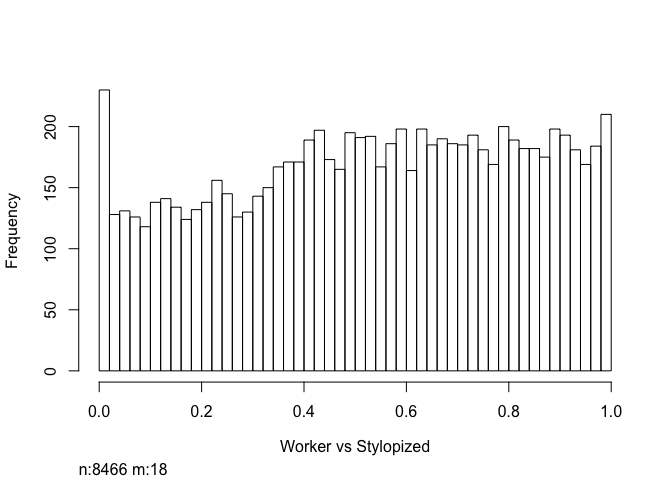

    ## Warning: package 'edgeR' was built under R version 3.3.2

    ## Warning: package 'limma' was built under R version 3.3.2

    ## [1] "Reading input files finished!"

    ## [1] 11511

    ## Disp = 0.08861 , BCV = 0.2977

    ##    [,1]
    ## -1  146
    ## 0  8179
    ## 1   159

    ##    [,1]
    ## -1    6
    ## 0  8433
    ## 1    45

    ##    [,1]
    ## -1   30
    ## 0  8394
    ## 1    60

    ## Warning: package 'DESeq2' was built under R version 3.3.2

    ## Warning: package 'S4Vectors' was built under R version 3.3.2

    ## Warning: package 'GenomicRanges' was built under R version 3.3.2

    ## Warning: package 'GenomeInfoDb' was built under R version 3.3.2

    ## Warning in DESeqDataSet(se, design = design, ignoreRank): some variables in
    ## design formula are characters, converting to factors

    ## class: DESeqDataSet 
    ## dim: 8484 14 
    ## metadata(1): version
    ## assays(3): counts mu cooks
    ## rownames(8484): PdomMRNA00001.1 PdomMRNA00002.1 ...
    ##   PdomMRNA11249.1 PdomMRNA11250.1
    ## rowData names(32): baseMean baseVar ... deviance maxCooks
    ## colnames(14): G1 G2 ... S3 S4
    ## colData names(3): colnames(wasps_table) Group sizeFactor

    ## [1] 2260
    ## [1] 606

    ## [1] 1595
    ## [1] 149

    ## [1] 733
    ## [1] 43

    ## [1] 1

    ## [1] 1

    ## [1] 1

    ## Warning: package 'ggplot2' was built under R version 3.3.2

