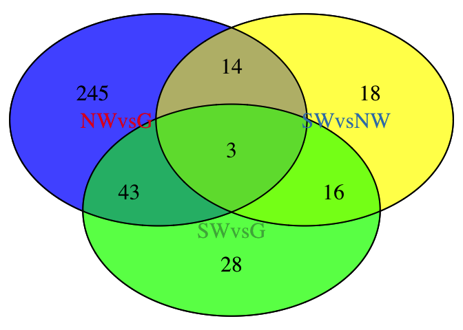
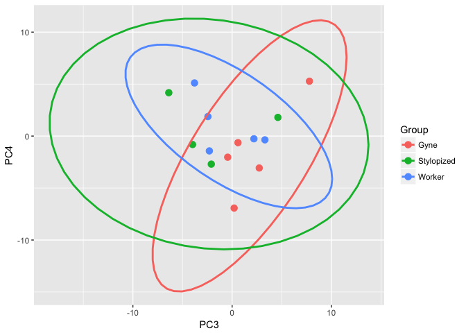
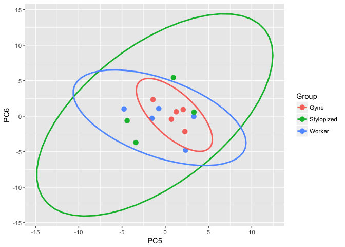

    source("functions.R")

    #source("http://bioconductor.org/biocLite.R")
    #biocLite("edgeR")
    library("edgeR")

    ## Warning: package 'edgeR' was built under R version 3.3.2

    ## Loading required package: limma

    ## Warning: package 'limma' was built under R version 3.3.2

    #citation("edgeR")

    # setwd("/path/to/your/current/dir")
    G1=read.table("BFAST-G1-r1.0.txt")
    G2=read.table("BFAST-G2-r1.0.txt")
    G3=read.table("BFAST-G3-r1.0.txt")
    G4=read.table("BFAST-G4-r1.0.txt")
    G5=read.table("BFAST-G5-r1.0.txt")
    S1=read.table("BFAST-S1-r1.0.txt")
    S2=read.table("BFAST-S2-r1.0.txt")
    S3=read.table("BFAST-S3-r1.0.txt")
    S4=read.table("BFAST-S4-r1.0.txt")
    NW1=read.table("BFAST-NW1-r1.0.txt")
    NW2=read.table("BFAST-NW2-r1.0.txt")
    NW3=read.table("BFAST-NW3-r1.0.txt")
    NW4=read.table("BFAST-NW4-r1.0.txt")
    NW5=read.table("BFAST-NW5-r1.0.txt")

    print( "Reading input files finished!")

    ## [1] "Reading input files finished!"

    ### creating input for edgeR
    wasps_table=cbind(G1,G2,G3,G4,G5,NW1,NW2,NW3,NW4,NW5,S1,S2,S3,S4)
    wasps_table=wasps_table[,c(1,2,4,6,8,10,12,14,16,18,20,22,24,26,28)]
    length(unique(rownames(wasps_table)))

    ## [1] 11511

    colnames(wasps_table)=c("gene_id","G1","G2","G3","G4","G5","NW1","NW2","NW3","NW4","NW5","S1","S2","S3","S4") ## set colnames
    replicates=c(rep("gyne",5),rep("normal",5),rep("stylopized",4))
    rownames(wasps_table)=wasps_table[,1]
    wasps_table=wasps_table[,-1]
    wasps_table=wasps_table[1:11506,]

    #filter<-function(df, min_count){
      #df = df[apply(df[, -1], MARGIN = 1, function(x) all(x >= min_count)), ]
      #return (df)
    #}

    #wasps_table=filter(wasps_table, 1)
    ### Runint edge for DE genes
    wasps_d=DGEList(count=wasps_table,group=replicates)
    cpm.wasps_d <- cpm(wasps_d)
    #cpm.wasps_d

    ###Filtering gene with low read counts. 
    wasps_d <- wasps_d[ rowSums(cpm.wasps_d>3) >=3,]
    wasps_d <- calcNormFactors(wasps_d,)
    wasps_table=wasps_d$count
    wasps_d <- estimateCommonDisp(wasps_d, verbose=TRUE)

    ## Disp = 0.08861 , BCV = 0.2977

    wasps_d <- estimateTagwiseDisp(wasps_d,verbose=TRUE)

    ## Using interpolation to estimate tagwise dispersion.

    #####DE number between Normal workers and queens
    wasps_et <- exactTest(wasps_d,pair=c(1,2))
    summary(decideTestsDGE(wasps_et, p.value=0.05))

    ##    [,1]
    ## -1  146
    ## 0  8179
    ## 1   159

    NWandG=topTags(wasps_et, n=305)

    ####DE number between number workers and stylopized workers
    wasps_et <- exactTest(wasps_d,pair=c(2,3))
    summary(decideTestsDGE(wasps_et, p.value=0.05))

    ##    [,1]
    ## -1    6
    ## 0  8433
    ## 1    45

    SandNW=topTags(wasps_et, n=51)

    ####DE number between queens and stylopized workers
    wasps_et <- exactTest(wasps_d,pair=c(1,3))
    summary(decideTestsDGE(wasps_et, p.value=0.05))

    ##    [,1]
    ## -1   30
    ## 0  8394
    ## 1    60

    SandG=topTags(wasps_et, n=90)

    #tab-delimited gene numbers
    #write.table(NWandG,file="SandNW.txt", quote=F, sep="\t")
    #write.table(SandG,file="SandG.txt", quote=F, sep="\t")
    #write.table(SandNW,file="SandNW.txt", quote=F, sep="\t")

    ##################
    ### Venn Diagram############
    ################
    require(VennDiagram)

    ## Loading required package: VennDiagram

    ## Loading required package: grid

    ## Loading required package: futile.logger

    require(RColorBrewer)

    ## Loading required package: RColorBrewer

    colors <- brewer.pal(3, "BuPu")
    cat.colors = brewer.pal(3,"Set1")
    venn.plot = draw.triple.venn(area1=305, 
                                 area2=51, 
                                 area3=90, 
                                 n12=length(intersect(rownames(SandNW), rownames(NWandG))), 
                                 n23=length(intersect(rownames(SandNW), rownames(SandG))), 
                                 n13=length(intersect(rownames(SandG), rownames(NWandG))), 
                                 n123=length(intersect(intersect(rownames(SandG), rownames(NWandG)),rownames(SandNW))),
                                 category=c("NWvsG", "SWvsNW", "SWvsG"), fill=colors, cex = 2,cat.default.pos="text", cat.cex=2, 
                                 cat.dist = -0.05, cat.col=cat.colors                
    )
    grid.draw(venn.plot)

    ### The rest of the code generated two excel files. 

    ### expressed_gene_lists.xlsx shows the everage reads counts for three groups: 
    ### Normal Workers (NW),  Stylopized Workers (SW) and Gynes(G)

    ### overall_DEG_list_addFDR.xlsx lists all differential expressed genes between the 3 comparisons
    ### NW <->SW,   SW <->G,  G<-> NW.

    colnames(wasps_table)=c("G","G","G","G","G","NW","NW","NW","NW","NW","S","S","S","S")
    t_table=t(wasps_table)### talbe transpose for using aggregate
    agg <- aggregate(x = t_table, by = list(rownames(t_table)), FUN = "mean", na.rm = T)#### average
    t_agg <- t(agg)##transpose back
    t_agg <-(t_agg[-1,])

    class(t_agg) <- "numeric"
    colnames(t_agg)=c("read_count(G)","read_count(NW)","read_count(S)") ### rename each column  
    ### need to change 
    SandG.list=t_agg[rownames(SandG),] #### in t_agg table pull out the DE genes between SandG
    SandG.table=SandG$table
    SandG.bind= cbind(SandG.list,SandG.table)
    SandG.new=SandG.bind

    colnames(SandG.new)[4:6]=c("logFD:NW vs G","logFD:S vs G","logFD:S vs NW")
    SandG.new["FDR:S vs G"]=NA
    SandG.new["FDR:S vs NW"]=NA
    colnames(SandG.new)[7]="FDR:NW vs G"
    SandG.new[,5]=SandG.new[,4]
    SandG.new[,c(4,6)]=NA
    SandG.new[,8]=SandG.new[,7]
    SandG.new[,c(7,9)]=NA

    NWandG.list=t_agg[rownames(NWandG),] #### in t_agg table pull out the DE genes between SandG
    NWandG.table=NWandG$table
    NWandG.bind= cbind(NWandG.list,NWandG.table)
    NWandG.new=NWandG.bind
    colnames(NWandG.new)[4:6]=c("logFD:NW vs G","logFD:S vs G","logFD:S vs NW")
    NWandG.new["FDR:S vs G"]=NA
    NWandG.new["FDR:S vs NW"]=NA
    colnames(NWandG.new)[7]="FDR:NW vs G"
    NWandG.new[,c(5,6)]=NA
    NWandG.new[,c(8,9)]=NA

    overlap1 = intersect(rownames(SandG), rownames(NWandG))
    overlap2 = intersect(rownames(SandNW), rownames(NWandG))

    NWandG.nonoverlap=NWandG.new[!rownames(NWandG.bind)%in%overlap1,]
    NWandG.overlap=NWandG.new[rownames(NWandG.bind)%in%overlap1,]
    names.overlap=rownames(NWandG.overlap)

    overall.table=SandG.new
    overall.table[names.overlap,4]=NWandG.overlap[,4]
    overall.table[names.overlap,7]=NWandG.overlap[,7]
    overall.table=rbind(overall.table,NWandG.nonoverlap)

    SandNW.list=t_agg[rownames(SandNW),] #### in t_agg table pull out the DE genes between SandG
    SandNW.table=SandNW$table
    SandNW.bind= cbind(SandNW.list,SandNW.table)
    SandNW.new=SandNW.bind
    colnames(SandNW.new)[4:6]=c("logFD:NW vs G","logFD:S vs G","logFD:S vs NW")
    SandNW.new["FDR:S vs G"]="NA"
    SandNW.new["FDR:S vs NW"]="NA"
    colnames(SandNW.new)[7]="FDR:NW vs G"

    SandNW.new[,6]=SandNW.new[,4]
    SandNW.new[,4:5]=NA
    SandNW.new[,9]=SandNW.new[,7]
    SandNW.new[,7:8]=NA

    SandNW.nonoverlap=SandNW.new[!rownames(SandNW.new)%in%overlap2,]
    SandNW.overlap=SandNW.new[rownames(SandNW.new)%in%overlap2,]
    names.overlap2=rownames(SandNW.overlap)
    overall.table[names.overlap2,6]=SandNW.overlap[,6]
    overall.table[names.overlap2,9]=SandNW.overlap[,9]
    overall.table=rbind(overall.table,SandNW.nonoverlap)

    ## rayna's
    colnames(wasps_table)=c("G1","G2","G3","G4","G5","W1","W2","W3","W4","W5","S1","S2","S3","S4")
    colData <- as.data.frame(colnames(wasps_table))
    colData$Group <- c("Gyne","Gyne","Gyne","Gyne","Gyne","Worker","Worker","Worker","Worker","Worker","Stylopized","Stylopized","Stylopized","Stylopized")
    rownames(colData) <- colData$`colnames(wasps_table)`

    library(DESeq2)

    ## Warning: package 'DESeq2' was built under R version 3.3.2

    ## Loading required package: S4Vectors

    ## Warning: package 'S4Vectors' was built under R version 3.3.2

    ## Loading required package: stats4

    ## Loading required package: BiocGenerics

    ## Loading required package: parallel

    ## 
    ## Attaching package: 'BiocGenerics'

    ## The following objects are masked from 'package:parallel':
    ## 
    ##     clusterApply, clusterApplyLB, clusterCall, clusterEvalQ,
    ##     clusterExport, clusterMap, parApply, parCapply, parLapply,
    ##     parLapplyLB, parRapply, parSapply, parSapplyLB

    ## The following object is masked from 'package:limma':
    ## 
    ##     plotMA

    ## The following objects are masked from 'package:stats':
    ## 
    ##     IQR, mad, xtabs

    ## The following objects are masked from 'package:base':
    ## 
    ##     anyDuplicated, append, as.data.frame, cbind, colnames,
    ##     do.call, duplicated, eval, evalq, Filter, Find, get, grep,
    ##     grepl, intersect, is.unsorted, lapply, lengths, Map, mapply,
    ##     match, mget, order, paste, pmax, pmax.int, pmin, pmin.int,
    ##     Position, rank, rbind, Reduce, rownames, sapply, setdiff,
    ##     sort, table, tapply, union, unique, unsplit, which, which.max,
    ##     which.min

    ## 
    ## Attaching package: 'S4Vectors'

    ## The following objects are masked from 'package:base':
    ## 
    ##     colMeans, colSums, expand.grid, rowMeans, rowSums

    ## Loading required package: IRanges

    ## Loading required package: GenomicRanges

    ## Warning: package 'GenomicRanges' was built under R version 3.3.2

    ## Loading required package: GenomeInfoDb

    ## Warning: package 'GenomeInfoDb' was built under R version 3.3.2

    ## Loading required package: SummarizedExperiment

    ## Loading required package: Biobase

    ## Welcome to Bioconductor
    ## 
    ##     Vignettes contain introductory material; view with
    ##     'browseVignettes()'. To cite Bioconductor, see
    ##     'citation("Biobase")', and for packages 'citation("pkgname")'.

    dds <- DESeqDataSetFromMatrix(countData = wasps_table,
                                  colData = colData,
                                  design = ~ Group)

    ## Warning in DESeqDataSet(se, design = design, ignoreRank): some variables in
    ## design formula are characters, converting to factors

    dds <- dds[ rowSums(counts(dds)) > 2, ] ## filter genes with 0 counts
    dds <- DESeq(dds) # Differential expression analysis

    ## estimating size factors

    ## estimating dispersions

    ## gene-wise dispersion estimates

    ## mean-dispersion relationship

    ## final dispersion estimates

    ## fitting model and testing

    dds

    ## class: DESeqDataSet 
    ## dim: 8484 14 
    ## metadata(1): version
    ## assays(3): counts mu cooks
    ## rownames(8484): PdomMRNA00001.1 PdomMRNA00002.1 ...
    ##   PdomMRNA11249.1 PdomMRNA11250.1
    ## rowData names(32): baseMean baseVar ... deviance maxCooks
    ## colnames(14): G1 G2 ... S3 S4
    ## colData names(3): colnames(wasps_table) Group sizeFactor

    ## log transformed data
    rld <- rlog(dds, blind=FALSE)

    ## contrast DEGS
    contrast1 <- resvals(contrastvector = c('Group', 'Gyne', 'Worker'), mypval = 0.1)

    ## [1] 2260
    ## [1] 606

    contrast2 <- resvals(contrastvector = c('Group', 'Gyne', 'Stylopized'), mypval = 0.1)

    ## [1] 1595
    ## [1] 149

    contrast3 <- resvals(contrastvector = c('Group', 'Worker', 'Stylopized'), mypval = 0.1)

    ## [1] 733
    ## [1] 43

    myhistogram(contrastvector = c('Group', 'Gyne', 'Worker'), mypval = 0.1)

    ## [1] 1

    myhistogram(contrastvector = c('Group', 'Gyne', 'Stylopized'), mypval = 0.1)

    ## [1] 1

    myhistogram(contrastvector = c('Group', 'Worker', 'Stylopized'), mypval = 0.1)

    ## [1] 1

    rldpvals <- assay(rld)
    rldpvals <- cbind(rldpvals, contrast1, contrast2, contrast3)
    rldpvals <- as.data.frame(rldpvals)
    rldpvals <- rldpvals[ , grepl( "padj|pval" , names( rldpvals ) ) ]
    venn1 <- row.names(rldpvals[rldpvals[2] <0.1 & !is.na(rldpvals[2]),])
    venn2 <- row.names(rldpvals[rldpvals[4] <0.1 & !is.na(rldpvals[4]),])
    venn3 <- row.names(rldpvals[rldpvals[6] <0.1 & !is.na(rldpvals[6]),])
    venn12 <- union(venn1,venn2)
    venn123 <- union(venn12,venn3)
    candidates <- list("Gyne-Worker" = venn1, "Gyne-Stylopized" = venn2,"Worker-Stylopized" = venn3)

    prettyvenn <- venn.diagram(
      scaled=T,
      x = candidates, filename=NULL, 
      col = "black",
      fill = c( "blue", "yellow", "green"),
      alpha = 0.5,
      cex = 1, fontfamily = "sans", #fontface = "bold",
      cat.default.pos = "text",
      cat.dist = c(0.08, 0.08, 0.08), cat.pos = 1,
      cat.cex = 1, cat.fontfamily = "sans")
    #dev.off()
    grid.draw(prettyvenn)

    #heatmap
    library(dplyr)

    ## 
    ## Attaching package: 'dplyr'

    ## The following object is masked from 'package:Biobase':
    ## 
    ##     combine

    ## The following objects are masked from 'package:GenomicRanges':
    ## 
    ##     intersect, setdiff, union

    ## The following object is masked from 'package:GenomeInfoDb':
    ## 
    ##     intersect

    ## The following objects are masked from 'package:IRanges':
    ## 
    ##     collapse, desc, intersect, regroup, setdiff, slice, union

    ## The following objects are masked from 'package:S4Vectors':
    ## 
    ##     first, intersect, rename, setdiff, setequal, union

    ## The following objects are masked from 'package:BiocGenerics':
    ## 
    ##     combine, intersect, setdiff, union

    ## The following objects are masked from 'package:stats':
    ## 
    ##     filter, lag

    ## The following objects are masked from 'package:base':
    ## 
    ##     intersect, setdiff, setequal, union

    library(pheatmap)
    DEGes <- assay(rld)
    DEGes <- cbind(DEGes, contrast1, contrast2, contrast3)
    DEGes <- as.data.frame(DEGes) # convert matrix to dataframe
    DEGes$rownames <- rownames(DEGes)  # add the rownames to the dataframe
    DEGes$padjmin <- with(DEGes, pmin(padjGroupGyneWorker, padjGroupGyneStylopized ,padjGroupWorkerStylopized)) # put the min pvalue in a new column
    DEGes <- DEGes %>% filter(padjmin < 0.1)
    rownames(DEGes) <- DEGes$rownames
    drop.cols <-colnames(DEGes[,grep("padj|pval|rownames", colnames(DEGes))])
    DEGes <- DEGes %>% select(-one_of(drop.cols))
    DEGes <- as.matrix(DEGes)
    DEGes <- DEGes - rowMeans(DEGes)
    paletteLength <- 30
    colorpalette <-  colorRampPalette(c("Deep Sky Blue 3", "white", "red"))( 30 )
    myBreaks <- c(seq(min(DEGes), 0, length.out=ceiling(paletteLength/2) + 1), 
                  seq(max(DEGes)/paletteLength, max(DEGes), length.out=floor(paletteLength/2)))

    pheatmap(DEGes, show_colnames=T, show_rownames = F,
             treeheight_row = 0, treeheight_col = 25,
             fontsize = 12, fontsize_row = 7, 
             #cellwidth = 10, 
             border_color = "grey60" ,
             color = colorpalette,
             clustering_distance_cols="correlation" ,
             breaks=myBreaks,
             clustering_method="average"
    )

    ## pca
    library(genefilter)
    library(ggplot2)

    ## Warning: package 'ggplot2' was built under R version 3.3.2

    pcadata <- pcadataframe(rld, intgroup=c("Group"), returnData=TRUE)
    percentVar <- round(100 * attr(pcadata, "percentVar"))

    ggplot(pcadata, aes(x=PC1,y=PC3, color=Group)) + geom_point(size=3) +
      stat_ellipse(level = 0.95, (aes(color=Group)), size=1) 

    ggplot(pcadata, aes(x=PC2,y=PC3, color=Group)) + geom_point(size=3) +
      stat_ellipse(level = 0.95, (aes(color=Group)), size=1) 

    ggplot(pcadata, aes(x=PC3,y=PC4, color=Group)) + geom_point(size=3) +
      stat_ellipse(level = 0.95, (aes(color=Group)), size=1) 

    ggplot(pcadata, aes(x=PC4,y=PC5, color=Group)) + geom_point(size=3) +
      stat_ellipse(level = 0.95, (aes(color=Group)), size=1) 

