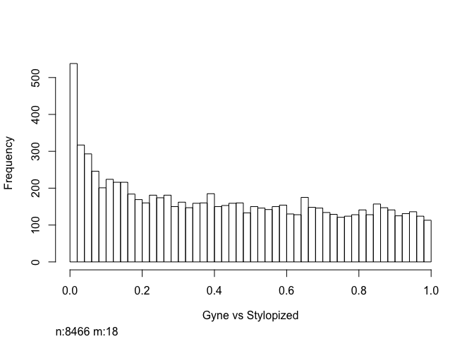
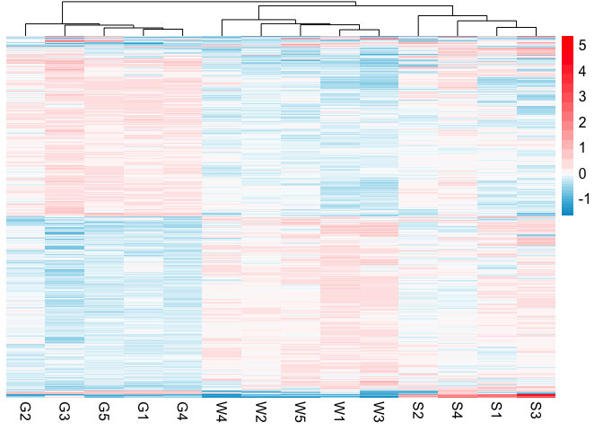

    source("functions.R")

    #source("http://bioconductor.org/biocLite.R")
    #biocLite("edgeR")
    library("edgeR")

    ## Warning: package 'edgeR' was built under R version 3.3.2

    ## Loading required package: limma

    ## Warning: package 'limma' was built under R version 3.3.2

    #citation("edgeR")

    # setwd("/path/to/your/current/dir")
    G1=read.table("BFAST-G1-r1.0.txt")
    G2=read.table("BFAST-G2-r1.0.txt")
    G3=read.table("BFAST-G3-r1.0.txt")
    G4=read.table("BFAST-G4-r1.0.txt")
    G5=read.table("BFAST-G5-r1.0.txt")
    S1=read.table("BFAST-S1-r1.0.txt")
    S2=read.table("BFAST-S2-r1.0.txt")
    S3=read.table("BFAST-S3-r1.0.txt")
    S4=read.table("BFAST-S4-r1.0.txt")
    NW1=read.table("BFAST-NW1-r1.0.txt")
    NW2=read.table("BFAST-NW2-r1.0.txt")
    NW3=read.table("BFAST-NW3-r1.0.txt")
    NW4=read.table("BFAST-NW4-r1.0.txt")
    NW5=read.table("BFAST-NW5-r1.0.txt")

    print( "Reading input files finished!")

    ## [1] "Reading input files finished!"

    ### creating input for edgeR
    wasps_table=cbind(G1,G2,G3,G4,G5,NW1,NW2,NW3,NW4,NW5,S1,S2,S3,S4)
    wasps_table=wasps_table[,c(1,2,4,6,8,10,12,14,16,18,20,22,24,26,28)]
    length(unique(rownames(wasps_table)))

    ## [1] 11511

    colnames(wasps_table)=c("gene_id","G1","G2","G3","G4","G5","NW1","NW2","NW3","NW4","NW5","S1","S2","S3","S4") ## set colnames
    replicates=c(rep("gyne",5),rep("normal",5),rep("stylopized",4))
    rownames(wasps_table)=wasps_table[,1]
    wasps_table=wasps_table[,-1]
    wasps_table=wasps_table[1:11506,]

    #filter<-function(df, min_count){
      #df = df[apply(df[, -1], MARGIN = 1, function(x) all(x >= min_count)), ]
      #return (df)
    #}

    #wasps_table=filter(wasps_table, 1)
    ### Runint edge for DE genes
    wasps_d=DGEList(count=wasps_table,group=replicates)
    cpm.wasps_d <- cpm(wasps_d)
    cpm.wasps_d

    ##                           G1           G2           G3           G4
    ## PdomMRNA00001.1 6.895255e+01 9.432118e+01 7.312261e+01 1.416602e+02
    ## PdomMRNA00002.1 3.380452e+00 3.144039e+00 7.599115e+00 2.933281e+00
    ## PdomMRNA00003.1 5.408723e+01 6.464530e+01 1.037204e+02 5.619247e+01
    ## PdomMRNA00004.1 2.331645e+02 2.996783e+02 2.134295e+02 2.448427e+02
    ## PdomMRNA00005.1 3.569411e+02 2.993895e+02 2.758831e+02 2.734854e+02
    ## PdomMRNA00006.1 1.120316e+02 1.622388e+02 1.704517e+02 1.805981e+02
    ## PdomMRNA00007.1 9.746536e+02 8.808764e+02 7.891002e+02 8.384009e+02
    ## PdomMRNA00008.1 4.225565e+01 2.929090e+01 2.883638e+01 4.923312e+01
    ## PdomMRNA00009.1 3.290740e+02 3.092066e+02 2.726623e+02 3.056364e+02
    ## PdomMRNA00010.1 2.262302e+01 3.339740e+01 3.089971e+01 4.451686e+01
    ## PdomMRNA00011.1 5.387054e+01 6.371492e+01 4.272615e+01 5.044094e+01
    ## PdomMRNA00012.1 1.213496e+00 1.700348e+00 5.032527e-02 1.265337e+00
    ## PdomMRNA00013.1 1.126817e+00 2.694891e+00 4.931876e+00 2.243098e+00
    ## PdomMRNA00014.1 1.222163e+01 1.033042e+01 1.967718e+01 1.253834e+01
    ## PdomMRNA00015.1 1.048807e+01 7.828016e+00 6.290658e+00 7.476992e+00
    ## PdomMRNA00016.1 1.732265e+02 1.569453e+02 1.168553e+02 2.149348e+02
    ## PdomMRNA00017.1 5.443394e+01 4.632646e+01 5.545844e+01 4.267637e+01
    ## PdomMRNA00018.1 9.316179e+02 7.124778e+02 7.225199e+02 8.568633e+02
    ## PdomMRNA00019.1 4.204762e+02 4.739800e+02 5.350079e+02 4.433856e+02
    ## PdomMRNA00020.1 0.000000e+00 3.208203e-02 0.000000e+00 0.000000e+00
    ## PdomMRNA00021.1 5.694761e+01 6.570401e+01 5.108015e+01 7.839339e+01
    ## PdomMRNA00021.2 5.634087e-01 2.245742e-01 0.000000e+00 1.150306e-01
    ## PdomMRNA00022.1 5.421725e+01 6.349035e+01 7.463237e+01 5.366180e+01
    ## PdomMRNA00023.1 2.474664e+01 3.371822e+01 3.326500e+01 2.047546e+01
    ## PdomMRNA00024.1 5.200695e-01 3.849844e-01 1.912360e+00 5.751532e-02
    ## PdomMRNA00025.1 2.600348e-01 4.812305e-01 3.522769e-01 5.751532e-02
    ## PdomMRNA00026.1 8.017739e+00 1.357070e+01 1.021603e+01 7.361961e+00
    ## PdomMRNA00027.1 1.197027e+02 9.489866e+01 9.053516e+01 1.160659e+02
    ## PdomMRNA00028.1 3.509169e+02 5.642588e+02 4.132711e+02 2.469708e+02
    ## PdomMRNA00029.1 0.000000e+00 0.000000e+00 0.000000e+00 0.000000e+00
    ## PdomMRNA00030.1 2.756368e+01 4.148207e+01 2.989321e+01 3.054064e+01
    ## PdomMRNA00031.1 2.535339e+01 2.175162e+01 2.033141e+01 2.847008e+01
    ## PdomMRNA00032.1 6.197495e+00 6.480571e+00 1.685896e+01 6.614262e+00
    ## PdomMRNA00033.1 5.677426e+00 8.373411e+00 3.522769e+00 9.087421e+00
    ## PdomMRNA00034.1 2.600348e-01 6.416407e-02 5.032527e-02 3.450919e-01
    ## PdomMRNA00035.1 1.386852e+00 1.604102e-01 0.000000e+00 3.450919e-01
    ## PdomMRNA00036.1 1.023670e+02 1.093997e+02 1.202271e+02 1.341257e+02
    ## PdomMRNA00037.1 3.337980e+02 4.283593e+02 3.953553e+02 4.049654e+02
    ## PdomMRNA00038.1 1.109482e+01 5.614356e+00 1.811710e+00 6.901839e+00
    ## PdomMRNA00039.1 8.537808e+00 7.090130e+00 9.410825e+00 3.623465e+00
    ## PdomMRNA00040.1 1.321843e+01 8.982970e+00 8.504970e+00 6.096624e+00
    ## PdomMRNA00041.1 6.414191e+00 9.560446e+00 1.243034e+01 4.543711e+00
    ## PdomMRNA00042.1 1.170156e+00 1.411610e+00 0.000000e+00 4.026073e-01
    ## PdomMRNA00043.1 2.036939e+00 2.085332e+00 9.058548e-01 2.645705e+00
    ## PdomMRNA00044.1 3.510469e+00 5.229372e+00 3.774395e+00 3.968557e+00
    ## PdomMRNA00045.1 8.234434e+00 6.673063e+00 2.918866e+00 4.888802e+00
    ## PdomMRNA00046.1 4.723965e+00 8.084673e+00 5.535779e+00 3.968557e+00
    ## PdomMRNA00047.1 2.583012e+01 2.877758e+01 8.806922e+00 1.587423e+01
    ## PdomMRNA00048.1 1.066143e+01 5.518110e+00 1.132319e+01 9.605059e+00
    ## PdomMRNA00049.1 1.760002e+02 1.757775e+02 1.340665e+02 1.889954e+02
    ## PdomMRNA00050.1 7.571346e+01 8.957304e+01 6.386276e+01 8.029139e+01
    ## PdomMRNA00051.1 1.252501e+02 1.847925e+02 1.808690e+02 1.839915e+02
    ## PdomMRNA00052.1 1.920790e+02 2.163292e+02 2.246017e+02 2.011886e+02
    ## PdomMRNA00053.1 3.467130e-01 6.416407e-02 0.000000e+00 0.000000e+00
    ## PdomMRNA00054.1 9.881321e+00 1.029833e+01 4.126672e+00 1.023773e+01
    ## PdomMRNA00055.1 1.457061e+02 1.853058e+02 1.736725e+02 1.615030e+02
    ## PdomMRNA00056.1 7.446095e+02 7.507196e+02 5.046115e+02 7.271662e+02
    ## PdomMRNA00057.1 5.460730e+00 3.946090e+00 9.108873e+00 4.716256e+00
    ## PdomMRNA00058.1 9.062211e+01 1.016038e+02 9.763102e+01 9.444016e+01
    ## PdomMRNA00059.1 3.419457e+01 1.985878e+01 2.269670e+01 2.616947e+01
    ## PdomMRNA00060.1 2.505002e+01 3.512983e+01 3.452313e+01 3.289876e+01
    ## PdomMRNA00061.1 1.733565e+00 1.219117e+00 1.363815e+01 6.901839e-01
    ## PdomMRNA00062.1 1.997934e+01 2.409361e+01 2.088499e+01 2.910275e+01
    ## PdomMRNA00063.1 8.667825e-02 1.604102e+00 1.006505e-01 8.627298e-01
    ## PdomMRNA00064.1 2.474664e+01 2.505607e+01 2.944028e+01 2.340874e+01
    ## PdomMRNA00065.1 3.163756e+00 5.999340e+00 4.529274e+00 2.358128e+00
    ## PdomMRNA00066.1 1.096480e+01 1.209493e+01 6.844236e+00 1.029524e+01
    ## PdomMRNA00067.1 5.824779e+01 5.688145e+01 4.267583e+01 6.125382e+01
    ## PdomMRNA00068.1 3.900521e-01 1.122871e+00 4.579599e+00 1.092791e+00
    ## PdomMRNA00069.1 1.386852e+00 2.566563e-01 3.522769e-01 6.901839e-01
    ## PdomMRNA00070.1 1.771704e+02 1.774137e+02 1.251086e+02 1.612155e+02
    ## PdomMRNA00071.1 5.421725e+01 6.910470e+01 7.513562e+01 8.713571e+01
    ## PdomMRNA00072.1 6.089147e+01 8.164878e+01 4.594697e+01 6.194400e+01
    ## PdomMRNA00073.1 2.629818e+02 2.694891e+02 2.636038e+02 2.216065e+02
    ## PdomMRNA00074.1 4.173991e+02 4.077947e+02 5.323407e+02 4.079562e+02
    ## PdomMRNA00075.1 2.854748e+02 2.029830e+02 3.261077e+02 3.017254e+02
    ## PdomMRNA00076.1 3.878852e+01 3.532232e+01 3.568061e+01 4.187116e+01
    ## PdomMRNA00077.1 1.820243e+01 2.239326e+01 2.138824e+01 2.501917e+01
    ## PdomMRNA00078.1 1.034938e+02 1.307664e+02 1.167043e+02 1.123274e+02
    ## PdomMRNA00079.1 1.546340e+02 1.577153e+02 1.375390e+02 1.768596e+02
    ## PdomMRNA00080.1 7.276639e+01 7.205625e+01 6.980115e+01 8.477759e+01
    ## PdomMRNA00081.1 0.000000e+00 1.924922e-01 0.000000e+00 0.000000e+00
    ## PdomMRNA00082.1 3.033739e-01 1.924922e-01 3.019516e-01 2.300613e-01
    ## PdomMRNA00083.1 0.000000e+00 0.000000e+00 0.000000e+00 0.000000e+00
    ## PdomMRNA00084.1 1.339179e+01 1.392360e+01 1.509758e+01 5.348925e+00
    ## PdomMRNA00085.1 2.028271e+01 2.390112e+01 1.982816e+01 2.030291e+01
    ## PdomMRNA00086.1 4.984000e+00 5.710602e+00 1.122253e+01 3.911042e+00
    ## PdomMRNA00087.1 5.599415e+01 4.254078e+01 6.330919e+01 6.666026e+01
    ## PdomMRNA00088.1 2.517137e+02 2.210452e+02 2.875586e+02 2.692292e+02
    ## PdomMRNA00089.1 9.248570e+01 1.034966e+02 8.983060e+01 1.081288e+02
    ## PdomMRNA00090.1 3.481432e+02 2.853697e+02 2.334589e+02 3.228335e+02
    ## PdomMRNA00091.1 2.461662e+01 1.369903e+01 2.345157e+01 2.202837e+01
    ## PdomMRNA00092.1 1.603548e+01 1.719597e+01 2.994353e+01 1.667944e+01
    ## PdomMRNA00093.1 3.007735e+02 3.035923e+02 3.230882e+02 2.944209e+02
    ## PdomMRNA00094.1 3.293774e+00 3.625270e+00 2.616914e+00 6.211655e+00
    ## PdomMRNA00095.1 2.617683e+01 3.111957e+01 1.766417e+01 2.628450e+01
    ## PdomMRNA00096.1 5.083680e+01 6.284871e+01 8.761629e+01 8.345473e+01
    ## PdomMRNA00097.1 6.006803e+01 6.294495e+01 7.095863e+01 7.419477e+01
    ## PdomMRNA00098.1 7.016605e+01 7.006716e+01 2.118694e+01 7.402222e+01
    ## PdomMRNA00099.1 8.667825e-02 4.170664e-01 0.000000e+00 1.150306e-01
    ## PdomMRNA00100.1 8.667825e-02 4.491485e-01 0.000000e+00 0.000000e+00
    ## PdomMRNA00101.1 0.000000e+00 2.566563e-01 3.220817e+00 2.300613e-01
    ## PdomMRNA00102.1 3.597148e+00 6.191833e+00 5.032527e-02 5.348925e+00
    ## PdomMRNA00103.1 5.759770e+01 6.118044e+01 7.272001e+01 5.786042e+01
    ## PdomMRNA00104.1 4.112883e+01 4.786640e+01 4.639990e+01 3.945551e+01
    ## PdomMRNA00105.1 1.993600e+00 3.849844e-01 2.818215e+00 9.202452e-01
    ## PdomMRNA00106.1 3.627485e+01 3.679809e+01 3.940468e+01 3.531441e+01
    ## PdomMRNA00107.1 3.319777e+01 2.874550e+01 1.851970e+01 2.605444e+01
    ## PdomMRNA00108.1 2.817043e+00 2.887383e+00 9.058548e-01 3.623465e+00
    ## PdomMRNA00109.1 1.711896e+01 2.332364e+01 2.632011e+01 1.150306e+01
    ## PdomMRNA00110.1 3.757502e+01 3.766431e+01 2.546459e+01 3.542944e+01
    ## PdomMRNA00111.1 0.000000e+00 9.624610e-02 0.000000e+00 0.000000e+00
    ## PdomMRNA00112.1 0.000000e+00 0.000000e+00 0.000000e+00 0.000000e+00
    ## PdomMRNA00113.1 0.000000e+00 6.416407e-02 0.000000e+00 0.000000e+00
    ## PdomMRNA00114.1 5.781440e+01 8.443991e+01 7.916165e+01 6.694784e+01
    ## PdomMRNA00115.1 6.570212e+01 8.751979e+01 9.868785e+01 8.167176e+01
    ## PdomMRNA00116.1 3.259969e+02 1.779590e+02 1.915883e+02 3.247890e+02
    ## PdomMRNA00117.1 7.801043e-01 9.945431e-01 0.000000e+00 4.601226e-01
    ## PdomMRNA00118.1 6.938594e+01 5.328826e+01 4.106542e+01 8.995397e+01
    ## PdomMRNA00119.1 5.938327e+02 5.150450e+02 6.106468e+02 5.796394e+02
    ## PdomMRNA00120.1 5.677426e+00 6.833473e+00 9.612126e+00 6.441716e+00
    ## PdomMRNA00121.1 1.897820e+02 1.473849e+02 2.200221e+02 1.648964e+02
    ## PdomMRNA00122.1 1.469196e+01 7.122212e+00 7.397814e+00 6.901839e+00
    ## PdomMRNA00123.1 3.831179e+01 2.377279e+01 3.628452e+01 2.950536e+01
    ## PdomMRNA00124.1 8.667825e-01 2.245742e-01 1.197741e+01 1.092791e+00
    ## PdomMRNA00125.1 7.835714e+01 3.089500e+01 1.690929e+01 6.056364e+01
    ## PdomMRNA00126.1 8.702497e+01 7.882556e+01 4.176997e+01 9.179446e+01
    ## PdomMRNA00127.1 1.456195e+01 2.226493e+01 1.645636e+01 1.472392e+01
    ## PdomMRNA00128.1 4.178325e+02 3.061909e+02 5.453749e+02 4.700152e+02
    ## PdomMRNA00129.1 4.767304e-01 6.095587e-01 2.113661e+00 3.450919e-01
    ## PdomMRNA00130.1 3.302008e+02 2.517477e+02 3.315429e+02 1.662193e+02
    ## PdomMRNA00131.1 0.000000e+00 9.624610e-02 0.000000e+00 0.000000e+00
    ## PdomMRNA00132.1 1.118149e+01 7.988427e+00 3.870013e+01 2.760736e+00
    ## PdomMRNA00133.1 3.601481e+01 5.380157e+01 5.888056e+01 4.164109e+01
    ## PdomMRNA00134.1 1.763902e+01 1.963421e+01 1.927458e+01 1.535659e+01
    ## PdomMRNA00135.1 5.720765e+00 7.025966e+00 1.087026e+01 6.384201e+00
    ## PdomMRNA00136.1 2.903722e+00 4.523567e+00 4.931876e+00 5.866563e+00
    ## PdomMRNA00137.1 0.000000e+00 3.849844e-01 5.032527e-02 0.000000e+00
    ## PdomMRNA00138.1 0.000000e+00 0.000000e+00 0.000000e+00 0.000000e+00
    ## PdomMRNA00139.1 4.377252e+00 1.700348e+00 0.000000e+00 2.760736e+00
    ## PdomMRNA00140.1 4.117217e+00 7.699688e-01 0.000000e+00 2.300613e+00
    ## PdomMRNA00141.1 0.000000e+00 0.000000e+00 0.000000e+00 0.000000e+00
    ## PdomMRNA00142.1 0.000000e+00 4.491485e-01 0.000000e+00 4.026073e-01
    ## PdomMRNA00143.1 5.720765e+00 3.817762e+00 3.019516e+00 7.476992e+00
    ## PdomMRNA00144.1 6.240834e+00 9.335872e+00 6.693261e+00 6.844323e+00
    ## PdomMRNA00145.1 3.506135e+01 4.398447e+01 6.486927e+01 6.562498e+01
    ## PdomMRNA00146.1 7.150956e+00 5.614356e+00 8.857247e+00 7.994630e+00
    ## PdomMRNA00146.2 2.635019e+01 2.056458e+01 1.363815e+01 2.939033e+01
    ## PdomMRNA00146.3 0.000000e+00 0.000000e+00 0.000000e+00 0.000000e+00
    ## PdomMRNA00147.1 5.200695e-01 2.726973e+00 6.542285e-01 1.725460e-01
    ## PdomMRNA00148.1 6.067478e-01 8.662149e-01 3.321468e+00 2.875766e-01
    ## PdomMRNA00149.1 8.667825e-02 3.208203e-02 5.032527e-02 5.176379e-01
    ## PdomMRNA00150.1 1.820243e+01 1.353862e+01 1.363815e+01 2.001533e+01
    ## PdomMRNA00151.1 0.000000e+00 0.000000e+00 0.000000e+00 2.875766e-01
    ## PdomMRNA00152.1 6.362184e+01 7.657982e+01 8.510003e+01 6.677529e+01
    ## PdomMRNA00153.1 4.320911e+01 5.521318e+01 3.019516e+01 4.342407e+01
    ## PdomMRNA00154.1 5.326379e+01 6.025006e+01 1.120240e+02 6.027606e+01
    ## PdomMRNA00155.1 4.767304e+00 5.357700e+00 3.019516e-01 5.521471e+00
    ## PdomMRNA00156.1 6.058810e+01 7.343578e+01 5.490487e+01 5.699769e+01
    ## PdomMRNA00157.1 4.429259e+01 5.194081e+01 2.762857e+01 5.475459e+01
    ## PdomMRNA00158.1 1.161055e+02 1.293868e+02 7.015342e+01 1.038727e+02
    ## PdomMRNA00159.1 8.377453e+01 9.130547e+01 5.455259e+01 8.218940e+01
    ## PdomMRNA00160.1 1.920357e+02 1.569453e+02 2.282754e+02 1.866947e+02
    ## PdomMRNA00161.1 1.031471e+01 4.716059e+00 1.338652e+01 5.176379e+00
    ## PdomMRNA00162.1 1.360849e+01 1.398777e+01 1.358782e+01 7.131900e+00
    ## PdomMRNA00163.1 5.404389e+01 6.361867e+01 5.817601e+01 5.717023e+01
    ## PdomMRNA00164.1 7.410991e+00 1.055499e+01 6.089357e+00 1.351610e+01
    ## PdomMRNA00165.1 3.467130e-01 6.416407e-02 0.000000e+00 2.875766e-01
    ## PdomMRNA00166.1 1.290639e+02 1.428292e+02 1.401559e+02 1.172737e+02
    ## PdomMRNA00167.1 1.670290e+02 1.136666e+02 1.328084e+02 1.446510e+02
    ## PdomMRNA00168.1 1.764336e+02 1.892198e+02 1.989358e+02 1.524731e+02
    ## PdomMRNA00169.1 1.963262e+01 3.259535e+01 2.078434e+01 2.110812e+01
    ## PdomMRNA00170.1 1.435392e+02 1.984595e+02 1.923935e+02 1.594900e+02
    ## PdomMRNA00171.1 3.757502e+01 5.040088e+01 5.279121e+01 3.485429e+01
    ## PdomMRNA00172.1 8.537808e+01 8.771228e+01 4.816128e+01 8.610044e+01
    ## PdomMRNA00173.1 1.006768e+02 8.363786e+01 1.049282e+02 1.007093e+02
    ## PdomMRNA00174.1 5.270038e+01 7.394909e+01 7.604148e+01 3.347392e+01
    ## PdomMRNA00175.1 1.879185e+02 1.760341e+02 1.852473e+02 2.130368e+02
    ## PdomMRNA00176.1 2.552675e+01 3.285200e+01 2.938996e+01 2.243098e+01
    ## PdomMRNA00177.1 3.566810e+01 4.481860e+01 4.866453e+01 4.123849e+01
    ## PdomMRNA00178.1 9.317912e+00 1.392360e+01 2.023076e+01 1.110046e+01
    ## PdomMRNA00179.1 0.000000e+00 9.624610e-02 0.000000e+00 0.000000e+00
    ## PdomMRNA00180.1 1.300174e-01 6.416407e-02 1.509758e-01 0.000000e+00
    ## PdomMRNA00181.1 9.534608e-01 2.155913e+01 2.616914e+00 2.818251e+00
    ## PdomMRNA00182.1 0.000000e+00 3.529024e-01 2.566589e+00 5.751532e-02
    ## PdomMRNA00183.1 1.221297e+02 1.344558e+02 1.322548e+02 1.307898e+02
    ## PdomMRNA00184.1 2.416156e+02 2.382733e+02 1.874616e+02 2.696893e+02
    ## PdomMRNA00185.1 1.850581e+01 2.476733e+01 1.122253e+01 2.059049e+01
    ## PdomMRNA00186.1 5.911457e+01 7.991635e+01 4.921811e+01 6.499232e+01
    ## PdomMRNA00187.1 8.399123e+01 7.446240e+01 9.123971e+01 8.736578e+01
    ## PdomMRNA00188.1 0.000000e+00 2.245742e+00 0.000000e+00 4.601226e-01
    ## PdomMRNA00189.1 0.000000e+00 2.566563e-01 0.000000e+00 0.000000e+00
    ## PdomMRNA00190.1 0.000000e+00 6.416407e-02 0.000000e+00 0.000000e+00
    ## PdomMRNA00191.1 0.000000e+00 1.283281e-01 0.000000e+00 5.751532e-02
    ## PdomMRNA00192.1 5.413057e+01 8.456824e+01 6.944887e+01 5.671011e+01
    ## PdomMRNA00193.1 1.252934e+02 6.762893e+01 9.174296e+01 7.891102e+01
    ## PdomMRNA00194.1 2.166956e-01 1.315363e+00 2.314962e+00 4.026073e-01
    ## PdomMRNA00195.1 1.681558e+01 3.419945e+01 2.013011e+01 2.639953e+01
    ## PdomMRNA00196.1 1.161489e+01 1.504647e+01 2.013011e+01 1.265337e+01
    ## PdomMRNA00197.1 2.093280e+01 2.534481e+01 2.491101e+01 1.932515e+01
    ## PdomMRNA00198.1 1.898254e+01 2.489566e+01 2.108629e+01 1.409125e+01
    ## PdomMRNA00199.1 2.609015e+01 2.540897e+01 8.001718e+00 2.432898e+01
    ## PdomMRNA00200.1 8.537808e+00 3.038169e+01 5.012397e+01 5.486962e+01
    ## PdomMRNA00201.1 1.820243e+00 3.849844e-01 0.000000e+00 1.150306e+00
    ## PdomMRNA00202.1 0.000000e+00 1.604102e-01 0.000000e+00 2.875766e-01
    ## PdomMRNA00203.1 0.000000e+00 0.000000e+00 0.000000e+00 0.000000e+00
    ## PdomMRNA00204.1 0.000000e+00 0.000000e+00 0.000000e+00 5.751532e-02
    ## PdomMRNA00205.1 1.226497e+01 1.469357e+01 2.018043e+01 1.357362e+01
    ## PdomMRNA00206.1 1.053141e+01 1.206284e+01 1.348717e+01 1.161810e+01
    ## PdomMRNA00207.1 5.179026e+01 5.072170e+01 2.647109e+01 4.906057e+01
    ## PdomMRNA00208.1 3.341447e+01 4.100084e+01 2.974223e+01 3.847775e+01
    ## PdomMRNA00209.1 1.138952e+02 1.295473e+02 1.189186e+02 1.546012e+02
    ## PdomMRNA00210.1 3.285106e+01 2.980421e+01 6.074260e+01 4.112346e+01
    ## PdomMRNA00211.1 7.757704e+00 4.170664e+00 4.730575e+00 8.052145e+00
    ## PdomMRNA00212.1 1.321843e+01 1.668266e+01 2.360255e+01 1.380368e+01
    ## PdomMRNA00213.1 2.600348e-01 2.887383e-01 5.032527e-02 2.875766e-01
    ## PdomMRNA00214.1 4.433593e+01 3.782472e+01 5.555910e+01 6.574001e+01
    ## PdomMRNA00215.1 8.667825e-01 3.529024e-01 0.000000e+00 5.751532e-01
    ## PdomMRNA00216.1 1.126817e+00 9.303790e-01 2.013011e-01 1.955521e+00
    ## PdomMRNA00217.1 3.033739e-01 0.000000e+00 0.000000e+00 0.000000e+00
    ## PdomMRNA00218.1 0.000000e+00 3.208203e-02 0.000000e+00 0.000000e+00
    ## PdomMRNA00219.1 1.733565e-01 2.566563e-01 0.000000e+00 0.000000e+00
    ## PdomMRNA00220.1 4.138887e+01 4.651895e+01 3.034614e+01 3.761502e+01
    ## PdomMRNA00221.1 1.083478e+00 2.759055e+00 8.454645e+00 5.118864e+00
    ## PdomMRNA00222.1 3.900521e-01 0.000000e+00 5.032527e-02 1.725460e-01
    ## PdomMRNA00223.1 2.166956e-01 8.982970e-01 5.535779e-01 1.322852e+00
    ## PdomMRNA00224.1 0.000000e+00 0.000000e+00 0.000000e+00 0.000000e+00
    ## PdomMRNA00225.1 8.217099e+01 8.206584e+01 8.842149e+01 7.321701e+01
    ## PdomMRNA00226.1 3.042407e+01 3.750390e+01 4.624892e+01 2.657208e+01
    ## PdomMRNA00227.1 2.990400e+01 3.201787e+01 5.535779e+00 2.484662e+01
    ## PdomMRNA00228.1 5.469831e+02 4.141791e+02 4.934896e+02 7.822659e+02
    ## PdomMRNA00229.1 3.198428e+01 3.429569e+01 2.058303e+01 3.617714e+01
    ## PdomMRNA00230.1 6.197495e+01 6.089170e+01 3.759297e+01 4.537959e+01
    ## PdomMRNA00231.1 1.406355e+02 1.845038e+02 1.764404e+02 1.237730e+02
    ## PdomMRNA00232.1 2.600348e+01 2.996462e+01 2.118694e+01 2.530674e+01
    ## PdomMRNA00233.1 9.070879e+01 2.175804e+02 9.425419e+02 3.652223e+02
    ## PdomMRNA00234.1 2.166956e-01 4.170664e-01 1.107156e+00 6.326686e-01
    ## PdomMRNA00235.1 1.658588e+02 1.577474e+02 2.426181e+02 2.003259e+02
    ## PdomMRNA00236.1 1.880918e+01 3.265951e+01 1.917393e+01 2.191334e+01
    ## PdomMRNA00237.1 2.166956e-01 1.283281e-01 1.006505e-01 5.751532e-02
    ## PdomMRNA00238.1 2.426991e+01 1.889632e+01 3.079906e+01 2.582438e+01
    ## PdomMRNA00239.1 9.300577e+01 1.078598e+02 7.453172e+01 9.282973e+01
    ## PdomMRNA00240.1 6.544208e+01 8.771228e+01 7.221676e+01 6.804063e+01
    ## PdomMRNA00241.1 1.287172e+01 1.559187e+01 1.862035e+01 9.202452e+00
    ## PdomMRNA00242.1 1.505168e+02 1.353220e+02 1.890217e+02 1.536234e+02
    ## PdomMRNA00243.1 6.604883e+01 6.705145e+01 6.320854e+01 7.333204e+01
    ## PdomMRNA00244.1 4.411923e+01 5.704186e+01 4.544372e+01 6.338189e+01
    ## PdomMRNA00245.1 1.646887e+00 9.624610e-02 0.000000e+00 5.176379e-01
    ## PdomMRNA00246.1 2.903722e+00 4.202747e+00 1.444335e+01 3.508435e+00
    ## PdomMRNA00247.1 1.111649e+02 1.359637e+02 8.474775e+01 1.021472e+02
    ## PdomMRNA00248.1 4.355582e+01 5.684937e+01 5.948447e+01 4.290643e+01
    ## PdomMRNA00249.1 2.110615e+01 3.403904e+01 2.163986e+01 2.306364e+01
    ## PdomMRNA00250.1 2.791040e+01 1.976253e+01 1.328587e+01 2.754984e+01
    ## PdomMRNA00251.1 4.333913e-01 1.668266e+00 0.000000e+00 1.035276e+00
    ## PdomMRNA00252.1 6.544208e+00 5.614356e+00 4.026021e-01 1.552914e+00
    ## PdomMRNA00253.1 9.876987e+01 9.608569e+01 7.755124e+01 1.139379e+02
    ## PdomMRNA00254.1 3.298108e+01 3.561106e+01 2.028108e+01 3.289876e+01
    ## PdomMRNA00255.1 1.226497e+01 1.074748e+01 2.153921e+01 8.684814e+00
    ## PdomMRNA00256.1 0.000000e+00 0.000000e+00 0.000000e+00 0.000000e+00
    ## PdomMRNA00257.1 1.386852e+00 1.764512e+00 0.000000e+00 1.150306e-01
    ## PdomMRNA00258.1 5.634087e-01 8.341329e-01 4.026021e+00 1.552914e+00
    ## PdomMRNA00259.1 4.333913e-02 4.812305e-01 3.824720e+00 5.751532e-02
    ## PdomMRNA00260.1 1.560209e+00 1.860758e+00 0.000000e+00 6.326686e-01
    ## PdomMRNA00261.1 1.730531e+02 2.498870e+02 2.203743e+02 1.921012e+02
    ## PdomMRNA00262.1 1.989266e+01 2.422194e+01 4.020989e+01 2.444401e+01
    ## PdomMRNA00263.1 1.549807e+02 1.876799e+02 1.117724e+02 1.255560e+02
    ## PdomMRNA00264.1 6.136820e+01 7.263373e+01 4.967104e+01 5.699769e+01
    ## PdomMRNA00265.1 2.114949e+01 2.226493e+01 1.736222e+01 3.077070e+01
    ## PdomMRNA00266.1 1.787739e+02 2.439839e+02 2.397496e+02 1.921587e+02
    ## PdomMRNA00267.1 8.594149e+01 9.518740e+01 1.508248e+02 1.154333e+02
    ## PdomMRNA00268.1 6.227833e+01 1.038495e+02 1.034184e+02 8.259200e+01
    ## PdomMRNA00269.1 2.873384e+01 3.333323e+01 2.048238e+01 2.910275e+01
    ## PdomMRNA00270.1 4.147554e+01 5.184457e+01 5.802503e+01 3.703987e+01
    ## PdomMRNA00271.1 4.223398e+02 3.063193e+02 1.919406e+02 3.923695e+02
    ## PdomMRNA00272.1 2.054275e+01 2.483149e+01 2.647109e+01 2.047546e+01
    ## PdomMRNA00273.1 2.183425e+02 2.580358e+02 3.637007e+02 2.704370e+02
    ## PdomMRNA00274.1 7.293975e+01 8.225834e+01 7.815514e+01 7.908357e+01
    ## PdomMRNA00275.1 1.902588e+01 3.509775e+01 2.325027e+01 1.892254e+01
    ## PdomMRNA00276.1 2.374984e+01 4.597356e+01 5.032527e+01 2.921778e+01
    ## PdomMRNA00277.1 6.123819e+01 8.338121e+01 8.041978e+01 5.279907e+01
    ## PdomMRNA00278.1 1.733565e-01 1.251199e+00 1.711059e+00 3.680981e+00
    ## PdomMRNA00279.1 5.924459e+01 7.330745e+01 7.724929e+01 5.354677e+01
    ## PdomMRNA00280.1 1.043173e+02 1.253766e+02 1.100614e+02 1.206096e+02
    ## PdomMRNA00281.1 2.067276e+01 3.349364e+01 4.569534e+01 2.202837e+01
    ## PdomMRNA00282.1 1.365183e+01 1.844717e+01 1.177611e+01 1.282592e+01
    ## PdomMRNA00283.1 2.461662e+01 2.422194e+01 1.851970e+01 1.984279e+01
    ## PdomMRNA00284.1 1.898254e+01 2.675642e+01 2.757825e+01 2.329371e+01
    ## PdomMRNA00285.1 1.343513e+00 3.849844e-01 5.032527e-02 8.052145e-01
    ## PdomMRNA00286.1 2.036939e+00 3.240285e+00 0.000000e+00 2.128067e+00
    ## PdomMRNA00287.1 0.000000e+00 3.208203e-02 0.000000e+00 0.000000e+00
    ## PdomMRNA00288.1 2.730365e+00 3.978172e+00 2.969191e+00 4.428680e+00
    ## PdomMRNA00289.1 1.637786e+02 1.605064e+02 2.293826e+02 1.909509e+02
    ## PdomMRNA00290.1 6.500869e-01 8.982970e-01 3.774395e+00 0.000000e+00
    ## PdomMRNA00291.1 3.285106e+01 5.004797e+01 4.982201e+01 3.888036e+01
    ## PdomMRNA00292.1 0.000000e+00 0.000000e+00 0.000000e+00 0.000000e+00
    ## PdomMRNA00293.1 1.651221e+02 1.531276e+02 1.283798e+02 1.552339e+02
    ## PdomMRNA00294.1 7.922392e+01 9.884475e+01 9.581931e+01 8.943633e+01
    ## PdomMRNA00295.1 6.509104e+02 1.058803e+03 5.094477e+03 1.788957e+03
    ## PdomMRNA00296.1 1.992300e+02 1.360599e+02 1.190696e+02 1.995782e+02
    ## PdomMRNA00297.1 1.300174e-01 1.058707e+00 2.013011e-01 0.000000e+00
    ## PdomMRNA00298.1 3.687726e+02 4.092705e+02 4.719000e+02 4.129600e+02
    ## PdomMRNA00299.1 0.000000e+00 0.000000e+00 0.000000e+00 0.000000e+00
    ## PdomMRNA00300.1 9.989669e+01 9.955055e+01 1.016067e+02 8.190182e+01
    ## PdomMRNA00301.1 0.000000e+00 0.000000e+00 0.000000e+00 0.000000e+00
    ## PdomMRNA00302.1 2.166956e-01 6.416407e-02 0.000000e+00 5.751532e-02
    ## PdomMRNA00303.1 1.997934e+01 1.145329e+01 1.177611e+01 1.472392e+01
    ## PdomMRNA00304.1 2.166956e+00 3.785680e+00 3.019516e+00 2.703220e+00
    ## PdomMRNA00305.1 8.585481e+01 8.293206e+01 1.944568e+02 9.806363e+01
    ## PdomMRNA00306.1 1.675057e+02 2.246384e+02 1.119234e+02 1.924463e+02
    ## PdomMRNA00307.1 2.098481e+02 2.280070e+02 2.261114e+02 2.420820e+02
    ## PdomMRNA00308.1 1.008501e+02 9.342288e+01 1.247563e+02 1.064033e+02
    ## PdomMRNA00309.1 1.213496e+01 1.517480e+01 4.277648e+00 8.339722e+00
    ## PdomMRNA00310.1 0.000000e+00 0.000000e+00 0.000000e+00 0.000000e+00
    ## PdomMRNA00310.2 5.634087e-01 3.208203e-02 0.000000e+00 0.000000e+00
    ## PdomMRNA00310.3 0.000000e+00 6.416407e-02 0.000000e+00 0.000000e+00
    ## PdomMRNA00311.1 5.677426e+00 6.673063e+00 1.660734e+00 5.463956e+00
    ## PdomMRNA00312.1 9.694963e+01 9.258875e+01 1.270210e+02 8.696317e+01
    ## PdomMRNA00313.1 1.096913e+02 1.097526e+02 9.491345e+01 1.273389e+02
    ## PdomMRNA00314.1 3.571144e+01 3.118374e+01 3.568061e+01 4.020321e+01
    ## PdomMRNA00315.1 2.643687e+00 5.838930e+00 1.761384e+00 5.751532e+00
    ## PdomMRNA00316.1 1.369516e+01 9.688774e+00 1.801645e+01 9.777605e+00
    ## PdomMRNA00317.1 0.000000e+00 6.416407e-02 0.000000e+00 0.000000e+00
    ## PdomMRNA00318.1 1.469630e+02 1.517159e+02 1.566122e+02 1.295820e+02
    ## PdomMRNA00319.1 4.333913e-02 0.000000e+00 1.509758e-01 5.751532e-02
    ## PdomMRNA00320.1 4.333913e-02 3.208203e-02 0.000000e+00 0.000000e+00
    ## PdomMRNA00321.1 1.603981e+02 2.440801e+02 1.874616e+02 1.868098e+02
    ## PdomMRNA00322.1 9.967999e-01 2.245742e+00 4.680250e+00 1.840490e+00
    ## PdomMRNA00323.1 8.910525e+01 9.181878e+01 9.239719e+01 7.137652e+01
    ## PdomMRNA00324.1 1.063109e+02 1.340067e+02 1.283798e+02 1.161810e+02
    ## PdomMRNA00325.1 1.733565e-01 7.058048e-01 5.032527e-02 1.265337e+00
    ## PdomMRNA00326.1 1.843213e+02 1.723447e+02 2.284767e+02 2.315567e+02
    ## PdomMRNA00327.1 5.023438e+02 5.497577e+02 5.676187e+02 6.027606e+02
    ## PdomMRNA00328.1 1.950261e+00 8.020509e-01 4.529274e-01 2.415644e+00
    ## PdomMRNA00329.1 1.873117e+02 1.985557e+02 1.740248e+02 1.770322e+02
    ## PdomMRNA00330.1 2.244967e+01 2.223285e+01 1.449368e+01 1.150306e+01
    ## PdomMRNA00331.1 1.128984e+02 1.097847e+02 6.839204e+01 1.380943e+02
    ## PdomMRNA00332.1 1.269836e+01 1.081165e+01 2.591751e+01 1.455138e+01
    ## PdomMRNA00333.1 4.247234e+00 3.047793e+00 5.032527e-02 2.645705e+00
    ## PdomMRNA00334.1 2.158289e+01 2.021168e+01 5.591137e+01 2.754984e+01
    ## PdomMRNA00335.1 5.429959e+02 5.260491e+02 5.571007e+02 7.365987e+02
    ## PdomMRNA00336.1 4.920725e+02 4.310863e+02 4.618853e+02 5.222966e+02
    ## PdomMRNA00337.1 0.000000e+00 0.000000e+00 5.032527e-02 0.000000e+00
    ## PdomMRNA00338.1 1.602681e+02 1.418988e+02 1.647146e+02 1.074961e+02
    ## PdomMRNA00339.1 6.414191e+00 6.448489e+00 6.995212e+00 9.662574e+00
    ## PdomMRNA00340.1 3.575478e+01 4.411280e+01 3.447281e+01 4.100843e+01
    ## PdomMRNA00341.1 1.318376e+02 1.401985e+02 1.147416e+02 1.244056e+02
    ## PdomMRNA00342.1 1.631718e+02 1.740450e+02 1.127789e+02 1.470092e+02
    ## PdomMRNA00343.1 1.242966e+02 1.325630e+02 1.436786e+02 1.160659e+02
    ## PdomMRNA00344.1 2.411389e+02 1.593835e+02 2.818718e+02 2.660659e+02
    ## PdomMRNA00345.1 4.615617e+01 5.315993e+01 3.663679e+01 5.084355e+01
    ## PdomMRNA00346.1 8.997203e+01 1.147254e+02 8.721369e+01 6.735044e+01
    ## PdomMRNA00347.1 2.864716e+01 2.438235e+01 2.174052e+01 2.036042e+01
    ## PdomMRNA00348.1 2.656688e+01 2.008335e+01 1.394010e+01 2.697469e+01
    ## PdomMRNA00349.1 0.000000e+00 1.283281e-01 0.000000e+00 1.150306e-01
    ## PdomMRNA00350.1 4.333913e-02 5.133126e-01 0.000000e+00 0.000000e+00
    ## PdomMRNA00351.1 0.000000e+00 0.000000e+00 0.000000e+00 0.000000e+00
    ## PdomMRNA00352.1 0.000000e+00 0.000000e+00 0.000000e+00 0.000000e+00
    ## PdomMRNA00353.1 0.000000e+00 0.000000e+00 0.000000e+00 5.751532e-02
    ## PdomMRNA00354.1 2.253635e+00 1.796594e+00 3.522769e+00 1.322852e+00
    ## PdomMRNA00355.1 3.510469e+01 2.345197e+01 4.831226e+01 2.605444e+01
    ## PdomMRNA00356.1 7.974399e+00 1.228742e+01 3.673745e+00 9.950151e+00
    ## PdomMRNA00357.1 3.019870e+02 2.751997e+02 1.509758e+02 2.226418e+02
    ## PdomMRNA00358.1 0.000000e+00 0.000000e+00 0.000000e+00 5.751532e-02
    ## PdomMRNA00359.1 1.898254e+01 3.127998e+01 2.254572e+01 1.616181e+01
    ## PdomMRNA00360.1 8.667825e-02 2.887383e-01 5.032527e-02 5.751532e-02
    ## PdomMRNA00361.1 1.646887e+00 2.791137e+00 5.032527e-01 1.955521e+00
    ## PdomMRNA00362.1 4.052208e+01 6.041047e+01 3.049711e+01 4.555214e+01
    ## PdomMRNA00363.1 4.333913e-02 0.000000e+00 1.006505e-01 0.000000e+00
    ## PdomMRNA00364.1 4.361650e+02 4.685902e+02 4.551920e+02 4.599500e+02
    ## PdomMRNA00365.1 1.343513e+00 1.924922e-01 0.000000e+00 1.380368e+00
    ## PdomMRNA00366.1 1.152387e+02 8.947679e+01 1.089542e+02 1.055406e+02
    ## PdomMRNA00367.1 7.593015e+01 7.927471e+01 9.254817e+01 5.337422e+01
    ## PdomMRNA00368.1 3.033739e-01 6.416407e-01 4.076347e+00 1.150306e+00
    ## PdomMRNA00369.1 2.080278e+00 4.491485e-01 1.006505e-01 5.176379e-01
    ## PdomMRNA00370.1 4.333913e-02 9.624610e-02 0.000000e+00 0.000000e+00
    ## PdomMRNA00371.1 1.342646e+02 1.786328e+02 1.404075e+02 1.876725e+02
    ## PdomMRNA00372.1 9.534608e-01 7.378868e-01 5.032527e-02 7.476992e-01
    ## PdomMRNA00373.1 4.247234e+00 2.919465e+00 2.013011e-01 1.955521e+00
    ## PdomMRNA00374.1 3.406455e+01 3.548273e+01 6.461764e+01 4.158358e+01
    ## PdomMRNA00375.1 1.837579e+01 1.880007e+01 1.081993e+01 2.599693e+01
    ## PdomMRNA00376.1 9.101217e-01 3.208203e-01 1.358782e+00 9.202452e-01
    ## PdomMRNA00377.1 1.733565e-01 1.604102e-01 0.000000e+00 6.901839e-01
    ## PdomMRNA00378.1 8.234434e-01 3.529024e-01 0.000000e+00 0.000000e+00
    ## PdomMRNA00379.1 3.033739e-01 0.000000e+00 0.000000e+00 0.000000e+00
    ## PdomMRNA00380.1 2.166956e-01 9.624610e-02 0.000000e+00 3.450919e-01
    ## PdomMRNA00381.1 0.000000e+00 0.000000e+00 0.000000e+00 0.000000e+00
    ## PdomMRNA00382.1 0.000000e+00 0.000000e+00 0.000000e+00 0.000000e+00
    ## PdomMRNA00383.1 0.000000e+00 0.000000e+00 0.000000e+00 0.000000e+00
    ## PdomMRNA00384.1 0.000000e+00 0.000000e+00 2.314962e+00 0.000000e+00
    ## PdomMRNA00385.1 0.000000e+00 0.000000e+00 0.000000e+00 0.000000e+00
    ## PdomMRNA00386.1 6.067478e-01 3.208203e-02 0.000000e+00 0.000000e+00
    ## PdomMRNA00387.1 4.333913e-02 3.208203e-02 1.006505e-01 0.000000e+00
    ## PdomMRNA00388.1 4.793307e+01 6.618524e+01 5.676690e+01 5.101609e+01
    ## PdomMRNA00389.1 1.733565e+00 1.924922e+00 5.535779e-01 1.782975e+00
    ## PdomMRNA00390.1 8.667825e-02 9.624610e-02 1.006505e-01 0.000000e+00
    ## PdomMRNA00391.1 2.166956e-01 3.208203e-02 0.000000e+00 5.751532e-02
    ## PdomMRNA00392.1 3.545141e+01 5.306369e+01 3.633484e+01 4.624232e+01
    ## PdomMRNA00393.1 3.163756e+01 3.804929e+01 2.455873e+01 3.289876e+01
    ## PdomMRNA00394.1 4.073878e+01 3.804929e+01 3.029581e+01 4.595474e+01
    ## PdomMRNA00395.1 1.131151e+01 1.408401e+01 1.907328e+01 8.109661e+00
    ## PdomMRNA00396.1 0.000000e+00 1.283281e-01 0.000000e+00 0.000000e+00
    ## PdomMRNA00397.1 1.937259e+01 2.553730e+01 6.597643e+01 3.128834e+01
    ## PdomMRNA00398.1 6.752236e+01 6.637773e+01 5.762243e+01 6.648771e+01
    ## PdomMRNA00399.1 3.900521e-01 3.208203e-01 2.013011e-01 9.777605e-01
    ## PdomMRNA00400.1 7.246302e+01 5.563025e+01 1.459433e+02 7.402222e+01
    ## PdomMRNA00401.1 7.367652e+00 6.705145e+00 1.102123e+01 5.061348e+00
    ## PdomMRNA00402.1 3.657822e+01 5.389782e+01 2.400515e+01 4.008818e+01
    ## PdomMRNA00403.1 5.690427e+01 4.513942e+01 7.131090e+01 6.228909e+01
    ## PdomMRNA00404.1 1.012835e+02 8.902765e+01 9.657419e+01 1.129026e+02
    ## PdomMRNA00405.1 2.600348e-01 1.283281e-01 0.000000e+00 0.000000e+00
    ## PdomMRNA00406.1 1.266803e+02 1.765154e+02 1.186670e+02 1.298121e+02
    ## PdomMRNA00407.1 1.426724e+02 1.496948e+02 1.867571e+02 1.324578e+02
    ## PdomMRNA00408.1 2.054275e+01 3.131207e+01 1.746287e+01 2.806748e+01
    ## PdomMRNA00409.1 2.856048e+01 2.839260e+01 4.262550e+01 2.634202e+01
    ## PdomMRNA00410.1 1.174490e+01 1.539938e+01 2.244507e+01 6.959354e+00
    ## PdomMRNA00411.1 2.964396e+01 5.235788e+01 4.005891e+01 3.462422e+01
    ## PdomMRNA00412.1 1.236032e+02 1.686553e+02 1.094575e+02 9.967405e+01
    ## PdomMRNA00413.1 2.878151e+02 2.999991e+02 2.842371e+02 3.132860e+02
    ## PdomMRNA00414.1 4.585713e+02 4.945125e+02 3.835289e+02 4.532783e+02
    ## PdomMRNA00414.2 4.459596e+01 4.744933e+01 2.581686e+01 4.250382e+01
    ## PdomMRNA00415.1 2.847381e+01 2.816803e+01 2.058303e+01 2.312116e+01
    ## PdomMRNA00416.1 0.000000e+00 0.000000e+00 0.000000e+00 5.751532e-02
    ## PdomMRNA00417.1 3.116083e+01 2.210452e+01 2.808150e+01 2.950536e+01
    ## PdomMRNA00418.1 3.943861e+01 5.171624e+01 4.126672e+01 3.692484e+01
    ## PdomMRNA00419.1 7.367652e-01 6.737227e-01 0.000000e+00 1.035276e+00
    ## PdomMRNA00420.1 1.682858e+02 1.223609e+02 1.859015e+02 1.822661e+02
    ## PdomMRNA00421.1 9.231234e+01 7.949928e+01 8.203019e+01 7.120397e+01
    ## PdomMRNA00422.1 1.476564e+02 1.877441e+02 1.731189e+02 1.912960e+02
    ## PdomMRNA00423.1 3.770504e+01 2.261783e+01 3.779428e+01 2.754984e+01
    ## PdomMRNA00424.1 1.707562e+01 3.965339e+01 1.997913e+01 2.893021e+01
    ## PdomMRNA00425.1 2.819210e+02 2.879683e+02 2.931447e+02 2.532975e+02
    ## PdomMRNA00426.1 1.570610e+02 1.703235e+02 1.599337e+02 1.243481e+02
    ## PdomMRNA00427.1 4.515937e+01 3.958923e+01 3.276175e+01 4.900306e+01
    ## PdomMRNA00428.1 4.927659e+01 5.492444e+01 3.854915e+01 4.106594e+01
    ## PdomMRNA00429.1 4.333913e-02 6.416407e-02 1.660734e+00 0.000000e+00
    ## PdomMRNA00430.1 2.877718e+01 3.654144e+01 2.687369e+01 2.708972e+01
    ## PdomMRNA00431.1 8.927860e+00 1.122871e+01 5.183503e+00 1.334355e+01
    ## PdomMRNA00432.1 6.167158e+01 8.768020e+01 7.865839e+01 5.619247e+01
    ## PdomMRNA00433.1 1.491733e+02 1.572661e+02 1.343685e+02 1.655866e+02
    ## PdomMRNA00434.1 7.532340e+01 9.165837e+01 7.709831e+01 1.041027e+02
    ## PdomMRNA00435.1 4.476932e+01 3.811346e+01 4.292745e+01 5.665259e+01
    ## PdomMRNA00436.1 4.134553e+01 6.554360e+01 4.816128e+01 4.141103e+01
    ## PdomMRNA00437.1 6.656890e+01 6.291287e+01 8.650913e+01 7.212422e+01
    ## PdomMRNA00438.1 2.576078e+02 2.765792e+02 2.237461e+02 2.323619e+02
    ## PdomMRNA00439.1 6.630886e+00 4.363157e+00 2.365288e+00 3.450919e+00
    ## PdomMRNA00440.1 0.000000e+00 9.624610e-02 0.000000e+00 0.000000e+00
    ## PdomMRNA00441.1 5.148688e+01 5.222955e+01 2.445808e+01 4.848542e+01
    ## PdomMRNA00442.1 2.768937e+02 3.694246e+02 2.750276e+02 2.668136e+02
    ## PdomMRNA00443.1 1.649921e+02 2.982025e+02 1.373377e+02 1.855444e+02
    ## PdomMRNA00444.1 9.837982e+00 1.344237e+01 1.071928e+01 9.374998e+00
    ## PdomMRNA00445.1 5.049008e+01 3.926841e+01 6.970050e+01 5.498465e+01
    ## PdomMRNA00446.1 1.081745e+02 9.162629e+01 8.978028e+01 1.288343e+02
    ## PdomMRNA00447.1 9.231234e+00 3.272368e+00 2.566589e+00 1.782975e+00
    ## PdomMRNA00448.1 1.202661e+02 1.398135e+02 1.264171e+02 1.191717e+02
    ## PdomMRNA00449.1 0.000000e+00 0.000000e+00 0.000000e+00 0.000000e+00
    ## PdomMRNA00450.1 1.984499e+02 1.814560e+02 1.572161e+02 1.839915e+02
    ## PdomMRNA00451.1 1.126817e+00 9.303790e-01 5.032527e-02 4.601226e-01
    ## PdomMRNA00452.1 8.667825e-02 0.000000e+00 1.006505e-01 0.000000e+00
    ## PdomMRNA00453.1 1.222163e+01 1.020209e+01 8.605621e+00 1.081288e+01
    ## PdomMRNA00454.1 3.250435e+01 4.536400e+01 4.010924e+01 2.697469e+01
    ## PdomMRNA00455.1 0.000000e+00 5.774766e-01 0.000000e+00 9.202452e-01
    ## PdomMRNA00456.1 6.002469e+01 7.921054e+01 1.170062e+02 6.240413e+01
    ## PdomMRNA00457.1 8.698163e+01 7.988427e+01 1.097091e+02 8.276455e+01
    ## PdomMRNA00458.1 1.394653e+02 1.380811e+02 1.565116e+02 1.380943e+02
    ## PdomMRNA00459.1 2.904588e+02 3.791134e+02 2.998379e+02 3.240988e+02
    ## PdomMRNA00460.1 2.583012e+01 1.594477e+01 1.650669e+01 2.478910e+01
    ## PdomMRNA00461.1 1.282838e+01 2.046834e+01 1.066896e+01 1.478144e+01
    ## PdomMRNA00462.1 7.801043e-01 5.133126e-01 5.032527e-02 2.875766e-01
    ## PdomMRNA00463.1 2.236299e+01 3.204995e+01 4.785933e+01 2.766487e+01
    ## PdomMRNA00464.1 1.118149e+01 3.432778e+00 9.008223e+00 6.671777e+00
    ## PdomMRNA00465.1 3.995868e+01 4.754558e+01 1.741254e+01 2.657208e+01
    ## PdomMRNA00466.1 1.707562e+01 1.193452e+01 1.761384e+00 7.822084e+00
    ## PdomMRNA00467.1 3.493134e+01 3.240285e+01 1.695962e+01 3.675229e+01
    ## PdomMRNA00468.1 2.231965e+01 2.181578e+01 2.194182e+01 1.133052e+01
    ## PdomMRNA00469.1 3.250435e+00 6.801391e+00 1.685896e+01 3.623465e+00
    ## PdomMRNA00470.1 3.098748e+01 3.679809e+01 1.399042e+01 3.249616e+01
    ## PdomMRNA00471.1 1.191826e+01 2.820011e+01 2.571621e+01 2.789493e+01
    ## PdomMRNA00472.1 3.753168e+01 4.683977e+01 5.404934e+01 3.623465e+01
    ## PdomMRNA00473.1 3.432459e+01 3.699059e+01 3.834785e+01 4.486195e+01
    ## PdomMRNA00474.1 5.612417e+01 7.949928e+01 8.374124e+01 6.315182e+01
    ## PdomMRNA00475.1 6.175826e+01 6.557568e+01 4.257518e+01 6.303679e+01
    ## PdomMRNA00476.1 4.333913e-01 3.208203e-02 0.000000e+00 0.000000e+00
    ## PdomMRNA00477.1 3.390853e+02 3.635536e+02 5.212691e+02 3.688458e+02
    ## PdomMRNA00478.1 1.698894e+01 2.175162e+01 1.328587e+01 2.519171e+01
    ## PdomMRNA00479.1 3.665623e+02 3.068005e+02 4.501092e+02 4.115221e+02
    ## PdomMRNA00480.1 3.657822e+01 4.337491e+01 4.645022e+01 3.399156e+01
    ## PdomMRNA00481.1 1.161489e+01 1.267240e+01 2.204247e+01 1.552914e+01
    ## PdomMRNA00482.1 4.528939e+01 5.184457e+01 8.726401e+01 4.083588e+01
    ## PdomMRNA00483.1 2.605548e+02 2.688154e+02 3.066319e+02 2.426571e+02
    ## PdomMRNA00484.1 3.467130e-01 1.283281e-01 5.032527e-02 0.000000e+00
    ## PdomMRNA00485.1 0.000000e+00 0.000000e+00 0.000000e+00 0.000000e+00
    ## PdomMRNA00486.1 0.000000e+00 3.208203e-02 8.052043e-01 1.150306e-01
    ## PdomMRNA00487.1 8.520472e+01 1.297718e+02 1.131815e+02 1.044478e+02
    ## PdomMRNA00488.1 1.733565e+01 1.632976e+01 7.548790e+00 1.834739e+01
    ## PdomMRNA00489.1 9.144556e+00 1.042666e+01 8.052043e+00 8.799844e+00
    ## PdomMRNA00490.1 3.455429e+02 3.113241e+02 4.329986e+02 3.920820e+02
    ## PdomMRNA00491.1 3.779172e+01 4.805889e+01 7.548790e+00 3.945551e+01
    ## PdomMRNA00491.2 0.000000e+00 0.000000e+00 0.000000e+00 0.000000e+00
    ## PdomMRNA00492.1 6.067478e-01 3.529024e-01 0.000000e+00 1.725460e+00
    ## PdomMRNA00493.1 1.148920e+02 1.264674e+02 1.656205e+02 1.290644e+02
    ## PdomMRNA00494.1 7.350316e+01 7.677231e+01 5.108015e+01 1.010544e+02
    ## PdomMRNA00495.1 1.060942e+02 9.724065e+01 8.942800e+01 6.717790e+01
    ## PdomMRNA00496.1 1.880918e+01 1.363486e+01 1.383945e+01 1.863496e+01
    ## PdomMRNA00497.1 4.117217e+00 2.277824e+00 1.509758e-01 3.278373e+00
    ## PdomMRNA00498.1 1.317509e+01 1.183827e+01 2.123726e+01 1.190567e+01
    ## PdomMRNA00499.1 0.000000e+00 0.000000e+00 5.032527e-02 0.000000e+00
    ## PdomMRNA00500.1 4.950628e+02 3.451385e+02 2.459396e+02 4.127300e+02
    ## PdomMRNA00501.1 5.777106e+01 8.617234e+01 6.532220e+01 5.268404e+01
    ## PdomMRNA00502.1 4.147554e+01 4.003838e+01 5.374739e+01 2.875766e+01
    ## PdomMRNA00503.1 2.323844e+02 2.769642e+02 1.504725e+02 2.235045e+02
    ## PdomMRNA00504.1 2.747701e+01 5.325618e+01 3.412053e+01 3.675229e+01
    ## PdomMRNA00505.1 9.170559e+01 1.695536e+02 2.196698e+02 9.645320e+01
    ## PdomMRNA00506.1 1.456628e+02 1.545392e+02 1.845931e+02 1.599501e+02
    ## PdomMRNA00507.1 1.963262e+01 2.014752e+01 6.894562e+00 2.294861e+01
    ## PdomMRNA00508.1 1.405921e+02 1.075711e+02 1.211832e+02 1.642638e+02
    ## PdomMRNA00509.1 2.033038e+02 2.330118e+02 9.753037e+01 2.209739e+02
    ## PdomMRNA00510.1 5.200695e-01 2.887383e-01 1.509758e-01 2.875766e-01
    ## PdomMRNA00511.1 1.833245e+01 3.804929e+01 1.434270e+01 2.450153e+01
    ## PdomMRNA00512.1 6.067478e-01 1.251199e+00 0.000000e+00 6.326686e-01
    ## PdomMRNA00513.1 3.844181e+01 4.991965e+01 2.093531e+01 3.560198e+01
    ## PdomMRNA00514.1 8.299443e+01 9.432118e+01 7.926230e+01 7.488495e+01
    ## PdomMRNA00515.1 7.059944e+01 7.179959e+01 4.795998e+01 4.687499e+01
    ## PdomMRNA00516.1 5.547408e+00 6.063505e+00 7.649441e+00 8.857360e+00
    ## PdomMRNA00517.1 9.733968e+01 1.213343e+02 9.571866e+01 8.926378e+01
    ## PdomMRNA00518.1 1.906922e+01 2.935506e+01 2.782987e+01 2.450153e+01
    ## PdomMRNA00518.2 0.000000e+00 0.000000e+00 0.000000e+00 0.000000e+00
    ## PdomMRNA00519.1 2.583012e+01 3.092708e+01 2.511231e+01 2.082055e+01
    ## PdomMRNA00520.1 1.264202e+02 1.735959e+02 1.135841e+02 1.093941e+02
    ## PdomMRNA00521.1 0.000000e+00 0.000000e+00 0.000000e+00 0.000000e+00
    ## PdomMRNA00522.1 2.123617e+00 7.058048e-01 2.013011e-01 2.243098e+00
    ## PdomMRNA00523.1 6.084813e+01 8.546654e+01 5.329446e+01 4.808281e+01
    ## PdomMRNA00524.1 1.781238e+01 2.220077e+01 1.092058e+01 1.098543e+01
    ## PdomMRNA00525.1 8.108751e+01 1.034004e+02 6.034000e+01 1.023198e+02
    ## PdomMRNA00526.1 7.324312e+00 1.280073e+01 1.479563e+01 9.317482e+00
    ## PdomMRNA00527.1 1.710595e+02 1.592231e+02 1.291850e+02 1.843941e+02
    ## PdomMRNA00528.1 9.291909e+01 9.072799e+01 6.169878e+01 9.351992e+01
    ## PdomMRNA00529.1 7.220299e+01 9.971096e+01 7.850742e+01 7.419477e+01
    ## PdomMRNA00530.1 6.960264e+01 8.520988e+01 7.156253e+01 5.975842e+01
    ## PdomMRNA00531.1 4.923325e+01 6.981051e+01 4.106542e+01 5.113112e+01
    ## PdomMRNA00531.2 8.234434e-01 1.924922e-01 0.000000e+00 0.000000e+00
    ## PdomMRNA00532.1 4.697961e+01 4.404863e+01 3.633484e+01 4.727760e+01
    ## PdomMRNA00533.1 3.077078e+00 9.688774e+00 1.353750e+01 2.818251e+00
    ## PdomMRNA00534.1 4.091214e+01 4.369573e+01 3.799558e+01 4.031824e+01
    ## PdomMRNA00535.1 1.170156e+00 5.710602e+00 8.203019e+00 3.048312e+00
    ## PdomMRNA00536.1 2.065109e+02 2.418023e+02 2.165496e+02 1.763420e+02
    ## PdomMRNA00537.1 4.767304e+00 5.646438e+00 1.761384e+00 2.358128e+00
    ## PdomMRNA00538.1 1.300174e-01 0.000000e+00 0.000000e+00 0.000000e+00
    ## PdomMRNA00539.1 2.760702e+01 4.716059e+01 4.489014e+01 3.565950e+01
    ## PdomMRNA00540.1 0.000000e+00 3.208203e-02 0.000000e+00 0.000000e+00
    ## PdomMRNA00541.1 1.300174e-01 0.000000e+00 0.000000e+00 0.000000e+00
    ## PdomMRNA00542.1 4.333913e-02 0.000000e+00 1.006505e-01 5.751532e-02
    ## PdomMRNA00543.1 1.446227e+02 1.307985e+02 1.911857e+02 1.747316e+02
    ## PdomMRNA00544.1 2.344647e+01 2.200828e+01 4.755738e+01 3.358895e+01
    ## PdomMRNA00545.1 3.882752e+02 3.890909e+02 4.093960e+02 3.804639e+02
    ## PdomMRNA00546.1 4.307909e+01 4.494693e+01 5.470357e+01 6.200152e+01
    ## PdomMRNA00547.1 1.300174e-01 1.924922e-01 0.000000e+00 2.300613e-01
    ## PdomMRNA00548.1 3.923491e+02 4.244453e+02 3.933926e+02 4.181939e+02
    ## PdomMRNA00549.1 7.259304e+01 1.143083e+02 7.724929e+01 7.551762e+01
    ## PdomMRNA00550.1 1.642553e+01 1.831884e+01 6.793911e+00 1.363113e+01
    ## PdomMRNA00551.1 4.333913e-02 0.000000e+00 0.000000e+00 5.751532e-02
    ## PdomMRNA00552.1 7.255447e+03 5.252952e+03 5.942961e+03 6.033472e+03
    ## PdomMRNA00553.1 4.600882e+02 2.777663e+02 4.782410e+02 2.700920e+02
    ## PdomMRNA00554.1 3.706796e+02 4.791452e+02 4.690315e+02 4.359086e+02
    ## PdomMRNA00555.1 4.411923e+01 7.224874e+01 5.274088e+01 7.557513e+01
    ## PdomMRNA00556.1 2.322977e+01 4.366365e+01 4.227322e+01 2.352377e+01
    ## PdomMRNA00556.2 0.000000e+00 0.000000e+00 0.000000e+00 0.000000e+00
    ## PdomMRNA00557.1 1.568876e+01 1.873591e+01 1.534921e+01 1.610429e+01
    ## PdomMRNA00558.1 1.072210e+02 1.339746e+02 1.150436e+02 9.823617e+01
    ## PdomMRNA00558.2 0.000000e+00 0.000000e+00 0.000000e+00 0.000000e+00
    ## PdomMRNA00559.1 1.194860e+02 1.846321e+02 6.311292e+02 2.626725e+02
    ## PdomMRNA00560.1 6.149822e+01 4.863636e+01 4.061249e+01 7.730059e+01
    ## PdomMRNA00561.1 2.626351e+01 3.227453e+01 2.299865e+01 1.846242e+01
    ## PdomMRNA00562.1 1.155941e+03 8.159103e+02 8.742002e+02 1.039935e+03
    ## PdomMRNA00563.1 8.542142e+01 7.661190e+01 9.134036e+01 1.169287e+02
    ## PdomMRNA00564.1 3.700728e+02 2.886421e+02 3.125199e+02 2.849309e+02
    ## PdomMRNA00565.1 7.835714e+01 8.071840e+01 6.970050e+01 9.139185e+01
    ## PdomMRNA00566.1 4.333913e-02 1.924922e-01 3.019516e-01 1.150306e-01
    ## PdomMRNA00567.1 1.250334e+02 1.053574e+02 1.109169e+02 1.383244e+02
    ## PdomMRNA00568.1 7.246302e+01 6.496612e+01 7.679636e+01 7.810581e+01
    ## PdomMRNA00569.1 6.934260e+00 7.186376e+00 1.172579e+01 4.256134e+00
    ## PdomMRNA00570.1 0.000000e+00 0.000000e+00 0.000000e+00 0.000000e+00
    ## PdomMRNA00571.1 1.037972e+02 7.439824e+01 1.024622e+02 8.259200e+01
    ## PdomMRNA00572.1 9.348250e+01 4.805889e+01 5.384804e+01 1.103719e+02
    ## PdomMRNA00572.2 0.000000e+00 0.000000e+00 0.000000e+00 0.000000e+00
    ## PdomMRNA00573.1 2.477265e+02 3.235473e+02 2.814189e+02 3.603910e+02
    ## PdomMRNA00574.1 2.187759e+02 1.847925e+02 1.297385e+02 1.791602e+02
    ## PdomMRNA00575.1 1.365183e+01 1.357070e+01 5.938382e+00 1.213573e+01
    ## PdomMRNA00576.1 1.083478e+00 6.416407e-01 0.000000e+00 1.035276e+00
    ## PdomMRNA00577.1 4.385920e+01 6.390741e+01 5.757211e+01 3.899539e+01
    ## PdomMRNA00578.1 4.377252e+00 6.448489e+00 1.006505e-01 3.105827e+00
    ## PdomMRNA00579.1 1.802908e+01 2.829635e+01 2.415613e+01 1.898006e+01
    ## PdomMRNA00580.1 1.083478e+00 3.208203e-02 5.032527e-01 1.150306e-01
    ## PdomMRNA00581.1 2.279638e+01 2.659601e+01 2.813182e+01 2.007285e+01
    ## PdomMRNA00582.1 1.333675e+03 1.286008e+03 1.338652e+03 1.555559e+03
    ## PdomMRNA00583.1 1.455761e+02 1.937434e+02 1.432760e+02 1.799654e+02
    ## PdomMRNA00584.1 2.505002e+01 2.736598e+01 1.469498e+01 1.828987e+01
    ## PdomMRNA00585.1 8.264772e+01 6.419615e+01 6.924757e+01 7.258434e+01
    ## PdomMRNA00586.1 5.720765e+01 6.345826e+01 7.921197e+01 6.073618e+01
    ## PdomMRNA00587.1 9.772973e+01 8.748771e+01 1.083000e+02 1.141104e+02
    ## PdomMRNA00588.1 1.096913e+02 1.445616e+02 1.419173e+02 1.147431e+02
    ## PdomMRNA00589.1 3.455862e+02 2.937110e+02 4.492033e+02 3.304830e+02
    ## PdomMRNA00590.1 1.170156e+01 1.517480e+01 1.560083e+01 1.616181e+01
    ## PdomMRNA00591.1 1.547207e+01 1.735638e+01 1.932490e+01 1.805981e+01
    ## PdomMRNA00592.1 2.518003e+01 3.532232e+01 4.408493e+01 3.410659e+01
    ## PdomMRNA00593.1 1.274170e+01 1.677890e+01 1.555051e+01 7.131900e+00
    ## PdomMRNA00594.1 2.795374e+01 3.259535e+01 2.556524e+01 3.657975e+01
    ## PdomMRNA00595.1 3.900521e+00 3.144039e+00 3.875046e+00 4.083588e+00
    ## PdomMRNA00596.1 5.634087e-01 2.887383e-01 1.006505e-01 3.450919e-01
    ## PdomMRNA00597.1 2.687026e+00 2.887383e+00 4.277648e+00 3.738496e+00
    ## PdomMRNA00598.1 1.170156e+00 8.341329e-01 5.032527e-02 5.176379e-01
    ## PdomMRNA00599.1 3.467130e-01 6.416407e-02 0.000000e+00 5.176379e-01
    ## PdomMRNA00600.1 1.661189e+02 1.128646e+02 1.769436e+02 1.509202e+02
    ## PdomMRNA00601.1 5.634087e+00 4.363157e+00 2.365288e+00 6.211655e+00
    ## PdomMRNA00602.1 3.562476e+01 3.660560e+01 2.531361e+01 4.215873e+01
    ## PdomMRNA00603.1 3.033739e-01 3.208203e-02 5.032527e-02 0.000000e+00
    ## PdomMRNA00604.1 8.147756e+01 9.521948e+01 1.290340e+02 8.771087e+01
    ## PdomMRNA00604.2 1.300174e-01 3.208203e-01 0.000000e+00 8.052145e-01
    ## PdomMRNA00605.1 1.795973e+02 1.574265e+02 1.058340e+02 1.609854e+02
    ## PdomMRNA00606.1 5.200695e-01 9.945431e-01 0.000000e+00 1.035276e+00
    ## PdomMRNA00607.1 1.170156e+01 1.315363e+01 5.837731e+00 1.443635e+01
    ## PdomMRNA00608.1 1.256835e+00 1.828676e+00 1.409107e+00 5.348925e+00
    ## PdomMRNA00609.1 7.376319e+01 6.926511e+01 7.297164e+01 7.223925e+01
    ## PdomMRNA00610.1 1.584045e+02 2.019243e+02 1.600344e+02 1.502300e+02
    ## PdomMRNA00611.1 3.662156e+01 4.199538e+01 2.818215e+01 2.731978e+01
    ## PdomMRNA00612.1 1.733565e-01 6.416407e-02 0.000000e+00 1.150306e-01
    ## PdomMRNA00613.1 2.321677e+02 2.160083e+02 2.010494e+02 2.431748e+02
    ## PdomMRNA00614.1 1.733565e-01 3.208203e-02 0.000000e+00 1.150306e-01
    ## PdomMRNA00615.1 4.273238e+01 2.710932e+01 4.141769e+01 2.651456e+01
    ## PdomMRNA00616.1 0.000000e+00 1.924922e-01 0.000000e+00 5.751532e-02
    ## PdomMRNA00617.1 9.967999e-01 1.154953e+00 2.465938e+00 6.901839e-01
    ## PdomMRNA00618.1 0.000000e+00 0.000000e+00 0.000000e+00 2.875766e-01
    ## PdomMRNA00619.1 8.667825e-01 2.245742e-01 2.214312e+00 7.476992e-01
    ## PdomMRNA00620.1 2.184725e+02 2.292261e+02 2.592255e+02 2.428297e+02
    ## PdomMRNA00621.1 4.333913e-02 3.208203e-02 1.509758e-01 0.000000e+00
    ## PdomMRNA00622.1 5.634087e-01 2.887383e-01 0.000000e+00 0.000000e+00
    ## PdomMRNA00623.1 4.021871e+01 2.399736e+01 5.812568e+01 3.347392e+01
    ## PdomMRNA00623.2 0.000000e+00 0.000000e+00 0.000000e+00 0.000000e+00
    ## PdomMRNA00624.1 2.538806e+02 2.059025e+02 2.556020e+02 1.613880e+02
    ## PdomMRNA00625.1 0.000000e+00 0.000000e+00 0.000000e+00 0.000000e+00
    ## PdomMRNA00626.1 1.399854e+01 2.255367e+01 9.763102e+00 1.627684e+01
    ## PdomMRNA00627.1 3.111749e+01 3.743973e+01 4.529274e+01 3.330137e+01
    ## PdomMRNA00628.1 3.098748e+01 4.295784e+01 5.465324e+01 4.129600e+01
    ## PdomMRNA00629.1 1.477864e+01 2.316323e+01 2.626979e+01 1.834739e+01
    ## PdomMRNA00630.1 3.250435e+00 2.470317e+00 1.711059e+00 1.322852e+00
    ## PdomMRNA00631.1 6.135087e+02 6.867159e+02 7.146188e+02 8.086654e+02
    ## PdomMRNA00632.1 5.322045e+01 5.765142e+01 3.945501e+01 4.929063e+01
    ## PdomMRNA00632.2 0.000000e+00 0.000000e+00 0.000000e+00 0.000000e+00
    ## PdomMRNA00633.1 0.000000e+00 0.000000e+00 0.000000e+00 0.000000e+00
    ## PdomMRNA00634.1 4.723965e+01 7.093338e+01 2.702467e+01 3.675229e+01
    ## PdomMRNA00635.1 4.333913e-01 5.133126e-01 4.026021e-01 5.751532e-01
    ## PdomMRNA00636.1 9.967999e-01 3.047793e+00 5.032527e-02 2.588190e+00
    ## PdomMRNA00637.1 2.426991e+00 3.304450e+00 9.561801e+00 3.220858e+00
    ## PdomMRNA00638.1 1.001134e+01 2.011544e+01 6.894562e+00 8.742329e+00
    ## PdomMRNA00639.1 1.477691e+03 1.333105e+03 9.909045e+02 1.225306e+03
    ## PdomMRNA00640.1 7.246302e+01 6.737227e+01 1.097091e+02 7.551762e+01
    ## PdomMRNA00641.1 3.826845e+01 5.591899e+01 3.557996e+01 4.106594e+01
    ## PdomMRNA00641.2 0.000000e+00 0.000000e+00 0.000000e+00 0.000000e+00
    ## PdomMRNA00642.1 9.894323e+01 1.277507e+02 1.095581e+02 1.120398e+02
    ## PdomMRNA00643.1 1.616983e+02 1.696177e+02 2.121210e+02 1.523006e+02
    ## PdomMRNA00644.1 4.550608e+00 5.646438e+00 4.529274e+00 5.291410e+00
    ## PdomMRNA00645.1 1.560642e+02 1.289056e+02 1.664760e+02 1.085314e+02
    ## PdomMRNA00646.1 6.315811e+02 8.313097e+02 7.107941e+02 7.222199e+02
    ## PdomMRNA00647.1 2.600348e-01 1.604102e-01 4.026021e-01 4.026073e-01
    ## PdomMRNA00648.1 2.587346e+01 3.532232e+01 2.843378e+01 2.685966e+01
    ## PdomMRNA00649.1 2.947061e+00 1.796594e+00 1.107156e+00 1.667944e+00
    ## PdomMRNA00650.1 0.000000e+00 1.604102e-01 3.522769e-01 2.875766e-01
    ## PdomMRNA00651.1 1.282838e+01 1.299322e+01 2.848410e+01 1.409125e+01
    ## PdomMRNA00652.1 8.624486e+00 1.803010e+01 1.620474e+01 7.246931e+00
    ## PdomMRNA00653.1 5.738100e+01 3.468068e+01 3.563029e+01 4.049079e+01
    ## PdomMRNA00654.1 3.298108e+01 4.831554e+01 2.652142e+01 3.761502e+01
    ## PdomMRNA00655.1 5.330713e+00 1.600894e+01 1.152449e+01 9.029906e+00
    ## PdomMRNA00656.1 2.990400e+00 2.759055e+00 1.509758e-01 3.163343e+00
    ## PdomMRNA00657.1 5.712097e+01 5.627189e+01 6.270528e+01 6.919093e+01
    ## PdomMRNA00658.1 2.734699e+01 3.801721e+01 4.846323e+01 4.371165e+01
    ## PdomMRNA00659.1 8.438128e+01 6.952177e+01 7.246838e+01 7.419477e+01
    ## PdomMRNA00660.1 1.965863e+02 2.362842e+02 3.283220e+02 2.335697e+02
    ## PdomMRNA00661.1 6.899589e+01 5.906303e+01 9.385662e+01 7.074385e+01
    ## PdomMRNA00662.1 1.018469e+02 9.095257e+01 1.233976e+02 1.054831e+02
    ## PdomMRNA00663.1 1.508202e+01 9.560446e+00 5.133177e+00 9.835120e+00
    ## PdomMRNA00664.1 2.557009e+00 5.421864e+00 4.428624e+00 4.543711e+00
    ## PdomMRNA00665.1 5.634087e-01 6.673063e+00 1.716092e+01 3.335889e+00
    ## PdomMRNA00666.1 6.067478e+00 1.074748e+01 3.472443e+00 8.512268e+00
    ## PdomMRNA00667.1 1.022370e+02 1.057424e+02 9.360500e+01 8.569783e+01
    ## PdomMRNA00668.1 2.704362e+01 3.814554e+01 4.378298e+01 2.346625e+01
    ## PdomMRNA00669.1 3.871918e+02 3.875831e+02 4.721013e+02 4.418902e+02
    ## PdomMRNA00670.1 7.367652e+00 1.017000e+01 1.308457e+00 3.623465e+00
    ## PdomMRNA00671.1 3.163756e+01 3.683018e+01 4.614827e+01 3.514186e+01
    ## PdomMRNA00672.1 1.733565e-01 1.283281e-01 3.522769e-01 2.300613e-01
    ## PdomMRNA00673.1 1.051841e+02 1.565603e+02 1.130809e+02 1.110046e+02
    ## PdomMRNA00674.1 4.914657e+01 5.999340e+01 5.883024e+01 5.009585e+01
    ## PdomMRNA00675.1 0.000000e+00 0.000000e+00 1.006505e-01 0.000000e+00
    ## PdomMRNA00676.1 3.677325e+02 2.672433e+02 4.360181e+02 3.694784e+02
    ## PdomMRNA00676.2 5.677426e+00 9.271708e+00 1.343685e+01 7.822084e+00
    ## PdomMRNA00677.1 7.801043e-01 3.529024e-01 0.000000e+00 1.150306e+00
    ## PdomMRNA00678.1 0.000000e+00 0.000000e+00 0.000000e+00 0.000000e+00
    ## PdomMRNA00679.1 0.000000e+00 0.000000e+00 0.000000e+00 0.000000e+00
    ## PdomMRNA00680.1 7.701363e+01 6.230331e+01 7.266969e+01 7.166409e+01
    ## PdomMRNA00681.1 1.022803e+01 1.450108e+01 1.142384e+01 2.024539e+01
    ## PdomMRNA00682.1 5.829113e+01 6.621732e+01 7.110960e+01 5.348925e+01
    ## PdomMRNA00683.1 3.033739e-01 9.624610e-02 1.006505e-01 5.751532e-02
    ## PdomMRNA00684.1 1.404188e+01 7.539278e+00 4.176997e+00 8.914875e+00
    ## PdomMRNA00685.1 6.028473e+01 6.114836e+01 6.366146e+01 8.598541e+01
    ## PdomMRNA00686.1 9.101217e+01 7.895389e+01 7.362587e+01 9.777605e+01
    ## PdomMRNA00687.1 2.394487e+02 2.395566e+02 2.389444e+02 2.473734e+02
    ## PdomMRNA00688.1 3.727165e+00 9.303790e-01 1.006505e-01 1.725460e-01
    ## PdomMRNA00689.1 6.414191e+00 3.144039e+00 1.092058e+01 6.154140e+00
    ## PdomMRNA00690.1 3.380452e+00 3.978172e+00 2.013011e-01 2.128067e+00
    ## PdomMRNA00691.1 6.908257e+01 8.780853e+01 9.924143e+01 5.613496e+01
    ## PdomMRNA00691.2 4.463930e+00 8.854642e+00 8.555295e+00 5.809048e+00
    ## PdomMRNA00692.1 6.180160e+01 6.175792e+01 4.176997e+01 5.837805e+01
    ## PdomMRNA00693.1 4.290574e+00 5.486028e+00 7.901067e+00 3.968557e+00
    ## PdomMRNA00694.1 1.343513e+00 6.416407e-02 0.000000e+00 0.000000e+00
    ## PdomMRNA00695.1 6.500869e-01 3.208203e-01 0.000000e+00 1.150306e-01
    ## PdomMRNA00696.1 0.000000e+00 1.604102e-01 0.000000e+00 0.000000e+00
    ## PdomMRNA00697.1 0.000000e+00 0.000000e+00 0.000000e+00 0.000000e+00
    ## PdomMRNA00698.1 5.287374e+00 2.823219e+00 4.428624e+00 3.220858e+00
    ## PdomMRNA00699.1 1.386852e+00 8.341329e-01 1.006505e-01 0.000000e+00
    ## PdomMRNA00700.1 6.500869e-01 5.453946e-01 0.000000e+00 6.326686e-01
    ## PdomMRNA00701.1 2.600348e+00 2.630727e+00 5.032527e+00 3.393404e+00
    ## PdomMRNA00702.1 7.978733e+01 5.049712e+01 5.671658e+01 8.356976e+01
    ## PdomMRNA00703.1 3.441127e+01 4.661520e+01 4.010924e+01 3.088573e+01
    ## PdomMRNA00704.1 5.764104e+00 6.320161e+00 1.590278e+01 8.857360e+00
    ## PdomMRNA00705.1 2.890720e+01 3.221036e+01 3.880078e+01 2.668711e+01
    ## PdomMRNA00706.1 5.634087e-01 2.566563e-01 0.000000e+00 1.150306e-01
    ## PdomMRNA00707.1 0.000000e+00 9.624610e-02 0.000000e+00 0.000000e+00
    ## PdomMRNA00708.1 4.333913e-02 3.208203e-01 0.000000e+00 4.601226e-01
    ## PdomMRNA00709.1 5.005669e+01 6.233539e+01 3.225850e+01 5.688265e+01
    ## PdomMRNA00710.1 3.475798e+01 3.724724e+01 3.678777e+01 2.432898e+01
    ## PdomMRNA00711.1 2.305642e+01 2.640351e+01 1.882165e+01 2.662959e+01
    ## PdomMRNA00712.1 4.637287e+00 3.432778e+00 4.026021e-01 5.981594e+00
    ## PdomMRNA00713.1 1.998367e+02 1.619180e+02 1.423199e+02 1.951495e+02
    ## PdomMRNA00714.1 1.003734e+02 1.277507e+02 1.235485e+02 1.123274e+02
    ## PdomMRNA00715.1 2.121450e+02 1.881932e+02 1.905315e+02 2.054447e+02
    ## PdomMRNA00716.1 1.224330e+02 1.343275e+02 6.919724e+01 1.065759e+02
    ## PdomMRNA00717.1 1.213496e+00 9.945431e-01 1.308457e+00 5.176379e-01
    ## PdomMRNA00718.1 1.447527e+01 1.466149e+01 2.264637e+00 1.069785e+01
    ## PdomMRNA00719.1 2.940560e+02 2.912086e+02 2.647109e+02 3.085122e+02
    ## PdomMRNA00720.1 2.210295e+00 2.534481e+00 1.509758e+00 2.875766e+00
    ## PdomMRNA00721.1 3.783506e+01 5.043296e+01 3.251012e+01 3.404907e+01
    ## PdomMRNA00722.1 8.234434e-01 1.604102e-01 0.000000e+00 0.000000e+00
    ## PdomMRNA00723.1 2.059475e+02 2.455880e+02 1.165030e+02 1.755368e+02
    ## PdomMRNA00724.1 8.797843e+00 7.924263e+00 1.273229e+01 5.176379e+00
    ## PdomMRNA00725.1 1.987099e+02 1.459412e+02 1.164023e+02 1.590299e+02
    ## PdomMRNA00726.1 4.099881e+01 6.076337e+01 5.329446e+01 4.647238e+01
    ## PdomMRNA00727.1 1.782538e+02 2.742693e+02 2.365791e+02 1.471817e+02
    ## PdomMRNA00728.1 2.036939e+00 4.170664e+00 2.516263e-01 1.035276e+00
    ## PdomMRNA00729.1 8.416459e+01 1.270769e+02 8.353994e+01 8.564032e+01
    ## PdomMRNA00730.1 6.158490e+01 6.827057e+01 6.939854e+01 6.689032e+01
    ## PdomMRNA00731.1 2.244967e+01 1.453316e+01 3.135264e+01 2.507668e+01
    ## PdomMRNA00732.1 2.474664e+01 4.417696e+01 2.526328e+01 4.434431e+01
    ## PdomMRNA00733.1 4.663290e+01 6.785350e+01 6.481894e+01 5.613496e+01
    ## PdomMRNA00734.1 5.963464e+01 5.511694e+01 3.502639e+01 5.642253e+01
    ## PdomMRNA00735.1 7.194295e+01 6.637773e+01 4.720510e+01 8.333970e+01
    ## PdomMRNA00736.1 8.277773e+01 9.319831e+01 1.276249e+02 9.248464e+01
    ## PdomMRNA00737.1 9.950664e+01 1.473207e+02 1.618461e+02 1.027224e+02
    ## PdomMRNA00738.1 0.000000e+00 0.000000e+00 5.032527e-02 0.000000e+00
    ## PdomMRNA00739.1 2.773704e+00 4.138582e+00 6.793911e+00 4.198619e+00
    ## PdomMRNA00740.1 9.915992e+01 1.132817e+02 9.893948e+01 9.760350e+01
    ## PdomMRNA00741.1 6.635220e+01 7.202417e+01 3.890143e+01 7.367713e+01
    ## PdomMRNA00742.1 6.011137e+01 7.228082e+01 5.621332e+01 8.287958e+01
    ## PdomMRNA00743.1 6.197495e+01 6.939344e+01 3.643549e+01 6.366946e+01
    ## PdomMRNA00744.1 3.033739e-01 1.924922e-01 1.509758e-01 5.751532e-02
    ## PdomMRNA00745.1 1.915589e+02 1.747508e+02 1.459433e+02 1.669095e+02
    ## PdomMRNA00746.1 1.412856e+01 1.658641e+01 3.069841e+00 1.294095e+01
    ## PdomMRNA00747.1 0.000000e+00 0.000000e+00 0.000000e+00 0.000000e+00
    ## PdomMRNA00748.1 4.160556e+01 5.508485e+01 4.634957e+01 5.843557e+01
    ## PdomMRNA00749.1 0.000000e+00 0.000000e+00 0.000000e+00 0.000000e+00
    ## PdomMRNA00750.1 8.667825e-02 6.416407e-02 0.000000e+00 4.026073e-01
    ## PdomMRNA00751.1 4.879986e+01 4.263702e+01 4.312875e+01 4.192867e+01
    ## PdomMRNA00752.1 4.702295e+01 5.293536e+01 2.249539e+01 4.998082e+01
    ## PdomMRNA00753.1 6.067478e-01 2.566563e-01 4.026021e-01 1.150306e-01
    ## PdomMRNA00754.1 4.047874e+01 6.464530e+01 3.220817e+01 5.095858e+01
    ## PdomMRNA00755.1 9.244236e+01 1.269486e+02 8.253344e+01 1.053681e+02
    ## PdomMRNA00756.1 9.751304e+00 1.382736e+01 9.662451e+00 9.029906e+00
    ## PdomMRNA00757.1 2.057308e+02 2.370542e+02 2.568602e+02 2.060774e+02
    ## PdomMRNA00758.1 1.568876e+01 2.252159e+01 2.964158e+01 1.828987e+01
    ## PdomMRNA00759.1 8.234434e+00 7.699688e+00 3.271142e+00 9.950151e+00
    ## PdomMRNA00760.1 1.080444e+02 1.293548e+02 8.404320e+01 1.065184e+02
    ## PdomMRNA00761.1 1.177524e+02 1.481548e+02 1.609905e+02 1.246932e+02
    ## PdomMRNA00762.1 6.934260e-01 8.662149e-01 5.032527e-02 2.300613e-01
    ## PdomMRNA00763.1 1.252501e+01 1.167786e+01 1.414140e+01 1.708205e+01
    ## PdomMRNA00764.1 2.930158e+02 4.590618e+02 3.379342e+02 3.685007e+02
    ## PdomMRNA00765.1 8.446796e+01 1.168107e+02 9.496378e+01 8.650305e+01
    ## PdomMRNA00766.1 1.075677e+02 1.356428e+02 9.269914e+01 8.052145e+01
    ## PdomMRNA00767.1 1.339179e+01 1.668266e+01 9.209524e+00 1.276840e+01
    ## PdomMRNA00768.1 2.643687e+02 2.245742e+02 3.511697e+02 2.721625e+02
    ## PdomMRNA00769.1 1.884385e+02 2.590303e+02 2.293322e+02 2.100460e+02
    ## PdomMRNA00770.1 8.667825e-02 9.624610e-02 1.509758e-01 0.000000e+00
    ## PdomMRNA00770.2 0.000000e+00 0.000000e+00 0.000000e+00 0.000000e+00
    ## PdomMRNA00771.1 2.778038e+01 3.650936e+01 2.128759e+01 2.013036e+01
    ## PdomMRNA00772.1 1.221730e+02 1.536729e+02 1.357272e+02 1.460889e+02
    ## PdomMRNA00773.1 8.667825e-02 7.058048e-01 0.000000e+00 0.000000e+00
    ## PdomMRNA00774.1 1.126384e+02 1.542504e+02 9.647354e+01 1.166986e+02
    ## PdomMRNA00775.1 3.202761e+01 4.132166e+01 3.240947e+01 4.819784e+01
    ## PdomMRNA00776.1 6.019805e+01 7.337161e+01 8.409352e+01 7.218173e+01
    ## PdomMRNA00777.1 2.578678e+01 2.855301e+01 1.404075e+01 3.531441e+01
    ## PdomMRNA00778.1 0.000000e+00 3.208203e-01 5.032527e-02 5.751532e-02
    ## PdomMRNA00779.1 0.000000e+00 9.624610e-02 0.000000e+00 0.000000e+00
    ## PdomMRNA00780.1 5.794441e+01 6.846306e+01 5.097950e+01 5.498465e+01
    ## PdomMRNA00781.1 2.166956e+01 2.666017e+01 2.254572e+01 2.708972e+01
    ## PdomMRNA00782.1 2.526671e+01 2.945131e+01 3.356695e+01 3.519938e+01
    ## PdomMRNA00783.1 8.147756e+00 6.448489e+00 9.108873e+00 4.198619e+00
    ## PdomMRNA00784.1 0.000000e+00 6.416407e-02 0.000000e+00 5.751532e-02
    ## PdomMRNA00785.1 0.000000e+00 0.000000e+00 5.032527e-02 0.000000e+00
    ## PdomMRNA00786.1 2.274437e+02 1.590948e+02 1.763901e+02 2.157975e+02
    ## PdomMRNA00787.1 3.727165e+00 7.475114e+00 6.793911e+00 5.694017e+00
    ## PdomMRNA00788.1 8.841182e+00 1.296114e+01 1.811710e+01 1.000767e+01
    ## PdomMRNA00789.1 0.000000e+00 3.208203e-01 0.000000e+00 5.751532e-02
    ## PdomMRNA00790.1 8.711165e+00 5.421864e+00 4.780900e+00 6.729293e+00
    ## PdomMRNA00791.1 0.000000e+00 0.000000e+00 1.006505e-01 0.000000e+00
    ## PdomMRNA00792.1 1.568876e+01 9.688774e+00 1.197741e+01 1.138803e+01
    ## PdomMRNA00793.1 4.160556e+00 5.453946e+00 4.227322e+00 3.335889e+00
    ## PdomMRNA00794.1 1.662922e+02 1.518443e+02 1.685393e+02 1.693826e+02
    ## PdomMRNA00795.1 4.897321e+00 2.374071e+00 9.964403e+00 1.667944e+00
    ## PdomMRNA00796.1 2.587346e+02 2.525819e+02 2.956609e+02 2.780291e+02
    ## PdomMRNA00797.1 7.367652e-01 2.149496e+00 7.045537e-01 2.645705e+00
    ## PdomMRNA00798.1 5.504069e+01 6.778934e+01 7.825579e+01 4.054830e+01
    ## PdomMRNA00799.1 2.967430e+02 2.660242e+02 3.364244e+02 2.913151e+02
    ## PdomMRNA00800.1 7.107617e+00 1.292906e+01 6.642935e+00 7.592023e+00
    ## PdomMRNA00801.1 0.000000e+00 3.208203e-02 0.000000e+00 0.000000e+00
    ## PdomMRNA00802.1 4.325245e+01 2.512023e+01 5.238860e+01 4.026073e+01
    ## PdomMRNA00803.1 6.414191e+00 6.576817e+00 2.460906e+01 7.707053e+00
    ## PdomMRNA00804.1 8.667825e-02 0.000000e+00 0.000000e+00 0.000000e+00
    ## PdomMRNA00805.1 1.326177e+02 1.951550e+02 1.057837e+02 1.271089e+02
    ## PdomMRNA00806.1 6.275506e+01 6.997092e+01 7.724929e+01 6.418710e+01
    ## PdomMRNA00807.1 3.961196e+01 5.117085e+01 3.084939e+01 4.768020e+01
    ## PdomMRNA00808.1 7.367652e-01 6.416407e-01 1.912360e+00 8.052145e-01
    ## PdomMRNA00809.1 1.460529e+01 1.873591e+01 1.187676e+01 1.581671e+01
    ## PdomMRNA00810.1 4.897321e+00 2.566563e+00 1.006505e-01 1.610429e+00
    ## PdomMRNA00811.1 0.000000e+00 1.283281e-01 0.000000e+00 0.000000e+00
    ## PdomMRNA00812.1 4.476932e+01 5.261454e+01 4.539339e+01 4.049079e+01
    ## PdomMRNA00813.1 0.000000e+00 3.208203e-02 5.032527e-02 0.000000e+00
    ## PdomMRNA00814.1 4.086446e+02 2.532877e+02 1.852976e+02 3.855827e+02
    ## PdomMRNA00815.1 2.682692e+01 2.752639e+01 2.455873e+01 3.284125e+01
    ## PdomMRNA00816.1 3.163756e+01 4.199538e+01 1.544986e+01 2.806748e+01
    ## PdomMRNA00817.1 1.109048e+02 1.354183e+02 1.504725e+02 1.140529e+02
    ## PdomMRNA00818.1 3.770504e+00 1.283281e+00 1.006505e-01 2.300613e+00
    ## PdomMRNA00819.1 3.588480e+01 4.584523e+01 2.642077e+01 4.187116e+01
    ## PdomMRNA00820.1 3.857182e+00 4.427321e+00 1.509758e-01 3.278373e+00
    ## PdomMRNA00821.1 1.121617e+02 1.452675e+02 1.459433e+02 1.285467e+02
    ## PdomMRNA00822.1 1.789906e+01 4.427321e+01 4.383331e+01 2.156825e+01
    ## PdomMRNA00823.1 0.000000e+00 3.208203e-02 0.000000e+00 0.000000e+00
    ## PdomMRNA00824.1 1.152821e+01 1.344237e+01 1.031668e+01 2.036042e+01
    ## PdomMRNA00825.1 4.030539e+00 4.170664e+00 5.314348e+01 2.128067e+00
    ## PdomMRNA00826.1 3.991534e+01 2.303490e+01 3.432183e+01 3.997315e+01
    ## PdomMRNA00827.1 3.094414e+01 3.230661e+01 2.933963e+01 2.553680e+01
    ## PdomMRNA00828.1 0.000000e+00 0.000000e+00 0.000000e+00 0.000000e+00
    ## PdomMRNA00829.1 1.213496e+00 1.443692e+00 2.330060e+01 0.000000e+00
    ## PdomMRNA00830.1 4.156222e+01 4.058377e+01 1.877132e+01 3.376149e+01
    ## PdomMRNA00831.1 1.568226e+03 1.718250e+03 1.645838e+03 1.591967e+03
    ## PdomMRNA00832.1 0.000000e+00 6.416407e-02 0.000000e+00 1.150306e-01
    ## PdomMRNA00833.1 0.000000e+00 0.000000e+00 0.000000e+00 0.000000e+00
    ## PdomMRNA00834.1 2.934059e+01 4.988756e+01 2.380385e+01 3.796011e+01
    ## PdomMRNA00835.1 1.404188e+01 1.892840e+01 8.253344e+00 1.265337e+01
    ## PdomMRNA00836.1 4.333913e-02 5.774766e-01 0.000000e+00 8.627298e-01
    ## PdomMRNA00837.1 3.926525e+01 6.291287e+01 7.589050e+01 5.084355e+01
    ## PdomMRNA00838.1 9.231234e+00 1.228742e+01 9.360500e+00 1.150306e+01
    ## PdomMRNA00839.1 2.513669e+00 3.304450e+00 4.327973e+00 3.623465e+00
    ## PdomMRNA00840.1 7.562678e+01 4.295784e+01 4.146802e+01 5.952836e+01
    ## PdomMRNA00841.1 3.510469e+00 6.640981e+00 1.056831e+00 8.282207e+00
    ## PdomMRNA00842.1 0.000000e+00 3.208203e-01 5.032527e-02 1.150306e-01
    ## PdomMRNA00843.1 8.217099e+01 8.174502e+01 4.348103e+01 7.310198e+01
    ## PdomMRNA00844.1 7.306977e+01 5.280703e+01 5.475389e+01 5.141870e+01
    ## PdomMRNA00845.1 4.528939e+01 4.648687e+01 4.811096e+01 6.217406e+01
    ## PdomMRNA00846.1 2.561342e+01 2.614686e+01 2.053271e+01 1.765720e+01
    ## PdomMRNA00847.1 1.002867e+02 1.020209e+02 1.411120e+02 1.324003e+02
    ## PdomMRNA00848.1 0.000000e+00 0.000000e+00 3.019516e-01 1.725460e-01
    ## PdomMRNA00849.1 0.000000e+00 0.000000e+00 0.000000e+00 0.000000e+00
    ## PdomMRNA00850.1 6.934260e-01 8.662149e-01 1.509758e-01 1.322852e+00
    ## PdomMRNA00851.1 2.166956e+00 4.138582e+00 7.045537e-01 1.035276e+00
    ## PdomMRNA00852.1 1.555875e+01 2.091749e+01 2.798085e+01 1.708205e+01
    ## PdomMRNA00853.1 0.000000e+00 0.000000e+00 0.000000e+00 5.751532e-02
    ## PdomMRNA00854.1 0.000000e+00 0.000000e+00 0.000000e+00 0.000000e+00
    ## PdomMRNA00855.1 2.296974e+00 6.737227e-01 4.881551e+00 2.875766e-01
    ## PdomMRNA00855.2 1.646887e+01 1.029833e+01 2.018043e+01 1.627684e+01
    ## PdomMRNA00856.1 0.000000e+00 0.000000e+00 0.000000e+00 0.000000e+00
    ## PdomMRNA00857.1 0.000000e+00 0.000000e+00 0.000000e+00 0.000000e+00
    ## PdomMRNA00858.1 1.633885e+01 1.504647e+01 1.529888e+01 2.386886e+01
    ## PdomMRNA00859.1 9.404591e+00 3.529024e+00 1.243034e+01 6.959354e+00
    ## PdomMRNA00860.1 1.503001e+02 1.625597e+02 1.016570e+02 1.268788e+02
    ## PdomMRNA00861.1 1.300174e-01 3.208203e-02 0.000000e+00 9.202452e-01
    ## PdomMRNA00861.2 1.863582e+00 3.946090e+00 0.000000e+00 2.128067e+00
    ## PdomMRNA00862.1 9.248570e+01 9.929390e+01 3.663679e+01 8.449001e+01
    ## PdomMRNA00863.1 9.967999e-01 1.860758e+00 1.761384e+00 2.760736e+00
    ## PdomMRNA00863.2 0.000000e+00 0.000000e+00 0.000000e+00 0.000000e+00
    ## PdomMRNA00863.3 0.000000e+00 0.000000e+00 0.000000e+00 0.000000e+00
    ## PdomMRNA00864.1 2.887686e+02 3.645161e+02 3.007941e+02 3.017254e+02
    ## PdomMRNA00865.1 1.950261e+00 9.303790e-01 2.314962e+00 1.322852e+00
    ## PdomMRNA00866.1 1.132885e+02 8.565903e+01 1.230453e+02 1.318826e+02
    ## PdomMRNA00867.1 2.574344e+01 3.776055e+01 2.018043e+01 2.795245e+01
    ## PdomMRNA00868.1 5.391387e+01 4.943842e+01 3.658647e+01 4.371165e+01
    ## PdomMRNA00869.1 8.052410e+01 1.048762e+02 8.962930e+01 7.609277e+01
    ## PdomMRNA00870.1 1.083478e+00 8.341329e-01 2.214312e+00 1.552914e+00
    ## PdomMRNA00871.1 2.570877e+02 3.174196e+02 2.413097e+02 2.770513e+02
    ## PdomMRNA00872.1 2.147454e+02 1.909523e+02 1.306947e+02 1.425230e+02
    ## PdomMRNA00873.1 0.000000e+00 5.453946e-01 5.032527e-02 0.000000e+00
    ## PdomMRNA00874.1 6.327513e+00 1.071540e+01 1.051798e+01 4.141103e+00
    ## PdomMRNA00875.1 1.612216e+01 1.341029e+01 9.209524e+00 1.892254e+01
    ## PdomMRNA00876.1 7.150956e+00 1.097206e+01 1.207806e+01 8.569783e+00
    ## PdomMRNA00877.1 1.083478e+00 5.133126e-01 5.032527e-02 1.150306e-01
    ## PdomMRNA00878.1 1.204828e+01 1.357070e+01 7.901067e+00 9.892636e+00
    ## PdomMRNA00879.1 1.933358e+02 2.363163e+02 1.752829e+02 2.074578e+02
    ## PdomMRNA00880.1 0.000000e+00 1.283281e-01 2.013011e-01 0.000000e+00
    ## PdomMRNA00881.1 0.000000e+00 1.604102e-01 0.000000e+00 0.000000e+00
    ## PdomMRNA00882.1 1.073510e+02 7.892180e+01 1.172579e+02 1.069210e+02
    ## PdomMRNA00883.1 3.588480e+01 4.318242e+01 3.487541e+01 3.220858e+01
    ## PdomMRNA00884.1 0.000000e+00 0.000000e+00 0.000000e+00 5.751532e-02
    ## PdomMRNA00885.1 3.020737e+01 2.332364e+01 1.786547e+01 4.302146e+01
    ## PdomMRNA00886.1 9.187895e+00 7.282622e+00 4.227322e+00 6.556747e+00
    ## PdomMRNA00887.1 3.727165e+00 1.957004e+00 4.780900e+00 4.658741e+00
    ## PdomMRNA00888.1 4.117217e+00 6.480571e+00 2.455873e+01 7.649538e+00
    ## PdomMRNA00889.1 4.333913e-02 1.604102e-01 0.000000e+00 1.150306e-01
    ## PdomMRNA00890.1 5.634087e-01 0.000000e+00 0.000000e+00 4.026073e-01
    ## PdomMRNA00891.1 1.796407e+02 1.952192e+02 2.543942e+02 1.899156e+02
    ## PdomMRNA00892.1 4.884320e+01 4.882886e+01 4.785933e+01 4.791026e+01
    ## PdomMRNA00893.1 1.690226e+00 4.234829e+00 1.962685e+00 1.380368e+00
    ## PdomMRNA00894.1 1.554141e+02 1.735317e+02 2.652645e+02 1.594325e+02
    ## PdomMRNA00895.1 2.280505e+02 4.314713e+02 3.115637e+02 2.941334e+02
    ## PdomMRNA00896.1 3.012069e+01 2.313115e+01 6.023934e+01 3.347392e+01
    ## PdomMRNA00897.1 9.361251e+00 1.761304e+01 9.561801e+00 1.529908e+01
    ## PdomMRNA00898.1 4.333913e-02 2.566563e-01 0.000000e+00 2.300613e-01
    ## PdomMRNA00899.1 8.667825e-02 1.604102e-01 5.032527e-02 1.092791e+00
    ## PdomMRNA00900.1 5.200695e-01 3.529024e-01 5.032527e-02 0.000000e+00
    ## PdomMRNA00901.1 7.345982e+01 7.256956e+01 8.691174e+01 6.315182e+01
    ## PdomMRNA00902.1 8.667825e-02 3.849844e-01 0.000000e+00 0.000000e+00
    ## PdomMRNA00903.1 8.667825e-02 7.699688e-01 1.560083e+00 1.955521e+00
    ## PdomMRNA00904.1 0.000000e+00 9.624610e-02 0.000000e+00 0.000000e+00
    ## PdomMRNA00905.1 5.070678e+01 5.399406e+01 2.813182e+01 3.197852e+01
    ## PdomMRNA00906.1 8.667825e-02 0.000000e+00 0.000000e+00 0.000000e+00
    ## PdomMRNA00907.1 2.396654e+01 3.856261e+01 3.371793e+01 2.530674e+01
    ## PdomMRNA00908.1 0.000000e+00 0.000000e+00 0.000000e+00 0.000000e+00
    ## PdomMRNA00909.1 1.690226e+00 1.058707e+00 2.516263e-01 1.610429e+00
    ## PdomMRNA00910.1 0.000000e+00 0.000000e+00 0.000000e+00 0.000000e+00
    ## PdomMRNA00911.1 1.135485e+02 1.393964e+02 8.620718e+01 1.118098e+02
    ## PdomMRNA00912.1 9.101217e-01 2.566563e-01 2.113661e+00 6.326686e-01
    ## PdomMRNA00913.1 9.040542e+01 1.141479e+02 8.258376e+01 7.488495e+01
    ## PdomMRNA00914.1 2.700028e+01 2.277824e+01 3.291272e+01 2.806748e+01
    ## PdomMRNA00915.1 2.979132e+02 1.581644e+02 3.124193e+02 2.780866e+02
    ## PdomMRNA00916.1 1.612216e+01 3.551481e+01 2.697434e+01 1.794478e+01
    ## PdomMRNA00917.1 1.095613e+02 1.101055e+02 1.221897e+02 1.091066e+02
    ## PdomMRNA00918.1 1.127684e+02 1.216872e+02 1.239511e+02 1.073811e+02
    ## PdomMRNA00919.1 5.174692e+01 6.342618e+01 4.982201e+01 4.083588e+01
    ## PdomMRNA00920.1 5.343714e+01 7.587401e+01 4.252485e+01 6.355443e+01
    ## PdomMRNA00921.1 1.444927e+02 1.466470e+02 2.874076e+02 1.765720e+02
    ## PdomMRNA00922.1 8.282107e+01 8.739146e+01 4.735608e+01 1.118098e+02
    ## PdomMRNA00923.1 2.422657e+01 2.746222e+01 9.748004e+01 4.008818e+01
    ## PdomMRNA00924.1 5.005669e+01 6.932928e+01 3.049711e+01 4.601226e+01
    ## PdomMRNA00925.1 1.347847e+01 1.039458e+01 3.220817e+00 1.984279e+01
    ## PdomMRNA00926.1 3.211429e+01 2.348405e+01 3.391923e+01 5.182131e+01
    ## PdomMRNA00927.1 1.902588e+01 1.379527e+01 1.721124e+01 2.018788e+01
    ## PdomMRNA00928.1 9.187895e+00 7.025966e+00 6.542285e+00 7.246931e+00
    ## PdomMRNA00929.1 5.114017e+00 3.047793e+00 2.314962e+00 3.623465e+00
    ## PdomMRNA00930.1 1.798574e+01 2.220077e+01 2.390450e+01 1.926763e+01
    ## PdomMRNA00931.1 6.890921e+00 8.020509e+00 7.498465e+00 7.074385e+00
    ## PdomMRNA00932.1 4.290574e+01 4.626229e+01 3.009451e+01 3.761502e+01
    ## PdomMRNA00933.1 1.677224e+01 3.407112e+01 2.380385e+01 2.271855e+01
    ## PdomMRNA00934.1 6.037140e+01 7.625900e+01 6.411439e+01 6.516486e+01
    ## PdomMRNA00935.1 5.655756e+01 4.023087e+01 5.550877e+01 5.849308e+01
    ## PdomMRNA00936.1 8.823846e+01 1.354824e+02 2.069375e+02 1.141104e+02
    ## PdomMRNA00937.1 3.111749e+01 4.177081e+01 2.355223e+01 4.365413e+01
    ## PdomMRNA00938.1 1.637872e+03 1.505899e+03 1.649058e+03 1.494306e+03
    ## PdomMRNA00939.1 8.667825e-02 9.945431e-01 5.032527e-02 1.322852e+00
    ## PdomMRNA00940.1 9.967999e-01 1.668266e+00 3.724070e+00 2.243098e+00
    ## PdomMRNA00941.1 0.000000e+00 0.000000e+00 0.000000e+00 0.000000e+00
    ## PdomMRNA00942.1 2.149621e+01 3.224244e+01 1.761384e+01 2.300613e+01
    ## PdomMRNA00943.1 9.083881e+01 8.662149e+01 6.401374e+01 8.282207e+01
    ## PdomMRNA00944.1 7.081613e+01 5.951217e+01 9.073646e+01 7.678296e+01
    ## PdomMRNA00945.1 1.094746e+02 9.900516e+01 1.340665e+02 1.282017e+02
    ## PdomMRNA00946.1 2.704362e+01 3.695850e+01 2.375353e+01 3.957054e+01
    ## PdomMRNA00947.1 8.381787e+01 7.994843e+01 1.211832e+02 9.196700e+01
    ## PdomMRNA00948.1 8.797843e+00 8.758395e+00 7.095863e+00 6.154140e+00
    ## PdomMRNA00949.1 1.340479e+02 1.675645e+02 1.184154e+02 1.380368e+02
    ## PdomMRNA00950.1 1.106881e+02 8.248291e+01 8.117466e+01 7.891102e+01
    ## PdomMRNA00951.1 2.253635e+01 1.565603e+01 9.410825e+00 2.254601e+01
    ## PdomMRNA00952.1 1.290639e+02 1.322421e+02 1.778495e+02 1.627108e+02
    ## PdomMRNA00953.1 3.172424e+01 3.477693e+01 5.228795e+01 3.945551e+01
    ## PdomMRNA00954.1 3.172424e+01 5.601523e+01 4.856388e+01 4.509201e+01
    ## PdomMRNA00955.1 2.370650e+01 3.856261e+01 1.464465e+01 3.100076e+01
    ## PdomMRNA00956.1 2.561342e+02 2.254725e+02 1.853983e+02 2.084930e+02
    ## PdomMRNA00957.1 1.105148e+02 1.185752e+02 1.708040e+02 1.336656e+02
    ## PdomMRNA00958.1 7.116285e+01 1.067369e+02 1.019590e+02 7.735811e+01
    ## PdomMRNA00959.1 6.656890e+01 7.545695e+01 6.517122e+01 6.999615e+01
    ## PdomMRNA00960.1 2.253635e+00 1.957004e+00 5.032527e-02 1.035276e+00
    ## PdomMRNA00961.1 2.448661e+01 3.022128e+01 3.422118e+01 2.421395e+01
    ## PdomMRNA00962.1 6.934260e-01 8.020509e-01 3.170492e+00 2.185582e+00
    ## PdomMRNA00963.1 1.003301e+02 1.115172e+02 1.321542e+02 8.569783e+01
    ## PdomMRNA00964.1 3.900521e-01 5.453946e-01 0.000000e+00 5.751532e-02
    ## PdomMRNA00965.1 1.377317e+02 1.235158e+02 1.477047e+02 1.465490e+02
    ## PdomMRNA00966.1 5.200695e-01 6.416407e-01 0.000000e+00 2.875766e-01
    ## PdomMRNA00967.1 3.389120e+01 5.617564e+01 4.539339e+01 3.295628e+01
    ## PdomMRNA00968.1 0.000000e+00 3.208203e-02 0.000000e+00 0.000000e+00
    ## PdomMRNA00969.1 6.747902e+01 6.268830e+01 7.367619e+01 6.016103e+01
    ## PdomMRNA00970.1 9.066545e+01 8.691023e+01 8.600588e+01 5.682514e+01
    ## PdomMRNA00971.1 3.948194e+01 4.234829e+01 2.984288e+01 3.928297e+01
    ## PdomMRNA00972.1 2.010936e+01 1.584853e+01 1.942555e+01 1.886503e+01
    ## PdomMRNA00973.1 7.410991e+00 1.074748e+01 8.404320e+00 8.914875e+00
    ## PdomMRNA00974.1 4.043541e+01 4.594147e+01 3.663679e+01 4.773772e+01
    ## PdomMRNA00975.1 2.970030e+02 2.745260e+02 2.965165e+02 3.189225e+02
    ## PdomMRNA00976.1 4.676725e+02 6.642585e+02 4.515686e+02 4.268787e+02
    ## PdomMRNA00977.1 2.383652e+01 2.040417e+01 3.412053e+01 2.628450e+01
    ## PdomMRNA00978.1 2.812709e+02 3.736915e+02 2.736185e+02 3.029332e+02
    ## PdomMRNA00979.1 1.246000e+02 1.363166e+02 1.012544e+02 1.154908e+02
    ## PdomMRNA00980.1 3.698561e+02 3.387542e+02 3.369277e+02 3.807514e+02
    ## PdomMRNA00981.1 4.498601e+01 4.606980e+01 4.141769e+01 4.474692e+01
    ## PdomMRNA00982.1 1.462696e+02 1.736280e+02 1.509758e+02 1.252109e+02
    ## PdomMRNA00983.1 1.954595e+02 2.325627e+02 1.806174e+02 1.853144e+02
    ## PdomMRNA00984.1 7.770706e+01 4.632646e+01 5.797471e+01 7.212422e+01
    ## PdomMRNA00985.1 1.854915e+01 2.367654e+01 2.536393e+01 2.139570e+01
    ## PdomMRNA00986.1 9.967999e-01 1.475774e+00 6.542285e-01 2.128067e+00
    ## PdomMRNA00987.1 7.788041e+01 1.278790e+02 5.540812e+01 9.282973e+01
    ## PdomMRNA00988.1 1.035805e+02 1.254728e+02 1.224414e+02 9.794860e+01
    ## PdomMRNA00989.1 4.086880e+01 2.633935e+01 3.266110e+01 4.917560e+01
    ## PdomMRNA00990.1 0.000000e+00 0.000000e+00 0.000000e+00 0.000000e+00
    ## PdomMRNA00991.1 1.686759e+02 1.631371e+02 2.272186e+02 1.806556e+02
    ## PdomMRNA00992.1 4.615617e+01 4.892510e+01 3.719037e+01 5.233894e+01
    ## PdomMRNA00993.1 1.961096e+02 1.831243e+02 3.005425e+02 2.440375e+02
    ## PdomMRNA00994.1 1.123350e+02 1.459091e+02 6.335951e+01 1.084739e+02
    ## PdomMRNA00995.1 3.848514e+01 2.556938e+01 2.153921e+01 2.593941e+01
    ## PdomMRNA00995.2 2.340313e+00 7.058048e-01 5.032527e-02 1.092791e+00
    ## PdomMRNA00996.1 1.198327e+02 1.289377e+02 1.340162e+02 1.218750e+02
    ## PdomMRNA00997.1 8.407791e+00 1.122871e+01 1.006505e-01 8.914875e+00
    ## PdomMRNA00998.1 9.924660e+00 1.437275e+01 2.415613e+00 1.190567e+01
    ## PdomMRNA00999.1 3.540807e+01 3.734349e+01 4.574567e+01 3.985812e+01
    ## PdomMRNA01000.1 7.575679e+01 1.681419e+02 9.149134e+01 1.508052e+02
    ## PdomMRNA01001.1 6.782573e+01 7.661190e+01 5.862894e+01 7.200918e+01
    ## PdomMRNA01002.1 3.142954e+02 2.971117e+02 2.956609e+02 3.248465e+02
    ## PdomMRNA01003.1 2.072022e+04 2.485267e+04 1.972464e+04 1.775291e+04
    ## PdomMRNA01004.1 7.671026e+01 9.457784e+01 4.650055e+01 7.776072e+01
    ## PdomMRNA01005.1 3.556409e+02 2.511061e+02 3.593224e+02 3.597583e+02
    ## PdomMRNA01006.1 5.547408e+00 9.015052e+00 2.013011e+00 6.901839e+00
    ## PdomMRNA01007.1 2.044263e+03 1.455241e+03 9.577905e+02 2.038113e+03
    ## PdomMRNA01008.1 2.227631e+02 2.100090e+02 2.260108e+02 2.417369e+02
    ## PdomMRNA01009.1 2.158289e+01 2.508815e+01 7.649441e+00 1.052530e+01
    ## PdomMRNA01010.1 1.112082e+02 1.047478e+02 8.429482e+01 9.932896e+01
    ## PdomMRNA01011.1 2.166956e+00 6.416407e-01 1.801645e+01 1.092791e+00
    ## PdomMRNA01012.1 4.420591e+01 4.629438e+01 4.076347e+01 5.814799e+01
    ## PdomMRNA01013.1 1.181858e+02 1.288094e+02 1.056831e+02 1.051955e+02
    ## PdomMRNA01014.1 4.333913e-02 1.604102e-01 1.509758e-01 0.000000e+00
    ## PdomMRNA01015.1 5.261370e+01 4.042336e+01 3.417086e+01 5.722775e+01
    ## PdomMRNA01016.1 6.778239e+01 3.413528e+01 5.616300e+01 6.435965e+01
    ## PdomMRNA01017.1 2.681825e+02 2.494057e+02 2.869547e+02 2.829179e+02
    ## PdomMRNA01018.1 3.873218e+02 5.070566e+02 5.158843e+02 4.428105e+02
    ## PdomMRNA01019.1 4.333913e-02 3.208203e-02 2.516263e-01 0.000000e+00
    ## PdomMRNA01020.1 3.116083e+01 4.164248e+01 3.583159e+01 2.818251e+01
    ## PdomMRNA01021.1 2.058175e+02 1.512347e+02 1.553541e+02 1.653566e+02
    ## PdomMRNA01022.1 3.597148e+00 1.539938e+00 1.258132e+00 8.052145e-01
    ## PdomMRNA01023.1 7.866052e+01 7.025966e+01 9.441020e+01 7.062882e+01
    ## PdomMRNA01024.1 3.885353e+02 4.901493e+02 3.554977e+02 3.698235e+02
    ## PdomMRNA01025.1 4.796341e+02 3.893155e+02 6.076273e+02 5.244247e+02
    ## PdomMRNA01026.1 1.316643e+02 1.015076e+02 5.923284e+01 1.027224e+02
    ## PdomMRNA01027.1 5.907123e+01 7.475114e+01 4.504111e+01 5.814799e+01
    ## PdomMRNA01028.1 1.762602e+02 1.647733e+02 1.816742e+02 1.860621e+02
    ## PdomMRNA01029.1 4.970998e+01 5.633605e+01 3.155394e+01 5.832054e+01
    ## PdomMRNA01030.1 4.364250e+01 4.302201e+01 5.143242e+01 3.744248e+01
    ## PdomMRNA01031.1 2.210295e+00 4.876469e+00 1.761384e+00 3.335889e+00
    ## PdomMRNA01032.1 1.603548e+00 5.774766e-01 1.509758e-01 1.035276e+00
    ## PdomMRNA01033.1 8.589815e+01 1.122550e+02 1.132822e+02 1.129601e+02
    ## PdomMRNA01034.1 4.437927e+01 4.773807e+01 2.591751e+01 4.118097e+01
    ## PdomMRNA01035.1 3.094414e+01 3.638103e+01 2.148889e+01 2.513420e+01
    ## PdomMRNA01036.1 3.666490e+01 5.540567e+01 8.575426e+01 3.634968e+01
    ## PdomMRNA01037.1 1.443193e+01 1.863966e+01 8.404320e+00 1.334355e+01
    ## PdomMRNA01038.1 2.253201e+02 3.427003e+02 2.059310e+02 2.777990e+02
    ## PdomMRNA01039.1 5.894121e+00 9.752938e+00 5.334478e+00 5.406440e+00
    ## PdomMRNA01040.1 4.767304e-01 1.443692e+00 0.000000e+00 7.476992e-01
    ## PdomMRNA01041.1 1.372550e+02 1.818410e+02 8.600588e+01 1.422354e+02
    ## PdomMRNA01042.1 3.278172e+02 3.874868e+02 3.653614e+02 3.204754e+02
    ## PdomMRNA01043.1 4.333913e-02 0.000000e+00 0.000000e+00 5.751532e-02
    ## PdomMRNA01044.1 0.000000e+00 0.000000e+00 1.006505e-01 0.000000e+00
    ## PdomMRNA01045.1 7.367652e-01 1.058707e+00 2.918866e+00 9.202452e-01
    ## PdomMRNA01046.1 1.560209e+01 2.297074e+01 2.954093e+01 2.122315e+01
    ## PdomMRNA01047.1 4.303575e+01 4.109709e+01 5.661593e+01 2.599693e+01
    ## PdomMRNA01048.1 3.488800e+01 3.869093e+01 2.048238e+01 4.601226e+01
    ## PdomMRNA01049.1 7.194295e+01 1.210455e+02 6.597643e+01 9.599307e+01
    ## PdomMRNA01050.1 8.364452e+00 6.769309e+00 9.763102e+00 7.937115e+00
    ## PdomMRNA01051.1 1.793806e+02 2.033359e+02 1.473021e+02 2.080329e+02
    ## PdomMRNA01052.1 5.829113e+01 8.306039e+01 7.337424e+01 9.156439e+01
    ## PdomMRNA01053.1 5.639287e+02 6.101682e+02 7.621258e+02 6.318058e+02
    ## PdomMRNA01054.1 2.600348e-01 1.283281e-01 5.032527e-02 2.300613e-01
    ## PdomMRNA01055.1 1.820243e+00 2.309906e+00 5.032527e-02 2.300613e+00
    ## PdomMRNA01056.1 1.341346e+02 1.503364e+02 7.548790e+01 1.628834e+02
    ## PdomMRNA01057.1 1.950261e+01 1.764512e+01 1.912360e+00 1.276840e+01
    ## PdomMRNA01058.1 2.275304e+01 2.136663e+01 6.340984e+00 1.898006e+01
    ## PdomMRNA01059.1 5.512737e+01 7.529654e+01 7.322326e+01 6.901839e+01
    ## PdomMRNA01060.1 1.569310e+02 2.860755e+02 1.960672e+02 1.320552e+02
    ## PdomMRNA01061.1 7.150956e+00 7.090130e+00 4.277648e+00 6.384201e+00
    ## PdomMRNA01062.1 2.687026e+00 2.791137e+00 2.516263e-01 1.035276e+00
    ## PdomMRNA01063.1 1.116416e+02 1.049403e+02 2.608862e+02 1.369440e+02
    ## PdomMRNA01064.1 3.033739e-01 1.443692e+00 0.000000e+00 1.035276e+00
    ## PdomMRNA01065.1 1.295840e+01 1.754887e+01 8.117466e+01 3.450919e+01
    ## PdomMRNA01066.1 0.000000e+00 0.000000e+00 0.000000e+00 0.000000e+00
    ## PdomMRNA01067.1 4.333913e-02 0.000000e+00 0.000000e+00 4.026073e-01
    ## PdomMRNA01068.1 3.623151e+01 3.487317e+01 4.015956e+01 4.618480e+01
    ## PdomMRNA01069.1 7.662358e+01 7.933887e+01 3.985761e+01 7.523004e+01
    ## PdomMRNA01070.1 7.714365e+00 9.335872e+00 9.561801e-01 9.029906e+00
    ## PdomMRNA01071.1 3.727165e+00 3.721516e+00 2.516263e-01 3.796011e+00
    ## PdomMRNA01072.1 2.704362e+02 4.389464e+02 2.859482e+02 2.953987e+02
    ## PdomMRNA01073.1 4.745634e+01 6.393949e+01 5.032527e+01 5.256901e+01
    ## PdomMRNA01074.1 1.343513e+00 1.154953e+00 5.032527e-02 9.777605e-01
    ## PdomMRNA01075.1 1.249034e+02 8.931638e+01 1.721124e+02 1.105445e+02
    ## PdomMRNA01076.1 1.300174e-01 1.604102e-01 0.000000e+00 9.202452e-01
    ## PdomMRNA01077.1 5.126152e+02 3.396525e+02 5.004848e+02 3.696510e+02
    ## PdomMRNA01078.1 1.300174e+00 1.122871e+00 0.000000e+00 1.035276e+00
    ## PdomMRNA01079.1 8.667825e-02 1.924922e-01 3.522769e-01 5.751532e-01
    ## PdomMRNA01080.1 1.367783e+02 6.775726e+01 1.254106e+02 1.177914e+02
    ## PdomMRNA01081.1 3.857182e+00 4.042336e+00 1.560083e+00 7.304446e+00
    ## PdomMRNA01082.1 0.000000e+00 3.529024e-01 0.000000e+00 8.627298e-01
    ## PdomMRNA01082.2 8.667825e-02 3.529024e-01 0.000000e+00 1.380368e+00
    ## PdomMRNA01083.1 0.000000e+00 0.000000e+00 0.000000e+00 0.000000e+00
    ## PdomMRNA01084.1 4.333913e-02 0.000000e+00 0.000000e+00 0.000000e+00
    ## PdomMRNA01085.1 2.166956e-01 6.416407e-02 0.000000e+00 0.000000e+00
    ## PdomMRNA01086.1 4.864817e+02 4.420263e+02 5.040076e+02 6.188649e+02
    ## PdomMRNA01087.1 4.251568e+01 5.158791e+01 5.324413e+01 4.003066e+01
    ## PdomMRNA01088.1 6.037140e+01 7.728562e+01 6.798944e+01 5.981594e+01
    ## PdomMRNA01089.1 1.005468e+02 1.113247e+02 1.164023e+02 8.086654e+01
    ## PdomMRNA01090.1 0.000000e+00 5.453946e-01 0.000000e+00 2.875766e-01
    ## PdomMRNA01090.2 0.000000e+00 0.000000e+00 0.000000e+00 0.000000e+00
    ## PdomMRNA01091.1 1.793373e+02 2.053571e+02 2.088499e+02 1.856595e+02
    ## PdomMRNA01092.1 4.998302e+02 4.077947e+02 6.556376e+02 5.237920e+02
    ## PdomMRNA01093.1 3.403855e+02 4.004159e+02 2.840861e+02 3.785083e+02
    ## PdomMRNA01094.1 1.473530e+00 4.170664e+00 5.032527e-02 1.610429e+00
    ## PdomMRNA01095.1 2.119283e+01 3.301241e+01 2.420645e+01 1.846242e+01
    ## PdomMRNA01096.1 0.000000e+00 0.000000e+00 0.000000e+00 0.000000e+00
    ## PdomMRNA01097.1 1.733565e-01 3.208203e-02 1.157481e+00 0.000000e+00
    ## PdomMRNA01098.1 9.339582e+01 1.042987e+02 8.052043e+01 8.845857e+01
    ## PdomMRNA01099.1 5.148688e+01 2.534481e+01 2.481036e+01 3.911042e+01
    ## PdomMRNA01100.1 6.063144e+01 7.584193e+01 6.034000e+01 6.643020e+01
    ## PdomMRNA01101.1 3.917857e+01 4.725684e+01 2.903768e+01 5.084355e+01
    ## PdomMRNA01102.1 8.537808e+00 1.414818e+01 6.240333e+00 1.167561e+01
    ## PdomMRNA01103.1 2.444327e+01 2.986837e+01 1.001473e+01 2.030291e+01
    ## PdomMRNA01104.1 1.392053e+02 9.242834e+01 8.781759e+01 1.260736e+02
    ## PdomMRNA01105.1 2.374117e+02 2.885137e+02 1.820768e+02 2.112538e+02
    ## PdomMRNA01106.1 2.184292e+01 2.473525e+01 3.568061e+01 3.036809e+01
    ## PdomMRNA01107.1 2.370650e+01 4.523567e+01 1.377403e+02 4.457438e+01
    ## PdomMRNA01107.2 4.767304e-01 1.251199e+00 7.246838e+00 1.035276e+00
    ## PdomMRNA01108.1 1.342213e+02 1.128325e+02 1.393003e+02 1.353336e+02
    ## PdomMRNA01109.1 3.575478e+01 4.555649e+01 2.088499e+01 4.457438e+01
    ## PdomMRNA01110.1 2.210295e+00 3.464860e+00 6.995212e+00 2.760736e+00
    ## PdomMRNA01111.1 2.084612e+01 2.771888e+01 2.138824e+01 1.995782e+01
    ## PdomMRNA01112.1 6.011137e+01 5.986508e+01 6.335951e+01 5.952836e+01
    ## PdomMRNA01113.1 1.085212e+02 1.136346e+02 1.706530e+02 1.096242e+02
    ## PdomMRNA01114.1 1.919923e+01 1.158161e+01 1.026635e+01 5.694017e+00
    ## PdomMRNA01115.1 3.129085e+01 4.321450e+01 1.519823e+01 3.278373e+01
    ## PdomMRNA01116.1 1.430191e+00 1.604102e-01 5.032527e-01 6.901839e-01
    ## PdomMRNA01117.1 6.067478e-01 0.000000e+00 0.000000e+00 0.000000e+00
    ## PdomMRNA01118.1 4.593947e+00 1.405193e+01 1.268197e+01 7.304446e+00
    ## PdomMRNA01119.1 1.633885e+01 2.101373e+01 2.048238e+01 1.765720e+01
    ## PdomMRNA01120.1 9.265905e+01 1.201793e+02 9.269914e+01 1.062308e+02
    ## PdomMRNA01121.1 2.954862e+02 3.293542e+02 2.951074e+02 2.902798e+02
    ## PdomMRNA01122.1 1.102114e+02 1.059670e+02 6.859334e+01 8.587038e+01
    ## PdomMRNA01123.1 8.087081e+01 1.017963e+02 1.372873e+02 1.182515e+02
    ## PdomMRNA01124.1 1.456628e+02 1.476415e+02 1.827814e+02 1.504601e+02
    ## PdomMRNA01125.1 1.083478e+00 1.828676e+00 7.951392e+00 2.013036e+00
    ## PdomMRNA01126.1 1.213496e+00 9.624610e-02 0.000000e+00 0.000000e+00
    ## PdomMRNA01127.1 1.109482e+01 1.087581e+01 2.455873e+01 9.317482e+00
    ## PdomMRNA01128.1 3.874518e+01 3.846636e+01 2.576654e+01 4.560965e+01
    ## PdomMRNA01129.1 1.443193e+01 1.937755e+01 2.284767e+01 1.167561e+01
    ## PdomMRNA01130.1 7.120619e+01 8.261124e+01 4.826193e+01 5.901072e+01
    ## PdomMRNA01131.1 4.000201e+01 5.238996e+01 4.176997e+01 4.054830e+01
    ## PdomMRNA01132.1 5.478066e+01 5.861388e+01 4.931876e+01 5.763035e+01
    ## PdomMRNA01133.1 1.336145e+02 1.584853e+02 1.081490e+02 1.474693e+02
    ## PdomMRNA01134.1 3.900521e-01 8.662149e-01 0.000000e+00 4.026073e-01
    ## PdomMRNA01135.1 4.000201e+01 5.726643e+01 5.903154e+01 3.496932e+01
    ## PdomMRNA01136.1 1.300174e-01 2.566563e-01 0.000000e+00 0.000000e+00
    ## PdomMRNA01137.1 2.509335e+01 2.861717e+01 3.547931e+01 2.524923e+01
    ## PdomMRNA01138.1 2.613349e+01 2.377279e+01 3.769363e+01 2.369631e+01
    ## PdomMRNA01139.1 6.414191e+01 6.913678e+01 5.379771e+01 5.711272e+01
    ## PdomMRNA01140.1 4.403255e+01 4.196330e+01 1.635571e+01 4.273389e+01
    ## PdomMRNA01141.1 6.149822e+01 8.732730e+01 1.251086e+02 8.190182e+01
    ## PdomMRNA01142.1 5.049008e+01 4.927801e+01 4.267583e+01 6.033357e+01
    ## PdomMRNA01143.1 2.431758e+02 1.709972e+02 2.428697e+02 2.773964e+02
    ## PdomMRNA01144.1 4.333913e-02 3.208203e-02 0.000000e+00 1.725460e-01
    ## PdomMRNA01145.1 6.890921e+00 1.539938e+01 4.076347e+00 4.888802e+00
    ## PdomMRNA01146.1 1.386852e+00 4.491485e-01 0.000000e+00 4.601226e-01
    ## PdomMRNA01147.1 1.935092e+02 1.525822e+02 1.919406e+02 1.948619e+02
    ## PdomMRNA01148.1 9.066545e+01 1.270769e+02 9.828525e+01 9.219706e+01
    ## PdomMRNA01149.1 1.733565e-01 0.000000e+00 0.000000e+00 4.026073e-01
    ## PdomMRNA01150.1 6.500869e-01 2.887383e-01 5.032527e-02 0.000000e+00
    ## PdomMRNA01151.1 9.231234e+00 1.385944e+01 7.800416e+00 7.822084e+00
    ## PdomMRNA01152.1 6.500869e-01 9.945431e-01 5.032527e-02 1.035276e+00
    ## PdomMRNA01153.1 5.001335e+01 5.643230e+01 4.302810e+01 5.239646e+01
    ## PdomMRNA01154.1 5.634087e-01 6.737227e-01 4.428624e+00 6.326686e-01
    ## PdomMRNA01155.1 3.644821e+01 4.796264e+01 2.209279e+01 3.744248e+01
    ## PdomMRNA01156.1 5.365384e+01 4.504318e+01 6.381244e+01 4.365413e+01
    ## PdomMRNA01157.1 5.863784e+01 6.300912e+01 4.957039e+01 4.733511e+01
    ## PdomMRNA01158.1 3.267293e+03 3.417475e+03 3.691962e+03 3.072814e+03
    ## PdomMRNA01159.1 1.052274e+02 1.054857e+02 9.546703e+01 1.027224e+02
    ## PdomMRNA01160.1 1.521203e+01 1.700348e+01 9.813427e+00 1.455138e+01
    ## PdomMRNA01161.1 3.848514e+02 3.494375e+02 2.079440e+02 2.750383e+02
    ## PdomMRNA01162.1 6.882253e+01 4.988756e+01 6.441634e+01 5.360428e+01
    ## PdomMRNA01163.1 1.013269e+02 1.141479e+02 1.098601e+02 1.208972e+02
    ## PdomMRNA01164.1 2.817043e+00 3.785680e+00 2.063336e+00 3.853527e+00
    ## PdomMRNA01165.1 4.333913e-02 4.170664e-01 8.052043e-01 2.875766e-01
    ## PdomMRNA01166.1 0.000000e+00 2.566563e-01 0.000000e+00 5.751532e-02
    ## PdomMRNA01167.1 0.000000e+00 6.416407e-02 0.000000e+00 5.751532e-02
    ## PdomMRNA01168.1 3.900521e-01 5.133126e-01 0.000000e+00 1.725460e-01
    ## PdomMRNA01169.1 6.934260e-01 2.245742e-01 1.660734e+00 5.176379e-01
    ## PdomMRNA01170.1 1.651221e+01 1.536729e+01 1.726157e+01 2.501917e+01
    ## PdomMRNA01171.1 9.118552e+01 7.641941e+01 5.983674e+01 8.673311e+01
    ## PdomMRNA01172.1 8.680827e+01 8.989386e+01 8.308702e+01 1.007668e+02
    ## PdomMRNA01173.1 3.263436e+01 3.259535e+01 4.650055e+01 2.277607e+01
    ## PdomMRNA01174.1 4.112883e+01 4.988756e+01 3.437216e+01 4.837039e+01
    ## PdomMRNA01175.1 5.192027e+01 6.692312e+01 5.158340e+01 5.584738e+01
    ## PdomMRNA01176.1 1.376451e+02 1.836055e+02 1.241021e+02 1.464340e+02
    ## PdomMRNA01177.1 0.000000e+00 0.000000e+00 0.000000e+00 0.000000e+00
    ## PdomMRNA01177.2 4.767304e-01 0.000000e+00 0.000000e+00 0.000000e+00
    ## PdomMRNA01177.3 0.000000e+00 0.000000e+00 0.000000e+00 0.000000e+00
    ## PdomMRNA01178.1 3.807776e+02 4.233224e+02 4.489517e+02 4.345283e+02
    ## PdomMRNA01179.1 2.903722e+00 2.566563e+00 3.975696e+00 5.233894e+00
    ## PdomMRNA01180.1 3.545141e+01 4.918176e+01 4.816128e+01 4.072085e+01
    ## PdomMRNA01181.1 4.767304e-01 2.887383e-01 0.000000e+00 0.000000e+00
    ## PdomMRNA01182.1 1.753934e+02 1.604423e+02 1.449368e+02 1.865222e+02
    ## PdomMRNA01183.1 4.333913e+01 5.094627e+01 7.825579e+01 3.410659e+01
    ## PdomMRNA01184.1 9.651624e+01 8.806518e+01 4.604762e+01 9.984660e+01
    ## PdomMRNA01185.1 7.578713e+02 7.016662e+02 5.061212e+02 7.565566e+02
    ## PdomMRNA01186.1 4.706629e+01 5.883845e+01 4.262550e+01 5.452453e+01
    ## PdomMRNA01187.1 1.703228e+01 2.069291e+01 3.663679e+01 2.381134e+01
    ## PdomMRNA01188.1 1.036672e+02 1.146933e+02 6.054130e+01 8.575535e+01
    ## PdomMRNA01189.1 0.000000e+00 3.208203e-02 2.264637e+00 3.450919e-01
    ## PdomMRNA01190.1 4.767304e+00 5.806848e+00 6.391309e+00 1.006518e+01
    ## PdomMRNA01191.1 2.687026e+01 3.862677e+01 2.234442e+01 4.008818e+01
    ## PdomMRNA01192.1 8.104417e+00 5.421864e+00 6.190008e+00 1.219325e+01
    ## PdomMRNA01193.1 4.384186e+02 4.066398e+02 3.341598e+02 4.344132e+02
    ## PdomMRNA01194.1 2.296974e+00 2.085332e+00 5.032527e-02 2.358128e+00
    ## PdomMRNA01195.1 4.333913e-01 2.887383e-01 0.000000e+00 2.300613e-01
    ## PdomMRNA01196.1 2.012669e+02 1.711897e+02 1.909844e+02 2.191909e+02
    ## PdomMRNA01197.1 1.338312e+02 9.672733e+01 1.105143e+02 1.309049e+02
    ## PdomMRNA01198.1 6.258170e+01 7.208833e+01 5.510617e+01 5.906824e+01
    ## PdomMRNA01199.1 1.863582e+01 2.550522e+01 1.610409e+01 2.450153e+01
    ## PdomMRNA01200.1 1.300174e+00 1.604102e+00 1.308457e+00 1.725460e+00
    ## PdomMRNA01201.1 4.333913e-02 0.000000e+00 0.000000e+00 0.000000e+00
    ## PdomMRNA01202.1 2.831172e+03 2.656585e+03 3.152878e+03 2.623159e+03
    ## PdomMRNA01203.1 4.208229e+01 5.627189e+01 4.946974e+01 3.169094e+01
    ## PdomMRNA01204.1 8.204097e+01 7.378868e+01 7.362587e+01 7.603526e+01
    ## PdomMRNA01205.1 1.478298e+02 1.445296e+02 1.208310e+02 1.421779e+02
    ## PdomMRNA01206.1 4.286240e+01 5.543776e+01 3.603289e+01 3.830521e+01
    ## PdomMRNA01207.1 4.494267e+01 4.452986e+01 4.051184e+01 4.388419e+01
    ## PdomMRNA01208.1 2.808375e+01 3.798513e+01 3.754265e+01 3.036809e+01
    ## PdomMRNA01209.1 8.121752e+01 4.866845e+01 8.036945e+01 6.953603e+01
    ## PdomMRNA01210.1 4.728299e+01 6.034631e+01 5.862894e+01 4.457438e+01
    ## PdomMRNA01211.1 1.516869e+01 2.499190e+01 1.484595e+01 1.150306e+01
    ## PdomMRNA01212.1 3.900521e-01 9.945431e-01 3.371793e+00 2.875766e-01
    ## PdomMRNA01213.1 5.200695e+00 1.164578e+01 3.724070e+00 7.246931e+00
    ## PdomMRNA01214.1 5.200695e-01 6.416407e-02 1.006505e-01 0.000000e+00
    ## PdomMRNA01215.1 4.333913e-02 0.000000e+00 0.000000e+00 4.026073e-01
    ## PdomMRNA01216.1 9.707964e+01 1.035929e+02 8.087270e+01 1.167561e+02
    ## PdomMRNA01217.1 1.225982e+04 1.111197e+04 1.122581e+04 1.142950e+04
    ## PdomMRNA01218.1 5.495401e+01 6.275246e+01 6.814041e+01 6.907590e+01
    ## PdomMRNA01219.1 6.024139e+01 6.554360e+01 4.247453e+01 5.826302e+01
    ## PdomMRNA01220.1 0.000000e+00 6.416407e-02 0.000000e+00 5.751532e-02
    ## PdomMRNA01221.1 1.008068e+02 9.708024e+01 1.262158e+02 9.754599e+01
    ## PdomMRNA01222.1 3.077078e+00 2.213660e+00 2.516263e-01 2.933281e+00
    ## PdomMRNA01223.1 0.000000e+00 0.000000e+00 0.000000e+00 0.000000e+00
    ## PdomMRNA01224.1 1.005901e+02 1.104584e+02 7.604148e+01 9.748847e+01
    ## PdomMRNA01225.1 8.758838e+01 6.772517e+01 8.414385e+01 1.022047e+02
    ## PdomMRNA01226.1 9.881321e+01 8.017300e+01 1.571658e+02 1.412001e+02
    ## PdomMRNA01227.1 2.804042e+01 2.556938e+01 3.940468e+01 3.934048e+01
    ## PdomMRNA01228.1 1.733565e+00 2.245742e-01 9.058548e-01 1.207822e+00
    ## PdomMRNA01229.1 1.010668e+02 8.379827e+01 1.213342e+02 1.364263e+02
    ## PdomMRNA01230.1 1.278504e+01 1.260824e+01 2.340125e+01 2.053297e+01
    ## PdomMRNA01231.1 4.550608e+00 4.972715e+00 1.288327e+01 5.578986e+00
    ## PdomMRNA01232.1 1.200494e+01 6.255997e+00 2.098564e+01 6.039109e+00
    ## PdomMRNA01233.1 6.279840e+01 6.413199e+01 7.830612e+01 6.689032e+01
    ## PdomMRNA01234.1 5.980800e+00 6.897637e+00 5.032527e+00 7.246931e+00
    ## PdomMRNA01235.1 1.994467e+02 1.845359e+02 1.433264e+02 1.654141e+02
    ## PdomMRNA01235.2 0.000000e+00 0.000000e+00 0.000000e+00 0.000000e+00
    ## PdomMRNA01236.1 2.600348e-01 1.026625e+00 0.000000e+00 6.326686e-01
    ## PdomMRNA01236.2 0.000000e+00 0.000000e+00 0.000000e+00 0.000000e+00
    ## PdomMRNA01237.1 2.591680e+01 3.166497e+01 2.350190e+01 3.266870e+01
    ## PdomMRNA01238.1 3.250435e+01 4.119333e+01 3.321468e+01 3.749999e+01
    ## PdomMRNA01239.1 8.234434e-01 1.283281e+00 1.509758e-01 1.610429e+00
    ## PdomMRNA01240.1 1.577544e+01 1.071540e+01 2.330060e+01 1.138803e+01
    ## PdomMRNA01241.1 2.173024e+02 1.760662e+02 2.148889e+02 2.830904e+02
    ## PdomMRNA01242.1 5.070678e+00 3.529024e+00 1.509758e-01 8.282207e+00
    ## PdomMRNA01243.1 2.123617e+00 4.491485e-01 0.000000e+00 1.092791e+00
    ## PdomMRNA01244.1 7.454330e+00 5.806848e+00 6.894562e+00 1.035276e+01
    ## PdomMRNA01245.1 0.000000e+00 3.208203e-02 0.000000e+00 5.751532e-02
    ## PdomMRNA01246.1 3.033739e-01 6.416407e-01 6.542285e-01 2.300613e-01
    ## PdomMRNA01247.1 4.333913e-02 2.887383e-01 5.032527e-02 0.000000e+00
    ## PdomMRNA01248.1 1.365616e+02 1.248954e+02 1.680361e+02 1.613305e+02
    ## PdomMRNA01249.1 2.383652e+00 5.357700e+00 1.509758e+00 4.026073e+00
    ## PdomMRNA01250.1 4.767304e-01 4.812305e-01 1.207806e+00 4.601226e-01
    ## PdomMRNA01251.1 4.680626e+01 4.327866e+01 1.721124e+01 4.348158e+01
    ## PdomMRNA01252.1 3.943861e+00 2.502399e+00 1.298392e+01 2.760736e+00
    ## PdomMRNA01253.1 8.377453e+01 8.302831e+01 3.608322e+01 7.638035e+01
    ## PdomMRNA01254.1 4.472598e+01 6.371492e+01 4.071314e+01 4.785275e+01
    ## PdomMRNA01255.1 8.620152e+01 1.137950e+02 1.457420e+02 1.047929e+02
    ## PdomMRNA01256.1 5.950462e+01 6.663439e+01 3.698907e+01 4.986579e+01
    ## PdomMRNA01257.1 2.225031e+02 2.191845e+02 2.240984e+02 2.052722e+02
    ## PdomMRNA01258.1 3.662156e+01 5.386574e+01 4.836258e+01 4.100843e+01
    ## PdomMRNA01259.1 4.420591e+00 1.219117e+00 1.006505e-01 5.751532e-02
    ## PdomMRNA01260.1 9.621286e+01 1.021813e+02 8.736466e+01 9.029906e+01
    ## PdomMRNA01261.1 4.637287e+01 4.959883e+01 4.232355e+01 4.756517e+01
    ## PdomMRNA01262.1 1.343513e+00 1.732430e+00 3.522769e-01 9.777605e-01
    ## PdomMRNA01263.1 3.558142e+01 4.671144e+01 8.681109e+01 4.434431e+01
    ## PdomMRNA01264.1 2.903722e+00 4.234829e+00 1.409107e+00 3.048312e+00
    ## PdomMRNA01265.1 9.378587e+01 1.114209e+02 8.781759e+01 9.702835e+01
    ## PdomMRNA01266.1 1.141119e+02 8.010884e+01 8.756597e+01 1.165836e+02
    ## PdomMRNA01267.1 4.832313e+01 3.330115e+01 2.053271e+01 3.606211e+01
    ## PdomMRNA01268.1 7.714365e+00 1.254408e+01 3.774395e+00 7.534507e+00
    ## PdomMRNA01269.1 1.040139e+00 1.924922e-01 0.000000e+00 0.000000e+00
    ## PdomMRNA01270.1 0.000000e+00 0.000000e+00 0.000000e+00 5.751532e-02
    ## PdomMRNA01271.1 4.333913e-02 0.000000e+00 0.000000e+00 1.725460e-01
    ## PdomMRNA01272.1 4.984000e+00 2.630727e+00 5.233828e+00 3.911042e+00
    ## PdomMRNA01273.1 1.518170e+02 1.403268e+02 1.257125e+02 1.719708e+02
    ## PdomMRNA01274.1 2.166956e+00 1.219117e+00 0.000000e+00 1.898006e+00
    ## PdomMRNA01275.1 0.000000e+00 0.000000e+00 0.000000e+00 4.601226e-01
    ## PdomMRNA01276.1 3.033739e-01 0.000000e+00 0.000000e+00 1.725460e+00
    ## PdomMRNA01277.1 7.610351e+01 6.409990e+01 8.021848e+01 8.868863e+01
    ## PdomMRNA01278.1 5.634087e-01 6.416407e-02 0.000000e+00 5.751532e-02
    ## PdomMRNA01279.1 1.216963e+02 9.926181e+01 5.923284e+01 1.002492e+02
    ## PdomMRNA01280.1 1.300174e-01 6.416407e-02 1.006505e-01 5.751532e-02
    ## PdomMRNA01281.1 2.600348e-01 5.133126e-01 0.000000e+00 1.725460e-01
    ## PdomMRNA01282.1 0.000000e+00 3.208203e-02 0.000000e+00 0.000000e+00
    ## PdomMRNA01283.1 0.000000e+00 0.000000e+00 1.509758e-01 0.000000e+00
    ## PdomMRNA01284.1 3.818177e+01 4.921384e+01 4.262550e+01 2.887269e+01
    ## PdomMRNA01285.1 0.000000e+00 3.208203e-02 0.000000e+00 0.000000e+00
    ## PdomMRNA01286.1 5.638420e+01 8.392660e+01 1.232969e+02 6.280673e+01
    ## PdomMRNA01287.1 3.016403e+01 3.118374e+01 5.817601e+01 1.708205e+01
    ## PdomMRNA01288.1 2.567843e+02 2.385941e+02 3.964121e+02 2.557131e+02
    ## PdomMRNA01289.1 3.913523e+01 4.517150e+01 3.316435e+01 4.998082e+01
    ## PdomMRNA01290.1 5.200695e-01 5.133126e-01 0.000000e+00 0.000000e+00
    ## PdomMRNA01291.1 3.315443e+01 3.586771e+01 4.302810e+01 2.858512e+01
    ## PdomMRNA01292.1 4.333913e-02 0.000000e+00 5.032527e-02 1.150306e-01
    ## PdomMRNA01293.1 1.820243e+00 3.432778e+00 6.542285e+00 2.415644e+00
    ## PdomMRNA01294.1 1.662489e+02 2.612761e+02 9.768134e+01 1.696702e+02
    ## PdomMRNA01295.1 1.139819e+01 1.324988e+01 1.434270e+01 1.046779e+01
    ## PdomMRNA01296.1 4.290574e+00 4.651895e+00 5.032527e-02 5.694017e+00
    ## PdomMRNA01297.1 1.776904e+00 2.694891e+00 5.535779e-01 1.955521e+00
    ## PdomMRNA01298.1 3.900521e-01 1.604102e-01 0.000000e+00 4.026073e-01
    ## PdomMRNA01299.1 3.068410e+01 2.970796e+01 6.190008e+00 2.542177e+01
    ## PdomMRNA01300.1 2.886386e+01 3.666977e+01 2.385418e+01 2.996548e+01
    ## PdomMRNA01301.1 1.346980e+02 1.460695e+02 1.151442e+02 1.559816e+02
    ## PdomMRNA01302.1 1.495200e+01 2.104581e+01 1.484595e+01 1.644938e+01
    ## PdomMRNA01303.1 1.466163e+02 1.496306e+02 2.024586e+02 1.355061e+02
    ## PdomMRNA01304.1 5.868118e+01 7.410950e+01 5.576040e+01 8.506516e+01
    ## PdomMRNA01305.1 3.597148e+00 7.539278e+00 6.190008e+00 4.313649e+00
    ## PdomMRNA01306.1 0.000000e+00 3.208203e-02 0.000000e+00 0.000000e+00
    ## PdomMRNA01307.1 8.676493e+01 1.235800e+02 7.835644e+01 8.702068e+01
    ## PdomMRNA01308.1 1.486532e+01 1.527105e+01 8.353994e+00 1.184816e+01
    ## PdomMRNA01309.1 0.000000e+00 0.000000e+00 0.000000e+00 0.000000e+00
    ## PdomMRNA01310.1 1.122483e+01 6.608899e+00 6.592610e+00 6.211655e+00
    ## PdomMRNA01311.1 3.007735e+01 1.998711e+01 6.340984e+00 2.519171e+01
    ## PdomMRNA01312.1 8.407791e+00 4.331075e+00 4.327973e+00 5.636502e+00
    ## PdomMRNA01313.1 0.000000e+00 0.000000e+00 0.000000e+00 0.000000e+00
    ## PdomMRNA01314.1 2.773704e+00 1.443692e+00 0.000000e+00 1.495398e+00
    ## PdomMRNA01315.1 1.300174e-01 1.187035e+00 1.107156e+00 8.627298e-01
    ## PdomMRNA01316.1 1.898254e+01 2.983629e+01 4.614827e+01 1.708205e+01
    ## PdomMRNA01317.1 2.249301e+01 2.537689e+01 3.356695e+01 2.875766e+01
    ## PdomMRNA01318.1 5.540907e+02 4.861712e+02 6.729998e+02 4.138803e+02
    ## PdomMRNA01319.1 2.513669e+00 5.774766e-01 0.000000e+00 4.601226e-01
    ## PdomMRNA01320.1 1.251201e+02 8.979761e+01 1.220388e+02 1.655291e+02
    ## PdomMRNA01321.1 5.805276e+02 4.793056e+02 3.625432e+02 5.870589e+02
    ## PdomMRNA01322.1 1.733565e-01 6.095587e-01 0.000000e+00 1.725460e-01
    ## PdomMRNA01323.1 1.334845e+01 1.414818e+01 2.350190e+01 1.420628e+01
    ## PdomMRNA01324.1 4.333913e-02 0.000000e+00 2.013011e-01 0.000000e+00
    ## PdomMRNA01325.1 0.000000e+00 1.604102e-01 5.032527e-02 0.000000e+00
    ## PdomMRNA01326.1 1.031471e+01 7.763852e+00 5.334478e+00 5.694017e+00
    ## PdomMRNA01327.1 3.465397e+02 4.198576e+02 4.011427e+02 3.522238e+02
    ## PdomMRNA01328.1 2.496767e+02 1.940321e+02 1.615944e+02 1.926188e+02
    ## PdomMRNA01329.1 7.675359e+01 1.062557e+02 5.933349e+01 7.448234e+01
    ## PdomMRNA01330.1 2.422657e+01 3.259535e+01 2.697434e+01 2.657208e+01
    ## PdomMRNA01331.1 5.595081e+01 5.290327e+01 5.460292e+01 5.435198e+01
    ## PdomMRNA01332.1 3.016403e+01 7.064464e+01 2.226893e+02 1.083589e+02
    ## PdomMRNA01333.1 6.934260e-01 9.624610e-02 1.006505e-01 0.000000e+00
    ## PdomMRNA01334.1 5.820445e+01 6.833473e+01 2.546459e+01 5.009585e+01
    ## PdomMRNA01335.1 1.069176e+02 1.284885e+02 7.297164e+01 1.013420e+02
    ## PdomMRNA01336.1 2.557009e+01 3.535440e+01 1.107156e+01 2.484662e+01
    ## PdomMRNA01337.1 4.333913e-01 2.085332e+00 1.006505e-01 2.070552e+00
    ## PdomMRNA01337.2 0.000000e+00 0.000000e+00 0.000000e+00 0.000000e+00
    ## PdomMRNA01337.3 0.000000e+00 0.000000e+00 0.000000e+00 0.000000e+00
    ## PdomMRNA01337.4 0.000000e+00 0.000000e+00 0.000000e+00 0.000000e+00
    ## PdomMRNA01338.1 1.299740e+02 1.426046e+02 9.103841e+01 1.365414e+02
    ## PdomMRNA01339.1 2.617683e+01 3.169705e+01 3.271142e+01 2.340874e+01
    ## PdomMRNA01340.1 1.250767e+02 1.127684e+02 1.532404e+02 1.646664e+02
    ## PdomMRNA01341.1 2.327311e+01 2.050042e+01 3.160427e+01 2.703220e+01
    ## PdomMRNA01342.1 1.906922e+00 7.699688e-01 4.026021e-01 2.070552e+00
    ## PdomMRNA01343.1 0.000000e+00 0.000000e+00 0.000000e+00 0.000000e+00
    ## PdomMRNA01344.1 6.067478e-01 1.604102e-01 6.039032e-01 1.725460e-01
    ## PdomMRNA01345.1 1.300174e+02 1.289698e+02 1.748803e+02 1.674271e+02
    ## PdomMRNA01346.1 1.441026e+02 1.191206e+02 1.336639e+02 1.888228e+02
    ## PdomMRNA01347.1 2.513669e+00 1.507856e+00 2.918866e+00 1.437883e+00
    ## PdomMRNA01348.1 1.451861e+01 1.401985e+01 1.394010e+01 2.783742e+01
    ## PdomMRNA01349.1 9.781641e+01 1.093997e+02 7.855774e+01 1.007093e+02
    ## PdomMRNA01350.1 5.070678e+00 7.090130e+00 7.498465e+00 5.291410e+00
    ## PdomMRNA01351.1 4.333913e-01 1.572020e+00 5.032527e-02 4.601226e-01
    ## PdomMRNA01352.1 3.605815e+01 2.948339e+01 2.747760e+01 4.256134e+01
    ## PdomMRNA01353.1 1.382518e+01 1.735638e+01 1.404075e+01 2.076303e+01
    ## PdomMRNA01354.1 6.024139e+00 4.619813e+00 5.586105e+00 3.738496e+00
    ## PdomMRNA01355.1 2.600348e-01 5.774766e-01 0.000000e+00 9.777605e-01
    ## PdomMRNA01356.1 5.252702e+01 4.315034e+01 6.517122e+01 6.274922e+01
    ## PdomMRNA01357.1 1.505168e+02 1.978820e+02 1.758365e+02 1.617906e+02
    ## PdomMRNA01358.1 3.527805e+02 4.298351e+02 4.243930e+02 4.201494e+02
    ## PdomMRNA01359.1 1.924257e+01 3.310866e+01 3.975696e+00 1.863496e+01
    ## PdomMRNA01360.1 8.797843e+00 5.068961e+00 1.076961e+01 8.742329e+00
    ## PdomMRNA01361.1 5.751102e+01 7.481530e+01 6.260463e+01 6.096624e+01
    ## PdomMRNA01362.1 1.716229e+01 2.980421e+01 9.108873e+00 1.495398e+01
    ## PdomMRNA01363.1 3.033739e-01 1.604102e-01 3.422118e+00 0.000000e+00
    ## PdomMRNA01364.1 9.231234e+00 1.379527e+00 3.875046e+00 4.141103e+00
    ## PdomMRNA01365.1 5.200695e-01 0.000000e+00 0.000000e+00 4.601226e-01
    ## PdomMRNA01366.1 6.067478e-01 3.208203e-02 0.000000e+00 4.026073e-01
    ## PdomMRNA01367.1 0.000000e+00 0.000000e+00 0.000000e+00 0.000000e+00
    ## PdomMRNA01368.1 0.000000e+00 0.000000e+00 0.000000e+00 0.000000e+00
    ## PdomMRNA01369.1 3.033739e-01 0.000000e+00 0.000000e+00 0.000000e+00
    ## PdomMRNA01370.1 0.000000e+00 0.000000e+00 5.032527e-02 0.000000e+00
    ## PdomMRNA01371.1 3.705495e+01 7.003508e+01 4.061249e+01 3.721241e+01
    ## PdomMRNA01372.1 3.176758e+01 2.771888e+01 1.550018e+01 2.312116e+01
    ## PdomMRNA01373.1 4.333913e-02 6.095587e-01 0.000000e+00 0.000000e+00
    ## PdomMRNA01374.1 8.524806e+01 9.541197e+01 1.134332e+02 8.684814e+01
    ## PdomMRNA01375.1 3.917857e+01 3.089500e+01 2.284767e+01 3.416410e+01
    ## PdomMRNA01376.1 2.327311e+02 3.120299e+02 3.495593e+02 2.790068e+02
    ## PdomMRNA01377.1 1.538539e+01 1.187035e+01 1.041733e+01 1.144555e+01
    ## PdomMRNA01378.1 2.296974e+00 3.529024e+00 3.522769e-01 2.933281e+00
    ## PdomMRNA01379.1 3.675158e+01 4.584523e+01 5.163372e+01 3.669478e+01
    ## PdomMRNA01380.1 1.795107e+02 1.573624e+02 1.536934e+02 1.632860e+02
    ## PdomMRNA01381.1 7.350316e+01 8.399077e+01 8.359027e+01 6.136885e+01
    ## PdomMRNA01382.1 3.506135e+01 3.461652e+01 6.844236e+00 2.772239e+01
    ## PdomMRNA01383.1 8.667825e-02 2.887383e-01 0.000000e+00 0.000000e+00
    ## PdomMRNA01384.1 4.260236e+01 4.263702e+01 1.892230e+01 3.370398e+01
    ## PdomMRNA01385.1 7.445662e+01 1.044912e+02 5.963544e+01 5.596241e+01
    ## PdomMRNA01386.1 3.029405e+01 3.557898e+01 2.350190e+01 3.203603e+01
    ## PdomMRNA01387.1 5.010003e+01 6.345826e+01 6.235301e+01 5.199385e+01
    ## PdomMRNA01388.1 0.000000e+00 1.283281e-01 0.000000e+00 0.000000e+00
    ## PdomMRNA01389.1 5.118351e+01 4.221996e+01 7.589050e+01 6.326686e+01
    ## PdomMRNA01390.1 2.721264e+02 3.809421e+02 3.228869e+02 3.198427e+02
    ## PdomMRNA01391.1 1.288906e+02 8.129588e+01 8.600588e+01 1.011119e+02
    ## PdomMRNA01392.1 0.000000e+00 0.000000e+00 0.000000e+00 0.000000e+00
    ## PdomMRNA01393.1 2.367617e+02 2.270766e+02 1.684387e+02 2.418519e+02
    ## PdomMRNA01394.1 2.578245e+02 1.878082e+02 1.571658e+02 2.438075e+02
    ## PdomMRNA01395.1 1.063542e+02 1.497269e+02 1.359789e+02 1.131326e+02
    ## PdomMRNA01396.1 4.333913e-02 1.924922e-01 5.032527e-02 0.000000e+00
    ## PdomMRNA01397.1 2.032605e+01 2.258575e+01 3.864981e+01 2.179831e+01
    ## PdomMRNA01398.1 1.183158e+01 7.603442e+00 1.031668e+01 9.259967e+00
    ## PdomMRNA01399.1 8.321112e+00 9.047134e+00 1.595311e+01 1.529908e+01
    ## PdomMRNA01400.1 7.111951e+01 6.076337e+01 8.515035e+01 8.310964e+01
    ## PdomMRNA01401.1 7.367652e-01 4.491485e-01 0.000000e+00 0.000000e+00
    ## PdomMRNA01402.1 2.487666e+01 2.544105e+01 4.161900e+01 2.634202e+01
    ## PdomMRNA01403.1 6.804243e+00 7.154294e+00 1.152449e+01 2.185582e+00
    ## PdomMRNA01404.1 3.358782e+01 3.788888e+01 3.130232e+01 3.951303e+01
    ## PdomMRNA01405.1 2.942727e+01 3.413528e+01 4.051184e+01 3.186349e+01
    ## PdomMRNA01406.1 1.733565e-01 6.480571e+00 0.000000e+00 3.163343e+00
    ## PdomMRNA01407.1 1.192259e+02 1.542504e+02 1.850963e+02 1.659317e+02
    ## PdomMRNA01408.1 2.221564e+02 2.185107e+02 1.624500e+02 2.216065e+02
    ## PdomMRNA01409.1 5.157356e+01 6.528694e+01 5.480422e+01 7.045627e+01
    ## PdomMRNA01410.1 1.165823e+01 1.450108e+01 2.395483e+01 9.087421e+00
    ## PdomMRNA01411.1 2.178658e+02 2.439518e+02 2.504185e+02 2.126917e+02
    ## PdomMRNA01412.1 1.040139e+00 2.887383e-01 0.000000e+00 0.000000e+00
    ## PdomMRNA01413.1 6.106483e+01 8.735938e+01 7.956425e+01 7.908357e+01
    ## PdomMRNA01414.1 1.242966e+02 1.385302e+02 1.523346e+02 1.190567e+02
    ## PdomMRNA01415.1 3.033739e-01 2.887383e-01 2.516263e-01 2.300613e-01
    ## PdomMRNA01416.1 8.114818e+02 5.981375e+02 7.381710e+02 7.901455e+02
    ## PdomMRNA01417.1 2.514103e+02 1.883857e+02 2.740211e+02 2.359854e+02
    ## PdomMRNA01418.1 9.534608e+01 1.111001e+02 1.089039e+02 9.691332e+01
    ## PdomMRNA01419.1 6.067478e-01 2.887383e-01 4.529274e+00 5.751532e-01
    ## PdomMRNA01420.1 3.943861e+01 5.062545e+01 3.693875e+01 4.635735e+01
    ## PdomMRNA01421.1 4.333913e-02 0.000000e+00 5.032527e-02 0.000000e+00
    ## PdomMRNA01422.1 4.333913e-02 3.208203e-02 5.032527e-02 0.000000e+00
    ## PdomMRNA01423.1 1.122483e+01 9.528364e+00 1.308457e+00 8.052145e+00
    ## PdomMRNA01424.1 6.630886e+00 1.052291e+01 4.227322e+00 1.265337e+01
    ## PdomMRNA01425.1 2.600348e-01 1.892840e+00 3.422118e+00 4.946318e+00
    ## PdomMRNA01426.1 1.786872e+02 1.506893e+02 1.760378e+02 1.960697e+02
    ## PdomMRNA01427.1 2.648021e+01 4.687185e+01 4.242420e+01 3.491180e+01
    ## PdomMRNA01428.1 8.728500e+01 9.117714e+01 7.141155e+01 9.472774e+01
    ## PdomMRNA01429.1 0.000000e+00 6.416407e-02 1.006505e-01 0.000000e+00
    ## PdomMRNA01430.1 1.175791e+02 8.427950e+01 9.063581e+01 1.151457e+02
    ## PdomMRNA01431.1 2.241933e+02 1.838621e+02 1.294869e+02 2.645705e+02
    ## PdomMRNA01432.1 5.720765e+00 6.993884e+00 5.233828e+00 4.256134e+00
    ## PdomMRNA01433.1 4.901655e+01 5.399406e+01 2.491101e+01 3.738496e+01
    ## PdomMRNA01434.1 6.934260e-01 1.154953e+00 0.000000e+00 3.450919e-01
    ## PdomMRNA01435.1 2.123617e+00 4.683977e+00 2.516263e+00 3.393404e+00
    ## PdomMRNA01436.1 0.000000e+00 3.208203e-02 1.509758e-01 1.150306e-01
    ## PdomMRNA01437.1 4.489934e+01 4.529983e+01 2.762857e+01 3.197852e+01
    ## PdomMRNA01438.1 5.634087e-01 0.000000e+00 0.000000e+00 0.000000e+00
    ## PdomMRNA01439.1 1.430191e+00 1.187035e+00 1.162514e+01 1.092791e+00
    ## PdomMRNA01440.1 4.767304e-01 2.566563e-01 2.566589e+00 3.450919e-01
    ## PdomMRNA01441.1 4.333913e+00 7.795934e+00 6.693261e+00 4.256134e+00
    ## PdomMRNA01442.1 2.524504e+02 1.859475e+02 1.581220e+02 1.712231e+02
    ## PdomMRNA01443.1 0.000000e+00 0.000000e+00 0.000000e+00 0.000000e+00
    ## PdomMRNA01444.1 1.639953e+02 2.108752e+02 1.630539e+02 1.421779e+02
    ## PdomMRNA01445.1 5.079346e+01 6.211082e+01 2.279735e+01 4.520704e+01
    ## PdomMRNA01446.1 3.692494e+01 2.358030e+01 2.848410e+01 3.157591e+01
    ## PdomMRNA01447.1 1.794240e+01 7.058048e+00 9.310174e+00 1.190567e+01
    ## PdomMRNA01448.1 4.680626e+00 2.855301e+00 1.550018e+01 6.441716e+00
    ## PdomMRNA01449.1 1.068743e+02 1.055178e+02 1.576691e+02 9.536041e+01
    ## PdomMRNA01450.1 5.283040e+01 6.098795e+01 8.364059e+01 5.015336e+01
    ## PdomMRNA01451.1 1.705828e+02 1.697781e+02 1.579710e+02 1.462615e+02
    ## PdomMRNA01452.1 5.261370e+01 3.859469e+01 3.578127e+01 5.544477e+01
    ## PdomMRNA01453.1 6.964598e+01 8.851433e+01 7.981587e+01 9.259967e+01
    ## PdomMRNA01454.1 1.386852e+00 1.668266e+00 5.032527e-02 1.725460e+00
    ## PdomMRNA01455.1 0.000000e+00 4.812305e-01 0.000000e+00 5.176379e-01
    ## PdomMRNA01456.1 1.361715e+02 9.181878e+01 1.692439e+02 1.143980e+02
    ## PdomMRNA01457.1 3.033739e+00 1.283281e-01 1.006505e-01 1.207822e+00
    ## PdomMRNA01458.1 1.859249e+01 1.251199e+01 1.097091e+01 1.380368e+01
    ## PdomMRNA01459.1 4.771638e+01 3.166497e+01 7.402847e+01 4.256134e+01
    ## PdomMRNA01460.1 8.667825e-02 0.000000e+00 0.000000e+00 0.000000e+00
    ## PdomMRNA01460.2 2.687026e+00 3.496942e+00 3.522769e+00 2.185582e+00
    ## PdomMRNA01461.1 7.723032e+01 7.561736e+01 8.701239e+01 8.333970e+01
    ## PdomMRNA01462.1 6.067478e-01 0.000000e+00 5.032527e-02 6.901839e-01
    ## PdomMRNA01463.1 6.067478e-01 2.245742e-01 3.522769e-01 2.300613e-01
    ## PdomMRNA01464.1 2.210295e+00 2.566563e-01 5.384804e+00 2.185582e+00
    ## PdomMRNA01465.1 0.000000e+00 0.000000e+00 0.000000e+00 5.751532e-02
    ## PdomMRNA01466.1 5.222365e+01 3.259535e+01 8.988093e+01 5.360428e+01
    ## PdomMRNA01467.1 0.000000e+00 0.000000e+00 0.000000e+00 5.751532e-02
    ## PdomMRNA01468.1 1.906922e+00 1.058707e+00 3.623419e+00 2.588190e+00
    ## PdomMRNA01469.1 3.857182e+01 6.262413e+01 3.034614e+01 4.739263e+01
    ## PdomMRNA01470.1 3.844181e+01 3.394279e+01 4.544372e+01 4.848542e+01
    ## PdomMRNA01471.1 1.313176e+01 1.424442e+01 2.863508e+01 1.857745e+01
    ## PdomMRNA01472.1 8.537808e+00 2.823219e+00 2.969191e+00 3.450919e-01
    ## PdomMRNA01473.1 3.250435e+00 1.796594e+00 0.000000e+00 1.265337e+00
    ## PdomMRNA01474.1 0.000000e+00 0.000000e+00 0.000000e+00 0.000000e+00
    ## PdomMRNA01475.1 0.000000e+00 0.000000e+00 0.000000e+00 0.000000e+00
    ## PdomMRNA01476.1 1.170156e+01 5.806848e+00 7.146188e+00 5.694017e+00
    ## PdomMRNA01477.1 1.430191e+00 1.475774e+00 2.767890e+00 1.207822e+00
    ## PdomMRNA01478.1 3.090080e+01 1.594477e+01 2.053271e+01 2.358128e+01
    ## PdomMRNA01479.1 2.332512e+02 2.718632e+02 2.417123e+02 2.318443e+02
    ## PdomMRNA01480.1 6.024139e+00 9.656692e+00 3.371793e+00 9.490028e+00
    ## PdomMRNA01481.1 2.435226e+02 2.042663e+02 3.377329e+02 2.166602e+02
    ## PdomMRNA01482.1 2.994734e+01 3.708683e+01 2.873573e+01 2.864263e+01
    ## PdomMRNA01483.1 1.429758e+02 1.136346e+02 9.823492e+01 1.611004e+02
    ## PdomMRNA01484.1 6.607483e+02 7.282301e+02 5.552890e+02 6.689607e+02
    ## PdomMRNA01485.1 3.436793e+01 2.476733e+01 1.645636e+01 2.507668e+01
    ## PdomMRNA01486.1 4.333913e-02 9.624610e-02 0.000000e+00 5.751532e-02
    ## PdomMRNA01487.1 2.036939e+00 1.860758e+00 4.529274e-01 1.725460e+00
    ## PdomMRNA01488.1 6.071812e+01 6.371492e+01 1.927458e+01 5.642253e+01
    ## PdomMRNA01489.1 1.157155e+01 1.324988e+01 1.298392e+01 5.463956e+00
    ## PdomMRNA01490.1 9.274573e+01 7.837641e+01 7.196513e+01 7.292943e+01
    ## PdomMRNA01491.1 6.106483e+01 7.491155e+01 7.614213e+01 7.091639e+01
    ## PdomMRNA01492.1 9.785975e+01 1.029192e+02 8.681109e+01 9.622314e+01
    ## PdomMRNA01493.1 9.820646e+01 7.417366e+01 4.831226e+01 1.299846e+02
    ## PdomMRNA01494.1 1.021937e+02 9.730481e+01 1.233976e+02 1.008819e+02
    ## PdomMRNA01495.1 3.389120e+01 3.679809e+01 4.418558e+01 3.744248e+01
    ## PdomMRNA01496.1 9.057878e+00 2.168746e+01 1.439303e+01 1.317101e+01
    ## PdomMRNA01497.1 7.757704e+00 4.202747e+00 8.001718e+00 2.185582e+00
    ## PdomMRNA01497.2 0.000000e+00 0.000000e+00 0.000000e+00 5.751532e-02
    ## PdomMRNA01498.1 6.331846e+01 7.109379e+01 8.157726e+01 7.977375e+01
    ## PdomMRNA01499.1 8.334114e+01 8.213001e+01 6.668098e+01 7.350458e+01
    ## PdomMRNA01500.1 2.036939e+00 9.624610e-01 2.013011e-01 2.760736e+00
    ## PdomMRNA01501.1 1.299307e+02 1.584211e+02 1.345194e+02 1.057707e+02
    ## PdomMRNA01501.2 1.300174e+00 4.491485e-01 7.548790e-01 4.026073e-01
    ## PdomMRNA01502.1 4.723965e+00 6.223915e+00 7.095863e+00 2.588190e+00
    ## PdomMRNA01503.1 4.827979e+01 5.771558e+01 3.361728e+01 5.504216e+01
    ## PdomMRNA01504.1 6.089147e+01 8.816143e+01 2.853443e+01 4.831287e+01
    ## PdomMRNA01505.1 3.056709e+02 3.991326e+02 3.401988e+02 3.141487e+02
    ## PdomMRNA01506.1 0.000000e+00 0.000000e+00 0.000000e+00 0.000000e+00
    ## PdomMRNA01507.1 4.580946e+01 4.093668e+01 2.496133e+01 5.222391e+01
    ## PdomMRNA01508.1 1.217829e+01 1.469357e+01 3.140297e+01 8.972390e+00
    ## PdomMRNA01509.1 3.051075e+01 3.577147e+01 4.579599e+01 2.093558e+01
    ## PdomMRNA01510.1 4.268904e+01 6.195041e+01 5.208665e+01 4.382668e+01
    ## PdomMRNA01511.1 6.934260e-01 4.170664e-01 0.000000e+00 2.875766e-01
    ## PdomMRNA01512.1 1.344813e+02 1.345841e+02 1.577194e+02 1.407400e+02
    ## PdomMRNA01513.1 3.826845e+01 3.387863e+01 3.663679e+01 2.737729e+01
    ## PdomMRNA01514.1 1.363882e+02 1.860116e+02 1.167546e+02 1.648389e+02
    ## PdomMRNA01515.1 3.792174e+01 4.375990e+01 1.529888e+01 3.934048e+01
    ## PdomMRNA01516.1 1.321843e+01 1.113247e+01 1.298392e+01 1.995782e+01
    ## PdomMRNA01517.1 3.120417e+00 1.668266e+00 6.542285e-01 8.627298e-01
    ## PdomMRNA01518.1 7.675359e+01 8.588361e+01 8.716336e+01 9.156439e+01
    ## PdomMRNA01519.1 3.250435e+01 2.393320e+01 4.876518e+01 4.089339e+01
    ## PdomMRNA01520.1 1.170156e+00 6.737227e-01 5.032527e-02 4.026073e-01
    ## PdomMRNA01521.1 1.742233e+01 2.547314e+01 1.595311e+01 1.386119e+01
    ## PdomMRNA01522.1 1.136785e+02 1.167144e+02 9.360500e+01 8.172927e+01
    ## PdomMRNA01523.1 4.000201e+01 2.858509e+01 5.319381e+01 4.382668e+01
    ## PdomMRNA01524.1 1.673540e+03 1.433746e+03 1.829927e+03 2.227051e+03
    ## PdomMRNA01525.1 2.231965e+01 2.319531e+01 1.358782e+01 1.926763e+01
    ## PdomMRNA01526.1 2.004868e+02 2.026622e+02 1.169056e+02 2.027990e+02
    ## PdomMRNA01527.1 6.500869e-01 4.812305e-01 1.006505e-01 4.601226e-01
    ## PdomMRNA01528.1 1.690226e+00 1.860758e+00 3.422118e+00 2.530674e+00
    ## PdomMRNA01529.1 1.775604e+02 1.920431e+02 1.521836e+02 1.750766e+02
    ## PdomMRNA01530.1 2.570010e+01 2.749430e+01 1.776482e+01 1.805981e+01
    ## PdomMRNA01531.1 1.103848e+02 1.782157e+02 5.924794e+02 2.048696e+02
    ## PdomMRNA01532.1 2.470330e+00 3.657352e+00 1.182644e+01 1.898006e+00
    ## PdomMRNA01533.1 2.830045e+01 3.147248e+01 5.414999e+01 4.123849e+01
    ## PdomMRNA01534.1 2.370650e+01 1.822260e+01 4.821161e+01 2.185582e+01
    ## PdomMRNA01535.1 1.391619e+02 1.172278e+02 8.283539e+01 1.341257e+02
    ## PdomMRNA01536.1 1.313176e+01 2.521648e+01 2.063336e+01 2.007285e+01
    ## PdomMRNA01537.1 8.234434e-01 1.187035e+00 1.006505e-01 2.875766e-01
    ## PdomMRNA01538.1 1.906922e+00 2.213660e+00 6.743586e+00 2.128067e+00
    ## PdomMRNA01539.1 1.690226e+01 2.884175e+01 2.219344e+01 2.754984e+01
    ## PdomMRNA01540.1 2.439993e+01 3.179330e+01 1.937523e+01 2.139570e+01
    ## PdomMRNA01541.1 3.077078e+00 2.277824e+00 1.509758e-01 1.552914e+00
    ## PdomMRNA01542.1 8.940862e+01 7.154294e+01 5.133177e+01 6.953603e+01
    ## PdomMRNA01543.1 1.326177e+01 9.271708e+00 5.787406e+00 1.328604e+01
    ## PdomMRNA01544.1 2.257969e+01 2.014752e+01 3.970664e+01 2.824002e+01
    ## PdomMRNA01545.1 4.333913e-02 0.000000e+00 1.509758e-01 0.000000e+00
    ## PdomMRNA01546.1 4.333913e-02 0.000000e+00 0.000000e+00 5.751532e-02
    ## PdomMRNA01547.1 3.016403e+01 3.561106e+01 5.148275e+01 4.290643e+01
    ## PdomMRNA01548.1 1.612216e+01 7.731770e+00 1.434270e+01 1.627684e+01
    ## PdomMRNA01549.1 6.284173e+00 5.614356e+00 4.831226e+00 7.189415e+00
    ## PdomMRNA01550.1 3.865850e+01 2.059667e+01 2.098564e+01 2.910275e+01
    ## PdomMRNA01551.1 1.963262e+01 4.199538e+01 4.906714e+01 2.329371e+01
    ## PdomMRNA01552.1 8.061078e+00 1.315363e+00 1.962685e+00 2.070552e+00
    ## PdomMRNA01553.1 0.000000e+00 1.283281e-01 1.509758e-01 5.751532e-02
    ## PdomMRNA01554.1 3.033739e+00 2.662809e+00 4.227322e+00 3.680981e+00
    ## PdomMRNA01555.1 3.332779e+01 3.917216e+01 2.410580e+01 2.921778e+01
    ## PdomMRNA01556.1 5.924459e+01 5.633605e+01 6.139683e+01 5.429446e+01
    ## PdomMRNA01557.1 1.343513e+01 1.902465e+01 1.127286e+01 1.633435e+01
    ## PdomMRNA01558.1 4.333913e-02 3.208203e-01 6.542285e-01 9.202452e-01
    ## PdomMRNA01559.1 2.423957e+02 2.641635e+02 2.089505e+02 2.755559e+02
    ## PdomMRNA01560.1 4.680626e+01 6.567192e+01 6.184975e+01 5.182131e+01
    ## PdomMRNA01561.1 9.018872e+01 1.041062e+02 1.357776e+02 8.500765e+01
    ## PdomMRNA01562.1 1.438426e+02 1.270449e+02 9.803362e+01 1.267063e+02
    ## PdomMRNA01563.1 3.874518e+01 2.435026e+01 4.277648e+01 4.008818e+01
    ## PdomMRNA01564.1 4.585280e+01 6.323369e+01 5.918251e+01 5.153373e+01
    ## PdomMRNA01565.1 2.600348e-01 0.000000e+00 0.000000e+00 0.000000e+00
    ## PdomMRNA01566.1 4.333913e-02 0.000000e+00 5.032527e-02 0.000000e+00
    ## PdomMRNA01567.1 3.046741e+01 3.160080e+01 1.841905e+01 2.237346e+01
    ## PdomMRNA01568.1 4.160556e+00 5.101043e+00 5.032527e-02 6.039109e+00
    ## PdomMRNA01569.1 9.967999e-01 1.187035e+00 5.032527e-02 0.000000e+00
    ## PdomMRNA01570.1 7.306977e+01 5.447529e+01 7.709831e+01 7.166409e+01
    ## PdomMRNA01571.1 1.232131e+02 1.410647e+02 1.246557e+02 9.392252e+01
    ## PdomMRNA01572.1 3.129085e+01 3.358989e+01 2.858475e+01 2.622699e+01
    ## PdomMRNA01573.1 2.405322e+01 3.275576e+01 3.950533e+01 3.611962e+01
    ## PdomMRNA01574.1 1.380785e+02 1.270449e+02 1.121247e+02 1.310199e+02
    ## PdomMRNA01575.1 1.334845e+01 1.632976e+01 7.397814e+00 1.035276e+01
    ## PdomMRNA01576.1 2.357649e+01 3.278784e+01 3.401988e+01 2.513420e+01
    ## PdomMRNA01577.1 5.833447e+01 5.553400e+01 3.663679e+01 5.354677e+01
    ## PdomMRNA01578.1 5.582080e+01 6.246372e+01 4.408493e+01 3.732744e+01
    ## PdomMRNA01579.1 4.221231e+01 4.318242e+01 8.706271e+01 4.451686e+01
    ## PdomMRNA01580.1 9.664625e+00 3.272368e+00 4.529274e-01 9.547544e+00
    ## PdomMRNA01581.1 3.727165e+01 4.914968e+01 3.039646e+01 4.290643e+01
    ## PdomMRNA01582.1 2.218530e+02 2.619498e+02 2.060316e+02 2.516871e+02
    ## PdomMRNA01583.1 1.694560e+01 2.592228e+01 1.811710e+00 1.903757e+01
    ## PdomMRNA01584.1 2.175624e+01 1.315363e+01 1.424205e+01 2.076303e+01
    ## PdomMRNA01585.1 4.463930e+00 8.758395e+00 7.146188e+00 5.809048e+00
    ## PdomMRNA01586.1 5.057676e+01 3.654144e+01 2.360255e+01 5.090106e+01
    ## PdomMRNA01587.1 5.759770e+01 5.370533e+01 5.364673e+01 5.400689e+01
    ## PdomMRNA01588.1 1.525537e+01 1.796594e+01 3.019516e+01 2.156825e+01
    ## PdomMRNA01589.1 6.999269e+01 3.474484e+01 5.138210e+01 6.735044e+01
    ## PdomMRNA01590.1 2.427858e+02 2.483470e+02 2.764870e+02 2.182131e+02
    ## PdomMRNA01591.1 1.655555e+01 2.303490e+01 2.289800e+01 1.616181e+01
    ## PdomMRNA01592.1 2.808375e+01 2.608269e+01 2.682337e+01 4.181364e+01
    ## PdomMRNA01593.1 2.394053e+02 2.462617e+02 2.005462e+02 2.854485e+02
    ## PdomMRNA01594.1 5.894121e+00 6.255997e+00 8.052043e+00 4.198619e+00
    ## PdomMRNA01595.1 7.480333e+01 6.057088e+01 8.545230e+01 7.505750e+01
    ## PdomMRNA01596.1 4.494267e+01 4.914968e+01 4.750705e+01 4.595474e+01
    ## PdomMRNA01597.1 4.719631e+01 4.975924e+01 5.143242e+01 5.262652e+01
    ## PdomMRNA01598.1 1.499534e+01 1.690723e+01 1.061863e+01 8.627298e+00
    ## PdomMRNA01599.1 2.257969e+01 2.797553e+01 1.142384e+01 2.197085e+01
    ## PdomMRNA01600.1 3.085746e+01 3.484109e+01 6.421504e+01 3.698235e+01
    ## PdomMRNA01601.1 2.773704e+00 4.234829e+00 1.509758e-01 2.588190e+00
    ## PdomMRNA01602.1 4.333913e-02 0.000000e+00 0.000000e+00 0.000000e+00
    ## PdomMRNA01603.1 0.000000e+00 0.000000e+00 0.000000e+00 0.000000e+00
    ## PdomMRNA01604.1 3.423791e+00 6.512653e+00 5.837731e+00 4.428680e+00
    ## PdomMRNA01605.1 4.169224e+01 6.124460e+01 7.719896e+01 4.957821e+01
    ## PdomMRNA01606.1 6.201829e+01 8.148837e+01 9.033385e+01 8.811347e+01
    ## PdomMRNA01607.1 1.755235e+01 2.454276e+01 1.469498e+01 1.731211e+01
    ## PdomMRNA01608.1 1.876584e+01 2.380487e+01 2.375353e+01 1.587423e+01
    ## PdomMRNA01609.1 2.406188e+02 2.686550e+02 3.147845e+02 2.597392e+02
    ## PdomMRNA01610.1 2.905455e+02 2.957001e+02 2.450841e+02 2.448427e+02
    ## PdomMRNA01611.1 2.557009e+01 2.682058e+01 1.650669e+01 2.726226e+01
    ## PdomMRNA01612.1 1.256835e+00 3.208203e-01 4.026021e-01 5.751532e-02
    ## PdomMRNA01613.1 1.353048e+02 1.475132e+02 1.128292e+02 1.407975e+02
    ## PdomMRNA01614.1 0.000000e+00 0.000000e+00 0.000000e+00 0.000000e+00
    ## PdomMRNA01615.1 2.955728e+01 3.493734e+01 4.171965e+01 2.611196e+01
    ## PdomMRNA01616.1 1.850147e+02 2.656713e+02 2.230416e+02 2.261503e+02
    ## PdomMRNA01617.1 1.270270e+02 1.714143e+02 1.262661e+02 1.513228e+02
    ## PdomMRNA01618.1 1.344380e+02 4.344549e+02 1.895250e+02 1.557515e+02
    ## PdomMRNA01619.1 2.487666e+01 1.722805e+01 1.137351e+01 2.536426e+01
    ## PdomMRNA01620.1 2.123617e+00 1.187035e+00 2.516263e-01 1.437883e+00
    ## PdomMRNA01621.1 9.907324e+01 1.243179e+02 1.217871e+02 9.449768e+01
    ## PdomMRNA01622.1 6.174525e+02 5.956992e+02 5.786902e+02 5.707821e+02
    ## PdomMRNA01623.1 1.253801e+02 1.418347e+02 5.918251e+01 1.225652e+02
    ## PdomMRNA01624.1 0.000000e+00 3.849844e-01 6.039032e-01 5.751532e-01
    ## PdomMRNA01625.1 4.156222e+01 4.898927e+01 5.017429e+01 3.939800e+01
    ## PdomMRNA01626.1 1.317509e+01 1.530313e+01 1.690929e+01 2.231595e+01
    ## PdomMRNA01627.1 1.250767e+02 1.652225e+02 1.610912e+02 1.325153e+02
    ## PdomMRNA01628.1 7.840048e+01 1.064803e+02 7.362587e+01 9.766102e+01
    ## PdomMRNA01629.1 5.287374e+00 5.550192e+00 0.000000e+00 6.269170e+00
    ## PdomMRNA01630.1 5.764104e+00 1.055499e+01 1.781514e+01 8.512268e+00
    ## PdomMRNA01631.1 1.837579e+01 1.440483e+01 1.041733e+01 1.288343e+01
    ## PdomMRNA01632.1 1.385552e+02 1.709652e+02 1.551528e+02 1.287768e+02
    ## PdomMRNA01633.1 4.957996e+01 8.861058e+01 7.438075e+01 6.326686e+01
    ## PdomMRNA01634.1 1.018469e+01 6.223915e+00 3.724070e+00 7.822084e+00
    ## PdomMRNA01635.1 1.248167e+01 1.296114e+01 6.391309e+00 7.361961e+00
    ## PdomMRNA01636.1 3.467130e-01 4.812305e-01 0.000000e+00 0.000000e+00
    ## PdomMRNA01637.1 2.166956e-01 7.378868e-01 1.358782e+00 2.875766e-01
    ## PdomMRNA01638.1 4.333913e-02 6.416407e-02 0.000000e+00 5.176379e-01
    ## PdomMRNA01639.1 1.733565e-01 2.374071e+00 0.000000e+00 1.322852e+00
    ## PdomMRNA01640.1 1.165823e+01 1.286490e+01 3.774395e+00 7.649538e+00
    ## PdomMRNA01641.1 1.021503e+02 1.168428e+02 6.959984e+01 1.008244e+02
    ## PdomMRNA01642.1 2.114949e+01 2.897008e+01 3.880078e+01 2.007285e+01
    ## PdomMRNA01643.1 4.333913e-01 5.133126e-01 0.000000e+00 0.000000e+00
    ## PdomMRNA01644.1 1.432358e+02 1.429896e+02 1.133828e+02 1.726610e+02
    ## PdomMRNA01645.1 1.249467e+02 1.164899e+02 1.324561e+02 1.249233e+02
    ## PdomMRNA01646.1 3.207095e+00 3.529024e-01 5.032527e-02 1.610429e+00
    ## PdomMRNA01647.1 4.199561e+01 3.958923e+01 5.621332e+01 4.192867e+01
    ## PdomMRNA01648.1 1.484365e+02 1.333009e+02 8.686141e+01 1.367714e+02
    ## PdomMRNA01649.1 9.954737e+03 3.366657e+03 2.956962e+03 7.149155e+03
    ## PdomMRNA01650.1 2.557009e+00 1.989086e+00 1.509758e-01 9.202452e-01
    ## PdomMRNA01651.1 2.596014e+01 1.777345e+01 3.301338e+01 1.460889e+01
    ## PdomMRNA01652.1 3.186293e+02 2.748147e+02 3.962612e+02 3.491755e+02
    ## PdomMRNA01653.1 3.293774e+01 3.830595e+01 4.076347e+01 2.754984e+01
    ## PdomMRNA01654.1 0.000000e+00 0.000000e+00 1.006505e-01 0.000000e+00
    ## PdomMRNA01655.1 1.256835e+00 4.812305e-01 2.969191e+00 1.092791e+00
    ## PdomMRNA01656.1 4.333913e-02 3.208203e-02 1.006505e-01 1.725460e-01
    ## PdomMRNA01657.1 0.000000e+00 0.000000e+00 0.000000e+00 0.000000e+00
    ## PdomMRNA01658.1 4.026205e+01 5.248621e+01 4.176997e+01 5.751532e+01
    ## PdomMRNA01659.1 6.067478e-01 7.378868e-01 1.006505e-01 6.901839e-01
    ## PdomMRNA01660.1 6.240834e+00 6.159751e+00 7.146188e+00 2.588190e+00
    ## PdomMRNA01661.1 1.867916e+01 9.785021e+00 2.083466e+01 2.151073e+01
    ## PdomMRNA01662.1 6.193161e+01 6.272038e+01 5.883024e+01 5.659508e+01
    ## PdomMRNA01663.1 4.502935e+01 4.735308e+01 5.233828e+01 5.136118e+01
    ## PdomMRNA01664.1 1.100814e+01 8.950888e+00 1.197741e+01 7.994630e+00
    ## PdomMRNA01665.1 5.460730e+01 5.466779e+01 3.809623e+01 5.044094e+01
    ## PdomMRNA01666.1 3.523471e+01 5.309577e+01 3.306370e+01 2.898772e+01
    ## PdomMRNA01666.2 0.000000e+00 0.000000e+00 0.000000e+00 0.000000e+00
    ## PdomMRNA01667.1 1.321843e+02 1.559187e+02 1.147416e+02 1.314800e+02
    ## PdomMRNA01668.1 2.263169e+02 2.467750e+02 2.156941e+02 2.095858e+02
    ## PdomMRNA01669.1 7.215965e+01 1.092072e+02 1.006002e+02 7.902605e+01
    ## PdomMRNA01670.1 9.499937e+01 8.816143e+01 9.808395e+01 9.328985e+01
    ## PdomMRNA01671.1 6.357850e+01 8.803310e+01 8.374124e+01 6.999615e+01
    ## PdomMRNA01672.1 9.391589e+01 1.229384e+02 1.254106e+02 1.032975e+02
    ## PdomMRNA01673.1 4.459596e+01 6.137293e+01 7.216643e+01 4.888802e+01
    ## PdomMRNA01674.1 9.534608e-01 2.470317e+00 2.113661e+00 2.933281e+00
    ## PdomMRNA01675.1 2.033038e+02 2.166179e+02 1.825801e+02 1.913535e+02
    ## PdomMRNA01676.1 3.779172e+01 4.667936e+01 3.492574e+01 4.342407e+01
    ## PdomMRNA01677.1 2.643687e+01 2.964380e+01 3.049711e+01 2.018788e+01
    ## PdomMRNA01678.1 1.135052e+02 1.181581e+02 1.203277e+02 1.070935e+02
    ## PdomMRNA01678.2 0.000000e+00 0.000000e+00 0.000000e+00 0.000000e+00
    ## PdomMRNA01678.3 2.253635e+00 3.432778e+00 1.509758e-01 2.818251e+00
    ## PdomMRNA01679.1 3.059742e+01 3.683018e+01 3.799558e+01 2.266104e+01
    ## PdomMRNA01680.1 6.973266e+01 9.069591e+01 7.634343e+01 7.080136e+01
    ## PdomMRNA01681.1 1.113816e+01 6.288079e+00 3.200687e+01 1.541411e+01
    ## PdomMRNA01682.1 4.827979e+01 5.710602e+01 4.182030e+01 4.785275e+01
    ## PdomMRNA01683.1 2.817043e+00 5.774766e-01 0.000000e+00 0.000000e+00
    ## PdomMRNA01684.1 1.040139e+00 4.491485e-01 8.052043e-01 4.026073e-01
    ## PdomMRNA01685.1 3.909189e+01 3.804929e+01 2.234442e+01 2.697469e+01
    ## PdomMRNA01686.1 6.006803e+01 6.926511e+01 3.598257e+01 5.440950e+01
    ## PdomMRNA01687.1 5.099282e+02 5.227768e+02 6.387283e+02 6.108702e+02
    ## PdomMRNA01688.1 1.911256e+01 2.569771e+01 3.975696e+01 2.910275e+01
    ## PdomMRNA01689.1 8.017739e+00 1.344237e+01 2.365288e+00 7.074385e+00
    ## PdomMRNA01690.1 3.280772e+01 3.782472e+01 5.324413e+01 4.336655e+01
    ## PdomMRNA01691.1 7.445662e+01 8.870683e+01 1.056327e+02 8.454752e+01
    ## PdomMRNA01692.1 1.737899e+01 3.079875e+01 1.424205e+01 2.053297e+01
    ## PdomMRNA01693.1 9.018872e+01 7.956345e+01 5.344543e+01 7.425228e+01
    ## PdomMRNA01694.1 4.255902e+01 3.625270e+01 3.256045e+01 3.192100e+01
    ## PdomMRNA01695.1 1.593146e+02 2.172275e+02 1.206800e+02 1.752492e+02
    ## PdomMRNA01696.1 6.977599e+00 1.065124e+01 9.159199e+00 5.521471e+00
    ## PdomMRNA01697.1 4.225565e+01 5.563025e+01 3.613354e+01 4.141103e+01
    ## PdomMRNA01698.1 2.600348e+01 3.272368e+01 2.938996e+01 2.847008e+01
    ## PdomMRNA01699.1 3.611016e+02 3.814233e+02 4.918792e+02 5.205137e+02
    ## PdomMRNA01700.1 1.651221e+01 1.187035e+01 6.340984e+00 9.259967e+00
    ## PdomMRNA01701.1 4.515937e+01 3.480901e+01 4.393396e+01 3.755751e+01
    ## PdomMRNA01702.1 3.146421e+01 3.981380e+01 3.794525e+01 3.519938e+01
    ## PdomMRNA01703.1 4.644221e+02 2.870700e+02 2.719074e+02 3.513611e+02
    ## PdomMRNA01704.1 9.330914e+01 1.052612e+02 8.434515e+01 9.346240e+01
    ## PdomMRNA01705.1 2.973498e+02 2.806216e+02 2.492610e+02 3.054639e+02
    ## PdomMRNA01706.1 8.048076e+01 1.162653e+02 8.333864e+01 8.167176e+01
    ## PdomMRNA01706.2 0.000000e+00 0.000000e+00 0.000000e+00 0.000000e+00
    ## PdomMRNA01707.1 5.296041e+01 4.924592e+01 5.284153e+01 4.940566e+01
    ## PdomMRNA01708.1 3.667790e+02 3.730178e+02 4.252485e+02 4.101418e+02
    ## PdomMRNA01709.1 5.200695e+01 4.860428e+01 6.617773e+01 5.130367e+01
    ## PdomMRNA01710.1 3.009036e+02 2.476733e+02 3.003412e+02 2.618673e+02
    ## PdomMRNA01711.1 5.988601e+02 6.110023e+02 6.608211e+02 7.839339e+02
    ## PdomMRNA01712.1 3.298108e+01 4.491485e+01 2.727629e+01 2.404141e+01
    ## PdomMRNA01713.1 3.597148e+01 3.237077e+01 2.002946e+01 2.800996e+01
    ## PdomMRNA01714.1 2.266636e+01 2.489566e+01 1.706027e+01 2.754984e+01
    ## PdomMRNA01715.1 6.583213e+01 7.811975e+01 4.036086e+01 6.108127e+01
    ## PdomMRNA01716.1 8.277773e+00 1.315363e+01 1.439303e+01 1.449386e+01
    ## PdomMRNA01717.1 9.534608e-01 8.341329e-01 2.013011e-01 1.437883e+00
    ## PdomMRNA01718.1 1.341346e+02 1.456845e+02 1.223407e+02 1.521855e+02
    ## PdomMRNA01719.1 6.765238e+01 8.023717e+01 4.071314e+01 5.607744e+01
    ## PdomMRNA01720.1 2.912389e+01 3.894759e+01 5.027494e+01 3.082821e+01
    ## PdomMRNA01721.1 2.202494e+02 1.557904e+02 2.080447e+02 2.029716e+02
    ## PdomMRNA01722.1 3.098748e+01 2.435026e+01 1.670799e+01 2.139570e+01
    ## PdomMRNA01723.1 6.630886e+00 4.491485e+00 1.509758e-01 5.176379e+00
    ## PdomMRNA01724.1 1.733565e+01 1.161370e+01 4.428624e+00 1.656441e+01
    ## PdomMRNA01725.1 0.000000e+00 0.000000e+00 0.000000e+00 0.000000e+00
    ## PdomMRNA01726.1 7.415325e+01 9.756147e+01 6.567447e+01 9.938648e+01
    ## PdomMRNA01727.1 1.343513e+00 2.694891e+00 1.031668e+01 7.476992e-01
    ## PdomMRNA01728.1 7.224633e+01 9.448159e+01 9.753037e+01 8.811347e+01
    ## PdomMRNA01729.1 1.638219e+02 1.740771e+02 1.190696e+02 1.596625e+02
    ## PdomMRNA01730.1 2.841313e+02 2.218794e+02 1.968221e+02 2.566909e+02
    ## PdomMRNA01731.1 1.794240e+01 1.966629e+01 5.787406e+00 1.552914e+01
    ## PdomMRNA01732.1 1.671157e+02 1.416101e+02 1.582730e+02 1.623658e+02
    ## PdomMRNA01733.1 1.421523e+01 1.937755e+01 1.690929e+01 1.248083e+01
    ## PdomMRNA01734.1 7.974399e+00 1.485398e+01 4.101509e+01 6.326686e+00
    ## PdomMRNA01735.1 1.109048e+02 1.008659e+02 8.806922e+01 1.365414e+02
    ## PdomMRNA01736.1 4.112883e+01 4.430529e+01 4.790965e+01 4.888802e+01
    ## PdomMRNA01737.1 6.366518e+01 7.340370e+01 7.131090e+01 6.338189e+01
    ## PdomMRNA01738.1 4.541941e+01 6.923303e+01 5.510617e+01 7.287191e+01
    ## PdomMRNA01739.1 1.225631e+02 1.910164e+02 2.533374e+02 1.716257e+02
    ## PdomMRNA01740.1 4.030539e+00 4.266911e+00 3.371793e+00 1.840490e+00
    ## PdomMRNA01741.1 2.513669e+00 4.170664e-01 2.818215e+00 9.777605e-01
    ## PdomMRNA01742.1 1.321843e+01 1.347445e+01 1.610409e+01 1.081288e+01
    ## PdomMRNA01743.1 2.036939e+00 1.090789e+00 2.516263e+00 9.202452e-01
    ## PdomMRNA01744.1 2.426991e+01 2.470317e+01 3.557996e+01 2.611196e+01
    ## PdomMRNA01745.1 9.031874e+01 9.605361e+01 1.109672e+02 1.015145e+02
    ## PdomMRNA01746.1 2.044307e+02 2.415777e+02 2.116681e+02 2.375383e+02
    ## PdomMRNA01747.1 1.884385e+02 1.888669e+02 1.603363e+02 1.884777e+02
    ## PdomMRNA01748.1 1.408522e+01 7.667606e+00 1.801645e+01 1.967024e+01
    ## PdomMRNA01749.1 2.977398e+01 3.644519e+01 2.903768e+01 4.049079e+01
    ## PdomMRNA01750.1 1.385552e+02 1.000959e+02 1.286817e+02 1.228527e+02
    ## PdomMRNA01751.1 6.357850e+01 7.680439e+01 4.373266e+01 7.045627e+01
    ## PdomMRNA01751.2 0.000000e+00 0.000000e+00 0.000000e+00 0.000000e+00
    ## PdomMRNA01752.1 3.467130e-01 1.219117e+00 2.516263e-01 1.437883e+00
    ## PdomMRNA01753.1 4.593947e+00 2.759055e+00 1.132319e+01 4.773772e+00
    ## PdomMRNA01754.1 4.651155e+02 3.682376e+02 4.452780e+02 4.199769e+02
    ## PdomMRNA01755.1 1.545473e+02 1.380169e+02 1.372873e+02 1.599501e+02
    ## PdomMRNA01756.1 1.206995e+02 9.021468e+01 1.446348e+02 1.355061e+02
    ## PdomMRNA01757.1 4.940661e+00 2.438235e+00 2.717564e+00 3.450919e+00
    ## PdomMRNA01758.1 2.999068e+01 1.761304e+01 1.806677e+01 3.462422e+01
    ## PdomMRNA01759.1 3.250435e+00 2.438235e+00 3.522769e-01 2.933281e+00
    ## PdomMRNA01760.1 2.643687e+00 1.700348e+00 6.190008e+00 1.322852e+00
    ## PdomMRNA01761.1 7.150956e+00 6.095587e+00 2.163986e+00 4.888802e+00
    ## PdomMRNA01762.1 2.208995e+02 2.710611e+02 2.313956e+02 1.921012e+02
    ## PdomMRNA01763.1 1.286305e+02 1.025342e+02 9.667484e+01 1.216449e+02
    ## PdomMRNA01764.1 1.511235e+02 1.804294e+02 6.919724e+01 1.593750e+02
    ## PdomMRNA01765.1 5.088014e+01 6.008965e+01 3.306370e+01 4.681747e+01
    ## PdomMRNA01766.1 1.473530e+00 4.170664e-01 0.000000e+00 1.898006e+00
    ## PdomMRNA01767.1 3.683826e+00 4.106500e+00 1.509758e-01 2.933281e+00
    ## PdomMRNA01768.1 5.634087e+00 6.127669e+00 1.253099e+01 3.565950e+00
    ## PdomMRNA01769.1 1.240799e+02 1.473207e+02 1.508752e+02 1.241756e+02
    ## PdomMRNA01770.1 2.186892e+02 2.691683e+02 2.114668e+02 2.999999e+02
    ## PdomMRNA01771.1 4.177892e+02 2.838939e+02 3.111611e+02 3.165068e+02
    ## PdomMRNA01772.1 1.256835e+00 3.529024e-01 0.000000e+00 7.476992e-01
    ## PdomMRNA01773.1 2.262302e+01 2.281033e+01 2.465938e+01 1.995782e+01
    ## PdomMRNA01774.1 1.018036e+02 1.352579e+02 1.450877e+02 1.282017e+02
    ## PdomMRNA01775.1 4.559276e+01 3.086292e+01 4.489014e+01 4.486195e+01
    ## PdomMRNA01776.1 1.398987e+02 1.967270e+02 1.699988e+02 1.951495e+02
    ## PdomMRNA01777.1 8.234434e+00 8.501739e+00 2.395483e+01 1.345859e+01
    ## PdomMRNA01778.1 1.516869e+01 1.931338e+01 1.580213e+01 1.144555e+01
    ## PdomMRNA01779.1 5.417391e+00 3.721516e+00 9.008223e+00 4.946318e+00
    ## PdomMRNA01780.1 4.745634e+01 3.525816e+01 2.224377e+01 5.521471e+01
    ## PdomMRNA01781.1 2.484199e+02 3.249268e+02 2.474997e+02 2.651456e+02
    ## PdomMRNA01782.1 8.815178e+01 8.816143e+01 4.650055e+01 7.649538e+01
    ## PdomMRNA01783.1 4.101615e+02 3.418662e+02 3.663679e+02 4.722008e+02
    ## PdomMRNA01784.1 8.745836e+01 1.098168e+02 1.056327e+02 1.070360e+02
    ## PdomMRNA01785.1 3.744501e+01 3.891551e+01 2.450841e+01 4.348158e+01
    ## PdomMRNA01786.1 4.904689e+02 4.702585e+02 5.187529e+02 5.880942e+02
    ## PdomMRNA01787.1 0.000000e+00 0.000000e+00 0.000000e+00 0.000000e+00
    ## PdomMRNA01788.1 1.204828e+01 1.228742e+01 2.169019e+01 1.012270e+01
    ## PdomMRNA01789.1 7.827046e+01 7.247332e+01 3.880078e+01 6.654523e+01
    ## PdomMRNA01790.1 1.863582e+00 4.812305e-01 0.000000e+00 0.000000e+00
    ## PdomMRNA01791.1 6.977599e+01 7.247332e+01 7.805449e+01 8.742329e+01
    ## PdomMRNA01792.1 6.903923e+01 3.683018e+01 5.153307e+01 6.366946e+01
    ## PdomMRNA01793.1 3.935193e+01 2.303490e+01 3.110102e+01 3.836272e+01
    ## PdomMRNA01794.1 9.101217e-01 4.491485e-01 1.811710e+00 7.476992e-01
    ## PdomMRNA01795.1 1.098647e+02 6.198249e+01 6.119553e+01 1.248083e+02
    ## PdomMRNA01796.1 8.667825e-02 1.283281e-01 0.000000e+00 3.450919e-01
    ## PdomMRNA01797.1 9.101217e+00 6.352243e+00 4.277648e+00 4.083588e+00
    ## PdomMRNA01798.1 5.837780e+01 4.517150e+01 6.240333e+01 7.448234e+01
    ## PdomMRNA01799.1 4.325245e+01 3.057418e+01 1.761384e+01 1.633435e+01
    ## PdomMRNA01800.1 1.386852e+00 7.058048e-01 5.032527e-02 3.048312e+00
    ## PdomMRNA01801.1 2.600348e-01 1.604102e-01 1.006505e-01 5.751532e-02
    ## PdomMRNA01802.1 2.123617e+01 2.412569e+01 1.766417e+01 2.386886e+01
    ## PdomMRNA01803.1 2.171290e+01 2.483149e+01 1.741254e+01 2.283358e+01
    ## PdomMRNA01804.1 1.024104e+02 9.675942e+01 1.059850e+02 1.072661e+02
    ## PdomMRNA01805.1 4.333913e-02 6.416407e-01 5.032527e-02 1.322852e+00
    ## PdomMRNA01806.1 1.794240e+01 2.515232e+01 1.987848e+01 1.288343e+01
    ## PdomMRNA01807.1 6.760904e+00 3.946090e+00 3.069841e+00 1.213573e+01
    ## PdomMRNA01808.1 3.631819e+01 2.691683e+01 2.143856e+01 4.543711e+01
    ## PdomMRNA01809.1 6.327513e+00 6.031422e+00 4.730575e+00 1.035276e+01
    ## PdomMRNA01810.1 0.000000e+00 0.000000e+00 0.000000e+00 0.000000e+00
    ## PdomMRNA01811.1 2.176058e+02 2.187353e+02 2.191162e+02 2.084355e+02
    ## PdomMRNA01812.1 7.740368e+01 1.248954e+02 8.947833e+01 7.948618e+01
    ## PdomMRNA01813.1 5.005669e+01 6.615316e+01 5.002332e+01 4.250382e+01
    ## PdomMRNA01814.1 1.733565e-01 1.604102e-01 4.529274e-01 5.751532e-02
    ## PdomMRNA01815.1 1.759569e+01 2.136663e+01 2.123726e+01 1.805981e+01
    ## PdomMRNA01816.1 2.487666e+02 2.804611e+02 2.595274e+02 2.062499e+02
    ## PdomMRNA01817.1 5.473732e+01 6.188624e+01 5.711918e+01 4.727760e+01
    ## PdomMRNA01818.1 8.667825e-02 2.245742e-01 0.000000e+00 5.176379e-01
    ## PdomMRNA01819.1 4.336080e+02 4.098801e+02 5.888056e+02 4.777798e+02
    ## PdomMRNA01820.1 9.166225e+01 7.102962e+01 8.595556e+01 7.569017e+01
    ## PdomMRNA01821.1 1.565409e+02 1.723126e+02 2.591751e+02 2.038343e+02
    ## PdomMRNA01822.1 4.030539e+01 7.202417e+01 6.582545e+01 4.394171e+01
    ## PdomMRNA01823.1 1.067443e+02 1.302531e+02 1.173585e+02 1.182515e+02
    ## PdomMRNA01824.1 7.827046e+01 1.113247e+02 6.512090e+01 1.037576e+02
    ## PdomMRNA01825.1 1.868350e+02 1.348087e+02 1.882165e+02 1.906633e+02
    ## PdomMRNA01826.1 2.749001e+02 1.798519e+02 1.616951e+02 2.304639e+02
    ## PdomMRNA01827.1 1.282838e+01 1.344237e+01 4.478949e+00 9.202452e+00
    ## PdomMRNA01828.1 9.707964e+00 5.261454e+00 1.394010e+01 7.131900e+00
    ## PdomMRNA01829.1 7.584347e+00 1.443692e+01 1.605376e+01 1.282592e+01
    ## PdomMRNA01830.1 4.341280e+02 4.927480e+02 4.433153e+02 3.915068e+02
    ## PdomMRNA01831.1 6.500869e-01 3.208203e-01 5.032527e-02 5.751532e-02
    ## PdomMRNA01832.1 5.127019e+01 4.173873e+01 3.029581e+01 5.504216e+01
    ## PdomMRNA01833.1 1.503868e+01 1.434067e+01 1.857002e+01 1.115797e+01
    ## PdomMRNA01834.1 1.906922e+00 4.170664e-01 2.163986e+00 0.000000e+00
    ## PdomMRNA01835.1 2.146154e+02 2.357388e+02 2.776948e+02 1.945743e+02
    ## PdomMRNA01836.1 1.256835e+00 2.566563e-01 0.000000e+00 8.052145e-01
    ## PdomMRNA01837.1 6.323179e+01 9.557238e+01 8.047010e+01 6.125382e+01
    ## PdomMRNA01838.1 1.083478e+00 1.315363e+00 1.409107e+00 8.052145e-01
    ## PdomMRNA01839.1 1.967596e+01 2.261783e+01 2.933963e+01 1.903757e+01
    ## PdomMRNA01840.1 4.723965e+00 7.218458e+00 5.032527e-02 2.358128e+00
    ## PdomMRNA01841.1 6.500869e-01 9.624610e-02 0.000000e+00 5.751532e-02
    ## PdomMRNA01842.1 3.774838e+01 5.633605e+01 3.779428e+01 4.434431e+01
    ## PdomMRNA01843.1 6.292841e+01 5.107460e+01 6.356081e+01 7.235428e+01
    ## PdomMRNA01844.1 6.713231e+01 7.061256e+01 6.653000e+01 5.860811e+01
    ## PdomMRNA01845.1 8.004737e+01 1.074107e+02 8.731434e+01 8.822851e+01
    ## PdomMRNA01846.1 3.250435e+00 1.379527e+00 2.063336e+00 1.150306e-01
    ## PdomMRNA01847.1 3.784373e+02 3.997742e+02 2.872566e+02 3.950728e+02
    ## PdomMRNA01848.1 8.377453e+01 9.573279e+01 1.103633e+02 1.025498e+02
    ## PdomMRNA01848.2 0.000000e+00 0.000000e+00 0.000000e+00 0.000000e+00
    ## PdomMRNA01849.1 5.170358e+01 6.987467e+01 5.002332e+01 4.808281e+01
    ## PdomMRNA01850.1 6.067478e-01 7.058048e-01 0.000000e+00 9.202452e-01
    ## PdomMRNA01851.1 8.927860e+00 7.154294e+00 2.113661e+00 5.751532e+00
    ## PdomMRNA01852.1 1.984932e+01 2.852093e+01 2.425678e+01 2.588190e+01
    ## PdomMRNA01853.1 4.723965e+00 2.213660e+00 4.026021e+00 3.623465e+00
    ## PdomMRNA01854.1 2.799708e+01 1.854342e+01 3.487541e+01 2.904524e+01
    ## PdomMRNA01855.1 5.244034e+00 4.395239e+00 6.995212e+00 4.486195e+00
    ## PdomMRNA01856.1 3.250435e+00 1.860758e+00 8.052043e-01 3.048312e+00
    ## PdomMRNA01857.1 3.093547e+02 2.889308e+02 3.316938e+02 3.668327e+02
    ## PdomMRNA01858.1 0.000000e+00 4.812305e-01 5.032527e-02 3.450919e-01
    ## PdomMRNA01859.1 3.900521e-01 4.491485e-01 0.000000e+00 8.627298e-01
    ## PdomMRNA01860.1 2.465996e+01 2.797553e+01 3.220817e+01 2.881518e+01
    ## PdomMRNA01861.1 8.113085e+01 1.105226e+02 8.595556e+01 7.258434e+01
    ## PdomMRNA01862.1 0.000000e+00 0.000000e+00 0.000000e+00 0.000000e+00
    ## PdomMRNA01863.1 1.450994e+02 1.538654e+02 1.458426e+02 1.791602e+02
    ## PdomMRNA01864.1 2.374984e+01 3.596396e+01 1.399042e+01 2.944785e+01
    ## PdomMRNA01865.1 8.234434e-01 4.812305e-01 2.516263e-01 1.150306e+00
    ## PdomMRNA01866.1 3.857182e+00 4.491485e+00 2.566589e+00 4.026073e+00
    ## PdomMRNA01867.1 5.993801e+01 4.866845e+01 2.928931e+01 5.429446e+01
    ## PdomMRNA01868.1 5.283040e+01 4.777015e+01 5.339511e+01 5.590489e+01
    ## PdomMRNA01869.1 1.048807e+02 1.570416e+02 1.180631e+02 1.206671e+02
    ## PdomMRNA01870.1 6.206163e+01 7.462281e+01 5.797471e+01 6.039109e+01
    ## PdomMRNA01871.1 4.026205e+01 5.101043e+01 3.170492e+01 3.830521e+01
    ## PdomMRNA01872.1 6.847582e+00 5.935176e+00 3.019516e+00 9.720090e+00
    ## PdomMRNA01873.1 3.077078e+00 5.871012e+00 3.522769e-01 5.463956e+00
    ## PdomMRNA01874.1 1.700194e+02 2.499832e+02 1.691935e+02 2.194210e+02
    ## PdomMRNA01875.1 5.200695e+00 3.914008e+00 5.133177e+00 1.179064e+01
    ## PdomMRNA01876.1 6.500869e-01 0.000000e+00 0.000000e+00 0.000000e+00
    ## PdomMRNA01877.1 9.656824e+02 1.112252e+03 7.216643e+02 8.878065e+02
    ## PdomMRNA01878.1 1.230831e+01 1.770928e+01 7.800416e+00 1.380368e+01
    ## PdomMRNA01879.1 1.701191e+03 2.278402e+03 2.065450e+03 2.013669e+03
    ## PdomMRNA01880.1 4.247234e+00 4.908551e+00 2.969191e+00 8.052145e+00
    ## PdomMRNA01881.1 8.065412e+01 8.270749e+01 1.131312e+02 1.149731e+02
    ## PdomMRNA01882.1 3.163756e+01 2.932298e+01 1.331103e+02 2.588190e+01
    ## PdomMRNA01883.1 2.747701e+01 2.633935e+01 2.345157e+01 2.133818e+01
    ## PdomMRNA01884.1 1.005468e+01 1.623351e+01 1.670799e+01 1.374616e+01
    ## PdomMRNA01885.1 2.604682e+01 2.505607e+01 2.949061e+01 2.760736e+01
    ## PdomMRNA01886.1 5.200695e-01 1.283281e-01 0.000000e+00 6.901839e-01
    ## PdomMRNA01887.1 0.000000e+00 0.000000e+00 0.000000e+00 0.000000e+00
    ## PdomMRNA01888.1 2.197294e+01 2.470317e+01 1.258132e+01 3.094324e+01
    ## PdomMRNA01889.1 8.234434e-01 1.379527e+00 5.032527e-02 1.552914e+00
    ## PdomMRNA01890.1 5.846448e+01 6.965010e+01 8.278506e+01 6.620014e+01
    ## PdomMRNA01891.1 1.733565e-01 0.000000e+00 0.000000e+00 0.000000e+00
    ## PdomMRNA01892.1 3.857182e+00 2.951547e+00 4.982201e+00 3.853527e+00
    ## PdomMRNA01893.1 2.730365e+00 3.240285e+00 4.579599e+00 2.358128e+00
    ## PdomMRNA01894.1 5.391387e+01 6.955385e+01 8.469742e+01 5.118864e+01
    ## PdomMRNA01895.1 6.102149e+01 6.211082e+01 4.287713e+01 6.343940e+01
    ## PdomMRNA01896.1 9.066545e+01 1.072182e+02 1.499190e+02 8.707820e+01
    ## PdomMRNA01897.1 9.079547e+01 9.656692e+01 6.728488e+01 7.327452e+01
    ## PdomMRNA01898.1 3.894887e+02 5.337167e+02 5.164882e+02 3.661425e+02
    ## PdomMRNA01899.1 2.119283e+01 3.480901e+01 3.215785e+01 3.859278e+01
    ## PdomMRNA01900.1 5.081513e+02 4.075702e+02 3.362734e+02 2.630751e+02
    ## PdomMRNA01901.1 0.000000e+00 0.000000e+00 0.000000e+00 0.000000e+00
    ## PdomMRNA01902.1 0.000000e+00 6.416407e-02 2.516263e-01 5.751532e-02
    ## PdomMRNA01903.1 6.500869e-01 2.534481e+00 0.000000e+00 9.202452e-01
    ## PdomMRNA01904.1 2.231965e+01 2.117414e+01 2.194182e+01 1.685199e+01
    ## PdomMRNA01905.1 5.582080e+01 7.102962e+01 4.997299e+01 4.768020e+01
    ## PdomMRNA01906.1 1.267236e+02 1.371186e+02 2.065349e+02 1.287193e+02
    ## PdomMRNA01907.1 2.465996e+01 1.860758e+01 1.222904e+01 2.283358e+01
    ## PdomMRNA01908.1 2.136619e+01 3.702267e+01 2.360255e+01 2.438650e+01
    ## PdomMRNA01909.1 9.608284e+01 1.154632e+02 1.528378e+02 1.108895e+02
    ## PdomMRNA01910.1 1.170156e+00 5.453946e-01 5.032527e-02 0.000000e+00
    ## PdomMRNA01911.1 3.909623e+02 3.284559e+02 4.110568e+02 4.852568e+02
    ## PdomMRNA01912.1 1.473530e+00 6.320161e+00 1.509758e-01 5.176379e+00
    ## PdomMRNA01913.1 2.114516e+02 1.579719e+02 2.583196e+02 2.200536e+02
    ## PdomMRNA01914.1 2.687026e+00 3.529024e+00 3.019516e+00 3.048312e+00
    ## PdomMRNA01915.1 1.330511e+01 1.716389e+01 1.157481e+00 1.420628e+01
    ## PdomMRNA01916.1 6.217865e+02 4.512017e+02 5.864907e+02 6.426187e+02
    ## PdomMRNA01917.1 7.129286e+01 1.023096e+02 7.382717e+01 7.523004e+01
    ## PdomMRNA01918.1 1.980598e+01 3.102333e+01 3.100036e+01 2.979294e+01
    ## PdomMRNA01919.1 1.423690e+02 1.731147e+02 1.558070e+02 1.508627e+02
    ## PdomMRNA01920.1 5.027339e+00 5.197290e+00 1.439303e+01 3.278373e+00
    ## PdomMRNA01921.1 1.795107e+02 1.769645e+02 1.823284e+02 2.305789e+02
    ## PdomMRNA01922.1 1.430191e+00 4.812305e-01 0.000000e+00 2.300613e-01
    ## PdomMRNA01923.1 5.066344e+01 6.997092e+01 5.646495e+01 5.423695e+01
    ## PdomMRNA01924.1 2.284839e+02 2.773171e+02 2.955100e+02 2.763036e+02
    ## PdomMRNA01925.1 3.722831e+01 5.774766e+01 4.227322e+01 4.434431e+01
    ## PdomMRNA01926.1 9.837982e+01 9.595737e+01 8.449612e+01 9.996163e+01
    ## PdomMRNA01927.1 3.340147e+02 3.679489e+02 3.004418e+02 3.356019e+02
    ## PdomMRNA01928.1 1.073944e+02 1.249916e+02 1.295372e+02 1.148006e+02
    ## PdomMRNA01929.1 2.080278e+00 3.849844e+00 3.522769e-01 1.955521e+00
    ## PdomMRNA01930.1 4.333913e+01 4.292576e+01 1.962685e+01 4.750766e+01
    ## PdomMRNA01931.1 1.187492e+01 1.883215e+01 1.157481e+01 1.242331e+01
    ## PdomMRNA01932.1 2.123617e+00 1.507856e+00 2.516263e-01 8.627298e-01
    ## PdomMRNA01933.1 3.033739e-01 2.598645e+00 1.509758e-01 8.052145e-01
    ## PdomMRNA01934.1 3.289440e+01 3.801721e+01 2.279735e+01 3.255367e+01
    ## PdomMRNA01935.1 1.252501e+01 2.386903e+01 3.225850e+01 1.564417e+01
    ## PdomMRNA01936.1 5.725099e+01 7.542486e+01 6.532220e+01 6.033357e+01
    ## PdomMRNA01937.1 5.499735e+01 6.336202e+01 4.765803e+01 5.636502e+01
    ## PdomMRNA01938.1 1.191826e+01 1.450108e+01 1.550018e+01 6.671777e+00
    ## PdomMRNA01939.1 9.361251e+00 6.705145e+00 6.240333e+00 1.357362e+01
    ## PdomMRNA01940.1 6.804243e+00 5.293536e+00 1.097091e+01 5.291410e+00
    ## PdomMRNA01941.1 3.176758e+01 2.220077e+01 2.239474e+01 3.088573e+01
    ## PdomMRNA01942.1 1.171023e+02 1.355787e+02 1.356769e+02 1.158359e+02
    ## PdomMRNA01943.1 2.073777e+02 2.392357e+02 1.849454e+02 2.314992e+02
    ## PdomMRNA01944.1 3.562476e+01 5.280703e+01 3.487541e+01 3.473926e+01
    ## PdomMRNA01945.1 2.791040e+01 3.484109e+01 2.959126e+01 3.002300e+01
    ## PdomMRNA01946.1 1.256835e+01 8.950888e+00 2.335092e+01 1.391871e+01
    ## PdomMRNA01947.1 4.884320e+01 3.041377e+01 2.199214e+01 2.519171e+01
    ## PdomMRNA01948.1 5.179026e+02 4.792414e+02 4.579599e+02 5.528373e+02
    ## PdomMRNA01949.1 4.151888e+01 4.372781e+01 3.759297e+01 5.981594e+01
    ## PdomMRNA01950.1 8.234434e-01 7.699688e-01 2.013011e-01 6.326686e-01
    ## PdomMRNA01951.1 6.444528e+01 4.077627e+01 8.595556e+01 7.200918e+01
    ## PdomMRNA01952.1 3.462796e+01 1.783761e+01 2.325027e+01 5.113112e+01
    ## PdomMRNA01953.1 0.000000e+00 3.208203e-01 0.000000e+00 1.380368e+00
    ## PdomMRNA01954.1 1.677224e+01 1.450108e+01 1.957653e+01 1.357362e+01
    ## PdomMRNA01955.1 4.507269e+00 8.918806e+00 2.314962e+00 7.246931e+00
    ## PdomMRNA01956.1 1.040572e+02 1.043949e+02 1.795102e+02 1.231403e+02
    ## PdomMRNA01957.1 1.100814e+01 1.077956e+01 1.227937e+01 8.224691e+00
    ## PdomMRNA01958.1 9.434928e+01 9.310206e+01 8.147661e+01 1.062308e+02
    ## PdomMRNA01959.1 2.435659e+01 3.824179e+01 3.437216e+01 3.922545e+01
    ## PdomMRNA01960.1 5.153022e+01 7.972386e+01 7.035472e+01 5.256901e+01
    ## PdomMRNA01961.1 2.301308e+01 2.361238e+01 1.388977e+01 1.754217e+01
    ## PdomMRNA01962.1 1.830211e+02 1.534484e+02 2.524819e+02 1.941142e+02
    ## PdomMRNA01963.1 1.256835e+00 4.170664e-01 2.013011e-01 4.026073e-01
    ## PdomMRNA01963.2 3.510469e+00 6.063505e+00 2.163986e+00 3.508435e+00
    ## PdomMRNA01964.1 8.667825e-02 0.000000e+00 0.000000e+00 0.000000e+00
    ## PdomMRNA01965.1 0.000000e+00 0.000000e+00 0.000000e+00 0.000000e+00
    ## PdomMRNA01966.1 1.649054e+02 1.365091e+02 1.504222e+02 1.973926e+02
    ## PdomMRNA01967.1 7.757704e+01 1.112284e+02 7.674603e+01 7.137652e+01
    ## PdomMRNA01968.1 2.808375e+01 3.355781e+01 5.490487e+01 3.565950e+01
    ## PdomMRNA01969.1 1.491299e+02 1.924601e+02 1.182141e+02 1.367714e+02
    ## PdomMRNA01970.1 2.292640e+01 2.755847e+01 2.048238e+01 2.881518e+01
    ## PdomMRNA01971.1 1.434525e+01 1.600894e+01 1.026635e+01 9.547544e+00
    ## PdomMRNA01972.1 7.324312e+00 6.993884e+00 5.988707e+00 1.069785e+01
    ## PdomMRNA01973.1 9.816312e+01 7.709313e+01 1.172579e+02 1.195744e+02
    ## PdomMRNA01974.1 5.252702e+01 6.618524e+01 5.178470e+01 6.786808e+01
    ## PdomMRNA01975.1 1.954595e+01 2.162329e+01 1.509758e+01 2.501917e+01
    ## PdomMRNA01976.1 1.486099e+02 1.440483e+02 1.013551e+02 1.513803e+02
    ## PdomMRNA01977.1 7.137954e+01 4.703226e+01 5.309316e+01 5.308664e+01
    ## PdomMRNA01978.1 1.096480e+01 1.437275e+01 3.975696e+00 7.937115e+00
    ## PdomMRNA01979.1 2.690060e+02 2.615648e+02 2.563066e+02 2.623849e+02
    ## PdomMRNA01980.1 1.679825e+02 1.962458e+02 1.376899e+02 1.704179e+02
    ## PdomMRNA01981.1 4.652455e+02 4.234829e+02 3.963115e+02 4.330329e+02
    ## PdomMRNA01982.1 1.252501e+01 1.276865e+01 1.414140e+01 8.857360e+00
    ## PdomMRNA01983.1 8.667825e-01 1.604102e-01 0.000000e+00 0.000000e+00
    ## PdomMRNA01984.1 1.979731e+02 2.573942e+02 2.042199e+02 1.844516e+02
    ## PdomMRNA01985.1 1.236032e+02 1.719918e+02 8.993125e+01 1.302147e+02
    ## PdomMRNA01986.1 5.846448e+01 6.310536e+01 7.986620e+01 4.716256e+01
    ## PdomMRNA01987.1 1.126817e+00 1.283281e-01 2.516263e-01 4.601226e-01
    ## PdomMRNA01988.1 7.367652e+00 5.197290e+00 5.032527e-01 9.490028e+00
    ## PdomMRNA01989.1 1.102114e+02 1.373753e+02 1.324058e+02 1.198044e+02
    ## PdomMRNA01990.1 1.001134e+01 1.196660e+01 1.167546e+01 1.092791e+01
    ## PdomMRNA01991.1 5.200695e-01 1.764512e+00 1.660734e+00 1.955521e+00
    ## PdomMRNA01992.1 7.367652e-01 7.699688e-01 2.013011e-01 3.450919e-01
    ## PdomMRNA01993.1 1.480465e+02 1.574586e+02 2.386424e+02 1.615605e+02
    ## PdomMRNA01994.1 0.000000e+00 3.208203e-02 1.006505e-01 2.300613e-01
    ## PdomMRNA01995.1 6.847582e+00 1.732430e+00 2.163986e+00 9.202452e-01
    ## PdomMRNA01996.1 7.185627e+01 7.584193e+01 5.802503e+01 6.223158e+01
    ## PdomMRNA01997.1 2.557009e+00 2.181578e+00 2.415613e+00 2.530674e+00
    ## PdomMRNA01998.1 2.218963e+01 3.121582e+01 8.756597e+00 2.634202e+01
    ## PdomMRNA01999.1 1.646887e+01 1.536729e+01 8.605621e+00 2.363880e+01
    ## PdomMRNA02000.1 1.233432e+02 1.083731e+02 1.976776e+02 1.310199e+02
    ## PdomMRNA02001.1 1.043173e+02 1.139554e+02 1.036701e+02 7.661041e+01
    ## PdomMRNA02002.1 2.600348e-01 3.208203e-02 0.000000e+00 0.000000e+00
    ## PdomMRNA02003.1 1.974097e+02 2.573300e+02 1.951614e+02 2.072852e+02
    ## PdomMRNA02004.1 8.015138e+02 8.033662e+02 7.966490e+02 6.503258e+02
    ## PdomMRNA02005.1 3.714163e+01 5.720227e+01 3.371793e+01 5.400689e+01
    ## PdomMRNA02005.2 0.000000e+00 3.208203e-02 0.000000e+00 0.000000e+00
    ## PdomMRNA02006.1 0.000000e+00 0.000000e+00 0.000000e+00 0.000000e+00
    ## PdomMRNA02007.1 4.117217e+00 6.673063e+00 1.726157e+01 1.035276e+01
    ## PdomMRNA02008.1 2.470330e+00 1.732430e+00 5.032527e-02 2.300613e+00
    ## PdomMRNA02009.1 1.499534e+01 1.430859e+01 1.409107e+00 1.000767e+01
    ## PdomMRNA02010.1 2.275304e+02 2.662488e+02 2.062329e+02 2.483512e+02
    ## PdomMRNA02011.1 3.257369e+02 3.835407e+02 3.273659e+02 4.091065e+02
    ## PdomMRNA02012.1 5.460730e+01 7.237707e+01 1.296379e+02 6.073618e+01
    ## PdomMRNA02013.1 1.628684e+02 9.881267e+01 1.030661e+02 1.681173e+02
    ## PdomMRNA02014.1 5.703429e+01 3.820970e+01 7.196513e+01 5.970091e+01
    ## PdomMRNA02015.1 2.790606e+02 3.572976e+02 3.718534e+02 2.829754e+02
    ## PdomMRNA02016.1 1.733565e-01 1.058707e+00 5.032527e-01 5.751532e-01
    ## PdomMRNA02016.2 3.770504e+00 2.951547e+00 1.006505e-01 2.243098e+00
    ## PdomMRNA02017.1 3.727165e+00 8.116755e+00 8.756597e+00 6.154140e+00
    ## PdomMRNA02018.1 1.102981e+02 1.149820e+02 7.141155e+01 8.402989e+01
    ## PdomMRNA02019.1 5.772772e+01 6.891221e+01 5.560942e+01 5.297161e+01
    ## PdomMRNA02020.1 6.114717e+02 7.075051e+02 4.357162e+02 7.761118e+02
    ## PdomMRNA02021.1 0.000000e+00 4.170664e-01 1.006505e-01 6.326686e-01
    ## PdomMRNA02022.1 5.786640e+02 5.876466e+02 5.344040e+02 5.125766e+02
    ## PdomMRNA02023.1 5.989467e+01 5.428280e+01 2.813182e+01 6.384201e+01
    ## PdomMRNA02024.1 7.974399e+00 9.977513e+00 2.395483e+01 7.764569e+00
    ## PdomMRNA02025.1 3.337113e+00 2.085332e+00 1.862035e+00 2.588190e+00
    ## PdomMRNA02026.1 2.188626e+01 3.009295e+01 1.539953e+01 2.041794e+01
    ## PdomMRNA02027.1 7.601683e+01 9.740106e+01 9.581931e+01 7.994630e+01
    ## PdomMRNA02028.1 1.066576e+02 9.762563e+01 7.372652e+01 1.095667e+02
    ## PdomMRNA02029.1 4.333913e+00 3.689434e+00 3.824720e+00 3.968557e+00
    ## PdomMRNA02030.1 5.634087e-01 9.624610e-02 0.000000e+00 4.026073e-01
    ## PdomMRNA02031.1 1.510369e+02 2.127681e+02 1.804161e+02 1.671970e+02
    ## PdomMRNA02032.1 8.360118e+01 5.909511e+01 3.447281e+01 6.821317e+01
    ## PdomMRNA02033.1 9.534608e-01 3.208203e-02 0.000000e+00 1.725460e-01
    ## PdomMRNA02034.1 1.559775e+02 1.955400e+02 1.726660e+02 1.672546e+02
    ## PdomMRNA02035.1 1.746567e+01 2.800762e+01 2.269670e+01 1.719708e+01
    ## PdomMRNA02036.1 8.017739e+00 5.486028e+00 8.052043e+00 7.476992e+00
    ## PdomMRNA02037.1 9.837982e+00 5.742684e+00 5.032527e-02 4.198619e+00
    ## PdomMRNA02038.1 3.315443e+01 4.138582e+01 5.052657e+01 3.094324e+01
    ## PdomMRNA02039.1 7.363318e+01 6.464530e+01 7.644408e+01 7.310198e+01
    ## PdomMRNA02040.1 4.849648e+01 7.167127e+01 6.325886e+01 4.722008e+01
    ## PdomMRNA02041.1 1.488699e+02 1.250237e+02 1.291346e+02 1.666219e+02
    ## PdomMRNA02042.1 4.333913e-02 4.491485e-01 5.032527e-02 2.875766e-01
    ## PdomMRNA02043.1 2.136186e+02 2.491812e+02 2.828280e+02 1.950345e+02
    ## PdomMRNA02044.1 8.364452e+01 9.306998e+01 8.952865e+01 8.765335e+01
    ## PdomMRNA02045.1 2.540106e+02 2.760980e+02 1.695458e+02 2.702070e+02
    ## PdomMRNA02046.1 0.000000e+00 3.208203e-02 0.000000e+00 0.000000e+00
    ## PdomMRNA02046.2 0.000000e+00 0.000000e+00 0.000000e+00 0.000000e+00
    ## PdomMRNA02046.3 4.767304e-01 2.245742e-01 0.000000e+00 1.150306e-01
    ## PdomMRNA02046.4 0.000000e+00 0.000000e+00 0.000000e+00 0.000000e+00
    ## PdomMRNA02047.1 0.000000e+00 3.208203e-02 0.000000e+00 0.000000e+00
    ## PdomMRNA02048.1 5.720765e+00 7.731770e+00 9.008223e+00 7.994630e+00
    ## PdomMRNA02049.1 5.452062e+02 4.958599e+02 6.012863e+02 5.818250e+02
    ## PdomMRNA02050.1 7.606017e+01 5.999340e+01 7.040505e+01 7.672544e+01
    ## PdomMRNA02051.1 2.557009e+01 2.165537e+01 2.652142e+01 2.392637e+01
    ## PdomMRNA02052.1 9.941996e+01 8.713481e+01 1.202271e+02 1.041027e+02
    ## PdomMRNA02053.1 1.906922e+00 3.240285e+00 2.516263e-01 2.703220e+00
    ## PdomMRNA02054.1 0.000000e+00 0.000000e+00 0.000000e+00 2.875766e-01
    ## PdomMRNA02054.2 0.000000e+00 0.000000e+00 0.000000e+00 2.300613e-01
    ## PdomMRNA02055.1 4.333913e-02 0.000000e+00 0.000000e+00 0.000000e+00
    ## PdomMRNA02056.1 2.470330e+01 2.021168e+01 1.318522e+01 2.893021e+01
    ## PdomMRNA02057.1 2.301308e+01 1.610518e+01 2.103596e+01 2.582438e+01
    ## PdomMRNA02058.1 5.265704e+01 7.093338e+01 3.613354e+01 5.648005e+01
    ## PdomMRNA02059.1 1.646887e+01 1.536729e+01 1.112188e+01 1.713957e+01
    ## PdomMRNA02060.1 2.210295e+01 3.371822e+01 9.612126e+00 3.042561e+01
    ## PdomMRNA02061.1 1.040139e+00 2.245742e-01 2.465938e+00 8.052145e-01
    ## PdomMRNA02062.1 1.703228e+01 1.969837e+01 1.112188e+01 1.466641e+01
    ## PdomMRNA02063.1 1.917323e+02 2.077312e+02 1.497177e+02 1.887653e+02
    ## PdomMRNA02064.1 4.671958e+01 3.776055e+01 5.611267e+01 5.567483e+01
    ## PdomMRNA02065.1 8.667825e-02 2.245742e-01 0.000000e+00 3.450919e-01
    ## PdomMRNA02066.1 1.347847e+01 2.194411e+01 1.217871e+01 1.104294e+01
    ## PdomMRNA02067.1 5.720765e+00 8.084673e+00 4.227322e+00 5.636502e+00
    ## PdomMRNA02068.1 1.859249e+01 2.996462e+01 2.838345e+01 2.858512e+01
    ## PdomMRNA02069.1 6.132486e+01 9.409661e+01 9.677549e+01 6.763802e+01
    ## PdomMRNA02070.1 1.200494e+01 1.661849e+01 4.227322e+00 1.127300e+01
    ## PdomMRNA02071.1 3.181092e+01 3.387863e+01 2.486068e+01 2.634202e+01
    ## PdomMRNA02072.1 4.897321e+00 2.117414e+00 5.032527e-02 2.300613e+00
    ## PdomMRNA02073.1 3.467130e-01 2.245742e-01 3.522769e-01 6.326686e-01
    ## PdomMRNA02074.1 5.200695e-01 2.245742e-01 1.308457e+00 1.207822e+00
    ## PdomMRNA02075.1 3.492267e+02 3.055172e+02 4.644016e+02 3.549271e+02
    ## PdomMRNA02076.1 3.900521e+01 3.557898e+01 5.847796e+01 4.083588e+01
    ## PdomMRNA02077.1 3.419457e+01 4.632646e+01 2.923898e+01 3.387653e+01
    ## PdomMRNA02078.1 7.974399e+00 7.250540e+00 3.019516e+00 5.463956e+00
    ## PdomMRNA02079.1 1.282838e+02 1.140196e+02 9.093776e+01 1.347009e+02
    ## PdomMRNA02080.1 3.187159e+02 2.279108e+02 3.205216e+02 2.554255e+02
    ## PdomMRNA02081.1 8.173759e+01 7.734979e+01 7.126058e+01 8.673311e+01
    ## PdomMRNA02081.2 1.733565e-01 6.416407e-02 5.032527e-02 0.000000e+00
    ## PdomMRNA02082.1 9.365585e+01 9.929390e+01 7.302196e+01 8.598541e+01
    ## PdomMRNA02083.1 9.231234e+00 1.090789e+01 6.139683e+00 1.098543e+01
    ## PdomMRNA02084.1 0.000000e+00 0.000000e+00 0.000000e+00 0.000000e+00
    ## PdomMRNA02085.1 6.272472e+02 4.398768e+02 5.481931e+02 7.944592e+02
    ## PdomMRNA02086.1 3.042407e+01 3.051001e+01 1.006505e+01 2.478910e+01
    ## PdomMRNA02087.1 3.943861e+00 8.662149e+00 8.756597e+00 6.269170e+00
    ## PdomMRNA02088.1 3.891854e+01 2.932298e+01 1.172579e+01 4.233128e+01
    ## PdomMRNA02089.1 5.200695e-01 4.170664e-01 5.133177e+00 5.751532e-01
    ## PdomMRNA02090.1 5.946128e+01 7.564944e+01 5.430096e+01 5.475459e+01
    ## PdomMRNA02091.1 5.456396e+01 4.154623e+01 2.234442e+01 3.381901e+01
    ## PdomMRNA02092.1 4.507269e+00 2.726973e+00 1.811710e+00 3.278373e+00
    ## PdomMRNA02093.1 6.145488e+01 1.325950e+02 8.877377e+01 6.844323e+01
    ## PdomMRNA02094.1 1.733565e-01 9.624610e-02 3.724070e+00 0.000000e+00
    ## PdomMRNA02095.1 9.187895e+00 1.126079e+01 1.429238e+01 6.441716e+00
    ## PdomMRNA02096.1 2.166956e+00 2.470317e+00 1.509758e-01 5.866563e+00
    ## PdomMRNA02097.1 2.470330e+00 3.721516e+00 5.032527e-02 3.450919e+00
    ## PdomMRNA02098.1 0.000000e+00 1.604102e-01 0.000000e+00 1.150306e-01
    ## PdomMRNA02099.1 7.064278e+00 1.174202e+01 8.454645e+00 7.131900e+00
    ## PdomMRNA02100.1 3.753168e+01 6.220706e+01 4.262550e+01 4.123849e+01
    ## PdomMRNA02101.1 1.360415e+02 2.070575e+02 1.600344e+02 1.611579e+02
    ## PdomMRNA02102.1 2.691360e+01 4.725684e+01 3.643549e+01 3.853527e+01
    ## PdomMRNA02103.1 2.293073e+02 1.988765e+02 2.637044e+02 2.318443e+02
    ## PdomMRNA02104.1 1.963262e+01 3.137623e+01 3.759297e+01 2.156825e+01
    ## PdomMRNA02105.1 1.642553e+01 2.396528e+01 1.756352e+01 2.076303e+01
    ## PdomMRNA02106.1 1.655555e+01 9.335872e+00 2.113661e+00 1.782975e+01
    ## PdomMRNA02107.1 3.077078e+00 1.989086e+00 0.000000e+00 3.393404e+00
    ## PdomMRNA02108.1 1.525537e+01 5.806848e+00 9.712777e+00 8.972390e+00
    ## PdomMRNA02109.1 1.356515e+01 4.908551e+00 1.434270e+01 5.348925e+00
    ## PdomMRNA02110.1 1.516869e+00 2.438235e+00 0.000000e+00 6.901839e-01
    ## PdomMRNA02111.1 9.101217e-01 1.283281e-01 0.000000e+00 5.751532e-02
    ## PdomMRNA02112.1 1.529871e+01 4.106500e+00 1.962685e+00 8.282207e+00
    ## PdomMRNA02113.1 2.311276e+02 2.594153e+02 2.598294e+02 2.524923e+02
    ## PdomMRNA02114.1 9.391589e+01 1.132496e+02 1.099607e+02 1.001342e+02
    ## PdomMRNA02115.1 1.746567e+01 3.474484e+01 8.756597e+00 1.990030e+01
    ## PdomMRNA02116.1 5.638420e+01 6.140501e+01 5.203633e+01 5.044094e+01
    ## PdomMRNA02117.1 1.958495e+02 2.232910e+02 1.893740e+02 2.827453e+02
    ## PdomMRNA02118.1 1.119883e+02 1.052612e+02 6.854301e+01 7.672544e+01
    ## PdomMRNA02119.1 1.880918e+01 3.115166e+01 1.680864e+01 2.047546e+01
    ## PdomMRNA02120.1 0.000000e+00 1.924922e-01 0.000000e+00 0.000000e+00
    ## PdomMRNA02121.1 4.567944e+01 5.838930e+01 5.213698e+01 6.418710e+01
    ## PdomMRNA02122.1 5.062010e+01 1.873591e+01 1.474530e+01 2.800996e+01
    ## PdomMRNA02123.1 3.939527e+01 4.411280e+01 1.882165e+01 3.911042e+01
    ## PdomMRNA02124.1 1.880918e+01 1.732430e+01 3.573094e+00 2.639953e+01
    ## PdomMRNA02125.1 6.301509e+01 8.251499e+01 7.916165e+01 6.056364e+01
    ## PdomMRNA02126.1 7.497669e+00 6.127669e+00 8.303669e+00 4.888802e+00
    ## PdomMRNA02127.1 4.793307e+01 5.473195e+01 5.742113e+01 6.637268e+01
    ## PdomMRNA02128.1 0.000000e+00 0.000000e+00 0.000000e+00 2.875766e-01
    ## PdomMRNA02129.1 7.064278e+00 5.133126e+00 6.743586e+00 7.246931e+00
    ## PdomMRNA02130.1 8.351450e+01 1.276223e+02 7.488400e+01 7.948618e+01
    ## PdomMRNA02131.1 2.058609e+01 1.928130e+01 2.058303e+01 2.570935e+01
    ## PdomMRNA02132.1 8.152090e+01 6.127669e+01 9.149134e+01 8.011885e+01
    ## PdomMRNA02133.1 1.079144e+01 1.283281e+01 1.494660e+01 1.207822e+01
    ## PdomMRNA02134.1 1.876584e+01 1.777345e+01 1.766417e+01 2.312116e+01
    ## PdomMRNA02135.1 2.036939e+00 2.341989e+00 3.673745e+00 5.751532e-01
    ## PdomMRNA02136.1 1.542873e+01 2.832844e+01 1.821775e+01 1.248083e+01
    ## PdomMRNA02137.1 5.634087e-01 5.133126e-01 0.000000e+00 2.300613e-01
    ## PdomMRNA02138.1 7.324312e+00 1.193452e+01 1.519823e+01 1.299846e+01
    ## PdomMRNA02139.1 6.500869e-01 3.208203e-01 0.000000e+00 2.300613e-01
    ## PdomMRNA02140.1 2.802308e+02 3.562389e+02 2.775942e+02 2.771663e+02
    ## PdomMRNA02141.1 6.812911e+01 8.238666e+01 1.114705e+02 7.747314e+01
    ## PdomMRNA02142.1 4.485600e+01 4.048753e+01 2.873573e+01 5.394937e+01
    ## PdomMRNA02143.1 1.417189e+01 9.624610e-02 6.190008e+00 3.968557e+00
    ## PdomMRNA02144.1 1.516869e+00 1.187035e+00 5.032527e-02 4.026073e-01
    ## PdomMRNA02145.1 2.903722e+00 1.732430e+00 1.006505e-01 2.300613e+00
    ## PdomMRNA02146.1 3.211429e+01 4.350324e+01 3.945501e+01 2.898772e+01
    ## PdomMRNA02147.1 6.240834e+00 6.640981e+00 3.019516e-01 3.911042e+00
    ## PdomMRNA02148.1 4.780306e+01 5.838930e+01 3.814655e+01 4.049079e+01
    ## PdomMRNA02149.1 5.638420e+01 6.660230e+01 3.769363e+01 5.964339e+01
    ## PdomMRNA02150.1 1.213496e+00 2.021168e+00 0.000000e+00 9.777605e-01
    ## PdomMRNA02151.1 0.000000e+00 6.416407e-02 0.000000e+00 0.000000e+00
    ## PdomMRNA02152.1 4.767304e-01 8.662149e-01 5.032527e-02 1.150306e+00
    ## PdomMRNA02153.1 2.296974e+00 1.732430e+00 4.327973e+00 1.725460e+00
    ## PdomMRNA02154.1 5.200695e-01 1.507856e+00 3.019516e-01 5.176379e-01
    ## PdomMRNA02155.1 4.775972e+01 5.736268e+01 4.841291e+01 6.228909e+01
    ## PdomMRNA02156.1 6.500869e+01 6.098795e+01 3.150362e+01 5.509968e+01
    ## PdomMRNA02156.2 0.000000e+00 0.000000e+00 0.000000e+00 0.000000e+00
    ## PdomMRNA02157.1 1.297140e+02 1.274619e+02 7.382717e+01 1.120974e+02
    ## PdomMRNA02158.1 5.452062e+01 7.792726e+01 4.187062e+01 5.780290e+01
    ## PdomMRNA02159.1 4.333913e-02 0.000000e+00 0.000000e+00 0.000000e+00
    ## PdomMRNA02160.1 0.000000e+00 0.000000e+00 0.000000e+00 0.000000e+00
    ## PdomMRNA02161.1 7.567012e+01 7.933887e+01 9.174296e+01 6.361195e+01
    ## PdomMRNA02162.1 1.647754e+02 1.750396e+02 2.014520e+02 1.462040e+02
    ## PdomMRNA02163.1 8.654824e+01 1.185752e+02 5.742113e+01 8.213188e+01
    ## PdomMRNA02164.1 5.569078e+01 4.385614e+01 3.346630e+01 3.888036e+01
    ## PdomMRNA02165.1 6.791241e+01 9.480241e+01 7.141155e+01 8.264952e+01
    ## PdomMRNA02166.1 3.514803e+01 4.927801e+01 4.010924e+01 3.962806e+01
    ## PdomMRNA02167.1 5.417391e+00 6.127669e+00 4.931876e+00 6.671777e+00
    ## PdomMRNA02168.1 3.524771e+02 2.103619e+02 1.318019e+02 2.401840e+02
    ## PdomMRNA02169.1 2.023937e+01 2.232910e+01 2.028108e+01 1.506901e+01
    ## PdomMRNA02170.1 6.769572e+01 5.922344e+01 7.211611e+01 5.538726e+01
    ## PdomMRNA02171.1 2.068577e+02 2.401661e+02 2.112151e+02 2.260927e+02
    ## PdomMRNA02172.1 1.499967e+02 1.718955e+02 1.463459e+02 1.481020e+02
    ## PdomMRNA02173.1 4.342581e+01 3.968548e+01 4.056217e+01 3.813266e+01
    ## PdomMRNA02174.1 0.000000e+00 0.000000e+00 0.000000e+00 5.751532e-02
    ## PdomMRNA02175.1 3.315443e+01 5.165208e+01 3.457346e+01 2.847008e+01
    ## PdomMRNA02176.1 1.690226e+00 3.753598e+00 7.548790e+00 1.955521e+00
    ## PdomMRNA02176.2 4.767304e-01 1.251199e+00 3.824720e+00 6.901839e-01
    ## PdomMRNA02177.1 1.628251e+02 2.255367e+02 2.244507e+02 2.176380e+02
    ## PdomMRNA02178.1 5.161690e+01 5.498861e+01 8.681109e+01 5.268404e+01
    ## PdomMRNA02179.1 2.240633e+01 4.167456e+01 5.087885e+01 3.376149e+01
    ## PdomMRNA02180.1 1.473530e+00 4.010254e+00 1.509758e-01 5.003833e+00
    ## PdomMRNA02181.1 3.506135e+01 4.071210e+01 2.999386e+01 2.076303e+01
    ## PdomMRNA02182.1 6.158490e+01 8.405493e+01 7.906099e+01 5.021088e+01
    ## PdomMRNA02183.1 2.912389e+01 4.132166e+01 2.526328e+01 2.588190e+01
    ## PdomMRNA02184.1 7.150956e+00 7.378868e+00 4.529274e+00 2.530674e+00
    ## PdomMRNA02184.2 0.000000e+00 0.000000e+00 5.032527e-02 0.000000e+00
    ## PdomMRNA02185.1 7.866052e+01 8.334913e+01 1.101117e+02 6.648771e+01
    ## PdomMRNA02186.1 8.663492e+01 1.094318e+02 8.952865e+01 9.259967e+01
    ## PdomMRNA02187.1 3.601915e+02 4.384010e+02 4.114594e+02 3.523389e+02
    ## PdomMRNA02188.1 7.475999e+01 8.581944e+01 4.650055e+01 5.803296e+01
    ## PdomMRNA02189.1 2.200761e+02 2.562071e+02 2.454363e+02 2.627875e+02
    ## PdomMRNA02190.1 0.000000e+00 6.416407e-02 0.000000e+00 0.000000e+00
    ## PdomMRNA02191.1 4.680626e+00 5.229372e+00 2.214312e+00 4.831287e+00
    ## PdomMRNA02192.1 5.837780e+01 6.490196e+01 3.351663e+01 4.348158e+01
    ## PdomMRNA02193.1 5.694761e+01 7.250540e+01 7.055602e+01 6.016103e+01
    ## PdomMRNA02194.1 5.755436e+01 7.417366e+01 1.025126e+02 7.361961e+01
    ## PdomMRNA02195.1 7.536674e+01 1.162332e+02 9.083711e+01 8.213188e+01
    ## PdomMRNA02196.1 2.852148e+02 6.034310e+02 3.383368e+02 3.152415e+02
    ## PdomMRNA02197.1 6.717565e+01 6.711562e+01 6.059162e+01 6.493480e+01
    ## PdomMRNA02198.1 8.321112e+00 1.206284e+01 1.550018e+01 1.167561e+01
    ## PdomMRNA02199.1 0.000000e+00 0.000000e+00 0.000000e+00 0.000000e+00
    ## PdomMRNA02200.1 4.203895e+00 8.052591e+00 3.774395e+00 5.348925e+00
    ## PdomMRNA02201.1 3.124751e+01 4.947050e+01 2.425678e+01 3.082821e+01
    ## PdomMRNA02202.1 3.316743e+02 2.330118e+02 2.386424e+02 3.369248e+02
    ## PdomMRNA02203.1 9.768639e+01 1.170032e+02 1.016570e+02 9.524538e+01
    ## PdomMRNA02204.1 7.367652e+00 1.058707e+01 1.152449e+01 8.569783e+00
    ## PdomMRNA02205.1 2.080278e+01 3.067043e+01 9.662451e+00 2.289110e+01
    ## PdomMRNA02206.1 1.576677e+02 2.811349e+02 2.812679e+02 1.423504e+02
    ## PdomMRNA02207.1 4.468264e+01 4.882886e+01 8.384190e+01 4.095091e+01
    ## PdomMRNA02208.1 1.011969e+02 1.237404e+02 1.474027e+02 1.171587e+02
    ## PdomMRNA02209.1 7.931060e+01 8.142420e+01 1.558574e+02 7.804829e+01
    ## PdomMRNA02210.1 1.924691e+02 2.173879e+02 1.586252e+02 1.851418e+02
    ## PdomMRNA02211.1 8.550810e+01 9.124131e+01 5.168405e+01 7.695550e+01
    ## PdomMRNA02212.1 2.643687e+00 9.496282e+00 3.170492e+00 6.441716e+00
    ## PdomMRNA02213.1 6.678560e+01 5.457154e+01 4.478949e+01 5.090106e+01
    ## PdomMRNA02214.1 9.577947e+00 1.511064e+01 2.214312e+01 1.460889e+01
    ## PdomMRNA02215.1 1.650354e+02 1.870703e+02 1.917393e+02 1.789302e+02
    ## PdomMRNA02216.1 2.102381e+02 2.731464e+02 2.152915e+02 1.770897e+02
    ## PdomMRNA02217.1 5.421725e+02 7.366998e+02 6.455725e+02 4.941717e+02
    ## PdomMRNA02218.1 0.000000e+00 6.416407e-02 0.000000e+00 1.150306e-01
    ## PdomMRNA02218.2 8.667825e-02 3.208203e-02 0.000000e+00 0.000000e+00
    ## PdomMRNA02219.1 3.636153e+01 3.281992e+01 1.288327e+01 3.105827e+01
    ## PdomMRNA02220.1 2.091546e+02 1.781515e+02 2.146876e+02 2.154524e+02
    ## PdomMRNA02221.1 7.410991e+01 7.009925e+01 6.325886e+01 7.960121e+01
    ## PdomMRNA02222.1 4.823645e+01 5.335242e+01 3.120167e+01 4.722008e+01
    ## PdomMRNA02223.1 1.032771e+02 1.025983e+02 7.548790e+01 1.002492e+02
    ## PdomMRNA02224.1 3.887520e+01 4.558857e+01 4.931876e+01 5.003833e+01
    ## PdomMRNA02225.1 3.796508e+01 3.869093e+01 3.225850e+01 2.737729e+01
    ## PdomMRNA02226.1 1.126817e+01 1.873591e+01 9.159199e+00 1.466641e+01
    ## PdomMRNA02227.1 4.338247e+01 2.418985e+01 4.811096e+01 3.542944e+01
    ## PdomMRNA02228.1 1.175357e+02 7.048423e+01 1.115711e+02 9.421010e+01
    ## PdomMRNA02229.1 5.634087e-01 1.957004e+00 2.113661e+00 5.751532e-01
    ## PdomMRNA02230.1 6.427193e+01 7.933887e+01 6.577512e+01 5.262652e+01
    ## PdomMRNA02231.1 1.044473e+01 1.363486e+01 7.095863e+00 8.052145e+00
    ## PdomMRNA02232.1 0.000000e+00 0.000000e+00 0.000000e+00 0.000000e+00
    ## PdomMRNA02233.1 7.801043e-01 3.529024e-01 0.000000e+00 6.326686e-01
    ## PdomMRNA02234.1 3.904855e+01 4.918176e+01 1.892230e+01 4.399922e+01
    ## PdomMRNA02235.1 3.761836e+01 5.178040e+01 3.824720e+01 5.262652e+01
    ## PdomMRNA02236.1 0.000000e+00 0.000000e+00 0.000000e+00 1.150306e-01
    ## PdomMRNA02237.1 0.000000e+00 9.624610e-02 1.006505e-01 0.000000e+00
    ## PdomMRNA02238.1 6.184493e+01 5.819681e+01 6.290658e+01 6.550995e+01
    ## PdomMRNA02239.1 2.166956e-01 1.604102e-01 1.509758e-01 6.326686e-01
    ## PdomMRNA02240.1 0.000000e+00 0.000000e+00 0.000000e+00 0.000000e+00
    ## PdomMRNA02241.1 0.000000e+00 0.000000e+00 0.000000e+00 1.725460e-01
    ## PdomMRNA02242.1 5.200695e-01 5.133126e-01 0.000000e+00 5.751532e-02
    ## PdomMRNA02243.1 0.000000e+00 0.000000e+00 0.000000e+00 0.000000e+00
    ## PdomMRNA02244.1 1.329644e+02 1.626238e+02 1.335129e+02 1.283167e+02
    ## PdomMRNA02245.1 0.000000e+00 0.000000e+00 0.000000e+00 0.000000e+00
    ## PdomMRNA02246.1 4.206496e+02 3.485071e+02 4.325457e+02 3.290452e+02
    ## PdomMRNA02247.1 0.000000e+00 9.624610e-02 5.032527e-02 0.000000e+00
    ## PdomMRNA02248.1 1.094313e+02 1.068653e+02 8.761629e+01 9.725841e+01
    ## PdomMRNA02249.1 1.213496e+00 1.379527e+00 2.717564e+00 2.358128e+00
    ## PdomMRNA02250.1 2.101948e+01 2.800762e+01 2.184117e+01 2.151073e+01
    ## PdomMRNA02251.1 2.314309e+01 2.800762e+01 4.262550e+01 2.444401e+01
    ## PdomMRNA02252.1 1.018903e+02 1.292906e+02 1.038714e+02 8.529522e+01
    ## PdomMRNA02253.1 3.467130e-01 9.624610e-02 1.006505e-01 2.875766e-01
    ## PdomMRNA02254.1 4.333913e-02 3.529024e-01 5.032527e-02 0.000000e+00
    ## PdomMRNA02255.1 1.646887e+00 7.058048e-01 3.975696e+00 5.751532e-01
    ## PdomMRNA02256.1 3.376118e+01 3.336532e+01 4.418558e+01 4.083588e+01
    ## PdomMRNA02257.1 4.606949e+01 5.113876e+01 4.478949e+01 3.330137e+01
    ## PdomMRNA02258.1 1.405055e+02 6.891221e+01 1.212839e+02 1.321127e+02
    ## PdomMRNA02259.1 2.374984e+01 1.982670e+01 3.125199e+01 1.811733e+01
    ## PdomMRNA02260.1 9.837982e+01 1.157841e+02 7.292131e+01 1.076687e+02
    ## PdomMRNA02261.1 1.356515e+01 1.315363e+01 8.102368e+00 1.069785e+01
    ## PdomMRNA02262.1 2.929725e+01 2.556938e+01 1.011538e+01 1.909509e+01
    ## PdomMRNA02263.1 3.033739e+00 4.202747e+00 2.314962e+00 6.786808e+00
    ## PdomMRNA02264.1 1.300174e-01 4.170664e-01 3.925371e+00 8.052145e-01
    ## PdomMRNA02265.1 0.000000e+00 3.208203e-02 0.000000e+00 0.000000e+00
    ## PdomMRNA02266.1 6.110817e+00 8.052591e+00 6.190008e+00 4.486195e+00
    ## PdomMRNA02267.1 8.178093e+01 1.123192e+02 8.208051e+01 8.897620e+01
    ## PdomMRNA02268.1 1.014136e+01 1.527105e+01 6.290658e+00 9.720090e+00
    ## PdomMRNA02269.1 0.000000e+00 1.604102e-01 5.032527e-02 0.000000e+00
    ## PdomMRNA02270.1 3.116083e+01 4.395239e+01 1.771449e+01 3.289876e+01
    ## PdomMRNA02271.1 4.312243e+01 4.825138e+01 4.725543e+01 4.388419e+01
    ## PdomMRNA02272.1 7.098949e+01 5.306369e+01 5.530747e+01 8.075151e+01
    ## PdomMRNA02273.1 7.567012e+01 6.945760e+01 1.480066e+02 1.092216e+02
    ## PdomMRNA02274.1 1.871384e+02 1.693931e+02 2.500663e+02 1.886503e+02
    ## PdomMRNA02275.1 4.455262e+01 3.384655e+01 5.017429e+01 4.365413e+01
    ## PdomMRNA02276.1 1.981898e+02 1.495023e+02 1.489125e+02 2.125191e+02
    ## PdomMRNA02277.1 1.577978e+02 1.310230e+02 1.734712e+02 2.052147e+02
    ## PdomMRNA02278.1 1.729231e+02 1.875516e+02 1.185160e+02 1.473543e+02
    ## PdomMRNA02279.1 6.756570e+01 7.234499e+01 5.862894e+01 7.103142e+01
    ## PdomMRNA02280.1 0.000000e+00 0.000000e+00 0.000000e+00 0.000000e+00
    ## PdomMRNA02281.1 4.034873e+01 4.501109e+01 4.710445e+01 5.113112e+01
    ## PdomMRNA02282.1 3.202328e+02 2.018602e+02 1.970737e+02 2.252875e+02
    ## PdomMRNA02283.1 4.333913e-01 0.000000e+00 1.006505e-01 0.000000e+00
    ## PdomMRNA02284.1 1.330078e+02 1.300285e+02 9.753037e+01 1.112346e+02
    ## PdomMRNA02285.1 4.333913e-02 3.208203e-02 0.000000e+00 0.000000e+00
    ## PdomMRNA02286.1 0.000000e+00 0.000000e+00 0.000000e+00 0.000000e+00
    ## PdomMRNA02287.1 5.932693e+02 6.084358e+02 7.393788e+02 6.151264e+02
    ## PdomMRNA02288.1 3.815143e+02 4.773165e+02 3.585172e+02 3.504409e+02
    ## PdomMRNA02289.1 8.784841e+01 9.900516e+01 9.753037e+01 7.730059e+01
    ## PdomMRNA02290.1 2.296974e+00 4.812305e-01 3.522769e-01 1.150306e-01
    ## PdomMRNA02291.1 1.573210e+01 7.892180e+00 5.888056e+00 1.294095e+01
    ## PdomMRNA02292.1 1.402888e+02 1.832526e+02 1.269203e+02 1.694977e+02
    ## PdomMRNA02293.1 1.633885e+01 1.632976e+01 1.700994e+01 1.967024e+01
    ## PdomMRNA02294.1 5.330713e+00 1.074748e+01 2.516263e-01 1.955521e+00
    ## PdomMRNA02295.1 7.367652e-01 4.812305e-01 1.056831e+00 1.955521e+00
    ## PdomMRNA02296.1 2.166956e+00 2.213660e+00 5.837731e+01 1.150306e-01
    ## PdomMRNA02297.1 2.138353e+02 2.632973e+02 2.848913e+02 2.097584e+02
    ## PdomMRNA02298.1 3.354448e+01 4.488277e+01 4.151835e+01 3.617714e+01
    ## PdomMRNA02299.1 2.153955e+01 2.027585e+01 3.029581e+01 2.415644e+01
    ## PdomMRNA02300.1 1.224330e+02 1.695536e+02 1.428231e+02 1.332055e+02
    ## PdomMRNA02301.1 1.695860e+02 1.767720e+02 1.704517e+02 1.536234e+02
    ## PdomMRNA02302.1 1.324444e+02 1.392681e+02 1.022609e+02 1.075537e+02
    ## PdomMRNA02303.1 2.600348e+02 3.442723e+02 3.379342e+02 3.354294e+02
    ## PdomMRNA02304.1 4.824078e+02 3.540573e+02 5.307303e+02 5.071701e+02
    ## PdomMRNA02305.1 8.234434e-01 0.000000e+00 5.032527e-02 5.751532e-01
    ## PdomMRNA02306.1 2.936963e+03 2.614333e+03 1.581572e+03 3.212748e+03
    ## PdomMRNA02307.1 1.022803e+01 1.132496e+01 1.016570e+01 6.556747e+00
    ## PdomMRNA02308.1 5.343714e+01 4.497901e+01 3.809623e+01 4.865796e+01
    ## PdomMRNA02309.1 2.084612e+01 2.021168e+01 1.071928e+01 1.455138e+01
    ## PdomMRNA02310.1 2.921057e+01 1.623351e+01 2.007978e+01 2.680214e+01
    ## PdomMRNA02311.1 3.354448e+01 5.216539e+01 5.676690e+01 2.990797e+01
    ## PdomMRNA02312.1 3.714163e+01 5.553400e+01 1.952620e+01 4.037576e+01
    ## PdomMRNA02313.1 2.775004e+02 3.911762e+02 3.270639e+02 2.706096e+02
    ## PdomMRNA02314.1 0.000000e+00 6.737227e-01 0.000000e+00 5.751532e-01
    ## PdomMRNA02315.1 1.300174e+01 1.411610e+01 8.907572e+00 1.115797e+01
    ## PdomMRNA02316.1 1.797274e+02 1.528388e+02 1.934000e+02 1.456288e+02
    ## PdomMRNA02317.1 1.714929e+02 1.256653e+02 1.229446e+02 1.134777e+02
    ## PdomMRNA02318.1 1.235243e+04 1.104042e+04 8.758308e+03 1.016497e+04
    ## PdomMRNA02319.1 1.801174e+02 2.276541e+02 1.440309e+02 2.040644e+02
    ## PdomMRNA02320.1 1.954595e+01 1.414818e+01 2.340125e+01 1.558665e+01
    ## PdomMRNA02321.1 1.183158e+01 8.084673e+00 1.429238e+01 1.409125e+01
    ## PdomMRNA02322.1 4.333913e-02 3.529024e-01 1.509758e-01 1.150306e-01
    ## PdomMRNA02323.1 5.148688e+01 8.665358e+01 3.588192e+01 5.009585e+01
    ## PdomMRNA02324.1 3.055408e+01 3.602812e+01 3.593224e+01 3.065567e+01
    ## PdomMRNA02325.1 5.140887e+02 5.246375e+02 4.400441e+02 5.317867e+02
    ## PdomMRNA02326.1 1.463562e+02 1.101697e+02 1.154462e+02 1.730636e+02
    ## PdomMRNA02327.1 3.077078e+00 7.860098e+00 8.857247e+00 5.406440e+00
    ## PdomMRNA02328.1 2.877718e+02 2.679492e+02 3.241954e+02 3.231786e+02
    ## PdomMRNA02329.1 6.544208e+01 7.808767e+01 7.327359e+01 5.820551e+01
    ## PdomMRNA02330.1 7.489868e+02 1.158675e+03 7.212114e+02 7.323426e+02
    ## PdomMRNA02331.1 6.890921e+00 4.106500e+00 2.063336e+00 7.074385e+00
    ## PdomMRNA02332.1 0.000000e+00 0.000000e+00 0.000000e+00 0.000000e+00
    ## PdomMRNA02333.1 1.880918e+01 1.020209e+01 3.019516e+00 2.231595e+01
    ## PdomMRNA02334.1 4.333913e-02 3.208203e-02 0.000000e+00 5.751532e-02
    ## PdomMRNA02335.1 1.924257e+02 2.159442e+02 1.608899e+02 1.916986e+02
    ## PdomMRNA02336.1 3.519137e+01 2.874550e+01 1.761384e+01 3.105827e+01
    ## PdomMRNA02337.1 1.486532e+01 1.745263e+01 6.844236e+00 1.702454e+01
    ## PdomMRNA02338.1 3.205795e+02 2.929731e+02 3.763827e+02 3.356019e+02
    ## PdomMRNA02339.1 1.122483e+01 2.030793e+01 4.176997e+00 9.835120e+00
    ## PdomMRNA02340.1 9.824980e+01 1.012188e+02 1.234982e+02 7.085888e+01
    ## PdomMRNA02341.1 1.181425e+02 9.342288e+01 1.175095e+02 1.044478e+02
    ## PdomMRNA02342.1 1.916673e+03 1.709555e+03 1.632803e+03 1.863842e+03
    ## PdomMRNA02343.1 7.961398e+01 8.912389e+01 4.821161e+01 7.701302e+01
    ## PdomMRNA02344.1 1.205261e+02 1.029192e+02 3.326500e+01 1.166986e+02
    ## PdomMRNA02345.1 8.234434e+00 2.791137e+00 1.258132e+00 4.773772e+00
    ## PdomMRNA02346.1 2.031305e+02 1.818731e+02 1.590278e+02 1.665069e+02
    ## PdomMRNA02347.1 2.673157e+02 2.103298e+02 3.720044e+02 3.054064e+02
    ## PdomMRNA02348.1 4.073878e+00 2.277824e+00 5.032527e-02 7.476992e-01
    ## PdomMRNA02349.1 2.713029e+01 1.536729e+01 1.112188e+01 1.535659e+01
    ## PdomMRNA02350.1 1.638219e+01 2.669225e+01 1.917393e+01 2.593941e+01
    ## PdomMRNA02351.1 1.254624e+03 8.964041e+02 9.808898e+02 9.980059e+02
    ## PdomMRNA02352.1 2.666656e+02 2.982025e+02 2.342641e+02 2.694593e+02
    ## PdomMRNA02353.1 2.422657e+01 1.578436e+01 2.430710e+01 3.301380e+01
    ## PdomMRNA02354.1 2.961796e+02 2.954114e+02 2.205756e+02 2.988496e+02
    ## PdomMRNA02355.1 3.969864e+01 3.769639e+01 4.041119e+01 3.427913e+01
    ## PdomMRNA02356.1 0.000000e+00 2.566563e-01 5.032527e-02 1.150306e-01
    ## PdomMRNA02357.1 3.198428e+01 2.919465e+01 1.076961e+01 3.111579e+01
    ## PdomMRNA02358.1 7.528006e+01 6.714770e+01 6.330919e+01 8.178679e+01
    ## PdomMRNA02359.1 1.538539e+01 1.838301e+01 6.240333e+00 1.259586e+01
    ## PdomMRNA02360.1 1.841913e+01 2.467108e+01 1.731189e+01 1.759969e+01
    ## PdomMRNA02361.1 0.000000e+00 6.416407e-02 0.000000e+00 0.000000e+00
    ## PdomMRNA02362.1 5.850782e+00 1.215909e+01 3.522769e-01 1.213573e+01
    ## PdomMRNA02363.1 4.333913e-02 0.000000e+00 0.000000e+00 0.000000e+00
    ## PdomMRNA02364.1 1.094746e+02 1.377282e+02 9.949305e+01 1.258435e+02
    ## PdomMRNA02365.1 7.714365e+01 9.845976e+01 1.226930e+02 8.029139e+01
    ## PdomMRNA02366.1 4.082546e+01 3.753598e+01 3.668712e+01 4.595474e+01
    ## PdomMRNA02367.1 8.017739e+00 1.607310e+01 9.712777e+00 1.449386e+01
    ## PdomMRNA02368.1 3.680792e+02 3.821291e+02 2.871056e+02 3.874807e+02
    ## PdomMRNA02369.1 4.043541e+01 3.952507e+01 4.660120e+01 4.054830e+01
    ## PdomMRNA02370.1 3.755335e+02 3.939995e+02 4.563495e+02 3.814991e+02
    ## PdomMRNA02371.1 2.796674e+02 3.015390e+02 2.118694e+02 2.990797e+02
    ## PdomMRNA02372.1 1.846247e+01 1.366695e+01 9.863752e+00 1.759969e+01
    ## PdomMRNA02373.1 3.467130e-01 0.000000e+00 0.000000e+00 0.000000e+00
    ## PdomMRNA02374.1 3.991447e+03 3.551802e+03 3.969405e+03 3.911732e+03
    ## PdomMRNA02375.1 1.473530e+00 2.524856e+01 1.030158e+02 3.957054e+01
    ## PdomMRNA02376.1 3.423791e+01 4.327866e+01 3.839818e+01 4.606977e+01
    ## PdomMRNA02377.1 1.573210e+01 1.539938e+01 1.363815e+01 1.138803e+01
    ## PdomMRNA02378.1 8.204097e+01 7.725354e+01 9.828525e+01 1.015721e+02
    ## PdomMRNA02379.1 6.622219e+01 7.048423e+01 7.216643e+01 5.458204e+01
    ## PdomMRNA02380.1 1.690226e+00 2.566563e-01 0.000000e+00 0.000000e+00
    ## PdomMRNA02381.1 7.038274e+01 6.852723e+01 4.650055e+01 5.452453e+01
    ## PdomMRNA02382.1 3.033739e-01 6.095587e-01 7.548790e-01 2.128067e+00
    ## PdomMRNA02383.1 9.200897e+01 4.764182e+01 3.834785e+01 9.789108e+01
    ## PdomMRNA02384.1 1.483065e+02 1.253766e+02 1.666773e+02 8.109661e+01
    ## PdomMRNA02385.1 2.743367e+01 2.810386e+01 2.294832e+01 3.284125e+01
    ## PdomMRNA02386.1 7.541008e+00 1.851133e+01 1.534921e+01 1.437883e+01
    ## PdomMRNA02387.1 3.025071e+01 3.304450e+01 2.450841e+01 2.375383e+01
    ## PdomMRNA02388.1 0.000000e+00 0.000000e+00 0.000000e+00 2.300613e-01
    ## PdomMRNA02389.1 0.000000e+00 3.208203e-02 0.000000e+00 0.000000e+00
    ## PdomMRNA02390.1 2.990400e+00 1.668266e+00 0.000000e+00 2.473159e+00
    ## PdomMRNA02391.1 5.287374e+00 7.186376e+00 2.818215e+00 8.339722e+00
    ## PdomMRNA02392.1 1.230831e+01 5.710602e+00 6.693261e+00 9.029906e+00
    ## PdomMRNA02393.1 4.437927e+01 4.298993e+01 4.051184e+01 4.474692e+01
    ## PdomMRNA02394.1 2.817043e+00 4.138582e+00 1.429238e+01 5.578986e+00
    ## PdomMRNA02395.1 3.163756e+00 3.721516e+00 7.548790e-01 7.304446e+00
    ## PdomMRNA02396.1 1.443193e+01 1.751679e+01 3.200687e+01 1.426380e+01
    ## PdomMRNA02397.1 4.333913e-01 3.208203e-02 0.000000e+00 2.875766e-01
    ## PdomMRNA02398.1 6.934260e-01 3.208203e-01 5.032527e-02 8.052145e-01
    ## PdomMRNA02399.1 2.874121e+03 2.430022e+03 2.700253e+03 3.555827e+03
    ## PdomMRNA02400.1 3.363116e+01 3.727932e+01 3.311403e+01 3.496932e+01
    ## PdomMRNA02401.1 3.467130e+01 3.413528e+01 3.683810e+01 5.642253e+01
    ## PdomMRNA02402.1 1.733565e+01 2.216869e+01 3.527801e+01 2.133818e+01
    ## PdomMRNA02403.1 1.047073e+02 1.678853e+02 1.123763e+02 1.054256e+02
    ## PdomMRNA02404.1 5.460730e+00 6.961801e+00 1.353750e+01 6.844323e+00
    ## PdomMRNA02405.1 2.916723e+01 3.092708e+01 2.516263e+01 2.519171e+01
    ## PdomMRNA02406.1 9.868319e+01 1.042666e+02 7.070700e+01 9.386501e+01
    ## PdomMRNA02407.1 1.457495e+02 1.650300e+02 1.890217e+02 1.528757e+02
    ## PdomMRNA02408.1 5.200695e-01 7.699688e-01 0.000000e+00 8.052145e-01
    ## PdomMRNA02409.1 1.430191e+00 1.090789e+00 0.000000e+00 2.473159e+00
    ## PdomMRNA02410.1 3.250435e+00 5.036879e+00 7.095863e+00 2.703220e+00
    ## PdomMRNA02411.1 2.010936e+01 2.848885e+01 1.177611e+01 1.731211e+01
    ## PdomMRNA02412.1 4.853982e+00 6.095587e+00 5.032527e-02 3.911042e+00
    ## PdomMRNA02413.1 2.765036e+01 3.981380e+01 3.698907e+01 2.536426e+01
    ## PdomMRNA02414.1 7.974399e+01 1.133137e+02 1.541966e+02 1.142829e+02
    ## PdomMRNA02415.1 4.424925e+01 4.744933e+01 8.434515e+01 5.671011e+01
    ## PdomMRNA02416.1 2.149621e+01 1.632976e+01 1.997913e+01 2.317868e+01
    ## PdomMRNA02417.1 7.714365e+00 1.017000e+01 5.133177e+00 1.380368e+01
    ## PdomMRNA02418.1 2.123617e+00 2.117414e+00 1.509758e+00 6.901839e-01
    ## PdomMRNA02419.1 0.000000e+00 0.000000e+00 5.032527e-02 0.000000e+00
    ## PdomMRNA02420.1 0.000000e+00 7.058048e-01 0.000000e+00 1.092791e+00
    ## PdomMRNA02421.1 2.518003e+01 2.775096e+01 2.813182e+01 2.593941e+01
    ## PdomMRNA02422.1 3.484032e+02 3.055172e+02 3.065312e+02 2.596242e+02
    ## PdomMRNA02423.1 4.069544e+01 3.718308e+01 6.260463e+01 4.992330e+01
    ## PdomMRNA02424.1 3.488800e+01 3.301241e+01 2.793052e+01 2.329371e+01
    ## PdomMRNA02425.1 1.846247e+01 3.031752e+01 7.146188e+00 2.404141e+01
    ## PdomMRNA02426.1 4.897321e+00 3.561106e+00 3.774395e+00 4.888802e+00
    ## PdomMRNA02427.1 0.000000e+00 3.208203e-02 0.000000e+00 0.000000e+00
    ## PdomMRNA02428.1 1.590546e+01 2.123831e+01 1.680864e+01 1.621932e+01
    ## PdomMRNA02429.1 5.200695e-01 9.303790e-01 0.000000e+00 5.176379e-01
    ## PdomMRNA02430.1 2.903722e+00 2.694891e+00 7.448140e+00 3.738496e+00
    ## PdomMRNA02431.1 3.857182e+00 3.400696e+00 4.026021e-01 4.313649e+00
    ## PdomMRNA02432.1 7.671026e+00 1.026625e+01 3.724070e+00 8.857360e+00
    ## PdomMRNA02433.1 1.473530e+00 1.828676e+00 0.000000e+00 2.645705e+00
    ## PdomMRNA02434.1 4.013203e+01 2.948339e+01 3.452313e+01 2.829754e+01
    ## PdomMRNA02435.1 8.641822e+01 7.308287e+01 8.927702e+01 1.133627e+02
    ## PdomMRNA02436.1 0.000000e+00 2.245742e-01 0.000000e+00 1.150306e-01
    ## PdomMRNA02437.1 3.787840e+01 5.117085e+01 5.314348e+01 3.893787e+01
    ## PdomMRNA02438.1 3.215763e+01 3.516191e+01 4.363201e+01 3.439416e+01
    ## PdomMRNA02439.1 1.342213e+02 1.721522e+02 1.178618e+02 1.384969e+02
    ## PdomMRNA02440.1 1.865316e+02 1.323705e+02 1.280778e+02 1.665644e+02
    ## PdomMRNA02441.1 5.583380e+02 5.698090e+02 3.244973e+02 5.281632e+02
    ## PdomMRNA02442.1 5.577746e+01 7.597026e+01 7.659506e+01 4.629984e+01
    ## PdomMRNA02443.1 7.367652e-01 8.020509e-01 4.529274e-01 5.751532e-01
    ## PdomMRNA02444.1 0.000000e+00 0.000000e+00 1.006505e-01 0.000000e+00
    ## PdomMRNA02445.1 1.041439e+02 1.085977e+02 1.399042e+02 1.152032e+02
    ## PdomMRNA02446.1 2.085912e+02 2.717028e+02 2.799091e+02 2.554255e+02
    ## PdomMRNA02447.1 0.000000e+00 6.416407e-02 0.000000e+00 0.000000e+00
    ## PdomMRNA02448.1 8.667825e-02 1.315363e+00 0.000000e+00 8.627298e-01
    ## PdomMRNA02449.1 3.727165e+01 5.161999e+01 3.693875e+01 3.134585e+01
    ## PdomMRNA02450.1 1.135485e+02 1.365411e+02 1.075451e+02 8.759584e+01
    ## PdomMRNA02451.1 5.543074e+01 5.232580e+01 7.422977e+01 6.044860e+01
    ## PdomMRNA02452.1 0.000000e+00 6.095587e-01 5.032527e-02 8.627298e-01
    ## PdomMRNA02453.1 1.135485e+01 1.209493e+01 3.079906e+01 7.879599e+00
    ## PdomMRNA02454.1 0.000000e+00 1.026625e+00 1.006505e-01 1.437883e+00
    ## PdomMRNA02455.1 2.409655e+01 2.512023e+01 3.950533e+01 3.186349e+01
    ## PdomMRNA02456.1 9.270239e+01 5.752309e+01 6.788879e+01 7.235428e+01
    ## PdomMRNA02457.1 1.993600e+01 1.857550e+01 1.967718e+01 2.542177e+01
    ## PdomMRNA02458.1 1.603548e+00 2.951547e+00 5.032527e-02 3.163343e+00
    ## PdomMRNA02459.1 1.198327e+02 1.583890e+02 1.450374e+02 1.354486e+02
    ## PdomMRNA02460.1 1.135485e+02 1.307985e+02 1.125776e+02 1.326303e+02
    ## PdomMRNA02461.1 3.605815e+02 4.032391e+02 5.388830e+02 3.942100e+02
    ## PdomMRNA02462.1 0.000000e+00 0.000000e+00 0.000000e+00 0.000000e+00
    ## PdomMRNA02463.1 0.000000e+00 3.208203e-02 0.000000e+00 0.000000e+00
    ## PdomMRNA02464.1 1.066143e+01 1.873591e+01 2.319995e+01 2.266104e+01
    ## PdomMRNA02465.1 0.000000e+00 0.000000e+00 0.000000e+00 0.000000e+00
    ## PdomMRNA02466.1 0.000000e+00 0.000000e+00 0.000000e+00 0.000000e+00
    ## PdomMRNA02467.1 3.900521e-01 6.416407e-02 5.032527e-02 0.000000e+00
    ## PdomMRNA02468.1 3.770504e+00 5.197290e+00 0.000000e+00 3.163343e+00
    ## PdomMRNA02469.1 1.506035e+02 1.834772e+02 1.583736e+02 1.429831e+02
    ## PdomMRNA02470.1 7.332980e+01 1.110680e+02 1.252596e+02 9.725841e+01
    ## PdomMRNA02471.1 1.733565e-01 3.208203e-02 0.000000e+00 3.450919e-01
    ## PdomMRNA02472.1 7.198629e+01 6.762893e+01 5.092917e+01 7.172161e+01
    ## PdomMRNA02473.1 7.410991e+00 6.448489e+00 1.912360e+00 6.211655e+00
    ## PdomMRNA02474.1 2.197294e+01 3.955715e+01 3.613354e+01 3.008051e+01
    ## PdomMRNA02475.1 2.417023e+02 2.962134e+02 1.831840e+02 2.159700e+02
    ## PdomMRNA02476.1 2.513669e+00 2.470317e+00 8.907572e+00 2.760736e+00
    ## PdomMRNA02477.1 2.165656e+02 2.914653e+02 2.573131e+02 3.021855e+02
    ## PdomMRNA02478.1 5.504069e+01 7.446240e+01 4.322940e+01 4.468941e+01
    ## PdomMRNA02479.1 4.342581e+01 5.476403e+01 1.670799e+01 3.554447e+01
    ## PdomMRNA02480.1 2.166956e+00 2.726973e+00 6.995212e+00 1.955521e+00
    ## PdomMRNA02481.1 1.165823e+01 1.257616e+01 1.962685e+01 1.271089e+01
    ## PdomMRNA02481.2 0.000000e+00 0.000000e+00 0.000000e+00 0.000000e+00
    ## PdomMRNA02482.1 8.667825e-02 3.208203e-02 1.560083e+00 2.300613e-01
    ## PdomMRNA02483.1 4.767304e-01 3.529024e-01 0.000000e+00 0.000000e+00
    ## PdomMRNA02484.1 2.127951e+01 2.861717e+01 3.462378e+01 2.323619e+01
    ## PdomMRNA02485.1 4.507269e+01 5.129917e+01 3.875046e+01 5.337422e+01
    ## PdomMRNA02486.1 2.399254e+02 2.520685e+02 2.664723e+02 2.538151e+02
    ## PdomMRNA02487.1 3.136019e+02 2.461013e+02 2.887161e+02 3.314608e+02
    ## PdomMRNA02488.1 6.934260e-01 1.507856e+00 5.032527e-02 1.265337e+00
    ## PdomMRNA02489.1 1.083478e+00 1.379527e+00 0.000000e+00 2.703220e+00
    ## PdomMRNA02490.1 8.022072e+01 8.816143e+01 6.788879e+01 8.569783e+01
    ## PdomMRNA02491.1 1.831512e+02 2.132814e+02 2.016030e+02 1.799654e+02
    ## PdomMRNA02492.1 2.435659e+02 2.217189e+02 2.513244e+02 1.839340e+02
    ## PdomMRNA02493.1 1.284572e+02 1.118380e+02 9.083711e+01 9.743096e+01
    ## PdomMRNA02494.1 3.077078e+00 2.855301e+00 0.000000e+00 3.048312e+00
    ## PdomMRNA02495.1 4.333913e-02 3.529024e-01 0.000000e+00 1.725460e-01
    ## PdomMRNA02496.1 2.600348e-01 3.208203e-01 4.378298e+00 2.300613e-01
    ## PdomMRNA02497.1 6.804243e+01 5.729851e+01 4.036086e+01 5.671011e+01
    ## PdomMRNA02498.1 3.263436e+01 3.837011e+01 2.007978e+01 2.731978e+01
    ## PdomMRNA02499.1 3.324111e+01 4.164248e+01 2.727629e+01 4.049079e+01
    ## PdomMRNA02500.1 1.540706e+02 1.864287e+02 2.112655e+02 1.271089e+02
    ## PdomMRNA02501.1 4.472598e+01 8.267540e+01 7.352522e+01 4.980827e+01
    ## PdomMRNA02502.1 5.187694e+01 6.679480e+01 3.759297e+01 6.481977e+01
    ## PdomMRNA02503.1 5.915791e+01 9.332664e+01 6.280593e+01 7.758817e+01
    ## PdomMRNA02504.1 2.055575e+02 2.587416e+02 2.369817e+02 2.376533e+02
    ## PdomMRNA02505.1 5.456396e+01 7.629108e+01 6.466797e+01 5.538726e+01
    ## PdomMRNA02506.1 1.392053e+02 1.829318e+02 1.473021e+02 1.281441e+02
    ## PdomMRNA02507.1 6.635220e+01 6.990675e+01 8.731434e+01 8.512268e+01
    ## PdomMRNA02508.1 4.563610e+01 6.349035e+01 6.990180e+01 4.791026e+01
    ## PdomMRNA02509.1 1.499534e+01 1.527105e+01 8.655946e+00 1.230828e+01
    ## PdomMRNA02510.1 6.760904e+01 7.526445e+01 7.136123e+01 6.182897e+01
    ## PdomMRNA02511.1 2.435659e+02 1.805898e+02 2.802614e+02 1.930789e+02
    ## PdomMRNA02512.1 6.115151e+01 3.904384e+01 3.069841e+01 4.739263e+01
    ## PdomMRNA02513.1 6.661657e+02 6.291287e+02 7.323333e+02 6.499807e+02
    ## PdomMRNA02514.1 8.212765e+01 1.078277e+02 1.046766e+02 5.699769e+01
    ## PdomMRNA02515.1 2.382352e+02 1.952833e+02 1.389984e+02 2.619823e+02
    ## PdomMRNA02516.1 3.169390e+02 2.584208e+02 3.748729e+02 3.714340e+02
    ## PdomMRNA02517.1 1.801608e+02 1.723126e+02 1.669792e+02 1.497699e+02
    ## PdomMRNA02518.1 1.298440e+02 1.238046e+02 1.163520e+02 1.352760e+02
    ## PdomMRNA02519.1 1.234298e+02 1.507214e+02 8.615686e+01 9.449768e+01
    ## PdomMRNA02520.1 2.484199e+02 3.249268e+02 2.399005e+02 2.622124e+02
    ## PdomMRNA02521.1 1.455328e+02 1.778628e+02 1.511771e+02 1.387845e+02
    ## PdomMRNA02522.1 3.900521e+01 2.929090e+01 3.276175e+01 3.692484e+01
    ## PdomMRNA02523.1 1.851881e+02 1.310230e+02 1.626009e+02 1.589148e+02
    ## PdomMRNA02524.1 0.000000e+00 0.000000e+00 0.000000e+00 0.000000e+00
    ## PdomMRNA02525.1 3.467130e-01 4.812305e-01 0.000000e+00 4.026073e-01
    ## PdomMRNA02526.1 3.033739e-01 0.000000e+00 0.000000e+00 5.751532e-02
    ## PdomMRNA02527.1 5.200695e-01 9.945431e-01 1.509758e-01 8.052145e-01
    ## PdomMRNA02528.1 1.156721e+02 1.361562e+02 9.501410e+01 1.201495e+02
    ## PdomMRNA02529.1 3.215763e+01 4.135374e+01 3.331533e+01 3.456671e+01
    ## PdomMRNA02530.1 9.785975e+01 1.110680e+02 8.343929e+01 9.944399e+01
    ## PdomMRNA02531.1 4.333913e-02 0.000000e+00 5.032527e-02 0.000000e+00
    ## PdomMRNA02532.1 2.422657e+01 2.380487e+01 1.781514e+01 2.524923e+01
    ## PdomMRNA02533.1 4.637287e+00 3.881926e+00 8.504970e+00 3.163343e+00
    ## PdomMRNA02534.1 0.000000e+00 0.000000e+00 0.000000e+00 0.000000e+00
    ## PdomMRNA02535.1 5.114017e+01 5.441113e+01 6.290658e+01 4.169861e+01
    ## PdomMRNA02536.1 5.092347e+01 4.931009e+01 5.711918e+01 5.889569e+01
    ## PdomMRNA02537.1 2.426991e+00 2.149496e+00 2.214312e+00 1.035276e+00
    ## PdomMRNA02538.1 3.584146e+01 4.581315e+01 3.306370e+01 5.136118e+01
    ## PdomMRNA02539.1 1.053141e+01 1.337821e+01 1.253099e+01 1.052530e+01
    ## PdomMRNA02540.1 0.000000e+00 0.000000e+00 0.000000e+00 0.000000e+00
    ## PdomMRNA02541.1 0.000000e+00 0.000000e+00 0.000000e+00 0.000000e+00
    ## PdomMRNA02542.1 0.000000e+00 0.000000e+00 0.000000e+00 0.000000e+00
    ## PdomMRNA02543.1 3.033739e+00 3.079875e+00 1.610409e+00 6.729293e+00
    ## PdomMRNA02544.1 1.148487e+01 2.014752e+01 1.781514e+01 1.374616e+01
    ## PdomMRNA02545.1 4.169224e+01 3.609229e+01 4.826193e+01 4.572468e+01
    ## PdomMRNA02545.2 2.084612e+01 2.935506e+01 1.711059e+01 2.524923e+01
    ## PdomMRNA02546.1 0.000000e+00 9.624610e-02 6.039032e+00 0.000000e+00
    ## PdomMRNA02547.1 3.467130e-01 4.170664e-01 0.000000e+00 6.901839e-01
    ## PdomMRNA02548.1 5.200695e-01 1.668266e+00 0.000000e+00 7.476992e-01
    ## PdomMRNA02549.1 4.333913e-02 3.529024e-01 0.000000e+00 5.176379e-01
    ## PdomMRNA02550.1 0.000000e+00 0.000000e+00 0.000000e+00 0.000000e+00
    ## PdomMRNA02551.1 6.947262e+01 6.910470e+01 4.770835e+01 5.935581e+01
    ## PdomMRNA02552.1 4.338247e+01 5.168416e+01 5.817601e+01 6.804063e+01
    ## PdomMRNA02553.1 1.343513e+00 5.486028e+00 3.321468e+00 8.627298e-01
    ## PdomMRNA02554.1 1.937259e+01 2.489566e+01 1.388977e+01 1.305598e+01
    ## PdomMRNA02555.1 1.070476e+01 1.251199e+01 1.670799e+01 1.064033e+01
    ## PdomMRNA02556.1 3.987200e+00 1.244783e+01 1.328587e+01 5.348925e+00
    ## PdomMRNA02557.1 6.379520e+01 7.468698e+01 4.624892e+01 6.361195e+01
    ## PdomMRNA02558.1 8.910525e+01 1.286810e+02 1.022609e+02 9.196700e+01
    ## PdomMRNA02559.1 0.000000e+00 0.000000e+00 0.000000e+00 0.000000e+00
    ## PdomMRNA02560.1 1.363449e+02 1.397814e+02 1.828820e+02 1.399923e+02
    ## PdomMRNA02561.1 2.999068e+01 2.528064e+01 5.133177e+01 3.813266e+01
    ## PdomMRNA02562.1 2.036939e+00 2.085332e+00 1.207806e+00 1.150306e+00
    ## PdomMRNA02563.1 1.607882e+01 1.761304e+01 2.073401e+01 2.777990e+01
    ## PdomMRNA02564.1 1.086945e+02 1.361562e+02 9.617159e+01 1.101418e+02
    ## PdomMRNA02565.1 5.686093e+01 4.276535e+01 5.344543e+01 7.534507e+01
    ## PdomMRNA02566.1 1.150654e+02 1.166824e+02 2.021566e+02 1.359662e+02
    ## PdomMRNA02567.1 5.330713e+00 8.084673e+00 1.167546e+01 1.006518e+01
    ## PdomMRNA02568.1 1.308408e+02 1.527746e+02 2.072395e+02 1.739839e+02
    ## PdomMRNA02569.1 4.420591e+01 5.101043e+01 4.574567e+01 5.561732e+01
    ## PdomMRNA02570.1 7.367652e-01 2.117414e+00 5.032527e+00 1.150306e+00
    ## PdomMRNA02570.2 0.000000e+00 0.000000e+00 0.000000e+00 0.000000e+00
    ## PdomMRNA02571.1 3.177625e+02 2.997104e+02 2.606346e+02 2.523197e+02
    ## PdomMRNA02572.1 6.223499e+01 6.923303e+01 7.850742e+01 7.517253e+01
    ## PdomMRNA02573.1 1.144153e+01 1.453316e+01 1.227937e+01 1.311349e+01
    ## PdomMRNA02574.1 4.001068e+02 5.267870e+02 5.943917e+02 4.495398e+02
    ## PdomMRNA02575.1 2.288306e+01 3.846636e+01 2.677304e+01 2.398389e+01
    ## PdomMRNA02576.1 1.967596e+02 1.519726e+02 2.679820e+02 2.361004e+02
    ## PdomMRNA02577.1 5.634087e+00 1.350654e+01 1.766417e+01 7.707053e+00
    ## PdomMRNA02578.1 8.321112e+00 4.106500e+00 3.774395e+00 4.773772e+00
    ## PdomMRNA02579.1 6.882253e+01 7.426991e+01 4.156867e+01 9.133433e+01
    ## PdomMRNA02580.1 0.000000e+00 0.000000e+00 0.000000e+00 0.000000e+00
    ## PdomMRNA02581.1 1.733565e+00 3.849844e-01 1.509758e-01 1.725460e-01
    ## PdomMRNA02582.1 1.034938e+02 1.215909e+02 8.791824e+01 1.413727e+02
    ## PdomMRNA02583.1 7.649356e+01 5.903094e+01 1.078470e+02 7.764569e+01
    ## PdomMRNA02584.1 3.228765e+01 4.093668e+01 2.249539e+01 4.204370e+01
    ## PdomMRNA02585.1 8.234434e-01 2.983629e+00 2.516263e-01 2.473159e+00
    ## PdomMRNA02586.1 2.701328e+02 2.218794e+02 2.091518e+02 3.640145e+02
    ## PdomMRNA02587.1 1.187492e+01 1.004168e+01 7.498465e+00 1.334355e+01
    ## PdomMRNA02588.1 3.016403e+01 2.880967e+01 3.165459e+01 4.658741e+01
    ## PdomMRNA02588.2 1.430191e+00 4.170664e-01 2.868540e+00 6.901839e-01
    ## PdomMRNA02589.1 5.720765e+00 4.491485e+00 7.850742e+00 8.454752e+00
    ## PdomMRNA02590.1 5.634087e-01 4.491485e-01 0.000000e+00 5.751532e-01
    ## PdomMRNA02591.1 2.600348e+00 6.095587e-01 1.711059e+00 1.840490e+00
    ## PdomMRNA02592.1 2.262302e+01 2.553730e+01 1.494660e+01 2.352377e+01
    ## PdomMRNA02593.1 0.000000e+00 3.208203e-02 0.000000e+00 0.000000e+00
    ## PdomMRNA02594.1 8.234434e-01 6.737227e-01 0.000000e+00 1.380368e+00
    ## PdomMRNA02595.1 9.794643e+00 1.231950e+01 6.592610e+00 1.524156e+01
    ## PdomMRNA02596.1 1.798574e+01 3.092708e+01 1.202774e+01 1.731211e+01
    ## PdomMRNA02597.1 9.231234e+01 9.457784e+01 8.298637e+01 9.651071e+01
    ## PdomMRNA02598.1 0.000000e+00 0.000000e+00 0.000000e+00 0.000000e+00
    ## PdomMRNA02599.1 4.819744e+02 6.540564e+02 6.799950e+02 5.098733e+02
    ## PdomMRNA02600.1 3.553808e+00 2.887383e+00 2.667239e+00 1.150306e+00
    ## PdomMRNA02601.1 1.096480e+02 1.280073e+02 6.985147e+01 1.156633e+02
    ## PdomMRNA02602.1 4.333913e-02 3.208203e-02 5.032527e-02 0.000000e+00
    ## PdomMRNA02603.1 3.467130e-01 3.208203e-01 0.000000e+00 1.150306e-01
    ## PdomMRNA02604.1 2.648021e+01 3.663768e+01 1.338652e+01 3.077070e+01
    ## PdomMRNA02605.1 7.627686e+01 1.053574e+02 1.127789e+02 9.380749e+01
    ## PdomMRNA02606.1 4.736967e+02 5.474478e+02 5.069264e+02 5.762460e+02
    ## PdomMRNA02607.1 7.412724e+02 8.312455e+02 7.131090e+02 7.525305e+02
    ## PdomMRNA02608.1 7.423992e+01 1.029512e+02 1.279268e+02 1.148581e+02
    ## PdomMRNA02608.2 1.226497e+01 8.726313e+00 1.932490e+01 1.420628e+01
    ## PdomMRNA02609.1 6.869252e+01 9.464200e+01 1.183650e+02 9.098924e+01
    ## PdomMRNA02610.1 3.467130e-01 1.283281e-01 0.000000e+00 0.000000e+00
    ## PdomMRNA02611.1 5.114017e+00 5.357700e+00 4.176997e+00 3.450919e+00
    ## PdomMRNA02612.1 1.499967e+02 8.139212e+01 1.964698e+02 1.803681e+02
    ## PdomMRNA02613.1 6.370852e+00 5.999340e+00 2.969191e+00 7.937115e+00
    ## PdomMRNA02614.1 4.073878e+00 3.657352e+00 7.347489e+00 6.154140e+00
    ## PdomMRNA02615.1 1.122483e+01 9.111298e+00 1.560083e+01 1.138803e+01
    ## PdomMRNA02616.1 0.000000e+00 0.000000e+00 0.000000e+00 0.000000e+00
    ## PdomMRNA02617.1 1.646887e+00 1.411610e+00 4.076347e+00 1.092791e+00
    ## PdomMRNA02618.1 4.229899e+01 6.150126e+01 1.046766e+02 5.021088e+01
    ## PdomMRNA02619.1 8.750170e+01 1.143404e+02 1.018080e+02 6.804063e+01
    ## PdomMRNA02620.1 4.133686e+02 3.767072e+02 4.447747e+02 4.106019e+02
    ## PdomMRNA02621.1 1.343513e+00 9.945431e-01 5.032527e-02 8.627298e-01
    ## PdomMRNA02622.1 1.026271e+02 1.063199e+02 1.205290e+02 1.043903e+02
    ## PdomMRNA02623.1 4.333913e-02 2.566563e-01 5.032527e-02 4.026073e-01
    ## PdomMRNA02624.1 4.333913e-02 0.000000e+00 0.000000e+00 5.751532e-02
    ## PdomMRNA02625.1 1.382518e+01 1.219117e+01 1.253099e+01 1.898006e+01
    ## PdomMRNA02626.1 0.000000e+00 0.000000e+00 0.000000e+00 0.000000e+00
    ## PdomMRNA02627.1 0.000000e+00 0.000000e+00 0.000000e+00 0.000000e+00
    ## PdomMRNA02627.2 0.000000e+00 0.000000e+00 0.000000e+00 0.000000e+00
    ## PdomMRNA02628.1 0.000000e+00 0.000000e+00 5.032527e-02 0.000000e+00
    ## PdomMRNA02629.1 0.000000e+00 0.000000e+00 0.000000e+00 0.000000e+00
    ## PdomMRNA02630.1 4.203895e+00 5.710602e+00 1.912360e+00 4.371165e+00
    ## PdomMRNA02631.1 1.733565e+00 4.170664e-01 1.006505e-01 0.000000e+00
    ## PdomMRNA02632.1 0.000000e+00 3.208203e-02 1.157481e+00 5.751532e-02
    ## PdomMRNA02633.1 0.000000e+00 0.000000e+00 5.032527e-02 0.000000e+00
    ## PdomMRNA02634.1 1.486532e+01 1.985878e+01 2.883638e+01 1.466641e+01
    ## PdomMRNA02635.1 1.161489e+01 1.382736e+01 1.610409e+00 9.547544e+00
    ## PdomMRNA02636.1 0.000000e+00 0.000000e+00 5.032527e-02 0.000000e+00
    ## PdomMRNA02637.1 0.000000e+00 0.000000e+00 0.000000e+00 0.000000e+00
    ## PdomMRNA02638.1 2.032605e+01 1.620143e+01 1.615441e+01 1.955521e+01
    ## PdomMRNA02639.1 5.287374e+00 4.331075e+00 4.629925e+00 6.039109e+00
    ## PdomMRNA02640.1 0.000000e+00 0.000000e+00 0.000000e+00 0.000000e+00
    ## PdomMRNA02641.1 0.000000e+00 0.000000e+00 0.000000e+00 0.000000e+00
    ## PdomMRNA02642.1 0.000000e+00 0.000000e+00 0.000000e+00 0.000000e+00
    ## PdomMRNA02643.1 0.000000e+00 0.000000e+00 5.032527e-02 0.000000e+00
    ## PdomMRNA02644.1 4.333913e-02 0.000000e+00 5.032527e-02 0.000000e+00
    ## PdomMRNA02645.1 0.000000e+00 0.000000e+00 5.032527e-02 0.000000e+00
    ## PdomMRNA02646.1 4.333913e-02 0.000000e+00 1.006505e-01 0.000000e+00
    ## PdomMRNA02647.1 0.000000e+00 0.000000e+00 0.000000e+00 0.000000e+00
    ## PdomMRNA02648.1 8.667825e+00 3.047793e+00 0.000000e+00 5.233894e+00
    ## PdomMRNA02649.1 3.467130e-01 6.737227e-01 1.107156e+00 8.052145e-01
    ## PdomMRNA02650.1 0.000000e+00 0.000000e+00 0.000000e+00 0.000000e+00
    ## PdomMRNA02651.1 2.075944e+01 1.674682e+01 1.630539e+01 2.340874e+01
    ## PdomMRNA02652.1 1.590546e+01 1.369903e+01 2.576654e+01 8.569783e+00
    ## PdomMRNA02653.1 1.352181e+01 7.058048e+00 1.539953e+01 1.167561e+01
    ## PdomMRNA02654.1 1.900421e+02 1.857229e+02 2.445808e+02 2.038343e+02
    ## PdomMRNA02655.1 4.637287e+00 6.480571e+00 2.113661e+00 7.476992e+00
    ## PdomMRNA02656.1 4.125018e+02 3.857865e+02 2.618424e+02 4.101418e+02
    ## PdomMRNA02656.2 4.333913e+00 6.191833e+00 6.743586e+00 7.994630e+00
    ## PdomMRNA02657.1 0.000000e+00 0.000000e+00 0.000000e+00 0.000000e+00
    ## PdomMRNA02658.1 3.770504e+00 3.849844e+00 5.133177e+00 2.933281e+00
    ## PdomMRNA02659.1 1.646887e+00 3.144039e+00 1.560083e+00 1.725460e+00
    ## PdomMRNA02660.1 1.915589e+01 1.905673e+01 3.210752e+01 1.587423e+01
    ## PdomMRNA02661.1 2.119283e+01 1.709972e+01 1.449368e+01 2.243098e+01
    ## PdomMRNA02662.1 7.246302e+01 4.520359e+01 9.471215e+01 5.929830e+01
    ## PdomMRNA02663.1 1.396820e+02 1.260503e+02 1.555554e+02 1.333205e+02
    ## PdomMRNA02664.1 1.440593e+02 1.745583e+02 1.758365e+02 1.483320e+02
    ## PdomMRNA02665.1 8.581147e+00 4.940633e+00 1.006505e+00 5.981594e+00
    ## PdomMRNA02666.1 2.210295e+00 1.411610e+00 7.901067e+00 2.185582e+00
    ## PdomMRNA02667.1 0.000000e+00 1.604102e-01 9.561801e-01 0.000000e+00
    ## PdomMRNA02668.1 2.635019e+01 3.160080e+01 3.160427e+01 2.507668e+01
    ## PdomMRNA02669.1 2.500668e+01 3.038169e+01 4.494046e+01 2.651456e+01
    ## PdomMRNA02670.1 2.465996e+02 2.076670e+02 3.038136e+02 2.046970e+02
    ## PdomMRNA02671.1 0.000000e+00 0.000000e+00 0.000000e+00 5.751532e-02
    ## PdomMRNA02672.1 0.000000e+00 0.000000e+00 0.000000e+00 0.000000e+00
    ## PdomMRNA02673.1 0.000000e+00 0.000000e+00 0.000000e+00 0.000000e+00
    ## PdomMRNA02674.1 0.000000e+00 0.000000e+00 0.000000e+00 0.000000e+00
    ## PdomMRNA02675.1 0.000000e+00 0.000000e+00 0.000000e+00 0.000000e+00
    ## PdomMRNA02676.1 2.366316e+01 1.854342e+01 4.957039e+01 2.921778e+01
    ## PdomMRNA02677.1 2.062509e+02 2.567204e+02 2.868540e+02 2.519171e+02
    ## PdomMRNA02678.1 1.133752e+02 1.096564e+02 6.320854e+01 1.328029e+02
    ## PdomMRNA02679.1 2.830478e+02 2.611798e+02 3.653111e+02 3.349692e+02
    ## PdomMRNA02680.1 7.822712e+01 8.691023e+01 8.328832e+01 6.850075e+01
    ## PdomMRNA02681.1 1.041006e+02 1.147574e+02 8.741499e+01 9.582053e+01
    ## PdomMRNA02682.1 1.032771e+02 9.563654e+01 1.895753e+02 1.222776e+02
    ## PdomMRNA02683.1 3.211429e+01 4.205955e+01 6.944887e+00 2.616947e+01
    ## PdomMRNA02684.1 9.491269e+01 6.573609e+01 7.966490e+01 8.230443e+01
    ## PdomMRNA02685.1 5.937460e+00 1.684307e+01 5.042592e+01 1.075537e+01
    ## PdomMRNA02686.1 5.439060e+01 6.008965e+01 5.681723e+01 6.297928e+01
    ## PdomMRNA02687.1 4.014070e+02 4.566236e+02 2.875586e+02 4.684623e+02
    ## PdomMRNA02688.1 1.948961e+02 2.212056e+02 2.110138e+02 1.930214e+02
    ## PdomMRNA02689.1 5.023005e+01 8.213001e+01 4.222290e+01 3.623465e+01
    ## PdomMRNA02690.1 2.725164e+02 2.838939e+02 2.225887e+02 2.754409e+02
    ## PdomMRNA02691.1 3.467130e-01 2.245742e-01 0.000000e+00 0.000000e+00
    ## PdomMRNA02692.1 9.530274e+01 1.006413e+02 5.138210e+01 1.036426e+02
    ## PdomMRNA02693.1 1.152821e+01 1.905673e+01 9.561801e+00 1.299846e+01
    ## PdomMRNA02694.1 2.565676e+01 3.548273e+01 1.263164e+01 2.783742e+01
    ## PdomMRNA02695.1 1.820243e+00 2.181578e+00 8.504970e+00 1.035276e+00
    ## PdomMRNA02696.1 7.545342e+01 8.764812e+01 1.100614e+02 6.033357e+01
    ## PdomMRNA02697.1 2.080278e+00 3.625270e+00 1.006505e-01 2.300613e-01
    ## PdomMRNA02698.1 6.891355e+02 8.073444e+02 8.887442e+02 5.769362e+02
    ## PdomMRNA02699.1 7.367652e-01 2.021168e+00 5.032527e-02 2.358128e+00
    ## PdomMRNA02700.1 3.584146e+01 3.160080e+01 5.505584e+01 3.180597e+01
    ## PdomMRNA02701.1 3.818177e+01 3.452027e+01 3.044679e+01 2.501917e+01
    ## PdomMRNA02702.1 0.000000e+00 0.000000e+00 0.000000e+00 0.000000e+00
    ## PdomMRNA02702.2 7.367652e+00 1.305739e+01 1.444335e+01 1.000767e+01
    ## PdomMRNA02703.1 8.537808e+00 8.822559e+00 1.157481e+01 8.109661e+00
    ## PdomMRNA02704.1 1.014136e+01 5.967258e+00 1.056831e+00 1.012270e+01
    ## PdomMRNA02705.1 5.638420e+01 4.433737e+01 3.095004e+01 5.947084e+01
    ## PdomMRNA02706.1 1.560209e+00 8.662149e-01 3.019516e-01 2.875766e-01
    ## PdomMRNA02707.1 2.413989e+01 1.793386e+01 3.215785e+01 2.490413e+01
    ## PdomMRNA02708.1 4.288407e+02 4.137299e+02 3.722057e+02 5.041218e+02
    ## PdomMRNA02709.1 6.912591e+01 8.180919e+01 6.582545e+01 7.908357e+01
    ## PdomMRNA02710.1 2.392320e+01 2.787929e+01 4.720510e+01 2.248849e+01
    ## PdomMRNA02711.1 1.802908e+01 1.812635e+01 2.002946e+01 1.754217e+01
    ## PdomMRNA02712.1 5.413057e+01 5.065753e+01 3.769363e+01 4.975075e+01
    ## PdomMRNA02713.1 6.297175e+01 6.875180e+01 7.478335e+01 7.310198e+01
    ## PdomMRNA02714.1 2.028271e+02 2.070254e+02 2.501669e+02 2.072852e+02
    ## PdomMRNA02715.1 3.900521e-01 1.924922e-01 0.000000e+00 5.751532e-02
    ## PdomMRNA02716.1 7.554010e+01 6.573609e+01 7.387749e+01 8.489262e+01
    ## PdomMRNA02717.1 2.145287e+01 1.896048e+01 2.481036e+01 1.294095e+01
    ## PdomMRNA02718.1 3.061476e+02 2.530631e+02 2.129262e+02 2.642254e+02
    ## PdomMRNA02719.1 2.175624e+01 2.062875e+01 2.143856e+01 2.093558e+01
    ## PdomMRNA02720.1 6.314511e+01 1.049724e+02 1.073438e+02 6.735044e+01
    ## PdomMRNA02720.2 0.000000e+00 0.000000e+00 0.000000e+00 0.000000e+00
    ## PdomMRNA02721.1 3.943861e+00 4.523567e+00 1.157481e+00 2.933281e+00
    ## PdomMRNA02722.1 2.310842e+02 2.134739e+02 2.710016e+02 2.331671e+02
    ## PdomMRNA02723.1 1.711896e+01 1.982670e+01 5.082852e+00 1.334355e+01
    ## PdomMRNA02724.1 1.299307e+02 1.293548e+02 1.154965e+02 1.139379e+02
    ## PdomMRNA02725.1 1.352181e+01 1.148537e+01 8.907572e+00 1.213573e+01
    ## PdomMRNA02726.1 4.511603e+01 7.029174e+01 4.780900e+01 4.290643e+01
    ## PdomMRNA02727.1 5.512737e+01 5.261454e+01 3.130232e+01 5.573235e+01
    ## PdomMRNA02728.1 1.578844e+02 9.987137e+01 8.082238e+01 1.701878e+02
    ## PdomMRNA02729.1 1.170156e+00 3.529024e-01 0.000000e+00 1.725460e-01
    ## PdomMRNA02730.1 5.244034e+01 5.556608e+01 4.831226e+01 4.250382e+01
    ## PdomMRNA02731.1 0.000000e+00 8.341329e-01 5.032527e-02 5.751532e-02
    ## PdomMRNA02732.1 3.263436e+01 3.333323e+01 4.338038e+01 3.353143e+01
    ## PdomMRNA02733.1 6.535540e+01 7.279414e+01 7.488400e+01 7.229676e+01
    ## PdomMRNA02734.1 5.222365e+01 5.505277e+01 3.824720e+01 4.302146e+01
    ## PdomMRNA02735.1 1.784705e+02 2.480904e+02 2.038173e+02 2.386886e+02
    ## PdomMRNA02736.1 4.637287e+00 3.849844e+00 5.183503e+00 4.601226e+00
    ## PdomMRNA02737.1 1.072210e+02 1.127684e+02 1.448864e+02 1.638612e+02
    ## PdomMRNA02738.1 1.560209e+00 4.940633e+00 2.969191e+00 1.667944e+00
    ## PdomMRNA02739.1 1.750901e+01 2.017960e+01 2.043206e+01 1.575920e+01
    ## PdomMRNA02740.1 1.534205e+01 1.985878e+01 1.489628e+01 2.358128e+01
    ## PdomMRNA02741.1 1.220473e+03 1.108980e+03 9.263372e+02 1.274655e+03
    ## PdomMRNA02742.1 6.331846e+01 6.175792e+01 8.041978e+01 4.652990e+01
    ## PdomMRNA02743.1 0.000000e+00 0.000000e+00 0.000000e+00 0.000000e+00
    ## PdomMRNA02743.2 0.000000e+00 0.000000e+00 0.000000e+00 0.000000e+00
    ## PdomMRNA02744.1 4.459596e+01 5.607940e+01 2.264637e+01 4.158358e+01
    ## PdomMRNA02745.1 2.760702e+01 3.955715e+01 5.571007e+01 3.968557e+01
    ## PdomMRNA02746.1 1.499534e+01 2.842468e+01 1.590278e+01 1.754217e+01
    ## PdomMRNA02747.1 2.580845e+02 2.688154e+02 1.772959e+02 2.971817e+02
    ## PdomMRNA02748.1 1.521203e+02 1.621105e+02 1.621480e+02 1.781250e+02
    ## PdomMRNA02749.1 5.781440e+01 3.984589e+01 2.314962e+01 4.722008e+01
    ## PdomMRNA02750.1 2.973498e+02 2.608269e+02 1.217871e+02 2.902798e+02
    ## PdomMRNA02751.1 4.723965e+00 7.443032e+00 3.220817e+00 3.853527e+00
    ## PdomMRNA02752.1 6.279840e+01 6.413199e+01 6.174910e+01 5.130367e+01
    ## PdomMRNA02753.1 2.309975e+01 2.492774e+01 3.502639e+01 3.261119e+01
    ## PdomMRNA02754.1 3.007735e+01 2.540897e+01 3.190622e+01 3.082821e+01
    ## PdomMRNA02755.1 3.289440e+01 2.771888e+01 4.690315e+01 3.790260e+01
    ## PdomMRNA02756.1 1.053141e+01 7.956345e+00 4.579599e+00 1.455138e+01
    ## PdomMRNA02757.1 2.166956e+00 2.341989e+00 0.000000e+00 1.552914e+00
    ## PdomMRNA02758.1 3.766170e+01 4.010254e+01 2.400515e+01 3.715490e+01
    ## PdomMRNA02759.1 4.333913e-02 0.000000e+00 0.000000e+00 6.901839e-01
    ## PdomMRNA02760.1 7.541008e+00 7.186376e+00 5.032527e-02 3.450919e+00
    ## PdomMRNA02761.1 1.668990e+02 2.161367e+02 2.327040e+02 2.070552e+02
    ## PdomMRNA02762.1 8.217099e+01 8.922014e+01 1.695458e+02 7.379216e+01
    ## PdomMRNA02763.1 3.467130e+00 4.202747e+00 3.522769e+00 3.796011e+00
    ## PdomMRNA02764.1 7.367652e-01 3.208203e-02 0.000000e+00 5.751532e-02
    ## PdomMRNA02765.1 7.883387e+01 1.121267e+02 6.904627e+01 6.999615e+01
    ## PdomMRNA02766.1 0.000000e+00 0.000000e+00 5.032527e-02 5.751532e-02
    ## PdomMRNA02767.1 1.076977e+02 9.974305e+01 1.144397e+02 1.575345e+02
    ## PdomMRNA02768.1 2.123617e+00 8.662149e-01 1.258132e+00 2.358128e+00
    ## PdomMRNA02769.1 6.526873e+01 9.685566e+01 7.815514e+01 1.027224e+02
    ## PdomMRNA02770.1 1.231265e+02 1.235158e+02 1.354253e+02 1.180214e+02
    ## PdomMRNA02771.1 8.095749e+01 1.061915e+02 6.044065e+01 7.592023e+01
    ## PdomMRNA02772.1 3.250435e+01 4.151415e+01 2.370320e+01 4.100843e+01
    ## PdomMRNA02773.1 1.287172e+02 1.364449e+02 6.763716e+01 1.292369e+02
    ## PdomMRNA02774.1 3.077078e+01 3.769639e+01 3.401988e+01 3.082821e+01
    ## PdomMRNA02775.1 1.833245e+01 2.428610e+01 2.018043e+01 1.276840e+01
    ## PdomMRNA02775.2 3.900521e-01 1.315363e+00 1.006505e-01 7.476992e-01
    ## PdomMRNA02776.1 4.069544e+01 6.920095e+01 4.745673e+01 3.836272e+01
    ## PdomMRNA02777.1 8.841182e+00 6.801391e+00 3.271142e+00 2.933281e+00
    ## PdomMRNA02777.2 0.000000e+00 2.245742e-01 0.000000e+00 0.000000e+00
    ## PdomMRNA02778.1 6.409857e+01 8.543446e+01 1.432257e+02 6.205903e+01
    ## PdomMRNA02779.1 4.333913e-02 0.000000e+00 0.000000e+00 0.000000e+00
    ## PdomMRNA02780.1 4.892987e+01 5.040088e+01 3.658647e+01 5.026839e+01
    ## PdomMRNA02781.1 2.136619e+01 2.852093e+01 1.590278e+01 2.478910e+01
    ## PdomMRNA02782.1 9.408925e+01 8.466449e+01 1.038210e+02 7.689799e+01
    ## PdomMRNA02783.1 1.681558e+01 2.358030e+01 1.293359e+01 1.110046e+01
    ## PdomMRNA02784.1 0.000000e+00 0.000000e+00 0.000000e+00 0.000000e+00
    ## PdomMRNA02785.1 1.105148e+01 7.603442e+00 4.780900e+00 7.131900e+00
    ## PdomMRNA02786.1 2.769370e+01 2.066083e+01 1.972750e+01 3.123082e+01
    ## PdomMRNA02787.1 3.419457e+01 2.771888e+01 1.685896e+01 3.295628e+01
    ## PdomMRNA02788.1 2.068143e+02 2.029830e+02 2.702970e+02 2.273006e+02
    ## PdomMRNA02789.1 6.587547e+00 1.132496e+01 1.318522e+01 8.742329e+00
    ## PdomMRNA02790.1 6.457530e+01 7.138253e+01 8.796857e+01 6.148388e+01
    ## PdomMRNA02791.1 2.299141e+02 1.972083e+02 3.590708e+02 2.567484e+02
    ## PdomMRNA02792.1 2.600348e+02 3.055493e+02 2.368307e+02 2.724501e+02
    ## PdomMRNA02793.1 3.523471e+01 3.455235e+01 7.342456e+01 5.400689e+01
    ## PdomMRNA02794.1 1.337445e+02 1.107793e+02 1.448864e+02 1.467216e+02
    ## PdomMRNA02795.1 1.698894e+01 1.963421e+01 6.391309e+00 1.414877e+01
    ## PdomMRNA02796.1 3.246101e+01 3.525816e+01 1.504725e+01 3.261119e+01
    ## PdomMRNA02797.1 0.000000e+00 2.245742e-01 5.032527e-02 9.777605e-01
    ## PdomMRNA02798.1 1.170156e+00 7.346786e+00 5.334478e+00 2.645705e+00
    ## PdomMRNA02799.1 4.333913e-02 9.624610e-02 0.000000e+00 0.000000e+00
    ## PdomMRNA02800.1 4.524605e+02 3.293862e+02 5.369203e+02 4.999232e+02
    ## PdomMRNA02800.2 0.000000e+00 0.000000e+00 0.000000e+00 0.000000e+00
    ## PdomMRNA02801.1 1.382518e+01 1.992294e+01 1.363815e+01 1.064033e+01
    ## PdomMRNA02802.1 4.215597e+02 4.640987e+02 4.789456e+02 4.728335e+02
    ## PdomMRNA02803.1 1.646887e+01 2.463900e+01 2.013011e+01 1.777223e+01
    ## PdomMRNA02804.1 2.257969e+01 2.386903e+01 3.245980e+01 2.749232e+01
    ## PdomMRNA02805.1 3.780472e+02 3.354177e+02 5.160353e+02 3.583780e+02
    ## PdomMRNA02806.1 5.720765e+00 7.250540e+00 9.863752e+00 7.131900e+00
    ## PdomMRNA02807.1 4.333913e-02 4.812305e-01 0.000000e+00 5.176379e-01
    ## PdomMRNA02808.1 5.443394e+01 7.603442e+01 7.171351e+01 5.619247e+01
    ## PdomMRNA02809.1 3.415123e+01 3.897967e+01 4.212225e+01 3.358895e+01
    ## PdomMRNA02810.1 2.513669e+00 5.871012e+00 9.561801e+00 6.441716e+00
    ## PdomMRNA02811.1 7.064278e+00 4.876469e+00 2.163986e+00 6.039109e+00
    ## PdomMRNA02812.1 4.333913e-02 0.000000e+00 5.032527e-02 0.000000e+00
    ## PdomMRNA02813.1 3.527805e+01 3.269159e+01 8.555295e+00 2.933281e+01
    ## PdomMRNA02814.1 1.313176e+01 1.446900e+01 5.032527e+00 9.317482e+00
    ## PdomMRNA02815.1 1.079578e+02 1.071540e+02 1.020596e+02 1.241181e+02
    ## PdomMRNA02816.1 1.733565e+01 2.377279e+01 2.169019e+01 1.593174e+01
    ## PdomMRNA02817.1 3.484466e+01 3.974964e+01 2.355223e+01 3.272622e+01
    ## PdomMRNA02818.1 2.340313e+00 1.058707e+00 5.133177e+00 2.185582e+00
    ## PdomMRNA02819.1 2.067276e+01 2.470317e+01 1.061863e+01 1.909509e+01
    ## PdomMRNA02820.1 1.386852e+00 2.566563e-01 0.000000e+00 1.092791e+00
    ## PdomMRNA02821.1 9.534608e-01 4.491485e-01 0.000000e+00 9.777605e-01
    ## PdomMRNA02822.1 1.495200e+01 1.068332e+01 2.385418e+01 1.478144e+01
    ## PdomMRNA02823.1 2.994734e+01 3.204995e+01 2.163986e+01 3.157591e+01
    ## PdomMRNA02824.1 0.000000e+00 0.000000e+00 0.000000e+00 0.000000e+00
    ## PdomMRNA02825.1 2.600348e-01 9.624610e-02 7.297164e+00 1.150306e-01
    ## PdomMRNA02826.1 0.000000e+00 0.000000e+00 0.000000e+00 0.000000e+00
    ## PdomMRNA02827.1 0.000000e+00 0.000000e+00 0.000000e+00 0.000000e+00
    ## PdomMRNA02828.1 2.552675e+01 4.420904e+01 4.156867e+01 2.703220e+01
    ## PdomMRNA02829.1 3.467130e-01 2.245742e-01 2.516263e-01 5.751532e-02
    ## PdomMRNA02830.1 0.000000e+00 0.000000e+00 0.000000e+00 0.000000e+00
    ## PdomMRNA02831.1 8.667825e-02 1.604102e-01 3.019516e-01 5.751532e-02
    ## PdomMRNA02832.1 4.468264e+01 3.253118e+01 6.124585e+01 2.870015e+01
    ## PdomMRNA02833.1 4.840981e+01 3.618853e+01 2.964158e+01 3.358895e+01
    ## PdomMRNA02834.1 9.625620e+01 9.807478e+01 9.556768e+01 8.155673e+01
    ## PdomMRNA02835.1 1.412856e+01 1.735638e+01 1.625506e+01 1.587423e+01
    ## PdomMRNA02836.1 1.170156e+00 8.662149e-01 0.000000e+00 2.415644e+00
    ## PdomMRNA02837.1 4.333913e-02 9.624610e-02 0.000000e+00 0.000000e+00
    ## PdomMRNA02838.1 0.000000e+00 2.887383e-01 0.000000e+00 0.000000e+00
    ## PdomMRNA02839.1 0.000000e+00 0.000000e+00 9.058548e-01 0.000000e+00
    ## PdomMRNA02840.1 2.947061e+01 3.817762e+01 5.218730e+01 4.739263e+01
    ## PdomMRNA02841.1 4.004535e+01 3.997422e+01 5.545844e+01 3.640720e+01
    ## PdomMRNA02842.1 5.339380e+01 6.621732e+01 5.883024e+01 5.619247e+01
    ## PdomMRNA02843.1 8.364452e+01 8.944471e+01 1.062366e+02 9.823617e+01
    ## PdomMRNA02844.1 1.113816e+01 5.453946e+00 7.599115e+00 8.569783e+00
    ## PdomMRNA02845.1 1.800307e+02 2.075066e+02 1.280778e+02 1.648964e+02
    ## PdomMRNA02846.1 1.061809e+01 1.231950e+01 4.227322e+00 1.271089e+01
    ## PdomMRNA02847.1 8.234434e-01 2.566563e-01 1.459433e+00 2.300613e-01
    ## PdomMRNA02848.1 7.601683e+01 9.204336e+01 7.775254e+01 6.804063e+01
    ## PdomMRNA02849.1 6.206163e+01 1.035287e+02 8.877377e+01 7.114645e+01
    ## PdomMRNA02850.1 1.259002e+02 1.600252e+02 1.130809e+02 1.343558e+02
    ## PdomMRNA02851.1 8.234434e-01 0.000000e+00 0.000000e+00 5.751532e-02
    ## PdomMRNA02852.1 2.791040e+01 2.993254e+01 2.536393e+01 2.519171e+01
    ## PdomMRNA02853.1 1.603548e+01 3.304450e+01 1.511771e+02 3.703987e+01
    ## PdomMRNA02854.1 4.023605e+02 2.751355e+02 3.330526e+02 3.886310e+02
    ## PdomMRNA02855.1 1.239499e+01 1.825468e+01 6.542285e+00 1.150306e+01
    ## PdomMRNA02856.1 1.256835e+00 7.378868e-01 4.026021e-01 1.552914e+00
    ## PdomMRNA02857.1 9.234701e+02 8.735938e+02 8.953872e+02 8.687690e+02
    ## PdomMRNA02858.1 2.695694e+01 1.405193e+01 2.944028e+01 2.588190e+01
    ## PdomMRNA02859.1 2.951395e+01 3.586771e+01 2.375353e+01 2.760736e+01
    ## PdomMRNA02860.1 8.379187e+02 8.582586e+02 7.099889e+02 8.967789e+02
    ## PdomMRNA02861.1 1.789906e+01 1.225534e+01 2.858475e+01 1.662193e+01
    ## PdomMRNA02862.1 9.404591e+00 7.122212e+00 6.894562e+00 9.087421e+00
    ## PdomMRNA02863.1 7.068612e+01 6.772517e+01 1.233472e+02 6.361195e+01
    ## PdomMRNA02864.1 1.993600e+00 2.213660e+00 1.006505e-01 2.415644e+00
    ## PdomMRNA02865.1 1.174490e+01 1.142120e+01 5.183503e+00 1.046779e+01
    ## PdomMRNA02866.1 1.300174e-01 2.566563e-01 0.000000e+00 0.000000e+00
    ## PdomMRNA02867.1 3.111749e+01 3.127998e+01 2.722597e+01 2.363880e+01
    ## PdomMRNA02868.1 1.580145e+02 1.701952e+02 1.404075e+02 1.536809e+02
    ## PdomMRNA02869.1 1.385985e+02 1.484436e+02 2.266650e+02 1.869823e+02
    ## PdomMRNA02870.1 2.602081e+02 2.595116e+02 3.277685e+02 2.745782e+02
    ## PdomMRNA02871.1 1.493900e+02 1.508818e+02 1.009022e+02 1.400498e+02
    ## PdomMRNA02872.1 2.340313e+00 2.213660e+00 1.006505e-01 1.150306e+00
    ## PdomMRNA02873.1 2.613349e+01 2.264992e+01 2.516263e+00 1.426380e+01
    ## PdomMRNA02874.1 2.910222e+02 2.371183e+02 3.365251e+02 3.301955e+02
    ## PdomMRNA02875.1 2.990400e+00 2.630727e+00 4.629925e+00 1.898006e+00
    ## PdomMRNA02876.1 4.463930e+00 4.844387e+00 4.982201e+00 4.026073e+00
    ## PdomMRNA02877.1 4.593947e+00 3.047793e+00 0.000000e+00 1.322852e+00
    ## PdomMRNA02877.2 0.000000e+00 3.208203e-02 0.000000e+00 0.000000e+00
    ## PdomMRNA02878.1 3.900521e+00 2.823219e+00 2.294832e+01 5.463956e+00
    ## PdomMRNA02879.1 1.148920e+02 1.460053e+02 8.721369e+01 1.257860e+02
    ## PdomMRNA02880.1 7.896389e+01 8.723105e+01 5.877991e+01 8.552529e+01
    ## PdomMRNA02881.1 4.826245e+02 5.629755e+02 4.523738e+02 4.875574e+02
    ## PdomMRNA02882.1 8.667825e-02 6.095587e-01 0.000000e+00 5.751532e-01
    ## PdomMRNA02882.2 0.000000e+00 0.000000e+00 0.000000e+00 2.300613e-01
    ## PdomMRNA02883.1 3.939527e+01 3.330115e+01 3.371793e+01 3.169094e+01
    ## PdomMRNA02884.1 2.015269e+01 2.489566e+01 1.182644e+01 2.570935e+01
    ## PdomMRNA02885.1 1.664222e+01 1.591269e+01 1.841905e+01 1.265337e+01
    ## PdomMRNA02886.1 2.717363e+01 3.272368e+01 1.494660e+01 3.071318e+01
    ## PdomMRNA02887.1 8.546476e+01 5.720227e+01 1.102627e+02 8.224691e+01
    ## PdomMRNA02888.1 2.361982e+01 5.784391e+01 6.471829e+01 3.767254e+01
    ## PdomMRNA02889.1 0.000000e+00 0.000000e+00 0.000000e+00 0.000000e+00
    ## PdomMRNA02890.1 1.300174e-01 3.208203e-02 5.032527e-02 1.725460e-01
    ## PdomMRNA02891.1 0.000000e+00 0.000000e+00 0.000000e+00 0.000000e+00
    ## PdomMRNA02892.1 1.022803e+01 9.015052e+00 5.183503e+00 7.304446e+00
    ## PdomMRNA02893.1 4.420591e+00 3.657352e+00 6.542285e-01 5.694017e+00
    ## PdomMRNA02894.1 1.386852e+00 6.095587e-01 2.516263e-01 5.751532e-02
    ## PdomMRNA02895.1 1.287172e+01 1.347445e+01 2.068368e+01 1.478144e+01
    ## PdomMRNA02896.1 3.224431e+01 4.433737e+01 3.900208e+01 3.393404e+01
    ## PdomMRNA02897.1 0.000000e+00 0.000000e+00 0.000000e+00 0.000000e+00
    ## PdomMRNA02898.1 4.559276e+01 3.708683e+01 3.809623e+01 4.072085e+01
    ## PdomMRNA02899.1 0.000000e+00 3.208203e-01 0.000000e+00 0.000000e+00
    ## PdomMRNA02900.1 3.051075e+01 2.938714e+01 2.284767e+01 3.117331e+01
    ## PdomMRNA02901.1 6.786907e+01 9.018260e+01 9.914078e+01 4.756517e+01
    ## PdomMRNA02902.1 6.470532e+01 4.225204e+01 4.378298e+01 9.438265e+01
    ## PdomMRNA02903.1 8.503137e+01 1.254087e+02 6.975082e+01 7.776072e+01
    ## PdomMRNA02904.1 4.810643e+01 4.209163e+01 6.245366e+01 7.172161e+01
    ## PdomMRNA02905.1 1.591846e+02 1.578436e+02 8.630783e+01 1.180214e+02
    ## PdomMRNA02906.1 4.797641e+01 2.925882e+01 2.813182e+01 5.699769e+01
    ## PdomMRNA02907.1 8.537808e+00 6.288079e+00 3.724070e+00 5.003833e+00
    ## PdomMRNA02908.1 3.852848e+01 4.135374e+01 3.120167e+01 3.284125e+01
    ## PdomMRNA02909.1 6.934260e+00 3.208203e+00 3.573094e+00 9.317482e+00
    ## PdomMRNA02910.1 1.480465e+02 1.716068e+02 1.622990e+02 1.436733e+02
    ## PdomMRNA02911.1 2.875551e+02 2.454917e+02 4.143783e+02 2.785467e+02
    ## PdomMRNA02912.1 1.386852e+00 1.219117e+00 1.006505e-01 5.176379e-01
    ## PdomMRNA02912.2 0.000000e+00 3.208203e-02 3.573094e+00 0.000000e+00
    ## PdomMRNA02913.1 4.034873e+01 3.917216e+01 4.504111e+01 3.163343e+01
    ## PdomMRNA02914.1 8.568145e+01 8.989386e+01 5.133177e+01 8.546777e+01
    ## PdomMRNA02914.2 8.711165e+00 5.614356e+00 6.039032e-01 5.348925e+00
    ## PdomMRNA02915.1 1.255101e+02 1.622709e+02 1.325064e+02 1.756518e+02
    ## PdomMRNA02916.1 3.766170e+01 4.683977e+01 4.564502e+01 3.801763e+01
    ## PdomMRNA02917.1 6.539874e+01 6.275246e+01 3.990794e+01 5.228143e+01
    ## PdomMRNA02918.1 1.386852e+00 1.315363e+00 5.032527e-02 9.202452e-01
    ## PdomMRNA02919.1 1.733565e-01 9.688774e+00 9.259849e+00 2.783742e+01
    ## PdomMRNA02920.1 5.252702e+01 6.419615e+01 5.943414e+01 6.027606e+01
    ## PdomMRNA02921.1 5.036007e+01 4.221996e+01 3.905241e+01 5.228143e+01
    ## PdomMRNA02922.1 5.326379e+01 6.811016e+01 5.525714e+01 5.964339e+01
    ## PdomMRNA02923.1 3.735833e+01 3.869093e+01 4.267583e+01 4.670244e+01
    ## PdomMRNA02924.1 6.028473e+01 7.847266e+01 5.832698e+01 7.154906e+01
    ## PdomMRNA02925.1 5.791408e+02 4.444324e+02 4.630931e+02 4.205520e+02
    ## PdomMRNA02926.1 3.211429e+01 4.148207e+01 3.180557e+01 2.409892e+01
    ## PdomMRNA02927.1 5.200695e-01 2.887383e-01 8.555295e-01 5.751532e-01
    ## PdomMRNA02928.1 5.200695e-01 4.812305e-01 0.000000e+00 2.300613e-01
    ## PdomMRNA02929.1 1.802908e+01 2.633935e+01 1.328587e+01 1.949769e+01
    ## PdomMRNA02930.1 5.595081e+01 1.041062e+02 9.073646e+01 8.460504e+01
    ## PdomMRNA02931.1 5.473732e+02 4.905985e+02 5.444691e+02 5.490988e+02
    ## PdomMRNA02932.1 9.274573e+00 5.742684e+00 9.561801e-01 1.334355e+01
    ## PdomMRNA02933.1 4.333913e-02 0.000000e+00 0.000000e+00 2.875766e-01
    ## PdomMRNA02934.1 2.244100e+02 2.828673e+02 2.419639e+02 2.198236e+02
    ## PdomMRNA02935.1 2.097614e+01 3.124790e+01 2.873573e+01 1.932515e+01
    ## PdomMRNA02936.1 9.252904e+01 5.579066e+01 7.171351e+01 1.126150e+02
    ## PdomMRNA02937.1 2.470330e+02 1.467753e+02 1.578704e+02 2.386886e+02
    ## PdomMRNA02938.1 2.051241e+02 1.338142e+02 1.309463e+02 1.862921e+02
    ## PdomMRNA02939.1 5.634087e-01 5.453946e-01 1.006505e-01 1.150306e-01
    ## PdomMRNA02940.1 1.616549e+01 2.075708e+01 1.112188e+01 2.197085e+01
    ## PdomMRNA02941.1 1.993600e+00 1.187035e+00 4.378298e+00 8.052145e-01
    ## PdomMRNA02942.1 1.066143e+01 1.318572e+01 1.967718e+01 1.397622e+01
    ## PdomMRNA02943.1 4.767304e-01 8.662149e-01 5.032527e-02 1.265337e+00
    ## PdomMRNA02944.1 1.963262e+01 1.645808e+01 1.882165e+01 1.921012e+01
    ## PdomMRNA02945.1 2.036939e+01 1.292906e+01 3.059776e+01 2.082055e+01
    ## PdomMRNA02946.1 3.033739e-01 0.000000e+00 0.000000e+00 6.901839e-01
    ## PdomMRNA02947.1 7.848716e+01 6.782142e+01 8.238246e+01 9.513034e+01
    ## PdomMRNA02948.1 8.871519e+01 1.370224e+02 9.667484e+01 1.049655e+02
    ## PdomMRNA02949.1 4.606949e+01 6.304120e+01 8.192954e+01 6.338189e+01
    ## PdomMRNA02950.1 2.765036e+02 3.954432e+02 3.270136e+02 3.323235e+02
    ## PdomMRNA02951.1 4.203895e+00 3.272368e+00 1.222904e+01 7.592023e+00
    ## PdomMRNA02952.1 3.141653e+02 3.921066e+02 3.798048e+02 2.459355e+02
    ## PdomMRNA02953.1 4.565344e+02 5.035275e+02 6.418485e+02 5.381709e+02
    ## PdomMRNA02954.1 6.448862e+01 8.857850e+01 5.928316e+01 7.062882e+01
    ## PdomMRNA02955.1 3.043274e+02 3.271726e+02 5.871449e+02 3.603335e+02
    ## PdomMRNA02956.1 7.710031e+01 6.827057e+01 7.433042e+01 7.678296e+01
    ## PdomMRNA02957.1 1.733565e-01 2.245742e-01 5.032527e-02 0.000000e+00
    ## PdomMRNA02958.1 6.929926e+01 1.085656e+02 9.285012e+01 1.087040e+02
    ## PdomMRNA02959.1 6.843248e+01 9.525156e+01 6.426537e+01 8.322467e+01
    ## PdomMRNA02960.1 5.621085e+01 3.965339e+01 6.330919e+01 4.043327e+01
    ## PdomMRNA02961.1 2.249301e+01 6.685896e+01 3.059776e+01 3.502683e+01
    ## PdomMRNA02962.1 1.408088e+02 8.957304e+01 9.858720e+01 1.244632e+02
    ## PdomMRNA02963.1 3.077078e+00 4.780223e+00 5.032527e-02 7.304446e+00
    ## PdomMRNA02964.1 6.980633e+02 5.635851e+02 5.286166e+02 7.288917e+02
    ## PdomMRNA02965.1 2.630685e+01 2.739806e+01 1.323555e+01 2.835505e+01
    ## PdomMRNA02966.1 0.000000e+00 1.924922e-01 0.000000e+00 0.000000e+00
    ## PdomMRNA02967.1 3.839847e+01 3.942882e+01 2.898735e+01 3.111579e+01
    ## PdomMRNA02968.1 2.175624e+01 1.594477e+01 1.942555e+01 2.306364e+01
    ## PdomMRNA02969.1 1.170156e+00 3.208203e-01 5.535779e-01 5.751532e-01
    ## PdomMRNA02970.1 0.000000e+00 3.208203e-01 5.032527e-02 0.000000e+00
    ## PdomMRNA02971.1 8.494469e+00 6.031422e+00 6.592610e+00 7.764569e+00
    ## PdomMRNA02972.1 3.358782e+01 2.948339e+01 3.688842e+01 3.905290e+01
    ## PdomMRNA02973.1 3.306775e+01 3.407112e+01 2.118694e+01 2.053297e+01
    ## PdomMRNA02974.1 1.924257e+02 1.909844e+02 2.664723e+02 2.395513e+02
    ## PdomMRNA02975.1 3.337113e+00 1.604102e+00 0.000000e+00 2.933281e+00
    ## PdomMRNA02976.1 0.000000e+00 3.208203e-02 0.000000e+00 5.751532e-02
    ## PdomMRNA02977.1 2.184292e+01 2.585812e+01 1.333620e+01 1.616181e+01
    ## PdomMRNA02978.1 3.380452e+00 4.138582e+00 1.107156e+00 3.278373e+00
    ## PdomMRNA02979.1 1.882218e+02 1.453637e+02 2.153418e+02 2.102185e+02
    ## PdomMRNA02980.1 1.031905e+02 1.008338e+02 9.330305e+01 9.236961e+01
    ## PdomMRNA02981.1 2.903722e+01 3.031752e+01 2.782987e+01 2.128067e+01
    ## PdomMRNA02982.1 2.702195e+02 2.699703e+02 3.151871e+02 3.266870e+02
    ## PdomMRNA02983.1 3.900521e+00 3.176121e+00 5.133177e+00 2.128067e+00
    ## PdomMRNA02984.1 2.600348e-01 3.208203e-02 0.000000e+00 0.000000e+00
    ## PdomMRNA02985.1 1.637786e+02 1.641959e+02 3.068835e+02 2.185582e+02
    ## PdomMRNA02986.1 5.205029e+01 4.074418e+01 1.041733e+01 3.347392e+01
    ## PdomMRNA02987.1 2.947061e+00 3.529024e+00 5.032527e-02 3.968557e+00
    ## PdomMRNA02988.1 9.387255e+01 1.058386e+02 6.139683e+01 8.218940e+01
    ## PdomMRNA02989.1 0.000000e+00 0.000000e+00 0.000000e+00 0.000000e+00
    ## PdomMRNA02990.1 2.864716e+01 4.042336e+01 6.184975e+01 3.502683e+01
    ## PdomMRNA02991.1 3.035472e+02 2.812311e+02 4.062256e+02 2.962614e+02
    ## PdomMRNA02992.1 0.000000e+00 0.000000e+00 0.000000e+00 0.000000e+00
    ## PdomMRNA02993.1 3.917857e+01 4.892510e+01 3.190622e+01 3.962806e+01
    ## PdomMRNA02994.1 3.631819e+01 4.340699e+01 4.463851e+01 3.496932e+01
    ## PdomMRNA02995.1 1.218696e+02 1.376319e+02 1.561090e+02 8.730826e+01
    ## PdomMRNA02996.1 2.557009e+00 3.079875e+00 9.058548e-01 2.013036e+00
    ## PdomMRNA02997.1 5.244034e+00 4.555649e+00 1.509758e-01 4.543711e+00
    ## PdomMRNA02998.1 3.584146e+01 4.042336e+01 3.009451e+01 4.319401e+01
    ## PdomMRNA02999.1 4.377252e+00 1.796594e+00 1.509758e+00 1.552914e+00
    ## PdomMRNA03000.1 1.342646e+02 1.650941e+02 1.328084e+02 1.367714e+02
    ## PdomMRNA03001.1 3.051075e+01 3.400696e+01 4.574567e+01 3.019554e+01
    ## PdomMRNA03002.1 7.714365e+00 5.903094e+00 5.334478e+00 1.196319e+01
    ## PdomMRNA03003.1 3.462796e+01 4.879677e+01 4.634957e+01 3.301380e+01
    ## PdomMRNA03004.1 1.447527e+01 9.656692e+00 2.380385e+01 1.581671e+01
    ## PdomMRNA03005.1 0.000000e+00 4.491485e-01 0.000000e+00 4.601226e-01
    ## PdomMRNA03006.1 7.194295e+00 1.334613e+01 3.693875e+01 1.518405e+01
    ## PdomMRNA03007.1 2.687026e+01 2.390112e+01 2.707499e+01 2.806748e+01
    ## PdomMRNA03007.2 0.000000e+00 0.000000e+00 0.000000e+00 0.000000e+00
    ## PdomMRNA03008.1 5.148688e+01 5.822889e+01 4.020989e+01 5.941333e+01
    ## PdomMRNA03009.1 1.170156e+00 1.924922e-01 0.000000e+00 4.601226e-01
    ## PdomMRNA03010.1 1.083478e+00 2.406153e+00 1.258132e+00 1.207822e+00
    ## PdomMRNA03011.1 1.993600e+00 8.020509e-01 2.918866e+00 8.627298e-01
    ## PdomMRNA03012.1 0.000000e+00 9.303790e-01 1.006505e-01 1.150306e-01
    ## PdomMRNA03013.1 2.643687e+00 4.523567e+00 1.610409e+00 5.118864e+00
    ## PdomMRNA03014.1 3.298108e+01 4.221996e+01 6.124585e+01 3.957054e+01
    ## PdomMRNA03015.1 1.105148e+01 1.568811e+01 1.227937e+01 1.127300e+01
    ## PdomMRNA03016.1 1.733565e-01 0.000000e+00 2.516263e-01 1.150306e-01
    ## PdomMRNA03017.1 2.682692e+01 2.903424e+01 4.267583e+01 2.128067e+01
    ## PdomMRNA03018.1 0.000000e+00 0.000000e+00 0.000000e+00 0.000000e+00
    ## PdomMRNA03019.1 2.600348e-01 3.208203e-02 0.000000e+00 0.000000e+00
    ## PdomMRNA03020.1 0.000000e+00 6.416407e-02 0.000000e+00 0.000000e+00
    ## PdomMRNA03021.1 0.000000e+00 0.000000e+00 5.032527e-02 1.150306e-01
    ## PdomMRNA03022.1 0.000000e+00 0.000000e+00 0.000000e+00 0.000000e+00
    ## PdomMRNA03023.1 0.000000e+00 0.000000e+00 5.032527e-02 0.000000e+00
    ## PdomMRNA03024.1 1.300174e-01 0.000000e+00 5.032527e-02 0.000000e+00
    ## PdomMRNA03025.1 0.000000e+00 0.000000e+00 0.000000e+00 0.000000e+00
    ## PdomMRNA03026.1 8.667825e-02 6.416407e-02 4.026021e-01 0.000000e+00
    ## PdomMRNA03027.1 0.000000e+00 3.208203e-02 0.000000e+00 0.000000e+00
    ## PdomMRNA03028.1 0.000000e+00 6.416407e-02 1.509758e-01 5.751532e-02
    ## PdomMRNA03029.1 0.000000e+00 3.208203e-02 0.000000e+00 0.000000e+00
    ## PdomMRNA03030.1 0.000000e+00 0.000000e+00 0.000000e+00 0.000000e+00
    ## PdomMRNA03031.1 0.000000e+00 0.000000e+00 0.000000e+00 0.000000e+00
    ## PdomMRNA03032.1 2.981299e+02 2.449463e+02 4.025015e+02 3.583780e+02
    ## PdomMRNA03033.1 9.681961e+01 9.239626e+01 6.944887e+01 7.902605e+01
    ## PdomMRNA03034.1 1.431491e+02 9.586112e+01 1.007512e+02 1.401073e+02
    ## PdomMRNA03035.1 3.033739e-01 1.283281e-01 0.000000e+00 5.176379e-01
    ## PdomMRNA03036.1 8.017739e+00 6.608899e+00 6.491959e+00 8.512268e+00
    ## PdomMRNA03037.1 9.118552e+01 6.660230e+01 7.825579e+01 7.494247e+01
    ## PdomMRNA03038.1 0.000000e+00 0.000000e+00 0.000000e+00 1.725460e-01
    ## PdomMRNA03039.1 1.028871e+02 6.624940e+01 6.919724e+01 6.901839e+01
    ## PdomMRNA03040.1 5.417391e+00 5.133126e+00 8.706271e+00 5.406440e+00
    ## PdomMRNA03041.1 0.000000e+00 6.416407e-02 0.000000e+00 0.000000e+00
    ## PdomMRNA03042.1 3.727165e+00 3.529024e+00 1.459433e+00 4.831287e+00
    ## PdomMRNA03043.1 8.971199e+00 1.536729e+01 1.560083e+00 1.552914e+01
    ## PdomMRNA03044.1 3.021604e+02 2.958605e+02 2.079943e+02 3.142062e+02
    ## PdomMRNA03044.2 1.300174e-01 0.000000e+00 0.000000e+00 0.000000e+00
    ## PdomMRNA03045.1 2.730365e+00 2.919465e+00 8.102368e+00 2.990797e+00
    ## PdomMRNA03046.1 1.214362e+02 1.368620e+02 1.197238e+02 1.279141e+02
    ## PdomMRNA03047.1 0.000000e+00 0.000000e+00 0.000000e+00 6.326686e-01
    ## PdomMRNA03048.1 3.033739e-01 0.000000e+00 0.000000e+00 2.300613e-01
    ## PdomMRNA03049.1 1.321843e+01 8.918806e+00 1.142384e+01 1.570168e+01
    ## PdomMRNA03050.1 4.550608e+01 3.301241e+01 4.111574e+01 6.154140e+01
    ## PdomMRNA03051.1 1.572777e+02 1.722484e+02 1.276752e+02 1.704754e+02
    ## PdomMRNA03052.1 1.978865e+02 1.360920e+02 2.445808e+02 1.815184e+02
    ## PdomMRNA03053.1 2.197294e+01 1.905673e+01 5.535779e+00 2.375383e+01
    ## PdomMRNA03054.1 1.820243e+00 2.245742e-01 5.032527e-02 2.300613e-01
    ## PdomMRNA03055.1 1.545040e+02 9.136963e+01 8.338897e+01 1.235429e+02
    ## PdomMRNA03056.1 3.943861e+00 5.614356e+00 3.673745e+00 6.729293e+00
    ## PdomMRNA03057.1 2.192960e+01 2.447859e+01 2.038173e+01 2.099309e+01
    ## PdomMRNA03058.1 6.500869e-01 5.774766e-01 0.000000e+00 1.898006e+00
    ## PdomMRNA03059.1 1.083478e+01 1.097206e+01 4.176997e+00 9.547544e+00
    ## PdomMRNA03060.1 5.681760e+01 5.341659e+01 3.734135e+01 6.430213e+01
    ## PdomMRNA03061.1 5.200695e+00 3.849844e+00 4.378298e+00 3.565950e+00
    ## PdomMRNA03062.1 5.348048e+01 6.888013e+01 9.571866e+01 5.113112e+01
    ## PdomMRNA03063.1 1.234298e+02 1.283281e+02 1.580213e+02 1.080138e+02
    ## PdomMRNA03064.1 4.333913e-02 0.000000e+00 5.032527e-02 0.000000e+00
    ## PdomMRNA03065.1 3.033739e-01 1.924922e-01 0.000000e+00 5.751532e-02
    ## PdomMRNA03066.1 5.547408e+00 3.978172e+00 6.391309e+00 2.990797e+00
    ## PdomMRNA03067.1 0.000000e+00 0.000000e+00 0.000000e+00 0.000000e+00
    ## PdomMRNA03068.1 2.574778e+02 2.230985e+02 2.936479e+02 2.867139e+02
    ## PdomMRNA03069.1 1.100814e+01 4.619813e+00 1.363815e+01 5.694017e+00
    ## PdomMRNA03070.1 6.552876e+01 7.016341e+01 4.775868e+01 6.349692e+01
    ## PdomMRNA03071.1 5.733333e+02 7.006075e+02 5.369203e+02 6.766103e+02
    ## PdomMRNA03072.1 6.760904e+00 4.748141e+00 2.586719e+01 8.454752e+00
    ## PdomMRNA03073.1 4.241600e+02 4.032070e+02 4.068295e+02 4.384968e+02
    ## PdomMRNA03074.1 3.664323e+02 3.163289e+02 3.124193e+02 3.768979e+02
    ## PdomMRNA03075.1 1.776904e+00 2.630727e+00 1.107156e+01 2.243098e+00
    ## PdomMRNA03076.1 9.686295e+01 1.357712e+02 1.171069e+02 1.046779e+02
    ## PdomMRNA03077.1 1.041439e+02 8.177711e+01 1.043746e+02 8.621547e+01
    ## PdomMRNA03078.1 2.668390e+02 2.165217e+02 3.071854e+02 2.918903e+02
    ## PdomMRNA03079.1 3.371351e+02 2.945131e+02 2.494624e+02 2.878067e+02
    ## PdomMRNA03080.1 5.543074e+01 5.335242e+01 7.156253e+01 6.660274e+01
    ## PdomMRNA03081.1 0.000000e+00 1.604102e-01 0.000000e+00 2.875766e-01
    ## PdomMRNA03082.1 5.655756e+01 4.947050e+01 5.007364e+01 5.193634e+01
    ## PdomMRNA03083.1 2.509335e+01 2.996462e+01 3.885111e+01 2.289110e+01
    ## PdomMRNA03084.1 8.754504e+00 1.087581e+01 4.931876e+00 1.064033e+01
    ## PdomMRNA03085.1 9.088215e+01 8.177711e+01 6.250398e+01 9.869629e+01
    ## PdomMRNA03086.1 2.158289e+02 2.457805e+02 1.835866e+02 2.500191e+02
    ## PdomMRNA03087.1 0.000000e+00 3.529024e-01 3.623419e+00 8.052145e-01
    ## PdomMRNA03088.1 1.191826e+01 2.406153e+00 1.811710e+00 6.096624e+00
    ## PdomMRNA03089.1 1.060508e+02 1.045233e+02 9.295077e+01 1.028374e+02
    ## PdomMRNA03090.1 4.092947e+02 4.380802e+02 4.280164e+02 3.787384e+02
    ## PdomMRNA03091.1 6.032807e+01 5.912719e+01 5.656560e+01 5.394937e+01
    ## PdomMRNA03092.1 4.684960e+01 5.729851e+01 6.653000e+01 3.646471e+01
    ## PdomMRNA03093.1 1.333978e+02 2.027264e+02 2.030121e+02 1.719708e+02
    ## PdomMRNA03094.1 1.733565e-01 6.416407e-02 0.000000e+00 5.751532e-01
    ## PdomMRNA03095.1 6.362184e+01 6.778934e+01 6.205105e+01 6.280673e+01
    ## PdomMRNA03096.1 3.501801e+01 3.086292e+01 3.935436e+01 3.502683e+01
    ## PdomMRNA03097.1 1.646453e+02 1.670512e+02 1.787553e+02 1.898006e+02
    ## PdomMRNA03098.1 2.383652e+00 1.957004e+00 5.032527e-01 2.128067e+00
    ## PdomMRNA03099.1 2.760702e+01 3.172913e+01 2.898735e+01 2.202837e+01
    ## PdomMRNA03100.1 1.807242e+01 1.934547e+01 1.318522e+01 1.460889e+01
    ## PdomMRNA03101.1 2.121884e+02 2.431818e+02 2.878605e+02 1.789877e+02
    ## PdomMRNA03102.1 9.005871e+01 9.775396e+01 8.323799e+01 8.707820e+01
    ## PdomMRNA03103.1 1.356515e+01 7.475114e+00 2.314962e+00 8.742329e+00
    ## PdomMRNA03104.1 1.448827e+02 1.852737e+02 1.356769e+02 1.960697e+02
    ## PdomMRNA03105.1 3.701161e+01 2.932298e+01 4.368233e+01 3.778757e+01
    ## PdomMRNA03106.1 1.468330e+02 1.156557e+02 1.400552e+02 1.758243e+02
    ## PdomMRNA03107.1 1.164522e+02 1.387548e+02 1.688413e+02 1.904332e+02
    ## PdomMRNA03108.1 4.333913e-02 0.000000e+00 0.000000e+00 0.000000e+00
    ## PdomMRNA03109.1 1.866616e+02 1.503043e+02 1.728673e+02 1.827837e+02
    ## PdomMRNA03110.1 1.264202e+02 1.181902e+02 8.862280e+01 1.131902e+02
    ## PdomMRNA03111.1 2.036939e+00 7.378868e-01 0.000000e+00 6.901839e-01
    ## PdomMRNA03112.1 0.000000e+00 3.208203e-02 0.000000e+00 0.000000e+00
    ## PdomMRNA03113.1 3.033739e-01 2.245742e-01 1.006505e-01 8.627298e-01
    ## PdomMRNA03114.1 7.801043e-01 3.529024e-01 0.000000e+00 8.052145e-01
    ## PdomMRNA03115.1 9.183561e+01 8.119963e+01 6.174910e+01 7.586271e+01
    ## PdomMRNA03116.1 2.328178e+02 1.620464e+02 1.313489e+02 1.930214e+02
    ## PdomMRNA03117.1 3.501801e+01 2.223285e+01 3.412053e+01 3.249616e+01
    ## PdomMRNA03118.1 9.079547e+01 5.607940e+01 4.977169e+01 6.188649e+01
    ## PdomMRNA03119.1 1.789906e+01 8.918806e+00 1.484595e+01 1.173313e+01
    ## PdomMRNA03120.1 9.218232e+01 7.901805e+01 7.055602e+01 7.977375e+01
    ## PdomMRNA03121.1 0.000000e+00 1.283281e-01 0.000000e+00 1.150306e-01
    ## PdomMRNA03121.2 1.876584e+01 1.113247e+01 1.565116e+01 9.892636e+00
    ## PdomMRNA03122.1 2.379318e+01 2.127039e+01 2.350190e+01 2.772239e+01
    ## PdomMRNA03123.1 1.447527e+02 1.074748e+02 1.450877e+02 1.786426e+02
    ## PdomMRNA03124.1 8.667825e-02 1.283281e-01 0.000000e+00 4.601226e-01
    ## PdomMRNA03125.1 7.454330e+00 6.737227e+00 4.378298e+00 7.764569e+00
    ## PdomMRNA03126.1 1.978431e+02 1.921072e+02 2.083969e+02 2.021664e+02
    ## PdomMRNA03127.1 1.404188e+01 9.560446e+00 2.873573e+01 1.161810e+01
    ## PdomMRNA03128.1 6.500869e+00 1.042666e+01 8.102368e+00 5.694017e+00
    ## PdomMRNA03129.1 1.876151e+02 1.002564e+02 7.272001e+01 2.390912e+02
    ## PdomMRNA03130.1 6.500869e-01 1.957004e+00 0.000000e+00 8.627298e-01
    ## PdomMRNA03131.1 3.887520e+01 6.127669e+01 6.426537e+01 4.980827e+01
    ## PdomMRNA03132.1 7.731267e+02 8.194393e+02 1.153656e+03 8.612344e+02
    ## PdomMRNA03133.1 0.000000e+00 0.000000e+00 0.000000e+00 1.725460e-01
    ## PdomMRNA03134.1 4.333913e-02 2.245742e-01 0.000000e+00 1.725460e-01
    ## PdomMRNA03135.1 0.000000e+00 1.604102e-01 0.000000e+00 1.150306e-01
    ## PdomMRNA03136.1 4.333913e-01 6.416407e-02 9.561801e-01 4.026073e-01
    ## PdomMRNA03137.1 2.166956e-01 6.416407e-02 0.000000e+00 2.300613e-01
    ## PdomMRNA03138.1 0.000000e+00 0.000000e+00 0.000000e+00 0.000000e+00
    ## PdomMRNA03139.1 0.000000e+00 1.604102e-01 3.875046e+00 0.000000e+00
    ## PdomMRNA03140.1 4.684960e+01 6.227123e+01 7.322326e+01 4.267637e+01
    ## PdomMRNA03141.1 1.733565e-01 6.416407e-02 0.000000e+00 2.300613e-01
    ## PdomMRNA03142.1 2.002268e+01 2.021168e+01 1.046766e+01 1.092791e+01
    ## PdomMRNA03143.1 3.896188e+01 5.255037e+01 4.046151e+01 5.021088e+01
    ## PdomMRNA03144.1 2.535339e+01 3.500150e+01 2.893703e+01 3.272622e+01
    ## PdomMRNA03145.1 0.000000e+00 2.245742e-01 0.000000e+00 0.000000e+00
    ## PdomMRNA03146.1 1.126817e+00 1.572020e+00 1.509758e-01 1.667944e+00
    ## PdomMRNA03147.1 9.300577e+01 8.017300e+01 1.357272e+02 1.097392e+02
    ## PdomMRNA03148.1 1.377317e+02 1.077636e+02 1.195728e+02 1.626533e+02
    ## PdomMRNA03149.1 5.768438e+01 5.710602e+01 8.233214e+01 6.453219e+01
    ## PdomMRNA03150.1 1.274170e+01 1.950588e+01 1.539953e+01 1.777223e+01
    ## PdomMRNA03151.1 3.033739e-01 3.529024e-01 4.076347e+00 2.300613e-01
    ## PdomMRNA03152.1 4.290574e+00 5.004797e+00 3.724070e+00 5.521471e+00
    ## PdomMRNA03153.1 9.404591e+00 5.710602e+00 1.464465e+01 5.061348e+00
    ## PdomMRNA03154.1 9.686295e+01 1.203718e+02 1.389984e+02 1.200920e+02
    ## PdomMRNA03155.1 3.467130e+01 1.754887e+01 1.207806e+01 2.697469e+01
    ## PdomMRNA03156.1 0.000000e+00 1.604102e-01 0.000000e+00 1.150306e-01
    ## PdomMRNA03157.1 1.313176e+01 1.732430e+01 7.448140e+00 1.386119e+01
    ## PdomMRNA03158.1 4.333913e-02 0.000000e+00 0.000000e+00 0.000000e+00
    ## PdomMRNA03159.1 6.570212e+01 8.286790e+01 4.660120e+01 7.131900e+01
    ## PdomMRNA03160.1 0.000000e+00 0.000000e+00 5.032527e-02 0.000000e+00
    ## PdomMRNA03161.1 0.000000e+00 0.000000e+00 5.032527e-02 0.000000e+00
    ## PdomMRNA03162.1 1.837579e+01 2.309906e+01 2.340125e+01 2.381134e+01
    ## PdomMRNA03163.1 2.903722e+00 2.245742e+00 0.000000e+00 2.588190e+00
    ## PdomMRNA03164.1 2.903722e+01 3.824179e+01 1.962685e+01 2.496165e+01
    ## PdomMRNA03165.1 0.000000e+00 6.416407e-02 5.032527e-02 0.000000e+00
    ## PdomMRNA03166.1 1.768236e+01 4.972715e+00 5.762243e+01 7.649538e+00
    ## PdomMRNA03167.1 6.067478e-01 2.887383e-01 5.032527e-02 5.751532e-02
    ## PdomMRNA03168.1 7.367652e-01 3.529024e-01 3.170492e+00 8.627298e-01
    ## PdomMRNA03169.1 0.000000e+00 0.000000e+00 0.000000e+00 0.000000e+00
    ## PdomMRNA03170.1 2.166956e-01 0.000000e+00 5.032527e-02 0.000000e+00
    ## PdomMRNA03171.1 2.006602e+01 2.685266e+01 5.097950e+01 2.904524e+01
    ## PdomMRNA03172.1 0.000000e+00 0.000000e+00 0.000000e+00 0.000000e+00
    ## PdomMRNA03173.1 2.600348e-01 3.208203e-02 0.000000e+00 5.751532e-01
    ## PdomMRNA03174.1 0.000000e+00 0.000000e+00 0.000000e+00 0.000000e+00
    ## PdomMRNA03175.1 0.000000e+00 0.000000e+00 0.000000e+00 0.000000e+00
    ## PdomMRNA03176.1 1.733565e-01 6.416407e-02 7.045537e-01 1.150306e-01
    ## PdomMRNA03177.1 5.430393e+01 6.182208e+01 5.797471e+01 6.154140e+01
    ## PdomMRNA03178.1 4.333913e-02 9.624610e-02 5.032527e-02 5.751532e-02
    ## PdomMRNA03179.1 1.705395e+02 2.292261e+02 2.401019e+02 2.151648e+02
    ## PdomMRNA03179.2 4.333913e-02 6.416407e-01 0.000000e+00 1.782975e+00
    ## PdomMRNA03180.1 1.733565e-01 4.491485e-01 1.509758e-01 8.627298e-01
    ## PdomMRNA03181.1 4.333913e-01 1.283281e-01 1.061863e+01 1.150306e-01
    ## PdomMRNA03182.1 0.000000e+00 0.000000e+00 0.000000e+00 0.000000e+00
    ## PdomMRNA03182.2 1.300174e-01 0.000000e+00 0.000000e+00 0.000000e+00
    ## PdomMRNA03183.1 2.166956e+00 9.945431e-01 1.711059e+00 1.437883e+00
    ## PdomMRNA03184.1 0.000000e+00 0.000000e+00 0.000000e+00 0.000000e+00
    ## PdomMRNA03185.1 1.287172e+01 1.485398e+01 1.343685e+01 1.587423e+01
    ## PdomMRNA03185.2 4.333913e-02 0.000000e+00 0.000000e+00 0.000000e+00
    ## PdomMRNA03186.1 1.139819e+02 1.412572e+02 9.868785e+01 9.961654e+01
    ## PdomMRNA03187.1 6.310177e+01 5.524526e+01 3.990794e+01 5.935581e+01
    ## PdomMRNA03188.1 1.789906e+01 2.730181e+01 2.093531e+01 2.427147e+01
    ## PdomMRNA03189.1 4.333913e-02 0.000000e+00 2.516263e-01 0.000000e+00
    ## PdomMRNA03190.1 3.033739e-01 1.283281e-01 1.560083e+00 5.751532e-02
    ## PdomMRNA03191.1 0.000000e+00 3.208203e-02 0.000000e+00 0.000000e+00
    ## PdomMRNA03192.1 1.235165e+01 1.081165e+01 3.422118e+00 7.649538e+00
    ## PdomMRNA03193.1 5.677426e+00 4.298993e+00 2.415613e+00 5.463956e+00
    ## PdomMRNA03194.1 8.667825e-01 1.957004e+00 5.032527e-01 1.322852e+00
    ## PdomMRNA03195.1 0.000000e+00 3.208203e-02 0.000000e+00 0.000000e+00
    ## PdomMRNA03196.1 2.067276e+01 2.983629e+01 1.731189e+01 2.432898e+01
    ## PdomMRNA03197.1 1.934659e+02 1.844717e+02 2.143353e+02 1.766296e+02
    ## PdomMRNA03198.1 6.940761e+02 6.148201e+02 5.457775e+02 5.319017e+02
    ## PdomMRNA03199.1 1.560209e+00 1.860758e+00 1.912360e+00 2.300613e+00
    ## PdomMRNA03200.1 2.743800e+02 1.302851e+02 3.359715e+02 2.231595e+02
    ## PdomMRNA03201.1 4.160556e+01 3.577147e+01 3.190622e+01 4.480444e+01
    ## PdomMRNA03202.1 0.000000e+00 1.283281e-01 5.032527e-02 5.751532e-02
    ## PdomMRNA03203.1 2.561342e+01 2.473525e+01 1.922425e+01 3.905290e+01
    ## PdomMRNA03204.1 5.200695e-01 4.491485e-01 5.032527e-02 1.265337e+00
    ## PdomMRNA03205.1 5.608083e+01 6.811016e+01 4.015956e+01 5.141870e+01
    ## PdomMRNA03206.1 5.508403e+01 6.063505e+01 3.115134e+01 5.072851e+01
    ## PdomMRNA03207.1 1.389019e+02 1.340708e+02 1.914373e+02 1.362538e+02
    ## PdomMRNA03208.1 2.397954e+02 2.459088e+02 2.368810e+02 2.464532e+02
    ## PdomMRNA03209.1 3.610149e+01 4.106500e+01 3.386890e+01 4.675996e+01
    ## PdomMRNA03210.1 2.747701e+02 1.984274e+02 2.588732e+02 2.749808e+02
    ## PdomMRNA03211.1 1.114682e+02 1.645167e+02 1.698981e+02 1.167561e+02
    ## PdomMRNA03212.1 0.000000e+00 0.000000e+00 0.000000e+00 0.000000e+00
    ## PdomMRNA03213.1 2.023937e+01 2.887383e+01 1.912360e+01 1.420628e+01
    ## PdomMRNA03214.1 1.733565e+00 9.303790e-01 0.000000e+00 2.300613e-01
    ## PdomMRNA03215.1 4.004535e+01 2.274616e+01 2.908800e+01 3.491180e+01
    ## PdomMRNA03216.1 4.524605e+01 5.354492e+01 2.954093e+01 4.290643e+01
    ## PdomMRNA03217.1 4.333913e-02 1.924922e-01 5.032527e-02 1.150306e-01
    ## PdomMRNA03218.1 1.744833e+02 1.528388e+02 2.625972e+02 2.205137e+02
    ## PdomMRNA03219.1 2.886386e+01 3.859469e+01 3.100036e+01 3.019554e+01
    ## PdomMRNA03220.1 1.373417e+02 1.010584e+02 8.671044e+01 1.041603e+02
    ## PdomMRNA03221.1 4.333913e-02 6.416407e-01 0.000000e+00 4.601226e-01
    ## PdomMRNA03222.1 8.667825e-02 9.945431e-01 5.535779e-01 4.601226e-01
    ## PdomMRNA03223.1 8.927860e+00 1.129288e+01 1.997913e+01 1.127300e+01
    ## PdomMRNA03224.1 2.882052e+01 3.362197e+01 1.071928e+01 2.490413e+01
    ## PdomMRNA03225.1 2.170423e+02 2.736918e+02 2.476506e+02 2.022814e+02
    ## PdomMRNA03226.1 2.570877e+02 2.870380e+02 3.442248e+02 2.604869e+02
    ## PdomMRNA03227.1 3.085746e+01 3.904384e+01 2.053271e+01 2.795245e+01
    ## PdomMRNA03228.1 9.850984e+01 1.006413e+02 7.996685e+01 9.950151e+01
    ## PdomMRNA03229.1 4.936327e+01 5.922344e+01 5.294218e+01 3.410659e+01
    ## PdomMRNA03230.1 2.080278e+01 3.695850e+01 3.809623e+01 2.432898e+01
    ## PdomMRNA03231.1 2.643687e+00 1.379527e+00 0.000000e+00 8.052145e-01
    ## PdomMRNA03232.1 1.830211e+02 2.144042e+02 2.238468e+02 1.669670e+02
    ## PdomMRNA03233.1 1.271137e+02 1.362845e+02 1.137854e+02 1.238305e+02
    ## PdomMRNA03234.1 9.326580e+01 1.336858e+02 2.003449e+02 1.337806e+02
    ## PdomMRNA03235.1 2.383652e+00 2.245742e+00 4.881551e+00 5.233894e+00
    ## PdomMRNA03236.1 5.599415e+01 7.295455e+01 7.810481e+01 5.532974e+01
    ## PdomMRNA03237.1 1.061809e+01 1.552770e+01 1.217871e+01 1.363113e+01
    ## PdomMRNA03238.1 8.338448e+01 6.310536e+01 5.158340e+01 8.075151e+01
    ## PdomMRNA03239.1 4.290574e+00 1.732430e+00 2.264637e+00 2.703220e+00
    ## PdomMRNA03240.1 3.675158e+01 3.301241e+01 1.982816e+01 3.531441e+01
    ## PdomMRNA03241.1 4.312243e+01 2.470317e+01 4.111574e+01 4.054830e+01
    ## PdomMRNA03242.1 1.126817e+01 8.630067e+00 9.561801e+00 6.499232e+00
    ## PdomMRNA03243.1 1.035805e+02 1.101376e+02 1.028648e+02 7.799078e+01
    ## PdomMRNA03244.1 8.113085e+01 1.560791e+02 7.226708e+01 9.236961e+01
    ## PdomMRNA03245.1 8.260438e+01 7.876139e+01 9.340370e+01 8.362728e+01
    ## PdomMRNA03246.1 1.229098e+02 1.179656e+02 1.404578e+02 1.070360e+02
    ## PdomMRNA03247.1 1.993600e+01 2.874550e+01 7.146188e+00 2.076303e+01
    ## PdomMRNA03248.1 2.856048e+01 3.756806e+01 3.170492e+01 2.708972e+01
    ## PdomMRNA03249.1 2.407489e+02 2.808782e+02 3.848373e+02 2.806748e+02
    ## PdomMRNA03250.1 2.006602e+01 1.944171e+01 9.914078e+00 2.536426e+01
    ## PdomMRNA03251.1 5.257036e+01 6.932928e+01 7.503497e+01 7.868096e+01
    ## PdomMRNA03252.1 1.330511e+02 1.389152e+02 9.858720e+01 1.437308e+02
    ## PdomMRNA03253.1 1.065709e+02 1.137950e+02 1.108666e+02 1.258435e+02
    ## PdomMRNA03254.1 1.343513e+00 1.347445e+00 2.969191e+00 1.092791e+00
    ## PdomMRNA03255.1 1.820243e+01 2.422194e+01 1.056831e+01 2.432898e+01
    ## PdomMRNA03256.1 6.227833e+01 7.298663e+01 3.331533e+01 7.275688e+01
    ## PdomMRNA03257.1 6.552876e+01 7.844057e+01 5.108015e+01 8.644553e+01
    ## PdomMRNA03258.1 1.003301e+02 1.385944e+02 1.159997e+02 1.125000e+02
    ## PdomMRNA03259.1 9.317912e+00 1.456524e+01 7.800416e+00 8.224691e+00
    ## PdomMRNA03260.1 1.151087e+02 1.139233e+02 8.937767e+01 1.037576e+02
    ## PdomMRNA03261.1 4.164890e+01 5.213331e+01 2.415613e+01 4.555214e+01
    ## PdomMRNA03262.1 9.664625e+00 8.180919e+00 4.831226e+00 8.569783e+00
    ## PdomMRNA03263.1 1.303641e+02 1.514593e+02 1.698478e+02 1.710506e+02
    ## PdomMRNA03263.2 0.000000e+00 0.000000e+00 0.000000e+00 0.000000e+00
    ## PdomMRNA03264.1 2.817043e+00 1.860758e+00 5.032527e-02 1.955521e+00
    ## PdomMRNA03265.1 5.421725e+01 1.056141e+02 6.869399e+01 8.293710e+01
    ## PdomMRNA03266.1 1.529871e+02 1.926205e+02 1.713072e+02 1.600076e+02
    ## PdomMRNA03267.1 1.550241e+02 2.046192e+02 1.914876e+02 1.412576e+02
    ## PdomMRNA03268.1 2.011369e+02 1.525180e+02 1.506235e+02 1.250383e+02
    ## PdomMRNA03269.1 4.619951e+01 4.138582e+01 1.695962e+01 3.335889e+01
    ## PdomMRNA03270.1 8.234434e-01 8.341329e-01 3.875046e+00 2.875766e-01
    ## PdomMRNA03271.1 1.695860e+02 1.350333e+02 1.226930e+02 1.169862e+02
    ## PdomMRNA03272.1 1.776904e+01 1.013792e+01 1.454400e+01 1.805981e+01
    ## PdomMRNA03273.1 1.244266e+02 1.560149e+02 1.333116e+02 1.807707e+02
    ## PdomMRNA03274.1 8.698163e+01 6.118044e+01 3.724070e+01 7.131900e+01
    ## PdomMRNA03275.1 8.667825e-02 3.208203e-02 1.006505e-01 0.000000e+00
    ## PdomMRNA03276.1 2.817043e+00 4.459403e+00 3.271142e+00 3.105827e+00
    ## PdomMRNA03277.1 3.106549e+02 2.953472e+02 2.818718e+02 2.769363e+02
    ## PdomMRNA03278.1 1.723597e+02 1.759379e+02 1.480066e+02 1.924463e+02
    ## PdomMRNA03279.1 7.124953e+01 7.208833e+01 8.434515e+01 7.350458e+01
    ## PdomMRNA03280.1 3.449795e+01 4.077627e+01 4.423591e+01 3.611962e+01
    ## PdomMRNA03281.1 9.759971e+01 1.084694e+02 1.125776e+02 1.233129e+02
    ## PdomMRNA03282.1 1.685892e+01 2.743014e+01 1.388977e+01 1.972776e+01
    ## PdomMRNA03283.1 1.001134e+02 1.272373e+02 1.031165e+02 1.095667e+02
    ## PdomMRNA03284.1 3.129085e+01 4.748141e+01 4.629925e+01 3.082821e+01
    ## PdomMRNA03285.1 6.327513e+01 5.200498e+01 3.910273e+01 4.693250e+01
    ## PdomMRNA03286.1 3.148024e+03 3.110000e+03 2.611831e+03 2.741065e+03
    ## PdomMRNA03287.1 1.267193e+03 2.028290e+03 1.555604e+03 1.487691e+03
    ## PdomMRNA03288.1 3.033739e-01 1.860758e+00 1.509758e-01 3.450919e-01
    ## PdomMRNA03289.1 2.393187e+02 1.927489e+02 2.767890e+02 2.633627e+02
    ## PdomMRNA03290.1 6.401189e+01 7.455865e+01 6.723456e+01 6.136885e+01
    ## PdomMRNA03291.1 7.584347e+00 1.084373e+01 1.721124e+01 1.397622e+01
    ## PdomMRNA03292.1 1.642553e+01 2.094957e+01 9.008223e+00 1.961273e+01
    ## PdomMRNA03293.1 2.127951e+01 2.127039e+01 8.353994e+00 2.064800e+01
    ## PdomMRNA03293.2 0.000000e+00 0.000000e+00 0.000000e+00 0.000000e+00
    ## PdomMRNA03294.1 1.875717e+02 2.005448e+02 2.424168e+02 2.023964e+02
    ## PdomMRNA03295.1 1.602681e+02 2.104581e+02 1.020093e+02 1.831288e+02
    ## PdomMRNA03296.1 1.571910e+02 1.388831e+02 1.648153e+02 1.615605e+02
    ## PdomMRNA03296.2 2.860382e+00 3.529024e+00 8.052043e+00 4.256134e+00
    ## PdomMRNA03296.3 9.101217e-01 9.624610e-02 5.032527e-02 5.751532e-02
    ## PdomMRNA03297.1 2.600348e-01 0.000000e+00 0.000000e+00 0.000000e+00
    ## PdomMRNA03298.1 2.643687e+00 2.021168e+00 3.724070e+00 2.473159e+00
    ## PdomMRNA03299.1 1.992300e+02 2.066725e+02 1.176605e+02 1.943443e+02
    ## PdomMRNA03300.1 1.561942e+02 1.858833e+02 1.164527e+02 1.290644e+02
    ## PdomMRNA03301.1 1.601381e+02 1.836696e+02 3.305364e+02 1.807707e+02
    ## PdomMRNA03302.1 5.408723e+01 3.788888e+01 3.452313e+01 4.975075e+01
    ## PdomMRNA03303.1 4.333913e-01 1.122871e+00 5.032527e-02 2.300613e-01
    ## PdomMRNA03304.1 7.367652e+00 7.956345e+00 7.196513e+00 9.490028e+00
    ## PdomMRNA03305.1 1.009802e+01 1.113247e+01 5.988707e+00 1.156058e+01
    ## PdomMRNA03306.1 1.040139e+00 1.604102e-01 5.032527e-02 9.202452e-01
    ## PdomMRNA03307.1 0.000000e+00 0.000000e+00 0.000000e+00 0.000000e+00
    ## PdomMRNA03308.1 2.383652e+01 8.630067e+00 6.592610e+00 2.133818e+01
    ## PdomMRNA03309.1 0.000000e+00 0.000000e+00 0.000000e+00 0.000000e+00
    ## PdomMRNA03310.1 1.256835e+00 6.095587e-01 3.522769e-01 5.751532e-01
    ## PdomMRNA03311.1 0.000000e+00 0.000000e+00 0.000000e+00 0.000000e+00
    ## PdomMRNA03312.1 3.649155e+01 4.016671e+01 6.647968e+01 3.974309e+01
    ## PdomMRNA03313.1 1.499534e+01 1.129288e+01 1.791580e+01 1.414877e+01
    ## PdomMRNA03314.1 3.965530e+01 2.890591e+01 2.677304e+01 4.583971e+01
    ## PdomMRNA03315.1 1.629551e+01 1.928130e+01 6.190008e+00 1.150306e+01
    ## PdomMRNA03316.1 5.179026e+01 5.129917e+01 4.886583e+01 5.648005e+01
    ## PdomMRNA03317.1 1.492600e+02 1.413214e+02 1.260145e+02 1.498274e+02
    ## PdomMRNA03317.2 1.300174e-01 3.208203e-02 0.000000e+00 3.450919e-01
    ## PdomMRNA03318.1 1.385552e+02 1.950267e+02 1.654192e+02 1.851993e+02
    ## PdomMRNA03319.1 6.054476e+01 7.064464e+01 7.669571e+01 8.063648e+01
    ## PdomMRNA03320.1 1.267236e+02 1.710935e+02 1.628526e+02 1.283167e+02
    ## PdomMRNA03321.1 5.824779e+01 4.497901e+01 4.312875e+01 4.555214e+01
    ## PdomMRNA03322.1 6.318845e+01 7.221666e+01 5.606235e+01 5.860811e+01
    ## PdomMRNA03323.1 6.890921e+00 3.432778e+00 1.207806e+00 5.118864e+00
    ## PdomMRNA03324.1 0.000000e+00 0.000000e+00 5.032527e-02 0.000000e+00
    ## PdomMRNA03325.1 7.983067e+01 9.188295e+01 7.443107e+01 8.213188e+01
    ## PdomMRNA03326.1 4.060876e+01 4.549232e+01 3.588192e+01 4.014570e+01
    ## PdomMRNA03327.1 1.964563e+02 1.512026e+02 2.385921e+02 2.101610e+02
    ## PdomMRNA03328.1 4.134553e+01 5.723435e+01 2.093531e+01 4.842790e+01
    ## PdomMRNA03329.1 1.443193e+02 1.300285e+02 1.306947e+02 1.277990e+02
    ## PdomMRNA03330.1 1.109482e+01 5.325618e+00 3.371793e+00 5.176379e+00
    ## PdomMRNA03331.1 1.122917e+02 1.363166e+02 1.073438e+02 1.216449e+02
    ## PdomMRNA03332.1 3.948194e+01 5.248621e+01 3.180557e+01 4.307898e+01
    ## PdomMRNA03333.1 2.127951e+01 2.957964e+01 2.153921e+01 2.519171e+01
    ## PdomMRNA03334.1 7.597349e+01 8.938055e+01 8.565360e+01 8.477759e+01
    ## PdomMRNA03335.1 8.953864e+01 1.201793e+02 1.234479e+02 1.070935e+02
    ## PdomMRNA03336.1 1.411555e+02 1.510743e+02 1.015564e+02 1.284317e+02
    ## PdomMRNA03337.1 8.511805e+01 1.129288e+02 1.764907e+02 9.294476e+01
    ## PdomMRNA03338.1 2.578678e+01 7.420575e+01 5.289186e+01 4.975075e+01
    ## PdomMRNA03339.1 5.764104e+01 6.977843e+01 9.199459e+01 5.826302e+01
    ## PdomMRNA03340.1 5.642754e+01 6.592858e+01 5.606235e+01 4.733511e+01
    ## PdomMRNA03341.1 5.863784e+01 5.476403e+01 6.159813e+01 5.803296e+01
    ## PdomMRNA03342.1 6.019805e+01 8.026925e+01 2.319995e+01 4.900306e+01
    ## PdomMRNA03343.1 2.743367e+01 3.387863e+01 3.492574e+01 2.921778e+01
    ## PdomMRNA03344.1 3.722831e+01 5.226163e+01 3.537866e+01 4.256134e+01
    ## PdomMRNA03345.1 3.492267e+02 3.274934e+02 4.434663e+02 3.601610e+02
    ## PdomMRNA03346.1 1.678524e+02 2.037851e+02 1.869080e+02 1.544286e+02
    ## PdomMRNA03347.1 5.699529e+02 4.698414e+02 4.746176e+02 6.158166e+02
    ## PdomMRNA03348.1 2.831779e+02 3.117090e+02 2.221357e+02 2.689417e+02
    ## PdomMRNA03349.1 6.591881e+01 6.727603e+01 8.801889e+01 5.458204e+01
    ## PdomMRNA03350.1 3.523471e+01 4.831554e+01 2.038173e+01 2.478910e+01
    ## PdomMRNA03351.1 3.293774e+00 3.625270e+00 1.409107e+00 3.565950e+00
    ## PdomMRNA03352.1 3.036773e+02 4.542174e+02 2.961642e+02 3.093749e+02
    ## PdomMRNA03353.1 4.212563e+01 6.711562e+01 1.020596e+02 5.072851e+01
    ## PdomMRNA03354.1 1.603548e+00 4.491485e-01 5.032527e-02 2.300613e-01
    ## PdomMRNA03355.1 2.860382e+00 3.721516e+00 0.000000e+00 3.335889e+00
    ## PdomMRNA03356.1 6.994935e+01 6.993884e+01 7.885969e+01 5.935581e+01
    ## PdomMRNA03357.1 9.101217e-01 3.529024e-01 4.529274e-01 5.176379e-01
    ## PdomMRNA03358.1 1.087812e+01 4.331075e+00 7.750091e+00 9.892636e+00
    ## PdomMRNA03359.1 6.067478e+00 7.924263e+00 1.660734e+00 9.547544e+00
    ## PdomMRNA03360.1 2.379318e+02 2.085974e+02 1.794599e+02 2.457055e+02
    ## PdomMRNA03361.1 1.083478e+01 7.443032e+00 1.736222e+01 1.006518e+01
    ## PdomMRNA03362.1 2.466430e+02 2.387224e+02 2.926918e+02 2.638803e+02
    ## PdomMRNA03363.1 5.447728e+01 7.426991e+01 5.228795e+01 6.729293e+01
    ## PdomMRNA03364.1 3.185426e+01 2.909841e+01 1.695962e+01 2.570935e+01
    ## PdomMRNA03365.1 3.644821e+01 2.707724e+01 4.529274e+01 4.842790e+01
    ## PdomMRNA03365.2 0.000000e+00 0.000000e+00 0.000000e+00 0.000000e+00
    ## PdomMRNA03366.1 1.134618e+02 1.416101e+02 1.784031e+02 1.250383e+02
    ## PdomMRNA03367.1 8.516138e+01 1.085335e+02 8.535165e+01 9.052912e+01
    ## PdomMRNA03368.1 6.401189e+01 7.218458e+01 4.579599e+01 7.108894e+01
    ## PdomMRNA03369.1 2.405755e+02 2.289374e+02 2.881122e+02 2.104486e+02
    ## PdomMRNA03370.1 2.545740e+02 2.814557e+02 2.207769e+02 2.971817e+02
    ## PdomMRNA03371.1 7.324312e+00 7.988427e+00 1.056831e+01 7.131900e+00
    ## PdomMRNA03372.1 4.988334e+01 7.940304e+01 6.647968e+01 5.262652e+01
    ## PdomMRNA03373.1 1.172323e+02 9.845976e+01 1.451381e+02 1.229678e+02
    ## PdomMRNA03374.1 2.847381e+01 3.862677e+01 1.625506e+01 3.882284e+01
    ## PdomMRNA03375.1 5.547408e+00 7.731770e+00 4.227322e+00 6.211655e+00
    ## PdomMRNA03376.1 1.003734e+02 1.175486e+02 6.220203e+01 9.720090e+01
    ## PdomMRNA03377.1 8.464132e+01 8.944471e+01 1.113195e+02 7.914108e+01
    ## PdomMRNA03378.1 0.000000e+00 3.208203e-02 5.032527e-02 0.000000e+00
    ## PdomMRNA03379.1 4.791141e+02 3.773489e+02 7.486387e+02 6.197851e+02
    ## PdomMRNA03380.1 1.449260e+02 1.548600e+02 1.348717e+02 1.418328e+02
    ## PdomMRNA03381.1 1.555875e+01 1.918506e+01 1.258132e+01 1.765720e+01
    ## PdomMRNA03382.1 2.439993e+01 2.858509e+01 1.776482e+01 2.254601e+01
    ## PdomMRNA03383.1 1.222163e+02 1.464866e+02 1.137854e+02 1.221050e+02
    ## PdomMRNA03384.1 1.546340e+02 1.601856e+02 1.473524e+02 1.584547e+02
    ## PdomMRNA03385.1 3.900521e-01 5.133126e-01 0.000000e+00 5.751532e-01
    ## PdomMRNA03386.1 1.256835e+00 1.411610e+00 0.000000e+00 1.035276e+00
    ## PdomMRNA03387.1 8.451130e+00 1.495023e+01 4.982201e+00 9.605059e+00
    ## PdomMRNA03388.1 9.426260e+01 1.078598e+02 9.053516e+01 1.017446e+02
    ## PdomMRNA03389.1 1.812442e+02 1.737884e+02 1.860022e+02 2.113688e+02
    ## PdomMRNA03390.1 3.978098e+02 4.149811e+02 5.890069e+02 4.789876e+02
    ## PdomMRNA03391.1 5.538740e+01 6.785350e+01 3.915306e+01 4.474692e+01
    ## PdomMRNA03392.1 1.490866e+01 1.350654e+01 6.627838e+01 3.496932e+01
    ## PdomMRNA03393.1 1.677224e+01 1.180619e+01 2.923898e+01 2.260352e+01
    ## PdomMRNA03394.1 1.516869e+00 1.764512e+00 7.045537e-01 3.450919e-01
    ## PdomMRNA03395.1 0.000000e+00 0.000000e+00 0.000000e+00 0.000000e+00
    ## PdomMRNA03396.1 1.350881e+02 1.148537e+02 2.377366e+02 1.482745e+02
    ## PdomMRNA03397.1 1.863582e+02 1.693290e+02 2.486068e+02 2.078029e+02
    ## PdomMRNA03398.1 5.876786e+01 6.182208e+01 2.063336e+01 4.319401e+01
    ## PdomMRNA03399.1 4.116350e+02 3.614041e+02 4.525248e+02 4.670819e+02
    ## PdomMRNA03400.1 2.912389e+01 2.964380e+01 3.251012e+01 2.887269e+01
    ## PdomMRNA03401.1 5.287374e+01 4.706434e+01 4.614827e+01 4.906057e+01
    ## PdomMRNA03402.1 0.000000e+00 0.000000e+00 0.000000e+00 0.000000e+00
    ## PdomMRNA03403.1 1.291939e+02 1.622709e+02 7.709831e+01 1.203796e+02
    ## PdomMRNA03404.1 9.525940e+01 8.437575e+01 1.052805e+02 9.294476e+01
    ## PdomMRNA03405.1 1.282405e+02 8.710272e+01 1.267693e+02 8.213188e+01
    ## PdomMRNA03406.1 2.600348e+00 1.700348e+00 7.196513e+00 4.313649e+00
    ## PdomMRNA03407.1 1.807242e+01 2.826427e+01 9.209524e+00 1.236579e+01
    ## PdomMRNA03408.1 1.820243e+00 1.058707e+00 1.056831e+00 1.380368e+00
    ## PdomMRNA03409.1 4.944994e+01 5.935176e+01 4.227322e+01 4.227376e+01
    ## PdomMRNA03410.1 1.300174e-01 3.208203e-01 3.472443e+00 2.875766e-01
    ## PdomMRNA03411.1 1.300174e+00 6.416407e-01 0.000000e+00 1.610429e+00
    ## PdomMRNA03412.1 1.928591e+01 3.201787e+01 1.992881e+01 1.495398e+01
    ## PdomMRNA03413.1 1.886986e+02 2.338459e+02 3.527801e+02 2.042369e+02
    ## PdomMRNA03414.1 9.664625e+00 8.052591e+00 2.113661e+00 4.083588e+00
    ## PdomMRNA03415.1 3.033739e+00 6.095587e-01 0.000000e+00 1.725460e-01
    ## PdomMRNA03416.1 1.483065e+02 9.576487e+01 4.307843e+01 1.269938e+02
    ## PdomMRNA03417.1 8.139088e+01 5.877429e+01 8.047010e+01 8.023388e+01
    ## PdomMRNA03418.1 1.668556e+01 1.212701e+01 2.289800e+01 1.690950e+01
    ## PdomMRNA03419.1 5.937460e+00 2.502399e+00 1.509758e-01 1.725460e-01
    ## PdomMRNA03420.1 1.066143e+01 7.443032e+00 1.258132e+01 5.981594e+00
    ## PdomMRNA03421.1 0.000000e+00 0.000000e+00 0.000000e+00 0.000000e+00
    ## PdomMRNA03422.1 1.516869e+00 5.774766e-01 5.032527e-02 8.052145e-01
    ## PdomMRNA03423.1 2.526671e+02 3.688472e+02 2.907291e+02 2.920053e+02
    ## PdomMRNA03424.1 7.367652e-01 5.133126e-01 4.126672e+00 5.176379e-01
    ## PdomMRNA03425.1 3.467130e-01 2.245742e-01 0.000000e+00 0.000000e+00
    ## PdomMRNA03426.1 0.000000e+00 0.000000e+00 0.000000e+00 0.000000e+00
    ## PdomMRNA03427.1 0.000000e+00 3.208203e-02 1.006505e-01 1.150306e-01
    ## PdomMRNA03428.1 1.720563e+01 2.329156e+01 2.254572e+01 1.857745e+01
    ## PdomMRNA03429.1 5.200695e-01 6.737227e-01 2.616914e+00 2.300613e-01
    ## PdomMRNA03430.1 4.767304e+00 6.288079e+00 8.152693e+00 4.198619e+00
    ## PdomMRNA03431.1 2.622017e+01 2.816803e+01 1.278262e+01 2.082055e+01
    ## PdomMRNA03432.1 3.982866e+01 4.642270e+01 4.141769e+01 2.806748e+01
    ## PdomMRNA03433.1 2.986066e+01 3.670185e+01 2.158954e+01 2.990797e+01
    ## PdomMRNA03434.1 3.367450e+01 4.231620e+01 1.524856e+01 3.312883e+01
    ## PdomMRNA03435.1 5.807443e+01 7.776685e+01 8.781759e+01 6.809814e+01
    ## PdomMRNA03436.1 1.398120e+02 1.133779e+02 1.424205e+02 1.457438e+02
    ## PdomMRNA03437.1 2.266636e+01 3.342948e+01 1.248067e+01 2.927530e+01
    ## PdomMRNA03438.1 5.114017e+00 2.117414e+00 3.019516e-01 1.150306e+01
    ## PdomMRNA03439.1 5.378386e+01 6.089170e+01 5.918251e+01 6.269170e+01
    ## PdomMRNA03440.1 1.217829e+02 1.517159e+02 7.392782e+01 1.372891e+02
    ## PdomMRNA03441.1 3.250435e+00 4.491485e-01 1.006505e-01 9.777605e-01
    ## PdomMRNA03442.1 1.536805e+02 1.683986e+02 1.992881e+02 1.656441e+02
    ## PdomMRNA03442.2 0.000000e+00 0.000000e+00 0.000000e+00 0.000000e+00
    ## PdomMRNA03443.1 5.915791e+01 4.465819e+01 5.108015e+01 5.435198e+01
    ## PdomMRNA03444.1 6.167158e+01 6.243164e+01 4.826193e+01 6.234661e+01
    ## PdomMRNA03445.1 3.135152e+02 4.093988e+02 2.947048e+02 3.048887e+02
    ## PdomMRNA03446.1 1.518603e+02 1.238367e+02 1.141880e+02 1.620207e+02
    ## PdomMRNA03447.1 3.467130e+00 1.924922e+00 5.032527e-02 3.911042e+00
    ## PdomMRNA03448.1 0.000000e+00 9.624610e-02 0.000000e+00 2.875766e-01
    ## PdomMRNA03449.1 3.701161e+01 5.591899e+01 4.886583e+01 3.934048e+01
    ## PdomMRNA03450.1 7.064278e+01 7.170335e+01 3.643549e+01 5.481210e+01
    ## PdomMRNA03451.1 9.655958e+01 9.544405e+01 1.265680e+02 9.846623e+01
    ## PdomMRNA03452.1 2.101948e+02 1.594798e+02 1.667779e+02 1.889378e+02
    ## PdomMRNA03453.1 1.503868e+01 1.190243e+01 1.726157e+01 1.690950e+01
    ## PdomMRNA03454.1 1.606148e+02 1.666662e+02 1.446348e+02 1.616181e+02
    ## PdomMRNA03455.1 4.364250e+02 4.091422e+02 3.479992e+02 4.459738e+02
    ## PdomMRNA03456.1 5.634087e-01 1.283281e-01 0.000000e+00 3.450919e-01
    ## PdomMRNA03457.1 4.160556e+00 2.438235e+00 6.793911e+00 3.853527e+00
    ## PdomMRNA03458.1 1.118583e+02 1.416101e+02 8.082238e+01 1.263036e+02
    ## PdomMRNA03459.1 9.404591e+01 1.142441e+02 1.019590e+02 1.027799e+02
    ## PdomMRNA03460.1 4.832313e+01 3.391071e+01 2.757825e+01 6.418710e+01
    ## PdomMRNA03461.1 2.748134e+02 2.882250e+02 2.347674e+02 2.523197e+02
    ## PdomMRNA03462.1 1.707562e+01 2.104581e+01 1.640604e+01 1.880751e+01
    ## PdomMRNA03463.1 3.602348e+02 3.649011e+02 4.436676e+02 3.624041e+02
    ## PdomMRNA03464.1 1.152821e+01 1.424442e+01 9.662451e+00 8.742329e+00
    ## PdomMRNA03465.1 1.893920e+01 2.743014e+01 2.828280e+01 1.857745e+01
    ## PdomMRNA03466.1 2.026971e+02 1.427330e+02 1.604370e+02 1.982553e+02
    ## PdomMRNA03467.1 2.890720e+01 3.589980e+01 1.565116e+01 2.473159e+01
    ## PdomMRNA03468.1 5.465064e+01 3.426361e+01 3.809623e+01 5.648005e+01
    ## PdomMRNA03469.1 4.333913e-01 0.000000e+00 0.000000e+00 1.150306e-01
    ## PdomMRNA03470.1 1.060508e+02 1.135062e+02 4.750705e+01 8.293710e+01
    ## PdomMRNA03471.1 2.908055e+01 3.705475e+01 5.973609e+01 2.444401e+01
    ## PdomMRNA03472.1 1.825877e+02 1.697140e+02 1.823284e+02 1.551188e+02
    ## PdomMRNA03473.1 1.397253e+02 1.299643e+02 1.168553e+02 1.432132e+02
    ## PdomMRNA03474.1 2.324711e+02 1.503043e+02 1.545489e+02 2.110237e+02
    ## PdomMRNA03475.1 1.954595e+01 3.009295e+01 4.151835e+01 2.657208e+01
    ## PdomMRNA03476.1 1.140686e+02 1.295152e+02 5.012397e+01 1.475843e+02
    ## PdomMRNA03477.1 2.817043e+00 2.213660e+00 6.894562e+00 6.039109e+00
    ## PdomMRNA03478.1 1.300174e-01 3.849844e-01 1.006505e-01 4.026073e-01
    ## PdomMRNA03479.1 1.217829e+01 9.528364e+00 1.499693e+01 1.742714e+01
    ## PdomMRNA03480.1 7.957064e+01 8.588361e+01 1.043243e+02 1.032400e+02
    ## PdomMRNA03481.1 3.987200e+00 2.149496e+00 0.000000e+00 1.207822e+00
    ## PdomMRNA03482.1 1.028871e+02 1.200189e+02 1.588769e+02 1.034126e+02
    ## PdomMRNA03483.1 2.834379e+01 3.573939e+01 3.170492e+01 2.985045e+01
    ## PdomMRNA03484.1 1.406355e+02 1.728259e+02 1.697975e+02 1.412576e+02
    ## PdomMRNA03485.1 2.487666e+01 4.353532e+01 4.307843e+01 3.588956e+01
    ## PdomMRNA03486.1 2.860382e+01 3.647727e+01 3.462378e+01 2.409892e+01
    ## PdomMRNA03487.1 1.051407e+02 1.489890e+02 1.309967e+02 9.363495e+01
    ## PdomMRNA03488.1 8.273439e+01 8.790477e+01 6.346016e+01 6.188649e+01
    ## PdomMRNA03489.1 2.244967e+01 2.566563e+01 1.912360e+01 3.284125e+01
    ## PdomMRNA03490.1 1.798574e+02 1.877441e+02 1.868577e+02 1.414302e+02
    ## PdomMRNA03491.1 1.031471e+01 1.472565e+01 1.972750e+01 1.650690e+01
    ## PdomMRNA03492.1 6.677259e+02 5.750063e+02 4.875009e+02 4.916985e+02
    ## PdomMRNA03493.1 4.156222e+01 5.380157e+01 7.830612e+01 5.274155e+01
    ## PdomMRNA03494.1 1.206128e+02 1.179656e+02 1.410617e+02 9.139185e+01
    ## PdomMRNA03495.1 6.890921e+00 8.373411e+00 3.875046e+00 6.729293e+00
    ## PdomMRNA03496.1 1.314042e+02 1.415459e+02 1.231963e+02 1.303872e+02
    ## PdomMRNA03497.1 1.145887e+02 1.097847e+02 8.585491e+01 1.084739e+02
    ## PdomMRNA03498.1 2.651054e+02 3.534478e+02 2.909304e+02 2.790068e+02
    ## PdomMRNA03499.1 2.474664e+01 3.410320e+01 5.837731e+00 2.570935e+01
    ## PdomMRNA03500.1 2.223297e+01 2.624310e+01 3.714005e+01 2.634202e+01
    ## PdomMRNA03501.1 8.299443e+01 1.048441e+02 8.494905e+01 7.177912e+01
    ## PdomMRNA03502.1 1.815909e+01 2.864926e+01 2.234442e+01 1.915260e+01
    ## PdomMRNA03503.1 2.435659e+01 3.445611e+01 5.490487e+01 2.542177e+01
    ## PdomMRNA03504.1 1.865749e+02 2.101694e+02 2.572628e+02 2.434048e+02
    ## PdomMRNA03505.1 6.942928e+01 9.849185e+01 7.151220e+01 6.154140e+01
    ## PdomMRNA03506.1 6.934260e+01 7.802351e+01 5.143242e+01 6.510735e+01
    ## PdomMRNA03507.1 1.690226e+01 1.613726e+01 3.069841e+00 1.386119e+01
    ## PdomMRNA03508.1 8.490135e+01 1.052612e+02 6.718423e+01 8.190182e+01
    ## PdomMRNA03509.1 3.419457e+01 5.113876e+01 2.606849e+01 3.594708e+01
    ## PdomMRNA03510.1 3.241767e+01 2.765471e+01 1.731189e+01 4.129600e+01
    ## PdomMRNA03511.1 2.301308e+02 2.404548e+02 3.201694e+02 2.943634e+02
    ## PdomMRNA03512.1 3.467130e-01 1.283281e-01 5.032527e-02 6.326686e-01
    ## PdomMRNA03513.1 2.656688e+01 1.334613e+01 4.348103e+01 2.047546e+01
    ## PdomMRNA03514.1 5.937460e+00 9.945431e+00 1.685896e+01 5.176379e+00
    ## PdomMRNA03515.1 1.773437e+02 1.758095e+02 2.148386e+02 2.114263e+02
    ## PdomMRNA03516.1 3.545141e+01 3.859469e+01 1.177611e+01 3.744248e+01
    ## PdomMRNA03517.1 8.667825e-02 2.566563e-01 0.000000e+00 0.000000e+00
    ## PdomMRNA03518.1 9.317912e+00 1.023417e+01 1.117221e+01 7.534507e+00
    ## PdomMRNA03519.1 1.265503e+01 1.709972e+01 1.539953e+01 1.552914e+01
    ## PdomMRNA03520.1 6.327513e+00 1.209493e+01 6.340984e+00 5.866563e+00
    ## PdomMRNA03521.1 4.463930e+00 1.828676e+00 7.548790e-01 3.508435e+00
    ## PdomMRNA03522.1 1.640386e+02 1.618218e+02 1.644630e+02 1.712806e+02
    ## PdomMRNA03523.1 6.522539e+01 5.328826e+01 5.379771e+01 7.016869e+01
    ## PdomMRNA03524.1 5.547408e+01 6.329785e+01 3.769363e+01 5.763035e+01
    ## PdomMRNA03525.1 5.153022e+01 7.215250e+01 7.991652e+01 6.205903e+01
    ## PdomMRNA03526.1 1.971064e+02 1.694252e+02 1.375390e+02 2.167177e+02
    ## PdomMRNA03527.1 2.478998e+01 3.073459e+01 2.450841e+01 1.524156e+01
    ## PdomMRNA03528.1 8.667825e-02 3.208203e-01 2.516263e-01 1.150306e-01
    ## PdomMRNA03529.1 6.414191e+00 6.769309e+00 1.338652e+01 6.384201e+00
    ## PdomMRNA03530.1 7.801043e-01 4.812305e-01 0.000000e+00 1.150306e+00
    ## PdomMRNA03531.1 2.557009e+01 3.237077e+01 5.138210e+01 2.824002e+01
    ## PdomMRNA03532.1 2.795374e+01 5.145958e+01 2.410580e+01 3.583205e+01
    ## PdomMRNA03533.1 4.696228e+02 5.175153e+02 5.182496e+02 4.872698e+02
    ## PdomMRNA03534.1 4.366417e+02 3.500792e+02 3.360218e+02 4.587422e+02
    ## PdomMRNA03535.1 2.812709e+01 2.611478e+01 1.731189e+01 3.669478e+01
    ## PdomMRNA03536.1 3.731499e+01 3.006087e+01 1.851970e+01 4.077836e+01
    ## PdomMRNA03537.1 3.202761e+01 5.700978e+01 5.027494e+01 3.571702e+01
    ## PdomMRNA03538.1 1.898254e+01 2.977213e+01 1.248067e+01 2.490413e+01
    ## PdomMRNA03539.1 1.430191e+00 2.053250e+00 4.529274e+00 1.725460e+00
    ## PdomMRNA03539.2 0.000000e+00 0.000000e+00 0.000000e+00 0.000000e+00
    ## PdomMRNA03540.1 1.486532e+02 1.812956e+02 1.203780e+02 1.661618e+02
    ## PdomMRNA03541.1 2.371517e+02 2.097844e+02 1.782018e+02 2.220091e+02
    ## PdomMRNA03542.1 8.949530e+01 6.936136e+01 3.452313e+01 7.655290e+01
    ## PdomMRNA03543.1 2.056442e+02 1.965666e+02 1.385958e+02 1.943443e+02
    ## PdomMRNA03544.1 2.422657e+01 1.706764e+01 2.767890e+00 1.311349e+01
    ## PdomMRNA03545.1 4.294041e+02 3.076988e+02 4.588658e+02 4.413151e+02
    ## PdomMRNA03546.1 9.751304e+00 1.074748e+01 1.449368e+01 6.556747e+00
    ## PdomMRNA03547.1 2.960062e+01 2.332364e+01 2.742727e+01 2.990797e+01
    ## PdomMRNA03548.1 7.497669e+00 7.025966e+00 1.132319e+01 6.959354e+00
    ## PdomMRNA03549.1 1.872250e+01 1.543146e+01 1.877132e+01 1.898006e+01
    ## PdomMRNA03550.1 0.000000e+00 1.924922e-01 0.000000e+00 1.725460e-01
    ## PdomMRNA03551.1 1.525537e+01 1.722805e+01 2.616914e+01 1.627684e+01
    ## PdomMRNA03552.1 4.342581e+01 8.588361e+01 9.893948e+01 5.268404e+01
    ## PdomMRNA03553.1 8.750170e+01 1.372149e+02 1.271216e+02 9.996163e+01
    ## PdomMRNA03554.1 1.671157e+02 1.885461e+02 1.713072e+02 1.742139e+02
    ## PdomMRNA03555.1 4.333913e-02 0.000000e+00 0.000000e+00 0.000000e+00
    ## PdomMRNA03556.1 1.300174e-01 0.000000e+00 1.509758e-01 5.751532e-02
    ## PdomMRNA03557.1 0.000000e+00 0.000000e+00 0.000000e+00 0.000000e+00
    ## PdomMRNA03558.1 3.818177e+01 4.793056e+01 5.294218e+01 4.699002e+01
    ## PdomMRNA03559.1 0.000000e+00 1.604102e-01 0.000000e+00 0.000000e+00
    ## PdomMRNA03560.1 4.897321e+00 1.029833e+01 8.756597e+00 6.039109e+00
    ## PdomMRNA03561.1 4.689294e+01 3.519399e+01 4.634957e+01 5.630750e+01
    ## PdomMRNA03562.1 2.600348e+00 8.982970e-01 5.032527e-02 6.901839e-01
    ## PdomMRNA03563.1 2.020904e+02 1.954117e+02 2.839352e+02 2.348926e+02
    ## PdomMRNA03564.1 2.019603e+01 1.572020e+01 2.259605e+01 2.553680e+01
    ## PdomMRNA03565.1 1.733565e-01 8.662149e-01 1.006505e-01 4.026073e-01
    ## PdomMRNA03566.1 1.829778e+02 1.162974e+02 1.869584e+02 1.788727e+02
    ## PdomMRNA03567.1 4.767304e-01 7.378868e-01 1.509758e+00 1.150306e+00
    ## PdomMRNA03568.1 4.268904e+01 4.106500e+01 2.078434e+01 7.948618e+01
    ## PdomMRNA03569.1 4.333913e-02 5.133126e-01 5.032527e-02 6.326686e-01
    ## PdomMRNA03570.1 0.000000e+00 0.000000e+00 5.032527e-02 5.751532e-02
    ## PdomMRNA03571.1 1.300174e-01 0.000000e+00 5.032527e-02 5.751532e-02
    ## PdomMRNA03572.1 4.247234e+00 2.117414e+00 2.365288e+00 2.185582e+00
    ## PdomMRNA03573.1 5.720765e+00 5.646438e+00 8.706271e+00 5.061348e+00
    ## PdomMRNA03574.1 5.550442e+02 5.872937e+02 7.030943e+02 5.759584e+02
    ## PdomMRNA03575.1 9.196563e+01 8.873891e+01 9.682581e+01 8.449001e+01
    ## PdomMRNA03576.1 3.909189e+01 3.987797e+01 3.401988e+01 3.560198e+01
    ## PdomMRNA03577.1 4.836647e+01 7.734979e+01 4.901681e+01 4.284892e+01
    ## PdomMRNA03578.1 2.002268e+01 2.143080e+01 2.073401e+01 1.696702e+01
    ## PdomMRNA03579.1 1.651221e+01 1.552770e+01 2.868540e+01 1.621932e+01
    ## PdomMRNA03580.1 2.643687e+00 2.759055e+00 2.818215e+00 2.415644e+00
    ## PdomMRNA03580.2 0.000000e+00 3.529024e-01 0.000000e+00 5.751532e-02
    ## PdomMRNA03581.1 5.200695e+01 5.043296e+01 5.837731e+01 4.503450e+01
    ## PdomMRNA03582.1 4.004535e+01 6.839890e+01 4.609794e+01 3.387653e+01
    ## PdomMRNA03583.1 3.259102e+01 2.544105e+01 3.678777e+01 3.968557e+01
    ## PdomMRNA03584.1 8.901857e+01 8.460033e+01 6.396341e+01 6.643020e+01
    ## PdomMRNA03585.1 1.074810e+02 1.223609e+02 1.252093e+02 9.656823e+01
    ## PdomMRNA03586.1 3.341447e+01 4.205955e+01 3.542899e+01 3.508435e+01
    ## PdomMRNA03587.1 2.431758e+02 2.561109e+02 2.517270e+02 2.486963e+02
    ## PdomMRNA03588.1 8.407791e+00 1.081165e+01 1.580213e+01 1.087040e+01
    ## PdomMRNA03589.1 3.553808e+00 1.796594e+00 8.253344e+00 2.760736e+00
    ## PdomMRNA03590.1 3.982866e+01 5.168416e+01 4.182030e+01 3.611962e+01
    ## PdomMRNA03591.1 1.027137e+01 1.844717e+01 1.811710e+01 8.512268e+00
    ## PdomMRNA03592.1 1.024970e+02 1.252162e+02 1.089542e+02 8.960887e+01
    ## PdomMRNA03593.1 5.894121e+01 7.237707e+01 1.260145e+02 7.724308e+01
    ## PdomMRNA03594.1 7.007937e+01 6.839890e+01 4.519209e+01 6.148388e+01
    ## PdomMRNA03595.1 2.977398e+01 2.204036e+01 3.145329e+01 3.997315e+01
    ## PdomMRNA03596.1 4.212563e+01 3.217828e+01 2.652142e+01 3.732744e+01
    ## PdomMRNA03597.1 9.950664e+01 1.275582e+02 9.607094e+01 9.616562e+01
    ## PdomMRNA03598.1 3.900521e-01 1.379527e+00 1.509758e-01 1.667944e+00
    ## PdomMRNA03599.1 5.010003e+01 5.441113e+01 3.583159e+01 4.279140e+01
    ## PdomMRNA03600.1 3.727165e+00 2.887383e+00 5.082852e+00 3.163343e+00
    ## PdomMRNA03601.1 3.857182e+01 3.166497e+01 3.643549e+01 2.662959e+01
    ## PdomMRNA03602.1 1.833245e+01 8.180919e+00 8.052043e+00 1.311349e+01
    ## PdomMRNA03603.1 0.000000e+00 0.000000e+00 0.000000e+00 0.000000e+00
    ## PdomMRNA03603.2 3.900521e+01 3.044585e+01 4.453786e+01 3.784508e+01
    ## PdomMRNA03604.1 1.892186e+02 1.584853e+02 1.588769e+02 1.941142e+02
    ## PdomMRNA03605.1 1.568876e+02 1.785365e+02 1.800638e+02 1.916986e+02
    ## PdomMRNA03606.1 9.447930e+00 1.434067e+01 1.595311e+01 8.167176e+00
    ## PdomMRNA03607.1 0.000000e+00 0.000000e+00 0.000000e+00 0.000000e+00
    ## PdomMRNA03607.2 2.006602e+01 1.908881e+01 2.611881e+01 1.656441e+01
    ## PdomMRNA03608.1 1.058775e+02 1.379527e+02 1.211832e+02 9.932896e+01
    ## PdomMRNA03609.1 8.422309e+03 5.123180e+03 5.411023e+03 5.650363e+03
    ## PdomMRNA03610.1 1.564542e+01 1.466149e+01 2.073401e+01 9.892636e+00
    ## PdomMRNA03611.1 4.949328e+01 7.593818e+01 4.509144e+01 4.842790e+01
    ## PdomMRNA03612.1 1.099080e+02 1.329480e+02 1.493654e+02 1.109471e+02
    ## PdomMRNA03613.1 2.309975e+01 1.822260e+01 1.333620e+01 2.352377e+01
    ## PdomMRNA03614.1 1.491733e+02 1.256012e+02 1.910850e+02 1.245207e+02
    ## PdomMRNA03615.1 3.003402e+01 3.160080e+01 2.994353e+01 3.261119e+01
    ## PdomMRNA03616.1 8.065412e+01 8.171294e+01 9.149134e+01 8.541025e+01
    ## PdomMRNA03617.1 3.670824e+01 2.932298e+01 3.794525e+01 3.974309e+01
    ## PdomMRNA03618.1 8.667825e+00 6.031422e+00 1.635571e+01 8.512268e+00
    ## PdomMRNA03619.1 1.746567e+02 1.752321e+02 2.383908e+02 2.015337e+02
    ## PdomMRNA03620.1 4.333913e-02 0.000000e+00 0.000000e+00 0.000000e+00
    ## PdomMRNA03621.1 1.314476e+02 9.258875e+01 9.441020e+01 1.510352e+02
    ## PdomMRNA03622.1 1.326177e+01 6.127669e+00 6.743586e+00 1.535659e+01
    ## PdomMRNA03623.1 5.278706e+01 2.576187e+01 3.049711e+01 6.194400e+01
    ## PdomMRNA03624.1 4.117217e+01 5.415447e+01 6.703326e+01 3.830521e+01
    ## PdomMRNA03625.1 2.058609e+01 1.863966e+01 2.078434e+01 1.846242e+01
    ## PdomMRNA03626.1 9.187895e+00 1.049083e+01 5.888056e+00 1.949769e+01
    ## PdomMRNA03627.1 8.455464e+01 6.650606e+01 9.778199e+01 7.902605e+01
    ## PdomMRNA03628.1 1.889586e+01 1.889632e+01 2.516263e+00 1.288343e+01
    ## PdomMRNA03629.1 8.975533e+01 1.163295e+02 1.153958e+02 9.754599e+01
    ## PdomMRNA03630.1 2.015269e+01 1.665058e+01 7.045537e+00 1.098543e+01
    ## PdomMRNA03631.1 1.300174e+00 7.058048e-01 5.032527e-02 1.035276e+00
    ## PdomMRNA03632.1 1.033205e+02 9.611778e+01 9.149134e+01 1.478719e+02
    ## PdomMRNA03633.1 1.898254e+01 2.547314e+01 1.464465e+01 1.489647e+01
    ## PdomMRNA03634.1 5.482400e+01 5.931968e+01 4.327973e+01 6.424462e+01
    ## PdomMRNA03635.1 4.702295e+01 4.979132e+01 1.126783e+02 6.119630e+01
    ## PdomMRNA03636.1 3.450661e+02 3.250552e+02 2.488081e+02 3.626341e+02
    ## PdomMRNA03637.1 6.323179e+01 6.432448e+01 2.148889e+01 7.149155e+01
    ## PdomMRNA03638.1 2.615083e+02 2.753280e+02 2.934466e+02 2.472584e+02
    ## PdomMRNA03639.1 3.900521e-01 9.624610e-02 0.000000e+00 4.026073e-01
    ## PdomMRNA03640.1 1.200494e+01 1.090789e+01 7.095863e+00 1.334355e+01
    ## PdomMRNA03641.1 1.747000e+02 1.451391e+02 2.327544e+02 1.824386e+02
    ## PdomMRNA03642.1 7.671026e+00 8.309247e+00 7.951392e+00 1.046779e+01
    ## PdomMRNA03643.1 1.087812e+01 1.511064e+01 5.586105e+00 1.064033e+01
    ## PdomMRNA03644.1 5.157356e+01 6.849514e+01 4.760770e+01 5.130367e+01
    ## PdomMRNA03645.1 7.020939e+00 7.699688e+00 5.032527e+00 3.911042e+00
    ## PdomMRNA03646.1 2.409655e+01 3.458443e+01 2.148889e+01 2.956288e+01
    ## PdomMRNA03647.1 7.107617e+00 2.178370e+01 2.093531e+01 9.087421e+00
    ## PdomMRNA03648.1 9.569279e+01 1.030154e+02 1.077464e+02 9.432513e+01
    ## PdomMRNA03649.1 2.851715e+01 3.323699e+01 3.789493e+01 2.824002e+01
    ## PdomMRNA03650.1 1.401154e+02 1.533521e+02 1.060857e+02 1.028374e+02
    ## PdomMRNA03651.1 6.500869e-01 3.529024e-01 1.006505e-01 1.035276e+00
    ## PdomMRNA03652.1 6.795575e+01 4.549232e+01 9.375597e+01 7.264185e+01
    ## PdomMRNA03653.1 5.105783e+02 4.864278e+02 6.045574e+02 5.269554e+02
    ## PdomMRNA03654.1 6.323179e+01 6.512653e+01 5.017429e+01 5.170628e+01
    ## PdomMRNA03655.1 4.333913e-02 4.491485e-01 0.000000e+00 6.326686e-01
    ## PdomMRNA03656.1 4.793307e+01 5.980091e+01 4.277648e+01 5.061348e+01
    ## PdomMRNA03657.1 2.687026e+01 2.454276e+01 1.127286e+01 2.225843e+01
    ## PdomMRNA03658.1 1.247300e+02 1.257295e+02 1.122253e+02 9.018403e+01
    ## PdomMRNA03659.1 7.549676e+01 9.829935e+01 1.129299e+02 8.684814e+01
    ## PdomMRNA03660.1 9.304911e+01 1.124796e+02 8.238246e+01 7.885351e+01
    ## PdomMRNA03661.1 4.810643e+00 6.063505e+00 3.724070e+00 1.207822e+00
    ## PdomMRNA03662.1 9.534608e-01 5.133126e-01 1.006505e-01 5.751532e-02
    ## PdomMRNA03663.1 1.547207e+01 2.236118e+01 1.711059e+01 1.230828e+01
    ## PdomMRNA03664.1 6.908257e+01 1.069615e+02 8.233214e+01 7.016869e+01
    ## PdomMRNA03665.1 1.603548e+00 1.700348e+00 2.013011e+00 2.875766e-01
    ## PdomMRNA03665.2 1.505601e+02 1.554695e+02 1.628526e+02 1.601802e+02
    ## PdomMRNA03666.1 3.120417e+01 3.362197e+01 2.828280e+01 2.151073e+01
    ## PdomMRNA03667.1 1.080878e+02 1.042024e+02 7.724929e+01 9.052912e+01
    ## PdomMRNA03668.1 6.994935e+01 6.714770e+01 1.013551e+02 5.325919e+01
    ## PdomMRNA03669.1 2.214629e+01 3.057418e+01 2.294832e+01 2.547929e+01
    ## PdomMRNA03670.1 3.103082e+01 3.307658e+01 2.435743e+01 2.300613e+01
    ## PdomMRNA03671.1 3.598881e+02 2.517477e+02 2.260108e+02 3.425037e+02
    ## PdomMRNA03672.1 3.549475e+01 4.796264e+01 3.366760e+01 3.934048e+01
    ## PdomMRNA03673.1 1.937259e+01 2.659601e+01 1.399042e+01 2.674463e+01
    ## PdomMRNA03674.1 3.085746e+02 2.820332e+02 3.197164e+02 4.265336e+02
    ## PdomMRNA03675.1 2.428291e+02 2.911765e+02 3.186093e+02 2.676188e+02
    ## PdomMRNA03676.1 6.388187e+01 9.383995e+01 5.787406e+01 5.774538e+01
    ## PdomMRNA03677.1 0.000000e+00 0.000000e+00 5.032527e-02 0.000000e+00
    ## PdomMRNA03678.1 2.041273e+01 2.900216e+01 1.273229e+01 1.702454e+01
    ## PdomMRNA03679.1 4.927659e+01 5.745892e+01 5.762243e+01 5.222391e+01
    ## PdomMRNA03680.1 5.590747e+01 5.636813e+01 5.399901e+01 4.612729e+01
    ## PdomMRNA03681.1 4.141920e+02 4.624625e+02 4.152338e+02 4.618480e+02
    ## PdomMRNA03682.1 1.463562e+02 1.538334e+02 6.824106e+01 1.646089e+02
    ## PdomMRNA03683.1 2.080278e+00 8.213001e+00 1.182644e+01 5.981594e+00
    ## PdomMRNA03684.1 5.187694e+01 5.675312e+01 5.510617e+01 4.267637e+01
    ## PdomMRNA03685.1 2.808375e+01 2.807178e+01 1.675831e+01 2.162576e+01
    ## PdomMRNA03686.1 3.683826e+01 4.032712e+01 4.534307e+01 3.473926e+01
    ## PdomMRNA03687.1 1.023237e+02 8.700648e+01 1.275242e+02 9.610810e+01
    ## PdomMRNA03688.1 5.647088e+01 6.313744e+01 7.981587e+01 9.133433e+01
    ## PdomMRNA03689.1 8.667825e-02 9.624610e-02 5.032527e-02 1.725460e-01
    ## PdomMRNA03690.1 6.080480e+01 5.925552e+01 4.881551e+01 7.264185e+01
    ## PdomMRNA03691.1 2.007035e+02 2.277824e+02 2.036160e+02 1.984854e+02
    ## PdomMRNA03692.1 4.043541e+01 5.749101e+01 3.603289e+01 2.852760e+01
    ## PdomMRNA03693.1 4.030539e+00 5.357700e+00 3.895176e+01 6.384201e+00
    ## PdomMRNA03694.1 1.651221e+01 1.957004e+01 1.851970e+01 2.231595e+01
    ## PdomMRNA03695.1 3.021171e+02 4.038166e+02 3.007438e+02 3.261119e+02
    ## PdomMRNA03696.1 1.339179e+02 1.693290e+02 1.549012e+02 1.107745e+02
    ## PdomMRNA03697.1 1.340479e+02 1.567849e+02 8.182888e+01 1.265337e+02
    ## PdomMRNA03698.1 4.333913e-01 1.251199e+00 5.032527e-02 2.300613e-01
    ## PdomMRNA03699.1 3.739300e+02 4.745895e+02 4.228329e+02 3.568826e+02
    ## PdomMRNA03700.1 9.101217e+00 1.809427e+01 1.167546e+01 1.403374e+01
    ## PdomMRNA03701.1 3.059742e+01 4.469027e+01 2.002946e+01 2.461656e+01
    ## PdomMRNA03702.1 2.600348e-01 0.000000e+00 0.000000e+00 0.000000e+00
    ## PdomMRNA03703.1 1.929891e+02 1.150462e+02 6.225236e+01 1.571894e+02
    ## PdomMRNA03704.1 2.669690e+01 4.189914e+01 1.383945e+01 3.163343e+01
    ## PdomMRNA03705.1 5.257036e+01 6.166167e+01 3.024549e+01 4.095091e+01
    ## PdomMRNA03706.1 4.333913e-02 3.208203e-02 0.000000e+00 0.000000e+00
    ## PdomMRNA03707.1 1.603548e+00 1.539938e+00 0.000000e+00 1.667944e+00
    ## PdomMRNA03708.1 5.504069e+00 4.138582e+00 1.474530e+01 4.831287e+00
    ## PdomMRNA03709.1 3.293774e+01 2.239326e+01 3.210752e+01 3.209355e+01
    ## PdomMRNA03710.1 0.000000e+00 0.000000e+00 0.000000e+00 0.000000e+00
    ## PdomMRNA03711.1 1.421523e+01 1.132496e+01 5.636430e+00 1.173313e+01
    ## PdomMRNA03712.1 9.807644e+01 1.109718e+02 7.996685e+01 9.363495e+01
    ## PdomMRNA03712.2 7.367652e-01 8.982970e-01 3.522769e-01 3.450919e-01
    ## PdomMRNA03713.1 6.877053e+02 6.571684e+02 6.139179e+02 7.130175e+02
    ## PdomMRNA03714.1 4.758636e+01 4.404863e+01 6.094390e+01 6.136885e+01
    ## PdomMRNA03715.1 5.465064e+01 5.903094e+01 8.097336e+01 5.544477e+01
    ## PdomMRNA03716.1 6.977599e+00 7.988427e+00 5.284153e+00 6.269170e+00
    ## PdomMRNA03717.1 1.327911e+02 1.478019e+02 1.589775e+02 1.208972e+02
    ## PdomMRNA03718.1 2.010936e+01 2.576187e+01 2.551491e+01 1.627684e+01
    ## PdomMRNA03719.1 3.900521e-01 6.416407e-02 1.308457e+00 4.601226e-01
    ## PdomMRNA03720.1 9.274573e+01 8.142420e+01 1.130306e+02 9.846623e+01
    ## PdomMRNA03721.1 4.589614e+01 4.581315e+01 2.138824e+01 3.801763e+01
    ## PdomMRNA03722.1 1.733565e-01 6.416407e-02 0.000000e+00 8.052145e-01
    ## PdomMRNA03723.1 4.078212e+01 2.845676e+01 3.064809e+01 3.646471e+01
    ## PdomMRNA03724.1 1.031471e+01 1.142120e+01 8.203019e+00 1.495398e+01
    ## PdomMRNA03725.1 5.374052e+00 5.197290e+00 5.787406e+00 3.335889e+00
    ## PdomMRNA03726.1 0.000000e+00 3.208203e-02 0.000000e+00 0.000000e+00
    ## PdomMRNA03727.1 4.767304e-01 6.416407e-02 4.529274e-01 5.751532e-02
    ## PdomMRNA03728.1 1.516869e+00 1.604102e+00 0.000000e+00 4.026073e-01
    ## PdomMRNA03729.1 1.256835e+00 6.416407e-01 5.032527e-02 1.150306e+00
    ## PdomMRNA03730.1 5.457696e+02 5.656704e+02 3.873033e+02 3.332438e+02
    ## PdomMRNA03731.1 2.492000e+01 1.584853e+01 1.565116e+01 2.795245e+01
    ## PdomMRNA03732.1 1.295407e+02 1.404551e+02 1.666270e+02 1.425230e+02
    ## PdomMRNA03733.1 1.568876e+01 1.527105e+01 1.494660e+01 1.673696e+01
    ## PdomMRNA03734.1 2.426991e+00 1.379527e+00 2.566589e+00 1.495398e+00
    ## PdomMRNA03735.1 3.787840e+01 3.946090e+01 1.962685e+01 2.605444e+01
    ## PdomMRNA03736.1 4.552775e+02 5.017951e+02 5.285663e+02 5.032591e+02
    ## PdomMRNA03737.1 2.309975e+01 2.666017e+01 2.652142e+01 1.702454e+01
    ## PdomMRNA03738.1 9.894323e+01 8.033341e+01 6.310789e+01 8.333970e+01
    ## PdomMRNA03739.1 9.811978e+01 1.178373e+02 1.048779e+02 1.152032e+02
    ## PdomMRNA03740.1 2.929725e+01 3.997422e+01 2.964158e+01 1.932515e+01
    ## PdomMRNA03741.1 3.900521e-01 6.416407e-02 3.019516e-01 5.176379e-01
    ## PdomMRNA03742.1 1.429324e+02 1.880007e+02 1.450374e+02 1.470092e+02
    ## PdomMRNA03743.1 1.586212e+01 1.161370e+01 2.013011e+00 1.259586e+01
    ## PdomMRNA03744.1 2.600348e-01 6.416407e-02 5.032527e-02 1.150306e-01
    ## PdomMRNA03745.1 1.356515e+01 2.223285e+01 1.238002e+01 1.587423e+01
    ## PdomMRNA03746.1 2.763303e+02 2.916257e+02 6.797434e+02 3.037959e+02
    ## PdomMRNA03747.1 4.017537e+01 4.574898e+01 6.587577e+01 5.331670e+01
    ## PdomMRNA03748.1 6.375186e+01 8.434367e+01 7.277034e+01 5.101609e+01
    ## PdomMRNA03749.1 2.964396e+01 2.832844e+01 2.254572e+01 3.295628e+01
    ## PdomMRNA03750.1 5.634087e-01 4.491485e-01 0.000000e+00 4.601226e-01
    ## PdomMRNA03751.1 5.174692e+01 7.070880e+01 7.216643e+01 5.837805e+01
    ## PdomMRNA03752.1 1.774304e+02 1.577153e+02 2.123726e+02 2.028565e+02
    ## PdomMRNA03753.1 4.203895e+00 3.529024e+00 0.000000e+00 2.013036e+00
    ## PdomMRNA03754.1 1.170156e+00 1.989086e+00 0.000000e+00 5.751532e-01
    ## PdomMRNA03755.1 4.277572e+01 4.295784e+01 2.501166e+01 3.571702e+01
    ## PdomMRNA03756.1 2.840446e+02 2.900858e+02 2.119700e+02 2.791219e+02
    ## PdomMRNA03757.1 6.370852e+00 4.972715e+00 5.183503e+00 7.304446e+00
    ## PdomMRNA03758.1 3.184559e+02 2.817444e+02 2.682840e+02 3.082246e+02
    ## PdomMRNA03759.1 5.729433e+01 5.620772e+01 4.317908e+01 5.624999e+01
    ## PdomMRNA03760.1 5.716431e+01 6.987467e+01 5.369706e+01 5.532974e+01
    ## PdomMRNA03761.1 0.000000e+00 0.000000e+00 0.000000e+00 0.000000e+00
    ## PdomMRNA03762.1 4.173558e+01 5.161999e+01 5.047624e+01 3.870781e+01
    ## PdomMRNA03763.1 4.190894e+01 5.094627e+01 3.004418e+01 4.422928e+01
    ## PdomMRNA03764.1 5.625419e+01 6.252789e+01 4.977169e+01 5.947084e+01
    ## PdomMRNA03765.1 3.102648e+02 3.579393e+02 3.364747e+02 4.422928e+02
    ## PdomMRNA03766.1 1.283705e+02 1.401664e+02 7.292131e+01 1.405099e+02
    ## PdomMRNA03767.1 1.486532e+01 1.392360e+01 2.289800e+01 1.685199e+01
    ## PdomMRNA03767.2 0.000000e+00 0.000000e+00 0.000000e+00 0.000000e+00
    ## PdomMRNA03768.1 5.772772e+01 5.851763e+01 5.208665e+01 8.477759e+01
    ## PdomMRNA03769.1 1.503868e+02 1.191848e+02 6.889529e+01 1.796779e+02
    ## PdomMRNA03770.1 7.150956e+00 9.239626e+00 6.743586e+00 1.460889e+01
    ## PdomMRNA03771.1 1.605281e+02 1.597364e+02 2.499656e+02 1.889954e+02
    ## PdomMRNA03772.1 1.100814e+01 1.129288e+01 6.089357e+00 7.304446e+00
    ## PdomMRNA03773.1 3.077078e+01 2.800762e+01 1.404075e+01 2.795245e+01
    ## PdomMRNA03774.1 2.088946e+01 4.244453e+01 5.430096e+01 2.708972e+01
    ## PdomMRNA03775.1 1.963262e+01 1.838301e+01 1.932490e+01 1.800230e+01
    ## PdomMRNA03776.1 5.257036e+01 7.061256e+01 3.497606e+01 6.136885e+01
    ## PdomMRNA03777.1 8.927860e+00 3.464860e+00 7.146188e+00 7.189415e+00
    ## PdomMRNA03778.1 1.287172e+01 1.706764e+01 2.219344e+01 7.246931e+00
    ## PdomMRNA03779.1 5.634087e-01 6.416407e-02 0.000000e+00 0.000000e+00
    ## PdomMRNA03779.2 2.166956e-01 1.924922e-01 0.000000e+00 4.601226e-01
    ## PdomMRNA03780.1 3.553808e+01 3.846636e+01 4.705412e+01 3.025306e+01
    ## PdomMRNA03781.1 3.900521e-01 6.416407e-02 1.509758e-01 1.150306e-01
    ## PdomMRNA03781.2 0.000000e+00 0.000000e+00 0.000000e+00 0.000000e+00
    ## PdomMRNA03782.1 4.333913e-02 0.000000e+00 5.032527e-02 0.000000e+00
    ## PdomMRNA03783.1 1.694560e+01 1.401985e+01 1.363815e+01 9.720090e+00
    ## PdomMRNA03784.1 4.896888e+02 2.768359e+02 3.133754e+02 2.666410e+02
    ## PdomMRNA03785.1 7.801043e-01 4.170664e-01 5.032527e-02 5.176379e-01
    ## PdomMRNA03786.1 2.600348e-01 6.416407e-02 0.000000e+00 5.176379e-01
    ## PdomMRNA03787.1 2.210295e+00 9.303790e+00 4.881551e+00 4.083588e+00
    ## PdomMRNA03788.1 1.291506e+01 1.803010e+01 1.862035e+01 2.248849e+01
    ## PdomMRNA03789.1 6.535540e+01 5.607940e+01 4.005891e+01 6.234661e+01
    ## PdomMRNA03790.1 1.027571e+02 1.038175e+02 1.293863e+02 1.121549e+02
    ## PdomMRNA03791.1 3.218797e+02 2.751034e+02 3.191628e+02 3.068442e+02
    ## PdomMRNA03792.1 1.057475e+01 1.472565e+01 3.975696e+00 1.023773e+01
    ## PdomMRNA03793.1 1.589679e+02 1.722164e+02 3.950533e+01 1.746740e+02
    ## PdomMRNA03794.1 3.271671e+02 3.740124e+02 3.276678e+02 3.231211e+02
    ## PdomMRNA03795.1 2.266636e+01 3.172913e+01 4.740640e+01 3.778757e+01
    ## PdomMRNA03796.1 0.000000e+00 0.000000e+00 5.032527e-02 0.000000e+00
    ## PdomMRNA03797.1 0.000000e+00 0.000000e+00 0.000000e+00 0.000000e+00
    ## PdomMRNA03798.1 2.613349e+01 2.974005e+01 9.662451e+00 2.570935e+01
    ## PdomMRNA03799.1 1.478731e+02 6.496612e+01 4.408493e+01 7.626532e+01
    ## PdomMRNA03800.1 7.536674e+01 8.209793e+01 8.479808e+01 6.930596e+01
    ## PdomMRNA03801.1 7.939728e+01 8.427950e+01 1.053811e+02 8.368480e+01
    ## PdomMRNA03802.1 2.994734e+01 2.585812e+01 9.159199e+00 3.100076e+01
    ## PdomMRNA03803.1 2.613349e+01 4.632646e+01 2.043206e+01 3.473926e+01
    ## PdomMRNA03804.1 7.575679e+01 9.303790e+01 9.405792e+01 8.656056e+01
    ## PdomMRNA03805.1 9.928994e+01 1.123513e+02 1.061360e+02 9.840872e+01
    ## PdomMRNA03806.1 4.104215e+01 4.007046e+01 1.922425e+01 2.864263e+01
    ## PdomMRNA03807.1 4.407156e+02 4.327866e+02 4.103019e+02 4.261310e+02
    ## PdomMRNA03808.1 3.124751e+01 3.570730e+01 2.858475e+01 3.203603e+01
    ## PdomMRNA03809.1 0.000000e+00 3.208203e-02 0.000000e+00 0.000000e+00
    ## PdomMRNA03810.1 4.905989e+01 4.369573e+01 3.794525e+01 3.514186e+01
    ## PdomMRNA03811.1 6.232166e+01 5.925552e+01 3.185589e+01 4.595474e+01
    ## PdomMRNA03812.1 2.101948e+01 2.072499e+01 2.360255e+01 1.679447e+01
    ## PdomMRNA03813.1 2.496334e+01 3.516191e+01 2.672272e+01 2.467407e+01
    ## PdomMRNA03814.1 1.733565e+01 1.777345e+01 1.620474e+01 1.368865e+01
    ## PdomMRNA03814.2 0.000000e+00 0.000000e+00 0.000000e+00 0.000000e+00
    ## PdomMRNA03815.1 1.230831e+01 9.688774e+00 5.032527e-02 1.046779e+01
    ## PdomMRNA03816.1 6.500869e-01 2.245742e-01 6.542285e-01 9.777605e-01
    ## PdomMRNA03817.1 0.000000e+00 6.416407e-02 0.000000e+00 0.000000e+00
    ## PdomMRNA03818.1 8.217099e+01 9.948639e+01 7.422977e+01 8.886117e+01
    ## PdomMRNA03819.1 1.705828e+02 2.253442e+02 2.604836e+02 2.034317e+02
    ## PdomMRNA03820.1 4.052208e+01 5.649646e+01 1.680864e+01 2.985045e+01
    ## PdomMRNA03821.1 3.467130e-01 3.208203e-02 5.032527e-02 0.000000e+00
    ## PdomMRNA03822.1 1.778204e+02 2.067687e+02 1.530391e+02 1.698427e+02
    ## PdomMRNA03823.1 3.805175e+01 3.718308e+01 3.437216e+01 4.164109e+01
    ## PdomMRNA03824.1 1.690226e+00 1.828676e+00 5.032527e-02 9.777605e-01
    ## PdomMRNA03825.1 4.528939e+01 4.029504e+01 3.859948e+01 4.238879e+01
    ## PdomMRNA03826.1 1.022803e+02 1.234517e+02 7.870872e+01 1.013420e+02
    ## PdomMRNA03827.1 2.266636e+01 3.230661e+01 1.550018e+01 1.995782e+01
    ## PdomMRNA03828.1 7.367652e+00 3.368614e+00 1.177611e+01 5.003833e+00
    ## PdomMRNA03829.1 7.436994e+01 8.196960e+01 8.419417e+01 7.189415e+01
    ## PdomMRNA03830.1 4.895154e+02 4.206596e+02 4.548901e+02 4.605252e+02
    ## PdomMRNA03831.1 1.596613e+02 1.669228e+02 1.331607e+02 1.753067e+02
    ## PdomMRNA03832.1 1.876151e+02 1.550525e+02 1.822781e+02 2.032016e+02
    ## PdomMRNA03833.1 1.620883e+01 2.114206e+01 5.636430e+00 1.892254e+01
    ## PdomMRNA03834.1 2.991267e+02 3.229378e+02 2.369817e+02 2.875191e+02
    ## PdomMRNA03835.1 8.927860e+00 8.918806e+00 5.284153e+00 1.650690e+01
    ## PdomMRNA03836.1 4.312243e+01 4.728892e+01 4.056217e+01 4.043327e+01
    ## PdomMRNA03837.1 0.000000e+00 0.000000e+00 0.000000e+00 0.000000e+00
    ## PdomMRNA03838.1 6.544208e+00 1.177411e+01 6.894562e+00 1.207822e+01
    ## PdomMRNA03839.1 1.200494e+01 1.097206e+01 1.615441e+01 1.081288e+01
    ## PdomMRNA03840.1 5.894121e+00 5.486028e+00 1.333620e+01 6.211655e+00
    ## PdomMRNA03841.1 1.256835e+01 1.514272e+01 1.811710e+01 1.667944e+01
    ## PdomMRNA03842.1 4.333913e-02 0.000000e+00 0.000000e+00 0.000000e+00
    ## PdomMRNA03843.1 4.030539e+00 6.159751e+00 3.623419e+00 2.990797e+00
    ## PdomMRNA03844.1 8.251770e+01 9.611778e+01 8.006750e+01 6.890336e+01
    ## PdomMRNA03845.1 3.835513e+01 3.991005e+01 4.690315e+01 3.565950e+01
    ## PdomMRNA03846.1 2.817043e+01 3.801721e+01 1.650669e+01 2.151073e+01
    ## PdomMRNA03847.1 0.000000e+00 6.416407e-02 0.000000e+00 0.000000e+00
    ## PdomMRNA03848.1 0.000000e+00 0.000000e+00 0.000000e+00 0.000000e+00
    ## PdomMRNA03849.1 5.382720e+01 3.314074e+01 5.792438e+01 5.170628e+01
    ## PdomMRNA03850.1 1.961529e+02 1.392681e+02 2.277722e+02 2.143021e+02
    ## PdomMRNA03851.1 1.071777e+02 1.138591e+02 1.336136e+02 1.041027e+02
    ## PdomMRNA03852.1 4.342581e+01 4.414488e+01 5.294218e+01 6.677529e+01
    ## PdomMRNA03853.1 1.425857e+01 1.706764e+01 2.772922e+01 9.950151e+00
    ## PdomMRNA03854.1 5.374052e+00 7.988427e+00 5.938382e+00 6.671777e+00
    ## PdomMRNA03855.1 2.210295e+00 1.828676e+00 8.555295e-01 2.473159e+00
    ## PdomMRNA03856.1 1.733565e-01 3.529024e-01 2.063336e+00 2.300613e-01
    ## PdomMRNA03857.1 1.876584e+01 3.028544e+01 2.923898e+01 2.214340e+01
    ## PdomMRNA03858.1 4.853982e+01 6.085962e+01 3.970664e+01 4.181364e+01
    ## PdomMRNA03859.1 9.291909e+01 9.544405e+01 1.449871e+02 9.725841e+01
    ## PdomMRNA03860.1 1.599214e+02 1.822580e+02 1.840395e+02 1.789302e+02
    ## PdomMRNA03861.1 1.137219e+02 1.443050e+02 1.131815e+02 1.112922e+02
    ## PdomMRNA03862.1 2.123617e+00 1.347445e+00 0.000000e+00 6.326686e-01
    ## PdomMRNA03863.1 1.199627e+02 1.333329e+02 9.742972e+01 1.372891e+02
    ## PdomMRNA03864.1 3.467130e-01 0.000000e+00 2.465938e+00 6.326686e-01
    ## PdomMRNA03865.1 5.200695e-01 1.924922e-01 8.555295e-01 3.450919e-01
    ## PdomMRNA03866.1 2.205962e+01 1.369903e+01 2.355223e+01 3.468174e+01
    ## PdomMRNA03867.1 1.564542e+01 1.199868e+01 4.680250e+00 1.702454e+01
    ## PdomMRNA03868.1 3.038073e+01 2.512023e+01 5.832698e+01 3.548695e+01
    ## PdomMRNA03869.1 1.794240e+01 1.231950e+01 2.717564e+00 1.202070e+01
    ## PdomMRNA03870.1 1.170156e+00 8.662149e-01 5.133177e+00 1.380368e+00
    ## PdomMRNA03871.1 1.113816e+01 1.231950e+01 2.113661e+00 1.064033e+01
    ## PdomMRNA03872.1 6.067478e-01 8.662149e-01 0.000000e+00 1.782975e+00
    ## PdomMRNA03873.1 0.000000e+00 0.000000e+00 0.000000e+00 0.000000e+00
    ## PdomMRNA03874.1 3.536473e+01 4.205955e+01 2.299865e+01 2.536426e+01
    ## PdomMRNA03875.1 1.077411e+02 1.544429e+02 7.719896e+01 1.162960e+02
    ## PdomMRNA03876.1 7.801043e-01 5.133126e-01 3.522769e-01 8.627298e-01
    ## PdomMRNA03877.1 1.560209e+00 1.989086e+00 4.327973e+00 4.371165e+00
    ## PdomMRNA03878.1 1.972797e+02 1.832526e+02 2.185123e+02 2.068251e+02
    ## PdomMRNA03879.1 1.022803e+02 8.312455e+01 1.104640e+02 1.115222e+02
    ## PdomMRNA03880.1 1.603548e+00 3.561106e+00 5.032527e-02 3.163343e+00
    ## PdomMRNA03881.1 3.033739e-01 0.000000e+00 5.032527e-02 0.000000e+00
    ## PdomMRNA03882.1 3.293774e+00 6.288079e+00 2.667239e+00 4.198619e+00
    ## PdomMRNA03883.1 5.157356e+00 9.271708e+00 3.673745e+00 6.901839e+00
    ## PdomMRNA03884.1 0.000000e+00 1.283281e-01 0.000000e+00 0.000000e+00
    ## PdomMRNA03885.1 3.987200e+00 2.983629e+00 4.629925e+00 6.614262e+00
    ## PdomMRNA03886.1 3.384786e+02 3.871981e+02 3.039143e+02 4.049079e+02
    ## PdomMRNA03887.1 9.534608e-01 4.812305e-01 5.032527e-02 8.627298e-01
    ## PdomMRNA03888.1 4.541941e+01 3.650936e+01 4.614827e+01 3.341640e+01
    ## PdomMRNA03889.1 2.726031e+01 3.051001e+01 3.834785e+01 2.645705e+01
    ## PdomMRNA03890.1 4.060876e+01 5.142750e+01 4.473916e+01 4.819784e+01
    ## PdomMRNA03891.1 6.379520e+01 6.169375e+01 8.560328e+01 6.476225e+01
    ## PdomMRNA03892.1 1.898254e+02 1.859475e+02 1.544986e+02 2.085506e+02
    ## PdomMRNA03893.1 9.387255e+01 9.024676e+01 1.088032e+02 9.771853e+01
    ## PdomMRNA03894.1 4.333913e-02 3.208203e-02 1.006505e-01 2.300613e-01
    ## PdomMRNA03895.1 5.673092e+01 6.445281e+01 6.270528e+01 5.642253e+01
    ## PdomMRNA03896.1 5.335047e+01 6.365076e+01 6.577512e+01 4.054830e+01
    ## PdomMRNA03897.1 3.459763e+02 2.780550e+02 2.954596e+02 3.179447e+02
    ## PdomMRNA03898.1 2.015269e+01 1.876799e+01 7.045537e+00 1.811733e+01
    ## PdomMRNA03899.1 2.843047e+01 2.694891e+01 1.122757e+02 3.749999e+01
    ## PdomMRNA03900.1 5.634087e-01 1.604102e+00 5.535779e-01 1.840490e+00
    ## PdomMRNA03901.1 5.850782e+01 4.308617e+01 4.614827e+01 5.498465e+01
    ## PdomMRNA03902.1 2.536639e+02 2.789854e+02 1.965202e+02 2.727952e+02
    ## PdomMRNA03903.1 3.553808e+01 4.770599e+01 3.512704e+01 2.875766e+01
    ## PdomMRNA03904.1 3.090080e+01 3.188954e+01 1.041733e+01 2.703220e+01
    ## PdomMRNA03905.1 1.906922e+00 1.957004e+00 0.000000e+00 3.163343e+00
    ## PdomMRNA03906.1 2.265336e+02 2.467750e+02 1.493151e+02 2.138995e+02
    ## PdomMRNA03907.1 1.543306e+02 1.603781e+02 1.630539e+02 1.523581e+02
    ## PdomMRNA03908.1 1.482198e+01 1.536729e+01 5.747146e+01 1.754217e+01
    ## PdomMRNA03909.1 1.781238e+01 1.026625e+01 1.640604e+01 1.639187e+01
    ## PdomMRNA03910.1 1.061809e+01 2.592228e+01 4.579599e+00 1.075537e+01
    ## PdomMRNA03911.1 1.525537e+01 1.867174e+01 3.251012e+01 1.535659e+01
    ## PdomMRNA03912.1 5.876786e+01 5.181249e+01 8.993125e+01 4.704753e+01
    ## PdomMRNA03913.1 1.213496e+01 1.427651e+01 2.767890e+01 1.150306e+01
    ## PdomMRNA03914.1 7.991735e+01 6.028214e+01 6.647968e+01 6.838572e+01
    ## PdomMRNA03915.1 2.116683e+02 2.213340e+02 2.189652e+02 1.803105e+02
    ## PdomMRNA03916.1 2.101948e+01 2.585812e+01 3.356695e+01 1.777223e+01
    ## PdomMRNA03917.1 2.098047e+02 1.741092e+02 1.768430e+02 2.369631e+02
    ## PdomMRNA03918.1 1.532472e+02 2.095919e+02 1.716092e+02 1.922737e+02
    ## PdomMRNA03919.1 1.674624e+02 1.736601e+02 1.549012e+02 1.311925e+02
    ## PdomMRNA03920.1 6.500869e-01 6.416407e-01 5.032527e-02 2.300613e+00
    ## PdomMRNA03921.1 0.000000e+00 4.491485e-01 0.000000e+00 5.176379e-01
    ## PdomMRNA03922.1 3.408622e+02 2.993575e+02 4.358168e+02 3.217982e+02
    ## PdomMRNA03923.1 1.930325e+02 1.518764e+02 2.248533e+02 2.071702e+02
    ## PdomMRNA03924.1 4.034873e+01 5.736268e+01 6.819074e+01 3.502683e+01
    ## PdomMRNA03925.1 3.900521e-01 6.737227e-01 8.555295e+00 6.326686e-01
    ## PdomMRNA03926.1 6.214831e+01 4.436945e+01 6.471829e+01 9.823617e+01
    ## PdomMRNA03927.1 5.634087e-01 3.849844e-01 0.000000e+00 2.875766e-01
    ## PdomMRNA03928.1 8.667825e-01 4.170664e-01 1.006505e-01 6.326686e-01
    ## PdomMRNA03929.1 0.000000e+00 3.208203e-02 5.032527e-02 5.751532e-02
    ## PdomMRNA03930.1 9.820646e+01 8.020509e+01 9.395727e+01 7.678296e+01
    ## PdomMRNA03931.1 6.890921e+00 5.133126e+00 2.516263e-01 3.968557e+00
    ## PdomMRNA03932.1 2.019603e+01 2.024376e+01 1.660734e+01 2.444401e+01
    ## PdomMRNA03933.1 6.024139e+01 6.089170e+01 4.207192e+01 6.033357e+01
    ## PdomMRNA03934.1 4.806309e+01 5.392990e+01 6.144715e+01 4.445934e+01
    ## PdomMRNA03935.1 2.600348e-01 6.416407e-02 6.039032e-01 5.751532e-02
    ## PdomMRNA03936.1 2.171290e+02 2.126397e+02 1.716595e+02 2.003834e+02
    ## PdomMRNA03937.1 0.000000e+00 0.000000e+00 0.000000e+00 0.000000e+00
    ## PdomMRNA03938.1 5.746768e+01 5.434697e+01 2.949061e+01 5.509968e+01
    ## PdomMRNA03939.1 3.662156e+01 4.093668e+01 4.086412e+01 4.192867e+01
    ## PdomMRNA03940.1 8.048076e+01 7.622691e+01 6.240333e+01 7.833587e+01
    ## PdomMRNA03941.1 8.880187e+01 1.067048e+02 9.828525e+01 1.102569e+02
    ## PdomMRNA03942.1 3.124751e+01 3.095916e+01 4.609794e+01 3.312883e+01
    ## PdomMRNA03943.1 2.643687e+00 1.106830e+01 1.972750e+01 1.575920e+01
    ## PdomMRNA03944.1 5.326379e+01 3.792096e+01 7.307229e+01 4.980827e+01
    ## PdomMRNA03945.1 5.170358e+01 4.321450e+01 7.246838e+01 4.923312e+01
    ## PdomMRNA03946.1 3.090080e+01 2.130247e+01 1.565116e+01 3.232361e+01
    ## PdomMRNA03947.1 2.851715e+01 3.615645e+01 3.724070e+01 2.950536e+01
    ## PdomMRNA03948.1 3.181092e+01 4.064794e+01 4.901681e+01 4.003066e+01
    ## PdomMRNA03949.1 3.131685e+02 2.845035e+02 2.998883e+02 3.514761e+02
    ## PdomMRNA03950.1 9.577947e+00 9.752938e+00 4.428624e+00 1.156058e+01
    ## PdomMRNA03951.1 1.213496e+01 1.520688e+01 1.464465e+01 1.087040e+01
    ## PdomMRNA03952.1 0.000000e+00 0.000000e+00 0.000000e+00 0.000000e+00
    ## PdomMRNA03953.1 3.640487e+00 9.720856e+00 1.207806e+00 7.649538e+00
    ## PdomMRNA03954.1 2.166956e-01 5.774766e-01 0.000000e+00 2.300613e-01
    ## PdomMRNA03955.1 5.070678e+00 5.101043e+00 7.146188e+00 6.614262e+00
    ## PdomMRNA03956.1 1.126817e+00 4.170664e-01 5.032527e-02 1.725460e-01
    ## PdomMRNA03957.1 0.000000e+00 0.000000e+00 1.509758e-01 5.751532e-02
    ## PdomMRNA03958.1 1.330511e+01 2.916257e+01 1.343685e+01 1.909509e+01
    ## PdomMRNA03959.1 3.592814e+01 4.902135e+01 2.460906e+01 3.301380e+01
    ## PdomMRNA03960.1 5.482400e+01 4.751349e+01 9.410825e+00 4.181364e+01
    ## PdomMRNA03961.1 4.333913e+00 3.400696e+00 1.509758e-01 2.128067e+00
    ## PdomMRNA03962.1 7.367652e-01 4.170664e-01 4.529274e-01 3.450919e-01
    ## PdomMRNA03963.1 0.000000e+00 0.000000e+00 0.000000e+00 0.000000e+00
    ## PdomMRNA03963.2 0.000000e+00 3.208203e-02 0.000000e+00 4.601226e-01
    ## PdomMRNA03964.1 0.000000e+00 3.208203e-02 0.000000e+00 0.000000e+00
    ## PdomMRNA03965.1 1.386852e+01 2.800762e+01 2.586719e+01 1.075537e+01
    ## PdomMRNA03966.1 2.045173e+02 2.095919e+02 1.770946e+02 2.029716e+02
    ## PdomMRNA03967.1 0.000000e+00 6.416407e-02 0.000000e+00 5.751532e-02
    ## PdomMRNA03968.1 1.372117e+02 1.237404e+02 1.222401e+02 1.413151e+02
    ## PdomMRNA03969.1 8.667825e-01 1.154953e+00 1.761384e+00 7.476992e-01
    ## PdomMRNA03970.1 4.333913e-02 0.000000e+00 0.000000e+00 0.000000e+00
    ## PdomMRNA03971.1 0.000000e+00 0.000000e+00 0.000000e+00 0.000000e+00
    ## PdomMRNA03972.1 0.000000e+00 0.000000e+00 0.000000e+00 0.000000e+00
    ## PdomMRNA03973.1 2.669690e+01 3.509775e+01 3.286240e+01 2.789493e+01
    ## PdomMRNA03974.1 3.527805e+01 1.485398e+01 3.286240e+01 3.071318e+01
    ## PdomMRNA03975.1 5.248368e+01 3.403904e+01 3.613354e+01 4.463189e+01
    ## PdomMRNA03976.1 0.000000e+00 0.000000e+00 1.006505e-01 5.751532e-02
    ## PdomMRNA03977.1 0.000000e+00 0.000000e+00 1.006505e-01 5.751532e-02
    ## PdomMRNA03978.1 2.361982e+01 3.249910e+01 6.995212e+00 1.903757e+01
    ## PdomMRNA03979.1 2.369350e+02 2.843752e+02 3.311403e+02 2.438650e+02
    ## PdomMRNA03980.1 5.989467e+01 4.751349e+01 3.719037e+01 7.154906e+01
    ## PdomMRNA03981.1 8.061078e+00 5.999340e+00 2.667239e+00 1.052530e+01
    ## PdomMRNA03982.1 2.023937e+01 2.216869e+01 1.323555e+01 1.472392e+01
    ## PdomMRNA03983.1 9.460931e+01 1.037212e+02 1.215355e+02 7.546010e+01
    ## PdomMRNA03984.1 1.045773e+02 1.352899e+02 9.717809e+01 1.068060e+02
    ## PdomMRNA03985.1 3.636153e+01 4.385614e+01 4.740640e+01 3.531441e+01
    ## PdomMRNA03986.1 7.410991e+01 1.086619e+02 7.075733e+01 7.540259e+01
    ## PdomMRNA03987.1 1.794240e+01 2.380487e+01 2.340125e+01 1.547162e+01
    ## PdomMRNA03988.1 3.714163e+01 7.946720e+01 7.417944e+01 4.900306e+01
    ## PdomMRNA03989.1 4.065210e+01 3.849844e+01 2.949061e+01 4.267637e+01
    ## PdomMRNA03990.1 7.627686e+00 9.015052e+00 8.806922e+00 3.105827e+00
    ## PdomMRNA03991.1 6.500869e-01 4.491485e-01 0.000000e+00 2.300613e-01
    ## PdomMRNA03992.1 0.000000e+00 0.000000e+00 0.000000e+00 0.000000e+00
    ## PdomMRNA03993.1 1.607882e+01 1.857550e+01 2.410580e+01 1.955521e+01
    ## PdomMRNA03994.1 3.484466e+01 4.154623e+01 6.044065e+01 2.714723e+01
    ## PdomMRNA03995.1 7.367652e-01 1.604102e-01 0.000000e+00 5.751532e-01
    ## PdomMRNA03996.1 1.268103e+02 1.949625e+02 1.380925e+02 1.604102e+02
    ## PdomMRNA03997.1 1.345247e+02 1.741734e+02 1.952620e+02 1.784125e+02
    ## PdomMRNA03998.1 1.547207e+01 1.726013e+01 5.485454e+00 1.483895e+01
    ## PdomMRNA03999.1 1.503868e+02 1.759058e+02 8.323799e+01 1.417753e+02
    ## PdomMRNA04000.1 2.583012e+01 3.150456e+01 2.018043e+01 2.893021e+01
    ## PdomMRNA04001.1 5.781440e+01 7.526445e+01 7.136123e+01 4.980827e+01
    ## PdomMRNA04002.1 6.357850e+01 6.127669e+01 5.520682e+01 6.786808e+01
    ## PdomMRNA04003.1 0.000000e+00 1.604102e-01 0.000000e+00 0.000000e+00
    ## PdomMRNA04004.1 1.034505e+02 1.133458e+02 7.775254e+01 1.154908e+02
    ## PdomMRNA04005.1 7.240668e+02 6.373738e+02 6.525677e+02 7.028372e+02
    ## PdomMRNA04006.1 1.382518e+01 1.382736e+01 2.365288e+00 1.322852e+01
    ## PdomMRNA04007.1 5.495401e+01 6.159751e+01 8.741499e+01 7.528756e+01
    ## PdomMRNA04008.1 3.766170e+01 2.325948e+01 3.286240e+01 3.893787e+01
    ## PdomMRNA04009.1 5.287374e+00 4.844387e+00 2.465938e+00 7.246931e+00
    ## PdomMRNA04010.1 6.096082e+02 5.508806e+02 2.926414e+02 5.300612e+02
    ## PdomMRNA04011.1 1.300174e-01 4.234829e+00 1.006505e+00 7.476992e-01
    ## PdomMRNA04012.1 2.817043e+01 2.704516e+01 3.029581e+01 2.277607e+01
    ## PdomMRNA04013.1 4.782039e+02 5.655100e+02 3.722057e+02 4.787575e+02
    ## PdomMRNA04014.1 4.997001e+01 7.102962e+01 6.451699e+01 5.642253e+01
    ## PdomMRNA04015.1 8.160758e+01 1.025663e+02 8.635816e+01 8.247697e+01
    ## PdomMRNA04016.1 0.000000e+00 0.000000e+00 0.000000e+00 0.000000e+00
    ## PdomMRNA04017.1 4.333913e-02 0.000000e+00 5.032527e-02 0.000000e+00
    ## PdomMRNA04018.1 1.549374e+02 2.004486e+02 1.850460e+02 1.910084e+02
    ## PdomMRNA04019.1 1.511235e+02 1.287452e+02 1.298895e+02 1.592024e+02
    ## PdomMRNA04020.1 2.785406e+02 2.248951e+02 2.497643e+02 2.723926e+02
    ## PdomMRNA04021.1 5.803109e+01 8.257916e+01 5.168405e+01 6.568250e+01
    ## PdomMRNA04022.1 7.532340e+01 8.363786e+01 9.083711e+01 8.414492e+01
    ## PdomMRNA04023.1 2.518003e+01 3.073459e+01 8.957898e+00 2.611196e+01
    ## PdomMRNA04024.1 2.383652e+01 2.820011e+01 3.190622e+01 1.570168e+01
    ## PdomMRNA04025.1 0.000000e+00 3.849844e-01 0.000000e+00 4.026073e-01
    ## PdomMRNA04026.1 8.529140e+01 1.131533e+02 9.591996e+01 6.936348e+01
    ## PdomMRNA04027.1 1.896520e+02 2.114527e+02 2.102086e+02 2.048121e+02
    ## PdomMRNA04028.1 2.908055e+01 3.593188e+01 1.857002e+01 2.047546e+01
    ## PdomMRNA04029.1 1.256835e+00 3.208203e-02 2.465938e+00 5.751532e-02
    ## PdomMRNA04030.1 1.344380e+02 1.277507e+02 8.026880e+01 1.370015e+02
    ## PdomMRNA04031.1 2.192960e+01 3.323699e+01 2.123726e+01 2.243098e+01
    ## PdomMRNA04032.1 2.896354e+02 2.715744e+02 2.802614e+02 3.207630e+02
    ## PdomMRNA04033.1 3.207095e+01 4.664728e+01 3.719037e+01 2.881518e+01
    ## PdomMRNA04034.1 1.152821e+01 2.768680e+01 1.117221e+01 1.288343e+01
    ## PdomMRNA04035.1 4.278439e+02 5.520997e+02 4.694844e+02 4.417177e+02
    ## PdomMRNA04036.1 8.490135e+01 7.410950e+01 8.333864e+01 9.564798e+01
    ## PdomMRNA04037.1 2.817043e+00 1.892840e+00 4.026021e-01 3.623465e+00
    ## PdomMRNA04038.1 8.854184e+01 1.051970e+02 9.149134e+01 8.903372e+01
    ## PdomMRNA04039.1 9.577947e+00 7.635524e+00 1.207806e+01 1.616181e+01
    ## PdomMRNA04040.1 5.504069e+00 1.183827e+01 9.813427e+00 1.627684e+01
    ## PdomMRNA04041.1 8.884521e+00 1.100414e+01 1.132319e+01 6.154140e+00
    ## PdomMRNA04042.1 1.135485e+01 2.338780e+01 2.284767e+01 1.909509e+01
    ## PdomMRNA04043.1 4.147554e+01 4.857220e+01 2.158954e+01 4.227376e+01
    ## PdomMRNA04044.1 5.200695e+00 2.277824e+00 3.824720e+00 1.955521e+00
    ## PdomMRNA04045.1 1.776904e+01 2.518440e+01 4.544372e+01 2.651456e+01
    ## PdomMRNA04046.1 3.467130e-01 0.000000e+00 0.000000e+00 0.000000e+00
    ## PdomMRNA04047.1 4.004535e+01 3.352573e+01 4.343071e+01 3.888036e+01
    ## PdomMRNA04048.1 0.000000e+00 0.000000e+00 0.000000e+00 0.000000e+00
    ## PdomMRNA04049.1 2.782372e+01 2.797553e+01 9.310174e+00 2.174079e+01
    ## PdomMRNA04050.1 4.377252e+01 5.777974e+01 5.158340e+01 4.319401e+01
    ## PdomMRNA04051.1 1.265503e+01 1.536729e+01 1.378912e+01 1.610429e+01
    ## PdomMRNA04052.1 1.689793e+02 9.637443e+01 1.298895e+02 1.806556e+02
    ## PdomMRNA04053.1 6.522539e+01 3.169705e+01 3.220817e+01 6.372698e+01
    ## PdomMRNA04054.1 4.299241e+01 4.571690e+01 2.858475e+01 3.462422e+01
    ## PdomMRNA04055.1 9.231234e+00 1.681099e+01 1.816742e+01 1.029524e+01
    ## PdomMRNA04056.1 0.000000e+00 1.924922e-01 0.000000e+00 0.000000e+00
    ## PdomMRNA04057.1 2.210295e+00 1.764512e+00 5.535779e-01 3.853527e+00
    ## PdomMRNA04058.1 0.000000e+00 2.887383e-01 0.000000e+00 0.000000e+00
    ## PdomMRNA04059.1 3.033739e-01 1.604102e-01 5.032527e-02 5.176379e-01
    ## PdomMRNA04060.1 0.000000e+00 9.624610e-02 0.000000e+00 1.725460e-01
    ## PdomMRNA04061.1 2.526671e+01 1.077956e+01 3.744200e+01 2.271855e+01
    ## PdomMRNA04062.1 3.233099e+01 3.551481e+01 3.497606e+01 3.629217e+01
    ## PdomMRNA04063.1 3.337113e+01 4.334283e+01 1.811710e+01 3.404907e+01
    ## PdomMRNA04064.1 1.681558e+01 2.393320e+01 2.984288e+01 1.610429e+01
    ## PdomMRNA04065.1 2.262302e+01 3.031752e+01 4.015956e+01 2.266104e+01
    ## PdomMRNA04066.1 1.685892e+01 2.492774e+01 2.194182e+01 1.972776e+01
    ## PdomMRNA04067.1 2.370650e+01 1.931338e+01 2.189149e+01 1.886503e+01
    ## PdomMRNA04068.1 0.000000e+00 0.000000e+00 0.000000e+00 0.000000e+00
    ## PdomMRNA04069.1 3.116083e+01 3.314074e+01 4.811096e+01 3.945551e+01
    ## PdomMRNA04070.1 0.000000e+00 3.208203e-02 0.000000e+00 3.450919e-01
    ## PdomMRNA04071.1 0.000000e+00 0.000000e+00 0.000000e+00 0.000000e+00
    ## PdomMRNA04072.1 6.188827e+01 5.758725e+01 1.039720e+02 6.873081e+01
    ## PdomMRNA04073.1 6.327513e+00 1.661849e+01 1.529888e+01 8.972390e+00
    ## PdomMRNA04074.1 4.312243e+01 2.929090e+01 4.755738e+01 4.664493e+01
    ## PdomMRNA04075.1 0.000000e+00 1.122871e+00 5.032527e-02 5.751532e-02
    ## PdomMRNA04076.1 5.374052e+00 5.197290e+00 3.472443e+00 2.760736e+00
    ## PdomMRNA04077.1 1.438859e+01 2.412569e+01 3.568061e+01 1.420628e+01
    ## PdomMRNA04078.1 1.188359e+02 1.151745e+02 9.924143e+01 9.374998e+01
    ## PdomMRNA04079.1 3.241767e+01 3.484109e+01 3.537866e+01 2.726226e+01
    ## PdomMRNA04080.1 1.824577e+01 2.046834e+01 1.217871e+01 2.553680e+01
    ## PdomMRNA04081.1 7.740368e+01 1.065765e+02 1.264171e+02 7.827835e+01
    ## PdomMRNA04082.1 2.318643e+01 3.204995e+01 4.987234e+01 3.657975e+01
    ## PdomMRNA04083.1 3.059742e+01 3.769639e+01 3.185589e+01 3.134585e+01
    ## PdomMRNA04084.1 2.908055e+01 3.788888e+01 2.435743e+01 3.439416e+01
    ## PdomMRNA04085.1 3.605815e+01 3.981380e+01 3.401988e+01 3.312883e+01
    ## PdomMRNA04086.1 3.727165e+01 5.226163e+01 1.600344e+01 4.187116e+01
    ## PdomMRNA04087.1 5.070678e+00 5.453946e+00 5.535779e+00 5.981594e+00
    ## PdomMRNA04088.1 4.333913e-02 3.208203e-02 0.000000e+00 0.000000e+00
    ## PdomMRNA04089.1 2.136619e+01 2.566563e+01 4.780900e+00 1.863496e+01
    ## PdomMRNA04090.1 1.422390e+02 1.696819e+02 1.306444e+02 1.154333e+02
    ## PdomMRNA04091.1 6.825913e+01 6.762893e+01 5.505584e+01 5.998848e+01
    ## PdomMRNA04092.1 3.953395e+02 2.921390e+02 4.180520e+02 5.131517e+02
    ## PdomMRNA04093.1 2.123617e+02 1.969516e+02 1.285811e+02 1.769746e+02
    ## PdomMRNA04094.1 2.283972e+02 2.398774e+02 2.275709e+02 2.412193e+02
    ## PdomMRNA04095.1 4.333913e-02 0.000000e+00 0.000000e+00 0.000000e+00
    ## PdomMRNA04096.1 2.760702e+01 2.495982e+01 2.496133e+01 1.673696e+01
    ## PdomMRNA04097.1 2.062942e+01 2.374071e+01 6.944887e+00 2.202837e+01
    ## PdomMRNA04098.1 1.083478e+00 4.812305e-01 3.019516e-01 5.751532e-01
    ## PdomMRNA04099.1 9.187895e+00 7.988427e+00 1.706027e+01 1.173313e+01
    ## PdomMRNA04100.1 1.300174e+00 8.341329e-01 1.107156e+00 2.300613e+00
    ## PdomMRNA04101.1 0.000000e+00 0.000000e+00 0.000000e+00 1.150306e-01
    ## PdomMRNA04102.1 9.361251e+00 1.312155e+01 3.321468e+00 8.454752e+00
    ## PdomMRNA04103.1 3.657822e+01 3.776055e+01 2.350190e+02 2.639953e+01
    ## PdomMRNA04104.1 2.015269e+01 3.394279e+01 1.947588e+01 3.197852e+01
    ## PdomMRNA04105.1 2.154388e+02 2.397811e+02 2.520793e+02 1.823811e+02
    ## PdomMRNA04106.1 8.650490e+01 7.609859e+01 6.044065e+01 9.398004e+01
    ## PdomMRNA04107.1 2.575644e+02 3.228094e+02 2.988818e+02 2.861962e+02
    ## PdomMRNA04108.1 2.405322e+01 2.406153e+01 7.850742e+00 1.581671e+01
    ## PdomMRNA04109.1 2.470330e+00 4.106500e+00 0.000000e+00 1.725460e+00
    ## PdomMRNA04110.1 0.000000e+00 6.416407e-02 0.000000e+00 5.751532e-02
    ## PdomMRNA04111.1 2.359382e+02 2.456842e+02 1.158991e+02 1.780674e+02
    ## PdomMRNA04112.1 3.245667e+02 3.117090e+02 3.354179e+02 2.614647e+02
    ## PdomMRNA04113.1 2.467297e+02 1.918506e+02 2.517270e+02 2.231019e+02
    ## PdomMRNA04114.1 2.823978e+02 3.401979e+02 2.874579e+02 2.308090e+02
    ## PdomMRNA04114.2 0.000000e+00 0.000000e+00 0.000000e+00 0.000000e+00
    ## PdomMRNA04115.1 5.582080e+01 8.129588e+01 7.840677e+01 5.550229e+01
    ## PdomMRNA04116.1 1.215229e+02 1.409043e+02 1.041733e+02 1.115222e+02
    ## PdomMRNA04117.1 0.000000e+00 0.000000e+00 0.000000e+00 0.000000e+00
    ## PdomMRNA04118.1 7.584347e+00 5.903094e+00 8.857247e+00 6.384201e+00
    ## PdomMRNA04119.1 2.296974e+01 1.783761e+01 9.209524e+00 1.713957e+01
    ## PdomMRNA04120.1 4.394587e+01 4.353532e+01 3.160427e+01 3.623465e+01
    ## PdomMRNA04120.2 0.000000e+00 0.000000e+00 0.000000e+00 0.000000e+00
    ## PdomMRNA04121.1 1.698894e+01 1.700348e+01 1.006505e+01 2.766487e+01
    ## PdomMRNA04122.1 1.165823e+01 1.276865e+01 7.901067e+00 1.541411e+01
    ## PdomMRNA04123.1 4.489934e+01 6.198249e+01 3.507671e+01 5.601992e+01
    ## PdomMRNA04124.1 1.950261e+00 9.945431e-01 1.509758e+00 6.901839e-01
    ## PdomMRNA04125.1 8.234434e-01 1.700348e+00 1.509758e-01 5.176379e-01
    ## PdomMRNA04126.1 1.126817e+00 1.604102e-01 1.409107e+00 2.875766e-01
    ## PdomMRNA04127.1 4.333913e-02 9.945431e-01 0.000000e+00 5.751532e-01
    ## PdomMRNA04128.1 6.708897e+01 7.609859e+01 6.783846e+01 5.136118e+01
    ## PdomMRNA04129.1 6.370852e+00 1.113247e+01 2.566589e+00 7.879599e+00
    ## PdomMRNA04130.1 1.560209e+01 1.684307e+01 9.008223e+00 1.644938e+01
    ## PdomMRNA04131.1 4.797641e+01 5.479611e+01 5.042592e+01 4.031824e+01
    ## PdomMRNA04132.1 5.967798e+01 5.723435e+01 6.059162e+01 5.032591e+01
    ## PdomMRNA04133.1 6.376486e+02 6.019873e+02 4.623886e+02 6.819592e+02
    ## PdomMRNA04134.1 7.332980e+01 8.325288e+01 1.083503e+02 8.811347e+01
    ## PdomMRNA04135.1 6.587547e+01 6.839890e+01 6.260463e+01 5.653756e+01
    ## PdomMRNA04136.1 9.361251e+00 1.645808e+01 1.182644e+01 9.777605e+00
    ## PdomMRNA04137.1 5.174692e+01 6.275246e+01 2.933963e+01 4.049079e+01
    ## PdomMRNA04138.1 1.252501e+01 1.090789e+01 1.464465e+01 1.414877e+01
    ## PdomMRNA04139.1 9.885655e+01 1.247670e+02 1.156978e+02 7.822084e+01
    ## PdomMRNA04140.1 5.530073e+01 9.990346e+01 7.503497e+01 6.211655e+01
    ## PdomMRNA04141.1 5.512737e+01 5.315993e+01 7.080765e+01 5.671011e+01
    ## PdomMRNA04142.1 3.090080e+01 3.846636e+01 4.267583e+01 2.386886e+01
    ## PdomMRNA04143.1 6.479200e+01 8.248291e+01 5.545844e+01 4.457438e+01
    ## PdomMRNA04144.1 2.374984e+01 1.851133e+01 7.750091e+00 3.082821e+01
    ## PdomMRNA04145.1 2.999068e+01 2.175162e+01 6.995212e+00 2.921778e+01
    ## PdomMRNA04146.1 5.980800e+00 8.822559e+00 4.277648e+00 3.911042e+00
    ## PdomMRNA04147.1 1.027627e+04 2.520525e+03 3.899856e+03 8.971930e+03
    ## PdomMRNA04148.1 3.813843e+00 1.084373e+01 1.811710e+00 5.176379e+00
    ## PdomMRNA04149.1 1.456195e+01 1.851133e+01 7.448140e+00 1.414877e+01
    ## PdomMRNA04150.1 0.000000e+00 2.566563e-01 1.006505e-01 0.000000e+00
    ## PdomMRNA04151.1 4.333913e-02 0.000000e+00 0.000000e+00 2.300613e-01
    ## PdomMRNA04152.1 2.531005e+01 3.086292e+01 1.227937e+01 2.731978e+01
    ## PdomMRNA04153.1 5.066344e+01 3.984589e+01 4.891616e+01 4.382668e+01
    ## PdomMRNA04154.1 1.327044e+02 1.167786e+02 1.517307e+02 1.388420e+02
    ## PdomMRNA04155.1 2.296974e+00 2.566563e+00 3.271142e+00 3.335889e+00
    ## PdomMRNA04156.1 1.175791e+02 1.042345e+02 1.215858e+02 1.180790e+02
    ## PdomMRNA04157.1 9.924660e+00 5.293536e+00 2.013011e+00 5.521471e+00
    ## PdomMRNA04158.1 6.500869e-01 6.416407e-01 2.516263e+00 0.000000e+00
    ## PdomMRNA04159.1 1.820243e+00 9.303790e-01 5.032527e-02 9.777605e-01
    ## PdomMRNA04160.1 1.041006e+02 8.915597e+01 1.721124e+02 1.399348e+02
    ## PdomMRNA04161.1 2.557009e+00 1.636184e+00 5.032527e-02 1.150306e+00
    ## PdomMRNA04162.1 2.166956e+00 2.245742e-01 2.667239e+00 2.185582e+00
    ## PdomMRNA04163.1 1.170156e+00 4.170664e-01 5.535779e-01 8.052145e-01
    ## PdomMRNA04164.1 1.564542e+01 4.716059e+00 2.309930e+01 1.483895e+01
    ## PdomMRNA04165.1 1.152821e+01 1.498231e+01 2.249539e+01 1.460889e+01
    ## PdomMRNA04166.1 1.841913e+01 3.057418e+01 7.095863e+00 1.777223e+01
    ## PdomMRNA04167.1 8.624486e+01 8.665358e+01 7.221676e+01 7.287191e+01
    ## PdomMRNA04168.1 2.127951e+01 2.184787e+01 2.556524e+01 2.392637e+01
    ## PdomMRNA04169.1 1.352181e+01 1.280073e+01 2.128759e+01 1.041027e+01
    ## PdomMRNA04170.1 3.900521e-01 6.416407e-02 5.032527e-02 0.000000e+00
    ## PdomMRNA04171.1 1.333112e+02 1.244462e+02 1.231963e+02 1.428105e+02
    ## PdomMRNA04172.1 6.830246e+01 4.520359e+01 4.720510e+01 5.481210e+01
    ## PdomMRNA04173.1 3.462796e+01 2.329156e+01 2.853443e+01 2.950536e+01
    ## PdomMRNA04174.1 1.464862e+01 1.681099e+01 8.454645e+00 1.604678e+01
    ## PdomMRNA04175.1 3.094414e+02 3.016032e+02 3.228366e+02 3.031058e+02
    ## PdomMRNA04176.1 5.634087e-01 4.170664e-01 7.548790e-01 0.000000e+00
    ## PdomMRNA04177.1 2.817043e+00 1.251199e+00 0.000000e+00 6.326686e-01
    ## PdomMRNA04178.1 1.733565e-01 8.982970e-01 3.371793e+00 1.437883e+00
    ## PdomMRNA04179.1 4.069544e+01 4.658311e+01 2.108629e+01 3.790260e+01
    ## PdomMRNA04180.1 3.267770e+01 2.303490e+01 4.036086e+01 2.766487e+01
    ## PdomMRNA04181.1 3.337113e+00 2.085332e+00 5.032527e-02 1.495398e+00
    ## PdomMRNA04182.1 7.419659e+01 6.849514e+01 1.040223e+02 7.206670e+01
    ## PdomMRNA04183.1 2.488533e+02 2.983950e+02 3.624929e+02 2.590490e+02
    ## PdomMRNA04184.1 8.854184e+01 1.262428e+02 9.053516e+01 8.351225e+01
    ## PdomMRNA04185.1 1.042306e+02 8.883515e+01 9.647354e+01 1.152607e+02
    ## PdomMRNA04186.1 2.496334e+01 2.191203e+01 4.171965e+01 2.990797e+01
    ## PdomMRNA04186.2 0.000000e+00 0.000000e+00 0.000000e+00 0.000000e+00
    ## PdomMRNA04187.1 4.030539e+00 2.566563e-01 2.516263e-01 4.026073e-01
    ## PdomMRNA04188.1 7.038274e+01 9.663109e+01 6.044065e+01 8.006133e+01
    ## PdomMRNA04189.1 3.524771e+02 2.099448e+02 3.101043e+02 2.615797e+02
    ## PdomMRNA04190.1 0.000000e+00 0.000000e+00 0.000000e+00 0.000000e+00
    ## PdomMRNA04191.1 4.333913e-02 2.566563e-01 0.000000e+00 8.052145e-01
    ## PdomMRNA04192.1 9.361251e+01 8.328496e+01 8.736466e+01 7.983127e+01
    ## PdomMRNA04193.1 0.000000e+00 0.000000e+00 0.000000e+00 0.000000e+00
    ## PdomMRNA04194.1 3.207095e+00 2.277824e+00 2.516263e-01 3.680981e+00
    ## PdomMRNA04195.1 1.083478e+00 2.887383e-01 1.258132e+00 5.176379e-01
    ## PdomMRNA04196.1 3.946461e+02 2.583245e+02 3.518743e+02 4.125574e+02
    ## PdomMRNA04197.1 4.173558e+01 4.241245e+01 7.936295e+01 5.987345e+01
    ## PdomMRNA04198.1 2.158289e+01 2.512023e+01 1.409107e+01 2.323619e+01
    ## PdomMRNA04199.1 5.478066e+01 5.203706e+01 5.389836e+01 7.592023e+01
    ## PdomMRNA04200.1 2.166956e-01 6.095587e-01 8.052043e-01 1.725460e-01
    ## PdomMRNA04201.1 2.214629e+01 2.171954e+01 2.491101e+01 1.489647e+01
    ## PdomMRNA04202.1 0.000000e+00 0.000000e+00 0.000000e+00 0.000000e+00
    ## PdomMRNA04203.1 1.763902e+01 1.408401e+01 1.424205e+01 1.035276e+01
    ## PdomMRNA04204.1 2.947061e+00 9.945431e-01 1.006505e-01 1.207822e+00
    ## PdomMRNA04205.1 2.178658e+02 2.673396e+02 2.265644e+02 2.401265e+02
    ## PdomMRNA04206.1 9.455297e+02 6.683971e+02 9.844126e+02 8.342022e+02
    ## PdomMRNA04207.1 8.667825e-02 3.208203e-01 0.000000e+00 5.751532e-02
    ## PdomMRNA04208.1 1.109482e+01 1.995503e+01 6.542285e+00 1.892254e+01
    ## PdomMRNA04209.1 4.507269e+00 1.267240e+01 1.152449e+01 7.189415e+00
    ## PdomMRNA04210.1 2.994734e+01 1.985878e+01 3.346630e+01 3.312883e+01
    ## PdomMRNA04211.1 4.333913e-02 6.416407e-02 0.000000e+00 0.000000e+00
    ## PdomMRNA04212.1 1.668556e+01 2.255367e+01 4.031054e+01 3.013803e+01
    ## PdomMRNA04213.1 1.157155e+01 6.576817e+00 4.931876e+00 7.879599e+00
    ## PdomMRNA04214.1 3.900521e-01 4.812305e-01 1.509758e-01 6.901839e-01
    ## PdomMRNA04215.1 1.313176e+01 2.531273e+01 1.494660e+01 1.736963e+01
    ## PdomMRNA04216.1 2.015269e+01 1.767720e+01 1.041733e+01 1.115797e+01
    ## PdomMRNA04217.1 2.947061e+00 7.090130e+00 1.509758e+00 5.176379e+00
    ## PdomMRNA04218.1 5.317711e+01 8.007676e+01 5.480422e+01 4.957821e+01
    ## PdomMRNA04219.1 1.113816e+01 1.969837e+01 3.019516e+00 1.294095e+01
    ## PdomMRNA04220.1 8.676493e+01 1.295152e+02 1.216865e+02 1.111196e+02
    ## PdomMRNA04221.1 1.909089e+02 2.012506e+02 3.450300e+02 1.892829e+02
    ## PdomMRNA04222.1 1.087812e+01 1.831884e+01 4.881551e+00 1.616181e+01
    ## PdomMRNA04223.1 4.333913e-02 0.000000e+00 5.032527e-02 0.000000e+00
    ## PdomMRNA04224.1 4.788974e+01 6.118044e+01 2.452854e+02 1.761119e+02
    ## PdomMRNA04225.1 1.040139e+00 2.566563e-01 0.000000e+00 9.202452e-01
    ## PdomMRNA04226.1 6.370852e+00 4.908551e+00 5.636430e+00 2.818251e+00
    ## PdomMRNA04227.1 6.500869e-01 1.796594e+00 8.806922e+00 4.658741e+00
    ## PdomMRNA04228.1 7.801043e-01 0.000000e+00 1.006505e-01 0.000000e+00
    ## PdomMRNA04229.1 9.933328e+01 1.488606e+02 1.501706e+02 1.136503e+02
    ## PdomMRNA04230.1 3.358782e+01 3.394279e+01 8.857247e+00 2.346625e+01
    ## PdomMRNA04231.1 5.777106e+01 4.632646e+01 4.363201e+01 3.824769e+01
    ## PdomMRNA04232.1 4.333913e-02 0.000000e+00 0.000000e+00 5.751532e-02
    ## PdomMRNA04233.1 6.869252e+01 9.153004e+01 5.681723e+01 5.147621e+01
    ## PdomMRNA04234.1 1.724897e+01 2.313115e+01 2.033141e+01 1.851993e+01
    ## PdomMRNA04235.1 4.342581e+01 5.832514e+01 3.900208e+01 4.883051e+01
    ## PdomMRNA04236.1 1.864449e+02 1.533200e+02 1.550521e+02 1.646664e+02
    ## PdomMRNA04237.1 5.022571e+02 3.992288e+02 6.381244e+02 4.501149e+02
    ## PdomMRNA04238.1 2.166956e-01 3.208203e-02 0.000000e+00 0.000000e+00
    ## PdomMRNA04239.1 1.161489e+01 2.107790e+01 2.007978e+01 1.230828e+01
    ## PdomMRNA04240.1 3.575478e+01 4.266911e+01 3.744200e+01 2.588190e+01
    ## PdomMRNA04241.1 1.305375e+02 9.836352e+01 1.640100e+02 1.385544e+02
    ## PdomMRNA04242.1 1.648187e+02 1.736280e+02 1.435780e+02 1.696702e+02
    ## PdomMRNA04243.1 6.500869e-01 1.572020e+00 1.006505e-01 2.875766e-01
    ## PdomMRNA04244.1 3.207095e+00 7.539278e+00 6.542285e-01 3.796011e+00
    ## PdomMRNA04245.1 2.231532e+02 3.079234e+02 2.810163e+02 2.262078e+02
    ## PdomMRNA04246.1 3.813843e+00 4.555649e+00 2.063336e+00 4.831287e+00
    ## PdomMRNA04247.1 9.434928e+01 1.220080e+02 1.372370e+02 1.065759e+02
    ## PdomMRNA04248.1 2.947061e+00 5.967258e+00 7.951392e+00 4.831287e+00
    ## PdomMRNA04249.1 3.683826e+01 5.312785e+01 4.020989e+01 3.623465e+01
    ## PdomMRNA04250.1 1.690226e+00 2.117414e+00 1.912360e+00 1.035276e+00
    ## PdomMRNA04251.1 3.194094e+01 2.986837e+01 2.254572e+01 2.524923e+01
    ## PdomMRNA04252.1 1.421523e+01 1.446900e+01 8.957898e+00 1.443635e+01
    ## PdomMRNA04253.1 7.593015e+01 8.771228e+01 7.906099e+01 9.633817e+01
    ## PdomMRNA04254.1 5.200695e-01 6.416407e-01 0.000000e+00 5.751532e-02
    ## PdomMRNA04255.1 1.393223e+03 9.975267e+02 8.265422e+02 1.676572e+03
    ## PdomMRNA04256.1 5.200695e-01 0.000000e+00 1.006505e-01 0.000000e+00
    ## PdomMRNA04257.1 1.321843e+01 1.292906e+01 1.399042e+01 1.604678e+01
    ## PdomMRNA04258.1 3.966830e+02 4.089176e+02 3.762820e+02 4.572468e+02
    ## PdomMRNA04259.1 1.573210e+01 2.088540e+01 1.378912e+01 1.046779e+01
    ## PdomMRNA04260.1 4.034873e+01 4.452986e+01 2.969191e+01 3.376149e+01
    ## PdomMRNA04261.1 7.918059e+01 1.119984e+02 7.523627e+01 6.545244e+01
    ## PdomMRNA04262.1 1.486532e+01 1.815843e+01 1.947588e+01 1.213573e+01
    ## PdomMRNA04263.1 1.700627e+02 1.795952e+02 1.961176e+02 1.448811e+02
    ## PdomMRNA04264.1 2.184292e+01 2.476733e+01 3.698907e+01 2.829754e+01
    ## PdomMRNA04265.1 5.634087e-01 2.245742e-01 1.509758e-01 2.875766e-01
    ## PdomMRNA04266.1 2.938393e+01 1.703556e+01 1.434270e+01 3.749999e+01
    ## PdomMRNA04267.1 5.709063e+02 3.740444e+02 3.492070e+02 4.948618e+02
    ## PdomMRNA04268.1 1.057475e+01 7.828016e+00 1.595311e+01 9.835120e+00
    ## PdomMRNA04269.1 1.227364e+02 1.459091e+02 2.763864e+02 1.456288e+02
    ## PdomMRNA04270.1 3.150755e+01 2.098165e+01 3.386890e+01 1.926763e+01
    ## PdomMRNA04271.1 7.831380e+01 8.482490e+01 5.686755e+01 7.965872e+01
    ## PdomMRNA04272.1 2.322977e+01 3.413528e+01 4.081379e+01 1.909509e+01
    ## PdomMRNA04273.1 0.000000e+00 0.000000e+00 0.000000e+00 0.000000e+00
    ## PdomMRNA04274.1 3.446327e+02 3.132811e+02 3.690352e+02 3.223734e+02
    ## PdomMRNA04275.1 2.041273e+01 2.515232e+01 4.151835e+01 1.926763e+01
    ## PdomMRNA04276.1 0.000000e+00 3.208203e-02 1.509758e-01 0.000000e+00
    ## PdomMRNA04277.1 3.519137e+01 3.946090e+01 2.088499e+01 4.687499e+01
    ## PdomMRNA04278.1 3.441127e+01 4.738517e+01 2.626979e+01 3.163343e+01
    ## PdomMRNA04279.1 1.434525e+01 1.584853e+01 1.821775e+01 9.490028e+00
    ## PdomMRNA04280.1 3.129085e+01 4.353532e+01 5.113047e+01 3.439416e+01
    ## PdomMRNA04281.1 0.000000e+00 0.000000e+00 0.000000e+00 0.000000e+00
    ## PdomMRNA04282.1 7.367652e+01 1.078598e+02 4.574567e+01 8.161424e+01
    ## PdomMRNA04283.1 1.459228e+02 2.786646e+02 1.624500e+02 2.002684e+02
    ## PdomMRNA04284.1 5.105349e+01 6.823849e+01 3.809623e+01 5.222391e+01
    ## PdomMRNA04285.1 1.629551e+01 1.507856e+01 1.092058e+01 1.253834e+01
    ## PdomMRNA04286.1 1.742233e+01 2.473525e+01 1.550018e+01 2.036042e+01
    ## PdomMRNA04287.1 2.953995e+02 2.490528e+02 2.494624e+02 2.931556e+02
    ## PdomMRNA04288.1 1.646887e+01 1.170994e+01 1.394010e+01 6.326686e+00
    ## PdomMRNA04289.1 0.000000e+00 3.849844e-01 0.000000e+00 0.000000e+00
    ## PdomMRNA04290.1 5.590747e+00 5.550192e+00 5.032527e-02 1.437883e+00
    ## PdomMRNA04291.1 4.979666e+01 6.230331e+01 2.722597e+01 5.659508e+01
    ## PdomMRNA04292.1 5.231033e+01 4.972715e+01 5.827666e+01 4.808281e+01
    ## PdomMRNA04293.1 8.754504e+00 4.074418e+00 2.465938e+00 5.176379e+00
    ## PdomMRNA04294.1 1.240799e+02 1.222005e+02 9.989566e+01 1.290644e+02
    ## PdomMRNA04295.1 3.402121e+01 2.524856e+01 3.422118e+01 3.865030e+01
    ## PdomMRNA04296.1 1.170156e+00 4.170664e-01 0.000000e+00 0.000000e+00
    ## PdomMRNA04297.1 1.646887e+00 1.058707e+00 0.000000e+00 4.601226e-01
    ## PdomMRNA04298.1 2.244967e+01 1.501439e+01 2.616914e+01 2.478910e+01
    ## PdomMRNA04299.1 6.760904e+00 4.331075e+00 7.045537e-01 4.083588e+00
    ## PdomMRNA04300.1 8.017739e+00 6.512653e+00 1.509758e+00 7.592023e+00
    ## PdomMRNA04301.1 1.139819e+02 5.145958e+01 7.206578e+01 1.130176e+02
    ## PdomMRNA04302.1 0.000000e+00 0.000000e+00 0.000000e+00 0.000000e+00
    ## PdomMRNA04303.1 1.201361e+02 1.517801e+02 2.012004e+02 1.409125e+02
    ## PdomMRNA04304.1 1.234732e+02 1.472565e+02 9.561801e+01 1.141679e+02
    ## PdomMRNA04305.1 5.634087e-01 6.095587e-01 5.032527e-02 5.751532e-02
    ## PdomMRNA04306.1 1.687192e+02 2.143080e+02 1.610912e+02 1.715107e+02
    ## PdomMRNA04307.1 7.302643e+01 9.871642e+01 7.624278e+01 7.816332e+01
    ## PdomMRNA04308.1 9.248570e+01 1.374715e+02 1.276752e+02 1.222776e+02
    ## PdomMRNA04309.1 6.934260e+01 1.007697e+02 5.903154e+01 8.339722e+01
    ## PdomMRNA04310.1 6.791241e+01 6.782142e+01 5.163372e+01 6.769554e+01
    ## PdomMRNA04311.1 1.546773e+02 2.309265e+02 2.634024e+02 2.209739e+02
    ## PdomMRNA04312.1 2.856048e+01 6.031422e+01 2.179084e+01 2.789493e+01
    ## PdomMRNA04313.1 5.703429e+01 8.334913e+01 6.431569e+01 5.872314e+01
    ## PdomMRNA04314.1 2.742067e+02 3.239002e+02 2.627985e+02 2.752683e+02
    ## PdomMRNA04315.1 5.200695e-01 2.181578e+00 3.019516e-01 5.176379e-01
    ## PdomMRNA04316.1 0.000000e+00 9.624610e-02 0.000000e+00 5.751532e-02
    ## PdomMRNA04317.1 5.062010e+01 6.358659e+01 5.978642e+01 5.826302e+01
    ## PdomMRNA04318.1 0.000000e+00 0.000000e+00 0.000000e+00 0.000000e+00
    ## PdomMRNA04319.1 3.741900e+02 3.588376e+02 3.403498e+02 3.349117e+02
    ## PdomMRNA04320.1 3.150755e+01 3.743973e+01 1.278262e+01 2.783742e+01
    ## PdomMRNA04321.1 1.083478e+00 9.624610e-01 3.774395e+00 9.202452e-01
    ## PdomMRNA04322.1 0.000000e+00 1.283281e-01 0.000000e+00 1.150306e-01
    ## PdomMRNA04323.1 4.333913e-02 0.000000e+00 5.032527e-02 0.000000e+00
    ## PdomMRNA04324.1 1.083478e+00 9.303790e-01 1.006505e-01 1.035276e+00
    ## PdomMRNA04325.1 2.192960e+01 3.294825e+01 2.908800e+01 2.409892e+01
    ## PdomMRNA04326.1 1.391186e+01 2.630727e+01 3.663679e+01 2.427147e+01
    ## PdomMRNA04327.1 4.781173e+02 5.084682e+02 3.520252e+02 4.145129e+02
    ## PdomMRNA04328.1 2.106282e+01 2.290657e+01 3.774395e+00 1.742714e+01
    ## PdomMRNA04329.1 1.405055e+02 1.290660e+02 2.105106e+02 1.576495e+02
    ## PdomMRNA04330.1 6.123819e+01 9.444951e+01 6.154780e+01 7.068633e+01
    ## PdomMRNA04331.1 2.634152e+02 3.598000e+02 3.345624e+02 3.236962e+02
    ## PdomMRNA04332.1 1.016303e+02 1.108113e+02 1.428734e+02 9.432513e+01
    ## PdomMRNA04333.1 7.796709e+01 7.712521e+01 6.235301e+01 8.172927e+01
    ## PdomMRNA04334.1 5.107083e+02 4.732100e+02 6.286632e+02 5.266678e+02
    ## PdomMRNA04335.1 7.614685e+01 1.152387e+02 9.898980e+01 9.639568e+01
    ## PdomMRNA04336.1 5.157356e+00 5.421864e+00 1.056831e+00 2.358128e+00
    ## PdomMRNA04336.2 1.906922e+00 2.791137e+00 1.660734e+00 9.202452e-01
    ## PdomMRNA04337.1 2.000534e+02 2.377279e+02 2.299865e+02 1.774348e+02
    ## PdomMRNA04337.2 1.343513e+00 2.726973e+00 3.724070e+00 2.243098e+00
    ## PdomMRNA04338.1 5.486734e+01 6.223915e+01 9.712777e+01 5.975842e+01
    ## PdomMRNA04339.1 5.764104e+01 7.516821e+01 9.209524e+01 6.044860e+01
    ## PdomMRNA04340.1 4.333913e-02 8.020509e-01 0.000000e+00 0.000000e+00
    ## PdomMRNA04341.1 1.690226e+02 1.930055e+02 2.076421e+02 1.426380e+02
    ## PdomMRNA04342.1 3.514803e+01 3.083084e+01 2.561556e+01 2.824002e+01
    ## PdomMRNA04343.1 1.105148e+02 1.545071e+02 1.809193e+02 1.355061e+02
    ## PdomMRNA04344.1 0.000000e+00 0.000000e+00 0.000000e+00 0.000000e+00
    ## PdomMRNA04344.2 0.000000e+00 0.000000e+00 0.000000e+00 0.000000e+00
    ## PdomMRNA04345.1 4.897321e+00 6.480571e+00 1.061863e+01 3.393404e+00
    ## PdomMRNA04346.1 8.269105e+01 1.170673e+02 6.733521e+01 9.386501e+01
    ## PdomMRNA04347.1 0.000000e+00 0.000000e+00 0.000000e+00 2.875766e-01
    ## PdomMRNA04348.1 0.000000e+00 0.000000e+00 0.000000e+00 0.000000e+00
    ## PdomMRNA04349.1 1.937259e+01 1.908881e+01 1.997913e+01 1.621932e+01
    ## PdomMRNA04350.1 0.000000e+00 0.000000e+00 0.000000e+00 5.751532e-02
    ## PdomMRNA04351.1 3.072744e+01 3.670185e+01 1.167546e+01 2.588190e+01
    ## PdomMRNA04352.1 2.600348e-01 0.000000e+00 0.000000e+00 0.000000e+00
    ## PdomMRNA04353.1 1.675057e+02 2.077953e+02 1.894243e+02 1.713381e+02
    ## PdomMRNA04354.1 0.000000e+00 0.000000e+00 0.000000e+00 0.000000e+00
    ## PdomMRNA04354.2 0.000000e+00 2.887383e-01 5.032527e-02 0.000000e+00
    ## PdomMRNA04355.1 6.932093e+02 6.091416e+02 6.143709e+02 8.063648e+02
    ## PdomMRNA04356.1 6.964598e+01 7.455865e+01 7.010310e+01 8.218940e+01
    ## PdomMRNA04357.1 6.158490e+01 8.370203e+01 9.129003e+01 5.642253e+01
    ## PdomMRNA04358.1 6.284173e+00 7.314704e+00 4.579599e+00 8.857360e+00
    ## PdomMRNA04359.1 5.759770e+01 5.197290e+01 5.213698e+01 5.429446e+01
    ## PdomMRNA04360.1 0.000000e+00 0.000000e+00 0.000000e+00 5.751532e-02
    ## PdomMRNA04361.1 0.000000e+00 0.000000e+00 0.000000e+00 0.000000e+00
    ## PdomMRNA04362.1 8.810845e+01 7.821600e+01 3.819688e+01 8.351225e+01
    ## PdomMRNA04363.1 1.248167e+01 1.119663e+01 7.045537e-01 1.501150e+01
    ## PdomMRNA04364.1 9.967999e-01 3.529024e-01 0.000000e+00 5.751532e-01
    ## PdomMRNA04365.1 4.463930e+01 5.200498e+01 4.267583e+01 4.342407e+01
    ## PdomMRNA04366.1 3.506135e+01 2.556938e+01 1.902295e+01 2.818251e+01
    ## PdomMRNA04367.1 0.000000e+00 0.000000e+00 0.000000e+00 0.000000e+00
    ## PdomMRNA04368.1 6.500869e-01 3.208203e-01 0.000000e+00 1.898006e+00
    ## PdomMRNA04369.1 1.400721e+02 1.187035e+02 1.460943e+02 1.552339e+02
    ## PdomMRNA04370.1 2.359382e+02 3.256968e+02 2.814692e+02 2.543328e+02
    ## PdomMRNA04371.1 2.652355e+01 1.876799e+01 1.434270e+01 2.743481e+01
    ## PdomMRNA04372.1 0.000000e+00 0.000000e+00 0.000000e+00 0.000000e+00
    ## PdomMRNA04373.1 0.000000e+00 0.000000e+00 0.000000e+00 0.000000e+00
    ## PdomMRNA04374.1 9.101217e-01 2.245742e-01 5.032527e-02 1.035276e+00
    ## PdomMRNA04375.1 7.467332e+01 3.820970e+01 5.002332e+01 6.533741e+01
    ## PdomMRNA04376.1 3.068410e+01 3.067043e+01 3.849883e+01 3.652223e+01
    ## PdomMRNA04377.1 3.428125e+01 3.529024e+01 3.744200e+01 3.186349e+01
    ## PdomMRNA04378.1 3.982866e+01 2.935506e+01 3.749232e+01 3.439416e+01
    ## PdomMRNA04379.1 3.657822e+01 1.921714e+01 3.291272e+01 2.847008e+01
    ## PdomMRNA04380.1 6.154156e+00 6.127669e+00 4.529274e+00 7.189415e+00
    ## PdomMRNA04381.1 2.691837e+03 2.870155e+03 4.123300e+03 2.402185e+03
    ## PdomMRNA04382.1 1.778204e+02 2.105223e+02 1.786547e+02 2.129217e+02
    ## PdomMRNA04383.1 6.175826e+01 1.049403e+02 9.556768e+01 7.856593e+01
    ## PdomMRNA04384.1 0.000000e+00 0.000000e+00 0.000000e+00 0.000000e+00
    ## PdomMRNA04385.1 9.967999e-01 4.491485e-01 4.831226e+00 1.092791e+00
    ## PdomMRNA04386.1 2.010936e+01 1.600894e+01 1.288327e+01 1.736963e+01
    ## PdomMRNA04387.1 4.537607e+01 5.819681e+01 4.036086e+01 4.825536e+01
    ## PdomMRNA04388.1 8.451130e+00 1.456524e+01 8.857247e+00 9.087421e+00
    ## PdomMRNA04389.1 4.381586e+01 3.914008e+01 4.745673e+01 1.875000e+01
    ## PdomMRNA04390.1 3.900521e-01 0.000000e+00 2.516263e-01 5.751532e-02
    ## PdomMRNA04391.1 1.171457e+02 1.201151e+02 1.403572e+02 1.097392e+02
    ## PdomMRNA04392.1 7.367652e-01 2.887383e-01 0.000000e+00 5.751532e-01
    ## PdomMRNA04393.1 1.232131e+02 8.694231e+01 1.040223e+02 9.386501e+01
    ## PdomMRNA04394.1 2.559175e+02 3.485071e+02 4.067791e+02 2.979869e+02
    ## PdomMRNA04395.1 0.000000e+00 3.208203e-02 1.006505e-01 0.000000e+00
    ## PdomMRNA04396.1 9.967999e-01 2.566563e-01 1.006505e-01 0.000000e+00
    ## PdomMRNA04397.1 2.340313e+00 1.411610e+00 4.428624e+00 2.645705e+00
    ## PdomMRNA04398.1 4.151888e+01 4.260494e+01 4.916779e+01 3.985812e+01
    ## PdomMRNA04399.1 0.000000e+00 0.000000e+00 0.000000e+00 0.000000e+00
    ## PdomMRNA04400.1 4.333913e-02 4.170664e-01 0.000000e+00 1.035276e+00
    ## PdomMRNA04401.1 4.771638e+01 3.063834e+01 2.702467e+01 3.404907e+01
    ## PdomMRNA04402.1 1.244266e+02 1.542504e+02 1.539953e+02 1.268213e+02
    ## PdomMRNA04403.1 5.677426e+00 6.352243e+00 9.058548e+00 5.003833e+00
    ## PdomMRNA04404.1 3.467130e+00 6.416407e-02 3.824720e+00 0.000000e+00
    ## PdomMRNA04405.1 1.846247e+01 2.948339e+01 1.474530e+01 2.128067e+01
    ## PdomMRNA04406.1 1.980598e+01 1.568811e+01 1.318522e+01 1.478144e+01
    ## PdomMRNA04407.1 1.512536e+02 1.335575e+02 1.459433e+02 1.667944e+02
    ## PdomMRNA04408.1 2.392320e+01 3.500150e+01 2.204247e+01 2.277607e+01
    ## PdomMRNA04409.1 6.037140e+01 6.948969e+01 7.277034e+01 5.262652e+01
    ## PdomMRNA04410.1 6.236500e+01 8.655733e+01 5.545844e+01 6.073618e+01
    ## PdomMRNA04411.1 1.180558e+02 1.758416e+02 9.123971e+01 1.295245e+02
    ## PdomMRNA04412.1 1.506468e+02 1.175165e+02 1.225924e+02 1.476993e+02
    ## PdomMRNA04413.1 1.688059e+02 1.683986e+02 1.970737e+02 1.788727e+02
    ## PdomMRNA04414.1 2.383652e+00 3.208203e-02 1.006505e-01 3.450919e-01
    ## PdomMRNA04415.1 4.038340e+02 3.319207e+02 6.713894e+02 3.972583e+02
    ## PdomMRNA04416.1 1.811576e+01 2.094957e+01 2.465938e+01 3.111579e+01
    ## PdomMRNA04417.1 5.833447e+01 3.596396e+01 4.740640e+01 5.607744e+01
    ## PdomMRNA04418.1 3.839847e+01 3.330115e+01 4.267583e+01 3.450919e+01
    ## PdomMRNA04419.1 2.086346e+02 1.603139e+02 2.769399e+02 2.010161e+02
    ## PdomMRNA04420.1 6.067478e-01 2.566563e-01 0.000000e+00 5.176379e-01
    ## PdomMRNA04421.1 2.106282e+01 1.722805e+01 1.912360e+01 2.128067e+01
    ## PdomMRNA04422.1 3.059742e+01 4.719267e+01 6.089357e+01 5.400689e+01
    ## PdomMRNA04423.1 1.161489e+01 2.024376e+01 1.937523e+01 1.236579e+01
    ## PdomMRNA04424.1 3.033739e-01 9.624610e-02 0.000000e+00 5.751532e-02
    ## PdomMRNA04425.1 3.978532e+01 4.828346e+01 4.106542e+01 3.796011e+01
    ## PdomMRNA04426.1 8.815178e+01 1.114530e+02 9.617159e+01 7.896854e+01
    ## PdomMRNA04427.1 1.096480e+01 1.796594e+01 1.117221e+01 1.524156e+01
    ## PdomMRNA04428.1 1.914723e+02 2.147251e+02 2.047735e+02 1.971625e+02
    ## PdomMRNA04429.1 1.339179e+01 2.396528e+01 6.089357e+00 1.921012e+01
    ## PdomMRNA04430.1 1.438859e+01 3.240285e+01 1.957653e+01 1.949769e+01
    ## PdomMRNA04431.1 2.036506e+02 1.693931e+02 2.536393e+02 2.200536e+02
    ## PdomMRNA04432.1 1.040139e+00 9.945431e-01 5.032527e-02 2.185582e+00
    ## PdomMRNA04433.1 1.642553e+01 2.512023e+01 2.707499e+01 1.800230e+01
    ## PdomMRNA04434.1 2.799708e+01 2.091749e+01 1.308457e+01 2.611196e+01
    ## PdomMRNA04435.1 1.076414e+03 9.554351e+02 1.340564e+03 9.728717e+02
    ## PdomMRNA04436.1 5.894121e+00 1.344237e+01 8.957898e+00 8.914875e+00
    ## PdomMRNA04437.1 2.405322e+01 1.883215e+01 1.982816e+01 2.139570e+01
    ## PdomMRNA04438.1 1.100814e+01 1.706764e+01 1.238002e+01 1.420628e+01
    ## PdomMRNA04439.1 4.637287e+00 4.619813e+00 6.491959e+00 3.220858e+00
    ## PdomMRNA04440.1 6.500869e-01 4.170664e-01 0.000000e+00 0.000000e+00
    ## PdomMRNA04441.1 4.143221e+01 2.733389e+01 3.759297e+01 3.197852e+01
    ## PdomMRNA04442.1 6.500869e-01 2.887383e-01 1.006505e-01 4.026073e-01
    ## PdomMRNA04443.1 3.744501e+01 4.831554e+01 5.017429e+01 2.898772e+01
    ## PdomMRNA04444.1 4.481266e+01 8.639692e+01 3.643549e+01 3.957054e+01
    ## PdomMRNA04445.1 1.655555e+01 2.181578e+01 1.771449e+01 1.179064e+01
    ## PdomMRNA04446.1 2.722131e+02 3.795305e+02 2.153921e+02 2.379984e+02
    ## PdomMRNA04447.1 1.235165e+01 1.283281e+01 5.032527e-02 8.282207e+00
    ## PdomMRNA04448.1 7.580013e+01 1.041062e+02 6.064195e+01 8.310964e+01
    ## PdomMRNA04449.1 5.439060e+01 5.832514e+01 7.095863e+01 6.297928e+01
    ## PdomMRNA04450.1 1.945927e+02 1.526784e+02 1.600344e+02 2.348351e+02
    ## PdomMRNA04451.1 1.712329e+02 1.938717e+02 1.524856e+02 1.962998e+02
    ## PdomMRNA04452.1 3.290697e+03 4.073424e+03 4.881954e+03 3.341353e+03
    ## PdomMRNA04453.1 6.505203e+01 7.295455e+01 8.021848e+01 4.923312e+01
    ## PdomMRNA04454.1 9.101217e-01 8.662149e-01 3.019516e-01 9.777605e-01
    ## PdomMRNA04455.1 5.772772e+01 6.483779e+01 5.757211e+01 6.798311e+01
    ## PdomMRNA04456.1 4.130219e+01 4.090459e+01 4.816128e+01 3.548695e+01
    ## PdomMRNA04457.1 4.333913e-02 0.000000e+00 0.000000e+00 0.000000e+00
    ## PdomMRNA04458.1 1.717530e+02 1.643242e+02 1.681367e+02 1.890529e+02
    ## PdomMRNA04459.1 2.314309e+01 3.516191e+01 3.105069e+01 2.340874e+01
    ## PdomMRNA04460.1 1.794240e+01 1.767720e+01 1.358782e+01 1.604678e+01
    ## PdomMRNA04461.1 3.969864e+01 5.319201e+01 3.447281e+01 3.174846e+01
    ## PdomMRNA04462.1 3.389120e+01 3.901175e+01 6.054130e+01 2.800996e+01
    ## PdomMRNA04463.1 1.201361e+02 1.120625e+02 7.855774e+01 1.106020e+02
    ## PdomMRNA04463.2 6.067478e-01 1.924922e-01 0.000000e+00 0.000000e+00
    ## PdomMRNA04464.1 1.355648e+02 1.880649e+02 1.449368e+02 1.567293e+02
    ## PdomMRNA04465.1 4.333913e-01 2.245742e-01 4.529274e-01 4.601226e-01
    ## PdomMRNA04466.1 0.000000e+00 0.000000e+00 0.000000e+00 0.000000e+00
    ## PdomMRNA04467.1 2.881619e+02 2.359313e+02 2.748766e+02 2.608895e+02
    ## PdomMRNA04468.1 0.000000e+00 0.000000e+00 0.000000e+00 0.000000e+00
    ## PdomMRNA04469.1 0.000000e+00 3.208203e-02 0.000000e+00 0.000000e+00
    ## PdomMRNA04470.1 2.166956e-01 0.000000e+00 2.365288e+00 1.150306e-01
    ## PdomMRNA04471.1 0.000000e+00 0.000000e+00 0.000000e+00 0.000000e+00
    ## PdomMRNA04472.1 3.033739e-01 3.208203e-02 5.032527e-02 7.476992e-01
    ## PdomMRNA04473.1 1.837579e+01 1.985878e+01 2.279735e+01 1.449386e+01
    ## PdomMRNA04474.1 2.340313e+00 3.368614e+00 1.660734e+00 3.508435e+00
    ## PdomMRNA04475.1 2.531005e+01 2.617894e+01 4.020989e+01 4.204370e+01
    ## PdomMRNA04476.1 2.101948e+01 3.654144e+01 2.606849e+01 1.667944e+01
    ## PdomMRNA04477.1 1.794240e+01 1.170994e+01 3.014484e+01 1.518405e+01
    ## PdomMRNA04478.1 7.445662e+01 8.235458e+01 5.565975e+01 8.748081e+01
    ## PdomMRNA04479.1 7.454330e+00 6.705145e+00 1.253099e+01 7.592023e+00
    ## PdomMRNA04480.1 1.183158e+01 1.430859e+01 1.358782e+00 1.161810e+01
    ## PdomMRNA04481.1 2.973064e+01 1.924922e+01 2.581686e+01 2.800996e+01
    ## PdomMRNA04482.1 2.743367e+01 1.424442e+01 1.449368e+01 2.760736e+01
    ## PdomMRNA04483.1 2.695694e+01 1.867174e+01 2.380385e+01 3.249616e+01
    ## PdomMRNA04484.1 0.000000e+00 0.000000e+00 0.000000e+00 0.000000e+00
    ## PdomMRNA04485.1 0.000000e+00 3.529024e-01 0.000000e+00 4.026073e-01
    ## PdomMRNA04486.1 2.708695e+01 3.166497e+01 2.491101e+01 2.576686e+01
    ## PdomMRNA04487.1 0.000000e+00 0.000000e+00 5.032527e-02 0.000000e+00
    ## PdomMRNA04488.1 1.833245e+01 2.091749e+01 2.632011e+01 1.972776e+01
    ## PdomMRNA04489.1 7.541008e+00 4.427321e+00 5.032527e-02 5.176379e+00
    ## PdomMRNA04490.1 1.703228e+01 1.103622e+01 3.437216e+01 1.535659e+01
    ## PdomMRNA04491.1 2.500668e+01 4.132166e+01 2.350190e+01 2.519171e+01
    ## PdomMRNA04492.1 1.170156e+00 1.251199e+00 1.560083e+00 1.667944e+00
    ## PdomMRNA04493.1 0.000000e+00 0.000000e+00 0.000000e+00 0.000000e+00
    ## PdomMRNA04494.1 0.000000e+00 0.000000e+00 0.000000e+00 5.751532e-02
    ## PdomMRNA04495.1 9.343916e+01 1.259220e+02 6.889529e+01 5.975842e+01
    ## PdomMRNA04496.1 9.534608e+00 1.466149e+01 4.363201e+01 2.191334e+01
    ## PdomMRNA04497.1 5.615017e+02 3.573297e+02 2.944531e+02 4.236579e+02
    ## PdomMRNA04498.1 1.521203e+01 1.658641e+01 1.217871e+01 1.058282e+01
    ## PdomMRNA04499.1 1.074810e+01 1.129288e+01 6.995212e+00 8.684814e+00
    ## PdomMRNA04500.1 8.997203e+01 8.825768e+01 1.010531e+02 1.019172e+02
    ## PdomMRNA04501.1 8.550810e+01 1.120625e+02 8.610653e+01 1.064609e+02
    ## PdomMRNA04502.1 1.889586e+01 1.289698e+01 2.923898e+01 1.575920e+01
    ## PdomMRNA04503.1 1.283272e+02 1.619822e+02 1.359789e+02 1.287768e+02
    ## PdomMRNA04504.1 6.921259e+01 5.688145e+01 4.811096e+01 5.256901e+01
    ## PdomMRNA04505.1 5.911457e+01 8.662149e+01 7.402847e+01 5.636502e+01
    ## PdomMRNA04505.2 0.000000e+00 0.000000e+00 0.000000e+00 0.000000e+00
    ## PdomMRNA04506.1 1.522504e+02 1.986199e+02 2.112151e+02 1.843366e+02
    ## PdomMRNA04507.1 9.809378e+02 1.011065e+03 1.029152e+03 8.333395e+02
    ## PdomMRNA04508.1 6.912591e+01 8.370203e+01 4.383331e+01 5.049845e+01
    ## PdomMRNA04509.1 1.661189e+02 1.660887e+02 2.190659e+02 2.208013e+02
    ## PdomMRNA04510.1 2.730365e+00 2.983629e+00 1.560083e+00 2.990797e+00
    ## PdomMRNA04511.1 1.282838e+01 2.194411e+01 7.146188e+00 1.104294e+01
    ## PdomMRNA04512.1 1.776904e+01 2.813594e+01 1.781514e+01 2.168328e+01
    ## PdomMRNA04512.2 0.000000e+00 0.000000e+00 0.000000e+00 0.000000e+00
    ## PdomMRNA04512.3 0.000000e+00 0.000000e+00 0.000000e+00 0.000000e+00
    ## PdomMRNA04513.1 2.947061e+01 4.141791e+01 1.761384e+01 2.847008e+01
    ## PdomMRNA04514.1 9.530274e+01 9.364746e+01 4.690315e+01 7.471240e+01
    ## PdomMRNA04515.1 3.467130e+00 1.796594e+00 2.516263e-01 2.128067e+00
    ## PdomMRNA04516.1 4.333913e-01 7.699688e-01 2.516263e-01 5.176379e-01
    ## PdomMRNA04517.1 0.000000e+00 9.303790e-01 2.516263e-01 2.300613e-01
    ## PdomMRNA04518.1 1.646887e+01 3.339740e+01 2.440775e+01 1.363113e+01
    ## PdomMRNA04519.1 4.624285e+01 6.483779e+01 4.388363e+01 3.842024e+01
    ## PdomMRNA04520.1 4.364250e+01 4.356740e+01 5.515649e+01 4.043327e+01
    ## PdomMRNA04521.1 2.630685e+01 2.358030e+01 7.146188e+00 2.030291e+01
    ## PdomMRNA04522.1 8.885388e+02 9.728556e+02 9.124977e+02 7.686923e+02
    ## PdomMRNA04523.1 4.944994e+01 6.788559e+01 2.566589e+01 5.878066e+01
    ## PdomMRNA04524.1 8.711165e+01 8.662149e+01 8.057075e+01 7.609277e+01
    ## PdomMRNA04525.1 8.841182e+00 9.977513e+00 1.459433e+00 8.972390e+00
    ## PdomMRNA04526.1 1.114249e+02 1.259220e+02 1.386461e+02 1.239455e+02
    ## PdomMRNA04527.1 2.049941e+01 1.222326e+01 2.516263e-01 1.230828e+01
    ## PdomMRNA04528.1 4.550608e+01 6.589650e+01 4.715478e+01 4.635735e+01
    ## PdomMRNA04529.1 9.075213e+02 8.478319e+02 9.877340e+02 9.310005e+02
    ## PdomMRNA04530.1 1.782105e+02 1.513630e+02 1.902295e+02 1.629984e+02
    ## PdomMRNA04531.1 1.490433e+02 2.052288e+02 1.795102e+02 1.713381e+02
    ## PdomMRNA04532.1 1.304508e+02 1.053895e+02 4.826193e+01 1.223351e+02
    ## PdomMRNA04533.1 1.860549e+02 2.153667e+02 1.717601e+02 2.277032e+02
    ## PdomMRNA04534.1 1.521203e+01 1.366695e+01 1.011538e+01 1.075537e+01
    ## PdomMRNA04535.1 7.328646e+02 6.094945e+02 7.779280e+02 7.252682e+02
    ## PdomMRNA04536.1 3.640487e+01 3.294825e+01 1.454400e+01 2.852760e+01
    ## PdomMRNA04537.1 0.000000e+00 1.604102e-01 0.000000e+00 0.000000e+00
    ## PdomMRNA04538.1 0.000000e+00 0.000000e+00 0.000000e+00 0.000000e+00
    ## PdomMRNA04539.1 1.703228e+01 1.658641e+01 2.314962e+01 2.001533e+01
    ## PdomMRNA04540.1 5.287374e+00 2.566563e+00 6.290658e+00 1.207822e+00
    ## PdomMRNA04541.1 7.584347e+00 1.235158e+01 1.298392e+01 1.092791e+01
    ## PdomMRNA04542.1 6.496535e+01 7.372452e+01 7.578985e+01 6.343940e+01
    ## PdomMRNA04543.1 6.284173e+01 7.844057e+01 6.018902e+01 5.256901e+01
    ## PdomMRNA04544.1 5.274372e+01 7.224874e+01 5.022462e+01 6.901839e+01
    ## PdomMRNA04545.1 1.347847e+02 1.316968e+02 9.959370e+01 1.458013e+02
    ## PdomMRNA04546.1 1.964129e+02 1.841188e+02 2.375353e+02 2.046970e+02
    ## PdomMRNA04547.1 1.358682e+02 1.145008e+02 1.118227e+02 1.389570e+02
    ## PdomMRNA04548.1 5.088014e+01 6.730811e+01 5.052657e+01 4.791026e+01
    ## PdomMRNA04549.1 1.335279e+02 1.606347e+02 1.399546e+02 1.144555e+02
    ## PdomMRNA04549.2 3.033739e-01 0.000000e+00 1.509758e-01 0.000000e+00
    ## PdomMRNA04550.1 4.823645e+01 3.692642e+01 7.493432e+01 6.631517e+01
    ## PdomMRNA04551.1 6.262504e+01 7.622691e+01 8.102368e+01 6.993863e+01
    ## PdomMRNA04552.1 6.318845e+01 7.715729e+01 6.970050e+01 4.417177e+01
    ## PdomMRNA04553.1 0.000000e+00 0.000000e+00 0.000000e+00 0.000000e+00
    ## PdomMRNA04554.1 2.821377e+01 2.990046e+01 1.187676e+01 2.191334e+01
    ## PdomMRNA04554.2 2.687026e+00 4.651895e+00 5.032527e-02 3.048312e+00
    ## PdomMRNA04555.1 8.186761e+01 6.538319e+01 7.025407e+01 8.092406e+01
    ## PdomMRNA04556.1 3.979832e+02 4.125750e+02 3.077390e+02 4.318250e+02
    ## PdomMRNA04557.1 4.897321e+01 5.357700e+01 5.465324e+01 5.285658e+01
    ## PdomMRNA04558.1 4.281906e+01 4.497901e+01 3.598257e+01 6.246164e+01
    ## PdomMRNA04559.1 7.423992e+01 6.323369e+01 5.747146e+01 4.342407e+01
    ## PdomMRNA04560.1 1.128984e+02 1.431500e+02 2.667239e+01 1.070935e+02
    ## PdomMRNA04561.1 2.478998e+01 3.384655e+01 3.673745e+01 2.243098e+01
    ## PdomMRNA04561.2 0.000000e+00 0.000000e+00 0.000000e+00 0.000000e+00
    ## PdomMRNA04562.1 5.937460e+00 1.084373e+01 5.233828e+00 5.751532e+00
    ## PdomMRNA04563.1 1.733565e-01 9.624610e-02 5.032527e-02 5.176379e-01
    ## PdomMRNA04564.1 1.126817e+00 2.374071e+00 0.000000e+00 1.437883e+00
    ## PdomMRNA04565.1 2.936659e+02 3.084367e+02 4.083392e+02 3.828220e+02
    ## PdomMRNA04566.1 7.410991e+00 7.795934e+00 1.001473e+01 7.707053e+00
    ## PdomMRNA04567.1 1.815043e+02 2.024056e+02 2.275205e+02 2.603719e+02
    ## PdomMRNA04568.1 4.567944e+01 5.056129e+01 3.095004e+01 5.648005e+01
    ## PdomMRNA04569.1 4.333913e-02 4.491485e-01 1.006505e-01 2.875766e-01
    ## PdomMRNA04570.1 5.023005e+01 6.239956e+01 5.193568e+01 4.296395e+01
    ## PdomMRNA04571.1 1.412856e+01 2.088540e+01 3.069841e+01 1.713957e+01
    ## PdomMRNA04572.1 2.804042e+01 3.249910e+01 2.244507e+01 2.352377e+01
    ## PdomMRNA04573.1 6.366518e+01 1.102339e+02 8.077205e+01 6.648771e+01
    ## PdomMRNA04574.1 9.101217e-01 1.604102e-01 0.000000e+00 5.751532e-02
    ## PdomMRNA04575.1 5.508403e+01 7.503988e+01 6.491959e+01 6.194400e+01
    ## PdomMRNA04576.1 3.809509e+01 3.265951e+01 3.427151e+01 3.721241e+01
    ## PdomMRNA04577.1 1.698894e+01 2.175162e+01 3.563029e+01 2.151073e+01
    ## PdomMRNA04578.1 4.732199e+02 4.185101e+02 4.751712e+02 4.698427e+02
    ## PdomMRNA04579.1 2.844347e+02 2.937752e+02 2.023076e+02 2.438650e+02
    ## PdomMRNA04580.1 1.269836e+01 2.027585e+01 1.459433e+01 1.667944e+01
    ## PdomMRNA04581.1 1.331378e+02 1.883215e+02 1.257125e+02 1.709931e+02
    ## PdomMRNA04582.1 4.333913e-02 3.208203e-01 1.006505e-01 0.000000e+00
    ## PdomMRNA04583.1 8.641822e+01 8.331704e+01 3.371793e+01 5.049845e+01
    ## PdomMRNA04584.1 2.791040e+01 3.529024e+01 1.685896e+01 2.674463e+01
    ## PdomMRNA04585.1 4.333913e-01 1.219117e+00 9.561801e-01 4.601226e-01
    ## PdomMRNA04586.1 0.000000e+00 0.000000e+00 0.000000e+00 0.000000e+00
    ## PdomMRNA04587.1 8.429460e+01 1.020209e+02 9.083711e+01 8.742329e+01
    ## PdomMRNA04588.1 1.243833e+01 2.194411e+01 6.995212e+00 1.552914e+01
    ## PdomMRNA04589.1 6.011137e+01 5.713810e+01 3.578127e+01 6.878833e+01
    ## PdomMRNA04590.1 3.488800e+01 6.185416e+01 4.906714e+01 6.021854e+01
    ## PdomMRNA04591.1 2.169123e+02 1.663774e+02 2.010494e+02 2.183857e+02
    ## PdomMRNA04592.1 3.640487e+01 3.484109e+01 3.643549e+01 3.675229e+01
    ## PdomMRNA04593.1 2.847381e+01 3.702267e+01 2.199214e+01 2.818251e+01
    ## PdomMRNA04594.1 7.341648e+01 8.071840e+01 4.544372e+01 6.775305e+01
    ## PdomMRNA04595.1 0.000000e+00 5.453946e-01 1.006505e-01 0.000000e+00
    ## PdomMRNA04596.1 6.587547e+00 5.774766e+00 1.202774e+01 6.614262e+00
    ## PdomMRNA04597.1 1.646887e+00 7.378868e-01 4.126672e+00 1.610429e+00
    ## PdomMRNA04598.1 1.131151e+01 9.496282e+00 1.127286e+01 8.627298e+00
    ## PdomMRNA04599.1 2.782372e+01 2.932298e+01 4.010924e+01 2.772239e+01
    ## PdomMRNA04600.1 1.659455e+02 1.931980e+02 1.500196e+02 1.420053e+02
    ## PdomMRNA04601.1 1.022803e+01 1.299322e+01 1.021603e+01 1.035276e+01
    ## PdomMRNA04602.1 2.600348e-01 9.624610e-02 2.616914e+00 0.000000e+00
    ## PdomMRNA04603.1 4.134553e+01 5.704186e+01 3.391923e+01 4.089339e+01
    ## PdomMRNA04604.1 3.293774e+00 4.523567e+00 6.190008e+00 3.623465e+00
    ## PdomMRNA04605.1 3.563776e+02 2.852414e+02 3.764330e+02 3.475651e+02
    ## PdomMRNA04606.1 6.968932e+01 6.406782e+01 1.024119e+02 6.263419e+01
    ## PdomMRNA04607.1 8.178093e+01 1.082769e+02 6.496992e+01 7.960121e+01
    ## PdomMRNA04608.1 8.464132e+01 1.071540e+02 7.463237e+01 9.582053e+01
    ## PdomMRNA04609.1 7.623352e+01 1.154953e+02 1.030661e+02 7.108894e+01
    ## PdomMRNA04610.1 2.166956e-01 0.000000e+00 1.006505e-01 1.150306e-01
    ## PdomMRNA04611.1 0.000000e+00 0.000000e+00 0.000000e+00 0.000000e+00
    ## PdomMRNA04612.1 1.746567e+01 2.415777e+01 3.361728e+01 1.909509e+01
    ## PdomMRNA04613.1 1.300174e-01 9.624610e-02 1.006505e-01 5.751532e-02
    ## PdomMRNA04614.1 5.612417e+01 6.538319e+01 2.682337e+01 4.980827e+01
    ## PdomMRNA04615.1 4.606516e+02 4.871336e+02 6.562918e+02 6.239837e+02
    ## PdomMRNA04616.1 5.542641e+02 4.191839e+02 3.049208e+02 4.361962e+02
    ## PdomMRNA04617.1 4.884320e+01 6.525486e+01 6.154780e+01 4.745014e+01
    ## PdomMRNA04618.1 2.938393e+01 3.564314e+01 3.069841e+01 3.284125e+01
    ## PdomMRNA04619.1 2.890720e+01 2.916257e+01 3.371793e+01 2.990797e+01
    ## PdomMRNA04620.1 3.676892e+02 3.632007e+02 3.936442e+02 3.732744e+02
    ## PdomMRNA04621.1 5.244034e+00 2.598645e+00 2.868540e+00 2.415644e+00
    ## PdomMRNA04622.1 4.333913e-02 0.000000e+00 0.000000e+00 2.875766e-01
    ## PdomMRNA04623.1 2.032605e+01 2.544105e+01 1.786547e+01 2.829754e+01
    ## PdomMRNA04624.1 3.250435e+01 3.894759e+01 3.940468e+01 5.245397e+01
    ## PdomMRNA04625.1 7.103283e+01 9.894099e+01 7.448140e+01 6.574001e+01
    ## PdomMRNA04626.1 6.882253e+01 1.068973e+02 6.119553e+01 7.833587e+01
    ## PdomMRNA04627.1 0.000000e+00 0.000000e+00 0.000000e+00 0.000000e+00
    ## PdomMRNA04628.1 1.393960e+03 1.333233e+03 9.060058e+02 1.318769e+03
    ## PdomMRNA04629.1 6.999269e+01 7.860098e+01 1.013551e+02 9.064415e+01
    ## PdomMRNA04630.1 5.534407e+01 6.766101e+01 7.171351e+01 5.509968e+01
    ## PdomMRNA04631.1 8.615818e+01 9.730481e+01 9.430955e+01 8.431746e+01
    ## PdomMRNA04632.1 9.534608e-01 1.058707e+00 2.667239e+00 1.725460e+00
    ## PdomMRNA04633.1 1.430191e+00 1.443692e+00 2.516263e-01 2.070552e+00
    ## PdomMRNA04634.1 5.144354e+01 7.013133e+01 4.237388e+01 5.941333e+01
    ## PdomMRNA04635.1 8.334114e+01 1.112926e+02 7.347489e+01 9.415258e+01
    ## PdomMRNA04636.1 7.497669e+01 7.853682e+01 5.671658e+01 7.310198e+01
    ## PdomMRNA04637.1 3.926525e+01 3.358989e+01 1.212839e+01 3.312883e+01
    ## PdomMRNA04637.2 0.000000e+00 0.000000e+00 0.000000e+00 0.000000e+00
    ## PdomMRNA04638.1 1.074810e+02 1.066407e+02 1.440812e+02 1.226802e+02
    ## PdomMRNA04639.1 1.958062e+02 1.683986e+02 1.659727e+02 1.804256e+02
    ## PdomMRNA04640.1 6.951163e+02 7.865232e+02 6.670614e+02 6.594707e+02
    ## PdomMRNA04641.1 1.185195e+03 1.265155e+03 9.637289e+02 1.220820e+03
    ## PdomMRNA04642.1 0.000000e+00 3.208203e-02 0.000000e+00 5.751532e-02
    ## PdomMRNA04643.1 3.056275e+02 1.882574e+02 1.920412e+02 2.564608e+02
    ## PdomMRNA04644.1 9.599617e+01 1.294189e+02 8.555295e+01 1.039302e+02
    ## PdomMRNA04645.1 2.773704e+01 3.683018e+01 2.113661e+01 2.513420e+01
    ## PdomMRNA04646.1 5.954796e+01 2.826427e+01 2.405548e+01 5.360428e+01
    ## PdomMRNA04647.1 2.574344e+01 2.255367e+01 1.912360e+01 2.266104e+01
    ## PdomMRNA04648.1 5.330713e+01 6.900846e+01 3.412053e+01 6.182897e+01
    ## PdomMRNA04649.1 4.333913e+01 4.199538e+01 3.739167e+01 4.008818e+01
    ## PdomMRNA04650.1 0.000000e+00 1.924922e-01 0.000000e+00 2.300613e-01
    ## PdomMRNA04651.1 2.166956e+00 8.662149e-01 5.032527e-02 9.777605e-01
    ## PdomMRNA04652.1 0.000000e+00 9.624610e-02 0.000000e+00 0.000000e+00
    ## PdomMRNA04653.1 4.333913e-02 2.887383e-01 5.032527e-02 1.725460e-01
    ## PdomMRNA04654.1 2.166956e-01 0.000000e+00 0.000000e+00 5.751532e-02
    ## PdomMRNA04655.1 3.293774e+00 6.255997e+00 2.314962e+00 3.796011e+00
    ## PdomMRNA04656.1 1.180991e+02 1.110359e+02 6.849269e+01 1.290644e+02
    ## PdomMRNA04657.1 6.947262e+01 8.845017e+01 9.561801e+01 5.636502e+01
    ## PdomMRNA04658.1 8.152090e+01 9.319831e+01 9.758069e+01 9.277222e+01
    ## PdomMRNA04659.1 4.654622e+01 4.632646e+01 4.489014e+01 3.071318e+01
    ## PdomMRNA04660.1 2.823544e+02 2.237722e+02 1.684890e+02 2.396664e+02
    ## PdomMRNA04661.1 8.875853e+01 8.905973e+01 8.107401e+01 7.074385e+01
    ## PdomMRNA04662.1 2.356348e+02 1.719918e+02 2.381895e+02 2.665260e+02
    ## PdomMRNA04663.1 2.169990e+02 1.582928e+02 1.252596e+02 2.368481e+02
    ## PdomMRNA04664.1 2.600348e+01 3.208203e+01 4.494046e+01 3.111579e+01
    ## PdomMRNA04665.1 5.787074e+02 6.104890e+02 5.392856e+02 5.913726e+02
    ## PdomMRNA04666.1 6.890921e+00 5.357700e+00 4.428624e+00 4.888802e+00
    ## PdomMRNA04667.1 3.675158e+01 4.902135e+01 2.244507e+01 5.521471e+01
    ## PdomMRNA04668.1 9.391589e+01 1.187035e+02 1.126279e+02 1.483895e+02
    ## PdomMRNA04669.1 3.688160e+01 5.123501e+01 3.789493e+01 5.757284e+01
    ## PdomMRNA04670.1 1.284658e+03 1.336666e+03 1.010582e+03 1.119306e+03
    ## PdomMRNA04671.1 1.072643e+02 5.919135e+01 6.190008e+01 1.056556e+02
    ## PdomMRNA04672.1 6.665558e+01 4.250870e+01 5.329446e+01 7.937115e+01
    ## PdomMRNA04673.1 9.881321e+00 2.213660e+01 1.283294e+01 1.340107e+01
    ## PdomMRNA04674.1 1.635619e+02 2.019564e+02 1.256119e+02 1.716832e+02
    ## PdomMRNA04675.1 1.343513e+00 1.796594e+00 5.535779e-01 1.667944e+00
    ## PdomMRNA04676.1 3.694661e+02 2.572658e+02 2.569105e+02 4.201494e+02
    ## PdomMRNA04677.1 4.328712e+02 3.928124e+02 5.603719e+02 5.358127e+02
    ## PdomMRNA04678.1 2.921924e+02 2.974967e+02 2.365791e+02 2.698044e+02
    ## PdomMRNA04679.1 5.634087e-01 9.624610e-02 0.000000e+00 1.150306e-01
    ## PdomMRNA04680.1 3.900521e-01 0.000000e+00 0.000000e+00 0.000000e+00
    ## PdomMRNA04681.1 3.900521e-01 9.624610e-02 0.000000e+00 1.725460e-01
    ## PdomMRNA04682.1 1.607448e+02 1.900540e+02 6.456732e+01 1.854869e+02
    ## PdomMRNA04683.1 9.010205e+01 1.090468e+02 1.048779e+02 7.068633e+01
    ## PdomMRNA04684.1 0.000000e+00 0.000000e+00 0.000000e+00 1.150306e-01
    ## PdomMRNA04685.1 5.959130e+01 8.453616e+01 5.777341e+01 6.366946e+01
    ## PdomMRNA04686.1 2.465130e+02 2.273333e+02 2.249036e+02 2.243098e+02
    ## PdomMRNA04687.1 0.000000e+00 3.208203e-02 2.516263e-01 0.000000e+00
    ## PdomMRNA04688.1 2.253635e+00 6.095587e-01 0.000000e+00 1.782975e+00
    ## PdomMRNA04689.1 9.967999e-01 1.283281e+00 0.000000e+00 4.601226e-01
    ## PdomMRNA04690.1 2.145287e+02 2.322739e+02 2.206763e+02 2.141295e+02
    ## PdomMRNA04691.1 8.186761e+01 8.469657e+01 4.066282e+01 8.535274e+01
    ## PdomMRNA04692.1 5.868118e+01 4.998381e+01 5.138210e+01 7.574768e+01
    ## PdomMRNA04693.1 5.157356e+00 1.251199e+01 2.984288e+01 1.639187e+01
    ## PdomMRNA04694.1 2.002268e+01 2.399736e+01 2.450841e+01 1.403374e+01
    ## PdomMRNA04695.1 8.667825e-01 0.000000e+00 5.032527e-02 0.000000e+00
    ## PdomMRNA04696.1 4.408933e+03 4.870598e+03 4.981447e+03 3.294535e+03
    ## PdomMRNA04697.1 4.151888e+01 3.477693e+01 3.915306e+01 3.496932e+01
    ## PdomMRNA04698.1 5.972132e+01 5.585482e+01 9.083711e+01 7.942866e+01
    ## PdomMRNA04698.2 5.374052e+00 6.288079e+00 1.610409e+00 6.039109e+00
    ## PdomMRNA04699.1 5.920125e+01 6.310536e+01 3.386890e+01 5.492713e+01
    ## PdomMRNA04700.1 6.674226e+00 5.486028e+00 1.207806e+00 4.256134e+00
    ## PdomMRNA04701.1 7.801043e-01 9.624610e-02 0.000000e+00 1.725460e-01
    ## PdomMRNA04702.1 9.447930e+00 1.097206e+01 2.476003e+01 3.169094e+01
    ## PdomMRNA04703.1 4.593947e+00 7.507196e+00 1.258132e+00 1.138803e+01
    ## PdomMRNA04704.1 0.000000e+00 0.000000e+00 0.000000e+00 0.000000e+00
    ## PdomMRNA04705.1 0.000000e+00 0.000000e+00 0.000000e+00 0.000000e+00
    ## PdomMRNA04706.1 4.333913e-02 0.000000e+00 0.000000e+00 5.751532e-02
    ## PdomMRNA04707.1 1.076977e+02 1.168107e+02 9.013255e+01 1.161234e+02
    ## PdomMRNA04708.1 2.500668e+01 3.169705e+01 4.473916e+01 3.450919e+01
    ## PdomMRNA04709.1 6.067478e-01 8.341329e-01 9.561801e-01 1.667944e+00
    ## PdomMRNA04710.1 5.504069e+00 2.919465e+00 7.146188e+00 6.729293e+00
    ## PdomMRNA04711.1 2.921057e+01 3.666977e+01 3.482508e+01 2.714723e+01
    ## PdomMRNA04712.1 8.104417e+01 1.785686e+02 1.654695e+02 1.445360e+02
    ## PdomMRNA04713.1 4.121551e+01 7.276205e+01 4.811096e+01 4.848542e+01
    ## PdomMRNA04714.1 5.677426e+00 6.576817e+00 8.253344e+00 7.246931e+00
    ## PdomMRNA04715.1 4.203895e+00 1.029833e+01 9.612126e+00 8.339722e+00
    ## PdomMRNA04716.1 9.404591e+00 9.079216e+00 2.204247e+01 8.052145e+00
    ## PdomMRNA04717.1 3.306775e+01 4.574898e+01 4.801031e+01 3.134585e+01
    ## PdomMRNA04718.1 6.083080e+02 3.787284e+02 5.682226e+02 6.284699e+02
    ## PdomMRNA04719.1 1.776904e+00 1.796594e+00 1.056831e+00 1.898006e+00
    ## PdomMRNA04720.1 1.304508e+01 1.581644e+01 1.957653e+01 1.334355e+01
    ## PdomMRNA04721.1 2.145287e+01 2.341989e+01 3.165459e+01 2.386886e+01
    ## PdomMRNA04722.1 6.067478e-01 8.020509e-01 6.542285e-01 8.627298e-01
    ## PdomMRNA04723.1 5.868118e+01 6.281662e+01 4.967104e+01 5.624999e+01
    ## PdomMRNA04724.1 3.445461e+01 3.602812e+01 2.672272e+01 3.571702e+01
    ## PdomMRNA04725.1 0.000000e+00 0.000000e+00 0.000000e+00 0.000000e+00
    ## PdomMRNA04726.1 4.333913e-01 6.416407e-02 0.000000e+00 2.300613e-01
    ## PdomMRNA04727.1 1.306675e+02 1.325309e+02 1.831336e+02 1.502875e+02
    ## PdomMRNA04728.1 3.822511e+01 3.763223e+01 8.816987e+01 4.819784e+01
    ## PdomMRNA04729.1 4.767304e+00 7.988427e+00 2.767890e+01 1.236579e+01
    ## PdomMRNA04730.1 0.000000e+00 0.000000e+00 0.000000e+00 5.751532e-01
    ## PdomMRNA04731.1 2.813576e+02 2.850489e+02 2.985295e+02 2.400114e+02
    ## PdomMRNA04732.1 5.127019e+01 6.114836e+01 6.421504e+01 5.780290e+01
    ## PdomMRNA04733.1 1.291506e+01 1.931338e+01 3.301338e+01 1.938266e+01
    ## PdomMRNA04734.1 1.560209e+00 1.700348e+00 7.045537e+00 2.473159e+00
    ## PdomMRNA04735.1 0.000000e+00 0.000000e+00 0.000000e+00 5.751532e-02
    ## PdomMRNA04736.1 4.333913e-02 3.208203e-02 1.509758e-01 5.751532e-02
    ## PdomMRNA04737.1 4.333913e-02 9.624610e-02 3.623419e+00 0.000000e+00
    ## PdomMRNA04738.1 0.000000e+00 0.000000e+00 5.032527e-02 0.000000e+00
    ## PdomMRNA04739.1 6.366518e+01 5.216539e+01 7.473302e+01 9.029906e+01
    ## PdomMRNA04740.1 3.007735e+01 3.904384e+01 3.341598e+01 2.599693e+01
    ## PdomMRNA04741.1 8.433794e+01 1.058386e+02 1.399546e+02 1.029524e+02
    ## PdomMRNA04742.1 3.050208e+02 2.366050e+02 3.938959e+02 3.815567e+02
    ## PdomMRNA04743.1 4.394587e+01 3.474484e+01 2.848410e+01 3.916794e+01
    ## PdomMRNA04744.1 1.308842e+01 9.849185e+00 1.625506e+01 1.219325e+01
    ## PdomMRNA04745.1 4.450928e+01 3.307658e+01 2.712532e+01 5.855060e+01
    ## PdomMRNA04746.1 2.470330e+00 1.251199e+00 1.509758e-01 1.610429e+00
    ## PdomMRNA04747.1 3.133419e+01 2.136663e+01 2.576654e+01 3.134585e+01
    ## PdomMRNA04748.1 3.644821e+01 2.701307e+01 2.717564e+01 3.082821e+01
    ## PdomMRNA04749.1 7.779373e+01 4.789848e+01 4.262550e+01 7.781823e+01
    ## PdomMRNA04750.1 8.529140e+01 6.679480e+01 8.021848e+01 8.241946e+01
    ## PdomMRNA04751.1 2.502401e+02 2.544747e+02 2.162980e+02 2.029716e+02
    ## PdomMRNA04752.1 1.182725e+02 9.582904e+01 1.290340e+02 1.164685e+02
    ## PdomMRNA04753.1 3.120417e+01 2.194411e+01 4.066282e+01 2.956288e+01
    ## PdomMRNA04754.1 0.000000e+00 6.416407e-02 0.000000e+00 2.300613e-01
    ## PdomMRNA04755.1 5.421725e+01 8.055799e+01 3.915306e+01 5.343174e+01
    ## PdomMRNA04756.1 1.785572e+01 2.999670e+01 1.137351e+01 2.427147e+01
    ## PdomMRNA04757.1 2.121320e+03 1.842279e+03 1.890670e+03 2.029543e+03
    ## PdomMRNA04758.1 1.597480e+02 1.962458e+02 1.503216e+02 1.506326e+02
    ## PdomMRNA04759.1 8.711165e+00 8.148837e+00 7.045537e-01 9.777605e+00
    ## PdomMRNA04760.1 2.335979e+01 1.414818e+01 1.434270e+01 2.093558e+01
    ## PdomMRNA04761.1 1.282405e+02 1.008980e+02 5.490487e+01 1.215874e+02
    ## PdomMRNA04762.1 0.000000e+00 0.000000e+00 0.000000e+00 0.000000e+00
    ## PdomMRNA04763.1 2.695694e+01 1.953796e+01 1.258132e+01 2.007285e+01
    ## PdomMRNA04764.1 0.000000e+00 0.000000e+00 5.032527e-02 0.000000e+00
    ## PdomMRNA04765.1 4.333913e-02 3.208203e-02 0.000000e+00 5.751532e-02
    ## PdomMRNA04766.1 0.000000e+00 0.000000e+00 5.032527e-02 0.000000e+00
    ## PdomMRNA04767.1 0.000000e+00 0.000000e+00 0.000000e+00 5.751532e-02
    ## PdomMRNA04768.1 0.000000e+00 0.000000e+00 0.000000e+00 0.000000e+00
    ## PdomMRNA04769.1 0.000000e+00 0.000000e+00 0.000000e+00 0.000000e+00
    ## PdomMRNA04770.1 0.000000e+00 0.000000e+00 0.000000e+00 0.000000e+00
    ## PdomMRNA04771.1 4.333913e-02 0.000000e+00 1.509758e-01 0.000000e+00
    ## PdomMRNA04772.1 2.504568e+02 1.738525e+02 2.433227e+02 2.552530e+02
    ## PdomMRNA04773.1 0.000000e+00 0.000000e+00 0.000000e+00 0.000000e+00
    ## PdomMRNA04774.1 2.080278e+00 2.919465e+00 4.428624e+00 5.176379e-01
    ## PdomMRNA04775.1 0.000000e+00 0.000000e+00 0.000000e+00 0.000000e+00
    ## PdomMRNA04776.1 7.367652e-01 2.887383e-01 1.006505e-01 3.450919e-01
    ## PdomMRNA04777.1 2.916723e+01 3.580355e+01 2.410580e+01 3.519938e+01
    ## PdomMRNA04778.1 1.408522e+01 2.579396e+01 1.660734e+01 1.489647e+01
    ## PdomMRNA04779.1 4.126318e+02 3.942240e+02 4.131704e+02 3.526840e+02
    ## PdomMRNA04780.1 0.000000e+00 0.000000e+00 0.000000e+00 0.000000e+00
    ## PdomMRNA04781.1 3.467130e-01 3.208203e-02 0.000000e+00 0.000000e+00
    ## PdomMRNA04782.1 6.617885e+01 7.340370e+01 5.651528e+01 5.308664e+01
    ## PdomMRNA04783.1 8.537808e+00 4.010254e+00 2.516263e-01 5.348925e+00
    ## PdomMRNA04784.1 2.903722e+00 2.341989e+00 6.592610e+00 4.946318e+00
    ## PdomMRNA04785.1 0.000000e+00 2.566563e-01 0.000000e+00 1.150306e-01
    ## PdomMRNA04786.1 1.950261e+00 1.443692e+00 0.000000e+00 1.150306e-01
    ## PdomMRNA04787.1 0.000000e+00 0.000000e+00 0.000000e+00 0.000000e+00
    ## PdomMRNA04788.1 4.333913e-02 0.000000e+00 2.013011e-01 0.000000e+00
    ## PdomMRNA04789.1 0.000000e+00 2.566563e-01 0.000000e+00 6.901839e-01
    ## PdomMRNA04790.1 2.135319e+02 2.127039e+02 2.260611e+02 1.857170e+02
    ## PdomMRNA04791.1 2.604682e+01 2.646768e+01 2.536393e+01 3.243864e+01
    ## PdomMRNA04792.1 2.441726e+02 2.039134e+02 3.098023e+02 2.630176e+02
    ## PdomMRNA04793.1 1.061809e+01 7.475114e+00 1.343685e+01 7.016869e+00
    ## PdomMRNA04794.1 1.664222e+01 1.264032e+01 1.474530e+01 1.512653e+01
    ## PdomMRNA04795.1 8.776173e+01 8.219417e+01 1.009525e+02 1.019747e+02
    ## PdomMRNA04796.1 5.586413e+01 6.855931e+01 7.563888e+01 4.900306e+01
    ## PdomMRNA04797.1 2.665356e+01 2.005127e+01 3.412053e+01 3.652223e+01
    ## PdomMRNA04798.1 1.173190e+02 1.457487e+02 1.415147e+02 1.190567e+02
    ## PdomMRNA04799.1 2.811409e+02 1.813597e+02 3.428157e+02 2.895897e+02
    ## PdomMRNA04800.1 1.551541e+01 1.931338e+01 5.737080e+00 1.725460e+01
    ## PdomMRNA04801.1 5.200695e-01 6.737227e-01 1.862035e+00 1.265337e+00
    ## PdomMRNA04802.1 1.313176e+01 4.876469e+00 6.441634e+00 9.950151e+00
    ## PdomMRNA04803.1 1.300174e-01 3.208203e-02 1.660734e+00 5.751532e-02
    ## PdomMRNA04804.1 1.820243e+00 9.303790e-01 5.032527e-02 1.092791e+00
    ## PdomMRNA04805.1 4.333913e-02 3.208203e-02 1.509758e-01 0.000000e+00
    ## PdomMRNA04806.1 5.109683e+01 5.206914e+01 3.854915e+01 3.922545e+01
    ## PdomMRNA04807.1 5.010003e+02 5.274928e+02 6.100429e+02 5.084355e+02
    ## PdomMRNA04808.1 9.534608e-01 2.566563e-01 0.000000e+00 5.176379e-01
    ## PdomMRNA04809.1 3.523471e+01 4.276535e+01 2.974223e+01 3.859278e+01
    ## PdomMRNA04810.1 1.902588e+01 1.665058e+01 1.333620e+01 1.644938e+01
    ## PdomMRNA04811.1 4.923325e+01 7.866515e+01 6.512090e+01 5.935581e+01
    ## PdomMRNA04812.1 2.011369e+02 2.734352e+02 2.245513e+02 2.455904e+02
    ## PdomMRNA04813.1 8.667825e-02 3.208203e-02 0.000000e+00 0.000000e+00
    ## PdomMRNA04814.1 3.129085e+01 3.224244e+01 5.097950e+01 3.640720e+01
    ## PdomMRNA04815.1 1.782538e+02 2.080199e+02 1.551025e+02 1.858895e+02
    ## PdomMRNA04816.1 3.033739e-01 1.924922e-01 5.032527e-02 0.000000e+00
    ## PdomMRNA04817.1 2.916723e+02 2.328193e+02 2.685356e+02 3.285850e+02
    ## PdomMRNA04818.1 7.870385e+01 4.805889e+01 7.357554e+01 9.679829e+01
    ## PdomMRNA04819.1 6.977599e+00 7.571360e+00 9.511476e+00 6.211655e+00
    ## PdomMRNA04820.1 1.365183e+02 1.626880e+02 1.388977e+02 1.465490e+02
    ## PdomMRNA04821.1 1.113816e+01 1.231950e+01 2.153921e+01 1.110046e+01
    ## PdomMRNA04822.1 8.832514e+01 7.333953e+01 8.449612e+01 8.132667e+01
    ## PdomMRNA04823.1 3.104815e+03 2.660435e+03 2.775992e+03 2.878354e+03
    ## PdomMRNA04824.1 5.157356e+00 8.020509e+00 1.283294e+01 5.636502e+00
    ## PdomMRNA04825.1 9.551944e+01 1.088864e+02 1.182644e+02 1.034701e+02
    ## PdomMRNA04826.1 1.415326e+03 1.705224e+03 1.600042e+03 1.248658e+03
    ## PdomMRNA04827.1 4.333913e-02 0.000000e+00 5.032527e-02 0.000000e+00
    ## PdomMRNA04828.1 0.000000e+00 0.000000e+00 0.000000e+00 0.000000e+00
    ## PdomMRNA04829.1 6.028473e+01 7.205625e+01 4.544372e+01 4.733511e+01
    ## PdomMRNA04830.1 4.095548e+01 4.340699e+01 1.585246e+01 5.377683e+01
    ## PdomMRNA04831.1 6.847582e+00 1.154953e+01 3.522769e-01 7.361961e+00
    ## PdomMRNA04832.1 8.364452e+00 1.632976e+01 1.081993e+01 1.311349e+01
    ## PdomMRNA04833.1 1.757835e+02 1.542825e+02 2.506702e+02 1.662193e+02
    ## PdomMRNA04834.1 5.187694e+01 6.442073e+01 4.307843e+01 5.256901e+01
    ## PdomMRNA04835.1 1.205695e+02 1.246066e+02 1.519320e+02 9.978909e+01
    ## PdomMRNA04836.1 5.200695e-01 0.000000e+00 0.000000e+00 0.000000e+00
    ## PdomMRNA04836.2 2.080278e+00 2.502399e+00 1.358782e+00 2.243098e+00
    ## PdomMRNA04837.1 5.200695e-01 2.566563e-01 0.000000e+00 1.150306e-01
    ## PdomMRNA04838.1 8.828180e+01 9.647068e+01 8.092303e+01 8.230443e+01
    ## PdomMRNA04839.1 3.826845e+01 5.954426e+01 4.670185e+01 2.979294e+01
    ## PdomMRNA04840.1 3.077078e+01 3.512983e+01 1.575181e+01 3.088573e+01
    ## PdomMRNA04841.1 2.279638e+01 3.018919e+01 2.425678e+01 2.720475e+01
    ## PdomMRNA04842.1 0.000000e+00 6.416407e-02 5.032527e-02 2.875766e-01
    ## PdomMRNA04843.1 8.234434e-01 6.737227e-01 0.000000e+00 3.450919e-01
    ## PdomMRNA04844.1 0.000000e+00 4.170664e-01 5.032527e-02 4.601226e-01
    ## PdomMRNA04845.1 2.153955e+01 2.486358e+01 2.073401e+01 2.139570e+01
    ## PdomMRNA04846.1 9.361251e+00 1.401985e+01 1.172579e+01 7.822084e+00
    ## PdomMRNA04847.1 3.380452e+00 6.416407e+00 1.238002e+01 3.450919e+00
    ## PdomMRNA04848.1 5.959130e+01 4.311825e+01 3.190622e+01 5.343174e+01
    ## PdomMRNA04849.1 1.685025e+02 1.698744e+02 2.009488e+02 1.609854e+02
    ## PdomMRNA04850.1 7.302643e+01 8.379827e+01 6.265496e+01 6.142637e+01
    ## PdomMRNA04851.1 1.382952e+02 1.704198e+02 1.136848e+02 1.427530e+02
    ## PdomMRNA04852.1 3.731499e+02 2.881929e+02 2.387431e+02 3.484853e+02
    ## PdomMRNA04853.1 1.058775e+02 5.887053e+01 7.508530e+01 1.152032e+02
    ## PdomMRNA04854.1 3.272104e+01 3.509775e+01 4.811096e+01 3.640720e+01
    ## PdomMRNA04855.1 8.212765e+01 9.534781e+01 7.961457e+01 8.270703e+01
    ## PdomMRNA04856.1 5.200695e-01 6.673063e+00 1.081993e+01 2.128067e+00
    ## PdomMRNA04857.1 4.992667e+01 4.748141e+01 6.139683e+01 2.875766e+01
    ## PdomMRNA04858.1 4.160556e+00 4.683977e+00 6.592610e+00 5.463956e+00
    ## PdomMRNA04859.1 2.214629e+01 2.184787e+01 4.982201e+00 1.840490e+01
    ## PdomMRNA04860.1 4.767304e-01 2.887383e-01 5.032527e-02 6.326686e-01
    ## PdomMRNA04860.2 5.634087e-01 1.860758e+00 3.271142e+00 6.901839e-01
    ## PdomMRNA04861.1 7.367652e-01 1.219117e+00 4.378298e+00 1.150306e+00
    ## PdomMRNA04862.1 1.226064e+02 1.130250e+02 9.813427e+01 1.491372e+02
    ## PdomMRNA04863.1 1.036239e+02 1.039137e+02 1.057837e+02 1.104294e+02
    ## PdomMRNA04864.1 3.480132e+01 3.118374e+01 3.230882e+01 5.072851e+01
    ## PdomMRNA04865.1 1.110348e+02 7.840849e+01 7.916165e+01 1.001917e+02
    ## PdomMRNA04866.1 1.036629e+03 9.092369e+02 1.143742e+03 1.054486e+03
    ## PdomMRNA04867.1 3.423791e+00 1.411610e+00 0.000000e+00 5.176379e+00
    ## PdomMRNA04868.1 7.324312e+00 4.010254e+00 9.410825e+00 4.313649e+00
    ## PdomMRNA04869.1 1.560209e+01 5.293536e+00 1.187676e+01 1.012270e+01
    ## PdomMRNA04870.1 4.333913e-01 1.924922e-01 0.000000e+00 1.150306e-01
    ## PdomMRNA04871.1 1.698894e+01 1.283281e+01 3.296305e+01 1.886503e+01
    ## PdomMRNA04872.1 5.980800e+00 4.074418e+00 5.586105e+00 5.636502e+00
    ## PdomMRNA04873.1 5.807443e+00 6.480571e+00 3.120167e+00 9.087421e+00
    ## PdomMRNA04874.1 3.818177e+01 2.069291e+01 3.462378e+01 4.060582e+01
    ## PdomMRNA04875.1 5.460730e+00 5.357700e+00 7.297164e+00 3.450919e+00
    ## PdomMRNA04876.1 2.252768e+02 2.196336e+02 2.504185e+02 2.692292e+02
    ## PdomMRNA04877.1 6.067478e-01 4.491485e-01 2.013011e-01 4.026073e-01
    ## PdomMRNA04878.1 2.041273e+02 2.567525e+02 1.663753e+02 1.890529e+02
    ## PdomMRNA04879.1 4.485600e+01 5.402615e+01 5.737080e+01 4.923312e+01
    ## PdomMRNA04880.1 2.614216e+02 1.961496e+02 2.779465e+02 1.911234e+02
    ## PdomMRNA04881.1 5.634087e-01 0.000000e+00 0.000000e+00 0.000000e+00
    ## PdomMRNA04882.1 9.075213e+01 7.632316e+01 9.451085e+01 9.421010e+01
    ## PdomMRNA04883.1 9.378587e+01 8.678190e+01 9.753037e+01 1.031250e+02
    ## PdomMRNA04884.1 4.979666e+01 7.994843e+01 8.384190e+01 4.221625e+01
    ## PdomMRNA04885.1 6.565878e+01 7.869723e+01 6.673130e+01 5.774538e+01
    ## PdomMRNA04886.1 1.646887e+00 9.303790e-01 5.032527e-02 7.476992e-01
    ## PdomMRNA04887.1 3.618817e+01 4.889302e+01 2.742727e+01 3.157591e+01
    ## PdomMRNA04888.1 1.919057e+02 1.205643e+02 9.370565e+01 1.432132e+02
    ## PdomMRNA04889.1 1.428458e+02 1.573303e+02 1.585749e+02 1.290069e+02
    ## PdomMRNA04890.1 1.788606e+02 1.541542e+02 1.979293e+02 1.670245e+02
    ## PdomMRNA04891.1 2.773704e+00 2.406153e+00 2.063336e+00 1.265337e+00
    ## PdomMRNA04892.1 2.859082e+02 3.041377e+02 3.889640e+02 2.922354e+02
    ## PdomMRNA04893.1 5.959130e+01 6.583233e+01 6.698293e+01 5.239646e+01
    ## PdomMRNA04894.1 3.090080e+01 3.384655e+01 3.557996e+01 2.455904e+01
    ## PdomMRNA04895.1 1.256835e+00 9.624610e-01 0.000000e+00 2.875766e-01
    ## PdomMRNA04896.1 1.984932e+01 2.123831e+01 1.665766e+01 2.179831e+01
    ## PdomMRNA04897.1 4.767304e+01 5.601523e+01 1.716092e+01 4.342407e+01
    ## PdomMRNA04898.1 4.117217e+00 4.427321e+00 6.844236e+00 2.415644e+00
    ## PdomMRNA04899.1 1.386852e+02 1.371186e+02 1.403068e+02 1.373466e+02
    ## PdomMRNA04900.1 5.400055e+01 6.368284e+01 4.287713e+01 6.056364e+01
    ## PdomMRNA04901.1 8.927860e+00 1.957004e+01 1.036701e+01 1.075537e+01
    ## PdomMRNA04902.1 0.000000e+00 9.624610e-02 0.000000e+00 0.000000e+00
    ## PdomMRNA04903.1 1.343513e+00 9.624610e-01 1.006505e+00 4.601226e-01
    ## PdomMRNA04904.1 7.714365e+00 9.239626e+00 1.459433e+00 7.419477e+00
    ## PdomMRNA04905.1 0.000000e+00 8.982970e-01 0.000000e+00 2.300613e-01
    ## PdomMRNA04906.1 1.343080e+02 1.629767e+02 1.661740e+02 1.363113e+02
    ## PdomMRNA04907.1 5.179026e+01 4.600564e+01 7.317294e+01 4.003066e+01
    ## PdomMRNA04908.1 2.570010e+01 2.771888e+01 3.583159e+01 2.128067e+01
    ## PdomMRNA04909.1 7.606017e+01 9.120922e+01 5.817601e+01 7.465489e+01
    ## PdomMRNA04910.1 0.000000e+00 0.000000e+00 0.000000e+00 5.751532e-02
    ## PdomMRNA04911.1 2.392320e+01 3.006087e+01 1.675831e+01 2.105061e+01
    ## PdomMRNA04912.1 4.496001e+02 2.534160e+02 3.091481e+02 4.474117e+02
    ## PdomMRNA04913.1 6.457530e+01 6.701937e+01 5.118080e+01 5.866563e+01
    ## PdomMRNA04914.1 3.150755e+01 3.801721e+01 2.380385e+01 3.634968e+01
    ## PdomMRNA04915.1 3.363116e+01 1.318572e+01 2.294832e+01 3.376149e+01
    ## PdomMRNA04916.1 6.416358e+02 3.405829e+02 4.966601e+02 7.296394e+02
    ## PdomMRNA04917.1 1.040572e+02 8.180919e+01 1.531398e+02 1.095092e+02
    ## PdomMRNA04918.1 0.000000e+00 0.000000e+00 0.000000e+00 0.000000e+00
    ## PdomMRNA04919.1 2.426991e+00 1.764512e+00 1.862035e+00 2.358128e+00
    ## PdomMRNA04920.1 1.028871e+02 9.890891e+01 7.800416e+01 8.782590e+01
    ## PdomMRNA04921.1 4.333913e-02 0.000000e+00 5.032527e-02 5.751532e-02
    ## PdomMRNA04922.1 7.627686e+00 8.213001e+00 3.220817e+00 9.950151e+00
    ## PdomMRNA04923.1 3.748835e+01 3.994213e+01 2.913833e+01 3.899539e+01
    ## PdomMRNA04924.1 8.667825e-02 2.245742e-01 3.522769e-01 5.176379e-01
    ## PdomMRNA04925.1 1.542873e+01 2.418985e+01 1.016570e+01 1.713957e+01
    ## PdomMRNA04926.1 7.237634e+01 8.219417e+01 4.670185e+01 5.895321e+01
    ## PdomMRNA04927.1 1.797707e+02 1.321138e+02 1.068405e+02 2.232745e+02
    ## PdomMRNA04928.1 5.023005e+01 5.261454e+01 9.239719e+01 6.481977e+01
    ## PdomMRNA04929.1 9.889989e+01 9.624610e+01 8.897507e+01 7.425228e+01
    ## PdomMRNA04930.1 7.428326e+01 5.835722e+01 7.729961e+01 8.673311e+01
    ## PdomMRNA04931.1 3.774838e+02 3.831557e+02 3.957076e+02 3.826494e+02
    ## PdomMRNA04932.1 9.967999e+00 4.202747e+00 1.655701e+01 9.605059e+00
    ## PdomMRNA04933.1 3.250435e+00 3.657352e+00 5.586105e+00 6.326686e+00
    ## PdomMRNA04934.1 0.000000e+00 1.604102e-01 0.000000e+00 0.000000e+00
    ## PdomMRNA04935.1 2.600348e-01 0.000000e+00 0.000000e+00 5.751532e-02
    ## PdomMRNA04936.1 1.204828e+01 1.517480e+01 7.347489e+00 1.041027e+01
    ## PdomMRNA04937.1 1.575811e+02 1.488606e+02 1.293863e+02 1.390721e+02
    ## PdomMRNA04938.1 2.884652e+02 2.288412e+02 3.631471e+02 2.707246e+02
    ## PdomMRNA04939.1 0.000000e+00 0.000000e+00 0.000000e+00 0.000000e+00
    ## PdomMRNA04940.1 9.057878e+00 8.373411e+00 9.612126e+00 1.409125e+01
    ## PdomMRNA04941.1 0.000000e+00 2.887383e-01 5.032527e-02 5.176379e-01
    ## PdomMRNA04942.1 2.688326e+02 2.966626e+02 3.325494e+02 3.456671e+02
    ## PdomMRNA04943.1 8.238768e+01 8.995802e+01 7.126058e+01 8.771087e+01
    ## PdomMRNA04944.1 7.801043e-01 0.000000e+00 0.000000e+00 1.150306e-01
    ## PdomMRNA04945.1 8.056744e+01 8.466449e+01 1.455407e+02 1.160659e+02
    ## PdomMRNA04946.1 1.265503e+01 1.177411e+01 1.857002e+01 1.581671e+01
    ## PdomMRNA04947.1 3.207095e+00 1.251199e+00 3.522769e-01 2.473159e+00
    ## PdomMRNA04948.1 1.122483e+01 1.495023e+01 1.695962e+01 1.064033e+01
    ## PdomMRNA04949.1 6.110817e+00 8.630067e+00 9.712777e+00 5.406440e+00
    ## PdomMRNA04950.1 3.016403e+01 3.500150e+01 4.443721e+01 3.151840e+01
    ## PdomMRNA04951.1 1.115549e+02 9.874850e+01 8.510003e+01 9.869629e+01
    ## PdomMRNA04952.1 9.231234e+00 1.247991e+01 6.240333e+00 1.041027e+01
    ## PdomMRNA04953.1 5.200695e-01 1.604102e+00 3.271142e+00 9.202452e-01
    ## PdomMRNA04954.1 0.000000e+00 0.000000e+00 1.006505e-01 0.000000e+00
    ## PdomMRNA04955.1 1.083478e+00 5.453946e-01 3.724070e+00 6.901839e-01
    ## PdomMRNA04956.1 0.000000e+00 0.000000e+00 0.000000e+00 5.751532e-02
    ## PdomMRNA04957.1 1.300174e+00 2.726973e+00 5.032527e-02 6.326686e-01
    ## PdomMRNA04958.1 8.624486e+00 1.353862e+01 1.388977e+01 8.512268e+00
    ## PdomMRNA04959.1 0.000000e+00 1.924922e-01 0.000000e+00 5.751532e-02
    ## PdomMRNA04960.1 1.425857e+01 2.181578e+01 2.133791e+01 1.782975e+01
    ## PdomMRNA04961.1 1.061375e+02 1.153028e+02 9.707744e+01 9.777605e+01
    ## PdomMRNA04962.1 6.847582e+01 7.600234e+01 4.020989e+01 6.366946e+01
    ## PdomMRNA04963.1 1.001524e+03 1.098457e+03 1.345899e+03 1.075479e+03
    ## PdomMRNA04964.1 8.724166e+01 1.191206e+02 5.208665e+01 7.212422e+01
    ## PdomMRNA04965.1 4.333913e-02 3.208203e-02 0.000000e+00 1.725460e-01
    ## PdomMRNA04966.1 2.285706e+02 1.853700e+02 2.021566e+02 2.214915e+02
    ## PdomMRNA04967.1 4.333913e-02 3.208203e-02 0.000000e+00 0.000000e+00
    ## PdomMRNA04968.1 1.820243e+00 7.699688e-01 2.365288e+00 1.610429e+00
    ## PdomMRNA04969.1 3.467130e-01 1.924922e-01 0.000000e+00 2.875766e-01
    ## PdomMRNA04970.1 2.600348e-01 2.887383e-01 1.509758e-01 4.601226e-01
    ## PdomMRNA04971.1 0.000000e+00 0.000000e+00 0.000000e+00 5.751532e-02
    ## PdomMRNA04972.1 6.154156e+00 3.047793e+00 1.328587e+01 7.131900e+00
    ## PdomMRNA04973.1 1.300174e-01 0.000000e+00 0.000000e+00 0.000000e+00
    ## PdomMRNA04974.1 7.280973e+00 9.239626e+00 2.118694e+01 8.397237e+00
    ## PdomMRNA04975.1 7.332980e+01 6.990675e+01 6.647968e+01 6.861578e+01
    ## PdomMRNA04976.1 1.885252e+01 1.831884e+01 3.422118e+00 2.076303e+01
    ## PdomMRNA04977.1 1.177091e+02 1.414176e+02 2.044212e+02 1.103144e+02
    ## PdomMRNA04978.1 1.248167e+01 1.267240e+01 1.716092e+01 1.305598e+01
    ## PdomMRNA04979.1 1.772570e+01 2.181578e+01 2.762857e+01 1.932515e+01
    ## PdomMRNA04980.1 5.521405e+01 5.245413e+01 5.077819e+01 5.740029e+01
    ## PdomMRNA04981.1 2.078111e+02 1.444012e+02 1.384448e+02 2.078029e+02
    ## PdomMRNA04982.1 1.084778e+02 1.301568e+02 1.648656e+02 1.546587e+02
    ## PdomMRNA04983.1 8.277773e+01 1.193452e+02 1.321542e+02 1.268788e+02
    ## PdomMRNA04984.1 8.529140e+01 7.821600e+01 1.014054e+02 9.961654e+01
    ## PdomMRNA04985.1 6.695895e+01 8.094297e+01 7.740026e+01 5.659508e+01
    ## PdomMRNA04986.1 3.510469e+00 3.496942e+00 5.032527e-02 3.911042e+00
    ## PdomMRNA04987.1 1.300607e+02 1.412893e+02 9.672516e+01 1.119248e+02
    ## PdomMRNA04988.1 3.588480e+01 3.368614e+01 8.203019e+00 3.842024e+01
    ## PdomMRNA04989.1 1.203528e+02 1.522613e+02 1.047772e+02 1.178489e+02
    ## PdomMRNA04990.1 0.000000e+00 0.000000e+00 0.000000e+00 0.000000e+00
    ## PdomMRNA04991.1 6.934260e+00 1.177411e+01 1.368847e+01 4.831287e+00
    ## PdomMRNA04992.1 6.578880e+01 7.459073e+01 6.139683e+01 4.359661e+01
    ## PdomMRNA04993.1 3.033739e-01 1.924922e-01 1.509758e-01 5.751532e-02
    ## PdomMRNA04994.1 7.734301e+02 8.752941e+02 7.399324e+02 8.723349e+02
    ## PdomMRNA04995.1 1.538539e+01 2.133455e+01 1.232969e+01 1.909509e+01
    ## PdomMRNA04996.1 1.113816e+01 1.867174e+01 4.629925e+00 5.751532e+00
    ## PdomMRNA04997.1 3.062776e+02 1.762266e+02 2.372836e+02 2.106786e+02
    ## PdomMRNA04998.1 3.714163e+01 4.828346e+01 3.331533e+01 4.796778e+01
    ## PdomMRNA04999.1 3.103082e+01 5.277495e+01 3.064809e+01 3.243864e+01
    ## PdomMRNA05000.1 7.029606e+01 6.753268e+01 4.634957e+01 6.234661e+01
    ## PdomMRNA05001.1 3.337113e+00 6.705145e+00 5.535779e+00 5.233894e+00
    ## PdomMRNA05002.1 1.047940e+02 1.197943e+02 1.099104e+02 1.038727e+02
    ## PdomMRNA05003.1 2.765470e+02 2.867813e+02 2.473990e+02 2.622124e+02
    ## PdomMRNA05004.1 1.932925e+01 2.383695e+01 2.153921e+01 1.478144e+01
    ## PdomMRNA05005.1 3.376118e+01 4.831554e+01 4.770835e+01 4.313649e+01
    ## PdomMRNA05006.1 1.080878e+02 1.292264e+02 1.033178e+02 1.217024e+02
    ## PdomMRNA05007.1 2.793207e+02 3.244456e+02 3.091984e+02 3.339915e+02
    ## PdomMRNA05008.1 0.000000e+00 0.000000e+00 0.000000e+00 0.000000e+00
    ## PdomMRNA05008.2 4.333913e-02 4.170664e-01 1.560083e+00 5.751532e-02
    ## PdomMRNA05009.1 1.603548e+02 1.452033e+02 2.210286e+02 2.031441e+02
    ## PdomMRNA05010.1 1.578411e+02 1.813277e+02 2.043206e+02 1.493673e+02
    ## PdomMRNA05011.1 2.990400e+00 3.946090e+00 7.347489e+00 4.486195e+00
    ## PdomMRNA05012.1 2.773704e+00 1.796594e+00 1.509758e-01 8.627298e-01
    ## PdomMRNA05013.1 1.040139e+02 1.054216e+02 3.854915e+01 9.185197e+01
    ## PdomMRNA05014.1 6.934260e-01 8.982970e-01 5.938382e+00 1.150306e+00
    ## PdomMRNA05015.1 0.000000e+00 9.624610e-02 5.032527e-02 1.725460e-01
    ## PdomMRNA05016.1 0.000000e+00 0.000000e+00 0.000000e+00 0.000000e+00
    ## PdomMRNA05017.1 1.568876e+02 9.393620e+01 1.455407e+02 1.453987e+02
    ## PdomMRNA05018.1 0.000000e+00 0.000000e+00 0.000000e+00 0.000000e+00
    ## PdomMRNA05019.1 4.333913e-02 0.000000e+00 0.000000e+00 3.450919e-01
    ## PdomMRNA05020.1 4.333913e-02 6.416407e-02 0.000000e+00 3.450919e-01
    ## PdomMRNA05021.1 0.000000e+00 4.491485e-01 0.000000e+00 9.202452e-01
    ## PdomMRNA05022.1 3.033739e-01 0.000000e+00 0.000000e+00 2.300613e-01
    ## PdomMRNA05023.1 4.333913e-02 9.624610e-02 0.000000e+00 0.000000e+00
    ## PdomMRNA05024.1 5.192027e+01 5.238996e+01 3.875046e+01 7.206670e+01
    ## PdomMRNA05025.1 2.134885e+02 1.838942e+02 1.713072e+02 2.424271e+02
    ## PdomMRNA05026.1 0.000000e+00 0.000000e+00 0.000000e+00 5.751532e-02
    ## PdomMRNA05027.1 4.333913e-02 0.000000e+00 0.000000e+00 0.000000e+00
    ## PdomMRNA05028.1 2.166956e-01 2.566563e-01 1.207806e+00 4.601226e-01
    ## PdomMRNA05029.1 4.338247e+01 5.726643e+01 4.806063e+01 4.198619e+01
    ## PdomMRNA05030.1 0.000000e+00 0.000000e+00 0.000000e+00 0.000000e+00
    ## PdomMRNA05031.1 0.000000e+00 0.000000e+00 1.006505e-01 0.000000e+00
    ## PdomMRNA05032.1 0.000000e+00 0.000000e+00 0.000000e+00 0.000000e+00
    ## PdomMRNA05033.1 1.646887e+00 7.988427e+00 2.818215e+00 2.185582e+00
    ## PdomMRNA05034.1 2.166956e-01 0.000000e+00 0.000000e+00 5.751532e-02
    ## PdomMRNA05035.1 1.603548e+01 1.203076e+01 1.227937e+01 1.875000e+01
    ## PdomMRNA05036.1 1.343513e+01 1.594477e+01 4.071314e+01 2.128067e+01
    ## PdomMRNA05037.1 4.767304e-01 2.309906e+00 1.006505e-01 3.335889e+00
    ## PdomMRNA05038.1 2.296974e+00 1.251199e+00 0.000000e+00 9.777605e-01
    ## PdomMRNA05039.1 5.634087e-01 3.529024e-01 0.000000e+00 1.725460e-01
    ## PdomMRNA05040.1 1.603548e+00 1.572020e+00 0.000000e+00 2.300613e+00
    ## PdomMRNA05041.1 4.693627e+01 4.680769e+01 4.624892e+01 5.699769e+01
    ## PdomMRNA05042.1 0.000000e+00 1.604102e-01 0.000000e+00 0.000000e+00
    ## PdomMRNA05043.1 0.000000e+00 2.245742e-01 5.032527e-02 0.000000e+00
    ## PdomMRNA05044.1 4.008869e+01 2.290657e+01 2.888670e+01 3.433665e+01
    ## PdomMRNA05045.1 1.252501e+01 1.296114e+01 1.625506e+01 1.064033e+01
    ## PdomMRNA05046.1 1.191826e+01 1.225534e+01 1.142384e+01 1.288343e+01
    ## PdomMRNA05047.1 5.989467e+01 5.720227e+01 6.149748e+01 7.367713e+01
    ## PdomMRNA05048.1 5.417391e+00 2.053250e+00 0.000000e+00 2.530674e+00
    ## PdomMRNA05049.1 0.000000e+00 3.208203e-01 0.000000e+00 0.000000e+00
    ## PdomMRNA05050.1 1.521203e+02 1.004168e+02 1.031668e+02 1.187116e+02
    ## PdomMRNA05051.1 5.634087e-01 1.732430e+00 4.026021e-01 8.052145e-01
    ## PdomMRNA05052.1 2.210295e+00 9.303790e-01 5.032527e-02 1.150306e+00
    ## PdomMRNA05053.1 4.576612e+01 5.508485e+01 4.549404e+01 4.722008e+01
    ## PdomMRNA05053.2 0.000000e+00 3.849844e-01 0.000000e+00 1.610429e+00
    ## PdomMRNA05054.1 2.600348e-01 4.812305e-01 0.000000e+00 5.751532e-02
    ## PdomMRNA05055.1 3.597148e+00 1.219117e+00 0.000000e+00 8.052145e-01
    ## PdomMRNA05056.1 1.324010e+02 1.048441e+02 1.146410e+02 1.102569e+02
    ## PdomMRNA05057.1 1.733565e-01 0.000000e+00 0.000000e+00 0.000000e+00
    ## PdomMRNA05058.1 4.108549e+01 4.594147e+01 5.329446e+01 3.916794e+01
    ## PdomMRNA05059.1 6.752669e+02 6.015702e+02 4.519209e+02 6.454370e+02
    ## PdomMRNA05060.1 1.157155e+01 1.668266e+01 1.061863e+01 1.368865e+01
    ## PdomMRNA05061.1 1.487832e+02 1.675645e+02 8.922670e+01 1.515529e+02
    ## PdomMRNA05062.1 1.919057e+02 2.128001e+02 1.466478e+02 1.886503e+02
    ## PdomMRNA05063.1 7.801043e-01 7.378868e-01 0.000000e+00 8.627298e-01
    ## PdomMRNA05064.1 1.373417e+02 1.002884e+02 1.123260e+02 1.318826e+02
    ## PdomMRNA05065.1 1.902588e+01 2.476733e+01 1.685896e+01 1.736963e+01
    ## PdomMRNA05066.1 1.393786e+02 1.501118e+02 7.770221e+01 1.587998e+02
    ## PdomMRNA05067.1 7.627686e+00 1.398777e+01 3.170492e+00 8.742329e+00
    ## PdomMRNA05068.1 7.987401e+01 8.100714e+01 4.760770e+01 8.874614e+01
    ## PdomMRNA05068.2 2.643687e+00 1.957004e+00 3.220817e+00 2.070552e+00
    ## PdomMRNA05069.1 7.454330e+00 1.360278e+01 8.203019e+00 1.087040e+01
    ## PdomMRNA05070.1 1.402021e+02 1.329800e+02 9.501410e+01 1.219900e+02
    ## PdomMRNA05071.1 4.086880e+01 3.609229e+01 1.766417e+01 4.658741e+01
    ## PdomMRNA05072.1 3.770504e+00 3.721516e+00 3.069841e+00 1.782975e+00
    ## PdomMRNA05073.1 2.370650e+01 2.194411e+01 2.496133e+01 2.743481e+01
    ## PdomMRNA05074.1 4.758636e+01 4.132166e+01 6.577512e+01 4.204370e+01
    ## PdomMRNA05075.1 1.386852e+00 1.379527e+00 0.000000e+00 5.176379e-01
    ## PdomMRNA05076.1 1.906922e+01 3.124790e+01 2.103596e+01 2.455904e+01
    ## PdomMRNA05077.1 1.343513e+00 2.566563e-01 0.000000e+00 5.751532e-02
    ## PdomMRNA05078.1 2.218963e+01 2.152705e+01 2.002946e+01 2.087806e+01
    ## PdomMRNA05079.1 2.253635e+00 2.791137e+00 4.982201e+00 2.128067e+00
    ## PdomMRNA05080.1 0.000000e+00 0.000000e+00 0.000000e+00 0.000000e+00
    ## PdomMRNA05081.1 5.931826e+02 6.017627e+02 5.206149e+02 5.968365e+02
    ## PdomMRNA05082.1 8.992869e+01 8.225834e+01 1.106653e+02 8.397237e+01
    ## PdomMRNA05083.1 2.507169e+02 2.271087e+02 2.536897e+02 3.198427e+02
    ## PdomMRNA05084.1 1.516869e+00 6.737227e-01 2.163986e+00 7.476992e-01
    ## PdomMRNA05085.1 7.220299e+01 8.533821e+01 9.873817e+01 7.925612e+01
    ## PdomMRNA05086.1 2.166956e-01 9.624610e-02 5.032527e-01 1.150306e-01
    ## PdomMRNA05087.1 9.621286e+00 1.649017e+01 3.950533e+01 2.720475e+01
    ## PdomMRNA05088.1 1.164522e+02 1.276223e+02 1.038714e+02 9.927145e+01
    ## PdomMRNA05089.1 3.501801e+01 3.407112e+01 7.649441e+00 3.054064e+01
    ## PdomMRNA05090.1 0.000000e+00 0.000000e+00 0.000000e+00 0.000000e+00
    ## PdomMRNA05090.2 2.509335e+01 2.957964e+01 2.682337e+01 2.386886e+01
    ## PdomMRNA05090.3 1.850581e+01 1.077956e+01 2.214312e+01 7.361961e+00
    ## PdomMRNA05091.1 1.300174e-01 6.416407e-02 5.032527e-02 0.000000e+00
    ## PdomMRNA05092.1 3.982866e+01 2.993254e+01 5.480422e+01 3.842024e+01
    ## PdomMRNA05093.1 3.663456e+02 4.018596e+02 4.075843e+02 3.488304e+02
    ## PdomMRNA05094.1 5.820445e+01 7.629108e+01 3.291272e+01 4.152606e+01
    ## PdomMRNA05095.1 7.601683e+01 5.206914e+01 6.245366e+01 7.315949e+01
    ## PdomMRNA05096.1 1.330511e+02 1.319213e+02 1.457923e+02 1.369440e+02
    ## PdomMRNA05096.2 2.860382e+00 3.079875e+00 5.133177e+00 3.623465e+00
    ## PdomMRNA05097.1 4.767304e-01 3.208203e-01 0.000000e+00 3.450919e-01
    ## PdomMRNA05098.1 3.900521e-01 2.887383e-01 0.000000e+00 5.751532e-02
    ## PdomMRNA05099.1 8.052410e+01 1.082448e+02 8.132563e+01 8.052145e+01
    ## PdomMRNA05100.1 7.853050e+01 1.038495e+02 1.385455e+02 9.398004e+01
    ## PdomMRNA05101.1 2.691360e+01 3.535440e+01 1.041733e+01 1.857745e+01
    ## PdomMRNA05102.1 5.417391e+01 7.048423e+01 8.026880e+01 4.509201e+01
    ## PdomMRNA05103.1 2.927558e+02 1.859796e+02 2.248030e+02 2.874041e+02
    ## PdomMRNA05104.1 4.836647e+01 5.784391e+01 4.494046e+01 4.514953e+01
    ## PdomMRNA05105.1 4.641621e+01 4.712851e+01 5.641462e+01 5.918327e+01
    ## PdomMRNA05106.1 1.243400e+02 1.128325e+02 7.991652e+01 1.190567e+02
    ## PdomMRNA05107.1 2.843047e+01 5.691353e+01 3.155394e+01 4.118097e+01
    ## PdomMRNA05108.1 4.342581e+01 4.398447e+01 4.182030e+01 6.211655e+01
    ## PdomMRNA05109.1 3.120417e+00 2.855301e+00 7.146188e+00 3.163343e+00
    ## PdomMRNA05110.1 8.438128e+01 9.627819e+01 5.349576e+01 9.518786e+01
    ## PdomMRNA05111.1 6.414191e+01 1.050687e+02 1.428734e+02 7.672544e+01
    ## PdomMRNA05112.1 5.187694e+01 5.803640e+01 6.728488e+01 6.407207e+01
    ## PdomMRNA05113.1 1.716229e+01 2.601853e+01 1.977783e+01 2.444401e+01
    ## PdomMRNA05114.1 2.238033e+02 1.957325e+02 2.966171e+02 2.700344e+02
    ## PdomMRNA05115.1 1.122917e+02 1.354503e+02 1.283294e+02 1.242331e+02
    ## PdomMRNA05116.1 6.353516e+01 8.450408e+01 5.555910e+01 5.383434e+01
    ## PdomMRNA05117.1 2.166956e+00 2.919465e+00 0.000000e+00 1.437883e+00
    ## PdomMRNA05118.1 3.670824e+01 4.475444e+01 2.002946e+01 3.640720e+01
    ## PdomMRNA05119.1 4.741301e+01 3.548273e+01 2.531361e+01 2.979294e+01
    ## PdomMRNA05120.1 4.671958e+01 5.351283e+01 5.208665e+01 5.141870e+01
    ## PdomMRNA05121.1 1.010235e+02 1.355787e+02 1.191199e+02 1.227377e+02
    ## PdomMRNA05122.1 1.430191e+00 4.940633e+00 6.542285e-01 1.380368e+00
    ## PdomMRNA05123.1 9.915992e+01 1.295152e+02 1.688413e+02 1.440759e+02
    ## PdomMRNA05124.1 7.194295e+00 6.031422e+00 4.026021e+00 6.039109e+00
    ## PdomMRNA05125.1 2.340313e+00 7.699688e-01 7.045537e-01 2.128067e+00
    ## PdomMRNA05126.1 1.851014e+02 1.853058e+02 1.541966e+02 2.503067e+02
    ## PdomMRNA05127.1 1.101247e+02 6.130877e+01 5.128145e+01 1.023198e+02
    ## PdomMRNA05128.1 1.625217e+01 1.610518e+01 1.414140e+01 1.512653e+01
    ## PdomMRNA05128.2 0.000000e+00 0.000000e+00 0.000000e+00 0.000000e+00
    ## PdomMRNA05129.1 5.573412e+01 9.396828e+01 5.425064e+01 5.993097e+01
    ## PdomMRNA05130.1 6.067478e-01 1.604102e-01 5.032527e-02 0.000000e+00
    ## PdomMRNA05131.1 1.789906e+01 3.054210e+01 2.415613e+01 1.466641e+01
    ## PdomMRNA05132.1 1.204828e+01 1.090789e+01 3.854915e+01 1.386119e+01
    ## PdomMRNA05133.1 5.200695e-01 0.000000e+00 0.000000e+00 0.000000e+00
    ## PdomMRNA05134.1 9.577947e+00 6.191833e+00 9.914078e+00 1.202070e+01
    ## PdomMRNA05135.1 9.101217e-01 7.058048e-01 0.000000e+00 2.588190e+00
    ## PdomMRNA05136.1 1.115549e+02 9.708024e+01 1.417663e+02 1.202070e+02
    ## PdomMRNA05137.1 4.333913e-02 0.000000e+00 0.000000e+00 0.000000e+00
    ## PdomMRNA05138.1 1.063542e+02 1.180619e+02 1.355763e+02 1.222776e+02
    ## PdomMRNA05139.1 4.767304e-01 9.624610e-02 5.032527e-02 5.751532e-02
    ## PdomMRNA05140.1 3.350115e+01 2.316323e+01 2.259605e+01 3.140337e+01
    ## PdomMRNA05141.1 5.504069e+00 5.133126e+00 1.952620e+01 4.428680e+00
    ## PdomMRNA05142.1 1.386852e+00 2.566563e-01 0.000000e+00 9.202452e-01
    ## PdomMRNA05143.1 2.916723e+01 1.915297e+01 1.650669e+01 3.197852e+01
    ## PdomMRNA05144.1 1.300174e-01 0.000000e+00 0.000000e+00 0.000000e+00
    ## PdomMRNA05145.1 0.000000e+00 3.208203e-01 0.000000e+00 0.000000e+00
    ## PdomMRNA05146.1 4.073878e+01 4.696810e+01 3.301338e+01 4.118097e+01
    ## PdomMRNA05147.1 2.454728e+02 2.041701e+02 2.122720e+02 2.488688e+02
    ## PdomMRNA05148.1 2.426991e+00 7.378868e-01 0.000000e+00 1.092791e+00
    ## PdomMRNA05149.1 7.367652e-01 2.566563e-01 0.000000e+00 6.326686e-01
    ## PdomMRNA05150.1 5.690427e+01 5.117085e+01 4.126672e+01 7.206670e+01
    ## PdomMRNA05151.1 6.977599e+00 4.683977e+00 9.058548e+00 8.109661e+00
    ## PdomMRNA05152.1 0.000000e+00 0.000000e+00 1.006505e+00 6.901839e-01
    ## PdomMRNA05153.1 1.083478e+00 7.058048e-01 4.176997e+00 2.415644e+00
    ## PdomMRNA05154.1 1.174490e+01 9.881267e+00 7.297164e+00 1.869248e+01
    ## PdomMRNA05155.1 7.454330e+00 4.331075e+00 1.862035e+00 8.224691e+00
    ## PdomMRNA05156.1 7.156590e+02 5.234505e+02 8.412875e+02 7.839339e+02
    ## PdomMRNA05157.1 1.484798e+02 1.765474e+02 1.226930e+02 1.782400e+02
    ## PdomMRNA05158.1 5.248368e+01 4.315034e+01 7.589050e+01 4.411425e+01
    ## PdomMRNA05159.1 2.574344e+01 1.498231e+01 4.730575e+00 2.685966e+01
    ## PdomMRNA05160.1 2.166956e-01 9.624610e-02 3.522769e-01 2.875766e-01
    ## PdomMRNA05161.1 0.000000e+00 0.000000e+00 5.032527e-02 0.000000e+00
    ## PdomMRNA05162.1 3.506135e+01 3.057418e+01 3.588192e+01 2.714723e+01
    ## PdomMRNA05163.1 7.714365e+00 6.865555e+00 8.857247e+00 3.738496e+00
    ## PdomMRNA05164.1 1.251851e+03 4.274963e+03 2.116328e+03 1.094574e+03
    ## PdomMRNA05165.1 2.123617e+00 1.732430e+00 1.303424e+01 4.486195e+00
    ## PdomMRNA05165.2 0.000000e+00 0.000000e+00 0.000000e+00 0.000000e+00
    ## PdomMRNA05166.1 1.473530e+00 1.379527e+00 5.032527e-02 8.627298e-01
    ## PdomMRNA05167.1 1.789906e+01 8.565903e+00 2.073401e+01 1.311349e+01
    ## PdomMRNA05168.1 5.850782e+00 3.304450e+00 1.509758e+00 3.738496e+00
    ## PdomMRNA05169.1 1.184025e+02 8.399077e+01 9.818460e+01 9.610810e+01
    ## PdomMRNA05170.1 8.836848e+01 7.009925e+01 1.040727e+02 1.038727e+02
    ## PdomMRNA05171.1 4.117217e+00 3.946090e+00 8.605621e+00 8.397237e+00
    ## PdomMRNA05172.1 1.646887e+00 1.539938e+00 3.975696e+00 2.473159e+00
    ## PdomMRNA05173.1 0.000000e+00 0.000000e+00 0.000000e+00 0.000000e+00
    ## PdomMRNA05174.1 6.864918e+01 8.424742e+01 1.007009e+02 7.028372e+01
    ## PdomMRNA05175.1 1.794240e+01 2.454276e+01 1.087026e+01 1.420628e+01
    ## PdomMRNA05176.1 8.797843e+00 1.575228e+01 1.509758e+01 1.035276e+01
    ## PdomMRNA05177.1 7.801043e+00 5.421864e+00 5.032527e-02 6.269170e+00
    ## PdomMRNA05178.1 9.621286e+00 1.103622e+01 1.041733e+01 7.937115e+00
    ## PdomMRNA05179.1 4.147554e+01 3.464860e+01 2.219344e+01 3.548695e+01
    ## PdomMRNA05180.1 2.038239e+02 1.635863e+02 1.206800e+02 2.062499e+02
    ## PdomMRNA05181.1 0.000000e+00 1.283281e-01 0.000000e+00 0.000000e+00
    ## PdomMRNA05182.1 6.171492e+01 6.422823e+01 9.415858e+01 5.791793e+01
    ## PdomMRNA05183.1 3.917857e+01 4.449778e+01 2.772922e+01 4.848542e+01
    ## PdomMRNA05184.1 9.356918e+01 9.448159e+01 8.912605e+01 1.071510e+02
    ## PdomMRNA05185.1 7.107617e+00 6.640981e+00 9.813427e+00 9.950151e+00
    ## PdomMRNA05186.1 6.149822e+01 6.798183e+01 7.261936e+01 7.868096e+01
    ## PdomMRNA05187.1 6.414191e+00 3.047793e+00 6.894562e+00 5.636502e+00
    ## PdomMRNA05188.1 3.922191e+01 6.102003e+01 6.929789e+01 3.721241e+01
    ## PdomMRNA05189.1 1.620883e+01 2.476733e+01 2.425678e+01 1.719708e+01
    ## PdomMRNA05190.1 8.412125e+01 1.202114e+02 1.042236e+02 6.763802e+01
    ## PdomMRNA05191.1 8.750170e+01 9.281333e+01 1.168049e+02 9.472774e+01
    ## PdomMRNA05192.1 4.251568e+01 4.802681e+01 3.613354e+01 3.042561e+01
    ## PdomMRNA05193.1 1.061809e+01 6.673063e+00 1.942555e+01 1.006518e+01
    ## PdomMRNA05194.1 3.870617e+02 2.602815e+02 4.499582e+02 3.779332e+02
    ## PdomMRNA05195.1 9.101217e-01 9.624610e-01 1.006505e-01 2.185582e+00
    ## PdomMRNA05196.1 4.957996e+01 5.309577e+01 5.696820e+01 4.497698e+01
    ## PdomMRNA05197.1 1.750901e+01 1.652225e+01 1.243034e+01 2.720475e+01
    ## PdomMRNA05198.1 6.890921e+00 5.967258e+00 9.108873e+00 8.684814e+00
    ## PdomMRNA05199.1 2.156988e+02 1.689440e+02 1.299902e+02 1.888228e+02
    ## PdomMRNA05200.1 6.271172e+01 5.880637e+01 1.328587e+01 4.509201e+01
    ## PdomMRNA05201.1 1.109482e+01 1.588061e+01 1.333620e+01 1.282592e+01
    ## PdomMRNA05202.1 1.430625e+02 1.407439e+02 1.056327e+02 1.641487e+02
    ## PdomMRNA05203.1 2.973064e+01 4.138582e+01 2.521296e+01 2.622699e+01
    ## PdomMRNA05204.1 4.333913e-02 0.000000e+00 5.032527e-02 0.000000e+00
    ## PdomMRNA05205.1 9.101217e-01 3.849844e-01 2.013011e-01 2.875766e-01
    ## PdomMRNA05206.1 4.333913e-02 0.000000e+00 0.000000e+00 0.000000e+00
    ## PdomMRNA05207.1 1.053141e+02 7.510404e+01 1.473021e+02 9.909890e+01
    ## PdomMRNA05208.1 6.890921e+00 3.400696e+00 5.082852e+00 7.879599e+00
    ## PdomMRNA05209.1 0.000000e+00 1.283281e-01 1.610409e+00 5.751532e-02
    ## PdomMRNA05210.1 3.111749e+01 2.617894e+01 3.266110e+01 3.174846e+01
    ## PdomMRNA05211.1 7.801043e-01 7.699688e-01 5.032527e-02 1.265337e+00
    ## PdomMRNA05212.1 3.176758e+01 4.873261e+01 3.401988e+01 3.709738e+01
    ## PdomMRNA05213.1 0.000000e+00 0.000000e+00 0.000000e+00 0.000000e+00
    ## PdomMRNA05214.1 4.771638e+01 3.891551e+01 8.132563e+01 4.722008e+01
    ## PdomMRNA05215.1 1.538539e+02 1.270128e+02 8.816987e+01 1.650690e+02
    ## PdomMRNA05216.1 3.750568e+02 2.327231e+02 5.013906e+02 4.291793e+02
    ## PdomMRNA05217.1 1.157155e+01 4.780223e+00 3.573094e+00 5.233894e+00
    ## PdomMRNA05218.1 1.299740e+02 1.157520e+02 2.445808e+02 1.715682e+02
    ## PdomMRNA05219.1 1.183158e+01 2.043626e+01 2.606849e+01 1.656441e+01
    ## PdomMRNA05220.1 2.255368e+02 1.945775e+02 1.630539e+02 2.312691e+02
    ## PdomMRNA05221.1 3.462796e+01 2.961172e+01 3.809623e+01 3.790260e+01
    ## PdomMRNA05222.1 2.168863e+03 1.589536e+03 2.116630e+03 2.225555e+03
    ## PdomMRNA05223.1 4.580946e+01 3.333323e+01 3.764330e+01 3.157591e+01
    ## PdomMRNA05224.1 2.295240e+02 3.235794e+02 3.367264e+02 2.469133e+02
    ## PdomMRNA05225.1 1.343513e+00 6.095587e-01 0.000000e+00 2.875766e-01
    ## PdomMRNA05226.1 1.589246e+02 1.673078e+02 2.256082e+02 1.710506e+02
    ## PdomMRNA05227.1 3.033739e-01 4.170664e-01 0.000000e+00 1.380368e+00
    ## PdomMRNA05228.1 7.367652e-01 3.529024e-01 0.000000e+00 0.000000e+00
    ## PdomMRNA05229.1 6.934260e-01 2.566563e-01 5.032527e-02 1.725460e-01
    ## PdomMRNA05230.1 4.420591e+00 3.240285e+00 5.032527e-02 2.415644e+00
    ## PdomMRNA05231.1 0.000000e+00 0.000000e+00 0.000000e+00 0.000000e+00
    ## PdomMRNA05232.1 6.691128e+02 5.381120e+02 9.405792e+02 5.537575e+02
    ## PdomMRNA05233.1 8.828180e+01 1.005772e+02 6.532220e+01 7.839339e+01
    ## PdomMRNA05234.1 7.454330e+00 1.870383e+01 9.058548e+00 1.173313e+01
    ## PdomMRNA05235.1 9.881321e+00 1.434067e+01 6.491959e+00 1.276840e+01
    ## PdomMRNA05236.1 1.004168e+02 1.091431e+02 1.548005e+02 9.541792e+01
    ## PdomMRNA05237.1 9.608284e+01 1.121267e+02 8.565360e+01 9.202452e+01
    ## PdomMRNA05238.1 6.418525e+01 7.962761e+01 6.154780e+01 6.435965e+01
    ## PdomMRNA05239.1 1.018903e+02 9.034301e+01 9.994598e+01 1.130751e+02
    ## PdomMRNA05240.1 2.600348e-01 5.453946e-01 0.000000e+00 6.326686e-01
    ## PdomMRNA05241.1 0.000000e+00 6.416407e-02 0.000000e+00 0.000000e+00
    ## PdomMRNA05242.1 3.384786e+01 4.180289e+01 5.948447e+01 3.485429e+01
    ## PdomMRNA05243.1 6.460564e+02 4.411921e+02 5.190045e+02 5.985620e+02
    ## PdomMRNA05244.1 2.287873e+02 2.278787e+02 2.304394e+02 2.152223e+02
    ## PdomMRNA05245.1 8.061078e+00 7.539278e+00 7.750091e+00 5.924078e+00
    ## PdomMRNA05246.1 9.079547e+01 1.331404e+02 1.435277e+02 1.395322e+02
    ## PdomMRNA05247.1 6.847582e+00 3.079875e+00 1.811710e+00 5.578986e+00
    ## PdomMRNA05248.1 9.079547e+01 7.503988e+01 8.671044e+01 7.344707e+01
    ## PdomMRNA05249.1 1.304508e+01 8.662149e+00 1.172579e+01 1.719708e+01
    ## PdomMRNA05250.1 6.067478e-01 1.283281e-01 2.516263e-01 6.901839e-01
    ## PdomMRNA05251.1 4.767304e-01 3.208203e-02 0.000000e+00 0.000000e+00
    ## PdomMRNA05252.1 7.835714e+01 7.584193e+01 5.888056e+01 5.970091e+01
    ## PdomMRNA05253.1 1.334845e+01 9.560446e+00 9.259849e+00 7.592023e+00
    ## PdomMRNA05254.1 3.852848e+01 3.452027e+01 1.721124e+01 2.007285e+01
    ## PdomMRNA05255.1 4.108549e+01 5.710602e+01 3.507671e+01 4.020321e+01
    ## PdomMRNA05256.1 2.409655e+02 1.962137e+02 2.357739e+02 2.134394e+02
    ## PdomMRNA05257.1 9.231234e+00 1.058707e+01 1.087026e+01 6.901839e+00
    ## PdomMRNA05258.1 8.282107e+01 8.970137e+01 1.162010e+02 8.615795e+01
    ## PdomMRNA05259.1 3.813843e+00 1.924922e+00 1.409107e+00 4.083588e+00
    ## PdomMRNA05260.1 2.171290e+02 2.493416e+02 2.608359e+02 2.443826e+02
    ## PdomMRNA05261.1 2.032605e+01 3.246702e+01 2.314962e+01 2.645705e+01
    ## PdomMRNA05262.1 2.340313e+00 3.464860e+00 2.566589e+00 2.818251e+00
    ## PdomMRNA05263.1 3.474498e+02 2.700666e+02 2.010494e+02 3.140912e+02
    ## PdomMRNA05264.1 5.590747e+00 4.234829e+00 5.837731e+00 4.141103e+00
    ## PdomMRNA05265.1 3.601481e+01 4.892510e+01 2.928931e+01 3.583205e+01
    ## PdomMRNA05266.1 2.127951e+01 2.483149e+01 3.739167e+01 1.828987e+01
    ## PdomMRNA05267.1 1.858815e+02 1.458128e+02 2.036160e+02 1.467216e+02
    ## PdomMRNA05268.1 7.545342e+01 1.178694e+02 1.098601e+02 9.720090e+01
    ## PdomMRNA05269.1 1.581878e+01 2.358030e+01 1.887198e+01 1.736963e+01
    ## PdomMRNA05270.1 2.630252e+02 2.505928e+02 2.897226e+02 3.251916e+02
    ## PdomMRNA05271.1 6.947262e+01 4.911759e+01 8.132563e+01 5.952836e+01
    ## PdomMRNA05272.1 7.016605e+01 7.321120e+01 3.970664e+01 7.770320e+01
    ## PdomMRNA05273.1 1.993600e+01 1.995503e+01 1.036701e+01 1.690950e+01
    ## PdomMRNA05274.1 4.767304e-01 2.245742e-01 5.032527e-02 2.875766e-01
    ## PdomMRNA05275.1 0.000000e+00 0.000000e+00 0.000000e+00 0.000000e+00
    ## PdomMRNA05276.1 3.553808e+00 1.187035e+00 5.284153e+00 7.476992e-01
    ## PdomMRNA05277.1 5.681760e+01 3.731141e+01 7.644408e+01 3.324386e+01
    ## PdomMRNA05278.1 0.000000e+00 0.000000e+00 0.000000e+00 0.000000e+00
    ## PdomMRNA05279.1 6.067478e+00 2.277824e+00 1.912360e+00 1.955521e+00
    ## PdomMRNA05280.1 1.733565e-01 1.924922e-01 0.000000e+00 0.000000e+00
    ## PdomMRNA05281.1 2.136619e+01 3.051001e+01 3.014484e+01 1.679447e+01
    ## PdomMRNA05282.1 4.767304e-01 5.774766e-01 0.000000e+00 0.000000e+00
    ## PdomMRNA05283.1 1.018469e+01 4.812305e+00 5.636430e+00 9.029906e+00
    ## PdomMRNA05284.1 9.421926e+01 1.157199e+02 9.753037e+01 9.766102e+01
    ## PdomMRNA05285.1 9.534608e+00 1.257616e+01 9.712777e+00 9.087421e+00
    ## PdomMRNA05286.1 9.174893e+01 1.179977e+02 1.428231e+02 9.835120e+01
    ## PdomMRNA05287.1 3.813843e+00 7.250540e+00 1.509758e-01 4.543711e+00
    ## PdomMRNA05288.1 3.467130e-01 0.000000e+00 5.032527e-02 2.875766e-01
    ## PdomMRNA05289.1 6.067478e+00 4.619813e+00 5.535779e+00 5.521471e+00
    ## PdomMRNA05290.1 6.479200e+01 8.697440e+01 6.361114e+01 6.982360e+01
    ## PdomMRNA05291.1 2.068143e+02 1.699706e+02 1.941046e+02 1.696127e+02
    ## PdomMRNA05292.1 1.568876e+02 1.582286e+02 2.343648e+02 1.728335e+02
    ## PdomMRNA05293.1 1.638219e+01 2.614686e+01 3.829753e+01 2.001533e+01
    ## PdomMRNA05294.1 4.407589e+01 5.723435e+01 4.790965e+01 4.560965e+01
    ## PdomMRNA05295.1 1.876584e+01 2.916257e+01 4.448754e+01 2.018788e+01
    ## PdomMRNA05296.1 8.537808e+00 1.007376e+01 7.850742e+00 7.707053e+00
    ## PdomMRNA05297.1 1.509068e+02 1.898936e+02 1.707536e+02 1.548888e+02
    ## PdomMRNA05298.1 5.157356e+00 5.165208e+00 5.032527e-01 5.406440e+00
    ## PdomMRNA05299.1 6.591881e+01 8.832184e+01 4.116607e+01 4.457438e+01
    ## PdomMRNA05299.2 1.300174e-01 6.737227e-01 3.824720e+00 2.300613e-01
    ## PdomMRNA05300.1 5.244034e+01 7.019549e+01 2.737695e+01 3.721241e+01
    ## PdomMRNA05301.1 1.605715e+02 1.729542e+02 1.378912e+02 1.634010e+02
    ## PdomMRNA05302.1 8.754504e+01 1.257937e+02 9.073646e+01 7.494247e+01
    ## PdomMRNA05303.1 1.580578e+02 1.771570e+02 1.515294e+02 1.235429e+02
    ## PdomMRNA05304.1 1.193560e+02 1.416422e+02 7.961457e+01 1.134777e+02
    ## PdomMRNA05305.1 1.434525e+02 1.315363e+02 1.675328e+02 9.277222e+01
    ## PdomMRNA05306.1 7.149656e+02 8.307001e+02 7.887982e+02 9.808663e+02
    ## PdomMRNA05307.1 2.411389e+02 1.893482e+02 3.243967e+02 1.347584e+02
    ## PdomMRNA05308.1 9.274573e+00 1.668266e+01 4.327973e+00 1.115797e+01
    ## PdomMRNA05309.1 2.400554e+02 2.302528e+02 2.244507e+02 2.421970e+02
    ## PdomMRNA05310.1 2.153955e+01 2.970796e+01 1.040223e+02 3.623465e+01
    ## PdomMRNA05311.1 3.423791e+00 4.138582e+00 3.925371e+00 6.211655e+00
    ## PdomMRNA05312.1 2.374984e+01 2.797553e+01 1.534921e+01 1.875000e+01
    ## PdomMRNA05313.1 1.634318e+02 1.565603e+02 2.352203e+02 1.630559e+02
    ## PdomMRNA05314.1 5.244034e+01 3.657352e+01 8.318767e+01 5.717023e+01
    ## PdomMRNA05315.1 9.881321e+00 1.632976e+01 1.263164e+01 1.374616e+01
    ## PdomMRNA05316.1 8.667825e-02 1.283281e-01 0.000000e+00 8.052145e-01
    ## PdomMRNA05317.1 7.475999e+01 7.224874e+01 6.481894e+01 5.768787e+01
    ## PdomMRNA05318.1 0.000000e+00 0.000000e+00 5.032527e-02 0.000000e+00
    ## PdomMRNA05319.1 2.817043e+00 2.277824e+00 6.089357e+00 7.937115e+00
    ## PdomMRNA05320.1 6.630886e+00 5.550192e+00 1.313489e+01 8.857360e+00
    ## PdomMRNA05321.1 5.374052e+00 2.085332e+00 4.831226e+00 5.176379e+00
    ## PdomMRNA05322.1 1.157155e+01 1.902465e+01 1.560083e+01 1.834739e+01
    ## PdomMRNA05323.1 3.497468e+01 3.926841e+01 1.459433e+01 2.645705e+01
    ## PdomMRNA05324.1 4.927659e+01 6.060296e+01 4.232355e+01 4.601226e+01
    ## PdomMRNA05325.1 7.627686e+00 1.321780e+01 5.384804e+00 9.547544e+00
    ## PdomMRNA05326.1 2.223297e+01 2.146288e+01 9.159199e+00 2.323619e+01
    ## PdomMRNA05327.1 6.102149e+01 6.865555e+01 6.351049e+01 6.890336e+01
    ## PdomMRNA05328.1 2.581278e+02 2.922673e+02 2.945538e+02 3.535467e+02
    ## PdomMRNA05329.1 6.067478e-01 1.251199e+00 4.026021e-01 1.150306e-01
    ## PdomMRNA05330.1 1.724897e+01 1.854342e+01 1.424205e+01 1.184816e+01
    ## PdomMRNA05331.1 0.000000e+00 5.453946e-01 0.000000e+00 5.751532e-02
    ## PdomMRNA05332.1 6.539874e+02 5.760008e+02 6.990683e+02 3.046587e+02
    ## PdomMRNA05333.1 1.850581e+01 1.803010e+01 1.409107e+01 1.409125e+01
    ## PdomMRNA05334.1 1.530305e+02 1.494381e+02 1.518313e+02 1.799654e+02
    ## PdomMRNA05335.1 3.410789e+01 4.071210e+01 2.757825e+01 2.927530e+01
    ## PdomMRNA05336.1 1.711896e+01 5.011214e+01 1.148423e+02 2.634202e+01
    ## PdomMRNA05337.1 8.624486e+01 1.165219e+02 1.251086e+02 1.461464e+02
    ## PdomMRNA05338.1 1.724030e+02 1.606347e+02 2.129262e+02 1.435007e+02
    ## PdomMRNA05339.1 1.256835e+00 2.117414e+00 1.962685e+00 2.760736e+00
    ## PdomMRNA05340.1 7.671026e+00 1.366695e+01 1.660734e+01 5.406440e+00
    ## PdomMRNA05341.1 8.165092e+01 1.084694e+02 7.669571e+01 8.351225e+01
    ## PdomMRNA05342.1 4.429259e+01 3.545065e+01 5.767276e+01 4.578220e+01
    ## PdomMRNA05343.1 5.374052e+00 5.806848e+00 1.509758e-01 6.269170e+00
    ## PdomMRNA05344.1 9.664625e+00 1.074748e+01 6.391309e+00 1.156058e+01
    ## PdomMRNA05345.1 0.000000e+00 0.000000e+00 0.000000e+00 0.000000e+00
    ## PdomMRNA05346.1 4.333913e+00 8.950888e+00 1.162514e+01 1.127300e+01
    ## PdomMRNA05347.1 6.223499e+01 7.151085e+01 5.721983e+01 6.614262e+01
    ## PdomMRNA05348.1 3.510469e+00 1.196660e+01 1.635571e+01 7.304446e+00
    ## PdomMRNA05349.1 9.101217e-01 4.170664e-01 2.616914e+00 2.875766e-01
    ## PdomMRNA05350.1 1.351314e+02 1.143725e+02 1.489125e+02 1.279141e+02
    ## PdomMRNA05351.1 9.967999e-01 1.604102e-01 0.000000e+00 1.150306e-01
    ## PdomMRNA05352.1 7.289641e+01 8.219417e+01 1.100110e+02 9.254215e+01
    ## PdomMRNA05353.1 3.250435e+00 2.021168e+00 1.207806e+00 2.128067e+00
    ## PdomMRNA05354.1 2.080278e+01 1.020209e+01 1.796612e+01 1.748466e+01
    ## PdomMRNA05355.1 1.300174e-01 3.849844e-01 0.000000e+00 4.026073e-01
    ## PdomMRNA05356.1 1.473530e+00 8.020509e-01 2.013011e-01 8.627298e-01
    ## PdomMRNA05357.1 5.534407e+01 5.332034e+01 9.103841e+01 5.705520e+01
    ## PdomMRNA05358.1 1.017603e+02 1.803973e+02 1.269203e+02 1.101418e+02
    ## PdomMRNA05359.1 4.056542e+01 4.664728e+01 2.813182e+01 3.761502e+01
    ## PdomMRNA05360.1 3.653488e+01 4.459403e+01 3.905241e+01 3.548695e+01
    ## PdomMRNA05361.1 4.420591e+01 4.619813e+01 1.529888e+01 3.404907e+01
    ## PdomMRNA05362.1 4.333913e-02 2.887383e-01 0.000000e+00 0.000000e+00
    ## PdomMRNA05363.1 2.600348e-01 4.170664e-01 0.000000e+00 0.000000e+00
    ## PdomMRNA05363.2 1.443193e+01 1.443692e+01 6.391309e+00 9.490028e+00
    ## PdomMRNA05364.1 1.477864e+01 1.065124e+01 7.951392e+00 9.662574e+00
    ## PdomMRNA05365.1 3.129085e+02 2.647409e+02 3.087455e+02 3.038535e+02
    ## PdomMRNA05366.1 1.997934e+01 2.810386e+01 1.459433e+01 3.008051e+01
    ## PdomMRNA05367.1 1.164089e+02 1.475774e+02 1.360795e+02 1.264762e+02
    ## PdomMRNA05368.1 3.020737e+01 1.677890e+01 2.184117e+01 2.484662e+01
    ## PdomMRNA05369.1 3.346214e+02 3.616929e+02 3.638014e+02 4.003066e+02
    ## PdomMRNA05370.1 3.462796e+01 3.939674e+01 4.212225e+01 4.509201e+01
    ## PdomMRNA05371.1 4.104215e+01 3.464860e+01 2.561556e+01 3.209355e+01
    ## PdomMRNA05372.1 1.369950e+02 1.413855e+02 1.016570e+02 1.402224e+02
    ## PdomMRNA05373.1 2.508469e+02 1.408401e+02 1.534921e+02 2.241947e+02
    ## PdomMRNA05374.1 2.253635e+00 1.283281e+00 0.000000e+00 3.450919e+00
    ## PdomMRNA05375.1 0.000000e+00 0.000000e+00 0.000000e+00 5.751532e-01
    ## PdomMRNA05376.1 5.725099e+01 6.602483e+01 3.729102e+01 4.624232e+01
    ## PdomMRNA05377.1 5.690427e+01 5.328826e+01 6.733521e+01 6.654523e+01
    ## PdomMRNA05378.1 3.166357e+02 2.570733e+02 2.654155e+02 2.998849e+02
    ## PdomMRNA05379.1 8.386121e+01 1.104905e+02 6.451699e+01 6.924845e+01
    ## PdomMRNA05380.1 1.188792e+02 1.851775e+02 7.639376e+01 1.391296e+02
    ## PdomMRNA05381.1 1.252501e+01 1.446900e+01 8.957898e+00 7.361961e+00
    ## PdomMRNA05382.1 4.147554e+01 6.653814e+01 3.407021e+01 2.461656e+01
    ## PdomMRNA05383.1 4.333913e-02 0.000000e+00 0.000000e+00 5.751532e-02
    ## PdomMRNA05384.1 0.000000e+00 0.000000e+00 0.000000e+00 0.000000e+00
    ## PdomMRNA05385.1 2.114949e+01 2.929090e+01 2.204247e+01 3.404907e+01
    ## PdomMRNA05386.1 8.667825e-02 0.000000e+00 0.000000e+00 0.000000e+00
    ## PdomMRNA05387.1 5.807443e+01 6.990675e+01 5.314348e+01 5.619247e+01
    ## PdomMRNA05388.1 3.640487e+00 4.587731e+00 0.000000e+00 3.853527e+00
    ## PdomMRNA05389.1 1.909522e+02 1.704518e+02 2.143856e+02 1.782400e+02
    ## PdomMRNA05390.1 6.613551e+01 1.024700e+02 6.381244e+01 7.908357e+01
    ## PdomMRNA05391.1 9.215632e+02 8.024038e+02 1.199402e+03 7.603526e+02
    ## PdomMRNA05392.1 1.733565e-01 7.378868e-01 0.000000e+00 6.326686e-01
    ## PdomMRNA05393.1 4.463930e+01 4.356740e+01 4.856388e+01 3.819017e+01
    ## PdomMRNA05394.1 1.083478e+00 1.828676e+00 1.006505e-01 5.751532e-01
    ## PdomMRNA05395.1 8.667825e-02 8.662149e-01 0.000000e+00 9.777605e-01
    ## PdomMRNA05396.1 1.300174e-01 2.566563e-01 0.000000e+00 0.000000e+00
    ## PdomMRNA05397.1 1.291506e+01 1.594477e+01 6.391309e+00 1.742714e+01
    ## PdomMRNA05398.1 9.967999e+00 4.780223e+00 1.258132e+00 4.946318e+00
    ## PdomMRNA05399.1 2.344647e+02 1.663453e+02 1.834356e+02 2.201687e+02
    ## PdomMRNA05400.1 3.614483e+02 3.281350e+02 2.563066e+02 3.201878e+02
    ## PdomMRNA05401.1 7.606017e+01 7.061256e+01 4.821161e+01 5.924078e+01
    ## PdomMRNA05402.1 2.860382e+01 1.799802e+01 1.660734e+01 2.887269e+01
    ## PdomMRNA05403.1 3.033739e-01 0.000000e+00 0.000000e+00 0.000000e+00
    ## PdomMRNA05404.1 1.040139e+00 9.624610e-02 0.000000e+00 0.000000e+00
    ## PdomMRNA05405.1 1.170156e+00 6.416407e-02 0.000000e+00 2.300613e-01
    ## PdomMRNA05406.1 3.618817e+01 1.260824e+01 1.565116e+01 2.133818e+01
    ## PdomMRNA05407.1 2.106715e+02 2.218152e+02 1.482582e+02 2.107937e+02
    ## PdomMRNA05408.1 0.000000e+00 0.000000e+00 0.000000e+00 0.000000e+00
    ## PdomMRNA05409.1 1.462262e+02 1.417063e+02 9.154166e+01 1.108320e+02
    ## PdomMRNA05410.1 1.386852e+02 1.319213e+02 1.357272e+02 1.569018e+02
    ## PdomMRNA05411.1 3.163756e+00 1.796594e+00 4.126672e+00 5.176379e-01
    ## PdomMRNA05412.1 6.934260e+00 4.587731e+00 3.019516e-01 3.796011e+00
    ## PdomMRNA05413.1 1.026704e+02 1.205001e+02 1.530895e+02 1.416027e+02
    ## PdomMRNA05414.1 7.462998e+01 5.713810e+01 6.416472e+01 7.505750e+01
    ## PdomMRNA05415.1 2.456028e+02 1.838621e+02 1.951614e+02 1.770897e+02
    ## PdomMRNA05416.1 3.269937e+02 3.471597e+02 5.068761e+02 4.240605e+02
    ## PdomMRNA05417.1 7.475999e+01 1.007376e+02 1.216362e+02 9.685580e+01
    ## PdomMRNA05418.1 1.063109e+02 1.029833e+02 9.712777e+01 1.016871e+02
    ## PdomMRNA05419.1 1.929025e+02 1.552770e+02 1.164023e+02 2.029716e+02
    ## PdomMRNA05420.1 8.147756e+00 8.373411e+00 5.737080e+00 7.189415e+00
    ## PdomMRNA05421.1 3.215763e+01 3.830595e+01 2.913833e+01 3.203603e+01
    ## PdomMRNA05422.1 4.359049e+02 6.344543e+02 5.798477e+02 5.850459e+02
    ## PdomMRNA05423.1 1.733565e-01 2.245742e-01 0.000000e+00 0.000000e+00
    ## PdomMRNA05424.1 5.252702e+01 6.198249e+01 4.413526e+01 4.814033e+01
    ## PdomMRNA05424.2 3.033739e-01 1.411610e+00 1.051798e+01 1.380368e+00
    ## PdomMRNA05425.1 9.534608e-01 4.812305e-01 0.000000e+00 4.026073e-01
    ## PdomMRNA05426.1 5.556076e+01 5.380157e+01 3.552964e+01 3.899539e+01
    ## PdomMRNA05427.1 2.492000e+01 1.077956e+01 2.184117e+01 1.921012e+01
    ## PdomMRNA05428.1 1.474397e+02 1.542504e+02 1.296882e+02 1.309624e+02
    ## PdomMRNA05429.1 2.023937e+01 3.881926e+01 9.129003e+01 5.803296e+01
    ## PdomMRNA05430.1 1.950261e+00 3.272368e+00 5.737080e+00 3.796011e+00
    ## PdomMRNA05431.1 1.191826e+01 2.024376e+01 4.242420e+01 2.916027e+01
    ## PdomMRNA05432.1 1.144153e+02 1.601856e+02 1.153958e+02 1.467791e+02
    ## PdomMRNA05433.1 3.094414e+01 2.412569e+01 2.460906e+01 2.622699e+01
    ## PdomMRNA05434.1 0.000000e+00 0.000000e+00 0.000000e+00 0.000000e+00
    ## PdomMRNA05435.1 2.223297e+02 1.884499e+02 2.236455e+02 1.748466e+02
    ## PdomMRNA05436.1 7.584347e+01 8.049382e+01 4.926844e+01 8.103909e+01
    ## PdomMRNA05437.1 5.855116e+01 6.778934e+01 4.182030e+01 5.797545e+01
    ## PdomMRNA05438.1 4.251568e+01 5.656063e+01 2.657174e+01 4.330904e+01
    ## PdomMRNA05439.1 1.027137e+01 1.414818e+01 1.056831e+01 8.857360e+00
    ## PdomMRNA05440.1 1.750901e+01 1.071540e+01 1.620474e+01 1.892254e+01
    ## PdomMRNA05441.1 6.500869e-01 1.700348e+00 0.000000e+00 8.052145e-01
    ## PdomMRNA05442.1 3.110753e+03 3.107787e+03 3.480093e+03 2.986598e+03
    ## PdomMRNA05443.1 6.500869e+00 2.406153e+00 1.308457e+00 3.220858e+00
    ## PdomMRNA05444.1 1.157371e+03 1.050045e+03 1.565569e+03 1.113784e+03
    ## PdomMRNA05445.1 2.510202e+02 2.268200e+02 2.424168e+02 2.221242e+02
    ## PdomMRNA05446.1 4.580946e+01 3.978172e+01 1.585246e+01 4.399922e+01
    ## PdomMRNA05447.1 9.664625e+00 1.453316e+01 1.046766e+01 1.242331e+01
    ## PdomMRNA05448.1 8.451130e+01 1.090148e+02 1.109672e+02 8.610044e+01
    ## PdomMRNA05449.1 5.968665e+02 6.099436e+02 7.357051e+02 6.038534e+02
    ## PdomMRNA05450.1 1.633452e+02 1.576190e+02 1.836872e+02 1.986004e+02
    ## PdomMRNA05451.1 8.056744e+01 7.888972e+01 7.402847e+01 7.011118e+01
    ## PdomMRNA05452.1 8.104417e+00 4.748141e+00 1.756352e+01 5.981594e+00
    ## PdomMRNA05453.1 1.626951e+02 1.553091e+02 1.496673e+02 1.374616e+02
    ## PdomMRNA05453.2 0.000000e+00 1.924922e-01 0.000000e+00 5.176379e-01
    ## PdomMRNA05453.3 0.000000e+00 0.000000e+00 0.000000e+00 0.000000e+00
    ## PdomMRNA05454.1 0.000000e+00 1.924922e-01 0.000000e+00 4.601226e-01
    ## PdomMRNA05455.1 1.476997e+02 1.849529e+02 1.907328e+02 1.583972e+02
    ## PdomMRNA05456.1 3.467130e-01 5.133126e-01 0.000000e+00 0.000000e+00
    ## PdomMRNA05457.1 1.175357e+02 9.999970e+01 5.621332e+01 1.313650e+02
    ## PdomMRNA05458.1 2.600348e-01 2.245742e-01 0.000000e+00 0.000000e+00
    ## PdomMRNA05459.1 2.253635e+02 2.215585e+02 3.631471e+02 2.639378e+02
    ## PdomMRNA05460.1 5.894121e+01 8.049382e+01 5.651528e+01 5.297161e+01
    ## PdomMRNA05461.1 3.144687e+02 3.060626e+02 3.113624e+02 3.394554e+02
    ## PdomMRNA05462.1 4.739567e+02 3.654465e+02 3.675758e+02 4.555789e+02
    ## PdomMRNA05463.1 1.154121e+02 1.012509e+02 6.919724e+01 1.034126e+02
    ## PdomMRNA05464.1 7.887721e+00 7.475114e+00 6.391309e+00 8.224691e+00
    ## PdomMRNA05465.1 4.008869e+01 4.353532e+01 2.108629e+01 5.297161e+01
    ## PdomMRNA05466.1 1.705395e+02 1.551808e+02 1.858009e+02 1.760544e+02
    ## PdomMRNA05467.1 6.500869e-01 3.849844e-01 0.000000e+00 5.751532e-02
    ## PdomMRNA05468.1 3.302875e+02 4.523888e+02 2.975230e+02 3.629217e+02
    ## PdomMRNA05469.1 1.863582e+00 1.379527e+00 2.013011e-01 1.150306e-01
    ## PdomMRNA05470.1 9.231234e+00 5.646438e+00 1.781514e+01 7.822084e+00
    ## PdomMRNA05471.1 4.078212e+01 6.124460e+01 4.831226e+01 3.882284e+01
    ## PdomMRNA05472.1 5.183360e+01 4.706434e+01 7.025407e+01 3.634968e+01
    ## PdomMRNA05473.1 1.599214e+01 2.534481e+01 2.632011e+01 1.363113e+01
    ## PdomMRNA05474.1 4.780306e+01 3.355781e+01 3.774395e+01 4.118097e+01
    ## PdomMRNA05475.1 3.657822e+01 4.799472e+01 2.642077e+01 4.089339e+01
    ## PdomMRNA05476.1 8.667825e-02 4.812305e-01 6.894562e+00 1.150306e-01
    ## PdomMRNA05477.1 4.030539e+00 6.833473e+00 5.787406e+00 8.339722e+00
    ## PdomMRNA05478.1 1.109048e+02 9.306998e+01 1.050792e+02 9.432513e+01
    ## PdomMRNA05479.1 1.264636e+02 9.701607e+01 1.290340e+02 1.004218e+02
    ## PdomMRNA05480.1 2.795374e+01 3.002878e+01 3.407021e+01 1.535659e+01
    ## PdomMRNA05481.1 1.192259e+02 1.161370e+02 1.384951e+02 1.130751e+02
    ## PdomMRNA05482.1 9.653791e+02 8.498531e+02 1.033782e+03 9.506133e+02
    ## PdomMRNA05483.1 1.346547e+02 1.055178e+02 1.407598e+02 1.171012e+02
    ## PdomMRNA05484.1 7.367652e-01 8.982970e-01 2.667239e+00 1.725460e+00
    ## PdomMRNA05485.1 1.308842e+01 7.539278e+00 4.680250e+00 1.639187e+01
    ## PdomMRNA05486.1 1.456195e+01 1.344237e+01 1.917393e+01 1.593174e+01
    ## PdomMRNA05487.1 2.192960e+01 1.219117e+01 2.355223e+01 1.967024e+01
    ## PdomMRNA05488.1 6.154156e+00 3.496942e+00 3.824720e+00 1.725460e+00
    ## PdomMRNA05489.1 2.123617e+01 2.444651e+01 5.284153e+00 1.800230e+01
    ## PdomMRNA05490.1 2.383652e+01 1.453316e+01 1.182644e+01 1.851993e+01
    ## PdomMRNA05491.1 1.781238e+01 1.472565e+01 1.464465e+01 1.064033e+01
    ## PdomMRNA05492.1 3.380452e+00 5.967258e+00 2.234442e+01 7.016869e+00
    ## PdomMRNA05493.1 1.356515e+01 1.219117e+01 1.851970e+01 1.800230e+01
    ## PdomMRNA05494.1 4.151888e+01 5.585482e+01 3.975696e+01 3.519938e+01
    ## PdomMRNA05495.1 5.693028e+02 3.882568e+02 3.929397e+02 3.981786e+02
    ## PdomMRNA05496.1 3.059742e+01 3.051001e+01 2.209279e+01 2.565183e+01
    ## PdomMRNA05497.1 4.836647e+01 6.118044e+01 3.366760e+01 6.947851e+01
    ## PdomMRNA05498.1 1.256835e+00 2.470317e+00 3.673745e+00 4.198619e+00
    ## PdomMRNA05499.1 2.296974e+00 1.475774e+00 3.321468e+00 4.026073e+00
    ## PdomMRNA05500.1 3.668224e+02 3.102654e+02 3.231385e+02 3.848350e+02
    ## PdomMRNA05501.1 2.205962e+01 1.796594e+01 2.833313e+01 1.604678e+01
    ## PdomMRNA05502.1 9.014538e+00 6.223915e+00 6.039032e-01 7.822084e+00
    ## PdomMRNA05503.1 6.674226e+00 1.796594e+00 3.522769e-01 5.924078e+00
    ## PdomMRNA05504.1 1.590546e+01 9.464200e+00 1.263164e+01 7.361961e+00
    ## PdomMRNA05505.1 8.971199e+00 5.871012e+00 6.844236e+00 5.176379e+00
    ## PdomMRNA05506.1 4.550608e+00 1.572020e+00 5.032527e-02 2.128067e+00
    ## PdomMRNA05507.1 3.770504e+00 1.507856e+00 1.056831e+00 2.243098e+00
    ## PdomMRNA05508.1 1.447527e+01 6.673063e+00 3.522769e-01 1.092791e+01
    ## PdomMRNA05509.1 8.927860e+00 3.272368e+00 1.081993e+01 3.335889e+00
    ## PdomMRNA05510.1 4.073878e+00 2.374071e+00 1.660734e+00 2.070552e+00
    ## PdomMRNA05511.1 1.469196e+01 1.103622e+01 1.323555e+01 9.720090e+00
    ## PdomMRNA05512.1 7.974399e+00 4.202747e+00 6.995212e+00 6.786808e+00
    ## PdomMRNA05513.1 6.587547e+00 5.325618e+00 1.006505e-01 7.534507e+00
    ## PdomMRNA05514.1 1.226497e+01 5.710602e+00 5.082852e+00 7.879599e+00
    ## PdomMRNA05515.1 8.537808e+00 4.587731e+00 2.516263e+00 6.211655e+00
    ## PdomMRNA05516.1 7.454330e+00 3.144039e+00 1.011538e+01 8.397237e+00
    ## PdomMRNA05516.2 2.426991e+00 2.341989e+00 4.931876e+00 2.990797e+00
    ## PdomMRNA05517.1 4.507269e+00 1.764512e+00 7.196513e+00 2.358128e+00
    ## PdomMRNA05518.1 1.456195e+01 8.950888e+00 2.390450e+01 1.305598e+01
    ## PdomMRNA05519.1 1.343513e+00 1.572020e+00 0.000000e+00 2.990797e+00
    ## PdomMRNA05520.1 6.162824e+01 3.535440e+01 4.639990e+01 4.606977e+01
    ## PdomMRNA05521.1 1.343513e+00 2.983629e+00 0.000000e+00 1.380368e+00
    ## PdomMRNA05522.1 1.863582e+00 1.732430e+00 4.126672e+00 1.207822e+00
    ## PdomMRNA05523.1 5.157356e+00 2.534481e+00 1.509758e-01 2.933281e+00
    ## PdomMRNA05524.1 1.079144e+01 6.127669e+00 5.787406e+00 7.937115e+00
    ## PdomMRNA05525.1 1.295840e+01 1.126079e+01 1.711059e+00 1.184816e+01
    ## PdomMRNA05526.1 4.637287e+00 4.683977e+00 2.214312e+00 3.163343e+00
    ## PdomMRNA05527.1 6.500869e+00 6.223915e+00 2.415613e+00 4.543711e+00
    ## PdomMRNA05528.1 3.943861e+00 2.245742e+00 5.032527e-02 2.760736e+00
    ## PdomMRNA05529.1 6.674226e+00 3.785680e+00 9.310174e+00 8.282207e+00
    ## PdomMRNA05530.1 2.426991e+00 1.604102e+00 5.888056e+00 2.070552e+00
    ## PdomMRNA05531.1 1.404188e+01 9.945431e+00 3.366760e+01 9.950151e+00
    ## PdomMRNA05532.1 1.564542e+01 6.384325e+00 2.717564e+00 6.326686e+00
    ## PdomMRNA05533.1 1.815909e+01 1.058707e+01 2.697434e+01 9.374998e+00
    ## PdomMRNA05534.1 1.425857e+01 7.090130e+00 2.365288e+00 1.121549e+01
    ## PdomMRNA05535.1 1.898254e+01 1.478982e+01 7.951392e+00 1.529908e+01
    ## PdomMRNA05536.1 7.020939e+00 2.534481e+00 6.793911e+00 2.530674e+00
    ## PdomMRNA05537.1 1.906922e+00 1.283281e+00 4.227322e+00 2.415644e+00
    ## PdomMRNA05538.1 4.507269e+00 2.598645e+00 5.686755e+00 2.013036e+00
    ## PdomMRNA05539.1 6.630886e+00 2.085332e+00 3.019516e-01 2.185582e+00
    ## PdomMRNA05540.1 3.095714e+02 3.708683e+02 2.402025e+02 2.890720e+02
    ## PdomMRNA05541.1 3.922191e+01 7.218458e+01 5.978642e+01 5.866563e+01
    ## PdomMRNA05542.1 1.558042e+02 1.643563e+02 2.291813e+02 1.586273e+02
    ## PdomMRNA05543.1 4.871318e+01 7.991635e+01 8.932735e+01 4.279140e+01
    ## PdomMRNA05544.1 1.847547e+02 1.622709e+02 1.768430e+02 2.053872e+02
    ## PdomMRNA05545.1 1.477864e+01 6.865555e+00 2.969191e+00 1.207822e+01
    ## PdomMRNA05546.1 3.865850e+01 3.804929e+01 6.491959e+01 3.629217e+01
    ## PdomMRNA05547.1 6.711064e+02 5.233221e+02 8.922670e+02 8.313840e+02
    ## PdomMRNA05548.1 0.000000e+00 0.000000e+00 0.000000e+00 0.000000e+00
    ## PdomMRNA05549.1 2.136619e+02 1.245425e+02 1.814729e+02 2.157975e+02
    ## PdomMRNA05550.1 4.034873e+01 5.392990e+01 1.238002e+02 6.855827e+01
    ## PdomMRNA05551.1 1.096480e+01 6.480571e+00 1.076961e+01 8.052145e+00
    ## PdomMRNA05552.1 2.166956e-01 6.416407e-01 5.032527e-02 6.901839e-01
    ## PdomMRNA05553.1 3.510469e+00 1.796594e+00 8.756597e+00 2.760736e+00
    ## PdomMRNA05554.1 6.067478e-01 4.170664e-01 0.000000e+00 0.000000e+00
    ## PdomMRNA05555.1 1.386852e+01 2.691683e+01 9.863752e+00 1.052530e+01
    ## PdomMRNA05556.1 8.667825e-02 1.604102e-01 0.000000e+00 1.150306e-01
    ## PdomMRNA05557.1 6.284173e+00 9.143380e+00 9.058548e-01 4.486195e+00
    ## PdomMRNA05558.1 6.115151e+01 9.284541e+01 9.833557e+01 6.798311e+01
    ## PdomMRNA05559.1 6.123819e+01 7.487947e+01 7.724929e+01 6.424462e+01
    ## PdomMRNA05560.1 1.223030e+02 1.423159e+02 1.340162e+02 1.347009e+02
    ## PdomMRNA05561.1 2.516270e+02 3.267876e+02 3.463385e+02 2.926380e+02
    ## PdomMRNA05562.1 4.984000e+00 5.967258e+00 2.969191e+00 6.901839e+00
    ## PdomMRNA05563.1 5.495401e+01 6.409990e+01 6.909659e+01 5.228143e+01
    ## PdomMRNA05564.1 1.007201e+02 1.107151e+02 1.324561e+02 8.029139e+01
    ## PdomMRNA05565.1 4.654622e+01 4.443362e+01 6.290658e+01 5.515719e+01
    ## PdomMRNA05566.1 6.895255e+01 8.543446e+01 4.287713e+01 8.161424e+01
    ## PdomMRNA05567.1 8.958198e+01 1.274619e+02 1.054314e+02 1.254984e+02
    ## PdomMRNA05568.1 5.868118e+01 6.766101e+01 4.941941e+01 5.026839e+01
    ## PdomMRNA05569.1 9.556278e+01 1.097847e+02 7.790351e+01 7.822084e+01
    ## PdomMRNA05570.1 3.683739e+03 4.471209e+03 4.634303e+03 4.949884e+03
    ## PdomMRNA05571.1 1.690226e+00 1.058707e+00 1.509758e-01 2.300613e-01
    ## PdomMRNA05572.1 3.653488e+01 4.051961e+01 3.522769e+01 4.434431e+01
    ## PdomMRNA05573.1 2.600348e-01 5.774766e-01 0.000000e+00 2.300613e-01
    ## PdomMRNA05574.1 0.000000e+00 1.283281e-01 0.000000e+00 1.725460e-01
    ## PdomMRNA05575.1 1.733565e+00 4.491485e-01 0.000000e+00 9.202452e-01
    ## PdomMRNA05576.1 2.643687e+00 2.662809e+00 1.892230e+01 2.818251e+00
    ## PdomMRNA05577.1 3.670824e+01 5.704186e+01 6.678163e+01 3.232361e+01
    ## PdomMRNA05578.1 3.328445e+01 3.926841e+01 2.289800e+01 2.645705e+01
    ## PdomMRNA05579.1 1.529871e+01 3.320491e+01 4.232355e+01 2.294861e+01
    ## PdomMRNA05580.1 9.114218e+01 1.050366e+02 1.292353e+02 1.190567e+02
    ## PdomMRNA05581.1 4.879986e+01 6.121252e+01 5.505584e+01 4.302146e+01
    ## PdomMRNA05582.1 1.256835e+00 3.240285e+00 7.599115e+00 7.476992e-01
    ## PdomMRNA05583.1 2.383652e+01 3.320491e+01 8.957898e+00 2.139570e+01
    ## PdomMRNA05584.1 1.312742e+02 1.260182e+02 5.364673e+01 1.254409e+02
    ## PdomMRNA05585.1 4.997001e+01 6.384325e+01 6.094390e+01 5.268404e+01
    ## PdomMRNA05586.1 7.987401e+01 1.042987e+02 1.014054e+02 7.689799e+01
    ## PdomMRNA05587.1 2.132718e+02 3.108108e+02 2.513244e+02 2.211464e+02
    ## PdomMRNA05588.1 2.423524e+02 2.681096e+02 2.281748e+02 2.319593e+02
    ## PdomMRNA05589.1 5.218031e+01 8.389452e+01 4.775868e+01 6.188649e+01
    ## PdomMRNA05590.1 3.852848e+01 3.429569e+01 5.017429e+01 5.095858e+01
    ## PdomMRNA05591.1 2.028271e+01 2.563355e+01 1.655701e+01 2.703220e+01
    ## PdomMRNA05592.1 5.439060e+01 5.546984e+01 5.238860e+01 5.515719e+01
    ## PdomMRNA05593.1 4.853982e+00 6.255997e+00 1.011538e+01 8.512268e+00
    ## PdomMRNA05594.1 4.333913e-01 1.604102e-01 1.107156e+00 2.875766e-01
    ## PdomMRNA05595.1 4.073878e+01 6.365076e+01 4.801031e+01 4.917560e+01
    ## PdomMRNA05596.1 8.810845e+01 9.977513e+01 9.043451e+01 7.149155e+01
    ## PdomMRNA05597.1 2.296974e+00 6.416407e-01 0.000000e+00 3.163343e+00
    ## PdomMRNA05598.1 5.460730e+01 8.020509e+01 7.277034e+01 5.832054e+01
    ## PdomMRNA05599.1 4.325245e+01 6.737227e+01 7.624278e+01 4.670244e+01
    ## PdomMRNA05600.1 2.873384e+01 4.546024e+01 1.013551e+02 5.947084e+01
    ## PdomMRNA05601.1 1.698894e+02 2.215585e+02 2.764367e+02 1.742139e+02
    ## PdomMRNA05602.1 9.032741e+02 7.814221e+02 5.739093e+02 7.188265e+02
    ## PdomMRNA05603.1 1.038405e+02 1.216551e+02 6.914692e+01 1.168136e+02
    ## PdomMRNA05604.1 4.099881e+01 2.807178e+01 2.853443e+01 4.348158e+01
    ## PdomMRNA05605.1 4.550608e+00 2.566563e+00 1.258132e+00 5.291410e+00
    ## PdomMRNA05606.1 2.222430e+02 2.269162e+02 1.432760e+02 1.988880e+02
    ## PdomMRNA05607.1 8.667825e-02 4.170664e-01 1.509758e-01 1.725460e-01
    ## PdomMRNA05608.1 3.007735e+01 3.801721e+01 3.371793e+01 2.772239e+01
    ## PdomMRNA05609.1 1.733565e-01 4.812305e-01 5.032527e-02 5.751532e-01
    ## PdomMRNA05610.1 1.248167e+01 1.738846e+01 3.245980e+01 1.345859e+01
    ## PdomMRNA05611.1 1.184458e+02 1.018605e+02 1.289333e+02 1.322852e+02
    ## PdomMRNA05612.1 1.289772e+02 1.347766e+02 1.365828e+02 1.268788e+02
    ## PdomMRNA05613.1 2.426991e+01 2.906632e+01 1.680864e+01 1.817484e+01
    ## PdomMRNA05614.1 5.547408e+00 7.410950e+00 2.516263e-01 2.933281e+00
    ## PdomMRNA05615.1 3.900521e-01 1.924922e-01 6.844236e+00 5.751532e-02
    ## PdomMRNA05616.1 1.929025e+02 2.249271e+02 1.275242e+02 2.194785e+02
    ## PdomMRNA05617.1 9.014538e+00 7.250540e+00 8.957898e+00 1.225076e+01
    ## PdomMRNA05618.1 7.358984e+01 8.347745e+01 3.351663e+01 7.131900e+01
    ## PdomMRNA05619.1 1.967596e+01 3.878718e+01 1.048779e+02 4.457438e+01
    ## PdomMRNA05620.1 2.049941e+01 1.796594e+01 1.212839e+01 2.151073e+01
    ## PdomMRNA05621.1 1.255101e+02 1.532559e+02 1.533914e+02 1.260161e+02
    ## PdomMRNA05622.1 0.000000e+00 3.208203e-02 0.000000e+00 0.000000e+00
    ## PdomMRNA05623.1 1.397687e+02 1.601535e+02 2.177071e+02 1.628259e+02
    ## PdomMRNA05624.1 5.794441e+01 5.861388e+01 7.584018e+01 6.464722e+01
    ## PdomMRNA05625.1 3.467130e-01 6.416407e-02 2.516263e-01 5.751532e-02
    ## PdomMRNA05626.1 2.843047e+01 3.054210e+01 3.064809e+01 2.392637e+01
    ## PdomMRNA05627.1 2.431325e+01 4.234829e+01 1.594304e+02 7.954369e+01
    ## PdomMRNA05628.1 4.333913e-02 0.000000e+00 0.000000e+00 0.000000e+00
    ## PdomMRNA05629.1 8.667825e-02 0.000000e+00 0.000000e+00 0.000000e+00
    ## PdomMRNA05630.1 1.197893e+02 1.099131e+02 1.253099e+02 1.221050e+02
    ## PdomMRNA05631.1 2.470330e+00 1.924922e+00 1.509758e-01 2.530674e+00
    ## PdomMRNA05632.1 2.669690e+01 1.790178e+01 1.263164e+01 2.559432e+01
    ## PdomMRNA05633.1 4.814977e+01 4.956674e+01 3.210752e+01 4.814033e+01
    ## PdomMRNA05634.1 1.170156e+00 4.812305e+00 1.263164e+01 3.105827e+00
    ## PdomMRNA05635.1 1.733565e-01 1.924922e-01 0.000000e+00 5.751532e-02
    ## PdomMRNA05636.1 3.230065e+02 3.920104e+02 2.634528e+02 2.664685e+02
    ## PdomMRNA05637.1 1.707562e+01 2.046834e+01 1.640604e+01 2.110812e+01
    ## PdomMRNA05638.1 2.753768e+02 3.568485e+02 3.825727e+02 2.886119e+02
    ## PdomMRNA05639.1 4.931993e+01 6.397158e+01 8.645881e+01 6.533741e+01
    ## PdomMRNA05640.1 1.473530e+00 4.491485e-01 1.006505e-01 5.751532e-01
    ## PdomMRNA05640.2 0.000000e+00 1.283281e-01 0.000000e+00 0.000000e+00
    ## PdomMRNA05641.1 1.514702e+02 1.716068e+02 1.181134e+02 1.547737e+02
    ## PdomMRNA05642.1 1.644720e+02 2.256971e+02 1.961176e+02 1.898581e+02
    ## PdomMRNA05643.1 1.984932e+01 2.428610e+01 1.680864e+01 1.667944e+01
    ## PdomMRNA05644.1 4.030539e+00 5.774766e+00 9.008223e+00 5.981594e+00
    ## PdomMRNA05645.1 1.405488e+02 1.102339e+02 1.448864e+02 1.275115e+02
    ## PdomMRNA05646.1 2.474664e+01 2.999670e+01 2.244507e+01 2.329371e+01
    ## PdomMRNA05647.1 0.000000e+00 0.000000e+00 0.000000e+00 0.000000e+00
    ## PdomMRNA05648.1 1.153688e+02 1.404231e+02 1.108666e+02 1.099693e+02
    ## PdomMRNA05649.1 4.069544e+01 5.806848e+01 3.502639e+01 4.146855e+01
    ## PdomMRNA05650.1 3.891854e+01 3.756806e+01 1.675831e+01 2.726226e+01
    ## PdomMRNA05651.1 2.548341e+01 1.915297e+01 2.556524e+01 1.805981e+01
    ## PdomMRNA05652.1 4.333913e-02 0.000000e+00 5.032527e-02 3.450919e-01
    ## PdomMRNA05653.1 5.772772e+01 4.061586e+01 2.496133e+01 5.981594e+01
    ## PdomMRNA05654.1 2.340313e+00 2.341989e+00 1.006505e+00 9.777605e-01
    ## PdomMRNA05655.1 2.947061e+00 4.491485e+00 1.207806e+00 4.658741e+00
    ## PdomMRNA05656.1 4.910323e+02 4.712851e+02 4.313882e+02 4.627108e+02
    ## PdomMRNA05657.1 0.000000e+00 0.000000e+00 0.000000e+00 0.000000e+00
    ## PdomMRNA05658.1 1.248167e+01 9.079216e+00 5.636430e+00 1.282592e+01
    ## PdomMRNA05659.1 4.853982e+00 5.486028e+00 4.126672e+00 3.680981e+00
    ## PdomMRNA05660.1 1.776904e+01 3.195371e+01 2.672272e+01 1.921012e+01
    ## PdomMRNA05661.1 8.594149e+01 7.616275e+01 4.519209e+01 8.063648e+01
    ## PdomMRNA05662.1 8.836848e+01 5.505277e+01 5.022462e+01 7.367713e+01
    ## PdomMRNA05663.1 1.768236e+01 4.093668e+01 2.616914e+01 1.995782e+01
    ## PdomMRNA05664.1 1.761302e+02 1.624634e+02 1.420179e+02 1.715107e+02
    ## PdomMRNA05665.1 5.267004e+02 4.857220e+02 5.411476e+02 5.317867e+02
    ## PdomMRNA05666.1 6.665558e+01 7.683647e+01 3.990794e+01 6.574001e+01
    ## PdomMRNA05667.1 3.218364e+02 3.398771e+02 3.924868e+02 2.890145e+02
    ## PdomMRNA05668.1 2.262302e+01 4.087251e+01 2.591751e+01 1.955521e+01
    ## PdomMRNA05669.1 2.115383e+02 1.495023e+02 1.580717e+02 2.124041e+02
    ## PdomMRNA05670.1 1.152821e+01 2.024376e+01 1.610409e+01 1.633435e+01
    ## PdomMRNA05671.1 0.000000e+00 0.000000e+00 0.000000e+00 0.000000e+00
    ## PdomMRNA05672.1 9.534608e-01 1.251199e+00 4.026021e-01 7.476992e-01
    ## PdomMRNA05673.1 0.000000e+00 6.416407e-02 0.000000e+00 0.000000e+00
    ## PdomMRNA05674.1 0.000000e+00 1.283281e-01 0.000000e+00 0.000000e+00
    ## PdomMRNA05675.1 5.634087e-01 3.529024e-01 0.000000e+00 6.326686e-01
    ## PdomMRNA05676.1 9.417592e+01 1.165219e+02 1.232466e+02 8.690565e+01
    ## PdomMRNA05677.1 2.656688e+01 3.634895e+01 1.987848e+01 2.128067e+01
    ## PdomMRNA05678.1 3.666490e+01 6.737227e+01 3.326500e+01 4.451686e+01
    ## PdomMRNA05679.1 3.462796e+01 4.093668e+01 2.868540e+01 2.024539e+01
    ## PdomMRNA05680.1 2.900254e+02 3.022448e+02 3.650595e+02 2.733128e+02
    ## PdomMRNA05681.1 1.365183e+01 1.767720e+01 1.313489e+01 1.409125e+01
    ## PdomMRNA05682.1 6.115151e+01 8.777645e+01 7.161286e+01 4.796778e+01
    ## PdomMRNA05683.1 9.491269e+00 1.607310e+01 8.504970e+00 1.069785e+01
    ## PdomMRNA05684.1 7.575679e+01 9.910140e+01 1.421689e+02 1.015721e+02
    ## PdomMRNA05685.1 1.386852e+00 6.737227e-01 0.000000e+00 9.202452e-01
    ## PdomMRNA05686.1 5.257036e+01 4.173873e+01 3.049711e+01 3.876533e+01
    ## PdomMRNA05687.1 2.003568e+02 2.253763e+02 2.474493e+02 2.122315e+02
    ## PdomMRNA05688.1 0.000000e+00 0.000000e+00 0.000000e+00 0.000000e+00
    ## PdomMRNA05688.2 1.516869e+00 1.957004e+00 1.006505e-01 1.898006e+00
    ## PdomMRNA05688.3 4.984000e+00 5.903094e+00 4.629925e+00 4.141103e+00
    ## PdomMRNA05688.4 0.000000e+00 0.000000e+00 0.000000e+00 0.000000e+00
    ## PdomMRNA05689.1 4.333913e-02 0.000000e+00 5.032527e-02 0.000000e+00
    ## PdomMRNA05690.1 0.000000e+00 9.624610e-02 5.032527e-02 0.000000e+00
    ## PdomMRNA05691.1 5.257036e+01 3.474484e+01 2.903768e+01 4.244631e+01
    ## PdomMRNA05692.1 5.200695e-01 4.170664e-01 0.000000e+00 2.300613e-01
    ## PdomMRNA05693.1 1.170156e+00 1.251199e+00 2.013011e-01 6.901839e-01
    ## PdomMRNA05694.1 1.906922e+00 5.261454e+00 0.000000e+00 2.645705e+00
    ## PdomMRNA05695.1 5.200695e-01 1.347445e+00 4.529274e+00 4.083588e+00
    ## PdomMRNA05696.1 8.884521e+01 6.191833e+01 6.622805e+01 9.363495e+01
    ## PdomMRNA05697.1 1.300174e-01 6.416407e-02 3.522769e-01 1.725460e-01
    ## PdomMRNA05698.1 1.659889e+01 1.982670e+01 1.227937e+01 1.253834e+01
    ## PdomMRNA05699.1 1.183158e+02 1.572341e+02 1.338652e+02 1.356786e+02
    ## PdomMRNA05700.1 2.145287e+01 1.886424e+01 1.600344e+01 2.128067e+01
    ## PdomMRNA05701.1 2.409655e+01 2.913049e+01 2.229409e+01 2.358128e+01
    ## PdomMRNA05702.1 5.443394e+01 5.938385e+01 7.755124e+01 7.361961e+01
    ## PdomMRNA05703.1 1.534595e+03 1.659764e+03 1.596519e+03 1.903815e+03
    ## PdomMRNA05704.1 3.368317e+02 2.929090e+02 2.803621e+02 2.626725e+02
    ## PdomMRNA05705.1 1.097347e+02 1.302531e+02 1.300405e+02 1.081288e+02
    ## PdomMRNA05706.1 7.701363e+01 7.811975e+01 2.424671e+02 9.467022e+01
    ## PdomMRNA05707.1 8.667825e-02 1.924922e-01 0.000000e+00 0.000000e+00
    ## PdomMRNA05708.1 9.755638e+01 1.085335e+02 7.181416e+01 1.587423e+02
    ## PdomMRNA05709.1 4.507269e+00 8.180919e+00 1.056831e+01 4.141103e+00
    ## PdomMRNA05710.1 4.030539e+00 4.716059e+00 9.612126e+00 2.300613e+00
    ## PdomMRNA05711.1 6.977599e+00 6.063505e+00 1.313489e+01 4.256134e+00
    ## PdomMRNA05712.1 2.404021e+02 2.502078e+02 1.759875e+02 2.287960e+02
    ## PdomMRNA05713.1 2.223297e+01 1.283281e+01 1.444335e+01 2.680214e+01
    ## PdomMRNA05714.1 3.727165e+01 3.557898e+01 3.079906e+01 3.261119e+01
    ## PdomMRNA05715.1 5.027339e+01 5.707394e+01 7.292131e+01 5.596241e+01
    ## PdomMRNA05716.1 1.183158e+01 1.594477e+01 2.611881e+01 1.420628e+01
    ## PdomMRNA05717.1 3.224431e+01 4.080835e+01 1.650669e+01 3.577453e+01
    ## PdomMRNA05718.1 4.923325e+01 3.015711e+01 2.923898e+01 3.261119e+01
    ## PdomMRNA05719.1 2.361982e+01 2.046834e+01 1.716092e+01 2.007285e+01
    ## PdomMRNA05720.1 5.941794e+01 4.305409e+01 2.541426e+01 4.779523e+01
    ## PdomMRNA05720.2 3.488800e+01 4.109709e+01 6.230268e+01 3.617714e+01
    ## PdomMRNA05721.1 9.707964e+00 6.512653e+00 1.811710e+00 6.326686e+00
    ## PdomMRNA05722.1 3.620117e+02 4.416413e+02 3.872026e+02 3.483128e+02
    ## PdomMRNA05723.1 4.926359e+02 3.964698e+02 4.316398e+02 6.544669e+02
    ## PdomMRNA05724.1 0.000000e+00 0.000000e+00 0.000000e+00 5.751532e-02
    ## PdomMRNA05725.1 0.000000e+00 3.208203e-02 0.000000e+00 0.000000e+00
    ## PdomMRNA05726.1 8.836848e+01 1.211097e+02 1.115711e+02 1.093941e+02
    ## PdomMRNA05727.1 3.081412e+01 3.699059e+01 3.995826e+01 3.128834e+01
    ## PdomMRNA05728.1 2.768070e+02 3.034640e+02 3.237928e+02 3.206479e+02
    ## PdomMRNA05729.1 9.274573e+01 8.973345e+01 7.614213e+01 1.118673e+02
    ## PdomMRNA05730.1 3.766170e+01 6.198249e+01 5.611267e+01 4.031824e+01
    ## PdomMRNA05731.1 2.703061e+02 3.560464e+02 3.642040e+02 3.159892e+02
    ## PdomMRNA05732.1 5.894121e+00 1.700348e+00 2.969191e+00 3.163343e+00
    ## PdomMRNA05733.1 2.296974e+00 2.117414e+00 1.006505e-01 1.092791e+00
    ## PdomMRNA05734.1 2.275304e+01 2.162329e+01 1.288327e+01 2.645705e+01
    ## PdomMRNA05735.1 1.223464e+02 9.076008e+01 1.192206e+02 1.096242e+02
    ## PdomMRNA05736.1 3.033739e-01 3.208203e-02 1.509758e-01 2.875766e-01
    ## PdomMRNA05737.1 2.947061e+00 1.828676e+00 3.522769e-01 2.703220e+00
    ## PdomMRNA05738.1 8.914858e+01 1.181902e+02 5.616300e+01 5.889569e+01
    ## PdomMRNA05739.1 7.155290e+01 1.114530e+02 1.016067e+02 7.453986e+01
    ## PdomMRNA05740.1 2.860382e+00 3.079875e+00 1.560083e+00 2.875766e+00
    ## PdomMRNA05741.1 7.671026e+01 7.067672e+01 8.444580e+01 6.947851e+01
    ## PdomMRNA05742.1 1.300174e-01 3.208203e-02 1.006505e-01 5.751532e-02
    ## PdomMRNA05743.1 3.033739e-01 1.604102e-01 8.052043e-01 2.875766e-01
    ## PdomMRNA05744.1 5.300375e+01 5.646438e+01 4.388363e+01 4.929063e+01
    ## PdomMRNA05745.1 3.943861e+01 5.563025e+01 4.519209e+01 4.474692e+01
    ## PdomMRNA05746.1 7.350316e+01 1.085335e+02 8.676076e+01 7.534507e+01
    ## PdomMRNA05747.1 6.245168e+01 4.706434e+01 4.423591e+01 6.257667e+01
    ## PdomMRNA05748.1 0.000000e+00 0.000000e+00 3.623419e+00 0.000000e+00
    ## PdomMRNA05749.1 1.070043e+02 9.043926e+01 3.155394e+01 8.926378e+01
    ## PdomMRNA05750.1 1.781672e+02 2.529989e+02 2.022069e+02 2.500766e+02
    ## PdomMRNA05751.1 4.593947e+00 4.523567e+00 3.975696e+00 2.185582e+00
    ## PdomMRNA05752.1 3.042407e+01 4.590939e+01 5.923284e+01 5.153373e+01
    ## PdomMRNA05753.1 1.192259e+02 1.031117e+02 9.169264e+01 1.124425e+02
    ## PdomMRNA05754.1 1.040139e+00 1.187035e+00 0.000000e+00 0.000000e+00
    ## PdomMRNA05755.1 6.934260e-01 7.058048e-01 5.032527e-02 1.437883e+00
    ## PdomMRNA05756.1 4.021871e+01 5.232580e+01 4.745673e+01 3.934048e+01
    ## PdomMRNA05757.1 9.291909e+01 1.098810e+02 1.024119e+02 9.817866e+01
    ## PdomMRNA05758.1 0.000000e+00 0.000000e+00 0.000000e+00 0.000000e+00
    ## PdomMRNA05759.1 4.333913e-02 0.000000e+00 0.000000e+00 0.000000e+00
    ## PdomMRNA05760.1 0.000000e+00 0.000000e+00 0.000000e+00 0.000000e+00
    ## PdomMRNA05761.1 0.000000e+00 0.000000e+00 5.032527e-02 0.000000e+00
    ## PdomMRNA05762.1 0.000000e+00 0.000000e+00 0.000000e+00 0.000000e+00
    ## PdomMRNA05763.1 0.000000e+00 6.416407e-02 0.000000e+00 0.000000e+00
    ## PdomMRNA05764.1 0.000000e+00 0.000000e+00 0.000000e+00 0.000000e+00
    ## PdomMRNA05765.1 1.128117e+02 1.256332e+02 1.029152e+02 1.131902e+02
    ## PdomMRNA05766.1 6.574546e+01 7.767061e+01 6.496992e+01 6.412959e+01
    ## PdomMRNA05767.1 0.000000e+00 0.000000e+00 0.000000e+00 0.000000e+00
    ## PdomMRNA05768.1 1.154121e+02 1.499514e+02 1.295372e+02 1.287768e+02
    ## PdomMRNA05769.1 2.010936e+01 4.854012e+01 6.924757e+01 3.577453e+01
    ## PdomMRNA05770.1 5.816111e+01 8.886724e+01 7.765189e+01 6.320934e+01
    ## PdomMRNA05771.1 1.069610e+03 8.232250e+02 9.874321e+02 1.064206e+03
    ## PdomMRNA05772.1 4.767304e-01 3.208203e-01 0.000000e+00 0.000000e+00
    ## PdomMRNA05773.1 7.194295e+00 3.593188e+00 3.170492e+00 4.083588e+00
    ## PdomMRNA05774.1 5.157356e+01 6.470946e+01 5.294218e+01 6.039109e+01
    ## PdomMRNA05775.1 4.333913e-02 1.604102e-01 0.000000e+00 2.300613e-01
    ## PdomMRNA05776.1 6.457530e+01 7.160710e+01 7.941327e+01 8.218940e+01
    ## PdomMRNA05777.1 5.244034e+00 4.555649e+00 5.032527e-02 5.809048e+00
    ## PdomMRNA05778.1 6.067478e-01 6.416407e-02 0.000000e+00 0.000000e+00
    ## PdomMRNA05779.1 7.367652e-01 7.058048e-01 0.000000e+00 6.326686e-01
    ## PdomMRNA05780.1 1.552408e+02 2.001598e+02 1.610912e+02 1.793328e+02
    ## PdomMRNA05781.1 1.005468e+01 1.758095e+01 1.006505e+00 1.432132e+01
    ## PdomMRNA05781.2 0.000000e+00 0.000000e+00 0.000000e+00 0.000000e+00
    ## PdomMRNA05782.1 3.623151e+01 3.914008e+01 4.795998e+01 4.934815e+01
    ## PdomMRNA05783.1 0.000000e+00 3.208203e-02 1.006505e-01 5.751532e-02
    ## PdomMRNA05784.1 0.000000e+00 0.000000e+00 0.000000e+00 0.000000e+00
    ## PdomMRNA05785.1 1.570610e+02 1.849850e+02 1.253602e+02 1.528757e+02
    ## PdomMRNA05786.1 1.356515e+01 1.036250e+01 2.189149e+01 1.679447e+01
    ## PdomMRNA05787.1 1.430191e+00 3.111957e+00 1.152449e+01 3.220858e+00
    ## PdomMRNA05788.1 1.386852e+00 4.555649e+00 1.313489e+01 8.224691e+00
    ## PdomMRNA05789.1 7.671026e+00 5.614356e+00 9.511476e+00 1.213573e+01
    ## PdomMRNA05790.1 1.560209e+00 1.026625e+00 5.032527e-02 6.326686e-01
    ## PdomMRNA05791.1 7.324312e+00 5.261454e+00 0.000000e+00 3.623465e+00
    ## PdomMRNA05792.1 7.226799e+02 5.944159e+02 6.263483e+02 6.483702e+02
    ## PdomMRNA05793.1 1.123350e+02 1.297077e+02 1.471008e+02 1.383244e+02
    ## PdomMRNA05794.1 7.298309e+01 9.531572e+01 5.163372e+01 8.397237e+01
    ## PdomMRNA05795.1 1.024970e+02 1.198585e+02 1.595311e+02 1.127300e+02
    ## PdomMRNA05796.1 5.681760e+01 7.362827e+01 9.667484e+01 5.872314e+01
    ## PdomMRNA05797.1 5.785773e+01 8.164878e+01 6.879464e+01 6.108127e+01
    ## PdomMRNA05798.1 2.782372e+01 3.182538e+01 3.588192e+01 3.295628e+01
    ## PdomMRNA05799.1 6.002469e+01 8.896348e+01 1.052805e+02 5.699769e+01
    ## PdomMRNA05800.1 7.341648e+01 8.755187e+01 9.798330e+01 8.650305e+01
    ## PdomMRNA05801.1 7.059944e+01 1.044912e+02 6.018902e+01 6.608511e+01
    ## PdomMRNA05802.1 2.306508e+02 2.099448e+02 3.738161e+02 2.425996e+02
    ## PdomMRNA05803.1 5.335047e+01 4.812305e+01 1.388977e+01 3.893787e+01
    ## PdomMRNA05804.1 3.653055e+02 2.318569e+02 3.454830e+02 4.011119e+02
    ## PdomMRNA05805.1 1.946360e+02 1.786649e+02 9.471215e+01 2.750383e+02
    ## PdomMRNA05806.1 9.499937e+01 9.656692e+01 9.486313e+01 1.030099e+02
    ## PdomMRNA05807.1 1.295840e+01 2.646768e+01 9.662451e+00 2.001533e+01
    ## PdomMRNA05808.1 7.371986e+01 8.453616e+01 7.835644e+01 8.316716e+01
    ## PdomMRNA05809.1 4.333913e+00 4.844387e+00 5.284153e+00 5.406440e+00
    ## PdomMRNA05810.1 6.357850e+01 6.894429e+01 4.126672e+01 4.687499e+01
    ## PdomMRNA05811.1 0.000000e+00 0.000000e+00 0.000000e+00 0.000000e+00
    ## PdomMRNA05812.1 4.112883e+01 2.171954e+01 1.424205e+01 4.118097e+01
    ## PdomMRNA05813.1 1.228664e+02 5.649646e+01 1.236995e+02 1.103144e+02
    ## PdomMRNA05814.1 3.133419e+01 2.627519e+01 4.634957e+01 2.944785e+01
    ## PdomMRNA05815.1 3.367450e+01 3.750390e+01 2.491101e+01 3.370398e+01
    ## PdomMRNA05816.1 1.560209e+01 1.523897e+01 1.394010e+01 1.898006e+01
    ## PdomMRNA05817.1 3.298108e+01 2.383695e+01 1.791580e+01 3.307131e+01
    ## PdomMRNA05818.1 4.468264e+01 2.210452e+01 1.590278e+01 3.071318e+01
    ## PdomMRNA05819.1 1.386852e+00 1.507856e+00 1.509758e-01 2.358128e+00
    ## PdomMRNA05820.1 0.000000e+00 2.566563e-01 0.000000e+00 7.476992e-01
    ## PdomMRNA05821.1 5.621085e+01 6.567192e+01 5.324413e+01 6.257667e+01
    ## PdomMRNA05822.1 2.873384e+01 3.519399e+01 1.424205e+01 3.335889e+01
    ## PdomMRNA05823.1 2.457329e+01 4.305409e+01 1.997913e+01 2.179831e+01
    ## PdomMRNA05824.1 8.758838e+01 1.549562e+02 2.753799e+02 1.623658e+02
    ## PdomMRNA05825.1 5.400055e+01 5.040088e+01 6.039032e+01 6.205903e+01
    ## PdomMRNA05826.1 1.574077e+02 1.732430e+02 2.453860e+02 1.976802e+02
    ## PdomMRNA05827.1 7.736034e+01 6.753268e+01 7.775254e+01 7.304446e+01
    ## PdomMRNA05828.1 9.421926e+01 1.293548e+02 5.248925e+01 9.863878e+01
    ## PdomMRNA05829.1 7.128420e+02 6.061900e+02 8.308702e+02 5.662384e+02
    ## PdomMRNA05830.1 5.157356e+00 2.043626e+01 3.870013e+01 1.081288e+01
    ## PdomMRNA05831.1 2.210295e+00 7.378868e-01 2.516263e-01 8.627298e-01
    ## PdomMRNA05832.1 1.503868e+02 1.058065e+02 1.193212e+02 1.320552e+02
    ## PdomMRNA05832.2 2.513669e+00 4.716059e+00 1.660734e+00 1.437883e+00
    ## PdomMRNA05833.1 6.457530e+01 9.826727e+01 4.987234e+01 6.217406e+01
    ## PdomMRNA05834.1 2.125741e+03 2.023286e+03 1.471209e+03 2.258627e+03
    ## PdomMRNA05835.1 5.460297e+02 4.483785e+02 4.458819e+02 4.770896e+02
    ## PdomMRNA05836.1 5.135687e+01 5.970467e+01 4.680250e+01 6.965106e+01
    ## PdomMRNA05837.1 1.036239e+02 9.894099e+01 1.219381e+02 8.627298e+01
    ## PdomMRNA05838.1 8.676493e+01 1.119984e+02 1.074444e+02 8.914875e+01
    ## PdomMRNA05839.1 2.088946e+01 2.046834e+01 3.487541e+01 1.685199e+01
    ## PdomMRNA05840.1 1.690226e+01 8.565903e+00 1.912360e+00 1.598926e+01
    ## PdomMRNA05841.1 0.000000e+00 1.283281e-01 3.875046e+00 0.000000e+00
    ## PdomMRNA05842.1 7.133620e+01 8.575528e+01 6.315821e+01 6.361195e+01
    ## PdomMRNA05843.1 8.624486e+00 1.026625e+00 1.157481e+00 1.207822e+00
    ## PdomMRNA05844.1 1.740933e+02 1.773495e+02 1.450374e+02 1.692676e+02
    ## PdomMRNA05845.1 2.571744e+02 2.512986e+02 2.554511e+02 2.191334e+02
    ## PdomMRNA05846.1 2.973064e+01 5.062545e+01 3.271142e+01 3.640720e+01
    ## PdomMRNA05847.1 8.667825e-02 0.000000e+00 0.000000e+00 1.150306e-01
    ## PdomMRNA05847.2 0.000000e+00 3.208203e-02 0.000000e+00 0.000000e+00
    ## PdomMRNA05848.1 1.473530e+00 9.945431e-01 1.006505e-01 1.035276e+00
    ## PdomMRNA05849.1 2.680525e+02 2.081162e+02 3.461875e+02 1.858320e+02
    ## PdomMRNA05850.1 4.767304e-01 6.416407e-02 0.000000e+00 0.000000e+00
    ## PdomMRNA05851.1 0.000000e+00 0.000000e+00 1.006505e-01 5.751532e-02
    ## PdomMRNA05852.1 0.000000e+00 0.000000e+00 0.000000e+00 4.601226e-01
    ## PdomMRNA05853.1 1.347847e+01 1.151745e+01 1.192709e+01 7.707053e+00
    ## PdomMRNA05854.1 0.000000e+00 0.000000e+00 0.000000e+00 0.000000e+00
    ## PdomMRNA05855.1 1.236465e+02 1.429255e+02 1.252093e+02 1.584547e+02
    ## PdomMRNA05856.1 3.987200e+00 1.668266e+00 5.032527e-02 3.048312e+00
    ## PdomMRNA05857.1 1.707562e+01 2.223285e+01 2.782987e+01 1.386119e+01
    ## PdomMRNA05858.1 1.070043e+02 1.160086e+02 1.294366e+02 9.236961e+01
    ## PdomMRNA05859.1 2.041273e+01 2.755847e+01 2.632011e+01 1.926763e+01
    ## PdomMRNA05860.1 1.215663e+02 1.549883e+02 1.316006e+02 1.050805e+02
    ## PdomMRNA05861.1 8.095749e+01 9.085632e+01 5.596170e+01 7.195167e+01
    ## PdomMRNA05862.1 1.693260e+02 1.561433e+02 1.669289e+02 1.700153e+02
    ## PdomMRNA05863.1 3.423791e+00 3.047793e+00 6.340984e+00 8.167176e+00
    ## PdomMRNA05864.1 2.848681e+02 3.008653e+02 1.819258e+02 1.954946e+02
    ## PdomMRNA05865.1 2.162189e+02 2.484433e+02 2.001436e+02 2.102760e+02
    ## PdomMRNA05866.1 1.755235e+01 3.041377e+01 1.560083e+01 2.312116e+01
    ## PdomMRNA05867.1 4.043541e+01 4.677561e+01 6.416472e+01 2.289110e+01
    ## PdomMRNA05868.1 1.263336e+02 1.630730e+02 1.431754e+02 1.227952e+02
    ## PdomMRNA05869.1 3.727165e+01 2.919465e+01 3.432183e+01 2.070552e+01
    ## PdomMRNA05870.1 5.200695e+00 8.148837e+00 2.013011e-01 3.623465e+00
    ## PdomMRNA05871.1 3.900521e-01 9.624610e-02 7.045537e-01 5.751532e-02
    ## PdomMRNA05872.1 1.100814e+01 8.886724e+00 3.724070e+00 8.972390e+00
    ## PdomMRNA05873.1 1.061809e+01 1.687515e+01 3.673745e+00 9.835120e+00
    ## PdomMRNA05874.1 0.000000e+00 3.208203e-01 5.032527e-02 0.000000e+00
    ## PdomMRNA05875.1 1.187925e+02 9.929390e+01 5.963544e+01 1.168711e+02
    ## PdomMRNA05876.1 3.987200e+00 1.989086e+00 2.465938e+00 1.898006e+00
    ## PdomMRNA05877.1 7.367652e+00 5.325618e+00 3.673745e+00 3.163343e+00
    ## PdomMRNA05877.2 0.000000e+00 0.000000e+00 0.000000e+00 0.000000e+00
    ## PdomMRNA05878.1 2.916723e+01 4.334283e+01 3.688842e+01 2.536426e+01
    ## PdomMRNA05878.2 8.667825e-02 1.604102e-01 1.509758e-01 0.000000e+00
    ## PdomMRNA05879.1 4.333913e-01 0.000000e+00 0.000000e+00 4.026073e-01
    ## PdomMRNA05880.1 1.928591e+01 2.717348e+01 1.378912e+01 1.921012e+01
    ## PdomMRNA05881.1 3.467130e-01 1.283281e-01 0.000000e+00 1.725460e-01
    ## PdomMRNA05882.1 2.570010e+01 2.088540e+01 2.194182e+01 2.381134e+01
    ## PdomMRNA05883.1 9.577080e+02 8.143062e+02 8.526610e+02 1.002952e+03
    ## PdomMRNA05884.1 4.992667e+01 4.953466e+01 1.439303e+01 4.227376e+01
    ## PdomMRNA05885.1 1.349580e+02 1.765474e+02 1.689419e+02 1.416602e+02
    ## PdomMRNA05886.1 1.040139e+00 1.122871e+00 1.006505e+00 5.176379e-01
    ## PdomMRNA05887.1 6.548542e+01 6.307328e+01 1.119737e+02 6.930596e+01
    ## PdomMRNA05888.1 1.260302e+02 1.786007e+02 1.697471e+02 1.243481e+02
    ## PdomMRNA05889.1 4.333913e-02 4.812305e-01 2.013011e-01 9.202452e-01
    ## PdomMRNA05890.1 7.931060e+00 1.135704e+01 3.019516e-01 6.384201e+00
    ## PdomMRNA05891.1 1.454028e+02 1.633938e+02 1.504725e+02 1.562116e+02
    ## PdomMRNA05892.1 2.925391e+01 3.734349e+01 1.937523e+01 4.273389e+01
    ## PdomMRNA05893.1 2.600348e+00 1.957004e+00 1.006505e+00 2.473159e+00
    ## PdomMRNA05894.1 2.166956e-01 7.058048e-01 0.000000e+00 0.000000e+00
    ## PdomMRNA05894.2 1.733565e-01 0.000000e+00 0.000000e+00 0.000000e+00
    ## PdomMRNA05895.1 7.017471e+02 5.457154e+02 3.003915e+02 4.440183e+02
    ## PdomMRNA05896.1 5.755436e+01 6.647398e+01 3.990794e+01 5.101609e+01
    ## PdomMRNA05897.1 7.064278e+00 4.651895e+00 6.542285e+00 8.454752e+00
    ## PdomMRNA05898.1 0.000000e+00 3.849844e-01 3.069841e+00 4.601226e-01
    ## PdomMRNA05898.2 4.203895e+00 1.764512e+00 5.032527e-02 1.667944e+00
    ## PdomMRNA05899.1 4.550608e+00 4.106500e+00 1.383945e+01 8.627298e+00
    ## PdomMRNA05900.1 1.586212e+01 1.950588e+01 2.969191e+00 1.817484e+01
    ## PdomMRNA05901.1 1.083478e+00 9.624610e-01 0.000000e+00 1.725460e-01
    ## PdomMRNA05902.1 1.473964e+02 1.587098e+02 1.818252e+02 1.379217e+02
    ## PdomMRNA05903.1 1.196160e+01 1.446900e+01 4.906714e+01 1.736963e+01
    ## PdomMRNA05904.1 1.343513e+00 3.849844e-01 2.516263e-01 8.052145e-01
    ## PdomMRNA05905.1 5.486734e+01 7.295455e+01 8.515035e+01 7.120397e+01
    ## PdomMRNA05906.1 2.485066e+02 2.311831e+02 3.662673e+02 2.804447e+02
    ## PdomMRNA05907.1 1.483758e+03 1.427009e+03 1.455205e+03 1.647354e+03
    ## PdomMRNA05908.1 8.156424e+01 8.071840e+01 7.599115e+01 6.545244e+01
    ## PdomMRNA05909.1 2.426991e+00 1.924922e+00 0.000000e+00 1.265337e+00
    ## PdomMRNA05910.1 6.622219e+01 6.547943e+01 1.081993e+02 7.724308e+01
    ## PdomMRNA05911.1 1.573210e+01 1.995503e+01 1.922425e+01 1.397622e+01
    ## PdomMRNA05912.1 8.026406e+01 8.495323e+01 8.192954e+01 1.017446e+02
    ## PdomMRNA05913.1 4.785506e+02 4.529662e+02 3.834282e+02 4.119823e+02
    ## PdomMRNA05914.1 3.523471e+01 3.622062e+01 7.719896e+01 3.657975e+01
    ## PdomMRNA05914.2 0.000000e+00 0.000000e+00 0.000000e+00 0.000000e+00
    ## PdomMRNA05915.1 7.176959e+01 9.265292e+01 7.236773e+01 6.349692e+01
    ## PdomMRNA05916.1 3.033739e-01 1.636184e+00 0.000000e+00 2.415644e+00
    ## PdomMRNA05917.1 4.333913e-02 3.208203e-02 5.032527e-02 0.000000e+00
    ## PdomMRNA05918.1 4.984000e+00 5.935176e+00 8.857247e+00 6.326686e+00
    ## PdomMRNA05919.1 1.573210e+01 1.366695e+01 1.555051e+01 2.777990e+01
    ## PdomMRNA05920.1 1.300174e-01 6.416407e-02 0.000000e+00 0.000000e+00
    ## PdomMRNA05921.1 4.801975e+01 6.929719e+01 6.944887e+01 4.555214e+01
    ## PdomMRNA05922.1 8.667825e-02 3.817762e+00 5.837731e+00 2.588190e+00
    ## PdomMRNA05923.1 1.174924e+02 9.980721e+01 9.622191e+01 1.068060e+02
    ## PdomMRNA05924.1 0.000000e+00 0.000000e+00 5.032527e-02 0.000000e+00
    ## PdomMRNA05925.1 4.333913e-02 3.208203e-02 5.032527e-02 0.000000e+00
    ## PdomMRNA05926.1 0.000000e+00 6.416407e-02 0.000000e+00 0.000000e+00
    ## PdomMRNA05927.1 4.333913e-02 3.208203e-02 0.000000e+00 0.000000e+00
    ## PdomMRNA05928.1 0.000000e+00 0.000000e+00 0.000000e+00 0.000000e+00
    ## PdomMRNA05929.1 0.000000e+00 0.000000e+00 0.000000e+00 0.000000e+00
    ## PdomMRNA05930.1 0.000000e+00 6.416407e-02 5.032527e-02 5.751532e-02
    ## PdomMRNA05931.1 1.300174e-01 0.000000e+00 5.032527e-02 0.000000e+00
    ## PdomMRNA05932.1 4.333913e-02 0.000000e+00 0.000000e+00 0.000000e+00
    ## PdomMRNA05933.1 0.000000e+00 0.000000e+00 0.000000e+00 0.000000e+00
    ## PdomMRNA05934.1 4.333913e-02 3.208203e-02 0.000000e+00 0.000000e+00
    ## PdomMRNA05935.1 0.000000e+00 9.624610e-02 0.000000e+00 0.000000e+00
    ## PdomMRNA05936.1 0.000000e+00 0.000000e+00 0.000000e+00 0.000000e+00
    ## PdomMRNA05937.1 0.000000e+00 0.000000e+00 5.032527e-02 0.000000e+00
    ## PdomMRNA05938.1 1.447527e+01 1.658641e+01 9.410825e+00 1.018021e+01
    ## PdomMRNA05939.1 0.000000e+00 0.000000e+00 0.000000e+00 0.000000e+00
    ## PdomMRNA05940.1 5.374052e+00 6.416407e-01 5.032527e-02 1.552914e+00
    ## PdomMRNA05941.1 0.000000e+00 0.000000e+00 0.000000e+00 0.000000e+00
    ## PdomMRNA05942.1 3.081412e+01 1.684307e+01 1.268197e+01 2.007285e+01
    ## PdomMRNA05943.1 4.203592e+03 2.914909e+03 3.974740e+03 3.532821e+03
    ## PdomMRNA05944.1 4.333913e-02 0.000000e+00 0.000000e+00 0.000000e+00
    ## PdomMRNA05945.1 8.667825e-02 1.283281e-01 0.000000e+00 0.000000e+00
    ## PdomMRNA05946.1 5.027339e+00 8.116755e+00 3.371793e+00 2.875766e+00
    ## PdomMRNA05947.1 0.000000e+00 0.000000e+00 0.000000e+00 0.000000e+00
    ## PdomMRNA05948.1 7.970065e+01 9.278124e+01 5.852829e+01 1.058282e+02
    ## PdomMRNA05949.1 4.463930e+01 5.255037e+01 3.412053e+01 3.882284e+01
    ## PdomMRNA05950.1 3.753168e+01 4.947050e+01 4.302810e+01 5.078603e+01
    ## PdomMRNA05951.1 3.074911e+02 2.557901e+02 4.228329e+02 3.350843e+02
    ## PdomMRNA05952.1 8.321112e+00 8.533821e+00 1.394010e+01 8.224691e+00
    ## PdomMRNA05953.1 3.458462e+01 5.495653e+01 3.940468e+01 3.807514e+01
    ## PdomMRNA05954.1 2.123617e+00 7.699688e-01 5.032527e-02 1.035276e+00
    ## PdomMRNA05954.2 0.000000e+00 0.000000e+00 0.000000e+00 0.000000e+00
    ## PdomMRNA05954.3 6.804243e+00 1.029833e+01 1.268197e+01 1.190567e+01
    ## PdomMRNA05954.4 0.000000e+00 0.000000e+00 0.000000e+00 0.000000e+00
    ## PdomMRNA05955.1 1.748300e+02 1.832526e+02 1.403068e+02 1.430981e+02
    ## PdomMRNA05956.1 0.000000e+00 0.000000e+00 0.000000e+00 0.000000e+00
    ## PdomMRNA05957.1 0.000000e+00 0.000000e+00 0.000000e+00 0.000000e+00
    ## PdomMRNA05958.1 5.304709e+01 8.196960e+01 4.519209e+01 4.957821e+01
    ## PdomMRNA05959.1 7.697029e+01 8.293206e+01 7.679636e+01 7.200918e+01
    ## PdomMRNA05960.1 1.603548e+00 1.668266e+00 5.032527e-02 2.645705e+00
    ## PdomMRNA05961.1 1.140252e+02 1.458770e+02 1.103633e+02 9.823617e+01
    ## PdomMRNA05962.1 6.188827e+01 1.230667e+02 8.660979e+01 8.863111e+01
    ## PdomMRNA05963.1 4.281906e+01 2.521648e+01 4.483981e+01 3.796011e+01
    ## PdomMRNA05964.1 3.078378e+02 2.239326e+02 2.657677e+02 3.248465e+02
    ## PdomMRNA05965.1 5.322045e+01 5.546984e+01 7.030440e+01 6.320934e+01
    ## PdomMRNA05966.1 1.165389e+02 1.461978e+02 1.006002e+02 1.182515e+02
    ## PdomMRNA05967.1 1.659455e+02 1.759700e+02 2.656168e+02 2.205137e+02
    ## PdomMRNA05968.1 1.737032e+02 1.373111e+02 2.293322e+02 1.660467e+02
    ## PdomMRNA05969.1 3.822511e+01 5.739476e+01 6.949919e+01 3.140337e+01
    ## PdomMRNA05970.1 8.667825e-02 6.416407e-02 0.000000e+00 5.751532e-02
    ## PdomMRNA05971.1 1.997934e+01 3.172913e+01 3.049711e+01 2.266104e+01
    ## PdomMRNA05972.1 8.234434e+00 1.145329e+01 1.580213e+01 1.029524e+01
    ## PdomMRNA05973.1 6.986267e+01 7.613067e+01 5.143242e+01 7.344707e+01
    ## PdomMRNA05974.1 4.485600e+01 5.938385e+01 4.368233e+01 4.330904e+01
    ## PdomMRNA05975.1 1.116416e+02 1.216551e+02 9.556768e+01 1.250958e+02
    ## PdomMRNA05976.1 1.551541e+01 2.688474e+01 3.573094e+01 2.024539e+01
    ## PdomMRNA05977.1 4.914657e+01 6.146918e+01 2.576654e+01 5.860811e+01
    ## PdomMRNA05978.1 5.001335e+01 7.911430e+01 7.478335e+01 5.090106e+01
    ## PdomMRNA05979.1 6.947262e+01 7.834433e+01 3.170492e+01 7.666793e+01
    ## PdomMRNA05980.1 6.188827e+01 8.739146e+01 5.354608e+01 6.010351e+01
    ## PdomMRNA05981.1 2.262302e+01 2.595437e+01 4.931876e+00 2.053297e+01
    ## PdomMRNA05982.1 3.709829e+01 4.963091e+01 6.109487e+01 4.422928e+01
    ## PdomMRNA05983.1 3.319777e+01 3.496942e+01 1.388977e+01 2.944785e+01
    ## PdomMRNA05984.1 3.900521e-01 0.000000e+00 5.032527e-02 0.000000e+00
    ## PdomMRNA05985.1 1.396387e+02 1.869420e+02 1.560083e+02 1.250383e+02
    ## PdomMRNA05986.1 1.050540e+02 1.275903e+02 1.740751e+02 1.184816e+02
    ## PdomMRNA05987.1 1.326177e+01 9.464200e+00 5.384804e+00 8.224691e+00
    ## PdomMRNA05988.1 7.324312e+01 6.987467e+01 6.517122e+01 5.653756e+01
    ## PdomMRNA05989.1 3.705495e+01 6.153334e+01 3.190622e+01 3.364646e+01
    ## PdomMRNA05990.1 3.380452e+01 3.493734e+01 3.200687e+01 3.778757e+01
    ## PdomMRNA05991.1 2.255368e+02 3.834445e+02 4.030551e+02 2.963189e+02
    ## PdomMRNA05992.1 5.993801e+01 7.202417e+01 6.330919e+01 5.113112e+01
    ## PdomMRNA05993.1 8.784841e+01 6.102003e+01 4.770835e+01 7.753066e+01
    ## PdomMRNA05994.1 7.033940e+01 6.313744e+01 4.066282e+01 6.257667e+01
    ## PdomMRNA05995.1 1.300174e+00 1.347445e+00 2.868540e+00 2.070552e+00
    ## PdomMRNA05996.1 1.863582e+01 2.046834e+01 1.278262e+01 1.765720e+01
    ## PdomMRNA05997.1 1.428284e+03 1.060696e+03 1.121046e+03 1.103662e+03
    ## PdomMRNA05998.1 7.198629e+01 7.613067e+01 6.718423e+01 1.250383e+02
    ## PdomMRNA05999.1 4.026205e+01 5.210122e+01 5.661593e+01 6.568250e+01
    ## PdomMRNA06000.1 5.577746e+01 5.206914e+01 3.256045e+01 3.433665e+01
    ## PdomMRNA06001.1 1.577111e+02 1.456524e+02 1.290843e+02 1.406250e+02
    ## PdomMRNA06002.1 3.467564e+02 3.200504e+02 2.352706e+02 3.392254e+02
    ## PdomMRNA06003.1 3.799541e+02 2.707724e+02 3.510187e+02 3.289876e+02
    ## PdomMRNA06004.1 3.566810e+01 2.582604e+01 2.158954e+01 3.485429e+01
    ## PdomMRNA06005.1 1.911256e+01 1.928130e+01 2.541426e+01 1.184816e+01
    ## PdomMRNA06006.1 3.363116e+01 5.630397e+01 4.111574e+01 3.778757e+01
    ## PdomMRNA06007.1 2.947061e+01 3.269159e+01 3.905241e+01 3.082821e+01
    ## PdomMRNA06008.1 3.259102e+01 4.546024e+01 2.938996e+01 3.042561e+01
    ## PdomMRNA06009.1 0.000000e+00 0.000000e+00 0.000000e+00 0.000000e+00
    ## PdomMRNA06009.2 1.833245e+01 3.856261e+01 3.095004e+01 2.300613e+01
    ## PdomMRNA06009.3 0.000000e+00 4.170664e-01 0.000000e+00 0.000000e+00
    ## PdomMRNA06010.1 2.165656e+02 2.153667e+02 2.214312e+02 2.367331e+02
    ## PdomMRNA06011.1 4.333913e+00 5.165208e+00 1.378912e+01 8.512268e+00
    ## PdomMRNA06012.1 5.850782e+01 7.314704e+01 7.538725e+01 7.758817e+01
    ## PdomMRNA06013.1 2.036939e+00 2.406153e+00 5.032527e-02 2.128067e+00
    ## PdomMRNA06014.1 5.764104e+00 5.357700e+00 2.506198e+01 8.224691e+00
    ## PdomMRNA06015.1 1.105148e+02 1.179656e+02 1.270210e+02 1.447086e+02
    ## PdomMRNA06016.1 2.726031e+02 2.959568e+02 3.173511e+02 3.514761e+02
    ## PdomMRNA06017.1 9.300577e+01 9.063175e+01 1.244041e+02 1.288343e+02
    ## PdomMRNA06018.1 9.798977e+01 8.136004e+01 6.522155e+01 6.366946e+01
    ## PdomMRNA06019.1 1.126817e+01 1.504647e+01 3.009451e+01 1.058282e+01
    ## PdomMRNA06019.2 4.030539e+00 7.025966e+00 1.061863e+01 5.291410e+00
    ## PdomMRNA06020.1 1.703228e+01 1.257616e+01 5.686755e+00 1.248083e+01
    ## PdomMRNA06021.1 1.019336e+02 1.259861e+02 1.243034e+02 1.185391e+02
    ## PdomMRNA06022.1 8.637488e+01 8.864266e+01 9.113906e+01 8.489262e+01
    ## PdomMRNA06023.1 1.217829e+01 1.472565e+01 7.246838e+00 2.185582e+01
    ## PdomMRNA06024.1 4.073878e+00 2.726973e+00 0.000000e+00 2.818251e+00
    ## PdomMRNA06025.1 1.703228e+01 1.665058e+01 6.290658e+00 1.104294e+01
    ## PdomMRNA06026.1 5.439060e+01 5.822889e+01 2.093531e+01 3.968557e+01
    ## PdomMRNA06027.1 4.888654e+01 4.408072e+01 2.858475e+01 4.118097e+01
    ## PdomMRNA06028.1 2.457329e+01 2.855301e+01 2.908800e+01 2.662959e+01
    ## PdomMRNA06029.1 6.067478e-01 1.443692e+00 0.000000e+00 2.013036e+00
    ## PdomMRNA06030.1 6.149822e+01 8.142420e+01 5.737080e+01 4.969324e+01
    ## PdomMRNA06031.1 3.146421e+01 3.766431e+01 3.990794e+01 2.973542e+01
    ## PdomMRNA06031.2 0.000000e+00 9.624610e-02 0.000000e+00 1.725460e-01
    ## PdomMRNA06032.1 1.513402e+02 1.637146e+02 1.187676e+02 1.945168e+02
    ## PdomMRNA06033.1 4.333913e-02 1.283281e-01 1.006505e-01 2.875766e-01
    ## PdomMRNA06034.1 3.146421e+01 3.307658e+01 1.831840e+01 2.306364e+01
    ## PdomMRNA06035.1 4.767304e+00 4.042336e+00 8.102368e+00 1.380368e+00
    ## PdomMRNA06036.1 6.500869e-01 1.924922e-01 0.000000e+00 5.751532e-02
    ## PdomMRNA06037.1 3.597148e+00 2.823219e+00 3.220817e+00 9.777605e-01
    ## PdomMRNA06038.1 0.000000e+00 0.000000e+00 0.000000e+00 1.725460e-01
    ## PdomMRNA06039.1 2.214196e+02 2.133776e+02 2.258095e+02 2.355828e+02
    ## PdomMRNA06040.1 5.840381e+02 4.382085e+02 4.255001e+02 5.222966e+02
    ## PdomMRNA06041.1 5.196361e+01 6.695521e+01 5.963544e+01 5.182131e+01
    ## PdomMRNA06042.1 4.260236e+01 5.601523e+01 5.671658e+01 6.182897e+01
    ## PdomMRNA06043.1 1.690226e+00 1.411610e+00 0.000000e+00 1.610429e+00
    ## PdomMRNA06044.1 2.262302e+01 2.662809e+01 1.348717e+01 2.455904e+01
    ## PdomMRNA06045.1 7.367652e-01 2.566563e-01 5.032527e-01 4.026073e-01
    ## PdomMRNA06046.1 1.762602e+02 1.817447e+02 2.269670e+02 2.075153e+02
    ## PdomMRNA06047.1 3.683826e+00 6.448489e+00 5.032527e-02 2.703220e+00
    ## PdomMRNA06048.1 2.054275e+01 2.146288e+01 2.304897e+01 1.944018e+01
    ## PdomMRNA06049.1 3.753168e+01 4.443362e+01 7.241806e+01 3.945551e+01
    ## PdomMRNA06050.1 1.107315e+02 1.264032e+02 9.189394e+01 9.570550e+01
    ## PdomMRNA06051.1 1.832378e+02 1.767720e+02 1.674322e+02 2.255751e+02
    ## PdomMRNA06052.1 1.919923e+01 2.040417e+01 4.176997e+00 1.575920e+01
    ## PdomMRNA06053.1 2.262302e+01 2.932298e+01 1.087026e+01 2.409892e+01
    ## PdomMRNA06054.1 8.667825e-01 1.924922e-01 0.000000e+00 8.052145e-01
    ## PdomMRNA06055.1 6.847582e+00 5.903094e+00 6.340984e+00 8.282207e+00
    ## PdomMRNA06056.1 2.036939e+00 2.149496e+00 3.019516e+00 2.358128e+00
    ## PdomMRNA06057.1 1.126817e+00 2.245742e+00 5.032527e-02 8.052145e-01
    ## PdomMRNA06058.1 5.157356e+01 7.953136e+01 5.470357e+01 6.447468e+01
    ## PdomMRNA06059.1 2.049941e+01 2.730181e+01 3.724070e+00 2.145322e+01
    ## PdomMRNA06060.1 2.175624e+02 2.350009e+02 2.682840e+02 2.038918e+02
    ## PdomMRNA06061.1 9.781641e+01 7.430199e+01 8.409352e+01 6.861578e+01
    ## PdomMRNA06062.1 1.083912e+02 9.425702e+01 1.023616e+02 1.260161e+02
    ## PdomMRNA06063.1 5.122685e+01 3.657352e+01 3.306370e+01 4.376916e+01
    ## PdomMRNA06064.1 7.064278e+00 8.213001e+00 1.076961e+01 6.844323e+00
    ## PdomMRNA06065.1 4.809343e+02 4.357703e+02 4.561482e+02 5.027990e+02
    ## PdomMRNA06066.1 6.613551e+01 7.539278e+01 8.429482e+01 6.660274e+01
    ## PdomMRNA06067.1 8.121752e+01 7.946720e+01 4.534307e+01 1.008244e+02
    ## PdomMRNA06068.1 9.941996e+01 1.324667e+02 9.274947e+01 1.017446e+02
    ## PdomMRNA06069.1 2.183425e+02 2.338139e+02 2.433227e+02 2.265529e+02
    ## PdomMRNA06070.1 1.036672e+02 1.340387e+02 1.409611e+02 1.018596e+02
    ## PdomMRNA06071.1 2.964396e+01 2.932298e+01 1.479563e+01 1.851993e+01
    ## PdomMRNA06072.1 2.250167e+02 1.432463e+02 2.644090e+02 2.119440e+02
    ## PdomMRNA06073.1 1.196160e+01 6.063505e+00 2.063336e+00 5.406440e+00
    ## PdomMRNA06074.1 3.292907e+02 3.959565e+02 4.230342e+02 3.129984e+02
    ## PdomMRNA06075.1 2.539673e+01 2.566563e+01 1.811710e+01 3.703987e+01
    ## PdomMRNA06076.1 1.188792e+02 1.363807e+02 1.482079e+02 9.501531e+01
    ## PdomMRNA06077.1 0.000000e+00 3.208203e-02 5.032527e-02 0.000000e+00
    ## PdomMRNA06078.1 4.290574e+00 8.341329e+00 5.032527e-02 6.614262e+00
    ## PdomMRNA06079.1 2.166956e+01 1.831884e+01 9.108873e+00 1.823236e+01
    ## PdomMRNA06080.1 5.499735e+01 8.469657e+01 6.627838e+01 6.476225e+01
    ## PdomMRNA06081.1 5.816111e+01 6.214290e+01 5.072787e+01 5.297161e+01
    ## PdomMRNA06082.1 1.542873e+01 1.809427e+01 9.763102e+00 9.777605e+00
    ## PdomMRNA06083.1 4.906856e+02 4.664728e+02 6.205105e+02 6.602184e+02
    ## PdomMRNA06084.1 1.945927e+01 1.610518e+01 4.176997e+00 1.472392e+01
    ## PdomMRNA06085.1 5.053342e+01 4.395239e+01 2.808150e+01 5.849308e+01
    ## PdomMRNA06086.1 3.059742e+01 3.144039e+01 2.335092e+01 3.243864e+01
    ## PdomMRNA06087.1 2.994734e+01 3.468068e+01 1.741254e+01 2.507668e+01
    ## PdomMRNA06088.1 1.482198e+01 1.183827e+01 1.454400e+01 1.242331e+01
    ## PdomMRNA06089.1 1.339179e+01 1.491815e+01 1.655701e+01 1.035276e+01
    ## PdomMRNA06090.1 3.246101e+01 2.589020e+01 2.365288e+01 2.271855e+01
    ## PdomMRNA06091.1 5.313377e+01 4.680769e+01 8.927702e+01 7.425228e+01
    ## PdomMRNA06092.1 8.416459e+01 7.051631e+01 8.816987e+01 8.926378e+01
    ## PdomMRNA06093.1 8.334114e+01 7.536070e+01 1.709046e+02 7.523004e+01
    ## PdomMRNA06094.1 1.724897e+02 1.819372e+02 2.442285e+02 2.134969e+02
    ## PdomMRNA06095.1 1.520337e+02 1.689119e+02 2.423665e+02 1.755368e+02
    ## PdomMRNA06096.1 3.571144e+01 3.060626e+01 2.893703e+01 2.398389e+01
    ## PdomMRNA06097.1 5.309043e+01 5.912719e+01 6.542285e+01 5.274155e+01
    ## PdomMRNA06098.1 6.721899e+01 6.997092e+01 1.051295e+02 7.908357e+01
    ## PdomMRNA06099.1 1.820243e+00 6.416407e-01 0.000000e+00 2.300613e-01
    ## PdomMRNA06100.1 9.040542e+01 5.787599e+01 4.982201e+01 6.056364e+01
    ## PdomMRNA06101.1 3.891854e+01 3.256327e+01 2.249539e+01 2.467407e+01
    ## PdomMRNA06102.1 3.549475e+01 4.173873e+01 6.159813e+01 4.457438e+01
    ## PdomMRNA06103.1 2.123617e+00 9.945431e-01 4.126672e+00 1.610429e+00
    ## PdomMRNA06104.1 1.603548e+00 5.774766e-01 5.032527e-02 5.751532e-02
    ## PdomMRNA06105.1 3.033739e+00 1.154953e+00 4.026021e+00 3.278373e+00
    ## PdomMRNA06106.1 3.536473e+01 2.181578e+01 2.702467e+01 4.152606e+01
    ## PdomMRNA06107.1 0.000000e+00 0.000000e+00 3.522769e-01 0.000000e+00
    ## PdomMRNA06108.1 4.933293e+02 1.859796e+02 2.192169e+02 5.190758e+02
    ## PdomMRNA06109.1 3.458462e+01 4.767390e+01 3.034614e+01 3.445168e+01
    ## PdomMRNA06110.1 1.450127e+02 1.393323e+02 1.573671e+02 1.323428e+02
    ## PdomMRNA06111.1 1.351747e+02 1.675003e+02 1.633055e+02 1.384394e+02
    ## PdomMRNA06112.1 3.498334e+02 4.833800e+02 3.040149e+02 2.688266e+02
    ## PdomMRNA06113.1 8.667825e+00 1.495023e+01 4.026021e-01 6.154140e+00
    ## PdomMRNA06114.1 5.807443e+00 6.416407e+00 1.409107e+00 4.371165e+00
    ## PdomMRNA06115.1 5.907123e+01 7.173543e+01 1.180631e+02 8.155673e+01
    ## PdomMRNA06116.1 2.106282e+01 3.471276e+01 1.806677e+01 2.760736e+01
    ## PdomMRNA06116.2 1.733565e-01 3.849844e-01 0.000000e+00 5.751532e-02
    ## PdomMRNA06116.3 1.300174e-01 1.283281e-01 0.000000e+00 1.725460e-01
    ## PdomMRNA06117.1 1.369516e+02 1.251199e+02 1.543476e+02 1.143405e+02
    ## PdomMRNA06118.1 2.986066e+01 2.826427e+01 2.169019e+01 2.536426e+01
    ## PdomMRNA06119.1 6.266838e+01 6.454905e+01 3.819688e+01 4.733511e+01
    ## PdomMRNA06120.1 3.565943e+02 3.711250e+02 2.715048e+02 4.519554e+02
    ## PdomMRNA06121.1 6.409857e+01 5.283911e+01 6.859334e+01 5.883818e+01
    ## PdomMRNA06122.1 4.814977e+01 7.404534e+01 3.663679e+01 3.784508e+01
    ## PdomMRNA06123.1 2.694827e+02 2.011864e+02 2.191665e+02 1.981403e+02
    ## PdomMRNA06124.1 3.683826e+01 4.725684e+01 2.083466e+01 4.083588e+01
    ## PdomMRNA06125.1 4.810643e+00 1.090789e+00 5.032527e-02 9.777605e-01
    ## PdomMRNA06126.1 4.086880e+01 3.952507e+01 2.189149e+01 3.611962e+01
    ## PdomMRNA06127.1 7.020939e+00 6.608899e+00 3.573094e+00 5.061348e+00
    ## PdomMRNA06128.1 3.146421e+01 3.272368e+01 5.565975e+01 3.134585e+01
    ## PdomMRNA06129.1 2.028271e+01 2.813594e+01 1.122253e+01 1.817484e+01
    ## PdomMRNA06130.1 4.593947e+00 1.286490e+01 1.051798e+01 8.857360e+00
    ## PdomMRNA06131.1 2.799708e+01 1.860758e+01 2.018043e+01 2.220091e+01
    ## PdomMRNA06132.1 7.003603e+01 9.602153e+01 8.359027e+01 7.131900e+01
    ## PdomMRNA06133.1 6.102149e+01 1.023738e+02 8.016815e+01 9.495780e+01
    ## PdomMRNA06134.1 2.990400e+00 2.213660e+00 1.006505e-01 1.035276e+00
    ## PdomMRNA06135.1 0.000000e+00 3.208203e-02 0.000000e+00 0.000000e+00
    ## PdomMRNA06136.1 3.436793e+01 4.343907e+01 5.480422e+01 5.630750e+01
    ## PdomMRNA06137.1 1.023237e+02 7.882556e+01 7.830612e+01 7.603526e+01
    ## PdomMRNA06138.1 2.106715e+02 1.450429e+02 2.235952e+02 2.025690e+02
    ## PdomMRNA06139.1 2.895054e+01 3.718308e+01 3.568061e+01 3.013803e+01
    ## PdomMRNA06140.1 9.231234e+00 7.058048e+00 8.756597e+00 1.294095e+01
    ## PdomMRNA06141.1 1.256835e+01 8.822559e+00 3.069841e+00 1.386119e+01
    ## PdomMRNA06142.1 7.038274e+01 1.070577e+02 9.526573e+01 8.259200e+01
    ## PdomMRNA06143.1 5.330713e+01 6.926511e+01 2.626979e+01 4.526456e+01
    ## PdomMRNA06144.1 0.000000e+00 3.849844e-01 5.032527e-02 0.000000e+00
    ## PdomMRNA06145.1 2.224597e+02 2.262746e+02 1.752326e+02 2.559432e+02
    ## PdomMRNA06146.1 1.902588e+01 2.662809e+01 5.787406e+00 1.656441e+01
    ## PdomMRNA06147.1 4.333913e-02 6.416407e-02 0.000000e+00 2.875766e-01
    ## PdomMRNA06148.1 5.374052e+00 1.206284e+01 6.844236e+00 4.313649e+00
    ## PdomMRNA06149.1 2.925391e+01 3.699059e+01 2.370320e+01 2.455904e+01
    ## PdomMRNA06150.1 1.271137e+02 1.143083e+02 4.483981e+01 1.021472e+02
    ## PdomMRNA06151.1 3.960329e+02 2.005448e+02 2.320498e+02 4.035275e+02
    ## PdomMRNA06152.1 9.174893e+01 1.139233e+02 8.686141e+01 9.490028e+01
    ## PdomMRNA06153.1 3.124751e+01 1.899256e+01 1.645636e+01 1.759969e+01
    ## PdomMRNA06154.1 2.399687e+02 2.037851e+02 2.325531e+02 2.071127e+02
    ## PdomMRNA06155.1 1.170156e+00 7.058048e-01 3.069841e+00 2.300613e-01
    ## PdomMRNA06156.1 4.277572e+01 2.864926e+01 2.752792e+01 3.358895e+01
    ## PdomMRNA06157.1 5.699095e+01 8.691023e+01 7.448140e+01 6.614262e+01
    ## PdomMRNA06158.1 2.860382e+00 1.283281e+00 0.000000e+00 9.202452e-01
    ## PdomMRNA06159.1 4.901655e+01 5.668896e+01 3.487541e+01 2.703220e+01
    ## PdomMRNA06160.1 3.389120e+01 3.079875e+01 3.839818e+01 4.589723e+01
    ## PdomMRNA06161.1 2.413989e+01 3.144039e+01 2.013011e+01 2.777990e+01
    ## PdomMRNA06162.1 1.733565e-01 1.924922e-01 0.000000e+00 3.450919e-01
    ## PdomMRNA06163.1 8.104417e+00 2.791137e+00 4.529274e-01 5.406440e+00
    ## PdomMRNA06164.1 8.234434e-01 3.208203e-02 5.032527e-02 4.026073e-01
    ## PdomMRNA06165.1 1.284138e+02 1.587098e+02 1.796612e+02 1.049079e+02
    ## PdomMRNA06166.1 3.033739e+01 3.054210e+01 2.123726e+01 2.214340e+01
    ## PdomMRNA06167.1 1.763902e+01 1.536729e+01 1.036701e+01 2.346625e+01
    ## PdomMRNA06168.1 1.464862e+01 1.568811e+01 1.731189e+01 1.253834e+01
    ## PdomMRNA06169.1 4.840981e+01 5.036879e+01 4.473916e+01 4.980827e+01
    ## PdomMRNA06170.1 4.134553e+01 3.801721e+01 3.356695e+01 3.623465e+01
    ## PdomMRNA06171.1 3.136019e+02 3.632649e+02 2.885148e+02 3.342215e+02
    ## PdomMRNA06172.1 1.219996e+02 1.153028e+02 1.112692e+02 1.123849e+02
    ## PdomMRNA06173.1 4.507269e+00 8.373411e+00 3.321468e+00 4.716256e+00
    ## PdomMRNA06174.1 8.485801e+01 9.996762e+01 8.927702e+01 7.499998e+01
    ## PdomMRNA06175.1 3.631819e+01 3.859469e+01 2.138824e+01 3.146088e+01
    ## PdomMRNA06176.1 1.603548e+00 1.572020e+00 8.555295e-01 2.415644e+00
    ## PdomMRNA06177.1 2.071610e+01 3.275576e+01 1.655701e+01 1.535659e+01
    ## PdomMRNA06178.1 6.323179e+01 4.164248e+01 3.205720e+01 3.347392e+01
    ## PdomMRNA06179.1 4.082546e+01 6.605691e+01 3.019516e+01 4.532207e+01
    ## PdomMRNA06180.1 5.465064e+01 6.961801e+01 6.210138e+01 6.050612e+01
    ## PdomMRNA06181.1 9.764305e+01 7.475114e+01 9.451085e+01 7.373464e+01
    ## PdomMRNA06182.1 7.493335e+01 9.258875e+01 7.317294e+01 6.798311e+01
    ## PdomMRNA06182.2 0.000000e+00 0.000000e+00 0.000000e+00 0.000000e+00
    ## PdomMRNA06182.3 6.414191e+00 1.466149e+01 6.995212e+00 9.547544e+00
    ## PdomMRNA06183.1 1.060508e+02 1.057745e+02 8.510003e+01 9.570550e+01
    ## PdomMRNA06184.1 7.571346e+01 6.114836e+01 6.456732e+01 6.591256e+01
    ## PdomMRNA06185.1 5.547408e+00 3.144039e+00 2.818215e+00 4.141103e+00
    ## PdomMRNA06186.1 1.780805e+02 2.513627e+02 3.023542e+02 2.249999e+02
    ## PdomMRNA06187.1 1.642553e+01 1.462941e+01 3.789493e+01 2.352377e+01
    ## PdomMRNA06188.1 5.356716e+01 6.929719e+01 7.669571e+01 7.045627e+01
    ## PdomMRNA06189.1 3.311109e+01 4.478652e+01 4.348103e+01 3.002300e+01
    ## PdomMRNA06190.1 1.824577e+01 1.588061e+01 9.964403e+00 1.069785e+01
    ## PdomMRNA06191.1 2.557009e+00 4.202747e+00 2.013011e+00 9.202452e-01
    ## PdomMRNA06191.2 2.166956e-01 0.000000e+00 0.000000e+00 0.000000e+00
    ## PdomMRNA06192.1 9.264605e+02 7.703217e+02 8.631287e+02 8.738878e+02
    ## PdomMRNA06193.1 5.447728e+01 5.636813e+01 7.528660e+01 6.435965e+01
    ## PdomMRNA06194.1 7.835714e+01 8.338121e+01 9.612126e+01 9.513034e+01
    ## PdomMRNA06195.1 2.864716e+01 3.689434e+01 4.161900e+01 4.026073e+01
    ## PdomMRNA06196.1 3.038073e+01 2.678850e+01 2.843378e+01 3.134585e+01
    ## PdomMRNA06197.1 2.743367e+01 3.185746e+01 3.034614e+01 2.139570e+01
    ## PdomMRNA06198.1 8.841182e+01 8.771228e+01 8.026880e+01 7.638035e+01
    ## PdomMRNA06199.1 3.098748e+01 3.766431e+01 5.047624e+01 3.640720e+01
    ## PdomMRNA06200.1 3.722831e+01 5.235788e+01 4.026021e+01 2.559432e+01
    ## PdomMRNA06201.1 7.666692e+01 1.111001e+02 6.537252e+01 7.051379e+01
    ## PdomMRNA06202.1 1.118583e+02 1.229384e+02 1.104136e+02 1.169287e+02
    ## PdomMRNA06203.1 4.359916e+01 4.738517e+01 6.366146e+01 4.779523e+01
    ## PdomMRNA06204.1 1.256835e+01 2.040417e+01 8.605621e+00 1.478144e+01
    ## PdomMRNA06205.1 6.067478e-01 2.662809e+00 2.013011e-01 5.348925e+00
    ## PdomMRNA06206.1 1.450994e+02 1.954758e+02 1.896256e+02 1.697277e+02
    ## PdomMRNA06207.1 1.846247e+01 2.900216e+01 4.478949e+01 1.558665e+01
    ## PdomMRNA06208.1 4.489067e+02 3.516512e+02 4.162403e+02 3.994439e+02
    ## PdomMRNA06209.1 5.634087e+01 7.083713e+01 5.037559e+01 5.205137e+01
    ## PdomMRNA06210.1 1.324444e+02 1.259861e+02 1.421689e+02 1.516679e+02
    ## PdomMRNA06211.1 1.126817e+00 3.529024e-01 5.032527e-02 0.000000e+00
    ## PdomMRNA06212.1 7.597349e+01 5.931968e+01 9.249784e+01 4.445934e+01
    ## PdomMRNA06213.1 1.603548e+00 7.058048e-01 1.006505e-01 1.150306e-01
    ## PdomMRNA06214.1 0.000000e+00 0.000000e+00 0.000000e+00 0.000000e+00
    ## PdomMRNA06215.1 3.033739e-01 2.887383e-01 0.000000e+00 0.000000e+00
    ## PdomMRNA06216.1 2.162622e+01 3.140831e+01 4.614827e+01 2.191334e+01
    ## PdomMRNA06217.1 3.236566e+02 3.321453e+02 3.784963e+02 3.756326e+02
    ## PdomMRNA06218.1 1.087812e+01 9.752938e+00 1.796612e+01 1.253834e+01
    ## PdomMRNA06219.1 2.444327e+01 2.332364e+01 1.550018e+01 2.697469e+01
    ## PdomMRNA06220.1 1.300174e-01 1.604102e-01 2.013011e-01 2.875766e-01
    ## PdomMRNA06221.1 1.698894e+01 2.143080e+01 1.278262e+01 1.455138e+01
    ## PdomMRNA06222.1 3.779172e+01 4.263702e+01 2.189149e+01 2.916027e+01
    ## PdomMRNA06223.1 3.575478e+01 5.656063e+01 4.529274e+01 3.054064e+01
    ## PdomMRNA06224.1 3.644821e+01 5.700978e+01 1.776482e+01 4.192867e+01
    ## PdomMRNA06225.1 3.644821e+01 4.507526e+01 4.740640e+01 2.651456e+01
    ## PdomMRNA06226.1 1.393353e+02 1.745904e+02 1.949098e+02 1.325153e+02
    ## PdomMRNA06227.1 3.154222e+02 5.354492e+02 2.338615e+02 3.167944e+02
    ## PdomMRNA06228.1 4.202162e+02 4.682373e+02 3.769866e+02 4.299846e+02
    ## PdomMRNA06229.1 7.207297e+01 9.656692e+01 7.448140e+01 7.022621e+01
    ## PdomMRNA06230.1 1.494333e+02 1.869420e+02 1.299398e+02 1.853144e+02
    ## PdomMRNA06231.1 5.902789e+01 7.840849e+01 3.266110e+01 5.095858e+01
    ## PdomMRNA06232.1 0.000000e+00 0.000000e+00 0.000000e+00 0.000000e+00
    ## PdomMRNA06233.1 2.886386e+01 2.855301e+01 4.916779e+01 3.025306e+01
    ## PdomMRNA06234.1 1.157155e+01 2.319531e+01 2.546459e+01 1.081288e+01
    ## PdomMRNA06235.1 7.853050e+01 8.581944e+01 5.475389e+01 6.585504e+01
    ## PdomMRNA06236.1 1.932925e+02 2.722161e+02 2.531864e+02 2.571510e+02
    ## PdomMRNA06237.1 3.020737e+01 3.169705e+01 1.444335e+01 2.685966e+01
    ## PdomMRNA06238.1 3.163756e+00 2.534481e+00 1.509758e-01 2.070552e+00
    ## PdomMRNA06239.1 2.617683e+01 2.550522e+01 7.800416e+00 3.134585e+01
    ## PdomMRNA06240.1 6.340514e+01 5.149167e+01 2.596784e+01 3.991563e+01
    ## PdomMRNA06241.1 2.505002e+01 3.073459e+01 3.004418e+01 2.306364e+01
    ## PdomMRNA06242.1 0.000000e+00 0.000000e+00 0.000000e+00 2.875766e-01
    ## PdomMRNA06243.1 5.200695e+00 4.555649e+00 4.378298e+00 2.588190e+00
    ## PdomMRNA06244.1 9.361251e+00 1.254408e+01 7.699766e+00 6.671777e+00
    ## PdomMRNA06245.1 1.236899e+02 8.254707e+01 1.491138e+02 1.217599e+02
    ## PdomMRNA06246.1 5.807443e+00 2.694891e+00 1.801645e+01 2.070552e+00
    ## PdomMRNA06247.1 8.316779e+01 8.136004e+01 3.472443e+01 6.953603e+01
    ## PdomMRNA06248.1 1.822410e+02 2.079878e+02 2.392463e+02 1.842791e+02
    ## PdomMRNA06249.1 7.454330e+00 5.133126e+00 2.616914e+00 7.361961e+00
    ## PdomMRNA06250.1 2.090246e+02 2.016998e+02 2.000933e+02 2.342599e+02
    ## PdomMRNA06251.1 1.274170e+01 1.170994e+01 2.013011e+00 8.684814e+00
    ## PdomMRNA06252.1 5.166024e+01 6.230331e+01 5.153307e+01 4.946318e+01
    ## PdomMRNA06253.1 2.396654e+01 3.291617e+01 6.089357e+00 2.093558e+01
    ## PdomMRNA06254.1 2.383652e+00 2.566563e-01 4.629925e+00 9.202452e-01
    ## PdomMRNA06255.1 3.364850e+02 3.617249e+02 2.020559e+02 3.081671e+02
    ## PdomMRNA06256.1 4.401088e+02 3.449460e+02 3.536357e+02 4.187691e+02
    ## PdomMRNA06257.1 6.010704e+02 6.255355e+02 8.239756e+02 5.986770e+02
    ## PdomMRNA06258.1 1.542873e+01 1.709972e+01 1.006505e+01 1.708205e+01
    ## PdomMRNA06259.1 1.620017e+02 1.715426e+02 1.400049e+02 1.545437e+02
    ## PdomMRNA06260.1 4.680626e+00 9.047134e+00 8.957898e+00 4.198619e+00
    ## PdomMRNA06261.1 3.020737e+02 2.136663e+02 2.796575e+02 3.103527e+02
    ## PdomMRNA06262.1 9.456598e+01 1.052932e+02 1.210323e+02 9.208203e+01
    ## PdomMRNA06263.1 7.558344e+01 8.941263e+01 6.647968e+01 7.229676e+01
    ## PdomMRNA06264.1 2.257969e+02 2.468713e+02 2.928427e+02 2.404141e+02
    ## PdomMRNA06265.1 1.081311e+02 1.197622e+02 1.714079e+02 9.714338e+01
    ## PdomMRNA06266.1 8.667825e+00 7.956345e+00 5.586105e+00 6.556747e+00
    ## PdomMRNA06267.1 0.000000e+00 0.000000e+00 0.000000e+00 0.000000e+00
    ## PdomMRNA06268.1 1.256835e+00 8.662149e-01 5.032527e-02 5.176379e-01
    ## PdomMRNA06269.1 1.300174e-01 6.416407e-01 5.032527e-02 5.751532e-02
    ## PdomMRNA06270.1 3.510469e+00 6.416407e-01 0.000000e+00 1.207822e+00
    ## PdomMRNA06271.1 1.906922e+00 1.443692e+00 1.006505e-01 1.840490e+00
    ## PdomMRNA06272.1 6.518205e+01 7.754228e+01 5.183503e+01 5.578986e+01
    ## PdomMRNA06273.1 1.202227e+02 1.057745e+02 1.212839e+02 1.308474e+02
    ## PdomMRNA06274.1 1.649921e+02 1.438238e+02 1.488118e+02 1.746740e+02
    ## PdomMRNA06275.1 1.373417e+02 1.420592e+02 1.132822e+02 1.475843e+02
    ## PdomMRNA06276.1 1.148487e+01 1.693931e+01 6.240333e+00 9.777605e+00
    ## PdomMRNA06277.1 8.217099e+01 8.370203e+01 8.525100e+01 6.407207e+01
    ## PdomMRNA06278.1 4.507269e+00 4.491485e+00 1.308457e+00 2.645705e+00
    ## PdomMRNA06279.1 0.000000e+00 0.000000e+00 0.000000e+00 0.000000e+00
    ## PdomMRNA06280.1 3.987200e+00 4.748141e+00 1.660734e+00 2.990797e+00
    ## PdomMRNA06281.1 4.953662e+01 5.158791e+01 4.629925e+01 5.924078e+01
    ## PdomMRNA06282.1 7.918059e+01 7.654773e+01 1.383945e+02 1.000191e+02
    ## PdomMRNA06283.1 2.349414e+02 3.030148e+02 2.276212e+02 2.041219e+02
    ## PdomMRNA06284.1 2.823111e+02 2.851772e+02 3.238431e+02 3.315758e+02
    ## PdomMRNA06285.1 1.084345e+02 1.296114e+02 1.405585e+02 9.875381e+01
    ## PdomMRNA06286.1 5.244034e+01 6.275246e+01 2.561556e+01 4.641487e+01
    ## PdomMRNA06287.1 2.054275e+01 2.053250e+01 1.575181e+01 9.605059e+00
    ## PdomMRNA06287.2 4.333913e-02 4.812305e-01 1.006505e-01 5.751532e-02
    ## PdomMRNA06288.1 8.256104e+01 3.435986e+01 8.978028e+01 4.250382e+01
    ## PdomMRNA06289.1 7.926726e+01 1.234196e+02 5.837731e+01 6.959354e+01
    ## PdomMRNA06290.1 6.942928e+01 5.858180e+01 5.294218e+01 7.195167e+01
    ## PdomMRNA06291.1 2.166956e-01 1.283281e-01 5.032527e-02 0.000000e+00
    ## PdomMRNA06292.1 4.333913e-02 6.416407e-02 2.516263e-01 1.150306e-01
    ## PdomMRNA06293.1 3.051075e+01 3.795305e+01 2.954093e+01 2.766487e+01
    ## PdomMRNA06294.1 1.880918e+01 2.710932e+01 1.887198e+01 2.455904e+01
    ## PdomMRNA06295.1 2.778038e+01 3.535440e+01 2.596784e+01 2.524923e+01
    ## PdomMRNA06296.1 2.587346e+01 1.940963e+01 1.821775e+01 2.151073e+01
    ## PdomMRNA06297.1 3.358782e+01 3.532232e+01 2.430710e+01 2.438650e+01
    ## PdomMRNA06298.1 1.416756e+02 1.085014e+02 1.600847e+02 1.459739e+02
    ## PdomMRNA06299.1 4.078212e+01 6.493404e+01 4.131704e+01 6.090873e+01
    ## PdomMRNA06300.1 2.166956e-01 1.604102e-01 5.032527e-02 1.725460e-01
    ## PdomMRNA06301.1 3.412956e+02 3.712854e+02 6.361617e+02 3.411809e+02
    ## PdomMRNA06302.1 5.248368e+01 4.282952e+01 8.102368e+01 5.366180e+01
    ## PdomMRNA06303.1 1.924691e+02 1.563678e+02 1.696465e+02 1.435007e+02
    ## PdomMRNA06304.1 5.937460e+00 4.074418e+00 4.680250e+00 6.211655e+00
    ## PdomMRNA06305.1 5.400055e+01 6.188624e+01 5.767276e+01 4.353910e+01
    ## PdomMRNA06306.1 5.634087e-01 4.491485e-01 3.522769e+00 5.751532e-01
    ## PdomMRNA06307.1 2.812709e+01 3.041377e+01 6.200073e+01 2.841257e+01
    ## PdomMRNA06308.1 1.675924e+02 1.650621e+02 1.355259e+02 1.575345e+02
    ## PdomMRNA06309.1 3.012069e+01 2.569771e+01 1.806677e+01 3.013803e+01
    ## PdomMRNA06310.1 7.150956e+00 5.036879e+00 7.750091e+00 5.348925e+00
    ## PdomMRNA06311.1 4.160556e+00 6.865555e+00 5.988707e+00 3.680981e+00
    ## PdomMRNA06312.1 1.038405e+02 1.127042e+02 7.936295e+01 1.048504e+02
    ## PdomMRNA06313.1 9.534608e-01 6.416407e-02 5.032527e-02 2.875766e-01
    ## PdomMRNA06314.1 1.131585e+02 9.505907e+01 1.246054e+02 1.074961e+02
    ## PdomMRNA06315.1 2.065109e+02 1.497589e+02 1.434773e+02 2.162576e+02
    ## PdomMRNA06316.1 1.108615e+02 1.164578e+02 1.527875e+02 1.185966e+02
    ## PdomMRNA06317.1 9.395923e+01 7.866515e+01 5.309316e+01 1.020322e+02
    ## PdomMRNA06318.1 2.331645e+01 3.051001e+01 2.269670e+01 3.652223e+01
    ## PdomMRNA06319.1 3.636153e+01 3.237077e+01 2.923898e+01 4.083588e+01
    ## PdomMRNA06320.1 6.717565e+00 1.796594e+00 2.465938e+00 2.990797e+00
    ## PdomMRNA06321.1 5.235367e+01 5.883845e+01 5.475389e+01 5.262652e+01
    ## PdomMRNA06322.1 9.794643e+01 8.774436e+01 1.137351e+02 9.259967e+01
    ## PdomMRNA06323.1 4.472165e+02 3.697775e+02 5.441671e+02 5.691716e+02
    ## PdomMRNA06324.1 2.036939e+00 2.502399e+00 4.076347e+00 1.782975e+00
    ## PdomMRNA06325.1 1.950261e+00 2.438235e+00 1.358782e+00 5.578986e+00
    ## PdomMRNA06326.1 1.141119e+02 1.720560e+02 1.303928e+02 1.258435e+02
    ## PdomMRNA06327.1 8.520472e+01 1.136025e+02 5.636430e+01 7.707053e+01
    ## PdomMRNA06328.1 1.343513e+00 1.572020e+00 7.045537e-01 3.105827e+00
    ## PdomMRNA06329.1 2.080278e+00 4.298993e+00 1.660734e+00 2.703220e+00
    ## PdomMRNA06330.1 0.000000e+00 2.245742e-01 1.711059e+00 0.000000e+00
    ## PdomMRNA06331.1 4.049175e+02 2.228097e+02 4.755235e+02 3.617139e+02
    ## PdomMRNA06332.1 1.893920e+01 1.158161e+01 2.259605e+01 1.167561e+01
    ## PdomMRNA06333.1 1.884385e+02 1.632655e+02 2.043206e+02 1.743865e+02
    ## PdomMRNA06334.1 2.830045e+01 9.592528e+00 1.102123e+01 1.305598e+01
    ## PdomMRNA06335.1 3.679492e+01 4.414488e+01 4.977169e+01 4.854293e+01
    ## PdomMRNA06336.1 8.303777e+01 8.033341e+01 7.110960e+01 6.781057e+01
    ## PdomMRNA06337.1 2.535339e+01 1.902465e+01 8.303669e+00 1.650690e+01
    ## PdomMRNA06338.1 1.844080e+02 1.536088e+02 1.856499e+02 1.689800e+02
    ## PdomMRNA06339.1 2.431325e+01 3.147248e+01 2.370320e+01 2.501917e+01
    ## PdomMRNA06340.1 0.000000e+00 1.604102e+00 1.660734e+00 6.326686e-01
    ## PdomMRNA06341.1 4.347781e+02 5.021159e+02 4.197631e+02 4.083588e+02
    ## PdomMRNA06342.1 2.835679e+02 3.444969e+02 2.980262e+02 2.592791e+02
    ## PdomMRNA06343.1 5.070678e+00 4.427321e+00 5.032527e-02 2.588190e+00
    ## PdomMRNA06344.1 2.378928e+03 2.738170e+03 2.346516e+03 2.637193e+03
    ## PdomMRNA06345.1 9.915992e+01 9.265292e+01 8.952865e+01 9.662574e+01
    ## PdomMRNA06346.1 2.314309e+01 4.141791e+01 2.113661e+01 2.726226e+01
    ## PdomMRNA06347.1 7.965732e+01 9.547613e+01 9.234687e+01 8.155673e+01
    ## PdomMRNA06348.1 3.644821e+01 6.092378e+01 6.753651e+01 3.623465e+01
    ## PdomMRNA06349.1 1.272437e+02 1.508176e+02 1.293863e+02 1.134202e+02
    ## PdomMRNA06350.1 0.000000e+00 0.000000e+00 0.000000e+00 0.000000e+00
    ## PdomMRNA06350.2 5.144354e+01 5.085002e+01 1.484595e+01 5.136118e+01
    ## PdomMRNA06351.1 3.467130e-01 9.624610e-02 0.000000e+00 4.601226e-01
    ## PdomMRNA06352.1 6.089147e+01 6.275246e+01 5.933349e+01 5.055597e+01
    ## PdomMRNA06353.1 7.165691e+02 7.185092e+02 7.363090e+02 7.718556e+02
    ## PdomMRNA06354.1 2.231965e+01 2.759055e+01 4.705412e+01 2.369631e+01
    ## PdomMRNA06355.1 1.950261e+00 7.699688e-01 0.000000e+00 2.300613e-01
    ## PdomMRNA06356.1 1.668556e+01 1.886424e+01 2.994353e+01 1.495398e+01
    ## PdomMRNA06357.1 2.071177e+02 2.169066e+02 2.954093e+02 2.551380e+02
    ## PdomMRNA06358.1 3.763136e+02 3.373426e+02 1.934503e+02 3.086847e+02
    ## PdomMRNA06359.1 1.545127e+03 1.483377e+03 1.263567e+03 1.672603e+03
    ## PdomMRNA06360.1 1.487399e+02 1.608914e+02 1.918902e+02 1.958397e+02
    ## PdomMRNA06361.1 1.473530e+00 6.737227e-01 5.032527e-02 4.026073e-01
    ## PdomMRNA06361.2 0.000000e+00 0.000000e+00 0.000000e+00 0.000000e+00
    ## PdomMRNA06362.1 6.834580e+01 8.443991e+01 5.198600e+01 6.441716e+01
    ## PdomMRNA06363.1 5.070678e+00 3.657352e+00 5.686755e+00 3.968557e+00
    ## PdomMRNA06364.1 9.010205e+01 8.646108e+01 5.913219e+01 8.046394e+01
    ## PdomMRNA06365.1 3.939527e+01 5.319201e+01 3.165459e+01 3.629217e+01
    ## PdomMRNA06366.1 1.300174e+00 6.416407e-01 0.000000e+00 7.476992e-01
    ## PdomMRNA06367.1 1.035805e+01 1.687515e+01 3.271142e+00 9.490028e+00
    ## PdomMRNA06368.1 1.082611e+02 1.134742e+02 8.545230e+01 8.144170e+01
    ## PdomMRNA06369.1 3.320644e+02 2.523252e+02 2.894206e+02 3.068442e+02
    ## PdomMRNA06370.1 4.767304e-01 8.341329e-01 0.000000e+00 0.000000e+00
    ## PdomMRNA06371.1 3.683826e+01 3.760014e+01 5.827666e+01 4.118097e+01
    ## PdomMRNA06372.1 1.185325e+02 2.245422e+02 7.346986e+02 2.748082e+02
    ## PdomMRNA06373.1 4.585280e+01 6.612107e+01 4.398428e+01 4.112346e+01
    ## PdomMRNA06374.1 1.596180e+02 1.710935e+02 1.607892e+02 2.019938e+02
    ## PdomMRNA06375.1 5.859450e+01 8.264332e+01 1.022106e+02 5.699769e+01
    ## PdomMRNA06376.1 8.979867e+01 7.356411e+01 8.545230e+01 8.086654e+01
    ## PdomMRNA06377.1 1.834112e+02 1.755208e+02 1.751319e+02 1.780099e+02
    ## PdomMRNA06378.1 4.333913e-01 1.764512e+00 3.069841e+00 2.300613e-01
    ## PdomMRNA06378.2 1.430191e+00 5.133126e-01 1.006505e-01 9.202452e-01
    ## PdomMRNA06379.1 1.404188e+01 2.582604e+01 2.309930e+01 2.289110e+01
    ## PdomMRNA06380.1 2.773704e+00 4.266911e+00 3.220817e+00 4.313649e+00
    ## PdomMRNA06381.1 4.442261e+01 5.123501e+01 4.750705e+01 3.675229e+01
    ## PdomMRNA06382.1 1.001134e+01 6.993884e+00 5.032527e+00 1.627684e+01
    ## PdomMRNA06383.1 9.144556e+00 1.273657e+01 3.381858e+01 5.809048e+00
    ## PdomMRNA06384.1 3.077078e+00 2.887383e+00 8.756597e+00 4.428680e+00
    ## PdomMRNA06385.1 2.422657e+01 4.305409e+01 4.559469e+01 2.990797e+01
    ## PdomMRNA06386.1 2.886386e+02 3.218149e+02 3.025052e+02 2.795245e+02
    ## PdomMRNA06387.1 7.302643e+01 7.305079e+01 1.061360e+02 6.016103e+01
    ## PdomMRNA06388.1 1.040139e+00 5.774766e-01 1.308457e+00 1.380368e+00
    ## PdomMRNA06389.1 3.059742e+01 2.890591e+01 4.921811e+01 2.565183e+01
    ## PdomMRNA06390.1 1.209162e+01 8.405493e+00 3.321468e+00 7.649538e+00
    ## PdomMRNA06390.2 0.000000e+00 0.000000e+00 0.000000e+00 0.000000e+00
    ## PdomMRNA06391.1 2.551374e+02 2.293865e+02 2.231422e+02 2.724501e+02
    ## PdomMRNA06392.1 1.807242e+02 1.609876e+02 1.406591e+02 1.785276e+02
    ## PdomMRNA06392.2 0.000000e+00 0.000000e+00 0.000000e+00 0.000000e+00
    ## PdomMRNA06393.1 2.947061e+00 3.881926e+00 9.561801e+00 2.703220e+00
    ## PdomMRNA06394.1 1.170156e+00 2.245742e-01 5.032527e-02 2.300613e-01
    ## PdomMRNA06395.1 3.501801e+01 4.109709e+01 3.955566e+01 2.559432e+01
    ## PdomMRNA06396.1 1.906922e+00 7.378868e-01 2.717564e+00 2.185582e+00
    ## PdomMRNA06397.1 7.410991e+00 1.068332e+01 1.892230e+01 5.348925e+00
    ## PdomMRNA06398.1 4.367284e+02 5.755196e+02 6.245366e+02 4.077261e+02
    ## PdomMRNA06399.1 2.903722e+00 2.245742e+00 4.529274e-01 2.990797e+00
    ## PdomMRNA06399.2 4.420591e+01 4.732100e+01 3.900208e+01 5.532974e+01
    ## PdomMRNA06400.1 1.126384e+02 1.177411e+02 1.298392e+02 1.196319e+02
    ## PdomMRNA06400.2 0.000000e+00 0.000000e+00 0.000000e+00 0.000000e+00
    ## PdomMRNA06401.1 1.646887e+01 1.803010e+01 3.311403e+01 1.921012e+01
    ## PdomMRNA06402.1 1.733565e-01 3.849844e-01 0.000000e+00 1.725460e-01
    ## PdomMRNA06403.1 3.372694e+03 2.905189e+03 3.701725e+03 3.381786e+03
    ## PdomMRNA06404.1 1.672890e+01 1.632976e+01 7.045537e+00 1.627684e+01
    ## PdomMRNA06405.1 4.333913e-02 3.208203e-02 0.000000e+00 0.000000e+00
    ## PdomMRNA06406.1 5.473732e+01 6.583233e+01 3.784460e+01 6.487728e+01
    ## PdomMRNA06407.1 0.000000e+00 0.000000e+00 0.000000e+00 0.000000e+00
    ## PdomMRNA06408.1 9.404591e+00 1.228742e+01 6.542285e+00 1.138803e+01
    ## PdomMRNA06409.1 3.215763e+01 4.096876e+01 3.950533e+01 3.209355e+01
    ## PdomMRNA06410.1 7.397989e+01 1.312476e+02 4.088928e+02 2.480061e+02
    ## PdomMRNA06411.1 6.223499e+01 4.331075e+01 6.255431e+01 5.676762e+01
    ## PdomMRNA06412.1 3.553808e+00 8.020509e-01 5.032527e-02 9.202452e-01
    ## PdomMRNA06413.1 2.340313e+00 9.945431e-01 1.006505e-01 1.725460e-01
    ## PdomMRNA06414.1 0.000000e+00 0.000000e+00 0.000000e+00 0.000000e+00
    ## PdomMRNA06415.1 4.689294e+01 5.941593e+01 6.159813e+01 5.417943e+01
    ## PdomMRNA06416.1 1.099947e+02 1.138912e+02 1.262158e+02 1.238305e+02
    ## PdomMRNA06417.1 6.500869e-01 6.737227e-01 1.509758e-01 3.450919e-01
    ## PdomMRNA06418.1 2.253635e+00 2.348405e+01 5.032527e-02 3.911042e+00
    ## PdomMRNA06419.1 1.968897e+02 2.169387e+02 2.157947e+02 1.678297e+02
    ## PdomMRNA06420.1 2.166956e-01 8.982970e-01 4.026021e-01 8.627298e-01
    ## PdomMRNA06421.1 0.000000e+00 0.000000e+00 0.000000e+00 0.000000e+00
    ## PdomMRNA06422.1 1.690226e+00 2.181578e+00 5.032527e-02 8.627298e-01
    ## PdomMRNA06423.1 8.667825e-02 0.000000e+00 0.000000e+00 0.000000e+00
    ## PdomMRNA06424.1 4.333913e-02 3.208203e-01 0.000000e+00 8.052145e-01
    ## PdomMRNA06425.1 7.367652e-01 1.475774e+00 4.026021e-01 5.003833e+00
    ## PdomMRNA06426.1 0.000000e+00 0.000000e+00 0.000000e+00 0.000000e+00
    ## PdomMRNA06427.1 6.934260e+00 1.148537e+01 8.353994e+00 5.924078e+00
    ## PdomMRNA06428.1 1.061809e+01 7.731770e+00 1.021603e+01 9.777605e+00
    ## PdomMRNA06429.1 5.707763e+01 7.991635e+01 5.440161e+01 5.958587e+01
    ## PdomMRNA06430.1 1.042306e+02 1.021492e+02 1.402565e+02 1.258435e+02
    ## PdomMRNA06431.1 4.394587e+01 4.430529e+01 5.440161e+01 4.394171e+01
    ## PdomMRNA06432.1 7.033940e+01 7.616275e+01 3.950533e+01 8.034891e+01
    ## PdomMRNA06433.1 1.425857e+02 1.698423e+02 1.504725e+02 1.638036e+02
    ## PdomMRNA06434.1 8.234434e-01 5.774766e-01 6.391309e+00 2.128067e+00
    ## PdomMRNA06435.1 4.940661e+01 4.639062e+01 5.430096e+01 5.009585e+01
    ## PdomMRNA06436.1 4.647255e+02 3.041377e+02 3.582153e+02 5.190758e+02
    ## PdomMRNA06437.1 2.669690e+01 3.339740e+01 2.108629e+01 2.662959e+01
    ## PdomMRNA06438.1 2.656688e+01 3.525816e+01 2.274702e+01 2.237346e+01
    ## PdomMRNA06439.1 4.355582e+01 3.991005e+01 6.642935e+01 5.423695e+01
    ## PdomMRNA06440.1 6.067478e+01 3.881926e+01 1.479563e+01 4.877299e+01
    ## PdomMRNA06441.1 6.604883e+01 6.884805e+01 6.376211e+01 5.855060e+01
    ## PdomMRNA06442.1 1.034072e+02 9.223585e+01 1.227433e+02 1.096817e+02
    ## PdomMRNA06443.1 2.457329e+01 3.253118e+01 2.053271e+01 2.335122e+01
    ## PdomMRNA06444.1 4.036173e+02 2.419627e+02 3.360218e+02 3.257093e+02
    ## PdomMRNA06445.1 3.527805e+01 4.321450e+01 4.438689e+01 5.170628e+01
    ## PdomMRNA06446.1 8.576813e+01 1.194093e+02 6.944887e+01 9.967405e+01
    ## PdomMRNA06447.1 1.765896e+03 1.278918e+03 1.578100e+03 1.636311e+03
    ## PdomMRNA06448.1 1.005468e+01 4.138582e+00 4.026021e+00 2.185582e+00
    ## PdomMRNA06449.1 1.208728e+02 1.510101e+02 1.043243e+02 1.148581e+02
    ## PdomMRNA06450.1 1.187059e+02 1.465507e+02 3.686829e+02 9.259967e+01
    ## PdomMRNA06451.1 9.794643e+00 8.565903e+00 6.340984e+00 1.041027e+01
    ## PdomMRNA06452.1 1.378184e+01 1.709972e+01 4.529274e+00 1.248083e+01
    ## PdomMRNA06453.1 2.838713e+01 3.429569e+01 7.095863e+00 3.307131e+01
    ## PdomMRNA06454.1 1.129851e+02 1.113567e+02 1.177611e+02 1.192293e+02
    ## PdomMRNA06455.1 1.652521e+02 2.362200e+02 1.196735e+02 1.665644e+02
    ## PdomMRNA06456.1 2.476831e+02 3.199541e+02 2.976236e+02 2.966065e+02
    ## PdomMRNA06457.1 1.354781e+02 1.338783e+02 1.771449e+02 1.800230e+02
    ## PdomMRNA06458.1 2.600348e-01 3.849844e-01 0.000000e+00 8.627298e-01
    ## PdomMRNA06459.1 1.713629e+02 1.074748e+02 6.245366e+01 1.581096e+02
    ## PdomMRNA06460.1 1.209162e+01 7.346786e+00 5.384804e+00 1.236579e+01
    ## PdomMRNA06461.1 1.105148e+01 1.135704e+01 4.982201e+00 8.512268e+00
    ## PdomMRNA06462.1 1.274170e+01 2.502399e+01 1.252596e+02 4.629984e+01
    ## PdomMRNA06462.2 9.101217e-01 1.924922e-01 0.000000e+00 6.901839e-01
    ## PdomMRNA06463.1 2.847381e+01 2.864926e+01 4.554437e+01 2.933281e+01
    ## PdomMRNA06464.1 8.065412e+01 9.438535e+01 1.149932e+02 7.902605e+01
    ## PdomMRNA06465.1 4.333913e-02 3.208203e-02 0.000000e+00 2.300613e-01
    ## PdomMRNA06466.1 3.189760e+01 2.293865e+01 1.650669e+01 1.765720e+01
    ## PdomMRNA06467.1 9.166225e+01 9.127339e+01 9.853687e+01 9.691332e+01
    ## PdomMRNA06468.1 6.155890e+02 6.298345e+02 6.180446e+02 5.748081e+02
    ## PdomMRNA06469.1 1.846247e+01 2.364446e+01 1.283294e+01 1.673696e+01
    ## PdomMRNA06470.1 2.996901e+02 3.256006e+02 2.354216e+02 2.962614e+02
    ## PdomMRNA06471.1 8.234434e-01 1.924922e-01 0.000000e+00 1.725460e-01
    ## PdomMRNA06471.2 0.000000e+00 0.000000e+00 0.000000e+00 0.000000e+00
    ## PdomMRNA06472.1 2.643687e+00 4.363157e+00 3.724070e+00 2.070552e+00
    ## PdomMRNA06473.1 1.642553e+01 1.478982e+01 2.078434e+01 1.334355e+01
    ## PdomMRNA06474.1 1.278504e+01 1.738846e+01 3.376825e+01 1.328604e+01
    ## PdomMRNA06475.1 1.863582e+00 1.924922e+00 3.371793e+00 1.265337e+00
    ## PdomMRNA06476.1 1.004168e+02 1.106830e+02 1.729176e+02 8.034891e+01
    ## PdomMRNA06477.1 9.686295e+01 1.221684e+02 7.750091e+01 1.030099e+02
    ## PdomMRNA06478.1 2.786706e+01 2.569771e+01 1.414140e+01 2.450153e+01
    ## PdomMRNA06479.1 2.439993e+01 3.291617e+01 4.232355e+01 2.749232e+01
    ## PdomMRNA06480.1 4.650288e+01 6.843098e+01 4.992267e+01 5.463956e+01
    ## PdomMRNA06481.1 2.019603e+01 3.092708e+01 1.585246e+01 2.139570e+01
    ## PdomMRNA06482.1 1.332678e+02 1.106509e+02 6.798944e+01 1.115797e+02
    ## PdomMRNA06483.1 9.456598e+01 1.157520e+02 7.412912e+01 9.622314e+01
    ## PdomMRNA06484.1 6.652556e+01 7.606650e+01 7.105928e+01 7.425228e+01
    ## PdomMRNA06485.1 2.114949e+01 2.855301e+01 3.975696e+01 1.880751e+01
    ## PdomMRNA06486.1 3.120417e+01 4.648687e+01 3.527801e+01 2.409892e+01
    ## PdomMRNA06487.1 5.040340e+01 5.935176e+01 6.190008e+01 8.080903e+01
    ## PdomMRNA06488.1 1.002997e+03 9.988421e+02 8.680605e+02 8.449001e+02
    ## PdomMRNA06489.1 1.028004e+02 1.089185e+02 9.310174e+01 8.454752e+01
    ## PdomMRNA06490.1 8.797843e+00 1.623351e+01 1.912360e+01 5.061348e+00
    ## PdomMRNA06491.1 1.859249e+01 2.553730e+01 3.593224e+01 1.840490e+01
    ## PdomMRNA06492.1 8.667825e-02 9.624610e-02 0.000000e+00 1.725460e-01
    ## PdomMRNA06493.1 6.197495e+00 8.277165e+00 1.187676e+01 1.012270e+01
    ## PdomMRNA06494.1 1.002434e+02 9.374370e+01 5.359641e+01 1.004218e+02
    ## PdomMRNA06495.1 0.000000e+00 6.416407e-02 0.000000e+00 0.000000e+00
    ## PdomMRNA06496.1 9.239902e+01 6.284871e+01 1.064379e+02 9.346240e+01
    ## PdomMRNA06497.1 2.111916e+02 2.630085e+02 2.148889e+02 2.071127e+02
    ## PdomMRNA06498.1 3.773971e+02 4.486352e+02 2.330563e+02 3.681556e+02
    ## PdomMRNA06499.1 9.400257e+01 1.181581e+02 7.246838e+01 1.187691e+02
    ## PdomMRNA06500.1 2.513669e+00 1.636184e+00 7.800416e+00 1.667944e+00
    ## PdomMRNA06501.1 2.383652e+00 6.416407e-02 0.000000e+00 9.777605e-01
    ## PdomMRNA06502.1 1.343513e+00 1.187035e+00 2.465938e+00 9.202452e-01
    ## PdomMRNA06503.1 0.000000e+00 1.283281e-01 0.000000e+00 0.000000e+00
    ## PdomMRNA06504.1 1.139819e+01 2.001919e+01 6.275561e+01 5.728526e+01
    ## PdomMRNA06505.1 1.183158e+01 1.180619e+01 7.951392e+00 6.384201e+00
    ## PdomMRNA06506.1 3.813843e+00 2.374071e+00 3.724070e+00 3.796011e+00
    ## PdomMRNA06507.1 4.333913e-02 0.000000e+00 0.000000e+00 5.751532e-02
    ## PdomMRNA06508.1 7.835714e+01 6.660230e+01 3.729102e+01 5.026839e+01
    ## PdomMRNA06509.1 6.028473e+01 4.183497e+01 5.716950e+01 5.918327e+01
    ## PdomMRNA06510.1 1.083478e+00 8.020509e-01 1.006505e-01 9.777605e-01
    ## PdomMRNA06511.1 4.333913e-02 3.208203e-02 1.006505e-01 1.150306e-01
    ## PdomMRNA06512.1 3.900521e-01 7.058048e-01 0.000000e+00 1.207822e+00
    ## PdomMRNA06513.1 4.810643e+00 6.929719e+00 5.837731e+00 7.994630e+00
    ## PdomMRNA06514.1 3.605815e+01 4.568482e+01 2.179084e+01 3.341640e+01
    ## PdomMRNA06515.1 0.000000e+00 0.000000e+00 0.000000e+00 0.000000e+00
    ## PdomMRNA06516.1 8.321112e+00 3.593188e+00 6.089357e+00 4.773772e+00
    ## PdomMRNA06517.1 1.604414e+02 2.000636e+02 1.933497e+02 1.628834e+02
    ## PdomMRNA06518.1 1.070910e+02 8.703856e+01 7.795384e+01 1.016871e+02
    ## PdomMRNA06519.1 0.000000e+00 0.000000e+00 0.000000e+00 0.000000e+00
    ## PdomMRNA06520.1 1.256835e+00 2.566563e-01 2.616914e+00 5.176379e-01
    ## PdomMRNA06521.1 1.863582e+00 1.732430e+00 5.032527e-02 1.380368e+00
    ## PdomMRNA06522.1 6.500869e-01 6.737227e-01 0.000000e+00 9.202452e-01
    ## PdomMRNA06523.1 0.000000e+00 0.000000e+00 0.000000e+00 0.000000e+00
    ## PdomMRNA06524.1 7.454330e+01 8.059007e+01 6.295691e+01 8.983893e+01
    ## PdomMRNA06525.1 0.000000e+00 4.491485e-01 0.000000e+00 0.000000e+00
    ## PdomMRNA06526.1 1.035372e+02 8.046174e+01 1.020093e+02 8.397237e+01
    ## PdomMRNA06527.1 0.000000e+00 0.000000e+00 0.000000e+00 0.000000e+00
    ## PdomMRNA06528.1 0.000000e+00 3.208203e-02 0.000000e+00 0.000000e+00
    ## PdomMRNA06529.1 8.667825e-02 0.000000e+00 5.032527e-02 5.751532e-02
    ## PdomMRNA06530.1 0.000000e+00 0.000000e+00 0.000000e+00 0.000000e+00
    ## PdomMRNA06531.1 4.247234e+00 1.324988e+01 2.013011e-01 4.141103e+00
    ## PdomMRNA06532.1 2.937959e+02 2.917540e+02 2.544949e+02 3.012653e+02
    ## PdomMRNA06533.1 8.667825e-02 2.245742e-01 0.000000e+00 0.000000e+00
    ## PdomMRNA06534.1 0.000000e+00 0.000000e+00 0.000000e+00 0.000000e+00
    ## PdomMRNA06535.1 0.000000e+00 1.604102e-01 0.000000e+00 0.000000e+00
    ## PdomMRNA06536.1 1.603548e+00 1.572020e+00 5.032527e-02 1.782975e+00
    ## PdomMRNA06537.1 1.635185e+02 1.827714e+02 1.646643e+02 2.057323e+02
    ## PdomMRNA06538.1 0.000000e+00 0.000000e+00 0.000000e+00 0.000000e+00
    ## PdomMRNA06539.1 0.000000e+00 0.000000e+00 5.032527e-02 4.026073e-01
    ## PdomMRNA06540.1 3.839847e+01 4.600564e+01 2.299865e+01 3.847775e+01
    ## PdomMRNA06541.1 1.633885e+01 1.803010e+01 1.519823e+01 1.518405e+01
    ## PdomMRNA06542.1 3.683826e+00 2.951547e+00 5.737080e+00 7.476992e-01
    ## PdomMRNA06543.1 1.790773e+02 2.012827e+02 1.811710e+02 1.700728e+02
    ## PdomMRNA06544.1 6.184493e+01 5.967258e+01 8.978028e+01 7.114645e+01
    ## PdomMRNA06545.1 6.067478e-01 3.978172e+00 2.013011e-01 8.627298e-01
    ## PdomMRNA06546.1 3.579812e+01 4.106500e+01 2.390450e+01 3.404907e+01
    ## PdomMRNA06547.1 2.565676e+01 2.874550e+01 7.599115e+00 2.628450e+01
    ## PdomMRNA06548.1 2.367183e+02 2.248630e+02 2.363275e+02 2.438075e+02
    ## PdomMRNA06549.1 1.057475e+01 5.261454e+00 1.167546e+01 7.074385e+00
    ## PdomMRNA06550.1 2.179958e+01 3.025336e+01 4.327973e+01 2.542177e+01
    ## PdomMRNA06551.1 1.052707e+02 1.253445e+02 1.175095e+02 1.031250e+02
    ## PdomMRNA06552.1 6.834580e+01 5.194081e+01 7.357554e+01 8.886117e+01
    ## PdomMRNA06553.1 5.993801e+01 7.635524e+01 4.131704e+01 9.167943e+01
    ## PdomMRNA06554.1 0.000000e+00 3.208203e-02 1.006505e-01 5.751532e-02
    ## PdomMRNA06555.1 0.000000e+00 1.283281e-01 0.000000e+00 0.000000e+00
    ## PdomMRNA06556.1 5.005669e+01 5.925552e+01 3.970664e+01 4.112346e+01
    ## PdomMRNA06557.1 4.290574e+00 7.795934e+00 1.263164e+01 1.184816e+01
    ## PdomMRNA06558.1 2.210295e+00 1.347445e+00 1.006505e-01 9.777605e-01
    ## PdomMRNA06559.1 1.572777e+02 1.332688e+02 1.910347e+02 1.658167e+02
    ## PdomMRNA06560.1 3.770504e+00 4.106500e+00 2.264637e+00 6.671777e+00
    ## PdomMRNA06561.1 4.589614e+01 4.555649e+01 2.521296e+01 3.721241e+01
    ## PdomMRNA06562.1 2.947061e+00 3.208203e+00 6.944887e+00 4.141103e+00
    ## PdomMRNA06563.1 1.152387e+02 1.309909e+02 9.476248e+01 1.248083e+02
    ## PdomMRNA06564.1 7.259304e+01 4.112917e+01 4.569534e+01 7.626532e+01
    ## PdomMRNA06565.1 0.000000e+00 1.283281e-01 0.000000e+00 4.026073e-01
    ## PdomMRNA06566.1 6.149822e+01 6.586442e+01 5.872959e+01 5.521471e+01
    ## PdomMRNA06567.1 6.873586e+01 6.172583e+01 7.538725e+01 7.333204e+01
    ## PdomMRNA06568.1 1.160622e+02 7.645149e+01 8.414385e+01 9.328985e+01
    ## PdomMRNA06569.1 1.300174e-01 2.566563e-01 1.207806e+00 1.265337e+00
    ## PdomMRNA06569.2 0.000000e+00 6.416407e-02 1.509758e-01 1.150306e-01
    ## PdomMRNA06570.1 2.188626e+01 1.668266e+01 9.259849e+00 1.696702e+01
    ## PdomMRNA06571.1 4.333913e-01 3.208203e-02 0.000000e+00 4.026073e-01
    ## PdomMRNA06572.1 1.447093e+02 1.750075e+02 1.314999e+02 1.490222e+02
    ## PdomMRNA06573.1 1.053141e+01 1.758095e+01 6.793911e+00 1.000767e+01
    ## PdomMRNA06574.1 7.367652e+00 6.063505e+00 1.867067e+01 5.463956e+00
    ## PdomMRNA06575.1 1.781238e+01 3.285200e+01 1.036701e+01 1.570168e+01
    ## PdomMRNA06576.1 1.087812e+02 8.456824e+01 7.241806e+01 1.053681e+02
    ## PdomMRNA06577.1 1.075677e+02 1.393002e+02 1.053811e+02 1.172162e+02
    ## PdomMRNA06578.1 1.469196e+01 1.475774e+01 3.824720e+00 1.294095e+01
    ## PdomMRNA06578.2 7.974399e+00 8.662149e+00 1.157481e+00 1.299846e+01
    ## PdomMRNA06579.1 1.404188e+01 2.088540e+01 6.240333e+00 1.374616e+01
    ## PdomMRNA06580.1 8.156424e+01 8.623651e+01 5.062722e+01 8.874614e+01
    ## PdomMRNA06581.1 3.766170e+01 3.926841e+01 3.205720e+01 3.462422e+01
    ## PdomMRNA06582.1 1.300174e-01 1.026625e+00 2.969191e+00 5.176379e-01
    ## PdomMRNA06583.1 2.406188e+02 2.302207e+02 2.884644e+02 3.031058e+02
    ## PdomMRNA06584.1 1.057475e+01 8.630067e+00 5.757211e+01 1.018021e+01
    ## PdomMRNA06585.1 0.000000e+00 2.566563e-01 5.032527e-02 0.000000e+00
    ## PdomMRNA06586.1 4.060876e+01 3.541857e+01 7.277034e+01 5.682514e+01
    ## PdomMRNA06587.1 7.801043e-01 2.566563e-01 8.052043e-01 4.026073e-01
    ## PdomMRNA06588.1 9.192229e+01 1.377923e+02 9.274947e+01 9.472774e+01
    ## PdomMRNA06589.1 2.994734e+01 3.580355e+01 3.100036e+01 4.699002e+01
    ## PdomMRNA06590.1 5.768438e+01 5.258245e+01 6.577512e+01 5.975842e+01
    ## PdomMRNA06591.1 5.798775e+01 4.613397e+01 5.113047e+01 5.366180e+01
    ## PdomMRNA06592.1 2.346814e+02 2.695853e+02 2.133288e+02 1.968750e+02
    ## PdomMRNA06593.1 2.557009e+00 2.502399e+00 2.465938e+00 1.092791e+00
    ## PdomMRNA06594.1 3.429425e+02 3.231944e+02 2.995360e+02 3.272622e+02
    ## PdomMRNA06595.1 7.020939e+01 1.046837e+02 7.453172e+01 7.172161e+01
    ## PdomMRNA06596.1 3.293774e+00 3.657352e+00 3.120167e+00 4.658741e+00
    ## PdomMRNA06597.1 1.124217e+02 1.635221e+02 8.595556e+01 1.314800e+02
    ## PdomMRNA06598.1 6.414191e+01 7.940304e+01 5.797471e+01 5.642253e+01
    ## PdomMRNA06599.1 1.993600e+00 1.411610e+00 1.056831e+00 1.667944e+00
    ## PdomMRNA06600.1 0.000000e+00 9.624610e-02 0.000000e+00 1.150306e-01
    ## PdomMRNA06601.1 1.386852e+00 1.026625e+00 0.000000e+00 2.818251e+00
    ## PdomMRNA06602.1 1.620883e+01 2.284241e+01 1.841905e+01 1.702454e+01
    ## PdomMRNA06603.1 2.383652e+00 1.026625e+00 1.660734e+00 1.150306e+00
    ## PdomMRNA06604.1 0.000000e+00 0.000000e+00 0.000000e+00 0.000000e+00
    ## PdomMRNA06605.1 4.706196e+02 4.989719e+02 3.573094e+02 5.239646e+02
    ## PdomMRNA06606.1 9.044876e+01 6.413199e+01 5.993739e+01 4.158358e+01
    ## PdomMRNA06607.1 1.681558e+01 2.264992e+01 8.102368e+00 1.771472e+01
    ## PdomMRNA06608.1 9.439262e+01 9.278124e+01 1.126279e+02 1.073236e+02
    ## PdomMRNA06609.1 9.707964e+00 1.440483e+01 1.353750e+01 7.419477e+00
    ## PdomMRNA06610.1 4.203895e+00 5.967258e+00 4.026021e+00 2.645705e+00
    ## PdomMRNA06611.1 1.624784e+02 1.505610e+02 1.590782e+02 1.973351e+02
    ## PdomMRNA06612.1 1.693260e+02 1.581644e+02 1.538443e+02 1.899156e+02
    ## PdomMRNA06613.1 2.557009e+00 1.860758e+00 2.516263e-01 1.725460e+00
    ## PdomMRNA06614.1 1.846247e+01 2.556938e+01 1.665766e+01 1.932515e+01
    ## PdomMRNA06615.1 2.002268e+01 3.176121e+01 4.992267e+01 2.944785e+01
    ## PdomMRNA06616.1 1.773004e+02 1.120305e+02 1.233472e+02 1.739263e+02
    ## PdomMRNA06617.1 5.053342e+01 5.267870e+01 5.319381e+01 5.268404e+01
    ## PdomMRNA06618.1 3.467130e-01 6.095587e-01 3.925371e+00 8.627298e-01
    ## PdomMRNA06619.1 4.333913e-02 0.000000e+00 0.000000e+00 0.000000e+00
    ## PdomMRNA06620.1 1.079578e+02 9.900516e+01 2.085982e+02 1.126150e+02
    ## PdomMRNA06621.1 1.750901e+01 1.183827e+01 2.294832e+01 1.800230e+01
    ## PdomMRNA06622.1 4.431426e+02 3.534157e+02 3.831766e+02 4.485620e+02
    ## PdomMRNA06623.1 5.144354e+01 5.059337e+01 6.245366e+01 5.205137e+01
    ## PdomMRNA06624.1 7.384987e+01 5.469987e+01 6.934822e+01 8.541025e+01
    ## PdomMRNA06625.1 3.709829e+01 2.797553e+01 4.760770e+01 2.703220e+01
    ## PdomMRNA06626.1 2.518003e+01 2.435026e+01 4.252485e+01 3.882284e+01
    ## PdomMRNA06627.1 1.057475e+01 3.561106e+00 1.826807e+01 6.326686e+00
    ## PdomMRNA06628.1 4.771638e+01 4.157832e+01 4.760770e+01 4.480444e+01
    ## PdomMRNA06629.1 1.560209e+00 1.572020e+00 6.793911e+00 1.265337e+00
    ## PdomMRNA06630.1 6.847582e+00 8.758395e+00 7.246838e+00 6.614262e+00
    ## PdomMRNA06631.1 5.248368e+01 4.212371e+01 4.312875e+01 4.699002e+01
    ## PdomMRNA06632.1 5.200695e-01 1.989086e+00 7.297164e+00 1.437883e+00
    ## PdomMRNA06633.1 0.000000e+00 0.000000e+00 0.000000e+00 1.150306e-01
    ## PdomMRNA06634.1 6.721899e+01 6.406782e+01 6.632870e+01 7.465489e+01
    ## PdomMRNA06635.1 3.467130e-01 5.453946e-01 0.000000e+00 6.901839e-01
    ## PdomMRNA06636.1 4.333913e-02 4.812305e-01 0.000000e+00 0.000000e+00
    ## PdomMRNA06637.1 2.078111e+02 2.294186e+02 1.829323e+02 1.800805e+02
    ## PdomMRNA06638.1 1.810709e+02 1.462299e+02 2.191162e+02 2.308665e+02
    ## PdomMRNA06639.1 2.209862e+02 2.119981e+02 1.797115e+02 2.078029e+02
    ## PdomMRNA06640.1 0.000000e+00 0.000000e+00 0.000000e+00 6.326686e-01
    ## PdomMRNA06641.1 5.703429e+01 4.623021e+01 3.779428e+01 7.103142e+01
    ## PdomMRNA06642.1 1.950261e+00 4.812305e-01 2.013011e-01 1.840490e+00
    ## PdomMRNA06643.1 1.040139e+00 6.095587e-01 1.509758e-01 6.901839e-01
    ## PdomMRNA06644.1 7.198629e+01 8.405493e+01 7.136123e+01 9.127682e+01
    ## PdomMRNA06645.1 1.430191e+00 1.507856e+00 3.321468e+00 2.588190e+00
    ## PdomMRNA06646.1 2.701328e+02 3.016674e+02 1.920412e+02 2.976993e+02
    ## PdomMRNA06647.1 4.355582e+01 4.947050e+01 2.767890e+01 4.112346e+01
    ## PdomMRNA06648.1 1.334845e+01 1.658641e+01 9.209524e+00 1.150306e+01
    ## PdomMRNA06649.1 9.967999e-01 1.026625e+00 2.516263e-01 6.901839e-01
    ## PdomMRNA06650.1 6.452329e+02 5.376628e+02 6.802466e+02 6.873081e+02
    ## PdomMRNA06651.1 1.349580e+02 1.096564e+02 8.011783e+01 9.921393e+01
    ## PdomMRNA06652.1 7.150956e+00 4.427321e+00 7.901067e+00 9.720090e+00
    ## PdomMRNA06653.1 3.900521e-01 8.662149e-01 5.032527e-02 4.026073e-01
    ## PdomMRNA06654.1 0.000000e+00 6.416407e-02 0.000000e+00 5.751532e-02
    ## PdomMRNA06655.1 7.935394e+01 6.390741e+01 8.510003e+01 1.057132e+02
    ## PdomMRNA06656.1 2.036939e+01 1.668266e+01 2.788020e+01 2.053297e+01
    ## PdomMRNA06657.1 1.213496e+00 3.849844e-01 0.000000e+00 6.326686e-01
    ## PdomMRNA06658.1 1.213496e+00 3.208203e-01 0.000000e+00 1.725460e-01
    ## PdomMRNA06659.1 8.940862e+01 6.583233e+01 5.057689e+01 6.890336e+01
    ## PdomMRNA06660.1 0.000000e+00 0.000000e+00 0.000000e+00 0.000000e+00
    ## PdomMRNA06661.1 2.505002e+01 1.819051e+01 3.407021e+01 3.174846e+01
    ## PdomMRNA06662.1 0.000000e+00 0.000000e+00 0.000000e+00 0.000000e+00
    ## PdomMRNA06663.1 0.000000e+00 0.000000e+00 0.000000e+00 0.000000e+00
    ## PdomMRNA06664.1 1.703228e+01 2.585812e+01 1.248067e+01 1.713957e+01
    ## PdomMRNA06665.1 5.707763e+01 7.025966e+01 1.197741e+02 4.739263e+01
    ## PdomMRNA06666.1 1.564542e+01 1.934547e+01 4.529274e+00 1.351610e+01
    ## PdomMRNA06667.1 4.333913e-02 0.000000e+00 5.032527e-02 5.751532e-01
    ## PdomMRNA06668.1 8.234434e+00 1.286490e+01 5.032527e-02 7.016869e+00
    ## PdomMRNA06669.1 6.903923e+01 8.350954e+01 7.055602e+01 8.684814e+01
    ## PdomMRNA06670.1 1.291506e+02 1.591269e+02 1.629532e+02 1.165260e+02
    ## PdomMRNA06671.1 2.864283e+02 3.264347e+02 2.648619e+02 3.092024e+02
    ## PdomMRNA06672.1 3.307642e+02 3.499508e+02 3.116141e+02 3.038535e+02
    ## PdomMRNA06673.1 2.600348e+01 1.851133e+01 3.407021e+01 3.335889e+01
    ## PdomMRNA06674.1 3.961196e+01 3.580355e+01 1.645636e+01 2.404141e+01
    ## PdomMRNA06675.1 0.000000e+00 0.000000e+00 0.000000e+00 0.000000e+00
    ## PdomMRNA06676.1 7.584347e+00 7.763852e+00 2.063336e+00 6.441716e+00
    ## PdomMRNA06677.1 1.141119e+02 1.230346e+02 1.635068e+02 9.467022e+01
    ## PdomMRNA06678.1 1.495200e+01 7.539278e+00 2.838345e+01 7.592023e+00
    ## PdomMRNA06679.1 0.000000e+00 9.624610e-02 5.032527e-02 0.000000e+00
    ## PdomMRNA06680.1 8.065412e+01 8.277165e+01 5.767276e+01 6.223158e+01
    ## PdomMRNA06681.1 0.000000e+00 1.924922e-01 0.000000e+00 0.000000e+00
    ## PdomMRNA06682.1 0.000000e+00 0.000000e+00 0.000000e+00 0.000000e+00
    ## PdomMRNA06683.1 2.916723e+01 2.358030e+01 1.434270e+01 2.467407e+01
    ## PdomMRNA06684.1 9.967999e-01 6.416407e-01 0.000000e+00 5.751532e-02
    ## PdomMRNA06685.1 7.606017e+01 8.200168e+01 8.731434e+01 6.435965e+01
    ## PdomMRNA06686.1 1.013702e+02 1.154312e+02 1.516804e+02 9.881133e+01
    ## PdomMRNA06687.1 1.805941e+02 1.688798e+02 2.241487e+02 1.486196e+02
    ## PdomMRNA06688.1 3.046741e+01 3.166497e+01 1.640604e+01 2.329371e+01
    ## PdomMRNA06689.1 8.667825e-02 3.849844e-01 0.000000e+00 4.601226e-01
    ## PdomMRNA06690.1 4.684960e+01 4.366365e+01 3.351663e+01 3.508435e+01
    ## PdomMRNA06691.1 1.300174e-01 1.283281e-01 0.000000e+00 1.725460e-01
    ## PdomMRNA06692.1 1.025404e+02 1.246708e+02 1.332110e+02 1.168136e+02
    ## PdomMRNA06693.1 2.222430e+02 1.974008e+02 2.237461e+02 2.147047e+02
    ## PdomMRNA06694.1 4.333913e-02 0.000000e+00 5.032527e-02 1.725460e-01
    ## PdomMRNA06695.1 3.761836e+01 4.616605e+01 4.916779e+01 4.342407e+01
    ## PdomMRNA06696.1 7.077279e+01 9.053550e+01 1.086523e+02 6.873081e+01
    ## PdomMRNA06696.2 0.000000e+00 0.000000e+00 0.000000e+00 0.000000e+00
    ## PdomMRNA06697.1 6.934260e-01 1.187035e+00 0.000000e+00 8.627298e-01
    ## PdomMRNA06698.1 4.333913e-02 3.208203e-02 0.000000e+00 0.000000e+00
    ## PdomMRNA06699.1 3.163756e+00 4.844387e+00 4.026021e-01 4.083588e+00
    ## PdomMRNA06700.1 1.993600e+00 8.020509e-01 1.675831e+01 4.256134e+00
    ## PdomMRNA06701.1 7.762038e+01 9.454576e+01 1.128796e+02 6.838572e+01
    ## PdomMRNA06702.1 1.321410e+02 1.598969e+02 1.360795e+02 8.978142e+01
    ## PdomMRNA06703.1 2.864716e+01 3.766431e+01 1.394010e+01 2.323619e+01
    ## PdomMRNA06704.1 1.586212e+01 1.543146e+01 2.430710e+01 1.828987e+01
    ## PdomMRNA06705.1 1.407915e+03 8.159103e+02 7.865839e+02 1.164915e+03
    ## PdomMRNA06706.1 1.231698e+02 1.305097e+02 1.655701e+02 1.205521e+02
    ## PdomMRNA06707.1 4.897321e+00 4.523567e+00 5.636430e+00 5.578986e+00
    ## PdomMRNA06708.1 0.000000e+00 9.624610e-02 0.000000e+00 4.026073e-01
    ## PdomMRNA06709.1 4.160556e+00 8.373411e+00 1.288327e+01 7.707053e+00
    ## PdomMRNA06710.1 1.024537e+02 1.095922e+02 7.352522e+01 1.206096e+02
    ## PdomMRNA06711.1 8.971199e+00 1.353862e+01 2.113661e+00 6.729293e+00
    ## PdomMRNA06712.1 8.958198e+01 1.281998e+02 1.156978e+02 9.236961e+01
    ## PdomMRNA06713.1 1.733132e+02 2.599928e+02 6.332428e+02 2.549654e+02
    ## PdomMRNA06714.1 5.057676e+01 4.488277e+01 6.270528e+01 3.669478e+01
    ## PdomMRNA06715.1 2.619850e+02 2.599286e+02 3.122180e+02 2.877492e+02
    ## PdomMRNA06716.1 3.900521e-01 9.624610e-02 0.000000e+00 1.150306e-01
    ## PdomMRNA06717.1 7.475999e+01 8.777645e+01 5.737080e+01 8.103909e+01
    ## PdomMRNA06718.1 3.467130e-01 6.416407e-02 0.000000e+00 6.326686e-01
    ## PdomMRNA06719.1 6.284173e+01 4.773807e+01 3.089971e+01 5.440950e+01
    ## PdomMRNA06720.1 6.934260e-01 7.058048e-01 0.000000e+00 1.092791e+00
    ## PdomMRNA06721.1 9.231234e+00 5.469987e+01 7.599115e+00 9.605059e+00
    ## PdomMRNA06722.1 1.820243e+00 2.341989e+00 5.032527e-02 1.782975e+00
    ## PdomMRNA06723.1 2.288306e+01 3.410320e+01 8.957898e+00 3.111579e+01
    ## PdomMRNA06724.1 9.257238e+01 8.973345e+01 5.168405e+01 1.000767e+02
    ## PdomMRNA06725.1 1.799007e+02 8.181240e+02 1.923432e+02 2.183282e+02
    ## PdomMRNA06726.1 1.170590e+02 1.097526e+02 8.540198e+01 1.156633e+02
    ## PdomMRNA06727.1 0.000000e+00 3.849844e-01 2.717564e+00 5.751532e-02
    ## PdomMRNA06728.1 1.820243e+00 5.293536e+00 2.516263e+00 4.083588e+00
    ## PdomMRNA06729.1 8.667825e-02 0.000000e+00 5.032527e-02 0.000000e+00
    ## PdomMRNA06730.1 4.806309e+01 3.894759e+01 3.251012e+01 4.411425e+01
    ## PdomMRNA06731.1 1.631285e+02 1.794990e+02 1.426721e+02 1.349309e+02
    ## PdomMRNA06732.1 0.000000e+00 0.000000e+00 5.032527e-02 0.000000e+00
    ## PdomMRNA06733.1 1.733565e+00 3.144039e+00 5.384804e+00 3.278373e+00
    ## PdomMRNA06734.1 0.000000e+00 3.208203e-01 1.509758e-01 1.725460e-01
    ## PdomMRNA06735.1 0.000000e+00 1.283281e-01 1.509758e-01 1.150306e-01
    ## PdomMRNA06736.1 7.324312e+00 8.886724e+00 1.041733e+01 8.397237e+00
    ## PdomMRNA06737.1 0.000000e+00 0.000000e+00 0.000000e+00 0.000000e+00
    ## PdomMRNA06738.1 2.544007e+01 2.531273e+01 3.195654e+01 2.001533e+01
    ## PdomMRNA06739.1 0.000000e+00 0.000000e+00 0.000000e+00 0.000000e+00
    ## PdomMRNA06740.1 4.632953e+01 4.821930e+01 5.072787e+01 5.136118e+01
    ## PdomMRNA06741.1 4.125885e+01 5.309577e+01 4.710445e+01 4.693250e+01
    ## PdomMRNA06742.1 8.667825e-02 3.208203e-02 0.000000e+00 0.000000e+00
    ## PdomMRNA06743.1 6.500869e-01 1.283281e-01 0.000000e+00 0.000000e+00
    ## PdomMRNA06744.1 5.027339e+01 3.946090e+01 6.934822e+01 4.716256e+01
    ## PdomMRNA06745.1 0.000000e+00 6.416407e-02 1.006505e-01 5.751532e-02
    ## PdomMRNA06746.1 0.000000e+00 0.000000e+00 0.000000e+00 0.000000e+00
    ## PdomMRNA06747.1 4.333913e-01 0.000000e+00 5.032527e-02 0.000000e+00
    ## PdomMRNA06748.1 0.000000e+00 3.208203e-02 0.000000e+00 0.000000e+00
    ## PdomMRNA06749.1 0.000000e+00 0.000000e+00 0.000000e+00 0.000000e+00
    ## PdomMRNA06750.1 0.000000e+00 0.000000e+00 0.000000e+00 0.000000e+00
    ## PdomMRNA06751.1 3.254768e+01 2.925882e+01 3.985761e+01 4.175612e+01
    ## PdomMRNA06752.1 1.222163e+01 9.913349e+00 7.951392e+00 1.144555e+01
    ## PdomMRNA06753.1 3.371784e+01 3.294825e+01 2.395483e+01 2.616947e+01
    ## PdomMRNA06754.1 2.600348e-01 3.208203e-02 2.013011e-01 1.150306e-01
    ## PdomMRNA06755.1 5.183360e+01 6.734019e+01 7.584018e+01 5.521471e+01
    ## PdomMRNA06756.1 5.980800e+00 6.223915e+00 8.001718e+00 1.161810e+01
    ## PdomMRNA06757.1 4.260236e+01 5.315993e+01 4.207192e+01 2.985045e+01
    ## PdomMRNA06758.1 0.000000e+00 0.000000e+00 0.000000e+00 0.000000e+00
    ## PdomMRNA06759.1 1.122917e+02 1.373111e+02 8.092303e+01 1.100268e+02
    ## PdomMRNA06760.1 5.387054e+01 5.004797e+01 2.128759e+01 5.021088e+01
    ## PdomMRNA06761.1 0.000000e+00 4.491485e-01 0.000000e+00 2.875766e-01
    ## PdomMRNA06762.1 1.417623e+02 1.187677e+02 1.297385e+02 1.271089e+02
    ## PdomMRNA06763.1 1.733565e-01 3.208203e-02 1.006505e-01 0.000000e+00
    ## PdomMRNA06764.1 7.345982e+01 9.297374e+01 5.842764e+01 6.855827e+01
    ## PdomMRNA06765.1 2.218963e+01 2.813594e+01 2.923898e+01 2.432898e+01
    ## PdomMRNA06766.1 3.683826e+01 5.546984e+01 3.502639e+01 4.129600e+01
    ## PdomMRNA06767.1 0.000000e+00 3.208203e-02 0.000000e+00 0.000000e+00
    ## PdomMRNA06768.1 8.667825e-02 9.624610e-02 0.000000e+00 0.000000e+00
    ## PdomMRNA06769.1 3.978532e+01 5.040088e+01 2.808150e+01 4.204370e+01
    ## PdomMRNA06770.1 2.101948e+01 2.880967e+01 2.284767e+01 2.513420e+01
    ## PdomMRNA06771.1 8.849850e+01 8.209793e+01 1.225924e+02 1.221625e+02
    ## PdomMRNA06772.1 5.586413e+01 7.183168e+01 5.495519e+01 6.332437e+01
    ## PdomMRNA06773.1 3.691193e+02 4.296747e+02 4.493040e+02 4.556939e+02
    ## PdomMRNA06774.1 2.327311e+01 1.937755e+01 7.448140e+00 1.708205e+01
    ## PdomMRNA06775.1 3.033739e-01 6.416407e-02 0.000000e+00 5.751532e-02
    ## PdomMRNA06776.1 2.279638e+01 4.388822e+01 9.712777e+00 2.087806e+01
    ## PdomMRNA06777.1 1.993600e+00 1.475774e+00 1.006505e-01 5.176379e-01
    ## PdomMRNA06778.1 5.599415e+01 5.931968e+01 7.010310e+01 4.325152e+01
    ## PdomMRNA06779.1 2.912389e+01 3.647727e+01 2.476003e+01 3.853527e+01
    ## PdomMRNA06780.1 2.253635e+00 2.983629e+00 5.183503e+00 3.048312e+00
    ## PdomMRNA06781.1 7.753370e+01 8.517780e+01 6.748618e+01 4.745014e+01
    ## PdomMRNA06782.1 8.750170e+01 7.398117e+01 5.228795e+01 7.804829e+01
    ## PdomMRNA06783.1 2.643687e+01 2.149496e+01 2.521296e+01 3.054064e+01
    ## PdomMRNA06784.1 1.368216e+02 1.426688e+02 1.866061e+02 1.219325e+02
    ## PdomMRNA06785.1 2.896354e+02 3.171309e+02 4.488511e+02 3.689033e+02
    ## PdomMRNA06786.1 3.309809e+02 2.255688e+02 3.142813e+02 3.191525e+02
    ## PdomMRNA06787.1 4.052208e+01 2.053250e+01 1.736222e+01 4.020321e+01
    ## PdomMRNA06788.1 4.333913e-01 8.020509e-01 2.264637e+00 6.901839e-01
    ## PdomMRNA06789.1 4.138887e+01 5.120293e+01 4.005891e+01 4.152606e+01
    ## PdomMRNA06790.1 2.778038e+01 4.148207e+01 1.424205e+01 3.180597e+01
    ## PdomMRNA06791.1 6.674226e+00 7.635524e+00 7.347489e+00 6.901839e+00
    ## PdomMRNA06792.1 1.300174e+01 9.111298e+00 2.752792e+01 1.995782e+01
    ## PdomMRNA06793.1 9.244236e+01 1.085656e+02 7.438075e+01 7.413725e+01
    ## PdomMRNA06794.1 3.233099e+01 3.265951e+01 2.903768e+01 4.923312e+01
    ## PdomMRNA06795.1 6.028473e+01 6.644189e+01 3.905241e+01 8.276455e+01
    ## PdomMRNA06796.1 1.473530e+00 7.699688e-01 2.013011e-01 6.901839e-01
    ## PdomMRNA06797.1 2.088946e+01 2.460692e+01 3.346630e+01 1.547162e+01
    ## PdomMRNA06798.1 2.213329e+02 3.214620e+02 2.451847e+02 2.326495e+02
    ## PdomMRNA06799.1 5.764104e+00 7.667606e+00 1.499693e+01 3.393404e+00
    ## PdomMRNA06800.1 4.572278e+01 5.216539e+01 4.539339e+01 3.295628e+01
    ## PdomMRNA06800.2 5.200695e-01 0.000000e+00 0.000000e+00 0.000000e+00
    ## PdomMRNA06801.1 5.625419e+01 6.544735e+01 3.371793e+01 3.985812e+01
    ## PdomMRNA06802.1 5.508403e+01 9.502699e+01 9.964403e+01 5.136118e+01
    ## PdomMRNA06803.1 6.154156e+00 1.151745e+01 4.730575e+00 1.081288e+01
    ## PdomMRNA06804.1 1.791206e+02 1.466470e+02 1.687406e+02 1.944593e+02
    ## PdomMRNA06805.1 4.680626e+01 7.507196e+01 1.342175e+02 4.417177e+01
    ## PdomMRNA06806.1 2.815743e+02 1.715426e+02 1.344188e+02 2.805597e+02
    ## PdomMRNA06807.1 5.673092e+01 5.521318e+01 5.193568e+01 4.750766e+01
    ## PdomMRNA06808.1 3.813843e+00 3.593188e+00 1.308457e+00 1.898006e+00
    ## PdomMRNA06809.1 9.404591e+00 6.095587e+00 1.006505e-01 6.556747e+00
    ## PdomMRNA06810.1 1.783405e+02 1.555337e+02 1.491138e+02 1.658167e+02
    ## PdomMRNA06811.1 4.403255e+01 3.358989e+01 2.838345e+01 2.668711e+01
    ## PdomMRNA06812.1 0.000000e+00 3.208203e-02 0.000000e+00 0.000000e+00
    ## PdomMRNA06813.1 1.733565e-01 5.133126e-01 0.000000e+00 5.176379e-01
    ## PdomMRNA06814.1 2.166956e-01 1.604102e-01 5.032527e-02 0.000000e+00
    ## PdomMRNA06815.1 3.094414e+01 3.535440e+01 3.432183e+01 2.501917e+01
    ## PdomMRNA06816.1 2.933626e+02 2.455559e+02 2.267657e+02 2.700920e+02
    ## PdomMRNA06817.1 6.236500e+01 5.559817e+01 8.811954e+01 7.361961e+01
    ## PdomMRNA06818.1 3.389120e+01 4.048753e+01 1.781514e+01 3.163343e+01
    ## PdomMRNA06819.1 4.589180e+02 4.236753e+02 5.170921e+02 5.359853e+02
    ## PdomMRNA06820.1 1.206128e+02 1.544750e+02 6.008837e+01 8.868863e+01
    ## PdomMRNA06821.1 7.367652e+01 9.922973e+01 1.493654e+02 1.310199e+02
    ## PdomMRNA06822.1 3.163323e+02 3.527099e+02 2.329557e+02 2.503067e+02
    ## PdomMRNA06823.1 1.863582e+01 2.845676e+01 3.019516e+01 2.461656e+01
    ## PdomMRNA06824.1 2.145287e+01 1.950588e+01 1.414140e+01 2.864263e+01
    ## PdomMRNA06825.1 1.126817e+00 1.475774e+00 2.516263e+00 4.083588e+00
    ## PdomMRNA06826.1 0.000000e+00 0.000000e+00 0.000000e+00 0.000000e+00
    ## PdomMRNA06827.1 7.194295e+00 2.592228e+01 7.337424e+01 7.787575e+01
    ## PdomMRNA06828.1 1.343513e+01 2.197619e+01 1.444335e+01 1.811733e+01
    ## PdomMRNA06829.1 4.333913e-02 1.283281e-01 0.000000e+00 0.000000e+00
    ## PdomMRNA06830.1 3.900521e-01 3.208203e-02 0.000000e+00 7.476992e-01
    ## PdomMRNA06831.1 0.000000e+00 4.812305e-01 0.000000e+00 5.176379e-01
    ## PdomMRNA06832.1 1.040139e+00 6.095587e-01 5.032527e-02 2.300613e-01
    ## PdomMRNA06833.1 3.033739e-01 1.539938e+00 0.000000e+00 2.473159e+00
    ## PdomMRNA06834.1 8.667825e-02 2.245742e-01 5.032527e-02 2.875766e-01
    ## PdomMRNA06835.1 5.200695e-01 1.924922e-01 3.371793e+00 7.476992e-01
    ## PdomMRNA06836.1 4.333913e-01 1.283281e-01 0.000000e+00 0.000000e+00
    ## PdomMRNA06837.1 0.000000e+00 1.604102e-01 2.767890e+00 5.751532e-02
    ## PdomMRNA06838.1 1.300174e-01 1.283281e-01 5.032527e-02 0.000000e+00
    ## PdomMRNA06839.1 2.386252e+02 2.702270e+02 2.703977e+02 2.738305e+02
    ## PdomMRNA06840.1 1.646887e+01 2.656392e+01 2.606849e+01 2.593941e+01
    ## PdomMRNA06841.1 9.967999e-01 7.058048e-01 5.032527e-02 2.013036e+00
    ## PdomMRNA06842.1 1.498234e+02 1.068332e+02 1.487615e+02 1.401073e+02
    ## PdomMRNA06843.1 9.108584e+02 9.909499e+02 9.852178e+02 8.387460e+02
    ## PdomMRNA06844.1 2.162622e+01 2.495982e+01 1.142384e+01 3.059815e+01
    ## PdomMRNA06845.1 4.663290e+01 7.725354e+01 6.864366e+01 4.946318e+01
    ## PdomMRNA06845.2 2.166956e-01 4.812305e-01 0.000000e+00 1.725460e-01
    ## PdomMRNA06846.1 3.094414e+01 3.092708e+01 4.333006e+01 2.875766e+01
    ## PdomMRNA06847.1 2.340313e+00 8.982970e-01 3.623419e+00 2.415644e+00
    ## PdomMRNA06847.2 2.916723e+01 2.447859e+01 4.317908e+01 1.949769e+01
    ## PdomMRNA06848.1 7.757704e+00 7.763852e+00 5.787406e+00 1.110046e+01
    ## PdomMRNA06849.1 6.717565e+00 7.346786e+00 1.550018e+01 6.786808e+00
    ## PdomMRNA06850.1 1.350881e+02 9.785021e+01 2.053774e+02 1.574770e+02
    ## PdomMRNA06851.1 1.613082e+02 1.397814e+02 1.028145e+02 1.232553e+02
    ## PdomMRNA06852.1 6.041474e+01 8.787269e+01 1.029152e+02 1.093941e+02
    ## PdomMRNA06853.1 3.224431e+01 3.721516e+01 4.780900e+01 4.227376e+01
    ## PdomMRNA06854.1 7.107617e+01 8.238666e+01 6.003804e+01 6.355443e+01
    ## PdomMRNA06855.1 1.537239e+02 2.189599e+02 1.965705e+02 1.550038e+02
    ## PdomMRNA06856.1 0.000000e+00 1.732430e+00 0.000000e+00 6.326686e-01
    ## PdomMRNA06857.1 1.300174e-01 2.245742e-01 1.006505e-01 1.150306e-01
    ## PdomMRNA06858.1 8.277773e+00 1.071540e+01 6.190008e+00 1.276840e+01
    ## PdomMRNA06859.1 5.200695e-01 3.208203e-02 0.000000e+00 0.000000e+00
    ## PdomMRNA06860.1 5.209363e+01 6.227123e+01 4.670185e+01 4.658741e+01
    ## PdomMRNA06861.1 3.900521e-01 3.208203e-01 1.006505e-01 2.875766e-01
    ## PdomMRNA06862.1 2.059475e+02 1.526784e+02 2.616914e+02 2.449002e+02
    ## PdomMRNA06863.1 7.185627e+01 8.097506e+01 6.013869e+01 7.563265e+01
    ## PdomMRNA06864.1 5.777106e+01 7.609859e+01 5.274088e+01 4.883051e+01
    ## PdomMRNA06865.1 2.994734e+02 3.241569e+02 2.809660e+02 2.957438e+02
    ## PdomMRNA06866.1 8.481467e+01 9.117714e+01 1.141377e+02 8.788341e+01
    ## PdomMRNA06867.1 2.847381e+01 3.699059e+01 4.146802e+01 3.606211e+01
    ## PdomMRNA06868.1 2.858649e+02 2.567204e+02 3.463888e+02 2.826303e+02
    ## PdomMRNA06869.1 9.941996e+01 1.143083e+02 8.595556e+01 9.760350e+01
    ## PdomMRNA06870.1 1.571043e+02 1.843113e+02 1.668283e+02 1.586848e+02
    ## PdomMRNA06871.1 7.150956e+01 9.050342e+01 7.196513e+01 6.717790e+01
    ## PdomMRNA06872.1 1.727064e+02 1.181902e+02 2.523812e+02 1.800230e+02
    ## PdomMRNA06872.2 3.025071e+01 2.544105e+01 2.465938e+01 3.600459e+01
    ## PdomMRNA06873.1 7.757704e+00 1.000959e+01 1.509758e-01 7.419477e+00
    ## PdomMRNA06874.1 2.947061e+01 3.606021e+01 1.478053e+02 4.589723e+01
    ## PdomMRNA06875.1 7.931060e+01 8.424742e+01 3.517736e+01 7.701302e+01
    ## PdomMRNA06876.1 5.216297e+02 3.455556e+02 3.534344e+02 3.263995e+02
    ## PdomMRNA06877.1 1.019336e+02 9.637443e+01 8.816987e+01 1.111771e+02
    ## PdomMRNA06878.1 4.927659e+01 7.234499e+01 4.856388e+01 4.520704e+01
    ## PdomMRNA06879.1 7.081613e+01 9.201128e+01 4.931876e+01 9.386501e+01
    ## PdomMRNA06880.1 5.289107e+02 4.031749e+02 4.285700e+02 5.759009e+02
    ## PdomMRNA06881.1 1.249467e+02 1.452033e+02 1.801141e+02 1.933090e+02
    ## PdomMRNA06882.1 9.358218e+02 7.371810e+02 1.087026e+03 1.125172e+03
    ## PdomMRNA06883.1 4.884320e+01 5.704186e+01 4.780900e+01 4.848542e+01
    ## PdomMRNA06884.1 3.379585e+02 2.539614e+02 3.606812e+02 2.878642e+02
    ## PdomMRNA06885.1 2.726031e+01 3.455235e+01 1.333620e+01 2.536426e+01
    ## PdomMRNA06886.1 9.088215e+01 8.482490e+01 8.067140e+01 6.947851e+01
    ## PdomMRNA06887.1 2.817043e+00 3.721516e+00 1.006505e-01 2.760736e+00
    ## PdomMRNA06888.1 4.144521e+02 4.226808e+02 3.949527e+02 3.714340e+02
    ## PdomMRNA06889.1 6.838914e+01 7.718938e+01 7.090830e+01 6.148388e+01
    ## PdomMRNA06890.1 5.005669e+01 6.371492e+01 8.655946e+01 6.861578e+01
    ## PdomMRNA06891.1 4.377252e+00 7.218458e+00 1.595311e+01 7.534507e+00
    ## PdomMRNA06892.1 1.425857e+01 1.770928e+01 2.289800e+01 1.311349e+01
    ## PdomMRNA06893.1 6.028473e+01 8.145629e+01 7.075733e+01 6.102376e+01
    ## PdomMRNA06894.1 2.101948e+01 3.888343e+01 3.256045e+01 2.806748e+01
    ## PdomMRNA06895.1 1.399854e+01 8.758395e+00 1.555051e+01 1.616181e+01
    ## PdomMRNA06896.1 3.345781e+01 4.055169e+01 5.364673e+01 3.715490e+01
    ## PdomMRNA06897.1 2.254501e+02 2.590945e+02 2.102086e+02 2.406441e+02
    ## PdomMRNA06898.1 7.801043e-01 2.855301e+00 2.969191e+00 1.207822e+00
    ## PdomMRNA06899.1 2.088079e+02 1.939038e+02 2.672272e+02 2.022814e+02
    ## PdomMRNA06900.1 2.661022e+01 3.683018e+01 2.974223e+01 4.371165e+01
    ## PdomMRNA06901.1 4.897321e+01 3.859469e+01 4.237388e+01 5.032591e+01
    ## PdomMRNA06902.1 0.000000e+00 9.624610e-02 5.032527e-02 5.751532e-02
    ## PdomMRNA06903.1 2.786706e+01 6.836682e+01 2.620437e+02 2.260927e+02
    ## PdomMRNA06904.1 2.293940e+02 2.483791e+02 2.986805e+02 2.519171e+02
    ## PdomMRNA06905.1 9.274573e+00 1.729222e+01 7.745059e+01 4.555214e+01
    ## PdomMRNA06906.1 8.407791e+00 8.790477e+00 2.259605e+01 1.909509e+01
    ## PdomMRNA06907.1 4.853982e+01 5.312785e+01 2.450841e+01 4.261885e+01
    ## PdomMRNA06908.1 3.233099e+01 3.660560e+01 2.959126e+01 3.962806e+01
    ## PdomMRNA06909.1 4.858316e+01 4.177081e+01 4.524242e+01 4.319401e+01
    ## PdomMRNA06910.1 1.157588e+02 1.260824e+02 1.318019e+02 1.493098e+02
    ## PdomMRNA06911.1 1.603981e+02 1.683986e+02 1.967718e+02 1.853719e+02
    ## PdomMRNA06912.1 8.572479e+01 8.148837e+01 5.732048e+01 6.349692e+01
    ## PdomMRNA06913.1 1.841913e+01 3.535440e+01 1.982816e+01 2.547929e+01
    ## PdomMRNA06914.1 1.779938e+02 1.839905e+02 1.691432e+02 1.915835e+02
    ## PdomMRNA06915.1 1.854915e+01 2.983629e+01 6.642935e+00 1.921012e+01
    ## PdomMRNA06916.1 5.807443e+00 7.924263e+00 4.126672e+00 6.211655e+00
    ## PdomMRNA06917.1 2.318643e+01 3.808137e+01 2.853443e+01 2.064800e+01
    ## PdomMRNA06918.1 1.248167e+01 6.031422e+00 2.667239e+00 7.937115e+00
    ## PdomMRNA06919.1 5.634087e+01 5.553400e+01 4.831226e+01 7.241179e+01
    ## PdomMRNA06919.2 3.900521e-01 9.624610e-02 0.000000e+00 7.476992e-01
    ## PdomMRNA06920.1 2.058609e+01 1.588061e+01 4.161900e+01 1.271089e+01
    ## PdomMRNA06921.1 4.293174e+02 5.429564e+02 4.644519e+02 4.993480e+02
    ## PdomMRNA06922.1 5.430393e+01 6.153334e+01 3.814655e+01 5.820551e+01
    ## PdomMRNA06923.1 3.064076e+01 3.747182e+01 4.207192e+01 2.651456e+01
    ## PdomMRNA06924.1 9.131554e+01 1.421555e+02 1.158991e+02 8.207437e+01
    ## PdomMRNA06925.1 4.593947e+00 1.283281e+00 1.006505e+00 3.048312e+00
    ## PdomMRNA06926.1 4.905989e+01 6.243164e+01 5.108015e+01 4.641487e+01
    ## PdomMRNA06927.1 5.556076e+01 5.566233e+01 6.456732e+01 5.590489e+01
    ## PdomMRNA06928.1 1.886986e+02 1.985557e+02 1.907328e+02 2.480061e+02
    ## PdomMRNA06929.1 4.819311e+01 6.012173e+01 2.606849e+01 6.039109e+01
    ## PdomMRNA06930.1 5.144354e+01 6.634565e+01 4.795998e+01 5.469707e+01
    ## PdomMRNA06930.2 0.000000e+00 0.000000e+00 0.000000e+00 0.000000e+00
    ## PdomMRNA06931.1 1.089546e+02 1.448504e+02 1.491641e+02 1.172737e+02
    ## PdomMRNA06932.1 1.199627e+02 1.142762e+02 1.034184e+02 1.640912e+02
    ## PdomMRNA06933.1 9.491269e+00 2.919465e+00 7.498465e+00 2.300613e+00
    ## PdomMRNA06934.1 2.895054e+01 2.691683e+01 2.662207e+01 2.174079e+01
    ## PdomMRNA06935.1 2.497201e+02 3.430532e+02 1.898772e+02 2.275306e+02
    ## PdomMRNA06936.1 3.851115e+02 3.717987e+02 2.464932e+02 3.594708e+02
    ## PdomMRNA06937.1 2.600348e+00 4.491485e+00 1.308457e+00 1.150306e+00
    ## PdomMRNA06938.1 1.906922e+00 8.662149e-01 5.032527e-02 2.300613e-01
    ## PdomMRNA06939.1 6.574546e+01 9.005427e+01 9.873817e+01 6.510735e+01
    ## PdomMRNA06940.1 2.671424e+02 1.686553e+02 8.796857e+01 2.602568e+02
    ## PdomMRNA06941.1 2.609015e+01 3.127998e+01 3.200687e+01 1.926763e+01
    ## PdomMRNA06942.1 5.313377e+01 3.201787e+01 2.747760e+01 6.620014e+01
    ## PdomMRNA06943.1 1.937259e+01 1.777345e+01 2.299865e+01 1.765720e+01
    ## PdomMRNA06944.1 4.550608e+00 2.598645e+00 2.013011e-01 4.543711e+00
    ## PdomMRNA06945.1 7.064278e+00 3.599604e+01 7.493432e+01 4.428680e+01
    ## PdomMRNA06946.1 1.373850e+01 1.847925e+01 1.006505e+01 1.754217e+01
    ## PdomMRNA06947.1 2.426991e+01 3.641311e+01 3.396956e+01 2.800996e+01
    ## PdomMRNA06948.1 0.000000e+00 2.566563e-01 5.032527e-02 5.176379e-01
    ## PdomMRNA06949.1 4.975332e+01 5.842138e+01 6.537252e+01 6.326686e+01
    ## PdomMRNA06950.1 1.151521e+02 1.409043e+02 1.457923e+02 1.862921e+02
    ## PdomMRNA06951.1 2.218963e+01 3.131207e+01 2.632011e+01 2.478910e+01
    ## PdomMRNA06952.1 3.033739e-01 5.453946e-01 0.000000e+00 8.052145e-01
    ## PdomMRNA06953.1 4.463930e+00 1.501439e+01 1.388977e+01 1.644938e+01
    ## PdomMRNA06954.1 4.333913e-02 0.000000e+00 0.000000e+00 0.000000e+00
    ## PdomMRNA06955.1 4.333913e-02 0.000000e+00 1.006505e-01 0.000000e+00
    ## PdomMRNA06956.1 0.000000e+00 0.000000e+00 1.509758e-01 0.000000e+00
    ## PdomMRNA06957.1 7.801043e+00 7.956345e+00 1.056831e+00 5.176379e+00
    ## PdomMRNA06958.1 2.968730e+01 3.307658e+01 2.591751e+01 3.002300e+01
    ## PdomMRNA06959.1 2.947061e+00 5.068961e+00 1.610409e+00 3.508435e+00
    ## PdomMRNA06960.1 3.553808e+00 3.079875e+00 3.824720e+00 1.380368e+00
    ## PdomMRNA06961.1 1.470497e+02 1.134742e+02 1.214852e+02 1.545437e+02
    ## PdomMRNA06962.1 2.687026e+00 4.587731e+00 1.006505e-01 1.380368e+00
    ## PdomMRNA06963.1 1.005034e+02 1.022454e+02 8.187921e+01 8.707820e+01
    ## PdomMRNA06964.1 8.004737e+01 5.085002e+01 5.616300e+01 6.752299e+01
    ## PdomMRNA06965.1 2.765036e+01 2.386903e+01 1.831840e+01 3.163343e+01
    ## PdomMRNA06966.1 1.776904e+02 1.385944e+02 2.338112e+02 1.363113e+02
    ## PdomMRNA06967.1 2.484199e+02 2.427327e+02 3.021026e+02 2.263228e+02
    ## PdomMRNA06968.1 9.707964e+00 1.119663e+01 1.258132e+01 7.016869e+00
    ## PdomMRNA06969.1 3.148588e+02 2.752318e+02 3.226856e+02 3.296203e+02
    ## PdomMRNA06970.1 2.413989e+01 2.678850e+01 1.424205e+01 2.450153e+01
    ##                           G5          NW1          NW2          NW3
    ## PdomMRNA00001.1 1.124267e+02 8.958280e+01 1.202687e+02    78.807905
    ## PdomMRNA00002.1 3.285530e+00 6.146332e+00 5.173759e+00     9.209353
    ## PdomMRNA00003.1 6.186037e+01 6.069503e+01 5.890452e+01    60.389199
    ## PdomMRNA00004.1 2.360448e+02 3.070093e+02 2.457960e+02   310.249512
    ## PdomMRNA00005.1 3.177723e+02 3.833775e+02 2.758632e+02   279.300047
    ## PdomMRNA00006.1 2.583248e+02 1.367559e+02 1.358748e+02   150.972998
    ## PdomMRNA00007.1 8.057249e+02 9.413108e+02 7.687274e+02   855.262036
    ## PdomMRNA00008.1 4.250654e+01 3.057800e+01 3.901524e+01    25.061518
    ## PdomMRNA00009.1 2.673600e+02 2.987118e+02 2.966006e+02   351.918059
    ## PdomMRNA00010.1 3.419005e+01 2.181948e+01 3.362944e+01    24.457626
    ## PdomMRNA00011.1 5.277382e+01 1.286120e+02 8.333145e+01   130.893590
    ## PdomMRNA00012.1 2.926175e+00 2.612191e+00 2.544472e+00     1.509730
    ## PdomMRNA00013.1 4.106912e+00 3.226825e+00 2.247617e+00     2.415568
    ## PdomMRNA00014.1 1.468221e+01 1.121706e+01 1.208624e+01    12.228813
    ## PdomMRNA00015.1 1.437419e+01 4.917066e+00 1.060197e+01     5.887947
    ## PdomMRNA00016.1 1.980045e+02 8.374378e+01 1.928710e+02    99.642179
    ## PdomMRNA00017.1 5.359521e+01 2.642923e+01 4.452826e+01    30.043627
    ## PdomMRNA00018.1 6.759978e+02 9.603645e+02 7.099925e+02   823.859652
    ## PdomMRNA00019.1 4.429305e+02 6.049528e+02 4.831952e+02   628.349619
    ## PdomMRNA00020.1 1.540092e-01 0.000000e+00 4.240786e-02     0.150973
    ## PdomMRNA00021.1 8.568046e+01 5.500968e+01 9.236433e+01    58.124604
    ## PdomMRNA00021.2 6.673733e-01 0.000000e+00 3.816708e-01     0.150973
    ## PdomMRNA00022.1 4.887226e+01 6.530478e+01 5.322187e+01    75.184553
    ## PdomMRNA00023.1 2.284470e+01 3.319020e+01 2.374840e+01    28.231951
    ## PdomMRNA00024.1 6.673733e-01 1.536583e-01 6.361180e-01     0.000000
    ## PdomMRNA00025.1 5.133640e-02 6.146332e-01 2.120393e-01     1.207784
    ## PdomMRNA00026.1 8.470507e+00 1.106340e+01 1.255273e+01     9.360326
    ## PdomMRNA00027.1 1.075498e+02 1.358339e+02 1.071647e+02   134.214996
    ## PdomMRNA00028.1 2.162289e+02 3.703165e+02 3.278128e+02   257.559935
    ## PdomMRNA00029.1 0.000000e+00 0.000000e+00 0.000000e+00     0.000000
    ## PdomMRNA00030.1 2.433346e+01 3.902921e+01 4.406177e+01    65.975200
    ## PdomMRNA00031.1 2.084258e+01 2.750484e+01 3.116978e+01    25.967356
    ## PdomMRNA00032.1 6.673733e+00 2.642923e+01 2.260339e+01    14.644381
    ## PdomMRNA00033.1 6.571060e+00 7.375599e+00 8.820836e+00     7.095731
    ## PdomMRNA00034.1 2.566820e-01 0.000000e+00 4.664865e-01     0.301946
    ## PdomMRNA00035.1 4.620276e-01 6.146332e-01 9.753809e-01     0.000000
    ## PdomMRNA00036.1 1.192031e+02 8.435841e+01 1.082673e+02    57.973631
    ## PdomMRNA00037.1 3.478555e+02 3.145386e+02 2.887551e+02   261.032314
    ## PdomMRNA00038.1 8.419170e+00 1.029511e+01 8.481573e+00     6.038920
    ## PdomMRNA00039.1 4.055576e+00 1.536583e+00 5.513022e+00     5.887947
    ## PdomMRNA00040.1 8.983871e+00 9.219499e+00 8.523981e+00     9.511299
    ## PdomMRNA00041.1 5.133640e+00 5.992674e+00 1.051715e+01     8.454488
    ## PdomMRNA00042.1 3.593548e-01 1.536583e-01 7.633416e-01     0.452919
    ## PdomMRNA00043.1 2.412811e+00 1.997558e+00 1.272236e+00     7.548650
    ## PdomMRNA00044.1 6.006359e+00 2.765850e+00 5.088944e+00     3.019460
    ## PdomMRNA00045.1 7.238433e+00 5.070724e+00 7.124521e+00     5.284055
    ## PdomMRNA00046.1 7.289769e+00 1.889997e+01 1.072919e+01    20.532328
    ## PdomMRNA00047.1 2.171530e+01 2.427801e+01 3.299332e+01    25.514437
    ## PdomMRNA00048.1 6.519723e+00 7.836574e+00 7.803047e+00     2.717514
    ## PdomMRNA00049.1 1.850677e+02 1.492022e+02 2.269245e+02   135.724725
    ## PdomMRNA00050.1 6.011493e+01 5.746821e+01 7.764880e+01    72.014120
    ## PdomMRNA00051.1 1.298298e+02 3.226825e+02 2.401133e+02   402.041095
    ## PdomMRNA00052.1 1.956944e+02 2.670581e+02 2.672544e+02   349.653464
    ## PdomMRNA00053.1 1.026728e-01 7.682916e-01 2.544472e-01     0.150973
    ## PdomMRNA00054.1 7.135760e+00 1.044877e+01 1.034752e+01    11.624921
    ## PdomMRNA00055.1 1.559600e+02 2.249558e+02 1.937191e+02   190.225978
    ## PdomMRNA00056.1 6.555146e+02 7.566135e+02 8.448919e+02   767.546724
    ## PdomMRNA00057.1 5.030968e+00 6.453649e+00 7.124521e+00     5.133082
    ## PdomMRNA00058.1 7.130627e+01 1.618022e+02 1.075888e+02   181.469544
    ## PdomMRNA00059.1 2.222866e+01 3.457312e+01 3.630113e+01    31.100438
    ## PdomMRNA00060.1 2.571954e+01 5.209017e+01 3.591946e+01    39.705899
    ## PdomMRNA00061.1 1.386083e+00 3.995116e+00 1.865946e+00     6.491839
    ## PdomMRNA00062.1 1.401484e+01 1.505851e+01 1.840501e+01    23.400815
    ## PdomMRNA00063.1 1.796774e+00 1.382925e+00 1.145012e+00     0.905838
    ## PdomMRNA00064.1 2.931309e+01 1.813168e+01 2.675936e+01    20.079409
    ## PdomMRNA00065.1 2.566820e+00 4.917066e+00 3.647076e+00     3.321406
    ## PdomMRNA00066.1 6.006359e+00 1.536583e+01 1.348570e+01    14.644381
    ## PdomMRNA00067.1 5.149041e+01 1.951461e+01 5.839563e+01    33.365033
    ## PdomMRNA00068.1 2.515484e+00 0.000000e+00 8.057494e-01     0.000000
    ## PdomMRNA00069.1 5.133640e-01 3.073166e-01 8.057494e-01     0.150973
    ## PdomMRNA00070.1 1.688454e+02 1.143218e+02 2.107247e+02   222.534200
    ## PdomMRNA00071.1 6.981751e+01 3.979750e+01 5.831081e+01    39.102007
    ## PdomMRNA00072.1 5.580267e+01 7.375599e+01 7.179651e+01    72.165093
    ## PdomMRNA00073.1 2.464661e+02 2.197314e+02 2.369327e+02   180.714679
    ## PdomMRNA00074.1 3.328652e+02 2.086680e+02 2.432939e+02   174.826732
    ## PdomMRNA00075.1 2.966731e+02 2.157363e+02 2.435060e+02   194.906141
    ## PdomMRNA00076.1 3.367668e+01 2.489265e+01 4.066914e+01    35.327682
    ## PdomMRNA00077.1 1.483622e+01 1.336827e+01 1.776890e+01    16.456057
    ## PdomMRNA00078.1 1.014407e+02 1.114023e+02 1.128049e+02    97.226611
    ## PdomMRNA00079.1 1.637118e+02 1.272291e+02 1.712005e+02   130.893590
    ## PdomMRNA00080.1 7.525917e+01 8.343646e+01 7.603730e+01    99.793152
    ## PdomMRNA00081.1 0.000000e+00 0.000000e+00 0.000000e+00     0.000000
    ## PdomMRNA00082.1 2.053456e-01 0.000000e+00 3.816708e-01     0.000000
    ## PdomMRNA00083.1 0.000000e+00 0.000000e+00 0.000000e+00     0.000000
    ## PdomMRNA00084.1 1.375816e+01 1.582681e+01 1.484275e+01    13.436597
    ## PdomMRNA00085.1 2.192064e+01 2.473899e+01 2.442693e+01    17.965787
    ## PdomMRNA00086.1 4.825622e+00 5.992674e+00 4.919312e+00     4.982109
    ## PdomMRNA00087.1 6.406783e+01 4.701944e+01 4.630939e+01    59.030442
    ## PdomMRNA00088.1 2.580168e+02 2.186558e+02 2.269245e+02   233.404255
    ## PdomMRNA00089.1 1.047263e+02 5.915845e+01 8.583352e+01    65.975200
    ## PdomMRNA00090.1 3.093018e+02 4.161067e+02 3.901948e+02   472.092566
    ## PdomMRNA00091.1 2.885106e+01 9.373157e+00 1.709037e+01    13.134651
    ## PdomMRNA00092.1 1.653032e+01 1.598046e+01 1.564850e+01    13.436597
    ## PdomMRNA00093.1 2.818882e+02 3.149995e+02 3.736133e+02   408.532933
    ## PdomMRNA00094.1 4.722949e+00 1.997558e+00 2.714103e+00     2.264595
    ## PdomMRNA00095.1 2.192064e+01 3.872189e+01 3.269646e+01    28.231951
    ## PdomMRNA00096.1 7.325705e+01 2.919508e+01 4.987165e+01    26.420275
    ## PdomMRNA00097.1 6.334912e+01 3.303654e+01 5.004128e+01    38.196169
    ## PdomMRNA00098.1 7.223032e+01 6.991453e+01 8.608796e+01    74.580661
    ## PdomMRNA00099.1 2.053456e-01 1.229266e+00 9.329730e-01     0.000000
    ## PdomMRNA00100.1 0.000000e+00 1.536583e-01 2.120393e-01     0.000000
    ## PdomMRNA00101.1 1.591429e+00 0.000000e+00 8.481573e-02     1.660703
    ## PdomMRNA00102.1 4.055576e+00 4.148774e+00 2.883735e+00     1.509730
    ## PdomMRNA00103.1 8.799060e+01 5.039993e+01 6.679239e+01    72.467039
    ## PdomMRNA00104.1 3.583281e+01 8.451207e+00 3.532575e+01    11.172002
    ## PdomMRNA00105.1 1.180737e+00 2.765850e+00 1.060197e+00     0.000000
    ## PdomMRNA00106.1 2.915908e+01 3.134630e+01 3.808226e+01    29.741681
    ## PdomMRNA00107.1 2.761899e+01 2.888776e+01 2.875253e+01    35.780601
    ## PdomMRNA00108.1 3.439539e+00 1.997558e+00 3.053366e+00     1.962649
    ## PdomMRNA00109.1 1.339880e+01 1.659510e+01 1.929558e+01    18.569679
    ## PdomMRNA00110.1 3.408737e+01 4.870969e+01 3.070329e+01    40.309791
    ## PdomMRNA00111.1 5.133640e-02 0.000000e+00 4.240786e-02     0.000000
    ## PdomMRNA00112.1 0.000000e+00 0.000000e+00 0.000000e+00     0.000000
    ## PdomMRNA00113.1 0.000000e+00 0.000000e+00 0.000000e+00     0.000000
    ## PdomMRNA00114.1 5.154175e+01 7.606086e+01 6.827666e+01    95.414935
    ## PdomMRNA00115.1 7.484848e+01 7.375599e+01 8.859003e+01    76.392337
    ## PdomMRNA00116.1 2.966217e+02 1.223120e+02 2.589000e+02   130.893590
    ## PdomMRNA00117.1 5.133640e-01 1.843900e+00 1.229828e+00     0.150973
    ## PdomMRNA00118.1 8.306230e+01 1.198535e+01 6.954890e+01    16.908976
    ## PdomMRNA00119.1 6.540258e+02 4.906310e+02 6.190276e+02   559.958851
    ## PdomMRNA00120.1 4.671613e+00 4.456091e+00 7.336561e+00     3.774325
    ## PdomMRNA00121.1 1.596049e+02 1.920729e+02 1.448653e+02   189.622086
    ## PdomMRNA00122.1 1.324479e+01 2.289509e+01 1.217106e+01    14.644381
    ## PdomMRNA00123.1 2.690028e+01 6.023406e+01 4.817533e+01    71.108282
    ## PdomMRNA00124.1 1.026728e-01 1.690241e+00 8.481573e-01     0.754865
    ## PdomMRNA00125.1 3.403604e+01 3.457312e+01 2.408767e+01    31.855303
    ## PdomMRNA00126.1 8.747723e+01 1.083291e+02 9.355175e+01   125.307589
    ## PdomMRNA00127.1 1.463088e+01 2.151216e+01 1.971966e+01    18.116760
    ## PdomMRNA00128.1 4.065843e+02 4.294750e+02 3.971072e+02   339.840219
    ## PdomMRNA00129.1 5.133640e-01 3.073166e-01 8.057494e-01     0.754865
    ## PdomMRNA00130.1 1.510830e+02 6.330722e+01 1.449501e+02    73.070931
    ## PdomMRNA00131.1 0.000000e+00 0.000000e+00 0.000000e+00     0.000000
    ## PdomMRNA00132.1 3.018581e+01 1.920729e+01 1.522442e+01    12.681732
    ## PdomMRNA00133.1 2.987779e+01 5.362675e+01 5.449411e+01    52.991522
    ## PdomMRNA00134.1 1.699235e+01 1.014145e+01 1.709037e+01     6.038920
    ## PdomMRNA00135.1 4.876958e+00 4.302433e+00 5.640246e+00     4.982109
    ## PdomMRNA00136.1 5.133640e+00 7.068282e+00 6.912482e+00     6.642812
    ## PdomMRNA00137.1 0.000000e+00 3.073166e-01 1.696315e-01     0.150973
    ## PdomMRNA00138.1 0.000000e+00 0.000000e+00 0.000000e+00     0.000000
    ## PdomMRNA00139.1 1.899447e+00 1.997558e+00 2.417248e+00     0.905838
    ## PdomMRNA00140.1 1.078064e+00 1.536583e-01 1.357052e+00     0.754865
    ## PdomMRNA00141.1 0.000000e+00 0.000000e+00 4.240786e-02     0.000000
    ## PdomMRNA00142.1 1.026728e-01 1.536583e-01 8.481573e-02     0.000000
    ## PdomMRNA00143.1 4.928295e+00 2.304875e+00 9.075283e+00     8.605461
    ## PdomMRNA00144.1 8.829862e+00 1.690241e+00 4.113563e+00     4.982109
    ## PdomMRNA00145.1 5.503263e+01 6.023406e+01 5.250094e+01    62.804767
    ## PdomMRNA00146.1 8.265161e+00 1.444388e+01 1.005066e+01    11.473948
    ## PdomMRNA00146.2 2.109926e+01 3.687799e+01 2.760752e+01    26.118329
    ## PdomMRNA00146.3 0.000000e+00 0.000000e+00 0.000000e+00     0.000000
    ## PdomMRNA00147.1 4.106912e-01 3.380483e+00 2.714103e+00     3.321406
    ## PdomMRNA00148.1 4.106912e-01 4.609749e-01 8.481573e-01     0.452919
    ## PdomMRNA00149.1 3.080184e-01 1.536583e-01 1.272236e-01     0.000000
    ## PdomMRNA00150.1 1.011327e+01 1.306096e+01 1.318885e+01     8.303515
    ## PdomMRNA00151.1 0.000000e+00 0.000000e+00 0.000000e+00     0.000000
    ## PdomMRNA00152.1 5.549465e+01 5.731455e+01 6.161863e+01    66.579092
    ## PdomMRNA00153.1 4.245521e+01 8.282183e+01 6.399347e+01    81.525419
    ## PdomMRNA00154.1 6.032028e+01 4.409994e+01 6.170344e+01    53.746387
    ## PdomMRNA00155.1 6.776405e+00 3.995116e+00 7.166929e+00     4.831136
    ## PdomMRNA00156.1 5.107972e+01 7.974866e+01 6.386624e+01    79.260824
    ## PdomMRNA00157.1 4.281456e+01 4.625115e+01 4.957479e+01    49.066224
    ## PdomMRNA00158.1 1.001060e+02 5.823650e+01 1.042809e+02    60.389199
    ## PdomMRNA00159.1 7.248700e+01 7.191209e+01 3.757337e+01    68.239795
    ## PdomMRNA00160.1 2.507783e+02 2.165046e+02 2.354909e+02   211.513171
    ## PdomMRNA00161.1 6.827742e+00 8.143891e+00 6.064325e+00     7.397677
    ## PdomMRNA00162.1 5.955023e+00 1.198535e+01 1.522442e+01    11.021029
    ## PdomMRNA00163.1 6.612129e+01 7.083648e+01 7.234782e+01    81.676392
    ## PdomMRNA00164.1 1.124267e+01 8.912182e+00 1.475794e+01    16.154111
    ## PdomMRNA00165.1 0.000000e+00 0.000000e+00 8.481573e-02     0.301946
    ## PdomMRNA00166.1 1.250041e+02 1.072535e+02 1.163672e+02   102.812612
    ## PdomMRNA00167.1 1.752111e+02 9.649742e+01 1.600897e+02   117.909912
    ## PdomMRNA00168.1 1.633524e+02 1.561168e+02 1.432114e+02   164.711541
    ## PdomMRNA00169.1 1.755705e+01 3.134630e+01 3.579224e+01    30.949465
    ## PdomMRNA00170.1 1.197165e+02 1.644144e+02 1.915563e+02   153.539539
    ## PdomMRNA00171.1 3.342000e+01 5.224383e+01 4.211101e+01    44.084116
    ## PdomMRNA00172.1 6.519723e+01 1.024901e+02 8.973504e+01   122.288129
    ## PdomMRNA00173.1 9.836055e+01 9.649742e+01 1.139923e+02    95.112989
    ## PdomMRNA00174.1 4.024774e+01 1.628778e+01 1.072919e+01     7.095731
    ## PdomMRNA00175.1 1.657139e+02 1.269218e+02 1.930406e+02   189.169167
    ## PdomMRNA00176.1 2.346074e+01 2.519996e+01 4.686069e+01    24.759572
    ## PdomMRNA00177.1 2.761899e+01 2.811947e+01 2.158560e+01    24.306653
    ## PdomMRNA00178.1 9.394562e+00 1.859266e+01 1.340089e+01    21.740112
    ## PdomMRNA00179.1 5.647005e-01 0.000000e+00 2.120393e-01     0.150973
    ## PdomMRNA00180.1 5.133640e-02 0.000000e+00 2.968550e-01     0.000000
    ## PdomMRNA00181.1 2.977511e+00 0.000000e+00 2.544472e-01     1.811676
    ## PdomMRNA00182.1 0.000000e+00 0.000000e+00 1.696315e-01     0.301946
    ## PdomMRNA00183.1 1.069337e+02 1.244632e+02 9.817421e+01   121.986183
    ## PdomMRNA00184.1 2.939523e+02 2.309484e+02 3.062272e+02   226.459497
    ## PdomMRNA00185.1 1.668433e+01 3.718531e+01 2.039818e+01    37.592277
    ## PdomMRNA00186.1 5.236313e+01 1.035657e+02 6.441755e+01   106.888883
    ## PdomMRNA00187.1 8.357567e+01 6.515112e+01 6.382384e+01    47.103575
    ## PdomMRNA00188.1 1.488756e+00 0.000000e+00 9.753809e-01     0.301946
    ## PdomMRNA00189.1 5.133640e-02 0.000000e+00 0.000000e+00     0.452919
    ## PdomMRNA00190.1 0.000000e+00 0.000000e+00 4.240786e-02     0.000000
    ## PdomMRNA00191.1 6.673733e-01 0.000000e+00 4.240786e-02     0.000000
    ## PdomMRNA00192.1 6.935548e+01 1.264608e+02 8.316182e+01    90.432826
    ## PdomMRNA00193.1 8.295963e+01 1.688705e+02 2.080954e+02   127.270238
    ## PdomMRNA00194.1 6.673733e-01 9.219499e-01 3.816708e-01     0.754865
    ## PdomMRNA00195.1 2.335806e+01 9.219499e+00 8.481573e+00    30.496546
    ## PdomMRNA00196.1 7.084424e+00 3.580239e+01 2.014374e+01    44.688008
    ## PdomMRNA00197.1 1.211539e+01 3.779994e+01 2.328192e+01    18.418706
    ## PdomMRNA00198.1 1.653032e+01 1.014145e+01 1.942280e+01    11.322975
    ## PdomMRNA00199.1 2.443613e+01 3.395849e+01 2.697140e+01    31.100438
    ## PdomMRNA00200.1 9.137880e+00 1.132462e+02 3.044885e+01   143.273375
    ## PdomMRNA00201.1 7.187097e-01 1.229266e+00 1.187420e+00     0.150973
    ## PdomMRNA00202.1 0.000000e+00 4.609749e-01 1.696315e-01     0.000000
    ## PdomMRNA00203.1 0.000000e+00 0.000000e+00 0.000000e+00     0.000000
    ## PdomMRNA00204.1 0.000000e+00 0.000000e+00 0.000000e+00     0.000000
    ## PdomMRNA00205.1 1.493889e+01 2.612191e+01 2.171283e+01    14.040489
    ## PdomMRNA00206.1 1.067797e+01 1.183169e+01 1.183179e+01     8.001569
    ## PdomMRNA00207.1 5.082304e+01 2.566094e+01 4.334084e+01    26.571248
    ## PdomMRNA00208.1 4.153115e+01 3.672434e+01 4.037229e+01    40.913683
    ## PdomMRNA00209.1 1.410211e+02 1.204681e+02 1.600473e+02   144.934078
    ## PdomMRNA00210.1 3.655152e+01 3.042435e+01 3.549538e+01    30.496546
    ## PdomMRNA00211.1 6.519723e+00 3.687799e+00 6.445995e+00     5.435028
    ## PdomMRNA00212.1 1.180737e+01 7.529257e+00 1.484275e+01     9.662272
    ## PdomMRNA00213.1 0.000000e+00 1.536583e-01 7.633416e-01     0.150973
    ## PdomMRNA00214.1 5.667539e+01 4.133409e+01 4.605494e+01    27.024167
    ## PdomMRNA00215.1 0.000000e+00 0.000000e+00 4.240786e-01     0.000000
    ## PdomMRNA00216.1 1.591429e+00 9.219499e-01 4.240786e-01     1.056811
    ## PdomMRNA00217.1 5.133640e-02 0.000000e+00 4.240786e-02     0.000000
    ## PdomMRNA00218.1 0.000000e+00 0.000000e+00 4.240786e-02     0.000000
    ## PdomMRNA00219.1 7.700461e-01 4.609749e-01 4.240786e-02     0.150973
    ## PdomMRNA00220.1 3.383069e+01 3.964384e+01 4.139008e+01    38.800061
    ## PdomMRNA00221.1 4.055576e+00 1.536583e+00 3.222998e+00     1.207784
    ## PdomMRNA00222.1 0.000000e+00 1.229266e+00 2.290025e+00     0.603892
    ## PdomMRNA00223.1 1.540092e-01 0.000000e+00 3.816708e-01     0.000000
    ## PdomMRNA00224.1 0.000000e+00 0.000000e+00 0.000000e+00     0.000000
    ## PdomMRNA00225.1 7.027954e+01 8.927548e+01 7.616452e+01    77.902067
    ## PdomMRNA00226.1 2.679760e+01 4.010482e+01 3.549538e+01    42.272440
    ## PdomMRNA00227.1 1.842977e+01 3.918287e+01 2.883735e+01    34.270871
    ## PdomMRNA00228.1 6.584921e+02 2.947166e+02 3.310358e+02   224.496849
    ## PdomMRNA00229.1 2.402544e+01 5.055358e+01 3.121219e+01    48.462332
    ## PdomMRNA00230.1 4.502203e+01 8.773890e+01 6.310290e+01    62.955740
    ## PdomMRNA00231.1 1.333206e+02 1.707144e+02 1.927862e+02   185.998734
    ## PdomMRNA00232.1 2.120194e+01 2.842679e+01 1.976206e+01    21.287193
    ## PdomMRNA00233.1 3.131521e+02 2.078997e+02 9.652030e+01    74.882607
    ## PdomMRNA00234.1 1.180737e+00 1.690241e+00 1.060197e+00     1.056811
    ## PdomMRNA00235.1 2.283957e+02 1.218510e+02 1.721759e+02   128.930941
    ## PdomMRNA00236.1 1.807041e+01 3.488044e+01 3.116978e+01    29.137789
    ## PdomMRNA00237.1 0.000000e+00 1.382925e+00 3.392629e-01     0.452919
    ## PdomMRNA00238.1 2.402544e+01 4.056579e+01 6.212752e+01    51.028873
    ## PdomMRNA00239.1 7.649124e+01 1.270754e+02 9.978570e+01   104.171369
    ## PdomMRNA00240.1 5.605935e+01 1.312242e+02 8.655445e+01   132.101374
    ## PdomMRNA00241.1 1.088332e+01 2.197314e+01 2.027096e+01    20.230382
    ## PdomMRNA00242.1 1.254148e+02 1.745558e+02 1.658147e+02   143.122402
    ## PdomMRNA00243.1 6.843143e+01 5.408773e+01 6.662275e+01    84.242933
    ## PdomMRNA00244.1 6.673733e+01 1.100194e+02 6.161863e+01    81.374446
    ## PdomMRNA00245.1 5.133640e-02 0.000000e+00 6.361180e-01     0.301946
    ## PdomMRNA00246.1 4.620276e+00 1.382925e+00 5.046536e+00     6.793785
    ## PdomMRNA00247.1 1.114000e+02 9.388523e+01 1.108542e+02    89.526988
    ## PdomMRNA00248.1 3.727023e+01 3.933653e+01 5.725062e+01    42.423413
    ## PdomMRNA00249.1 2.156129e+01 3.057800e+01 2.642010e+01    24.608599
    ## PdomMRNA00250.1 2.407677e+01 6.299991e+00 1.662388e+01     3.019460
    ## PdomMRNA00251.1 5.133640e-01 2.458533e+00 7.633416e-01     1.207784
    ## PdomMRNA00252.1 1.437419e+00 7.375599e+00 2.968550e+00     6.491839
    ## PdomMRNA00253.1 1.027755e+02 7.959501e+01 9.092246e+01    97.075638
    ## PdomMRNA00254.1 2.536018e+01 3.841458e+01 2.790437e+01    36.082547
    ## PdomMRNA00255.1 1.134535e+01 4.148774e+00 1.437627e+01     4.227244
    ## PdomMRNA00256.1 0.000000e+00 0.000000e+00 0.000000e+00     0.000000
    ## PdomMRNA00257.1 1.745438e+00 2.458533e+00 1.823538e+00     1.509730
    ## PdomMRNA00258.1 2.258802e+00 2.919508e+00 6.361180e-01     0.754865
    ## PdomMRNA00259.1 5.133640e-02 0.000000e+00 1.272236e-01     0.000000
    ## PdomMRNA00260.1 9.753917e-01 3.073166e+00 1.242550e+01    15.550219
    ## PdomMRNA00261.1 1.859918e+02 1.873095e+02 2.395196e+02   208.946630
    ## PdomMRNA00262.1 1.396350e+01 3.518775e+01 2.993995e+01    24.910545
    ## PdomMRNA00263.1 1.238747e+02 1.767071e+02 1.554248e+02   160.031378
    ## PdomMRNA00264.1 5.477594e+01 7.621452e+01 8.070217e+01    95.112989
    ## PdomMRNA00265.1 2.063723e+01 2.381704e+01 1.815057e+01    15.701192
    ## PdomMRNA00266.1 1.876346e+02 1.960680e+02 2.240407e+02   210.305387
    ## PdomMRNA00267.1 8.650184e+01 9.526815e+01 1.069526e+02   105.681099
    ## PdomMRNA00268.1 7.520783e+01 1.092511e+02 1.006763e+02   131.044563
    ## PdomMRNA00269.1 3.850230e+01 2.904142e+01 3.634354e+01    33.214060
    ## PdomMRNA00270.1 3.434405e+01 7.437062e+01 4.859941e+01    73.674823
    ## PdomMRNA00271.1 4.249628e+02 1.902290e+02 3.044036e+02   152.633701
    ## PdomMRNA00272.1 1.380949e+01 4.041214e+01 2.591121e+01    29.741681
    ## PdomMRNA00273.1 2.927202e+02 1.857729e+02 2.290449e+02   243.670419
    ## PdomMRNA00274.1 9.425364e+01 9.357791e+01 1.087338e+02    84.393906
    ## PdomMRNA00275.1 2.104793e+01 3.518775e+01 3.100015e+01    37.441304
    ## PdomMRNA00276.1 3.516544e+01 3.334385e+01 4.058433e+01    20.985247
    ## PdomMRNA00277.1 6.694267e+01 4.148774e+01 6.988816e+01    50.274008
    ## PdomMRNA00278.1 4.106912e-01 0.000000e+00 8.481573e-02     0.150973
    ## PdomMRNA00279.1 4.964230e+01 8.374378e+01 7.684305e+01   115.041425
    ## PdomMRNA00280.1 1.139155e+02 1.181632e+02 1.124232e+02   145.990889
    ## PdomMRNA00281.1 2.197198e+01 3.057800e+01 3.757337e+01    40.913683
    ## PdomMRNA00282.1 4.312258e+00 9.219499e+00 1.976206e+01     9.058380
    ## PdomMRNA00283.1 2.885106e+01 1.782436e+01 2.756511e+01    17.210922
    ## PdomMRNA00284.1 1.206406e+01 2.381704e+01 2.442693e+01    24.155680
    ## PdomMRNA00285.1 5.133640e-02 1.536583e-01 7.633416e-01     0.452919
    ## PdomMRNA00286.1 1.694101e+00 3.073166e+00 2.883735e+00     0.905838
    ## PdomMRNA00287.1 0.000000e+00 0.000000e+00 0.000000e+00     0.000000
    ## PdomMRNA00288.1 2.515484e+00 1.229266e+00 5.088944e+00     2.868487
    ## PdomMRNA00289.1 1.705395e+02 2.204997e+02 1.603017e+02   231.290633
    ## PdomMRNA00290.1 0.000000e+00 0.000000e+00 0.000000e+00     0.000000
    ## PdomMRNA00291.1 2.946710e+01 4.548286e+01 5.343391e+01    45.140927
    ## PdomMRNA00292.1 0.000000e+00 0.000000e+00 0.000000e+00     0.000000
    ## PdomMRNA00293.1 1.571921e+02 1.349120e+02 1.893087e+02   104.926234
    ## PdomMRNA00294.1 7.377041e+01 9.173401e+01 9.011671e+01    84.393906
    ## PdomMRNA00295.1 1.670435e+03 1.311781e+03 6.169920e+02   450.805373
    ## PdomMRNA00296.1 2.438479e+02 1.724046e+02 1.969845e+02   151.576890
    ## PdomMRNA00297.1 3.593548e-01 6.607307e+00 5.937101e-01     1.660703
    ## PdomMRNA00298.1 3.628457e+02 3.177654e+02 3.107224e+02   334.254218
    ## PdomMRNA00299.1 0.000000e+00 0.000000e+00 0.000000e+00     0.000000
    ## PdomMRNA00300.1 7.520783e+01 7.421696e+01 7.752158e+01    68.843687
    ## PdomMRNA00301.1 0.000000e+00 0.000000e+00 0.000000e+00     0.000000
    ## PdomMRNA00302.1 0.000000e+00 0.000000e+00 0.000000e+00     0.000000
    ## PdomMRNA00303.1 1.119134e+01 8.451207e+00 1.556369e+01     8.454488
    ## PdomMRNA00304.1 4.671613e+00 4.456091e+00 2.459656e+00     1.509730
    ## PdomMRNA00305.1 9.759051e+01 8.697060e+01 8.294978e+01    85.148771
    ## PdomMRNA00306.1 1.712582e+02 1.785510e+02 1.944401e+02   134.516942
    ## PdomMRNA00307.1 2.487249e+02 2.693630e+02 2.599602e+02   291.679833
    ## PdomMRNA00308.1 1.409184e+02 1.204681e+02 1.710309e+02   126.817319
    ## PdomMRNA00309.1 9.548571e+00 1.275364e+01 1.696315e+01     3.925298
    ## PdomMRNA00310.1 0.000000e+00 0.000000e+00 0.000000e+00     0.000000
    ## PdomMRNA00310.2 0.000000e+00 0.000000e+00 0.000000e+00     0.603892
    ## PdomMRNA00310.3 5.133640e-02 0.000000e+00 0.000000e+00     0.000000
    ## PdomMRNA00311.1 4.106912e+00 4.302433e+00 7.463784e+00     3.170433
    ## PdomMRNA00312.1 7.351373e+01 1.436705e+02 1.152222e+02   175.128678
    ## PdomMRNA00313.1 1.370682e+02 1.057169e+02 1.413878e+02   121.986183
    ## PdomMRNA00314.1 3.485742e+01 3.426580e+01 4.126285e+01    40.158818
    ## PdomMRNA00315.1 5.287650e+00 3.073166e+00 8.566389e+00     9.964218
    ## PdomMRNA00316.1 1.314212e+01 1.920729e+01 1.738722e+01    13.738543
    ## PdomMRNA00317.1 1.540092e-01 0.000000e+00 5.513022e-01     1.056811
    ## PdomMRNA00318.1 1.199732e+02 1.636461e+02 1.415575e+02   162.295973
    ## PdomMRNA00319.1 5.133640e-02 0.000000e+00 8.481573e-02     0.000000
    ## PdomMRNA00320.1 0.000000e+00 0.000000e+00 0.000000e+00     0.000000
    ## PdomMRNA00321.1 1.647899e+02 1.574998e+02 2.154744e+02   174.373813
    ## PdomMRNA00322.1 1.078064e+00 1.536583e-01 3.604668e+00     0.452919
    ## PdomMRNA00323.1 8.111152e+01 7.437062e+01 9.685956e+01    67.635903
    ## PdomMRNA00324.1 1.081145e+02 1.230803e+02 1.258241e+02   121.382291
    ## PdomMRNA00325.1 1.129401e+00 2.919508e+00 2.544472e-01     0.754865
    ## PdomMRNA00326.1 2.150995e+02 1.621095e+02 2.210722e+02   161.692081
    ## PdomMRNA00327.1 5.270709e+02 2.904142e+02 5.526593e+02   343.614544
    ## PdomMRNA00328.1 1.796774e+00 1.075608e+00 1.738722e+00     0.603892
    ## PdomMRNA00329.1 1.775726e+02 1.969900e+02 2.125058e+02   192.188627
    ## PdomMRNA00330.1 1.252608e+01 9.526815e+00 8.651204e+00     5.435028
    ## PdomMRNA00331.1 1.396350e+02 9.465352e+01 1.389282e+02    83.940987
    ## PdomMRNA00332.1 1.309078e+01 4.609749e+00 1.191661e+01     7.095731
    ## PdomMRNA00333.1 3.747558e+00 3.995116e+00 3.307813e+00     3.623352
    ## PdomMRNA00334.1 2.181797e+01 3.779994e+01 2.128875e+01    16.607030
    ## PdomMRNA00335.1 6.820041e+02 6.677990e+02 7.715687e+02   698.401090
    ## PdomMRNA00336.1 4.649538e+02 7.237307e+02 5.362899e+02   714.706174
    ## PdomMRNA00337.1 0.000000e+00 0.000000e+00 0.000000e+00     0.000000
    ## PdomMRNA00338.1 1.223860e+02 1.207754e+02 1.305738e+02   106.284991
    ## PdomMRNA00339.1 7.392442e+00 7.375599e+00 1.310403e+01    11.624921
    ## PdomMRNA00340.1 3.465207e+01 4.532920e+01 4.652143e+01    47.254548
    ## PdomMRNA00341.1 1.336287e+02 1.238486e+02 1.369350e+02   123.193967
    ## PdomMRNA00342.1 1.429206e+02 1.574998e+02 1.860009e+02   194.000303
    ## PdomMRNA00343.1 1.472328e+02 1.235413e+02 1.351539e+02   134.969861
    ## PdomMRNA00344.1 2.988292e+02 1.960680e+02 2.425730e+02   178.752030
    ## PdomMRNA00345.1 4.712682e+01 4.655847e+01 5.835322e+01    44.688008
    ## PdomMRNA00346.1 9.995198e+01 1.129389e+02 1.123384e+02    90.281853
    ## PdomMRNA00347.1 1.637631e+01 3.826092e+01 2.519027e+01    27.628059
    ## PdomMRNA00348.1 2.828636e+01 1.613412e+01 1.412182e+01    11.172002
    ## PdomMRNA00349.1 0.000000e+00 0.000000e+00 8.481573e-02     0.000000
    ## PdomMRNA00350.1 1.129401e+00 0.000000e+00 2.120393e-01     0.603892
    ## PdomMRNA00351.1 0.000000e+00 0.000000e+00 0.000000e+00     0.000000
    ## PdomMRNA00352.1 0.000000e+00 0.000000e+00 0.000000e+00     0.000000
    ## PdomMRNA00353.1 0.000000e+00 0.000000e+00 8.481573e-02     0.000000
    ## PdomMRNA00354.1 1.899447e+00 1.229266e+00 9.329730e-01     1.056811
    ## PdomMRNA00355.1 3.126387e+01 4.256335e+01 4.194138e+01    39.554926
    ## PdomMRNA00356.1 5.390322e+00 2.274143e+01 1.446108e+01    14.644381
    ## PdomMRNA00357.1 2.803994e+02 7.443209e+02 4.231033e+02   826.577166
    ## PdomMRNA00358.1 1.026728e-01 0.000000e+00 1.272236e-01     0.000000
    ## PdomMRNA00359.1 1.581161e+01 2.873410e+01 2.951587e+01    27.175140
    ## PdomMRNA00360.1 0.000000e+00 1.075608e+00 6.785258e-01     0.603892
    ## PdomMRNA00361.1 2.515484e+00 1.075608e+00 2.247617e+00     1.811676
    ## PdomMRNA00362.1 3.393336e+01 7.022185e+01 4.753922e+01    53.897360
    ## PdomMRNA00363.1 5.133640e-02 0.000000e+00 0.000000e+00     0.000000
    ## PdomMRNA00364.1 4.909300e+02 4.546749e+02 4.448585e+02   461.524456
    ## PdomMRNA00365.1 2.053456e-01 1.075608e+00 2.968550e-01     0.603892
    ## PdomMRNA00366.1 1.006194e+02 9.695840e+01 1.086914e+02    82.280284
    ## PdomMRNA00367.1 5.729143e+01 5.700723e+01 7.052428e+01    67.635903
    ## PdomMRNA00368.1 3.080184e-01 9.219499e-01 8.481573e-02     0.000000
    ## PdomMRNA00369.1 1.180737e+00 1.536583e-01 1.993170e+00     1.358757
    ## PdomMRNA00370.1 0.000000e+00 1.536583e-01 0.000000e+00     0.150973
    ## PdomMRNA00371.1 1.593482e+02 1.805485e+02 1.863826e+02   179.053976
    ## PdomMRNA00372.1 1.180737e+00 1.843900e+00 4.240786e-01     1.660703
    ## PdomMRNA00373.1 5.647005e-01 0.000000e+00 2.544472e-01     0.150973
    ## PdomMRNA00374.1 2.782433e+01 1.521217e+01 2.061022e+01     8.303515
    ## PdomMRNA00375.1 1.914848e+01 1.137072e+01 1.013548e+01    10.719083
    ## PdomMRNA00376.1 2.207465e+00 0.000000e+00 2.120393e-01     0.150973
    ## PdomMRNA00377.1 3.798894e+00 1.536583e-01 5.513022e-01     0.000000
    ## PdomMRNA00378.1 5.133640e-02 1.536583e-01 8.481573e-02     0.000000
    ## PdomMRNA00379.1 0.000000e+00 0.000000e+00 0.000000e+00     0.000000
    ## PdomMRNA00380.1 3.080184e-01 0.000000e+00 2.120393e-01     0.603892
    ## PdomMRNA00381.1 0.000000e+00 0.000000e+00 0.000000e+00     0.000000
    ## PdomMRNA00382.1 5.133640e-02 0.000000e+00 0.000000e+00     0.000000
    ## PdomMRNA00383.1 5.133640e-02 0.000000e+00 0.000000e+00     0.000000
    ## PdomMRNA00384.1 0.000000e+00 0.000000e+00 0.000000e+00     0.000000
    ## PdomMRNA00385.1 0.000000e+00 0.000000e+00 0.000000e+00     0.000000
    ## PdomMRNA00386.1 0.000000e+00 0.000000e+00 0.000000e+00     0.000000
    ## PdomMRNA00387.1 0.000000e+00 0.000000e+00 4.240786e-02     0.000000
    ## PdomMRNA00388.1 3.644885e+01 7.037551e+01 5.954064e+01    83.940987
    ## PdomMRNA00389.1 1.232074e+00 5.839016e+00 1.781130e+00     8.152542
    ## PdomMRNA00390.1 1.540092e+00 0.000000e+00 8.057494e-01     0.150973
    ## PdomMRNA00391.1 5.133640e-02 0.000000e+00 0.000000e+00     0.000000
    ## PdomMRNA00392.1 3.922101e+01 4.640481e+01 6.522330e+01    73.221904
    ## PdomMRNA00393.1 2.233134e+01 5.347309e+01 3.973617e+01    44.688008
    ## PdomMRNA00394.1 3.752691e+01 3.457312e+01 4.007543e+01    32.006276
    ## PdomMRNA00395.1 7.854470e+00 1.521217e+01 1.145012e+01    16.758003
    ## PdomMRNA00396.1 5.133640e-02 0.000000e+00 8.481573e-02     0.150973
    ## PdomMRNA00397.1 2.823502e+01 2.074387e+01 4.032988e+01    33.063087
    ## PdomMRNA00398.1 7.443779e+01 4.440725e+01 7.332320e+01    56.312928
    ## PdomMRNA00399.1 6.160369e-01 6.146332e-01 1.272236e-01     0.301946
    ## PdomMRNA00400.1 8.121419e+01 6.130967e+01 6.547774e+01    54.954171
    ## PdomMRNA00401.1 3.285530e+00 6.760966e+00 4.961720e+00     5.736974
    ## PdomMRNA00402.1 3.932369e+01 5.716089e+01 4.681828e+01    70.806336
    ## PdomMRNA00403.1 5.251714e+01 5.301212e+01 6.267882e+01    56.463901
    ## PdomMRNA00404.1 1.291111e+02 9.234865e+01 9.372138e+01   127.572184
    ## PdomMRNA00405.1 0.000000e+00 0.000000e+00 1.272236e-01     0.000000
    ## PdomMRNA00406.1 1.134021e+02 1.694851e+02 1.815481e+02   177.091327
    ## PdomMRNA00407.1 1.562167e+02 1.402900e+02 1.816753e+02   152.180782
    ## PdomMRNA00408.1 2.505217e+01 1.782436e+01 2.798919e+01    25.967356
    ## PdomMRNA00409.1 3.398470e+01 2.627557e+01 1.747204e+01    17.361895
    ## PdomMRNA00410.1 2.382009e+01 3.918287e+01 3.536816e+01    13.587570
    ## PdomMRNA00411.1 2.967244e+01 2.550728e+01 3.880320e+01    27.477086
    ## PdomMRNA00412.1 1.059583e+02 1.883851e+02 1.282414e+02   172.864083
    ## PdomMRNA00413.1 2.899480e+02 2.976362e+02 2.806977e+02   319.156918
    ## PdomMRNA00414.1 4.148495e+02 5.204407e+02 5.063499e+02   494.134624
    ## PdomMRNA00414.2 4.307124e+01 4.686579e+01 4.609735e+01    46.952602
    ## PdomMRNA00415.1 2.905641e+01 1.859266e+01 2.803160e+01    17.361895
    ## PdomMRNA00416.1 0.000000e+00 0.000000e+00 0.000000e+00     0.000000
    ## PdomMRNA00417.1 3.218793e+01 1.828534e+01 2.697140e+01    25.363464
    ## PdomMRNA00418.1 3.362535e+01 3.011703e+01 5.623283e+01    35.176709
    ## PdomMRNA00419.1 1.026728e-01 0.000000e+00 6.785258e-01     0.452919
    ## PdomMRNA00420.1 1.520584e+02 1.493559e+02 1.854496e+02   143.726294
    ## PdomMRNA00421.1 8.516710e+01 1.092511e+02 1.006339e+02    77.147202
    ## PdomMRNA00422.1 1.519044e+02 1.642607e+02 1.725576e+02   139.499050
    ## PdomMRNA00423.1 2.684894e+01 1.720973e+01 3.379907e+01    15.550219
    ## PdomMRNA00424.1 1.499023e+01 2.274143e+01 3.159386e+01    37.441304
    ## PdomMRNA00425.1 2.678734e+02 3.292898e+02 2.753967e+02   300.738213
    ## PdomMRNA00426.1 1.406104e+02 1.069462e+02 1.468584e+02    89.526988
    ## PdomMRNA00427.1 5.082304e+01 6.361454e+01 4.609735e+01    56.916820
    ## PdomMRNA00428.1 4.553539e+01 8.420476e+01 5.758988e+01    88.168231
    ## PdomMRNA00429.1 0.000000e+00 0.000000e+00 1.272236e-01     0.000000
    ## PdomMRNA00430.1 2.700295e+01 1.521217e+01 2.866772e+01    15.097300
    ## PdomMRNA00431.1 1.483622e+01 1.536583e+01 1.666629e+01    17.663841
    ## PdomMRNA00432.1 5.113106e+01 7.406331e+01 7.726713e+01    79.109851
    ## PdomMRNA00433.1 1.573461e+02 1.043340e+02 1.706492e+02   139.046131
    ## PdomMRNA00434.1 9.918193e+01 8.451207e+01 1.037720e+02    96.018827
    ## PdomMRNA00435.1 5.903687e+01 3.057800e+01 3.197553e+01    26.118329
    ## PdomMRNA00436.1 3.552479e+01 3.995116e+01 4.927794e+01    38.649088
    ## PdomMRNA00437.1 7.156295e+01 7.682916e+01 9.270359e+01   108.549586
    ## PdomMRNA00438.1 2.495976e+02 2.423192e+02 2.597058e+02   312.514107
    ## PdomMRNA00439.1 3.182857e+00 6.299991e+00 3.604668e+00     3.019460
    ## PdomMRNA00440.1 0.000000e+00 0.000000e+00 1.696315e-01     0.150973
    ## PdomMRNA00441.1 3.716756e+01 3.733897e+01 4.601253e+01    37.290331
    ## PdomMRNA00442.1 2.580681e+02 2.080534e+02 2.681873e+02   237.480526
    ## PdomMRNA00443.1 1.439986e+02 3.925970e+02 2.373144e+02   400.380392
    ## PdomMRNA00444.1 1.134535e+01 1.121706e+01 1.764167e+01    16.305084
    ## PdomMRNA00445.1 5.369788e+01 4.486823e+01 5.805637e+01    49.821089
    ## PdomMRNA00446.1 1.088845e+02 7.237307e+01 9.189784e+01    83.639041
    ## PdomMRNA00447.1 3.285530e+00 4.148774e+00 5.725062e+00     5.586001
    ## PdomMRNA00448.1 9.173816e+01 1.561168e+02 1.478338e+02   150.671052
    ## PdomMRNA00449.1 0.000000e+00 0.000000e+00 0.000000e+00     0.754865
    ## PdomMRNA00450.1 1.845030e+02 1.576534e+02 2.086891e+02   147.953538
    ## PdomMRNA00451.1 4.106912e-01 1.997558e+00 1.781130e+00     2.264595
    ## PdomMRNA00452.1 2.566820e-01 3.073166e-01 8.481573e-02     0.000000
    ## PdomMRNA00453.1 8.675852e+00 1.613412e+01 1.238310e+01    11.021029
    ## PdomMRNA00454.1 3.064783e+01 4.840237e+01 4.775126e+01    42.725359
    ## PdomMRNA00455.1 0.000000e+00 0.000000e+00 3.392629e-01     0.452919
    ## PdomMRNA00456.1 6.796940e+01 9.695840e+01 7.260226e+01    87.111420
    ## PdomMRNA00457.1 9.009539e+01 1.687168e+02 1.031359e+02   119.268669
    ## PdomMRNA00458.1 1.109893e+02 1.425949e+02 1.578421e+02   137.234455
    ## PdomMRNA00459.1 2.965191e+02 2.742801e+02 3.407472e+02   349.653464
    ## PdomMRNA00460.1 2.284470e+01 1.121706e+01 2.154320e+01    14.040489
    ## PdomMRNA00461.1 1.211539e+01 1.137072e+01 1.323125e+01     9.964218
    ## PdomMRNA00462.1 1.642765e+00 0.000000e+00 3.816708e-01     0.150973
    ## PdomMRNA00463.1 2.818369e+01 3.779994e+01 3.596187e+01    30.647519
    ## PdomMRNA00464.1 7.546451e+00 5.531699e+00 6.573219e+00     8.454488
    ## PdomMRNA00465.1 2.900507e+01 4.532920e+01 4.236546e+01    24.759572
    ## PdomMRNA00466.1 7.443779e+00 1.352193e+01 1.488516e+01    12.983678
    ## PdomMRNA00467.1 4.450866e+01 3.626336e+01 4.003302e+01    29.741681
    ## PdomMRNA00468.1 1.406617e+01 2.412436e+01 2.646251e+01    30.647519
    ## PdomMRNA00469.1 4.209585e+00 8.912182e+00 7.082113e+00     6.944758
    ## PdomMRNA00470.1 2.520617e+01 4.317799e+01 3.625872e+01    41.215629
    ## PdomMRNA00471.1 2.135594e+01 4.287067e+01 3.163627e+01    37.592277
    ## PdomMRNA00472.1 2.926175e+01 5.086090e+01 3.719170e+01    57.369739
    ## PdomMRNA00473.1 3.762958e+01 4.609749e+01 3.524094e+01    48.160386
    ## PdomMRNA00474.1 5.744544e+01 5.562431e+01 7.387450e+01    46.046764
    ## PdomMRNA00475.1 6.124433e+01 4.701944e+01 6.250919e+01    58.879469
    ## PdomMRNA00476.1 0.000000e+00 0.000000e+00 4.240786e-02     0.000000
    ## PdomMRNA00477.1 3.506276e+02 4.721920e+02 3.755640e+02   745.655639
    ## PdomMRNA00478.1 1.350147e+01 1.075608e+01 1.759926e+01    16.456057
    ## PdomMRNA00479.1 4.288130e+02 3.624800e+02 3.784478e+02   324.591946
    ## PdomMRNA00480.1 3.886166e+01 3.549507e+01 4.656383e+01    38.498115
    ## PdomMRNA00481.1 1.442553e+01 1.183169e+01 1.458831e+01    16.154111
    ## PdomMRNA00482.1 3.973438e+01 5.977308e+01 5.385799e+01    44.386062
    ## PdomMRNA00483.1 2.375849e+02 1.627242e+02 2.134388e+02   154.143431
    ## PdomMRNA00484.1 5.133640e-02 0.000000e+00 5.513022e-01     0.905838
    ## PdomMRNA00485.1 0.000000e+00 0.000000e+00 0.000000e+00     0.000000
    ## PdomMRNA00486.1 3.080184e-01 4.609749e-01 5.088944e-01     0.000000
    ## PdomMRNA00487.1 8.716922e+01 9.818766e+01 1.423632e+02   119.721588
    ## PdomMRNA00488.1 2.289604e+01 8.758524e+00 1.912595e+01    16.305084
    ## PdomMRNA00489.1 6.879078e+00 5.839016e+00 9.117691e+00     5.887947
    ## PdomMRNA00490.1 4.442652e+02 3.673970e+02 3.768363e+02   451.560238
    ## PdomMRNA00491.1 4.106912e+01 9.311694e+01 5.839563e+01    65.522281
    ## PdomMRNA00491.2 0.000000e+00 0.000000e+00 0.000000e+00     0.000000
    ## PdomMRNA00492.1 5.133640e-02 0.000000e+00 6.785258e-01     0.301946
    ## PdomMRNA00493.1 1.214106e+02 1.936095e+02 1.450349e+02   297.869726
    ## PdomMRNA00494.1 8.321631e+01 6.330722e+01 8.875966e+01    72.618012
    ## PdomMRNA00495.1 9.517769e+01 3.918287e+01 8.998949e+01    26.420275
    ## PdomMRNA00496.1 2.808101e+01 6.453649e+00 1.840501e+01     7.246704
    ## PdomMRNA00497.1 3.542212e+00 5.839016e+00 2.544472e+00     1.509730
    ## PdomMRNA00498.1 7.135760e+00 1.444388e+01 1.026270e+01    16.456057
    ## PdomMRNA00499.1 0.000000e+00 0.000000e+00 0.000000e+00     0.000000
    ## PdomMRNA00500.1 3.864091e+02 1.665656e+02 2.687810e+02   178.299111
    ## PdomMRNA00501.1 4.928295e+01 1.114023e+02 7.811529e+01   114.135587
    ## PdomMRNA00502.1 2.951843e+01 3.503410e+01 4.516438e+01    33.968925
    ## PdomMRNA00503.1 2.265476e+02 2.344826e+02 2.538111e+02   207.285927
    ## PdomMRNA00504.1 3.460074e+01 2.304875e+01 1.221346e+01     9.964218
    ## PdomMRNA00505.1 1.091412e+02 2.443167e+01 2.141597e+01     9.209353
    ## PdomMRNA00506.1 2.341967e+02 2.152753e+02 2.092828e+02   252.577826
    ## PdomMRNA00507.1 1.550359e+01 2.166582e+01 1.785371e+01    20.985247
    ## PdomMRNA00508.1 1.520584e+02 8.497305e+01 1.167913e+02    65.371308
    ## PdomMRNA00509.1 1.865052e+02 2.307948e+02 2.139901e+02   220.269605
    ## PdomMRNA00510.1 5.287650e+00 3.841458e+00 3.850634e+01    22.796923
    ## PdomMRNA00511.1 2.818369e+01 3.073166e+01 2.786197e+01    22.193031
    ## PdomMRNA00512.1 5.133640e-01 1.229266e+00 4.240786e-01     2.113622
    ## PdomMRNA00513.1 3.413871e+01 3.949019e+01 4.418899e+01    42.272440
    ## PdomMRNA00514.1 7.864737e+01 8.067061e+01 1.073343e+02    73.825796
    ## PdomMRNA00515.1 5.128507e+01 1.375242e+02 8.205922e+01   123.193967
    ## PdomMRNA00516.1 4.106912e+00 7.221941e+00 8.227126e+00     4.831136
    ## PdomMRNA00517.1 7.762064e+01 1.419803e+02 1.011428e+02   153.237593
    ## PdomMRNA00518.1 2.161263e+01 1.767071e+01 2.764993e+01    15.701192
    ## PdomMRNA00518.2 0.000000e+00 0.000000e+00 0.000000e+00     0.000000
    ## PdomMRNA00519.1 2.217733e+01 3.011703e+01 3.379907e+01    31.553357
    ## PdomMRNA00520.1 1.149422e+02 1.787046e+02 1.735330e+02   167.429055
    ## PdomMRNA00521.1 0.000000e+00 0.000000e+00 0.000000e+00     0.000000
    ## PdomMRNA00522.1 2.002120e+00 1.690241e+00 5.937101e-01     0.754865
    ## PdomMRNA00523.1 4.702415e+01 7.129746e+01 6.513848e+01    70.202444
    ## PdomMRNA00524.1 1.309078e+01 1.014145e+01 1.539405e+01    14.644381
    ## PdomMRNA00525.1 9.245686e+01 6.622673e+01 7.959956e+01    73.674823
    ## PdomMRNA00526.1 8.829862e+00 1.782436e+01 9.584177e+00     9.511299
    ## PdomMRNA00527.1 1.444093e+02 2.086680e+02 1.794277e+02   241.556797
    ## PdomMRNA00528.1 9.143014e+01 1.252315e+02 9.088005e+01    91.640610
    ## PdomMRNA00529.1 6.827742e+01 7.483160e+01 1.014396e+02    74.580661
    ## PdomMRNA00530.1 6.904746e+01 1.029511e+02 8.579111e+01    92.244502
    ## PdomMRNA00531.1 4.255788e+01 4.886334e+01 5.169519e+01    41.819521
    ## PdomMRNA00531.2 5.133640e-02 7.682916e-01 1.272236e-01     3.321406
    ## PdomMRNA00532.1 4.866691e+01 3.472678e+01 4.859941e+01    36.384493
    ## PdomMRNA00533.1 7.700461e-01 7.221941e+00 5.173759e+00     7.397677
    ## PdomMRNA00534.1 3.757825e+01 5.454870e+01 4.656383e+01    35.478655
    ## PdomMRNA00535.1 1.180737e+00 6.299991e+00 2.502064e+00     1.207784
    ## PdomMRNA00536.1 1.975425e+02 2.280289e+02 1.977903e+02   256.805070
    ## PdomMRNA00537.1 2.310138e+00 1.536583e-01 8.481573e-01     4.227244
    ## PdomMRNA00538.1 5.133640e-02 0.000000e+00 0.000000e+00     0.000000
    ## PdomMRNA00539.1 3.557613e+01 6.207796e+01 4.792089e+01    53.746387
    ## PdomMRNA00540.1 5.647005e-01 0.000000e+00 4.240786e-02     0.000000
    ## PdomMRNA00541.1 5.133640e-02 0.000000e+00 8.481573e-02     0.000000
    ## PdomMRNA00542.1 0.000000e+00 0.000000e+00 0.000000e+00     0.000000
    ## PdomMRNA00543.1 1.573461e+02 1.429022e+02 1.480459e+02   144.934078
    ## PdomMRNA00544.1 3.619217e+01 4.240969e+01 3.290850e+01    34.874763
    ## PdomMRNA00545.1 3.880519e+02 3.189947e+02 3.122915e+02   348.747626
    ## PdomMRNA00546.1 6.196304e+01 4.333164e+01 5.428207e+01    58.577523
    ## PdomMRNA00547.1 0.000000e+00 0.000000e+00 4.240786e-02     0.452919
    ## PdomMRNA00548.1 3.807108e+02 5.004651e+02 4.443920e+02   502.740084
    ## PdomMRNA00549.1 7.469447e+01 9.265596e+01 8.926855e+01    90.130880
    ## PdomMRNA00550.1 1.483622e+01 3.564873e+01 2.090708e+01    32.006276
    ## PdomMRNA00551.1 5.133640e-02 0.000000e+00 0.000000e+00     0.000000
    ## PdomMRNA00552.1 7.010653e+03 7.102702e+03 6.995050e+03  6512.371256
    ## PdomMRNA00553.1 3.256268e+02 1.404437e+02 2.402830e+02   164.258622
    ## PdomMRNA00554.1 3.776306e+02 3.111581e+02 4.437559e+02   378.187361
    ## PdomMRNA00555.1 6.345180e+01 6.253893e+01 7.561322e+01   100.698990
    ## PdomMRNA00556.1 2.654092e+01 5.439504e+01 4.270472e+01    57.067793
    ## PdomMRNA00556.2 0.000000e+00 0.000000e+00 0.000000e+00     0.000000
    ## PdomMRNA00557.1 1.555493e+01 2.781215e+01 2.196727e+01    16.154111
    ## PdomMRNA00558.1 1.212053e+02 1.556559e+02 1.730241e+02   173.467975
    ## PdomMRNA00558.2 0.000000e+00 0.000000e+00 0.000000e+00     0.000000
    ## PdomMRNA00559.1 4.798927e+02 4.107287e+02 2.371872e+02   169.995596
    ## PdomMRNA00560.1 5.724009e+01 2.796581e+01 4.418899e+01    32.610168
    ## PdomMRNA00561.1 2.433346e+01 2.811947e+01 2.472378e+01    32.912114
    ## PdomMRNA00562.1 1.021081e+03 9.299401e+02 9.030755e+02  1000.950979
    ## PdomMRNA00563.1 9.327825e+01 7.790476e+01 8.053253e+01    76.694283
    ## PdomMRNA00564.1 3.320439e+02 4.141092e+02 4.269200e+02   359.768655
    ## PdomMRNA00565.1 8.152221e+01 4.763408e+01 7.332320e+01    59.483361
    ## PdomMRNA00566.1 0.000000e+00 0.000000e+00 8.481573e-02     0.000000
    ## PdomMRNA00567.1 1.641225e+02 1.281510e+02 2.029216e+02   119.268669
    ## PdomMRNA00568.1 9.990064e+01 1.063316e+02 1.129746e+02    80.619581
    ## PdomMRNA00569.1 5.030968e+00 6.299991e+00 8.311941e+00     7.548650
    ## PdomMRNA00570.1 0.000000e+00 0.000000e+00 0.000000e+00     0.000000
    ## PdomMRNA00571.1 1.012867e+02 1.083291e+02 8.422202e+01    75.184553
    ## PdomMRNA00572.1 8.254894e+01 4.917066e+01 5.627524e+01    62.502821
    ## PdomMRNA00572.2 0.000000e+00 0.000000e+00 0.000000e+00     0.000000
    ## PdomMRNA00573.1 3.261915e+02 2.338680e+02 3.129700e+02   247.746690
    ## PdomMRNA00574.1 1.474382e+02 3.275995e+02 1.915987e+02   318.854972
    ## PdomMRNA00575.1 7.854470e+00 1.582681e+01 1.263754e+01    20.079409
    ## PdomMRNA00576.1 0.000000e+00 1.843900e+00 1.229828e+00     1.207784
    ## PdomMRNA00577.1 3.958037e+01 8.067061e+01 5.648728e+01    93.452286
    ## PdomMRNA00578.1 4.517604e+00 4.148774e+00 6.276364e+00     4.076271
    ## PdomMRNA00579.1 2.263935e+01 1.920729e+01 2.968550e+01    17.210922
    ## PdomMRNA00580.1 0.000000e+00 0.000000e+00 4.240786e-02     0.000000
    ## PdomMRNA00581.1 2.279336e+01 2.243411e+01 2.243376e+01    16.305084
    ## PdomMRNA00582.1 1.486754e+03 1.321308e+03 1.345856e+03  1418.089373
    ## PdomMRNA00583.1 1.246961e+02 1.763997e+02 1.465616e+02   149.916187
    ## PdomMRNA00584.1 2.007253e+01 2.596825e+01 1.959243e+01    17.361895
    ## PdomMRNA00585.1 7.161428e+01 1.303022e+02 8.333145e+01   173.166029
    ## PdomMRNA00586.1 5.985825e+01 5.224383e+01 6.458718e+01    66.428119
    ## PdomMRNA00587.1 1.083198e+02 1.014145e+02 9.291563e+01    89.677961
    ## PdomMRNA00588.1 1.339880e+02 1.227730e+02 1.488092e+02   105.228180
    ## PdomMRNA00589.1 3.279883e+02 3.829165e+02 3.246746e+02   348.747626
    ## PdomMRNA00590.1 2.248535e+01 1.321461e+01 1.874428e+01    10.115191
    ## PdomMRNA00591.1 1.360415e+01 2.827313e+01 2.586880e+01    22.796923
    ## PdomMRNA00592.1 3.054516e+01 2.519996e+01 3.511371e+01    34.421844
    ## PdomMRNA00593.1 1.021594e+01 1.828534e+01 1.123808e+01    12.983678
    ## PdomMRNA00594.1 3.069917e+01 3.549507e+01 4.172934e+01    31.704330
    ## PdomMRNA00595.1 4.260922e+00 5.685358e+00 4.622457e+00     5.133082
    ## PdomMRNA00596.1 0.000000e+00 0.000000e+00 7.209337e-01     0.301946
    ## PdomMRNA00597.1 3.388203e+00 3.841458e+00 2.290025e+00     4.076271
    ## PdomMRNA00598.1 9.753917e-01 1.536583e+00 1.569091e+00     2.113622
    ## PdomMRNA00599.1 9.753917e-01 1.536583e-01 1.272236e-01     0.150973
    ## PdomMRNA00600.1 2.604809e+02 1.070998e+02 1.485972e+02   160.031378
    ## PdomMRNA00601.1 6.468387e+00 2.765850e+00 6.954890e+00     2.415568
    ## PdomMRNA00602.1 3.085318e+01 2.950240e+01 3.918487e+01    29.741681
    ## PdomMRNA00603.1 0.000000e+00 0.000000e+00 0.000000e+00     0.000000
    ## PdomMRNA00604.1 8.039281e+01 1.012608e+02 1.095819e+02   126.213427
    ## PdomMRNA00604.2 0.000000e+00 0.000000e+00 3.392629e-01     0.754865
    ## PdomMRNA00605.1 1.652006e+02 9.788035e+01 1.256969e+02   136.781536
    ## PdomMRNA00606.1 2.566820e+00 1.536583e-01 6.785258e-01     2.868487
    ## PdomMRNA00607.1 1.052396e+01 1.598046e+01 1.301921e+01    26.269302
    ## PdomMRNA00608.1 2.104793e+00 9.219499e-01 2.544472e+00     4.076271
    ## PdomMRNA00609.1 7.464313e+01 5.454870e+01 7.620693e+01    62.653794
    ## PdomMRNA00610.1 1.449227e+02 1.152437e+02 1.561033e+02   120.174507
    ## PdomMRNA00611.1 2.679760e+01 4.041214e+01 3.956654e+01    49.519143
    ## PdomMRNA00612.1 0.000000e+00 1.536583e-01 5.937101e-01     0.452919
    ## PdomMRNA00613.1 2.241861e+02 7.713647e+01 1.804455e+02    68.239795
    ## PdomMRNA00614.1 6.673733e-01 7.682916e-01 8.481573e-02     0.150973
    ## PdomMRNA00615.1 3.229060e+01 4.240969e+01 2.625047e+01    47.405521
    ## PdomMRNA00616.1 3.593548e-01 0.000000e+00 1.272236e-01     0.000000
    ## PdomMRNA00617.1 1.232074e+00 1.382925e+00 1.314644e+00     1.509730
    ## PdomMRNA00618.1 0.000000e+00 0.000000e+00 0.000000e+00     0.000000
    ## PdomMRNA00619.1 6.160369e-01 0.000000e+00 2.120393e-01     0.000000
    ## PdomMRNA00620.1 2.794754e+02 3.076239e+02 2.901970e+02   322.780270
    ## PdomMRNA00621.1 0.000000e+00 3.073166e-01 4.240786e-02     0.603892
    ## PdomMRNA00622.1 2.053456e-01 0.000000e+00 3.392629e-01     0.000000
    ## PdomMRNA00623.1 3.449806e+01 4.947798e+01 3.511371e+01    38.347142
    ## PdomMRNA00623.2 0.000000e+00 0.000000e+00 0.000000e+00     0.000000
    ## PdomMRNA00624.1 1.648925e+02 3.354361e+02 2.655156e+02   273.714046
    ## PdomMRNA00625.1 0.000000e+00 0.000000e+00 0.000000e+00     0.000000
    ## PdomMRNA00626.1 1.632498e+01 2.105119e+01 1.967725e+01    36.535466
    ## PdomMRNA00627.1 3.793760e+01 4.287067e+01 3.943931e+01    42.725359
    ## PdomMRNA00628.1 4.938562e+01 6.822429e+01 5.411243e+01    62.653794
    ## PdomMRNA00629.1 1.001060e+01 1.183169e+01 9.456954e+00    21.891085
    ## PdomMRNA00630.1 1.437419e+00 1.690241e+00 3.477445e+00     0.754865
    ## PdomMRNA00631.1 6.826715e+02 7.361770e+02 7.161840e+02   618.989293
    ## PdomMRNA00632.1 5.072037e+01 5.116822e+01 6.017676e+01    45.593845
    ## PdomMRNA00632.2 4.620276e-01 0.000000e+00 0.000000e+00     0.000000
    ## PdomMRNA00633.1 0.000000e+00 0.000000e+00 0.000000e+00     0.000000
    ## PdomMRNA00634.1 4.640811e+01 6.714868e+01 6.403588e+01    63.861578
    ## PdomMRNA00635.1 8.213825e-01 9.219499e-01 4.240786e-02     0.754865
    ## PdomMRNA00636.1 1.540092e+00 1.690241e+00 4.028747e+00     3.925298
    ## PdomMRNA00637.1 3.388203e+00 3.841458e+00 2.205209e+00     2.566541
    ## PdomMRNA00638.1 8.470507e+00 3.180727e+01 1.768408e+01    27.326113
    ## PdomMRNA00639.1 1.390036e+03 1.008152e+03 1.727908e+03  1271.192646
    ## PdomMRNA00640.1 7.628590e+01 7.421696e+01 7.400172e+01    92.999367
    ## PdomMRNA00641.1 4.168516e+01 7.360233e+01 6.721646e+01    47.405521
    ## PdomMRNA00641.2 0.000000e+00 0.000000e+00 0.000000e+00     0.000000
    ## PdomMRNA00642.1 8.619382e+01 1.478193e+02 1.178515e+02   173.618948
    ## PdomMRNA00643.1 1.845544e+02 1.885387e+02 2.055933e+02   279.752966
    ## PdomMRNA00644.1 5.492995e+00 1.459754e+01 2.052541e+01    37.139358
    ## PdomMRNA00645.1 1.501590e+02 9.019743e+01 1.258665e+02    89.677961
    ## PdomMRNA00646.1 7.571093e+02 9.612864e+02 9.861949e+02   981.475462
    ## PdomMRNA00647.1 1.026728e-01 1.536583e-01 8.481573e-02     0.000000
    ## PdomMRNA00648.1 2.946710e+01 2.796581e+01 3.460482e+01    37.743250
    ## PdomMRNA00649.1 2.156129e+00 5.992674e+00 6.530811e+00     2.566541
    ## PdomMRNA00650.1 1.026728e-01 4.609749e-01 4.240786e-02     0.000000
    ## PdomMRNA00651.1 1.001060e+01 1.167803e+01 2.196727e+01    12.228813
    ## PdomMRNA00652.1 1.052396e+01 1.090974e+01 1.204383e+01     9.511299
    ## PdomMRNA00653.1 3.619217e+01 5.285846e+01 4.088118e+01    46.046764
    ## PdomMRNA00654.1 3.054516e+01 3.103898e+01 4.965961e+01    31.704330
    ## PdomMRNA00655.1 8.162488e+00 8.604865e+00 1.810816e+01    16.154111
    ## PdomMRNA00656.1 1.026728e+00 4.763408e+00 6.149140e+00     6.642812
    ## PdomMRNA00657.1 4.743484e+01 7.729013e+01 4.635180e+01    63.408659
    ## PdomMRNA00658.1 3.239327e+01 3.795360e+01 4.372251e+01    31.704330
    ## PdomMRNA00659.1 9.563972e+01 6.914624e+01 7.599489e+01    75.637472
    ## PdomMRNA00660.1 2.215679e+02 2.045192e+02 2.495703e+02   238.235391
    ## PdomMRNA00661.1 7.033087e+01 7.928769e+01 7.272949e+01    56.614874
    ## PdomMRNA00662.1 1.113487e+02 7.575355e+01 1.017365e+02    97.830503
    ## PdomMRNA00663.1 7.854470e+00 1.413656e+01 1.251032e+01    12.832705
    ## PdomMRNA00664.1 3.439539e+00 4.456091e+00 3.774300e+00     4.378217
    ## PdomMRNA00665.1 1.283410e+00 8.912182e+00 6.445995e+00     1.660703
    ## PdomMRNA00666.1 8.316498e+00 8.297549e+00 1.038993e+01     8.152542
    ## PdomMRNA00667.1 8.804193e+01 1.453608e+02 1.175122e+02   151.123971
    ## PdomMRNA00668.1 2.633558e+01 3.426580e+01 3.324777e+01    41.215629
    ## PdomMRNA00669.1 3.903107e+02 4.021238e+02 4.039773e+02   331.234758
    ## PdomMRNA00670.1 7.546451e+00 9.219499e+00 7.463784e+00     6.189893
    ## PdomMRNA00671.1 2.998046e+01 4.041214e+01 4.117804e+01    24.155680
    ## PdomMRNA00672.1 3.080184e-01 1.536583e-01 3.816708e-01     0.150973
    ## PdomMRNA00673.1 1.047776e+02 1.129389e+02 1.498694e+02   148.557430
    ## PdomMRNA00674.1 4.984765e+01 1.189315e+02 8.880207e+01    82.280284
    ## PdomMRNA00675.1 0.000000e+00 0.000000e+00 0.000000e+00     0.000000
    ## PdomMRNA00676.1 3.697248e+02 1.848509e+02 3.171684e+02   148.255484
    ## PdomMRNA00676.2 4.928295e+00 3.226825e+00 8.948059e+00     5.736974
    ## PdomMRNA00677.1 2.053456e-01 1.229266e+00 5.513022e-01     0.301946
    ## PdomMRNA00678.1 0.000000e+00 6.146332e-01 0.000000e+00     0.000000
    ## PdomMRNA00679.1 5.647005e-01 0.000000e+00 0.000000e+00     0.150973
    ## PdomMRNA00680.1 8.783659e+01 5.869748e+01 6.323013e+01    59.936280
    ## PdomMRNA00681.1 8.881198e+00 1.367559e+01 4.028747e+00     3.472379
    ## PdomMRNA00682.1 5.313318e+01 5.762187e+01 6.106732e+01    61.898929
    ## PdomMRNA00683.1 0.000000e+00 6.146332e-01 2.544472e-01     0.000000
    ## PdomMRNA00684.1 7.854470e+00 1.352193e+01 8.948059e+00     9.511299
    ## PdomMRNA00685.1 9.199484e+01 1.144754e+02 1.007187e+02    81.827365
    ## PdomMRNA00686.1 8.650184e+01 7.698281e+01 9.104968e+01    76.996229
    ## PdomMRNA00687.1 2.793214e+02 3.133093e+02 3.290002e+02   284.282156
    ## PdomMRNA00688.1 1.129401e+00 0.000000e+00 7.633416e-01     1.207784
    ## PdomMRNA00689.1 3.542212e+00 9.526815e+00 2.374840e+00     5.284055
    ## PdomMRNA00690.1 5.852350e+00 3.995116e+00 3.901524e+00    14.040489
    ## PdomMRNA00691.1 5.698341e+01 8.958280e+01 6.836148e+01    76.996229
    ## PdomMRNA00691.2 1.185871e+01 8.912182e+00 9.711401e+00     7.397677
    ## PdomMRNA00692.1 6.257908e+01 6.622673e+01 7.752158e+01    83.488068
    ## PdomMRNA00693.1 7.084424e+00 1.321461e+01 8.693612e+00    13.436597
    ## PdomMRNA00694.1 4.620276e-01 1.536583e-01 1.229828e+00     0.000000
    ## PdomMRNA00695.1 7.700461e-01 0.000000e+00 4.240786e-02     0.301946
    ## PdomMRNA00696.1 0.000000e+00 3.073166e-01 0.000000e+00     0.000000
    ## PdomMRNA00697.1 0.000000e+00 0.000000e+00 0.000000e+00     0.150973
    ## PdomMRNA00698.1 3.901567e+00 5.378041e+00 5.173759e+00     3.321406
    ## PdomMRNA00699.1 7.700461e-01 4.609749e-01 2.162801e+00     2.717514
    ## PdomMRNA00700.1 2.053456e-01 1.536583e+00 7.209337e-01     2.264595
    ## PdomMRNA00701.1 4.466267e+00 6.299991e+00 2.798919e+00     3.774325
    ## PdomMRNA00702.1 9.081410e+01 5.070724e+01 6.513848e+01    53.444441
    ## PdomMRNA00703.1 2.628424e+01 6.330722e+01 4.406177e+01    74.127742
    ## PdomMRNA00704.1 8.162488e+00 5.839016e+00 7.039705e+00     2.717514
    ## PdomMRNA00705.1 2.633558e+01 3.365117e+01 3.316295e+01    26.571248
    ## PdomMRNA00706.1 1.540092e-01 0.000000e+00 1.696315e-01     0.000000
    ## PdomMRNA00707.1 5.133640e-02 0.000000e+00 3.816708e-01     0.000000
    ## PdomMRNA00708.1 0.000000e+00 0.000000e+00 1.696315e-01     0.754865
    ## PdomMRNA00709.1 4.101779e+01 4.686579e+01 6.102492e+01    58.728496
    ## PdomMRNA00710.1 2.782433e+01 1.813168e+01 3.859116e+01    30.949465
    ## PdomMRNA00711.1 2.305005e+01 2.904142e+01 2.692899e+01    37.441304
    ## PdomMRNA00712.1 2.874839e+00 1.843900e+00 5.300983e+00     3.774325
    ## PdomMRNA00713.1 1.935382e+02 1.339900e+02 1.617860e+02   122.439102
    ## PdomMRNA00714.1 1.021081e+02 1.837753e+02 1.400308e+02   195.359060
    ## PdomMRNA00715.1 2.039595e+02 2.595289e+02 1.870611e+02   193.698357
    ## PdomMRNA00716.1 1.009787e+02 1.327608e+02 1.264603e+02   127.572184
    ## PdomMRNA00717.1 1.386083e+00 3.073166e-01 1.060197e+00     0.301946
    ## PdomMRNA00718.1 1.062664e+01 7.375599e+00 1.195902e+01     6.491839
    ## PdomMRNA00719.1 2.732123e+02 2.340216e+02 2.720889e+02   216.948199
    ## PdomMRNA00720.1 2.669493e+00 3.073166e+00 3.095774e+00     4.378217
    ## PdomMRNA00721.1 3.306064e+01 7.314136e+01 5.589357e+01    93.603259
    ## PdomMRNA00722.1 1.078064e+00 0.000000e+00 5.937101e-01     0.150973
    ## PdomMRNA00723.1 1.895340e+02 2.496948e+02 2.227261e+02   267.222207
    ## PdomMRNA00724.1 6.827742e+00 1.598046e+01 9.753809e+00    12.983678
    ## PdomMRNA00725.1 1.574488e+02 2.927191e+02 1.696315e+02   322.025405
    ## PdomMRNA00726.1 4.040175e+01 3.334385e+01 4.927794e+01    35.176709
    ## PdomMRNA00727.1 1.842464e+02 1.467437e+02 1.955427e+02   149.312295
    ## PdomMRNA00728.1 1.180737e+00 1.536583e+00 2.841327e+00     2.566541
    ## PdomMRNA00729.1 8.752857e+01 1.330681e+02 1.418967e+02   179.355922
    ## PdomMRNA00730.1 6.488922e+01 6.069503e+01 6.157622e+01    49.972062
    ## PdomMRNA00731.1 2.833770e+01 2.735118e+01 2.722585e+01    30.949465
    ## PdomMRNA00732.1 3.706488e+01 4.010482e+01 4.270472e+01    26.722221
    ## PdomMRNA00733.1 6.725069e+01 7.944135e+01 7.735194e+01    62.049902
    ## PdomMRNA00734.1 4.543272e+01 6.730234e+01 5.381558e+01    49.821089
    ## PdomMRNA00735.1 8.629650e+01 8.297549e+01 8.528222e+01    67.484930
    ## PdomMRNA00736.1 8.773392e+01 4.394628e+01 8.218644e+01    57.520712
    ## PdomMRNA00737.1 9.379161e+01 9.634376e+01 1.224315e+02   138.442239
    ## PdomMRNA00738.1 0.000000e+00 0.000000e+00 4.240786e-02     0.000000
    ## PdomMRNA00739.1 4.414931e+00 3.380483e+00 4.580049e+00     2.566541
    ## PdomMRNA00740.1 9.235419e+01 8.604865e+01 1.050867e+02    80.015689
    ## PdomMRNA00741.1 7.217898e+01 4.225604e+01 5.784433e+01    54.652225
    ## PdomMRNA00742.1 7.407843e+01 1.447461e+02 9.452713e+01   115.041425
    ## PdomMRNA00743.1 6.648064e+01 6.837795e+01 6.624108e+01    78.656932
    ## PdomMRNA00744.1 0.000000e+00 0.000000e+00 4.240786e-02     0.603892
    ## PdomMRNA00745.1 1.618637e+02 1.344510e+02 1.398611e+02   104.473315
    ## PdomMRNA00746.1 1.165336e+01 7.221941e+00 1.378256e+01     5.435028
    ## PdomMRNA00747.1 0.000000e+00 1.536583e-01 0.000000e+00     0.301946
    ## PdomMRNA00748.1 4.989899e+01 7.252672e+01 5.228890e+01    75.184553
    ## PdomMRNA00749.1 0.000000e+00 0.000000e+00 4.240786e-02     0.000000
    ## PdomMRNA00750.1 5.133640e-02 0.000000e+00 8.481573e-02     0.000000
    ## PdomMRNA00751.1 3.937502e+01 3.979750e+01 5.945583e+01    46.197737
    ## PdomMRNA00752.1 3.696221e+01 2.827313e+01 5.436688e+01    24.759572
    ## PdomMRNA00753.1 5.133640e-02 0.000000e+00 3.392629e-01     0.603892
    ## PdomMRNA00754.1 4.158249e+01 5.946577e+01 6.594423e+01    57.520712
    ## PdomMRNA00755.1 9.805253e+01 1.224657e+02 1.212865e+02   107.794721
    ## PdomMRNA00756.1 7.341106e+00 1.429022e+01 1.047474e+01     7.095731
    ## PdomMRNA00757.1 2.039595e+02 1.929948e+02 2.278150e+02   205.927170
    ## PdomMRNA00758.1 1.437419e+01 1.644144e+01 2.010133e+01    11.172002
    ## PdomMRNA00759.1 6.006359e+00 6.607307e+00 8.948059e+00     6.944758
    ## PdomMRNA00760.1 8.912000e+01 1.326071e+02 1.371894e+02   129.987752
    ## PdomMRNA00761.1 1.116053e+02 8.989011e+01 1.284110e+02    86.658501
    ## PdomMRNA00762.1 1.540092e-01 1.382925e+00 1.102604e+00     0.000000
    ## PdomMRNA00763.1 1.771106e+01 5.992674e+00 1.229828e+01     7.699623
    ## PdomMRNA00764.1 3.161809e+02 2.742801e+02 4.205588e+02   254.389502
    ## PdomMRNA00765.1 7.813401e+01 8.881450e+01 1.116599e+02   104.926234
    ## PdomMRNA00766.1 7.710728e+01 1.149364e+02 1.254849e+02   111.267100
    ## PdomMRNA00767.1 9.497235e+00 1.152437e+01 1.742963e+01    13.285624
    ## PdomMRNA00768.1 3.081724e+02 1.951461e+02 2.757359e+02   262.542044
    ## PdomMRNA00769.1 2.011874e+02 2.392460e+02 2.278150e+02   183.432193
    ## PdomMRNA00770.1 0.000000e+00 2.612191e+00 1.272236e-01     0.754865
    ## PdomMRNA00770.2 0.000000e+00 0.000000e+00 0.000000e+00     0.150973
    ## PdomMRNA00771.1 2.294737e+01 3.795360e+01 2.726826e+01    37.441304
    ## PdomMRNA00772.1 1.227453e+02 1.382925e+02 1.555520e+02   136.630563
    ## PdomMRNA00773.1 0.000000e+00 0.000000e+00 0.000000e+00     0.000000
    ## PdomMRNA00774.1 1.003627e+02 1.642607e+02 1.540254e+02   177.695219
    ## PdomMRNA00775.1 3.244461e+01 4.087311e+01 3.880320e+01    27.930005
    ## PdomMRNA00776.1 6.160369e+01 4.978529e+01 7.459543e+01    60.691145
    ## PdomMRNA00777.1 3.198258e+01 2.212680e+01 3.545297e+01    32.308222
    ## PdomMRNA00778.1 0.000000e+00 1.843900e+00 2.968550e-01     0.000000
    ## PdomMRNA00779.1 5.647005e-01 0.000000e+00 0.000000e+00     0.000000
    ## PdomMRNA00780.1 6.242507e+01 6.991453e+01 6.920963e+01    74.580661
    ## PdomMRNA00781.1 2.423078e+01 2.873410e+01 3.341740e+01    31.100438
    ## PdomMRNA00782.1 4.014507e+01 1.567315e+01 3.532575e+01    12.681732
    ## PdomMRNA00783.1 4.004240e+00 3.841458e+00 1.844742e+01     6.491839
    ## PdomMRNA00784.1 5.133640e-02 1.536583e-01 8.481573e-02     0.000000
    ## PdomMRNA00785.1 0.000000e+00 0.000000e+00 4.240786e-02     0.000000
    ## PdomMRNA00786.1 2.136108e+02 2.329460e+02 2.475347e+02   176.487435
    ## PdomMRNA00787.1 7.341106e+00 6.299991e+00 7.506192e+00     8.303515
    ## PdomMRNA00788.1 1.262876e+01 1.644144e+01 1.815057e+01    17.814814
    ## PdomMRNA00789.1 1.129401e+00 0.000000e+00 1.272236e-01     0.301946
    ## PdomMRNA00790.1 4.979631e+00 1.843900e+00 4.410418e+00     3.623352
    ## PdomMRNA00791.1 0.000000e+00 0.000000e+00 8.481573e-02     0.150973
    ## PdomMRNA00792.1 1.411751e+01 6.299991e+00 1.289199e+01    10.568110
    ## PdomMRNA00793.1 3.747558e+00 2.612191e+00 4.325602e+00     5.435028
    ## PdomMRNA00794.1 1.677160e+02 1.507388e+02 1.575452e+02   164.107649
    ## PdomMRNA00795.1 4.774286e+00 2.458533e+00 4.537641e+00     2.868487
    ## PdomMRNA00796.1 3.056056e+02 2.309484e+02 2.830301e+02   269.788748
    ## PdomMRNA00797.1 1.899447e+00 1.229266e+00 1.993170e+00     0.754865
    ## PdomMRNA00798.1 4.522737e+01 5.854382e+01 4.554605e+01    40.611737
    ## PdomMRNA00799.1 3.135628e+02 2.123558e+02 2.714527e+02   263.900801
    ## PdomMRNA00800.1 8.573180e+00 1.536583e+01 8.057494e+00    17.814814
    ## PdomMRNA00801.1 0.000000e+00 0.000000e+00 0.000000e+00     0.000000
    ## PdomMRNA00802.1 4.912894e+01 2.089753e+01 5.038054e+01    17.512868
    ## PdomMRNA00803.1 9.702580e+00 9.680474e+00 1.030511e+01     7.246704
    ## PdomMRNA00804.1 0.000000e+00 0.000000e+00 8.481573e-02     0.000000
    ## PdomMRNA00805.1 1.379923e+02 2.303338e+02 2.143293e+02   187.659437
    ## PdomMRNA00806.1 6.216839e+01 8.220720e+01 7.306875e+01    66.277146
    ## PdomMRNA00807.1 3.819429e+01 6.622673e+01 5.127111e+01    60.087253
    ## PdomMRNA00808.1 1.642765e+00 2.612191e+00 8.057494e-01     1.056811
    ## PdomMRNA00809.1 1.103733e+01 1.674876e+01 1.361292e+01    20.230382
    ## PdomMRNA00810.1 1.950783e+00 1.690241e+00 1.950762e+00     3.774325
    ## PdomMRNA00811.1 0.000000e+00 0.000000e+00 1.272236e-01     0.000000
    ## PdomMRNA00812.1 4.132581e+01 1.004925e+02 5.763229e+01    81.374446
    ## PdomMRNA00813.1 5.133640e-02 0.000000e+00 8.481573e-02     0.000000
    ## PdomMRNA00814.1 3.938529e+02 1.636461e+02 2.636497e+02   126.817319
    ## PdomMRNA00815.1 2.731097e+01 1.966826e+01 2.400285e+01    42.423413
    ## PdomMRNA00816.1 3.121253e+01 2.750484e+01 3.388388e+01    22.042058
    ## PdomMRNA00817.1 1.207946e+02 1.341437e+02 1.262906e+02   103.265531
    ## PdomMRNA00818.1 2.412811e+00 9.219499e-01 2.586880e+00     2.264595
    ## PdomMRNA00819.1 3.306064e+01 5.086090e+01 4.770885e+01    39.705899
    ## PdomMRNA00820.1 7.187097e-01 3.534141e+00 2.417248e+00     0.452919
    ## PdomMRNA00821.1 1.851704e+02 1.220047e+02 1.796821e+02   219.363767
    ## PdomMRNA00822.1 2.212599e+01 1.997558e+01 2.832845e+01    26.722221
    ## PdomMRNA00823.1 0.000000e+00 0.000000e+00 1.272236e-01     0.150973
    ## PdomMRNA00824.1 1.581161e+01 8.451207e+00 1.734482e+01    16.003138
    ## PdomMRNA00825.1 1.925115e+01 1.075608e+00 1.145012e+00     0.754865
    ## PdomMRNA00826.1 4.219852e+01 2.458533e+01 3.799745e+01    24.457626
    ## PdomMRNA00827.1 4.035041e+01 2.212680e+01 3.664039e+01    23.702761
    ## PdomMRNA00828.1 0.000000e+00 0.000000e+00 2.120393e-01     0.000000
    ## PdomMRNA00829.1 7.700461e+00 0.000000e+00 0.000000e+00     0.000000
    ## PdomMRNA00830.1 4.096645e+01 3.841458e+01 3.982098e+01    32.610168
    ## PdomMRNA00831.1 1.379615e+03 1.228959e+03 1.397466e+03  1278.892269
    ## PdomMRNA00832.1 1.026728e-01 0.000000e+00 5.937101e-01     0.000000
    ## PdomMRNA00833.1 0.000000e+00 0.000000e+00 4.240786e-02     0.000000
    ## PdomMRNA00834.1 3.480608e+01 6.269259e+01 4.541882e+01    63.408659
    ## PdomMRNA00835.1 1.432286e+01 1.920729e+01 1.933799e+01    11.322975
    ## PdomMRNA00836.1 1.540092e-01 1.536583e-01 3.816708e-01     0.301946
    ## PdomMRNA00837.1 5.482728e+01 8.220720e+01 8.222885e+01    76.845256
    ## PdomMRNA00838.1 1.175604e+01 6.146332e+00 9.456954e+00    12.983678
    ## PdomMRNA00839.1 2.874839e+00 1.075608e+00 1.865946e+00     1.358757
    ## PdomMRNA00840.1 6.735336e+01 3.718531e+01 4.605494e+01    35.176709
    ## PdomMRNA00841.1 6.314378e+00 1.060242e+01 6.488403e+00     7.397677
    ## PdomMRNA00842.1 9.753917e-01 1.536583e-01 1.696315e-01     0.150973
    ## PdomMRNA00843.1 6.627530e+01 9.081206e+01 7.289912e+01    89.979907
    ## PdomMRNA00844.1 5.041235e+01 2.504630e+01 4.478270e+01    37.592277
    ## PdomMRNA00845.1 5.226046e+01 3.441946e+01 5.826841e+01    36.233520
    ## PdomMRNA00846.1 2.366608e+01 2.658289e+01 2.748030e+01    29.590708
    ## PdomMRNA00847.1 1.457954e+02 1.258462e+02 1.374439e+02   171.958245
    ## PdomMRNA00848.1 0.000000e+00 0.000000e+00 0.000000e+00     0.000000
    ## PdomMRNA00849.1 0.000000e+00 0.000000e+00 8.481573e-02     0.000000
    ## PdomMRNA00850.1 8.727189e-01 2.919508e+00 1.145012e+00     1.056811
    ## PdomMRNA00851.1 3.080184e+00 3.380483e+00 1.781130e+00     6.793785
    ## PdomMRNA00852.1 1.499023e+01 5.992674e+00 1.361292e+01    14.493408
    ## PdomMRNA00853.1 0.000000e+00 0.000000e+00 4.240786e-02     0.000000
    ## PdomMRNA00854.1 0.000000e+00 0.000000e+00 0.000000e+00     0.000000
    ## PdomMRNA00855.1 1.026728e+00 0.000000e+00 3.350221e+00     1.358757
    ## PdomMRNA00855.2 2.192064e+01 1.152437e+01 1.547887e+01     9.511299
    ## PdomMRNA00856.1 0.000000e+00 0.000000e+00 0.000000e+00     0.000000
    ## PdomMRNA00857.1 0.000000e+00 0.000000e+00 1.696315e-01     0.000000
    ## PdomMRNA00858.1 2.115060e+01 2.120485e+01 1.742963e+01    36.082547
    ## PdomMRNA00859.1 3.028848e+00 5.378041e+00 6.573219e+00     4.831136
    ## PdomMRNA00860.1 1.036995e+02 1.473583e+02 1.563154e+02   145.386997
    ## PdomMRNA00861.1 1.591429e+00 1.382925e+00 5.513022e-01     2.415568
    ## PdomMRNA00861.2 1.540092e-01 2.304875e+00 2.544472e+00     3.472379
    ## PdomMRNA00862.1 7.833935e+01 1.155511e+02 1.089034e+02    95.263962
    ## PdomMRNA00863.1 1.283410e+00 7.682916e-01 1.738722e+00     1.962649
    ## PdomMRNA00863.2 0.000000e+00 0.000000e+00 0.000000e+00     0.000000
    ## PdomMRNA00863.3 0.000000e+00 0.000000e+00 0.000000e+00     0.000000
    ## PdomMRNA00864.1 3.259862e+02 3.627873e+02 3.760305e+02   360.070601
    ## PdomMRNA00865.1 1.745438e+00 2.151216e+00 1.441867e+00     3.623352
    ## PdomMRNA00866.1 1.294191e+02 1.602656e+02 1.479186e+02   141.008780
    ## PdomMRNA00867.1 2.376876e+01 3.703165e+01 3.452000e+01    33.063087
    ## PdomMRNA00868.1 3.798894e+01 4.409994e+01 4.300157e+01    42.876332
    ## PdomMRNA00869.1 6.904746e+01 1.055633e+02 1.030087e+02    91.187691
    ## PdomMRNA00870.1 1.078064e+00 4.456091e+00 2.247617e+00     4.680163
    ## PdomMRNA00871.1 2.635098e+02 3.271385e+02 3.097894e+02   359.768655
    ## PdomMRNA00872.1 1.704882e+02 2.103582e+02 1.442291e+02   153.992458
    ## PdomMRNA00873.1 1.026728e-01 0.000000e+00 8.481573e-02     0.000000
    ## PdomMRNA00874.1 8.675852e+00 7.836574e+00 7.972678e+00     7.095731
    ## PdomMRNA00875.1 2.120194e+01 1.567315e+01 1.955003e+01    19.324544
    ## PdomMRNA00876.1 7.905806e+00 4.148774e+00 7.972678e+00     7.548650
    ## PdomMRNA00877.1 1.026728e-01 1.075608e+00 9.329730e-01     1.056811
    ## PdomMRNA00878.1 7.392442e+00 1.029511e+01 7.930271e+00     7.699623
    ## PdomMRNA00879.1 1.879939e+02 2.858045e+02 2.360422e+02   244.878203
    ## PdomMRNA00880.1 0.000000e+00 0.000000e+00 0.000000e+00     0.301946
    ## PdomMRNA00881.1 5.133640e-02 0.000000e+00 1.272236e-01     0.452919
    ## PdomMRNA00882.1 1.469761e+02 8.466573e+01 1.084369e+02    79.109851
    ## PdomMRNA00883.1 3.424138e+01 4.686579e+01 4.601253e+01    36.384493
    ## PdomMRNA00884.1 0.000000e+00 0.000000e+00 0.000000e+00     0.000000
    ## PdomMRNA00885.1 3.860498e+01 3.165361e+01 3.464723e+01    26.118329
    ## PdomMRNA00886.1 8.213825e+00 8.758524e+00 9.838625e+00     7.548650
    ## PdomMRNA00887.1 3.028848e+00 4.302433e+00 3.604668e+00     6.491839
    ## PdomMRNA00888.1 1.088332e+01 5.839016e+00 1.098364e+01     5.284055
    ## PdomMRNA00889.1 1.540092e-01 0.000000e+00 8.481573e-02     0.000000
    ## PdomMRNA00890.1 5.133640e-02 4.609749e-01 5.513022e-01     0.452919
    ## PdomMRNA00891.1 1.670487e+02 1.576534e+02 1.886302e+02   150.972998
    ## PdomMRNA00892.1 4.224986e+01 3.856824e+01 4.753922e+01    49.972062
    ## PdomMRNA00893.1 1.232074e+00 8.604865e+00 8.311941e+00    10.568110
    ## PdomMRNA00894.1 1.684347e+02 1.664120e+02 1.750173e+02   186.149707
    ## PdomMRNA00895.1 2.667440e+02 3.060874e+02 3.769211e+02   319.156918
    ## PdomMRNA00896.1 2.407677e+01 4.655847e+01 3.053366e+01    48.915251
    ## PdomMRNA00897.1 1.098599e+01 2.458533e+01 1.365533e+01    16.607030
    ## PdomMRNA00898.1 1.129401e+00 0.000000e+00 8.481573e-02     0.301946
    ## PdomMRNA00899.1 1.129401e+00 4.609749e-01 8.057494e-01     0.301946
    ## PdomMRNA00900.1 5.133640e-02 0.000000e+00 1.696315e-01     0.150973
    ## PdomMRNA00901.1 6.935548e+01 7.006819e+01 8.358590e+01    68.994660
    ## PdomMRNA00902.1 4.106912e-01 0.000000e+00 3.816708e-01     0.301946
    ## PdomMRNA00903.1 1.078064e+00 0.000000e+00 7.209337e-01     0.000000
    ## PdomMRNA00904.1 0.000000e+00 0.000000e+00 0.000000e+00     0.000000
    ## PdomMRNA00905.1 3.501143e+01 4.456091e+01 4.249268e+01    42.574386
    ## PdomMRNA00906.1 0.000000e+00 0.000000e+00 3.816708e-01     0.150973
    ## PdomMRNA00907.1 2.027788e+01 7.037551e+01 3.248442e+01    70.051471
    ## PdomMRNA00908.1 0.000000e+00 0.000000e+00 0.000000e+00     0.000000
    ## PdomMRNA00909.1 9.240553e-01 1.536583e+00 1.357052e+00     0.301946
    ## PdomMRNA00910.1 0.000000e+00 0.000000e+00 0.000000e+00     0.000000
    ## PdomMRNA00911.1 9.379161e+01 7.575355e+01 1.102180e+02    97.377584
    ## PdomMRNA00912.1 6.673733e-01 0.000000e+00 1.272236e-01     0.150973
    ## PdomMRNA00913.1 6.391382e+01 8.804621e+01 1.032631e+02    54.199306
    ## PdomMRNA00914.1 3.110986e+01 1.782436e+01 3.600428e+01    11.322975
    ## PdomMRNA00915.1 3.570447e+02 1.430559e+02 2.049148e+02   137.385428
    ## PdomMRNA00916.1 2.192064e+01 4.287067e+01 4.130526e+01    44.838981
    ## PdomMRNA00917.1 1.080118e+02 1.041803e+02 1.071223e+02   115.192398
    ## PdomMRNA00918.1 9.497235e+01 6.376820e+01 1.052987e+02    56.010982
    ## PdomMRNA00919.1 4.687014e+01 8.789255e+01 6.653794e+01    79.713743
    ## PdomMRNA00920.1 7.464313e+01 6.530478e+01 6.013435e+01    93.603259
    ## PdomMRNA00921.1 1.736711e+02 1.511998e+02 1.824386e+02   137.989320
    ## PdomMRNA00922.1 9.794986e+01 9.588279e+01 1.242126e+02    96.622719
    ## PdomMRNA00923.1 3.870765e+01 9.526815e+00 2.226413e+01     6.340866
    ## PdomMRNA00924.1 4.758885e+01 3.626336e+01 4.537641e+01    31.251411
    ## PdomMRNA00925.1 1.827576e+01 8.143891e+00 1.518202e+01    10.115191
    ## PdomMRNA00926.1 3.886166e+01 3.979750e+01 4.232305e+01    48.160386
    ## PdomMRNA00927.1 2.145862e+01 2.151216e+01 2.510546e+01    18.569679
    ## PdomMRNA00928.1 7.443779e+00 2.765850e+00 8.269534e+00     5.133082
    ## PdomMRNA00929.1 4.671613e+00 9.219499e-01 6.064325e+00     0.754865
    ## PdomMRNA00930.1 1.586295e+01 9.680474e+00 8.481573e+00    18.116760
    ## PdomMRNA00931.1 5.287650e+00 6.146332e+00 1.022030e+01     5.736974
    ## PdomMRNA00932.1 3.639751e+01 5.669992e+01 4.512197e+01    45.895791
    ## PdomMRNA00933.1 3.023714e+01 2.996337e+01 3.091533e+01    23.098869
    ## PdomMRNA00934.1 6.006359e+01 6.346088e+01 8.825077e+01    68.088822
    ## PdomMRNA00935.1 6.894479e+01 2.719752e+01 4.329843e+01    25.212491
    ## PdomMRNA00936.1 9.969530e+01 1.153974e+02 8.926855e+01    73.221904
    ## PdomMRNA00937.1 4.548405e+01 4.179506e+01 5.131352e+01    33.516006
    ## PdomMRNA00938.1 1.457184e+03 1.295954e+03 1.241321e+03  1354.680714
    ## PdomMRNA00939.1 0.000000e+00 1.843900e+00 1.017789e+00     0.754865
    ## PdomMRNA00940.1 2.361475e+00 1.536583e+00 1.950762e+00     1.811676
    ## PdomMRNA00941.1 0.000000e+00 0.000000e+00 0.000000e+00     0.000000
    ## PdomMRNA00942.1 2.972378e+01 3.272922e+01 3.261165e+01    37.743250
    ## PdomMRNA00943.1 8.655318e+01 6.807063e+01 1.155190e+02   122.439102
    ## PdomMRNA00944.1 8.193290e+01 5.255114e+01 6.602904e+01    58.275577
    ## PdomMRNA00945.1 1.031348e+02 9.173401e+01 1.035176e+02    99.189260
    ## PdomMRNA00946.1 3.049382e+01 4.041214e+01 2.972791e+01    45.895791
    ## PdomMRNA00947.1 8.557779e+01 6.976087e+01 8.290737e+01    94.962016
    ## PdomMRNA00948.1 6.725069e+00 2.228046e+01 1.420663e+01    18.569679
    ## PdomMRNA00949.1 1.348607e+02 1.664120e+02 1.616588e+02   154.747323
    ## PdomMRNA00950.1 7.751797e+01 1.807022e+02 1.217954e+02   227.063389
    ## PdomMRNA00951.1 2.109926e+01 2.043656e+01 1.955003e+01    23.853734
    ## PdomMRNA00952.1 1.764946e+02 1.644144e+02 1.575876e+02   150.822025
    ## PdomMRNA00953.1 4.974498e+01 4.763408e+01 5.199204e+01    44.537035
    ## PdomMRNA00954.1 2.530885e+01 5.331943e+01 5.330669e+01    59.634334
    ## PdomMRNA00955.1 2.392276e+01 3.826092e+01 3.549538e+01    37.743250
    ## PdomMRNA00956.1 1.859918e+02 2.773533e+02 2.204361e+02   167.278082
    ## PdomMRNA00957.1 1.413805e+02 1.115559e+02 1.285382e+02   130.893590
    ## PdomMRNA00958.1 8.444839e+01 2.452387e+02 2.485101e+02   258.163827
    ## PdomMRNA00959.1 6.868811e+01 7.022185e+01 6.853111e+01    85.148771
    ## PdomMRNA00960.1 8.727189e-01 1.229266e+00 9.329730e-01     1.358757
    ## PdomMRNA00961.1 2.099659e+01 3.226825e+01 2.578398e+01    32.459195
    ## PdomMRNA00962.1 1.694101e+00 3.073166e-01 8.481573e-01     0.603892
    ## PdomMRNA00963.1 7.808267e+01 1.120169e+02 1.266723e+02   101.906774
    ## PdomMRNA00964.1 5.133640e-02 7.682916e-01 4.240786e-01     0.000000
    ## PdomMRNA00965.1 9.877124e+01 3.979750e+01 4.240786e+01    37.743250
    ## PdomMRNA00966.1 0.000000e+00 0.000000e+00 2.968550e-01     1.509730
    ## PdomMRNA00967.1 3.141788e+01 5.178285e+01 4.368010e+01    34.723790
    ## PdomMRNA00968.1 0.000000e+00 0.000000e+00 4.240786e-02     0.000000
    ## PdomMRNA00969.1 7.746663e+01 3.995116e+01 6.004954e+01    63.408659
    ## PdomMRNA00970.1 5.744544e+01 1.349120e+02 1.074615e+02   125.307589
    ## PdomMRNA00971.1 3.834829e+01 3.472678e+01 4.249268e+01    41.366602
    ## PdomMRNA00972.1 1.586295e+01 1.797802e+01 1.925317e+01    18.116760
    ## PdomMRNA00973.1 6.006359e+00 5.378041e+00 9.965848e+00     7.397677
    ## PdomMRNA00974.1 3.824562e+01 3.103898e+01 4.410418e+01    25.816383
    ## PdomMRNA00975.1 2.990346e+02 1.788583e+02 2.616565e+02   218.608902
    ## PdomMRNA00976.1 4.358974e+02 5.350382e+02 5.678413e+02   546.371281
    ## PdomMRNA00977.1 2.279336e+01 1.229266e+01 2.209450e+01    19.928436
    ## PdomMRNA00978.1 2.550906e+02 2.790435e+02 3.133517e+02   285.489940
    ## PdomMRNA00979.1 1.072931e+02 1.338364e+02 1.365957e+02   148.859376
    ## PdomMRNA00980.1 4.303017e+02 4.700408e+02 4.504563e+02   448.691751
    ## PdomMRNA00981.1 3.696221e+01 5.977308e+01 4.851460e+01    45.442872
    ## PdomMRNA00982.1 1.089359e+02 1.290730e+02 1.457982e+02   135.875698
    ## PdomMRNA00983.1 2.143808e+02 3.818409e+02 3.176349e+02   670.018167
    ## PdomMRNA00984.1 7.659392e+01 6.929990e+01 6.259401e+01    45.442872
    ## PdomMRNA00985.1 2.197198e+01 2.350972e+01 2.773474e+01    26.118329
    ## PdomMRNA00986.1 4.722949e+00 1.382925e+00 1.357052e+00     2.415568
    ## PdomMRNA00987.1 7.736396e+01 7.928769e+01 8.820836e+01    76.392337
    ## PdomMRNA00988.1 9.877124e+01 1.584217e+02 1.301073e+02   156.709972
    ## PdomMRNA00989.1 3.870765e+01 1.874631e+01 3.498649e+01    25.514437
    ## PdomMRNA00990.1 0.000000e+00 0.000000e+00 8.481573e-02     0.000000
    ## PdomMRNA00991.1 1.768539e+02 1.853119e+02 1.744235e+02   214.834577
    ## PdomMRNA00992.1 4.620276e+01 4.502189e+01 4.401936e+01    49.670116
    ## PdomMRNA00993.1 2.078611e+02 1.942241e+02 1.963060e+02   231.592579
    ## PdomMRNA00994.1 9.379161e+01 8.881450e+01 1.085217e+02    83.790014
    ## PdomMRNA00995.1 2.120194e+01 3.841458e+01 2.472378e+01    24.155680
    ## PdomMRNA00995.2 6.160369e-01 1.229266e+00 8.057494e-01     1.056811
    ## PdomMRNA00996.1 1.169957e+02 1.147828e+02 1.283262e+02   131.195536
    ## PdomMRNA00997.1 8.316498e+00 7.221941e+00 9.584177e+00     7.246704
    ## PdomMRNA00998.1 1.016461e+01 1.137072e+01 9.668993e+00     9.511299
    ## PdomMRNA00999.1 3.691087e+01 3.349751e+01 4.809052e+01    42.272440
    ## PdomMRNA01000.1 7.033087e+01 2.155826e+02 1.281566e+02   102.812612
    ## PdomMRNA01001.1 6.026894e+01 4.686579e+01 6.335735e+01    49.368170
    ## PdomMRNA01002.1 2.862518e+02 4.280921e+02 3.602124e+02   307.682971
    ## PdomMRNA01003.1 1.533824e+04 7.251289e+03 5.097680e+03  2916.043463
    ## PdomMRNA01004.1 7.284636e+01 8.251451e+01 1.034328e+02    88.772123
    ## PdomMRNA01005.1 3.563773e+02 3.841458e+02 3.343012e+02   343.463571
    ## PdomMRNA01006.1 5.184977e+00 1.106340e+01 9.117691e+00     8.303515
    ## PdomMRNA01007.1 1.789792e+03 1.292266e+03 1.604162e+03  1254.434643
    ## PdomMRNA01008.1 2.229540e+02 2.696703e+02 2.446086e+02   264.806639
    ## PdomMRNA01009.1 1.555493e+01 1.152437e+01 2.018614e+01    17.663841
    ## PdomMRNA01010.1 1.215133e+02 1.089437e+02 1.402428e+02   119.721588
    ## PdomMRNA01011.1 5.082304e+00 6.146332e-01 8.057494e-01     0.150973
    ## PdomMRNA01012.1 5.102839e+01 3.718531e+01 6.683479e+01    50.877900
    ## PdomMRNA01013.1 1.127861e+02 1.472047e+02 1.295136e+02   152.482728
    ## PdomMRNA01014.1 7.187097e-01 0.000000e+00 7.633416e-01     0.000000
    ## PdomMRNA01015.1 5.210645e+01 2.991727e+02 4.965961e+01   161.390135
    ## PdomMRNA01016.1 6.606995e+01 3.334385e+01 4.147489e+01    24.306653
    ## PdomMRNA01017.1 3.044249e+02 2.400143e+02 3.114858e+02   263.145936
    ## PdomMRNA01018.1 3.517570e+02 4.138018e+02 5.300559e+02   431.480829
    ## PdomMRNA01019.1 5.133640e-02 0.000000e+00 4.240786e-02     0.000000
    ## PdomMRNA01020.1 3.033982e+01 5.562431e+01 3.846393e+01    64.314497
    ## PdomMRNA01021.1 1.934356e+02 4.440725e+01 1.577573e+02    29.137789
    ## PdomMRNA01022.1 1.591429e+00 2.919508e+00 1.823538e+00     0.301946
    ## PdomMRNA01023.1 8.614249e+01 6.499747e+01 8.519740e+01    76.392337
    ## PdomMRNA01024.1 3.126900e+02 5.063041e+02 4.711938e+02   628.500592
    ## PdomMRNA01025.1 5.716309e+02 5.995747e+02 5.391736e+02   608.874102
    ## PdomMRNA01026.1 1.419965e+02 2.271070e+02 1.960091e+02   157.464837
    ## PdomMRNA01027.1 5.513530e+01 9.803400e+01 6.882796e+01    98.283422
    ## PdomMRNA01028.1 1.848111e+02 1.235413e+02 1.403700e+02   132.705266
    ## PdomMRNA01029.1 5.811281e+01 4.118043e+01 5.402762e+01    40.309791
    ## PdomMRNA01030.1 3.855364e+01 3.441946e+01 3.952413e+01    34.421844
    ## PdomMRNA01031.1 4.158249e+00 5.685358e+00 6.954890e+00     6.642812
    ## PdomMRNA01032.1 4.620276e-01 2.304875e+00 4.664865e-01     0.905838
    ## PdomMRNA01033.1 9.574239e+01 8.543402e+01 9.906477e+01    91.036718
    ## PdomMRNA01034.1 5.000166e+01 3.457312e+01 4.546123e+01    25.363464
    ## PdomMRNA01035.1 5.272249e+01 7.944135e+01 1.005066e+02    97.830503
    ## PdomMRNA01036.1 3.352267e+01 6.069503e+01 6.166103e+01    58.124604
    ## PdomMRNA01037.1 1.144802e+01 2.627557e+01 2.145838e+01    14.795354
    ## PdomMRNA01038.1 2.717749e+02 3.142312e+02 3.887953e+02   273.412100
    ## PdomMRNA01039.1 8.316498e+00 7.836574e+00 9.541769e+00     6.944758
    ## PdomMRNA01040.1 3.080184e-01 0.000000e+00 4.240786e-01     1.811676
    ## PdomMRNA01041.1 1.272116e+02 1.358339e+02 1.450773e+02   147.349646
    ## PdomMRNA01042.1 3.698275e+02 3.045508e+02 3.692029e+02   274.317938
    ## PdomMRNA01043.1 0.000000e+00 0.000000e+00 0.000000e+00     0.000000
    ## PdomMRNA01044.1 0.000000e+00 0.000000e+00 0.000000e+00     0.000000
    ## PdomMRNA01045.1 5.133640e-02 0.000000e+00 3.392629e-01     0.603892
    ## PdomMRNA01046.1 1.812175e+01 1.889997e+01 2.022855e+01    20.683301
    ## PdomMRNA01047.1 3.501143e+01 6.315357e+01 5.517263e+01    67.786876
    ## PdomMRNA01048.1 3.383069e+01 3.288288e+01 3.960895e+01    36.082547
    ## PdomMRNA01049.1 8.393502e+01 8.697060e+01 9.287322e+01    60.389199
    ## PdomMRNA01050.1 5.698341e+00 2.612191e+00 7.591008e+00     4.831136
    ## PdomMRNA01051.1 1.999553e+02 1.777827e+02 1.908778e+02   191.282789
    ## PdomMRNA01052.1 6.909880e+01 1.018755e+02 7.904826e+01    79.109851
    ## PdomMRNA01053.1 7.041301e+02 7.704428e+02 7.706357e+02   870.963227
    ## PdomMRNA01054.1 0.000000e+00 0.000000e+00 4.240786e-01     0.000000
    ## PdomMRNA01055.1 1.129401e+00 1.382925e+00 3.350221e+00     2.264595
    ## PdomMRNA01056.1 1.389163e+02 1.004925e+02 1.518202e+02   131.346509
    ## PdomMRNA01057.1 1.278276e+01 3.687799e+01 2.523268e+01    16.154111
    ## PdomMRNA01058.1 2.058590e+01 8.297549e+00 1.772649e+01    13.738543
    ## PdomMRNA01059.1 5.297917e+01 8.097793e+01 9.024394e+01    88.923096
    ## PdomMRNA01060.1 1.923062e+02 1.692546e+03 1.106124e+03   888.174149
    ## PdomMRNA01061.1 7.341106e+00 5.531699e+00 6.870074e+00    11.172002
    ## PdomMRNA01062.1 2.720829e+00 4.148774e+00 2.671695e+00     2.264595
    ## PdomMRNA01063.1 1.256202e+02 1.031047e+02 8.685131e+01    77.902067
    ## PdomMRNA01064.1 1.540092e-01 1.536583e-01 1.145012e+00     1.509730
    ## PdomMRNA01065.1 3.162323e+01 1.797802e+01 5.809877e+00     4.680163
    ## PdomMRNA01066.1 0.000000e+00 0.000000e+00 0.000000e+00     0.000000
    ## PdomMRNA01067.1 0.000000e+00 4.609749e-01 0.000000e+00     0.000000
    ## PdomMRNA01068.1 5.313318e+01 3.242190e+01 5.110148e+01    37.743250
    ## PdomMRNA01069.1 7.613189e+01 7.068282e+01 7.773362e+01    50.575954
    ## PdomMRNA01070.1 8.059816e+00 5.070724e+00 6.615627e+00     3.623352
    ## PdomMRNA01071.1 3.336866e+00 1.690241e+00 4.876904e+00     4.227244
    ## PdomMRNA01072.1 3.328139e+02 1.419803e+02 1.492333e+02    68.692714
    ## PdomMRNA01073.1 3.660286e+01 3.964384e+01 5.873489e+01    30.194600
    ## PdomMRNA01074.1 1.026728e+00 6.146332e-01 1.569091e+00     0.603892
    ## PdomMRNA01075.1 1.206406e+02 1.164730e+02 1.417695e+02    82.129311
    ## PdomMRNA01076.1 4.106912e-01 3.073166e-01 3.816708e-01     0.905838
    ## PdomMRNA01077.1 3.411304e+02 2.161972e+02 2.924870e+02   129.685806
    ## PdomMRNA01078.1 1.591429e+00 1.536583e-01 1.526683e+00     3.623352
    ## PdomMRNA01079.1 1.591429e+00 0.000000e+00 7.633416e-01     1.207784
    ## PdomMRNA01080.1 1.292651e+02 1.261535e+02 1.437627e+02    92.546448
    ## PdomMRNA01081.1 7.443779e+00 5.992674e+00 7.633416e+00     3.925298
    ## PdomMRNA01082.1 4.106912e-01 7.682916e-01 4.664865e-01     0.150973
    ## PdomMRNA01082.2 6.160369e-01 0.000000e+00 8.057494e-01     0.301946
    ## PdomMRNA01083.1 0.000000e+00 0.000000e+00 0.000000e+00     0.000000
    ## PdomMRNA01084.1 9.240553e-01 0.000000e+00 1.272236e-01     1.056811
    ## PdomMRNA01085.1 3.080184e-01 0.000000e+00 2.544472e-01     0.150973
    ## PdomMRNA01086.1 5.549465e+02 6.260040e+02 5.750506e+02   513.308194
    ## PdomMRNA01087.1 4.307124e+01 7.467794e+01 5.071981e+01    80.619581
    ## PdomMRNA01088.1 5.277382e+01 1.160120e+02 6.814944e+01   102.057747
    ## PdomMRNA01089.1 1.095006e+02 1.126315e+02 1.018637e+02   102.661639
    ## PdomMRNA01090.1 5.647005e-01 3.073166e-01 4.240786e-01     0.000000
    ## PdomMRNA01090.2 0.000000e+00 0.000000e+00 0.000000e+00     0.000000
    ## PdomMRNA01091.1 1.570894e+02 1.991412e+02 2.012677e+02   251.219069
    ## PdomMRNA01092.1 6.135727e+02 4.345457e+02 3.942235e+02   413.062123
    ## PdomMRNA01093.1 3.611516e+02 3.721604e+02 4.027899e+02   435.406127
    ## PdomMRNA01094.1 3.952903e+00 6.146332e-01 1.611499e+00     1.207784
    ## PdomMRNA01095.1 2.505217e+01 3.918287e+01 4.325602e+01    49.217197
    ## PdomMRNA01096.1 0.000000e+00 0.000000e+00 2.120393e-01     0.000000
    ## PdomMRNA01097.1 0.000000e+00 0.000000e+00 1.272236e-01     0.000000
    ## PdomMRNA01098.1 8.583447e+01 7.129746e+01 7.633416e+01    45.593845
    ## PdomMRNA01099.1 4.517604e+01 1.905363e+01 3.481686e+01    14.493408
    ## PdomMRNA01100.1 5.544332e+01 7.959501e+01 6.259401e+01    65.371308
    ## PdomMRNA01101.1 4.209585e+01 3.949019e+01 4.007543e+01    39.252980
    ## PdomMRNA01102.1 9.907926e+00 1.767071e+01 1.789612e+01    23.249842
    ## PdomMRNA01103.1 2.736230e+01 2.320241e+01 2.544472e+01    24.457626
    ## PdomMRNA01104.1 1.400970e+02 8.958280e+01 9.295804e+01    80.921527
    ## PdomMRNA01105.1 2.023681e+02 2.753557e+02 2.315469e+02   275.374749
    ## PdomMRNA01106.1 2.186931e+01 2.397070e+01 2.726826e+01    21.589139
    ## PdomMRNA01107.1 3.496009e+01 5.301212e+01 2.391804e+01    29.288762
    ## PdomMRNA01107.2 2.104793e+00 9.219499e-01 1.145012e+00     0.603892
    ## PdomMRNA01108.1 1.212053e+02 1.338364e+02 1.351539e+02   133.611104
    ## PdomMRNA01109.1 3.352267e+01 4.732676e+01 3.439278e+01    41.517575
    ## PdomMRNA01110.1 2.720829e+00 6.607307e+00 1.030511e+01     7.548650
    ## PdomMRNA01111.1 1.673567e+01 2.243411e+01 1.929558e+01    16.607030
    ## PdomMRNA01112.1 5.693207e+01 6.253893e+01 5.835322e+01    48.009413
    ## PdomMRNA01113.1 1.431259e+02 1.885387e+02 1.329911e+02   170.297542
    ## PdomMRNA01114.1 1.016461e+01 1.213901e+01 1.301921e+01    10.417137
    ## PdomMRNA01115.1 2.705429e+01 2.781215e+01 3.541057e+01    23.098869
    ## PdomMRNA01116.1 1.540092e-01 9.219499e-01 3.816708e-01     0.452919
    ## PdomMRNA01117.1 0.000000e+00 0.000000e+00 0.000000e+00     0.000000
    ## PdomMRNA01118.1 8.162488e+00 1.075608e+01 9.541769e+00     9.813245
    ## PdomMRNA01119.1 1.617097e+01 2.120485e+01 2.120393e+01    18.418706
    ## PdomMRNA01120.1 1.006194e+02 1.203145e+02 1.030511e+02   131.346509
    ## PdomMRNA01121.1 3.030388e+02 3.063947e+02 3.601276e+02   390.869093
    ## PdomMRNA01122.1 8.619382e+01 9.619010e+01 1.163248e+02    81.978338
    ## PdomMRNA01123.1 1.095006e+02 8.466573e+01 9.567214e+01    84.997798
    ## PdomMRNA01124.1 1.546766e+02 1.601120e+02 1.548311e+02   142.971429
    ## PdomMRNA01125.1 1.796774e+00 2.612191e+00 8.905651e-01     9.209353
    ## PdomMRNA01126.1 0.000000e+00 0.000000e+00 0.000000e+00     0.000000
    ## PdomMRNA01127.1 1.175604e+01 1.905363e+01 1.764167e+01    19.173571
    ## PdomMRNA01128.1 3.922101e+01 3.057800e+01 4.155971e+01    31.704330
    ## PdomMRNA01129.1 1.031862e+01 2.827313e+01 1.768408e+01    25.061518
    ## PdomMRNA01130.1 4.769152e+01 4.256335e+01 7.345042e+01    89.526988
    ## PdomMRNA01131.1 3.367668e+01 4.686579e+01 4.889627e+01    58.275577
    ## PdomMRNA01132.1 5.944756e+01 9.557547e+01 6.276364e+01    79.562770
    ## PdomMRNA01133.1 1.255175e+02 1.559632e+02 1.770528e+02   176.940354
    ## PdomMRNA01134.1 3.080184e-01 9.219499e-01 9.753809e-01     0.150973
    ## PdomMRNA01135.1 4.373862e+01 9.250230e+01 5.228890e+01    68.390768
    ## PdomMRNA01136.1 5.133640e-02 0.000000e+00 5.513022e-01     1.056811
    ## PdomMRNA01137.1 2.351207e+01 3.672434e+01 2.608084e+01    33.063087
    ## PdomMRNA01138.1 2.500083e+01 2.934874e+01 2.904939e+01    29.590708
    ## PdomMRNA01139.1 5.261981e+01 5.255114e+01 6.259401e+01    59.634334
    ## PdomMRNA01140.1 4.117180e+01 4.225604e+01 5.237371e+01    39.403953
    ## PdomMRNA01141.1 8.141954e+01 7.129746e+01 9.346693e+01    76.845256
    ## PdomMRNA01142.1 5.693207e+01 5.669992e+01 7.510433e+01    62.653794
    ## PdomMRNA01143.1 2.820935e+02 2.083607e+02 2.397741e+02   182.677328
    ## PdomMRNA01144.1 0.000000e+00 0.000000e+00 4.240786e-02     0.000000
    ## PdomMRNA01145.1 4.055576e+00 3.718531e+01 1.301921e+01    19.475517
    ## PdomMRNA01146.1 1.488756e+00 0.000000e+00 1.017789e+00     1.358757
    ## PdomMRNA01147.1 2.012387e+02 1.121706e+02 1.475794e+02   139.499050
    ## PdomMRNA01148.1 9.281622e+01 1.370632e+02 1.176818e+02   107.945694
    ## PdomMRNA01149.1 2.053456e-01 0.000000e+00 8.481573e-02     0.150973
    ## PdomMRNA01150.1 3.593548e-01 9.219499e-01 7.209337e-01     2.113622
    ## PdomMRNA01151.1 4.722949e+00 1.290730e+01 9.202507e+00    12.681732
    ## PdomMRNA01152.1 6.160369e-01 2.151216e+00 1.060197e+00     0.905838
    ## PdomMRNA01153.1 5.072037e+01 4.840237e+01 5.216167e+01    51.179846
    ## PdomMRNA01154.1 3.593548e-01 0.000000e+00 1.187420e+00     0.150973
    ## PdomMRNA01155.1 2.844037e+01 3.211459e+01 4.490993e+01    25.514437
    ## PdomMRNA01156.1 3.064783e+01 3.949019e+01 4.164452e+01    27.930005
    ## PdomMRNA01157.1 4.820488e+01 4.548286e+01 6.585941e+01    55.407090
    ## PdomMRNA01158.1 3.917276e+03 2.996337e+03 3.226602e+03  4199.615894
    ## PdomMRNA01159.1 1.040589e+02 1.181632e+02 1.131442e+02    94.962016
    ## PdomMRNA01160.1 1.221806e+01 7.836574e+00 1.670870e+01     8.605461
    ## PdomMRNA01161.1 2.967244e+02 5.264334e+02 4.737807e+02   472.847431
    ## PdomMRNA01162.1 7.895539e+01 7.406331e+01 6.178826e+01    67.786876
    ## PdomMRNA01163.1 8.912000e+01 1.255388e+02 1.012276e+02   133.460131
    ## PdomMRNA01164.1 3.285530e+00 3.995116e+00 1.908354e+00     1.962649
    ## PdomMRNA01165.1 0.000000e+00 0.000000e+00 3.392629e-01     0.000000
    ## PdomMRNA01166.1 0.000000e+00 0.000000e+00 1.272236e-01     0.000000
    ## PdomMRNA01167.1 0.000000e+00 0.000000e+00 4.240786e-02     0.000000
    ## PdomMRNA01168.1 4.620276e-01 0.000000e+00 2.968550e-01     0.452919
    ## PdomMRNA01169.1 1.386083e+00 0.000000e+00 5.937101e-01     0.000000
    ## PdomMRNA01170.1 2.207465e+01 1.352193e+01 2.688659e+01    16.305084
    ## PdomMRNA01171.1 7.674793e+01 4.932432e+01 6.912482e+01    65.975200
    ## PdomMRNA01172.1 1.100653e+02 8.896816e+01 1.000826e+02    86.205582
    ## PdomMRNA01173.1 1.242341e+01 2.089753e+01 3.010958e+01    17.663841
    ## PdomMRNA01174.1 3.413871e+01 3.964384e+01 4.770885e+01    33.365033
    ## PdomMRNA01175.1 5.487862e+01 5.915845e+01 7.603730e+01    56.765847
    ## PdomMRNA01176.1 1.470788e+02 1.886924e+02 1.827779e+02   223.138092
    ## PdomMRNA01177.1 0.000000e+00 0.000000e+00 0.000000e+00     0.000000
    ## PdomMRNA01177.2 5.133640e-01 0.000000e+00 1.272236e-01     0.000000
    ## PdomMRNA01177.3 0.000000e+00 0.000000e+00 0.000000e+00     0.000000
    ## PdomMRNA01178.1 4.751184e+02 4.715774e+02 4.521102e+02   431.782775
    ## PdomMRNA01179.1 7.238433e+00 4.456091e+00 4.749681e+00     3.019460
    ## PdomMRNA01180.1 4.548405e+01 3.180727e+01 4.295917e+01    35.931574
    ## PdomMRNA01181.1 1.026728e-01 2.612191e+00 3.392629e-01     1.207784
    ## PdomMRNA01182.1 1.608883e+02 8.189988e+01 1.361717e+02    76.845256
    ## PdomMRNA01183.1 4.799954e+01 5.746821e+01 6.450236e+01    45.744818
    ## PdomMRNA01184.1 7.525917e+01 8.266817e+01 9.431509e+01    65.824227
    ## PdomMRNA01185.1 6.912447e+02 5.296602e+02 6.422671e+02   509.533869
    ## PdomMRNA01186.1 3.973438e+01 4.840237e+01 5.432447e+01    45.593845
    ## PdomMRNA01187.1 3.275263e+01 2.366338e+01 2.230654e+01    14.191462
    ## PdomMRNA01188.1 7.233299e+01 9.557547e+01 9.427268e+01    86.205582
    ## PdomMRNA01189.1 5.133640e-02 0.000000e+00 0.000000e+00     0.000000
    ## PdomMRNA01190.1 1.221806e+01 4.609749e+00 1.077160e+01     8.605461
    ## PdomMRNA01191.1 3.521677e+01 2.750484e+01 3.261165e+01    25.363464
    ## PdomMRNA01192.1 1.226940e+01 1.183169e+01 1.331607e+01     7.699623
    ## PdomMRNA01193.1 4.223959e+02 3.693946e+02 3.788719e+02   353.578762
    ## PdomMRNA01194.1 2.720829e+00 5.685358e+00 3.731892e+00     3.623352
    ## PdomMRNA01195.1 9.240553e-01 1.536583e-01 1.484275e+00     0.150973
    ## PdomMRNA01196.1 2.318352e+02 2.629094e+02 2.874405e+02   264.806639
    ## PdomMRNA01197.1 1.219753e+02 9.142670e+01 1.030087e+02    99.189260
    ## PdomMRNA01198.1 6.001226e+01 8.128525e+01 8.515499e+01    71.712174
    ## PdomMRNA01199.1 2.443613e+01 1.644144e+01 2.892216e+01    17.814814
    ## PdomMRNA01200.1 2.926175e+00 3.380483e+00 2.544472e+00     0.754865
    ## PdomMRNA01201.1 0.000000e+00 0.000000e+00 0.000000e+00     0.000000
    ## PdomMRNA01202.1 3.169304e+03 2.358040e+03 2.669999e+03  2216.283615
    ## PdomMRNA01203.1 4.070977e+01 2.781215e+01 3.023681e+01    21.891085
    ## PdomMRNA01204.1 7.541318e+01 1.157047e+02 8.367072e+01   100.548017
    ## PdomMRNA01205.1 1.572947e+02 1.381388e+02 1.652634e+02   163.805703
    ## PdomMRNA01206.1 4.676746e+01 4.640481e+01 3.922727e+01    38.951034
    ## PdomMRNA01207.1 4.035041e+01 6.960722e+01 3.910005e+01    69.900498
    ## PdomMRNA01208.1 2.212599e+01 3.779994e+01 3.854875e+01    30.798492
    ## PdomMRNA01209.1 7.407843e+01 6.299991e+01 6.174585e+01    56.161955
    ## PdomMRNA01210.1 4.810221e+01 3.073166e+01 5.004128e+01    38.951034
    ## PdomMRNA01211.1 6.879078e+00 1.982192e+01 1.806575e+01    16.607030
    ## PdomMRNA01212.1 2.566820e-01 0.000000e+00 1.696315e-01     0.754865
    ## PdomMRNA01213.1 7.341106e+00 1.505851e+01 1.403700e+01    12.832705
    ## PdomMRNA01214.1 5.133640e-02 1.075608e+00 2.544472e-01     0.000000
    ## PdomMRNA01215.1 6.673733e-01 3.073166e-01 0.000000e+00     0.000000
    ## PdomMRNA01216.1 9.101945e+01 9.895595e+01 1.138651e+02   103.718450
    ## PdomMRNA01217.1 1.450592e+04 1.056324e+04 1.255167e+04 12419.340788
    ## PdomMRNA01218.1 5.092571e+01 9.327060e+01 6.242438e+01    89.677961
    ## PdomMRNA01219.1 5.544332e+01 9.941693e+01 7.896344e+01    84.242933
    ## PdomMRNA01220.1 0.000000e+00 0.000000e+00 0.000000e+00     0.150973
    ## PdomMRNA01221.1 8.372968e+01 8.896816e+01 8.931096e+01    58.275577
    ## PdomMRNA01222.1 9.753917e-01 9.219499e-01 4.283194e+00     2.717514
    ## PdomMRNA01223.1 0.000000e+00 0.000000e+00 0.000000e+00     0.000000
    ## PdomMRNA01224.1 8.526977e+01 8.912182e+01 1.094547e+02    96.471746
    ## PdomMRNA01225.1 8.480774e+01 7.621452e+01 9.100728e+01    73.674823
    ## PdomMRNA01226.1 1.280843e+02 6.976087e+01 1.043233e+02    68.390768
    ## PdomMRNA01227.1 4.045309e+01 3.288288e+01 3.307813e+01    27.175140
    ## PdomMRNA01228.1 4.106912e-01 6.146332e-01 8.057494e-01     0.452919
    ## PdomMRNA01229.1 1.242854e+02 1.416730e+02 1.301497e+02   123.797859
    ## PdomMRNA01230.1 2.494949e+01 4.917066e+00 1.607258e+01     8.152542
    ## PdomMRNA01231.1 5.082304e+00 1.690241e+00 5.216167e+00     6.944758
    ## PdomMRNA01232.1 7.084424e+00 7.682916e+00 1.005066e+01     6.793785
    ## PdomMRNA01233.1 5.077170e+01 8.451207e+01 7.510433e+01    84.997798
    ## PdomMRNA01234.1 4.312258e+00 3.073166e+00 7.421376e+00     2.415568
    ## PdomMRNA01235.1 2.091958e+02 2.042119e+02 2.498671e+02   192.943492
    ## PdomMRNA01235.2 0.000000e+00 0.000000e+00 0.000000e+00     0.000000
    ## PdomMRNA01236.1 6.673733e-01 7.682916e-01 1.187420e+00     0.150973
    ## PdomMRNA01236.2 0.000000e+00 0.000000e+00 0.000000e+00     0.000000
    ## PdomMRNA01237.1 3.306064e+01 2.581460e+01 3.498649e+01    29.137789
    ## PdomMRNA01238.1 3.393336e+01 5.147553e+01 3.765818e+01    38.045196
    ## PdomMRNA01239.1 2.002120e+00 7.682916e-01 2.544472e+00     0.905838
    ## PdomMRNA01240.1 8.727189e+00 5.055358e+01 2.930383e+01    21.740112
    ## PdomMRNA01241.1 2.495976e+02 2.025217e+02 2.312925e+02   157.615810
    ## PdomMRNA01242.1 5.647005e+00 4.456091e+00 5.173759e+00     3.019460
    ## PdomMRNA01243.1 1.488756e+00 1.075608e+00 1.950762e+00     0.150973
    ## PdomMRNA01244.1 9.753917e+00 1.997558e+00 8.269534e+00     5.284055
    ## PdomMRNA01245.1 3.080184e-01 0.000000e+00 4.240786e-02     0.000000
    ## PdomMRNA01246.1 1.026728e-01 3.073166e-01 2.120393e-01     0.603892
    ## PdomMRNA01247.1 1.540092e-01 0.000000e+00 1.696315e-01     0.000000
    ## PdomMRNA01248.1 1.541632e+02 1.897680e+02 1.525411e+02   164.258622
    ## PdomMRNA01249.1 4.004240e+00 1.044877e+01 9.923440e+00     9.964218
    ## PdomMRNA01250.1 0.000000e+00 4.609749e-01 7.633416e-01     1.358757
    ## PdomMRNA01251.1 1.142235e+02 7.191209e+01 5.055017e+01   384.528227
    ## PdomMRNA01252.1 5.082304e+00 0.000000e+00 1.653907e+00     3.321406
    ## PdomMRNA01253.1 7.212765e+01 8.389744e+01 9.643548e+01    84.997798
    ## PdomMRNA01254.1 5.133640e+01 7.237307e+01 6.225474e+01    89.376015
    ## PdomMRNA01255.1 9.451032e+01 1.101730e+02 1.209048e+02   150.067160
    ## PdomMRNA01256.1 5.836949e+01 4.271701e+01 5.758988e+01    39.856872
    ## PdomMRNA01257.1 2.316299e+02 2.112802e+02 2.524116e+02   190.376951
    ## PdomMRNA01258.1 4.620276e+01 4.579018e+01 4.130526e+01    52.236657
    ## PdomMRNA01259.1 2.104793e+00 1.075608e+00 2.841327e+00     2.415568
    ## PdomMRNA01260.1 8.665585e+01 8.912182e+01 9.864069e+01    99.642179
    ## PdomMRNA01261.1 4.707548e+01 4.532920e+01 5.245853e+01    46.046764
    ## PdomMRNA01262.1 1.386083e+00 2.304875e+00 2.968550e+00     4.076271
    ## PdomMRNA01263.1 4.471401e+01 7.160477e+01 5.903175e+01    93.452286
    ## PdomMRNA01264.1 2.258802e+00 7.529257e+00 5.513022e+00     1.509730
    ## PdomMRNA01265.1 8.388369e+01 1.602656e+02 1.246367e+02   204.266467
    ## PdomMRNA01266.1 1.192031e+02 9.680474e+01 1.183179e+02   104.775261
    ## PdomMRNA01267.1 3.259862e+01 2.412436e+01 3.239961e+01    14.946327
    ## PdomMRNA01268.1 6.725069e+00 1.275364e+01 1.416423e+01     9.058380
    ## PdomMRNA01269.1 1.078064e+00 0.000000e+00 4.664865e-01     0.150973
    ## PdomMRNA01270.1 8.727189e-01 0.000000e+00 2.544472e-01     0.000000
    ## PdomMRNA01271.1 0.000000e+00 0.000000e+00 4.664865e-01     0.000000
    ## PdomMRNA01272.1 1.386083e+00 1.536583e-01 4.961720e+00     5.586001
    ## PdomMRNA01273.1 1.848624e+02 1.501242e+02 1.871035e+02   172.109218
    ## PdomMRNA01274.1 2.053456e+00 3.073166e-01 2.968550e+00     1.660703
    ## PdomMRNA01275.1 0.000000e+00 0.000000e+00 0.000000e+00     0.000000
    ## PdomMRNA01276.1 0.000000e+00 1.536583e-01 2.120393e-01     0.301946
    ## PdomMRNA01277.1 8.989004e+01 6.453649e+01 8.210163e+01    69.900498
    ## PdomMRNA01278.1 2.053456e-01 0.000000e+00 2.120393e-01     0.301946
    ## PdomMRNA01279.1 1.271603e+02 1.001852e+02 1.859161e+02    79.411797
    ## PdomMRNA01280.1 0.000000e+00 0.000000e+00 1.272236e-01     0.000000
    ## PdomMRNA01281.1 3.080184e-01 0.000000e+00 1.696315e-01     0.150973
    ## PdomMRNA01282.1 6.673733e-01 0.000000e+00 0.000000e+00     0.000000
    ## PdomMRNA01283.1 0.000000e+00 0.000000e+00 0.000000e+00     0.000000
    ## PdomMRNA01284.1 3.080184e+01 4.794139e+01 4.673347e+01    50.575954
    ## PdomMRNA01285.1 0.000000e+00 1.536583e-01 8.481573e-02     0.301946
    ## PdomMRNA01286.1 6.550525e+01 9.173401e+01 9.431509e+01    89.526988
    ## PdomMRNA01287.1 1.955917e+01 2.412436e+01 1.522442e+01    36.233520
    ## PdomMRNA01288.1 3.113040e+02 1.607266e+02 2.148806e+02   261.183287
    ## PdomMRNA01289.1 5.451926e+01 6.545844e+01 8.799632e+01    61.898929
    ## PdomMRNA01290.1 1.540092e-01 2.151216e+00 9.329730e-01     0.000000
    ## PdomMRNA01291.1 2.207465e+01 2.888776e+01 2.230654e+01    20.230382
    ## PdomMRNA01292.1 0.000000e+00 0.000000e+00 0.000000e+00     0.000000
    ## PdomMRNA01293.1 3.182857e+00 1.536583e-01 1.781130e+00     1.660703
    ## PdomMRNA01294.1 1.541632e+02 7.191209e+02 2.970671e+02  1513.806254
    ## PdomMRNA01295.1 7.238433e+00 2.289509e+01 1.089882e+01    29.741681
    ## PdomMRNA01296.1 2.720829e+00 2.151216e+00 3.435037e+00     4.076271
    ## PdomMRNA01297.1 2.053456e-01 4.148774e+00 1.950762e+00     2.415568
    ## PdomMRNA01298.1 8.213825e-01 0.000000e+00 6.785258e-01     0.000000
    ## PdomMRNA01299.1 2.690028e+01 3.534141e+01 3.002477e+01    23.249842
    ## PdomMRNA01300.1 2.002120e+01 3.057800e+01 3.358703e+01    31.251411
    ## PdomMRNA01301.1 1.597076e+02 1.588827e+02 1.683592e+02   245.633068
    ## PdomMRNA01302.1 1.919982e+01 2.842679e+01 1.950762e+01    24.608599
    ## PdomMRNA01303.1 1.459494e+02 1.372169e+02 1.212865e+02   131.195536
    ## PdomMRNA01304.1 5.949889e+01 5.608528e+01 7.086354e+01    58.728496
    ## PdomMRNA01305.1 5.338986e+00 1.075608e+01 1.191661e+01     9.209353
    ## PdomMRNA01306.1 0.000000e+00 0.000000e+00 0.000000e+00     0.000000
    ## PdomMRNA01307.1 7.110092e+01 1.424413e+02 1.135683e+02   106.134018
    ## PdomMRNA01308.1 2.253668e+01 1.536583e+01 1.323125e+01    18.418706
    ## PdomMRNA01309.1 0.000000e+00 0.000000e+00 0.000000e+00     0.000000
    ## PdomMRNA01310.1 1.324479e+01 2.458533e+00 8.820836e+00     3.472379
    ## PdomMRNA01311.1 2.474415e+01 1.551949e+01 2.077985e+01    16.456057
    ## PdomMRNA01312.1 1.088332e+01 2.151216e+00 5.937101e+00     2.566541
    ## PdomMRNA01313.1 1.026728e-01 0.000000e+00 0.000000e+00     0.000000
    ## PdomMRNA01314.1 1.026728e+00 9.219499e-01 1.441867e+00     0.603892
    ## PdomMRNA01315.1 6.160369e-01 4.609749e+00 9.329730e-01     0.905838
    ## PdomMRNA01316.1 1.991853e+01 2.120485e+01 1.747204e+01    20.381355
    ## PdomMRNA01317.1 2.243401e+01 1.736339e+01 2.773474e+01    13.587570
    ## PdomMRNA01318.1 3.828669e+02 5.368821e+02 5.339998e+02   446.729102
    ## PdomMRNA01319.1 1.232074e+00 1.536583e-01 1.526683e+00     1.207784
    ## PdomMRNA01320.1 1.821929e+02 7.068282e+01 1.200991e+02    86.507528
    ## PdomMRNA01321.1 4.748617e+02 6.123284e+02 5.039327e+02   861.602901
    ## PdomMRNA01322.1 0.000000e+00 3.073166e-01 5.513022e-01     0.754865
    ## PdomMRNA01323.1 1.247475e+01 1.628778e+01 1.234069e+01    15.248273
    ## PdomMRNA01324.1 1.026728e-01 0.000000e+00 0.000000e+00     0.000000
    ## PdomMRNA01325.1 0.000000e+00 0.000000e+00 0.000000e+00     0.000000
    ## PdomMRNA01326.1 8.419170e+00 9.987790e+00 6.573219e+00     7.246704
    ## PdomMRNA01327.1 3.549912e+02 4.277847e+02 4.206012e+02   415.175745
    ## PdomMRNA01328.1 2.178717e+02 1.826997e+02 1.590719e+02   288.962319
    ## PdomMRNA01329.1 7.197364e+01 1.281510e+02 1.087338e+02   115.192398
    ## PdomMRNA01330.1 2.351207e+01 1.920729e+01 3.083052e+01    29.741681
    ## PdomMRNA01331.1 5.267115e+01 5.116822e+01 6.140659e+01    49.972062
    ## PdomMRNA01332.1 1.337827e+02 1.344510e+02 1.202263e+02   145.537970
    ## PdomMRNA01333.1 0.000000e+00 0.000000e+00 2.120393e-01     0.150973
    ## PdomMRNA01334.1 5.323585e+01 4.532920e+01 5.992231e+01    46.046764
    ## PdomMRNA01335.1 9.168682e+01 9.726571e+01 1.248488e+02   109.153478
    ## PdomMRNA01336.1 3.321465e+01 3.749263e+01 3.146664e+01    27.930005
    ## PdomMRNA01337.1 2.156129e+00 0.000000e+00 1.738722e+00     0.905838
    ## PdomMRNA01337.2 0.000000e+00 0.000000e+00 0.000000e+00     0.000000
    ## PdomMRNA01337.3 0.000000e+00 0.000000e+00 0.000000e+00     0.000000
    ## PdomMRNA01337.4 0.000000e+00 0.000000e+00 0.000000e+00     0.000000
    ## PdomMRNA01338.1 1.576028e+02 1.170876e+02 1.533892e+02   108.700559
    ## PdomMRNA01339.1 1.540092e+01 2.642923e+01 2.111912e+01    27.779032
    ## PdomMRNA01340.1 1.717716e+02 1.104803e+02 1.084369e+02   117.758939
    ## PdomMRNA01341.1 2.792700e+01 2.243411e+01 2.743789e+01    38.347142
    ## PdomMRNA01342.1 2.412811e+00 0.000000e+00 1.357052e+00     0.452919
    ## PdomMRNA01343.1 0.000000e+00 0.000000e+00 0.000000e+00     0.000000
    ## PdomMRNA01344.1 4.106912e-01 0.000000e+00 2.968550e-01     0.000000
    ## PdomMRNA01345.1 1.823469e+02 1.206218e+02 1.376983e+02   116.400182
    ## PdomMRNA01346.1 1.675107e+02 1.147828e+02 1.317612e+02   150.520079
    ## PdomMRNA01347.1 4.004240e+00 1.843900e+00 3.647076e+00     1.811676
    ## PdomMRNA01348.1 2.038055e+01 1.582681e+01 1.700555e+01    13.285624
    ## PdomMRNA01349.1 1.103733e+02 1.107876e+02 1.360868e+02   122.741048
    ## PdomMRNA01350.1 8.624516e+00 1.014145e+01 8.863244e+00    10.719083
    ## PdomMRNA01351.1 8.213825e-01 1.075608e+00 1.611499e+00     1.056811
    ## PdomMRNA01352.1 5.005299e+01 2.704386e+01 3.625872e+01    42.121467
    ## PdomMRNA01353.1 2.135594e+01 1.874631e+01 2.158560e+01    14.040489
    ## PdomMRNA01354.1 7.187097e+00 4.763408e+00 7.887863e+00     2.868487
    ## PdomMRNA01355.1 8.213825e-01 0.000000e+00 1.357052e+00     0.000000
    ## PdomMRNA01356.1 6.678866e+01 8.512671e+01 7.107558e+01    76.845256
    ## PdomMRNA01357.1 1.644305e+02 2.437021e+02 2.319710e+02   197.321709
    ## PdomMRNA01358.1 4.010913e+02 2.976362e+02 3.948596e+02   297.114861
    ## PdomMRNA01359.1 2.089392e+01 4.071945e+01 3.095774e+01    40.309791
    ## PdomMRNA01360.1 8.470507e+00 5.839016e+00 8.778428e+00     9.964218
    ## PdomMRNA01361.1 6.329779e+01 7.191209e+01 9.041357e+01    52.991522
    ## PdomMRNA01362.1 2.171530e+01 3.411215e+01 3.299332e+01    39.403953
    ## PdomMRNA01363.1 5.133640e-02 0.000000e+00 3.816708e-01     0.000000
    ## PdomMRNA01364.1 4.722949e+00 3.073166e-01 5.640246e+00     1.056811
    ## PdomMRNA01365.1 0.000000e+00 7.682916e-01 0.000000e+00     0.000000
    ## PdomMRNA01366.1 0.000000e+00 0.000000e+00 4.240786e-02     0.000000
    ## PdomMRNA01367.1 0.000000e+00 0.000000e+00 0.000000e+00     0.000000
    ## PdomMRNA01368.1 0.000000e+00 0.000000e+00 4.240786e-02     0.000000
    ## PdomMRNA01369.1 0.000000e+00 0.000000e+00 3.392629e-01     0.301946
    ## PdomMRNA01370.1 5.133640e-02 6.146332e-01 0.000000e+00     0.000000
    ## PdomMRNA01371.1 4.620276e+01 3.872189e+01 5.593597e+01    32.006276
    ## PdomMRNA01372.1 3.762958e+01 2.012924e+01 2.993995e+01    58.426550
    ## PdomMRNA01373.1 5.133640e-02 1.075608e+00 6.361180e-01     0.150973
    ## PdomMRNA01374.1 1.021081e+02 1.037194e+02 1.092427e+02   103.869423
    ## PdomMRNA01375.1 2.402544e+01 5.716089e+01 4.172934e+01    27.477086
    ## PdomMRNA01376.1 2.836336e+02 2.841142e+02 3.309086e+02   297.265834
    ## PdomMRNA01377.1 1.519558e+01 3.073166e+00 1.306162e+01     7.699623
    ## PdomMRNA01378.1 2.361475e+00 1.336827e+01 2.671695e+00     4.227244
    ## PdomMRNA01379.1 2.710562e+01 2.228046e+01 3.931209e+01    28.684870
    ## PdomMRNA01380.1 1.374789e+02 1.309169e+02 1.681896e+02   171.505326
    ## PdomMRNA01381.1 6.750737e+01 5.393407e+01 7.005779e+01    59.332388
    ## PdomMRNA01382.1 2.777299e+01 3.426580e+01 3.206035e+01    25.816383
    ## PdomMRNA01383.1 5.133640e-02 0.000000e+00 2.544472e-01     0.000000
    ## PdomMRNA01384.1 2.936442e+01 3.580239e+01 4.851460e+01    35.478655
    ## PdomMRNA01385.1 6.057696e+01 1.433632e+02 9.987052e+01   118.513804
    ## PdomMRNA01386.1 2.905641e+01 2.996337e+01 3.184831e+01    28.684870
    ## PdomMRNA01387.1 3.408737e+01 4.594384e+01 5.678413e+01    53.293468
    ## PdomMRNA01388.1 6.160369e-01 0.000000e+00 4.240786e-02     0.000000
    ## PdomMRNA01389.1 6.458120e+01 5.470236e+01 5.971027e+01    54.501252
    ## PdomMRNA01390.1 2.981105e+02 3.537214e+02 3.669552e+02   421.063692
    ## PdomMRNA01391.1 9.841189e+01 1.051023e+02 1.187420e+02    91.640610
    ## PdomMRNA01392.1 0.000000e+00 0.000000e+00 0.000000e+00     0.000000
    ## PdomMRNA01393.1 2.954410e+02 3.254483e+02 3.333258e+02   311.306323
    ## PdomMRNA01394.1 2.172557e+02 2.449314e+02 2.846840e+02   180.110787
    ## PdomMRNA01395.1 1.085252e+02 1.496632e+02 1.283686e+02   149.916187
    ## PdomMRNA01396.1 4.620276e-01 5.070724e+00 1.781130e+00     0.452919
    ## PdomMRNA01397.1 1.345014e+01 1.213901e+01 2.281543e+01    19.928436
    ## PdomMRNA01398.1 1.617097e+01 8.297549e+00 1.416423e+01     8.605461
    ## PdomMRNA01399.1 9.548571e+00 1.106340e+01 9.372138e+00    10.115191
    ## PdomMRNA01400.1 1.059583e+02 6.545844e+01 9.838625e+01    66.428119
    ## PdomMRNA01401.1 0.000000e+00 1.843900e+00 1.696315e-01     0.000000
    ## PdomMRNA01402.1 3.922101e+01 1.475120e+01 3.481686e+01    14.040489
    ## PdomMRNA01403.1 2.258802e+00 5.839016e+00 6.318772e+00     3.623352
    ## PdomMRNA01404.1 3.614083e+01 1.982192e+01 3.146664e+01    25.665410
    ## PdomMRNA01405.1 2.428212e+01 4.348530e+01 2.845568e+01    49.368170
    ## PdomMRNA01406.1 4.106912e-01 1.536583e-01 3.392629e-01     8.605461
    ## PdomMRNA01407.1 1.580135e+02 1.886924e+02 2.057630e+02   242.915554
    ## PdomMRNA01408.1 2.050889e+02 1.490486e+02 2.229381e+02   119.721588
    ## PdomMRNA01409.1 6.771272e+01 4.010482e+01 7.200855e+01    59.181415
    ## PdomMRNA01410.1 1.242341e+01 1.659510e+01 1.632703e+01    25.514437
    ## PdomMRNA01411.1 1.889180e+02 2.968679e+02 2.187398e+02   319.156918
    ## PdomMRNA01412.1 0.000000e+00 4.609749e-01 8.481573e-02     0.000000
    ## PdomMRNA01413.1 6.406783e+01 1.017218e+02 7.705509e+01   106.737910
    ## PdomMRNA01414.1 1.014921e+02 1.522754e+02 1.439323e+02   143.122402
    ## PdomMRNA01415.1 5.133640e-01 0.000000e+00 3.816708e-01     0.000000
    ## PdomMRNA01416.1 6.790780e+02 5.255114e+02 5.904447e+02   386.641849
    ## PdomMRNA01417.1 1.869158e+02 3.488044e+02 2.179340e+02   399.172608
    ## PdomMRNA01418.1 1.194085e+02 1.015681e+02 1.084793e+02   127.119265
    ## PdomMRNA01419.1 6.673733e-01 6.146332e-01 1.696315e-01     0.000000
    ## PdomMRNA01420.1 3.619217e+01 5.577797e+01 4.987165e+01    62.200875
    ## PdomMRNA01421.1 0.000000e+00 1.536583e-01 8.481573e-02     0.000000
    ## PdomMRNA01422.1 0.000000e+00 0.000000e+00 0.000000e+00     0.000000
    ## PdomMRNA01423.1 1.232074e+01 1.598046e+01 1.327366e+01    15.701192
    ## PdomMRNA01424.1 1.529825e+01 3.841458e+00 1.361292e+01     9.209353
    ## PdomMRNA01425.1 1.591429e+00 0.000000e+00 8.057494e-01     0.301946
    ## PdomMRNA01426.1 1.758785e+02 1.848509e+02 1.742963e+02   158.068729
    ## PdomMRNA01427.1 2.782433e+01 1.889997e+01 1.988929e+01    19.928436
    ## PdomMRNA01428.1 1.090385e+02 5.608528e+01 9.062561e+01    74.731634
    ## PdomMRNA01429.1 0.000000e+00 0.000000e+00 0.000000e+00     0.000000
    ## PdomMRNA01430.1 1.023648e+02 6.438283e+01 7.620693e+01    66.277146
    ## PdomMRNA01431.1 2.851737e+02 1.021828e+02 2.566524e+02   109.606397
    ## PdomMRNA01432.1 1.093465e+01 5.531699e+00 8.948059e+00     5.435028
    ## PdomMRNA01433.1 3.742424e+01 4.763408e+01 4.601253e+01    37.592277
    ## PdomMRNA01434.1 0.000000e+00 6.146332e-01 1.357052e+00     1.056811
    ## PdomMRNA01435.1 3.644885e+00 7.682916e+00 5.937101e+00     2.717514
    ## PdomMRNA01436.1 0.000000e+00 0.000000e+00 1.272236e-01     0.000000
    ## PdomMRNA01437.1 3.095585e+01 3.380483e+01 3.808226e+01    34.723790
    ## PdomMRNA01438.1 0.000000e+00 0.000000e+00 4.240786e-02     0.000000
    ## PdomMRNA01439.1 1.283410e+00 2.304875e+00 2.205209e+00     3.774325
    ## PdomMRNA01440.1 0.000000e+00 4.609749e-01 3.392629e-01     0.150973
    ## PdomMRNA01441.1 4.106912e+00 2.919508e+00 5.470614e+00     2.264595
    ## PdomMRNA01442.1 2.078098e+02 2.589143e+02 3.013079e+02   259.975503
    ## PdomMRNA01443.1 0.000000e+00 0.000000e+00 4.240786e-02     0.000000
    ## PdomMRNA01444.1 1.334233e+02 1.376778e+02 1.034328e+02   115.343371
    ## PdomMRNA01445.1 4.204452e+01 8.758524e+01 5.360354e+01    91.942556
    ## PdomMRNA01446.1 3.875899e+01 3.979750e+01 3.977858e+01    38.347142
    ## PdomMRNA01447.1 1.611963e+01 1.060242e+01 1.178939e+01    12.530759
    ## PdomMRNA01448.1 4.363594e+00 2.304875e+00 2.968550e+00     0.452919
    ## PdomMRNA01449.1 9.943862e+01 1.637998e+02 1.005066e+02   168.938785
    ## PdomMRNA01450.1 4.158249e+01 3.856824e+01 5.758988e+01    41.366602
    ## PdomMRNA01451.1 1.255175e+02 1.524290e+02 1.639488e+02   169.844623
    ## PdomMRNA01452.1 5.657272e+01 2.842679e+01 5.462133e+01    35.931574
    ## PdomMRNA01453.1 7.489981e+01 8.512671e+01 8.303460e+01    90.583799
    ## PdomMRNA01454.1 8.213825e-01 1.997558e+00 2.120393e-01     1.207784
    ## PdomMRNA01455.1 0.000000e+00 0.000000e+00 2.120393e-01     1.056811
    ## PdomMRNA01456.1 1.493376e+02 1.571925e+02 1.112782e+02   137.536401
    ## PdomMRNA01457.1 6.673733e-01 0.000000e+00 6.785258e-01     0.000000
    ## PdomMRNA01458.1 1.483622e+01 9.834132e+00 1.653907e+01    12.228813
    ## PdomMRNA01459.1 4.687014e+01 3.610970e+01 3.850634e+01    26.722221
    ## PdomMRNA01460.1 0.000000e+00 0.000000e+00 0.000000e+00     0.000000
    ## PdomMRNA01460.2 2.823502e+00 3.226825e+00 4.452826e+00     3.170433
    ## PdomMRNA01461.1 4.712682e+01 3.196093e+01 4.423140e+01    25.212491
    ## PdomMRNA01462.1 4.106912e-01 0.000000e+00 0.000000e+00     0.000000
    ## PdomMRNA01463.1 1.642765e+00 0.000000e+00 2.968550e-01     0.000000
    ## PdomMRNA01464.1 2.874839e+00 7.682916e-01 1.060197e+00     0.301946
    ## PdomMRNA01465.1 0.000000e+00 0.000000e+00 0.000000e+00     0.000000
    ## PdomMRNA01466.1 5.369788e+01 3.718531e+01 4.855700e+01    30.798492
    ## PdomMRNA01467.1 0.000000e+00 0.000000e+00 0.000000e+00     0.000000
    ## PdomMRNA01468.1 3.542212e+00 3.073166e-01 2.205209e+00     4.680163
    ## PdomMRNA01469.1 4.738350e+01 6.515112e+01 5.801396e+01    54.350279
    ## PdomMRNA01470.1 4.645945e+01 4.056579e+01 4.249268e+01    52.387630
    ## PdomMRNA01471.1 1.375816e+01 1.106340e+01 1.323125e+01    18.116760
    ## PdomMRNA01472.1 2.566820e-01 4.609749e-01 5.088944e-01    36.535466
    ## PdomMRNA01473.1 8.727189e-01 1.843900e+00 2.247617e+00     3.170433
    ## PdomMRNA01474.1 0.000000e+00 0.000000e+00 0.000000e+00     0.000000
    ## PdomMRNA01475.1 0.000000e+00 0.000000e+00 0.000000e+00     0.000000
    ## PdomMRNA01476.1 8.008479e+00 9.373157e+00 5.258575e+00    10.870056
    ## PdomMRNA01477.1 1.129401e+00 4.148774e+00 1.696315e-01    73.523850
    ## PdomMRNA01478.1 2.007253e+01 9.526815e+00 2.281543e+01    12.681732
    ## PdomMRNA01479.1 2.498543e+02 2.659825e+02 3.811195e+02   315.382594
    ## PdomMRNA01480.1 6.776405e+00 8.143891e+00 7.209337e+00     6.944758
    ## PdomMRNA01481.1 2.385089e+02 1.710217e+02 2.122514e+02   143.122402
    ## PdomMRNA01482.1 2.346074e+01 3.226825e+01 3.303573e+01    24.910545
    ## PdomMRNA01483.1 1.413805e+02 7.944135e+01 1.531772e+02    85.601690
    ## PdomMRNA01484.1 7.728696e+02 1.250779e+03 1.301794e+03  1071.455369
    ## PdomMRNA01485.1 3.583281e+01 3.488044e+01 3.244202e+01    29.439735
    ## PdomMRNA01486.1 0.000000e+00 1.536583e-01 4.240786e-02     0.301946
    ## PdomMRNA01487.1 2.156129e+00 7.682916e-01 3.138182e+00     1.509730
    ## PdomMRNA01488.1 4.219852e+01 4.794139e+01 5.907415e+01    49.519143
    ## PdomMRNA01489.1 4.876958e+00 7.529257e+00 1.051715e+01     7.095731
    ## PdomMRNA01490.1 8.234359e+01 1.574998e+02 1.046202e+02   147.047700
    ## PdomMRNA01491.1 7.135760e+01 6.499747e+01 7.400172e+01    58.879469
    ## PdomMRNA01492.1 1.099626e+02 7.298770e+01 1.054260e+02    72.316066
    ## PdomMRNA01493.1 9.764184e+01 1.630315e+02 1.175122e+02   117.607966
    ## PdomMRNA01494.1 9.625576e+01 8.159256e+01 9.236433e+01    81.374446
    ## PdomMRNA01495.1 3.839963e+01 2.228046e+01 3.299332e+01    33.063087
    ## PdomMRNA01496.1 1.832710e+01 2.750484e+01 1.993170e+01    22.344004
    ## PdomMRNA01497.1 3.901567e+00 7.375599e+00 4.283194e+00     5.586001
    ## PdomMRNA01497.2 0.000000e+00 0.000000e+00 4.240786e-02     0.000000
    ## PdomMRNA01498.1 6.504322e+01 6.760966e+01 6.993057e+01    69.598552
    ## PdomMRNA01499.1 7.017687e+01 8.681695e+01 9.295804e+01    82.884176
    ## PdomMRNA01500.1 1.488756e+00 9.219499e-01 5.088944e-01     0.150973
    ## PdomMRNA01501.1 1.028268e+02 1.502778e+02 1.208624e+02   168.032947
    ## PdomMRNA01501.2 1.026728e+00 4.609749e-01 5.937101e-01     0.452919
    ## PdomMRNA01502.1 3.490876e+00 1.690241e+00 4.919312e+00     2.868487
    ## PdomMRNA01503.1 4.918028e+01 6.315357e+01 6.161863e+01    47.556494
    ## PdomMRNA01504.1 5.446793e+01 5.654626e+01 5.398521e+01    41.215629
    ## PdomMRNA01505.1 3.185937e+02 4.088848e+02 3.878199e+02   520.705871
    ## PdomMRNA01506.1 0.000000e+00 0.000000e+00 0.000000e+00     0.000000
    ## PdomMRNA01507.1 3.870765e+01 2.059021e+01 4.049951e+01    21.438166
    ## PdomMRNA01508.1 9.753917e+00 1.075608e+01 1.463071e+01    12.530759
    ## PdomMRNA01509.1 2.556553e+01 4.133409e+01 3.235720e+01    51.179846
    ## PdomMRNA01510.1 5.333852e+01 6.054138e+01 5.585116e+01    60.691145
    ## PdomMRNA01511.1 1.540092e-01 0.000000e+00 7.209337e-01     0.150973
    ## PdomMRNA01512.1 1.358361e+02 1.344510e+02 1.264178e+02   144.028240
    ## PdomMRNA01513.1 3.264995e+01 1.905363e+01 2.480860e+01    22.193031
    ## PdomMRNA01514.1 1.445120e+02 1.370632e+02 1.793853e+02   162.295973
    ## PdomMRNA01515.1 4.378995e+01 4.271701e+01 3.430796e+01    37.894223
    ## PdomMRNA01516.1 1.919982e+01 7.375599e+00 1.204383e+01     8.756434
    ## PdomMRNA01517.1 1.796774e+00 1.075608e+00 1.526683e+00     0.301946
    ## PdomMRNA01518.1 8.491041e+01 8.435841e+01 9.054079e+01   100.095098
    ## PdomMRNA01519.1 3.732157e+01 2.366338e+01 3.379907e+01    27.628059
    ## PdomMRNA01520.1 5.133640e-02 9.219499e-01 7.209337e-01     0.301946
    ## PdomMRNA01521.1 1.247475e+01 2.750484e+01 2.548713e+01    31.553357
    ## PdomMRNA01522.1 1.022621e+02 1.083291e+02 9.444231e+01   261.636206
    ## PdomMRNA01523.1 3.901567e+01 2.596825e+01 3.727651e+01    28.684870
    ## PdomMRNA01524.1 1.981996e+03 1.492637e+03 1.546742e+03  1381.251962
    ## PdomMRNA01525.1 1.596562e+01 1.382925e+01 2.065263e+01    27.024167
    ## PdomMRNA01526.1 1.951810e+02 1.118633e+02 2.018614e+02    93.150340
    ## PdomMRNA01527.1 5.133640e-02 0.000000e+00 3.392629e-01     0.452919
    ## PdomMRNA01528.1 6.160369e-01 2.458533e+00 1.272236e+00     1.509730
    ## PdomMRNA01529.1 1.704369e+02 9.050475e+01 1.521170e+02    77.147202
    ## PdomMRNA01530.1 2.089392e+01 2.274143e+01 2.803160e+01    27.779032
    ## PdomMRNA01531.1 2.284470e+02 2.051338e+02 1.695466e+02   138.744185
    ## PdomMRNA01532.1 4.158249e+00 3.841458e+00 3.689484e+00     2.868487
    ## PdomMRNA01533.1 4.153115e+01 3.134630e+01 2.938865e+01    34.270871
    ## PdomMRNA01534.1 2.171530e+01 2.996337e+01 1.772649e+01    30.194600
    ## PdomMRNA01535.1 1.227967e+02 1.220047e+02 1.359596e+02    89.074069
    ## PdomMRNA01536.1 1.570894e+01 6.146332e+00 2.290025e+01    12.530759
    ## PdomMRNA01537.1 1.488756e+00 1.536583e-01 7.633416e-01     0.150973
    ## PdomMRNA01538.1 2.977511e+00 2.765850e+00 3.435037e+00     1.207784
    ## PdomMRNA01539.1 2.818369e+01 3.687799e+01 2.268821e+01    34.572817
    ## PdomMRNA01540.1 2.243401e+01 3.549507e+01 1.950762e+01    40.158818
    ## PdomMRNA01541.1 2.104793e+00 2.919508e+00 2.247617e+00     0.150973
    ## PdomMRNA01542.1 8.141954e+01 7.636818e+01 8.909892e+01    67.333957
    ## PdomMRNA01543.1 1.268009e+01 9.219499e+00 9.117691e+00     2.868487
    ## PdomMRNA01544.1 2.186931e+01 1.628778e+01 2.111912e+01    13.436597
    ## PdomMRNA01545.1 4.620276e-01 6.146332e-01 1.696315e-01     0.000000
    ## PdomMRNA01546.1 0.000000e+00 0.000000e+00 0.000000e+00     0.000000
    ## PdomMRNA01547.1 4.076111e+01 4.563652e+01 3.842153e+01    40.913683
    ## PdomMRNA01548.1 2.063723e+01 1.259998e+01 1.581813e+01     7.095731
    ## PdomMRNA01549.1 4.825622e+00 4.302433e+00 8.057494e+00     6.793785
    ## PdomMRNA01550.1 3.906700e+01 4.256335e+01 3.379907e+01    29.288762
    ## PdomMRNA01551.1 2.623290e+01 4.732676e+01 4.440103e+01    43.329251
    ## PdomMRNA01552.1 1.386083e+00 1.382925e+00 2.205209e+00     1.207784
    ## PdomMRNA01553.1 2.566820e-01 0.000000e+00 2.544472e-01     0.000000
    ## PdomMRNA01554.1 3.182857e+00 5.224383e+00 3.053366e+00     1.056811
    ## PdomMRNA01555.1 4.235253e+01 3.779994e+01 3.765818e+01    47.556494
    ## PdomMRNA01556.1 5.708608e+01 3.580239e+01 4.872664e+01    45.442872
    ## PdomMRNA01557.1 1.627364e+01 1.367559e+01 1.840501e+01     8.152542
    ## PdomMRNA01558.1 9.240553e-01 4.609749e-01 1.272236e-01     0.452919
    ## PdomMRNA01559.1 2.356341e+02 2.778142e+02 2.640314e+02   279.300047
    ## PdomMRNA01560.1 3.434405e+01 5.593163e+01 5.339150e+01    48.613305
    ## PdomMRNA01561.1 7.027954e+01 8.051696e+01 8.998949e+01    98.283422
    ## PdomMRNA01562.1 1.181764e+02 1.713290e+02 1.159431e+02   117.607966
    ## PdomMRNA01563.1 4.050442e+01 3.242190e+01 3.333258e+01    36.988385
    ## PdomMRNA01564.1 4.199318e+01 8.205354e+01 6.560497e+01    79.562770
    ## PdomMRNA01565.1 1.540092e-01 6.146332e-01 8.481573e-02     0.452919
    ## PdomMRNA01566.1 0.000000e+00 0.000000e+00 0.000000e+00     0.000000
    ## PdomMRNA01567.1 2.428212e+01 1.690241e+01 2.781956e+01    17.663841
    ## PdomMRNA01568.1 6.263041e+00 1.382925e+00 2.841327e+00     1.358757
    ## PdomMRNA01569.1 0.000000e+00 7.682916e-01 5.513022e-01     0.754865
    ## PdomMRNA01570.1 7.310304e+01 8.143891e+01 8.663927e+01    76.996229
    ## PdomMRNA01571.1 1.237721e+02 1.247705e+02 1.352387e+02   120.476453
    ## PdomMRNA01572.1 1.930249e+01 3.503410e+01 3.104256e+01    38.498115
    ## PdomMRNA01573.1 3.028848e+01 4.056579e+01 2.794678e+01    37.139358
    ## PdomMRNA01574.1 1.046749e+02 1.521217e+02 1.382496e+02   123.948832
    ## PdomMRNA01575.1 1.144802e+01 1.459754e+01 1.704796e+01    28.382924
    ## PdomMRNA01576.1 3.028848e+01 3.226825e+01 4.117804e+01    28.986816
    ## PdomMRNA01577.1 5.534064e+01 9.834132e+01 5.886212e+01    63.408659
    ## PdomMRNA01578.1 4.702415e+01 5.470236e+01 5.758988e+01    57.973631
    ## PdomMRNA01579.1 4.610009e+01 3.610970e+01 4.261990e+01    41.668548
    ## PdomMRNA01580.1 1.273143e+01 7.375599e+00 5.640246e+00     8.152542
    ## PdomMRNA01581.1 3.326599e+01 3.180727e+01 4.245027e+01    24.306653
    ## PdomMRNA01582.1 2.318352e+02 1.574998e+02 2.431667e+02   200.492142
    ## PdomMRNA01583.1 1.386083e+01 1.121706e+01 1.984688e+01    10.417137
    ## PdomMRNA01584.1 2.633558e+01 1.106340e+01 1.441867e+01    16.908976
    ## PdomMRNA01585.1 3.439539e+00 6.299991e+00 4.325602e+00     2.868487
    ## PdomMRNA01586.1 4.373862e+01 4.071945e+01 5.402762e+01    45.291899
    ## PdomMRNA01587.1 4.445733e+01 4.886334e+01 5.436688e+01    53.746387
    ## PdomMRNA01588.1 2.125327e+01 1.736339e+01 2.527509e+01    21.136220
    ## PdomMRNA01589.1 6.232240e+01 4.056579e+01 5.775951e+01    42.423413
    ## PdomMRNA01590.1 2.559633e+02 3.580239e+02 2.779411e+02   318.251080
    ## PdomMRNA01591.1 1.971318e+01 9.373157e+00 1.704796e+01    16.908976
    ## PdomMRNA01592.1 4.964230e+01 2.397070e+01 3.799745e+01    34.723790
    ## PdomMRNA01593.1 2.526264e+02 1.862339e+02 2.927415e+02   151.727863
    ## PdomMRNA01594.1 5.544332e+00 7.375599e+00 9.244914e+00     3.170433
    ## PdomMRNA01595.1 8.403769e+01 6.130967e+01 8.138069e+01    51.179846
    ## PdomMRNA01596.1 4.358461e+01 7.682916e+01 6.857352e+01    69.447579
    ## PdomMRNA01597.1 3.547346e+01 3.764629e+01 3.935450e+01    32.157249
    ## PdomMRNA01598.1 1.221806e+01 1.674876e+01 9.923440e+00     8.756434
    ## PdomMRNA01599.1 2.305005e+01 1.690241e+01 2.841327e+01    20.985247
    ## PdomMRNA01600.1 4.045309e+01 4.271701e+01 3.994821e+01    31.100438
    ## PdomMRNA01601.1 1.694101e+00 2.612191e+00 2.586880e+00     2.264595
    ## PdomMRNA01602.1 0.000000e+00 0.000000e+00 4.240786e-02     0.000000
    ## PdomMRNA01603.1 0.000000e+00 0.000000e+00 0.000000e+00     0.000000
    ## PdomMRNA01604.1 3.798894e+00 6.453649e+00 4.368010e+00     5.736974
    ## PdomMRNA01605.1 4.389263e+01 6.438283e+01 7.060909e+01    77.147202
    ## PdomMRNA01606.1 8.347299e+01 9.449986e+01 9.389101e+01    85.601690
    ## PdomMRNA01607.1 1.196138e+01 1.736339e+01 2.179764e+01    19.928436
    ## PdomMRNA01608.1 1.796774e+01 1.198535e+01 1.882909e+01    10.719083
    ## PdomMRNA01609.1 2.203358e+02 4.439189e+02 3.206035e+02   316.439404
    ## PdomMRNA01610.1 2.278310e+02 2.134314e+02 2.200120e+02   167.881974
    ## PdomMRNA01611.1 1.925115e+01 1.889997e+01 2.548713e+01    28.382924
    ## PdomMRNA01612.1 1.026728e-01 0.000000e+00 3.392629e-01     0.905838
    ## PdomMRNA01613.1 1.219753e+02 1.628778e+02 1.600473e+02   172.109218
    ## PdomMRNA01614.1 0.000000e+00 1.536583e-01 4.240786e-02     0.000000
    ## PdomMRNA01615.1 2.828636e+01 4.440725e+01 3.278128e+01    37.894223
    ## PdomMRNA01616.1 2.372769e+02 1.765534e+02 2.632680e+02   191.886681
    ## PdomMRNA01617.1 1.472841e+02 2.151216e+02 1.601321e+02   235.970796
    ## PdomMRNA01618.1 6.421157e+02 8.969036e+02 1.167701e+03   593.776802
    ## PdomMRNA01619.1 2.089392e+01 1.659510e+01 1.870187e+01    15.701192
    ## PdomMRNA01620.1 1.334747e+00 2.304875e+00 1.229828e+00     1.358757
    ## PdomMRNA01621.1 1.050856e+02 1.361413e+02 1.151798e+02   140.102942
    ## PdomMRNA01622.1 6.981238e+02 1.343281e+03 1.200439e+03  1057.263907
    ## PdomMRNA01623.1 1.062664e+02 8.543402e+01 1.118295e+02    72.768985
    ## PdomMRNA01624.1 0.000000e+00 0.000000e+00 1.017789e+00     0.452919
    ## PdomMRNA01625.1 4.440599e+01 6.161698e+01 6.216993e+01    62.049902
    ## PdomMRNA01626.1 2.186931e+01 1.275364e+01 1.802334e+01    17.059949
    ## PdomMRNA01627.1 1.175090e+02 1.627242e+02 1.643729e+02   217.401118
    ## PdomMRNA01628.1 7.582387e+01 8.927548e+01 8.948059e+01    82.431257
    ## PdomMRNA01629.1 5.852350e+00 4.609749e+00 4.495234e+00     3.925298
    ## PdomMRNA01630.1 1.170470e+01 9.219499e+00 1.060197e+01    24.155680
    ## PdomMRNA01631.1 2.079124e+01 1.690241e+01 1.666629e+01    17.210922
    ## PdomMRNA01632.1 1.393270e+02 1.923802e+02 1.770952e+02   167.731001
    ## PdomMRNA01633.1 6.252774e+01 1.198535e+02 1.094971e+02   110.965154
    ## PdomMRNA01634.1 6.263041e+00 4.763408e+00 7.421376e+00     8.907407
    ## PdomMRNA01635.1 7.238433e+00 1.797802e+01 1.471553e+01    17.361895
    ## PdomMRNA01636.1 9.753917e-01 0.000000e+00 7.633416e-01     0.000000
    ## PdomMRNA01637.1 2.566820e-01 1.229266e+00 8.481573e-01     1.358757
    ## PdomMRNA01638.1 4.620276e-01 1.229266e+00 8.481573e-02     0.301946
    ## PdomMRNA01639.1 1.540092e+00 3.534141e+00 3.053366e+00     1.811676
    ## PdomMRNA01640.1 1.226940e+01 9.680474e+00 1.132290e+01    11.624921
    ## PdomMRNA01641.1 1.106813e+02 1.203145e+02 1.131018e+02   114.739479
    ## PdomMRNA01642.1 1.955917e+01 2.489265e+01 3.655558e+01    35.780601
    ## PdomMRNA01643.1 7.187097e-01 0.000000e+00 4.240786e-01     0.905838
    ## PdomMRNA01644.1 1.742871e+02 1.410583e+02 1.580965e+02   147.651592
    ## PdomMRNA01645.1 1.362982e+02 1.178559e+02 1.125929e+02   109.002505
    ## PdomMRNA01646.1 1.642765e+00 6.607307e+00 6.954890e+00     0.905838
    ## PdomMRNA01647.1 4.943696e+01 6.853161e+01 5.602079e+01    76.543310
    ## PdomMRNA01648.1 1.672027e+02 1.381388e+02 1.447804e+02   117.155047
    ## PdomMRNA01649.1 8.656447e+03 3.596219e+03 2.740735e+03  2145.930198
    ## PdomMRNA01650.1 9.753917e-01 2.919508e+00 2.035577e+00     1.962649
    ## PdomMRNA01651.1 2.510350e+01 4.317799e+01 2.256098e+01    34.572817
    ## PdomMRNA01652.1 3.302471e+02 3.366654e+02 3.095350e+02   331.083785
    ## PdomMRNA01653.1 1.996986e+01 3.057800e+01 3.231479e+01    29.892654
    ## PdomMRNA01654.1 0.000000e+00 0.000000e+00 0.000000e+00     0.000000
    ## PdomMRNA01655.1 0.000000e+00 4.609749e+00 1.781130e+00     1.056811
    ## PdomMRNA01656.1 5.133640e-02 0.000000e+00 0.000000e+00     0.000000
    ## PdomMRNA01657.1 0.000000e+00 0.000000e+00 0.000000e+00     0.000000
    ## PdomMRNA01658.1 5.220912e+01 5.854382e+01 6.157622e+01    52.689576
    ## PdomMRNA01659.1 1.129401e+00 1.075608e+00 4.664865e-01     0.905838
    ## PdomMRNA01660.1 4.414931e+00 8.758524e+00 6.658035e+00     7.699623
    ## PdomMRNA01661.1 1.755705e+01 1.582681e+01 1.556369e+01     9.511299
    ## PdomMRNA01662.1 4.656212e+01 7.882671e+01 7.497710e+01    90.432826
    ## PdomMRNA01663.1 5.282516e+01 4.379262e+01 5.186482e+01    56.010982
    ## PdomMRNA01664.1 5.492995e+00 5.070724e+00 6.064325e+00    13.436597
    ## PdomMRNA01665.1 4.989899e+01 6.607307e+01 5.496059e+01    53.595414
    ## PdomMRNA01666.1 3.593548e+01 3.902921e+01 5.114388e+01    42.725359
    ## PdomMRNA01666.2 0.000000e+00 0.000000e+00 0.000000e+00     0.000000
    ## PdomMRNA01667.1 1.304971e+02 1.826997e+02 1.678503e+02   182.224409
    ## PdomMRNA01668.1 2.346587e+02 2.002168e+02 2.354909e+02   208.342738
    ## PdomMRNA01669.1 6.571060e+01 1.364486e+02 9.622344e+01   106.586937
    ## PdomMRNA01670.1 8.609115e+01 1.521217e+02 1.170881e+02   156.106080
    ## PdomMRNA01671.1 7.618322e+01 9.972424e+01 8.663927e+01   100.246071
    ## PdomMRNA01672.1 8.408903e+01 1.301486e+02 1.123808e+02   121.382291
    ## PdomMRNA01673.1 4.430332e+01 6.453649e+01 5.224649e+01    53.746387
    ## PdomMRNA01674.1 5.030968e+00 3.073166e-01 3.562261e+00     0.905838
    ## PdomMRNA01675.1 2.091445e+02 1.863875e+02 2.214115e+02   164.560568
    ## PdomMRNA01676.1 4.029908e+01 2.274143e+01 2.544472e+01    23.400815
    ## PdomMRNA01677.1 2.946710e+01 2.950240e+01 3.057607e+01    33.817952
    ## PdomMRNA01678.1 1.028268e+02 1.149364e+02 1.348570e+02   122.439102
    ## PdomMRNA01678.2 0.000000e+00 0.000000e+00 0.000000e+00     0.000000
    ## PdomMRNA01678.3 1.026728e+00 1.690241e+00 4.452826e+00     3.321406
    ## PdomMRNA01679.1 3.080184e+01 2.919508e+01 2.340914e+01    25.061518
    ## PdomMRNA01680.1 6.571060e+01 1.332218e+02 8.375553e+01   132.554293
    ## PdomMRNA01681.1 1.273143e+01 7.068282e+00 1.255273e+01     5.586001
    ## PdomMRNA01682.1 4.389263e+01 7.467794e+01 5.033813e+01    57.520712
    ## PdomMRNA01683.1 0.000000e+00 9.219499e-01 5.513022e-01     0.150973
    ## PdomMRNA01684.1 1.540092e-01 1.536583e-01 2.120393e-01     0.000000
    ## PdomMRNA01685.1 2.274203e+01 5.086090e+01 3.464723e+01    46.348710
    ## PdomMRNA01686.1 5.682940e+01 9.649742e+01 6.077047e+01    83.035149
    ## PdomMRNA01687.1 5.513530e+02 5.448724e+02 5.227193e+02   546.824200
    ## PdomMRNA01688.1 3.352267e+01 1.705607e+01 2.892216e+01    19.173571
    ## PdomMRNA01689.1 8.573180e+00 8.912182e+00 8.820836e+00     8.756434
    ## PdomMRNA01690.1 4.912894e+01 4.118043e+01 5.250094e+01    54.350279
    ## PdomMRNA01691.1 7.751797e+01 7.360233e+01 7.803047e+01    91.942556
    ## PdomMRNA01692.1 1.745438e+01 3.503410e+01 2.616565e+01    45.895791
    ## PdomMRNA01693.1 9.066009e+01 1.453608e+02 9.609622e+01   113.833641
    ## PdomMRNA01694.1 2.530885e+01 3.856824e+01 3.384148e+01    26.722221
    ## PdomMRNA01695.1 1.589375e+02 1.745558e+02 1.898600e+02   183.130247
    ## PdomMRNA01696.1 7.033087e+00 1.090974e+01 9.329730e+00    12.228813
    ## PdomMRNA01697.1 4.106912e+01 9.910961e+01 6.772536e+01    90.281853
    ## PdomMRNA01698.1 3.886166e+01 2.473899e+01 3.625872e+01    31.704330
    ## PdomMRNA01699.1 3.661312e+02 8.191525e+02 5.049928e+02   593.323883
    ## PdomMRNA01700.1 1.447687e+01 7.375599e+00 1.365533e+01     8.152542
    ## PdomMRNA01701.1 3.270129e+01 3.580239e+01 3.600428e+01    40.158818
    ## PdomMRNA01702.1 2.469281e+01 5.347309e+01 3.519853e+01    55.105144
    ## PdomMRNA01703.1 3.757825e+02 2.602972e+02 3.001205e+02   207.889819
    ## PdomMRNA01704.1 1.004653e+02 1.306096e+02 1.249336e+02   133.611104
    ## PdomMRNA01705.1 3.024741e+02 2.679801e+02 2.717496e+02   244.727230
    ## PdomMRNA01706.1 8.978737e+01 7.944135e+01 9.647789e+01    96.018827
    ## PdomMRNA01706.2 0.000000e+00 0.000000e+00 0.000000e+00     0.000000
    ## PdomMRNA01707.1 5.523797e+01 4.763408e+01 4.291676e+01    47.405521
    ## PdomMRNA01708.1 4.202911e+02 5.398017e+02 5.000735e+02   470.733809
    ## PdomMRNA01709.1 4.841023e+01 8.451207e+01 1.009307e+02    91.791583
    ## PdomMRNA01710.1 2.605323e+02 2.572240e+02 2.464321e+02   249.709339
    ## PdomMRNA01711.1 6.735850e+02 6.671844e+02 7.101621e+02   572.036691
    ## PdomMRNA01712.1 3.398470e+01 2.397070e+01 3.473204e+01    26.118329
    ## PdomMRNA01713.1 3.999106e+01 3.703165e+01 3.231479e+01    38.196169
    ## PdomMRNA01714.1 2.808101e+01 3.380483e+01 2.671695e+01    41.064656
    ## PdomMRNA01715.1 6.098765e+01 7.606086e+01 6.806462e+01   112.323911
    ## PdomMRNA01716.1 1.232074e+01 6.914624e+00 1.480034e+01     8.605461
    ## PdomMRNA01717.1 5.133640e-01 7.682916e-01 8.057494e-01     0.603892
    ## PdomMRNA01718.1 1.146342e+02 1.934558e+02 1.629734e+02   242.311662
    ## PdomMRNA01719.1 6.442719e+01 1.310705e+02 7.476506e+01   136.479590
    ## PdomMRNA01720.1 2.340940e+01 3.995116e+01 4.312880e+01    44.084116
    ## PdomMRNA01721.1 2.059617e+02 1.894607e+02 1.860433e+02   211.211225
    ## PdomMRNA01722.1 2.043189e+01 1.367559e+01 2.022855e+01     9.058380
    ## PdomMRNA01723.1 6.263041e+00 6.146332e+00 4.368010e+00     4.076271
    ## PdomMRNA01724.1 1.930249e+01 9.987790e+00 1.068678e+01     8.152542
    ## PdomMRNA01725.1 0.000000e+00 0.000000e+00 0.000000e+00     0.000000
    ## PdomMRNA01726.1 7.279502e+01 1.238486e+02 8.400998e+01   113.833641
    ## PdomMRNA01727.1 8.213825e-01 6.146332e-01 1.611499e+00     0.905838
    ## PdomMRNA01728.1 6.838009e+01 8.128525e+01 7.858177e+01    78.656932
    ## PdomMRNA01729.1 1.553440e+02 1.432095e+02 1.834988e+02   141.763645
    ## PdomMRNA01730.1 3.333273e+02 3.337459e+02 3.052942e+02   323.535135
    ## PdomMRNA01731.1 9.240553e+00 9.834132e+00 1.560609e+01    18.116760
    ## PdomMRNA01732.1 1.515451e+02 2.095899e+02 1.673838e+02   214.381658
    ## PdomMRNA01733.1 1.216673e+01 1.767071e+01 2.230654e+01    24.608599
    ## PdomMRNA01734.1 8.932534e+00 4.456091e+00 1.115327e+01     8.605461
    ## PdomMRNA01735.1 1.122214e+02 8.159256e+01 1.091578e+02    57.671685
    ## PdomMRNA01736.1 3.870765e+01 4.824871e+01 5.538467e+01    59.181415
    ## PdomMRNA01737.1 6.586461e+01 1.201608e+02 8.892929e+01   102.661639
    ## PdomMRNA01738.1 7.921207e+01 4.917066e+01 8.057494e+01    64.616443
    ## PdomMRNA01739.1 2.278823e+02 1.396754e+02 2.069928e+02   262.240098
    ## PdomMRNA01740.1 2.669493e+00 1.843900e+00 2.671695e+00     2.415568
    ## PdomMRNA01741.1 5.133640e-02 9.219499e-01 1.272236e-01     0.000000
    ## PdomMRNA01742.1 1.457954e+01 1.275364e+01 1.429145e+01    11.624921
    ## PdomMRNA01743.1 3.593548e-01 0.000000e+00 1.187420e+00     0.905838
    ## PdomMRNA01744.1 3.398470e+01 1.813168e+01 2.722585e+01    16.154111
    ## PdomMRNA01745.1 1.279817e+02 9.588279e+01 1.064437e+02   109.908343
    ## PdomMRNA01746.1 2.210546e+02 1.561168e+02 2.223444e+02   153.841485
    ## PdomMRNA01747.1 2.089392e+02 2.204997e+02 2.169162e+02   227.516308
    ## PdomMRNA01748.1 1.796774e+01 1.336827e+01 1.611499e+01     6.491839
    ## PdomMRNA01749.1 3.573014e+01 3.165361e+01 3.731892e+01    39.102007
    ## PdomMRNA01750.1 1.567814e+02 9.250230e+01 1.884181e+02    99.944125
    ## PdomMRNA01751.1 6.730203e+01 7.145112e+01 7.968438e+01    77.751094
    ## PdomMRNA01751.2 0.000000e+00 0.000000e+00 0.000000e+00     0.000000
    ## PdomMRNA01752.1 1.078064e+00 1.536583e-01 2.502064e+00     0.905838
    ## PdomMRNA01753.1 6.006359e+00 2.151216e+00 4.368010e+00     3.925298
    ## PdomMRNA01754.1 4.669046e+02 3.259093e+02 4.884962e+02   281.564642
    ## PdomMRNA01755.1 2.124814e+02 1.319925e+02 2.067383e+02   169.240731
    ## PdomMRNA01756.1 1.353741e+02 9.311694e+01 1.003370e+02    93.603259
    ## PdomMRNA01757.1 4.414931e+00 3.841458e+00 2.459656e+00     8.152542
    ## PdomMRNA01758.1 3.501143e+01 1.444388e+01 3.299332e+01    13.889516
    ## PdomMRNA01759.1 5.955023e+00 1.690241e+00 6.149140e+00     2.113622
    ## PdomMRNA01760.1 3.234193e+00 1.843900e+00 1.993170e+00     2.264595
    ## PdomMRNA01761.1 1.067797e+01 4.763408e+00 1.267995e+01    10.870056
    ## PdomMRNA01762.1 2.415891e+02 2.867264e+02 3.129700e+02   356.749195
    ## PdomMRNA01763.1 1.494916e+02 1.402900e+02 2.067807e+02   158.068729
    ## PdomMRNA01764.1 1.466681e+02 1.819314e+02 1.533044e+02   158.219702
    ## PdomMRNA01765.1 4.497069e+01 2.043656e+01 4.563086e+01    25.363464
    ## PdomMRNA01766.1 1.180737e+00 3.073166e-01 4.664865e-01     0.603892
    ## PdomMRNA01767.1 1.642765e+00 3.841458e+00 5.216167e+00     6.038920
    ## PdomMRNA01768.1 4.876958e+00 7.836574e+00 3.519853e+00     8.001569
    ## PdomMRNA01769.1 1.189978e+02 1.286120e+02 1.456710e+02   124.099805
    ## PdomMRNA01770.1 2.785000e+02 3.704702e+02 3.317567e+02   671.678870
    ## PdomMRNA01771.1 2.604809e+02 1.453608e+02 1.729817e+02   241.405824
    ## PdomMRNA01772.1 1.437419e+00 1.690241e+00 1.145012e+00     0.603892
    ## PdomMRNA01773.1 2.587355e+01 3.103898e+01 2.557194e+01    17.965787
    ## PdomMRNA01774.1 1.002087e+02 1.281510e+02 1.307010e+02   166.070298
    ## PdomMRNA01775.1 4.666479e+01 2.335606e+01 3.261165e+01    27.628059
    ## PdomMRNA01776.1 1.613503e+02 3.987433e+02 2.311229e+02   313.117999
    ## PdomMRNA01777.1 1.206406e+01 5.531699e+00 1.331607e+01     6.793785
    ## PdomMRNA01778.1 2.104793e+01 2.704386e+01 1.819297e+01    43.480224
    ## PdomMRNA01779.1 4.466267e+00 5.992674e+00 5.513022e+00     6.491839
    ## PdomMRNA01780.1 5.164442e+01 2.719752e+01 4.376492e+01    34.874763
    ## PdomMRNA01781.1 2.280876e+02 3.154605e+02 2.873133e+02   326.403622
    ## PdomMRNA01782.1 9.332958e+01 8.727792e+01 9.524806e+01    94.358124
    ## PdomMRNA01783.1 4.421091e+02 3.022459e+02 4.220431e+02   293.944428
    ## PdomMRNA01784.1 8.747723e+01 8.574134e+01 1.116599e+02    97.226611
    ## PdomMRNA01785.1 3.768092e+01 5.516333e+01 4.800570e+01    59.332388
    ## PdomMRNA01786.1 5.881099e+02 4.101140e+02 4.862486e+02   469.676998
    ## PdomMRNA01787.1 0.000000e+00 0.000000e+00 4.240786e-02     0.000000
    ## PdomMRNA01788.1 8.213825e+00 9.373157e+00 9.414546e+00     8.454488
    ## PdomMRNA01789.1 7.356507e+01 6.561210e+01 7.056669e+01    59.785307
    ## PdomMRNA01790.1 5.647005e-01 1.997558e+00 1.229828e+00     0.452919
    ## PdomMRNA01791.1 8.224092e+01 8.650963e+01 7.845455e+01    85.903636
    ## PdomMRNA01792.1 6.093631e+01 5.162919e+01 4.524919e+01    52.538603
    ## PdomMRNA01793.1 3.988839e+01 2.827313e+01 3.078811e+01    25.967356
    ## PdomMRNA01794.1 7.187097e-01 0.000000e+00 8.905651e-01     0.150973
    ## PdomMRNA01795.1 1.264929e+02 4.225604e+01 7.641897e+01    37.894223
    ## PdomMRNA01796.1 0.000000e+00 1.536583e-01 4.707273e+00     5.133082
    ## PdomMRNA01797.1 4.774286e+00 3.995116e+00 5.088944e+00     4.529190
    ## PdomMRNA01798.1 6.247640e+01 5.285846e+01 4.842978e+01    45.593845
    ## PdomMRNA01799.1 2.012387e+01 1.075608e+01 3.333258e+01    18.569679
    ## PdomMRNA01800.1 1.334747e+00 3.073166e-01 2.671695e+00     0.150973
    ## PdomMRNA01801.1 0.000000e+00 0.000000e+00 4.240786e-02     0.000000
    ## PdomMRNA01802.1 1.945650e+01 2.197314e+01 2.489342e+01    22.494977
    ## PdomMRNA01803.1 1.919982e+01 2.043656e+01 2.086467e+01    22.042058
    ## PdomMRNA01804.1 1.172523e+02 9.726571e+01 1.235765e+02   103.114558
    ## PdomMRNA01805.1 1.180737e+00 0.000000e+00 2.544472e-01     0.000000
    ## PdomMRNA01806.1 1.375816e+01 2.197314e+01 2.438452e+01    18.569679
    ## PdomMRNA01807.1 7.649124e+00 3.380483e+00 8.311941e+00     2.264595
    ## PdomMRNA01808.1 3.080184e+01 2.750484e+01 4.775126e+01    20.230382
    ## PdomMRNA01809.1 6.981751e+00 1.536583e+00 9.584177e+00     1.811676
    ## PdomMRNA01810.1 0.000000e+00 0.000000e+00 8.481573e-02     0.000000
    ## PdomMRNA01811.1 1.868132e+02 2.364801e+02 2.198424e+02   239.141229
    ## PdomMRNA01812.1 6.180903e+01 1.338364e+02 9.940403e+01   184.187058
    ## PdomMRNA01813.1 5.595668e+01 1.376778e+02 8.536703e+01   126.062454
    ## PdomMRNA01814.1 5.133640e-02 4.609749e-01 8.481573e-02     0.000000
    ## PdomMRNA01815.1 1.298811e+01 1.521217e+01 1.921076e+01    21.740112
    ## PdomMRNA01816.1 1.761352e+02 2.103582e+02 2.147958e+02   171.052407
    ## PdomMRNA01817.1 3.485742e+01 5.869748e+01 4.898108e+01    75.335526
    ## PdomMRNA01818.1 2.053456e-01 1.536583e-01 5.937101e-01     0.452919
    ## PdomMRNA01819.1 5.800500e+02 5.776016e+02 4.985044e+02   651.146542
    ## PdomMRNA01820.1 8.141954e+01 1.038730e+02 8.545185e+01   112.625857
    ## PdomMRNA01821.1 1.956430e+02 1.352193e+02 1.997410e+02   169.089758
    ## PdomMRNA01822.1 5.575134e+01 4.456091e+01 6.034639e+01    50.575954
    ## PdomMRNA01823.1 9.646110e+01 1.481266e+02 1.458406e+02   135.724725
    ## PdomMRNA01824.1 8.665585e+01 1.107876e+02 1.300649e+02   113.682668
    ## PdomMRNA01825.1 1.729010e+02 1.507388e+02 1.244671e+02   167.881974
    ## PdomMRNA01826.1 2.329133e+02 1.133998e+02 1.837109e+02    89.979907
    ## PdomMRNA01827.1 5.698341e+00 1.613412e+01 1.153494e+01    14.795354
    ## PdomMRNA01828.1 1.021594e+01 4.609749e+00 6.021917e+00     9.964218
    ## PdomMRNA01829.1 1.057530e+01 9.065840e+00 1.301921e+01    14.040489
    ## PdomMRNA01830.1 3.373829e+02 4.323945e+02 4.514317e+02   465.600727
    ## PdomMRNA01831.1 0.000000e+00 0.000000e+00 4.240786e-01     0.452919
    ## PdomMRNA01832.1 5.154175e+01 4.409994e+01 4.982924e+01    60.087253
    ## PdomMRNA01833.1 1.196138e+01 1.075608e+01 1.446108e+01    10.568110
    ## PdomMRNA01834.1 1.026728e-01 1.536583e-01 5.088944e-01     0.452919
    ## PdomMRNA01835.1 2.108386e+02 2.309484e+02 2.662366e+02   243.368473
    ## PdomMRNA01836.1 1.488756e+00 2.458533e+00 4.240786e-01     2.566541
    ## PdomMRNA01837.1 6.016627e+01 1.020291e+02 1.096243e+02   105.077207
    ## PdomMRNA01838.1 4.620276e-01 1.690241e+00 1.060197e+00     1.811676
    ## PdomMRNA01839.1 1.550359e+01 1.014145e+01 1.959243e+01    16.607030
    ## PdomMRNA01840.1 3.593548e+00 7.990232e+00 7.124521e+00     2.264595
    ## PdomMRNA01841.1 0.000000e+00 1.536583e-01 0.000000e+00     0.000000
    ## PdomMRNA01842.1 4.748617e+01 5.685358e+01 5.496059e+01    50.274008
    ## PdomMRNA01843.1 6.709668e+01 7.375599e+01 6.297568e+01    63.559632
    ## PdomMRNA01844.1 6.032028e+01 4.963163e+01 5.822600e+01    52.840549
    ## PdomMRNA01845.1 1.000033e+02 8.251451e+01 1.030935e+02    95.263962
    ## PdomMRNA01846.1 0.000000e+00 7.682916e-01 3.392629e-01     0.000000
    ## PdomMRNA01847.1 3.914401e+02 5.410309e+02 4.660624e+02   477.829540
    ## PdomMRNA01848.1 8.876064e+01 1.001852e+02 1.033480e+02   102.510666
    ## PdomMRNA01848.2 0.000000e+00 0.000000e+00 0.000000e+00     0.000000
    ## PdomMRNA01849.1 5.292783e+01 7.483160e+01 6.416310e+01    81.827365
    ## PdomMRNA01850.1 1.026728e-01 1.382925e+00 1.102604e+00     0.000000
    ## PdomMRNA01851.1 1.026728e+01 4.917066e+00 7.294153e+00     6.038920
    ## PdomMRNA01852.1 2.412811e+01 5.239748e+01 3.155145e+01    32.912114
    ## PdomMRNA01853.1 5.852350e+00 2.304875e+00 5.385799e+00     1.358757
    ## PdomMRNA01854.1 2.371742e+01 1.244632e+01 2.387563e+01    20.834274
    ## PdomMRNA01855.1 8.059816e+00 5.070724e+00 5.470614e+00     4.378217
    ## PdomMRNA01856.1 2.669493e+00 9.219499e-01 1.738722e+00     1.056811
    ## PdomMRNA01857.1 3.550939e+02 3.612507e+02 3.569894e+02   360.674493
    ## PdomMRNA01858.1 1.283410e+00 0.000000e+00 5.937101e-01     0.000000
    ## PdomMRNA01859.1 5.133640e-01 1.382925e+00 5.937101e-01     0.150973
    ## PdomMRNA01860.1 2.530885e+01 3.211459e+01 2.790437e+01    14.342435
    ## PdomMRNA01861.1 4.948829e+01 1.327608e+02 8.036290e+01    87.715312
    ## PdomMRNA01862.1 0.000000e+00 0.000000e+00 0.000000e+00     0.000000
    ## PdomMRNA01863.1 1.657139e+02 1.996021e+02 1.719215e+02   224.949768
    ## PdomMRNA01864.1 2.700295e+01 1.889997e+01 3.078811e+01    22.494977
    ## PdomMRNA01865.1 2.566820e-01 3.073166e-01 5.088944e-01     0.754865
    ## PdomMRNA01866.1 5.801014e+00 2.304875e+00 4.919312e+00     3.321406
    ## PdomMRNA01867.1 5.205511e+01 4.440725e+01 4.940516e+01    30.647519
    ## PdomMRNA01868.1 4.096645e+01 4.502189e+01 5.101666e+01    45.291899
    ## PdomMRNA01869.1 1.161229e+02 1.315315e+02 1.534317e+02   129.232887
    ## PdomMRNA01870.1 4.687014e+01 8.020964e+01 7.251745e+01    85.148771
    ## PdomMRNA01871.1 3.444673e+01 6.238527e+01 6.094010e+01    49.368170
    ## PdomMRNA01872.1 8.213825e+00 5.378041e+00 8.608796e+00     5.586001
    ## PdomMRNA01873.1 3.696221e+00 8.604865e+00 8.523981e+00    11.624921
    ## PdomMRNA01874.1 2.440533e+02 1.925339e+02 2.484677e+02   256.201178
    ## PdomMRNA01875.1 8.008479e+00 5.378041e+00 7.251745e+00     4.529190
    ## PdomMRNA01876.1 5.133640e-01 0.000000e+00 6.785258e-01     0.905838
    ## PdomMRNA01877.1 9.646110e+02 1.078528e+03 8.888688e+02  1058.622664
    ## PdomMRNA01878.1 1.499023e+01 1.475120e+01 1.666629e+01    14.795354
    ## PdomMRNA01879.1 1.940465e+03 1.503547e+03 1.783420e+03  1463.381273
    ## PdomMRNA01880.1 5.030968e+00 7.375599e+00 6.064325e+00     7.548650
    ## PdomMRNA01881.1 8.552645e+01 6.069503e+01 1.013124e+02    47.556494
    ## PdomMRNA01882.1 4.291723e+01 2.166582e+01 1.217106e+01    16.305084
    ## PdomMRNA01883.1 2.294737e+01 2.166582e+01 2.794678e+01    24.910545
    ## PdomMRNA01884.1 9.805253e+00 7.836574e+00 1.692074e+01     9.058380
    ## PdomMRNA01885.1 2.874839e+01 2.028290e+01 3.333258e+01    19.475517
    ## PdomMRNA01886.1 1.078064e+00 0.000000e+00 8.481573e-02     0.150973
    ## PdomMRNA01887.1 0.000000e+00 0.000000e+00 2.120393e-01     0.000000
    ## PdomMRNA01888.1 2.772166e+01 3.488044e+01 3.672521e+01    30.043627
    ## PdomMRNA01889.1 1.796774e+00 1.075608e+00 1.865946e+00     0.603892
    ## PdomMRNA01890.1 7.130627e+01 5.577797e+01 8.680890e+01    49.519143
    ## PdomMRNA01891.1 0.000000e+00 0.000000e+00 0.000000e+00     0.000000
    ## PdomMRNA01892.1 2.772166e+00 4.302433e+00 6.361180e+00     3.019460
    ## PdomMRNA01893.1 2.823502e+00 0.000000e+00 1.653907e+00     1.509730
    ## PdomMRNA01894.1 5.498129e+01 4.917066e+01 6.021917e+01    48.613305
    ## PdomMRNA01895.1 4.959097e+01 5.716089e+01 4.630939e+01    36.082547
    ## PdomMRNA01896.1 8.285696e+01 1.167803e+02 1.015668e+02   142.065591
    ## PdomMRNA01897.1 7.746663e+01 1.032584e+02 1.233221e+02   122.288129
    ## PdomMRNA01898.1 3.771172e+02 4.491432e+02 3.447335e+02   244.274311
    ## PdomMRNA01899.1 2.392276e+01 2.197314e+01 3.799745e+01    20.532328
    ## PdomMRNA01900.1 3.869225e+02 7.206575e+02 5.621586e+02   404.305690
    ## PdomMRNA01901.1 0.000000e+00 0.000000e+00 0.000000e+00     0.000000
    ## PdomMRNA01902.1 5.133640e-02 0.000000e+00 6.361180e-01     0.000000
    ## PdomMRNA01903.1 3.080184e-01 1.229266e+00 2.756511e+00     1.358757
    ## PdomMRNA01904.1 1.668433e+01 2.258777e+01 2.574157e+01    16.003138
    ## PdomMRNA01905.1 4.579207e+01 5.439504e+01 5.669931e+01    48.311359
    ## PdomMRNA01906.1 1.601696e+02 1.324535e+02 1.419391e+02   117.758939
    ## PdomMRNA01907.1 2.130461e+01 1.767071e+01 2.264580e+01    33.063087
    ## PdomMRNA01908.1 2.546286e+01 3.564873e+01 3.443519e+01    34.874763
    ## PdomMRNA01909.1 1.121187e+02 1.084828e+02 1.090730e+02   105.983045
    ## PdomMRNA01910.1 2.053456e-01 1.382925e+00 7.633416e-01     0.000000
    ## PdomMRNA01911.1 4.339466e+02 2.203460e+02 3.069905e+02   295.907077
    ## PdomMRNA01912.1 4.312258e+00 6.453649e+00 6.106732e+00     5.284055
    ## PdomMRNA01913.1 3.200825e+02 1.889997e+02 2.281967e+02   258.465773
    ## PdomMRNA01914.1 3.234193e+00 4.302433e+00 3.519853e+00     1.962649
    ## PdomMRNA01915.1 1.288544e+01 9.373157e+00 1.539405e+01    10.417137
    ## PdomMRNA01916.1 7.061322e+02 4.946261e+02 4.730173e+02   463.487105
    ## PdomMRNA01917.1 6.740470e+01 6.438283e+01 7.972678e+01    66.126173
    ## PdomMRNA01918.1 2.109926e+01 4.087311e+01 3.795504e+01    40.007845
    ## PdomMRNA01919.1 1.647385e+02 1.960680e+02 1.853648e+02   149.614241
    ## PdomMRNA01920.1 2.874839e+00 3.534141e+00 1.017789e+00     3.170433
    ## PdomMRNA01921.1 1.800881e+02 1.856192e+02 1.992746e+02   155.049269
    ## PdomMRNA01922.1 1.180737e+00 1.536583e+00 9.329730e-01     1.811676
    ## PdomMRNA01923.1 3.762958e+01 6.192430e+01 6.547774e+01    62.653794
    ## PdomMRNA01924.1 2.700295e+02 2.123558e+02 2.950315e+02   217.250145
    ## PdomMRNA01925.1 5.472461e+01 5.393407e+01 5.894693e+01    36.837412
    ## PdomMRNA01926.1 1.150962e+02 1.003389e+02 1.025422e+02    77.298175
    ## PdomMRNA01927.1 3.243947e+02 2.166582e+02 2.996964e+02   195.057114
    ## PdomMRNA01928.1 9.353493e+01 1.504315e+02 1.162400e+02   148.557430
    ## PdomMRNA01929.1 3.285530e+00 4.609749e+00 4.028747e+00     2.868487
    ## PdomMRNA01930.1 3.234193e+01 4.440725e+01 3.922727e+01    39.856872
    ## PdomMRNA01931.1 1.601696e+01 2.151216e+01 1.988929e+01    20.079409
    ## PdomMRNA01932.1 1.540092e+00 1.690241e+00 3.095774e+00     0.603892
    ## PdomMRNA01933.1 1.180737e+00 0.000000e+00 1.696315e+00     0.754865
    ## PdomMRNA01934.1 2.607889e+01 3.949019e+01 2.854049e+01    33.365033
    ## PdomMRNA01935.1 1.735170e+01 2.519996e+01 2.523268e+01    33.516006
    ## PdomMRNA01936.1 6.124433e+01 7.682916e+01 7.111799e+01    78.505959
    ## PdomMRNA01937.1 5.061770e+01 5.424138e+01 4.991406e+01    45.593845
    ## PdomMRNA01938.1 5.287650e+00 1.183169e+01 1.441867e+01    17.814814
    ## PdomMRNA01939.1 8.881198e+00 2.765850e+00 1.030511e+01     7.095731
    ## PdomMRNA01940.1 7.905806e+00 7.375599e+00 7.845455e+00    11.172002
    ## PdomMRNA01941.1 2.484682e+01 2.120485e+01 2.726826e+01    12.832705
    ## PdomMRNA01942.1 1.184331e+02 1.556559e+02 1.368502e+02   126.062454
    ## PdomMRNA01943.1 2.514970e+02 2.241875e+02 2.834118e+02   234.763012
    ## PdomMRNA01944.1 3.295797e+01 5.224383e+01 5.169519e+01    46.801629
    ## PdomMRNA01945.1 3.342000e+01 5.193651e+01 4.007543e+01    40.913683
    ## PdomMRNA01946.1 1.442553e+01 1.090974e+01 1.424904e+01    11.021029
    ## PdomMRNA01947.1 3.516544e+01 3.549507e+01 3.333258e+01    22.645950
    ## PdomMRNA01948.1 5.568973e+02 4.110360e+02 4.870543e+02   407.174176
    ## PdomMRNA01949.1 4.461134e+01 3.380483e+01 5.144074e+01    35.780601
    ## PdomMRNA01950.1 6.673733e-01 1.536583e+00 1.569091e+00     0.754865
    ## PdomMRNA01951.1 6.873945e+01 5.101456e+01 5.729302e+01    64.012551
    ## PdomMRNA01952.1 3.696221e+01 9.219499e+00 2.226413e+01     8.152542
    ## PdomMRNA01953.1 0.000000e+00 0.000000e+00 8.905651e-01     0.452919
    ## PdomMRNA01954.1 1.226940e+01 1.444388e+01 1.361292e+01    12.681732
    ## PdomMRNA01955.1 4.620276e+00 1.997558e+00 5.088944e+00     2.868487
    ## PdomMRNA01956.1 9.938728e+01 1.284583e+02 1.276053e+02   194.000303
    ## PdomMRNA01957.1 8.008479e+00 1.183169e+01 1.284958e+01    11.926867
    ## PdomMRNA01958.1 9.194350e+01 1.177023e+02 1.298529e+02   115.192398
    ## PdomMRNA01959.1 3.259862e+01 5.193651e+01 4.486752e+01    40.460764
    ## PdomMRNA01960.1 4.117180e+01 5.992674e+01 7.332320e+01    74.127742
    ## PdomMRNA01961.1 1.642765e+01 3.057800e+01 1.925317e+01    27.628059
    ## PdomMRNA01962.1 1.549333e+02 1.247705e+02 1.366805e+02   120.023534
    ## PdomMRNA01963.1 1.283410e+00 1.075608e+00 1.484275e+00     0.603892
    ## PdomMRNA01963.2 5.338986e+00 5.992674e+00 4.834497e+00     6.038920
    ## PdomMRNA01964.1 0.000000e+00 0.000000e+00 4.240786e-02     0.000000
    ## PdomMRNA01965.1 0.000000e+00 0.000000e+00 0.000000e+00     0.000000
    ## PdomMRNA01966.1 1.646358e+02 1.427486e+02 1.478338e+02   122.439102
    ## PdomMRNA01967.1 6.047428e+01 7.421696e+01 1.096667e+02   106.134018
    ## PdomMRNA01968.1 2.956977e+01 2.166582e+01 3.061848e+01    28.080978
    ## PdomMRNA01969.1 1.317806e+02 1.439778e+02 1.676383e+02   114.437533
    ## PdomMRNA01970.1 2.325539e+01 2.996337e+01 3.019440e+01    35.629628
    ## PdomMRNA01971.1 1.036995e+01 4.625115e+01 2.917661e+01    19.173571
    ## PdomMRNA01972.1 1.011327e+01 7.682916e+00 1.149253e+01     6.491839
    ## PdomMRNA01973.1 1.066770e+02 1.129389e+02 1.086914e+02   127.572184
    ## PdomMRNA01974.1 6.109032e+01 6.407552e+01 7.086354e+01    81.676392
    ## PdomMRNA01975.1 2.207465e+01 1.244632e+01 2.459656e+01     9.360326
    ## PdomMRNA01976.1 1.352714e+02 1.178559e+02 1.272236e+02    99.642179
    ## PdomMRNA01977.1 7.130627e+01 5.239748e+01 6.327253e+01    60.389199
    ## PdomMRNA01978.1 7.649124e+00 1.751705e+01 1.123808e+01    13.285624
    ## PdomMRNA01979.1 2.825556e+02 2.503094e+02 2.884583e+02   276.280587
    ## PdomMRNA01980.1 2.219273e+02 1.415193e+02 2.133540e+02   194.453222
    ## PdomMRNA01981.1 4.990925e+02 3.590995e+02 4.540186e+02   343.312598
    ## PdomMRNA01982.1 7.803134e+00 2.304875e+01 1.666629e+01    17.361895
    ## PdomMRNA01983.1 2.053456e-01 0.000000e+00 2.544472e-01     0.000000
    ## PdomMRNA01984.1 1.835790e+02 2.235728e+02 2.524116e+02   225.100741
    ## PdomMRNA01985.1 9.882258e+01 2.002168e+02 1.882061e+02   192.943492
    ## PdomMRNA01986.1 5.051502e+01 5.024627e+01 5.008369e+01    50.877900
    ## PdomMRNA01987.1 3.080184e-01 0.000000e+00 5.088944e-01     0.905838
    ## PdomMRNA01988.1 9.856590e+00 9.526815e+00 6.954890e+00     7.397677
    ## PdomMRNA01989.1 1.139155e+02 1.492022e+02 1.331183e+02   174.826732
    ## PdomMRNA01990.1 8.059816e+00 1.720973e+01 1.030511e+01    10.568110
    ## PdomMRNA01991.1 1.180737e+00 1.382925e+00 3.392629e-01     1.962649
    ## PdomMRNA01992.1 4.106912e-01 4.609749e-01 3.816708e-01     0.150973
    ## PdomMRNA01993.1 1.510317e+02 3.534141e+02 1.182331e+02   339.991192
    ## PdomMRNA01994.1 5.133640e-02 0.000000e+00 4.240786e-02     0.000000
    ## PdomMRNA01995.1 4.106912e+00 2.612191e+00 4.622457e+00     3.170433
    ## PdomMRNA01996.1 5.888286e+01 9.311694e+01 7.107558e+01    89.526988
    ## PdomMRNA01997.1 2.258802e+00 7.682916e-01 2.968550e+00     2.113622
    ## PdomMRNA01998.1 2.115060e+01 3.472678e+01 3.379907e+01    44.688008
    ## PdomMRNA01999.1 1.765972e+01 1.444388e+01 2.574157e+01    18.267733
    ## PdomMRNA02000.1 1.404051e+02 1.427486e+02 1.317612e+02   154.596350
    ## PdomMRNA02001.1 7.371908e+01 8.159256e+01 9.690197e+01    91.791583
    ## PdomMRNA02002.1 0.000000e+00 0.000000e+00 3.392629e-01     0.000000
    ## PdomMRNA02003.1 2.014954e+02 2.635240e+02 2.446086e+02   240.047067
    ## PdomMRNA02004.1 6.123920e+02 1.148289e+03 6.576612e+02  1067.681044
    ## PdomMRNA02005.1 5.482728e+01 5.255114e+01 5.881971e+01    59.181415
    ## PdomMRNA02005.2 0.000000e+00 0.000000e+00 0.000000e+00     0.000000
    ## PdomMRNA02006.1 0.000000e+00 0.000000e+00 2.968550e-01     0.000000
    ## PdomMRNA02007.1 7.495115e+00 1.244632e+01 8.778428e+00     7.850596
    ## PdomMRNA02008.1 2.977511e+00 1.229266e+00 2.798919e+00     3.321406
    ## PdomMRNA02009.1 1.750571e+01 2.519996e+01 1.480034e+01    25.212491
    ## PdomMRNA02010.1 2.700295e+02 1.679485e+02 2.960917e+02   213.173874
    ## PdomMRNA02011.1 4.024261e+02 3.197629e+02 4.346382e+02   526.593818
    ## PdomMRNA02012.1 6.047428e+01 6.084869e+01 7.060909e+01    51.028873
    ## PdomMRNA02013.1 1.770079e+02 1.081755e+02 1.177666e+02    86.658501
    ## PdomMRNA02014.1 5.005299e+01 3.902921e+01 4.690310e+01    45.744818
    ## PdomMRNA02015.1 2.763439e+02 4.016628e+02 3.425707e+02   437.519749
    ## PdomMRNA02016.1 7.187097e-01 0.000000e+00 1.357052e+00     0.150973
    ## PdomMRNA02016.2 1.180737e+00 1.382925e+00 2.798919e+00     3.774325
    ## PdomMRNA02017.1 6.314378e+00 7.529257e+00 1.047474e+01    27.024167
    ## PdomMRNA02018.1 1.047263e+02 7.360233e+01 7.506192e+01    62.502821
    ## PdomMRNA02019.1 5.231180e+01 3.995116e+01 5.775951e+01    45.291899
    ## PdomMRNA02020.1 6.948382e+02 1.117864e+03 7.127914e+02   958.225620
    ## PdomMRNA02021.1 2.566820e-01 0.000000e+00 4.664865e-01     1.962649
    ## PdomMRNA02022.1 4.287103e+02 6.997600e+02 4.544427e+02   532.783711
    ## PdomMRNA02023.1 7.987945e+01 6.453649e+01 5.300983e+01    52.538603
    ## PdomMRNA02024.1 4.209585e+00 7.682916e+00 1.187420e+00     0.452919
    ## PdomMRNA02025.1 3.234193e+00 4.609749e+00 3.053366e+00     1.358757
    ## PdomMRNA02026.1 2.079124e+01 3.319020e+01 3.184831e+01    26.722221
    ## PdomMRNA02027.1 7.741530e+01 1.275364e+02 1.172153e+02   132.101374
    ## PdomMRNA02028.1 1.201272e+02 6.299991e+01 1.058076e+02    45.291899
    ## PdomMRNA02029.1 3.234193e+00 1.075608e+00 4.325602e+00     3.925298
    ## PdomMRNA02030.1 0.000000e+00 0.000000e+00 4.240786e-01     0.150973
    ## PdomMRNA02031.1 1.382489e+02 1.857729e+02 1.842622e+02   228.573119
    ## PdomMRNA02032.1 8.167622e+01 5.762187e+01 9.151617e+01    63.106713
    ## PdomMRNA02033.1 0.000000e+00 0.000000e+00 5.937101e-01     0.452919
    ## PdomMRNA02034.1 1.520071e+02 2.613728e+02 2.097069e+02   290.170103
    ## PdomMRNA02035.1 1.134535e+01 1.644144e+01 2.086467e+01    14.644381
    ## PdomMRNA02036.1 7.495115e+00 5.685358e+00 8.778428e+00     4.680163
    ## PdomMRNA02037.1 7.187097e+00 9.834132e+00 1.022030e+01     5.736974
    ## PdomMRNA02038.1 2.305005e+01 2.381704e+01 3.689484e+01    30.496546
    ## PdomMRNA02039.1 7.962276e+01 4.809505e+01 6.399347e+01    46.348710
    ## PdomMRNA02040.1 4.615143e+01 5.378041e+01 4.597012e+01    43.178278
    ## PdomMRNA02041.1 1.496970e+02 9.357791e+01 1.214985e+02   106.888883
    ## PdomMRNA02042.1 0.000000e+00 9.219499e-01 0.000000e+00     0.000000
    ## PdomMRNA02043.1 2.066290e+02 1.940704e+02 1.547887e+02   244.576257
    ## PdomMRNA02044.1 7.746663e+01 8.143891e+01 8.604556e+01    68.239795
    ## PdomMRNA02045.1 2.872272e+02 2.593752e+02 2.965582e+02   275.827668
    ## PdomMRNA02046.1 0.000000e+00 0.000000e+00 0.000000e+00     0.000000
    ## PdomMRNA02046.2 0.000000e+00 0.000000e+00 0.000000e+00     0.000000
    ## PdomMRNA02046.3 9.240553e-01 9.219499e-01 7.633416e-01     0.000000
    ## PdomMRNA02046.4 0.000000e+00 0.000000e+00 0.000000e+00     0.150973
    ## PdomMRNA02047.1 5.133640e-02 0.000000e+00 0.000000e+00     0.000000
    ## PdomMRNA02048.1 1.242341e+01 5.531699e+00 1.115327e+01     9.813245
    ## PdomMRNA02049.1 5.965804e+02 4.804895e+02 5.551614e+02   442.199912
    ## PdomMRNA02050.1 8.229226e+01 1.889997e+01 7.094836e+01    26.873194
    ## PdomMRNA02051.1 2.597622e+01 6.914624e+00 3.206035e+01     5.133082
    ## PdomMRNA02052.1 1.077551e+02 8.312915e+01 1.046202e+02   115.947263
    ## PdomMRNA02053.1 2.926175e+00 7.529257e+00 2.671695e+00     7.397677
    ## PdomMRNA02054.1 0.000000e+00 0.000000e+00 1.272236e-01     0.000000
    ## PdomMRNA02054.2 0.000000e+00 0.000000e+00 0.000000e+00     0.000000
    ## PdomMRNA02055.1 0.000000e+00 0.000000e+00 0.000000e+00     0.000000
    ## PdomMRNA02056.1 2.279336e+01 2.842679e+01 2.633528e+01    22.494977
    ## PdomMRNA02057.1 2.248535e+01 1.244632e+01 1.815057e+01    16.003138
    ## PdomMRNA02058.1 3.993972e+01 6.883892e+01 6.471440e+01    70.353417
    ## PdomMRNA02059.1 1.283410e+01 1.290730e+01 1.700555e+01    14.493408
    ## PdomMRNA02060.1 2.438479e+01 2.181948e+01 3.002477e+01    22.344004
    ## PdomMRNA02061.1 3.080184e-01 1.536583e-01 9.329730e-01     0.301946
    ## PdomMRNA02062.1 2.012387e+01 1.444388e+01 1.700555e+01    17.814814
    ## PdomMRNA02063.1 2.478008e+02 1.952997e+02 2.269669e+02   201.397980
    ## PdomMRNA02064.1 5.785613e+01 4.671213e+01 4.618216e+01    44.386062
    ## PdomMRNA02065.1 5.133640e-02 0.000000e+00 8.481573e-02     0.603892
    ## PdomMRNA02066.1 1.909714e+01 2.212680e+01 1.806575e+01    12.681732
    ## PdomMRNA02067.1 6.468387e+00 3.226825e+00 7.803047e+00     2.415568
    ## PdomMRNA02068.1 2.684894e+01 3.319020e+01 2.298506e+01    31.100438
    ## PdomMRNA02069.1 6.565926e+01 9.680474e+01 7.658860e+01   104.322342
    ## PdomMRNA02070.1 1.396350e+01 8.604865e+00 1.832020e+01    25.061518
    ## PdomMRNA02071.1 3.244461e+01 1.674876e+01 2.684418e+01    17.814814
    ## PdomMRNA02072.1 1.180737e+00 1.382925e+00 2.544472e+00     1.056811
    ## PdomMRNA02073.1 1.540092e-01 0.000000e+00 8.481573e-01     0.150973
    ## PdomMRNA02074.1 7.187097e-01 0.000000e+00 4.240786e-01     0.000000
    ## PdomMRNA02075.1 3.862551e+02 3.382019e+02 3.535544e+02   347.841788
    ## PdomMRNA02076.1 4.676746e+01 2.550728e+01 3.256924e+01    26.269302
    ## PdomMRNA02077.1 3.187991e+01 4.256335e+01 4.003302e+01    53.142495
    ## PdomMRNA02078.1 8.316498e+00 1.997558e+00 6.233956e+00     1.962649
    ## PdomMRNA02079.1 1.246961e+02 1.378315e+02 1.395219e+02   140.555861
    ## PdomMRNA02080.1 3.243947e+02 3.299044e+02 2.845568e+02   275.374749
    ## PdomMRNA02081.1 7.377041e+01 7.698281e+01 8.591833e+01    77.147202
    ## PdomMRNA02081.2 0.000000e+00 0.000000e+00 4.240786e-02     0.000000
    ## PdomMRNA02082.1 7.972544e+01 1.216974e+02 1.067830e+02   142.518510
    ## PdomMRNA02083.1 9.240553e+00 1.290730e+01 8.311941e+00     4.227244
    ## PdomMRNA02084.1 0.000000e+00 0.000000e+00 0.000000e+00     0.000000
    ## PdomMRNA02085.1 8.070083e+02 6.292308e+02 6.003257e+02   698.552063
    ## PdomMRNA02086.1 2.181797e+01 3.134630e+01 2.620806e+01    26.722221
    ## PdomMRNA02087.1 7.854470e+00 5.531699e+00 5.640246e+00     5.133082
    ## PdomMRNA02088.1 3.460074e+01 1.951461e+01 2.815882e+01    21.589139
    ## PdomMRNA02089.1 5.133640e-02 6.146332e-01 5.937101e-01     0.905838
    ## PdomMRNA02090.1 5.092571e+01 7.452428e+01 7.366246e+01    81.223473
    ## PdomMRNA02091.1 4.153115e+01 4.056579e+01 3.443519e+01    43.480224
    ## PdomMRNA02092.1 1.796774e+00 4.456091e+00 5.809877e+00     4.378217
    ## PdomMRNA02093.1 6.288710e+01 2.248021e+02 1.435506e+02   266.920261
    ## PdomMRNA02094.1 0.000000e+00 0.000000e+00 0.000000e+00     0.000000
    ## PdomMRNA02095.1 7.597788e+00 8.451207e+00 1.297681e+01     9.662272
    ## PdomMRNA02096.1 5.030968e+00 2.765850e+00 3.180590e+00     4.076271
    ## PdomMRNA02097.1 2.207465e+00 2.151216e+00 3.943931e+00     1.358757
    ## PdomMRNA02098.1 0.000000e+00 1.536583e-01 6.361180e-01     0.150973
    ## PdomMRNA02099.1 7.033087e+00 7.375599e+00 7.251745e+00     8.907407
    ## PdomMRNA02100.1 3.721889e+01 6.960722e+01 4.995646e+01    62.955740
    ## PdomMRNA02101.1 1.473355e+02 2.165046e+02 2.031337e+02   309.192701
    ## PdomMRNA02102.1 3.023714e+01 4.133409e+01 4.719995e+01    35.931574
    ## PdomMRNA02103.1 2.437966e+02 2.698240e+02 2.792558e+02   256.805070
    ## PdomMRNA02104.1 1.730037e+01 4.056579e+01 3.477445e+01    30.949465
    ## PdomMRNA02105.1 1.493889e+01 2.412436e+01 2.243376e+01    30.798492
    ## PdomMRNA02106.1 1.817309e+01 2.135851e+01 2.510546e+01    16.607030
    ## PdomMRNA02107.1 2.156129e+00 6.299991e+00 4.580049e+00     2.415568
    ## PdomMRNA02108.1 9.343226e+00 6.914624e+00 2.230654e+01     6.491839
    ## PdomMRNA02109.1 1.072931e+01 2.673655e+01 2.349396e+01    11.322975
    ## PdomMRNA02110.1 1.180737e+00 2.919508e+00 1.993170e+00     0.603892
    ## PdomMRNA02111.1 5.133640e-02 0.000000e+00 4.240786e-02     0.301946
    ## PdomMRNA02112.1 1.196138e+01 1.167803e+01 2.714103e+01    14.342435
    ## PdomMRNA02113.1 2.398437e+02 2.481582e+02 2.785349e+02   263.145936
    ## PdomMRNA02114.1 8.177889e+01 9.957059e+01 1.019909e+02   101.000936
    ## PdomMRNA02115.1 1.647899e+01 5.470236e+01 3.452000e+01    39.705899
    ## PdomMRNA02116.1 4.358461e+01 5.070724e+01 5.182241e+01    37.139358
    ## PdomMRNA02117.1 2.319379e+02 1.870022e+02 2.841327e+02   182.828301
    ## PdomMRNA02118.1 7.839069e+01 1.106340e+02 9.995534e+01    83.790014
    ## PdomMRNA02119.1 1.878912e+01 4.025848e+01 3.994821e+01    37.894223
    ## PdomMRNA02120.1 0.000000e+00 0.000000e+00 8.481573e-02     0.301946
    ## PdomMRNA02121.1 5.426258e+01 5.746821e+01 7.332320e+01    48.915251
    ## PdomMRNA02122.1 3.454940e+01 2.320241e+01 5.674172e+01    18.720652
    ## PdomMRNA02123.1 2.736230e+01 3.149995e+01 3.973617e+01    21.740112
    ## PdomMRNA02124.1 1.555493e+01 1.060242e+01 2.247617e+01     8.756434
    ## PdomMRNA02125.1 5.708608e+01 5.547065e+01 7.726713e+01    50.123035
    ## PdomMRNA02126.1 8.316498e+00 7.375599e+00 9.032875e+00     8.907407
    ## PdomMRNA02127.1 6.206571e+01 6.576576e+01 6.518089e+01    46.801629
    ## PdomMRNA02128.1 0.000000e+00 0.000000e+00 0.000000e+00     0.000000
    ## PdomMRNA02129.1 1.155069e+01 5.685358e+00 5.428207e+00     7.850596
    ## PdomMRNA02130.1 7.541318e+01 1.200071e+02 1.133562e+02   103.114558
    ## PdomMRNA02131.1 2.751631e+01 1.920729e+01 1.696315e+01    13.587570
    ## PdomMRNA02132.1 7.192230e+01 7.083648e+01 7.836973e+01    61.596983
    ## PdomMRNA02133.1 1.283410e+01 6.299991e+00 1.603017e+01     9.209353
    ## PdomMRNA02134.1 2.443613e+01 1.551949e+01 1.709037e+01    24.608599
    ## PdomMRNA02135.1 2.207465e+00 9.219499e-01 2.290025e+00     2.113622
    ## PdomMRNA02136.1 1.062664e+01 2.181948e+01 2.502064e+01    20.381355
    ## PdomMRNA02137.1 4.106912e-01 0.000000e+00 1.229828e+00     0.452919
    ## PdomMRNA02138.1 1.375816e+01 1.259998e+01 1.581813e+01    13.436597
    ## PdomMRNA02139.1 1.026728e+00 3.226825e+00 1.145012e+00     1.509730
    ## PdomMRNA02140.1 2.767032e+02 2.890313e+02 3.542753e+02   346.634004
    ## PdomMRNA02141.1 7.500249e+01 8.359012e+01 8.583352e+01    73.825796
    ## PdomMRNA02142.1 6.073097e+01 5.101456e+01 5.525745e+01    27.175140
    ## PdomMRNA02143.1 3.901567e+00 6.146332e+00 6.785258e+00    20.381355
    ## PdomMRNA02144.1 2.053456e-01 3.073166e-01 7.633416e-01     1.509730
    ## PdomMRNA02145.1 1.078064e+00 1.521217e+01 5.513022e+00     7.397677
    ## PdomMRNA02146.1 2.931309e+01 4.532920e+01 3.396870e+01    48.764278
    ## PdomMRNA02147.1 6.006359e+00 6.760966e+00 8.057494e+00    10.719083
    ## PdomMRNA02148.1 5.400590e+01 6.776332e+01 6.768295e+01    73.825796
    ## PdomMRNA02149.1 5.739410e+01 1.038730e+02 7.052428e+01   119.419642
    ## PdomMRNA02150.1 2.258802e+00 2.304875e+00 1.993170e+00     0.754865
    ## PdomMRNA02151.1 0.000000e+00 0.000000e+00 1.272236e-01     0.905838
    ## PdomMRNA02152.1 3.080184e-01 0.000000e+00 2.035577e+00     1.509730
    ## PdomMRNA02153.1 3.593548e+00 1.843900e+00 3.138182e+00     1.358757
    ## PdomMRNA02154.1 3.080184e-01 0.000000e+00 4.240786e-01     3.623352
    ## PdomMRNA02155.1 3.460074e+01 5.593163e+01 5.055017e+01    64.163524
    ## PdomMRNA02156.1 5.980691e+01 8.297549e+01 6.704683e+01    74.429688
    ## PdomMRNA02156.2 0.000000e+00 0.000000e+00 0.000000e+00     0.000000
    ## PdomMRNA02157.1 1.166876e+02 1.527364e+02 1.150949e+02   158.068729
    ## PdomMRNA02158.1 5.426258e+01 1.004925e+02 7.319597e+01   123.495913
    ## PdomMRNA02159.1 6.673733e-01 0.000000e+00 8.481573e-02     0.000000
    ## PdomMRNA02160.1 0.000000e+00 0.000000e+00 0.000000e+00     0.000000
    ## PdomMRNA02161.1 5.641871e+01 1.189315e+02 8.990467e+01   110.814181
    ## PdomMRNA02162.1 1.435366e+02 1.472047e+02 1.600897e+02   145.386997
    ## PdomMRNA02163.1 9.753917e+01 1.029511e+02 1.047050e+02   103.114558
    ## PdomMRNA02164.1 4.096645e+01 4.963163e+01 4.219582e+01    27.930005
    ## PdomMRNA02165.1 7.382175e+01 7.375599e+01 9.927681e+01   113.833641
    ## PdomMRNA02166.1 3.583281e+01 7.590721e+01 5.135592e+01    71.410228
    ## PdomMRNA02167.1 7.546451e+00 6.607307e+00 7.548600e+00     3.321406
    ## PdomMRNA02168.1 2.772166e+02 1.664120e+02 1.535589e+02   159.276513
    ## PdomMRNA02169.1 2.002120e+01 1.659510e+01 2.429971e+01    14.342435
    ## PdomMRNA02170.1 5.570000e+01 4.947798e+01 5.415484e+01    38.800061
    ## PdomMRNA02171.1 1.967724e+02 2.354045e+02 2.324799e+02   208.191765
    ## PdomMRNA02172.1 1.404051e+02 2.143533e+02 1.905385e+02   218.306956
    ## PdomMRNA02173.1 3.963170e+01 3.472678e+01 4.351047e+01    37.139358
    ## PdomMRNA02174.1 0.000000e+00 0.000000e+00 0.000000e+00     0.000000
    ## PdomMRNA02175.1 2.084258e+01 5.209017e+01 4.181415e+01    52.236657
    ## PdomMRNA02176.1 7.700461e-01 1.229266e+00 3.222998e+00     2.717514
    ## PdomMRNA02176.2 1.232074e+00 0.000000e+00 6.361180e-01     0.150973
    ## PdomMRNA02177.1 2.533452e+02 2.856508e+02 2.508001e+02   219.061821
    ## PdomMRNA02178.1 5.770212e+01 2.443167e+01 4.889627e+01    30.496546
    ## PdomMRNA02179.1 3.793760e+01 3.303654e+01 3.986339e+01    43.178278
    ## PdomMRNA02180.1 1.591429e+00 9.219499e+00 3.010958e+00     2.415568
    ## PdomMRNA02181.1 3.331733e+01 3.119264e+01 3.871838e+01    31.402384
    ## PdomMRNA02182.1 5.508396e+01 5.946577e+01 7.501951e+01    62.804767
    ## PdomMRNA02183.1 2.761899e+01 4.425359e+01 3.960895e+01    52.840549
    ## PdomMRNA02184.1 7.443779e+00 3.226825e+00 5.725062e+00     7.095731
    ## PdomMRNA02184.2 0.000000e+00 0.000000e+00 0.000000e+00     0.000000
    ## PdomMRNA02185.1 7.099825e+01 7.851940e+01 8.659686e+01    81.072500
    ## PdomMRNA02186.1 8.783659e+01 1.385998e+02 1.210745e+02   139.348077
    ## PdomMRNA02187.1 3.308631e+02 2.853435e+02 4.163180e+02   339.840219
    ## PdomMRNA02188.1 5.328719e+01 1.263071e+02 7.548600e+01   129.987752
    ## PdomMRNA02189.1 2.497003e+02 2.441631e+02 2.543200e+02   228.573119
    ## PdomMRNA02190.1 0.000000e+00 0.000000e+00 0.000000e+00     0.000000
    ## PdomMRNA02191.1 6.057696e+00 4.456091e+00 4.792089e+00     3.472379
    ## PdomMRNA02192.1 6.114166e+01 7.006819e+01 6.420551e+01    50.726927
    ## PdomMRNA02193.1 5.739410e+01 6.023406e+01 6.009194e+01    83.035149
    ## PdomMRNA02194.1 6.483788e+01 1.017218e+02 8.078698e+01    76.694283
    ## PdomMRNA02195.1 7.531051e+01 8.466573e+01 1.086065e+02   114.437533
    ## PdomMRNA02196.1 7.033601e+02 6.028016e+02 4.297189e+02   309.192701
    ## PdomMRNA02197.1 6.001226e+01 6.714868e+01 6.420551e+01    62.351848
    ## PdomMRNA02198.1 1.324479e+01 1.075608e+01 9.626585e+00    11.322975
    ## PdomMRNA02199.1 0.000000e+00 0.000000e+00 0.000000e+00     0.000000
    ## PdomMRNA02200.1 2.002120e+00 3.841458e+00 1.950762e+00     0.301946
    ## PdomMRNA02201.1 3.798894e+01 3.395849e+01 4.448585e+01    38.951034
    ## PdomMRNA02202.1 3.348674e+02 1.502778e+02 2.635225e+02   173.467975
    ## PdomMRNA02203.1 8.650184e+01 8.082427e+01 1.075039e+02    79.260824
    ## PdomMRNA02204.1 5.338986e+00 3.073166e+00 6.615627e+00     5.133082
    ## PdomMRNA02205.1 1.930249e+01 3.872189e+01 2.862531e+01    35.780601
    ## PdomMRNA02206.1 1.470788e+02 2.255704e+02 1.885878e+02   250.615177
    ## PdomMRNA02207.1 4.224986e+01 3.365117e+01 4.444344e+01    43.027305
    ## PdomMRNA02208.1 9.574239e+01 8.005598e+01 1.143316e+02   114.437533
    ## PdomMRNA02209.1 7.982811e+01 9.373157e+01 9.719882e+01   108.398613
    ## PdomMRNA02210.1 2.299871e+02 1.780900e+02 2.290449e+02   298.020699
    ## PdomMRNA02211.1 6.550525e+01 5.608528e+01 7.976919e+01    64.767416
    ## PdomMRNA02212.1 4.414931e+00 8.758524e+00 1.005066e+01     7.850596
    ## PdomMRNA02213.1 5.179843e+01 3.795360e+01 5.445170e+01    48.462332
    ## PdomMRNA02214.1 1.031862e+01 1.336827e+01 1.089882e+01     7.548650
    ## PdomMRNA02215.1 1.635064e+02 1.204681e+02 1.720063e+02   133.158185
    ## PdomMRNA02216.1 1.614017e+02 2.730508e+02 2.490614e+02   213.022901
    ## PdomMRNA02217.1 4.655185e+02 4.091921e+02 3.224694e+02   310.249512
    ## PdomMRNA02218.1 1.026728e-01 0.000000e+00 2.544472e-01     0.000000
    ## PdomMRNA02218.2 0.000000e+00 0.000000e+00 0.000000e+00     0.000000
    ## PdomMRNA02219.1 2.669493e+01 3.303654e+01 3.719170e+01    26.722221
    ## PdomMRNA02220.1 2.150482e+02 1.972973e+02 2.094524e+02   184.187058
    ## PdomMRNA02221.1 7.751797e+01 6.238527e+01 7.709750e+01    57.369739
    ## PdomMRNA02222.1 4.224986e+01 6.714868e+01 5.317946e+01    63.408659
    ## PdomMRNA02223.1 9.738516e+01 1.768607e+02 1.415999e+02   127.270238
    ## PdomMRNA02224.1 4.892359e+01 7.052917e+01 5.720821e+01    75.788445
    ## PdomMRNA02225.1 3.193124e+01 5.808284e+01 4.308639e+01    57.973631
    ## PdomMRNA02226.1 1.519558e+01 2.489265e+01 1.832020e+01    19.928436
    ## PdomMRNA02227.1 5.000166e+01 4.118043e+01 2.158560e+01    36.686439
    ## PdomMRNA02228.1 1.103733e+02 6.745600e+01 7.264467e+01    68.843687
    ## PdomMRNA02229.1 4.876958e+00 0.000000e+00 1.357052e+00     0.301946
    ## PdomMRNA02230.1 5.636737e+01 9.803400e+01 7.179651e+01   109.757370
    ## PdomMRNA02231.1 5.698341e+00 7.836574e+00 1.051715e+01     4.529190
    ## PdomMRNA02232.1 0.000000e+00 0.000000e+00 4.240786e-02     0.000000
    ## PdomMRNA02233.1 1.078064e+00 0.000000e+00 5.088944e-01     0.000000
    ## PdomMRNA02234.1 4.692147e+01 6.207796e+01 4.915071e+01    54.350279
    ## PdomMRNA02235.1 3.660286e+01 3.488044e+01 4.249268e+01    50.274008
    ## PdomMRNA02236.1 0.000000e+00 0.000000e+00 1.696315e-01     0.000000
    ## PdomMRNA02237.1 1.026728e-01 0.000000e+00 1.272236e-01     0.150973
    ## PdomMRNA02238.1 7.587521e+01 6.023406e+01 8.197440e+01    54.501252
    ## PdomMRNA02239.1 1.540092e-01 4.609749e-01 2.120393e-01     0.000000
    ## PdomMRNA02240.1 0.000000e+00 0.000000e+00 0.000000e+00     0.150973
    ## PdomMRNA02241.1 0.000000e+00 0.000000e+00 0.000000e+00     0.000000
    ## PdomMRNA02242.1 0.000000e+00 0.000000e+00 2.968550e-01     0.000000
    ## PdomMRNA02243.1 0.000000e+00 0.000000e+00 0.000000e+00     0.000000
    ## PdomMRNA02244.1 1.224887e+02 1.478193e+02 1.415575e+02   138.140293
    ## PdomMRNA02245.1 0.000000e+00 0.000000e+00 0.000000e+00     0.000000
    ## PdomMRNA02246.1 3.017554e+02 2.984044e+02 3.874807e+02   271.600424
    ## PdomMRNA02247.1 0.000000e+00 0.000000e+00 0.000000e+00     0.000000
    ## PdomMRNA02248.1 1.052910e+02 5.454870e+01 9.096487e+01    76.694283
    ## PdomMRNA02249.1 4.517604e+00 7.682916e-01 1.781130e+00     1.660703
    ## PdomMRNA02250.1 1.724903e+01 2.212680e+01 2.531749e+01    29.590708
    ## PdomMRNA02251.1 3.095585e+01 2.581460e+01 2.879494e+01    21.891085
    ## PdomMRNA02252.1 9.692313e+01 1.515071e+02 1.281142e+02   153.841485
    ## PdomMRNA02253.1 5.133640e-02 1.536583e-01 8.481573e-02     0.000000
    ## PdomMRNA02254.1 8.213825e-01 9.219499e-01 1.696315e-01     0.000000
    ## PdomMRNA02255.1 6.160369e-01 7.682916e-01 5.513022e-01     1.358757
    ## PdomMRNA02256.1 3.850230e+01 3.457312e+01 3.303573e+01    40.460764
    ## PdomMRNA02257.1 4.527871e+01 2.796581e+01 4.813293e+01    21.740112
    ## PdomMRNA02258.1 1.409698e+02 8.574134e+01 1.032207e+02    78.807905
    ## PdomMRNA02259.1 1.647899e+01 1.997558e+01 2.018614e+01    11.322975
    ## PdomMRNA02260.1 8.100885e+01 1.335291e+02 1.013548e+02   119.419642
    ## PdomMRNA02261.1 1.196138e+01 1.429022e+01 1.136531e+01    13.889516
    ## PdomMRNA02262.1 1.468221e+01 4.071945e+01 2.582639e+01    39.403953
    ## PdomMRNA02263.1 6.109032e+00 3.534141e+00 4.876904e+00     7.246704
    ## PdomMRNA02264.1 0.000000e+00 3.073166e-01 9.753809e-01     0.000000
    ## PdomMRNA02265.1 0.000000e+00 0.000000e+00 4.240786e-02     0.000000
    ## PdomMRNA02266.1 7.341106e+00 6.607307e+00 1.183179e+01    14.644381
    ## PdomMRNA02267.1 7.643991e+01 8.804621e+01 1.237037e+02   114.135587
    ## PdomMRNA02268.1 1.688968e+01 1.429022e+01 1.908354e+01    14.191462
    ## PdomMRNA02269.1 0.000000e+00 0.000000e+00 4.240786e-02     0.452919
    ## PdomMRNA02270.1 3.157189e+01 4.717310e+01 3.977858e+01    40.762710
    ## PdomMRNA02271.1 4.466267e+01 4.425359e+01 4.533401e+01    49.066224
    ## PdomMRNA02272.1 6.868811e+01 6.346088e+01 5.110148e+01    56.312928
    ## PdomMRNA02273.1 8.532110e+01 1.578071e+02 8.816595e+01   107.341802
    ## PdomMRNA02274.1 1.522124e+02 1.147828e+02 1.509720e+02   122.439102
    ## PdomMRNA02275.1 4.502203e+01 2.212680e+01 4.228064e+01    30.194600
    ## PdomMRNA02276.1 1.986205e+02 1.771680e+02 1.720911e+02   153.690512
    ## PdomMRNA02277.1 2.090932e+02 1.143218e+02 1.914291e+02   134.365969
    ## PdomMRNA02278.1 1.458981e+02 2.029826e+02 1.873155e+02   202.454791
    ## PdomMRNA02279.1 6.899613e+01 5.623894e+01 6.170344e+01    61.295037
    ## PdomMRNA02280.1 0.000000e+00 0.000000e+00 0.000000e+00     0.000000
    ## PdomMRNA02281.1 5.939622e+01 4.655847e+01 5.114388e+01    54.652225
    ## PdomMRNA02282.1 2.484169e+02 1.054096e+02 1.868915e+02    89.979907
    ## PdomMRNA02283.1 0.000000e+00 1.536583e-01 3.392629e-01     0.452919
    ## PdomMRNA02284.1 1.166363e+02 1.521217e+02 1.416423e+02   149.010349
    ## PdomMRNA02285.1 0.000000e+00 0.000000e+00 4.240786e-02     0.000000
    ## PdomMRNA02286.1 0.000000e+00 0.000000e+00 0.000000e+00     0.150973
    ## PdomMRNA02287.1 7.808781e+02 5.888187e+02 6.531659e+02   960.339242
    ## PdomMRNA02288.1 4.365648e+02 6.369137e+02 4.907014e+02   699.306928
    ## PdomMRNA02289.1 9.117345e+01 1.143218e+02 1.101756e+02    94.207151
    ## PdomMRNA02290.1 1.591429e+00 6.146332e-01 6.785258e-01     0.150973
    ## PdomMRNA02291.1 1.678700e+01 4.763408e+00 1.463071e+01     7.397677
    ## PdomMRNA02292.1 1.389676e+02 1.842363e+02 1.389282e+02   192.792519
    ## PdomMRNA02293.1 2.202332e+01 8.758524e+00 1.878668e+01    16.607030
    ## PdomMRNA02294.1 8.419170e+00 1.075608e+00 1.357052e+00     0.000000
    ## PdomMRNA02295.1 4.106912e-01 1.075608e+00 5.937101e-01     1.207784
    ## PdomMRNA02296.1 9.189216e+00 2.151216e+00 2.968550e-01     0.000000
    ## PdomMRNA02297.1 2.837363e+02 2.009851e+02 3.310782e+02   280.658804
    ## PdomMRNA02298.1 3.506276e+01 3.196093e+01 4.232305e+01    21.287193
    ## PdomMRNA02299.1 2.320405e+01 1.382925e+01 3.108496e+01    25.061518
    ## PdomMRNA02300.1 1.235667e+02 1.370632e+02 1.216682e+02   120.023534
    ## PdomMRNA02301.1 1.194085e+02 1.456681e+02 1.142892e+02   147.198673
    ## PdomMRNA02302.1 1.200245e+02 1.404437e+02 1.680200e+02   141.008780
    ## PdomMRNA02303.1 3.035522e+02 4.099604e+02 3.423587e+02   492.624894
    ## PdomMRNA02304.1 6.097738e+02 2.756630e+02 4.317121e+02   411.703366
    ## PdomMRNA02305.1 1.232074e+00 6.146332e-01 2.544472e-01     0.000000
    ## PdomMRNA02306.1 3.528454e+03 3.928428e+03 3.040474e+03  2793.755334
    ## PdomMRNA02307.1 9.189216e+00 1.367559e+01 1.399460e+01    15.701192
    ## PdomMRNA02308.1 4.235253e+01 4.717310e+01 4.664865e+01    53.595414
    ## PdomMRNA02309.1 1.673567e+01 3.196093e+01 1.509720e+01    25.061518
    ## PdomMRNA02310.1 2.243401e+01 1.029511e+01 1.925317e+01    12.530759
    ## PdomMRNA02311.1 3.254728e+01 4.210238e+01 4.948998e+01    57.973631
    ## PdomMRNA02312.1 4.260922e+01 4.071945e+01 5.945583e+01    46.499683
    ## PdomMRNA02313.1 3.006773e+02 2.552265e+02 3.105528e+02   225.855605
    ## PdomMRNA02314.1 1.180737e+00 0.000000e+00 1.314644e+00     0.603892
    ## PdomMRNA02315.1 1.078064e+01 1.951461e+01 2.086467e+01    17.512868
    ## PdomMRNA02316.1 1.556006e+02 1.092511e+02 1.053411e+02   113.984614
    ## PdomMRNA02317.1 1.102706e+02 1.599583e+02 1.215409e+02   117.155047
    ## PdomMRNA02318.1 1.107583e+04 4.326250e+03 6.366565e+03  4486.162645
    ## PdomMRNA02319.1 1.982612e+02 2.513850e+02 2.119545e+02   267.222207
    ## PdomMRNA02320.1 2.474415e+01 1.982192e+01 2.005892e+01    37.441304
    ## PdomMRNA02321.1 1.504157e+01 9.680474e+00 1.522442e+01     9.964218
    ## PdomMRNA02322.1 1.232074e+00 4.609749e+00 1.017789e+00     1.811676
    ## PdomMRNA02323.1 3.552479e+01 1.032584e+02 7.094836e+01    75.033580
    ## PdomMRNA02324.1 3.080184e+01 5.669992e+01 3.782781e+01    51.330819
    ## PdomMRNA02325.1 5.180870e+02 6.670307e+02 6.615627e+02   848.317278
    ## PdomMRNA02326.1 1.218213e+02 1.227730e+02 1.293016e+02   145.236024
    ## PdomMRNA02327.1 4.363594e+00 6.299991e+00 5.470614e+00     5.586001
    ## PdomMRNA02328.1 3.150002e+02 4.414603e+02 3.652589e+02   360.070601
    ## PdomMRNA02329.1 4.902627e+01 6.807063e+01 7.586767e+01    79.109851
    ## PdomMRNA02330.1 7.589574e+02 1.151054e+03 7.998547e+02  1151.169112
    ## PdomMRNA02331.1 6.109032e+00 4.148774e+00 5.428207e+00     3.321406
    ## PdomMRNA02332.1 0.000000e+00 1.382925e+00 0.000000e+00     0.000000
    ## PdomMRNA02333.1 2.407677e+01 9.526815e+00 1.564850e+01     5.284055
    ## PdomMRNA02334.1 0.000000e+00 0.000000e+00 8.481573e-02     0.000000
    ## PdomMRNA02335.1 1.558573e+02 2.080534e+02 2.044907e+02   196.264898
    ## PdomMRNA02336.1 4.014507e+01 2.704386e+01 4.872664e+01    40.460764
    ## PdomMRNA02337.1 1.139668e+01 1.044877e+01 1.323125e+01    10.870056
    ## PdomMRNA02338.1 3.770659e+02 4.204091e+02 2.978304e+02   435.708073
    ## PdomMRNA02339.1 1.411751e+01 2.581460e+01 1.798093e+01    30.647519
    ## PdomMRNA02340.1 6.504322e+01 8.466573e+01 9.719882e+01    74.278715
    ## PdomMRNA02341.1 1.246448e+02 8.528036e+01 9.736846e+01    78.807905
    ## PdomMRNA02342.1 1.611912e+03 1.916426e+03 1.718027e+03  1834.321930
    ## PdomMRNA02343.1 1.366575e+02 7.575355e+01 9.889514e+01   106.737910
    ## PdomMRNA02344.1 1.150962e+02 1.024901e+02 1.291744e+02    82.280284
    ## PdomMRNA02345.1 1.540092e+00 1.843900e+00 1.908354e+00     1.962649
    ## PdomMRNA02346.1 1.506210e+02 2.330997e+02 1.764167e+02   191.886681
    ## PdomMRNA02347.1 3.399497e+02 2.323314e+02 3.562261e+02   221.326416
    ## PdomMRNA02348.1 2.361475e+00 3.534141e+00 2.544472e+00     0.905838
    ## PdomMRNA02349.1 1.586295e+01 1.106340e+01 1.895632e+01    22.344004
    ## PdomMRNA02350.1 1.447687e+01 1.644144e+01 2.557194e+01    21.136220
    ## PdomMRNA02351.1 1.115078e+03 1.639995e+03 1.047432e+03  1446.019378
    ## PdomMRNA02352.1 2.055510e+02 3.604824e+02 3.390509e+02   383.320443
    ## PdomMRNA02353.1 3.809161e+01 1.536583e+01 2.192487e+01    27.628059
    ## PdomMRNA02354.1 2.610970e+02 2.710533e+02 3.604244e+02   281.866588
    ## PdomMRNA02355.1 2.525751e+01 2.996337e+01 3.133941e+01    40.611737
    ## PdomMRNA02356.1 8.213825e-01 7.682916e-01 7.209337e-01     0.301946
    ## PdomMRNA02357.1 2.433346e+01 2.612191e+01 2.743789e+01    19.777463
    ## PdomMRNA02358.1 6.909880e+01 6.100235e+01 6.009194e+01    47.556494
    ## PdomMRNA02359.1 1.596562e+01 2.197314e+01 1.878668e+01    21.740112
    ## PdomMRNA02360.1 2.079124e+01 1.290730e+01 2.315469e+01    10.568110
    ## PdomMRNA02361.1 0.000000e+00 0.000000e+00 2.968550e-01     0.000000
    ## PdomMRNA02362.1 5.647005e+00 1.213901e+01 1.636944e+01     8.756434
    ## PdomMRNA02363.1 0.000000e+00 0.000000e+00 0.000000e+00     0.000000
    ## PdomMRNA02364.1 9.954129e+01 1.919192e+02 1.311675e+02   189.320140
    ## PdomMRNA02365.1 7.058756e+01 1.101730e+02 9.130413e+01   116.249209
    ## PdomMRNA02366.1 5.672673e+01 1.889997e+01 4.249268e+01    24.457626
    ## PdomMRNA02367.1 1.031862e+01 2.366338e+01 2.446934e+01    31.100438
    ## PdomMRNA02368.1 3.847150e+02 5.660772e+02 3.374394e+02   564.789987
    ## PdomMRNA02369.1 4.610009e+01 2.120485e+01 3.893042e+01    33.817952
    ## PdomMRNA02370.1 3.568907e+02 5.436431e+02 4.349351e+02   500.022570
    ## PdomMRNA02371.1 2.742904e+02 2.550728e+02 2.552105e+02   343.765517
    ## PdomMRNA02372.1 1.914848e+01 5.992674e+00 1.670870e+01     8.454488
    ## PdomMRNA02373.1 0.000000e+00 1.536583e-01 0.000000e+00     0.000000
    ## PdomMRNA02374.1 3.435946e+03 2.566247e+03 3.435037e+03  2619.985413
    ## PdomMRNA02375.1 2.921041e+01 1.536583e-01 4.240786e-01    20.985247
    ## PdomMRNA02376.1 4.004240e+01 4.870969e+01 5.334909e+01    51.632765
    ## PdomMRNA02377.1 1.232074e+01 2.228046e+01 1.480034e+01    24.608599
    ## PdomMRNA02378.1 9.307290e+01 1.436705e+02 8.642723e+01   144.028240
    ## PdomMRNA02379.1 5.431392e+01 5.577797e+01 5.538467e+01    47.405521
    ## PdomMRNA02380.1 5.133640e-02 0.000000e+00 5.513022e-01     0.452919
    ## PdomMRNA02381.1 6.088498e+01 7.068282e+01 6.658035e+01    64.012551
    ## PdomMRNA02382.1 1.129401e+00 3.073166e-01 4.240786e-01     0.452919
    ## PdomMRNA02383.1 9.682046e+01 5.116822e+01 5.792914e+01    54.501252
    ## PdomMRNA02384.1 7.875004e+01 6.469015e+01 1.074191e+02    64.163524
    ## PdomMRNA02385.1 3.860498e+01 3.641702e+01 2.671695e+01    24.155680
    ## PdomMRNA02386.1 1.350147e+01 1.459754e+01 1.768408e+01    10.115191
    ## PdomMRNA02387.1 2.150995e+01 2.489265e+01 3.133941e+01    24.306653
    ## PdomMRNA02388.1 0.000000e+00 0.000000e+00 0.000000e+00     0.150973
    ## PdomMRNA02389.1 0.000000e+00 0.000000e+00 8.481573e-02     0.000000
    ## PdomMRNA02390.1 3.234193e+00 3.073166e-01 1.611499e+00     1.660703
    ## PdomMRNA02391.1 4.825622e+00 3.995116e+00 8.184718e+00     6.642812
    ## PdomMRNA02392.1 6.981751e+00 6.914624e+00 7.803047e+00     6.944758
    ## PdomMRNA02393.1 4.045309e+01 2.642923e+01 4.932035e+01    34.119898
    ## PdomMRNA02394.1 2.618157e+00 2.765850e+00 4.368010e+00     2.113622
    ## PdomMRNA02395.1 5.595668e+00 1.382925e+00 2.671695e+00     0.603892
    ## PdomMRNA02396.1 1.401484e+01 2.228046e+01 1.738722e+01    14.644381
    ## PdomMRNA02397.1 0.000000e+00 0.000000e+00 0.000000e+00     0.000000
    ## PdomMRNA02398.1 3.593548e-01 0.000000e+00 2.968550e-01     0.150973
    ## PdomMRNA02399.1 3.381837e+03 2.205458e+03 2.793788e+03  2448.782033
    ## PdomMRNA02400.1 2.592488e+01 2.673655e+01 3.977858e+01    32.308222
    ## PdomMRNA02401.1 6.350313e+01 2.858045e+01 3.969376e+01    50.575954
    ## PdomMRNA02402.1 2.833770e+01 1.659510e+01 2.145838e+01    24.910545
    ## PdomMRNA02403.1 1.074984e+02 1.905363e+02 1.434658e+02   177.544246
    ## PdomMRNA02404.1 1.001060e+01 1.167803e+01 1.081401e+01     9.209353
    ## PdomMRNA02405.1 2.448747e+01 3.534141e+01 3.091533e+01    27.779032
    ## PdomMRNA02406.1 8.172756e+01 1.452071e+02 1.247639e+02   166.976136
    ## PdomMRNA02407.1 1.290084e+02 1.545803e+02 1.429569e+02   202.907710
    ## PdomMRNA02408.1 2.310138e+00 4.609749e-01 5.937101e-01     1.660703
    ## PdomMRNA02409.1 1.540092e+00 3.073166e-01 2.247617e+00     0.452919
    ## PdomMRNA02410.1 2.926175e+00 7.990232e+00 4.622457e+00     6.340866
    ## PdomMRNA02411.1 2.166396e+01 2.427801e+01 2.446934e+01    28.382924
    ## PdomMRNA02412.1 3.696221e+00 1.014145e+01 5.216167e+00     9.058380
    ## PdomMRNA02413.1 1.837843e+01 3.580239e+01 3.184831e+01    33.666979
    ## PdomMRNA02414.1 9.009539e+01 6.438283e+01 7.777602e+01    73.221904
    ## PdomMRNA02415.1 5.066903e+01 4.563652e+01 4.728477e+01    46.046764
    ## PdomMRNA02416.1 2.043189e+01 1.398291e+01 2.273062e+01    16.305084
    ## PdomMRNA02417.1 1.247475e+01 1.198535e+01 1.526683e+01     8.001569
    ## PdomMRNA02418.1 8.727189e-01 2.612191e+00 9.753809e-01     2.264595
    ## PdomMRNA02419.1 0.000000e+00 0.000000e+00 0.000000e+00     0.000000
    ## PdomMRNA02420.1 1.540092e-01 0.000000e+00 4.240786e-01     1.660703
    ## PdomMRNA02421.1 1.853244e+01 2.427801e+01 2.764993e+01    28.382924
    ## PdomMRNA02422.1 2.724936e+02 3.113117e+02 2.441421e+02   279.451020
    ## PdomMRNA02423.1 4.738350e+01 3.518775e+01 4.189897e+01    35.025736
    ## PdomMRNA02424.1 2.741364e+01 1.167803e+01 2.811641e+01    20.230382
    ## PdomMRNA02425.1 2.443613e+01 1.459754e+01 3.570742e+01    25.363464
    ## PdomMRNA02426.1 4.620276e+00 3.226825e+00 5.513022e+00     4.227244
    ## PdomMRNA02427.1 0.000000e+00 0.000000e+00 8.481573e-02     0.150973
    ## PdomMRNA02428.1 1.914848e+01 2.965605e+01 2.014374e+01    25.967356
    ## PdomMRNA02429.1 8.213825e-01 7.682916e-01 5.088944e-01     0.452919
    ## PdomMRNA02430.1 1.642765e+00 2.458533e+00 3.138182e+00     5.736974
    ## PdomMRNA02431.1 1.386083e+00 1.229266e+00 2.798919e+00     1.056811
    ## PdomMRNA02432.1 8.778525e+00 1.367559e+01 1.013548e+01    10.568110
    ## PdomMRNA02433.1 3.234193e+00 6.146332e-01 1.865946e+00     3.321406
    ## PdomMRNA02434.1 3.454940e+01 5.547065e+01 5.169519e+01    49.821089
    ## PdomMRNA02435.1 1.087818e+02 7.314136e+01 8.905651e+01    89.526988
    ## PdomMRNA02436.1 1.026728e-01 0.000000e+00 3.392629e-01     0.000000
    ## PdomMRNA02437.1 3.069917e+01 2.980971e+01 4.058433e+01    46.801629
    ## PdomMRNA02438.1 3.896433e+01 5.792918e+01 4.181415e+01    54.652225
    ## PdomMRNA02439.1 1.290084e+02 1.823924e+02 1.619556e+02   171.656299
    ## PdomMRNA02440.1 1.624797e+02 1.290730e+02 1.697163e+02   115.494344
    ## PdomMRNA02441.1 7.085451e+02 2.758167e+02 5.218288e+02   408.532933
    ## PdomMRNA02442.1 5.338986e+01 1.003389e+02 8.507018e+01   100.849963
    ## PdomMRNA02443.1 1.334747e+00 6.146332e-01 1.145012e+00     0.452919
    ## PdomMRNA02444.1 0.000000e+00 0.000000e+00 0.000000e+00     0.000000
    ## PdomMRNA02445.1 1.213079e+02 6.146332e+01 1.038569e+02    93.754232
    ## PdomMRNA02446.1 2.661279e+02 3.386629e+02 3.317567e+02   340.746057
    ## PdomMRNA02447.1 0.000000e+00 0.000000e+00 0.000000e+00     0.000000
    ## PdomMRNA02448.1 9.240553e-01 3.073166e-01 1.187420e+00     0.150973
    ## PdomMRNA02449.1 3.203392e+01 7.575355e+01 3.977858e+01    74.731634
    ## PdomMRNA02450.1 7.161428e+01 7.252672e+01 1.121264e+02    77.147202
    ## PdomMRNA02451.1 6.350313e+01 6.054138e+01 6.318772e+01    46.046764
    ## PdomMRNA02452.1 1.026728e+00 1.536583e+00 1.399460e+00     0.905838
    ## PdomMRNA02453.1 1.155069e+01 1.398291e+01 1.009307e+01    14.191462
    ## PdomMRNA02454.1 0.000000e+00 0.000000e+00 4.664865e-01     0.000000
    ## PdomMRNA02455.1 3.526811e+01 1.367559e+01 2.222172e+01    11.775894
    ## PdomMRNA02456.1 8.362700e+01 9.619010e+01 9.490880e+01    93.452286
    ## PdomMRNA02457.1 2.423078e+01 5.700723e+01 2.841327e+01    28.533897
    ## PdomMRNA02458.1 2.977511e+00 2.151216e+00 3.731892e+00     2.717514
    ## PdomMRNA02459.1 1.396864e+02 1.813168e+02 1.647546e+02   187.508464
    ## PdomMRNA02460.1 1.220266e+02 1.149364e+02 1.203959e+02   109.153478
    ## PdomMRNA02461.1 3.909781e+02 4.532920e+02 4.843402e+02   550.900471
    ## PdomMRNA02462.1 0.000000e+00 0.000000e+00 0.000000e+00     0.000000
    ## PdomMRNA02463.1 0.000000e+00 0.000000e+00 0.000000e+00     0.000000
    ## PdomMRNA02464.1 2.310138e+00 1.536583e-01 1.145012e+00     0.452919
    ## PdomMRNA02465.1 0.000000e+00 0.000000e+00 0.000000e+00     0.000000
    ## PdomMRNA02466.1 0.000000e+00 0.000000e+00 0.000000e+00     0.000000
    ## PdomMRNA02467.1 5.647005e-01 1.229266e+00 8.905651e-01     0.150973
    ## PdomMRNA02468.1 2.515484e+00 6.760966e+00 5.725062e+00     6.340866
    ## PdomMRNA02469.1 1.345527e+02 2.669045e+02 1.695466e+02   291.528860
    ## PdomMRNA02470.1 8.634783e+01 1.160120e+02 1.283686e+02   137.989320
    ## PdomMRNA02471.1 0.000000e+00 1.536583e-01 8.481573e-02     0.150973
    ## PdomMRNA02472.1 5.570000e+01 6.392186e+01 7.938752e+01    64.767416
    ## PdomMRNA02473.1 8.008479e+00 1.536583e+00 2.120393e+00     0.301946
    ## PdomMRNA02474.1 2.510350e+01 2.612191e+01 3.066089e+01    24.457626
    ## PdomMRNA02475.1 1.828603e+02 2.075924e+02 2.270941e+02   238.235391
    ## PdomMRNA02476.1 3.388203e+00 2.151216e+00 1.738722e+00     1.660703
    ## PdomMRNA02477.1 3.057596e+02 2.593752e+02 3.055487e+02   300.889186
    ## PdomMRNA02478.1 4.214719e+01 5.854382e+01 6.310290e+01    51.179846
    ## PdomMRNA02479.1 4.450866e+01 7.759745e+01 7.116040e+01    54.350279
    ## PdomMRNA02480.1 1.386083e+00 0.000000e+00 1.611499e+00     0.452919
    ## PdomMRNA02481.1 1.622230e+01 6.299991e+00 8.693612e+00     5.435028
    ## PdomMRNA02481.2 0.000000e+00 0.000000e+00 0.000000e+00     0.000000
    ## PdomMRNA02482.1 3.080184e-01 4.609749e-01 2.544472e-01     1.056811
    ## PdomMRNA02483.1 0.000000e+00 0.000000e+00 7.633416e-01     0.000000
    ## PdomMRNA02484.1 2.525751e+01 3.288288e+01 2.921902e+01    29.590708
    ## PdomMRNA02485.1 4.599742e+01 3.810726e+01 4.448585e+01    35.931574
    ## PdomMRNA02486.1 2.378416e+02 2.297192e+02 2.813762e+02   237.782472
    ## PdomMRNA02487.1 3.346620e+02 2.347899e+02 2.482556e+02   229.780903
    ## PdomMRNA02488.1 1.591429e+00 3.226825e+00 3.307813e+00     1.207784
    ## PdomMRNA02489.1 6.673733e-01 1.075608e+00 3.180590e+00     1.811676
    ## PdomMRNA02490.1 7.536184e+01 7.867306e+01 6.988816e+01    70.655363
    ## PdomMRNA02491.1 2.056023e+02 2.702850e+02 2.900274e+02   301.493078
    ## PdomMRNA02492.1 1.928195e+02 1.555022e+02 2.533446e+02   188.716248
    ## PdomMRNA02493.1 1.030322e+02 8.359012e+01 1.048746e+02    89.677961
    ## PdomMRNA02494.1 2.874839e+00 1.843900e+00 3.307813e+00     1.509730
    ## PdomMRNA02495.1 0.000000e+00 0.000000e+00 2.968550e-01     0.150973
    ## PdomMRNA02496.1 1.540092e-01 0.000000e+00 1.696315e-01     0.000000
    ## PdomMRNA02497.1 5.729143e+01 1.066389e+02 6.327253e+01    73.523850
    ## PdomMRNA02498.1 2.371742e+01 5.454870e+01 4.130526e+01    33.365033
    ## PdomMRNA02499.1 3.454940e+01 3.272922e+01 3.121219e+01    30.647519
    ## PdomMRNA02500.1 1.140695e+02 1.608803e+02 1.408365e+02   167.127109
    ## PdomMRNA02501.1 6.134700e+01 1.060242e+02 8.816595e+01   100.095098
    ## PdomMRNA02502.1 5.267115e+01 4.901700e+01 6.793740e+01    47.707467
    ## PdomMRNA02503.1 6.093631e+01 5.562431e+01 7.569804e+01    64.314497
    ## PdomMRNA02504.1 2.428212e+02 2.234192e+02 2.185277e+02   251.068096
    ## PdomMRNA02505.1 5.436525e+01 7.329502e+01 7.468025e+01    66.730065
    ## PdomMRNA02506.1 1.045209e+02 1.602656e+02 1.682744e+02   191.282789
    ## PdomMRNA02507.1 7.643991e+01 7.191209e+01 8.430683e+01    67.937849
    ## PdomMRNA02508.1 3.968304e+01 6.745600e+01 5.513022e+01    78.354986
    ## PdomMRNA02509.1 1.365548e+01 1.751705e+01 1.102604e+01    10.115191
    ## PdomMRNA02510.1 6.319511e+01 1.422876e+02 8.727538e+01   131.195536
    ## PdomMRNA02511.1 2.149969e+02 9.665108e+01 1.522018e+02    86.658501
    ## PdomMRNA02512.1 5.426258e+01 7.575355e+01 5.606320e+01    60.087253
    ## PdomMRNA02513.1 5.761998e+02 4.903237e+02 5.160613e+02   506.514409
    ## PdomMRNA02514.1 6.494055e+01 1.352193e+02 1.038569e+02   144.934078
    ## PdomMRNA02515.1 2.235187e+02 2.054412e+02 2.620806e+02   148.557430
    ## PdomMRNA02516.1 3.654639e+02 2.480045e+02 2.866348e+02   248.501555
    ## PdomMRNA02517.1 1.748518e+02 1.730193e+02 1.708189e+02   127.421211
    ## PdomMRNA02518.1 1.021594e+02 1.800875e+02 1.578421e+02   163.352784
    ## PdomMRNA02519.1 1.202299e+02 1.505851e+02 1.372743e+02   143.726294
    ## PdomMRNA02520.1 2.505730e+02 3.472678e+02 3.019440e+02   336.971732
    ## PdomMRNA02521.1 1.525205e+02 2.185021e+02 2.489342e+02   263.447882
    ## PdomMRNA02522.1 3.804028e+01 3.165361e+01 3.239961e+01    31.855303
    ## PdomMRNA02523.1 1.736711e+02 1.060242e+02 1.192085e+02   111.267100
    ## PdomMRNA02524.1 0.000000e+00 0.000000e+00 0.000000e+00     0.000000
    ## PdomMRNA02525.1 0.000000e+00 0.000000e+00 0.000000e+00     0.000000
    ## PdomMRNA02526.1 0.000000e+00 0.000000e+00 0.000000e+00     0.000000
    ## PdomMRNA02527.1 3.028848e+00 1.997558e+00 8.057494e-01     0.000000
    ## PdomMRNA02528.1 9.615309e+01 9.926327e+01 1.220498e+02    93.452286
    ## PdomMRNA02529.1 2.972378e+01 3.841458e+01 4.003302e+01    47.103575
    ## PdomMRNA02530.1 1.453847e+02 1.429022e+02 1.373167e+02   145.236024
    ## PdomMRNA02531.1 0.000000e+00 0.000000e+00 0.000000e+00     0.301946
    ## PdomMRNA02532.1 3.223926e+01 1.213901e+01 1.560609e+01    14.040489
    ## PdomMRNA02533.1 2.207465e+00 3.073166e+00 1.950762e+00     2.113622
    ## PdomMRNA02534.1 0.000000e+00 0.000000e+00 0.000000e+00     0.150973
    ## PdomMRNA02535.1 4.512470e+01 6.807063e+01 5.211927e+01    71.108282
    ## PdomMRNA02536.1 5.672673e+01 4.763408e+01 6.318772e+01    59.483361
    ## PdomMRNA02537.1 3.131521e+00 1.997558e+00 1.993170e+00     3.925298
    ## PdomMRNA02538.1 3.906700e+01 3.549507e+01 4.295917e+01    32.761141
    ## PdomMRNA02539.1 1.175604e+01 7.682916e+00 9.244914e+00    13.587570
    ## PdomMRNA02540.1 0.000000e+00 0.000000e+00 0.000000e+00     0.000000
    ## PdomMRNA02541.1 0.000000e+00 3.073166e-01 0.000000e+00     0.000000
    ## PdomMRNA02542.1 0.000000e+00 0.000000e+00 0.000000e+00     0.000000
    ## PdomMRNA02543.1 3.336866e+00 3.073166e-01 1.145012e+00     0.603892
    ## PdomMRNA02544.1 2.340940e+01 1.306096e+01 2.027096e+01    26.722221
    ## PdomMRNA02545.1 4.368728e+01 1.982192e+01 3.787022e+01    24.004707
    ## PdomMRNA02545.2 2.885106e+01 2.888776e+01 3.112737e+01    20.532328
    ## PdomMRNA02546.1 0.000000e+00 0.000000e+00 4.240786e-02     0.150973
    ## PdomMRNA02547.1 9.240553e-01 6.146332e-01 5.513022e-01     1.056811
    ## PdomMRNA02548.1 8.727189e-01 4.609749e-01 1.017789e+00     0.754865
    ## PdomMRNA02549.1 1.540092e-01 1.075608e+00 8.481573e-02     0.452919
    ## PdomMRNA02550.1 0.000000e+00 0.000000e+00 0.000000e+00     0.000000
    ## PdomMRNA02551.1 6.514590e+01 4.809505e+01 5.775951e+01    37.139358
    ## PdomMRNA02552.1 4.758885e+01 4.701944e+01 6.276364e+01    43.782170
    ## PdomMRNA02553.1 1.026728e-01 1.382925e+00 2.502064e+00     4.227244
    ## PdomMRNA02554.1 1.108866e+01 2.105119e+01 1.865946e+01    17.663841
    ## PdomMRNA02555.1 6.263041e+00 2.212680e+01 1.997410e+01    26.420275
    ## PdomMRNA02556.1 7.392442e+00 6.914624e+00 9.287322e+00    20.985247
    ## PdomMRNA02557.1 5.872885e+01 7.052917e+01 8.176236e+01    72.919958
    ## PdomMRNA02558.1 1.046749e+02 9.572913e+01 1.246367e+02   119.268669
    ## PdomMRNA02559.1 0.000000e+00 0.000000e+00 0.000000e+00     0.000000
    ## PdomMRNA02560.1 1.300864e+02 1.825461e+02 1.700555e+02   190.980843
    ## PdomMRNA02561.1 4.425198e+01 1.551949e+01 2.993995e+01    12.077840
    ## PdomMRNA02562.1 3.285530e+00 1.075608e+00 2.459656e+00     1.358757
    ## PdomMRNA02563.1 2.654092e+01 3.242190e+01 2.527509e+01    24.155680
    ## PdomMRNA02564.1 9.497235e+01 2.241875e+02 1.204383e+02   199.888250
    ## PdomMRNA02565.1 7.284636e+01 5.162919e+01 6.318772e+01    52.085684
    ## PdomMRNA02566.1 1.496970e+02 1.087901e+02 1.459255e+02   123.948832
    ## PdomMRNA02567.1 8.881198e+00 5.070724e+00 9.329730e+00     7.548650
    ## PdomMRNA02568.1 1.309078e+02 1.181632e+02 1.588599e+02   128.025103
    ## PdomMRNA02569.1 4.527871e+01 5.562431e+01 5.568153e+01    54.652225
    ## PdomMRNA02570.1 2.618157e+00 2.765850e+00 3.350221e+00     1.962649
    ## PdomMRNA02570.2 0.000000e+00 0.000000e+00 0.000000e+00     0.000000
    ## PdomMRNA02571.1 3.573014e+02 3.942872e+02 3.889649e+02   360.674493
    ## PdomMRNA02572.1 7.017687e+01 7.252672e+01 7.230541e+01    54.652225
    ## PdomMRNA02573.1 1.350147e+01 2.627557e+01 1.496998e+01    22.494977
    ## PdomMRNA02574.1 4.904167e+02 4.557506e+02 5.386223e+02   537.916793
    ## PdomMRNA02575.1 2.951843e+01 2.658289e+01 2.904939e+01    21.136220
    ## PdomMRNA02576.1 2.353261e+02 1.358339e+02 1.506327e+02   104.624288
    ## PdomMRNA02577.1 1.062664e+01 1.444388e+01 9.796217e+00    12.681732
    ## PdomMRNA02578.1 8.419170e+00 1.382925e+00 6.530811e+00     2.264595
    ## PdomMRNA02579.1 8.645051e+01 6.607307e+01 8.977745e+01    59.030442
    ## PdomMRNA02580.1 0.000000e+00 0.000000e+00 8.481573e-02     0.000000
    ## PdomMRNA02581.1 5.133640e-02 1.536583e+00 2.544472e-01     0.150973
    ## PdomMRNA02582.1 1.476435e+02 1.098657e+02 1.210745e+02   146.292835
    ## PdomMRNA02583.1 9.101945e+01 7.744379e+01 8.171995e+01    94.056178
    ## PdomMRNA02584.1 2.438479e+01 3.872189e+01 4.147489e+01    34.119898
    ## PdomMRNA02585.1 1.899447e+00 1.690241e+00 1.908354e+00    59.483361
    ## PdomMRNA02586.1 3.380502e+02 2.993264e+02 3.091109e+02   446.880075
    ## PdomMRNA02587.1 2.120194e+01 4.148774e+00 1.403700e+01    12.379786
    ## PdomMRNA02588.1 5.400590e+01 3.011703e+01 4.626698e+01    47.707467
    ## PdomMRNA02588.2 1.899447e+00 1.536583e+00 2.968550e+00     0.905838
    ## PdomMRNA02589.1 1.201272e+01 3.534141e+00 7.930271e+00    10.870056
    ## PdomMRNA02590.1 1.283410e+00 7.682916e-01 9.753809e-01     1.660703
    ## PdomMRNA02591.1 1.232074e+00 1.536583e+00 1.569091e+00     4.378217
    ## PdomMRNA02592.1 3.218793e+01 4.917066e+00 2.099189e+01     3.170433
    ## PdomMRNA02593.1 5.647005e-01 1.382925e+00 0.000000e+00     0.000000
    ## PdomMRNA02594.1 2.104793e+00 1.382925e+00 2.883735e+00     2.113622
    ## PdomMRNA02595.1 1.837843e+01 1.198535e+01 1.535165e+01    10.719083
    ## PdomMRNA02596.1 2.330673e+01 1.429022e+01 1.861705e+01    17.361895
    ## PdomMRNA02597.1 9.076276e+01 7.160477e+01 1.060621e+02    81.827365
    ## PdomMRNA02598.1 0.000000e+00 0.000000e+00 0.000000e+00     0.000000
    ## PdomMRNA02599.1 4.984252e+02 5.075334e+02 5.799700e+02   616.422752
    ## PdomMRNA02600.1 3.080184e+00 4.456091e+00 3.138182e+00     5.435028
    ## PdomMRNA02601.1 1.007734e+02 1.539656e+02 1.216682e+02   162.899865
    ## PdomMRNA02602.1 5.133640e-02 0.000000e+00 8.481573e-02     0.000000
    ## PdomMRNA02603.1 0.000000e+00 0.000000e+00 2.544472e-01     0.000000
    ## PdomMRNA02604.1 2.828636e+01 3.472678e+01 3.630113e+01    34.119898
    ## PdomMRNA02605.1 8.578313e+01 1.493559e+02 1.040265e+02   165.919325
    ## PdomMRNA02606.1 5.251714e+02 4.597457e+02 5.830233e+02   493.379759
    ## PdomMRNA02607.1 6.669626e+02 7.553843e+02 7.407382e+02   611.138697
    ## PdomMRNA02608.1 9.743650e+01 5.239748e+01 1.219226e+02    80.468608
    ## PdomMRNA02608.2 1.380949e+01 1.551949e+01 1.034752e+01    13.134651
    ## PdomMRNA02609.1 8.085484e+01 1.110950e+02 1.114055e+02   110.814181
    ## PdomMRNA02610.1 0.000000e+00 4.609749e-01 4.664865e-01     0.150973
    ## PdomMRNA02611.1 6.006359e+00 3.073166e+00 6.573219e+00     2.868487
    ## PdomMRNA02612.1 1.710529e+02 1.203145e+02 1.265875e+02   108.851532
    ## PdomMRNA02613.1 4.979631e+00 1.167803e+01 6.488403e+00     2.566541
    ## PdomMRNA02614.1 8.470507e+00 2.304875e+00 7.124521e+00     0.905838
    ## PdomMRNA02615.1 1.262876e+01 6.299991e+00 5.809877e+00     6.642812
    ## PdomMRNA02616.1 0.000000e+00 0.000000e+00 0.000000e+00     0.000000
    ## PdomMRNA02617.1 2.258802e+00 1.536583e+00 1.229828e+00     1.207784
    ## PdomMRNA02618.1 5.066903e+01 7.498526e+01 5.665691e+01    64.314497
    ## PdomMRNA02619.1 8.059816e+01 1.714827e+02 1.087338e+02   158.068729
    ## PdomMRNA02620.1 3.677227e+02 3.259093e+02 3.425707e+02   358.560871
    ## PdomMRNA02621.1 3.593548e-01 1.229266e+00 1.229828e+00     0.301946
    ## PdomMRNA02622.1 1.127861e+02 1.252315e+02 1.153918e+02   124.552724
    ## PdomMRNA02623.1 0.000000e+00 0.000000e+00 4.240786e-02     0.000000
    ## PdomMRNA02624.1 0.000000e+00 0.000000e+00 0.000000e+00     0.000000
    ## PdomMRNA02625.1 1.771106e+01 3.534141e+00 1.776890e+01     9.360326
    ## PdomMRNA02626.1 0.000000e+00 0.000000e+00 0.000000e+00     0.000000
    ## PdomMRNA02627.1 0.000000e+00 0.000000e+00 0.000000e+00     0.000000
    ## PdomMRNA02627.2 0.000000e+00 0.000000e+00 0.000000e+00     0.000000
    ## PdomMRNA02628.1 0.000000e+00 0.000000e+00 0.000000e+00     0.000000
    ## PdomMRNA02629.1 0.000000e+00 0.000000e+00 0.000000e+00     0.000000
    ## PdomMRNA02630.1 7.597788e+00 4.763408e+00 1.098364e+01     3.170433
    ## PdomMRNA02631.1 5.647005e-01 0.000000e+00 3.392629e-01     0.150973
    ## PdomMRNA02632.1 0.000000e+00 0.000000e+00 8.481573e-02     0.301946
    ## PdomMRNA02633.1 5.133640e-02 0.000000e+00 4.240786e-02     0.000000
    ## PdomMRNA02634.1 1.509290e+01 1.044877e+01 1.781130e+01    16.305084
    ## PdomMRNA02635.1 7.033087e+00 2.228046e+01 1.221346e+01    13.436597
    ## PdomMRNA02636.1 5.133640e-02 0.000000e+00 0.000000e+00     0.000000
    ## PdomMRNA02637.1 0.000000e+00 0.000000e+00 0.000000e+00     0.000000
    ## PdomMRNA02638.1 1.976452e+01 1.382925e+01 1.658147e+01    11.473948
    ## PdomMRNA02639.1 2.412811e+00 5.070724e+00 1.781130e+00     2.415568
    ## PdomMRNA02640.1 5.133640e-02 0.000000e+00 0.000000e+00     0.000000
    ## PdomMRNA02641.1 0.000000e+00 0.000000e+00 0.000000e+00     0.000000
    ## PdomMRNA02642.1 0.000000e+00 0.000000e+00 0.000000e+00     0.000000
    ## PdomMRNA02643.1 1.026728e-01 0.000000e+00 4.240786e-02     0.000000
    ## PdomMRNA02644.1 0.000000e+00 0.000000e+00 0.000000e+00     0.000000
    ## PdomMRNA02645.1 0.000000e+00 0.000000e+00 4.240786e-02     0.000000
    ## PdomMRNA02646.1 5.133640e-02 0.000000e+00 0.000000e+00     0.000000
    ## PdomMRNA02647.1 0.000000e+00 0.000000e+00 4.240786e-02     0.000000
    ## PdomMRNA02648.1 8.367834e+00 3.073166e+00 7.463784e+00     4.831136
    ## PdomMRNA02649.1 0.000000e+00 9.219499e-01 7.209337e-01     1.207784
    ## PdomMRNA02650.1 0.000000e+00 0.000000e+00 4.240786e-02     0.000000
    ## PdomMRNA02651.1 1.663300e+01 2.458533e+01 2.306988e+01    27.175140
    ## PdomMRNA02652.1 1.149935e+01 6.914624e+00 1.437627e+01    11.624921
    ## PdomMRNA02653.1 1.067797e+01 1.259998e+01 1.713278e+01    13.134651
    ## PdomMRNA02654.1 1.668433e+02 2.166582e+02 1.829051e+02   226.308524
    ## PdomMRNA02655.1 6.879078e+00 1.029511e+01 5.385799e+00     8.756434
    ## PdomMRNA02656.1 3.903107e+02 3.243727e+02 3.840880e+02   299.530429
    ## PdomMRNA02656.2 4.825622e+00 2.304875e+00 3.689484e+00     1.962649
    ## PdomMRNA02657.1 0.000000e+00 6.146332e-01 0.000000e+00     0.000000
    ## PdomMRNA02658.1 3.901567e+00 9.219499e-01 5.046536e+00     2.566541
    ## PdomMRNA02659.1 2.104793e+00 2.304875e+00 2.035577e+00     1.358757
    ## PdomMRNA02660.1 1.647899e+01 2.350972e+01 2.175523e+01    22.796923
    ## PdomMRNA02661.1 2.412811e+01 1.352193e+01 1.785371e+01    11.775894
    ## PdomMRNA02662.1 8.634783e+01 8.036330e+01 5.903175e+01    67.333957
    ## PdomMRNA02663.1 1.198705e+02 1.559632e+02 1.078856e+02   157.011918
    ## PdomMRNA02664.1 1.706422e+02 1.667193e+02 1.614891e+02   143.575321
    ## PdomMRNA02665.1 6.673733e+00 4.148774e+00 6.488403e+00     4.529190
    ## PdomMRNA02666.1 3.490876e+00 1.075608e+00 2.459656e+00     0.905838
    ## PdomMRNA02667.1 0.000000e+00 1.536583e-01 7.633416e-01     0.000000
    ## PdomMRNA02668.1 1.899447e+01 3.595605e+01 2.930383e+01    31.402384
    ## PdomMRNA02669.1 2.079124e+01 3.441946e+01 2.349396e+01    22.494977
    ## PdomMRNA02670.1 2.113520e+02 2.059021e+02 1.999107e+02   209.701495
    ## PdomMRNA02671.1 0.000000e+00 0.000000e+00 4.240786e-02     0.000000
    ## PdomMRNA02672.1 0.000000e+00 0.000000e+00 4.240786e-02     0.000000
    ## PdomMRNA02673.1 0.000000e+00 0.000000e+00 0.000000e+00     0.000000
    ## PdomMRNA02674.1 0.000000e+00 0.000000e+00 0.000000e+00     0.603892
    ## PdomMRNA02675.1 0.000000e+00 0.000000e+00 0.000000e+00     0.000000
    ## PdomMRNA02676.1 1.899447e+01 2.765850e+01 2.565676e+01    20.381355
    ## PdomMRNA02677.1 2.529858e+02 1.475120e+02 2.389259e+02   157.162891
    ## PdomMRNA02678.1 1.307025e+02 7.298770e+01 1.066982e+02    51.632765
    ## PdomMRNA02679.1 3.132547e+02 2.933337e+02 2.825212e+02   268.731937
    ## PdomMRNA02680.1 7.048488e+01 1.230803e+02 7.387450e+01   106.284991
    ## PdomMRNA02681.1 9.394562e+01 1.644144e+02 1.148829e+02   130.138725
    ## PdomMRNA02682.1 1.222320e+02 1.118633e+02 1.024150e+02    82.884176
    ## PdomMRNA02683.1 2.905641e+01 3.902921e+01 4.266231e+01    44.989954
    ## PdomMRNA02684.1 1.124781e+02 1.200071e+02 8.803873e+01   123.193967
    ## PdomMRNA02685.1 3.157189e+01 2.535362e+01 1.933799e+01    40.158818
    ## PdomMRNA02686.1 4.743484e+01 4.809505e+01 5.839563e+01    44.386062
    ## PdomMRNA02687.1 4.607956e+02 4.589774e+02 5.269177e+02   526.442845
    ## PdomMRNA02688.1 1.994419e+02 1.825461e+02 2.105975e+02   152.482728
    ## PdomMRNA02689.1 4.332793e+01 5.039993e+01 5.780192e+01    38.951034
    ## PdomMRNA02690.1 2.569387e+02 1.868485e+02 2.630984e+02   222.685173
    ## PdomMRNA02691.1 6.673733e-01 0.000000e+00 3.816708e-01     0.301946
    ## PdomMRNA02692.1 8.434571e+01 6.115601e+01 8.994708e+01    50.726927
    ## PdomMRNA02693.1 1.273143e+01 2.658289e+01 1.810816e+01    22.193031
    ## PdomMRNA02694.1 2.597622e+01 4.701944e+01 3.753096e+01    44.084116
    ## PdomMRNA02695.1 1.129401e+00 7.682916e-01 8.057494e-01     1.207784
    ## PdomMRNA02696.1 6.940682e+01 1.496632e+02 8.460369e+01    91.489637
    ## PdomMRNA02697.1 4.876958e+00 9.065840e+00 1.738722e+00    14.493408
    ## PdomMRNA02698.1 6.067963e+02 5.989601e+02 4.728477e+02   468.620187
    ## PdomMRNA02699.1 1.694101e+00 3.687799e+00 1.272236e+00     2.868487
    ## PdomMRNA02700.1 2.643825e+01 5.623894e+01 4.062673e+01    45.442872
    ## PdomMRNA02701.1 2.756765e+01 2.304875e+01 3.532575e+01    24.004707
    ## PdomMRNA02702.1 0.000000e+00 0.000000e+00 0.000000e+00     0.000000
    ## PdomMRNA02702.2 8.316498e+00 7.990232e+00 9.202507e+00     9.511299
    ## PdomMRNA02703.1 7.443779e+00 3.687799e+00 1.433386e+01     6.340866
    ## PdomMRNA02704.1 1.406617e+01 3.841458e+00 1.361292e+01     3.019460
    ## PdomMRNA02705.1 7.715862e+01 4.978529e+01 7.010020e+01    49.217197
    ## PdomMRNA02706.1 1.129401e+00 2.919508e+00 3.053366e+00     1.207784
    ## PdomMRNA02707.1 2.530885e+01 1.244632e+01 2.039818e+01    10.870056
    ## PdomMRNA02708.1 4.411337e+02 5.548602e+02 3.896859e+02   616.573725
    ## PdomMRNA02709.1 6.150101e+01 6.084869e+01 7.909067e+01    59.030442
    ## PdomMRNA02710.1 1.622230e+01 4.025848e+01 2.875253e+01    46.197737
    ## PdomMRNA02711.1 1.262876e+01 2.612191e+01 1.870187e+01    20.683301
    ## PdomMRNA02712.1 3.973438e+01 5.024627e+01 5.330669e+01    46.801629
    ## PdomMRNA02713.1 7.597788e+01 7.959501e+01 6.250919e+01    84.091960
    ## PdomMRNA02714.1 2.192578e+02 2.214216e+02 2.024127e+02   221.175443
    ## PdomMRNA02715.1 0.000000e+00 1.536583e-01 2.544472e-01     0.150973
    ## PdomMRNA02716.1 9.784719e+01 6.484381e+01 7.332320e+01    56.765847
    ## PdomMRNA02717.1 1.966184e+01 1.398291e+01 1.136531e+01     8.001569
    ## PdomMRNA02718.1 2.519077e+02 2.824240e+02 2.572037e+02   284.584102
    ## PdomMRNA02719.1 1.288544e+01 1.659510e+01 1.785371e+01    10.568110
    ## PdomMRNA02720.1 6.868811e+01 1.077145e+02 1.082249e+02   110.814181
    ## PdomMRNA02720.2 0.000000e+00 0.000000e+00 0.000000e+00     0.000000
    ## PdomMRNA02721.1 1.642765e+00 4.148774e+00 4.283194e+00     5.435028
    ## PdomMRNA02722.1 2.430265e+02 1.694851e+02 2.139901e+02   188.112356
    ## PdomMRNA02723.1 1.303945e+01 2.166582e+01 1.980447e+01    13.436597
    ## PdomMRNA02724.1 1.070877e+02 1.127852e+02 1.050443e+02   135.271807
    ## PdomMRNA02725.1 1.509290e+01 6.453649e+00 7.294153e+00     5.736974
    ## PdomMRNA02726.1 5.549465e+01 5.746821e+01 6.674998e+01   100.548017
    ## PdomMRNA02727.1 4.928295e+01 3.856824e+01 4.418899e+01    30.043627
    ## PdomMRNA02728.1 1.912281e+02 8.297549e+01 1.759502e+02   108.096667
    ## PdomMRNA02729.1 9.240553e-01 1.997558e+00 5.088944e-01     0.301946
    ## PdomMRNA02730.1 4.389263e+01 4.164140e+01 5.746266e+01    34.723790
    ## PdomMRNA02731.1 6.673733e-01 9.219499e-01 2.968550e-01     0.150973
    ## PdomMRNA02732.1 2.366608e+01 3.518775e+01 3.842153e+01    34.723790
    ## PdomMRNA02733.1 6.478654e+01 5.562431e+01 7.794565e+01    68.994660
    ## PdomMRNA02734.1 5.087438e+01 9.004377e+01 6.077047e+01    72.165093
    ## PdomMRNA02735.1 1.952323e+02 3.102361e+02 2.731915e+02   322.629297
    ## PdomMRNA02736.1 4.055576e+00 2.765850e+00 2.417248e+00     1.056811
    ## PdomMRNA02737.1 1.463088e+02 7.652184e+01 1.427449e+02    91.640610
    ## PdomMRNA02738.1 2.823502e+00 7.375599e+00 4.876904e+00     8.605461
    ## PdomMRNA02739.1 2.505217e+01 2.105119e+01 2.574157e+01    31.251411
    ## PdomMRNA02740.1 1.878912e+01 4.010482e+01 2.489342e+01    40.762710
    ## PdomMRNA02741.1 1.320732e+03 8.288329e+02 1.198998e+03   818.877543
    ## PdomMRNA02742.1 5.236313e+01 6.653405e+01 6.267882e+01    58.426550
    ## PdomMRNA02743.1 0.000000e+00 1.536583e-01 8.481573e-02     0.000000
    ## PdomMRNA02743.2 0.000000e+00 0.000000e+00 0.000000e+00     0.000000
    ## PdomMRNA02744.1 4.656212e+01 5.547065e+01 5.088944e+01    46.197737
    ## PdomMRNA02745.1 3.208525e+01 1.087901e+02 1.145012e+02    72.618012
    ## PdomMRNA02746.1 2.038055e+01 4.210238e+01 3.596187e+01    28.080978
    ## PdomMRNA02747.1 3.171563e+02 1.720973e+02 2.646675e+02   141.008780
    ## PdomMRNA02748.1 1.822442e+02 1.121706e+02 1.668749e+02   125.911481
    ## PdomMRNA02749.1 4.076111e+01 7.252672e+01 5.661450e+01    60.389199
    ## PdomMRNA02750.1 2.619183e+02 3.354361e+02 2.580519e+02   327.309460
    ## PdomMRNA02751.1 3.388203e+00 6.299991e+00 8.439165e+00     3.321406
    ## PdomMRNA02752.1 5.164442e+01 1.381388e+02 7.493470e+01   125.307589
    ## PdomMRNA02753.1 3.146922e+01 2.627557e+01 3.282369e+01    26.269302
    ## PdomMRNA02754.1 2.777299e+01 2.120485e+01 2.493582e+01    22.947896
    ## PdomMRNA02755.1 4.163382e+01 3.703165e+01 3.960895e+01    41.215629
    ## PdomMRNA02756.1 1.119134e+01 7.068282e+00 1.195902e+01     3.472379
    ## PdomMRNA02757.1 1.488756e+00 7.682916e-01 3.095774e+00     0.452919
    ## PdomMRNA02758.1 4.517604e+01 2.735118e+01 3.422315e+01    22.193031
    ## PdomMRNA02759.1 0.000000e+00 0.000000e+00 0.000000e+00     0.150973
    ## PdomMRNA02760.1 1.642765e+00 6.760966e+00 4.495234e+00     7.095731
    ## PdomMRNA02761.1 1.995446e+02 2.489265e+02 2.450326e+02   325.799730
    ## PdomMRNA02762.1 6.263041e+01 8.773890e+01 8.621519e+01    88.168231
    ## PdomMRNA02763.1 2.823502e+00 4.609749e+00 2.162801e+00     3.472379
    ## PdomMRNA02764.1 0.000000e+00 1.536583e-01 8.481573e-02     0.000000
    ## PdomMRNA02765.1 1.044182e+02 8.236086e+01 9.261878e+01   104.171369
    ## PdomMRNA02766.1 1.026728e-01 0.000000e+00 0.000000e+00     0.000000
    ## PdomMRNA02767.1 1.723363e+02 9.619010e+01 1.281566e+02   162.145000
    ## PdomMRNA02768.1 2.874839e+00 3.073166e-01 9.329730e-01     0.905838
    ## PdomMRNA02769.1 8.280562e+01 7.037551e+01 8.935337e+01    56.916820
    ## PdomMRNA02770.1 1.229507e+02 1.670266e+02 1.364685e+02   142.216564
    ## PdomMRNA02771.1 7.448912e+01 6.791697e+01 8.358590e+01    57.671685
    ## PdomMRNA02772.1 4.610009e+01 6.453649e+01 4.507956e+01    62.200875
    ## PdomMRNA02773.1 1.044696e+02 8.359012e+01 9.355175e+01    66.428119
    ## PdomMRNA02774.1 2.879972e+01 3.395849e+01 2.493582e+01    48.462332
    ## PdomMRNA02775.1 1.678700e+01 3.119264e+01 2.128875e+01    24.608599
    ## PdomMRNA02775.2 7.187097e-01 2.151216e+00 5.513022e-01     0.754865
    ## PdomMRNA02776.1 3.721889e+01 6.684137e+01 6.170344e+01    75.184553
    ## PdomMRNA02777.1 6.160369e+00 6.453649e+00 5.216167e+00     2.113622
    ## PdomMRNA02777.2 0.000000e+00 0.000000e+00 8.481573e-02     0.000000
    ## PdomMRNA02778.1 6.976617e+01 6.561210e+01 7.964197e+01    73.372877
    ## PdomMRNA02779.1 0.000000e+00 0.000000e+00 4.240786e-02     0.000000
    ## PdomMRNA02780.1 4.271189e+01 6.269259e+01 5.194963e+01    41.970494
    ## PdomMRNA02781.1 2.376876e+01 2.059021e+01 2.811641e+01    10.115191
    ## PdomMRNA02782.1 7.151161e+01 8.743158e+01 7.272949e+01    80.468608
    ## PdomMRNA02783.1 7.649124e+00 2.750484e+01 2.832845e+01    20.834274
    ## PdomMRNA02784.1 0.000000e+00 0.000000e+00 0.000000e+00     0.000000
    ## PdomMRNA02785.1 9.343226e+00 6.299991e+00 6.064325e+00     3.321406
    ## PdomMRNA02786.1 2.915908e+01 1.259998e+01 2.298506e+01    18.871625
    ## PdomMRNA02787.1 2.479548e+01 3.088532e+01 2.807401e+01    30.798492
    ## PdomMRNA02788.1 2.279850e+02 1.767071e+02 1.631431e+02   160.635270
    ## PdomMRNA02789.1 1.134535e+01 7.375599e+00 9.584177e+00     9.209353
    ## PdomMRNA02790.1 6.386249e+01 8.420476e+01 7.340801e+01    61.144064
    ## PdomMRNA02791.1 2.379956e+02 2.123558e+02 2.184005e+02   219.363767
    ## PdomMRNA02792.1 2.362501e+02 3.274459e+02 2.966854e+02   396.757040
    ## PdomMRNA02793.1 3.593548e+01 2.350972e+01 3.418074e+01    26.269302
    ## PdomMRNA02794.1 1.559087e+02 1.742485e+02 1.873579e+02   204.266467
    ## PdomMRNA02795.1 1.812175e+01 1.198535e+01 1.861705e+01    13.738543
    ## PdomMRNA02796.1 2.371742e+01 2.781215e+01 3.129700e+01    36.233520
    ## PdomMRNA02797.1 4.620276e-01 0.000000e+00 2.120393e-01     0.150973
    ## PdomMRNA02798.1 5.492995e+00 7.529257e+00 7.506192e+00     6.189893
    ## PdomMRNA02799.1 2.566820e-01 0.000000e+00 1.696315e-01     0.754865
    ## PdomMRNA02800.1 5.531498e+02 3.836848e+02 4.347230e+02   390.265201
    ## PdomMRNA02800.2 0.000000e+00 0.000000e+00 0.000000e+00     0.000000
    ## PdomMRNA02801.1 1.457954e+01 2.873410e+01 2.714103e+01    13.889516
    ## PdomMRNA02802.1 4.715249e+02 3.219142e+02 4.102113e+02   320.515675
    ## PdomMRNA02803.1 1.288544e+01 1.690241e+01 1.569091e+01    19.173571
    ## PdomMRNA02804.1 2.951843e+01 4.225604e+01 3.787022e+01    49.368170
    ## PdomMRNA02805.1 3.686467e+02 4.869432e+02 3.615270e+02   531.273981
    ## PdomMRNA02806.1 2.464147e+00 4.302433e+00 7.675823e+00    13.285624
    ## PdomMRNA02807.1 0.000000e+00 3.073166e-01 2.120393e-01     0.150973
    ## PdomMRNA02808.1 5.426258e+01 7.037551e+01 6.971853e+01    86.809474
    ## PdomMRNA02809.1 2.058590e+01 5.961943e+01 4.376492e+01    73.070931
    ## PdomMRNA02810.1 5.801014e+00 1.229266e+00 5.597838e+00     1.358757
    ## PdomMRNA02811.1 5.647005e+00 4.302433e+00 4.495234e+00     1.207784
    ## PdomMRNA02812.1 0.000000e+00 0.000000e+00 0.000000e+00     0.603892
    ## PdomMRNA02813.1 2.700295e+01 2.105119e+01 2.887976e+01    25.212491
    ## PdomMRNA02814.1 1.334747e+01 8.297549e+00 1.463071e+01    12.983678
    ## PdomMRNA02815.1 1.135048e+02 6.853161e+01 9.897996e+01    72.919958
    ## PdomMRNA02816.1 1.653032e+01 2.704386e+01 2.451175e+01    18.116760
    ## PdomMRNA02817.1 2.310138e+01 3.196093e+01 3.888801e+01    33.516006
    ## PdomMRNA02818.1 2.156129e+00 0.000000e+00 1.441867e+00     0.452919
    ## PdomMRNA02819.1 1.555493e+01 1.075608e+01 2.285784e+01    24.004707
    ## PdomMRNA02820.1 6.160369e-01 7.682916e-01 9.329730e-01     0.754865
    ## PdomMRNA02821.1 5.647005e-01 1.536583e-01 1.145012e+00     0.000000
    ## PdomMRNA02822.1 1.663300e+01 7.221941e+00 1.195902e+01    12.077840
    ## PdomMRNA02823.1 3.121253e+01 3.503410e+01 3.252683e+01    27.477086
    ## PdomMRNA02824.1 0.000000e+00 0.000000e+00 0.000000e+00     0.000000
    ## PdomMRNA02825.1 0.000000e+00 0.000000e+00 4.240786e-02     0.603892
    ## PdomMRNA02826.1 0.000000e+00 0.000000e+00 4.240786e-02     0.000000
    ## PdomMRNA02827.1 0.000000e+00 0.000000e+00 0.000000e+00     0.000000
    ## PdomMRNA02828.1 3.239327e+01 4.671213e+01 4.007543e+01    38.498115
    ## PdomMRNA02829.1 1.026728e-01 0.000000e+00 0.000000e+00     0.754865
    ## PdomMRNA02830.1 0.000000e+00 0.000000e+00 0.000000e+00     0.000000
    ## PdomMRNA02831.1 3.080184e-01 0.000000e+00 2.120393e-01     0.000000
    ## PdomMRNA02832.1 3.023714e+01 5.593163e+01 3.452000e+01    58.426550
    ## PdomMRNA02833.1 3.798894e+01 2.996337e+01 3.078811e+01    29.288762
    ## PdomMRNA02834.1 1.020054e+02 9.803400e+01 1.059773e+02   113.984614
    ## PdomMRNA02835.1 1.576028e+01 2.289509e+01 1.700555e+01    18.418706
    ## PdomMRNA02836.1 8.727189e-01 0.000000e+00 1.017789e+00     0.905838
    ## PdomMRNA02837.1 0.000000e+00 0.000000e+00 0.000000e+00     0.000000
    ## PdomMRNA02838.1 1.540092e-01 0.000000e+00 1.272236e-01     0.452919
    ## PdomMRNA02839.1 5.133640e-02 0.000000e+00 0.000000e+00     0.000000
    ## PdomMRNA02840.1 2.515484e+01 2.950240e+01 4.660624e+01    35.025736
    ## PdomMRNA02841.1 3.845097e+01 4.471457e+01 4.177175e+01    38.498115
    ## PdomMRNA02842.1 4.358461e+01 7.160477e+01 5.500300e+01    83.790014
    ## PdomMRNA02843.1 1.063177e+02 8.727792e+01 9.630826e+01   123.042994
    ## PdomMRNA02844.1 1.098599e+01 1.014145e+01 8.015086e+00     8.001569
    ## PdomMRNA02845.1 1.535472e+02 2.171192e+02 2.200968e+02   144.028240
    ## PdomMRNA02846.1 1.940516e+01 5.685358e+00 8.269534e+00    10.115191
    ## PdomMRNA02847.1 2.053456e-01 0.000000e+00 3.392629e-01     0.000000
    ## PdomMRNA02848.1 6.052562e+01 9.788035e+01 8.337386e+01   101.604828
    ## PdomMRNA02849.1 5.457060e+01 1.776290e+02 9.965848e+01   183.583166
    ## PdomMRNA02850.1 1.158149e+02 2.123558e+02 1.721759e+02   227.214362
    ## PdomMRNA02851.1 0.000000e+00 0.000000e+00 0.000000e+00     0.150973
    ## PdomMRNA02852.1 2.494949e+01 2.596825e+01 2.786197e+01    19.928436
    ## PdomMRNA02853.1 4.861558e+01 5.070724e+01 1.870187e+01    23.249842
    ## PdomMRNA02854.1 3.927748e+02 1.127852e+02 2.615717e+02   131.950401
    ## PdomMRNA02855.1 8.316498e+00 2.566094e+01 2.044059e+01    15.097300
    ## PdomMRNA02856.1 2.977511e+00 3.073166e-01 2.374840e+00     1.056811
    ## PdomMRNA02857.1 8.284669e+02 1.094508e+03 7.976495e+02  1115.841431
    ## PdomMRNA02858.1 2.366608e+01 2.473899e+01 2.306988e+01    16.908976
    ## PdomMRNA02859.1 3.157189e+01 4.317799e+01 3.413833e+01    39.554926
    ## PdomMRNA02860.1 9.227205e+02 6.595015e+02 7.836549e+02   810.423055
    ## PdomMRNA02861.1 9.240553e+00 1.797802e+01 1.509720e+01    14.795354
    ## PdomMRNA02862.1 6.263041e+00 1.167803e+01 8.736020e+00     8.001569
    ## PdomMRNA02863.1 6.771272e+01 7.022185e+01 7.094836e+01    49.368170
    ## PdomMRNA02864.1 2.926175e+00 6.146332e-01 8.481573e-01     1.811676
    ## PdomMRNA02865.1 1.221806e+01 2.105119e+01 8.523981e+00    22.645950
    ## PdomMRNA02866.1 1.540092e-01 0.000000e+00 3.392629e-01     0.150973
    ## PdomMRNA02867.1 2.921041e+01 5.039993e+01 2.056781e+01    30.647519
    ## PdomMRNA02868.1 1.390190e+02 1.339900e+02 2.066535e+02   167.127109
    ## PdomMRNA02869.1 1.585782e+02 1.464364e+02 2.180188e+02   218.005010
    ## PdomMRNA02870.1 2.342480e+02 2.950240e+02 2.712831e+02   292.887617
    ## PdomMRNA02871.1 1.959511e+02 1.238486e+02 1.435930e+02   137.083482
    ## PdomMRNA02872.1 1.848111e+00 2.458533e+00 2.586880e+00     3.321406
    ## PdomMRNA02873.1 1.642765e+01 3.334385e+01 1.853224e+01    31.100438
    ## PdomMRNA02874.1 3.997566e+02 2.619874e+02 3.264981e+02   263.900801
    ## PdomMRNA02875.1 8.727189e-01 2.304875e+00 3.562261e+00     6.189893
    ## PdomMRNA02876.1 8.829862e+00 2.765850e+00 5.470614e+00     4.680163
    ## PdomMRNA02877.1 3.439539e+00 2.151216e+00 4.368010e+00     1.509730
    ## PdomMRNA02877.2 0.000000e+00 0.000000e+00 0.000000e+00     0.000000
    ## PdomMRNA02878.1 6.879078e+00 1.536583e+00 6.573219e+00     7.850596
    ## PdomMRNA02879.1 9.261087e+01 8.973645e+01 2.027944e+02   134.667915
    ## PdomMRNA02880.1 1.042642e+02 6.991453e+01 8.634241e+01    74.731634
    ## PdomMRNA02881.1 5.684993e+02 4.574408e+02 5.145346e+02   549.541714
    ## PdomMRNA02882.1 3.593548e-01 9.219499e-01 1.696315e-01     0.452919
    ## PdomMRNA02882.2 0.000000e+00 0.000000e+00 1.272236e-01     0.754865
    ## PdomMRNA02883.1 4.378995e+01 6.207796e+01 4.465548e+01    48.462332
    ## PdomMRNA02884.1 3.064783e+01 1.398291e+01 2.993995e+01    22.042058
    ## PdomMRNA02885.1 1.709502e+01 2.627557e+01 1.984688e+01    13.738543
    ## PdomMRNA02886.1 2.751631e+01 2.181948e+01 2.854049e+01    25.363464
    ## PdomMRNA02887.1 7.905806e+01 8.666329e+01 7.820010e+01    78.204013
    ## PdomMRNA02888.1 3.090452e+01 3.411215e+01 4.219582e+01    27.628059
    ## PdomMRNA02889.1 0.000000e+00 0.000000e+00 0.000000e+00     0.000000
    ## PdomMRNA02890.1 4.106912e-01 1.536583e-01 4.240786e-02     0.000000
    ## PdomMRNA02891.1 5.133640e-02 0.000000e+00 0.000000e+00     0.000000
    ## PdomMRNA02892.1 7.957143e+00 9.987790e+00 8.311941e+00     8.605461
    ## PdomMRNA02893.1 1.488756e+00 6.453649e+00 1.946521e+01    25.514437
    ## PdomMRNA02894.1 5.133640e-02 0.000000e+00 3.986339e+00    14.191462
    ## PdomMRNA02895.1 1.837843e+01 9.680474e+00 1.441867e+01    13.738543
    ## PdomMRNA02896.1 3.963170e+01 2.689020e+01 3.566501e+01    33.214060
    ## PdomMRNA02897.1 0.000000e+00 0.000000e+00 0.000000e+00     0.000000
    ## PdomMRNA02898.1 4.758885e+01 2.519996e+01 3.371425e+01    39.554926
    ## PdomMRNA02899.1 0.000000e+00 0.000000e+00 0.000000e+00     0.150973
    ## PdomMRNA02900.1 2.921041e+01 5.516333e+01 3.108496e+01    42.574386
    ## PdomMRNA02901.1 5.734276e+01 9.680474e+01 1.058500e+02   117.607966
    ## PdomMRNA02902.1 6.129567e+01 5.731455e+01 6.034639e+01    55.256117
    ## PdomMRNA02903.1 8.619382e+01 1.035657e+02 1.154342e+02   110.361262
    ## PdomMRNA02904.1 5.570000e+01 5.347309e+01 6.306049e+01    48.009413
    ## PdomMRNA02905.1 1.221806e+02 2.005241e+02 1.477914e+02   172.562137
    ## PdomMRNA02906.1 4.399530e+01 2.304875e+01 4.092359e+01    20.834274
    ## PdomMRNA02907.1 5.390322e+00 4.148774e+00 5.258575e+00     4.529190
    ## PdomMRNA02908.1 2.566820e+01 6.069503e+01 3.625872e+01    40.762710
    ## PdomMRNA02909.1 7.854470e+00 9.834132e+00 5.173759e+00     4.680163
    ## PdomMRNA02910.1 1.452307e+02 1.029511e+02 1.157735e+02   108.851532
    ## PdomMRNA02911.1 3.030901e+02 2.748947e+02 2.355757e+02   305.871295
    ## PdomMRNA02912.1 5.647005e-01 1.382925e+00 1.993170e+00     2.717514
    ## PdomMRNA02912.2 0.000000e+00 0.000000e+00 2.544472e-01     0.000000
    ## PdomMRNA02913.1 3.444673e+01 3.196093e+01 3.681003e+01    34.270871
    ## PdomMRNA02914.1 9.158415e+01 9.280962e+01 1.128473e+02    56.161955
    ## PdomMRNA02914.2 5.903687e+00 1.352193e+01 1.183179e+01     5.586001
    ## PdomMRNA02915.1 1.389676e+02 1.232340e+02 1.683592e+02   137.234455
    ## PdomMRNA02916.1 3.465207e+01 4.640481e+01 3.490167e+01    64.314497
    ## PdomMRNA02917.1 5.184977e+01 5.946577e+01 5.780192e+01    68.692714
    ## PdomMRNA02918.1 5.133640e-02 1.382925e+00 2.374840e+00     1.660703
    ## PdomMRNA02919.1 1.796774e+00 6.146332e-01 3.392629e-01     0.000000
    ## PdomMRNA02920.1 6.232240e+01 5.593163e+01 6.318772e+01    52.840549
    ## PdomMRNA02921.1 6.165502e+01 5.101456e+01 5.780192e+01    47.556494
    ## PdomMRNA02922.1 6.709668e+01 5.669992e+01 5.877730e+01    52.085684
    ## PdomMRNA02923.1 4.651078e+01 4.148774e+01 4.338325e+01    40.913683
    ## PdomMRNA02924.1 7.104958e+01 7.390965e+01 7.756398e+01    95.414935
    ## PdomMRNA02925.1 4.260408e+02 2.248021e+02 3.380331e+02   211.966090
    ## PdomMRNA02926.1 3.460074e+01 4.287067e+01 2.883735e+01    26.269302
    ## PdomMRNA02927.1 5.133640e-02 1.843900e+00 2.968550e-01     0.603892
    ## PdomMRNA02928.1 8.213825e-01 0.000000e+00 5.937101e-01     0.301946
    ## PdomMRNA02929.1 1.293677e+01 3.826092e+01 2.769234e+01    58.275577
    ## PdomMRNA02930.1 7.541318e+01 1.106340e+02 1.194205e+02   135.422780
    ## PdomMRNA02931.1 5.920114e+02 8.097793e+02 7.198735e+02   814.801272
    ## PdomMRNA02932.1 1.273143e+01 5.992674e+00 5.682654e+00     5.284055
    ## PdomMRNA02933.1 0.000000e+00 0.000000e+00 4.240786e-02     0.000000
    ## PdomMRNA02934.1 2.537558e+02 2.719752e+02 2.822667e+02   354.484600
    ## PdomMRNA02935.1 1.812175e+01 3.995116e+01 3.278128e+01    34.270871
    ## PdomMRNA02936.1 1.230020e+02 7.636818e+01 1.165792e+02    76.694283
    ## PdomMRNA02937.1 2.514970e+02 2.566094e+02 2.922750e+02   192.943492
    ## PdomMRNA02938.1 1.578594e+02 2.223436e+02 2.565676e+02   154.898296
    ## PdomMRNA02939.1 5.133640e-02 3.073166e-01 2.544472e-01     0.603892
    ## PdomMRNA02940.1 1.853244e+01 3.749263e+01 3.744614e+01    40.309791
    ## PdomMRNA02941.1 1.078064e+00 1.536583e-01 1.484275e+00     0.452919
    ## PdomMRNA02942.1 8.059816e+00 1.720973e+01 1.471553e+01    15.248273
    ## PdomMRNA02943.1 1.540092e-01 1.536583e-01 8.481573e-01     0.150973
    ## PdomMRNA02944.1 1.632498e+01 4.456091e+00 1.776890e+01    11.473948
    ## PdomMRNA02945.1 2.238267e+01 7.682916e+00 1.603017e+01     9.964218
    ## PdomMRNA02946.1 4.106912e-01 0.000000e+00 4.240786e-01     0.000000
    ## PdomMRNA02947.1 1.068311e+02 1.346047e+02 1.204807e+02   133.762077
    ## PdomMRNA02948.1 8.552645e+01 1.252315e+02 1.438051e+02   145.839916
    ## PdomMRNA02949.1 5.780479e+01 7.729013e+01 7.565563e+01    71.108282
    ## PdomMRNA02950.1 3.155135e+02 3.368190e+02 3.091533e+02   473.149377
    ## PdomMRNA02951.1 3.028848e+00 4.148774e+00 4.368010e+00     0.452919
    ## PdomMRNA02952.1 3.258835e+02 3.617117e+02 3.677186e+02   447.634940
    ## PdomMRNA02953.1 5.639817e+02 6.124820e+02 5.912080e+02  1547.020314
    ## PdomMRNA02954.1 7.957143e+01 1.413656e+02 1.082249e+02   127.421211
    ## PdomMRNA02955.1 3.900540e+02 3.160751e+02 3.912974e+02   318.854972
    ## PdomMRNA02956.1 6.868811e+01 7.052917e+01 7.200855e+01    65.673254
    ## PdomMRNA02957.1 5.133640e-01 0.000000e+00 0.000000e+00     0.000000
    ## PdomMRNA02958.1 7.844203e+01 9.772669e+01 1.052563e+02   108.851532
    ## PdomMRNA02959.1 6.961216e+01 6.561210e+01 9.418787e+01    98.283422
    ## PdomMRNA02960.1 5.806147e+01 3.979750e+01 5.186482e+01    38.196169
    ## PdomMRNA02961.1 4.219852e+01 6.545844e+01 6.238197e+01    71.108282
    ## PdomMRNA02962.1 1.271603e+02 6.960722e+01 1.020757e+02    80.468608
    ## PdomMRNA02963.1 8.675852e+00 1.843900e+00 5.597838e+00     2.113622
    ## PdomMRNA02964.1 7.016146e+02 3.514166e+02 5.890028e+02   354.635573
    ## PdomMRNA02965.1 2.741364e+01 3.703165e+01 2.574157e+01    28.533897
    ## PdomMRNA02966.1 5.133640e-02 0.000000e+00 0.000000e+00     0.000000
    ## PdomMRNA02967.1 2.474415e+01 3.687799e+01 3.532575e+01    38.347142
    ## PdomMRNA02968.1 2.109926e+01 1.321461e+01 1.632703e+01     9.511299
    ## PdomMRNA02969.1 1.334747e+00 4.609749e+00 1.357052e+00     0.452919
    ## PdomMRNA02970.1 1.026728e-01 0.000000e+00 2.968550e-01     0.452919
    ## PdomMRNA02971.1 7.957143e+00 5.992674e+00 5.640246e+00     7.095731
    ## PdomMRNA02972.1 4.194184e+01 2.504630e+01 3.918487e+01    29.892654
    ## PdomMRNA02973.1 2.956977e+01 2.166582e+01 2.960069e+01    29.741681
    ## PdomMRNA02974.1 1.932816e+02 2.146607e+02 1.991897e+02   299.832375
    ## PdomMRNA02975.1 6.673733e-01 5.839016e+00 2.544472e+00     1.811676
    ## PdomMRNA02976.1 0.000000e+00 3.073166e-01 8.481573e-02     0.452919
    ## PdomMRNA02977.1 2.022654e+01 5.116822e+01 2.599602e+01    37.894223
    ## PdomMRNA02978.1 3.182857e+00 8.758524e+00 6.785258e+00     4.076271
    ## PdomMRNA02979.1 2.038055e+02 9.127304e+01 1.203959e+02   116.098236
    ## PdomMRNA02980.1 8.891465e+01 6.561210e+01 1.127201e+02    76.392337
    ## PdomMRNA02981.1 2.335806e+01 2.612191e+01 2.442693e+01    19.173571
    ## PdomMRNA02982.1 2.581708e+02 2.956386e+02 3.014351e+02   288.207454
    ## PdomMRNA02983.1 2.669493e+00 4.148774e+00 3.435037e+00     3.170433
    ## PdomMRNA02984.1 2.053456e-01 0.000000e+00 5.088944e-01     0.150973
    ## PdomMRNA02985.1 2.125841e+02 2.091290e+02 2.023703e+02   241.707770
    ## PdomMRNA02986.1 3.095585e+01 1.674876e+01 4.910831e+01    16.607030
    ## PdomMRNA02987.1 4.055576e+00 9.373157e+00 5.004128e+00     8.454488
    ## PdomMRNA02988.1 7.510516e+01 8.528036e+01 1.022454e+02   120.476453
    ## PdomMRNA02989.1 2.053456e-01 0.000000e+00 0.000000e+00     0.000000
    ## PdomMRNA02990.1 3.562746e+01 5.531699e+01 4.274713e+01    62.200875
    ## PdomMRNA02991.1 3.253188e+02 3.033215e+02 2.835390e+02   272.657235
    ## PdomMRNA02992.1 0.000000e+00 0.000000e+00 0.000000e+00     0.000000
    ## PdomMRNA02993.1 4.456000e+01 3.242190e+01 3.787022e+01    25.363464
    ## PdomMRNA02994.1 4.471401e+01 4.993895e+01 4.520678e+01    36.686439
    ## PdomMRNA02995.1 8.398636e+01 1.095584e+02 1.004642e+02   103.114558
    ## PdomMRNA02996.1 2.926175e+00 4.609749e-01 1.908354e+00     3.019460
    ## PdomMRNA02997.1 5.698341e+00 9.373157e+00 5.767470e+00     7.699623
    ## PdomMRNA02998.1 3.901567e+01 5.669992e+01 4.139008e+01    56.765847
    ## PdomMRNA02999.1 4.414931e+00 1.244632e+01 2.637769e+01     2.868487
    ## PdomMRNA03000.1 1.104759e+02 2.231119e+02 1.781978e+02   205.021332
    ## PdomMRNA03001.1 2.674627e+01 3.319020e+01 3.265406e+01    32.761141
    ## PdomMRNA03002.1 1.067797e+01 5.224383e+00 1.013548e+01     8.756434
    ## PdomMRNA03003.1 4.081244e+01 5.654626e+01 4.113563e+01    51.934711
    ## PdomMRNA03004.1 2.048323e+01 9.834132e+00 1.815057e+01     6.340866
    ## PdomMRNA03005.1 5.133640e-02 1.536583e-01 2.544472e-01     0.000000
    ## PdomMRNA03006.1 1.750571e+01 2.719752e+01 1.747204e+01    12.983678
    ## PdomMRNA03007.1 2.428212e+01 3.073166e+01 2.947347e+01    28.231951
    ## PdomMRNA03007.2 0.000000e+00 0.000000e+00 0.000000e+00     0.000000
    ## PdomMRNA03008.1 4.687014e+01 4.225604e+01 5.300983e+01    44.235089
    ## PdomMRNA03009.1 0.000000e+00 1.075608e+00 2.968550e-01     1.056811
    ## PdomMRNA03010.1 1.950783e+00 3.226825e+00 1.908354e+00     6.038920
    ## PdomMRNA03011.1 1.642765e+00 4.917066e+00 1.017789e+00     0.905838
    ## PdomMRNA03012.1 3.080184e-01 0.000000e+00 5.937101e-01     0.150973
    ## PdomMRNA03013.1 2.207465e+00 3.073166e-01 7.633416e-01     0.603892
    ## PdomMRNA03014.1 4.995032e+01 6.929990e+01 7.018502e+01    69.447579
    ## PdomMRNA03015.1 1.052396e+01 1.490486e+01 1.106845e+01     9.360326
    ## PdomMRNA03016.1 1.540092e-01 0.000000e+00 1.696315e-01     0.000000
    ## PdomMRNA03017.1 2.520617e+01 3.826092e+01 3.753096e+01    44.386062
    ## PdomMRNA03018.1 0.000000e+00 0.000000e+00 0.000000e+00     0.000000
    ## PdomMRNA03019.1 0.000000e+00 0.000000e+00 0.000000e+00     0.000000
    ## PdomMRNA03020.1 0.000000e+00 0.000000e+00 2.120393e-01     0.000000
    ## PdomMRNA03021.1 5.133640e-02 0.000000e+00 0.000000e+00     0.000000
    ## PdomMRNA03022.1 0.000000e+00 0.000000e+00 0.000000e+00     0.000000
    ## PdomMRNA03023.1 0.000000e+00 0.000000e+00 0.000000e+00     0.000000
    ## PdomMRNA03024.1 0.000000e+00 0.000000e+00 0.000000e+00     0.000000
    ## PdomMRNA03025.1 0.000000e+00 0.000000e+00 0.000000e+00     0.000000
    ## PdomMRNA03026.1 3.080184e-01 0.000000e+00 8.481573e-02     0.000000
    ## PdomMRNA03027.1 0.000000e+00 0.000000e+00 0.000000e+00     0.000000
    ## PdomMRNA03028.1 5.133640e-02 0.000000e+00 8.481573e-02     0.000000
    ## PdomMRNA03029.1 0.000000e+00 0.000000e+00 0.000000e+00     0.000000
    ## PdomMRNA03030.1 0.000000e+00 1.536583e+00 8.481573e-02     0.000000
    ## PdomMRNA03031.1 0.000000e+00 0.000000e+00 0.000000e+00     0.000000
    ## PdomMRNA03032.1 3.052976e+02 3.245264e+02 2.514362e+02   247.595717
    ## PdomMRNA03033.1 8.773392e+01 9.465352e+01 9.075283e+01    82.582230
    ## PdomMRNA03034.1 1.503643e+02 1.040267e+02 1.072071e+02    89.677961
    ## PdomMRNA03035.1 1.232074e+00 4.609749e-01 1.696315e-01     0.000000
    ## PdomMRNA03036.1 1.237207e+01 5.070724e+00 8.439165e+00     7.699623
    ## PdomMRNA03037.1 8.429438e+01 3.564873e+01 6.140659e+01    59.936280
    ## PdomMRNA03038.1 5.647005e-01 0.000000e+00 4.240786e-02     0.000000
    ## PdomMRNA03039.1 6.401650e+01 9.219499e+01 8.659686e+01    90.130880
    ## PdomMRNA03040.1 3.388203e+00 3.073166e+00 2.077985e+00     3.774325
    ## PdomMRNA03041.1 3.080184e-01 1.536583e-01 2.120393e-01     0.603892
    ## PdomMRNA03042.1 4.158249e+00 4.763408e+00 5.343391e+00     2.113622
    ## PdomMRNA03043.1 1.103733e+01 8.758524e+00 1.331607e+01    10.719083
    ## PdomMRNA03044.1 2.529345e+02 3.732360e+02 3.269222e+02   343.916490
    ## PdomMRNA03044.2 0.000000e+00 7.682916e-01 0.000000e+00     0.000000
    ## PdomMRNA03045.1 4.517604e+00 1.690241e+00 1.357052e+00     2.264595
    ## PdomMRNA03046.1 1.133508e+02 1.501242e+02 1.333727e+02   146.745754
    ## PdomMRNA03047.1 0.000000e+00 0.000000e+00 0.000000e+00     0.000000
    ## PdomMRNA03048.1 2.566820e-01 1.536583e-01 8.481573e-02     0.301946
    ## PdomMRNA03049.1 1.658166e+01 5.378041e+00 1.128049e+01     9.058380
    ## PdomMRNA03050.1 5.277382e+01 4.287067e+01 3.977858e+01    33.666979
    ## PdomMRNA03051.1 1.489269e+02 1.614949e+02 2.186974e+02   161.541108
    ## PdomMRNA03052.1 1.740817e+02 2.404753e+02 1.961364e+02   213.626793
    ## PdomMRNA03053.1 1.827576e+01 1.828534e+01 2.858290e+01    15.097300
    ## PdomMRNA03054.1 5.133640e-02 0.000000e+00 8.481573e-02     0.000000
    ## PdomMRNA03055.1 1.570894e+02 2.350972e+02 1.207352e+02   458.655969
    ## PdomMRNA03056.1 2.669493e+00 3.841458e+00 5.597838e+00     3.170433
    ## PdomMRNA03057.1 2.833770e+01 4.456091e+01 2.688659e+01    41.970494
    ## PdomMRNA03058.1 3.593548e-01 5.685358e+00 1.781130e+00     2.566541
    ## PdomMRNA03059.1 9.497235e+00 8.912182e+00 1.111086e+01    12.681732
    ## PdomMRNA03060.1 7.223032e+01 6.100235e+01 6.378143e+01    72.014120
    ## PdomMRNA03061.1 5.184977e+00 1.075608e+00 3.943931e+00     5.133082
    ## PdomMRNA03062.1 6.550525e+01 4.056579e+01 6.674998e+01    52.991522
    ## PdomMRNA03063.1 1.107326e+02 9.465352e+01 1.300225e+02    72.919958
    ## PdomMRNA03064.1 0.000000e+00 0.000000e+00 0.000000e+00     0.000000
    ## PdomMRNA03065.1 1.386083e+00 2.304875e+00 5.513022e-01     0.150973
    ## PdomMRNA03066.1 3.285530e+00 4.917066e+00 5.809877e+00     1.509730
    ## PdomMRNA03067.1 0.000000e+00 0.000000e+00 2.120393e-01     0.452919
    ## PdomMRNA03068.1 3.395903e+02 2.784289e+02 3.363368e+02   282.168534
    ## PdomMRNA03069.1 8.316498e+00 3.073166e+00 5.385799e+00     2.415568
    ## PdomMRNA03070.1 5.816415e+01 3.641702e+01 6.687720e+01    42.574386
    ## PdomMRNA03071.1 7.224572e+02 8.360549e+02 7.568532e+02  1011.066170
    ## PdomMRNA03072.1 6.930415e+00 6.760966e+00 4.368010e+00     4.529190
    ## PdomMRNA03073.1 4.083811e+02 5.058432e+02 4.171662e+02   545.012524
    ## PdomMRNA03074.1 3.682360e+02 3.168434e+02 3.782357e+02   398.870662
    ## PdomMRNA03075.1 3.850230e+00 4.609749e-01 2.205209e+00     0.905838
    ## PdomMRNA03076.1 1.277763e+02 1.436705e+02 1.459255e+02   188.414302
    ## PdomMRNA03077.1 9.918193e+01 5.839016e+01 9.503602e+01    84.393906
    ## PdomMRNA03078.1 2.958517e+02 2.126631e+02 2.410887e+02   217.854037
    ## PdomMRNA03079.1 2.857898e+02 2.796581e+02 2.744213e+02   262.542044
    ## PdomMRNA03080.1 7.033087e+01 4.256335e+01 5.258575e+01    40.762710
    ## PdomMRNA03081.1 0.000000e+00 0.000000e+00 0.000000e+00     0.000000
    ## PdomMRNA03082.1 4.245521e+01 4.579018e+01 5.529985e+01    40.913683
    ## PdomMRNA03083.1 1.976452e+01 3.749263e+01 3.176349e+01    30.345573
    ## PdomMRNA03084.1 1.226940e+01 9.065840e+00 1.246791e+01    16.003138
    ## PdomMRNA03085.1 8.239493e+01 6.422917e+01 8.714816e+01    64.918389
    ## PdomMRNA03086.1 2.108386e+02 2.318704e+02 2.354485e+02   264.806639
    ## PdomMRNA03087.1 1.026728e-01 6.146332e-01 0.000000e+00     0.150973
    ## PdomMRNA03088.1 7.700461e+00 9.373157e+00 3.256924e+01    56.614874
    ## PdomMRNA03089.1 8.675852e+01 1.372169e+02 1.022878e+02   146.745754
    ## PdomMRNA03090.1 3.933909e+02 2.610655e+02 3.501617e+02   246.538906
    ## PdomMRNA03091.1 5.072037e+01 6.837795e+01 5.330669e+01    55.709036
    ## PdomMRNA03092.1 5.277382e+01 1.717900e+02 6.653794e+01   153.237593
    ## PdomMRNA03093.1 1.694615e+02 2.249558e+02 1.973238e+02   226.912416
    ## PdomMRNA03094.1 1.540092e-01 0.000000e+00 0.000000e+00     0.000000
    ## PdomMRNA03095.1 6.663465e+01 4.701944e+01 7.875140e+01    43.027305
    ## PdomMRNA03096.1 3.254728e+01 2.258777e+01 3.685243e+01    27.628059
    ## PdomMRNA03097.1 1.858891e+02 2.429338e+02 1.999531e+02   231.592579
    ## PdomMRNA03098.1 1.334747e+00 3.380483e+00 2.374840e+00     0.452919
    ## PdomMRNA03099.1 2.720829e+01 3.441946e+01 2.849808e+01    33.365033
    ## PdomMRNA03100.1 1.796774e+01 2.427801e+01 2.184005e+01    31.855303
    ## PdomMRNA03101.1 1.578081e+02 2.690557e+02 2.419369e+02   294.397347
    ## PdomMRNA03102.1 9.255954e+01 1.312242e+02 9.300045e+01    98.283422
    ## PdomMRNA03103.1 8.419170e+00 2.151216e+00 4.707273e+00     2.868487
    ## PdomMRNA03104.1 1.484135e+02 1.481266e+02 1.509296e+02   127.421211
    ## PdomMRNA03105.1 4.178783e+01 7.498526e+01 4.855700e+01    69.296606
    ## PdomMRNA03106.1 1.895340e+02 1.177023e+02 1.503359e+02    90.885745
    ## PdomMRNA03107.1 1.759299e+02 1.505851e+02 1.404973e+02   115.947263
    ## PdomMRNA03108.1 1.540092e-01 3.073166e-01 4.664865e-01     1.056811
    ## PdomMRNA03109.1 2.273176e+02 1.121706e+02 1.589447e+02   133.309158
    ## PdomMRNA03110.1 1.109380e+02 1.332218e+02 1.500814e+02   108.247640
    ## PdomMRNA03111.1 1.642765e+00 4.148774e+00 1.865946e+00     2.415568
    ## PdomMRNA03112.1 0.000000e+00 0.000000e+00 0.000000e+00     0.000000
    ## PdomMRNA03113.1 0.000000e+00 4.609749e-01 2.544472e-01     0.000000
    ## PdomMRNA03114.1 0.000000e+00 0.000000e+00 5.937101e-01     0.452919
    ## PdomMRNA03115.1 8.742590e+01 9.864864e+01 8.278015e+01    77.298175
    ## PdomMRNA03116.1 2.400490e+02 1.945314e+02 2.118697e+02   190.225978
    ## PdomMRNA03117.1 4.019640e+01 2.934874e+01 3.562261e+01    35.780601
    ## PdomMRNA03118.1 7.228166e+01 4.824871e+01 7.998123e+01    66.126173
    ## PdomMRNA03119.1 1.309078e+01 8.604865e+00 1.085641e+01     8.303515
    ## PdomMRNA03120.1 9.255954e+01 1.304559e+02 1.472825e+02   108.096667
    ## PdomMRNA03121.1 0.000000e+00 0.000000e+00 8.481573e-02     0.301946
    ## PdomMRNA03121.2 6.468387e+00 2.151216e+01 1.068678e+01    14.644381
    ## PdomMRNA03122.1 2.412811e+01 3.887555e+01 3.341740e+01    33.063087
    ## PdomMRNA03123.1 2.141241e+02 1.092511e+02 1.216258e+02   134.214996
    ## PdomMRNA03124.1 4.466267e+00 1.075608e+00 5.088944e-01     0.150973
    ## PdomMRNA03125.1 7.495115e+00 5.992674e+00 5.809877e+00     5.435028
    ## PdomMRNA03126.1 1.844517e+02 2.323314e+02 1.907082e+02   171.354353
    ## PdomMRNA03127.1 1.206406e+01 1.536583e+01 1.645425e+01    13.285624
    ## PdomMRNA03128.1 5.184977e+00 7.990232e+00 7.463784e+00    10.115191
    ## PdomMRNA03129.1 3.528864e+02 1.760924e+02 6.115214e+01    54.501252
    ## PdomMRNA03130.1 3.080184e-01 2.151216e+00 9.753809e-01     3.170433
    ## PdomMRNA03131.1 4.260922e+01 4.947798e+01 6.267882e+01    60.540172
    ## PdomMRNA03132.1 7.491522e+02 7.584574e+02 6.085104e+02  1071.757315
    ## PdomMRNA03133.1 0.000000e+00 0.000000e+00 0.000000e+00     0.150973
    ## PdomMRNA03134.1 1.386083e+00 2.458533e+00 2.120393e-01     1.056811
    ## PdomMRNA03135.1 2.002120e+00 0.000000e+00 2.120393e-01     0.452919
    ## PdomMRNA03136.1 5.133640e-02 0.000000e+00 8.481573e-02     2.113622
    ## PdomMRNA03137.1 5.133640e-02 0.000000e+00 4.240786e-02     0.000000
    ## PdomMRNA03138.1 0.000000e+00 0.000000e+00 0.000000e+00     0.000000
    ## PdomMRNA03139.1 0.000000e+00 0.000000e+00 0.000000e+00     0.000000
    ## PdomMRNA03140.1 4.363594e+01 2.166582e+01 3.795504e+01    32.761141
    ## PdomMRNA03141.1 5.133640e-02 4.609749e-01 8.481573e-02     0.000000
    ## PdomMRNA03142.1 1.232074e+01 2.059021e+01 2.514786e+01    16.607030
    ## PdomMRNA03143.1 4.040175e+01 6.638039e+01 5.712339e+01    68.239795
    ## PdomMRNA03144.1 3.234193e+01 6.269259e+01 3.133941e+01    43.027305
    ## PdomMRNA03145.1 1.026728e-01 0.000000e+00 0.000000e+00     0.000000
    ## PdomMRNA03146.1 1.899447e+00 2.612191e+00 1.272236e+00     1.962649
    ## PdomMRNA03147.1 1.213079e+02 8.866085e+01 7.277190e+01    71.259255
    ## PdomMRNA03148.1 2.116600e+02 7.944135e+01 8.328905e+01    50.575954
    ## PdomMRNA03149.1 6.699401e+01 5.669992e+01 6.704683e+01    52.689576
    ## PdomMRNA03150.1 1.617097e+01 7.375599e+00 1.450349e+01     8.303515
    ## PdomMRNA03151.1 0.000000e+00 0.000000e+00 1.272236e-01     0.301946
    ## PdomMRNA03152.1 3.798894e+00 3.687799e+00 2.586880e+00     0.603892
    ## PdomMRNA03153.1 5.698341e+00 5.992674e+00 6.106732e+00     5.133082
    ## PdomMRNA03154.1 1.247475e+02 1.006462e+02 1.161127e+02   122.741048
    ## PdomMRNA03155.1 2.879972e+01 1.705607e+01 2.620806e+01    15.701192
    ## PdomMRNA03156.1 0.000000e+00 1.843900e+00 0.000000e+00     0.000000
    ## PdomMRNA03157.1 1.642765e+01 1.306096e+01 1.530924e+01     6.944758
    ## PdomMRNA03158.1 2.566820e-01 0.000000e+00 2.544472e-01     0.150973
    ## PdomMRNA03159.1 6.540258e+01 5.116822e+01 7.086354e+01    61.144064
    ## PdomMRNA03160.1 5.133640e-02 0.000000e+00 1.272236e-01     0.000000
    ## PdomMRNA03161.1 0.000000e+00 0.000000e+00 0.000000e+00     0.000000
    ## PdomMRNA03162.1 1.432286e+01 4.778774e+01 3.116978e+01    29.137789
    ## PdomMRNA03163.1 1.283410e+00 6.453649e+00 5.385799e+00     6.340866
    ## PdomMRNA03164.1 3.331733e+01 3.349751e+01 3.002477e+01    28.684870
    ## PdomMRNA03165.1 0.000000e+00 0.000000e+00 8.481573e-02     0.000000
    ## PdomMRNA03166.1 1.319346e+01 0.000000e+00 9.456954e+00     0.000000
    ## PdomMRNA03167.1 5.133640e-02 1.843900e+00 1.696315e-01     0.301946
    ## PdomMRNA03168.1 1.540092e+00 1.536583e-01 7.209337e-01     0.150973
    ## PdomMRNA03169.1 0.000000e+00 0.000000e+00 0.000000e+00     0.000000
    ## PdomMRNA03170.1 6.160369e-01 0.000000e+00 8.481573e-02     0.150973
    ## PdomMRNA03171.1 2.279336e+01 9.081206e+01 2.781956e+01   190.829870
    ## PdomMRNA03172.1 0.000000e+00 0.000000e+00 4.240786e-02     0.000000
    ## PdomMRNA03173.1 5.133640e-01 0.000000e+00 0.000000e+00     0.000000
    ## PdomMRNA03174.1 0.000000e+00 0.000000e+00 0.000000e+00     0.000000
    ## PdomMRNA03175.1 0.000000e+00 0.000000e+00 0.000000e+00     0.000000
    ## PdomMRNA03176.1 2.053456e-01 0.000000e+00 2.544472e-01     0.000000
    ## PdomMRNA03177.1 6.560793e+01 6.576576e+01 5.521504e+01    57.218766
    ## PdomMRNA03178.1 0.000000e+00 0.000000e+00 8.481573e-02     0.000000
    ## PdomMRNA03179.1 1.755705e+02 2.518460e+02 3.138606e+02   293.944428
    ## PdomMRNA03179.2 2.361475e+00 3.073166e-01 1.399460e+00     0.452919
    ## PdomMRNA03180.1 3.593548e-01 0.000000e+00 4.664865e-01     0.000000
    ## PdomMRNA03181.1 1.129401e+00 7.682916e-01 1.060197e+00     0.301946
    ## PdomMRNA03182.1 0.000000e+00 0.000000e+00 0.000000e+00     0.000000
    ## PdomMRNA03182.2 0.000000e+00 0.000000e+00 0.000000e+00     0.000000
    ## PdomMRNA03183.1 1.848111e+00 4.456091e+00 2.671695e+00     0.754865
    ## PdomMRNA03184.1 0.000000e+00 0.000000e+00 0.000000e+00     0.000000
    ## PdomMRNA03185.1 1.673567e+01 1.137072e+01 1.327366e+01    11.021029
    ## PdomMRNA03185.2 0.000000e+00 1.690241e+00 6.785258e-01     0.000000
    ## PdomMRNA03186.1 1.473355e+02 1.349120e+02 1.237461e+02   167.731001
    ## PdomMRNA03187.1 5.611069e+01 1.997558e+01 4.851460e+01    22.796923
    ## PdomMRNA03188.1 1.298811e+01 2.612191e+01 2.260339e+01    19.777463
    ## PdomMRNA03189.1 5.133640e-02 0.000000e+00 0.000000e+00     0.000000
    ## PdomMRNA03190.1 4.106912e-01 7.682916e-01 4.240786e-01     0.000000
    ## PdomMRNA03191.1 0.000000e+00 0.000000e+00 8.481573e-02     0.000000
    ## PdomMRNA03192.1 7.803134e+00 1.244632e+01 7.294153e+00    11.624921
    ## PdomMRNA03193.1 5.287650e+00 7.375599e+00 8.651204e+00     6.340866
    ## PdomMRNA03194.1 2.361475e+00 2.151216e+00 1.653907e+00     1.660703
    ## PdomMRNA03195.1 0.000000e+00 0.000000e+00 0.000000e+00     0.000000
    ## PdomMRNA03196.1 2.217733e+01 4.763408e+01 3.634354e+01    42.272440
    ## PdomMRNA03197.1 1.650979e+02 1.659510e+02 1.897328e+02   174.524786
    ## PdomMRNA03198.1 5.852350e+02 5.954260e+02 6.055419e+02   442.954777
    ## PdomMRNA03199.1 2.669493e+00 3.380483e+00 1.569091e+00     3.925298
    ## PdomMRNA03200.1 2.903587e+02 1.155511e+02 1.276053e+02    82.431257
    ## PdomMRNA03201.1 4.681880e+01 3.764629e+01 6.513848e+01    31.855303
    ## PdomMRNA03202.1 0.000000e+00 0.000000e+00 8.481573e-02     0.000000
    ## PdomMRNA03203.1 3.927235e+01 4.394628e+01 3.727651e+01    32.761141
    ## PdomMRNA03204.1 3.080184e-01 9.219499e-01 1.781130e+00     0.754865
    ## PdomMRNA03205.1 3.932369e+01 7.329502e+01 6.734369e+01    58.275577
    ## PdomMRNA03206.1 5.621336e+01 6.238527e+01 5.987990e+01    63.559632
    ## PdomMRNA03207.1 1.573461e+02 1.223120e+02 1.420663e+02   131.648455
    ## PdomMRNA03208.1 2.712102e+02 1.925339e+02 2.413856e+02   194.000303
    ## PdomMRNA03209.1 4.738350e+01 3.549507e+01 4.351047e+01    52.538603
    ## PdomMRNA03210.1 3.108933e+02 2.149680e+02 2.621654e+02   225.100741
    ## PdomMRNA03211.1 9.784719e+01 1.510461e+02 1.410910e+02   157.917756
    ## PdomMRNA03212.1 0.000000e+00 0.000000e+00 0.000000e+00     0.000000
    ## PdomMRNA03213.1 2.243401e+01 2.181948e+01 2.463897e+01    26.722221
    ## PdomMRNA03214.1 1.540092e-01 1.229266e+00 1.865946e+00     0.754865
    ## PdomMRNA03215.1 5.554599e+01 5.362675e+01 4.401936e+01    47.254548
    ## PdomMRNA03216.1 3.105852e+01 3.103898e+01 4.427381e+01    43.178278
    ## PdomMRNA03217.1 0.000000e+00 0.000000e+00 4.240786e-02     0.000000
    ## PdomMRNA03218.1 2.294737e+02 1.384461e+02 1.753141e+02   146.292835
    ## PdomMRNA03219.1 2.623290e+01 4.548286e+01 4.351047e+01    40.762710
    ## PdomMRNA03220.1 1.199732e+02 7.775111e+01 9.787735e+01    70.806336
    ## PdomMRNA03221.1 1.642765e+00 1.690241e+00 1.102604e+00     0.905838
    ## PdomMRNA03222.1 5.647005e-01 1.536583e-01 2.120393e-01     0.000000
    ## PdomMRNA03223.1 4.979631e+00 2.289509e+01 1.191661e+01    10.417137
    ## PdomMRNA03224.1 2.561687e+01 2.765850e+01 2.837086e+01    32.006276
    ## PdomMRNA03225.1 1.313185e+02 2.266460e+02 1.231100e+02   144.783105
    ## PdomMRNA03226.1 2.151509e+02 1.896144e+02 2.510121e+02   174.373813
    ## PdomMRNA03227.1 3.644885e+01 6.177064e+01 3.600428e+01    27.024167
    ## PdomMRNA03228.1 1.063690e+02 1.087901e+02 8.341627e+01   102.963585
    ## PdomMRNA03229.1 3.896433e+01 4.748042e+01 5.267057e+01    46.348710
    ## PdomMRNA03230.1 2.597622e+01 4.517554e+01 4.312880e+01    41.064656
    ## PdomMRNA03231.1 1.694101e+00 2.612191e+00 1.526683e+00     0.754865
    ## PdomMRNA03232.1 1.575514e+02 1.888461e+02 2.159833e+02   213.324847
    ## PdomMRNA03233.1 1.227453e+02 1.269218e+02 1.120416e+02   107.039856
    ## PdomMRNA03234.1 1.453334e+02 1.321461e+02 1.504207e+02   161.541108
    ## PdomMRNA03235.1 2.772166e+00 1.075608e+00 2.756511e+00     2.717514
    ## PdomMRNA03236.1 5.564866e+01 7.713647e+01 8.498536e+01    94.358124
    ## PdomMRNA03237.1 7.341106e+00 1.014145e+01 1.204383e+01    13.285624
    ## PdomMRNA03238.1 9.948995e+01 1.318388e+02 1.024150e+02   105.379153
    ## PdomMRNA03239.1 3.388203e+00 3.073166e+00 3.053366e+00     2.868487
    ## PdomMRNA03240.1 3.162323e+01 3.626336e+01 3.583465e+01    43.480224
    ## PdomMRNA03241.1 4.846157e+01 3.964384e+01 3.706447e+01    30.496546
    ## PdomMRNA03242.1 1.057530e+01 8.297549e+00 9.796217e+00     3.774325
    ## PdomMRNA03243.1 8.881198e+01 1.246169e+02 1.109390e+02   136.026671
    ## PdomMRNA03244.1 1.150449e+02 8.020964e+01 9.702919e+01    86.507528
    ## PdomMRNA03245.1 7.705594e+01 5.885113e+01 7.747917e+01    52.085684
    ## PdomMRNA03246.1 1.222833e+02 1.633388e+02 1.410061e+02   129.685806
    ## PdomMRNA03247.1 1.842977e+01 2.965605e+01 2.137356e+01    15.852165
    ## PdomMRNA03248.1 2.648958e+01 2.320241e+01 2.887976e+01    28.382924
    ## PdomMRNA03249.1 2.486222e+02 2.306411e+02 2.959645e+02   306.777133
    ## PdomMRNA03250.1 2.222866e+01 3.149995e+01 3.027922e+01    19.626490
    ## PdomMRNA03251.1 7.982811e+01 3.011703e+01 6.802221e+01    46.499683
    ## PdomMRNA03252.1 1.349634e+02 1.293803e+02 1.476218e+02   129.232887
    ## PdomMRNA03253.1 8.942802e+01 1.061779e+02 1.148829e+02    81.978338
    ## PdomMRNA03254.1 7.187097e-01 4.609749e-01 1.484275e+00     3.019460
    ## PdomMRNA03255.1 1.827576e+01 3.733897e+01 2.642010e+01    22.344004
    ## PdomMRNA03256.1 6.037161e+01 5.347309e+01 7.323838e+01    56.463901
    ## PdomMRNA03257.1 4.563806e+01 5.623894e+01 6.704683e+01    57.067793
    ## PdomMRNA03258.1 9.486968e+01 1.344510e+02 1.310827e+02   187.508464
    ## PdomMRNA03259.1 8.881198e+00 1.490486e+01 1.047474e+01     9.964218
    ## PdomMRNA03260.1 1.010300e+02 9.265596e+01 9.609622e+01    87.866285
    ## PdomMRNA03261.1 3.824562e+01 3.457312e+01 3.910005e+01    34.421844
    ## PdomMRNA03262.1 3.696221e+00 6.453649e+00 8.439165e+00     5.887947
    ## PdomMRNA03263.1 1.649952e+02 1.061779e+02 1.425328e+02   123.344940
    ## PdomMRNA03263.2 0.000000e+00 0.000000e+00 0.000000e+00     0.000000
    ## PdomMRNA03264.1 2.104793e+00 4.148774e+00 2.883735e+00     2.113622
    ## PdomMRNA03265.1 9.661511e+01 7.713647e+01 1.189541e+02   128.628995
    ## PdomMRNA03266.1 1.604263e+02 1.604193e+02 1.713702e+02   179.959814
    ## PdomMRNA03267.1 1.894313e+02 1.997558e+02 2.413432e+02   281.111723
    ## PdomMRNA03268.1 1.690508e+02 2.326387e+02 1.681472e+02   210.456360
    ## PdomMRNA03269.1 3.937502e+01 4.056579e+01 4.007543e+01    33.214060
    ## PdomMRNA03270.1 1.591429e+00 1.690241e+00 1.950762e+00     2.415568
    ## PdomMRNA03271.1 1.357848e+02 1.544266e+02 1.004642e+02   129.534833
    ## PdomMRNA03272.1 2.233134e+01 2.043656e+01 1.187420e+01    14.493408
    ## PdomMRNA03273.1 1.743898e+02 1.083291e+02 1.568667e+02   164.258622
    ## PdomMRNA03274.1 7.289769e+01 9.265596e+01 8.239848e+01    81.525419
    ## PdomMRNA03275.1 0.000000e+00 0.000000e+00 8.481573e-02     0.000000
    ## PdomMRNA03276.1 4.260922e+00 7.375599e+00 5.300983e+00     7.850596
    ## PdomMRNA03277.1 2.202845e+02 3.480361e+02 2.975336e+02   325.799730
    ## PdomMRNA03278.1 2.008794e+02 9.818766e+01 1.684016e+02   119.570615
    ## PdomMRNA03279.1 6.658332e+01 3.119264e+01 6.106732e+01    40.460764
    ## PdomMRNA03280.1 4.127447e+01 4.379262e+01 4.003302e+01    47.707467
    ## PdomMRNA03281.1 1.372735e+02 1.519681e+02 1.404973e+02   161.541108
    ## PdomMRNA03282.1 1.627364e+01 2.166582e+01 2.264580e+01    16.154111
    ## PdomMRNA03283.1 1.100653e+02 8.942914e+01 1.122536e+02    88.923096
    ## PdomMRNA03284.1 2.874839e+01 3.303654e+01 4.278954e+01    32.610168
    ## PdomMRNA03285.1 5.025834e+01 5.854382e+01 6.026158e+01    41.064656
    ## PdomMRNA03286.1 2.843883e+03 2.504630e+03 4.018866e+03  2624.061684
    ## PdomMRNA03287.1 1.460931e+03 1.529669e+03 1.584867e+03  1633.980761
    ## PdomMRNA03288.1 9.240553e-01 3.534141e+00 2.586880e+00     6.340866
    ## PdomMRNA03289.1 3.178750e+02 2.944093e+02 3.024953e+02   357.806006
    ## PdomMRNA03290.1 5.698341e+01 6.054138e+01 6.653794e+01    79.260824
    ## PdomMRNA03291.1 8.624516e+00 1.244632e+01 1.161975e+01     9.209353
    ## PdomMRNA03292.1 1.437419e+01 2.519996e+01 1.687833e+01    13.587570
    ## PdomMRNA03293.1 1.858378e+01 2.427801e+01 1.971966e+01    20.683301
    ## PdomMRNA03293.2 0.000000e+00 0.000000e+00 8.481573e-02     0.000000
    ## PdomMRNA03294.1 2.221326e+02 1.936095e+02 1.956699e+02   169.089758
    ## PdomMRNA03295.1 1.756218e+02 1.949924e+02 2.108095e+02   224.647822
    ## PdomMRNA03296.1 1.394297e+02 1.384461e+02 1.469432e+02   160.937216
    ## PdomMRNA03296.2 8.470507e+00 3.380483e+00 5.216167e+00     2.415568
    ## PdomMRNA03296.3 0.000000e+00 1.536583e-01 1.696315e-01     0.603892
    ## PdomMRNA03297.1 0.000000e+00 0.000000e+00 4.240786e-02     0.000000
    ## PdomMRNA03298.1 2.618157e+00 1.690241e+00 3.901524e+00     2.717514
    ## PdomMRNA03299.1 1.482082e+02 6.358381e+02 2.671271e+02   475.262999
    ## PdomMRNA03300.1 1.406104e+02 1.880778e+02 2.019462e+02   246.236960
    ## PdomMRNA03301.1 1.678700e+02 2.510777e+02 2.273910e+02   235.517877
    ## PdomMRNA03302.1 5.205511e+01 3.211459e+01 4.932035e+01    47.254548
    ## PdomMRNA03303.1 1.386083e+00 3.073166e-01 4.664865e-01     1.207784
    ## PdomMRNA03304.1 8.316498e+00 3.226825e+00 8.608796e+00     5.284055
    ## PdomMRNA03305.1 9.240553e+00 7.836574e+00 1.068678e+01    10.719083
    ## PdomMRNA03306.1 1.540092e-01 1.075608e+00 5.513022e-01     0.301946
    ## PdomMRNA03307.1 0.000000e+00 0.000000e+00 0.000000e+00     0.000000
    ## PdomMRNA03308.1 1.961051e+01 1.367559e+01 2.090708e+01    15.097300
    ## PdomMRNA03309.1 0.000000e+00 0.000000e+00 0.000000e+00     0.000000
    ## PdomMRNA03310.1 1.283410e+00 1.690241e+00 1.696315e+00     0.150973
    ## PdomMRNA03311.1 0.000000e+00 0.000000e+00 1.696315e-01     0.000000
    ## PdomMRNA03312.1 4.450866e+01 3.856824e+01 4.779366e+01    42.876332
    ## PdomMRNA03313.1 1.812175e+01 1.090974e+01 1.314644e+01    11.775894
    ## PdomMRNA03314.1 4.137714e+01 3.779994e+01 4.020266e+01    27.326113
    ## PdomMRNA03315.1 1.303945e+01 1.382925e+01 1.861705e+01    14.493408
    ## PdomMRNA03316.1 5.503263e+01 3.488044e+01 5.733543e+01    34.572817
    ## PdomMRNA03317.1 1.525718e+02 1.209291e+02 1.407941e+02   137.385428
    ## PdomMRNA03317.2 0.000000e+00 3.073166e-01 2.120393e-01     0.301946
    ## PdomMRNA03318.1 1.226940e+02 1.436705e+02 1.861281e+02   159.729432
    ## PdomMRNA03319.1 6.591594e+01 3.534141e+01 6.284845e+01    42.121467
    ## PdomMRNA03320.1 1.463088e+02 2.524606e+02 1.779434e+02   299.832375
    ## PdomMRNA03321.1 4.907760e+01 6.807063e+01 5.445170e+01    58.124604
    ## PdomMRNA03322.1 4.897493e+01 6.299991e+01 6.929445e+01    54.954171
    ## PdomMRNA03323.1 3.644885e+00 2.765850e+00 4.155971e+00     0.754865
    ## PdomMRNA03324.1 0.000000e+00 0.000000e+00 0.000000e+00     0.000000
    ## PdomMRNA03325.1 8.516710e+01 1.098657e+02 1.014396e+02   109.153478
    ## PdomMRNA03326.1 3.485742e+01 6.330722e+01 4.643661e+01    62.502821
    ## PdomMRNA03327.1 2.529345e+02 1.605729e+02 1.909202e+02   197.321709
    ## PdomMRNA03328.1 4.630544e+01 5.869748e+01 5.131352e+01    67.032011
    ## PdomMRNA03329.1 1.186898e+02 1.359876e+02 1.601745e+02    81.676392
    ## PdomMRNA03330.1 1.899447e+00 9.373157e+00 6.021917e+00    13.889516
    ## PdomMRNA03331.1 1.270576e+02 1.012608e+02 1.539830e+02   112.021965
    ## PdomMRNA03332.1 3.311198e+01 3.226825e+01 3.854875e+01    24.910545
    ## PdomMRNA03333.1 1.940516e+01 1.889997e+01 2.268821e+01    16.154111
    ## PdomMRNA03334.1 9.892525e+01 8.697060e+01 1.075888e+02   118.211858
    ## PdomMRNA03335.1 9.656378e+01 1.295340e+02 1.119992e+02   141.461699
    ## PdomMRNA03336.1 1.089872e+02 1.256925e+02 1.240430e+02    99.340233
    ## PdomMRNA03337.1 8.362700e+01 9.403889e+01 1.047474e+02    89.979907
    ## PdomMRNA03338.1 3.762958e+01 5.424138e+01 2.167042e+01    41.819521
    ## PdomMRNA03339.1 5.724009e+01 7.099014e+01 5.538467e+01    55.558063
    ## PdomMRNA03340.1 4.943696e+01 6.991453e+01 6.619868e+01    74.882607
    ## PdomMRNA03341.1 6.340046e+01 5.162919e+01 7.574045e+01    65.220335
    ## PdomMRNA03342.1 6.052562e+01 6.530478e+01 7.718231e+01    85.148771
    ## PdomMRNA03343.1 1.796774e+01 2.197314e+01 2.977032e+01    19.626490
    ## PdomMRNA03344.1 3.511410e+01 6.776332e+01 4.775126e+01    44.235089
    ## PdomMRNA03345.1 3.109959e+02 2.861118e+02 4.354440e+02   251.973934
    ## PdomMRNA03346.1 1.355281e+02 2.455460e+02 1.875700e+02   261.485233
    ## PdomMRNA03347.1 5.350793e+02 4.855603e+02 5.087671e+02   462.732240
    ## PdomMRNA03348.1 2.503676e+02 2.509240e+02 3.003749e+02   286.848697
    ## PdomMRNA03349.1 5.251714e+01 9.711205e+01 7.815769e+01   114.739479
    ## PdomMRNA03350.1 3.239327e+01 4.732676e+01 5.046536e+01    68.541741
    ## PdomMRNA03351.1 5.133640e+00 3.534141e+00 2.714103e+00     1.962649
    ## PdomMRNA03352.1 2.769599e+02 3.239117e+02 3.781085e+02   215.589442
    ## PdomMRNA03353.1 5.749677e+01 4.409994e+01 6.543533e+01    40.158818
    ## PdomMRNA03354.1 8.213825e-01 1.075608e+00 4.240786e-02     3.170433
    ## PdomMRNA03355.1 1.283410e+00 1.060242e+01 6.233956e+00     5.586001
    ## PdomMRNA03356.1 5.323585e+01 3.196093e+01 5.131352e+01    32.912114
    ## PdomMRNA03357.1 9.240553e-01 0.000000e+00 1.696315e-01     0.452919
    ## PdomMRNA03358.1 8.419170e+00 2.304875e+00 6.912482e+00     3.774325
    ## PdomMRNA03359.1 8.521843e+00 1.843900e+00 7.803047e+00     6.491839
    ## PdomMRNA03360.1 2.254182e+02 1.433632e+02 2.175099e+02   169.089758
    ## PdomMRNA03361.1 1.422018e+01 5.070724e+00 6.445995e+00    18.418706
    ## PdomMRNA03362.1 2.230567e+02 2.295655e+02 2.429547e+02   256.201178
    ## PdomMRNA03363.1 6.915014e+01 7.636818e+01 7.060909e+01    62.804767
    ## PdomMRNA03364.1 2.186931e+01 4.348530e+01 3.070329e+01    45.744818
    ## PdomMRNA03365.1 4.009373e+01 2.596825e+01 4.728477e+01    31.855303
    ## PdomMRNA03365.2 0.000000e+00 0.000000e+00 0.000000e+00     0.000000
    ## PdomMRNA03366.1 1.217186e+02 1.685632e+02 1.362989e+02   157.313864
    ## PdomMRNA03367.1 8.301097e+01 8.143891e+01 9.999774e+01    92.697421
    ## PdomMRNA03368.1 7.464313e+01 7.759745e+01 7.099076e+01    74.731634
    ## PdomMRNA03369.1 2.123787e+02 2.778142e+02 3.208579e+02   296.209023
    ## PdomMRNA03370.1 2.676167e+02 2.879557e+02 2.525812e+02   246.236960
    ## PdomMRNA03371.1 3.850230e+00 3.380483e+00 5.046536e+00     2.264595
    ## PdomMRNA03372.1 4.445733e+01 3.779994e+01 3.269646e+01    32.761141
    ## PdomMRNA03373.1 1.710529e+02 1.551949e+02 1.731937e+02   181.620517
    ## PdomMRNA03374.1 2.638691e+01 3.949019e+01 2.332433e+01    22.796923
    ## PdomMRNA03375.1 4.055576e+00 7.682916e+00 5.300983e+00     5.133082
    ## PdomMRNA03376.1 8.999272e+01 1.090974e+02 1.270540e+02   137.083482
    ## PdomMRNA03377.1 1.099626e+02 1.825461e+02 1.541526e+02   194.755168
    ## PdomMRNA03378.1 0.000000e+00 6.146332e-01 0.000000e+00     0.150973
    ## PdomMRNA03379.1 6.545392e+02 7.836574e+02 5.575362e+02   732.520988
    ## PdomMRNA03380.1 1.469248e+02 1.533510e+02 1.549159e+02   211.211225
    ## PdomMRNA03381.1 2.494949e+01 1.183169e+01 2.311229e+01     7.699623
    ## PdomMRNA03382.1 2.171530e+01 3.288288e+01 2.374840e+01    42.725359
    ## PdomMRNA03383.1 1.270063e+02 1.149364e+02 1.437627e+02   102.359693
    ## PdomMRNA03384.1 1.080631e+02 1.023364e+02 1.499118e+02   182.224409
    ## PdomMRNA03385.1 8.213825e-01 3.073166e-01 9.329730e-01     1.207784
    ## PdomMRNA03386.1 1.848111e+00 9.219499e-01 1.060197e+00     0.754865
    ## PdomMRNA03387.1 1.139668e+01 1.705607e+01 1.603017e+01    12.983678
    ## PdomMRNA03388.1 6.360581e+01 1.097120e+02 9.507843e+01   108.549586
    ## PdomMRNA03389.1 2.231080e+02 1.521217e+02 1.715398e+02   162.597919
    ## PdomMRNA03390.1 3.407711e+02 3.707775e+02 4.066066e+02   380.451956
    ## PdomMRNA03391.1 3.470341e+01 3.979750e+01 4.249268e+01    32.459195
    ## PdomMRNA03392.1 2.792700e+01 2.535362e+01 2.951587e+01    20.230382
    ## PdomMRNA03393.1 1.873779e+01 7.682916e+00 1.891391e+01    15.399246
    ## PdomMRNA03394.1 7.700461e-01 1.229266e+00 1.738722e+00     0.603892
    ## PdomMRNA03395.1 0.000000e+00 0.000000e+00 0.000000e+00     0.000000
    ## PdomMRNA03396.1 1.378382e+02 1.246169e+02 1.354083e+02   126.515373
    ## PdomMRNA03397.1 2.174610e+02 2.126631e+02 1.932950e+02   215.438469
    ## PdomMRNA03398.1 5.200378e+01 7.360233e+01 7.268708e+01    84.393906
    ## PdomMRNA03399.1 3.952390e+02 4.568262e+02 4.584290e+02   483.566514
    ## PdomMRNA03400.1 2.900507e+01 3.703165e+01 3.498649e+01    22.193031
    ## PdomMRNA03401.1 3.942636e+01 5.716089e+01 5.055017e+01    59.634334
    ## PdomMRNA03402.1 0.000000e+00 0.000000e+00 0.000000e+00     0.000000
    ## PdomMRNA03403.1 1.169443e+02 1.167803e+02 1.360444e+02    97.075638
    ## PdomMRNA03404.1 6.945816e+01 6.084869e+01 8.121106e+01    52.387630
    ## PdomMRNA03405.1 6.945816e+01 3.448093e+02 2.022007e+02   240.047067
    ## PdomMRNA03406.1 3.388203e+00 3.073166e+00 1.993170e+00     7.850596
    ## PdomMRNA03407.1 1.704369e+01 1.997558e+01 2.027096e+01    15.399246
    ## PdomMRNA03408.1 1.026728e+00 3.073166e-01 1.781130e+00     1.358757
    ## PdomMRNA03409.1 5.446793e+01 4.394628e+01 5.805637e+01    56.765847
    ## PdomMRNA03410.1 6.160369e-01 0.000000e+00 5.513022e-01     0.000000
    ## PdomMRNA03411.1 0.000000e+00 4.609749e-01 5.088944e-01     0.000000
    ## PdomMRNA03412.1 1.796774e+01 3.795360e+01 3.350221e+01    41.366602
    ## PdomMRNA03413.1 2.475441e+02 1.671802e+02 2.164497e+02   232.649390
    ## PdomMRNA03414.1 6.468387e+00 2.028290e+01 1.420663e+01    52.085684
    ## PdomMRNA03415.1 7.700461e-01 0.000000e+00 4.240786e-01     0.000000
    ## PdomMRNA03416.1 1.425612e+02 7.375599e+01 1.047050e+02    82.129311
    ## PdomMRNA03417.1 6.981751e+01 6.668771e+01 6.687720e+01    84.544879
    ## PdomMRNA03418.1 1.581161e+01 1.598046e+01 1.475794e+01    20.381355
    ## PdomMRNA03419.1 4.568940e+00 2.612191e+00 4.580049e+00    55.709036
    ## PdomMRNA03420.1 5.801014e+00 6.607307e+00 6.912482e+00     7.246704
    ## PdomMRNA03421.1 0.000000e+00 0.000000e+00 2.120393e-01     0.000000
    ## PdomMRNA03422.1 6.160369e-01 0.000000e+00 4.240786e-01     0.150973
    ## PdomMRNA03423.1 3.424138e+02 4.393091e+02 3.824341e+02   474.508134
    ## PdomMRNA03424.1 5.133640e-02 0.000000e+00 1.187420e+00     4.378217
    ## PdomMRNA03425.1 1.180737e+00 0.000000e+00 4.664865e-01     0.000000
    ## PdomMRNA03426.1 0.000000e+00 0.000000e+00 0.000000e+00     0.000000
    ## PdomMRNA03427.1 0.000000e+00 0.000000e+00 4.240786e-02     0.000000
    ## PdomMRNA03428.1 1.704369e+01 2.243411e+01 1.823538e+01    18.418706
    ## PdomMRNA03429.1 2.053456e-01 1.690241e+00 5.937101e-01     0.301946
    ## PdomMRNA03430.1 6.006359e+00 2.919508e+00 3.053366e+00     1.207784
    ## PdomMRNA03431.1 2.007253e+01 3.534141e+01 2.612324e+01    36.686439
    ## PdomMRNA03432.1 2.592488e+01 5.316578e+01 3.795504e+01    33.063087
    ## PdomMRNA03433.1 2.253668e+01 3.042435e+01 3.744614e+01    24.759572
    ## PdomMRNA03434.1 3.521677e+01 2.888776e+01 4.045710e+01    29.439735
    ## PdomMRNA03435.1 5.955023e+01 5.239748e+01 7.302634e+01    71.108282
    ## PdomMRNA03436.1 1.262876e+02 1.350657e+02 1.448653e+02   134.064023
    ## PdomMRNA03437.1 2.274203e+01 2.028290e+01 2.650492e+01    24.306653
    ## PdomMRNA03438.1 2.310138e+00 3.534141e+00 5.428207e+00     4.680163
    ## PdomMRNA03439.1 4.635677e+01 5.623894e+01 6.263642e+01    54.803198
    ## PdomMRNA03440.1 1.102193e+02 8.543402e+01 1.480883e+02   100.397044
    ## PdomMRNA03441.1 1.796774e+00 0.000000e+00 2.120393e+00     1.056811
    ## PdomMRNA03442.1 1.717716e+02 1.389071e+02 1.807847e+02   142.518510
    ## PdomMRNA03442.2 0.000000e+00 0.000000e+00 0.000000e+00     0.000000
    ## PdomMRNA03443.1 3.342000e+01 4.240969e+01 4.474030e+01    38.347142
    ## PdomMRNA03444.1 6.134700e+01 9.081206e+01 7.311116e+01    92.244502
    ## PdomMRNA03445.1 2.931822e+02 4.655847e+02 4.060977e+02   612.497454
    ## PdomMRNA03446.1 1.530338e+02 1.538120e+02 1.875700e+02   152.482728
    ## PdomMRNA03447.1 3.182857e+00 2.151216e+00 3.477445e+00     1.509730
    ## PdomMRNA03448.1 0.000000e+00 0.000000e+00 4.240786e-02     0.000000
    ## PdomMRNA03449.1 3.660286e+01 4.917066e+01 4.503715e+01    44.386062
    ## PdomMRNA03450.1 5.867751e+01 4.855603e+01 5.839563e+01    47.254548
    ## PdomMRNA03451.1 7.895539e+01 6.146332e+01 8.112624e+01    36.233520
    ## PdomMRNA03452.1 1.540092e+02 2.266460e+02 1.902417e+02   200.643115
    ## PdomMRNA03453.1 1.894313e+01 1.521217e+01 1.450349e+01    16.154111
    ## PdomMRNA03454.1 1.625824e+02 1.327608e+02 1.784947e+02   153.086620
    ## PdomMRNA03455.1 4.907760e+02 2.154290e+02 4.224671e+02   272.506262
    ## PdomMRNA03456.1 0.000000e+00 1.229266e+00 2.120393e-01     1.207784
    ## PdomMRNA03457.1 6.827742e+00 6.607307e+00 3.943931e+00     1.962649
    ## PdomMRNA03458.1 1.025701e+02 2.377094e+02 1.594536e+02   286.848697
    ## PdomMRNA03459.1 1.052910e+02 1.011072e+02 1.214561e+02   115.192398
    ## PdomMRNA03460.1 6.452986e+01 4.333164e+01 4.787848e+01    28.080978
    ## PdomMRNA03461.1 2.421025e+02 3.094678e+02 2.258643e+02   257.861881
    ## PdomMRNA03462.1 1.519558e+01 1.044877e+01 1.976206e+01    14.191462
    ## PdomMRNA03463.1 3.391283e+02 3.952092e+02 3.220029e+02   364.146872
    ## PdomMRNA03464.1 9.343226e+00 5.378041e+00 1.026270e+01    16.456057
    ## PdomMRNA03465.1 2.582221e+01 2.627557e+01 3.150904e+01    24.306653
    ## PdomMRNA03466.1 1.664840e+02 1.083291e+02 1.496574e+02   104.171369
    ## PdomMRNA03467.1 2.926175e+01 3.319020e+01 3.282369e+01    32.157249
    ## PdomMRNA03468.1 4.389263e+01 4.056579e+01 4.694551e+01    36.082547
    ## PdomMRNA03469.1 0.000000e+00 0.000000e+00 0.000000e+00     0.000000
    ## PdomMRNA03470.1 9.379161e+01 1.283047e+02 1.141620e+02    61.144064
    ## PdomMRNA03471.1 2.115060e+01 4.855603e+01 3.320536e+01    38.649088
    ## PdomMRNA03472.1 1.628391e+02 2.274143e+02 1.767560e+02   175.581597
    ## PdomMRNA03473.1 1.510317e+02 1.799339e+02 2.010981e+02   215.438469
    ## PdomMRNA03474.1 2.107359e+02 2.546118e+02 2.086043e+02   225.100741
    ## PdomMRNA03475.1 2.464147e+01 3.610970e+01 3.222998e+01    32.761141
    ## PdomMRNA03476.1 1.242854e+02 9.419255e+01 1.328638e+02    85.148771
    ## PdomMRNA03477.1 6.879078e+00 4.148774e+00 6.149140e+00     3.170433
    ## PdomMRNA03478.1 0.000000e+00 9.219499e-01 2.968550e-01     0.754865
    ## PdomMRNA03479.1 1.432286e+01 4.609749e+00 1.403700e+01     6.491839
    ## PdomMRNA03480.1 9.707714e+01 1.044877e+02 9.456954e+01    91.187691
    ## PdomMRNA03481.1 1.848111e+00 1.382925e+00 4.071155e+00     3.170433
    ## PdomMRNA03482.1 9.897659e+01 9.096572e+01 1.265875e+02   121.684237
    ## PdomMRNA03483.1 2.186931e+01 3.042435e+01 4.211101e+01    29.892654
    ## PdomMRNA03484.1 1.533418e+02 1.160120e+02 1.687833e+02   126.515373
    ## PdomMRNA03485.1 3.444673e+01 4.409994e+01 4.809052e+01    51.632765
    ## PdomMRNA03486.1 1.925115e+01 3.441946e+01 3.574983e+01    31.553357
    ## PdomMRNA03487.1 6.601862e+01 2.947166e+02 1.348146e+02   248.048636
    ## PdomMRNA03488.1 7.587521e+01 7.729013e+01 8.282256e+01    92.093529
    ## PdomMRNA03489.1 2.797834e+01 2.120485e+01 3.943931e+01    36.535466
    ## PdomMRNA03490.1 1.769053e+02 1.461291e+02 1.959243e+02   172.411164
    ## PdomMRNA03491.1 1.124267e+01 1.121706e+01 1.891391e+01     5.284055
    ## PdomMRNA03492.1 4.844103e+02 6.470552e+02 5.771286e+02   373.960117
    ## PdomMRNA03493.1 5.231180e+01 3.518775e+01 5.419725e+01    36.535466
    ## PdomMRNA03494.1 8.516710e+01 1.158584e+02 9.936163e+01   123.042994
    ## PdomMRNA03495.1 6.314378e+00 1.613412e+01 8.863244e+00    10.870056
    ## PdomMRNA03496.1 1.294704e+02 1.762461e+02 1.520322e+02   164.560568
    ## PdomMRNA03497.1 9.815521e+01 1.424413e+02 1.078856e+02   131.497482
    ## PdomMRNA03498.1 2.642285e+02 2.962532e+02 3.307813e+02   357.806006
    ## PdomMRNA03499.1 2.874839e+01 3.488044e+01 3.167867e+01    21.136220
    ## PdomMRNA03500.1 2.258802e+01 2.658289e+01 2.472378e+01    21.438166
    ## PdomMRNA03501.1 7.839069e+01 1.043340e+02 8.829317e+01    79.109851
    ## PdomMRNA03502.1 1.653032e+01 2.089753e+01 1.971966e+01    16.305084
    ## PdomMRNA03503.1 2.269069e+01 2.427801e+01 3.231479e+01    29.590708
    ## PdomMRNA03504.1 2.422565e+02 2.564557e+02 2.334977e+02   303.757673
    ## PdomMRNA03505.1 6.771272e+01 4.148774e+01 7.976919e+01    56.765847
    ## PdomMRNA03506.1 5.647005e+01 1.017218e+02 7.111799e+01    76.543310
    ## PdomMRNA03507.1 1.088332e+01 2.028290e+01 1.929558e+01    16.003138
    ## PdomMRNA03508.1 6.565926e+01 8.850719e+01 1.169185e+02    96.622719
    ## PdomMRNA03509.1 3.069917e+01 5.869748e+01 5.165278e+01    57.369739
    ## PdomMRNA03510.1 3.424138e+01 2.904142e+01 3.256924e+01    24.910545
    ## PdomMRNA03511.1 2.462094e+02 3.275995e+02 3.487623e+02   406.419311
    ## PdomMRNA03512.1 0.000000e+00 0.000000e+00 4.240786e-02     0.000000
    ## PdomMRNA03513.1 2.561687e+01 1.429022e+01 2.230654e+01    16.758003
    ## PdomMRNA03514.1 9.394562e+00 1.382925e+01 1.284958e+01    17.361895
    ## PdomMRNA03515.1 2.184364e+02 1.110950e+02 1.641608e+02   105.681099
    ## PdomMRNA03516.1 3.105852e+01 3.795360e+01 4.007543e+01    36.384493
    ## PdomMRNA03517.1 1.026728e-01 0.000000e+00 4.240786e-02     0.150973
    ## PdomMRNA03518.1 1.108866e+01 6.299991e+00 1.145012e+01     8.756434
    ## PdomMRNA03519.1 1.144802e+01 2.120485e+01 1.976206e+01    23.098869
    ## PdomMRNA03520.1 3.952903e+00 8.758524e+00 1.060197e+01    11.322975
    ## PdomMRNA03521.1 3.028848e+00 1.997558e+00 5.428207e+00     3.472379
    ## PdomMRNA03522.1 1.888666e+02 2.137387e+02 2.457112e+02   187.659437
    ## PdomMRNA03523.1 7.987945e+01 7.099014e+01 5.568153e+01    64.012551
    ## PdomMRNA03524.1 5.724009e+01 7.437062e+01 4.766644e+01    57.822658
    ## PdomMRNA03525.1 7.638857e+01 6.576576e+01 1.020333e+02   109.757370
    ## PdomMRNA03526.1 2.100172e+02 1.366022e+02 2.152199e+02   123.948832
    ## PdomMRNA03527.1 1.647899e+01 3.272922e+01 3.053366e+01    27.477086
    ## PdomMRNA03528.1 2.566820e-01 2.765850e+00 1.314644e+00     0.150973
    ## PdomMRNA03529.1 9.907926e+00 5.070724e+00 9.753809e+00     8.454488
    ## PdomMRNA03530.1 4.106912e-01 1.843900e+00 1.357052e+00     1.207784
    ## PdomMRNA03531.1 2.756765e+01 3.272922e+01 3.312054e+01    34.421844
    ## PdomMRNA03532.1 2.859438e+01 6.238527e+01 4.490993e+01    49.217197
    ## PdomMRNA03533.1 4.219852e+02 5.508651e+02 4.880297e+02   476.923702
    ## PdomMRNA03534.1 4.318932e+02 2.572240e+02 4.218310e+02   289.566211
    ## PdomMRNA03535.1 3.280396e+01 1.905363e+01 3.070329e+01    16.607030
    ## PdomMRNA03536.1 4.153115e+01 1.951461e+01 4.461307e+01    16.758003
    ## PdomMRNA03537.1 3.393336e+01 2.289509e+01 4.397696e+01    35.025736
    ## PdomMRNA03538.1 1.596562e+01 3.319020e+01 2.519027e+01    18.116760
    ## PdomMRNA03539.1 1.796774e+00 9.219499e-01 2.290025e+00     1.358757
    ## PdomMRNA03539.2 0.000000e+00 0.000000e+00 0.000000e+00     0.000000
    ## PdomMRNA03540.1 1.645845e+02 1.083291e+02 1.585206e+02   128.779968
    ## PdomMRNA03541.1 2.264962e+02 2.135851e+02 2.248465e+02   228.724092
    ## PdomMRNA03542.1 8.018746e+01 6.422917e+01 8.808113e+01    49.972062
    ## PdomMRNA03543.1 1.784453e+02 1.833144e+02 1.876124e+02   172.109218
    ## PdomMRNA03544.1 1.755705e+01 1.229266e+01 1.518202e+01    13.889516
    ## PdomMRNA03545.1 4.503229e+02 3.610970e+02 3.789991e+02   419.704935
    ## PdomMRNA03546.1 9.291889e+00 8.912182e+00 9.456954e+00     8.152542
    ## PdomMRNA03547.1 2.746498e+01 1.782436e+01 3.290850e+01    20.230382
    ## PdomMRNA03548.1 7.033087e+00 5.839016e+00 9.117691e+00     4.680163
    ## PdomMRNA03549.1 1.529825e+01 1.767071e+01 2.714103e+01    25.816383
    ## PdomMRNA03550.1 0.000000e+00 1.536583e-01 0.000000e+00     0.000000
    ## PdomMRNA03551.1 1.355281e+01 2.012924e+01 1.221346e+01    15.852165
    ## PdomMRNA03552.1 4.348193e+01 1.889997e+01 1.793853e+01    10.115191
    ## PdomMRNA03553.1 1.008247e+02 1.180096e+02 1.074191e+02   146.594781
    ## PdomMRNA03554.1 2.000580e+02 1.585754e+02 1.494877e+02   247.897663
    ## PdomMRNA03555.1 0.000000e+00 0.000000e+00 0.000000e+00     0.000000
    ## PdomMRNA03556.1 0.000000e+00 0.000000e+00 5.513022e-01     1.962649
    ## PdomMRNA03557.1 0.000000e+00 0.000000e+00 0.000000e+00     0.000000
    ## PdomMRNA03558.1 4.527871e+01 3.580239e+01 5.046536e+01    56.765847
    ## PdomMRNA03559.1 0.000000e+00 9.219499e-01 0.000000e+00     0.452919
    ## PdomMRNA03560.1 4.209585e+00 3.534141e+00 5.937101e+00     4.982109
    ## PdomMRNA03561.1 5.641871e+01 4.302433e+01 5.597838e+01    47.405521
    ## PdomMRNA03562.1 2.361475e+00 4.763408e+00 2.417248e+00     0.905838
    ## PdomMRNA03563.1 2.254182e+02 2.433948e+02 2.593665e+02   237.933445
    ## PdomMRNA03564.1 2.705429e+01 1.290730e+01 2.039818e+01    12.228813
    ## PdomMRNA03565.1 5.133640e-02 0.000000e+00 8.481573e-02     0.905838
    ## PdomMRNA03566.1 2.069370e+02 1.757851e+02 1.658572e+02   153.690512
    ## PdomMRNA03567.1 1.129401e+00 0.000000e+00 6.785258e-01     0.150973
    ## PdomMRNA03568.1 6.622396e+01 3.687799e+01 5.716580e+01    26.722221
    ## PdomMRNA03569.1 0.000000e+00 1.075608e+00 4.240786e-02     0.603892
    ## PdomMRNA03570.1 0.000000e+00 0.000000e+00 0.000000e+00     0.000000
    ## PdomMRNA03571.1 1.540092e-01 0.000000e+00 8.481573e-02     0.000000
    ## PdomMRNA03572.1 6.006359e+00 2.919508e+00 2.247617e+00     3.321406
    ## PdomMRNA03573.1 1.570894e+01 1.536583e+00 7.124521e+00     6.340866
    ## PdomMRNA03574.1 5.180357e+02 3.964384e+02 5.092760e+02   432.990559
    ## PdomMRNA03575.1 9.728249e+01 1.121706e+02 8.892929e+01    98.283422
    ## PdomMRNA03576.1 3.727023e+01 3.488044e+01 2.820123e+01    24.759572
    ## PdomMRNA03577.1 3.501143e+01 7.729013e+01 5.339150e+01    74.731634
    ## PdomMRNA03578.1 1.339880e+01 1.843900e+01 2.094948e+01    19.475517
    ## PdomMRNA03579.1 1.545226e+01 1.014145e+01 1.742963e+01     7.246704
    ## PdomMRNA03580.1 4.004240e+00 6.146332e-01 3.901524e+00     1.962649
    ## PdomMRNA03580.2 5.647005e-01 0.000000e+00 4.240786e-01     0.452919
    ## PdomMRNA03581.1 4.984765e+01 6.392186e+01 6.081288e+01    58.124604
    ## PdomMRNA03582.1 3.326599e+01 5.547065e+01 6.496885e+01    72.165093
    ## PdomMRNA03583.1 3.619217e+01 2.381704e+01 2.226413e+01    21.891085
    ## PdomMRNA03584.1 6.201438e+01 7.191209e+01 8.859003e+01    84.393906
    ## PdomMRNA03585.1 8.290829e+01 1.661046e+02 1.131866e+02   129.534833
    ## PdomMRNA03586.1 3.003180e+01 3.088532e+01 3.782781e+01    29.741681
    ## PdomMRNA03587.1 3.112013e+02 4.416140e+02 4.058433e+02   378.489307
    ## PdomMRNA03588.1 8.367834e+00 8.604865e+00 8.184718e+00     8.907407
    ## PdomMRNA03589.1 2.104793e+00 4.456091e+00 2.247617e+00     3.925298
    ## PdomMRNA03590.1 4.404664e+01 3.610970e+01 4.927794e+01    35.176709
    ## PdomMRNA03591.1 1.211539e+01 1.490486e+01 1.488516e+01    22.344004
    ## PdomMRNA03592.1 9.101945e+01 9.880229e+01 1.068678e+02    89.376015
    ## PdomMRNA03593.1 6.771272e+01 4.732676e+01 7.637656e+01    48.160386
    ## PdomMRNA03594.1 5.955023e+01 8.604865e+01 6.704683e+01    70.957309
    ## PdomMRNA03595.1 3.696221e+01 2.965605e+01 3.074570e+01    28.684870
    ## PdomMRNA03596.1 3.675687e+01 4.010482e+01 3.583465e+01    32.308222
    ## PdomMRNA03597.1 8.429438e+01 1.306096e+02 1.090306e+02   148.708403
    ## PdomMRNA03598.1 2.669493e+00 1.382925e+00 1.357052e+00     1.660703
    ## PdomMRNA03599.1 3.783493e+01 6.760966e+01 5.144074e+01    60.540172
    ## PdomMRNA03600.1 1.848111e+00 4.609749e+00 2.586880e+00     3.019460
    ## PdomMRNA03601.1 4.035041e+01 2.366338e+01 2.862531e+01    26.571248
    ## PdomMRNA03602.1 1.432286e+01 2.504630e+01 1.539405e+01    14.191462
    ## PdomMRNA03603.1 3.593548e-01 4.609749e-01 8.481573e-02     0.301946
    ## PdomMRNA03603.2 3.727023e+01 3.764629e+01 3.180590e+01    31.704330
    ## PdomMRNA03604.1 1.626851e+02 1.051023e+02 1.582237e+02   121.684237
    ## PdomMRNA03605.1 1.742871e+02 1.708680e+02 1.770104e+02   159.578459
    ## PdomMRNA03606.1 9.651244e+00 1.152437e+01 1.361292e+01    11.322975
    ## PdomMRNA03607.1 0.000000e+00 0.000000e+00 0.000000e+00     0.000000
    ## PdomMRNA03607.2 2.792700e+01 4.655847e+01 2.239135e+01    58.275577
    ## PdomMRNA03608.1 9.430498e+01 1.372169e+02 1.245095e+02   115.041425
    ## PdomMRNA03609.1 6.468130e+03 6.000203e+03 5.915558e+03  3917.296388
    ## PdomMRNA03610.1 8.778525e+00 2.504630e+01 2.056781e+01    41.668548
    ## PdomMRNA03611.1 4.871825e+01 5.547065e+01 6.717406e+01    68.843687
    ## PdomMRNA03612.1 1.292137e+02 1.106340e+02 1.414302e+02   110.663208
    ## PdomMRNA03613.1 2.951843e+01 2.397070e+01 3.345980e+01    21.287193
    ## PdomMRNA03614.1 1.388650e+02 6.760966e+01 3.167867e+01    25.514437
    ## PdomMRNA03615.1 3.100719e+01 2.796581e+01 2.675936e+01    26.118329
    ## PdomMRNA03616.1 9.009539e+01 6.699502e+01 8.248330e+01    73.674823
    ## PdomMRNA03617.1 2.967244e+01 2.888776e+01 3.757337e+01    24.004707
    ## PdomMRNA03618.1 9.702580e+00 6.299991e+00 9.838625e+00    14.191462
    ## PdomMRNA03619.1 1.860431e+02 2.598362e+02 1.952882e+02   244.878203
    ## PdomMRNA03620.1 0.000000e+00 0.000000e+00 0.000000e+00     0.000000
    ## PdomMRNA03621.1 1.578081e+02 1.207754e+02 1.452045e+02   166.825163
    ## PdomMRNA03622.1 1.345014e+01 6.607307e+00 1.174698e+01     5.887947
    ## PdomMRNA03623.1 4.969364e+01 5.378041e+01 4.889627e+01    41.819521
    ## PdomMRNA03624.1 3.511410e+01 5.485602e+01 5.691135e+01    60.540172
    ## PdomMRNA03625.1 2.197198e+01 2.473899e+01 2.336673e+01    18.871625
    ## PdomMRNA03626.1 2.443613e+01 1.797802e+01 2.035577e+01    17.814814
    ## PdomMRNA03627.1 7.695327e+01 8.266817e+01 6.064325e+01    79.562770
    ## PdomMRNA03628.1 1.647899e+01 2.074387e+01 1.412182e+01    22.042058
    ## PdomMRNA03629.1 8.614249e+01 6.515112e+01 9.249155e+01    52.689576
    ## PdomMRNA03630.1 1.175604e+01 1.797802e+01 1.573332e+01    14.795354
    ## PdomMRNA03631.1 9.753917e-01 1.536583e-01 1.060197e+00     1.811676
    ## PdomMRNA03632.1 1.170983e+02 1.840827e+02 1.014396e+02   175.883543
    ## PdomMRNA03633.1 1.889180e+01 2.320241e+01 2.251858e+01    22.796923
    ## PdomMRNA03634.1 4.989899e+01 7.083648e+01 5.428207e+01    48.311359
    ## PdomMRNA03635.1 6.186037e+01 8.973645e+01 6.110973e+01   107.341802
    ## PdomMRNA03636.1 3.349700e+02 4.832554e+02 4.851884e+02   402.795960
    ## PdomMRNA03637.1 6.576193e+01 7.421696e+01 6.327253e+01    94.962016
    ## PdomMRNA03638.1 2.619183e+02 4.797213e+02 3.558444e+02   453.069968
    ## PdomMRNA03639.1 5.133640e-02 0.000000e+00 1.696315e-01     0.301946
    ## PdomMRNA03640.1 1.026728e+01 1.029511e+01 1.200143e+01     5.133082
    ## PdomMRNA03641.1 1.937949e+02 1.699461e+02 1.760350e+02   198.831439
    ## PdomMRNA03642.1 8.162488e+00 4.456091e+00 1.132290e+01     3.925298
    ## PdomMRNA03643.1 3.958037e+01 2.919508e+01 2.379081e+01     5.586001
    ## PdomMRNA03644.1 4.681880e+01 7.145112e+01 5.877730e+01    52.840549
    ## PdomMRNA03645.1 5.133640e+00 1.382925e+00 7.039705e+00     4.680163
    ## PdomMRNA03646.1 2.715696e+01 2.919508e+01 2.854049e+01    31.100438
    ## PdomMRNA03647.1 1.124267e+01 1.628778e+01 2.022855e+01    18.871625
    ## PdomMRNA03648.1 8.234359e+01 1.568851e+02 9.507843e+01   151.274944
    ## PdomMRNA03649.1 2.972378e+01 2.612191e+01 3.206035e+01    20.683301
    ## PdomMRNA03650.1 9.245686e+01 2.773533e+02 1.698435e+02   219.665713
    ## PdomMRNA03651.1 2.361475e+00 1.843900e+00 2.968550e+00     1.509730
    ## PdomMRNA03652.1 7.274369e+01 4.901700e+01 4.486752e+01    48.764278
    ## PdomMRNA03653.1 5.213212e+02 4.778774e+02 5.091488e+02   448.842724
    ## PdomMRNA03654.1 6.006359e+01 4.947798e+01 6.967612e+01    61.596983
    ## PdomMRNA03655.1 5.133640e-01 0.000000e+00 6.361180e-01     0.000000
    ## PdomMRNA03656.1 5.051502e+01 5.700723e+01 6.704683e+01    57.822658
    ## PdomMRNA03657.1 2.376876e+01 3.226825e+01 2.480860e+01    36.837412
    ## PdomMRNA03658.1 9.794986e+01 1.850046e+02 1.340089e+02   167.429055
    ## PdomMRNA03659.1 6.843143e+01 7.790476e+01 9.109209e+01    80.317635
    ## PdomMRNA03660.1 7.762064e+01 1.144754e+02 1.111086e+02   110.059316
    ## PdomMRNA03661.1 2.669493e+00 9.834132e+00 4.113563e+00     3.925298
    ## PdomMRNA03662.1 4.620276e-01 0.000000e+00 8.057494e-01     1.056811
    ## PdomMRNA03663.1 1.360415e+01 1.920729e+01 1.912595e+01    12.228813
    ## PdomMRNA03664.1 1.033402e+02 5.347309e+01 9.435750e+01    62.049902
    ## PdomMRNA03665.1 6.673733e-01 0.000000e+00 8.905651e-01     0.301946
    ## PdomMRNA03665.2 1.647385e+02 1.596510e+02 1.608954e+02   154.445377
    ## PdomMRNA03666.1 2.479548e+01 2.627557e+01 3.032162e+01    22.947896
    ## PdomMRNA03667.1 8.106018e+01 8.589500e+01 9.995534e+01   107.341802
    ## PdomMRNA03668.1 6.273309e+01 1.040267e+02 7.239022e+01    87.866285
    ## PdomMRNA03669.1 2.500083e+01 2.089753e+01 2.527509e+01    34.119898
    ## PdomMRNA03670.1 2.197198e+01 2.781215e+01 2.548713e+01    20.079409
    ## PdomMRNA03671.1 3.556073e+02 1.401364e+02 2.613173e+02   126.968292
    ## PdomMRNA03672.1 4.317392e+01 3.011703e+01 5.580875e+01    40.913683
    ## PdomMRNA03673.1 1.493889e+01 2.550728e+01 2.188246e+01    40.007845
    ## PdomMRNA03674.1 3.524758e+02 2.181948e+02 2.833269e+02   220.571551
    ## PdomMRNA03675.1 2.446180e+02 3.206849e+02 2.799767e+02   317.496215
    ## PdomMRNA03676.1 6.144968e+01 5.654626e+01 6.916723e+01    57.218766
    ## PdomMRNA03677.1 0.000000e+00 0.000000e+00 4.240786e-02     0.000000
    ## PdomMRNA03678.1 1.293677e+01 3.534141e+01 3.061848e+01    41.970494
    ## PdomMRNA03679.1 5.415991e+01 4.732676e+01 6.178826e+01    70.806336
    ## PdomMRNA03680.1 4.471401e+01 8.789255e+01 6.619868e+01    79.411797
    ## PdomMRNA03681.1 4.247061e+02 3.924433e+02 4.412114e+02   416.987421
    ## PdomMRNA03682.1 1.377869e+02 2.693630e+02 1.606834e+02   222.232254
    ## PdomMRNA03683.1 9.959263e+00 2.366338e+01 1.916835e+01    25.363464
    ## PdomMRNA03684.1 4.055576e+01 9.864864e+01 6.013435e+01    82.431257
    ## PdomMRNA03685.1 2.571954e+01 1.582681e+01 2.065263e+01    14.493408
    ## PdomMRNA03686.1 3.254728e+01 4.348530e+01 4.211101e+01    71.259255
    ## PdomMRNA03687.1 7.982811e+01 8.082427e+01 9.808939e+01    71.863147
    ## PdomMRNA03688.1 8.419170e+01 3.810726e+01 4.257750e+01    32.912114
    ## PdomMRNA03689.1 7.700461e-01 1.536583e-01 1.272236e-01     0.452919
    ## PdomMRNA03690.1 6.057696e+01 7.467794e+01 5.203445e+01    55.558063
    ## PdomMRNA03691.1 2.075531e+02 2.223436e+02 2.637769e+02   228.271173
    ## PdomMRNA03692.1 3.090452e+01 6.760966e+01 5.915897e+01    65.522281
    ## PdomMRNA03693.1 3.850230e+00 2.919508e+00 1.314644e+00     2.113622
    ## PdomMRNA03694.1 2.659226e+01 1.290730e+01 2.124634e+01    20.079409
    ## PdomMRNA03695.1 2.787567e+02 2.612191e+02 3.452000e+02   277.488371
    ## PdomMRNA03696.1 1.299838e+02 1.774754e+02 1.933375e+02   177.242300
    ## PdomMRNA03697.1 1.187411e+02 1.980656e+02 1.578845e+02   220.420578
    ## PdomMRNA03698.1 3.080184e-01 1.997558e+00 9.753809e-01     1.660703
    ## PdomMRNA03699.1 3.515004e+02 4.976993e+02 4.245875e+02   526.895764
    ## PdomMRNA03700.1 1.427152e+01 2.166582e+01 1.980447e+01    12.379786
    ## PdomMRNA03701.1 2.027788e+01 4.041214e+01 4.160211e+01    59.634334
    ## PdomMRNA03702.1 0.000000e+00 0.000000e+00 0.000000e+00     0.000000
    ## PdomMRNA03703.1 1.627364e+02 3.687799e+01 1.234917e+02    50.726927
    ## PdomMRNA03704.1 3.033982e+01 4.056579e+01 3.142423e+01    43.782170
    ## PdomMRNA03705.1 3.367668e+01 5.685358e+01 6.136418e+01    60.389199
    ## PdomMRNA03706.1 1.026728e-01 0.000000e+00 0.000000e+00     0.000000
    ## PdomMRNA03707.1 7.187097e-01 2.612191e+00 1.441867e+00     2.264595
    ## PdomMRNA03708.1 5.338986e+00 4.763408e+00 3.307813e+00     8.756434
    ## PdomMRNA03709.1 2.977511e+01 1.659510e+01 1.098364e+01     9.964218
    ## PdomMRNA03710.1 0.000000e+00 0.000000e+00 0.000000e+00     0.000000
    ## PdomMRNA03711.1 1.129401e+01 1.644144e+01 1.484275e+01    12.228813
    ## PdomMRNA03712.1 9.358627e+01 1.084828e+02 1.151374e+02   117.456993
    ## PdomMRNA03712.2 2.053456e+00 0.000000e+00 3.392629e-01     0.000000
    ## PdomMRNA03713.1 5.497616e+02 3.733897e+02 6.359059e+02   496.852137
    ## PdomMRNA03714.1 6.432452e+01 3.165361e+01 2.544472e+01    15.399246
    ## PdomMRNA03715.1 7.074157e+01 5.116822e+01 7.832733e+01    74.580661
    ## PdomMRNA03716.1 3.080184e+00 4.609749e+00 5.894693e+00     2.717514
    ## PdomMRNA03717.1 1.354768e+02 1.528900e+02 1.549159e+02   139.800996
    ## PdomMRNA03718.1 1.560627e+01 1.060242e+01 2.192487e+01    14.644381
    ## PdomMRNA03719.1 7.187097e-01 0.000000e+00 8.481573e-02     0.000000
    ## PdomMRNA03720.1 8.675852e+01 6.115601e+01 1.023726e+02    81.374446
    ## PdomMRNA03721.1 3.331733e+01 3.088532e+01 4.130526e+01    37.592277
    ## PdomMRNA03722.1 6.673733e-01 0.000000e+00 2.968550e-01     0.150973
    ## PdomMRNA03723.1 3.285530e+01 2.673655e+01 3.214516e+01    35.629628
    ## PdomMRNA03724.1 1.504157e+01 5.531699e+00 1.509720e+01     7.850596
    ## PdomMRNA03725.1 6.519723e+00 1.229266e+00 6.191548e+00     2.566541
    ## PdomMRNA03726.1 0.000000e+00 0.000000e+00 0.000000e+00     0.000000
    ## PdomMRNA03727.1 5.133640e-02 3.073166e-01 1.187420e+00     1.509730
    ## PdomMRNA03728.1 6.673733e-01 1.029511e+01 8.905651e-01     2.113622
    ## PdomMRNA03729.1 5.133640e-01 0.000000e+00 4.664865e-01     0.000000
    ## PdomMRNA03730.1 3.324546e+02 5.059968e+02 2.165770e+02   540.936253
    ## PdomMRNA03731.1 1.524691e+01 6.146332e+00 1.030511e+01     6.491839
    ## PdomMRNA03732.1 1.258769e+02 1.024901e+02 1.491485e+02   111.720019
    ## PdomMRNA03733.1 8.881198e+00 3.226825e+00 5.258575e+00     8.605461
    ## PdomMRNA03734.1 1.540092e+00 1.382925e+00 8.905651e-01     1.660703
    ## PdomMRNA03735.1 2.520617e+01 3.795360e+01 3.184831e+01    33.516006
    ## PdomMRNA03736.1 5.280463e+02 5.657699e+02 5.329396e+02   576.716854
    ## PdomMRNA03737.1 2.068857e+01 4.010482e+01 2.887976e+01    40.460764
    ## PdomMRNA03738.1 8.521843e+01 4.532920e+01 8.960782e+01    51.632765
    ## PdomMRNA03739.1 1.035969e+02 1.338364e+02 1.112358e+02   118.966723
    ## PdomMRNA03740.1 2.068857e+01 6.868527e+01 3.235720e+01    37.743250
    ## PdomMRNA03741.1 1.026728e-01 4.609749e-01 1.272236e-01     0.301946
    ## PdomMRNA03742.1 1.154042e+02 1.636461e+02 1.629734e+02   140.253915
    ## PdomMRNA03743.1 1.653032e+01 1.843900e+01 1.946521e+01    17.361895
    ## PdomMRNA03744.1 1.540092e-01 0.000000e+00 0.000000e+00     0.000000
    ## PdomMRNA03745.1 1.606829e+01 2.489265e+01 2.837086e+01    18.871625
    ## PdomMRNA03746.1 3.007800e+02 3.225288e+02 2.957100e+02   388.151579
    ## PdomMRNA03747.1 5.005299e+01 3.918287e+01 5.326428e+01    54.954171
    ## PdomMRNA03748.1 6.109032e+01 1.018755e+02 8.842040e+01    99.642179
    ## PdomMRNA03749.1 2.192064e+01 2.811947e+01 2.786197e+01    33.365033
    ## PdomMRNA03750.1 1.026728e-01 0.000000e+00 4.240786e-01     0.452919
    ## PdomMRNA03751.1 5.303051e+01 6.760966e+01 7.065150e+01    64.767416
    ## PdomMRNA03752.1 1.793181e+02 1.796266e+02 1.955851e+02   165.013487
    ## PdomMRNA03753.1 1.745438e+00 1.690241e+00 2.290025e+00     0.452919
    ## PdomMRNA03754.1 3.388203e+00 3.380483e+00 1.696315e+00     2.717514
    ## PdomMRNA03755.1 3.983705e+01 3.687799e+01 3.388388e+01    33.968925
    ## PdomMRNA03756.1 2.859951e+02 3.266776e+02 3.161930e+02   436.160992
    ## PdomMRNA03757.1 1.196138e+01 1.336827e+01 1.187420e+01    11.172002
    ## PdomMRNA03758.1 3.484202e+02 3.531068e+02 3.400687e+02   341.953841
    ## PdomMRNA03759.1 5.292783e+01 4.855603e+01 4.605494e+01    56.614874
    ## PdomMRNA03760.1 5.682940e+01 6.929990e+01 7.429858e+01    56.161955
    ## PdomMRNA03761.1 0.000000e+00 0.000000e+00 1.272236e-01     0.000000
    ## PdomMRNA03762.1 4.486802e+01 5.132188e+01 5.576634e+01    41.517575
    ## PdomMRNA03763.1 4.640811e+01 3.488044e+01 5.250094e+01    34.270871
    ## PdomMRNA03764.1 5.000166e+01 6.945356e+01 6.899760e+01    77.902067
    ## PdomMRNA03765.1 5.258388e+02 2.380167e+02 3.773452e+02   274.468911
    ## PdomMRNA03766.1 1.206919e+02 2.592216e+02 1.565274e+02   168.334893
    ## PdomMRNA03767.1 1.909714e+01 1.198535e+01 1.407941e+01     7.850596
    ## PdomMRNA03767.2 0.000000e+00 0.000000e+00 0.000000e+00     0.000000
    ## PdomMRNA03768.1 6.278442e+01 4.579018e+01 4.961720e+01    37.743250
    ## PdomMRNA03769.1 1.583215e+02 7.713647e+01 1.304042e+02    59.483361
    ## PdomMRNA03770.1 1.036995e+01 5.224383e+00 7.930271e+00     6.793785
    ## PdomMRNA03771.1 1.842464e+02 1.576534e+02 1.924469e+02   161.843054
    ## PdomMRNA03772.1 3.644885e+00 1.705607e+01 1.017789e+01    11.021029
    ## PdomMRNA03773.1 3.383069e+01 2.504630e+01 2.663214e+01    20.230382
    ## PdomMRNA03774.1 2.104793e+01 2.873410e+01 3.142423e+01    30.345573
    ## PdomMRNA03775.1 1.724903e+01 2.274143e+01 2.005892e+01    24.910545
    ## PdomMRNA03776.1 5.585401e+01 6.223162e+01 6.174585e+01    57.067793
    ## PdomMRNA03777.1 7.341106e+00 4.917066e+00 6.954890e+00     3.019460
    ## PdomMRNA03778.1 1.237207e+01 2.504630e+01 1.742963e+01    15.550219
    ## PdomMRNA03779.1 0.000000e+00 0.000000e+00 0.000000e+00     0.000000
    ## PdomMRNA03779.2 5.647005e-01 0.000000e+00 2.120393e-01     0.000000
    ## PdomMRNA03780.1 3.419005e+01 3.488044e+01 4.100840e+01    36.082547
    ## PdomMRNA03781.1 5.133640e-02 1.075608e+00 4.240786e-02     0.000000
    ## PdomMRNA03781.2 0.000000e+00 0.000000e+00 0.000000e+00     0.000000
    ## PdomMRNA03782.1 5.133640e-02 0.000000e+00 2.544472e-01     0.000000
    ## PdomMRNA03783.1 1.339880e+01 1.259998e+01 1.819297e+01    16.003138
    ## PdomMRNA03784.1 3.738830e+02 1.951461e+02 2.202240e+02   139.046131
    ## PdomMRNA03785.1 1.334747e+00 6.146332e-01 1.526683e+00     0.150973
    ## PdomMRNA03786.1 0.000000e+00 0.000000e+00 4.240786e-02     0.000000
    ## PdomMRNA03787.1 1.899447e+00 8.912182e+00 6.912482e+00     6.642812
    ## PdomMRNA03788.1 1.991853e+01 9.065840e+00 1.781130e+01     7.095731
    ## PdomMRNA03789.1 5.585401e+01 8.328281e+01 6.318772e+01    79.864716
    ## PdomMRNA03790.1 1.279817e+02 1.024901e+02 1.082249e+02   105.228180
    ## PdomMRNA03791.1 2.846090e+02 4.889408e+02 3.780237e+02   484.019433
    ## PdomMRNA03792.1 7.597788e+00 6.760966e+00 7.548600e+00     6.944758
    ## PdomMRNA03793.1 1.634038e+02 1.447461e+02 1.522018e+02   160.031378
    ## PdomMRNA03794.1 2.946196e+02 3.649385e+02 3.657254e+02   458.203050
    ## PdomMRNA03795.1 2.571954e+01 2.719752e+01 2.837086e+01    32.912114
    ## PdomMRNA03796.1 0.000000e+00 1.352193e+01 0.000000e+00     0.000000
    ## PdomMRNA03797.1 0.000000e+00 1.690241e+00 0.000000e+00     0.452919
    ## PdomMRNA03798.1 2.510350e+01 2.535362e+01 3.201794e+01    25.816383
    ## PdomMRNA03799.1 1.747491e+02 8.435841e+01 8.036290e+01    88.168231
    ## PdomMRNA03800.1 6.606995e+01 7.513891e+01 6.882796e+01    73.221904
    ## PdomMRNA03801.1 1.089359e+02 7.221941e+01 8.570629e+01    69.598552
    ## PdomMRNA03802.1 3.229060e+01 3.134630e+01 2.625047e+01    18.720652
    ## PdomMRNA03803.1 2.736230e+01 2.566094e+01 4.003302e+01    19.626490
    ## PdomMRNA03804.1 6.150101e+01 9.250230e+01 8.244089e+01    88.017258
    ## PdomMRNA03805.1 1.228480e+02 9.941693e+01 1.022030e+02    94.056178
    ## PdomMRNA03806.1 3.881032e+01 3.441946e+01 3.015199e+01    31.855303
    ## PdomMRNA03807.1 4.207532e+02 5.015407e+02 4.965961e+02   414.722826
    ## PdomMRNA03808.1 2.305005e+01 3.810726e+01 3.477445e+01    35.025736
    ## PdomMRNA03809.1 0.000000e+00 0.000000e+00 8.481573e-02     0.000000
    ## PdomMRNA03810.1 4.774286e+01 5.285846e+01 4.414659e+01    51.632765
    ## PdomMRNA03811.1 5.785613e+01 4.056579e+01 6.395106e+01    41.215629
    ## PdomMRNA03812.1 2.505217e+01 2.120485e+01 1.933799e+01    12.530759
    ## PdomMRNA03813.1 2.715696e+01 2.796581e+01 2.438452e+01    28.080978
    ## PdomMRNA03814.1 1.560627e+01 1.567315e+01 1.848983e+01    13.889516
    ## PdomMRNA03814.2 0.000000e+00 0.000000e+00 0.000000e+00     0.000000
    ## PdomMRNA03815.1 1.422018e+01 1.782436e+01 8.608796e+00    18.569679
    ## PdomMRNA03816.1 1.591429e+00 0.000000e+00 3.392629e-01     0.000000
    ## PdomMRNA03817.1 1.591429e+00 0.000000e+00 0.000000e+00     0.000000
    ## PdomMRNA03818.1 8.126553e+01 9.496084e+01 8.502777e+01    90.281853
    ## PdomMRNA03819.1 1.914335e+02 2.266460e+02 1.991473e+02   248.350582
    ## PdomMRNA03820.1 3.311198e+01 5.393407e+01 4.245027e+01    39.705899
    ## PdomMRNA03821.1 0.000000e+00 0.000000e+00 0.000000e+00     0.000000
    ## PdomMRNA03822.1 1.605803e+02 2.037509e+02 1.675959e+02   189.622086
    ## PdomMRNA03823.1 5.087438e+01 5.931211e+01 4.529160e+01    47.103575
    ## PdomMRNA03824.1 2.618157e+00 9.219499e-01 2.247617e+00     2.113622
    ## PdomMRNA03825.1 3.896433e+01 3.334385e+01 3.897283e+01    34.874763
    ## PdomMRNA03826.1 1.019028e+02 7.329502e+01 1.144164e+02    75.033580
    ## PdomMRNA03827.1 1.966184e+01 4.886334e+01 3.172108e+01    44.688008
    ## PdomMRNA03828.1 3.952903e+00 4.148774e+00 4.240786e+00     5.284055
    ## PdomMRNA03829.1 6.006359e+01 7.959501e+01 7.094836e+01    72.014120
    ## PdomMRNA03830.1 5.048935e+02 4.585164e+02 4.780639e+02   554.976742
    ## PdomMRNA03831.1 1.500050e+02 1.954534e+02 1.902417e+02   174.675759
    ## PdomMRNA03832.1 2.091958e+02 1.175486e+02 1.851951e+02    89.677961
    ## PdomMRNA03833.1 1.370682e+01 1.905363e+01 2.039818e+01     9.964218
    ## PdomMRNA03834.1 2.568360e+02 3.165361e+02 2.992299e+02   394.190499
    ## PdomMRNA03835.1 1.175604e+01 8.297549e+00 1.017789e+01     9.964218
    ## PdomMRNA03836.1 4.640811e+01 4.456091e+01 4.915071e+01    48.160386
    ## PdomMRNA03837.1 0.000000e+00 0.000000e+00 0.000000e+00     0.000000
    ## PdomMRNA03838.1 8.059816e+00 9.373157e+00 1.000826e+01    11.021029
    ## PdomMRNA03839.1 1.108866e+01 1.613412e+01 1.484275e+01    15.399246
    ## PdomMRNA03840.1 5.595668e+00 5.070724e+00 7.166929e+00     6.491839
    ## PdomMRNA03841.1 1.016461e+01 1.444388e+01 1.331607e+01     8.756434
    ## PdomMRNA03842.1 0.000000e+00 0.000000e+00 0.000000e+00     0.000000
    ## PdomMRNA03843.1 3.490876e+00 4.148774e+00 5.004128e+00     1.660703
    ## PdomMRNA03844.1 6.288710e+01 1.121706e+02 8.659686e+01   131.346509
    ## PdomMRNA03845.1 2.536018e+01 4.778774e+01 3.456241e+01    52.991522
    ## PdomMRNA03846.1 2.017521e+01 2.596825e+01 3.261165e+01    27.024167
    ## PdomMRNA03847.1 0.000000e+00 0.000000e+00 0.000000e+00     0.000000
    ## PdomMRNA03848.1 0.000000e+00 1.536583e-01 0.000000e+00     0.000000
    ## PdomMRNA03849.1 5.226046e+01 5.162919e+01 4.401936e+01    56.463901
    ## PdomMRNA03850.1 2.036002e+02 1.189315e+02 1.778162e+02   103.416504
    ## PdomMRNA03851.1 9.086544e+01 1.110950e+02 1.236613e+02   137.838347
    ## PdomMRNA03852.1 6.925281e+01 3.626336e+01 5.373076e+01    38.951034
    ## PdomMRNA03853.1 1.170470e+01 2.689020e+01 1.726000e+01    22.645950
    ## PdomMRNA03854.1 6.981751e+00 2.151216e+00 5.470614e+00     7.397677
    ## PdomMRNA03855.1 1.334747e+00 1.229266e+00 1.357052e+00     0.603892
    ## PdomMRNA03856.1 2.053456e-01 3.073166e-01 3.392629e-01     0.754865
    ## PdomMRNA03857.1 2.073991e+01 2.443167e+01 3.112737e+01    29.137789
    ## PdomMRNA03858.1 4.173650e+01 1.046413e+02 5.398521e+01    95.565908
    ## PdomMRNA03859.1 9.250820e+01 1.100194e+02 1.018213e+02   143.122402
    ## PdomMRNA03860.1 1.571921e+02 1.851583e+02 1.847287e+02   164.560568
    ## PdomMRNA03861.1 1.050856e+02 1.057169e+02 1.216258e+02    65.522281
    ## PdomMRNA03862.1 1.437419e+00 1.536583e-01 1.526683e+00     1.056811
    ## PdomMRNA03863.1 1.230534e+02 1.484339e+02 1.423208e+02    93.301313
    ## PdomMRNA03864.1 7.187097e-01 6.146332e-01 3.392629e-01     0.905838
    ## PdomMRNA03865.1 4.106912e-01 3.073166e-01 2.968550e-01     0.000000
    ## PdomMRNA03866.1 2.905641e+01 1.444388e+01 2.815882e+01    18.267733
    ## PdomMRNA03867.1 1.807041e+01 6.453649e+00 1.518202e+01    14.946327
    ## PdomMRNA03868.1 4.147981e+01 2.827313e+01 2.781956e+01    24.004707
    ## PdomMRNA03869.1 1.473355e+01 1.014145e+01 1.670870e+01    18.116760
    ## PdomMRNA03870.1 2.926175e+00 1.997558e+00 1.145012e+00     1.207784
    ## PdomMRNA03871.1 1.293677e+01 7.375599e+00 1.382496e+01     8.756434
    ## PdomMRNA03872.1 2.002120e+00 1.997558e+00 5.513022e-01     0.452919
    ## PdomMRNA03873.1 0.000000e+00 0.000000e+00 0.000000e+00     0.000000
    ## PdomMRNA03874.1 2.186931e+01 5.132188e+01 2.904939e+01    45.140927
    ## PdomMRNA03875.1 8.516710e+01 1.100194e+02 1.041113e+02   109.304451
    ## PdomMRNA03876.1 2.053456e-01 1.536583e+00 5.513022e-01     7.397677
    ## PdomMRNA03877.1 1.642765e+00 7.682916e-01 3.222998e+00     3.019460
    ## PdomMRNA03878.1 1.846057e+02 2.689020e+02 2.175523e+02   327.460433
    ## PdomMRNA03879.1 1.016461e+02 8.113159e+01 1.092003e+02    90.885745
    ## PdomMRNA03880.1 5.133640e-01 3.073166e+00 1.399460e+00     2.113622
    ## PdomMRNA03881.1 4.106912e-01 0.000000e+00 1.696315e-01     0.000000
    ## PdomMRNA03882.1 2.361475e+00 1.905363e+01 1.034752e+01    19.324544
    ## PdomMRNA03883.1 4.004240e+00 2.658289e+01 1.060197e+01    20.834274
    ## PdomMRNA03884.1 1.026728e-01 0.000000e+00 8.481573e-02     0.000000
    ## PdomMRNA03885.1 2.566820e+00 5.685358e+00 3.731892e+00     7.850596
    ## PdomMRNA03886.1 3.317358e+02 5.780626e+02 4.446889e+02   673.792492
    ## PdomMRNA03887.1 4.106912e-01 3.073166e-01 1.696315e-01     0.754865
    ## PdomMRNA03888.1 3.141788e+01 7.344867e+01 4.444344e+01    63.257686
    ## PdomMRNA03889.1 2.161263e+01 3.180727e+01 3.235720e+01    35.176709
    ## PdomMRNA03890.1 4.070977e+01 2.704386e+01 3.948172e+01    37.441304
    ## PdomMRNA03891.1 6.786673e+01 9.572913e+01 7.900585e+01    94.207151
    ## PdomMRNA03892.1 1.971318e+02 1.562705e+02 1.856616e+02   157.464837
    ## PdomMRNA03893.1 1.052910e+02 1.041803e+02 9.787735e+01    91.791583
    ## PdomMRNA03894.1 7.700461e-01 0.000000e+00 0.000000e+00     0.000000
    ## PdomMRNA03895.1 7.053622e+01 5.900479e+01 6.255160e+01    57.973631
    ## PdomMRNA03896.1 4.291723e+01 6.115601e+01 6.064325e+01    76.392337
    ## PdomMRNA03897.1 2.904614e+02 1.949924e+02 2.391379e+02   177.997165
    ## PdomMRNA03898.1 2.063723e+01 2.197314e+01 2.251858e+01    27.326113
    ## PdomMRNA03899.1 3.875899e+01 4.271701e+01 2.133116e+01    15.248273
    ## PdomMRNA03900.1 5.082304e+00 6.146332e-01 9.753809e-01     4.831136
    ## PdomMRNA03901.1 5.087438e+01 6.822429e+01 5.669931e+01    65.371308
    ## PdomMRNA03902.1 2.628937e+02 5.248968e+02 3.641987e+02   504.853706
    ## PdomMRNA03903.1 3.434405e+01 4.210238e+01 4.669106e+01    42.272440
    ## PdomMRNA03904.1 2.828636e+01 3.134630e+01 3.337499e+01    32.157249
    ## PdomMRNA03905.1 6.673733e-01 2.612191e+00 1.781130e+00     6.340866
    ## PdomMRNA03906.1 2.366095e+02 2.100509e+02 3.385420e+02   232.196471
    ## PdomMRNA03907.1 1.371709e+02 1.536583e+02 1.459679e+02   239.745121
    ## PdomMRNA03908.1 2.289604e+01 2.781215e+01 1.929558e+01    26.118329
    ## PdomMRNA03909.1 1.658166e+01 4.194872e+01 1.267995e+01    34.270871
    ## PdomMRNA03910.1 1.273143e+01 4.993895e+01 2.514786e+01    26.269302
    ## PdomMRNA03911.1 1.832710e+01 2.350972e+01 1.619980e+01    24.155680
    ## PdomMRNA03912.1 5.128507e+01 6.315357e+01 5.326428e+01    58.124604
    ## PdomMRNA03913.1 1.504157e+01 1.567315e+01 1.543646e+01    15.550219
    ## PdomMRNA03914.1 5.451926e+01 9.603645e+01 5.775951e+01    78.807905
    ## PdomMRNA03915.1 1.790100e+02 2.587606e+02 2.192063e+02   312.212161
    ## PdomMRNA03916.1 1.262876e+01 3.257556e+01 2.366359e+01    29.590708
    ## PdomMRNA03917.1 2.439506e+02 1.899217e+02 1.998259e+02   225.251714
    ## PdomMRNA03918.1 2.149969e+02 2.301802e+02 2.466017e+02   290.170103
    ## PdomMRNA03919.1 1.537525e+02 2.300265e+02 2.086467e+02   231.290633
    ## PdomMRNA03920.1 3.593548e-01 3.995116e+00 8.481573e-01     0.301946
    ## PdomMRNA03921.1 0.000000e+00 0.000000e+00 1.781130e+00     1.207784
    ## PdomMRNA03922.1 2.345560e+02 2.984044e+02 2.744213e+02   234.159120
    ## PdomMRNA03923.1 1.930249e+02 1.702534e+02 1.767560e+02   149.614241
    ## PdomMRNA03924.1 4.086378e+01 6.161698e+01 4.749681e+01    64.918389
    ## PdomMRNA03925.1 4.620276e+00 9.219499e-01 2.544472e-01     1.207784
    ## PdomMRNA03926.1 1.057530e+02 2.642923e+01 5.865008e+01    29.741681
    ## PdomMRNA03927.1 4.106912e-01 1.075608e+00 1.781130e+00     0.150973
    ## PdomMRNA03928.1 5.647005e-01 0.000000e+00 5.513022e-01     0.000000
    ## PdomMRNA03929.1 0.000000e+00 0.000000e+00 0.000000e+00     0.000000
    ## PdomMRNA03930.1 6.006359e+01 6.453649e+01 6.339976e+01    41.517575
    ## PdomMRNA03931.1 5.287650e+00 1.044877e+01 5.046536e+00     6.491839
    ## PdomMRNA03932.1 1.611963e+01 4.302433e+01 2.472378e+01    36.535466
    ## PdomMRNA03933.1 6.637797e+01 6.361454e+01 6.870074e+01    65.371308
    ## PdomMRNA03934.1 5.554599e+01 4.625115e+01 4.698791e+01    50.726927
    ## PdomMRNA03935.1 1.540092e-01 0.000000e+00 1.272236e-01     0.000000
    ## PdomMRNA03936.1 1.764432e+02 1.757851e+02 1.829475e+02   150.067160
    ## PdomMRNA03937.1 0.000000e+00 0.000000e+00 0.000000e+00     0.000000
    ## PdomMRNA03938.1 5.410857e+01 6.929990e+01 5.245853e+01    68.239795
    ## PdomMRNA03939.1 3.947770e+01 5.024627e+01 4.965961e+01    46.952602
    ## PdomMRNA03940.1 8.994138e+01 7.928769e+01 9.588418e+01    74.429688
    ## PdomMRNA03941.1 9.938728e+01 9.496084e+01 1.185724e+02   107.794721
    ## PdomMRNA03942.1 3.778359e+01 2.243411e+01 3.460482e+01    41.215629
    ## PdomMRNA03943.1 8.573180e+00 9.987790e+00 8.099902e+00     4.982109
    ## PdomMRNA03944.1 5.133640e+01 4.978529e+01 4.414659e+01    40.762710
    ## PdomMRNA03945.1 4.902627e+01 3.534141e+01 3.893042e+01    25.816383
    ## PdomMRNA03946.1 2.926175e+01 1.398291e+01 2.332433e+01    19.173571
    ## PdomMRNA03947.1 2.566820e+01 2.397070e+01 3.447759e+01    36.686439
    ## PdomMRNA03948.1 3.331733e+01 2.381704e+01 3.685243e+01    36.082547
    ## PdomMRNA03949.1 3.117660e+02 2.406289e+02 3.004597e+02   279.300047
    ## PdomMRNA03950.1 1.036995e+01 4.456091e+00 5.937101e+00     8.001569
    ## PdomMRNA03951.1 8.521843e+00 1.290730e+01 1.505479e+01    11.172002
    ## PdomMRNA03952.1 5.133640e-02 0.000000e+00 0.000000e+00     0.000000
    ## PdomMRNA03953.1 5.647005e+00 7.375599e+00 8.566389e+00     8.756434
    ## PdomMRNA03954.1 8.213825e-01 0.000000e+00 7.633416e-01     0.301946
    ## PdomMRNA03955.1 3.080184e+00 9.219499e+00 6.445995e+00    10.417137
    ## PdomMRNA03956.1 0.000000e+00 3.073166e-01 2.374840e+00     1.056811
    ## PdomMRNA03957.1 0.000000e+00 0.000000e+00 0.000000e+00     0.000000
    ## PdomMRNA03958.1 2.505217e+01 3.779994e+01 2.739548e+01    36.837412
    ## PdomMRNA03959.1 2.402544e+01 3.288288e+01 2.612324e+01    26.873194
    ## PdomMRNA03960.1 4.425198e+01 3.580239e+01 5.563912e+01    37.743250
    ## PdomMRNA03961.1 4.363594e+00 5.531699e+00 4.452826e+00     4.076271
    ## PdomMRNA03962.1 2.053456e-01 0.000000e+00 2.968550e-01     1.509730
    ## PdomMRNA03963.1 0.000000e+00 0.000000e+00 0.000000e+00     0.000000
    ## PdomMRNA03963.2 0.000000e+00 0.000000e+00 0.000000e+00     0.603892
    ## PdomMRNA03964.1 0.000000e+00 0.000000e+00 0.000000e+00     0.000000
    ## PdomMRNA03965.1 1.504157e+01 1.382925e+01 1.115327e+01     9.964218
    ## PdomMRNA03966.1 2.227487e+02 2.761240e+02 2.614021e+02   201.699926
    ## PdomMRNA03967.1 0.000000e+00 0.000000e+00 8.481573e-02     0.000000
    ## PdomMRNA03968.1 1.447173e+02 1.461291e+02 1.401580e+02   178.601057
    ## PdomMRNA03969.1 1.745438e+00 1.536583e+00 5.937101e-01     1.509730
    ## PdomMRNA03970.1 0.000000e+00 0.000000e+00 4.240786e-02     0.000000
    ## PdomMRNA03971.1 0.000000e+00 0.000000e+00 0.000000e+00     0.000000
    ## PdomMRNA03972.1 0.000000e+00 0.000000e+00 0.000000e+00     0.000000
    ## PdomMRNA03973.1 1.668433e+01 5.485602e+01 3.104256e+01    41.215629
    ## PdomMRNA03974.1 3.357401e+01 2.612191e+01 2.027096e+01    15.097300
    ## PdomMRNA03975.1 4.753751e+01 3.134630e+01 4.037229e+01    32.912114
    ## PdomMRNA03976.1 3.080184e-01 3.073166e-01 1.272236e-01     0.000000
    ## PdomMRNA03977.1 3.080184e-01 3.073166e-01 2.120393e-01     0.000000
    ## PdomMRNA03978.1 2.515484e+01 4.102677e+01 3.452000e+01    44.386062
    ## PdomMRNA03979.1 2.134568e+02 3.145386e+02 2.879070e+02   384.377254
    ## PdomMRNA03980.1 6.740470e+01 2.320241e+01 3.371425e+01    22.193031
    ## PdomMRNA03981.1 1.581161e+01 1.690241e+00 3.986339e+00     3.623352
    ## PdomMRNA03982.1 1.658166e+01 3.872189e+01 2.200968e+01    32.459195
    ## PdomMRNA03983.1 7.397576e+01 7.698281e+01 8.477332e+01    73.070931
    ## PdomMRNA03984.1 1.143262e+02 1.044877e+02 1.136107e+02    92.546448
    ## PdomMRNA03985.1 2.859438e+01 3.149995e+01 3.608909e+01    22.645950
    ## PdomMRNA03986.1 7.592654e+01 1.123242e+02 9.698679e+01   132.101374
    ## PdomMRNA03987.1 2.207465e+01 2.043656e+01 2.391804e+01    19.173571
    ## PdomMRNA03988.1 3.727023e+01 8.359012e+01 6.831907e+01   102.359693
    ## PdomMRNA03989.1 5.118240e+01 7.851940e+01 4.987165e+01    65.220335
    ## PdomMRNA03990.1 3.798894e+00 1.874631e+01 1.412182e+01     7.397677
    ## PdomMRNA03991.1 1.796774e+00 2.151216e+00 1.569091e+00     1.358757
    ## PdomMRNA03992.1 0.000000e+00 0.000000e+00 0.000000e+00     0.000000
    ## PdomMRNA03993.1 2.654092e+01 2.827313e+01 2.323951e+01    35.478655
    ## PdomMRNA03994.1 3.198258e+01 5.301212e+01 4.024506e+01    53.746387
    ## PdomMRNA03995.1 0.000000e+00 7.682916e-01 7.633416e-01     2.415568
    ## PdomMRNA03996.1 1.349634e+02 1.287657e+02 1.821418e+02   142.518510
    ## PdomMRNA03997.1 2.041649e+02 1.776290e+02 1.708189e+02   176.487435
    ## PdomMRNA03998.1 1.365548e+01 1.767071e+01 1.759926e+01    27.024167
    ## PdomMRNA03999.1 1.671513e+02 1.312242e+02 1.643305e+02   102.057747
    ## PdomMRNA04000.1 1.601696e+01 2.366338e+01 2.955828e+01    28.835843
    ## PdomMRNA04001.1 5.472461e+01 8.697060e+01 7.383209e+01    72.165093
    ## PdomMRNA04002.1 5.472461e+01 6.499747e+01 5.356113e+01    68.390768
    ## PdomMRNA04003.1 0.000000e+00 0.000000e+00 0.000000e+00     0.000000
    ## PdomMRNA04004.1 1.025701e+02 1.232340e+02 1.189541e+02   129.232887
    ## PdomMRNA04005.1 6.421157e+02 7.009892e+02 6.784410e+02   657.789354
    ## PdomMRNA04006.1 1.386083e+01 2.765850e+00 1.378256e+01     3.774325
    ## PdomMRNA04007.1 6.925281e+01 3.196093e+01 6.679239e+01    32.912114
    ## PdomMRNA04008.1 3.542212e+01 2.581460e+01 2.892216e+01    24.306653
    ## PdomMRNA04009.1 1.144802e+01 2.919508e+00 6.530811e+00     3.774325
    ## PdomMRNA04010.1 5.407264e+02 6.017260e+02 6.244134e+02   577.924638
    ## PdomMRNA04011.1 1.796774e+00 3.073166e+00 1.950762e+00     2.264595
    ## PdomMRNA04012.1 2.536018e+01 2.612191e+01 1.967725e+01    21.438166
    ## PdomMRNA04013.1 4.385669e+02 5.408773e+02 5.721669e+02   607.515345
    ## PdomMRNA04014.1 5.498129e+01 6.914624e+01 6.543533e+01    72.618012
    ## PdomMRNA04015.1 8.290829e+01 1.149364e+02 1.011852e+02   134.516942
    ## PdomMRNA04016.1 0.000000e+00 0.000000e+00 0.000000e+00     0.000000
    ## PdomMRNA04017.1 0.000000e+00 0.000000e+00 0.000000e+00     0.000000
    ## PdomMRNA04018.1 1.686401e+02 2.105119e+02 2.086043e+02   219.665713
    ## PdomMRNA04019.1 1.377869e+02 9.649742e+01 1.393946e+02    91.187691
    ## PdomMRNA04020.1 2.707482e+02 3.650922e+02 2.785773e+02   343.463571
    ## PdomMRNA04021.1 6.658332e+01 6.638039e+01 8.752983e+01    79.411797
    ## PdomMRNA04022.1 6.442719e+01 7.022185e+01 7.595248e+01    74.127742
    ## PdomMRNA04023.1 2.659226e+01 2.012924e+01 2.489342e+01    17.210922
    ## PdomMRNA04024.1 1.986719e+01 3.411215e+01 2.739548e+01    24.910545
    ## PdomMRNA04025.1 1.026728e-01 0.000000e+00 3.816708e-01     0.452919
    ## PdomMRNA04026.1 8.855530e+01 9.542181e+01 1.012276e+02   117.155047
    ## PdomMRNA04027.1 2.001606e+02 1.591900e+02 1.972814e+02   135.120834
    ## PdomMRNA04028.1 2.761899e+01 4.640481e+01 4.100840e+01    49.217197
    ## PdomMRNA04029.1 5.647005e-01 0.000000e+00 1.696315e-01     0.150973
    ## PdomMRNA04030.1 1.303431e+02 1.124779e+02 1.502511e+02    97.226611
    ## PdomMRNA04031.1 2.879972e+01 3.288288e+01 3.863356e+01    38.498115
    ## PdomMRNA04032.1 3.100205e+02 2.486191e+02 2.650916e+02   235.064958
    ## PdomMRNA04033.1 2.376876e+01 4.071945e+01 4.028747e+01    31.855303
    ## PdomMRNA04034.1 9.702580e+00 2.012924e+01 2.150079e+01    22.344004
    ## PdomMRNA04035.1 3.967277e+02 6.135576e+02 5.412940e+02   682.548925
    ## PdomMRNA04036.1 8.834995e+01 1.127852e+02 7.764880e+01   105.379153
    ## PdomMRNA04037.1 2.669493e+00 4.609749e-01 2.162801e+00     1.056811
    ## PdomMRNA04038.1 8.100885e+01 1.444388e+02 1.015668e+02   149.916187
    ## PdomMRNA04039.1 1.242341e+01 7.221941e+00 1.038993e+01     8.907407
    ## PdomMRNA04040.1 8.829862e+00 1.889997e+01 1.420663e+01    20.683301
    ## PdomMRNA04041.1 8.162488e+00 7.221941e+00 9.075283e+00     4.076271
    ## PdomMRNA04042.1 1.699235e+01 2.427801e+01 1.912595e+01    14.946327
    ## PdomMRNA04043.1 3.793760e+01 8.835353e+01 5.275538e+01    80.921527
    ## PdomMRNA04044.1 2.464147e+00 2.151216e+00 3.731892e+00     2.566541
    ## PdomMRNA04045.1 2.366608e+01 1.997558e+01 2.845568e+01    32.912114
    ## PdomMRNA04046.1 6.160369e-01 0.000000e+00 4.240786e-01     0.000000
    ## PdomMRNA04047.1 4.250654e+01 2.243411e+01 4.448585e+01    40.913683
    ## PdomMRNA04048.1 0.000000e+00 0.000000e+00 0.000000e+00     0.000000
    ## PdomMRNA04049.1 2.838903e+01 1.505851e+01 3.256924e+01    11.172002
    ## PdomMRNA04050.1 5.087438e+01 6.023406e+01 8.146551e+01    62.955740
    ## PdomMRNA04051.1 8.881198e+00 1.736339e+01 1.149253e+01     7.246704
    ## PdomMRNA04052.1 2.169476e+02 1.429022e+02 1.573756e+02   133.611104
    ## PdomMRNA04053.1 6.494055e+01 5.424138e+01 4.915071e+01    49.217197
    ## PdomMRNA04054.1 3.141788e+01 8.405110e+01 5.703858e+01    80.468608
    ## PdomMRNA04055.1 1.360415e+01 2.074387e+01 1.369774e+01    20.683301
    ## PdomMRNA04056.1 0.000000e+00 0.000000e+00 0.000000e+00     0.000000
    ## PdomMRNA04057.1 5.236313e+00 2.151216e+00 1.399460e+00     1.358757
    ## PdomMRNA04058.1 0.000000e+00 0.000000e+00 2.544472e-01     0.000000
    ## PdomMRNA04059.1 2.053456e-01 7.682916e-01 1.272236e-01     0.000000
    ## PdomMRNA04060.1 4.106912e-01 0.000000e+00 1.696315e-01     0.000000
    ## PdomMRNA04061.1 3.916968e+01 5.992674e+00 1.378256e+01     9.209353
    ## PdomMRNA04062.1 3.075051e+01 2.550728e+01 3.345980e+01    27.175140
    ## PdomMRNA04063.1 3.141788e+01 4.348530e+01 3.999062e+01    46.348710
    ## PdomMRNA04064.1 1.493889e+01 1.551949e+01 1.984688e+01    26.722221
    ## PdomMRNA04065.1 2.022654e+01 3.518775e+01 3.214516e+01    46.348710
    ## PdomMRNA04066.1 2.725963e+01 4.717310e+01 3.303573e+01    56.161955
    ## PdomMRNA04067.1 1.930249e+01 3.441946e+01 2.748030e+01    25.212491
    ## PdomMRNA04068.1 0.000000e+00 0.000000e+00 0.000000e+00     0.000000
    ## PdomMRNA04069.1 3.121253e+01 2.166582e+01 1.963484e+01    24.608599
    ## PdomMRNA04070.1 0.000000e+00 0.000000e+00 0.000000e+00     0.000000
    ## PdomMRNA04071.1 0.000000e+00 0.000000e+00 4.240786e-02     0.000000
    ## PdomMRNA04072.1 6.345180e+01 7.037551e+01 6.123696e+01    75.335526
    ## PdomMRNA04073.1 7.033087e+00 1.828534e+01 1.335848e+01    13.436597
    ## PdomMRNA04074.1 6.334912e+01 4.963163e+01 4.838737e+01    43.631197
    ## PdomMRNA04075.1 4.620276e-01 7.682916e-01 8.057494e-01     2.113622
    ## PdomMRNA04076.1 2.720829e+00 2.765850e+00 5.216167e+00     3.925298
    ## PdomMRNA04077.1 1.493889e+01 2.950240e+01 2.073745e+01    26.873194
    ## PdomMRNA04078.1 9.302157e+01 6.008040e+01 1.119144e+02    75.637472
    ## PdomMRNA04079.1 2.977511e+01 3.534141e+01 4.054192e+01    32.912114
    ## PdomMRNA04080.1 2.135594e+01 1.044877e+01 2.205209e+01    12.379786
    ## PdomMRNA04081.1 7.633723e+01 7.037551e+01 9.372138e+01    67.182984
    ## PdomMRNA04082.1 3.218793e+01 2.642923e+01 3.239961e+01    20.532328
    ## PdomMRNA04083.1 2.987779e+01 4.302433e+01 3.155145e+01    30.949465
    ## PdomMRNA04084.1 3.182857e+01 2.243411e+01 2.468138e+01    31.553357
    ## PdomMRNA04085.1 3.126387e+01 1.905363e+01 2.743789e+01    19.022598
    ## PdomMRNA04086.1 3.367668e+01 3.549507e+01 5.394280e+01    35.025736
    ## PdomMRNA04087.1 2.104793e+00 1.505851e+01 8.608796e+00     6.793785
    ## PdomMRNA04088.1 0.000000e+00 0.000000e+00 4.240786e-02     0.150973
    ## PdomMRNA04089.1 2.248535e+01 4.041214e+01 2.811641e+01    38.649088
    ## PdomMRNA04090.1 1.413291e+02 2.486191e+02 2.289177e+02   350.408329
    ## PdomMRNA04091.1 6.098765e+01 1.012608e+02 7.005779e+01   105.530126
    ## PdomMRNA04092.1 4.630544e+02 2.848825e+02 3.917638e+02   209.248576
    ## PdomMRNA04093.1 1.984665e+02 2.080534e+02 2.017766e+02   201.548953
    ## PdomMRNA04094.1 2.435912e+02 2.343289e+02 2.359149e+02   253.181718
    ## PdomMRNA04095.1 8.213825e-01 0.000000e+00 2.968550e-01     0.000000
    ## PdomMRNA04096.1 2.741364e+01 2.519996e+01 3.053366e+01    25.816383
    ## PdomMRNA04097.1 1.555493e+01 2.228046e+01 1.891391e+01    17.965787
    ## PdomMRNA04098.1 2.566820e-01 1.536583e-01 4.240786e-02     0.000000
    ## PdomMRNA04099.1 1.534959e+01 5.992674e+00 1.111086e+01     7.699623
    ## PdomMRNA04100.1 2.720829e+00 7.682916e-01 1.272236e+00     0.301946
    ## PdomMRNA04101.1 0.000000e+00 0.000000e+00 2.968550e-01     0.150973
    ## PdomMRNA04102.1 4.209585e+00 7.068282e+00 1.284958e+01     6.642812
    ## PdomMRNA04103.1 1.057530e+02 3.626336e+01 2.773474e+01    36.988385
    ## PdomMRNA04104.1 3.208525e+01 1.551949e+01 3.184831e+01    23.551788
    ## PdomMRNA04105.1 2.216193e+02 2.077460e+02 2.665758e+02   239.443175
    ## PdomMRNA04106.1 8.773392e+01 8.374378e+01 8.914133e+01    74.882607
    ## PdomMRNA04107.1 2.037029e+02 2.513850e+02 2.489766e+02   239.443175
    ## PdomMRNA04108.1 2.063723e+01 2.750484e+01 2.748030e+01    30.194600
    ## PdomMRNA04109.1 1.899447e+00 6.299991e+00 3.943931e+00    11.473948
    ## PdomMRNA04110.1 0.000000e+00 0.000000e+00 1.696315e-01     0.000000
    ## PdomMRNA04111.1 1.900987e+02 3.335922e+02 3.155569e+02   254.087556
    ## PdomMRNA04112.1 2.920528e+02 3.008630e+02 3.339619e+02   375.016928
    ## PdomMRNA04113.1 2.437966e+02 2.586069e+02 2.363390e+02   229.026038
    ## PdomMRNA04114.1 2.079124e+02 5.680748e+02 3.197553e+02   619.895131
    ## PdomMRNA04114.2 0.000000e+00 0.000000e+00 0.000000e+00     0.000000
    ## PdomMRNA04115.1 6.237373e+01 3.073166e+01 6.861592e+01    53.293468
    ## PdomMRNA04116.1 9.836055e+01 1.886924e+02 1.681472e+02   180.865652
    ## PdomMRNA04117.1 0.000000e+00 0.000000e+00 0.000000e+00     0.000000
    ## PdomMRNA04118.1 5.441659e+00 1.613412e+01 1.450349e+01     8.454488
    ## PdomMRNA04119.1 1.683834e+01 1.044877e+01 1.577573e+01     7.850596
    ## PdomMRNA04120.1 3.419005e+01 4.993895e+01 4.257750e+01    26.571248
    ## PdomMRNA04120.2 0.000000e+00 0.000000e+00 0.000000e+00     0.000000
    ## PdomMRNA04121.1 2.125327e+01 1.613412e+01 1.726000e+01    13.587570
    ## PdomMRNA04122.1 1.201272e+01 1.628778e+01 1.331607e+01    17.361895
    ## PdomMRNA04123.1 3.562746e+01 6.084869e+01 6.263642e+01    46.499683
    ## PdomMRNA04124.1 8.213825e-01 3.073166e-01 3.392629e-01     1.056811
    ## PdomMRNA04125.1 5.133640e-02 7.682916e-01 1.017789e+00     1.660703
    ## PdomMRNA04126.1 0.000000e+00 0.000000e+00 4.240786e-02     0.000000
    ## PdomMRNA04127.1 0.000000e+00 6.146332e-01 1.696315e-01     1.962649
    ## PdomMRNA04128.1 5.441659e+01 7.221941e+01 6.768295e+01    59.634334
    ## PdomMRNA04129.1 8.162488e+00 3.841458e+00 1.085641e+01    11.775894
    ## PdomMRNA04130.1 1.504157e+01 5.992674e+00 1.314644e+01     7.397677
    ## PdomMRNA04131.1 4.158249e+01 5.623894e+01 4.499474e+01    59.332388
    ## PdomMRNA04132.1 4.291723e+01 5.593163e+01 4.575809e+01    38.951034
    ## PdomMRNA04133.1 6.108519e+02 5.858991e+02 5.370956e+02   502.136192
    ## PdomMRNA04134.1 8.188157e+01 8.451207e+01 7.972678e+01    73.976769
    ## PdomMRNA04135.1 5.960157e+01 5.746821e+01 7.429858e+01    40.611737
    ## PdomMRNA04136.1 8.111152e+00 1.060242e+01 1.361292e+01    10.266164
    ## PdomMRNA04137.1 4.101779e+01 4.640481e+01 5.161037e+01    27.326113
    ## PdomMRNA04138.1 1.093465e+01 1.628778e+01 1.327366e+01    19.475517
    ## PdomMRNA04139.1 7.628590e+01 1.602656e+02 1.199718e+02   149.010349
    ## PdomMRNA04140.1 7.351373e+01 1.224657e+02 9.096487e+01   110.361262
    ## PdomMRNA04141.1 5.169576e+01 2.811947e+01 3.999062e+01    39.554926
    ## PdomMRNA04142.1 2.613023e+01 2.796581e+01 3.994821e+01    47.556494
    ## PdomMRNA04143.1 5.826682e+01 5.608528e+01 6.068565e+01    50.274008
    ## PdomMRNA04144.1 4.214719e+01 4.870969e+01 4.007543e+01    43.480224
    ## PdomMRNA04145.1 1.529825e+01 1.751705e+01 2.213691e+01    23.702761
    ## PdomMRNA04146.1 6.365714e+00 1.352193e+01 7.166929e+00     6.491839
    ## PdomMRNA04147.1 1.014762e+04 3.067020e+03 1.562178e+03  1300.481408
    ## PdomMRNA04148.1 5.749677e+00 3.226825e+00 6.912482e+00     3.925298
    ## PdomMRNA04149.1 1.155069e+01 8.604865e+00 9.626585e+00     8.303515
    ## PdomMRNA04150.1 0.000000e+00 0.000000e+00 4.240786e-02     0.000000
    ## PdomMRNA04151.1 3.593548e-01 0.000000e+00 0.000000e+00     0.000000
    ## PdomMRNA04152.1 1.380949e+01 2.181948e+01 1.988929e+01    25.816383
    ## PdomMRNA04153.1 5.688074e+01 3.687799e+01 3.532575e+01    42.725359
    ## PdomMRNA04154.1 1.187924e+02 1.445925e+02 1.295136e+02   151.727863
    ## PdomMRNA04155.1 3.285530e+00 6.760966e+00 4.876904e+00     1.811676
    ## PdomMRNA04156.1 1.366575e+02 1.531973e+02 1.026694e+02   205.323278
    ## PdomMRNA04157.1 5.544332e+00 3.687799e+00 8.269534e+00     5.133082
    ## PdomMRNA04158.1 0.000000e+00 1.382925e+00 3.392629e-01     0.452919
    ## PdomMRNA04159.1 1.232074e+00 1.536583e+00 8.905651e-01     1.056811
    ## PdomMRNA04160.1 1.193571e+02 1.399827e+02 1.265451e+02   147.349646
    ## PdomMRNA04161.1 1.026728e+00 9.219499e-01 6.361180e-01     1.207784
    ## PdomMRNA04162.1 2.104793e+00 4.763408e+00 1.738722e+00     4.831136
    ## PdomMRNA04163.1 5.647005e-01 1.690241e+00 1.145012e+00     0.301946
    ## PdomMRNA04164.1 1.991853e+01 5.685358e+00 1.530924e+01     7.699623
    ## PdomMRNA04165.1 7.597788e+00 6.914624e+00 9.075283e+00     9.813245
    ## PdomMRNA04166.1 1.755705e+01 4.087311e+01 2.544472e+01    29.892654
    ## PdomMRNA04167.1 7.038221e+01 7.099014e+01 7.438339e+01    67.333957
    ## PdomMRNA04168.1 2.125327e+01 1.920729e+01 2.650492e+01    21.740112
    ## PdomMRNA04169.1 1.935382e+01 1.044877e+01 9.202507e+00    11.172002
    ## PdomMRNA04170.1 0.000000e+00 0.000000e+00 4.240786e-02     0.000000
    ## PdomMRNA04171.1 1.342447e+02 1.475120e+02 1.306162e+02   157.615810
    ## PdomMRNA04172.1 5.195244e+01 4.917066e+01 6.547774e+01    38.951034
    ## PdomMRNA04173.1 3.162323e+01 2.765850e+01 4.143248e+01    28.231951
    ## PdomMRNA04174.1 1.483622e+01 5.101456e+01 2.434211e+01    35.327682
    ## PdomMRNA04175.1 2.608403e+02 4.454554e+02 2.901546e+02   366.713413
    ## PdomMRNA04176.1 3.593548e-01 6.146332e-01 1.102604e+00     0.754865
    ## PdomMRNA04177.1 2.156129e+00 1.367559e+01 5.046536e+00     4.529190
    ## PdomMRNA04178.1 1.334747e+00 6.146332e-01 2.968550e-01     0.301946
    ## PdomMRNA04179.1 3.413871e+01 4.763408e+01 3.672521e+01    51.934711
    ## PdomMRNA04180.1 2.623290e+01 2.796581e+01 2.056781e+01    17.663841
    ## PdomMRNA04181.1 6.673733e-01 2.765850e+00 2.544472e+00     0.301946
    ## PdomMRNA04182.1 7.115226e+01 6.084869e+01 7.209337e+01    65.522281
    ## PdomMRNA04183.1 3.355861e+02 3.188410e+02 3.400687e+02   430.122072
    ## PdomMRNA04184.1 8.131687e+01 1.276901e+02 1.128897e+02   118.966723
    ## PdomMRNA04185.1 1.087818e+02 7.037551e+01 1.180211e+02    74.278715
    ## PdomMRNA04186.1 3.121253e+01 3.872189e+01 3.731892e+01    51.330819
    ## PdomMRNA04186.2 0.000000e+00 0.000000e+00 0.000000e+00     0.000000
    ## PdomMRNA04187.1 1.848111e+00 0.000000e+00 3.816708e-01     0.603892
    ## PdomMRNA04188.1 7.253834e+01 1.250779e+02 9.278841e+01   127.119265
    ## PdomMRNA04189.1 2.556553e+02 2.742801e+02 2.355333e+02   221.930308
    ## PdomMRNA04190.1 0.000000e+00 0.000000e+00 8.481573e-02     0.754865
    ## PdomMRNA04191.1 0.000000e+00 1.536583e-01 8.057494e-01     0.905838
    ## PdomMRNA04192.1 8.496175e+01 9.019743e+01 8.884448e+01    90.583799
    ## PdomMRNA04193.1 0.000000e+00 0.000000e+00 0.000000e+00     0.000000
    ## PdomMRNA04194.1 1.591429e+00 1.536583e-01 1.738722e+00     0.000000
    ## PdomMRNA04195.1 2.310138e+00 3.073166e-01 1.272236e-01     0.603892
    ## PdomMRNA04196.1 4.281970e+02 2.874947e+02 3.156841e+02   252.275880
    ## PdomMRNA04197.1 4.327659e+01 7.775111e+01 6.077047e+01    51.179846
    ## PdomMRNA04198.1 2.228000e+01 2.504630e+01 2.663214e+01    31.553357
    ## PdomMRNA04199.1 7.089557e+01 4.440725e+01 5.703858e+01    41.970494
    ## PdomMRNA04200.1 4.106912e-01 0.000000e+00 1.060197e+00     0.905838
    ## PdomMRNA04201.1 1.688968e+01 2.120485e+01 1.518202e+01    12.983678
    ## PdomMRNA04202.1 0.000000e+00 0.000000e+00 4.240786e-02     0.000000
    ## PdomMRNA04203.1 1.688968e+01 8.143891e+00 1.119568e+01     3.774325
    ## PdomMRNA04204.1 2.566820e-01 1.997558e+00 1.357052e+00     0.452919
    ## PdomMRNA04205.1 2.401004e+02 3.667824e+02 3.196705e+02   365.505629
    ## PdomMRNA04206.1 9.384295e+02 8.603329e+02 8.263172e+02  1109.802511
    ## PdomMRNA04207.1 3.080184e-01 1.536583e-01 4.240786e-01     0.000000
    ## PdomMRNA04208.1 1.442553e+01 1.306096e+01 1.764167e+01    11.473948
    ## PdomMRNA04209.1 8.624516e+00 9.219499e-01 2.247617e+00    10.266164
    ## PdomMRNA04210.1 2.648958e+01 1.690241e+01 2.264580e+01    16.003138
    ## PdomMRNA04211.1 0.000000e+00 0.000000e+00 0.000000e+00     0.000000
    ## PdomMRNA04212.1 2.130461e+01 1.536583e+01 1.509720e+01    14.644381
    ## PdomMRNA04213.1 1.252608e+01 1.782436e+01 8.948059e+00     8.454488
    ## PdomMRNA04214.1 1.026728e+00 1.536583e-01 2.968550e-01     0.150973
    ## PdomMRNA04215.1 2.094525e+01 1.567315e+01 2.141597e+01    16.154111
    ## PdomMRNA04216.1 1.083198e+01 8.912182e+00 1.280718e+01    14.040489
    ## PdomMRNA04217.1 4.055576e+00 7.375599e+00 5.385799e+00     4.076271
    ## PdomMRNA04218.1 5.785613e+01 4.625115e+01 6.793740e+01    66.428119
    ## PdomMRNA04219.1 1.093465e+01 3.518775e+01 2.141597e+01    24.457626
    ## PdomMRNA04220.1 9.871991e+01 1.527364e+02 1.356203e+02   161.239162
    ## PdomMRNA04221.1 2.029328e+02 1.481266e+02 1.696739e+02   175.430624
    ## PdomMRNA04222.1 1.268009e+01 2.535362e+01 1.891391e+01    30.194600
    ## PdomMRNA04223.1 0.000000e+00 0.000000e+00 2.544472e-01     0.000000
    ## PdomMRNA04224.1 1.470788e+02 5.500968e+01 1.314644e+01     7.699623
    ## PdomMRNA04225.1 1.437419e+00 1.536583e-01 4.240786e-02     0.301946
    ## PdomMRNA04226.1 2.156129e+00 8.143891e+00 4.664865e+00     2.566541
    ## PdomMRNA04227.1 1.848111e+00 1.382925e+00 8.481573e-02     0.150973
    ## PdomMRNA04228.1 1.026728e-01 0.000000e+00 3.392629e-01     0.000000
    ## PdomMRNA04229.1 1.272629e+02 1.860802e+02 1.646273e+02   194.302249
    ## PdomMRNA04230.1 2.885106e+01 5.362675e+01 2.815882e+01    49.972062
    ## PdomMRNA04231.1 3.798894e+01 6.591942e+01 7.094836e+01    62.955740
    ## PdomMRNA04232.1 0.000000e+00 0.000000e+00 0.000000e+00     0.000000
    ## PdomMRNA04233.1 5.862617e+01 7.898037e+01 8.515499e+01    78.656932
    ## PdomMRNA04234.1 1.873779e+01 2.581460e+01 2.620806e+01    32.157249
    ## PdomMRNA04235.1 4.799954e+01 6.791697e+01 5.483337e+01    68.088822
    ## PdomMRNA04236.1 1.749545e+02 1.825461e+02 2.332008e+02   189.924032
    ## PdomMRNA04237.1 5.017620e+02 4.048897e+02 4.181839e+02   348.143734
    ## PdomMRNA04238.1 5.133640e-02 6.146332e-01 1.696315e-01     0.000000
    ## PdomMRNA04239.1 1.730037e+01 3.088532e+01 2.103430e+01    30.798492
    ## PdomMRNA04240.1 2.556553e+01 3.657068e+01 4.707273e+01    33.516006
    ## PdomMRNA04241.1 1.272629e+02 1.533510e+02 1.231948e+02   147.500619
    ## PdomMRNA04242.1 1.491836e+02 2.211143e+02 1.745084e+02   218.608902
    ## PdomMRNA04243.1 9.753917e-01 4.763408e+00 1.865946e+00     5.284055
    ## PdomMRNA04244.1 2.412811e+00 1.536583e+01 9.711401e+00    12.228813
    ## PdomMRNA04245.1 2.411271e+02 3.097752e+02 3.206883e+02   330.328920
    ## PdomMRNA04246.1 3.028848e+00 3.073166e+00 5.385799e+00     4.529190
    ## PdomMRNA04247.1 8.408903e+01 1.152437e+02 1.146285e+02   144.481159
    ## PdomMRNA04248.1 4.928295e+00 3.073166e+00 5.131352e+00     4.529190
    ## PdomMRNA04249.1 3.506276e+01 3.534141e+01 4.872664e+01    44.386062
    ## PdomMRNA04250.1 9.240553e-01 2.765850e+00 1.823538e+00     1.509730
    ## PdomMRNA04251.1 3.218793e+01 4.886334e+01 3.765818e+01    50.877900
    ## PdomMRNA04252.1 1.160203e+01 7.068282e+00 1.145012e+01     7.397677
    ## PdomMRNA04253.1 8.367834e+01 7.022185e+01 1.080128e+02    77.751094
    ## PdomMRNA04254.1 3.593548e-01 0.000000e+00 1.696315e-01     0.301946
    ## PdomMRNA04255.1 1.307436e+03 1.378008e+03 8.558331e+02   999.290276
    ## PdomMRNA04256.1 0.000000e+00 1.536583e-01 0.000000e+00     0.000000
    ## PdomMRNA04257.1 2.258802e+01 2.950240e+01 2.442693e+01    19.022598
    ## PdomMRNA04258.1 4.367188e+02 3.723141e+02 4.507532e+02   355.843357
    ## PdomMRNA04259.1 1.447687e+01 2.980971e+01 1.598776e+01    19.475517
    ## PdomMRNA04260.1 4.019640e+01 3.856824e+01 4.041469e+01    29.741681
    ## PdomMRNA04261.1 6.730203e+01 1.006462e+02 9.647789e+01    68.088822
    ## PdomMRNA04262.1 1.057530e+01 1.259998e+01 1.195902e+01     9.058380
    ## PdomMRNA04263.1 1.412264e+02 1.737876e+02 1.661964e+02   199.586304
    ## PdomMRNA04264.1 3.116120e+01 3.119264e+01 2.731066e+01    19.928436
    ## PdomMRNA04265.1 1.488756e+00 4.609749e-01 5.937101e-01     0.301946
    ## PdomMRNA04266.1 4.625410e+01 2.504630e+01 3.142423e+01    12.832705
    ## PdomMRNA04267.1 4.906220e+02 7.438599e+02 8.171995e+02   505.759544
    ## PdomMRNA04268.1 1.078064e+01 1.229266e+01 8.778428e+00     8.152542
    ## PdomMRNA04269.1 1.359901e+02 1.273827e+02 1.232373e+02   110.361262
    ## PdomMRNA04270.1 2.181797e+01 8.912182e+00 2.264580e+01    13.436597
    ## PdomMRNA04271.1 7.402710e+01 6.084869e+01 8.490054e+01    76.241364
    ## PdomMRNA04272.1 1.653032e+01 4.671213e+01 3.498649e+01    52.689576
    ## PdomMRNA04273.1 0.000000e+00 0.000000e+00 4.240786e-02     0.000000
    ## PdomMRNA04274.1 3.692628e+02 4.874042e+02 3.744190e+02   435.859046
    ## PdomMRNA04275.1 2.150995e+01 1.736339e+01 2.247617e+01    12.983678
    ## PdomMRNA04276.1 5.133640e-02 0.000000e+00 4.240786e-01     0.000000
    ## PdomMRNA04277.1 3.321465e+01 3.518775e+01 5.241612e+01    39.403953
    ## PdomMRNA04278.1 2.797834e+01 2.427801e+01 4.168693e+01    30.798492
    ## PdomMRNA04279.1 1.103733e+01 1.859266e+01 1.645425e+01     7.699623
    ## PdomMRNA04280.1 3.608949e+01 6.807063e+01 3.816708e+01    64.767416
    ## PdomMRNA04281.1 0.000000e+00 0.000000e+00 0.000000e+00     0.000000
    ## PdomMRNA04282.1 6.699401e+01 6.299991e+01 8.892929e+01    54.954171
    ## PdomMRNA04283.1 1.973371e+02 6.117137e+02 6.219961e+02   552.410201
    ## PdomMRNA04284.1 6.391382e+01 5.823650e+01 6.004954e+01    71.712174
    ## PdomMRNA04285.1 1.447687e+01 1.690241e+01 1.670870e+01    14.644381
    ## PdomMRNA04286.1 1.842977e+01 2.135851e+01 1.891391e+01    24.004707
    ## PdomMRNA04287.1 2.981618e+02 2.444704e+02 2.739972e+02   219.061821
    ## PdomMRNA04288.1 8.881198e+00 2.980971e+01 2.459656e+01    17.965787
    ## PdomMRNA04289.1 0.000000e+00 0.000000e+00 4.240786e-02     0.000000
    ## PdomMRNA04290.1 1.540092e+00 4.456091e+00 1.950762e+00     1.358757
    ## PdomMRNA04291.1 5.410857e+01 4.164140e+01 6.098251e+01    39.102007
    ## PdomMRNA04292.1 4.394396e+01 2.704386e+01 3.850634e+01    35.780601
    ## PdomMRNA04293.1 4.106912e+00 1.736339e+01 5.725062e+00     3.925298
    ## PdomMRNA04294.1 1.241314e+02 1.352193e+02 1.738298e+02   115.796290
    ## PdomMRNA04295.1 4.112046e+01 1.582681e+01 2.845568e+01    27.175140
    ## PdomMRNA04296.1 4.106912e-01 0.000000e+00 3.392629e-01     0.452919
    ## PdomMRNA04297.1 1.386083e+00 2.612191e+00 1.441867e+00     1.509730
    ## PdomMRNA04298.1 2.387143e+01 2.043656e+01 2.128875e+01    19.173571
    ## PdomMRNA04299.1 5.852350e+00 2.151216e+00 4.071155e+00     5.133082
    ## PdomMRNA04300.1 8.316498e+00 3.995116e+00 9.032875e+00     5.284055
    ## PdomMRNA04301.1 1.236181e+02 7.160477e+01 7.527396e+01    63.408659
    ## PdomMRNA04302.1 0.000000e+00 0.000000e+00 0.000000e+00     0.000000
    ## PdomMRNA04303.1 1.468221e+02 1.468973e+02 1.519474e+02   172.260191
    ## PdomMRNA04304.1 1.181251e+02 1.055633e+02 1.276901e+02   109.153478
    ## PdomMRNA04305.1 5.133640e-02 1.536583e-01 1.696315e-01     0.754865
    ## PdomMRNA04306.1 1.553953e+02 1.252315e+02 1.780282e+02   141.159753
    ## PdomMRNA04307.1 7.792866e+01 6.699502e+01 8.460369e+01    84.997798
    ## PdomMRNA04308.1 8.491041e+01 7.498526e+01 1.155614e+02    81.525419
    ## PdomMRNA04309.1 6.776405e+01 1.453608e+02 1.013124e+02   169.542677
    ## PdomMRNA04310.1 5.965290e+01 5.946577e+01 8.218644e+01    51.481792
    ## PdomMRNA04311.1 1.953864e+02 2.776606e+02 2.494006e+02   375.016928
    ## PdomMRNA04312.1 5.041235e+01 6.346088e+01 5.640246e+01    74.429688
    ## PdomMRNA04313.1 6.617263e+01 7.867306e+01 8.736020e+01    75.184553
    ## PdomMRNA04314.1 2.414351e+02 5.832870e+02 3.004597e+02   716.970769
    ## PdomMRNA04315.1 6.160369e-01 1.843900e+00 2.544472e+00     2.264595
    ## PdomMRNA04316.1 0.000000e+00 0.000000e+00 8.481573e-02     0.000000
    ## PdomMRNA04317.1 5.395456e+01 5.946577e+01 7.569804e+01    53.746387
    ## PdomMRNA04318.1 0.000000e+00 0.000000e+00 0.000000e+00     0.000000
    ## PdomMRNA04319.1 3.467774e+02 3.011703e+02 3.521549e+02   300.436267
    ## PdomMRNA04320.1 2.628424e+01 2.473899e+01 3.320536e+01    28.080978
    ## PdomMRNA04321.1 8.727189e-01 1.536583e-01 1.399460e+00     1.056811
    ## PdomMRNA04322.1 0.000000e+00 0.000000e+00 5.088944e-01     0.000000
    ## PdomMRNA04323.1 0.000000e+00 0.000000e+00 4.240786e-02     0.000000
    ## PdomMRNA04324.1 5.133640e-01 1.536583e-01 4.664865e-01     0.000000
    ## PdomMRNA04325.1 2.279336e+01 2.550728e+01 3.104256e+01    26.269302
    ## PdomMRNA04326.1 2.546286e+01 2.735118e+01 2.612324e+01    25.816383
    ## PdomMRNA04327.1 4.999652e+02 4.678896e+02 7.402717e+02   711.988660
    ## PdomMRNA04328.1 1.647899e+01 1.674876e+01 2.188246e+01    22.645950
    ## PdomMRNA04329.1 1.459494e+02 9.987790e+01 1.483427e+02   100.548017
    ## PdomMRNA04330.1 6.422184e+01 1.144754e+02 9.923440e+01   100.095098
    ## PdomMRNA04331.1 2.869705e+02 3.271385e+02 3.245050e+02   287.301616
    ## PdomMRNA04332.1 1.170470e+02 1.488949e+02 1.247215e+02   155.049269
    ## PdomMRNA04333.1 8.778525e+01 8.328281e+01 9.088005e+01    79.562770
    ## PdomMRNA04334.1 4.866691e+02 6.470552e+02 6.279332e+02   634.237566
    ## PdomMRNA04335.1 1.111433e+02 9.757303e+01 1.258241e+02   129.534833
    ## PdomMRNA04336.1 1.129401e+00 2.919508e+00 5.300983e+00     3.321406
    ## PdomMRNA04336.2 1.488756e+00 2.151216e+00 4.071155e+00     1.056811
    ## PdomMRNA04337.1 1.968751e+02 2.214216e+02 2.353212e+02   226.912416
    ## PdomMRNA04337.2 3.080184e-01 1.997558e+00 1.187420e+00     6.340866
    ## PdomMRNA04338.1 4.717816e+01 4.102677e+01 5.937101e+01    57.671685
    ## PdomMRNA04339.1 4.589475e+01 7.790476e+01 8.833558e+01    81.223473
    ## PdomMRNA04340.1 0.000000e+00 4.609749e-01 8.057494e-01     0.150973
    ## PdomMRNA04341.1 1.640198e+02 2.226509e+02 1.883757e+02   226.761443
    ## PdomMRNA04342.1 3.321465e+01 4.010482e+01 3.197553e+01    28.684870
    ## PdomMRNA04343.1 1.516477e+02 1.568851e+02 1.608530e+02   197.019763
    ## PdomMRNA04344.1 0.000000e+00 0.000000e+00 0.000000e+00     0.000000
    ## PdomMRNA04344.2 0.000000e+00 1.536583e+00 0.000000e+00     2.415568
    ## PdomMRNA04345.1 7.546451e+00 5.685358e+00 6.912482e+00     8.756434
    ## PdomMRNA04346.1 7.798000e+01 1.322998e+02 1.157735e+02   136.781536
    ## PdomMRNA04347.1 5.133640e-01 0.000000e+00 2.120393e-01     0.301946
    ## PdomMRNA04348.1 0.000000e+00 0.000000e+00 0.000000e+00     0.000000
    ## PdomMRNA04349.1 2.089392e+01 8.451207e+00 1.921076e+01    18.267733
    ## PdomMRNA04350.1 0.000000e+00 0.000000e+00 0.000000e+00     0.000000
    ## PdomMRNA04351.1 2.192064e+01 4.548286e+01 3.664039e+01    40.460764
    ## PdomMRNA04352.1 0.000000e+00 0.000000e+00 2.968550e-01     0.000000
    ## PdomMRNA04353.1 2.172043e+02 2.659825e+02 2.291297e+02   359.617682
    ## PdomMRNA04354.1 0.000000e+00 0.000000e+00 0.000000e+00     0.000000
    ## PdomMRNA04354.2 0.000000e+00 2.458533e+00 5.088944e-01     2.415568
    ## PdomMRNA04355.1 7.250754e+02 6.143259e+02 7.212730e+02   516.025708
    ## PdomMRNA04356.1 6.232240e+01 7.037551e+01 6.857352e+01    85.450717
    ## PdomMRNA04357.1 6.263041e+01 7.805842e+01 7.294153e+01    49.519143
    ## PdomMRNA04358.1 6.263041e+00 5.378041e+00 6.191548e+00    12.530759
    ## PdomMRNA04359.1 4.343060e+01 6.883892e+01 5.496059e+01    69.900498
    ## PdomMRNA04360.1 0.000000e+00 0.000000e+00 0.000000e+00     0.000000
    ## PdomMRNA04361.1 0.000000e+00 0.000000e+00 0.000000e+00     0.000000
    ## PdomMRNA04362.1 7.618322e+01 6.899258e+01 7.459543e+01    60.691145
    ## PdomMRNA04363.1 1.894313e+01 6.453649e+00 1.340089e+01    19.324544
    ## PdomMRNA04364.1 0.000000e+00 0.000000e+00 1.357052e+00     0.150973
    ## PdomMRNA04365.1 4.784553e+01 8.635597e+01 5.555430e+01    65.975200
    ## PdomMRNA04366.1 4.081244e+01 5.885113e+01 8.990467e+01    38.347142
    ## PdomMRNA04367.1 0.000000e+00 0.000000e+00 0.000000e+00     0.000000
    ## PdomMRNA04368.1 5.133640e-01 3.073166e-01 8.481573e-01     0.754865
    ## PdomMRNA04369.1 1.350661e+02 1.622632e+02 1.381648e+02   120.929372
    ## PdomMRNA04370.1 2.257775e+02 3.497263e+02 3.112313e+02   402.041095
    ## PdomMRNA04371.1 2.407677e+01 2.335606e+01 2.565676e+01    31.402384
    ## PdomMRNA04372.1 0.000000e+00 0.000000e+00 0.000000e+00     0.000000
    ## PdomMRNA04373.1 5.133640e-02 4.609749e-01 0.000000e+00     0.000000
    ## PdomMRNA04374.1 1.540092e-01 6.146332e-01 8.905651e-01     1.207784
    ## PdomMRNA04375.1 7.520783e+01 3.595605e+01 5.292501e+01    25.061518
    ## PdomMRNA04376.1 3.506276e+01 2.012924e+01 4.020266e+01    29.741681
    ## PdomMRNA04377.1 3.198258e+01 5.792918e+01 3.108496e+01    57.218766
    ## PdomMRNA04378.1 3.593548e+01 1.090974e+01 3.910005e+01     8.605461
    ## PdomMRNA04379.1 3.013447e+01 3.272922e+01 3.982098e+01    14.493408
    ## PdomMRNA04380.1 8.624516e+00 4.148774e+00 4.707273e+00     3.019460
    ## PdomMRNA04381.1 1.833890e+03 1.912124e+03 2.165006e+03   726.482068
    ## PdomMRNA04382.1 2.018034e+02 2.261850e+02 2.292993e+02   196.868790
    ## PdomMRNA04383.1 6.986885e+01 1.258462e+02 1.063165e+02   148.255484
    ## PdomMRNA04384.1 0.000000e+00 0.000000e+00 0.000000e+00     0.000000
    ## PdomMRNA04385.1 2.258802e+00 9.219499e-01 9.329730e-01     0.000000
    ## PdomMRNA04386.1 2.192064e+01 4.579018e+01 5.063499e+01    59.936280
    ## PdomMRNA04387.1 3.973438e+01 9.111938e+01 5.279779e+01   110.663208
    ## PdomMRNA04388.1 5.030968e+00 6.453649e+00 8.990467e+00     6.642812
    ## PdomMRNA04389.1 3.090452e+01 5.654626e+01 5.254334e+01    43.782170
    ## PdomMRNA04390.1 1.540092e-01 0.000000e+00 2.120393e-01     0.000000
    ## PdomMRNA04391.1 1.169443e+02 1.602656e+02 1.727696e+02   160.333324
    ## PdomMRNA04392.1 0.000000e+00 1.382925e+00 1.145012e+00     1.056811
    ## PdomMRNA04393.1 1.343474e+02 2.123558e+02 1.532196e+02   243.368473
    ## PdomMRNA04394.1 2.286010e+02 4.036604e+02 3.611454e+02   438.425587
    ## PdomMRNA04395.1 0.000000e+00 0.000000e+00 4.240786e-01     0.000000
    ## PdomMRNA04396.1 5.133640e-02 0.000000e+00 0.000000e+00     0.452919
    ## PdomMRNA04397.1 5.133640e-01 2.612191e+00 2.926143e+00     3.019460
    ## PdomMRNA04398.1 4.789687e+01 8.282183e+01 5.500300e+01    58.275577
    ## PdomMRNA04399.1 0.000000e+00 0.000000e+00 0.000000e+00     0.000000
    ## PdomMRNA04400.1 0.000000e+00 0.000000e+00 2.120393e-01     0.000000
    ## PdomMRNA04401.1 3.680820e+01 4.164140e+01 5.797155e+01    31.402384
    ## PdomMRNA04402.1 1.327046e+02 1.485876e+02 1.468584e+02   105.379153
    ## PdomMRNA04403.1 3.131521e+00 1.137072e+01 8.608796e+00     6.793785
    ## PdomMRNA04404.1 1.078064e+00 4.609749e-01 3.392629e-01     0.150973
    ## PdomMRNA04405.1 1.529825e+01 2.089753e+01 3.066089e+01    24.155680
    ## PdomMRNA04406.1 1.694101e+01 2.489265e+01 2.306988e+01    23.098869
    ## PdomMRNA04407.1 1.443580e+02 1.353730e+02 1.487668e+02   117.909912
    ## PdomMRNA04408.1 2.233134e+01 3.718531e+01 1.993170e+01    20.985247
    ## PdomMRNA04409.1 5.878018e+01 5.623894e+01 7.569804e+01    64.616443
    ## PdomMRNA04410.1 4.876958e+01 6.284625e+01 7.968438e+01    81.676392
    ## PdomMRNA04411.1 1.534959e+02 1.530437e+02 2.059750e+02   140.404888
    ## PdomMRNA04412.1 1.444093e+02 1.001852e+02 9.507843e+01   122.590075
    ## PdomMRNA04413.1 1.552413e+02 1.783973e+02 1.995714e+02   222.685173
    ## PdomMRNA04414.1 0.000000e+00 9.219499e-01 8.481573e-02     0.150973
    ## PdomMRNA04415.1 4.157735e+02 2.309484e+02 2.602571e+02   292.283725
    ## PdomMRNA04416.1 1.930249e+01 2.735118e+01 2.569917e+01    20.985247
    ## PdomMRNA04417.1 4.697281e+01 3.764629e+01 3.676762e+01    43.329251
    ## PdomMRNA04418.1 3.716756e+01 8.297549e+00 2.697140e+01    13.889516
    ## PdomMRNA04419.1 2.375849e+02 1.221584e+02 1.249336e+02   171.958245
    ## PdomMRNA04420.1 1.540092e-01 0.000000e+00 2.544472e-01     0.000000
    ## PdomMRNA04421.1 2.243401e+01 4.148774e+00 1.594536e+01     6.189893
    ## PdomMRNA04422.1 3.562746e+01 6.223162e+01 5.496059e+01    46.952602
    ## PdomMRNA04423.1 1.262876e+01 1.382925e+01 1.272236e+01    19.022598
    ## PdomMRNA04424.1 5.133640e-02 3.073166e-01 2.544472e-01     0.000000
    ## PdomMRNA04425.1 4.594608e+01 4.194872e+01 4.211101e+01    43.631197
    ## PdomMRNA04426.1 8.388369e+01 1.550412e+02 1.243823e+02   172.713110
    ## PdomMRNA04427.1 1.134535e+01 1.029511e+01 1.509720e+01     5.887947
    ## PdomMRNA04428.1 2.352747e+02 2.138924e+02 2.690355e+02   302.700862
    ## PdomMRNA04429.1 1.504157e+01 2.197314e+01 2.065263e+01    22.494977
    ## PdomMRNA04430.1 2.623290e+01 2.596825e+01 2.629288e+01    47.707467
    ## PdomMRNA04431.1 2.156642e+02 1.665656e+02 2.193335e+02   169.693650
    ## PdomMRNA04432.1 1.129401e+00 4.302433e+00 5.088944e-01     1.207784
    ## PdomMRNA04433.1 1.201272e+01 3.657068e+01 2.234894e+01    34.421844
    ## PdomMRNA04434.1 3.326599e+01 8.143891e+00 2.565676e+01     6.793785
    ## PdomMRNA04435.1 9.985444e+02 1.050869e+03 9.261029e+02  1070.398558
    ## PdomMRNA04436.1 4.722949e+00 1.259998e+01 1.204383e+01    15.852165
    ## PdomMRNA04437.1 2.443613e+01 2.612191e+01 2.837086e+01    32.006276
    ## PdomMRNA04438.1 9.548571e+00 2.258777e+01 1.361292e+01    12.681732
    ## PdomMRNA04439.1 5.184977e+00 9.680474e+00 2.883735e+00     6.340866
    ## PdomMRNA04440.1 2.053456e-01 0.000000e+00 4.664865e-01     0.150973
    ## PdomMRNA04441.1 3.922101e+01 1.582681e+01 2.858290e+01    15.248273
    ## PdomMRNA04442.1 5.133640e-01 0.000000e+00 7.633416e-01     1.509730
    ## PdomMRNA04443.1 3.059650e+01 5.116822e+01 5.241612e+01    60.691145
    ## PdomMRNA04444.1 4.122313e+01 7.421696e+01 7.726713e+01    67.786876
    ## PdomMRNA04445.1 1.550359e+01 2.350972e+01 1.522442e+01    24.457626
    ## PdomMRNA04446.1 2.550393e+02 3.145386e+02 3.659799e+02   277.035452
    ## PdomMRNA04447.1 6.827742e+00 2.996337e+01 1.026270e+01    19.022598
    ## PdomMRNA04448.1 7.566986e+01 1.158584e+02 8.303460e+01   120.627426
    ## PdomMRNA04449.1 6.694267e+01 4.855603e+01 6.386624e+01    49.217197
    ## PdomMRNA04450.1 1.981585e+02 1.163193e+02 1.712430e+02   116.702128
    ## PdomMRNA04451.1 2.134568e+02 2.616801e+02 2.240832e+02   307.833944
    ## PdomMRNA04452.1 4.305482e+03 3.190254e+03 3.103959e+03  2473.390632
    ## PdomMRNA04453.1 4.974498e+01 2.642923e+01 4.876904e+01    27.175140
    ## PdomMRNA04454.1 2.053456e+00 3.073166e-01 9.329730e-01     0.150973
    ## PdomMRNA04455.1 4.722949e+01 7.483160e+01 6.874315e+01    79.864716
    ## PdomMRNA04456.1 3.198258e+01 3.149995e+01 4.826015e+01    18.116760
    ## PdomMRNA04457.1 0.000000e+00 0.000000e+00 0.000000e+00     0.150973
    ## PdomMRNA04458.1 1.833223e+02 1.220047e+02 1.444836e+02   154.596350
    ## PdomMRNA04459.1 2.192064e+01 2.980971e+01 3.032162e+01    29.439735
    ## PdomMRNA04460.1 1.565760e+01 1.336827e+01 1.658147e+01    17.512868
    ## PdomMRNA04461.1 2.982645e+01 5.777553e+01 5.088944e+01   107.492775
    ## PdomMRNA04462.1 2.582221e+01 1.459754e+01 3.218757e+01    27.024167
    ## PdomMRNA04463.1 1.045723e+02 1.808558e+02 1.198022e+02   189.924032
    ## PdomMRNA04463.2 4.106912e-01 9.219499e-01 2.544472e-01     0.150973
    ## PdomMRNA04464.1 1.315752e+02 1.634924e+02 1.942704e+02   135.422780
    ## PdomMRNA04465.1 2.566820e-01 0.000000e+00 3.392629e-01     0.000000
    ## PdomMRNA04466.1 0.000000e+00 0.000000e+00 0.000000e+00     0.000000
    ## PdomMRNA04467.1 2.589922e+02 1.499705e+02 2.415976e+02   106.284991
    ## PdomMRNA04468.1 0.000000e+00 0.000000e+00 0.000000e+00     0.000000
    ## PdomMRNA04469.1 0.000000e+00 0.000000e+00 0.000000e+00     0.000000
    ## PdomMRNA04470.1 1.540092e-01 6.146332e-01 3.816708e-01     0.150973
    ## PdomMRNA04471.1 0.000000e+00 0.000000e+00 0.000000e+00     0.000000
    ## PdomMRNA04472.1 0.000000e+00 0.000000e+00 2.120393e-01     0.150973
    ## PdomMRNA04473.1 1.868645e+01 1.736339e+01 2.353636e+01    12.379786
    ## PdomMRNA04474.1 1.848111e+00 3.380483e+00 9.753809e-01     2.415568
    ## PdomMRNA04475.1 3.372802e+01 3.411215e+01 3.019440e+01    26.873194
    ## PdomMRNA04476.1 1.699235e+01 3.073166e+01 3.307813e+01    40.611737
    ## PdomMRNA04477.1 9.343226e+00 9.219499e+00 9.626585e+00     8.152542
    ## PdomMRNA04478.1 8.855530e+01 1.041803e+02 8.311941e+01    90.432826
    ## PdomMRNA04479.1 6.263041e+00 6.146332e+00 1.395219e+01    10.870056
    ## PdomMRNA04480.1 1.576028e+01 1.044877e+01 2.184005e+01    14.493408
    ## PdomMRNA04481.1 2.135594e+01 1.843900e+01 2.035577e+01    12.681732
    ## PdomMRNA04482.1 3.567880e+01 1.244632e+01 2.124634e+01    16.456057
    ## PdomMRNA04483.1 2.982645e+01 2.043656e+01 2.832845e+01    23.551788
    ## PdomMRNA04484.1 0.000000e+00 0.000000e+00 0.000000e+00     0.000000
    ## PdomMRNA04485.1 1.540092e-01 7.682916e-01 3.392629e-01     0.000000
    ## PdomMRNA04486.1 2.156129e+01 4.010482e+01 3.392629e+01    49.217197
    ## PdomMRNA04487.1 5.133640e-02 0.000000e+00 0.000000e+00     0.000000
    ## PdomMRNA04488.1 1.191005e+01 3.749263e+01 2.421489e+01    32.157249
    ## PdomMRNA04489.1 4.568940e+00 4.763408e+00 6.361180e+00     4.982109
    ## PdomMRNA04490.1 1.257742e+01 1.183169e+01 1.123808e+01    17.512868
    ## PdomMRNA04491.1 2.176664e+01 3.365117e+01 4.249268e+01    29.137789
    ## PdomMRNA04492.1 2.669493e+00 7.682916e-01 1.484275e+00     1.056811
    ## PdomMRNA04493.1 0.000000e+00 0.000000e+00 0.000000e+00     0.000000
    ## PdomMRNA04494.1 0.000000e+00 0.000000e+00 2.120393e-01     0.000000
    ## PdomMRNA04495.1 7.146028e+01 1.089437e+02 1.136955e+02   108.700559
    ## PdomMRNA04496.1 2.058590e+01 1.244632e+01 3.859116e+00     6.189893
    ## PdomMRNA04497.1 4.432899e+02 3.617117e+02 3.828582e+02   285.640913
    ## PdomMRNA04498.1 1.760839e+01 2.089753e+01 2.251858e+01    25.212491
    ## PdomMRNA04499.1 7.597788e+00 5.685358e+00 8.396757e+00     8.605461
    ## PdomMRNA04500.1 1.055990e+02 1.585754e+02 1.082673e+02   144.330186
    ## PdomMRNA04501.1 1.341934e+02 7.252672e+01 1.031359e+02    92.395475
    ## PdomMRNA04502.1 1.694101e+01 1.398291e+01 1.776890e+01    14.644381
    ## PdomMRNA04503.1 1.260309e+02 1.948387e+02 1.781130e+02   181.469544
    ## PdomMRNA04504.1 4.938562e+01 4.225604e+01 4.872664e+01    52.387630
    ## PdomMRNA04505.1 4.296857e+01 1.047950e+02 8.375553e+01    91.489637
    ## PdomMRNA04505.2 0.000000e+00 0.000000e+00 0.000000e+00     0.000000
    ## PdomMRNA04506.1 2.107873e+02 1.404437e+02 1.900296e+02   254.691448
    ## PdomMRNA04507.1 8.184050e+02 1.826075e+03 1.159601e+03  2460.859873
    ## PdomMRNA04508.1 6.396516e+01 9.111938e+01 7.302634e+01    83.035149
    ## PdomMRNA04509.1 1.980045e+02 1.682559e+02 1.678079e+02   169.693650
    ## PdomMRNA04510.1 2.258802e+00 1.536583e+00 4.113563e+00     4.680163
    ## PdomMRNA04511.1 1.088332e+01 2.550728e+01 2.082226e+01     9.511299
    ## PdomMRNA04512.1 2.233134e+01 3.488044e+01 2.620806e+01    45.744818
    ## PdomMRNA04512.2 0.000000e+00 0.000000e+00 0.000000e+00     0.000000
    ## PdomMRNA04512.3 0.000000e+00 0.000000e+00 0.000000e+00     0.000000
    ## PdomMRNA04513.1 3.660286e+01 2.381704e+01 3.850634e+01    40.611737
    ## PdomMRNA04514.1 7.941742e+01 1.284583e+02 1.013124e+02   131.044563
    ## PdomMRNA04515.1 2.207465e+00 2.151216e+00 2.290025e+00     2.868487
    ## PdomMRNA04516.1 1.026728e-01 1.536583e-01 1.145012e+00     0.452919
    ## PdomMRNA04517.1 5.133640e-02 0.000000e+00 1.696315e-01     0.150973
    ## PdomMRNA04518.1 1.642765e+01 8.128525e+01 3.905764e+01    81.978338
    ## PdomMRNA04519.1 3.516544e+01 6.807063e+01 5.190723e+01    63.257686
    ## PdomMRNA04520.1 3.177723e+01 4.010482e+01 5.487578e+01    52.840549
    ## PdomMRNA04521.1 3.152055e+01 4.363896e+01 5.907415e+01    55.860009
    ## PdomMRNA04522.1 1.398866e+03 4.311652e+02 6.753028e+02   333.650326
    ## PdomMRNA04523.1 5.272249e+01 5.439504e+01 6.552015e+01    40.913683
    ## PdomMRNA04524.1 6.894479e+01 6.499747e+01 7.654619e+01    70.504390
    ## PdomMRNA04525.1 6.468387e+00 8.758524e+00 5.258575e+00     4.680163
    ## PdomMRNA04526.1 1.144288e+02 1.441315e+02 1.353235e+02   166.674190
    ## PdomMRNA04527.1 6.827742e+00 1.229266e+01 1.386737e+01     9.058380
    ## PdomMRNA04528.1 4.861558e+01 6.883892e+01 5.699617e+01    61.747956
    ## PdomMRNA04529.1 9.596314e+02 8.279110e+02 8.993860e+02   779.926509
    ## PdomMRNA04530.1 2.037029e+02 1.751705e+02 1.975782e+02   143.726294
    ## PdomMRNA04531.1 1.546766e+02 2.046729e+02 1.837957e+02   179.657868
    ## PdomMRNA04532.1 9.902792e+01 1.027974e+02 1.131018e+02   110.210289
    ## PdomMRNA04533.1 2.367122e+02 2.381704e+02 2.566948e+02   280.205885
    ## PdomMRNA04534.1 1.098599e+01 4.148774e+00 9.329730e+00     7.548650
    ## PdomMRNA04535.1 8.621436e+02 5.759114e+02 6.394258e+02   677.717789
    ## PdomMRNA04536.1 2.905641e+01 2.689020e+01 2.892216e+01    29.892654
    ## PdomMRNA04537.1 2.053456e-01 1.536583e-01 2.120393e-01     0.000000
    ## PdomMRNA04538.1 5.133640e-02 0.000000e+00 4.240786e-02     0.000000
    ## PdomMRNA04539.1 1.647899e+01 2.274143e+01 1.895632e+01    17.814814
    ## PdomMRNA04540.1 2.566820e+00 7.836574e+00 4.283194e+00    12.077840
    ## PdomMRNA04541.1 9.086544e+00 5.685358e+00 9.668993e+00     3.774325
    ## PdomMRNA04542.1 7.033087e+01 7.437062e+01 6.441755e+01    79.864716
    ## PdomMRNA04543.1 4.697281e+01 6.929990e+01 6.912482e+01    61.446010
    ## PdomMRNA04544.1 6.273309e+01 4.855603e+01 7.018502e+01    54.501252
    ## PdomMRNA04545.1 1.307538e+02 1.356803e+02 1.156038e+02   131.044563
    ## PdomMRNA04546.1 1.855298e+02 1.382925e+02 1.865522e+02   219.061821
    ## PdomMRNA04547.1 1.467194e+02 1.087901e+02 1.242975e+02    90.432826
    ## PdomMRNA04548.1 4.666479e+01 7.452428e+01 5.928619e+01    57.822658
    ## PdomMRNA04549.1 1.216159e+02 1.339900e+02 1.801062e+02   153.086620
    ## PdomMRNA04549.2 1.540092e-01 0.000000e+00 0.000000e+00     0.000000
    ## PdomMRNA04550.1 6.232240e+01 3.733897e+01 4.533401e+01    55.709036
    ## PdomMRNA04551.1 7.484848e+01 9.388523e+01 1.063165e+02   105.077207
    ## PdomMRNA04552.1 8.147087e+01 4.748042e+01 8.456128e+01    64.616443
    ## PdomMRNA04553.1 0.000000e+00 0.000000e+00 0.000000e+00     0.000000
    ## PdomMRNA04554.1 2.058590e+01 2.827313e+01 2.642010e+01    32.006276
    ## PdomMRNA04554.2 2.156129e+00 5.224383e+00 5.513022e+00     4.831136
    ## PdomMRNA04555.1 5.970424e+01 6.192430e+01 8.027809e+01    67.786876
    ## PdomMRNA04556.1 3.624350e+02 3.962848e+02 4.297189e+02   416.987421
    ## PdomMRNA04557.1 5.944756e+01 5.408773e+01 6.238197e+01    45.442872
    ## PdomMRNA04558.1 5.975558e+01 5.178285e+01 4.707273e+01    50.274008
    ## PdomMRNA04559.1 4.794820e+01 7.652184e+01 6.967612e+01    55.105144
    ## PdomMRNA04560.1 6.386249e+01 1.870022e+02 1.228980e+02   159.578459
    ## PdomMRNA04561.1 2.731097e+01 4.563652e+01 5.148315e+01    39.252980
    ## PdomMRNA04561.2 0.000000e+00 0.000000e+00 0.000000e+00     0.000000
    ## PdomMRNA04562.1 7.751797e+00 7.529257e+00 1.251032e+01     8.152542
    ## PdomMRNA04563.1 4.620276e-01 0.000000e+00 8.481573e-02     0.000000
    ## PdomMRNA04564.1 2.515484e+00 6.146332e-01 2.502064e+00     1.207784
    ## PdomMRNA04565.1 3.296824e+02 2.337143e+02 3.160234e+02   219.514740
    ## PdomMRNA04566.1 9.137880e+00 1.029511e+01 8.184718e+00    11.172002
    ## PdomMRNA04567.1 2.507783e+02 2.641386e+02 2.837934e+02   233.857174
    ## PdomMRNA04568.1 4.440599e+01 4.517554e+01 4.961720e+01    47.858440
    ## PdomMRNA04569.1 0.000000e+00 1.229266e+00 4.240786e-01     0.301946
    ## PdomMRNA04570.1 4.512470e+01 8.881450e+01 5.245853e+01    50.726927
    ## PdomMRNA04571.1 1.724903e+01 2.151216e+01 2.328192e+01    28.080978
    ## PdomMRNA04572.1 2.746498e+01 3.580239e+01 2.688659e+01    33.968925
    ## PdomMRNA04573.1 8.290829e+01 7.513891e+01 1.012276e+02    58.879469
    ## PdomMRNA04574.1 0.000000e+00 2.304875e+00 0.000000e+00     0.000000
    ## PdomMRNA04575.1 6.268175e+01 9.204133e+01 7.077873e+01   110.663208
    ## PdomMRNA04576.1 2.351207e+01 1.889997e+01 3.299332e+01    15.399246
    ## PdomMRNA04577.1 2.073991e+01 1.828534e+01 2.298506e+01    26.571248
    ## PdomMRNA04578.1 4.446246e+02 4.497579e+02 3.601276e+02   350.559302
    ## PdomMRNA04579.1 2.889726e+02 2.604508e+02 3.027073e+02   312.061188
    ## PdomMRNA04580.1 1.488756e+01 1.014145e+01 1.882909e+01    13.889516
    ## PdomMRNA04581.1 1.578081e+02 2.324850e+02 2.024976e+02   217.552091
    ## PdomMRNA04582.1 0.000000e+00 0.000000e+00 4.240786e-02     0.000000
    ## PdomMRNA04583.1 6.802074e+01 9.004377e+01 4.516438e+01    57.822658
    ## PdomMRNA04584.1 3.223926e+01 2.750484e+01 2.760752e+01    22.344004
    ## PdomMRNA04585.1 8.213825e-01 4.609749e-01 1.399460e+00     0.603892
    ## PdomMRNA04586.1 1.026728e-01 0.000000e+00 0.000000e+00     0.000000
    ## PdomMRNA04587.1 9.327825e+01 6.038772e+01 1.044506e+02    75.788445
    ## PdomMRNA04588.1 7.700461e+00 1.628778e+01 2.273062e+01    26.269302
    ## PdomMRNA04589.1 5.934488e+01 4.118043e+01 5.805637e+01    39.252980
    ## PdomMRNA04590.1 4.286590e+01 4.748042e+01 5.317946e+01    46.046764
    ## PdomMRNA04591.1 2.179744e+02 1.366022e+02 1.672142e+02   129.685806
    ## PdomMRNA04592.1 2.751631e+01 2.504630e+01 2.909179e+01    25.061518
    ## PdomMRNA04593.1 3.922101e+01 3.549507e+01 3.591946e+01    27.779032
    ## PdomMRNA04594.1 6.766138e+01 8.727792e+01 8.142310e+01    92.244502
    ## PdomMRNA04595.1 0.000000e+00 0.000000e+00 4.664865e-01     5.435028
    ## PdomMRNA04596.1 4.722949e+00 3.073166e+00 5.300983e+00     2.415568
    ## PdomMRNA04597.1 1.026728e-01 1.075608e+00 1.484275e+00     2.113622
    ## PdomMRNA04598.1 6.160369e+00 7.221941e+00 8.184718e+00     3.623352
    ## PdomMRNA04599.1 2.561687e+01 3.165361e+01 2.455415e+01    21.438166
    ## PdomMRNA04600.1 1.204352e+02 1.338364e+02 1.597080e+02   148.255484
    ## PdomMRNA04601.1 1.011327e+01 1.767071e+01 8.142310e+00    14.342435
    ## PdomMRNA04602.1 2.053456e-01 0.000000e+00 4.240786e-01     0.150973
    ## PdomMRNA04603.1 3.901567e+01 3.856824e+01 4.715755e+01    28.533897
    ## PdomMRNA04604.1 6.417051e+00 2.151216e+00 8.863244e+00    10.870056
    ## PdomMRNA04605.1 3.635131e+02 4.589774e+02 4.232305e+02   483.415541
    ## PdomMRNA04606.1 6.735336e+01 5.378041e+01 6.882796e+01    64.163524
    ## PdomMRNA04607.1 8.583447e+01 9.127304e+01 9.855588e+01    95.414935
    ## PdomMRNA04608.1 7.726129e+01 1.399827e+02 9.885273e+01   118.060885
    ## PdomMRNA04609.1 7.643991e+01 8.543402e+01 1.045354e+02   103.567477
    ## PdomMRNA04610.1 3.080184e-01 0.000000e+00 1.272236e-01     0.000000
    ## PdomMRNA04611.1 0.000000e+00 0.000000e+00 8.481573e-02     0.000000
    ## PdomMRNA04612.1 2.186931e+01 1.659510e+01 2.251858e+01    14.946327
    ## PdomMRNA04613.1 1.026728e-01 0.000000e+00 4.240786e-02     0.000000
    ## PdomMRNA04614.1 4.784553e+01 4.794139e+01 6.284845e+01    59.332388
    ## PdomMRNA04615.1 5.947836e+02 6.256966e+02 5.926075e+02   712.894498
    ## PdomMRNA04616.1 7.204038e+02 5.325797e+02 6.435817e+02   408.381960
    ## PdomMRNA04617.1 4.830756e+01 5.946577e+01 5.665691e+01    46.197737
    ## PdomMRNA04618.1 2.351207e+01 8.850719e+01 3.888801e+01    59.332388
    ## PdomMRNA04619.1 2.695161e+01 2.934874e+01 2.290025e+01    26.420275
    ## PdomMRNA04620.1 4.428278e+02 4.145701e+02 4.357408e+02   534.595387
    ## PdomMRNA04621.1 2.053456e+00 3.226825e+00 1.781130e+00     5.887947
    ## PdomMRNA04622.1 0.000000e+00 0.000000e+00 0.000000e+00     0.150973
    ## PdomMRNA04623.1 2.936442e+01 3.365117e+01 2.743789e+01    36.837412
    ## PdomMRNA04624.1 4.512470e+01 3.749263e+01 4.745440e+01    50.877900
    ## PdomMRNA04625.1 6.786673e+01 7.206575e+01 9.185543e+01    82.431257
    ## PdomMRNA04626.1 7.058756e+01 8.773890e+01 9.071042e+01   106.586937
    ## PdomMRNA04627.1 0.000000e+00 0.000000e+00 0.000000e+00     0.000000
    ## PdomMRNA04628.1 1.228788e+03 1.698078e+03 1.507812e+03  2197.713937
    ## PdomMRNA04629.1 8.891465e+01 1.342974e+02 1.080976e+02   128.478022
    ## PdomMRNA04630.1 5.020700e+01 1.094047e+02 8.171995e+01   104.926234
    ## PdomMRNA04631.1 7.546451e+01 8.282183e+01 8.846280e+01    91.187691
    ## PdomMRNA04632.1 3.593548e-01 6.146332e-01 1.399460e+00     0.603892
    ## PdomMRNA04633.1 1.899447e+00 1.997558e+00 1.272236e+00     2.264595
    ## PdomMRNA04634.1 4.748617e+01 7.452428e+01 6.806462e+01    69.296606
    ## PdomMRNA04635.1 8.552645e+01 7.913403e+01 1.092851e+02   119.570615
    ## PdomMRNA04636.1 7.464313e+01 4.471457e+01 6.624108e+01    58.879469
    ## PdomMRNA04637.1 3.080184e+01 3.749263e+01 3.905764e+01    39.252980
    ## PdomMRNA04637.2 0.000000e+00 0.000000e+00 0.000000e+00     0.452919
    ## PdomMRNA04638.1 1.160716e+02 1.037194e+02 1.169609e+02   111.267100
    ## PdomMRNA04639.1 2.082718e+02 2.062095e+02 1.756534e+02   203.964521
    ## PdomMRNA04640.1 7.032061e+02 7.012965e+02 8.326784e+02   983.740057
    ## PdomMRNA04641.1 1.178530e+03 1.318542e+03 1.355949e+03  1749.928024
    ## PdomMRNA04642.1 0.000000e+00 0.000000e+00 0.000000e+00     0.000000
    ## PdomMRNA04643.1 3.439026e+02 3.137703e+02 4.108898e+02   284.433129
    ## PdomMRNA04644.1 9.748783e+01 9.342425e+01 9.333971e+01    72.768985
    ## PdomMRNA04645.1 1.986719e+01 1.382925e+01 3.452000e+01    13.436597
    ## PdomMRNA04646.1 6.201438e+01 3.395849e+01 6.225474e+01    45.140927
    ## PdomMRNA04647.1 1.909714e+01 4.671213e+01 4.940516e+01    32.912114
    ## PdomMRNA04648.1 4.856424e+01 4.625115e+01 5.419725e+01    80.921527
    ## PdomMRNA04649.1 3.691087e+01 5.393407e+01 4.597012e+01    59.181415
    ## PdomMRNA04650.1 4.620276e-01 9.219499e-01 2.120393e-01     0.000000
    ## PdomMRNA04651.1 0.000000e+00 0.000000e+00 1.102604e+00     0.452919
    ## PdomMRNA04652.1 0.000000e+00 0.000000e+00 0.000000e+00     0.000000
    ## PdomMRNA04653.1 5.133640e-02 0.000000e+00 5.088944e-01     0.150973
    ## PdomMRNA04654.1 3.593548e-01 0.000000e+00 4.240786e-02     0.000000
    ## PdomMRNA04655.1 4.928295e+00 1.075608e+01 9.160099e+00     8.303515
    ## PdomMRNA04656.1 1.215133e+02 8.512671e+01 9.991293e+01    98.887314
    ## PdomMRNA04657.1 5.816415e+01 4.579018e+01 6.674998e+01    51.783738
    ## PdomMRNA04658.1 7.074157e+01 1.124779e+02 8.888688e+01    97.981476
    ## PdomMRNA04659.1 2.838903e+01 2.627557e+01 4.215342e+01    18.418706
    ## PdomMRNA04660.1 2.421538e+02 1.442852e+02 1.558489e+02   110.361262
    ## PdomMRNA04661.1 7.479714e+01 4.917066e+01 6.259401e+01    67.786876
    ## PdomMRNA04662.1 2.316812e+02 2.550728e+02 2.227261e+02   250.313231
    ## PdomMRNA04663.1 2.147402e+02 1.671802e+02 1.872307e+02   156.558999
    ## PdomMRNA04664.1 2.828636e+01 3.641702e+01 4.677587e+01    57.369739
    ## PdomMRNA04665.1 5.324099e+02 7.606086e+02 7.120280e+02   734.181691
    ## PdomMRNA04666.1 2.207465e+00 3.995116e+00 5.937101e+00     2.264595
    ## PdomMRNA04667.1 4.574074e+01 2.427801e+01 4.809052e+01    32.006276
    ## PdomMRNA04668.1 1.371709e+02 9.726571e+01 1.358324e+02   107.190829
    ## PdomMRNA04669.1 4.579207e+01 5.378041e+01 5.071981e+01    49.670116
    ## PdomMRNA04670.1 9.602988e+02 7.948745e+02 7.913307e+02   642.692054
    ## PdomMRNA04671.1 1.115027e+02 7.421696e+01 8.939578e+01    53.897360
    ## PdomMRNA04672.1 7.428378e+01 4.809505e+01 5.937101e+01    52.991522
    ## PdomMRNA04673.1 1.427152e+01 1.567315e+01 1.776890e+01    16.908976
    ## PdomMRNA04674.1 1.542659e+02 1.929948e+02 2.120393e+02   199.133385
    ## PdomMRNA04675.1 8.213825e-01 1.536583e+00 8.905651e-01     1.207784
    ## PdomMRNA04676.1 6.102872e+02 2.905679e+02 2.894761e+02   181.469544
    ## PdomMRNA04677.1 5.506343e+02 4.039677e+02 5.119477e+02   497.003110
    ## PdomMRNA04678.1 2.797321e+02 3.322093e+02 3.301452e+02   303.606700
    ## PdomMRNA04679.1 0.000000e+00 0.000000e+00 0.000000e+00     0.452919
    ## PdomMRNA04680.1 0.000000e+00 4.609749e-01 1.272236e-01     0.000000
    ## PdomMRNA04681.1 2.566820e-01 1.536583e-01 4.240786e-02     0.000000
    ## PdomMRNA04682.1 1.551386e+02 2.595289e+02 1.789188e+02   250.917123
    ## PdomMRNA04683.1 8.757991e+01 8.881450e+01 8.825077e+01    57.973631
    ## PdomMRNA04684.1 6.160369e-01 0.000000e+00 1.696315e-01     0.000000
    ## PdomMRNA04685.1 4.368728e+01 1.109413e+02 1.051715e+02    95.716881
    ## PdomMRNA04686.1 1.811662e+02 2.100509e+02 1.840501e+02   178.601057
    ## PdomMRNA04687.1 0.000000e+00 0.000000e+00 0.000000e+00     0.000000
    ## PdomMRNA04688.1 9.753917e-01 1.075608e+00 1.484275e+00     0.150973
    ## PdomMRNA04689.1 5.647005e-01 1.997558e+00 1.357052e+00     0.150973
    ## PdomMRNA04690.1 1.559087e+02 2.616801e+02 2.257795e+02   247.293771
    ## PdomMRNA04691.1 8.932534e+01 7.498526e+01 9.164339e+01    87.715312
    ## PdomMRNA04692.1 6.129567e+01 5.301212e+01 5.792914e+01    40.913683
    ## PdomMRNA04693.1 1.319346e+01 7.068282e+00 6.318772e+00     8.605461
    ## PdomMRNA04694.1 1.201272e+01 2.197314e+01 2.251858e+01    31.100438
    ## PdomMRNA04695.1 5.133640e-02 0.000000e+00 0.000000e+00     0.301946
    ## PdomMRNA04696.1 4.221701e+03 2.574699e+03 1.170796e+03   813.593488
    ## PdomMRNA04697.1 3.352267e+01 2.350972e+01 3.231479e+01    33.214060
    ## PdomMRNA04698.1 5.395456e+01 5.547065e+01 6.187307e+01    59.181415
    ## PdomMRNA04698.2 4.568940e+00 6.914624e+00 5.640246e+00    11.926867
    ## PdomMRNA04699.1 5.487862e+01 7.790476e+01 5.788673e+01    79.562770
    ## PdomMRNA04700.1 2.669493e+00 1.536583e+00 3.010958e+00     4.982109
    ## PdomMRNA04701.1 2.566820e-01 0.000000e+00 1.272236e-01     0.000000
    ## PdomMRNA04702.1 1.067797e+01 8.451207e+00 5.470614e+00     8.907407
    ## PdomMRNA04703.1 6.006359e+00 9.219499e+00 1.272236e+01    11.021029
    ## PdomMRNA04704.1 5.133640e-02 0.000000e+00 4.240786e-01     0.000000
    ## PdomMRNA04705.1 0.000000e+00 0.000000e+00 0.000000e+00     0.000000
    ## PdomMRNA04706.1 0.000000e+00 1.536583e-01 2.544472e-01     0.000000
    ## PdomMRNA04707.1 1.142748e+02 1.381388e+02 1.171729e+02   166.523217
    ## PdomMRNA04708.1 2.998046e+01 4.210238e+01 4.321361e+01    35.931574
    ## PdomMRNA04709.1 7.700461e-01 9.219499e-01 1.950762e+00     0.000000
    ## PdomMRNA04710.1 3.747558e+00 3.687799e+00 4.283194e+00     4.529190
    ## PdomMRNA04711.1 3.131521e+01 3.672434e+01 3.452000e+01    37.139358
    ## PdomMRNA04712.1 7.387309e+01 1.702534e+02 1.356628e+02    86.205582
    ## PdomMRNA04713.1 3.783493e+01 6.822429e+01 5.619042e+01    68.994660
    ## PdomMRNA04714.1 6.417051e+00 6.146332e+00 4.495234e+00     8.454488
    ## PdomMRNA04715.1 8.573180e+00 1.075608e+01 1.123808e+01    17.210922
    ## PdomMRNA04716.1 9.497235e+00 1.690241e+00 9.668993e+00     1.962649
    ## PdomMRNA04717.1 2.592488e+01 1.069462e+02 6.339976e+01   124.552724
    ## PdomMRNA04718.1 6.362121e+02 3.813799e+02 4.635180e+02   377.432496
    ## PdomMRNA04719.1 9.753917e-01 4.917066e+00 1.314644e+00     2.566541
    ## PdomMRNA04720.1 9.959263e+00 2.673655e+01 1.781130e+01    31.402384
    ## PdomMRNA04721.1 2.433346e+01 2.735118e+01 3.736133e+01    41.819521
    ## PdomMRNA04722.1 1.488756e+00 2.458533e+00 7.633416e-01     1.811676
    ## PdomMRNA04723.1 5.677806e+01 7.068282e+01 6.085529e+01    50.424981
    ## PdomMRNA04724.1 2.792700e+01 1.997558e+01 3.354462e+01    27.930005
    ## PdomMRNA04725.1 0.000000e+00 0.000000e+00 0.000000e+00     0.000000
    ## PdomMRNA04726.1 4.620276e-01 3.073166e-01 0.000000e+00     0.000000
    ## PdomMRNA04727.1 1.445633e+02 1.107876e+02 1.360020e+02   100.095098
    ## PdomMRNA04728.1 5.749677e+01 3.457312e+01 3.116978e+01    43.782170
    ## PdomMRNA04729.1 8.778525e+00 7.375599e+00 3.307813e+00     2.868487
    ## PdomMRNA04730.1 9.240553e-01 0.000000e+00 0.000000e+00     0.000000
    ## PdomMRNA04731.1 2.714156e+02 2.420118e+02 2.706470e+02   399.927473
    ## PdomMRNA04732.1 5.616203e+01 4.486823e+01 6.064325e+01    57.067793
    ## PdomMRNA04733.1 7.597788e+00 6.607307e+00 8.184718e+00     8.152542
    ## PdomMRNA04734.1 1.642765e+00 2.151216e+00 2.926143e+00     0.754865
    ## PdomMRNA04735.1 0.000000e+00 0.000000e+00 1.696315e-01     0.000000
    ## PdomMRNA04736.1 0.000000e+00 0.000000e+00 4.240786e-02     0.000000
    ## PdomMRNA04737.1 5.133640e-02 0.000000e+00 5.937101e-01     0.000000
    ## PdomMRNA04738.1 0.000000e+00 0.000000e+00 0.000000e+00     0.000000
    ## PdomMRNA04739.1 8.029014e+01 2.443167e+01 6.136418e+01    26.571248
    ## PdomMRNA04740.1 3.891299e+01 3.902921e+01 4.032988e+01    28.986816
    ## PdomMRNA04741.1 8.691253e+01 8.804621e+01 1.123808e+02   100.095098
    ## PdomMRNA04742.1 3.312738e+02 2.930264e+02 3.376514e+02   299.530429
    ## PdomMRNA04743.1 3.773226e+01 4.194872e+01 5.033813e+01    54.501252
    ## PdomMRNA04744.1 1.114000e+01 7.375599e+00 1.471553e+01     4.076271
    ## PdomMRNA04745.1 5.590534e+01 1.536583e+01 3.193312e+01    25.514437
    ## PdomMRNA04746.1 8.727189e-01 6.146332e-01 1.865946e+00     0.905838
    ## PdomMRNA04747.1 2.813235e+01 4.225604e+01 1.963484e+01    34.119898
    ## PdomMRNA04748.1 3.521677e+01 2.135851e+01 3.087293e+01    20.683301
    ## PdomMRNA04749.1 5.939622e+01 3.933653e+01 5.551189e+01    27.024167
    ## PdomMRNA04750.1 8.301097e+01 7.867306e+01 7.421376e+01    66.126173
    ## PdomMRNA04751.1 2.511377e+02 2.404753e+02 2.379505e+02   271.751397
    ## PdomMRNA04752.1 9.753917e+01 1.114023e+02 1.021605e+02   117.155047
    ## PdomMRNA04753.1 2.607889e+01 5.439504e+01 4.283194e+01    43.631197
    ## PdomMRNA04754.1 5.133640e-02 0.000000e+00 0.000000e+00     0.452919
    ## PdomMRNA04755.1 6.211705e+01 6.330722e+01 8.193199e+01    68.843687
    ## PdomMRNA04756.1 2.284470e+01 1.521217e+01 2.667455e+01    20.079409
    ## PdomMRNA04757.1 2.453213e+03 1.581451e+03 1.971414e+03  1728.338885
    ## PdomMRNA04758.1 1.371195e+02 1.982192e+02 1.753565e+02   176.034516
    ## PdomMRNA04759.1 7.905806e+00 1.966826e+01 1.115327e+01     9.209353
    ## PdomMRNA04760.1 2.592488e+01 2.427801e+01 2.485101e+01    32.761141
    ## PdomMRNA04761.1 1.414318e+02 9.465352e+01 1.002946e+02    93.301313
    ## PdomMRNA04762.1 5.133640e-02 0.000000e+00 4.240786e-02     0.000000
    ## PdomMRNA04763.1 1.848111e+01 1.613412e+01 2.056781e+01    11.172002
    ## PdomMRNA04764.1 5.133640e-02 0.000000e+00 8.481573e-02     0.150973
    ## PdomMRNA04765.1 0.000000e+00 4.609749e-01 1.696315e-01     0.301946
    ## PdomMRNA04766.1 0.000000e+00 0.000000e+00 0.000000e+00     0.000000
    ## PdomMRNA04767.1 0.000000e+00 0.000000e+00 4.240786e-02     0.000000
    ## PdomMRNA04768.1 0.000000e+00 0.000000e+00 0.000000e+00     0.000000
    ## PdomMRNA04769.1 0.000000e+00 0.000000e+00 0.000000e+00     0.603892
    ## PdomMRNA04770.1 0.000000e+00 0.000000e+00 0.000000e+00     0.000000
    ## PdomMRNA04771.1 5.133640e-02 0.000000e+00 0.000000e+00     0.000000
    ## PdomMRNA04772.1 2.795781e+02 1.676412e+02 2.123786e+02   191.886681
    ## PdomMRNA04773.1 0.000000e+00 0.000000e+00 0.000000e+00     0.000000
    ## PdomMRNA04774.1 1.334747e+00 6.146332e+00 1.908354e+00     1.056811
    ## PdomMRNA04775.1 0.000000e+00 0.000000e+00 0.000000e+00     0.000000
    ## PdomMRNA04776.1 5.133640e-02 0.000000e+00 5.088944e-01     0.150973
    ## PdomMRNA04777.1 3.090452e+01 2.197314e+01 2.658973e+01    39.705899
    ## PdomMRNA04778.1 1.350147e+01 1.966826e+01 1.988929e+01    17.663841
    ## PdomMRNA04779.1 2.761385e+02 3.853750e+02 3.279824e+02   389.057417
    ## PdomMRNA04780.1 0.000000e+00 0.000000e+00 0.000000e+00     0.000000
    ## PdomMRNA04781.1 0.000000e+00 0.000000e+00 0.000000e+00     0.000000
    ## PdomMRNA04782.1 5.025834e+01 3.672434e+01 6.509607e+01    46.197737
    ## PdomMRNA04783.1 4.620276e+00 3.380483e+00 4.792089e+00     2.415568
    ## PdomMRNA04784.1 8.316498e+00 3.687799e+00 1.229828e+00     2.264595
    ## PdomMRNA04785.1 1.180737e+00 0.000000e+00 0.000000e+00     0.150973
    ## PdomMRNA04786.1 0.000000e+00 6.146332e-01 7.209337e-01     0.754865
    ## PdomMRNA04787.1 0.000000e+00 0.000000e+00 0.000000e+00     0.000000
    ## PdomMRNA04788.1 5.133640e-02 0.000000e+00 0.000000e+00     0.000000
    ## PdomMRNA04789.1 0.000000e+00 0.000000e+00 1.696315e-01     0.150973
    ## PdomMRNA04790.1 2.158696e+02 3.040898e+02 2.261611e+02   315.684540
    ## PdomMRNA04791.1 2.171530e+01 2.596825e+01 2.748030e+01    25.061518
    ## PdomMRNA04792.1 2.681300e+02 2.547655e+02 1.536437e+02   233.555228
    ## PdomMRNA04793.1 5.903687e+00 1.213901e+01 6.615627e+00    13.889516
    ## PdomMRNA04794.1 2.679760e+01 6.453649e+00 1.827779e+01     9.662272
    ## PdomMRNA04795.1 1.117594e+02 1.090974e+02 9.995534e+01    73.674823
    ## PdomMRNA04796.1 4.897493e+01 7.575355e+01 7.340801e+01    71.108282
    ## PdomMRNA04797.1 3.557613e+01 3.073166e+01 2.349396e+01    25.212491
    ## PdomMRNA04798.1 1.265956e+02 2.023680e+02 2.068232e+02   234.763012
    ## PdomMRNA04799.1 2.286010e+02 1.928412e+02 1.979599e+02   180.261760
    ## PdomMRNA04800.1 1.550359e+01 1.475120e+01 1.755686e+01    11.322975
    ## PdomMRNA04801.1 6.160369e-01 9.219499e-01 1.314644e+00     0.905838
    ## PdomMRNA04802.1 8.419170e+00 1.490486e+01 4.834497e+00     6.189893
    ## PdomMRNA04803.1 5.133640e-02 0.000000e+00 8.481573e-02     0.000000
    ## PdomMRNA04804.1 1.283410e+00 1.690241e+00 1.102604e+00     0.150973
    ## PdomMRNA04805.1 3.080184e-01 0.000000e+00 4.240786e-02     0.000000
    ## PdomMRNA04806.1 4.353327e+01 5.593163e+01 4.902349e+01    50.274008
    ## PdomMRNA04807.1 6.460173e+02 3.185337e+02 4.889203e+02   395.851202
    ## PdomMRNA04808.1 0.000000e+00 0.000000e+00 8.481573e-02     0.150973
    ## PdomMRNA04809.1 3.537078e+01 3.011703e+01 3.693725e+01    34.874763
    ## PdomMRNA04810.1 1.365548e+01 1.905363e+01 1.827779e+01    16.758003
    ## PdomMRNA04811.1 6.206571e+01 1.152437e+02 8.112624e+01    87.715312
    ## PdomMRNA04812.1 2.220300e+02 2.662899e+02 2.330736e+02   253.634637
    ## PdomMRNA04813.1 5.647005e-01 9.219499e-01 1.696315e-01     0.000000
    ## PdomMRNA04814.1 3.557613e+01 3.441946e+01 3.248442e+01    45.593845
    ## PdomMRNA04815.1 1.734657e+02 2.161972e+02 2.126754e+02   210.758306
    ## PdomMRNA04816.1 0.000000e+00 4.609749e-01 4.664865e-01     0.000000
    ## PdomMRNA04817.1 3.141275e+02 3.454239e+02 2.978304e+02   325.044865
    ## PdomMRNA04818.1 9.923327e+01 9.373157e+01 5.610560e+01    79.260824
    ## PdomMRNA04819.1 1.042129e+01 3.995116e+00 5.852285e+00     4.831136
    ## PdomMRNA04820.1 1.505183e+02 1.484339e+02 1.775617e+02   127.572184
    ## PdomMRNA04821.1 1.416885e+01 1.290730e+01 1.051715e+01    16.003138
    ## PdomMRNA04822.1 7.962276e+01 9.972424e+01 8.345868e+01    90.281853
    ## PdomMRNA04823.1 2.351105e+03 2.227738e+03 2.776443e+03  2062.593103
    ## PdomMRNA04824.1 5.441659e+00 2.612191e+00 6.827666e+00     2.566541
    ## PdomMRNA04825.1 8.737456e+01 6.929990e+01 7.200855e+01    47.556494
    ## PdomMRNA04826.1 1.277198e+03 2.189477e+03 1.973408e+03  2057.309048
    ## PdomMRNA04827.1 1.540092e-01 0.000000e+00 4.240786e-02     0.000000
    ## PdomMRNA04828.1 5.133640e-02 0.000000e+00 4.240786e-02     0.000000
    ## PdomMRNA04829.1 3.922101e+01 9.864864e+01 7.463784e+01   105.832072
    ## PdomMRNA04830.1 4.522737e+01 3.303654e+01 3.515612e+01    28.533897
    ## PdomMRNA04831.1 8.419170e+00 7.990232e+00 8.057494e+00     8.605461
    ## PdomMRNA04832.1 1.529825e+01 1.736339e+01 1.916835e+01    26.873194
    ## PdomMRNA04833.1 1.566787e+02 1.697924e+02 1.599201e+02   178.752030
    ## PdomMRNA04834.1 5.277382e+01 6.484381e+01 7.043946e+01    61.446010
    ## PdomMRNA04835.1 9.959263e+01 1.341437e+02 1.297681e+02   139.951969
    ## PdomMRNA04836.1 0.000000e+00 0.000000e+00 0.000000e+00     0.000000
    ## PdomMRNA04836.2 2.207465e+00 4.763408e+00 3.435037e+00    10.115191
    ## PdomMRNA04837.1 2.053456e-01 0.000000e+00 8.481573e-02     0.603892
    ## PdomMRNA04838.1 8.444839e+01 1.198535e+02 9.325489e+01   126.817319
    ## PdomMRNA04839.1 3.706488e+01 7.160477e+01 4.741199e+01    54.501252
    ## PdomMRNA04840.1 2.838903e+01 2.581460e+01 2.917661e+01    31.251411
    ## PdomMRNA04841.1 1.791641e+01 2.059021e+01 3.074570e+01    27.175140
    ## PdomMRNA04842.1 0.000000e+00 0.000000e+00 1.272236e-01     0.000000
    ## PdomMRNA04843.1 2.464147e+00 1.997558e+00 1.950762e+00     0.905838
    ## PdomMRNA04844.1 5.133640e-02 9.219499e-01 4.240786e-02     0.301946
    ## PdomMRNA04845.1 1.309078e+01 1.659510e+01 1.929558e+01    13.587570
    ## PdomMRNA04846.1 2.156129e+01 1.505851e+01 1.365533e+01    13.738543
    ## PdomMRNA04847.1 3.182857e+00 4.763408e+00 3.986339e+00     2.717514
    ## PdomMRNA04848.1 4.348193e+01 4.102677e+01 3.409592e+01    27.779032
    ## PdomMRNA04849.1 1.590915e+02 1.925339e+02 1.428721e+02   161.692081
    ## PdomMRNA04850.1 7.043355e+01 1.401364e+02 8.884448e+01   155.653161
    ## PdomMRNA04851.1 1.302918e+02 1.296876e+02 1.448229e+02   116.400182
    ## PdomMRNA04852.1 4.284536e+02 1.956070e+02 3.086444e+02   179.506895
    ## PdomMRNA04853.1 9.286756e+01 3.657068e+01 7.998123e+01    29.590708
    ## PdomMRNA04854.1 3.439539e+01 4.071945e+01 4.066914e+01    56.614874
    ## PdomMRNA04855.1 8.152221e+01 6.653405e+01 9.401824e+01   137.234455
    ## PdomMRNA04856.1 1.591429e+00 3.073166e-01 6.785258e-01     1.207784
    ## PdomMRNA04857.1 4.076111e+01 3.933653e+01 4.482511e+01    43.027305
    ## PdomMRNA04858.1 4.517604e+00 5.685358e+00 4.240786e+00     3.019460
    ## PdomMRNA04859.1 2.823502e+01 2.212680e+01 1.942280e+01    17.059949
    ## PdomMRNA04860.1 0.000000e+00 0.000000e+00 1.653907e+00     2.566541
    ## PdomMRNA04860.2 1.848111e+00 2.765850e+00 1.272236e+00     1.509730
    ## PdomMRNA04861.1 3.490876e+00 4.456091e+00 1.993170e+00     1.358757
    ## PdomMRNA04862.1 1.453334e+02 1.038730e+02 1.077160e+02    89.376015
    ## PdomMRNA04863.1 9.317557e+01 6.330722e+01 8.931096e+01    60.842118
    ## PdomMRNA04864.1 7.094691e+01 4.317799e+01 4.703032e+01    45.593845
    ## PdomMRNA04865.1 1.130428e+02 6.914624e+01 8.871725e+01    62.049902
    ## PdomMRNA04866.1 1.120314e+03 7.635282e+02 8.161818e+02   582.453828
    ## PdomMRNA04867.1 2.104793e+00 9.219499e-01 1.865946e+00     0.603892
    ## PdomMRNA04868.1 4.363594e+00 4.148774e+00 5.004128e+00     2.113622
    ## PdomMRNA04869.1 8.675852e+00 4.609749e+00 7.082113e+00     8.001569
    ## PdomMRNA04870.1 1.026728e-01 0.000000e+00 3.816708e-01     0.452919
    ## PdomMRNA04871.1 2.079124e+01 3.503410e+01 2.188246e+01    22.042058
    ## PdomMRNA04872.1 5.749677e+00 3.995116e+00 5.682654e+00     3.170433
    ## PdomMRNA04873.1 1.216673e+01 1.183169e+01 8.311941e+00     3.623352
    ## PdomMRNA04874.1 3.968304e+01 1.598046e+01 2.294265e+01    13.587570
    ## PdomMRNA04875.1 2.515484e+00 1.137072e+01 6.191548e+00     7.246704
    ## PdomMRNA04876.1 2.489816e+02 8.205354e+01 2.042363e+02    96.471746
    ## PdomMRNA04877.1 3.593548e-01 0.000000e+00 6.785258e-01     0.000000
    ## PdomMRNA04878.1 2.093499e+02 2.776606e+02 2.754815e+02   251.973934
    ## PdomMRNA04879.1 4.117180e+01 4.379262e+01 4.635180e+01    46.650656
    ## PdomMRNA04880.1 2.328106e+02 2.063631e+02 2.409191e+02   208.644684
    ## PdomMRNA04881.1 1.026728e-01 0.000000e+00 4.240786e-02     0.000000
    ## PdomMRNA04882.1 1.006194e+02 8.589500e+01 8.596074e+01    67.182984
    ## PdomMRNA04883.1 1.088845e+02 8.343646e+01 1.005490e+02   100.246071
    ## PdomMRNA04884.1 3.752691e+01 5.777553e+01 5.152556e+01    58.124604
    ## PdomMRNA04885.1 6.658332e+01 1.186242e+02 6.848870e+01   120.627426
    ## PdomMRNA04886.1 4.106912e-01 1.843900e+00 4.240786e-01     1.056811
    ## PdomMRNA04887.1 3.352267e+01 7.129746e+01 6.038880e+01    63.257686
    ## PdomMRNA04888.1 1.489269e+02 1.862339e+02 1.252304e+02   100.548017
    ## PdomMRNA04889.1 1.313699e+02 1.856192e+02 1.496998e+02   179.959814
    ## PdomMRNA04890.1 1.562167e+02 2.291045e+02 2.028368e+02   190.376951
    ## PdomMRNA04891.1 4.568940e+00 1.997558e+00 3.435037e+00     1.056811
    ## PdomMRNA04892.1 2.782946e+02 3.581775e+02 3.530455e+02   400.682338
    ## PdomMRNA04893.1 5.955023e+01 6.760966e+01 6.899760e+01    75.637472
    ## PdomMRNA04894.1 2.869705e+01 3.303654e+01 2.760752e+01    18.267733
    ## PdomMRNA04895.1 1.540092e-01 9.219499e-01 1.187420e+00     0.603892
    ## PdomMRNA04896.1 1.442553e+01 2.151216e+01 2.005892e+01    16.003138
    ## PdomMRNA04897.1 4.112046e+01 3.687799e+01 5.351872e+01    57.520712
    ## PdomMRNA04898.1 1.694101e+00 1.659510e+01 1.844742e+01    14.191462
    ## PdomMRNA04899.1 1.390703e+02 1.316852e+02 1.295136e+02   112.172938
    ## PdomMRNA04900.1 6.915014e+01 5.992674e+01 6.378143e+01    53.293468
    ## PdomMRNA04901.1 1.329613e+01 1.644144e+01 1.611499e+01    18.418706
    ## PdomMRNA04902.1 0.000000e+00 1.536583e-01 0.000000e+00     0.000000
    ## PdomMRNA04903.1 7.700461e-01 3.073166e-01 7.209337e-01     1.358757
    ## PdomMRNA04904.1 7.546451e+00 9.987790e+00 1.170457e+01     7.850596
    ## PdomMRNA04905.1 0.000000e+00 1.075608e+00 3.392629e-01     0.000000
    ## PdomMRNA04906.1 1.604776e+02 1.216974e+02 1.446108e+02   146.896727
    ## PdomMRNA04907.1 5.184977e+01 4.563652e+01 4.452826e+01    51.481792
    ## PdomMRNA04908.1 2.561687e+01 2.919508e+01 2.811641e+01    32.761141
    ## PdomMRNA04909.1 6.375981e+01 5.285846e+01 8.019327e+01    60.087253
    ## PdomMRNA04910.1 0.000000e+00 0.000000e+00 0.000000e+00     0.000000
    ## PdomMRNA04911.1 2.156129e+01 3.211459e+01 2.743789e+01    32.006276
    ## PdomMRNA04912.1 4.314311e+02 3.002483e+02 4.004151e+02   248.803501
    ## PdomMRNA04913.1 6.006359e+01 9.050475e+01 7.039705e+01    79.109851
    ## PdomMRNA04914.1 3.901567e+01 3.657068e+01 3.965135e+01    41.819521
    ## PdomMRNA04915.1 3.290664e+01 4.502189e+01 5.381558e+01    31.402384
    ## PdomMRNA04916.1 6.406270e+02 4.917066e+02 5.155524e+02   389.057417
    ## PdomMRNA04917.1 1.179711e+02 8.451207e+01 1.251032e+02    99.642179
    ## PdomMRNA04918.1 0.000000e+00 0.000000e+00 0.000000e+00     0.000000
    ## PdomMRNA04919.1 2.053456e+00 4.609749e-01 2.671695e+00     1.358757
    ## PdomMRNA04920.1 8.254894e+01 1.212364e+02 1.127625e+02   141.763645
    ## PdomMRNA04921.1 1.026728e-01 0.000000e+00 8.481573e-02     0.000000
    ## PdomMRNA04922.1 7.289769e+00 1.106340e+01 9.965848e+00     9.662272
    ## PdomMRNA04923.1 3.511410e+01 4.087311e+01 3.163627e+01    53.293468
    ## PdomMRNA04924.1 0.000000e+00 0.000000e+00 4.664865e-01     0.301946
    ## PdomMRNA04925.1 1.781373e+01 2.719752e+01 1.730241e+01    11.322975
    ## PdomMRNA04926.1 5.436525e+01 6.914624e+01 9.028634e+01    74.882607
    ## PdomMRNA04927.1 2.224406e+02 1.465900e+02 1.220074e+02   134.214996
    ## PdomMRNA04928.1 4.681880e+01 7.959501e+01 5.373076e+01    81.374446
    ## PdomMRNA04929.1 5.287650e+01 1.515071e+02 1.051291e+02   110.361262
    ## PdomMRNA04930.1 8.583447e+01 5.823650e+01 8.439165e+01    60.540172
    ## PdomMRNA04931.1 3.336353e+02 3.372800e+02 3.290850e+02   335.462002
    ## PdomMRNA04932.1 8.881198e+00 1.090974e+01 7.972678e+00     6.793785
    ## PdomMRNA04933.1 4.312258e+00 7.682916e-01 2.841327e+00     3.321406
    ## PdomMRNA04934.1 0.000000e+00 0.000000e+00 1.357052e+00    13.889516
    ## PdomMRNA04935.1 0.000000e+00 0.000000e+00 0.000000e+00     0.000000
    ## PdomMRNA04936.1 1.103733e+01 1.213901e+01 1.501238e+01     8.303515
    ## PdomMRNA04937.1 1.943596e+02 1.359876e+02 1.565274e+02   161.239162
    ## PdomMRNA04938.1 3.429785e+02 3.062410e+02 2.694172e+02   271.449451
    ## PdomMRNA04939.1 0.000000e+00 1.536583e-01 0.000000e+00     1.056811
    ## PdomMRNA04940.1 1.637631e+01 8.604865e+00 1.123808e+01    25.363464
    ## PdomMRNA04941.1 3.080184e-01 0.000000e+00 4.240786e-01     0.000000
    ## PdomMRNA04942.1 3.250621e+02 2.997874e+02 2.938017e+02   301.342105
    ## PdomMRNA04943.1 7.654258e+01 1.092511e+02 1.024574e+02    80.468608
    ## PdomMRNA04944.1 0.000000e+00 0.000000e+00 8.481573e-02     0.000000
    ## PdomMRNA04945.1 1.231560e+02 1.117096e+02 9.685956e+01   108.247640
    ## PdomMRNA04946.1 1.637631e+01 6.453649e+00 1.649666e+01     9.058380
    ## PdomMRNA04947.1 2.464147e+00 2.612191e+00 2.247617e+00     3.019460
    ## PdomMRNA04948.1 1.021594e+01 1.444388e+01 1.628462e+01    29.741681
    ## PdomMRNA04949.1 3.850230e+00 8.297549e+00 5.767470e+00     2.868487
    ## PdomMRNA04950.1 4.769152e+01 6.638039e+01 5.440929e+01    76.241364
    ## PdomMRNA04951.1 7.705594e+01 6.807063e+01 1.127201e+02    67.182984
    ## PdomMRNA04952.1 1.016461e+01 1.551949e+01 1.395219e+01     4.680163
    ## PdomMRNA04953.1 2.566820e-01 1.382925e+00 1.823538e+00     2.566541
    ## PdomMRNA04954.1 0.000000e+00 0.000000e+00 0.000000e+00     0.000000
    ## PdomMRNA04955.1 8.727189e-01 4.609749e-01 1.272236e+00     0.905838
    ## PdomMRNA04956.1 5.133640e-02 0.000000e+00 0.000000e+00     0.000000
    ## PdomMRNA04957.1 1.026728e-01 4.456091e+00 1.399460e+00     1.509730
    ## PdomMRNA04958.1 6.263041e+00 1.813168e+01 1.556369e+01    18.116760
    ## PdomMRNA04959.1 0.000000e+00 0.000000e+00 2.120393e-01     0.150973
    ## PdomMRNA04960.1 1.380949e+01 1.060242e+01 2.120393e+01     9.511299
    ## PdomMRNA04961.1 8.942802e+01 7.268038e+01 8.027809e+01    72.014120
    ## PdomMRNA04962.1 5.744544e+01 6.638039e+01 7.166929e+01    55.105144
    ## PdomMRNA04963.1 1.157790e+03 1.349120e+03 1.095480e+03  1796.276734
    ## PdomMRNA04964.1 6.365714e+01 7.022185e+01 9.647789e+01    72.768985
    ## PdomMRNA04965.1 1.026728e-01 0.000000e+00 1.696315e-01     0.301946
    ## PdomMRNA04966.1 3.039115e+02 1.587290e+02 2.255674e+02   252.124907
    ## PdomMRNA04967.1 0.000000e+00 7.682916e-01 6.361180e-01     0.000000
    ## PdomMRNA04968.1 2.053456e+00 3.073166e-01 1.399460e+00     0.452919
    ## PdomMRNA04969.1 0.000000e+00 0.000000e+00 1.696315e-01     0.452919
    ## PdomMRNA04970.1 4.106912e-01 0.000000e+00 8.905651e-01     0.754865
    ## PdomMRNA04971.1 0.000000e+00 0.000000e+00 0.000000e+00     0.000000
    ## PdomMRNA04972.1 7.341106e+00 3.226825e+00 7.294153e+00     5.133082
    ## PdomMRNA04973.1 5.133640e-02 0.000000e+00 0.000000e+00     0.000000
    ## PdomMRNA04974.1 7.700461e+00 5.685358e+00 8.269534e+00     8.303515
    ## PdomMRNA04975.1 7.813401e+01 6.868527e+01 7.408654e+01    70.504390
    ## PdomMRNA04976.1 1.447687e+01 1.213901e+01 1.776890e+01    10.568110
    ## PdomMRNA04977.1 1.198705e+02 1.193925e+02 8.706335e+01   122.288129
    ## PdomMRNA04978.1 1.329613e+01 2.304875e+01 1.959243e+01    26.420275
    ## PdomMRNA04979.1 1.724903e+01 2.135851e+01 2.217931e+01    22.042058
    ## PdomMRNA04980.1 6.216839e+01 3.749263e+01 6.310290e+01    50.877900
    ## PdomMRNA04981.1 2.174097e+02 1.637998e+02 1.584782e+02   126.213427
    ## PdomMRNA04982.1 1.414831e+02 1.544266e+02 1.649242e+02   168.938785
    ## PdomMRNA04983.1 1.378896e+02 2.822703e+02 1.830323e+02   214.834577
    ## PdomMRNA04984.1 8.152221e+01 1.021828e+02 8.909892e+01    87.866285
    ## PdomMRNA04985.1 4.558673e+01 6.284625e+01 6.573219e+01    51.028873
    ## PdomMRNA04986.1 1.642765e+00 6.760966e+00 1.781130e+00     2.717514
    ## PdomMRNA04987.1 1.175604e+02 2.346362e+02 1.715822e+02   238.839283
    ## PdomMRNA04988.1 3.942636e+01 2.089753e+01 3.193312e+01    16.456057
    ## PdomMRNA04989.1 1.064717e+02 2.025217e+02 1.514385e+02   199.888250
    ## PdomMRNA04990.1 0.000000e+00 0.000000e+00 0.000000e+00     0.000000
    ## PdomMRNA04991.1 2.926175e+00 7.990232e+00 7.378968e+00     4.076271
    ## PdomMRNA04992.1 4.758885e+01 8.528036e+01 7.718231e+01    75.486499
    ## PdomMRNA04993.1 0.000000e+00 9.219499e-01 1.272236e-01     0.000000
    ## PdomMRNA04994.1 7.935068e+02 1.174718e+03 1.003031e+03  1777.405109
    ## PdomMRNA04995.1 2.720829e+01 2.243411e+01 2.349396e+01    23.249842
    ## PdomMRNA04996.1 1.555493e+01 1.720973e+01 1.755686e+01    12.379786
    ## PdomMRNA04997.1 2.215679e+02 2.795045e+02 1.208624e+02   150.218133
    ## PdomMRNA04998.1 3.619217e+01 3.687799e+01 4.041469e+01    28.986816
    ## PdomMRNA04999.1 2.058590e+01 4.840237e+01 4.071155e+01    40.460764
    ## PdomMRNA05000.1 4.938562e+01 1.149364e+02 8.171995e+01    87.564339
    ## PdomMRNA05001.1 3.490876e+00 1.029511e+01 6.700443e+00     8.605461
    ## PdomMRNA05002.1 1.012354e+02 1.137072e+02 1.304890e+02   137.687374
    ## PdomMRNA05003.1 2.299358e+02 3.349751e+02 2.924870e+02   340.293138
    ## PdomMRNA05004.1 1.991853e+01 1.720973e+01 1.781130e+01    13.587570
    ## PdomMRNA05005.1 4.255788e+01 5.823650e+01 4.079637e+01    37.441304
    ## PdomMRNA05006.1 1.417398e+02 1.078681e+02 1.377407e+02   134.064023
    ## PdomMRNA05007.1 1.795747e+02 5.845162e+02 4.271320e+02   442.501858
    ## PdomMRNA05008.1 0.000000e+00 0.000000e+00 0.000000e+00     0.000000
    ## PdomMRNA05008.2 0.000000e+00 0.000000e+00 3.392629e-01     0.754865
    ## PdomMRNA05009.1 1.754165e+02 1.771680e+02 1.840925e+02   163.201811
    ## PdomMRNA05010.1 1.325506e+02 1.413656e+02 1.515657e+02   139.046131
    ## PdomMRNA05011.1 4.774286e+00 1.075608e+00 2.883735e+00     0.754865
    ## PdomMRNA05012.1 3.542212e+00 3.534141e+00 4.198379e+00     2.415568
    ## PdomMRNA05013.1 6.206571e+01 6.668771e+01 1.028815e+02   200.039223
    ## PdomMRNA05014.1 9.240553e-01 0.000000e+00 1.060197e+00     1.358757
    ## PdomMRNA05015.1 5.133640e-01 1.075608e+00 5.088944e-01     1.509730
    ## PdomMRNA05016.1 0.000000e+00 0.000000e+00 0.000000e+00     0.000000
    ## PdomMRNA05017.1 1.724390e+02 1.098657e+02 1.152646e+02   131.195536
    ## PdomMRNA05018.1 0.000000e+00 0.000000e+00 0.000000e+00     0.000000
    ## PdomMRNA05019.1 0.000000e+00 0.000000e+00 1.696315e-01     0.000000
    ## PdomMRNA05020.1 0.000000e+00 0.000000e+00 0.000000e+00     0.000000
    ## PdomMRNA05021.1 1.540092e-01 0.000000e+00 0.000000e+00     0.000000
    ## PdomMRNA05022.1 4.620276e-01 0.000000e+00 4.240786e-02     0.000000
    ## PdomMRNA05023.1 0.000000e+00 1.382925e+00 1.696315e-01     0.150973
    ## PdomMRNA05024.1 6.889346e+01 2.996337e+01 5.686895e+01    33.516006
    ## PdomMRNA05025.1 1.962591e+02 1.510461e+02 1.718367e+02   142.518510
    ## PdomMRNA05026.1 2.566820e-01 0.000000e+00 0.000000e+00     0.000000
    ## PdomMRNA05027.1 0.000000e+00 0.000000e+00 0.000000e+00     0.000000
    ## PdomMRNA05028.1 5.133640e-01 0.000000e+00 5.088944e-01     0.000000
    ## PdomMRNA05029.1 2.849170e+01 1.089437e+02 6.225474e+01   110.361262
    ## PdomMRNA05030.1 0.000000e+00 0.000000e+00 4.240786e-02     0.150973
    ## PdomMRNA05031.1 0.000000e+00 0.000000e+00 0.000000e+00     0.000000
    ## PdomMRNA05032.1 0.000000e+00 0.000000e+00 0.000000e+00     0.000000
    ## PdomMRNA05033.1 2.720829e+00 4.917066e+00 4.325602e+00     3.170433
    ## PdomMRNA05034.1 2.566820e-01 0.000000e+00 2.544472e-01     0.000000
    ## PdomMRNA05035.1 2.063723e+01 1.075608e+01 1.335848e+01    12.530759
    ## PdomMRNA05036.1 1.309078e+01 2.059021e+01 1.632703e+01    20.834274
    ## PdomMRNA05037.1 1.899447e+00 1.536583e+00 3.604668e+00     2.415568
    ## PdomMRNA05038.1 7.700461e-01 3.073166e-01 9.329730e-01     0.000000
    ## PdomMRNA05039.1 7.187097e-01 0.000000e+00 7.633416e-01     2.415568
    ## PdomMRNA05040.1 7.700461e-01 0.000000e+00 1.526683e+00     0.603892
    ## PdomMRNA05041.1 4.368728e+01 4.271701e+01 5.385799e+01    45.895791
    ## PdomMRNA05042.1 0.000000e+00 0.000000e+00 0.000000e+00     0.000000
    ## PdomMRNA05043.1 0.000000e+00 1.382925e+00 7.633416e-01     0.301946
    ## PdomMRNA05044.1 4.594608e+01 3.841458e+01 3.473204e+01    45.291899
    ## PdomMRNA05045.1 1.437419e+01 9.834132e+00 1.450349e+01    16.758003
    ## PdomMRNA05046.1 1.252608e+01 1.736339e+01 1.378256e+01    24.457626
    ## PdomMRNA05047.1 8.034147e+01 5.378041e+01 7.921789e+01    62.200875
    ## PdomMRNA05048.1 2.207465e+00 1.536583e+00 2.077985e+00     1.207784
    ## PdomMRNA05049.1 0.000000e+00 1.075608e+00 4.240786e-02     0.000000
    ## PdomMRNA05050.1 1.319859e+02 5.224383e+01 7.378968e+01    49.821089
    ## PdomMRNA05051.1 6.160369e-01 1.382925e+00 1.314644e+00     0.603892
    ## PdomMRNA05052.1 1.950783e+00 1.690241e+00 1.696315e+00     1.207784
    ## PdomMRNA05053.1 3.958037e+01 3.441946e+01 4.457067e+01    29.137789
    ## PdomMRNA05053.2 9.240553e-01 0.000000e+00 0.000000e+00     0.301946
    ## PdomMRNA05054.1 2.566820e-01 0.000000e+00 1.696315e-01     0.000000
    ## PdomMRNA05055.1 9.753917e-01 1.075608e+00 1.357052e+00     0.603892
    ## PdomMRNA05056.1 1.063177e+02 1.728656e+02 1.083945e+02   200.492142
    ## PdomMRNA05057.1 0.000000e+00 0.000000e+00 8.481573e-02     0.000000
    ## PdomMRNA05058.1 5.380055e+01 2.274143e+01 4.181415e+01    26.118329
    ## PdomMRNA05059.1 7.563393e+02 3.322093e+02 5.512174e+02   209.097603
    ## PdomMRNA05060.1 1.293677e+01 9.526815e+00 1.378256e+01    15.399246
    ## PdomMRNA05061.1 1.271089e+02 1.462827e+02 1.373167e+02   134.214996
    ## PdomMRNA05062.1 1.860945e+02 2.676728e+02 2.484677e+02   230.837714
    ## PdomMRNA05063.1 4.620276e-01 3.073166e-01 5.513022e-01     0.905838
    ## PdomMRNA05064.1 1.579108e+02 8.620231e+01 1.226011e+02    88.621150
    ## PdomMRNA05065.1 1.658166e+01 1.920729e+01 2.493582e+01    26.873194
    ## PdomMRNA05066.1 1.264929e+02 2.452387e+02 1.604290e+02   224.043930
    ## PdomMRNA05067.1 1.001060e+01 1.767071e+01 1.526683e+01    11.926867
    ## PdomMRNA05068.1 7.756931e+01 1.192389e+02 8.799632e+01    98.585368
    ## PdomMRNA05068.2 1.078064e+00 7.682916e-01 2.077985e+00     0.905838
    ## PdomMRNA05069.1 8.521843e+00 1.444388e+01 1.221346e+01    14.644381
    ## PdomMRNA05070.1 1.351688e+02 1.412120e+02 1.565698e+02   138.442239
    ## PdomMRNA05071.1 3.537078e+01 2.535362e+01 3.604668e+01    17.512868
    ## PdomMRNA05072.1 2.361475e+00 5.531699e+00 1.145012e+01     5.435028
    ## PdomMRNA05073.1 1.678700e+01 1.644144e+01 1.963484e+01    10.870056
    ## PdomMRNA05074.1 4.378995e+01 3.472678e+01 4.232305e+01    45.593845
    ## PdomMRNA05075.1 6.160369e-01 2.458533e+00 3.816708e-01     1.509730
    ## PdomMRNA05076.1 2.176664e+01 3.288288e+01 3.206035e+01    41.970494
    ## PdomMRNA05077.1 5.647005e-01 3.073166e-01 5.088944e-01     0.000000
    ## PdomMRNA05078.1 1.760839e+01 2.658289e+01 2.018614e+01    24.306653
    ## PdomMRNA05079.1 3.850230e+00 3.073166e-01 6.785258e-01     0.754865
    ## PdomMRNA05080.1 5.133640e-02 0.000000e+00 0.000000e+00     0.000000
    ## PdomMRNA05081.1 5.644951e+02 4.141092e+02 5.506237e+02   415.930610
    ## PdomMRNA05082.1 9.394562e+01 1.063316e+02 9.151617e+01   104.171369
    ## PdomMRNA05083.1 3.002666e+02 4.185652e+02 3.731468e+02   412.005312
    ## PdomMRNA05084.1 1.078064e+00 0.000000e+00 5.937101e-01     0.000000
    ## PdomMRNA05085.1 7.669659e+01 1.240023e+02 1.141620e+02    97.830503
    ## PdomMRNA05086.1 1.540092e-01 0.000000e+00 0.000000e+00     0.000000
    ## PdomMRNA05087.1 2.910774e+01 1.674876e+01 1.734482e+01    17.210922
    ## PdomMRNA05088.1 8.947935e+01 1.399827e+02 1.410910e+02   133.309158
    ## PdomMRNA05089.1 2.972378e+01 3.580239e+01 3.214516e+01    34.723790
    ## PdomMRNA05090.1 0.000000e+00 0.000000e+00 0.000000e+00     0.000000
    ## PdomMRNA05090.2 2.027788e+01 5.762187e+01 2.981273e+01    42.876332
    ## PdomMRNA05090.3 1.688968e+01 1.751705e+01 1.251032e+01    17.059949
    ## PdomMRNA05091.1 0.000000e+00 0.000000e+00 0.000000e+00     0.000000
    ## PdomMRNA05092.1 4.142848e+01 5.270480e+01 5.996472e+01    41.970494
    ## PdomMRNA05093.1 3.354321e+02 3.992043e+02 3.794656e+02   432.839586
    ## PdomMRNA05094.1 4.076111e+01 7.805842e+01 7.578285e+01    38.649088
    ## PdomMRNA05095.1 8.439705e+01 7.437062e+01 6.420551e+01    51.632765
    ## PdomMRNA05096.1 1.532905e+02 1.024901e+02 1.326518e+02   111.267100
    ## PdomMRNA05096.2 3.542212e+00 1.229266e+00 1.357052e+00     3.472379
    ## PdomMRNA05097.1 8.727189e-01 0.000000e+00 5.088944e-01     0.301946
    ## PdomMRNA05098.1 3.593548e-01 1.229266e+00 1.399460e+00     0.603892
    ## PdomMRNA05099.1 8.003345e+01 7.406331e+01 1.053835e+02   106.737910
    ## PdomMRNA05100.1 7.977677e+01 1.505851e+02 9.410305e+01   151.576890
    ## PdomMRNA05101.1 2.315272e+01 3.933653e+01 3.579224e+01    42.876332
    ## PdomMRNA05102.1 5.395456e+01 6.515112e+01 7.633416e+01    60.238226
    ## PdomMRNA05103.1 2.853277e+02 1.292266e+02 2.334129e+02   108.247640
    ## PdomMRNA05104.1 3.978571e+01 6.207796e+01 5.513022e+01    57.218766
    ## PdomMRNA05105.1 5.143908e+01 3.995116e+01 4.715755e+01    48.915251
    ## PdomMRNA05106.1 1.186898e+02 1.553486e+02 1.471129e+02   141.763645
    ## PdomMRNA05107.1 4.004240e+01 7.083648e+01 4.338325e+01    72.014120
    ## PdomMRNA05108.1 3.203392e+01 1.229266e+01 4.083877e+01    15.097300
    ## PdomMRNA05109.1 3.388203e+00 1.843900e+00 2.968550e+00     0.754865
    ## PdomMRNA05110.1 8.706654e+01 6.253893e+01 9.486639e+01    88.319204
    ## PdomMRNA05111.1 7.130627e+01 1.097120e+02 1.099212e+02   125.760508
    ## PdomMRNA05112.1 5.102839e+01 6.023406e+01 5.865008e+01    54.048333
    ## PdomMRNA05113.1 1.509290e+01 2.765850e+01 2.930383e+01    24.608599
    ## PdomMRNA05114.1 2.178717e+02 1.860802e+02 2.195031e+02   221.477389
    ## PdomMRNA05115.1 1.039562e+02 8.328281e+01 1.024574e+02    76.845256
    ## PdomMRNA05116.1 5.919087e+01 6.223162e+01 7.234782e+01    79.864716
    ## PdomMRNA05117.1 0.000000e+00 2.304875e+00 2.205209e+00     1.660703
    ## PdomMRNA05118.1 3.496009e+01 4.041214e+01 4.919312e+01    44.386062
    ## PdomMRNA05119.1 3.932369e+01 7.268038e+01 6.772536e+01    76.694283
    ## PdomMRNA05120.1 4.707548e+01 5.224383e+01 5.262816e+01    60.691145
    ## PdomMRNA05121.1 9.707714e+01 1.465900e+02 1.252728e+02   131.195536
    ## PdomMRNA05122.1 1.591429e+00 7.682916e+00 6.403588e+00    30.345573
    ## PdomMRNA05123.1 1.771619e+02 5.746821e+01 1.070799e+02   135.120834
    ## PdomMRNA05124.1 6.365714e+00 8.912182e+00 6.318772e+00     8.907407
    ## PdomMRNA05125.1 8.213825e-01 3.073166e-01 1.060197e+00     8.001569
    ## PdomMRNA05126.1 3.004206e+02 4.701944e+02 3.645804e+02   715.310066
    ## PdomMRNA05127.1 1.360928e+02 7.667550e+01 7.289912e+01    50.123035
    ## PdomMRNA05128.1 1.755705e+01 1.874631e+01 1.848983e+01    14.191462
    ## PdomMRNA05128.2 0.000000e+00 0.000000e+00 0.000000e+00     0.000000
    ## PdomMRNA05129.1 5.621336e+01 6.499747e+01 8.676649e+01    86.507528
    ## PdomMRNA05130.1 0.000000e+00 1.536583e-01 1.272236e-01     0.000000
    ## PdomMRNA05131.1 1.776240e+01 4.164140e+01 3.600428e+01    44.235089
    ## PdomMRNA05132.1 1.586295e+01 6.760966e+00 9.032875e+00     4.680163
    ## PdomMRNA05133.1 3.593548e-01 0.000000e+00 0.000000e+00     0.000000
    ## PdomMRNA05134.1 1.139668e+01 6.607307e+00 2.154320e+01    12.077840
    ## PdomMRNA05135.1 5.133640e-01 1.382925e+00 1.102604e+00     8.454488
    ## PdomMRNA05136.1 1.012867e+02 1.147828e+02 9.397583e+01    92.999367
    ## PdomMRNA05137.1 0.000000e+00 0.000000e+00 0.000000e+00     0.000000
    ## PdomMRNA05138.1 1.671000e+02 1.024901e+02 9.931922e+01   125.458562
    ## PdomMRNA05139.1 0.000000e+00 0.000000e+00 0.000000e+00     0.000000
    ## PdomMRNA05140.1 3.249594e+01 2.904142e+01 3.002477e+01    24.004707
    ## PdomMRNA05141.1 7.289769e+00 7.682916e+00 5.470614e+00     4.680163
    ## PdomMRNA05142.1 4.106912e-01 6.146332e-01 2.544472e-01     3.321406
    ## PdomMRNA05143.1 2.674627e+01 1.167803e+01 2.273062e+01    17.663841
    ## PdomMRNA05144.1 8.727189e-01 0.000000e+00 0.000000e+00     0.000000
    ## PdomMRNA05145.1 0.000000e+00 2.304875e+00 2.120393e-01     1.509730
    ## PdomMRNA05146.1 4.943696e+01 6.177064e+01 9.278841e+01    87.262393
    ## PdomMRNA05147.1 2.095039e+02 2.572240e+02 2.674664e+02   266.618315
    ## PdomMRNA05148.1 2.207465e+00 6.146332e-01 8.905651e-01     0.452919
    ## PdomMRNA05149.1 0.000000e+00 1.382925e+00 5.937101e-01     0.603892
    ## PdomMRNA05150.1 6.350313e+01 3.949019e+01 6.937927e+01    44.386062
    ## PdomMRNA05151.1 5.184977e+00 8.758524e+00 8.099902e+00     4.831136
    ## PdomMRNA05152.1 1.232074e+00 0.000000e+00 1.272236e-01     0.905838
    ## PdomMRNA05153.1 3.080184e+00 0.000000e+00 8.481573e-01     0.452919
    ## PdomMRNA05154.1 1.832710e+01 1.198535e+01 1.259514e+01    10.568110
    ## PdomMRNA05155.1 1.083198e+01 2.765850e+00 6.912482e+00     3.925298
    ## PdomMRNA05156.1 7.901186e+02 5.165992e+02 5.161037e+02   709.422119
    ## PdomMRNA05157.1 1.277763e+02 2.541508e+02 1.790036e+02   232.045498
    ## PdomMRNA05158.1 5.554599e+01 4.563652e+01 4.274713e+01    37.290331
    ## PdomMRNA05159.1 3.639751e+01 5.839016e+00 2.171283e+01    13.738543
    ## PdomMRNA05160.1 0.000000e+00 0.000000e+00 3.392629e-01     0.150973
    ## PdomMRNA05161.1 0.000000e+00 7.682916e-01 8.481573e-02     0.000000
    ## PdomMRNA05162.1 3.152055e+01 3.872189e+01 2.837086e+01    32.157249
    ## PdomMRNA05163.1 6.930415e+00 2.151216e+00 5.979509e+00     2.566541
    ## PdomMRNA05164.1 1.331204e+03 4.657076e+03 5.722093e+02  1646.360547
    ## PdomMRNA05165.1 1.078064e+00 2.151216e+00 3.562261e+00     1.962649
    ## PdomMRNA05165.2 0.000000e+00 0.000000e+00 0.000000e+00     0.000000
    ## PdomMRNA05166.1 6.673733e-01 7.682916e-01 1.357052e+00     0.150973
    ## PdomMRNA05167.1 1.878912e+01 1.567315e+01 1.641184e+01    15.097300
    ## PdomMRNA05168.1 7.033087e+00 5.378041e+00 5.046536e+00     5.435028
    ## PdomMRNA05169.1 9.948995e+01 1.107876e+02 1.125081e+02   116.098236
    ## PdomMRNA05170.1 9.415097e+01 6.591942e+01 9.007430e+01    70.957309
    ## PdomMRNA05171.1 6.725069e+00 5.531699e+00 7.548600e+00     4.680163
    ## PdomMRNA05172.1 5.955023e+00 1.536583e+00 3.435037e+00     0.754865
    ## PdomMRNA05173.1 0.000000e+00 0.000000e+00 0.000000e+00     0.000000
    ## PdomMRNA05174.1 5.883152e+01 7.375599e+01 8.409479e+01    73.070931
    ## PdomMRNA05175.1 1.699235e+01 2.043656e+01 2.205209e+01    22.193031
    ## PdomMRNA05176.1 5.338986e+00 1.044877e+01 1.055956e+01    14.040489
    ## PdomMRNA05177.1 7.187097e+00 4.148774e+00 8.099902e+00     8.756434
    ## PdomMRNA05178.1 6.571060e+00 1.874631e+01 1.200143e+01    12.530759
    ## PdomMRNA05179.1 2.844037e+01 2.381704e+01 4.440103e+01    31.553357
    ## PdomMRNA05180.1 2.018034e+02 1.101730e+02 1.798942e+02   116.702128
    ## PdomMRNA05181.1 0.000000e+00 0.000000e+00 0.000000e+00     0.000000
    ## PdomMRNA05182.1 5.277382e+01 1.049486e+02 5.881971e+01    79.109851
    ## PdomMRNA05183.1 5.092571e+01 3.119264e+01 3.515612e+01    42.423413
    ## PdomMRNA05184.1 1.066257e+02 1.152437e+02 1.169609e+02   129.383860
    ## PdomMRNA05185.1 9.702580e+00 8.451207e+00 1.212865e+01    10.266164
    ## PdomMRNA05186.1 9.173816e+01 6.776332e+01 1.095395e+02    93.603259
    ## PdomMRNA05187.1 7.392442e+00 7.068282e+00 4.961720e+00     5.736974
    ## PdomMRNA05188.1 3.229060e+01 6.607307e+01 6.339976e+01    75.486499
    ## PdomMRNA05189.1 1.452820e+01 1.429022e+01 1.891391e+01    10.568110
    ## PdomMRNA05190.1 9.435631e+01 7.836574e+01 6.865833e+01    90.734772
    ## PdomMRNA05191.1 9.420230e+01 1.046413e+02 1.075039e+02    77.298175
    ## PdomMRNA05192.1 3.090452e+01 5.839016e+01 5.025332e+01    55.105144
    ## PdomMRNA05193.1 5.698341e+00 5.685358e+00 1.094123e+01     4.982109
    ## PdomMRNA05194.1 4.698821e+02 3.850677e+02 3.728075e+02   429.971099
    ## PdomMRNA05195.1 7.187097e-01 3.073166e-01 1.229828e+00     0.603892
    ## PdomMRNA05196.1 4.507336e+01 4.609749e+01 4.317121e+01    40.460764
    ## PdomMRNA05197.1 1.863511e+01 1.705607e+01 2.200968e+01    14.795354
    ## PdomMRNA05198.1 5.903687e+00 1.982192e+01 1.187420e+01    13.285624
    ## PdomMRNA05199.1 2.213626e+02 2.281826e+02 2.350668e+02   216.042361
    ## PdomMRNA05200.1 5.975558e+01 9.496084e+01 7.900585e+01   101.302882
    ## PdomMRNA05201.1 1.314212e+01 1.060242e+01 9.965848e+00     8.605461
    ## PdomMRNA05202.1 1.579108e+02 1.310705e+02 2.073320e+02    92.848394
    ## PdomMRNA05203.1 4.004240e+01 3.027069e+01 3.931209e+01    19.475517
    ## PdomMRNA05204.1 0.000000e+00 0.000000e+00 0.000000e+00     0.000000
    ## PdomMRNA05205.1 1.026728e-01 0.000000e+00 5.088944e-01     0.301946
    ## PdomMRNA05206.1 0.000000e+00 0.000000e+00 0.000000e+00     0.000000
    ## PdomMRNA05207.1 1.146855e+02 8.020964e+01 8.210163e+01    92.999367
    ## PdomMRNA05208.1 8.778525e+00 2.151216e+00 6.530811e+00     3.623352
    ## PdomMRNA05209.1 0.000000e+00 0.000000e+00 4.240786e-02     0.452919
    ## PdomMRNA05210.1 3.460074e+01 2.381704e+01 2.239135e+01    22.796923
    ## PdomMRNA05211.1 4.620276e-01 1.536583e+00 1.696315e-01     1.509730
    ## PdomMRNA05212.1 3.444673e+01 4.870969e+01 4.647902e+01    49.519143
    ## PdomMRNA05213.1 0.000000e+00 0.000000e+00 4.240786e-02     0.000000
    ## PdomMRNA05214.1 3.757825e+01 5.531699e+01 4.558845e+01    50.877900
    ## PdomMRNA05215.1 1.663300e+02 1.281510e+02 1.337120e+02   115.192398
    ## PdomMRNA05216.1 4.009373e+02 2.879557e+02 3.075842e+02   326.403622
    ## PdomMRNA05217.1 1.098599e+01 2.458533e+00 6.021917e+00     3.321406
    ## PdomMRNA05218.1 1.474382e+02 1.378315e+02 1.374015e+02   136.630563
    ## PdomMRNA05219.1 1.160203e+01 1.352193e+01 1.882909e+01    25.212491
    ## PdomMRNA05220.1 2.111980e+02 1.478193e+02 2.125058e+02   137.687374
    ## PdomMRNA05221.1 3.578147e+01 3.319020e+01 2.828605e+01    20.532328
    ## PdomMRNA05222.1 2.013362e+03 1.433325e+03 1.617521e+03  1358.304066
    ## PdomMRNA05223.1 3.460074e+01 3.733897e+01 3.587705e+01    19.022598
    ## PdomMRNA05224.1 1.832710e+02 1.439778e+02 1.550432e+02    65.824227
    ## PdomMRNA05225.1 8.727189e-01 0.000000e+00 3.816708e-01     0.000000
    ## PdomMRNA05226.1 1.503643e+02 1.937631e+02 1.747204e+02   170.146569
    ## PdomMRNA05227.1 0.000000e+00 1.536583e-01 2.968550e-01     0.301946
    ## PdomMRNA05228.1 6.160369e-01 7.682916e-01 3.816708e-01     0.603892
    ## PdomMRNA05229.1 1.540092e-01 0.000000e+00 2.968550e-01     0.150973
    ## PdomMRNA05230.1 1.488756e+00 5.992674e+00 6.658035e+00     1.962649
    ## PdomMRNA05231.1 0.000000e+00 0.000000e+00 0.000000e+00     0.000000
    ## PdomMRNA05232.1 5.645464e+02 9.396206e+02 4.989285e+02   912.329829
    ## PdomMRNA05233.1 8.516710e+01 9.388523e+01 1.004642e+02   121.382291
    ## PdomMRNA05234.1 1.309078e+01 1.044877e+01 1.815057e+01     7.095731
    ## PdomMRNA05235.1 1.006194e+01 1.090974e+01 1.412182e+01    12.077840
    ## PdomMRNA05236.1 9.522903e+01 1.092511e+02 1.148405e+02    95.263962
    ## PdomMRNA05237.1 1.004653e+02 1.346047e+02 1.066134e+02   108.247640
    ## PdomMRNA05238.1 6.067963e+01 7.590721e+01 7.332320e+01    61.295037
    ## PdomMRNA05239.1 8.049548e+01 8.405110e+01 9.575696e+01    66.579092
    ## PdomMRNA05240.1 2.053456e-01 2.304875e+00 1.272236e+00     3.623352
    ## PdomMRNA05241.1 5.133640e-02 0.000000e+00 0.000000e+00     0.000000
    ## PdomMRNA05242.1 3.321465e+01 4.348530e+01 3.999062e+01    49.670116
    ## PdomMRNA05243.1 6.031514e+02 4.689652e+02 4.606342e+02   398.568716
    ## PdomMRNA05244.1 2.656146e+02 2.994801e+02 2.315469e+02   221.024470
    ## PdomMRNA05245.1 5.492995e+00 1.152437e+01 1.064437e+01    13.587570
    ## PdomMRNA05246.1 1.150449e+02 1.733266e+02 1.809968e+02   201.699926
    ## PdomMRNA05247.1 4.414931e+00 6.299991e+00 6.403588e+00     4.680163
    ## PdomMRNA05248.1 8.326765e+01 1.266144e+02 9.295804e+01   117.607966
    ## PdomMRNA05249.1 2.084258e+01 1.244632e+01 1.509720e+01     8.303515
    ## PdomMRNA05250.1 1.026728e-01 0.000000e+00 2.544472e-01     0.000000
    ## PdomMRNA05251.1 0.000000e+00 0.000000e+00 0.000000e+00     0.000000
    ## PdomMRNA05252.1 7.361640e+01 8.819987e+01 9.177062e+01    99.793152
    ## PdomMRNA05253.1 5.749677e+00 5.224383e+00 8.227126e+00     4.680163
    ## PdomMRNA05254.1 2.818369e+01 3.534141e+01 3.820949e+01    29.137789
    ## PdomMRNA05255.1 2.515484e+01 4.133409e+01 4.703032e+01    45.744818
    ## PdomMRNA05256.1 2.265476e+02 2.818093e+02 2.299354e+02   283.980210
    ## PdomMRNA05257.1 7.443779e+00 4.148774e+00 8.184718e+00    10.417137
    ## PdomMRNA05258.1 8.691253e+01 1.031047e+02 8.362831e+01   105.983045
    ## PdomMRNA05259.1 2.669493e+00 3.380483e+00 2.586880e+00     1.660703
    ## PdomMRNA05260.1 2.404084e+02 2.523069e+02 2.404950e+02   216.344307
    ## PdomMRNA05261.1 2.844037e+01 3.549507e+01 2.815882e+01    48.311359
    ## PdomMRNA05262.1 2.207465e+00 1.382925e+00 3.222998e+00     2.566541
    ## PdomMRNA05263.1 2.918988e+02 2.990191e+02 2.889672e+02   327.007514
    ## PdomMRNA05264.1 2.977511e+00 4.302433e+00 2.205209e+00     1.056811
    ## PdomMRNA05265.1 2.895373e+01 5.731455e+01 4.478270e+01    60.993091
    ## PdomMRNA05266.1 2.571954e+01 2.489265e+01 2.735307e+01    23.702761
    ## PdomMRNA05267.1 1.869158e+02 1.777827e+02 1.885030e+02   201.247007
    ## PdomMRNA05268.1 7.320571e+01 1.212364e+02 1.188692e+02   135.120834
    ## PdomMRNA05269.1 1.724903e+01 3.149995e+01 2.943106e+01    25.212491
    ## PdomMRNA05270.1 3.047842e+02 3.166898e+02 3.041068e+02   313.268972
    ## PdomMRNA05271.1 6.555659e+01 6.868527e+01 5.462133e+01    44.235089
    ## PdomMRNA05272.1 9.112212e+01 8.789255e+01 7.056669e+01    70.202444
    ## PdomMRNA05273.1 1.380949e+01 1.859266e+01 2.082226e+01    31.100438
    ## PdomMRNA05274.1 1.694101e+00 4.609749e-01 1.017789e+00     0.301946
    ## PdomMRNA05275.1 0.000000e+00 0.000000e+00 0.000000e+00     0.000000
    ## PdomMRNA05276.1 2.258802e+00 4.148774e+00 2.629288e+00     3.019460
    ## PdomMRNA05277.1 4.887226e+01 5.316578e+01 5.135592e+01    38.649088
    ## PdomMRNA05278.1 0.000000e+00 0.000000e+00 0.000000e+00     0.000000
    ## PdomMRNA05279.1 3.388203e+00 3.226825e+00 2.374840e+00     2.264595
    ## PdomMRNA05280.1 4.106912e-01 1.536583e-01 0.000000e+00     0.000000
    ## PdomMRNA05281.1 1.884046e+01 1.659510e+01 2.290025e+01    16.003138
    ## PdomMRNA05282.1 3.080184e-01 1.690241e+00 4.240786e-02     0.754865
    ## PdomMRNA05283.1 5.852350e+00 5.685358e+00 8.142310e+00     5.284055
    ## PdomMRNA05284.1 1.203325e+02 1.472047e+02 1.240854e+02   155.955107
    ## PdomMRNA05285.1 8.265161e+00 1.183169e+01 1.267995e+01    22.494977
    ## PdomMRNA05286.1 1.055476e+02 1.281510e+02 1.250608e+02   107.341802
    ## PdomMRNA05287.1 7.341106e+00 4.917066e+00 5.343391e+00     5.284055
    ## PdomMRNA05288.1 2.053456e-01 1.536583e-01 1.272236e-01     0.301946
    ## PdomMRNA05289.1 1.796774e+00 5.378041e+00 4.876904e+00     4.831136
    ## PdomMRNA05290.1 6.781539e+01 7.867306e+01 7.107558e+01    58.275577
    ## PdomMRNA05291.1 1.778806e+02 2.071314e+02 2.080954e+02   190.527924
    ## PdomMRNA05292.1 1.825009e+02 2.148143e+02 1.889694e+02   222.836146
    ## PdomMRNA05293.1 1.617097e+01 2.535362e+01 1.463071e+01    13.134651
    ## PdomMRNA05294.1 4.543272e+01 6.484381e+01 6.017676e+01    60.842118
    ## PdomMRNA05295.1 1.201272e+01 1.951461e+01 2.650492e+01    14.040489
    ## PdomMRNA05296.1 6.519723e+00 5.992674e+00 7.760639e+00    11.322975
    ## PdomMRNA05297.1 1.595535e+02 1.429022e+02 1.672566e+02   205.172305
    ## PdomMRNA05298.1 6.365714e+00 3.841458e+00 6.445995e+00     8.454488
    ## PdomMRNA05299.1 6.073097e+01 6.684137e+01 7.294153e+01    54.954171
    ## PdomMRNA05299.2 5.133640e-02 4.609749e-01 2.544472e-01     0.150973
    ## PdomMRNA05300.1 3.326599e+01 5.700723e+01 6.505366e+01    47.858440
    ## PdomMRNA05301.1 1.622230e+02 1.810095e+02 1.657299e+02   199.133385
    ## PdomMRNA05302.1 7.695327e+01 1.315315e+02 1.058500e+02   130.893590
    ## PdomMRNA05303.1 1.414318e+02 2.057485e+02 1.916411e+02   191.282789
    ## PdomMRNA05304.1 1.001060e+02 1.284583e+02 1.200567e+02   124.552724
    ## PdomMRNA05305.1 1.180224e+02 1.657973e+02 9.668993e+01   137.234455
    ## PdomMRNA05306.1 8.681499e+02 9.640523e+02 9.595203e+02   864.169442
    ## PdomMRNA05307.1 1.588348e+02 8.312915e+01 1.611923e+02    81.072500
    ## PdomMRNA05308.1 1.334747e+01 1.628778e+01 1.590295e+01     8.303515
    ## PdomMRNA05309.1 1.919468e+02 2.455460e+02 2.395196e+02   287.754535
    ## PdomMRNA05310.1 3.942636e+01 7.037551e+01 3.129700e+01    24.306653
    ## PdomMRNA05311.1 6.160369e+00 4.763408e+00 4.876904e+00     2.415568
    ## PdomMRNA05312.1 2.171530e+01 3.918287e+01 3.129700e+01    30.798492
    ## PdomMRNA05313.1 1.606316e+02 1.773217e+02 1.617860e+02   175.581597
    ## PdomMRNA05314.1 3.845097e+01 6.499747e+01 3.884560e+01    39.403953
    ## PdomMRNA05315.1 1.391217e+01 1.367559e+01 2.056781e+01     8.907407
    ## PdomMRNA05316.1 5.133640e-02 0.000000e+00 1.272236e-01     0.000000
    ## PdomMRNA05317.1 5.657272e+01 6.238527e+01 7.154207e+01    45.744818
    ## PdomMRNA05318.1 5.133640e-02 0.000000e+00 0.000000e+00     0.000000
    ## PdomMRNA05319.1 1.334747e+00 2.612191e+00 1.017789e+00     1.358757
    ## PdomMRNA05320.1 4.106912e+00 1.843900e+00 2.374840e+00     3.019460
    ## PdomMRNA05321.1 7.700461e+00 1.536583e+00 2.671695e+00     1.811676
    ## PdomMRNA05322.1 1.622230e+01 6.453649e+00 1.314644e+01    16.305084
    ## PdomMRNA05323.1 3.059650e+01 5.424138e+01 4.071155e+01    50.274008
    ## PdomMRNA05324.1 4.692147e+01 5.178285e+01 5.924379e+01    52.840549
    ## PdomMRNA05325.1 9.086544e+00 8.297549e+00 7.718231e+00     8.454488
    ## PdomMRNA05326.1 2.412811e+01 2.627557e+01 2.213691e+01    17.210922
    ## PdomMRNA05327.1 5.436525e+01 6.714868e+01 6.293327e+01    65.220335
    ## PdomMRNA05328.1 2.691568e+02 4.082701e+02 3.951141e+02   567.205555
    ## PdomMRNA05329.1 5.133640e-02 0.000000e+00 1.017789e+00     1.358757
    ## PdomMRNA05330.1 1.175604e+01 1.459754e+01 2.082226e+01     8.303515
    ## PdomMRNA05331.1 0.000000e+00 0.000000e+00 5.088944e-01     0.000000
    ## PdomMRNA05332.1 2.992399e+02 3.586385e+02 3.405776e+02   128.176076
    ## PdomMRNA05333.1 1.437419e+01 3.319020e+01 2.459656e+01    32.459195
    ## PdomMRNA05334.1 1.685374e+02 7.990232e+01 9.342452e+01    95.565908
    ## PdomMRNA05335.1 3.218793e+01 2.873410e+01 3.638595e+01    25.061518
    ## PdomMRNA05336.1 4.481668e+01 6.438283e+01 3.600428e+01    31.704330
    ## PdomMRNA05337.1 1.076011e+02 2.444704e+02 1.403276e+02   159.578459
    ## PdomMRNA05338.1 1.562167e+02 1.510461e+02 1.404124e+02   137.083482
    ## PdomMRNA05339.1 3.490876e+00 4.609749e+00 5.597838e+00     3.019460
    ## PdomMRNA05340.1 4.928295e+00 1.014145e+01 1.030511e+01     7.850596
    ## PdomMRNA05341.1 7.007419e+01 1.133998e+02 9.486639e+01   110.512235
    ## PdomMRNA05342.1 4.384129e+01 5.039993e+01 5.059258e+01    39.252980
    ## PdomMRNA05343.1 7.135760e+00 1.290730e+01 5.979509e+00     7.095731
    ## PdomMRNA05344.1 1.026728e+01 5.685358e+00 1.446108e+01     3.925298
    ## PdomMRNA05345.1 0.000000e+00 0.000000e+00 0.000000e+00     0.000000
    ## PdomMRNA05346.1 1.083198e+01 9.834132e+00 8.608796e+00     2.566541
    ## PdomMRNA05347.1 5.482728e+01 9.465352e+01 7.408654e+01    73.523850
    ## PdomMRNA05348.1 4.106912e+00 1.628778e+01 1.238310e+01    11.172002
    ## PdomMRNA05349.1 6.160369e-01 0.000000e+00 8.481573e-02     0.000000
    ## PdomMRNA05350.1 1.141208e+02 1.659510e+02 1.274356e+02   173.467975
    ## PdomMRNA05351.1 1.129401e+00 1.229266e+00 2.544472e+00     0.150973
    ## PdomMRNA05352.1 7.330839e+01 1.421339e+02 9.974330e+01   167.127109
    ## PdomMRNA05353.1 2.258802e+00 1.997558e+00 3.816708e+00     2.566541
    ## PdomMRNA05354.1 1.504157e+01 2.781215e+01 1.615740e+01    29.590708
    ## PdomMRNA05355.1 5.133640e-02 0.000000e+00 3.392629e-01     0.000000
    ## PdomMRNA05356.1 2.156129e+00 1.536583e-01 3.095774e+00     1.660703
    ## PdomMRNA05357.1 5.405723e+01 9.311694e+01 7.149966e+01    76.392337
    ## PdomMRNA05358.1 1.028268e+02 1.753241e+02 1.393946e+02   162.899865
    ## PdomMRNA05359.1 2.833770e+01 5.255114e+01 3.664039e+01    51.028873
    ## PdomMRNA05360.1 3.727023e+01 6.207796e+01 4.876904e+01    39.554926
    ## PdomMRNA05361.1 3.075051e+01 6.346088e+01 4.291676e+01    33.968925
    ## PdomMRNA05362.1 1.026728e-01 0.000000e+00 0.000000e+00     0.000000
    ## PdomMRNA05363.1 0.000000e+00 0.000000e+00 1.272236e-01     0.150973
    ## PdomMRNA05363.2 8.162488e+00 4.148774e+00 1.552128e+01     8.605461
    ## PdomMRNA05364.1 1.396350e+01 1.167803e+01 1.022030e+01     6.491839
    ## PdomMRNA05365.1 3.568907e+02 2.315631e+02 3.262013e+02   222.232254
    ## PdomMRNA05366.1 2.325539e+01 1.828534e+01 2.909179e+01    20.381355
    ## PdomMRNA05367.1 1.172523e+02 1.158584e+02 1.159431e+02    93.452286
    ## PdomMRNA05368.1 1.935382e+01 1.705607e+01 2.591121e+01    12.077840
    ## PdomMRNA05369.1 3.147948e+02 3.904458e+02 3.688212e+02   394.492445
    ## PdomMRNA05370.1 5.277382e+01 4.963163e+01 5.194963e+01    64.465470
    ## PdomMRNA05371.1 2.700295e+01 5.285846e+01 4.016025e+01    46.046764
    ## PdomMRNA05372.1 1.294191e+02 1.120169e+02 1.207776e+02    93.150340
    ## PdomMRNA05373.1 2.677707e+02 1.346047e+02 1.532620e+02    94.660070
    ## PdomMRNA05374.1 1.591429e+00 1.229266e+00 2.544472e+00     0.905838
    ## PdomMRNA05375.1 6.160369e-01 0.000000e+00 2.968550e-01     0.000000
    ## PdomMRNA05376.1 4.137714e+01 6.899258e+01 6.501126e+01    67.635903
    ## PdomMRNA05377.1 6.524857e+01 2.596825e+01 3.642836e+01    20.079409
    ## PdomMRNA05378.1 2.989319e+02 2.553801e+02 3.820949e+02   250.766150
    ## PdomMRNA05379.1 8.793926e+01 1.196998e+02 1.297681e+02   113.229749
    ## PdomMRNA05380.1 1.070364e+02 1.430559e+02 1.781978e+02   137.687374
    ## PdomMRNA05381.1 1.201272e+01 2.059021e+01 1.458831e+01    23.702761
    ## PdomMRNA05382.1 2.423078e+01 4.886334e+01 4.448585e+01    42.876332
    ## PdomMRNA05383.1 0.000000e+00 0.000000e+00 0.000000e+00     0.000000
    ## PdomMRNA05384.1 0.000000e+00 6.146332e-01 0.000000e+00     0.000000
    ## PdomMRNA05385.1 2.505217e+01 1.843900e+01 2.955828e+01    26.873194
    ## PdomMRNA05386.1 0.000000e+00 0.000000e+00 4.240786e-02     0.000000
    ## PdomMRNA05387.1 6.560793e+01 6.515112e+01 7.234782e+01    61.144064
    ## PdomMRNA05388.1 1.950783e+00 3.226825e+00 2.629288e+00     2.264595
    ## PdomMRNA05389.1 1.930762e+02 2.311021e+02 1.782403e+02   194.000303
    ## PdomMRNA05390.1 7.710728e+01 1.012608e+02 1.028391e+02    92.546448
    ## PdomMRNA05391.1 6.813368e+02 1.063930e+03 8.233911e+02  1046.846770
    ## PdomMRNA05392.1 5.647005e-01 9.219499e-01 7.209337e-01     0.000000
    ## PdomMRNA05393.1 4.445733e+01 3.380483e+01 3.172108e+01    30.798492
    ## PdomMRNA05394.1 1.694101e+00 1.536583e-01 1.950762e+00     1.509730
    ## PdomMRNA05395.1 8.213825e-01 4.148774e+00 5.937101e-01     0.754865
    ## PdomMRNA05396.1 0.000000e+00 0.000000e+00 3.392629e-01     0.301946
    ## PdomMRNA05397.1 1.257742e+01 2.888776e+01 1.683592e+01    19.777463
    ## PdomMRNA05398.1 7.084424e+00 3.687799e+00 7.930271e+00     9.813245
    ## PdomMRNA05399.1 2.284983e+02 2.615264e+02 3.063544e+02   255.446313
    ## PdomMRNA05400.1 3.339946e+02 3.819946e+02 3.944780e+02   329.876001
    ## PdomMRNA05401.1 5.313318e+01 5.009261e+01 6.004954e+01    48.915251
    ## PdomMRNA05402.1 3.573014e+01 2.135851e+01 3.095774e+01    26.118329
    ## PdomMRNA05403.1 0.000000e+00 0.000000e+00 0.000000e+00     0.000000
    ## PdomMRNA05404.1 0.000000e+00 3.073166e-01 2.544472e-01     0.150973
    ## PdomMRNA05405.1 2.053456e-01 1.382925e+00 4.240786e-01     0.301946
    ## PdomMRNA05406.1 1.863511e+01 1.121706e+01 1.183179e+01    16.154111
    ## PdomMRNA05407.1 1.794207e+02 1.479730e+02 2.007588e+02   151.274944
    ## PdomMRNA05408.1 0.000000e+00 0.000000e+00 4.240786e-02     0.000000
    ## PdomMRNA05409.1 9.902792e+01 2.049802e+02 1.628462e+02   149.916187
    ## PdomMRNA05410.1 1.447687e+02 1.814705e+02 1.304466e+02   162.748892
    ## PdomMRNA05411.1 1.386083e+00 0.000000e+00 2.374840e+00     1.811676
    ## PdomMRNA05412.1 4.979631e+00 3.380483e+00 5.682654e+00     2.264595
    ## PdomMRNA05413.1 1.341934e+02 1.163193e+02 1.377832e+02   135.573752
    ## PdomMRNA05414.1 8.059816e+01 6.576576e+01 8.719057e+01    49.670116
    ## PdomMRNA05415.1 1.206406e+02 1.977582e+02 1.325670e+02   199.737277
    ## PdomMRNA05416.1 4.111019e+02 3.119264e+02 3.213668e+02   313.419945
    ## PdomMRNA05417.1 8.506442e+01 1.097120e+02 1.077160e+02   102.057747
    ## PdomMRNA05418.1 9.830921e+01 9.142670e+01 1.063589e+02    82.733203
    ## PdomMRNA05419.1 1.713096e+02 1.972973e+02 2.242104e+02   187.961383
    ## PdomMRNA05420.1 6.160369e+00 5.685358e+00 7.887863e+00    12.832705
    ## PdomMRNA05421.1 3.511410e+01 4.379262e+01 4.312880e+01    38.498115
    ## PdomMRNA05422.1 6.548472e+02 5.307358e+02 7.007051e+02  1069.341747
    ## PdomMRNA05423.1 0.000000e+00 1.536583e-01 1.696315e-01     0.301946
    ## PdomMRNA05424.1 5.195244e+01 5.439504e+01 5.199204e+01    64.767416
    ## PdomMRNA05424.2 2.412811e+00 2.458533e+00 1.908354e+00     3.019460
    ## PdomMRNA05425.1 5.133640e-02 0.000000e+00 2.544472e-01     0.452919
    ## PdomMRNA05426.1 4.389263e+01 6.653405e+01 5.648728e+01    46.197737
    ## PdomMRNA05427.1 1.591429e+01 1.782436e+01 2.319710e+01    17.059949
    ## PdomMRNA05428.1 1.231047e+02 1.790119e+02 1.581389e+02   189.018194
    ## PdomMRNA05429.1 5.688074e+01 2.811947e+01 2.773474e+01    16.305084
    ## PdomMRNA05430.1 3.593548e+00 3.687799e+00 3.647076e+00     3.774325
    ## PdomMRNA05431.1 3.254728e+01 2.181948e+01 2.171283e+01     7.699623
    ## PdomMRNA05432.1 1.317806e+02 1.070998e+02 1.677655e+02   159.276513
    ## PdomMRNA05433.1 3.239327e+01 1.367559e+01 3.066089e+01    10.568110
    ## PdomMRNA05434.1 0.000000e+00 0.000000e+00 8.481573e-02     0.000000
    ## PdomMRNA05435.1 1.762379e+02 1.679485e+02 1.814633e+02    97.981476
    ## PdomMRNA05436.1 8.260028e+01 8.589500e+01 7.917548e+01    87.262393
    ## PdomMRNA05437.1 6.745604e+01 4.194872e+01 7.540118e+01    51.783738
    ## PdomMRNA05438.1 4.070977e+01 4.486823e+01 4.961720e+01    46.197737
    ## PdomMRNA05439.1 1.627364e+01 7.990232e+00 6.912482e+00     8.605461
    ## PdomMRNA05440.1 8.778525e+00 7.682916e+00 1.005066e+01     8.756434
    ## PdomMRNA05441.1 1.386083e+00 0.000000e+00 1.823538e+00     0.905838
    ## PdomMRNA05442.1 2.705223e+03 3.458541e+03 2.954132e+03  3866.116541
    ## PdomMRNA05443.1 2.566820e+00 4.609749e-01 4.452826e+00     2.113622
    ## PdomMRNA05444.1 1.228069e+03 9.532962e+02 8.512107e+02  1191.327930
    ## PdomMRNA05445.1 2.157156e+02 4.497579e+02 3.547418e+02   213.475820
    ## PdomMRNA05446.1 4.281456e+01 3.149995e+01 4.228064e+01    24.608599
    ## PdomMRNA05447.1 1.006194e+01 8.451207e+00 1.272236e+01     9.511299
    ## PdomMRNA05448.1 7.387309e+01 1.083291e+02 1.103453e+02   115.192398
    ## PdomMRNA05449.1 5.662405e+02 5.774479e+02 5.764501e+02   554.825769
    ## PdomMRNA05450.1 1.599642e+02 2.369411e+02 1.792156e+02   203.209656
    ## PdomMRNA05451.1 6.514590e+01 8.727792e+01 7.981160e+01    79.411797
    ## PdomMRNA05452.1 3.901567e+00 4.148774e+00 4.283194e+00     5.435028
    ## PdomMRNA05453.1 1.308052e+02 1.439778e+02 1.754837e+02   153.237593
    ## PdomMRNA05453.2 0.000000e+00 0.000000e+00 8.481573e-02     1.358757
    ## PdomMRNA05453.3 0.000000e+00 0.000000e+00 0.000000e+00     0.000000
    ## PdomMRNA05454.1 0.000000e+00 1.690241e+00 5.088944e-01     0.150973
    ## PdomMRNA05455.1 1.633011e+02 2.152753e+02 1.775193e+02   205.625224
    ## PdomMRNA05456.1 5.133640e-02 7.682916e-01 4.664865e-01     0.150973
    ## PdomMRNA05457.1 1.216159e+02 1.295340e+02 1.133562e+02   122.137156
    ## PdomMRNA05458.1 0.000000e+00 0.000000e+00 1.696315e-01     0.000000
    ## PdomMRNA05459.1 2.865598e+02 2.990191e+02 2.492734e+02   432.084721
    ## PdomMRNA05460.1 4.189051e+01 9.588279e+01 6.072806e+01    58.577523
    ## PdomMRNA05461.1 3.299391e+02 2.467752e+02 3.350221e+02   302.247943
    ## PdomMRNA05462.1 3.934422e+02 3.468068e+02 3.672097e+02   353.276816
    ## PdomMRNA05463.1 1.246448e+02 1.160120e+02 1.128049e+02   175.279651
    ## PdomMRNA05464.1 2.772166e+00 4.609749e+00 5.046536e+00     9.964218
    ## PdomMRNA05465.1 5.092571e+01 7.606086e+01 6.373902e+01    59.030442
    ## PdomMRNA05466.1 1.765972e+02 1.281510e+02 1.719639e+02   138.593212
    ## PdomMRNA05467.1 2.053456e-01 1.536583e-01 2.077985e+00     0.603892
    ## PdomMRNA05468.1 3.617163e+02 3.617117e+02 4.493537e+02   331.989623
    ## PdomMRNA05469.1 1.283410e+00 0.000000e+00 5.937101e-01     1.056811
    ## PdomMRNA05470.1 8.008479e+00 1.644144e+01 8.354349e+00    18.267733
    ## PdomMRNA05471.1 4.450866e+01 4.963163e+01 7.803047e+01    62.351848
    ## PdomMRNA05472.1 4.553539e+01 3.272922e+01 4.126285e+01    32.912114
    ## PdomMRNA05473.1 1.504157e+01 2.443167e+01 2.306988e+01    28.382924
    ## PdomMRNA05474.1 3.562746e+01 9.219499e+00 3.621632e+01    11.775894
    ## PdomMRNA05475.1 4.132581e+01 2.658289e+01 3.668280e+01    31.855303
    ## PdomMRNA05476.1 3.593548e-01 0.000000e+00 6.361180e-01     0.000000
    ## PdomMRNA05477.1 4.106912e+00 3.687799e+00 7.336561e+00     8.605461
    ## PdomMRNA05478.1 9.481834e+01 1.055633e+02 9.134654e+01    97.226611
    ## PdomMRNA05479.1 1.109893e+02 5.454870e+01 8.082939e+01    42.272440
    ## PdomMRNA05480.1 1.981585e+01 5.885113e+01 3.859116e+01    38.196169
    ## PdomMRNA05481.1 1.148395e+02 9.480718e+01 1.139499e+02    97.528557
    ## PdomMRNA05482.1 9.525470e+02 9.556010e+02 1.081104e+03   931.352427
    ## PdomMRNA05483.1 1.270063e+02 1.055633e+02 1.229404e+02    87.111420
    ## PdomMRNA05484.1 1.334747e+00 3.380483e+00 2.502064e+00     2.415568
    ## PdomMRNA05485.1 1.637631e+01 4.302433e+00 1.017789e+01     7.246704
    ## PdomMRNA05486.1 1.622230e+01 1.813168e+01 1.577573e+01    16.154111
    ## PdomMRNA05487.1 3.075051e+01 1.659510e+01 2.196727e+01    20.230382
    ## PdomMRNA05488.1 5.236313e+00 1.413656e+01 7.251745e+00     6.491839
    ## PdomMRNA05489.1 1.961051e+01 1.859266e+01 2.408767e+01    13.587570
    ## PdomMRNA05490.1 2.248535e+01 2.642923e+01 1.581813e+01    13.436597
    ## PdomMRNA05491.1 9.959263e+00 8.604865e+00 1.641184e+01    16.456057
    ## PdomMRNA05492.1 4.928295e+00 3.226825e+00 7.463784e+00     4.227244
    ## PdomMRNA05493.1 1.463088e+01 1.244632e+01 1.263754e+01    14.191462
    ## PdomMRNA05494.1 3.372802e+01 6.069503e+01 4.567327e+01    56.161955
    ## PdomMRNA05495.1 4.544812e+02 5.141407e+02 5.217015e+02   463.638078
    ## PdomMRNA05496.1 2.628424e+01 4.778774e+01 3.825189e+01    46.499683
    ## PdomMRNA05497.1 5.092571e+01 4.010482e+01 6.051602e+01    51.179846
    ## PdomMRNA05498.1 4.158249e+00 1.690241e+00 2.798919e+00     3.925298
    ## PdomMRNA05499.1 3.182857e+00 1.536583e-01 1.823538e+00     0.754865
    ## PdomMRNA05500.1 3.847150e+02 2.728972e+02 4.016449e+02   231.290633
    ## PdomMRNA05501.1 1.540092e+01 2.489265e+01 2.141597e+01    19.777463
    ## PdomMRNA05502.1 1.072931e+01 1.075608e+01 8.863244e+00     4.227244
    ## PdomMRNA05503.1 7.905806e+00 2.919508e+00 2.417248e+00     1.207784
    ## PdomMRNA05504.1 1.345014e+01 1.444388e+01 1.573332e+01    12.379786
    ## PdomMRNA05505.1 7.957143e+00 2.151216e+00 8.099902e+00     3.472379
    ## PdomMRNA05506.1 2.566820e+00 3.687799e+00 4.919312e+00     1.962649
    ## PdomMRNA05507.1 4.106912e+00 2.919508e+00 1.187420e+00     1.207784
    ## PdomMRNA05508.1 4.825622e+00 5.839016e+00 1.068678e+01     5.887947
    ## PdomMRNA05509.1 4.260922e+00 6.299991e+00 4.113563e+00     3.774325
    ## PdomMRNA05510.1 3.131521e+00 2.612191e+00 1.950762e+00     2.113622
    ## PdomMRNA05511.1 1.170470e+01 2.105119e+01 1.348570e+01    12.681732
    ## PdomMRNA05512.1 3.952903e+00 1.659510e+01 1.145012e+01     9.209353
    ## PdomMRNA05513.1 7.905806e+00 4.609749e+00 5.300983e+00     1.962649
    ## PdomMRNA05514.1 9.343226e+00 5.224383e+00 9.329730e+00     5.736974
    ## PdomMRNA05515.1 6.160369e+00 1.997558e+00 6.700443e+00     3.321406
    ## PdomMRNA05516.1 3.542212e+00 5.378041e+00 6.403588e+00     2.868487
    ## PdomMRNA05516.2 1.232074e+00 2.919508e+00 3.138182e+00     1.660703
    ## PdomMRNA05517.1 5.801014e+00 5.378041e+00 5.470614e+00     6.793785
    ## PdomMRNA05518.1 1.139668e+01 9.987790e+00 1.365533e+01     8.001569
    ## PdomMRNA05519.1 5.133640e-01 2.458533e+00 3.053366e+00     1.811676
    ## PdomMRNA05520.1 5.308184e+01 2.274143e+01 4.859941e+01    29.741681
    ## PdomMRNA05521.1 1.642765e+00 3.687799e+00 3.138182e+00     3.472379
    ## PdomMRNA05522.1 8.727189e-01 1.075608e+00 1.484275e+00     0.301946
    ## PdomMRNA05523.1 2.669493e+00 3.995116e+00 4.198379e+00     4.378217
    ## PdomMRNA05524.1 7.238433e+00 2.228046e+01 1.089882e+01     4.982109
    ## PdomMRNA05525.1 1.596562e+01 1.213901e+01 1.458831e+01    10.266164
    ## PdomMRNA05526.1 4.466267e+00 7.682916e+00 5.046536e+00     4.982109
    ## PdomMRNA05527.1 6.365714e+00 8.143891e+00 1.259514e+01     9.058380
    ## PdomMRNA05528.1 2.412811e+00 2.304875e+00 2.841327e+00     1.962649
    ## PdomMRNA05529.1 9.548571e+00 2.612191e+00 5.258575e+00     3.321406
    ## PdomMRNA05530.1 2.874839e+00 6.914624e+00 4.071155e+00     3.472379
    ## PdomMRNA05531.1 1.129401e+01 9.834132e+00 1.416423e+01     7.850596
    ## PdomMRNA05532.1 1.319346e+01 9.219499e+00 7.421376e+00     7.397677
    ## PdomMRNA05533.1 1.278276e+01 2.473899e+01 1.463071e+01    16.003138
    ## PdomMRNA05534.1 1.042129e+01 4.148774e+00 1.314644e+01     3.170433
    ## PdomMRNA05535.1 1.601696e+01 9.373157e+00 1.738722e+01    14.040489
    ## PdomMRNA05536.1 2.515484e+00 1.536583e+00 3.265406e+00     1.811676
    ## PdomMRNA05537.1 1.642765e+00 4.609749e-01 8.057494e-01     0.301946
    ## PdomMRNA05538.1 7.187097e+00 3.226825e+00 2.671695e+00     1.056811
    ## PdomMRNA05539.1 3.542212e+00 3.226825e+00 3.859116e+00     1.509730
    ## PdomMRNA05540.1 3.688007e+02 3.085459e+02 4.560966e+02   306.022268
    ## PdomMRNA05541.1 4.076111e+01 6.054138e+01 6.331494e+01    62.955740
    ## PdomMRNA05542.1 1.389676e+02 1.730193e+02 1.736602e+02   121.382291
    ## PdomMRNA05543.1 3.685954e+01 6.115601e+01 6.064325e+01    55.105144
    ## PdomMRNA05544.1 2.109413e+02 1.126315e+02 1.767984e+02   126.817319
    ## PdomMRNA05545.1 1.001060e+01 1.029511e+01 9.541769e+00     7.246704
    ## PdomMRNA05546.1 3.367668e+01 3.380483e+01 3.625872e+01    33.365033
    ## PdomMRNA05547.1 7.060296e+02 3.139239e+02 5.327276e+02   289.113292
    ## PdomMRNA05548.1 0.000000e+00 0.000000e+00 0.000000e+00     0.000000
    ## PdomMRNA05549.1 2.079124e+02 1.286120e+02 1.949490e+02   101.151909
    ## PdomMRNA05550.1 1.078064e+02 9.665108e+01 5.271298e+01    48.462332
    ## PdomMRNA05551.1 1.134535e+01 2.827313e+01 8.693612e+00    20.834274
    ## PdomMRNA05552.1 1.437419e+00 1.536583e+00 1.187420e+00     1.509730
    ## PdomMRNA05553.1 2.566820e+00 3.687799e+00 3.816708e+00     2.264595
    ## PdomMRNA05554.1 7.700461e-01 0.000000e+00 8.057494e-01     0.603892
    ## PdomMRNA05555.1 1.411751e+01 1.198535e+01 1.293440e+01     6.793785
    ## PdomMRNA05556.1 1.540092e-01 1.536583e-01 0.000000e+00     0.000000
    ## PdomMRNA05557.1 4.671613e+00 6.760966e+00 8.566389e+00    10.870056
    ## PdomMRNA05558.1 6.447852e+01 8.343646e+01 7.955715e+01    69.749525
    ## PdomMRNA05559.1 6.966350e+01 7.344867e+01 7.739435e+01    67.635903
    ## PdomMRNA05560.1 1.102706e+02 1.436705e+02 1.446532e+02   158.068729
    ## PdomMRNA05561.1 2.510864e+02 3.133093e+02 3.535120e+02   448.540778
    ## PdomMRNA05562.1 7.238433e+00 5.070724e+00 3.689484e+00     2.264595
    ## PdomMRNA05563.1 6.925281e+01 8.189988e+01 8.935337e+01    80.317635
    ## PdomMRNA05564.1 6.971484e+01 1.087901e+02 9.325489e+01    77.600121
    ## PdomMRNA05565.1 5.138774e+01 4.548286e+01 5.665691e+01    50.123035
    ## PdomMRNA05566.1 1.041616e+02 5.639260e+01 7.404413e+01    67.786876
    ## PdomMRNA05567.1 1.199218e+02 7.928769e+01 1.237886e+02    82.884176
    ## PdomMRNA05568.1 5.934488e+01 6.038772e+01 7.196615e+01    65.975200
    ## PdomMRNA05569.1 6.915014e+01 8.113159e+01 8.562148e+01    78.204013
    ## PdomMRNA05570.1 4.406101e+03 4.482059e+03 4.541458e+03  3990.367319
    ## PdomMRNA05571.1 1.950783e+00 6.146332e-01 1.696315e+00     0.301946
    ## PdomMRNA05572.1 4.409797e+01 4.625115e+01 5.322187e+01    45.442872
    ## PdomMRNA05573.1 5.133640e-01 1.690241e+00 8.905651e-01     0.000000
    ## PdomMRNA05574.1 5.133640e-02 0.000000e+00 0.000000e+00     0.000000
    ## PdomMRNA05575.1 6.160369e-01 1.229266e+00 7.209337e-01     0.452919
    ## PdomMRNA05576.1 3.182857e+00 1.382925e+00 1.908354e+00     3.925298
    ## PdomMRNA05577.1 3.968304e+01 7.652184e+01 5.682654e+01    78.807905
    ## PdomMRNA05578.1 2.479548e+01 2.888776e+01 3.574983e+01    39.252980
    ## PdomMRNA05579.1 2.058590e+01 2.673655e+01 2.650492e+01    24.457626
    ## PdomMRNA05580.1 9.733382e+01 1.009535e+02 1.246367e+02   134.214996
    ## PdomMRNA05581.1 4.199318e+01 5.746821e+01 7.183892e+01    57.520712
    ## PdomMRNA05582.1 1.540092e+00 4.609749e-01 2.205209e+00     0.150973
    ## PdomMRNA05583.1 1.771106e+01 1.874631e+01 2.650492e+01    19.928436
    ## PdomMRNA05584.1 1.307025e+02 1.889997e+02 1.456286e+02   148.255484
    ## PdomMRNA05585.1 6.232240e+01 6.576576e+01 6.793740e+01    83.035149
    ## PdomMRNA05586.1 6.458120e+01 1.100194e+02 7.938752e+01    86.205582
    ## PdomMRNA05587.1 1.784967e+02 3.704702e+02 3.361671e+02   450.352454
    ## PdomMRNA05588.1 2.085798e+02 5.348846e+02 3.410016e+02   553.014093
    ## PdomMRNA05589.1 5.246581e+01 1.054096e+02 8.311941e+01    73.372877
    ## PdomMRNA05590.1 5.215779e+01 4.532920e+01 4.431622e+01    46.197737
    ## PdomMRNA05591.1 2.310138e+01 3.472678e+01 3.095774e+01    32.006276
    ## PdomMRNA05592.1 6.309244e+01 5.577797e+01 5.822600e+01    65.673254
    ## PdomMRNA05593.1 7.700461e+00 1.382925e+00 6.530811e+00     2.415568
    ## PdomMRNA05594.1 4.106912e-01 0.000000e+00 2.544472e-01     0.000000
    ## PdomMRNA05595.1 3.891299e+01 8.343646e+01 6.615627e+01    71.712174
    ## PdomMRNA05596.1 7.207631e+01 1.389071e+02 1.055108e+02    75.033580
    ## PdomMRNA05597.1 1.334747e+00 0.000000e+00 1.145012e+00     0.150973
    ## PdomMRNA05598.1 5.303051e+01 8.236086e+01 7.713991e+01    84.091960
    ## PdomMRNA05599.1 4.697281e+01 6.960722e+01 5.657209e+01    86.205582
    ## PdomMRNA05600.1 6.791806e+01 8.236086e+01 5.407003e+01    41.970494
    ## PdomMRNA05601.1 1.841437e+02 1.329144e+02 1.073343e+02    97.226611
    ## PdomMRNA05602.1 6.963783e+02 6.983770e+02 6.516392e+02   708.516281
    ## PdomMRNA05603.1 1.057017e+02 1.018755e+02 1.284958e+02   107.341802
    ## PdomMRNA05604.1 4.029908e+01 3.964384e+01 3.536816e+01    26.722221
    ## PdomMRNA05605.1 2.618157e+00 1.843900e+00 4.071155e+00     1.509730
    ## PdomMRNA05606.1 2.000066e+02 2.807337e+02 2.098765e+02   201.699926
    ## PdomMRNA05607.1 7.700461e-01 0.000000e+00 2.544472e-01     0.000000
    ## PdomMRNA05608.1 2.648958e+01 3.672434e+01 3.095774e+01    48.764278
    ## PdomMRNA05609.1 1.026728e-01 0.000000e+00 2.120393e-01     0.150973
    ## PdomMRNA05610.1 2.443613e+01 1.874631e+01 2.001651e+01    24.457626
    ## PdomMRNA05611.1 1.185871e+02 1.645681e+02 1.151374e+02   142.367537
    ## PdomMRNA05612.1 1.116567e+02 1.564242e+02 1.344753e+02   139.499050
    ## PdomMRNA05613.1 2.438479e+01 2.704386e+01 2.798919e+01    26.571248
    ## PdomMRNA05614.1 3.850230e+00 9.987790e+00 5.470614e+00     4.831136
    ## PdomMRNA05615.1 0.000000e+00 1.536583e+00 3.816708e-01     1.660703
    ## PdomMRNA05616.1 1.639685e+02 1.067925e+02 1.495725e+02    82.280284
    ## PdomMRNA05617.1 1.098599e+01 9.219499e+00 1.034752e+01    11.322975
    ## PdomMRNA05618.1 6.684000e+01 5.362675e+01 6.216993e+01    29.590708
    ## PdomMRNA05619.1 6.411917e+01 3.365117e+01 1.734482e+01    11.473948
    ## PdomMRNA05620.1 2.561687e+01 2.934874e+01 2.005892e+01    38.045196
    ## PdomMRNA05621.1 1.219240e+02 1.472047e+02 1.335424e+02   176.336462
    ## PdomMRNA05622.1 3.080184e-01 1.536583e-01 8.481573e-02     0.000000
    ## PdomMRNA05623.1 1.680754e+02 1.522754e+02 1.462647e+02   162.597919
    ## PdomMRNA05624.1 7.289769e+01 8.666329e+01 7.149966e+01   107.039856
    ## PdomMRNA05625.1 0.000000e+00 0.000000e+00 4.240786e-02     0.000000
    ## PdomMRNA05626.1 2.561687e+01 3.841458e+01 2.786197e+01    43.178278
    ## PdomMRNA05627.1 7.926341e+01 6.376820e+01 5.250094e+01    50.123035
    ## PdomMRNA05628.1 0.000000e+00 0.000000e+00 4.240786e-02     0.000000
    ## PdomMRNA05629.1 0.000000e+00 0.000000e+00 0.000000e+00     0.000000
    ## PdomMRNA05630.1 1.271089e+02 1.399827e+02 1.419391e+02   107.643748
    ## PdomMRNA05631.1 2.104793e+00 4.456091e+00 3.562261e+00     1.358757
    ## PdomMRNA05632.1 3.249594e+01 2.704386e+01 2.773474e+01    25.665410
    ## PdomMRNA05633.1 4.132581e+01 4.471457e+01 4.016025e+01    35.327682
    ## PdomMRNA05634.1 2.515484e+00 2.304875e+00 3.392629e-01     0.150973
    ## PdomMRNA05635.1 8.727189e-01 1.229266e+00 2.544472e-01     0.754865
    ## PdomMRNA05636.1 2.928742e+02 4.403847e+02 2.409191e+02   367.921197
    ## PdomMRNA05637.1 2.135594e+01 1.244632e+01 1.488516e+01    15.248273
    ## PdomMRNA05638.1 2.818369e+02 4.270165e+02 4.275137e+02   311.608269
    ## PdomMRNA05639.1 4.933428e+01 8.236086e+01 8.027809e+01   103.567477
    ## PdomMRNA05640.1 4.466267e+00 3.534141e+00 1.658147e+01     6.189893
    ## PdomMRNA05640.2 0.000000e+00 0.000000e+00 0.000000e+00     0.000000
    ## PdomMRNA05641.1 1.621204e+02 1.450534e+02 1.625918e+02   167.278082
    ## PdomMRNA05642.1 1.688454e+02 1.982192e+02 1.966029e+02   179.657868
    ## PdomMRNA05643.1 1.807041e+01 2.074387e+01 1.827779e+01    21.589139
    ## PdomMRNA05644.1 3.747558e+00 4.148774e+00 5.597838e+00     4.529190
    ## PdomMRNA05645.1 1.230020e+02 1.247705e+02 1.221771e+02   113.229749
    ## PdomMRNA05646.1 2.956977e+01 3.073166e+01 3.201794e+01    29.741681
    ## PdomMRNA05647.1 0.000000e+00 0.000000e+00 0.000000e+00     0.000000
    ## PdomMRNA05648.1 9.214885e+01 9.665108e+01 1.104301e+02    90.130880
    ## PdomMRNA05649.1 3.398470e+01 6.607307e+01 5.962546e+01    87.111420
    ## PdomMRNA05650.1 2.510350e+01 3.549507e+01 2.955828e+01    20.834274
    ## PdomMRNA05651.1 1.873779e+01 3.149995e+01 1.836261e+01    26.722221
    ## PdomMRNA05652.1 3.593548e-01 7.682916e-01 1.272236e-01     0.000000
    ## PdomMRNA05653.1 5.246581e+01 4.240969e+01 4.923553e+01    39.554926
    ## PdomMRNA05654.1 1.129401e+00 3.073166e+00 4.792089e+00     2.566541
    ## PdomMRNA05655.1 3.439539e+00 4.609749e+00 5.555430e+00     3.170433
    ## PdomMRNA05656.1 4.249114e+02 5.703797e+02 4.968929e+02   475.866891
    ## PdomMRNA05657.1 1.026728e-01 0.000000e+00 0.000000e+00     0.000000
    ## PdomMRNA05658.1 1.591429e+01 1.121706e+01 1.615740e+01     8.907407
    ## PdomMRNA05659.1 3.285530e+00 4.148774e+00 5.513022e+00     7.095731
    ## PdomMRNA05660.1 2.407677e+01 2.412436e+01 2.569917e+01    19.475517
    ## PdomMRNA05661.1 9.358627e+01 6.714868e+01 7.171170e+01    65.522281
    ## PdomMRNA05662.1 7.274369e+01 6.346088e+01 6.225474e+01    65.069362
    ## PdomMRNA05663.1 1.611963e+01 6.084869e+01 3.982098e+01    56.916820
    ## PdomMRNA05664.1 1.654572e+02 1.885387e+02 1.464344e+02   178.299111
    ## PdomMRNA05665.1 4.937022e+02 5.036919e+02 6.405708e+02   497.456029
    ## PdomMRNA05666.1 6.853410e+01 1.035657e+02 6.954890e+01   115.947263
    ## PdomMRNA05667.1 2.872272e+02 1.929948e+02 2.719616e+02   210.305387
    ## PdomMRNA05668.1 2.002120e+01 2.781215e+01 3.545297e+01    23.249842
    ## PdomMRNA05669.1 1.827576e+02 2.581460e+02 2.256522e+02   231.139660
    ## PdomMRNA05670.1 1.303945e+01 4.148774e+01 2.370600e+01    29.590708
    ## PdomMRNA05671.1 7.700461e-01 0.000000e+00 2.968550e-01     0.000000
    ## PdomMRNA05672.1 1.437419e+00 3.380483e+00 2.077985e+00     2.566541
    ## PdomMRNA05673.1 0.000000e+00 0.000000e+00 0.000000e+00     0.000000
    ## PdomMRNA05674.1 0.000000e+00 0.000000e+00 0.000000e+00     0.000000
    ## PdomMRNA05675.1 8.213825e-01 0.000000e+00 3.816708e-01     0.150973
    ## PdomMRNA05676.1 6.822608e+01 6.499747e+01 1.293864e+02   107.794721
    ## PdomMRNA05677.1 2.489816e+01 2.673655e+01 3.261165e+01    41.064656
    ## PdomMRNA05678.1 3.891299e+01 6.914624e+01 6.653794e+01    61.446010
    ## PdomMRNA05679.1 2.417945e+01 5.762187e+01 4.007543e+01    59.332388
    ## PdomMRNA05680.1 2.735204e+02 2.710533e+02 2.303171e+02   240.952905
    ## PdomMRNA05681.1 1.237207e+01 7.529257e+00 1.234069e+01     9.209353
    ## PdomMRNA05682.1 5.410857e+01 7.636818e+01 7.340801e+01    76.694283
    ## PdomMRNA05683.1 1.006194e+01 1.321461e+01 1.535165e+01    14.644381
    ## PdomMRNA05684.1 1.087305e+02 8.405110e+01 8.880207e+01    93.754232
    ## PdomMRNA05685.1 2.053456e-01 6.146332e-01 7.209337e-01     0.000000
    ## PdomMRNA05686.1 3.691087e+01 7.175843e+01 5.347632e+01    56.614874
    ## PdomMRNA05687.1 2.185391e+02 1.435169e+02 1.901569e+02   158.672621
    ## PdomMRNA05688.1 5.133640e-02 0.000000e+00 0.000000e+00     0.000000
    ## PdomMRNA05688.2 2.207465e+00 2.612191e+00 2.883735e+00     0.754865
    ## PdomMRNA05688.3 3.747558e+00 6.299991e+00 5.852285e+00    10.568110
    ## PdomMRNA05688.4 0.000000e+00 0.000000e+00 0.000000e+00     0.301946
    ## PdomMRNA05689.1 0.000000e+00 0.000000e+00 4.240786e-02     0.000000
    ## PdomMRNA05690.1 5.133640e-02 0.000000e+00 4.240786e-02     0.150973
    ## PdomMRNA05691.1 3.814295e+01 9.050475e+01 5.614801e+01   101.000936
    ## PdomMRNA05692.1 0.000000e+00 0.000000e+00 1.272236e-01     0.150973
    ## PdomMRNA05693.1 1.591429e+00 1.075608e+00 1.060197e+00     2.566541
    ## PdomMRNA05694.1 4.158249e+00 6.760966e+00 2.841327e+00     4.680163
    ## PdomMRNA05695.1 2.361475e+00 1.229266e+00 8.481573e-01     1.358757
    ## PdomMRNA05696.1 8.983871e+01 7.314136e+01 1.008883e+02    67.333957
    ## PdomMRNA05697.1 1.026728e-01 4.609749e-01 1.696315e-01     0.000000
    ## PdomMRNA05698.1 1.067797e+01 1.382925e+01 1.641184e+01    12.228813
    ## PdomMRNA05699.1 1.220266e+02 1.189315e+02 1.608106e+02   151.425917
    ## PdomMRNA05700.1 2.012387e+01 1.521217e+01 2.234894e+01    18.720652
    ## PdomMRNA05701.1 2.782433e+01 3.027069e+01 3.125460e+01    31.402384
    ## PdomMRNA05702.1 6.257908e+01 6.576576e+01 5.665691e+01    78.958878
    ## PdomMRNA05703.1 1.916542e+03 1.855270e+03 2.053898e+03  3313.102448
    ## PdomMRNA05704.1 3.271156e+02 4.535993e+02 4.333660e+02   344.067463
    ## PdomMRNA05705.1 1.127861e+02 1.647217e+02 1.533044e+02   143.877267
    ## PdomMRNA05706.1 9.538304e+01 1.215437e+02 8.040531e+01    81.374446
    ## PdomMRNA05707.1 0.000000e+00 0.000000e+00 0.000000e+00     0.000000
    ## PdomMRNA05708.1 1.148395e+02 1.169340e+02 1.446532e+02   119.268669
    ## PdomMRNA05709.1 4.466267e+00 6.760966e+00 7.930271e+00     7.246704
    ## PdomMRNA05710.1 1.334747e+00 7.529257e+00 4.113563e+00     5.133082
    ## PdomMRNA05711.1 7.084424e+00 6.146332e+00 4.961720e+00     4.680163
    ## PdomMRNA05712.1 2.137135e+02 3.254483e+02 3.079235e+02   489.605434
    ## PdomMRNA05713.1 3.136654e+01 1.459754e+01 2.697140e+01    16.607030
    ## PdomMRNA05714.1 2.274203e+01 1.387535e+02 4.932035e+01   208.342738
    ## PdomMRNA05715.1 6.478654e+01 1.090974e+02 8.430683e+01   142.065591
    ## PdomMRNA05716.1 1.293677e+01 2.934874e+01 1.861705e+01    30.798492
    ## PdomMRNA05717.1 3.028848e+01 4.794139e+01 4.393455e+01    46.499683
    ## PdomMRNA05718.1 3.290664e+01 1.613412e+01 2.926143e+01    10.568110
    ## PdomMRNA05719.1 1.889180e+01 1.690241e+01 1.904113e+01    12.832705
    ## PdomMRNA05720.1 5.102839e+01 5.147553e+01 4.410418e+01    46.046764
    ## PdomMRNA05720.2 4.029908e+01 3.242190e+01 4.406177e+01    36.233520
    ## PdomMRNA05721.1 4.928295e+00 1.029511e+01 5.937101e+00     7.246704
    ## PdomMRNA05722.1 4.791227e+02 3.031679e+02 5.892997e+02   427.857477
    ## PdomMRNA05723.1 6.155235e+02 2.533826e+02 4.431622e+02   259.069665
    ## PdomMRNA05724.1 0.000000e+00 0.000000e+00 0.000000e+00     0.000000
    ## PdomMRNA05725.1 0.000000e+00 0.000000e+00 1.272236e-01     0.000000
    ## PdomMRNA05726.1 1.103733e+02 1.307632e+02 1.400308e+02   100.548017
    ## PdomMRNA05727.1 3.126387e+01 3.257556e+01 4.359528e+01    33.666979
    ## PdomMRNA05728.1 3.378962e+02 4.449945e+02 3.891346e+02   470.884782
    ## PdomMRNA05729.1 1.027241e+02 8.282183e+01 9.342452e+01    83.940987
    ## PdomMRNA05730.1 4.640811e+01 6.054138e+01 6.390865e+01    69.900498
    ## PdomMRNA05731.1 4.440086e+02 3.597141e+02 3.399838e+02   782.342077
    ## PdomMRNA05732.1 3.644885e+00 7.682916e-01 7.633416e-01     0.603892
    ## PdomMRNA05733.1 1.848111e+00 1.075608e+00 2.077985e+00     7.095731
    ## PdomMRNA05734.1 3.105852e+01 1.628778e+01 3.396870e+01    42.423413
    ## PdomMRNA05735.1 1.527258e+02 9.895595e+01 1.448229e+02   124.854670
    ## PdomMRNA05736.1 1.026728e-01 0.000000e+00 1.272236e-01     0.000000
    ## PdomMRNA05737.1 1.088332e+01 7.682916e+00 7.760639e+00     7.095731
    ## PdomMRNA05738.1 5.955023e+01 1.565778e+02 1.102180e+02   124.703697
    ## PdomMRNA05739.1 8.578313e+01 1.263071e+02 9.821661e+01   118.211858
    ## PdomMRNA05740.1 4.722949e+00 1.382925e+00 3.647076e+00     1.056811
    ## PdomMRNA05741.1 6.499189e+01 5.869748e+01 6.323013e+01    55.105144
    ## PdomMRNA05742.1 0.000000e+00 0.000000e+00 0.000000e+00     0.000000
    ## PdomMRNA05743.1 5.133640e-01 1.536583e-01 2.120393e-01     0.000000
    ## PdomMRNA05744.1 4.224986e+01 7.483160e+01 6.708924e+01    65.069362
    ## PdomMRNA05745.1 3.685954e+01 2.842679e+01 4.232305e+01    38.498115
    ## PdomMRNA05746.1 6.915014e+01 1.448998e+02 1.214561e+02   189.471113
    ## PdomMRNA05747.1 7.146028e+01 6.315357e+01 8.040531e+01    54.501252
    ## PdomMRNA05748.1 5.133640e-02 0.000000e+00 0.000000e+00     0.000000
    ## PdomMRNA05749.1 8.634783e+01 9.419255e+01 9.329730e+01    71.410228
    ## PdomMRNA05750.1 2.427185e+02 2.612191e+02 2.311653e+02   629.104484
    ## PdomMRNA05751.1 3.182857e+00 5.224383e+00 4.749681e+00     6.189893
    ## PdomMRNA05752.1 3.747558e+01 3.319020e+01 3.761578e+01    32.006276
    ## PdomMRNA05753.1 1.119134e+02 8.558768e+01 1.475370e+02    86.356555
    ## PdomMRNA05754.1 1.334747e+00 6.146332e-01 1.611499e+00     1.358757
    ## PdomMRNA05755.1 1.078064e+00 1.536583e+00 1.526683e+00     1.358757
    ## PdomMRNA05756.1 4.009373e+01 3.073166e+01 6.560497e+01    35.629628
    ## PdomMRNA05757.1 9.091677e+01 1.369096e+02 1.126777e+02   152.331755
    ## PdomMRNA05758.1 0.000000e+00 0.000000e+00 8.481573e-02     0.000000
    ## PdomMRNA05759.1 5.133640e-01 0.000000e+00 8.481573e-02     0.000000
    ## PdomMRNA05760.1 0.000000e+00 0.000000e+00 0.000000e+00     0.000000
    ## PdomMRNA05761.1 1.026728e-01 0.000000e+00 4.240786e-02     0.000000
    ## PdomMRNA05762.1 0.000000e+00 0.000000e+00 0.000000e+00     0.000000
    ## PdomMRNA05763.1 2.566820e-01 4.609749e-01 4.240786e-02     0.000000
    ## PdomMRNA05764.1 0.000000e+00 0.000000e+00 0.000000e+00     0.000000
    ## PdomMRNA05765.1 1.030835e+02 1.740949e+02 1.218802e+02   167.731001
    ## PdomMRNA05766.1 5.754811e+01 9.004377e+01 7.192374e+01   112.323911
    ## PdomMRNA05767.1 0.000000e+00 0.000000e+00 0.000000e+00     0.000000
    ## PdomMRNA05768.1 1.133508e+02 1.146291e+02 1.370198e+02    90.432826
    ## PdomMRNA05769.1 9.076276e+01 1.035657e+02 1.281990e+02    37.441304
    ## PdomMRNA05770.1 4.830756e+01 8.758524e+01 8.511258e+01   107.643748
    ## PdomMRNA05771.1 9.843242e+02 1.003542e+03 9.457378e+02  1147.847706
    ## PdomMRNA05772.1 7.187097e-01 0.000000e+00 0.000000e+00     0.000000
    ## PdomMRNA05773.1 7.546451e+00 2.919508e+00 4.495234e+00     4.831136
    ## PdomMRNA05774.1 5.790746e+01 4.394628e+01 5.546949e+01    48.311359
    ## PdomMRNA05775.1 0.000000e+00 9.219499e-01 4.240786e-02     0.000000
    ## PdomMRNA05776.1 8.034147e+01 1.023364e+02 1.046626e+02   110.965154
    ## PdomMRNA05777.1 3.285530e+00 6.146332e+00 6.488403e+00     6.189893
    ## PdomMRNA05778.1 5.647005e-01 1.690241e+00 4.664865e-01     0.905838
    ## PdomMRNA05779.1 1.796774e+00 6.146332e-01 9.329730e-01     1.509730
    ## PdomMRNA05780.1 1.594509e+02 2.541508e+02 2.063567e+02   241.858743
    ## PdomMRNA05781.1 1.191005e+01 1.551949e+01 1.314644e+01    13.285624
    ## PdomMRNA05781.2 0.000000e+00 0.000000e+00 0.000000e+00     0.000000
    ## PdomMRNA05782.1 5.118240e+01 4.947798e+01 4.295917e+01    39.403953
    ## PdomMRNA05783.1 2.053456e-01 0.000000e+00 2.120393e-01     0.000000
    ## PdomMRNA05784.1 5.133640e-02 0.000000e+00 0.000000e+00     0.150973
    ## PdomMRNA05785.1 1.514424e+02 2.052875e+02 1.908354e+02   181.167598
    ## PdomMRNA05786.1 8.829862e+00 2.366338e+01 8.990467e+00    15.852165
    ## PdomMRNA05787.1 4.517604e+00 1.505851e+01 5.343391e+00     8.605461
    ## PdomMRNA05788.1 5.955023e+00 2.074387e+01 8.651204e+00    14.946327
    ## PdomMRNA05789.1 1.062664e+01 2.919508e+00 7.845455e+00     4.378217
    ## PdomMRNA05790.1 8.727189e-01 2.765850e+00 2.883735e+00     1.962649
    ## PdomMRNA05791.1 8.008479e+00 4.456091e+00 1.115327e+01     7.397677
    ## PdomMRNA05792.1 8.165569e+02 6.447503e+02 8.106687e+02   644.956649
    ## PdomMRNA05793.1 1.631471e+02 1.555022e+02 1.504631e+02   181.469544
    ## PdomMRNA05794.1 6.499189e+01 1.026438e+02 1.024574e+02    88.772123
    ## PdomMRNA05795.1 1.138641e+02 1.077145e+02 1.352387e+02   114.286560
    ## PdomMRNA05796.1 5.919087e+01 6.914624e+01 7.323838e+01    69.900498
    ## PdomMRNA05797.1 4.204452e+01 5.931211e+01 7.205096e+01   107.341802
    ## PdomMRNA05798.1 2.387143e+01 2.888776e+01 2.366359e+01    24.608599
    ## PdomMRNA05799.1 5.410857e+01 1.026438e+02 9.605381e+01   128.176076
    ## PdomMRNA05800.1 8.773392e+01 7.099014e+01 9.058320e+01   104.171369
    ## PdomMRNA05801.1 6.391382e+01 1.124779e+02 9.423027e+01   103.416504
    ## PdomMRNA05802.1 3.048356e+02 3.309800e+02 3.136486e+02   362.486169
    ## PdomMRNA05803.1 4.461134e+01 5.393407e+01 4.461307e+01    35.176709
    ## PdomMRNA05804.1 3.966251e+02 3.637092e+02 3.882440e+02   327.309460
    ## PdomMRNA05805.1 2.282417e+02 9.864864e+01 2.095797e+02   102.359693
    ## PdomMRNA05806.1 1.075498e+02 1.173950e+02 1.151798e+02    99.189260
    ## PdomMRNA05807.1 2.926175e+01 2.151216e+01 2.781956e+01    23.400815
    ## PdomMRNA05808.1 7.351373e+01 6.807063e+01 7.073632e+01    64.314497
    ## PdomMRNA05809.1 4.260922e+00 2.612191e+00 6.233956e+00     2.113622
    ## PdomMRNA05810.1 5.164442e+01 1.137072e+02 7.620693e+01    92.395475
    ## PdomMRNA05811.1 5.133640e-02 0.000000e+00 0.000000e+00     0.000000
    ## PdomMRNA05812.1 2.977511e+01 1.598046e+01 3.837912e+01    20.230382
    ## PdomMRNA05813.1 8.999272e+01 1.097120e+02 1.040265e+02    77.902067
    ## PdomMRNA05814.1 2.135594e+01 4.194872e+01 2.722585e+01    35.327682
    ## PdomMRNA05815.1 2.479548e+01 4.317799e+01 3.362944e+01    34.572817
    ## PdomMRNA05816.1 2.012387e+01 1.090974e+01 2.018614e+01    16.758003
    ## PdomMRNA05817.1 3.732157e+01 1.382925e+01 2.726826e+01    16.154111
    ## PdomMRNA05818.1 3.162323e+01 1.751705e+01 3.812467e+01    12.077840
    ## PdomMRNA05819.1 2.258802e+00 1.536583e+00 2.586880e+00     2.717514
    ## PdomMRNA05820.1 2.053456e+00 1.229266e+00 3.816708e-01     0.301946
    ## PdomMRNA05821.1 4.835889e+01 9.957059e+01 6.017676e+01   102.208720
    ## PdomMRNA05822.1 2.864571e+01 1.306096e+01 2.642010e+01    14.644381
    ## PdomMRNA05823.1 1.863511e+01 3.718531e+01 3.748855e+01    46.197737
    ## PdomMRNA05824.1 1.010300e+02 4.225604e+01 4.122044e+01    34.119898
    ## PdomMRNA05825.1 6.509456e+01 4.164140e+01 6.352698e+01    63.861578
    ## PdomMRNA05826.1 1.574488e+02 1.905363e+02 1.928710e+02   168.938785
    ## PdomMRNA05827.1 7.207631e+01 1.092511e+02 6.598664e+01    92.848394
    ## PdomMRNA05828.1 9.856590e+01 9.726571e+01 1.327790e+02   108.851532
    ## PdomMRNA05829.1 6.553092e+02 5.414919e+02 6.042272e+02   449.597589
    ## PdomMRNA05830.1 8.367834e+00 1.982192e+01 1.115327e+01     4.529190
    ## PdomMRNA05831.1 2.053456e-01 2.919508e+00 1.484275e+00     0.000000
    ## PdomMRNA05832.1 1.482595e+02 7.821208e+01 1.211169e+02    91.187691
    ## PdomMRNA05832.2 2.720829e+00 4.148774e+00 7.166929e+00     6.491839
    ## PdomMRNA05833.1 4.189051e+01 4.179506e+01 3.816708e+01    24.306653
    ## PdomMRNA05834.1 2.222353e+03 1.777827e+03 2.175651e+03  1847.909500
    ## PdomMRNA05835.1 4.633111e+02 4.171823e+02 4.903621e+02   431.027910
    ## PdomMRNA05836.1 4.584341e+01 6.269259e+01 4.889627e+01    54.954171
    ## PdomMRNA05837.1 9.995198e+01 9.741937e+01 9.868310e+01    88.621150
    ## PdomMRNA05838.1 8.947935e+01 1.264608e+02 1.217954e+02   100.698990
    ## PdomMRNA05839.1 1.971318e+01 2.781215e+01 2.773474e+01    21.136220
    ## PdomMRNA05840.1 1.139668e+01 1.352193e+01 1.191661e+01     7.397677
    ## PdomMRNA05841.1 0.000000e+00 0.000000e+00 4.240786e-02     0.000000
    ## PdomMRNA05842.1 6.211705e+01 6.699502e+01 7.222059e+01    67.786876
    ## PdomMRNA05843.1 5.133640e-01 0.000000e+00 2.671695e+00     0.150973
    ## PdomMRNA05844.1 1.484649e+02 1.923802e+02 1.348146e+02   158.068729
    ## PdomMRNA05845.1 2.923095e+02 2.592216e+02 2.183581e+02   230.988687
    ## PdomMRNA05846.1 2.797834e+01 2.888776e+01 4.478270e+01    26.571248
    ## PdomMRNA05847.1 0.000000e+00 0.000000e+00 5.088944e-01     0.000000
    ## PdomMRNA05847.2 0.000000e+00 0.000000e+00 0.000000e+00     0.000000
    ## PdomMRNA05848.1 5.133640e-01 1.536583e-01 1.526683e+00     1.207784
    ## PdomMRNA05849.1 2.726476e+02 2.261850e+02 2.045331e+02   202.756737
    ## PdomMRNA05850.1 5.133640e-01 0.000000e+00 1.696315e-01     0.603892
    ## PdomMRNA05851.1 0.000000e+00 0.000000e+00 0.000000e+00     0.000000
    ## PdomMRNA05852.1 5.133640e-02 4.609749e-01 0.000000e+00     0.452919
    ## PdomMRNA05853.1 8.008479e+00 6.760966e+00 1.251032e+01     6.793785
    ## PdomMRNA05854.1 0.000000e+00 1.536583e-01 0.000000e+00     0.000000
    ## PdomMRNA05855.1 1.715663e+02 2.192704e+02 1.621253e+02   216.344307
    ## PdomMRNA05856.1 1.283410e+00 7.221941e+00 5.767470e+00     4.680163
    ## PdomMRNA05857.1 1.057530e+01 1.874631e+01 1.628462e+01    24.910545
    ## PdomMRNA05858.1 8.634783e+01 8.727792e+01 8.897170e+01    92.244502
    ## PdomMRNA05859.1 2.587355e+01 2.950240e+01 2.951587e+01    24.155680
    ## PdomMRNA05860.1 1.182791e+02 1.608803e+02 1.509296e+02   133.007212
    ## PdomMRNA05861.1 7.335972e+01 1.147828e+02 9.864069e+01   114.890452
    ## PdomMRNA05862.1 1.409184e+02 1.267681e+02 1.607682e+02   148.406457
    ## PdomMRNA05863.1 2.772166e+00 4.609749e-01 1.399460e+00     0.301946
    ## PdomMRNA05864.1 2.517024e+02 2.982508e+02 2.784500e+02   243.670419
    ## PdomMRNA05865.1 2.092985e+02 2.306411e+02 2.411311e+02   231.743552
    ## PdomMRNA05866.1 2.150995e+01 2.888776e+01 2.578398e+01    43.631197
    ## PdomMRNA05867.1 2.305005e+01 4.794139e+01 1.806575e+01    17.814814
    ## PdomMRNA05868.1 1.435879e+02 1.759388e+02 1.416423e+02   190.980843
    ## PdomMRNA05869.1 1.873779e+01 1.598046e+01 2.993995e+01    36.082547
    ## PdomMRNA05870.1 3.080184e+00 1.198535e+01 7.930271e+00    16.003138
    ## PdomMRNA05871.1 5.647005e-01 1.536583e-01 6.785258e-01     0.452919
    ## PdomMRNA05872.1 1.026728e-01 2.996337e+01 1.547887e+01    44.989954
    ## PdomMRNA05873.1 1.355281e+01 1.536583e+01 1.293440e+01    11.926867
    ## PdomMRNA05874.1 8.213825e-01 0.000000e+00 2.968550e-01     0.150973
    ## PdomMRNA05875.1 1.307538e+02 1.318388e+02 1.331183e+02   113.380722
    ## PdomMRNA05876.1 4.055576e+00 7.068282e+00 2.459656e+00    94.207151
    ## PdomMRNA05877.1 4.158249e+00 4.148774e+00 7.209337e+00     4.982109
    ## PdomMRNA05877.2 0.000000e+00 0.000000e+00 1.272236e-01     0.000000
    ## PdomMRNA05878.1 2.299871e+01 4.118043e+01 1.200143e+01    25.816383
    ## PdomMRNA05878.2 0.000000e+00 0.000000e+00 1.696315e-01     0.000000
    ## PdomMRNA05879.1 0.000000e+00 0.000000e+00 0.000000e+00     0.000000
    ## PdomMRNA05880.1 1.360415e+01 1.751705e+01 2.281543e+01    18.267733
    ## PdomMRNA05881.1 2.053456e-01 0.000000e+00 8.481573e-02     0.150973
    ## PdomMRNA05882.1 3.891299e+01 2.596825e+01 2.934624e+01    21.891085
    ## PdomMRNA05883.1 9.395589e+02 1.516761e+03 1.070587e+03  1787.671273
    ## PdomMRNA05884.1 3.511410e+01 5.808284e+01 5.076221e+01    50.877900
    ## PdomMRNA05885.1 1.288544e+02 2.117412e+02 1.883333e+02   296.359996
    ## PdomMRNA05886.1 1.078064e+00 1.075608e+00 2.968550e-01     0.000000
    ## PdomMRNA05887.1 6.468387e+01 6.653405e+01 6.110973e+01    49.670116
    ## PdomMRNA05888.1 1.577568e+02 1.398291e+02 1.538557e+02   174.222840
    ## PdomMRNA05889.1 1.899447e+00 1.075608e+00 6.785258e-01     0.754865
    ## PdomMRNA05890.1 8.419170e+00 1.183169e+01 1.123808e+01     8.001569
    ## PdomMRNA05891.1 1.388650e+02 1.416730e+02 1.623373e+02   125.307589
    ## PdomMRNA05892.1 2.479548e+01 3.687799e+01 4.503715e+01    45.895791
    ## PdomMRNA05893.1 5.801014e+00 9.219499e-01 3.774300e+00     1.056811
    ## PdomMRNA05894.1 8.213825e-01 0.000000e+00 5.513022e-01     0.150973
    ## PdomMRNA05894.2 0.000000e+00 3.073166e-01 0.000000e+00     0.150973
    ## PdomMRNA05895.1 6.672706e+02 4.242506e+02 5.360778e+02   385.736011
    ## PdomMRNA05896.1 5.128507e+01 5.869748e+01 6.916723e+01    67.182984
    ## PdomMRNA05897.1 7.392442e+00 2.765850e+00 5.470614e+00     2.868487
    ## PdomMRNA05898.1 4.620276e-01 0.000000e+00 4.664865e-01     0.754865
    ## PdomMRNA05898.2 3.028848e+00 2.304875e+00 1.950762e+00     0.603892
    ## PdomMRNA05899.1 7.238433e+00 4.456091e+00 5.809877e+00     5.284055
    ## PdomMRNA05900.1 1.339880e+01 1.459754e+01 1.700555e+01    17.059949
    ## PdomMRNA05901.1 7.187097e-01 0.000000e+00 1.017789e+00     0.000000
    ## PdomMRNA05902.1 1.341420e+02 1.344510e+02 1.592415e+02   148.104511
    ## PdomMRNA05903.1 1.930249e+01 5.086090e+01 2.128875e+01    12.983678
    ## PdomMRNA05904.1 1.078064e+00 4.456091e+00 1.017789e+00     2.415568
    ## PdomMRNA05905.1 6.915014e+01 4.840237e+01 6.844629e+01    45.140927
    ## PdomMRNA05906.1 2.886133e+02 3.182264e+02 2.991451e+02   299.379456
    ## PdomMRNA05907.1 1.297220e+03 8.970572e+02 1.653992e+03  1105.877213
    ## PdomMRNA05908.1 6.858544e+01 5.854382e+01 7.429858e+01    46.801629
    ## PdomMRNA05909.1 1.848111e+00 4.302433e+00 2.459656e+00     1.509730
    ## PdomMRNA05910.1 8.213825e+01 6.807063e+01 7.501951e+01    65.220335
    ## PdomMRNA05911.1 1.909714e+01 3.242190e+01 2.531749e+01    21.740112
    ## PdomMRNA05912.1 7.489981e+01 8.205354e+01 7.234782e+01    62.200875
    ## PdomMRNA05913.1 3.875899e+02 4.124189e+02 4.210253e+02   457.750131
    ## PdomMRNA05914.1 3.013447e+01 5.470236e+01 4.130526e+01    47.103575
    ## PdomMRNA05914.2 0.000000e+00 0.000000e+00 0.000000e+00     0.000000
    ## PdomMRNA05915.1 7.330839e+01 1.098657e+02 8.116865e+01   116.400182
    ## PdomMRNA05916.1 1.180737e+00 1.536583e+00 4.240786e-01     1.358757
    ## PdomMRNA05917.1 0.000000e+00 0.000000e+00 0.000000e+00     0.000000
    ## PdomMRNA05918.1 4.722949e+00 3.226825e+00 4.749681e+00     5.284055
    ## PdomMRNA05919.1 1.483622e+01 8.297549e+00 1.335848e+01     8.001569
    ## PdomMRNA05920.1 1.026728e-01 0.000000e+00 1.272236e-01     0.000000
    ## PdomMRNA05921.1 5.410857e+01 5.992674e+01 6.356939e+01    52.085684
    ## PdomMRNA05922.1 4.363594e+00 1.705607e+01 2.968550e+00    25.061518
    ## PdomMRNA05923.1 7.936608e+01 1.379852e+02 1.072919e+02   103.567477
    ## PdomMRNA05924.1 0.000000e+00 0.000000e+00 8.481573e-02     0.000000
    ## PdomMRNA05925.1 1.026728e-01 0.000000e+00 4.240786e-02     0.000000
    ## PdomMRNA05926.1 0.000000e+00 0.000000e+00 0.000000e+00     0.000000
    ## PdomMRNA05927.1 5.133640e-02 0.000000e+00 0.000000e+00     0.000000
    ## PdomMRNA05928.1 5.133640e-02 0.000000e+00 1.272236e-01     0.000000
    ## PdomMRNA05929.1 0.000000e+00 0.000000e+00 4.240786e-02     0.000000
    ## PdomMRNA05930.1 1.540092e-01 0.000000e+00 4.240786e-02     0.452919
    ## PdomMRNA05931.1 0.000000e+00 0.000000e+00 0.000000e+00     0.000000
    ## PdomMRNA05932.1 0.000000e+00 0.000000e+00 0.000000e+00     0.000000
    ## PdomMRNA05933.1 0.000000e+00 0.000000e+00 0.000000e+00     0.000000
    ## PdomMRNA05934.1 0.000000e+00 0.000000e+00 0.000000e+00     0.000000
    ## PdomMRNA05935.1 0.000000e+00 0.000000e+00 4.240786e-02     0.150973
    ## PdomMRNA05936.1 0.000000e+00 0.000000e+00 0.000000e+00     0.000000
    ## PdomMRNA05937.1 0.000000e+00 0.000000e+00 0.000000e+00     0.000000
    ## PdomMRNA05938.1 9.137880e+00 1.444388e+01 1.535165e+01    13.889516
    ## PdomMRNA05939.1 0.000000e+00 0.000000e+00 0.000000e+00     0.000000
    ## PdomMRNA05940.1 4.620276e-01 0.000000e+00 7.209337e-01     0.000000
    ## PdomMRNA05941.1 0.000000e+00 0.000000e+00 0.000000e+00     0.000000
    ## PdomMRNA05942.1 2.520617e+01 3.057800e+01 2.883735e+01    33.666979
    ## PdomMRNA05943.1 2.962213e+03 2.965452e+03 2.666352e+03  1819.073657
    ## PdomMRNA05944.1 0.000000e+00 0.000000e+00 1.272236e-01     0.000000
    ## PdomMRNA05945.1 0.000000e+00 0.000000e+00 3.392629e-01     0.000000
    ## PdomMRNA05946.1 6.725069e+00 3.226825e+00 7.803047e+00     5.586001
    ## PdomMRNA05947.1 0.000000e+00 0.000000e+00 0.000000e+00     0.000000
    ## PdomMRNA05948.1 1.091925e+02 9.910961e+01 1.097516e+02   108.398613
    ## PdomMRNA05949.1 4.327659e+01 2.627557e+01 4.826015e+01    22.947896
    ## PdomMRNA05950.1 5.015567e+01 2.673655e+01 4.516438e+01    33.516006
    ## PdomMRNA05951.1 3.435432e+02 4.480676e+02 3.422315e+02   501.683273
    ## PdomMRNA05952.1 5.184977e+00 1.213901e+01 9.329730e+00     6.491839
    ## PdomMRNA05953.1 3.727023e+01 5.039993e+01 4.643661e+01    41.517575
    ## PdomMRNA05954.1 4.620276e-01 3.073166e-01 3.816708e-01     0.603892
    ## PdomMRNA05954.2 0.000000e+00 0.000000e+00 0.000000e+00     0.000000
    ## PdomMRNA05954.3 1.093465e+01 2.258777e+01 1.170457e+01    19.022598
    ## PdomMRNA05954.4 0.000000e+00 0.000000e+00 0.000000e+00     0.000000
    ## PdomMRNA05955.1 1.386596e+02 1.756315e+02 1.731513e+02   170.901434
    ## PdomMRNA05956.1 0.000000e+00 0.000000e+00 0.000000e+00     0.000000
    ## PdomMRNA05957.1 0.000000e+00 0.000000e+00 0.000000e+00     0.000000
    ## PdomMRNA05958.1 4.055576e+01 3.641702e+01 5.945583e+01    40.913683
    ## PdomMRNA05959.1 6.129567e+01 9.542181e+01 6.785258e+01    99.340233
    ## PdomMRNA05960.1 1.283410e+00 1.536583e-01 2.035577e+00     0.150973
    ## PdomMRNA05961.1 1.220266e+02 1.419803e+02 1.376559e+02   147.802565
    ## PdomMRNA05962.1 1.051370e+02 1.553486e+02 1.271388e+02   325.497784
    ## PdomMRNA05963.1 3.357401e+01 6.253893e+01 5.161037e+01    33.063087
    ## PdomMRNA05964.1 2.753685e+02 3.180727e+02 2.681025e+02   270.543613
    ## PdomMRNA05965.1 6.622396e+01 4.640481e+01 5.932860e+01    56.916820
    ## PdomMRNA05966.1 1.069851e+02 1.313779e+02 1.315916e+02   128.779968
    ## PdomMRNA05967.1 2.322459e+02 1.737876e+02 2.319286e+02   166.976136
    ## PdomMRNA05968.1 1.716689e+02 3.243727e+02 1.942280e+02   328.668217
    ## PdomMRNA05969.1 3.670553e+01 3.964384e+01 4.325602e+01    58.275577
    ## PdomMRNA05970.1 0.000000e+00 0.000000e+00 8.481573e-02     0.000000
    ## PdomMRNA05971.1 2.253668e+01 3.057800e+01 2.722585e+01    37.139358
    ## PdomMRNA05972.1 1.170470e+01 1.413656e+01 1.327366e+01    18.267733
    ## PdomMRNA05973.1 7.710728e+01 9.511450e+01 6.691961e+01    92.999367
    ## PdomMRNA05974.1 3.403604e+01 4.901700e+01 3.596187e+01    41.517575
    ## PdomMRNA05975.1 9.877124e+01 9.880229e+01 1.061045e+02    95.112989
    ## PdomMRNA05976.1 1.673567e+01 3.134630e+01 2.336673e+01    25.816383
    ## PdomMRNA05977.1 5.113106e+01 8.435841e+01 6.687720e+01   111.418073
    ## PdomMRNA05978.1 5.718875e+01 5.316578e+01 6.412069e+01    45.442872
    ## PdomMRNA05979.1 7.495115e+01 6.868527e+01 8.311941e+01    41.517575
    ## PdomMRNA05980.1 5.113106e+01 8.927548e+01 8.282256e+01    70.051471
    ## PdomMRNA05981.1 1.745438e+01 3.027069e+01 2.497823e+01    31.553357
    ## PdomMRNA05982.1 6.252774e+01 5.516333e+01 5.835322e+01    47.556494
    ## PdomMRNA05983.1 2.202332e+01 4.148774e+01 3.507130e+01    37.592277
    ## PdomMRNA05984.1 0.000000e+00 0.000000e+00 8.481573e-02     0.000000
    ## PdomMRNA05985.1 1.412778e+02 2.132777e+02 1.758654e+02   174.675759
    ## PdomMRNA05986.1 1.156609e+02 1.485876e+02 1.487244e+02   114.286560
    ## PdomMRNA05987.1 1.175604e+01 1.229266e+01 1.077160e+01     5.284055
    ## PdomMRNA05988.1 5.611069e+01 7.606086e+01 7.569804e+01    60.842118
    ## PdomMRNA05989.1 4.404664e+01 5.593163e+01 6.348457e+01    52.538603
    ## PdomMRNA05990.1 3.922101e+01 5.516333e+01 4.202619e+01    41.668548
    ## PdomMRNA05991.1 2.927715e+02 4.130335e+02 4.052071e+02   445.672291
    ## PdomMRNA05992.1 6.021760e+01 6.407552e+01 8.218644e+01    72.014120
    ## PdomMRNA05993.1 1.039562e+02 2.888776e+01 7.680064e+01    32.610168
    ## PdomMRNA05994.1 6.293843e+01 4.809505e+01 4.800570e+01    27.779032
    ## PdomMRNA05995.1 7.187097e-01 3.073166e-01 1.314644e+00     0.905838
    ## PdomMRNA05996.1 1.945650e+01 2.673655e+01 1.993170e+01    30.647519
    ## PdomMRNA05997.1 1.157020e+03 7.681379e+02 9.603685e+02   762.866561
    ## PdomMRNA05998.1 1.072417e+02 6.192430e+01 9.995534e+01    77.449148
    ## PdomMRNA05999.1 3.285530e+01 3.073166e+01 5.682654e+01    32.308222
    ## PdomMRNA06000.1 3.752691e+01 3.441946e+01 4.100840e+01    36.082547
    ## PdomMRNA06001.1 1.220780e+02 2.198850e+02 1.555520e+02   198.680466
    ## PdomMRNA06002.1 3.326086e+02 4.351603e+02 3.718322e+02   427.404558
    ## PdomMRNA06003.1 3.051949e+02 3.040898e+02 2.926567e+02   257.559935
    ## PdomMRNA06004.1 3.419005e+01 2.566094e+01 3.252683e+01    27.024167
    ## PdomMRNA06005.1 1.545226e+01 1.859266e+01 1.518202e+01    21.287193
    ## PdomMRNA06006.1 2.900507e+01 3.610970e+01 5.364595e+01    35.176709
    ## PdomMRNA06007.1 2.844037e+01 3.795360e+01 3.477445e+01    35.780601
    ## PdomMRNA06008.1 3.203392e+01 4.594384e+01 4.376492e+01    33.214060
    ## PdomMRNA06009.1 0.000000e+00 0.000000e+00 0.000000e+00     0.000000
    ## PdomMRNA06009.2 1.925115e+01 1.920729e+01 1.611499e+01     9.662272
    ## PdomMRNA06009.3 0.000000e+00 0.000000e+00 0.000000e+00     0.452919
    ## PdomMRNA06010.1 2.140215e+02 1.908436e+02 2.360422e+02   200.643115
    ## PdomMRNA06011.1 8.983871e+00 5.685358e+00 6.191548e+00     7.548650
    ## PdomMRNA06012.1 5.292783e+01 9.695840e+01 8.384035e+01    83.940987
    ## PdomMRNA06013.1 1.026728e+00 2.919508e+00 3.350221e+00     2.566541
    ## PdomMRNA06014.1 5.338986e+00 1.075608e+01 9.244914e+00     6.038920
    ## PdomMRNA06015.1 1.524178e+02 7.805842e+01 1.270964e+02    93.603259
    ## PdomMRNA06016.1 2.890240e+02 3.418897e+02 2.967278e+02   371.393576
    ## PdomMRNA06017.1 1.346041e+02 1.270754e+02 1.428297e+02   126.062454
    ## PdomMRNA06018.1 9.348359e+01 9.465352e+01 1.091154e+02   112.021965
    ## PdomMRNA06019.1 1.237207e+01 1.551949e+01 1.407941e+01    12.379786
    ## PdomMRNA06019.2 5.544332e+00 1.229266e+00 8.184718e+00     3.774325
    ## PdomMRNA06020.1 2.017521e+01 1.505851e+01 1.535165e+01    13.738543
    ## PdomMRNA06021.1 1.194598e+02 9.357791e+01 1.213289e+02   116.702128
    ## PdomMRNA06022.1 8.275428e+01 6.284625e+01 8.579111e+01    69.900498
    ## PdomMRNA06023.1 1.627364e+01 2.274143e+01 1.458831e+01    17.965787
    ## PdomMRNA06024.1 1.745438e+00 2.612191e+00 2.841327e+00     2.113622
    ## PdomMRNA06025.1 1.437419e+01 4.148774e+01 2.434211e+01    23.702761
    ## PdomMRNA06026.1 5.333852e+01 5.946577e+01 5.063499e+01    52.236657
    ## PdomMRNA06027.1 4.168516e+01 4.179506e+01 5.377317e+01    35.780601
    ## PdomMRNA06028.1 2.217733e+01 2.212680e+01 2.111912e+01    24.608599
    ## PdomMRNA06029.1 1.745438e+00 9.219499e-01 2.162801e+00     2.415568
    ## PdomMRNA06030.1 5.364654e+01 4.870969e+01 6.195789e+01    46.046764
    ## PdomMRNA06031.1 3.054516e+01 1.982192e+01 2.701381e+01    29.590708
    ## PdomMRNA06031.2 2.053456e-01 0.000000e+00 0.000000e+00     0.000000
    ## PdomMRNA06032.1 1.377356e+02 2.074387e+02 1.788340e+02   199.737277
    ## PdomMRNA06033.1 0.000000e+00 0.000000e+00 0.000000e+00     0.000000
    ## PdomMRNA06034.1 3.018581e+01 2.473899e+01 2.446934e+01    20.834274
    ## PdomMRNA06035.1 5.852350e+00 1.060242e+01 3.138182e+00     8.454488
    ## PdomMRNA06036.1 0.000000e+00 3.073166e-01 2.120393e-01     0.000000
    ## PdomMRNA06037.1 3.234193e+00 1.843900e+00 1.993170e+00     2.113622
    ## PdomMRNA06038.1 0.000000e+00 0.000000e+00 0.000000e+00     0.000000
    ## PdomMRNA06039.1 2.088365e+02 1.587290e+02 2.188246e+02   171.656299
    ## PdomMRNA06040.1 5.697314e+02 2.163509e+02 3.460058e+02   211.966090
    ## PdomMRNA06041.1 5.303051e+01 7.851940e+01 6.721646e+01    68.088822
    ## PdomMRNA06042.1 5.739410e+01 5.393407e+01 6.526570e+01    48.462332
    ## PdomMRNA06043.1 1.848111e+00 1.229266e+00 9.753809e-01     1.660703
    ## PdomMRNA06044.1 2.613023e+01 1.674876e+01 2.904939e+01    10.115191
    ## PdomMRNA06045.1 3.080184e-01 0.000000e+00 1.696315e+00     0.452919
    ## PdomMRNA06046.1 1.935382e+02 1.570388e+02 2.069928e+02   174.373813
    ## PdomMRNA06047.1 6.776405e+00 1.352193e+01 6.615627e+00    21.740112
    ## PdomMRNA06048.1 2.140728e+01 1.060242e+01 2.815882e+01     9.209353
    ## PdomMRNA06049.1 3.352267e+01 5.500968e+01 4.948998e+01    43.027305
    ## PdomMRNA06050.1 1.216673e+02 7.713647e+01 1.016941e+02    66.428119
    ## PdomMRNA06051.1 2.084771e+02 2.527679e+02 2.009285e+02   258.163827
    ## PdomMRNA06052.1 1.925115e+01 3.180727e+01 1.963484e+01    18.871625
    ## PdomMRNA06053.1 2.648958e+01 2.996337e+01 2.222172e+01    29.137789
    ## PdomMRNA06054.1 1.232074e+00 4.609749e-01 5.088944e-01     1.056811
    ## PdomMRNA06055.1 6.417051e+00 1.229266e+00 5.597838e+00     1.358757
    ## PdomMRNA06056.1 1.642765e+00 4.609749e-01 1.399460e+00     0.603892
    ## PdomMRNA06057.1 1.129401e+00 7.682916e-01 1.738722e+00     1.056811
    ## PdomMRNA06058.1 4.743484e+01 8.973645e+01 7.599489e+01   107.341802
    ## PdomMRNA06059.1 2.022654e+01 3.718531e+01 3.159386e+01    37.743250
    ## PdomMRNA06060.1 2.363528e+02 3.383556e+02 1.892239e+02   346.332058
    ## PdomMRNA06061.1 7.176829e+01 7.252672e+01 6.959131e+01    73.070931
    ## PdomMRNA06062.1 9.959263e+01 1.839290e+02 1.314220e+02   124.854670
    ## PdomMRNA06063.1 4.928295e+01 4.471457e+01 3.464723e+01    41.517575
    ## PdomMRNA06064.1 6.981751e+00 1.843900e+01 1.289199e+01     9.964218
    ## PdomMRNA06065.1 4.309691e+02 4.574408e+02 4.226792e+02   569.017231
    ## PdomMRNA06066.1 6.237373e+01 9.695840e+01 7.624934e+01    94.660070
    ## PdomMRNA06067.1 8.491041e+01 2.980971e+01 7.357764e+01    44.084116
    ## PdomMRNA06068.1 9.948995e+01 1.007999e+02 1.068254e+02   113.229749
    ## PdomMRNA06069.1 1.908688e+02 3.248337e+02 2.843447e+02   366.260494
    ## PdomMRNA06070.1 1.097572e+02 1.037194e+02 1.208200e+02    96.018827
    ## PdomMRNA06071.1 2.500083e+01 2.089753e+01 3.197553e+01    15.701192
    ## PdomMRNA06072.1 2.710562e+02 2.252631e+02 2.014798e+02   215.136523
    ## PdomMRNA06073.1 5.236313e+00 6.914624e+00 1.043233e+01     4.831136
    ## PdomMRNA06074.1 2.933876e+02 3.222215e+02 3.612726e+02   345.879139
    ## PdomMRNA06075.1 3.321465e+01 1.152437e+01 2.671695e+01    24.457626
    ## PdomMRNA06076.1 1.046749e+02 1.725583e+02 1.353235e+02   153.388566
    ## PdomMRNA06077.1 0.000000e+00 0.000000e+00 0.000000e+00     0.000000
    ## PdomMRNA06078.1 9.035207e+00 4.917066e+00 7.972678e+00     4.680163
    ## PdomMRNA06079.1 2.089392e+01 4.240969e+01 2.226413e+01    35.478655
    ## PdomMRNA06080.1 7.489981e+01 7.529257e+01 8.680890e+01    93.905205
    ## PdomMRNA06081.1 4.101779e+01 6.038772e+01 6.496885e+01    65.975200
    ## PdomMRNA06082.1 1.088332e+01 2.012924e+01 1.666629e+01    12.832705
    ## PdomMRNA06083.1 4.364108e+02 1.568851e+02 3.865053e+02   230.988687
    ## PdomMRNA06084.1 1.452820e+01 2.212680e+01 1.446108e+01    24.155680
    ## PdomMRNA06085.1 4.846157e+01 4.717310e+01 4.999887e+01    43.480224
    ## PdomMRNA06086.1 2.371742e+01 3.503410e+01 3.227238e+01    38.800061
    ## PdomMRNA06087.1 2.464147e+01 3.795360e+01 3.100015e+01    32.308222
    ## PdomMRNA06088.1 1.165336e+01 6.453649e+00 1.153494e+01     5.887947
    ## PdomMRNA06089.1 7.443779e+00 1.029511e+01 1.178939e+01    10.115191
    ## PdomMRNA06090.1 4.327659e+01 4.317799e+01 2.735307e+01    33.817952
    ## PdomMRNA06091.1 5.015567e+01 8.097793e+01 5.076221e+01    71.561201
    ## PdomMRNA06092.1 7.895539e+01 5.623894e+01 8.040531e+01    41.215629
    ## PdomMRNA06093.1 7.397576e+01 8.312915e+01 7.298393e+01    89.225042
    ## PdomMRNA06094.1 1.792154e+02 1.651827e+02 1.950338e+02   174.071867
    ## PdomMRNA06095.1 1.500050e+02 1.648754e+02 1.621253e+02   178.752030
    ## PdomMRNA06096.1 3.711622e+01 4.179506e+01 3.384148e+01    32.610168
    ## PdomMRNA06097.1 5.097705e+01 1.303022e+02 8.727538e+01   114.437533
    ## PdomMRNA06098.1 8.526977e+01 6.714868e+01 8.023568e+01    94.509097
    ## PdomMRNA06099.1 3.593548e-01 3.073166e+00 6.785258e-01     0.452919
    ## PdomMRNA06100.1 6.078230e+01 4.025848e+01 6.513848e+01    43.178278
    ## PdomMRNA06101.1 2.428212e+01 4.087311e+01 2.667455e+01    32.157249
    ## PdomMRNA06102.1 5.328719e+01 7.099014e+01 4.520678e+01    50.575954
    ## PdomMRNA06103.1 5.133640e-02 3.073166e-01 1.314644e+00     7.548650
    ## PdomMRNA06104.1 7.187097e-01 0.000000e+00 4.664865e-01     0.452919
    ## PdomMRNA06105.1 1.078064e+00 1.075608e+00 1.908354e+00     0.754865
    ## PdomMRNA06106.1 3.008313e+01 2.151216e+01 2.061022e+01    20.683301
    ## PdomMRNA06107.1 0.000000e+00 0.000000e+00 3.392629e-01     0.000000
    ## PdomMRNA06108.1 6.439639e+02 2.406289e+02 8.434924e+01    84.393906
    ## PdomMRNA06109.1 3.465207e+01 3.180727e+01 3.893042e+01    27.326113
    ## PdomMRNA06110.1 1.669460e+02 1.433632e+02 1.467312e+02   149.312295
    ## PdomMRNA06111.1 1.559087e+02 1.522754e+02 1.847711e+02   210.456360
    ## PdomMRNA06112.1 2.352234e+02 3.930580e+02 1.789188e+02   222.685173
    ## PdomMRNA06113.1 8.367834e+00 1.582681e+01 6.530811e+00    10.417137
    ## PdomMRNA06114.1 4.466267e+00 8.758524e+00 3.350221e+00     5.133082
    ## PdomMRNA06115.1 4.507336e+01 1.186242e+02 7.374728e+01    80.770554
    ## PdomMRNA06116.1 1.755705e+01 2.012924e+01 2.527509e+01    20.532328
    ## PdomMRNA06116.2 4.106912e-01 1.536583e-01 2.120393e-01     0.000000
    ## PdomMRNA06116.3 1.026728e-01 0.000000e+00 1.696315e-01     0.150973
    ## PdomMRNA06117.1 1.211539e+02 9.972424e+01 1.181483e+02    80.619581
    ## PdomMRNA06118.1 2.315272e+01 2.197314e+01 2.739548e+01    23.702761
    ## PdomMRNA06119.1 5.862617e+01 9.357791e+01 8.061735e+01    69.900498
    ## PdomMRNA06120.1 4.898006e+02 2.572240e+02 3.845545e+02   328.819190
    ## PdomMRNA06121.1 6.263041e+01 3.902921e+01 4.194138e+01    25.061518
    ## PdomMRNA06122.1 4.137714e+01 8.359012e+01 5.534226e+01   115.343371
    ## PdomMRNA06123.1 2.230053e+02 1.633388e+02 1.844318e+02   167.580028
    ## PdomMRNA06124.1 4.142848e+01 7.790476e+01 3.969376e+01    53.293468
    ## PdomMRNA06125.1 4.620276e-01 4.609749e-01 4.240786e-01     0.905838
    ## PdomMRNA06126.1 2.761899e+01 2.781215e+01 3.952413e+01    25.816383
    ## PdomMRNA06127.1 4.209585e+00 7.068282e+00 9.202507e+00    10.568110
    ## PdomMRNA06128.1 3.264995e+01 3.180727e+01 3.307813e+01    36.082547
    ## PdomMRNA06129.1 1.360415e+01 2.934874e+01 2.663214e+01    19.173571
    ## PdomMRNA06130.1 8.573180e+00 4.609749e-01 8.227126e+00    26.873194
    ## PdomMRNA06131.1 2.356341e+01 1.613412e+01 2.145838e+01    19.626490
    ## PdomMRNA06132.1 5.729143e+01 8.620231e+01 8.549425e+01   107.794721
    ## PdomMRNA06133.1 8.439705e+01 9.096572e+01 1.145012e+02    90.734772
    ## PdomMRNA06134.1 1.591429e+00 4.148774e+00 3.392629e+00     4.227244
    ## PdomMRNA06135.1 0.000000e+00 0.000000e+00 0.000000e+00     0.000000
    ## PdomMRNA06136.1 4.332793e+01 5.500968e+01 4.541882e+01    50.575954
    ## PdomMRNA06137.1 8.737456e+01 7.836574e+01 8.222885e+01    86.960447
    ## PdomMRNA06138.1 2.069884e+02 1.504315e+02 1.595384e+02    96.622719
    ## PdomMRNA06139.1 2.592488e+01 4.870969e+01 3.914246e+01    56.614874
    ## PdomMRNA06140.1 7.803134e+00 1.336827e+01 8.057494e+00    14.342435
    ## PdomMRNA06141.1 1.057530e+01 6.760966e+00 5.767470e+00     5.284055
    ## PdomMRNA06142.1 6.766138e+01 7.283404e+01 1.056804e+02    84.393906
    ## PdomMRNA06143.1 5.867751e+01 1.021828e+02 7.277190e+01    95.867854
    ## PdomMRNA06144.1 0.000000e+00 0.000000e+00 4.240786e-02     0.452919
    ## PdomMRNA06145.1 2.268556e+02 4.188726e+02 3.602548e+02   476.319810
    ## PdomMRNA06146.1 1.745438e+01 1.982192e+01 2.099189e+01    20.079409
    ## PdomMRNA06147.1 5.133640e-02 3.073166e-01 2.968550e-01     0.000000
    ## PdomMRNA06148.1 5.749677e+00 1.121706e+01 9.541769e+00     8.907407
    ## PdomMRNA06149.1 2.746498e+01 5.531699e+01 3.748855e+01    48.311359
    ## PdomMRNA06150.1 1.029808e+02 1.625705e+02 1.188268e+02   186.451653
    ## PdomMRNA06151.1 4.056603e+02 1.814705e+02 2.680601e+02   169.089758
    ## PdomMRNA06152.1 9.066009e+01 1.180096e+02 1.084793e+02   126.364400
    ## PdomMRNA06153.1 2.228000e+01 3.457312e+01 4.079637e+01    34.270871
    ## PdomMRNA06154.1 2.162803e+02 2.389387e+02 2.066959e+02   190.829870
    ## PdomMRNA06155.1 1.540092e+00 6.146332e-01 8.057494e-01     0.905838
    ## PdomMRNA06156.1 3.952903e+01 3.795360e+01 4.944757e+01    26.571248
    ## PdomMRNA06157.1 6.504322e+01 8.036330e+01 8.710575e+01    74.731634
    ## PdomMRNA06158.1 3.131521e+00 2.765850e+00 2.077985e+00     1.056811
    ## PdomMRNA06159.1 3.870765e+01 4.932432e+01 4.228064e+01    34.270871
    ## PdomMRNA06160.1 5.318452e+01 2.781215e+01 2.964310e+01    13.738543
    ## PdomMRNA06161.1 1.986719e+01 1.674876e+01 2.582639e+01    18.720652
    ## PdomMRNA06162.1 2.566820e-01 9.219499e-01 5.937101e-01     1.056811
    ## PdomMRNA06163.1 4.312258e+00 3.841458e+00 6.827666e+00     0.905838
    ## PdomMRNA06164.1 5.133640e-02 0.000000e+00 2.968550e-01     1.358757
    ## PdomMRNA06165.1 1.028268e+02 1.994485e+02 1.656875e+02   173.317002
    ## PdomMRNA06166.1 1.632498e+01 3.641702e+01 3.477445e+01    33.214060
    ## PdomMRNA06167.1 1.560627e+01 2.289509e+01 2.099189e+01    17.059949
    ## PdomMRNA06168.1 1.704369e+01 8.143891e+00 1.615740e+01    17.210922
    ## PdomMRNA06169.1 4.589475e+01 3.441946e+01 3.638595e+01    47.103575
    ## PdomMRNA06170.1 3.639751e+01 6.914624e+01 5.139833e+01    61.747956
    ## PdomMRNA06171.1 2.998559e+02 3.521849e+02 3.372697e+02   373.054279
    ## PdomMRNA06172.1 1.127347e+02 9.788035e+01 1.318036e+02   103.265531
    ## PdomMRNA06173.1 5.801014e+00 5.992674e+00 5.894693e+00     3.472379
    ## PdomMRNA06174.1 9.861723e+01 1.180096e+02 1.086914e+02   153.992458
    ## PdomMRNA06175.1 2.823502e+01 3.380483e+01 3.740374e+01    33.666979
    ## PdomMRNA06176.1 6.160369e-01 2.304875e+00 1.526683e+00     3.321406
    ## PdomMRNA06177.1 1.581161e+01 4.240969e+01 2.383322e+01    41.668548
    ## PdomMRNA06178.1 3.567880e+01 5.931211e+01 4.613976e+01    41.064656
    ## PdomMRNA06179.1 4.779419e+01 6.207796e+01 6.390865e+01    70.806336
    ## PdomMRNA06180.1 5.801014e+01 9.972424e+01 7.323838e+01    85.450717
    ## PdomMRNA06181.1 7.803134e+01 4.302433e+01 6.462959e+01    47.103575
    ## PdomMRNA06182.1 8.100885e+01 1.029511e+02 9.592659e+01   107.794721
    ## PdomMRNA06182.2 0.000000e+00 0.000000e+00 4.240786e-02     0.000000
    ## PdomMRNA06182.3 5.492995e+00 1.075608e+01 1.251032e+01    15.248273
    ## PdomMRNA06183.1 9.836055e+01 1.339900e+02 1.097091e+02   135.120834
    ## PdomMRNA06184.1 6.478654e+01 4.870969e+01 6.670757e+01    42.725359
    ## PdomMRNA06185.1 6.827742e+00 1.997558e+00 5.597838e+00     4.831136
    ## PdomMRNA06186.1 1.969778e+02 2.825776e+02 2.558042e+02   296.661942
    ## PdomMRNA06187.1 2.032922e+01 1.828534e+01 1.904113e+01    12.832705
    ## PdomMRNA06188.1 5.251714e+01 8.819987e+01 7.612212e+01    73.070931
    ## PdomMRNA06189.1 3.578147e+01 5.685358e+01 4.936275e+01    57.218766
    ## PdomMRNA06190.1 7.957143e+00 1.382925e+01 1.738722e+01    13.436597
    ## PdomMRNA06191.1 1.642765e+00 3.995116e+00 3.392629e+00     2.566541
    ## PdomMRNA06191.2 0.000000e+00 0.000000e+00 2.968550e-01     0.000000
    ## PdomMRNA06192.1 7.917100e+02 1.019830e+03 8.256387e+02  1221.673502
    ## PdomMRNA06193.1 4.389263e+01 5.700723e+01 6.348457e+01    79.260824
    ## PdomMRNA06194.1 1.002600e+02 1.204681e+02 1.304890e+02   105.983045
    ## PdomMRNA06195.1 3.773226e+01 3.119264e+01 3.960895e+01    52.991522
    ## PdomMRNA06196.1 2.787567e+01 3.073166e+01 2.429971e+01    22.796923
    ## PdomMRNA06197.1 1.776240e+01 2.658289e+01 2.328192e+01    17.965787
    ## PdomMRNA06198.1 6.401650e+01 1.046413e+02 9.270359e+01   101.302882
    ## PdomMRNA06199.1 2.469281e+01 3.411215e+01 3.566501e+01    41.517575
    ## PdomMRNA06200.1 3.377935e+01 6.668771e+01 4.948998e+01    61.295037
    ## PdomMRNA06201.1 7.048488e+01 1.528900e+02 9.775013e+01   138.593212
    ## PdomMRNA06202.1 9.517769e+01 1.190852e+02 1.365533e+02   110.210289
    ## PdomMRNA06203.1 4.358461e+01 5.869748e+01 5.186482e+01    56.161955
    ## PdomMRNA06204.1 1.935382e+01 1.889997e+01 2.485101e+01    20.381355
    ## PdomMRNA06205.1 2.926175e+00 9.219499e-01 3.816708e-01     1.509730
    ## PdomMRNA06206.1 1.366062e+02 2.346362e+02 2.182733e+02   243.519446
    ## PdomMRNA06207.1 1.601696e+01 3.242190e+01 2.858290e+01    30.194600
    ## PdomMRNA06208.1 4.406717e+02 1.717900e+02 2.662790e+02   161.843054
    ## PdomMRNA06209.1 4.322525e+01 6.223162e+01 6.407828e+01    82.280284
    ## PdomMRNA06210.1 1.384029e+02 1.023364e+02 1.486396e+02   123.344940
    ## PdomMRNA06211.1 5.133640e-02 0.000000e+00 2.544472e-01     1.358757
    ## PdomMRNA06212.1 4.533005e+01 7.344867e+01 4.363769e+01    61.295037
    ## PdomMRNA06213.1 1.026728e-01 6.146332e+00 2.417248e+00     6.038920
    ## PdomMRNA06214.1 0.000000e+00 0.000000e+00 1.696315e-01     0.000000
    ## PdomMRNA06215.1 7.700461e-01 9.219499e-01 1.060197e+00     0.603892
    ## PdomMRNA06216.1 2.125327e+01 3.764629e+01 3.125460e+01    28.835843
    ## PdomMRNA06217.1 3.044249e+02 5.679211e+02 4.241211e+02   582.453828
    ## PdomMRNA06218.1 1.365548e+01 5.992674e+00 1.403700e+01     4.982109
    ## PdomMRNA06219.1 2.936442e+01 2.642923e+01 2.608084e+01    17.512868
    ## PdomMRNA06220.1 6.673733e-01 0.000000e+00 3.392629e-01     0.000000
    ## PdomMRNA06221.1 1.334747e+01 2.980971e+01 2.362118e+01    13.587570
    ## PdomMRNA06222.1 2.202332e+01 2.750484e+01 4.249268e+01    29.741681
    ## PdomMRNA06223.1 3.377935e+01 7.252672e+01 5.220408e+01    49.821089
    ## PdomMRNA06224.1 1.909714e+01 2.996337e+01 4.876904e+01    30.043627
    ## PdomMRNA06225.1 2.741364e+01 8.727792e+01 4.457067e+01    83.337095
    ## PdomMRNA06226.1 1.146855e+02 1.385998e+02 1.415150e+02   166.070298
    ## PdomMRNA06227.1 2.667953e+02 3.801507e+02 3.048701e+02   315.382594
    ## PdomMRNA06228.1 3.882572e+02 3.587922e+02 4.035108e+02   320.968594
    ## PdomMRNA06229.1 7.043355e+01 1.187779e+02 1.044930e+02   128.327049
    ## PdomMRNA06230.1 1.908688e+02 1.158584e+02 1.527955e+02    95.716881
    ## PdomMRNA06231.1 6.545392e+01 7.083648e+01 8.829317e+01    91.640610
    ## PdomMRNA06232.1 0.000000e+00 0.000000e+00 0.000000e+00     0.150973
    ## PdomMRNA06233.1 1.401484e+01 3.395849e+01 2.675936e+01    26.571248
    ## PdomMRNA06234.1 1.468221e+01 2.550728e+01 1.569091e+01    38.196169
    ## PdomMRNA06235.1 5.682940e+01 9.158035e+01 7.815769e+01    91.036718
    ## PdomMRNA06236.1 2.330159e+02 2.904142e+02 2.812490e+02   320.364702
    ## PdomMRNA06237.1 2.777299e+01 2.443167e+01 3.345980e+01    23.098869
    ## PdomMRNA06238.1 1.899447e+00 2.919508e+00 4.452826e+00     2.415568
    ## PdomMRNA06239.1 2.125327e+01 2.012924e+01 2.972791e+01    14.040489
    ## PdomMRNA06240.1 4.543272e+01 9.496084e+01 7.043946e+01    51.028873
    ## PdomMRNA06241.1 2.536018e+01 3.119264e+01 3.036403e+01    25.514437
    ## PdomMRNA06242.1 0.000000e+00 0.000000e+00 1.696315e-01     0.150973
    ## PdomMRNA06243.1 5.749677e+00 6.914624e+00 6.742850e+00     3.925298
    ## PdomMRNA06244.1 1.201272e+01 1.505851e+01 1.378256e+01     7.850596
    ## PdomMRNA06245.1 1.426125e+02 1.496632e+02 1.063589e+02   115.041425
    ## PdomMRNA06246.1 2.464147e+00 1.075608e+01 4.749681e+00     4.076271
    ## PdomMRNA06247.1 6.571060e+01 1.730193e+02 8.049013e+01    91.187691
    ## PdomMRNA06248.1 1.829629e+02 1.487412e+02 1.660268e+02   149.916187
    ## PdomMRNA06249.1 1.052396e+01 4.917066e+00 3.519853e+00     4.982109
    ## PdomMRNA06250.1 2.171530e+02 2.304875e+02 2.206057e+02   183.885112
    ## PdomMRNA06251.1 1.088332e+01 9.987790e+00 1.212865e+01     8.152542
    ## PdomMRNA06252.1 3.295797e+01 5.470236e+01 5.402762e+01    57.822658
    ## PdomMRNA06253.1 1.853244e+01 2.366338e+01 3.193312e+01    24.155680
    ## PdomMRNA06254.1 1.078064e+00 3.073166e-01 2.968550e-01     1.056811
    ## PdomMRNA06255.1 2.841470e+02 2.332533e+02 2.812065e+02   173.317002
    ## PdomMRNA06256.1 3.980111e+02 3.325166e+02 3.575407e+02   359.617682
    ## PdomMRNA06257.1 7.078263e+02 6.571966e+02 5.706826e+02   647.674163
    ## PdomMRNA06258.1 1.242341e+01 1.106340e+01 1.013548e+01    16.305084
    ## PdomMRNA06259.1 1.545226e+02 1.496632e+02 1.913443e+02   170.146569
    ## PdomMRNA06260.1 2.361475e+00 7.836574e+00 5.343391e+00     5.133082
    ## PdomMRNA06261.1 3.766552e+02 2.298728e+02 2.644130e+02   261.183287
    ## PdomMRNA06262.1 8.814461e+01 7.621452e+01 9.160099e+01    94.056178
    ## PdomMRNA06263.1 7.094691e+01 1.187779e+02 9.643548e+01   109.153478
    ## PdomMRNA06264.1 2.311678e+02 2.334070e+02 2.220052e+02   195.962952
    ## PdomMRNA06265.1 1.003627e+02 8.051696e+01 9.465435e+01    68.541741
    ## PdomMRNA06266.1 6.879078e+00 6.607307e+00 7.845455e+00     4.227244
    ## PdomMRNA06267.1 5.133640e-02 0.000000e+00 0.000000e+00     0.000000
    ## PdomMRNA06268.1 2.207465e+00 7.682916e-01 1.229828e+00     0.603892
    ## PdomMRNA06269.1 0.000000e+00 1.536583e-01 8.057494e-01     0.905838
    ## PdomMRNA06270.1 1.437419e+00 2.304875e+00 1.908354e+00     1.358757
    ## PdomMRNA06271.1 1.232074e+00 6.146332e-01 1.993170e+00     1.509730
    ## PdomMRNA06272.1 5.441659e+01 8.328281e+01 7.073632e+01    82.431257
    ## PdomMRNA06273.1 1.520584e+02 2.197314e+02 1.288351e+02   161.994027
    ## PdomMRNA06274.1 1.434339e+02 2.165046e+02 1.917684e+02   211.966090
    ## PdomMRNA06275.1 1.456927e+02 1.492022e+02 1.471129e+02   125.307589
    ## PdomMRNA06276.1 7.546451e+00 1.797802e+01 1.280718e+01    31.704330
    ## PdomMRNA06277.1 6.637797e+01 1.112486e+02 1.075039e+02   102.661639
    ## PdomMRNA06278.1 3.131521e+00 7.682916e-01 2.968550e+00     0.905838
    ## PdomMRNA06279.1 0.000000e+00 0.000000e+00 0.000000e+00     0.000000
    ## PdomMRNA06280.1 1.642765e+00 7.990232e+00 3.943931e+00     2.717514
    ## PdomMRNA06281.1 4.841023e+01 5.516333e+01 6.776777e+01    46.650656
    ## PdomMRNA06282.1 1.109893e+02 7.944135e+01 9.495121e+01    74.580661
    ## PdomMRNA06283.1 2.231080e+02 3.236044e+02 2.849384e+02   308.135890
    ## PdomMRNA06284.1 3.867685e+02 2.696703e+02 2.603419e+02   263.447882
    ## PdomMRNA06285.1 8.922267e+01 1.442852e+02 1.242550e+02   128.327049
    ## PdomMRNA06286.1 4.045309e+01 3.964384e+01 5.674172e+01    46.801629
    ## PdomMRNA06287.1 1.170470e+01 2.612191e+01 1.679351e+01    25.967356
    ## PdomMRNA06287.2 0.000000e+00 4.609749e-01 5.088944e-01     1.207784
    ## PdomMRNA06288.1 1.623770e+02 3.703165e+01 1.475794e+01    37.743250
    ## PdomMRNA06289.1 6.606995e+01 1.455144e+02 1.293440e+02   111.267100
    ## PdomMRNA06290.1 8.783659e+01 2.274143e+01 7.798806e+01    46.046764
    ## PdomMRNA06291.1 0.000000e+00 1.536583e-01 8.905651e-01     2.113622
    ## PdomMRNA06292.1 5.133640e-02 0.000000e+00 0.000000e+00     0.000000
    ## PdomMRNA06293.1 2.597622e+01 4.148774e+01 3.867597e+01    34.421844
    ## PdomMRNA06294.1 2.397410e+01 2.535362e+01 2.323951e+01    23.400815
    ## PdomMRNA06295.1 1.976452e+01 2.873410e+01 2.777715e+01    24.155680
    ## PdomMRNA06296.1 2.063723e+01 2.181948e+01 2.052541e+01    17.663841
    ## PdomMRNA06297.1 3.419005e+01 4.409994e+01 3.379907e+01    35.176709
    ## PdomMRNA06298.1 1.382489e+02 1.090974e+02 1.351115e+02   112.021965
    ## PdomMRNA06299.1 6.196304e+01 9.726571e+01 5.822600e+01    91.489637
    ## PdomMRNA06300.1 4.106912e-01 0.000000e+00 3.816708e-01     0.000000
    ## PdomMRNA06301.1 3.293744e+02 3.372800e+02 3.374394e+02   391.472985
    ## PdomMRNA06302.1 4.584341e+01 3.073166e+01 3.443519e+01    27.930005
    ## PdomMRNA06303.1 1.721310e+02 9.219499e+01 1.429569e+02    97.075638
    ## PdomMRNA06304.1 5.338986e+00 1.075608e+00 3.435037e+00     1.660703
    ## PdomMRNA06305.1 5.164442e+01 4.686579e+01 5.313705e+01    53.595414
    ## PdomMRNA06306.1 4.620276e-01 3.073166e-01 3.816708e-01     0.000000
    ## PdomMRNA06307.1 2.900507e+01 3.027069e+01 2.955828e+01    30.949465
    ## PdomMRNA06308.1 1.473868e+02 1.115559e+02 1.595808e+02   129.685806
    ## PdomMRNA06309.1 2.340940e+01 3.595605e+01 4.245027e+01    42.876332
    ## PdomMRNA06310.1 4.517604e+00 5.531699e+00 7.760639e+00     4.680163
    ## PdomMRNA06311.1 8.829862e+00 3.380483e+00 3.689484e+00     4.227244
    ## PdomMRNA06312.1 1.147369e+02 1.027974e+02 1.346450e+02   100.698990
    ## PdomMRNA06313.1 3.593548e-01 1.690241e+00 5.216167e+00     1.962649
    ## PdomMRNA06314.1 1.187411e+02 1.098657e+02 1.306162e+02    88.923096
    ## PdomMRNA06315.1 2.125327e+02 1.401364e+02 1.929558e+02   140.253915
    ## PdomMRNA06316.1 1.112460e+02 1.135535e+02 1.245519e+02   132.554293
    ## PdomMRNA06317.1 1.080118e+02 6.023406e+01 9.613863e+01    74.731634
    ## PdomMRNA06318.1 2.982645e+01 2.781215e+01 2.968550e+01    27.930005
    ## PdomMRNA06319.1 4.907760e+01 2.197314e+01 2.239135e+01    15.248273
    ## PdomMRNA06320.1 3.234193e+00 3.073166e+00 3.816708e+00     3.925298
    ## PdomMRNA06321.1 5.138774e+01 7.252672e+01 6.420551e+01    80.015689
    ## PdomMRNA06322.1 1.060097e+02 1.860802e+02 1.139075e+02   172.260191
    ## PdomMRNA06323.1 5.596181e+02 5.371895e+02 4.660200e+02   466.053646
    ## PdomMRNA06324.1 1.026728e+00 1.382925e+01 3.350221e+00     2.566541
    ## PdomMRNA06325.1 4.979631e+00 1.075608e+00 5.809877e+00     2.566541
    ## PdomMRNA06326.1 1.260309e+02 1.356803e+02 1.485123e+02   120.778399
    ## PdomMRNA06327.1 7.166562e+01 9.419255e+01 1.041961e+02    76.845256
    ## PdomMRNA06328.1 3.131521e+00 4.609749e-01 1.696315e-01     0.754865
    ## PdomMRNA06329.1 3.798894e+00 5.224383e+00 2.883735e+00     2.566541
    ## PdomMRNA06330.1 0.000000e+00 1.536583e-01 8.481573e-02     0.150973
    ## PdomMRNA06331.1 3.620757e+02 3.441946e+02 3.621632e+02   277.790317
    ## PdomMRNA06332.1 1.668433e+01 1.029511e+01 2.671695e+01    12.077840
    ## PdomMRNA06333.1 1.765972e+02 1.559632e+02 2.367207e+02   149.463268
    ## PdomMRNA06334.1 1.324479e+01 1.920729e+01 1.759926e+01    16.003138
    ## PdomMRNA06335.1 5.303051e+01 2.673655e+01 3.753096e+01    34.723790
    ## PdomMRNA06336.1 8.064949e+01 9.480718e+01 7.272949e+01   111.418073
    ## PdomMRNA06337.1 1.658166e+01 1.828534e+01 2.285784e+01    22.494977
    ## PdomMRNA06338.1 2.018547e+02 1.243096e+02 1.457134e+02    98.887314
    ## PdomMRNA06339.1 2.330673e+01 2.612191e+01 2.319710e+01    27.024167
    ## PdomMRNA06340.1 8.727189e-01 3.073166e+00 6.361180e-01     0.905838
    ## PdomMRNA06341.1 4.067383e+02 3.245264e+02 4.266231e+02   308.890755
    ## PdomMRNA06342.1 2.581708e+02 3.137703e+02 3.013079e+02   332.140596
    ## PdomMRNA06343.1 8.213825e-01 6.607307e+00 3.562261e+00     0.754865
    ## PdomMRNA06344.1 2.125789e+03 2.333301e+03 2.312628e+03  2063.800887
    ## PdomMRNA06345.1 9.143014e+01 7.575355e+01 9.554492e+01   106.435964
    ## PdomMRNA06346.1 2.844037e+01 5.900479e+01 3.901524e+01    57.369739
    ## PdomMRNA06347.1 7.962276e+01 8.758524e+01 7.930271e+01    78.505959
    ## PdomMRNA06348.1 2.854304e+01 7.559989e+01 6.212752e+01    44.688008
    ## PdomMRNA06349.1 9.266221e+01 1.656437e+02 1.109390e+02   133.762077
    ## PdomMRNA06350.1 0.000000e+00 0.000000e+00 0.000000e+00     0.000000
    ## PdomMRNA06350.2 4.404664e+01 4.901700e+01 6.543533e+01    32.610168
    ## PdomMRNA06351.1 7.700461e-01 0.000000e+00 9.753809e-01     0.000000
    ## PdomMRNA06352.1 4.117180e+01 3.949019e+01 4.232305e+01    35.629628
    ## PdomMRNA06353.1 7.082884e+02 7.798159e+02 7.521459e+02   688.436872
    ## PdomMRNA06354.1 1.771106e+01 2.904142e+01 2.684418e+01    34.572817
    ## PdomMRNA06355.1 1.334747e+00 2.765850e+00 2.544472e-01     0.000000
    ## PdomMRNA06356.1 2.017521e+01 1.167803e+01 2.268821e+01    11.624921
    ## PdomMRNA06357.1 2.679247e+02 2.475435e+02 2.741244e+02   230.837714
    ## PdomMRNA06358.1 2.782433e+02 4.098067e+02 3.120795e+02   301.342105
    ## PdomMRNA06359.1 1.844260e+03 1.590056e+03 1.554121e+03  2109.243760
    ## PdomMRNA06360.1 1.796261e+02 1.306096e+02 1.868066e+02   124.552724
    ## PdomMRNA06361.1 1.078064e+00 0.000000e+00 4.664865e-01     1.509730
    ## PdomMRNA06361.2 0.000000e+00 0.000000e+00 0.000000e+00     0.000000
    ## PdomMRNA06362.1 6.221972e+01 7.713647e+01 7.281430e+01    65.673254
    ## PdomMRNA06363.1 3.439539e+00 1.229266e+00 3.986339e+00     1.358757
    ## PdomMRNA06364.1 8.978737e+01 5.500968e+01 1.080552e+02    60.842118
    ## PdomMRNA06365.1 2.885106e+01 5.762187e+01 5.008369e+01    60.389199
    ## PdomMRNA06366.1 5.647005e-01 6.146332e-01 4.664865e-01     0.000000
    ## PdomMRNA06367.1 1.036995e+01 1.183169e+01 1.692074e+01    12.983678
    ## PdomMRNA06368.1 9.112212e+01 9.511450e+01 1.281990e+02    81.525419
    ## PdomMRNA06369.1 3.475475e+02 2.804264e+02 3.627145e+02   303.304754
    ## PdomMRNA06370.1 0.000000e+00 7.682916e-01 5.513022e-01     0.150973
    ## PdomMRNA06371.1 4.173650e+01 5.454870e+01 4.605494e+01    30.496546
    ## PdomMRNA06372.1 3.328652e+02 3.303654e+02 1.208200e+02   120.325480
    ## PdomMRNA06373.1 3.429272e+01 7.052917e+01 7.434099e+01    80.317635
    ## PdomMRNA06374.1 1.896367e+02 1.621095e+02 1.903689e+02    93.452286
    ## PdomMRNA06375.1 5.657272e+01 1.103267e+02 8.337386e+01    89.526988
    ## PdomMRNA06376.1 8.372968e+01 8.343646e+01 7.336561e+01    73.674823
    ## PdomMRNA06377.1 1.659193e+02 2.177338e+02 1.757382e+02   191.735708
    ## PdomMRNA06378.1 1.232074e+00 1.382925e+00 1.484275e+00     0.452919
    ## PdomMRNA06378.2 1.180737e+00 2.612191e+00 8.481573e-01     0.150973
    ## PdomMRNA06379.1 1.796774e+01 1.889997e+01 3.375666e+01    21.136220
    ## PdomMRNA06380.1 8.213825e-01 7.682916e-01 2.968550e+00     1.056811
    ## PdomMRNA06381.1 2.936442e+01 7.544623e+01 4.613976e+01    67.032011
    ## PdomMRNA06382.1 1.452820e+01 8.451207e+00 1.598776e+01    14.342435
    ## PdomMRNA06383.1 6.468387e+00 1.321461e+01 1.306162e+01    12.832705
    ## PdomMRNA06384.1 6.930415e+00 1.813168e+01 1.128049e+01    16.607030
    ## PdomMRNA06385.1 2.423078e+01 2.642923e+01 4.122044e+01    30.194600
    ## PdomMRNA06386.1 3.060676e+02 4.265555e+02 3.259893e+02   382.263632
    ## PdomMRNA06387.1 6.617263e+01 7.544623e+01 6.687720e+01    68.239795
    ## PdomMRNA06388.1 9.240553e-01 9.219499e-01 5.937101e-01     1.207784
    ## PdomMRNA06389.1 2.998046e+01 1.736339e+01 2.943106e+01    17.663841
    ## PdomMRNA06390.1 8.675852e+00 2.689020e+01 1.310403e+01    23.098869
    ## PdomMRNA06390.2 0.000000e+00 0.000000e+00 4.240786e-02     0.000000
    ## PdomMRNA06391.1 2.586841e+02 2.358655e+02 2.673816e+02   211.966090
    ## PdomMRNA06392.1 1.699235e+02 1.508925e+02 1.973662e+02   106.586937
    ## PdomMRNA06392.2 0.000000e+00 0.000000e+00 0.000000e+00     0.000000
    ## PdomMRNA06393.1 3.388203e+00 3.380483e+00 6.021917e+00     7.850596
    ## PdomMRNA06394.1 3.593548e-01 4.609749e-01 1.696315e-01     0.754865
    ## PdomMRNA06395.1 2.525751e+01 3.518775e+01 3.032162e+01    36.686439
    ## PdomMRNA06396.1 6.160369e-01 2.612191e+00 9.753809e-01     1.358757
    ## PdomMRNA06397.1 4.106912e+00 7.068282e+00 9.753809e+00    10.266164
    ## PdomMRNA06398.1 5.245554e+02 4.253262e+02 4.714482e+02   539.728469
    ## PdomMRNA06399.1 1.848111e+00 2.304875e+00 3.307813e+00     1.962649
    ## PdomMRNA06399.2 4.240387e+01 4.732676e+01 4.711514e+01    43.027305
    ## PdomMRNA06400.1 1.291111e+02 9.572913e+01 1.220074e+02   111.418073
    ## PdomMRNA06400.2 0.000000e+00 0.000000e+00 0.000000e+00     0.000000
    ## PdomMRNA06401.1 1.837843e+01 1.613412e+01 1.335848e+01    29.288762
    ## PdomMRNA06402.1 0.000000e+00 0.000000e+00 2.120393e-01     0.301946
    ## PdomMRNA06403.1 2.993836e+03 2.555338e+03 2.671187e+03  2322.266660
    ## PdomMRNA06404.1 9.702580e+00 1.321461e+01 1.874428e+01    10.266164
    ## PdomMRNA06405.1 0.000000e+00 0.000000e+00 4.240786e-02     0.301946
    ## PdomMRNA06406.1 6.047428e+01 5.239748e+01 7.472266e+01    41.970494
    ## PdomMRNA06407.1 0.000000e+00 4.609749e-01 0.000000e+00     0.000000
    ## PdomMRNA06408.1 8.213825e+00 1.628778e+01 9.541769e+00    16.908976
    ## PdomMRNA06409.1 3.239327e+01 4.794139e+01 4.533401e+01    41.517575
    ## PdomMRNA06410.1 2.822989e+02 1.717900e+02 1.206080e+02    84.393906
    ## PdomMRNA06411.1 5.564866e+01 6.207796e+01 5.334909e+01    61.898929
    ## PdomMRNA06412.1 0.000000e+00 1.536583e-01 1.526683e+00     0.452919
    ## PdomMRNA06413.1 1.540092e-01 3.226825e+00 1.696315e+00     0.150973
    ## PdomMRNA06414.1 0.000000e+00 0.000000e+00 0.000000e+00     0.000000
    ## PdomMRNA06415.1 5.344120e+01 4.870969e+01 6.026158e+01    56.010982
    ## PdomMRNA06416.1 1.149935e+02 1.027974e+02 9.456954e+01    99.038287
    ## PdomMRNA06417.1 9.240553e-01 3.073166e-01 5.513022e-01     1.509730
    ## PdomMRNA06418.1 2.156129e+00 2.304875e+00 1.145012e+00    10.417137
    ## PdomMRNA06419.1 1.779833e+02 2.168119e+02 2.062719e+02   259.975503
    ## PdomMRNA06420.1 8.213825e-01 0.000000e+00 9.329730e-01     0.150973
    ## PdomMRNA06421.1 0.000000e+00 0.000000e+00 0.000000e+00     0.000000
    ## PdomMRNA06422.1 2.926175e+00 4.148774e+00 1.696315e+00     3.623352
    ## PdomMRNA06423.1 0.000000e+00 0.000000e+00 8.481573e-02     0.000000
    ## PdomMRNA06424.1 8.213825e-01 9.219499e-01 3.816708e-01     1.358757
    ## PdomMRNA06425.1 2.566820e+00 9.219499e-01 5.088944e-01     0.301946
    ## PdomMRNA06426.1 0.000000e+00 0.000000e+00 0.000000e+00     0.000000
    ## PdomMRNA06427.1 1.447687e+01 2.581460e+01 1.365533e+01    17.059949
    ## PdomMRNA06428.1 6.930415e+00 1.244632e+01 8.439165e+00    13.587570
    ## PdomMRNA06429.1 5.277382e+01 7.974866e+01 7.701268e+01    77.147202
    ## PdomMRNA06430.1 1.196138e+02 1.418266e+02 1.484699e+02   145.386997
    ## PdomMRNA06431.1 4.312258e+01 5.500968e+01 5.152556e+01    62.049902
    ## PdomMRNA06432.1 7.284636e+01 9.496084e+01 8.205922e+01   111.569046
    ## PdomMRNA06433.1 1.424585e+02 1.501242e+02 1.705644e+02   134.516942
    ## PdomMRNA06434.1 1.540092e-01 2.151216e+00 2.120393e-01     1.811676
    ## PdomMRNA06435.1 4.687014e+01 5.147553e+01 4.253509e+01    51.330819
    ## PdomMRNA06436.1 5.070497e+02 4.239433e+02 4.556301e+02   366.109521
    ## PdomMRNA06437.1 2.068857e+01 2.704386e+01 2.158560e+01    30.194600
    ## PdomMRNA06438.1 1.611963e+01 2.827313e+01 3.091533e+01    32.308222
    ## PdomMRNA06439.1 4.168516e+01 4.071945e+01 4.368010e+01    31.855303
    ## PdomMRNA06440.1 4.671613e+01 3.303654e+01 4.652143e+01    37.894223
    ## PdomMRNA06441.1 6.139834e+01 6.960722e+01 6.284845e+01    47.254548
    ## PdomMRNA06442.1 1.004140e+02 1.253852e+02 9.257637e+01   112.927803
    ## PdomMRNA06443.1 1.350147e+01 2.504630e+01 2.684418e+01    27.326113
    ## PdomMRNA06444.1 3.390770e+02 1.936095e+02 2.326920e+02   166.070298
    ## PdomMRNA06445.1 3.968304e+01 3.288288e+01 4.223823e+01    39.554926
    ## PdomMRNA06446.1 8.439705e+01 1.090974e+02 8.388276e+01   114.135587
    ## PdomMRNA06447.1 1.503387e+03 1.667039e+03 1.676595e+03  1335.960062
    ## PdomMRNA06448.1 2.772166e+00 5.224383e+00 4.071155e+00     7.246704
    ## PdomMRNA06449.1 1.064717e+02 1.813168e+02 1.429145e+02   145.085051
    ## PdomMRNA06450.1 9.148147e+01 3.552580e+02 1.662388e+02   394.794391
    ## PdomMRNA06451.1 8.008479e+00 1.213901e+01 8.099902e+00     8.303515
    ## PdomMRNA06452.1 9.445898e+00 1.705607e+01 1.344329e+01    16.607030
    ## PdomMRNA06453.1 2.402544e+01 2.735118e+01 4.130526e+01    25.816383
    ## PdomMRNA06454.1 1.020054e+02 9.849498e+01 1.125505e+02    80.166662
    ## PdomMRNA06455.1 1.731064e+02 1.153974e+02 1.806151e+02   144.481159
    ## PdomMRNA06456.1 3.215199e+02 2.112802e+02 2.645403e+02   216.948199
    ## PdomMRNA06457.1 1.632498e+02 1.315315e+02 1.621677e+02   145.990889
    ## PdomMRNA06458.1 8.727189e-01 0.000000e+00 1.441867e+00     1.358757
    ## PdomMRNA06459.1 1.837843e+02 1.061779e+02 1.624645e+02    90.734772
    ## PdomMRNA06460.1 1.627364e+01 4.763408e+00 7.845455e+00     9.360326
    ## PdomMRNA06461.1 5.287650e+00 7.990232e+00 5.640246e+00     6.491839
    ## PdomMRNA06462.1 5.359521e+01 4.302433e+01 3.630113e+01    29.590708
    ## PdomMRNA06462.2 6.673733e-01 1.536583e-01 4.664865e-01     1.056811
    ## PdomMRNA06463.1 2.094525e+01 4.071945e+01 3.133941e+01    35.478655
    ## PdomMRNA06464.1 1.078064e+02 7.467794e+01 8.846280e+01    81.072500
    ## PdomMRNA06465.1 5.133640e-02 0.000000e+00 0.000000e+00     0.000000
    ## PdomMRNA06466.1 2.109926e+01 3.549507e+01 3.515612e+01    35.327682
    ## PdomMRNA06467.1 8.680986e+01 6.976087e+01 7.239022e+01    80.468608
    ## PdomMRNA06468.1 6.179363e+02 1.015681e+03 6.412917e+02   975.587515
    ## PdomMRNA06469.1 2.294737e+01 3.580239e+01 2.323951e+01    39.705899
    ## PdomMRNA06470.1 2.926175e+02 2.771996e+02 2.390955e+02   258.314800
    ## PdomMRNA06471.1 0.000000e+00 9.219499e-01 2.120393e-01     0.452919
    ## PdomMRNA06471.2 0.000000e+00 0.000000e+00 0.000000e+00     0.452919
    ## PdomMRNA06472.1 2.258802e+00 5.378041e+00 3.986339e+00     2.868487
    ## PdomMRNA06473.1 1.298811e+01 1.920729e+01 1.658147e+01    25.816383
    ## PdomMRNA06474.1 1.288544e+01 3.103898e+01 1.560609e+01    25.212491
    ## PdomMRNA06475.1 3.028848e+00 4.609749e-01 1.908354e+00     2.264595
    ## PdomMRNA06476.1 9.096811e+01 1.115559e+02 8.875966e+01    90.734772
    ## PdomMRNA06477.1 9.343226e+01 9.711205e+01 1.242550e+02   132.554293
    ## PdomMRNA06478.1 2.433346e+01 4.778774e+01 3.239961e+01    40.913683
    ## PdomMRNA06479.1 2.366608e+01 4.532920e+01 3.460482e+01    32.610168
    ## PdomMRNA06480.1 4.645945e+01 4.993895e+01 4.957479e+01    36.988385
    ## PdomMRNA06481.1 1.668433e+01 2.350972e+01 2.455415e+01    33.817952
    ## PdomMRNA06482.1 1.183817e+02 1.227730e+02 1.380376e+02   144.481159
    ## PdomMRNA06483.1 1.013381e+02 8.020964e+01 1.040265e+02    85.601690
    ## PdomMRNA06484.1 6.006359e+01 7.145112e+01 7.010020e+01    67.032011
    ## PdomMRNA06485.1 1.755705e+01 2.289509e+01 2.709863e+01    23.853734
    ## PdomMRNA06486.1 2.761899e+01 4.087311e+01 3.910005e+01    53.746387
    ## PdomMRNA06487.1 4.645945e+01 5.009261e+01 3.854875e+01    54.954171
    ## PdomMRNA06488.1 8.526463e+02 5.734528e+02 8.521860e+02   739.465746
    ## PdomMRNA06489.1 8.367834e+01 8.236086e+01 1.240430e+02    99.038287
    ## PdomMRNA06490.1 1.180737e+01 1.859266e+01 1.929558e+01    21.438166
    ## PdomMRNA06491.1 1.581161e+01 5.992674e+00 1.280718e+01     7.397677
    ## PdomMRNA06492.1 0.000000e+00 0.000000e+00 1.696315e-01     0.000000
    ## PdomMRNA06493.1 6.160369e+00 1.782436e+01 9.753809e+00     8.907407
    ## PdomMRNA06494.1 9.456166e+01 1.161657e+02 8.956541e+01   110.361262
    ## PdomMRNA06495.1 5.133640e-02 0.000000e+00 0.000000e+00     0.452919
    ## PdomMRNA06496.1 8.737456e+01 1.278437e+02 9.168580e+01   104.926234
    ## PdomMRNA06497.1 1.919468e+02 2.639850e+02 2.530053e+02   297.114861
    ## PdomMRNA06498.1 3.197231e+02 5.837479e+02 9.526503e+02   540.030415
    ## PdomMRNA06499.1 7.079290e+01 1.287657e+02 1.223043e+02   116.551155
    ## PdomMRNA06500.1 1.642765e+00 7.068282e+00 3.180590e+00     5.133082
    ## PdomMRNA06501.1 1.026728e+00 1.997558e+00 2.077985e+00     1.660703
    ## PdomMRNA06502.1 5.801014e+00 2.304875e+00 1.441867e+00     2.264595
    ## PdomMRNA06503.1 0.000000e+00 0.000000e+00 0.000000e+00     0.000000
    ## PdomMRNA06504.1 2.459014e+01 1.321461e+01 7.760639e+00    27.477086
    ## PdomMRNA06505.1 7.289769e+00 1.290730e+01 1.204383e+01    12.832705
    ## PdomMRNA06506.1 3.747558e+00 9.219499e-01 4.452826e+00     4.227244
    ## PdomMRNA06507.1 0.000000e+00 1.229266e+00 8.481573e-02     0.301946
    ## PdomMRNA06508.1 6.663465e+01 4.087311e+01 6.454477e+01    48.009413
    ## PdomMRNA06509.1 5.775346e+01 3.365117e+01 3.265406e+01    41.366602
    ## PdomMRNA06510.1 1.437419e+00 2.151216e+00 2.120393e+00     1.962649
    ## PdomMRNA06511.1 0.000000e+00 0.000000e+00 0.000000e+00     0.000000
    ## PdomMRNA06512.1 2.053456e-01 1.536583e-01 5.088944e-01     0.452919
    ## PdomMRNA06513.1 1.452820e+01 8.912182e+00 5.088944e+00     4.227244
    ## PdomMRNA06514.1 3.511410e+01 3.949019e+01 3.638595e+01    33.666979
    ## PdomMRNA06515.1 0.000000e+00 0.000000e+00 0.000000e+00     0.000000
    ## PdomMRNA06516.1 6.006359e+00 3.380483e+00 4.622457e+00     3.925298
    ## PdomMRNA06517.1 1.787020e+02 1.868485e+02 1.878244e+02   228.573119
    ## PdomMRNA06518.1 9.712848e+01 1.074072e+02 1.232373e+02   117.004074
    ## PdomMRNA06519.1 0.000000e+00 0.000000e+00 0.000000e+00     0.000000
    ## PdomMRNA06520.1 2.002120e+00 0.000000e+00 1.357052e+00     0.754865
    ## PdomMRNA06521.1 2.720829e+00 3.226825e+00 1.865946e+00     4.529190
    ## PdomMRNA06522.1 1.540092e+00 6.146332e-01 2.205209e+00     3.321406
    ## PdomMRNA06523.1 0.000000e+00 0.000000e+00 0.000000e+00     0.000000
    ## PdomMRNA06524.1 8.532110e+01 2.473899e+01 8.002364e+01    32.761141
    ## PdomMRNA06525.1 0.000000e+00 0.000000e+00 8.481573e-02     0.000000
    ## PdomMRNA06526.1 9.184083e+01 1.041803e+02 9.914959e+01   100.246071
    ## PdomMRNA06527.1 0.000000e+00 0.000000e+00 0.000000e+00     0.000000
    ## PdomMRNA06528.1 5.133640e-02 0.000000e+00 0.000000e+00     0.000000
    ## PdomMRNA06529.1 0.000000e+00 0.000000e+00 8.481573e-02     0.000000
    ## PdomMRNA06530.1 0.000000e+00 2.304875e+00 0.000000e+00     0.000000
    ## PdomMRNA06531.1 5.647005e+00 1.106340e+01 9.584177e+00     9.511299
    ## PdomMRNA06532.1 3.025768e+02 2.904142e+02 2.792982e+02   295.907077
    ## PdomMRNA06533.1 1.540092e-01 3.073166e-01 6.361180e-01     1.207784
    ## PdomMRNA06534.1 0.000000e+00 0.000000e+00 0.000000e+00     0.150973
    ## PdomMRNA06535.1 4.106912e-01 0.000000e+00 2.968550e-01     0.000000
    ## PdomMRNA06536.1 1.642765e+00 0.000000e+00 2.290025e+00     1.056811
    ## PdomMRNA06537.1 2.283957e+02 1.432095e+02 2.163649e+02   113.833641
    ## PdomMRNA06538.1 0.000000e+00 0.000000e+00 0.000000e+00     0.000000
    ## PdomMRNA06539.1 0.000000e+00 0.000000e+00 0.000000e+00     0.000000
    ## PdomMRNA06540.1 3.768092e+01 5.500968e+01 3.689484e+01    52.236657
    ## PdomMRNA06541.1 1.771106e+01 8.758524e+00 1.611499e+01    12.228813
    ## PdomMRNA06542.1 3.490876e+00 3.841458e+00 2.926143e+00     5.586001
    ## PdomMRNA06543.1 1.896880e+02 1.713290e+02 1.915563e+02   182.526355
    ## PdomMRNA06544.1 7.679926e+01 4.271701e+01 5.428207e+01    33.666979
    ## PdomMRNA06545.1 6.160369e-01 4.609749e-01 3.816708e-01     0.452919
    ## PdomMRNA06546.1 2.885106e+01 2.704386e+01 3.579224e+01    24.155680
    ## PdomMRNA06547.1 1.986719e+01 3.779994e+01 2.985514e+01    34.723790
    ## PdomMRNA06548.1 2.167423e+02 2.370948e+02 2.217507e+02   256.654097
    ## PdomMRNA06549.1 5.595668e+00 1.229266e+00 7.633416e+00    12.681732
    ## PdomMRNA06550.1 2.197198e+01 2.581460e+01 2.841327e+01    20.381355
    ## PdomMRNA06551.1 9.261087e+01 9.818766e+01 1.523715e+02    67.333957
    ## PdomMRNA06552.1 8.029014e+01 3.196093e+01 5.788673e+01    32.761141
    ## PdomMRNA06553.1 7.895539e+01 3.027069e+01 9.685956e+01    24.004707
    ## PdomMRNA06554.1 0.000000e+00 0.000000e+00 0.000000e+00     0.000000
    ## PdomMRNA06555.1 0.000000e+00 0.000000e+00 2.544472e-01     0.000000
    ## PdomMRNA06556.1 4.224986e+01 7.360233e+01 6.051602e+01    74.580661
    ## PdomMRNA06557.1 1.057530e+01 3.687799e+00 3.689484e+00     4.076271
    ## PdomMRNA06558.1 9.240553e-01 3.073166e-01 1.102604e+00     0.150973
    ## PdomMRNA06559.1 1.563194e+02 1.201608e+02 1.277325e+02   111.870992
    ## PdomMRNA06560.1 6.673733e-01 2.458533e+00 2.798919e+00     3.170433
    ## PdomMRNA06561.1 3.039115e+01 3.979750e+01 4.677587e+01    38.498115
    ## PdomMRNA06562.1 4.517604e+00 3.073166e-01 2.120393e+00     2.717514
    ## PdomMRNA06563.1 1.274683e+02 1.702534e+02 1.540254e+02   222.685173
    ## PdomMRNA06564.1 5.667539e+01 6.899258e+01 7.730954e+01    42.725359
    ## PdomMRNA06565.1 4.620276e-01 0.000000e+00 1.272236e-01     0.000000
    ## PdomMRNA06566.1 5.128507e+01 5.101456e+01 5.763229e+01    49.368170
    ## PdomMRNA06567.1 5.985825e+01 6.591942e+01 8.188959e+01    69.296606
    ## PdomMRNA06568.1 9.035207e+01 1.109413e+02 8.723298e+01   105.983045
    ## PdomMRNA06569.1 7.187097e-01 0.000000e+00 1.696315e-01     0.452919
    ## PdomMRNA06569.2 1.026728e-01 0.000000e+00 0.000000e+00     0.000000
    ## PdomMRNA06570.1 2.150995e+01 1.720973e+01 2.485101e+01     9.209353
    ## PdomMRNA06571.1 4.620276e-01 0.000000e+00 3.392629e-01     0.150973
    ## PdomMRNA06572.1 1.457441e+02 1.430559e+02 1.439747e+02   155.804134
    ## PdomMRNA06573.1 1.442553e+01 2.980971e+01 1.861705e+01    32.761141
    ## PdomMRNA06574.1 3.388203e+00 7.682916e+00 6.276364e+00     5.736974
    ## PdomMRNA06575.1 1.298811e+01 1.659510e+01 1.183179e+01    13.134651
    ## PdomMRNA06576.1 9.723115e+01 8.912182e+01 9.851347e+01    80.619581
    ## PdomMRNA06577.1 1.204865e+02 1.235413e+02 1.329911e+02   110.663208
    ## PdomMRNA06578.1 1.088332e+01 1.152437e+01 1.407941e+01     8.907407
    ## PdomMRNA06578.2 1.191005e+01 8.604865e+00 8.099902e+00    12.530759
    ## PdomMRNA06579.1 1.042129e+01 2.443167e+01 1.836261e+01    27.477086
    ## PdomMRNA06580.1 7.423244e+01 7.068282e+01 7.501951e+01    81.374446
    ## PdomMRNA06581.1 3.264995e+01 4.363896e+01 4.927794e+01    52.387630
    ## PdomMRNA06582.1 0.000000e+00 4.609749e-01 6.785258e-01     0.000000
    ## PdomMRNA06583.1 3.069404e+02 2.443167e+02 2.519875e+02   232.498417
    ## PdomMRNA06584.1 1.945650e+01 2.105119e+01 1.289199e+01    10.417137
    ## PdomMRNA06585.1 4.106912e-01 4.609749e-01 2.120393e-01     0.150973
    ## PdomMRNA06586.1 5.020700e+01 2.919508e+01 6.433273e+01    39.102007
    ## PdomMRNA06587.1 2.053456e-01 0.000000e+00 8.905651e-01     0.000000
    ## PdomMRNA06588.1 8.650184e+01 8.512671e+01 1.293016e+02   118.211858
    ## PdomMRNA06589.1 4.353327e+01 2.950240e+01 3.727651e+01    23.249842
    ## PdomMRNA06590.1 6.884212e+01 6.684137e+01 4.965961e+01    51.481792
    ## PdomMRNA06591.1 6.719935e+01 7.206575e+01 5.788673e+01    66.428119
    ## PdomMRNA06592.1 1.903554e+02 3.005557e+02 1.886302e+02   182.677328
    ## PdomMRNA06593.1 9.240553e-01 8.604865e+00 3.943931e+00     2.113622
    ## PdomMRNA06594.1 3.326086e+02 3.122337e+02 3.653862e+02   322.931243
    ## PdomMRNA06595.1 5.924221e+01 1.405974e+02 1.156887e+02   128.478022
    ## PdomMRNA06596.1 2.310138e+00 3.226825e+00 4.919312e+00     5.133082
    ## PdomMRNA06597.1 1.319859e+02 2.283363e+02 2.080530e+02   254.389502
    ## PdomMRNA06598.1 5.005299e+01 7.298770e+01 6.047361e+01    45.140927
    ## PdomMRNA06599.1 3.336866e+00 3.073166e-01 2.883735e+00     0.754865
    ## PdomMRNA06600.1 5.133640e-01 0.000000e+00 4.240786e-02     0.000000
    ## PdomMRNA06601.1 4.312258e+00 4.609749e-01 1.653907e+00     0.000000
    ## PdomMRNA06602.1 1.955917e+01 1.920729e+01 2.311229e+01    11.775894
    ## PdomMRNA06603.1 1.386083e+00 0.000000e+00 1.569091e+00     0.452919
    ## PdomMRNA06604.1 0.000000e+00 0.000000e+00 0.000000e+00     0.000000
    ## PdomMRNA06605.1 4.738350e+02 6.075650e+02 5.569001e+02   917.311938
    ## PdomMRNA06606.1 7.869871e+01 8.036330e+01 6.183067e+01   173.769921
    ## PdomMRNA06607.1 1.155069e+01 8.604865e+00 1.704796e+01     9.964218
    ## PdomMRNA06608.1 1.077038e+02 1.395217e+02 1.216258e+02   132.705266
    ## PdomMRNA06609.1 1.247475e+01 1.490486e+01 1.399460e+01    11.775894
    ## PdomMRNA06610.1 2.669493e+00 5.992674e+00 2.290025e+00     8.605461
    ## PdomMRNA06611.1 1.812175e+02 1.700998e+02 1.702252e+02   162.899865
    ## PdomMRNA06612.1 1.654059e+02 1.215437e+02 1.770104e+02   142.065591
    ## PdomMRNA06613.1 2.053456e+00 7.682916e-01 2.035577e+00     0.905838
    ## PdomMRNA06614.1 1.627364e+01 1.828534e+01 2.171283e+01    18.116760
    ## PdomMRNA06615.1 4.235253e+01 2.873410e+01 2.608084e+01    27.326113
    ## PdomMRNA06616.1 1.884559e+02 1.326071e+02 1.766288e+02   146.745754
    ## PdomMRNA06617.1 3.742424e+01 8.005598e+01 7.311116e+01    83.337095
    ## PdomMRNA06618.1 3.080184e-01 0.000000e+00 2.544472e-01     0.150973
    ## PdomMRNA06619.1 0.000000e+00 0.000000e+00 0.000000e+00     0.000000
    ## PdomMRNA06620.1 1.132481e+02 8.773890e+01 8.333145e+01    91.791583
    ## PdomMRNA06621.1 1.858378e+01 1.259998e+01 1.450349e+01    14.040489
    ## PdomMRNA06622.1 4.490395e+02 2.389387e+02 3.538088e+02   181.771490
    ## PdomMRNA06623.1 4.296857e+01 6.515112e+01 6.331494e+01    49.821089
    ## PdomMRNA06624.1 8.634783e+01 7.206575e+01 7.425617e+01    68.843687
    ## PdomMRNA06625.1 2.859438e+01 2.658289e+01 2.671695e+01    29.892654
    ## PdomMRNA06626.1 4.666479e+01 9.373157e+00 3.303573e+01    12.530759
    ## PdomMRNA06627.1 7.443779e+00 2.458533e+00 3.731892e+00     3.321406
    ## PdomMRNA06628.1 5.477594e+01 3.687799e+01 4.906590e+01    32.459195
    ## PdomMRNA06629.1 2.002120e+00 3.687799e+00 3.816708e+00     2.415568
    ## PdomMRNA06630.1 1.098599e+01 8.297549e+00 1.221346e+01    11.624921
    ## PdomMRNA06631.1 3.475475e+01 7.498526e+01 5.190723e+01    43.933143
    ## PdomMRNA06632.1 2.772166e+00 3.073166e-01 1.781130e+00     2.113622
    ## PdomMRNA06633.1 0.000000e+00 0.000000e+00 0.000000e+00     0.000000
    ## PdomMRNA06634.1 7.762064e+01 3.979750e+01 8.108384e+01    84.091960
    ## PdomMRNA06635.1 9.240553e-01 0.000000e+00 3.392629e-01     0.905838
    ## PdomMRNA06636.1 4.106912e-01 0.000000e+00 4.240786e-01     0.452919
    ## PdomMRNA06637.1 1.962077e+02 2.138924e+02 2.181885e+02   226.761443
    ## PdomMRNA06638.1 2.293197e+02 1.303022e+02 2.105550e+02   168.032947
    ## PdomMRNA06639.1 2.011360e+02 2.134314e+02 2.301475e+02   220.420578
    ## PdomMRNA06640.1 1.232074e+00 6.146332e-01 4.664865e-01     0.150973
    ## PdomMRNA06641.1 7.104958e+01 4.917066e+01 6.335735e+01    69.447579
    ## PdomMRNA06642.1 2.310138e+00 3.687799e+00 1.526683e+00     0.000000
    ## PdomMRNA06643.1 5.647005e-01 9.219499e-01 1.696315e-01     0.301946
    ## PdomMRNA06644.1 7.777465e+01 8.635597e+01 8.507018e+01    97.377584
    ## PdomMRNA06645.1 2.669493e+00 1.843900e+00 2.459656e+00     2.415568
    ## PdomMRNA06646.1 3.115606e+02 2.725898e+02 3.517308e+02   313.117999
    ## PdomMRNA06647.1 3.506276e+01 4.870969e+01 4.809052e+01    55.860009
    ## PdomMRNA06648.1 1.288544e+01 1.859266e+01 1.539405e+01    19.928436
    ## PdomMRNA06649.1 1.848111e+00 3.073166e+00 9.329730e-01     0.301946
    ## PdomMRNA06650.1 5.916521e+02 6.744063e+02 7.727561e+02   679.378492
    ## PdomMRNA06651.1 1.169443e+02 1.083291e+02 9.808939e+01    75.637472
    ## PdomMRNA06652.1 6.468387e+00 4.302433e+00 5.894693e+00     7.095731
    ## PdomMRNA06653.1 2.566820e-01 6.146332e-01 8.057494e-01     1.962649
    ## PdomMRNA06654.1 1.026728e-01 0.000000e+00 8.481573e-02     0.452919
    ## PdomMRNA06655.1 6.822608e+01 3.319020e+01 5.292501e+01    36.686439
    ## PdomMRNA06656.1 2.094525e+01 1.736339e+01 1.365533e+01    14.040489
    ## PdomMRNA06657.1 6.160369e-01 1.229266e+00 1.272236e+00     0.603892
    ## PdomMRNA06658.1 0.000000e+00 1.536583e+00 1.272236e-01     0.000000
    ## PdomMRNA06659.1 7.130627e+01 5.009261e+01 5.627524e+01    57.822658
    ## PdomMRNA06660.1 0.000000e+00 0.000000e+00 0.000000e+00     0.000000
    ## PdomMRNA06661.1 3.049382e+01 1.459754e+01 2.642010e+01    22.494977
    ## PdomMRNA06662.1 0.000000e+00 0.000000e+00 0.000000e+00     0.000000
    ## PdomMRNA06663.1 0.000000e+00 0.000000e+00 0.000000e+00     0.000000
    ## PdomMRNA06664.1 2.741364e+01 1.551949e+01 2.281543e+01    28.231951
    ## PdomMRNA06665.1 4.312258e+01 9.526815e+01 6.742850e+01    88.319204
    ## PdomMRNA06666.1 1.673567e+01 2.258777e+01 2.094948e+01    16.003138
    ## PdomMRNA06667.1 0.000000e+00 0.000000e+00 5.937101e-01     6.038920
    ## PdomMRNA06668.1 2.926175e+00 9.680474e+00 7.887863e+00     7.699623
    ## PdomMRNA06669.1 8.999272e+01 7.805842e+01 8.710575e+01    74.580661
    ## PdomMRNA06670.1 1.323966e+02 1.375242e+02 1.734906e+02   128.779968
    ## PdomMRNA06671.1 3.392823e+02 3.153069e+02 3.287882e+02   281.262696
    ## PdomMRNA06672.1 2.709535e+02 5.119895e+02 2.771354e+02   473.149377
    ## PdomMRNA06673.1 3.182857e+01 3.288288e+01 2.781956e+01    44.084116
    ## PdomMRNA06674.1 2.607889e+01 6.530478e+01 2.400285e+01    31.402384
    ## PdomMRNA06675.1 0.000000e+00 0.000000e+00 0.000000e+00     0.000000
    ## PdomMRNA06676.1 6.468387e+00 2.074387e+01 1.102604e+01    16.003138
    ## PdomMRNA06677.1 9.646110e+01 9.144206e+02 1.464344e+02   779.775536
    ## PdomMRNA06678.1 6.776405e+00 1.674876e+01 6.700443e+00    15.701192
    ## PdomMRNA06679.1 0.000000e+00 0.000000e+00 4.240786e-02     0.000000
    ## PdomMRNA06680.1 7.479714e+01 1.421339e+02 9.134654e+01   106.435964
    ## PdomMRNA06681.1 0.000000e+00 1.229266e+00 4.240786e-01     0.000000
    ## PdomMRNA06682.1 0.000000e+00 0.000000e+00 4.240786e-02     0.000000
    ## PdomMRNA06683.1 2.161263e+01 4.932432e+01 3.341740e+01    40.762710
    ## PdomMRNA06684.1 1.899447e+00 1.536583e-01 5.513022e-01     0.000000
    ## PdomMRNA06685.1 5.770212e+01 4.840237e+01 6.997298e+01    62.653794
    ## PdomMRNA06686.1 8.865797e+01 1.261535e+02 1.187420e+02   112.625857
    ## PdomMRNA06687.1 1.609910e+02 2.086680e+02 2.324799e+02   237.933445
    ## PdomMRNA06688.1 3.542212e+01 2.996337e+01 3.761578e+01    35.931574
    ## PdomMRNA06689.1 7.187097e-01 9.219499e-01 5.937101e-01     0.754865
    ## PdomMRNA06690.1 2.494949e+01 3.411215e+01 2.133116e+01    53.293468
    ## PdomMRNA06691.1 2.053456e-01 0.000000e+00 7.209337e-01     0.000000
    ## PdomMRNA06692.1 9.933594e+01 1.484339e+02 1.270116e+02   155.502188
    ## PdomMRNA06693.1 2.147402e+02 2.103582e+02 2.132267e+02   212.117063
    ## PdomMRNA06694.1 0.000000e+00 1.536583e-01 8.481573e-02     3.321406
    ## PdomMRNA06695.1 3.270129e+01 4.133409e+01 4.898108e+01    49.972062
    ## PdomMRNA06696.1 5.590534e+01 1.315315e+02 1.005490e+02   180.563706
    ## PdomMRNA06696.2 0.000000e+00 0.000000e+00 2.544472e-01     0.000000
    ## PdomMRNA06697.1 1.540092e-01 0.000000e+00 5.088944e-01     0.150973
    ## PdomMRNA06698.1 0.000000e+00 0.000000e+00 0.000000e+00     0.000000
    ## PdomMRNA06699.1 3.696221e+00 8.143891e+00 4.198379e+00     3.019460
    ## PdomMRNA06700.1 1.078064e+00 2.304875e+00 1.781130e+00     3.019460
    ## PdomMRNA06701.1 6.694267e+01 7.252672e+01 7.048187e+01    82.431257
    ## PdomMRNA06702.1 8.475640e+01 4.363896e+01 5.169519e+01    25.816383
    ## PdomMRNA06703.1 2.885106e+01 2.427801e+01 3.757337e+01    24.910545
    ## PdomMRNA06704.1 9.394562e+00 1.275364e+01 1.399460e+01    15.399246
    ## PdomMRNA06705.1 1.348453e+03 1.301640e+03 7.957836e+02   819.481435
    ## PdomMRNA06706.1 1.391217e+02 1.393681e+02 1.455862e+02   137.536401
    ## PdomMRNA06707.1 8.059816e+00 1.075608e+00 3.816708e+00     0.301946
    ## PdomMRNA06708.1 0.000000e+00 0.000000e+00 4.240786e-02     0.603892
    ## PdomMRNA06709.1 5.287650e+00 6.914624e+00 9.287322e+00     9.511299
    ## PdomMRNA06710.1 1.494916e+02 1.080218e+02 1.250184e+02   101.000936
    ## PdomMRNA06711.1 5.749677e+00 1.628778e+01 1.577573e+01    25.212491
    ## PdomMRNA06712.1 8.886332e+01 1.653363e+02 1.466040e+02   172.411164
    ## PdomMRNA06713.1 3.048356e+02 2.584533e+02 1.496998e+02   118.211858
    ## PdomMRNA06714.1 3.834829e+01 3.257556e+01 4.681828e+01    20.985247
    ## PdomMRNA06715.1 2.746498e+02 1.889997e+02 2.485525e+02   250.917123
    ## PdomMRNA06716.1 1.334747e+00 3.073166e-01 2.544472e-01     2.113622
    ## PdomMRNA06717.1 8.003345e+01 5.869748e+01 8.197440e+01    73.523850
    ## PdomMRNA06718.1 5.647005e-01 1.229266e+00 1.272236e-01     0.000000
    ## PdomMRNA06719.1 6.832875e+01 2.996337e+01 4.066914e+01    41.064656
    ## PdomMRNA06720.1 2.053456e-01 3.073166e-01 9.329730e-01     0.905838
    ## PdomMRNA06721.1 2.068857e+01 1.183169e+01 5.979509e+01     9.964218
    ## PdomMRNA06722.1 2.874839e+00 1.536583e-01 2.459656e+00     2.264595
    ## PdomMRNA06723.1 2.053456e+01 1.505851e+01 2.421489e+01    22.947896
    ## PdomMRNA06724.1 9.086544e+01 7.268038e+01 8.981986e+01    94.962016
    ## PdomMRNA06725.1 3.651558e+02 1.645681e+02 9.983659e+02   208.946630
    ## PdomMRNA06726.1 1.034942e+02 9.572913e+01 1.181907e+02    61.898929
    ## PdomMRNA06727.1 1.232074e+00 7.682916e-01 8.905651e-01     1.509730
    ## PdomMRNA06728.1 4.722949e+00 2.304875e+00 5.894693e+00     4.227244
    ## PdomMRNA06729.1 1.026728e-01 0.000000e+00 0.000000e+00     0.000000
    ## PdomMRNA06730.1 4.625410e+01 4.701944e+01 4.512197e+01    44.989954
    ## PdomMRNA06731.1 1.409698e+02 2.012924e+02 1.685289e+02   158.521648
    ## PdomMRNA06732.1 0.000000e+00 0.000000e+00 0.000000e+00     0.000000
    ## PdomMRNA06733.1 3.080184e+00 2.765850e+00 2.290025e+00     1.962649
    ## PdomMRNA06734.1 5.133640e-02 0.000000e+00 0.000000e+00     0.452919
    ## PdomMRNA06735.1 0.000000e+00 0.000000e+00 4.240786e-02     0.000000
    ## PdomMRNA06736.1 1.345014e+01 1.275364e+01 1.136531e+01    16.003138
    ## PdomMRNA06737.1 5.133640e-02 1.536583e-01 0.000000e+00     0.000000
    ## PdomMRNA06738.1 1.827576e+01 7.529257e+00 1.997410e+01    16.003138
    ## PdomMRNA06739.1 0.000000e+00 0.000000e+00 0.000000e+00     0.000000
    ## PdomMRNA06740.1 5.318452e+01 5.193651e+01 4.711514e+01    48.009413
    ## PdomMRNA06741.1 5.297917e+01 4.148774e+01 5.139833e+01    36.082547
    ## PdomMRNA06742.1 0.000000e+00 0.000000e+00 0.000000e+00     0.150973
    ## PdomMRNA06743.1 0.000000e+00 1.382925e+00 6.361180e-01     0.150973
    ## PdomMRNA06744.1 4.615143e+01 7.037551e+01 5.118629e+01    59.181415
    ## PdomMRNA06745.1 0.000000e+00 7.682916e-01 1.272236e-01     0.000000
    ## PdomMRNA06746.1 0.000000e+00 0.000000e+00 0.000000e+00     0.000000
    ## PdomMRNA06747.1 0.000000e+00 0.000000e+00 0.000000e+00     0.000000
    ## PdomMRNA06748.1 0.000000e+00 0.000000e+00 0.000000e+00     0.000000
    ## PdomMRNA06749.1 0.000000e+00 0.000000e+00 0.000000e+00     0.000000
    ## PdomMRNA06750.1 0.000000e+00 0.000000e+00 0.000000e+00     0.000000
    ## PdomMRNA06751.1 4.214719e+01 2.166582e+01 3.918487e+01    35.478655
    ## PdomMRNA06752.1 9.548571e+00 5.531699e+00 1.072919e+01     7.548650
    ## PdomMRNA06753.1 2.823502e+01 2.919508e+01 4.287435e+01    28.986816
    ## PdomMRNA06754.1 7.700461e-01 6.146332e-01 3.816708e-01     0.150973
    ## PdomMRNA06755.1 4.948829e+01 5.378041e+01 6.259401e+01    45.291899
    ## PdomMRNA06756.1 9.805253e+00 8.143891e+00 5.809877e+00    12.832705
    ## PdomMRNA06757.1 3.670553e+01 4.824871e+01 4.274713e+01    57.218766
    ## PdomMRNA06758.1 0.000000e+00 0.000000e+00 0.000000e+00     0.000000
    ## PdomMRNA06759.1 1.131454e+02 1.385998e+02 1.370622e+02   176.185489
    ## PdomMRNA06760.1 4.491935e+01 3.872189e+01 3.897283e+01    36.233520
    ## PdomMRNA06761.1 0.000000e+00 6.146332e-01 2.544472e-01     0.754865
    ## PdomMRNA06762.1 1.780347e+02 2.323314e+02 1.552128e+02   340.595084
    ## PdomMRNA06763.1 0.000000e+00 0.000000e+00 4.240786e-02     0.000000
    ## PdomMRNA06764.1 7.253834e+01 9.065840e+01 9.567214e+01    81.978338
    ## PdomMRNA06765.1 2.700295e+01 2.274143e+01 2.434211e+01    17.059949
    ## PdomMRNA06766.1 3.696221e+01 5.915845e+01 5.267057e+01    74.278715
    ## PdomMRNA06767.1 0.000000e+00 0.000000e+00 0.000000e+00     0.000000
    ## PdomMRNA06768.1 0.000000e+00 0.000000e+00 8.481573e-02     0.000000
    ## PdomMRNA06769.1 4.209585e+01 5.485602e+01 5.708099e+01    70.051471
    ## PdomMRNA06770.1 2.417945e+01 2.519996e+01 2.938865e+01    34.119898
    ## PdomMRNA06771.1 9.830921e+01 8.297549e+01 9.724123e+01   114.437533
    ## PdomMRNA06772.1 5.328719e+01 4.456091e+01 6.267882e+01    49.368170
    ## PdomMRNA06773.1 5.711688e+02 4.469920e+02 5.211078e+02   541.691118
    ## PdomMRNA06774.1 1.966184e+01 2.274143e+01 1.632703e+01    27.175140
    ## PdomMRNA06775.1 6.673733e-01 0.000000e+00 4.664865e-01     0.000000
    ## PdomMRNA06776.1 2.746498e+01 5.716089e+01 3.664039e+01    41.517575
    ## PdomMRNA06777.1 3.593548e-01 1.843900e+00 7.209337e-01     1.962649
    ## PdomMRNA06778.1 4.399530e+01 2.427801e+01 4.211101e+01    28.835843
    ## PdomMRNA06779.1 2.910774e+01 1.551949e+01 3.053366e+01    19.173571
    ## PdomMRNA06780.1 5.236313e+00 1.137072e+01 4.113563e+00     5.586001
    ## PdomMRNA06781.1 5.929355e+01 9.311694e+01 7.188133e+01    94.358124
    ## PdomMRNA06782.1 9.969530e+01 6.960722e+01 7.803047e+01    58.728496
    ## PdomMRNA06783.1 3.193124e+01 3.027069e+01 3.456241e+01    33.516006
    ## PdomMRNA06784.1 1.294704e+02 1.493559e+02 1.467736e+02   177.091327
    ## PdomMRNA06785.1 3.850744e+02 2.999410e+02 3.595339e+02   283.074372
    ## PdomMRNA06786.1 3.733183e+02 3.171508e+02 3.138182e+02   322.327351
    ## PdomMRNA06787.1 2.104793e+01 3.272922e+01 2.650492e+01    28.080978
    ## PdomMRNA06788.1 1.232074e+00 1.997558e+00 1.187420e+00     0.905838
    ## PdomMRNA06789.1 3.321465e+01 5.931211e+01 4.507956e+01    64.918389
    ## PdomMRNA06790.1 3.110986e+01 3.180727e+01 3.630113e+01    19.626490
    ## PdomMRNA06791.1 6.006359e+00 7.221941e+00 7.760639e+00     7.095731
    ## PdomMRNA06792.1 2.084258e+01 1.505851e+01 1.598776e+01    11.775894
    ## PdomMRNA06793.1 9.553705e+01 9.311694e+01 9.897996e+01    88.772123
    ## PdomMRNA06794.1 3.798894e+01 3.887555e+01 4.155971e+01    36.837412
    ## PdomMRNA06795.1 7.423244e+01 6.883892e+01 1.002522e+02   102.963585
    ## PdomMRNA06796.1 1.078064e+00 1.843900e+00 1.229828e+00     0.301946
    ## PdomMRNA06797.1 2.582221e+01 1.152437e+01 2.306988e+01    14.946327
    ## PdomMRNA06798.1 2.402030e+02 2.527679e+02 2.674240e+02   254.993394
    ## PdomMRNA06799.1 2.977511e+00 9.834132e+00 1.038993e+01    11.624921
    ## PdomMRNA06800.1 3.264995e+01 2.043656e+01 2.468138e+01    23.249842
    ## PdomMRNA06800.2 1.026728e-01 0.000000e+00 1.272236e-01     0.301946
    ## PdomMRNA06801.1 4.594608e+01 9.926327e+01 8.167755e+01    83.790014
    ## PdomMRNA06802.1 5.313318e+01 5.931211e+01 7.357764e+01    66.277146
    ## PdomMRNA06803.1 1.596562e+01 1.075608e+01 1.013548e+01    16.607030
    ## PdomMRNA06804.1 1.654572e+02 1.722510e+02 2.198424e+02   161.541108
    ## PdomMRNA06805.1 4.974498e+01 1.253852e+02 4.961720e+01    69.598552
    ## PdomMRNA06806.1 2.572981e+02 3.504946e+02 2.888400e+02   288.358427
    ## PdomMRNA06807.1 4.471401e+01 7.636818e+01 5.513022e+01    77.147202
    ## PdomMRNA06808.1 1.488756e+00 6.760966e+00 3.138182e+00     3.925298
    ## PdomMRNA06809.1 8.059816e+00 6.299991e+00 3.350221e+00     3.774325
    ## PdomMRNA06810.1 1.851704e+02 1.700998e+02 2.145838e+02   208.342738
    ## PdomMRNA06811.1 3.080184e+01 4.532920e+01 3.634354e+01    40.913683
    ## PdomMRNA06812.1 1.026728e-01 0.000000e+00 4.240786e-02     0.150973
    ## PdomMRNA06813.1 2.566820e-01 0.000000e+00 2.968550e-01     0.150973
    ## PdomMRNA06814.1 0.000000e+00 0.000000e+00 3.816708e-01     0.000000
    ## PdomMRNA06815.1 2.659226e+01 3.165361e+01 3.235720e+01    50.726927
    ## PdomMRNA06816.1 2.809128e+02 1.439778e+02 2.456688e+02   152.633701
    ## PdomMRNA06817.1 7.325705e+01 5.347309e+01 6.433273e+01    53.897360
    ## PdomMRNA06818.1 2.890240e+01 4.118043e+01 4.037229e+01    33.666979
    ## PdomMRNA06819.1 4.799440e+02 7.922623e+02 7.624086e+02   634.237566
    ## PdomMRNA06820.1 8.870931e+01 1.971436e+02 1.424480e+02   184.790950
    ## PdomMRNA06821.1 1.812688e+02 1.919192e+02 1.649242e+02   452.918995
    ## PdomMRNA06822.1 2.563227e+02 3.552580e+02 3.742070e+02   413.816988
    ## PdomMRNA06823.1 2.186931e+01 4.210238e+01 2.972791e+01    62.804767
    ## PdomMRNA06824.1 2.315272e+01 3.165361e+01 3.774300e+01    22.344004
    ## PdomMRNA06825.1 3.131521e+00 3.226825e+00 2.035577e+00     3.472379
    ## PdomMRNA06826.1 0.000000e+00 0.000000e+00 0.000000e+00     0.000000
    ## PdomMRNA06827.1 2.720829e+01 4.763408e+00 8.015086e+00    17.814814
    ## PdomMRNA06828.1 1.098599e+01 2.089753e+01 2.222172e+01    25.212491
    ## PdomMRNA06829.1 5.133640e-02 1.229266e+00 8.481573e-02     0.000000
    ## PdomMRNA06830.1 5.133640e-02 0.000000e+00 0.000000e+00     0.000000
    ## PdomMRNA06831.1 5.133640e-02 1.536583e-01 8.481573e-02     0.000000
    ## PdomMRNA06832.1 8.727189e-01 0.000000e+00 4.240786e-02     0.301946
    ## PdomMRNA06833.1 1.540092e+00 1.690241e+00 1.484275e+00     0.452919
    ## PdomMRNA06834.1 3.593548e-01 7.682916e-01 6.361180e-01     0.000000
    ## PdomMRNA06835.1 1.848111e+00 1.382925e+00 1.653907e+00     0.452919
    ## PdomMRNA06836.1 0.000000e+00 0.000000e+00 0.000000e+00     0.754865
    ## PdomMRNA06837.1 5.133640e-01 0.000000e+00 1.272236e-01     0.150973
    ## PdomMRNA06838.1 0.000000e+00 0.000000e+00 8.481573e-01     0.000000
    ## PdomMRNA06839.1 2.509837e+02 2.581460e+02 2.421489e+02   275.072803
    ## PdomMRNA06840.1 1.622230e+01 1.859266e+01 1.619980e+01    24.759572
    ## PdomMRNA06841.1 3.593548e+00 2.304875e+00 1.696315e-01     0.000000
    ## PdomMRNA06842.1 1.396350e+02 1.324535e+02 1.377407e+02   135.875698
    ## PdomMRNA06843.1 7.451479e+02 6.920770e+02 5.507509e+02   731.766123
    ## PdomMRNA06844.1 2.648958e+01 3.564873e+01 2.773474e+01    23.249842
    ## PdomMRNA06845.1 4.589475e+01 6.207796e+01 8.027809e+01    73.372877
    ## PdomMRNA06845.2 1.180737e+00 1.536583e-01 0.000000e+00     0.000000
    ## PdomMRNA06846.1 3.064783e+01 2.228046e+01 2.684418e+01    22.645950
    ## PdomMRNA06847.1 3.388203e+00 2.151216e+00 1.611499e+00     2.415568
    ## PdomMRNA06847.2 1.842977e+01 3.211459e+01 2.035577e+01    22.796923
    ## PdomMRNA06848.1 8.521843e+00 5.839016e+00 8.439165e+00     9.964218
    ## PdomMRNA06849.1 6.365714e+00 9.987790e+00 7.421376e+00     7.246704
    ## PdomMRNA06850.1 1.283410e+02 7.805842e+01 1.188692e+02    91.187691
    ## PdomMRNA06851.1 1.255688e+02 1.344510e+02 1.329062e+02   110.965154
    ## PdomMRNA06852.1 8.419170e+01 6.453649e+01 5.529985e+01    57.067793
    ## PdomMRNA06853.1 3.100719e+01 6.023406e+01 4.045710e+01    51.330819
    ## PdomMRNA06854.1 5.595668e+01 8.512671e+01 7.111799e+01    83.337095
    ## PdomMRNA06855.1 1.503643e+02 2.211143e+02 2.036850e+02   214.230685
    ## PdomMRNA06856.1 2.207465e+00 2.919508e+00 3.350221e+00     3.925298
    ## PdomMRNA06857.1 7.187097e-01 4.609749e-01 8.481573e-02     0.150973
    ## PdomMRNA06858.1 1.067797e+01 9.526815e+00 9.117691e+00     9.813245
    ## PdomMRNA06859.1 1.540092e-01 0.000000e+00 0.000000e+00     0.150973
    ## PdomMRNA06860.1 4.512470e+01 7.129746e+01 6.895519e+01    85.601690
    ## PdomMRNA06861.1 1.642765e+00 3.841458e+00 1.017789e+00     0.905838
    ## PdomMRNA06862.1 2.444126e+02 1.805485e+02 1.591143e+02   207.889819
    ## PdomMRNA06863.1 7.993078e+01 4.993895e+01 8.608796e+01    53.746387
    ## PdomMRNA06864.1 6.930415e+01 4.409994e+01 5.771710e+01    79.864716
    ## PdomMRNA06865.1 3.165403e+02 3.248337e+02 2.968550e+02   323.082216
    ## PdomMRNA06866.1 7.792866e+01 1.763997e+02 1.052563e+02   146.594781
    ## PdomMRNA06867.1 3.393336e+01 4.609749e+01 3.965135e+01    62.502821
    ## PdomMRNA06868.1 2.966217e+02 2.504630e+02 3.106376e+02   268.882910
    ## PdomMRNA06869.1 8.475640e+01 1.126315e+02 1.052563e+02   102.963585
    ## PdomMRNA06870.1 1.588862e+02 1.223120e+02 1.592839e+02   114.890452
    ## PdomMRNA06871.1 6.155235e+01 9.496084e+01 7.807288e+01    97.226611
    ## PdomMRNA06872.1 1.718229e+02 1.077145e+02 1.713702e+02    98.736341
    ## PdomMRNA06872.2 3.460074e+01 2.335606e+01 3.218757e+01    25.363464
    ## PdomMRNA06873.1 6.160369e+00 8.297549e+00 8.439165e+00     7.246704
    ## PdomMRNA06874.1 5.318452e+01 7.667550e+01 2.777715e+01    31.251411
    ## PdomMRNA06875.1 5.724009e+01 9.265596e+01 7.947234e+01   117.758939
    ## PdomMRNA06876.1 3.897460e+02 3.048581e+02 2.379505e+02   227.667281
    ## PdomMRNA06877.1 1.259282e+02 8.973645e+01 9.736846e+01    97.226611
    ## PdomMRNA06878.1 5.292783e+01 6.668771e+01 6.026158e+01    51.632765
    ## PdomMRNA06879.1 7.746663e+01 6.484381e+01 8.736020e+01    72.014120
    ## PdomMRNA06880.1 6.253801e+02 6.590405e+02 6.171616e+02   869.151551
    ## PdomMRNA06881.1 1.677160e+02 1.287657e+02 1.609378e+02   140.857807
    ## PdomMRNA06882.1 9.919220e+02 1.122167e+03 8.734748e+02  1170.946575
    ## PdomMRNA06883.1 4.620276e+01 5.039993e+01 5.394280e+01    48.915251
    ## PdomMRNA06884.1 3.028335e+02 3.704702e+02 3.052518e+02   405.211528
    ## PdomMRNA06885.1 1.981585e+01 3.488044e+01 3.184831e+01    34.874763
    ## PdomMRNA06886.1 8.496175e+01 6.008040e+01 1.202687e+02    52.689576
    ## PdomMRNA06887.1 3.542212e+00 3.380483e+00 4.664865e+00     4.982109
    ## PdomMRNA06888.1 3.961117e+02 3.451166e+02 3.539784e+02   230.384795
    ## PdomMRNA06889.1 7.787733e+01 7.529257e+01 8.299219e+01    72.165093
    ## PdomMRNA06890.1 5.575134e+01 7.529257e+01 8.702094e+01    57.973631
    ## PdomMRNA06891.1 3.696221e+00 2.612191e+00 1.781130e+00     5.435028
    ## PdomMRNA06892.1 1.488756e+01 4.271701e+01 1.976206e+01    19.022598
    ## PdomMRNA06893.1 5.451926e+01 6.069503e+01 6.424791e+01    70.202444
    ## PdomMRNA06894.1 2.679760e+01 2.919508e+01 3.536816e+01    33.666979
    ## PdomMRNA06895.1 1.180737e+01 5.224383e+00 9.202507e+00     5.284055
    ## PdomMRNA06896.1 4.450866e+01 3.472678e+01 4.864182e+01    42.876332
    ## PdomMRNA06897.1 2.291657e+02 2.370948e+02 2.661942e+02   237.631499
    ## PdomMRNA06898.1 1.026728e-01 1.075608e+00 1.145012e+00     1.509730
    ## PdomMRNA06899.1 1.888153e+02 1.653363e+02 2.139901e+02   156.257053
    ## PdomMRNA06900.1 3.033982e+01 2.028290e+01 3.201794e+01    25.514437
    ## PdomMRNA06901.1 5.759945e+01 3.073166e+01 3.396870e+01    36.384493
    ## PdomMRNA06902.1 3.080184e-01 0.000000e+00 8.481573e-02     0.000000
    ## PdomMRNA06903.1 1.493376e+02 5.654626e+01 4.919312e+01    62.653794
    ## PdomMRNA06904.1 2.572467e+02 2.138924e+02 2.481708e+02   216.646253
    ## PdomMRNA06905.1 5.036101e+01 5.039993e+01 2.625047e+01    50.877900
    ## PdomMRNA06906.1 1.827576e+01 2.996337e+01 1.594536e+01    17.965787
    ## PdomMRNA06907.1 4.281456e+01 7.974866e+01 5.843804e+01    67.182984
    ## PdomMRNA06908.1 3.172590e+01 3.657068e+01 3.880320e+01    39.554926
    ## PdomMRNA06909.1 3.634617e+01 6.945356e+01 4.800570e+01    41.064656
    ## PdomMRNA06910.1 1.146855e+02 1.181632e+02 1.333727e+02   117.456993
    ## PdomMRNA06911.1 2.006740e+02 2.430875e+02 1.893087e+02   234.612039
    ## PdomMRNA06912.1 7.941742e+01 7.575355e+01 7.697027e+01    51.632765
    ## PdomMRNA06913.1 2.038055e+01 4.256335e+01 3.490167e+01    23.400815
    ## PdomMRNA06914.1 1.906121e+02 1.450534e+02 2.119545e+02   155.049269
    ## PdomMRNA06915.1 1.873779e+01 2.811947e+01 2.506305e+01    26.269302
    ## PdomMRNA06916.1 6.981751e+00 1.106340e+01 8.566389e+00     8.907407
    ## PdomMRNA06917.1 1.848111e+01 4.071945e+01 4.312880e+01    37.139358
    ## PdomMRNA06918.1 7.495115e+00 1.413656e+01 6.361180e+00     5.133082
    ## PdomMRNA06919.1 6.565926e+01 4.471457e+01 5.610560e+01    42.272440
    ## PdomMRNA06919.2 4.106912e-01 0.000000e+00 7.633416e-01     0.603892
    ## PdomMRNA06920.1 1.750571e+01 1.598046e+01 2.230654e+01    26.118329
    ## PdomMRNA06921.1 4.541218e+02 4.297823e+02 4.788696e+02   575.509070
    ## PdomMRNA06922.1 4.456000e+01 5.347309e+01 5.542708e+01    44.084116
    ## PdomMRNA06923.1 2.043189e+01 5.224383e+01 3.392629e+01    64.012551
    ## PdomMRNA06924.1 8.095751e+01 9.803400e+01 1.113631e+02    83.639041
    ## PdomMRNA06925.1 3.952903e+00 3.687799e+00 3.265406e+00     1.660703
    ## PdomMRNA06926.1 3.603816e+01 5.792918e+01 5.368836e+01    61.898929
    ## PdomMRNA06927.1 6.381115e+01 7.206575e+01 6.238197e+01    53.142495
    ## PdomMRNA06928.1 1.909201e+02 2.255704e+02 2.391379e+02   211.513171
    ## PdomMRNA06929.1 4.979631e+01 7.129746e+01 5.716580e+01    74.731634
    ## PdomMRNA06930.1 3.727023e+01 6.960722e+01 6.089769e+01    70.051471
    ## PdomMRNA06930.2 0.000000e+00 0.000000e+00 0.000000e+00     0.000000
    ## PdomMRNA06931.1 9.194350e+01 1.681022e+02 1.516505e+02   157.011918
    ## PdomMRNA06932.1 1.332180e+02 1.213901e+02 1.223043e+02   123.193967
    ## PdomMRNA06933.1 3.798894e+00 1.997558e+00 2.883735e+00     0.905838
    ## PdomMRNA06934.1 2.725963e+01 1.751705e+01 3.057607e+01    36.988385
    ## PdomMRNA06935.1 2.352747e+02 4.443798e+02 3.544449e+02   458.806942
    ## PdomMRNA06936.1 3.276289e+02 4.715774e+02 3.540633e+02   355.843357
    ## PdomMRNA06937.1 2.104793e+00 2.458533e+00 7.760639e+00     5.133082
    ## PdomMRNA06938.1 1.232074e+00 1.536583e-01 1.314644e+00     0.452919
    ## PdomMRNA06939.1 7.454046e+01 1.263071e+02 8.405239e+01   124.552724
    ## PdomMRNA06940.1 3.128441e+02 7.406331e+01 1.934223e+02    81.072500
    ## PdomMRNA06941.1 1.463088e+01 3.672434e+01 2.828605e+01    37.290331
    ## PdomMRNA06942.1 6.263041e+01 3.057800e+01 4.826015e+01    28.080978
    ## PdomMRNA06943.1 1.314212e+01 1.336827e+01 1.399460e+01     7.850596
    ## PdomMRNA06944.1 3.901567e+00 4.456091e+00 3.138182e+00     4.982109
    ## PdomMRNA06945.1 3.768092e+01 2.811947e+01 2.230654e+01    26.118329
    ## PdomMRNA06946.1 1.386083e+01 2.350972e+01 1.742963e+01    39.856872
    ## PdomMRNA06947.1 2.428212e+01 4.963163e+01 3.299332e+01    41.215629
    ## PdomMRNA06948.1 3.080184e-01 0.000000e+00 8.481573e-02     0.754865
    ## PdomMRNA06949.1 6.545392e+01 9.373157e+01 5.941342e+01    84.242933
    ## PdomMRNA06950.1 1.616070e+02 1.573461e+02 1.624645e+02   199.284358
    ## PdomMRNA06951.1 2.171530e+01 3.826092e+01 3.753096e+01    50.424981
    ## PdomMRNA06952.1 1.026728e-01 0.000000e+00 1.272236e-01     0.150973
    ## PdomMRNA06953.1 2.094525e+01 2.320241e+01 1.187420e+01    16.456057
    ## PdomMRNA06954.1 0.000000e+00 0.000000e+00 2.120393e-01     0.000000
    ## PdomMRNA06955.1 0.000000e+00 0.000000e+00 1.272236e-01     0.000000
    ## PdomMRNA06956.1 0.000000e+00 0.000000e+00 4.240786e-02     0.000000
    ## PdomMRNA06957.1 7.341106e+00 1.382925e+00 4.325602e+00     1.962649
    ## PdomMRNA06958.1 2.628424e+01 1.843900e+01 2.866772e+01    18.418706
    ## PdomMRNA06959.1 4.158249e+00 3.073166e-01 1.611499e+00     1.056811
    ## PdomMRNA06960.1 3.952903e+00 3.073166e+00 3.180590e+00     4.378217
    ## PdomMRNA06961.1 1.472841e+02 1.240023e+02 1.607258e+02   120.929372
    ## PdomMRNA06962.1 8.213825e-01 2.458533e+00 3.307813e+00     5.887947
    ## PdomMRNA06963.1 9.096811e+01 8.451207e+01 1.094547e+02    90.583799
    ## PdomMRNA06964.1 6.750737e+01 6.008040e+01 4.694551e+01    60.540172
    ## PdomMRNA06965.1 3.044249e+01 2.504630e+01 3.146664e+01    30.798492
    ## PdomMRNA06966.1 1.392757e+02 1.794729e+02 1.555096e+02   148.255484
    ## PdomMRNA06967.1 2.822476e+02 3.736970e+02 2.699685e+02   427.857477
    ## PdomMRNA06968.1 6.365714e+00 1.598046e+01 1.089882e+01    12.379786
    ## PdomMRNA06969.1 3.266022e+02 2.386314e+02 3.038099e+02   250.766150
    ## PdomMRNA06970.1 3.085318e+01 2.858045e+01 2.854049e+01    42.423413
    ##                          NW4          NW5           S1           S2
    ## PdomMRNA00001.1 9.485674e+01 1.077291e+02 8.478557e+01 9.739283e+01
    ## PdomMRNA00002.1 8.163650e+00 1.714130e+01 1.303651e+01 8.324709e+00
    ## PdomMRNA00003.1 4.581391e+01 6.039187e+01 1.025538e+02 3.655361e+01
    ## PdomMRNA00004.1 2.383908e+02 2.093282e+02 3.003225e+02 2.469872e+02
    ## PdomMRNA00005.1 2.852404e+02 2.744311e+02 2.844855e+02 3.944535e+02
    ## PdomMRNA00006.1 5.507417e+01 2.052983e+02 1.098929e+02 1.465900e+02
    ## PdomMRNA00007.1 7.308294e+02 6.794085e+02 9.587143e+02 7.709431e+02
    ## PdomMRNA00008.1 1.766760e+01 2.469028e+01 3.476401e+01 2.290860e+01
    ## PdomMRNA00009.1 2.986434e+02 3.664379e+02 1.835733e+02 3.094538e+02
    ## PdomMRNA00010.1 1.931251e+01 3.184195e+01 4.567605e+01 2.779076e+01
    ## PdomMRNA00011.1 7.079225e+01 6.555696e+01 1.498715e+02 5.714631e+01
    ## PdomMRNA00012.1 1.035687e+00 1.759538e+00 1.255367e+00 2.315896e+00
    ## PdomMRNA00013.1 9.747641e-01 3.235279e+00 2.800434e+00 1.940346e+00
    ## PdomMRNA00014.1 5.726739e+00 9.081484e+00 1.960304e+01 1.677460e+01
    ## PdomMRNA00015.1 8.833800e+00 1.401954e+01 4.442068e+00 1.064061e+01
    ## PdomMRNA00016.1 1.575463e+02 1.679507e+02 6.585849e+01 1.572932e+02
    ## PdomMRNA00017.1 4.532653e+01 3.825575e+01 2.839061e+01 4.556683e+01
    ## PdomMRNA00018.1 7.469740e+02 5.366022e+02 1.030077e+03 7.233108e+02
    ## PdomMRNA00019.1 4.326734e+02 4.155347e+02 5.920505e+02 4.082863e+02
    ## PdomMRNA00020.1 0.000000e+00 0.000000e+00 0.000000e+00 0.000000e+00
    ## PdomMRNA00021.1 6.104460e+01 9.353928e+01 4.606232e+01 6.772432e+01
    ## PdomMRNA00021.2 6.092276e-02 5.675927e-02 1.931334e-01 8.136933e-01
    ## PdomMRNA00022.1 5.190619e+01 4.938057e+01 7.397010e+01 5.695853e+01
    ## PdomMRNA00023.1 2.753709e+01 2.520112e+01 3.341208e+01 1.740052e+01
    ## PdomMRNA00024.1 8.529186e-01 8.513891e-01 5.794002e-01 0.000000e+00
    ## PdomMRNA00025.1 7.310731e-01 2.837964e-01 1.931334e-01 1.502203e+00
    ## PdomMRNA00026.1 1.827683e+01 9.876114e+00 8.594437e+00 8.011750e+00
    ## PdomMRNA00027.1 1.167889e+02 1.107373e+02 1.142384e+02 1.268110e+02
    ## PdomMRNA00028.1 2.988871e+02 2.725013e+02 7.903019e+02 3.578999e+02
    ## PdomMRNA00029.1 0.000000e+00 5.675927e-02 0.000000e+00 0.000000e+00
    ## PdomMRNA00030.1 3.691919e+01 3.626918e+01 4.886275e+01 3.530177e+01
    ## PdomMRNA00031.1 3.161891e+01 3.047973e+01 2.085841e+01 4.644311e+01
    ## PdomMRNA00032.1 2.936477e+01 1.685750e+01 7.889500e+01 3.029443e+01
    ## PdomMRNA00033.1 1.127071e+01 1.243028e+01 1.641634e+00 1.182985e+01
    ## PdomMRNA00034.1 4.264593e-01 3.405556e-01 4.345502e+00 3.755508e-01
    ## PdomMRNA00035.1 4.873821e-01 2.270371e-01 3.862668e-01 1.689978e+00
    ## PdomMRNA00036.1 1.178246e+02 1.058560e+02 6.943146e+01 1.243699e+02
    ## PdomMRNA00037.1 2.633082e+02 2.030279e+02 3.977583e+02 2.434195e+02
    ## PdomMRNA00038.1 8.833800e+00 9.195003e+00 7.242503e+00 6.259179e+00
    ## PdomMRNA00039.1 5.970430e+00 5.221853e+00 3.572968e+00 6.321771e+00
    ## PdomMRNA00040.1 8.590109e+00 1.067074e+01 7.628770e+00 8.262117e+00
    ## PdomMRNA00041.1 9.382105e+00 8.967965e+00 5.600869e+00 4.819568e+00
    ## PdomMRNA00042.1 6.092276e-01 1.702778e-01 2.027901e+00 0.000000e+00
    ## PdomMRNA00043.1 1.888606e+00 2.327130e+00 6.083702e+00 1.189244e+00
    ## PdomMRNA00044.1 4.386439e+00 4.824538e+00 3.186701e+00 4.506609e+00
    ## PdomMRNA00045.1 4.995666e+00 8.230095e+00 4.248935e+00 7.761383e+00
    ## PdomMRNA00046.1 4.569207e+00 2.315778e+01 1.274681e+01 9.138402e+00
    ## PdomMRNA00047.1 2.839001e+01 2.809584e+01 3.341208e+01 2.929296e+01
    ## PdomMRNA00048.1 9.077491e+00 5.562409e+00 2.897001e+00 1.126652e+01
    ## PdomMRNA00049.1 2.421070e+02 2.247667e+02 1.365453e+02 2.242664e+02
    ## PdomMRNA00050.1 9.997425e+01 7.412761e+01 6.469969e+01 7.648717e+01
    ## PdomMRNA00051.1 1.884341e+02 1.820270e+02 2.483696e+02 1.715015e+02
    ## PdomMRNA00052.1 2.686694e+02 2.609791e+02 2.538739e+02 2.742772e+02
    ## PdomMRNA00053.1 2.436910e-01 1.702778e-01 9.656671e-01 0.000000e+00
    ## PdomMRNA00054.1 9.808564e+00 8.116576e+00 6.180269e+00 8.512484e+00
    ## PdomMRNA00055.1 1.856316e+02 1.761240e+02 2.046248e+02 1.906546e+02
    ## PdomMRNA00056.1 8.214825e+02 6.413230e+02 7.606559e+02 8.637668e+02
    ## PdomMRNA00057.1 3.838134e+00 4.994816e+00 2.221034e+00 6.697322e+00
    ## PdomMRNA00058.1 1.085644e+02 1.111914e+02 1.456226e+02 7.811456e+01
    ## PdomMRNA00059.1 2.497833e+01 5.131038e+01 3.601938e+01 4.256242e+01
    ## PdomMRNA00060.1 3.216722e+01 3.240955e+01 2.877688e+01 3.342402e+01
    ## PdomMRNA00061.1 1.644915e+00 3.802871e+00 2.414168e+00 2.002937e+00
    ## PdomMRNA00062.1 1.413408e+01 1.770889e+01 1.863737e+01 1.833940e+01
    ## PdomMRNA00063.1 2.436910e-01 3.405556e-01 7.725336e-01 6.885097e-01
    ## PdomMRNA00064.1 3.600535e+01 2.457677e+01 2.172751e+01 2.672670e+01
    ## PdomMRNA00065.1 2.436910e+00 3.746112e+00 8.787570e+00 2.378488e+00
    ## PdomMRNA00066.1 1.370762e+01 7.321946e+00 1.535411e+01 7.511015e+00
    ## PdomMRNA00067.1 4.362070e+01 3.836927e+01 2.636271e+01 4.506609e+01
    ## PdomMRNA00068.1 1.462146e+00 1.532500e+00 4.828335e-01 1.189244e+00
    ## PdomMRNA00069.1 7.919959e-01 1.021667e+00 0.000000e+00 1.877754e-01
    ## PdomMRNA00070.1 1.531598e+02 1.884976e+02 2.606335e+02 2.079299e+02
    ## PdomMRNA00071.1 6.482182e+01 5.159418e+01 4.094428e+01 7.210575e+01
    ## PdomMRNA00072.1 6.256767e+01 5.227529e+01 9.675984e+01 5.238933e+01
    ## PdomMRNA00073.1 2.697051e+02 2.539410e+02 2.024038e+02 2.293363e+02
    ## PdomMRNA00074.1 2.217588e+02 1.736266e+02 3.267817e+02 1.069068e+02
    ## PdomMRNA00075.1 2.643439e+02 2.373673e+02 1.843458e+02 2.975614e+02
    ## PdomMRNA00076.1 3.472597e+01 3.678001e+01 3.476401e+01 3.467585e+01
    ## PdomMRNA00077.1 7.919959e+00 1.140861e+01 1.429187e+01 1.383279e+01
    ## PdomMRNA00078.1 1.167280e+02 9.195003e+01 1.101826e+02 1.139171e+02
    ## PdomMRNA00079.1 1.866673e+02 1.591530e+02 1.473608e+02 1.770096e+02
    ## PdomMRNA00080.1 8.035712e+01 8.230095e+01 7.638426e+01 7.967935e+01
    ## PdomMRNA00081.1 0.000000e+00 0.000000e+00 0.000000e+00 6.259179e-02
    ## PdomMRNA00082.1 4.264593e-01 3.405556e-01 0.000000e+00 1.877754e-01
    ## PdomMRNA00083.1 0.000000e+00 0.000000e+00 0.000000e+00 0.000000e+00
    ## PdomMRNA00084.1 1.187994e+01 1.044371e+01 1.187770e+01 1.095356e+01
    ## PdomMRNA00085.1 2.570940e+01 2.088741e+01 2.655584e+01 2.378488e+01
    ## PdomMRNA00086.1 4.142748e+00 5.902965e+00 1.023607e+01 4.631793e+00
    ## PdomMRNA00087.1 5.537879e+01 5.403483e+01 5.639496e+01 5.245192e+01
    ## PdomMRNA00088.1 2.218807e+02 2.784610e+02 1.852149e+02 2.725873e+02
    ## PdomMRNA00089.1 6.683227e+01 7.781697e+01 1.051611e+02 1.027757e+02
    ## PdomMRNA00090.1 3.116199e+02 3.901065e+02 4.510631e+02 3.304221e+02
    ## PdomMRNA00091.1 1.486515e+01 1.912788e+01 1.371247e+01 2.384747e+01
    ## PdomMRNA00092.1 1.632730e+01 1.611963e+01 1.236054e+01 1.489685e+01
    ## PdomMRNA00093.1 3.403145e+02 4.199051e+02 3.150972e+02 4.211176e+02
    ## PdomMRNA00094.1 2.619679e+00 3.008242e+00 4.055802e+00 5.633262e+00
    ## PdomMRNA00095.1 3.612720e+01 2.298751e+01 4.799365e+01 3.386216e+01
    ## PdomMRNA00096.1 5.610986e+01 5.857557e+01 2.916315e+01 6.202847e+01
    ## PdomMRNA00097.1 4.514376e+01 5.244557e+01 4.741425e+01 6.446955e+01
    ## PdomMRNA00098.1 8.541371e+01 8.740928e+01 5.311169e+01 6.678545e+01
    ## PdomMRNA00099.1 7.310731e-01 7.378706e-01 1.931334e-01 5.007344e-01
    ## PdomMRNA00100.1 0.000000e+00 5.675927e-02 0.000000e+00 0.000000e+00
    ## PdomMRNA00101.1 1.827683e-01 8.513891e-01 2.897001e-01 8.950627e+00
    ## PdomMRNA00102.1 3.777211e+00 3.121760e+00 3.186701e+00 2.566264e+00
    ## PdomMRNA00103.1 4.447361e+01 7.588715e+01 7.706023e+01 6.359326e+01
    ## PdomMRNA00104.1 5.708463e+01 4.115047e+01 5.407736e+00 4.206169e+01
    ## PdomMRNA00105.1 9.747641e-01 3.973149e-01 0.000000e+00 7.511015e-01
    ## PdomMRNA00106.1 3.612720e+01 3.121760e+01 3.148075e+01 2.960592e+01
    ## PdomMRNA00107.1 2.936477e+01 2.894723e+01 4.287562e+01 3.142108e+01
    ## PdomMRNA00108.1 2.071374e+00 2.894723e+00 1.158800e+00 1.439611e+00
    ## PdomMRNA00109.1 1.340301e+01 1.577908e+01 1.786484e+01 1.377019e+01
    ## PdomMRNA00110.1 4.447361e+01 3.093380e+01 5.369109e+01 3.323624e+01
    ## PdomMRNA00111.1 6.092276e-02 5.675927e-02 0.000000e+00 0.000000e+00
    ## PdomMRNA00112.1 2.436910e-01 0.000000e+00 0.000000e+00 0.000000e+00
    ## PdomMRNA00113.1 6.092276e-02 0.000000e+00 0.000000e+00 4.381426e-01
    ## PdomMRNA00114.1 7.006117e+01 7.304919e+01 7.348726e+01 5.814778e+01
    ## PdomMRNA00115.1 8.279403e+01 6.958687e+01 9.772551e+01 8.343486e+01
    ## PdomMRNA00116.1 3.860066e+02 3.691056e+02 4.190995e+01 3.605287e+02
    ## PdomMRNA00117.1 6.092276e-01 6.243520e-01 0.000000e+00 5.633262e-01
    ## PdomMRNA00118.1 1.171545e+02 8.014410e+01 1.004294e+01 1.078457e+02
    ## PdomMRNA00119.1 5.755373e+02 6.552291e+02 5.796899e+02 7.048462e+02
    ## PdomMRNA00120.1 9.686719e+00 7.492224e+00 1.033264e+01 6.008812e+00
    ## PdomMRNA00121.1 1.818544e+02 1.832757e+02 1.510303e+02 2.135632e+02
    ## PdomMRNA00122.1 1.255009e+01 1.447362e+01 5.794002e+00 1.057801e+01
    ## PdomMRNA00123.1 9.826841e+01 6.640835e+01 3.524685e+01 5.458005e+01
    ## PdomMRNA00124.1 1.218455e+00 7.378706e-01 1.931334e-01 0.000000e+00
    ## PdomMRNA00125.1 3.551797e+01 2.542816e+01 3.737132e+01 1.351983e+01
    ## PdomMRNA00126.1 8.181927e+01 8.843095e+01 1.399252e+02 8.800406e+01
    ## PdomMRNA00127.1 2.095743e+01 1.515473e+01 1.670604e+01 1.351983e+01
    ## PdomMRNA00128.1 4.839704e+02 5.040224e+02 2.558052e+02 5.251452e+02
    ## PdomMRNA00129.1 4.264593e-01 6.243520e-01 4.828335e-01 4.381426e-01
    ## PdomMRNA00130.1 1.247698e+02 1.275948e+02 9.057957e+01 1.739426e+02
    ## PdomMRNA00131.1 4.264593e-01 2.270371e-01 4.828335e-01 1.877754e-01
    ## PdomMRNA00132.1 4.447361e+00 1.180593e+01 6.083702e+00 3.455067e+01
    ## PdomMRNA00133.1 4.307239e+01 4.580473e+01 7.020400e+01 4.982307e+01
    ## PdomMRNA00134.1 1.900790e+01 1.702778e+01 1.516097e+01 3.987097e+01
    ## PdomMRNA00135.1 4.691052e+00 6.243520e+00 3.283268e+00 7.636199e+00
    ## PdomMRNA00136.1 5.422126e+00 6.413798e+00 3.959235e+00 7.761383e+00
    ## PdomMRNA00137.1 0.000000e+00 5.108335e-01 0.000000e+00 3.755508e-01
    ## PdomMRNA00138.1 0.000000e+00 0.000000e+00 0.000000e+00 0.000000e+00
    ## PdomMRNA00139.1 3.107061e+00 2.610927e+00 8.691004e-01 8.136933e-01
    ## PdomMRNA00140.1 2.315065e+00 1.702778e+00 4.828335e-01 2.503672e-01
    ## PdomMRNA00141.1 0.000000e+00 0.000000e+00 0.000000e+00 0.000000e+00
    ## PdomMRNA00142.1 1.096610e+00 7.378706e-01 7.725336e-01 9.388769e-01
    ## PdomMRNA00143.1 6.396890e+00 1.418982e+01 6.566536e+00 1.189244e+01
    ## PdomMRNA00144.1 5.483048e+00 8.059817e+00 6.566536e+00 5.570670e+00
    ## PdomMRNA00145.1 5.446495e+01 6.101622e+01 5.069752e+01 5.019862e+01
    ## PdomMRNA00146.1 6.335967e+00 1.050047e+01 7.628770e+00 1.114134e+01
    ## PdomMRNA00146.2 2.826816e+01 3.172843e+01 7.049370e+00 3.148367e+01
    ## PdomMRNA00146.3 0.000000e+00 0.000000e+00 0.000000e+00 0.000000e+00
    ## PdomMRNA00147.1 2.924292e+00 2.781204e+00 3.766102e+00 2.065529e+00
    ## PdomMRNA00148.1 1.279378e+00 9.649077e-01 1.351934e+00 9.388769e-01
    ## PdomMRNA00149.1 6.092276e-02 2.837964e-01 4.828335e-01 0.000000e+00
    ## PdomMRNA00150.1 1.084425e+01 9.308521e+00 2.056871e+01 1.095356e+01
    ## PdomMRNA00151.1 0.000000e+00 0.000000e+00 0.000000e+00 0.000000e+00
    ## PdomMRNA00152.1 5.757201e+01 4.881298e+01 7.165250e+01 5.026121e+01
    ## PdomMRNA00153.1 5.342926e+01 6.044863e+01 6.605163e+01 4.168614e+01
    ## PdomMRNA00154.1 5.050497e+01 5.812150e+01 7.213533e+01 5.220156e+01
    ## PdomMRNA00155.1 1.108794e+01 7.378706e+00 3.379835e+00 5.382894e+00
    ## PdomMRNA00156.1 6.305506e+01 5.812150e+01 6.112672e+01 5.232674e+01
    ## PdomMRNA00157.1 4.764160e+01 5.153742e+01 4.480695e+01 4.800791e+01
    ## PdomMRNA00158.1 1.368934e+02 8.326586e+01 6.141642e+01 1.129782e+02
    ## PdomMRNA00159.1 4.599668e+01 5.329696e+01 9.859461e+01 3.886950e+01
    ## PdomMRNA00160.1 2.310191e+02 2.490029e+02 1.570175e+02 2.109343e+02
    ## PdomMRNA00161.1 8.041804e+00 5.789446e+00 5.890569e+00 3.567732e+00
    ## PdomMRNA00162.1 1.468238e+01 1.101130e+01 8.208170e+00 9.889504e+00
    ## PdomMRNA00163.1 4.953020e+01 7.793048e+01 8.217827e+01 6.008812e+01
    ## PdomMRNA00164.1 1.547438e+01 1.560880e+01 3.766102e+00 1.370760e+01
    ## PdomMRNA00165.1 6.092276e-02 5.675927e-02 0.000000e+00 2.503672e-01
    ## PdomMRNA00166.1 1.400614e+02 9.444743e+01 1.204187e+02 1.092853e+02
    ## PdomMRNA00167.1 1.839258e+02 1.569962e+02 8.893794e+01 2.070537e+02
    ## PdomMRNA00168.1 1.697308e+02 1.145970e+02 1.554724e+02 1.484051e+02
    ## PdomMRNA00169.1 2.711063e+01 3.223927e+01 3.640565e+01 2.591300e+01
    ## PdomMRNA00170.1 1.956230e+02 1.753294e+02 1.450432e+02 1.792003e+02
    ## PdomMRNA00171.1 4.441269e+01 3.411232e+01 4.837992e+01 3.467585e+01
    ## PdomMRNA00172.1 9.187152e+01 7.883863e+01 1.059337e+02 8.368523e+01
    ## PdomMRNA00173.1 9.351644e+01 1.052885e+02 1.001397e+02 1.114134e+02
    ## PdomMRNA00174.1 1.888606e+01 9.478799e+00 3.138418e+01 1.082838e+01
    ## PdomMRNA00175.1 1.680250e+02 2.558708e+02 1.212878e+02 1.834566e+02
    ## PdomMRNA00176.1 2.424726e+01 2.809584e+01 2.163094e+01 4.462795e+01
    ## PdomMRNA00177.1 3.314198e+01 2.020630e+01 3.080478e+01 2.572523e+01
    ## PdomMRNA00178.1 1.443869e+01 1.350871e+01 2.829404e+01 1.020246e+01
    ## PdomMRNA00179.1 1.096610e+00 2.837964e-01 1.931334e-01 0.000000e+00
    ## PdomMRNA00180.1 6.092276e-02 5.108335e-01 0.000000e+00 0.000000e+00
    ## PdomMRNA00181.1 7.310731e-01 3.973149e-01 3.862668e+00 1.846458e+01
    ## PdomMRNA00182.1 1.218455e-01 2.270371e-01 0.000000e+00 6.259179e-01
    ## PdomMRNA00183.1 1.191040e+02 1.000666e+02 1.416634e+02 9.288622e+01
    ## PdomMRNA00184.1 3.851537e+02 3.889146e+02 1.773930e+02 3.396231e+02
    ## PdomMRNA00185.1 2.595310e+01 2.037658e+01 3.177045e+01 1.652423e+01
    ## PdomMRNA00186.1 6.268952e+01 4.699668e+01 1.007191e+02 6.271698e+01
    ## PdomMRNA00187.1 6.896456e+01 7.066530e+01 4.490352e+01 8.537521e+01
    ## PdomMRNA00188.1 2.436910e-01 7.378706e-01 9.656671e-01 0.000000e+00
    ## PdomMRNA00189.1 1.218455e-01 0.000000e+00 0.000000e+00 0.000000e+00
    ## PdomMRNA00190.1 0.000000e+00 0.000000e+00 0.000000e+00 1.251836e-01
    ## PdomMRNA00191.1 1.218455e-01 0.000000e+00 0.000000e+00 0.000000e+00
    ## PdomMRNA00192.1 8.322049e+01 7.492224e+01 8.758600e+01 6.978985e+01
    ## PdomMRNA00193.1 1.538300e+02 1.791323e+02 1.214809e+02 1.813910e+02
    ## PdomMRNA00194.1 3.046138e-01 6.243520e-01 1.351934e+00 1.877754e-01
    ## PdomMRNA00195.1 7.554422e+00 1.839001e+01 1.796141e+01 1.051542e+01
    ## PdomMRNA00196.1 2.138389e+01 5.352400e+01 4.625545e+01 1.608609e+01
    ## PdomMRNA00197.1 1.778945e+01 2.066038e+01 3.553655e+01 2.722743e+01
    ## PdomMRNA00198.1 1.986082e+01 1.509797e+01 1.400217e+01 1.596091e+01
    ## PdomMRNA00199.1 3.332475e+01 2.066038e+01 3.389491e+01 2.735261e+01
    ## PdomMRNA00200.1 2.449095e+01 5.647548e+01 5.330482e+01 2.602567e+02
    ## PdomMRNA00201.1 0.000000e+00 2.837964e-01 0.000000e+00 0.000000e+00
    ## PdomMRNA00202.1 1.218455e-01 5.675927e-02 0.000000e+00 0.000000e+00
    ## PdomMRNA00203.1 0.000000e+00 0.000000e+00 0.000000e+00 0.000000e+00
    ## PdomMRNA00204.1 0.000000e+00 0.000000e+00 0.000000e+00 0.000000e+00
    ## PdomMRNA00205.1 2.071374e+01 1.311139e+01 2.259661e+01 1.602350e+01
    ## PdomMRNA00206.1 1.047871e+01 8.570650e+00 4.924902e+00 7.135465e+00
    ## PdomMRNA00207.1 3.539612e+01 4.098020e+01 2.443138e+01 3.617806e+01
    ## PdomMRNA00208.1 3.704104e+01 3.195547e+01 3.090135e+01 2.478635e+01
    ## PdomMRNA00209.1 1.989128e+02 1.560880e+02 1.155903e+02 1.819543e+02
    ## PdomMRNA00210.1 3.503059e+01 4.092344e+01 2.539704e+01 3.980838e+01
    ## PdomMRNA00211.1 5.361203e+00 8.457132e+00 4.055802e+00 5.132527e+00
    ## PdomMRNA00212.1 1.340301e+01 1.033019e+01 1.216740e+01 1.458389e+01
    ## PdomMRNA00213.1 3.046138e-01 2.837964e-01 0.000000e+00 3.755508e-01
    ## PdomMRNA00214.1 4.599668e+01 4.932381e+01 2.018244e+01 4.725681e+01
    ## PdomMRNA00215.1 4.264593e-01 2.270371e-01 9.656671e-02 0.000000e+00
    ## PdomMRNA00216.1 1.035687e+00 6.243520e-01 1.641634e+00 5.633262e-01
    ## PdomMRNA00217.1 6.092276e-02 5.675927e-02 0.000000e+00 0.000000e+00
    ## PdomMRNA00218.1 3.655366e-01 0.000000e+00 0.000000e+00 2.503672e-01
    ## PdomMRNA00219.1 5.483048e-01 0.000000e+00 1.158800e+00 0.000000e+00
    ## PdomMRNA00220.1 4.459546e+01 3.774492e+01 4.857305e+01 4.268760e+01
    ## PdomMRNA00221.1 1.644915e+00 3.746112e+00 4.828335e+00 7.636199e+00
    ## PdomMRNA00222.1 3.046138e-01 1.305463e+00 0.000000e+00 1.502203e+00
    ## PdomMRNA00223.1 7.919959e-01 5.675927e-01 1.931334e-01 5.633262e-01
    ## PdomMRNA00224.1 0.000000e+00 0.000000e+00 0.000000e+00 0.000000e+00
    ## PdomMRNA00225.1 7.371654e+01 5.976752e+01 1.083478e+02 8.719037e+01
    ## PdomMRNA00226.1 2.979123e+01 3.615566e+01 3.273611e+01 3.580251e+01
    ## PdomMRNA00227.1 2.912108e+01 2.383890e+01 2.404511e+01 1.790125e+01
    ## PdomMRNA00228.1 2.963283e+02 3.008809e+02 3.353762e+02 1.924072e+02
    ## PdomMRNA00229.1 2.601402e+01 2.769853e+01 4.026832e+01 2.804112e+01
    ## PdomMRNA00230.1 6.847718e+01 5.250233e+01 6.440999e+01 6.240402e+01
    ## PdomMRNA00231.1 2.085995e+02 1.654533e+02 1.669638e+02 1.819543e+02
    ## PdomMRNA00232.1 1.912975e+01 2.049010e+01 2.935628e+01 2.234527e+01
    ## PdomMRNA00233.1 2.888957e+02 3.456072e+02 6.018037e+02 4.874649e+02
    ## PdomMRNA00234.1 1.705837e+00 1.589260e+00 0.000000e+00 8.762851e-01
    ## PdomMRNA00235.1 1.735080e+02 2.044469e+02 1.581763e+02 1.815788e+02
    ## PdomMRNA00236.1 2.650140e+01 2.383890e+01 2.868031e+01 2.522449e+01
    ## PdomMRNA00237.1 0.000000e+00 3.973149e-01 1.351934e+00 3.129590e-01
    ## PdomMRNA00238.1 6.317690e+01 4.869946e+01 3.804728e+01 7.767642e+01
    ## PdomMRNA00239.1 1.155705e+02 7.656826e+01 1.377041e+02 9.845689e+01
    ## PdomMRNA00240.1 5.117512e+01 5.284288e+01 1.825111e+02 5.551892e+01
    ## PdomMRNA00241.1 1.431685e+01 2.037658e+01 2.829404e+01 1.689978e+01
    ## PdomMRNA00242.1 1.515758e+02 1.453605e+02 1.813523e+02 1.571680e+02
    ## PdomMRNA00243.1 6.110553e+01 6.095946e+01 5.803659e+01 6.359326e+01
    ## PdomMRNA00244.1 6.086184e+01 7.634122e+01 6.016106e+01 4.406462e+01
    ## PdomMRNA00245.1 6.092276e-02 3.973149e-01 2.897001e-01 6.259179e-02
    ## PdomMRNA00246.1 3.411675e+00 4.711020e+00 4.538635e+00 4.506609e+00
    ## PdomMRNA00247.1 1.433513e+02 1.289571e+02 1.048714e+02 1.191748e+02
    ## PdomMRNA00248.1 5.416033e+01 4.171807e+01 5.079409e+01 4.832087e+01
    ## PdomMRNA00249.1 4.441269e+01 2.366862e+01 2.027901e+01 2.835408e+01
    ## PdomMRNA00250.1 2.047005e+01 1.776565e+01 1.545067e+00 1.821421e+01
    ## PdomMRNA00251.1 4.264593e-01 4.540742e-01 2.510734e+00 1.564795e+00
    ## PdomMRNA00252.1 4.751975e+00 2.100093e+00 5.794002e+00 3.004406e+00
    ## PdomMRNA00253.1 7.517868e+01 8.559299e+01 8.594437e+01 7.880307e+01
    ## PdomMRNA00254.1 4.429085e+01 3.876658e+01 3.370178e+01 2.641374e+01
    ## PdomMRNA00255.1 1.395131e+01 1.265732e+01 6.373403e+00 9.826912e+00
    ## PdomMRNA00256.1 0.000000e+00 0.000000e+00 0.000000e+00 6.259179e-02
    ## PdomMRNA00257.1 3.289829e+00 1.248704e+00 2.221034e+00 2.378488e+00
    ## PdomMRNA00258.1 1.766760e+00 1.759538e+00 5.407736e+00 2.378488e+00
    ## PdomMRNA00259.1 4.873821e-01 1.929815e+00 6.759669e-01 2.128121e+00
    ## PdomMRNA00260.1 7.310731e-01 6.300279e+00 4.248935e+00 2.503672e+01
    ## PdomMRNA00261.1 1.905055e+02 2.306697e+02 2.480799e+02 1.854595e+02
    ## PdomMRNA00262.1 1.992174e+01 2.423621e+01 4.162025e+01 2.234527e+01
    ## PdomMRNA00263.1 1.864236e+02 1.504121e+02 1.785518e+02 1.534125e+02
    ## PdomMRNA00264.1 7.444761e+01 6.913280e+01 9.647014e+01 5.432968e+01
    ## PdomMRNA00265.1 2.960846e+01 1.878732e+01 1.738201e+01 2.171935e+01
    ## PdomMRNA00266.1 2.078075e+02 1.905409e+02 2.359125e+02 1.927827e+02
    ## PdomMRNA00267.1 8.236757e+01 8.769308e+01 1.100860e+02 8.581335e+01
    ## PdomMRNA00268.1 6.512643e+01 9.461771e+01 1.101826e+02 6.853802e+01
    ## PdomMRNA00269.1 2.528295e+01 3.394205e+01 6.189926e+01 2.134380e+01
    ## PdomMRNA00270.1 5.087050e+01 3.399881e+01 7.454950e+01 4.387685e+01
    ## PdomMRNA00271.1 2.604448e+02 2.516139e+02 2.075219e+02 3.995860e+02
    ## PdomMRNA00272.1 3.241091e+01 2.179556e+01 3.379835e+01 2.710225e+01
    ## PdomMRNA00273.1 1.984863e+02 2.446892e+02 2.317601e+02 2.277089e+02
    ## PdomMRNA00274.1 1.287907e+02 1.289003e+02 8.604094e+01 8.593853e+01
    ## PdomMRNA00275.1 2.765893e+01 2.026306e+01 4.500008e+01 2.228268e+01
    ## PdomMRNA00276.1 3.819857e+01 3.093380e+01 3.862668e+01 3.799322e+01
    ## PdomMRNA00277.1 8.151465e+01 6.975715e+01 4.152368e+01 6.184069e+01
    ## PdomMRNA00278.1 6.092276e-02 0.000000e+00 3.186701e+00 6.509547e+00
    ## PdomMRNA00279.1 6.323782e+01 5.761066e+01 1.099895e+02 6.572138e+01
    ## PdomMRNA00280.1 1.097828e+02 1.062534e+02 1.653222e+02 1.149811e+02
    ## PdomMRNA00281.1 2.802447e+01 3.206899e+01 4.326188e+01 2.334674e+01
    ## PdomMRNA00282.1 1.547438e+01 8.173336e+00 1.284337e+01 1.270613e+01
    ## PdomMRNA00283.1 3.588351e+01 2.639306e+01 2.877688e+01 2.678929e+01
    ## PdomMRNA00284.1 2.394264e+01 1.861704e+01 1.390561e+01 1.777607e+01
    ## PdomMRNA00285.1 4.873821e-01 5.675927e-02 0.000000e+00 6.259179e-01
    ## PdomMRNA00286.1 3.959979e+00 3.916390e+00 1.931334e-01 2.754039e+00
    ## PdomMRNA00287.1 0.000000e+00 0.000000e+00 0.000000e+00 0.000000e+00
    ## PdomMRNA00288.1 5.117512e+00 2.837964e+00 2.703868e+00 3.254773e+00
    ## PdomMRNA00289.1 1.366497e+02 1.369034e+02 2.679726e+02 1.531621e+02
    ## PdomMRNA00290.1 0.000000e+00 0.000000e+00 9.656671e-02 8.762851e-01
    ## PdomMRNA00291.1 4.331608e+01 5.420511e+01 3.428118e+01 4.456536e+01
    ## PdomMRNA00292.1 0.000000e+00 0.000000e+00 0.000000e+00 0.000000e+00
    ## PdomMRNA00293.1 2.963892e+02 2.200557e+02 7.503233e+01 2.169432e+02
    ## PdomMRNA00294.1 1.105748e+02 7.469521e+01 8.816540e+01 7.980454e+01
    ## PdomMRNA00295.1 2.308485e+03 2.385649e+03 3.506820e+03 1.739802e+03
    ## PdomMRNA00296.1 1.758231e+02 2.223261e+02 1.445604e+02 2.187583e+02
    ## PdomMRNA00297.1 7.310731e-01 1.362223e+00 9.656671e-02 1.189244e+00
    ## PdomMRNA00298.1 3.557280e+02 3.176249e+02 3.211809e+02 3.500133e+02
    ## PdomMRNA00299.1 0.000000e+00 0.000000e+00 0.000000e+00 0.000000e+00
    ## PdomMRNA00300.1 7.980881e+01 7.429789e+01 5.687779e+01 8.462411e+01
    ## PdomMRNA00301.1 0.000000e+00 0.000000e+00 0.000000e+00 0.000000e+00
    ## PdomMRNA00302.1 0.000000e+00 0.000000e+00 0.000000e+00 0.000000e+00
    ## PdomMRNA00303.1 1.596176e+01 1.174917e+01 5.697436e+00 1.308169e+01
    ## PdomMRNA00304.1 1.827683e+00 9.081484e-01 4.828335e-01 9.388769e-01
    ## PdomMRNA00305.1 1.032032e+02 9.893142e+01 7.039713e+01 1.078457e+02
    ## PdomMRNA00306.1 2.088432e+02 1.608558e+02 1.720819e+02 2.375359e+02
    ## PdomMRNA00307.1 3.591397e+02 2.788016e+02 2.529082e+02 2.680181e+02
    ## PdomMRNA00308.1 1.220283e+02 2.083065e+02 1.605904e+02 1.965382e+02
    ## PdomMRNA00309.1 6.701504e+00 9.081484e+00 2.056871e+01 9.513953e+00
    ## PdomMRNA00310.1 0.000000e+00 0.000000e+00 0.000000e+00 0.000000e+00
    ## PdomMRNA00310.2 6.092276e-02 5.675927e-02 7.725336e-01 0.000000e+00
    ## PdomMRNA00310.3 4.264593e-01 0.000000e+00 0.000000e+00 0.000000e+00
    ## PdomMRNA00311.1 6.335967e+00 3.859631e+00 4.152368e+00 4.444017e+00
    ## PdomMRNA00312.1 9.479581e+01 9.756919e+01 1.358694e+02 9.213512e+01
    ## PdomMRNA00313.1 1.415845e+02 1.422387e+02 1.266955e+02 1.352609e+02
    ## PdomMRNA00314.1 3.265460e+01 4.325057e+01 3.592281e+01 3.599028e+01
    ## PdomMRNA00315.1 9.443028e+00 1.350871e+01 1.767171e+01 7.823974e+00
    ## PdomMRNA00316.1 3.777211e+00 1.532500e+01 1.487127e+01 7.698791e+00
    ## PdomMRNA00317.1 2.436910e-01 3.973149e-01 0.000000e+00 2.503672e-01
    ## PdomMRNA00318.1 1.619936e+02 1.217486e+02 1.439810e+02 1.700619e+02
    ## PdomMRNA00319.1 6.092276e-02 0.000000e+00 0.000000e+00 6.259179e-02
    ## PdomMRNA00320.1 1.827683e-01 0.000000e+00 0.000000e+00 0.000000e+00
    ## PdomMRNA00321.1 1.579727e+02 1.791323e+02 2.213309e+02 1.765089e+02
    ## PdomMRNA00322.1 2.924292e+00 1.362223e+00 3.862668e-01 9.388769e-01
    ## PdomMRNA00323.1 9.930410e+01 7.072206e+01 9.453881e+01 8.525002e+01
    ## PdomMRNA00324.1 1.467020e+02 1.145402e+02 1.104723e+02 1.258095e+02
    ## PdomMRNA00325.1 6.701504e-01 1.362223e+00 2.897001e-01 1.064061e+00
    ## PdomMRNA00326.1 1.976944e+02 2.253343e+02 1.561484e+02 2.206987e+02
    ## PdomMRNA00327.1 4.977389e+02 5.776959e+02 3.189598e+02 5.315921e+02
    ## PdomMRNA00328.1 2.497833e+00 2.327130e+00 1.738201e+00 1.126652e+00
    ## PdomMRNA00329.1 2.096352e+02 1.997359e+02 2.154403e+02 1.652423e+02
    ## PdomMRNA00330.1 1.614453e+01 8.400373e+00 1.274681e+01 1.984160e+01
    ## PdomMRNA00331.1 1.456663e+02 1.383791e+02 1.064165e+02 1.496570e+02
    ## PdomMRNA00332.1 1.187994e+01 1.191945e+01 5.600869e+00 6.759914e+00
    ## PdomMRNA00333.1 1.644915e+00 2.837964e+00 8.691004e-01 2.441080e+00
    ## PdomMRNA00334.1 2.223681e+01 2.043334e+01 2.539704e+01 2.779076e+01
    ## PdomMRNA00335.1 8.078358e+02 7.227726e+02 6.183166e+02 7.477842e+02
    ## PdomMRNA00336.1 6.619258e+02 5.903532e+02 4.599472e+02 6.314886e+02
    ## PdomMRNA00337.1 0.000000e+00 5.675927e-02 0.000000e+00 0.000000e+00
    ## PdomMRNA00338.1 1.325070e+02 1.147673e+02 1.388629e+02 1.270613e+02
    ## PdomMRNA00339.1 1.005226e+01 1.220324e+01 8.884137e+00 1.007728e+01
    ## PdomMRNA00340.1 4.563115e+01 3.995853e+01 4.702799e+01 5.132527e+01
    ## PdomMRNA00341.1 1.152049e+02 1.308301e+02 1.716956e+02 9.770579e+01
    ## PdomMRNA00342.1 1.802704e+02 1.951384e+02 1.397320e+02 1.926575e+02
    ## PdomMRNA00343.1 1.273895e+02 1.367899e+02 1.618458e+02 1.166085e+02
    ## PdomMRNA00344.1 3.130211e+02 3.289200e+02 1.174251e+02 3.296084e+02
    ## PdomMRNA00345.1 5.946061e+01 5.148066e+01 4.229622e+01 6.484510e+01
    ## PdomMRNA00346.1 1.075896e+02 9.949901e+01 9.579417e+01 1.069068e+02
    ## PdomMRNA00347.1 2.936477e+01 2.662010e+01 4.171682e+01 1.927827e+01
    ## PdomMRNA00348.1 2.406449e+01 1.396278e+01 1.052577e+01 2.303378e+01
    ## PdomMRNA00349.1 6.092276e-02 0.000000e+00 0.000000e+00 6.259179e-02
    ## PdomMRNA00350.1 6.092276e-02 0.000000e+00 0.000000e+00 0.000000e+00
    ## PdomMRNA00351.1 0.000000e+00 0.000000e+00 0.000000e+00 0.000000e+00
    ## PdomMRNA00352.1 0.000000e+00 0.000000e+00 0.000000e+00 0.000000e+00
    ## PdomMRNA00353.1 0.000000e+00 0.000000e+00 0.000000e+00 0.000000e+00
    ## PdomMRNA00354.1 1.218455e+00 7.378706e-01 3.766102e+00 5.633262e-01
    ## PdomMRNA00355.1 5.190619e+01 7.259511e+01 2.819748e+01 3.242255e+01
    ## PdomMRNA00356.1 1.334208e+01 1.129510e+01 1.496784e+01 7.010281e+00
    ## PdomMRNA00357.1 1.821591e+02 3.545184e+02 3.785415e+02 3.879439e+02
    ## PdomMRNA00358.1 0.000000e+00 5.675927e-02 9.656671e-02 0.000000e+00
    ## PdomMRNA00359.1 3.119245e+01 1.827649e+01 3.775758e+01 2.290860e+01
    ## PdomMRNA00360.1 4.873821e-01 1.702778e-01 0.000000e+00 1.251836e-01
    ## PdomMRNA00361.1 2.315065e+00 3.065001e+00 1.834767e+00 3.192182e+00
    ## PdomMRNA00362.1 3.283737e+01 3.882334e+01 5.407736e+01 4.318834e+01
    ## PdomMRNA00363.1 0.000000e+00 0.000000e+00 0.000000e+00 0.000000e+00
    ## PdomMRNA00364.1 4.411417e+02 4.559473e+02 4.728872e+02 4.136066e+02
    ## PdomMRNA00365.1 0.000000e+00 5.675927e-02 6.759669e-01 3.755508e-01
    ## PdomMRNA00366.1 9.272444e+01 8.400373e+01 8.961390e+01 1.142926e+02
    ## PdomMRNA00367.1 6.128830e+01 5.863233e+01 8.642720e+01 5.639521e+01
    ## PdomMRNA00368.1 1.218455e-01 4.540742e-01 0.000000e+00 1.064061e+00
    ## PdomMRNA00369.1 6.701504e-01 2.100093e+00 1.255367e+00 2.441080e+00
    ## PdomMRNA00370.1 0.000000e+00 7.378706e-01 0.000000e+00 4.381426e-01
    ## PdomMRNA00371.1 1.214800e+02 1.663047e+02 2.250970e+02 1.500325e+02
    ## PdomMRNA00372.1 3.046138e-01 6.243520e-01 9.656671e-02 1.064061e+00
    ## PdomMRNA00373.1 1.949528e+00 3.519075e+00 6.759669e-01 3.129590e-01
    ## PdomMRNA00374.1 1.029595e+01 1.799269e+01 6.429411e+02 2.837286e+02
    ## PdomMRNA00375.1 2.424726e+01 2.276047e+01 1.429187e+01 3.267292e+01
    ## PdomMRNA00376.1 0.000000e+00 4.540742e-01 0.000000e+00 2.754039e+00
    ## PdomMRNA00377.1 0.000000e+00 1.362223e+00 0.000000e+00 8.762851e-01
    ## PdomMRNA00378.1 0.000000e+00 5.675927e-01 6.759669e-01 6.259179e-02
    ## PdomMRNA00379.1 0.000000e+00 0.000000e+00 0.000000e+00 0.000000e+00
    ## PdomMRNA00380.1 0.000000e+00 7.378706e-01 0.000000e+00 7.511015e-01
    ## PdomMRNA00381.1 0.000000e+00 0.000000e+00 0.000000e+00 0.000000e+00
    ## PdomMRNA00382.1 0.000000e+00 0.000000e+00 0.000000e+00 0.000000e+00
    ## PdomMRNA00383.1 0.000000e+00 0.000000e+00 0.000000e+00 0.000000e+00
    ## PdomMRNA00384.1 0.000000e+00 5.675927e-02 0.000000e+00 0.000000e+00
    ## PdomMRNA00385.1 0.000000e+00 0.000000e+00 0.000000e+00 0.000000e+00
    ## PdomMRNA00386.1 0.000000e+00 5.675927e-02 0.000000e+00 0.000000e+00
    ## PdomMRNA00387.1 3.655366e-01 0.000000e+00 0.000000e+00 0.000000e+00
    ## PdomMRNA00388.1 6.305506e+01 6.686243e+01 6.170613e+01 5.470523e+01
    ## PdomMRNA00389.1 3.655366e+00 3.178519e+00 5.311169e+00 2.503672e+00
    ## PdomMRNA00390.1 0.000000e+00 1.191945e+00 0.000000e+00 0.000000e+00
    ## PdomMRNA00391.1 6.092276e-02 5.675927e-02 0.000000e+00 4.381426e-01
    ## PdomMRNA00392.1 4.069640e+01 6.657863e+01 6.450656e+01 5.589447e+01
    ## PdomMRNA00393.1 4.069640e+01 2.854992e+01 4.113742e+01 3.054480e+01
    ## PdomMRNA00394.1 5.586617e+01 4.705344e+01 3.650221e+01 4.418981e+01
    ## PdomMRNA00395.1 8.833800e+00 1.089778e+01 1.236054e+01 8.950627e+00
    ## PdomMRNA00396.1 1.218455e-01 1.135185e-01 0.000000e+00 0.000000e+00
    ## PdomMRNA00397.1 2.241958e+01 3.456640e+01 1.931334e+01 3.749249e+01
    ## PdomMRNA00398.1 6.646673e+01 6.532993e+01 4.886275e+01 7.911603e+01
    ## PdomMRNA00399.1 6.092276e-02 2.837964e-01 0.000000e+00 2.503672e-01
    ## PdomMRNA00400.1 7.341192e+01 6.663539e+01 6.469969e+01 7.010281e+01
    ## PdomMRNA00401.1 7.310731e+00 4.029909e+00 8.980704e+00 6.071404e+00
    ## PdomMRNA00402.1 5.105327e+01 5.148066e+01 5.060095e+01 4.400203e+01
    ## PdomMRNA00403.1 8.389064e+01 6.765706e+01 2.336914e+01 9.495175e+01
    ## PdomMRNA00404.1 8.705862e+01 1.143699e+02 8.932420e+01 1.115386e+02
    ## PdomMRNA00405.1 0.000000e+00 0.000000e+00 0.000000e+00 6.259179e-02
    ## PdomMRNA00406.1 1.504792e+02 1.632964e+02 1.540239e+02 1.554154e+02
    ## PdomMRNA00407.1 1.560232e+02 1.733428e+02 1.507406e+02 1.608609e+02
    ## PdomMRNA00408.1 2.631863e+01 3.263658e+01 2.684554e+01 2.710225e+01
    ## PdomMRNA00409.1 1.431685e+01 2.815260e+01 3.746788e+01 6.572138e+00
    ## PdomMRNA00410.1 9.382105e+00 1.407630e+01 2.481764e+01 1.877754e+00
    ## PdomMRNA00411.1 3.899057e+01 3.399881e+01 3.486058e+01 3.511400e+01
    ## PdomMRNA00412.1 1.509057e+02 1.380953e+02 1.768136e+02 1.054672e+02
    ## PdomMRNA00413.1 2.623943e+02 2.563249e+02 3.259126e+02 2.519946e+02
    ## PdomMRNA00414.1 3.977038e+02 4.122426e+02 5.244538e+02 4.030912e+02
    ## PdomMRNA00414.2 5.720647e+01 5.193474e+01 3.968892e+01 5.357858e+01
    ## PdomMRNA00415.1 2.613586e+01 2.803908e+01 2.240348e+01 2.128121e+01
    ## PdomMRNA00416.1 0.000000e+00 0.000000e+00 0.000000e+00 0.000000e+00
    ## PdomMRNA00417.1 3.905149e+01 3.280686e+01 2.105154e+01 3.167145e+01
    ## PdomMRNA00418.1 5.129696e+01 3.740436e+01 2.925971e+01 4.525387e+01
    ## PdomMRNA00419.1 5.483048e-01 2.837964e-01 9.656671e-02 3.755508e-01
    ## PdomMRNA00420.1 1.176418e+02 1.468362e+02 1.311376e+02 1.664316e+02
    ## PdomMRNA00421.1 1.240997e+02 1.073318e+02 7.184563e+01 1.141674e+02
    ## PdomMRNA00422.1 1.509666e+02 1.363925e+02 1.363522e+02 1.811407e+02
    ## PdomMRNA00423.1 4.148840e+01 3.672325e+01 9.560104e+00 4.625534e+01
    ## PdomMRNA00424.1 2.522202e+01 1.827649e+01 2.530048e+01 2.628855e+01
    ## PdomMRNA00425.1 2.591654e+02 2.603548e+02 3.029298e+02 2.712102e+02
    ## PdomMRNA00426.1 1.674157e+02 1.193648e+02 1.183908e+02 1.353861e+02
    ## PdomMRNA00427.1 5.221080e+01 6.782733e+01 3.775758e+01 6.396881e+01
    ## PdomMRNA00428.1 6.013076e+01 5.579437e+01 6.074046e+01 4.156095e+01
    ## PdomMRNA00429.1 1.218455e-01 0.000000e+00 0.000000e+00 0.000000e+00
    ## PdomMRNA00430.1 3.734565e+01 2.911751e+01 1.940991e+01 2.459858e+01
    ## PdomMRNA00431.1 1.175809e+01 1.901436e+01 1.950647e+01 1.114134e+01
    ## PdomMRNA00432.1 6.439536e+01 5.885937e+01 7.889500e+01 6.328030e+01
    ## PdomMRNA00433.1 1.422546e+02 1.572800e+02 1.581763e+02 1.546643e+02
    ## PdomMRNA00434.1 8.858169e+01 1.011450e+02 8.140573e+01 9.088329e+01
    ## PdomMRNA00435.1 3.198445e+01 2.809584e+01 4.413098e+01 2.973110e+01
    ## PdomMRNA00436.1 5.007851e+01 4.989140e+01 3.920608e+01 4.631793e+01
    ## PdomMRNA00437.1 6.086184e+01 9.490151e+01 7.870187e+01 8.024268e+01
    ## PdomMRNA00438.1 2.185299e+02 2.842504e+02 3.063096e+02 2.098077e+02
    ## PdomMRNA00439.1 5.178435e+00 3.575834e+00 4.924902e+00 3.379957e+00
    ## PdomMRNA00440.1 0.000000e+00 5.675927e-02 0.000000e+00 0.000000e+00
    ## PdomMRNA00441.1 3.972164e+01 3.388529e+01 5.050439e+01 4.350130e+01
    ## PdomMRNA00442.1 2.754927e+02 2.778934e+02 2.428653e+02 2.826020e+02
    ## PdomMRNA00443.1 1.990956e+02 1.917896e+02 4.256660e+02 2.150028e+02
    ## PdomMRNA00444.1 1.303747e+01 1.384926e+01 1.158800e+01 1.245577e+01
    ## PdomMRNA00445.1 6.890364e+01 7.089233e+01 3.959235e+01 7.880307e+01
    ## PdomMRNA00446.1 9.455212e+01 9.036077e+01 6.383059e+01 9.939577e+01
    ## PdomMRNA00447.1 4.995666e+00 5.051575e+00 5.890569e+00 5.758445e+00
    ## PdomMRNA00448.1 1.373199e+02 1.218054e+02 2.045283e+02 1.407689e+02
    ## PdomMRNA00449.1 0.000000e+00 0.000000e+00 0.000000e+00 0.000000e+00
    ## PdomMRNA00450.1 2.482602e+02 2.187502e+02 1.591419e+02 2.011700e+02
    ## PdomMRNA00451.1 7.310731e-01 1.759538e+00 2.414168e+00 2.065529e+00
    ## PdomMRNA00452.1 0.000000e+00 1.135185e-01 0.000000e+00 3.129590e-01
    ## PdomMRNA00453.1 1.194086e+01 1.305463e+01 1.390561e+01 1.101616e+01
    ## PdomMRNA00454.1 4.319424e+01 3.229603e+01 3.437775e+01 3.442549e+01
    ## PdomMRNA00455.1 1.827683e-01 2.270371e-01 0.000000e+00 2.503672e-01
    ## PdomMRNA00456.1 6.463905e+01 7.004095e+01 1.069959e+02 6.509547e+01
    ## PdomMRNA00457.1 8.699770e+01 1.017694e+02 1.122105e+02 1.079708e+02
    ## PdomMRNA00458.1 1.745437e+02 1.029613e+02 1.434981e+02 1.246203e+02
    ## PdomMRNA00459.1 3.262414e+02 2.945239e+02 3.198289e+02 3.239751e+02
    ## PdomMRNA00460.1 1.651007e+01 3.133112e+01 2.008587e+01 2.247045e+01
    ## PdomMRNA00461.1 1.577899e+01 8.967965e+00 1.168457e+01 1.120393e+01
    ## PdomMRNA00462.1 2.436910e-01 1.532500e+00 0.000000e+00 1.877754e-01
    ## PdomMRNA00463.1 3.978256e+01 3.626918e+01 2.539704e+01 2.979369e+01
    ## PdomMRNA00464.1 6.640581e+00 1.067074e+01 8.497870e+00 8.074342e+00
    ## PdomMRNA00465.1 5.172342e+01 4.881298e+01 3.196358e+01 3.962061e+01
    ## PdomMRNA00466.1 1.474331e+01 1.339519e+01 1.477471e+01 1.139171e+01
    ## PdomMRNA00467.1 4.721514e+01 3.626918e+01 2.897001e+01 3.010665e+01
    ## PdomMRNA00468.1 2.778078e+01 2.480380e+01 3.283268e+01 1.552277e+01
    ## PdomMRNA00469.1 1.212363e+01 1.072750e+01 9.753237e+00 5.695853e+00
    ## PdomMRNA00470.1 4.014810e+01 3.530427e+01 3.872325e+01 4.037171e+01
    ## PdomMRNA00471.1 2.394264e+01 3.467992e+01 4.934559e+01 3.398734e+01
    ## PdomMRNA00472.1 3.338567e+01 3.814223e+01 6.151299e+01 4.243724e+01
    ## PdomMRNA00473.1 3.265460e+01 4.716696e+01 4.461382e+01 3.793063e+01
    ## PdomMRNA00474.1 8.986107e+01 7.208428e+01 5.002155e+01 8.562558e+01
    ## PdomMRNA00475.1 5.696278e+01 5.551057e+01 7.329413e+01 5.664557e+01
    ## PdomMRNA00476.1 0.000000e+00 0.000000e+00 0.000000e+00 6.885097e-01
    ## PdomMRNA00477.1 3.038827e+02 3.681974e+02 5.259988e+02 3.202196e+02
    ## PdomMRNA00478.1 2.004359e+01 1.532500e+01 2.336914e+01 2.203231e+01
    ## PdomMRNA00479.1 4.360242e+02 4.331868e+02 2.503975e+02 4.624282e+02
    ## PdomMRNA00480.1 4.282870e+01 4.574798e+01 4.364815e+01 4.149836e+01
    ## PdomMRNA00481.1 1.358578e+01 1.600612e+01 1.091204e+01 1.746311e+01
    ## PdomMRNA00482.1 4.733698e+01 4.069640e+01 6.750013e+01 4.525387e+01
    ## PdomMRNA00483.1 2.133515e+02 1.598909e+02 2.510734e+02 2.055515e+02
    ## PdomMRNA00484.1 4.264593e-01 3.973149e-01 1.255367e+00 0.000000e+00
    ## PdomMRNA00485.1 0.000000e+00 0.000000e+00 0.000000e+00 0.000000e+00
    ## PdomMRNA00486.1 6.092276e-02 5.675927e-01 3.862668e-01 1.877754e-01
    ## PdomMRNA00487.1 1.197741e+02 1.160160e+02 1.226397e+02 1.065938e+02
    ## PdomMRNA00488.1 1.724114e+01 1.958195e+01 1.265024e+01 2.328415e+01
    ## PdomMRNA00489.1 8.102727e+00 6.811113e+00 5.214602e+00 1.120393e+01
    ## PdomMRNA00490.1 3.319681e+02 4.680370e+02 4.202583e+02 3.733601e+02
    ## PdomMRNA00491.1 7.091409e+01 6.743002e+01 8.797227e+01 5.921184e+01
    ## PdomMRNA00491.2 0.000000e+00 0.000000e+00 0.000000e+00 0.000000e+00
    ## PdomMRNA00492.1 4.873821e-01 9.649077e-01 1.062234e+00 1.251836e+00
    ## PdomMRNA00493.1 1.080161e+02 1.721509e+02 2.463417e+02 1.823299e+02
    ## PdomMRNA00494.1 9.479581e+01 7.458169e+01 6.103016e+01 9.038255e+01
    ## PdomMRNA00495.1 1.714976e+02 8.281178e+01 2.597644e+01 1.126652e+02
    ## PdomMRNA00496.1 1.748483e+01 2.412269e+01 5.311169e+00 1.833940e+01
    ## PdomMRNA00497.1 3.289829e+00 1.305463e+00 2.124468e+00 2.002937e+00
    ## PdomMRNA00498.1 6.031353e+00 7.208428e+00 1.593351e+01 4.381426e+00
    ## PdomMRNA00499.1 0.000000e+00 1.702778e-01 0.000000e+00 0.000000e+00
    ## PdomMRNA00500.1 3.833260e+02 2.952050e+02 1.770068e+02 3.798696e+02
    ## PdomMRNA00501.1 6.122737e+01 7.111937e+01 1.002362e+02 5.764704e+01
    ## PdomMRNA00502.1 4.203670e+01 3.513399e+01 3.939922e+01 4.362648e+01
    ## PdomMRNA00503.1 2.557537e+02 2.189205e+02 2.171785e+02 2.188209e+02
    ## PdomMRNA00504.1 3.100968e+01 8.797688e+00 1.979617e+01 9.639136e+00
    ## PdomMRNA00505.1 9.503950e+01 9.308521e+00 2.829404e+01 1.301909e+01
    ## PdomMRNA00506.1 1.624201e+02 2.541113e+02 2.456657e+02 1.912179e+02
    ## PdomMRNA00507.1 2.040912e+01 2.100093e+01 2.182408e+01 1.996678e+01
    ## PdomMRNA00508.1 1.248307e+02 1.028478e+02 7.136280e+01 1.209273e+02
    ## PdomMRNA00509.1 2.480775e+02 1.808350e+02 1.589488e+02 2.300248e+02
    ## PdomMRNA00510.1 2.010451e+00 3.121760e+01 6.856236e+00 4.381426e-01
    ## PdomMRNA00511.1 4.873821e+01 3.116084e+01 1.960304e+01 2.991888e+01
    ## PdomMRNA00512.1 6.092276e-01 1.702778e-01 7.725336e-01 0.000000e+00
    ## PdomMRNA00513.1 4.977389e+01 4.608853e+01 3.611595e+01 3.993357e+01
    ## PdomMRNA00514.1 1.146566e+02 1.172079e+02 9.086927e+01 8.374782e+01
    ## PdomMRNA00515.1 9.522227e+01 8.644438e+01 1.046783e+02 8.349745e+01
    ## PdomMRNA00516.1 5.361203e+00 7.435465e+00 1.100860e+01 1.076579e+01
    ## PdomMRNA00517.1 9.662350e+01 9.439067e+01 1.148178e+02 8.650186e+01
    ## PdomMRNA00518.1 5.470864e+01 3.087705e+01 1.525754e+01 3.173404e+01
    ## PdomMRNA00518.2 0.000000e+00 0.000000e+00 0.000000e+00 0.000000e+00
    ## PdomMRNA00519.1 2.625771e+01 3.320418e+01 3.080478e+01 2.015456e+01
    ## PdomMRNA00520.1 1.864846e+02 1.525689e+02 1.643565e+02 1.248706e+02
    ## PdomMRNA00521.1 0.000000e+00 0.000000e+00 0.000000e+00 3.129590e-01
    ## PdomMRNA00522.1 1.523069e+00 1.929815e+00 0.000000e+00 3.129590e-01
    ## PdomMRNA00523.1 7.188886e+01 5.925668e+01 7.744650e+01 5.514337e+01
    ## PdomMRNA00524.1 2.004359e+01 1.833325e+01 1.419531e+01 1.533499e+01
    ## PdomMRNA00525.1 8.590109e+01 7.384382e+01 6.315463e+01 9.595322e+01
    ## PdomMRNA00526.1 1.559623e+01 8.116576e+00 2.587988e+01 1.045283e+01
    ## PdomMRNA00527.1 2.068937e+02 1.578475e+02 1.844424e+02 1.668697e+02
    ## PdomMRNA00528.1 1.085034e+02 8.701197e+01 8.893794e+01 1.034642e+02
    ## PdomMRNA00529.1 8.687585e+01 8.792012e+01 8.710317e+01 9.125884e+01
    ## PdomMRNA00530.1 7.353377e+01 7.316271e+01 1.072856e+02 7.348277e+01
    ## PdomMRNA00531.1 4.538746e+01 3.706381e+01 6.692073e+01 5.695853e+01
    ## PdomMRNA00531.2 1.157532e+00 5.108335e-01 9.656671e-02 1.877754e-01
    ## PdomMRNA00532.1 5.263726e+01 4.642909e+01 2.452794e+01 5.464264e+01
    ## PdomMRNA00533.1 2.436910e+00 3.519075e+00 1.332621e+01 1.245577e+01
    ## PdomMRNA00534.1 5.403849e+01 3.428260e+01 3.051508e+01 4.494091e+01
    ## PdomMRNA00535.1 5.483048e-01 1.362223e+00 1.931334e+00 6.196588e+00
    ## PdomMRNA00536.1 2.112801e+02 2.392403e+02 1.727578e+02 1.753196e+02
    ## PdomMRNA00537.1 2.375988e+00 2.100093e+00 1.062234e+00 3.317365e+00
    ## PdomMRNA00538.1 0.000000e+00 0.000000e+00 0.000000e+00 0.000000e+00
    ## PdomMRNA00539.1 3.643181e+01 4.217214e+01 6.634133e+01 4.863382e+01
    ## PdomMRNA00540.1 0.000000e+00 3.973149e-01 9.656671e-02 0.000000e+00
    ## PdomMRNA00541.1 3.046138e-01 0.000000e+00 0.000000e+00 6.259179e-02
    ## PdomMRNA00542.1 0.000000e+00 0.000000e+00 0.000000e+00 0.000000e+00
    ## PdomMRNA00543.1 1.607752e+02 1.905976e+02 1.320067e+02 1.873998e+02
    ## PdomMRNA00544.1 3.283737e+01 3.956121e+01 2.365884e+01 3.874432e+01
    ## PdomMRNA00545.1 3.290438e+02 3.695029e+02 3.918677e+02 3.797444e+02
    ## PdomMRNA00546.1 4.569207e+01 4.767779e+01 4.586919e+01 4.475313e+01
    ## PdomMRNA00547.1 1.827683e-01 3.973149e-01 1.931334e-01 3.129590e-01
    ## PdomMRNA00548.1 4.865901e+02 4.746778e+02 4.709558e+02 4.986688e+02
    ## PdomMRNA00549.1 1.039342e+02 7.032474e+01 1.007191e+02 7.054095e+01
    ## PdomMRNA00550.1 1.821591e+01 1.532500e+01 2.056871e+01 1.301909e+01
    ## PdomMRNA00551.1 0.000000e+00 0.000000e+00 0.000000e+00 6.259179e-02
    ## PdomMRNA00552.1 5.810996e+03 5.876061e+03 6.972889e+03 6.493961e+03
    ## PdomMRNA00553.1 3.331256e+02 2.318049e+02 2.161163e+02 3.095790e+02
    ## PdomMRNA00554.1 3.780257e+02 3.931715e+02 3.802797e+02 4.589230e+02
    ## PdomMRNA00555.1 7.255901e+01 8.706873e+01 7.696366e+01 7.636199e+01
    ## PdomMRNA00556.1 3.795488e+01 3.700705e+01 6.363746e+01 3.223477e+01
    ## PdomMRNA00556.2 0.000000e+00 0.000000e+00 0.000000e+00 0.000000e+00
    ## PdomMRNA00557.1 1.937344e+01 1.770889e+01 2.298288e+01 1.276873e+01
    ## PdomMRNA00558.1 8.407341e+01 1.303761e+02 1.501612e+02 1.559788e+02
    ## PdomMRNA00558.2 0.000000e+00 0.000000e+00 0.000000e+00 0.000000e+00
    ## PdomMRNA00559.1 6.139186e+02 6.099352e+02 5.168250e+02 3.187174e+02
    ## PdomMRNA00560.1 5.026128e+01 5.301316e+01 2.047214e+01 4.231205e+01
    ## PdomMRNA00561.1 2.199312e+01 1.935491e+01 2.781121e+01 2.647633e+01
    ## PdomMRNA00562.1 1.019908e+03 1.006910e+03 7.846045e+02 1.198695e+03
    ## PdomMRNA00563.1 5.927784e+01 7.424113e+01 7.792933e+01 7.342018e+01
    ## PdomMRNA00564.1 5.380089e+02 4.133210e+02 2.686486e+02 5.458005e+02
    ## PdomMRNA00565.1 7.798113e+01 7.327622e+01 5.513959e+01 7.467201e+01
    ## PdomMRNA00566.1 3.046138e-01 1.135185e-01 0.000000e+00 0.000000e+00
    ## PdomMRNA00567.1 1.987300e+02 2.620576e+02 1.139487e+02 1.827680e+02
    ## PdomMRNA00568.1 1.265366e+02 1.415009e+02 6.325119e+01 1.075327e+02
    ## PdomMRNA00569.1 9.625796e+00 6.867872e+00 1.129830e+01 3.066998e+00
    ## PdomMRNA00570.1 0.000000e+00 0.000000e+00 0.000000e+00 0.000000e+00
    ## PdomMRNA00571.1 6.287229e+01 7.940623e+01 7.541860e+01 1.087219e+02
    ## PdomMRNA00572.1 5.781570e+01 5.783770e+01 7.310100e+01 5.714631e+01
    ## PdomMRNA00572.2 0.000000e+00 0.000000e+00 0.000000e+00 0.000000e+00
    ## PdomMRNA00573.1 2.934649e+02 3.205196e+02 2.561915e+02 2.570645e+02
    ## PdomMRNA00574.1 1.443869e+02 1.690291e+02 4.330051e+02 3.194059e+02
    ## PdomMRNA00575.1 1.644915e+01 1.362223e+01 1.013950e+01 1.433352e+01
    ## PdomMRNA00576.1 1.279378e+00 1.532500e+00 2.221034e+00 1.314428e+00
    ## PdomMRNA00577.1 5.020035e+01 5.125363e+01 6.054732e+01 4.562942e+01
    ## PdomMRNA00578.1 4.203670e+00 2.156852e+00 5.697436e+00 5.695853e+00
    ## PdomMRNA00579.1 2.497833e+01 3.133112e+01 2.810091e+01 1.840199e+01
    ## PdomMRNA00580.1 0.000000e+00 3.405556e-01 0.000000e+00 3.129590e-01
    ## PdomMRNA00581.1 2.704971e+01 2.730121e+01 1.786484e+01 2.416043e+01
    ## PdomMRNA00582.1 1.531720e+03 1.654419e+03 1.362749e+03 1.733480e+03
    ## PdomMRNA00583.1 1.533426e+02 1.207270e+02 1.763308e+02 1.426467e+02
    ## PdomMRNA00584.1 1.577899e+01 1.401954e+01 3.370178e+01 1.708756e+01
    ## PdomMRNA00585.1 5.074866e+01 9.773947e+01 9.984997e+01 9.876985e+01
    ## PdomMRNA00586.1 5.178435e+01 6.646511e+01 6.682416e+01 6.140255e+01
    ## PdomMRNA00587.1 1.159360e+02 1.367899e+02 9.057957e+01 1.594839e+02
    ## PdomMRNA00588.1 1.269630e+02 1.254380e+02 1.375110e+02 1.363875e+02
    ## PdomMRNA00589.1 3.010803e+02 3.019026e+02 4.421789e+02 3.583380e+02
    ## PdomMRNA00590.1 1.529161e+01 2.196584e+01 1.226397e+01 1.408315e+01
    ## PdomMRNA00591.1 3.009584e+01 2.446325e+01 1.940991e+01 2.353451e+01
    ## PdomMRNA00592.1 3.923426e+01 3.331769e+01 2.723181e+01 3.567732e+01
    ## PdomMRNA00593.1 1.096610e+01 1.015991e+01 1.738201e+01 7.636199e+00
    ## PdomMRNA00594.1 3.765027e+01 2.582547e+01 4.557949e+01 3.048220e+01
    ## PdomMRNA00595.1 4.508284e+00 5.789446e+00 4.924902e+00 1.752570e+00
    ## PdomMRNA00596.1 1.218455e-01 2.270371e-01 0.000000e+00 9.388769e-01
    ## PdomMRNA00597.1 3.046138e+00 4.597501e+00 2.027901e+00 6.071404e+00
    ## PdomMRNA00598.1 4.264593e-01 1.759538e+00 1.062234e+00 1.001469e+00
    ## PdomMRNA00599.1 3.046138e-01 2.270371e-01 0.000000e+00 2.503672e-01
    ## PdomMRNA00600.1 6.512643e+01 2.139257e+02 1.284337e+02 1.623631e+02
    ## PdomMRNA00601.1 6.214121e+00 6.300279e+00 2.027901e+00 4.694385e+00
    ## PdomMRNA00602.1 3.685827e+01 2.412269e+01 2.800434e+01 3.048220e+01
    ## PdomMRNA00603.1 0.000000e+00 1.702778e-01 0.000000e+00 6.259179e-02
    ## PdomMRNA00604.1 8.334233e+01 8.088197e+01 1.232191e+02 8.443633e+01
    ## PdomMRNA00604.2 0.000000e+00 3.405556e-01 0.000000e+00 0.000000e+00
    ## PdomMRNA00605.1 1.151440e+02 1.441686e+02 1.375110e+02 1.219914e+02
    ## PdomMRNA00606.1 1.705837e+00 8.513891e-01 2.221034e+00 4.381426e-01
    ## PdomMRNA00607.1 1.102702e+01 1.015991e+01 1.467814e+01 8.387301e+00
    ## PdomMRNA00608.1 1.766760e+00 3.121760e+00 6.759669e-01 3.379957e+00
    ## PdomMRNA00609.1 8.425618e+01 8.241447e+01 4.664172e+01 9.582804e+01
    ## PdomMRNA00610.1 1.588866e+02 1.478012e+02 1.727578e+02 1.699367e+02
    ## PdomMRNA00611.1 2.564848e+01 5.409159e+01 3.968892e+01 2.866704e+01
    ## PdomMRNA00612.1 0.000000e+00 3.973149e-01 0.000000e+00 0.000000e+00
    ## PdomMRNA00613.1 2.342480e+02 1.714698e+02 6.064389e+01 1.735670e+02
    ## PdomMRNA00614.1 6.092276e-01 3.405556e-01 1.931334e-01 7.511015e-01
    ## PdomMRNA00615.1 2.577033e+01 2.837964e+01 2.839061e+01 2.578782e+01
    ## PdomMRNA00616.1 1.827683e-01 0.000000e+00 0.000000e+00 2.503672e-01
    ## PdomMRNA00617.1 1.827683e+00 9.649077e-01 1.062234e+00 2.065529e+00
    ## PdomMRNA00618.1 0.000000e+00 0.000000e+00 0.000000e+00 0.000000e+00
    ## PdomMRNA00619.1 5.483048e-01 1.702778e-01 0.000000e+00 3.129590e-01
    ## PdomMRNA00620.1 2.061626e+02 2.851586e+02 3.147109e+02 2.676425e+02
    ## PdomMRNA00621.1 3.046138e-01 1.135185e-01 0.000000e+00 3.755508e-01
    ## PdomMRNA00622.1 0.000000e+00 0.000000e+00 1.062234e+00 6.259179e-01
    ## PdomMRNA00623.1 4.575299e+01 4.518038e+01 2.433481e+01 5.026121e+01
    ## PdomMRNA00623.2 0.000000e+00 0.000000e+00 0.000000e+00 0.000000e+00
    ## PdomMRNA00624.1 2.382080e+02 1.989980e+02 3.531444e+02 1.064061e+02
    ## PdomMRNA00625.1 0.000000e+00 2.270371e-01 0.000000e+00 0.000000e+00
    ## PdomMRNA00626.1 1.711930e+01 2.190908e+01 2.771464e+01 1.452130e+01
    ## PdomMRNA00627.1 3.825949e+01 3.643945e+01 4.219965e+01 3.342402e+01
    ## PdomMRNA00628.1 6.354244e+01 6.334335e+01 4.355158e+01 4.156095e+01
    ## PdomMRNA00629.1 1.620545e+01 1.379250e+01 1.245711e+01 1.821421e+01
    ## PdomMRNA00630.1 2.802447e+00 2.951482e+00 2.510734e+00 2.065529e+00
    ## PdomMRNA00631.1 1.049516e+03 7.670448e+02 5.475332e+02 7.912229e+02
    ## PdomMRNA00632.1 6.366428e+01 6.005131e+01 4.248935e+01 7.079132e+01
    ## PdomMRNA00632.2 6.092276e-02 0.000000e+00 0.000000e+00 0.000000e+00
    ## PdomMRNA00633.1 0.000000e+00 0.000000e+00 0.000000e+00 0.000000e+00
    ## PdomMRNA00634.1 6.043538e+01 6.271900e+01 7.870187e+01 4.756976e+01
    ## PdomMRNA00635.1 7.310731e-01 1.702778e-01 0.000000e+00 0.000000e+00
    ## PdomMRNA00636.1 1.523069e+00 3.746112e+00 3.090135e+00 1.251836e+00
    ## PdomMRNA00637.1 2.436910e+00 2.554167e+00 7.725336e-01 2.190713e+00
    ## PdomMRNA00638.1 1.090517e+01 1.657371e+01 2.105154e+01 8.700259e+00
    ## PdomMRNA00639.1 1.257141e+03 1.669744e+03 1.188833e+03 1.619125e+03
    ## PdomMRNA00640.1 6.171476e+01 8.933910e+01 8.932420e+01 8.118156e+01
    ## PdomMRNA00641.1 6.342059e+01 6.340011e+01 6.064389e+01 4.725681e+01
    ## PdomMRNA00641.2 0.000000e+00 0.000000e+00 0.000000e+00 0.000000e+00
    ## PdomMRNA00642.1 1.120370e+02 1.045506e+02 1.603973e+02 9.520212e+01
    ## PdomMRNA00643.1 1.510884e+02 2.385592e+02 1.856012e+02 2.193216e+02
    ## PdomMRNA00644.1 1.206271e+01 1.719806e+01 2.858374e+01 6.133996e+00
    ## PdomMRNA00645.1 1.303747e+02 1.099427e+02 9.714611e+01 1.023376e+02
    ## PdomMRNA00646.1 9.450338e+02 7.386652e+02 8.592505e+02 7.173020e+02
    ## PdomMRNA00647.1 6.092276e-02 3.973149e-01 0.000000e+00 1.001469e+00
    ## PdomMRNA00648.1 2.753709e+01 2.741473e+01 4.886275e+01 2.553745e+01
    ## PdomMRNA00649.1 8.468264e+00 2.383890e+00 3.090135e+00 2.879223e+00
    ## PdomMRNA00650.1 3.655366e-01 5.675927e-02 2.897001e-01 0.000000e+00
    ## PdomMRNA00651.1 1.407316e+01 1.674399e+01 8.980704e+00 1.520981e+01
    ## PdomMRNA00652.1 1.602269e+01 9.762595e+00 1.593351e+01 1.408315e+01
    ## PdomMRNA00653.1 4.532653e+01 3.269334e+01 4.026832e+01 3.142108e+01
    ## PdomMRNA00654.1 4.228039e+01 4.256946e+01 3.186701e+01 3.918246e+01
    ## PdomMRNA00655.1 7.798113e+00 1.078426e+01 9.173837e+00 1.064061e+01
    ## PdomMRNA00656.1 2.680601e+00 5.732687e+00 1.931334e-01 4.819568e+00
    ## PdomMRNA00657.1 4.776344e+01 5.062927e+01 6.199583e+01 4.519128e+01
    ## PdomMRNA00658.1 2.778078e+01 3.150140e+01 3.688848e+01 4.018393e+01
    ## PdomMRNA00659.1 7.761560e+01 8.939586e+01 6.054732e+01 1.001469e+02
    ## PdomMRNA00660.1 2.175552e+02 2.288534e+02 2.539704e+02 2.135006e+02
    ## PdomMRNA00661.1 7.377746e+01 6.527317e+01 7.619113e+01 6.240402e+01
    ## PdomMRNA00662.1 7.316823e+01 1.111914e+02 7.715680e+01 1.073449e+02
    ## PdomMRNA00663.1 1.760668e+01 1.390602e+01 1.100860e+01 9.952095e+00
    ## PdomMRNA00664.1 2.619679e+00 4.029909e+00 8.497870e+00 3.943283e+00
    ## PdomMRNA00665.1 3.655366e-01 5.562409e+00 9.753237e+00 2.691447e+00
    ## PdomMRNA00666.1 4.934744e+00 6.527317e+00 4.442068e+00 4.882160e+00
    ## PdomMRNA00667.1 1.122197e+02 9.768271e+01 1.266955e+02 1.190496e+02
    ## PdomMRNA00668.1 2.973031e+01 3.740436e+01 3.543998e+01 2.078048e+01
    ## PdomMRNA00669.1 5.187573e+02 4.620773e+02 3.341208e+02 5.032380e+02
    ## PdomMRNA00670.1 8.711955e+00 5.619168e+00 1.149144e+01 7.135465e+00
    ## PdomMRNA00671.1 3.204537e+01 2.344158e+01 3.428118e+01 2.641374e+01
    ## PdomMRNA00672.1 3.655366e-01 9.081484e-01 0.000000e+00 3.129590e-01
    ## PdomMRNA00673.1 1.246480e+02 1.247001e+02 1.635840e+02 1.168589e+02
    ## PdomMRNA00674.1 9.985240e+01 6.794085e+01 8.063320e+01 7.223093e+01
    ## PdomMRNA00675.1 6.092276e-02 0.000000e+00 0.000000e+00 6.259179e-02
    ## PdomMRNA00676.1 3.015067e+02 2.940130e+02 1.837664e+02 3.263536e+02
    ## PdomMRNA00676.2 9.930410e+00 9.365280e+00 8.691004e-01 1.020246e+01
    ## PdomMRNA00677.1 0.000000e+00 5.675927e-02 9.656671e-01 0.000000e+00
    ## PdomMRNA00678.1 0.000000e+00 1.135185e-01 0.000000e+00 6.259179e-02
    ## PdomMRNA00679.1 0.000000e+00 2.270371e-01 0.000000e+00 0.000000e+00
    ## PdomMRNA00680.1 6.421259e+01 6.357039e+01 7.657740e+01 8.174488e+01
    ## PdomMRNA00681.1 3.655366e+00 5.335372e+00 4.345502e+00 8.387301e+00
    ## PdomMRNA00682.1 4.818990e+01 5.153742e+01 5.388422e+01 4.782013e+01
    ## PdomMRNA00683.1 4.264593e-01 0.000000e+00 0.000000e+00 6.259179e-02
    ## PdomMRNA00684.1 1.614453e+01 2.554167e+00 1.023607e+01 5.007344e+00
    ## PdomMRNA00685.1 6.073999e+01 7.724937e+01 9.820834e+01 8.412337e+01
    ## PdomMRNA00686.1 9.802472e+01 9.524206e+01 6.759669e+01 7.298203e+01
    ## PdomMRNA00687.1 2.777469e+02 3.331202e+02 2.610198e+02 3.284817e+02
    ## PdomMRNA00688.1 9.747641e-01 2.156852e+00 8.594437e+00 1.564795e+00
    ## PdomMRNA00689.1 2.254142e+00 4.483983e+00 5.697436e+00 7.135465e+00
    ## PdomMRNA00690.1 5.665817e+00 4.143427e+00 1.013950e+01 2.065529e+00
    ## PdomMRNA00691.1 7.487407e+01 5.238881e+01 8.604094e+01 4.694385e+01
    ## PdomMRNA00691.2 6.275044e+00 6.073242e+00 5.118035e+00 8.199525e+00
    ## PdomMRNA00692.1 6.055722e+01 6.334335e+01 6.431343e+01 6.972726e+01
    ## PdomMRNA00693.1 7.859036e+00 9.762595e+00 1.226397e+01 1.070320e+01
    ## PdomMRNA00694.1 6.092276e-02 5.675927e-01 0.000000e+00 1.877754e+00
    ## PdomMRNA00695.1 0.000000e+00 0.000000e+00 9.656671e-01 0.000000e+00
    ## PdomMRNA00696.1 0.000000e+00 0.000000e+00 0.000000e+00 0.000000e+00
    ## PdomMRNA00697.1 0.000000e+00 0.000000e+00 0.000000e+00 0.000000e+00
    ## PdomMRNA00698.1 7.798113e+00 5.959724e+00 2.221034e+00 8.262117e+00
    ## PdomMRNA00699.1 2.132297e+00 2.270371e+00 2.414168e+00 1.126652e+00
    ## PdomMRNA00700.1 1.644915e+00 3.973149e-01 2.897001e+00 3.129590e-01
    ## PdomMRNA00701.1 1.340301e+00 4.994816e+00 2.703868e+00 5.257711e+00
    ## PdomMRNA00702.1 5.397756e+01 6.714622e+01 5.175975e+01 7.291944e+01
    ## PdomMRNA00703.1 4.526561e+01 4.648585e+01 6.421686e+01 3.148367e+01
    ## PdomMRNA00704.1 3.838134e+00 8.230095e+00 4.635202e+00 6.572138e+00
    ## PdomMRNA00705.1 4.179301e+01 2.849316e+01 4.287562e+01 3.092035e+01
    ## PdomMRNA00706.1 0.000000e+00 1.135185e-01 0.000000e+00 1.251836e-01
    ## PdomMRNA00707.1 0.000000e+00 3.405556e-01 0.000000e+00 7.511015e-01
    ## PdomMRNA00708.1 0.000000e+00 4.540742e-01 1.255367e+00 1.877754e-01
    ## PdomMRNA00709.1 6.506551e+01 5.454566e+01 6.180269e+01 5.445486e+01
    ## PdomMRNA00710.1 3.082692e+01 1.975223e+01 2.336914e+01 2.729002e+01
    ## PdomMRNA00711.1 2.583125e+01 2.627954e+01 3.447431e+01 1.840199e+01
    ## PdomMRNA00712.1 2.802447e+00 3.859631e+00 2.027901e+00 6.634730e+00
    ## PdomMRNA00713.1 2.076248e+02 1.960465e+02 1.050646e+02 2.104962e+02
    ## PdomMRNA00714.1 1.170326e+02 1.279354e+02 1.772965e+02 1.037772e+02
    ## PdomMRNA00715.1 2.575814e+02 2.078525e+02 1.910089e+02 2.607574e+02
    ## PdomMRNA00716.1 1.363451e+02 1.128374e+02 1.442707e+02 1.486555e+02
    ## PdomMRNA00717.1 7.310731e-01 2.327130e+00 1.448501e+00 2.441080e+00
    ## PdomMRNA00718.1 1.261101e+01 8.286854e+00 8.884137e+00 1.558536e+01
    ## PdomMRNA00719.1 3.748577e+02 2.965105e+02 1.940991e+02 3.219722e+02
    ## PdomMRNA00720.1 3.228906e+00 2.951482e+00 2.317601e+00 3.567732e+00
    ## PdomMRNA00721.1 6.177568e+01 5.499974e+01 5.600869e+01 4.275020e+01
    ## PdomMRNA00722.1 0.000000e+00 1.475741e+00 0.000000e+00 1.877754e-01
    ## PdomMRNA00723.1 2.259625e+02 1.905409e+02 2.601507e+02 2.243290e+02
    ## PdomMRNA00724.1 8.407341e+00 5.505650e+00 9.560104e+00 6.321771e+00
    ## PdomMRNA00725.1 2.071983e+02 2.253343e+02 1.858909e+02 1.966008e+02
    ## PdomMRNA00726.1 5.288096e+01 4.972112e+01 4.615889e+01 5.627002e+01
    ## PdomMRNA00727.1 2.226727e+02 1.875326e+02 2.138953e+02 1.459641e+02
    ## PdomMRNA00728.1 3.411675e+00 3.008242e+00 1.834767e+00 2.879223e+00
    ## PdomMRNA00729.1 1.324461e+02 1.171511e+02 1.405046e+02 1.119767e+02
    ## PdomMRNA00730.1 6.189752e+01 5.545381e+01 7.020400e+01 6.866320e+01
    ## PdomMRNA00731.1 1.785037e+01 3.751788e+01 2.124468e+01 3.167145e+01
    ## PdomMRNA00732.1 6.555289e+01 3.939094e+01 2.636271e+01 5.013603e+01
    ## PdomMRNA00733.1 8.577925e+01 6.186761e+01 8.372333e+01 7.367054e+01
    ## PdomMRNA00734.1 6.348152e+01 5.000492e+01 5.542929e+01 5.764704e+01
    ## PdomMRNA00735.1 7.067040e+01 8.774984e+01 7.290786e+01 7.010281e+01
    ## PdomMRNA00736.1 7.371654e+01 8.281178e+01 6.440999e+01 8.381041e+01
    ## PdomMRNA00737.1 1.047871e+02 1.309436e+02 1.180045e+02 9.251067e+01
    ## PdomMRNA00738.1 6.092276e-02 5.675927e-02 0.000000e+00 0.000000e+00
    ## PdomMRNA00739.1 2.436910e+00 4.654261e+00 3.283268e+00 1.815162e+00
    ## PdomMRNA00740.1 1.338473e+02 1.140294e+02 7.957097e+01 9.970873e+01
    ## PdomMRNA00741.1 6.128830e+01 7.412761e+01 5.929196e+01 6.960208e+01
    ## PdomMRNA00742.1 9.156691e+01 7.849808e+01 9.907744e+01 9.764320e+01
    ## PdomMRNA00743.1 5.671909e+01 6.470557e+01 8.855167e+01 5.232674e+01
    ## PdomMRNA00744.1 0.000000e+00 0.000000e+00 1.545067e+00 3.129590e-01
    ## PdomMRNA00745.1 1.831338e+02 1.135753e+02 1.353865e+02 1.458389e+02
    ## PdomMRNA00746.1 1.108794e+01 1.055723e+01 3.959235e+00 1.414575e+01
    ## PdomMRNA00747.1 0.000000e+00 0.000000e+00 0.000000e+00 0.000000e+00
    ## PdomMRNA00748.1 5.349018e+01 3.967473e+01 6.315463e+01 4.425240e+01
    ## PdomMRNA00749.1 0.000000e+00 0.000000e+00 0.000000e+00 0.000000e+00
    ## PdomMRNA00750.1 0.000000e+00 0.000000e+00 0.000000e+00 0.000000e+00
    ## PdomMRNA00751.1 7.926051e+01 6.283252e+01 2.317601e+01 4.869642e+01
    ## PdomMRNA00752.1 5.830308e+01 3.439612e+01 1.902364e+01 5.545633e+01
    ## PdomMRNA00753.1 7.310731e-01 6.811113e-01 7.725336e-01 9.388769e-01
    ## PdomMRNA00754.1 6.622304e+01 6.425150e+01 5.851942e+01 5.501819e+01
    ## PdomMRNA00755.1 1.187385e+02 8.508215e+01 1.266955e+02 9.200994e+01
    ## PdomMRNA00756.1 8.346418e+00 1.095454e+01 1.815454e+01 6.634730e+00
    ## PdomMRNA00757.1 2.731167e+02 2.068308e+02 1.962235e+02 2.434195e+02
    ## PdomMRNA00758.1 1.803314e+01 1.157889e+01 1.120174e+01 1.783866e+01
    ## PdomMRNA00759.1 9.564873e+00 8.911206e+00 4.152368e+00 5.821037e+00
    ## PdomMRNA00760.1 1.345784e+02 1.068777e+02 1.635840e+02 1.455259e+02
    ## PdomMRNA00761.1 1.286689e+02 1.110779e+02 1.188736e+02 1.295024e+02
    ## PdomMRNA00762.1 5.483048e-01 5.675927e-01 0.000000e+00 5.007344e-01
    ## PdomMRNA00763.1 1.492608e+01 1.487093e+01 7.918470e+00 1.702497e+01
    ## PdomMRNA00764.1 4.853107e+02 3.411232e+02 2.973289e+02 3.721708e+02
    ## PdomMRNA00765.1 9.028753e+01 8.718225e+01 1.012019e+02 9.814393e+01
    ## PdomMRNA00766.1 1.248307e+02 1.097157e+02 1.262127e+02 7.460942e+01
    ## PdomMRNA00767.1 1.754575e+01 1.220324e+01 1.023607e+01 1.214281e+01
    ## PdomMRNA00768.1 2.541088e+02 3.188736e+02 1.935197e+02 3.547703e+02
    ## PdomMRNA00769.1 2.663543e+02 2.467326e+02 2.303116e+02 2.195094e+02
    ## PdomMRNA00770.1 6.092276e-02 5.675927e-02 0.000000e+00 0.000000e+00
    ## PdomMRNA00770.2 0.000000e+00 2.270371e-01 0.000000e+00 0.000000e+00
    ## PdomMRNA00771.1 2.162758e+01 1.912788e+01 4.451725e+01 2.340933e+01
    ## PdomMRNA00772.1 1.804532e+02 1.613666e+02 1.590454e+02 1.408941e+02
    ## PdomMRNA00773.1 1.827683e-01 2.837964e-01 0.000000e+00 3.129590e-01
    ## PdomMRNA00774.1 1.155705e+02 1.201594e+02 1.680261e+02 1.188618e+02
    ## PdomMRNA00775.1 3.673642e+01 4.092344e+01 3.814385e+01 4.337611e+01
    ## PdomMRNA00776.1 5.958246e+01 7.231132e+01 5.552586e+01 6.565879e+01
    ## PdomMRNA00777.1 2.717155e+01 4.858594e+01 1.786484e+01 2.603819e+01
    ## PdomMRNA00778.1 1.096610e+00 5.675927e-02 0.000000e+00 0.000000e+00
    ## PdomMRNA00779.1 0.000000e+00 0.000000e+00 0.000000e+00 0.000000e+00
    ## PdomMRNA00780.1 5.848585e+01 7.832780e+01 7.126623e+01 4.907197e+01
    ## PdomMRNA00781.1 2.857277e+01 2.457677e+01 2.008587e+01 2.459858e+01
    ## PdomMRNA00782.1 2.625771e+01 4.597501e+01 9.560104e+00 2.910518e+01
    ## PdomMRNA00783.1 1.017410e+01 1.651695e+01 9.463537e+00 9.952095e+00
    ## PdomMRNA00784.1 0.000000e+00 5.675927e-02 0.000000e+00 0.000000e+00
    ## PdomMRNA00785.1 0.000000e+00 0.000000e+00 0.000000e+00 0.000000e+00
    ## PdomMRNA00786.1 3.418376e+02 2.879398e+02 1.315239e+02 2.854812e+02
    ## PdomMRNA00787.1 7.615345e+00 6.016483e+00 4.152368e+00 5.695853e+00
    ## PdomMRNA00788.1 2.107927e+01 1.583584e+01 1.815454e+01 1.201762e+01
    ## PdomMRNA00789.1 0.000000e+00 2.837964e-01 0.000000e+00 3.129590e-01
    ## PdomMRNA00790.1 4.691052e+00 4.994816e+00 2.124468e+00 7.198056e+00
    ## PdomMRNA00791.1 0.000000e+00 1.702778e-01 0.000000e+00 6.259179e-02
    ## PdomMRNA00792.1 8.590109e+00 1.436010e+01 7.725336e+00 1.126652e+01
    ## PdomMRNA00793.1 6.153199e+00 6.243520e+00 2.993568e+00 4.193650e+00
    ## PdomMRNA00794.1 1.300701e+02 1.512635e+02 1.724681e+02 1.393919e+02
    ## PdomMRNA00795.1 4.142748e+00 2.724445e+00 2.607301e+00 4.569201e+00
    ## PdomMRNA00796.1 2.107927e+02 3.194980e+02 2.216206e+02 2.467994e+02
    ## PdomMRNA00797.1 3.594443e+00 6.527317e+00 9.463537e+00 7.072873e+00
    ## PdomMRNA00798.1 4.782437e+01 4.058288e+01 4.731769e+01 3.455067e+01
    ## PdomMRNA00799.1 2.564848e+02 2.975889e+02 2.668138e+02 2.758420e+02
    ## PdomMRNA00800.1 1.139256e+01 8.627410e+00 2.124468e+01 3.442549e+00
    ## PdomMRNA00801.1 0.000000e+00 0.000000e+00 0.000000e+00 0.000000e+00
    ## PdomMRNA00802.1 7.493499e+01 5.420511e+01 9.173837e+00 6.209106e+01
    ## PdomMRNA00803.1 8.833800e+00 5.846205e+00 7.725336e+00 8.825443e+00
    ## PdomMRNA00804.1 0.000000e+00 0.000000e+00 0.000000e+00 0.000000e+00
    ## PdomMRNA00805.1 2.090260e+02 1.764078e+02 1.903330e+02 1.399553e+02
    ## PdomMRNA00806.1 6.177568e+01 5.159418e+01 9.251090e+01 6.140255e+01
    ## PdomMRNA00807.1 4.983482e+01 4.671288e+01 6.160956e+01 4.556683e+01
    ## PdomMRNA00808.1 1.583992e+00 3.632594e+00 3.572968e+00 1.502203e+00
    ## PdomMRNA00809.1 1.145348e+01 1.146537e+01 1.545067e+01 1.364501e+01
    ## PdomMRNA00810.1 5.483048e-01 1.873056e+00 3.090135e+00 1.189244e+00
    ## PdomMRNA00811.1 0.000000e+00 5.675927e-02 0.000000e+00 0.000000e+00
    ## PdomMRNA00812.1 5.617078e+01 3.910714e+01 1.326827e+02 3.242255e+01
    ## PdomMRNA00813.1 0.000000e+00 5.675927e-02 0.000000e+00 0.000000e+00
    ## PdomMRNA00814.1 2.867634e+02 2.238018e+02 1.957407e+02 3.762393e+02
    ## PdomMRNA00815.1 2.948662e+01 2.088741e+01 2.983911e+01 2.384747e+01
    ## PdomMRNA00816.1 3.752842e+01 3.252306e+01 3.206015e+01 2.941814e+01
    ## PdomMRNA00817.1 1.230031e+02 1.021099e+02 1.244745e+02 1.151689e+02
    ## PdomMRNA00818.1 2.619679e+00 4.370464e+00 1.351934e+00 2.816631e+00
    ## PdomMRNA00819.1 4.727606e+01 3.706381e+01 2.954941e+01 4.375166e+01
    ## PdomMRNA00820.1 2.680601e+00 3.405556e+00 2.993568e+00 2.628855e+00
    ## PdomMRNA00821.1 1.262929e+02 2.055821e+02 1.497750e+02 1.618624e+02
    ## PdomMRNA00822.1 3.369029e+01 2.991214e+01 2.269318e+01 2.491153e+01
    ## PdomMRNA00823.1 0.000000e+00 2.270371e-01 0.000000e+00 0.000000e+00
    ## PdomMRNA00824.1 1.187994e+01 1.793593e+01 1.718887e+01 1.589832e+01
    ## PdomMRNA00825.1 1.279378e+00 7.946298e-01 2.897001e+00 2.503672e-01
    ## PdomMRNA00826.1 3.344659e+01 3.939094e+01 2.288631e+01 5.814778e+01
    ## PdomMRNA00827.1 3.259368e+01 4.722372e+01 2.655584e+01 3.066998e+01
    ## PdomMRNA00828.1 0.000000e+00 0.000000e+00 0.000000e+00 3.755508e-01
    ## PdomMRNA00829.1 1.218455e-01 3.405556e-01 1.931334e-01 1.251836e-01
    ## PdomMRNA00830.1 5.300280e+01 3.933418e+01 3.080478e+01 5.132527e+01
    ## PdomMRNA00831.1 1.197741e+03 1.085464e+03 1.409198e+03 1.297027e+03
    ## PdomMRNA00832.1 0.000000e+00 0.000000e+00 0.000000e+00 1.877754e-01
    ## PdomMRNA00833.1 0.000000e+00 1.135185e-01 0.000000e+00 0.000000e+00
    ## PdomMRNA00834.1 5.251542e+01 4.160455e+01 6.740356e+01 3.035702e+01
    ## PdomMRNA00835.1 1.888606e+01 1.640343e+01 1.921677e+01 1.865235e+01
    ## PdomMRNA00836.1 1.218455e-01 1.305463e+00 9.656671e-02 5.633262e-01
    ## PdomMRNA00837.1 5.184527e+01 6.447854e+01 1.067062e+02 6.421918e+01
    ## PdomMRNA00838.1 8.711955e+00 5.108335e+00 1.274681e+01 1.039024e+01
    ## PdomMRNA00839.1 2.315065e+00 1.702778e+00 2.317601e+00 3.254773e+00
    ## PdomMRNA00840.1 6.025261e+01 5.641872e+01 3.177045e+01 5.013603e+01
    ## PdomMRNA00841.1 6.396890e+00 6.527317e+00 1.380904e+01 5.382894e+00
    ## PdomMRNA00842.1 3.655366e-01 1.702778e-01 0.000000e+00 0.000000e+00
    ## PdomMRNA00843.1 6.987840e+01 5.125363e+01 8.768257e+01 5.827296e+01
    ## PdomMRNA00844.1 4.764160e+01 4.205862e+01 6.296149e+01 4.537905e+01
    ## PdomMRNA00845.1 4.148840e+01 4.336409e+01 4.306875e+01 3.962061e+01
    ## PdomMRNA00846.1 3.234999e+01 3.167168e+01 4.084772e+01 2.434821e+01
    ## PdomMRNA00847.1 7.968697e+01 1.342924e+02 1.842493e+02 1.214907e+02
    ## PdomMRNA00848.1 6.092276e-02 0.000000e+00 0.000000e+00 0.000000e+00
    ## PdomMRNA00849.1 3.655366e-01 1.135185e-01 9.656671e-02 0.000000e+00
    ## PdomMRNA00850.1 1.035687e+00 3.405556e-01 1.158800e+00 4.381426e-01
    ## PdomMRNA00851.1 1.218455e+00 4.029909e+00 2.317601e+00 1.064061e+00
    ## PdomMRNA00852.1 1.541346e+01 1.174917e+01 1.960304e+01 1.145430e+01
    ## PdomMRNA00853.1 0.000000e+00 0.000000e+00 0.000000e+00 0.000000e+00
    ## PdomMRNA00854.1 0.000000e+00 0.000000e+00 0.000000e+00 0.000000e+00
    ## PdomMRNA00855.1 2.193219e+00 2.383890e+00 2.414168e+00 1.627387e+00
    ## PdomMRNA00855.2 1.675376e+01 1.214648e+01 3.862668e+00 1.408315e+01
    ## PdomMRNA00856.1 0.000000e+00 0.000000e+00 0.000000e+00 0.000000e+00
    ## PdomMRNA00857.1 0.000000e+00 0.000000e+00 0.000000e+00 0.000000e+00
    ## PdomMRNA00858.1 1.181902e+01 3.433936e+01 1.197427e+01 9.200994e+00
    ## PdomMRNA00859.1 6.457812e+00 4.938057e+00 5.214602e+00 3.129590e+00
    ## PdomMRNA00860.1 1.557186e+02 1.351438e+02 1.574037e+02 1.381401e+02
    ## PdomMRNA00861.1 1.827683e-01 2.837964e-01 2.221034e+00 7.511015e-01
    ## PdomMRNA00861.2 1.888606e+00 2.554167e+00 1.545067e+00 1.877754e+00
    ## PdomMRNA00862.1 1.073459e+02 8.882826e+01 8.942077e+01 8.268376e+01
    ## PdomMRNA00863.1 6.092276e-01 1.646019e+00 7.725336e-01 9.388769e-01
    ## PdomMRNA00863.2 0.000000e+00 0.000000e+00 0.000000e+00 0.000000e+00
    ## PdomMRNA00863.3 0.000000e+00 0.000000e+00 0.000000e+00 0.000000e+00
    ## PdomMRNA00864.1 3.402536e+02 3.989609e+02 3.628011e+02 2.771565e+02
    ## PdomMRNA00865.1 1.827683e+00 3.178519e+00 4.828335e-01 1.502203e+00
    ## PdomMRNA00866.1 1.556576e+02 1.811188e+02 7.638426e+01 1.524110e+02
    ## PdomMRNA00867.1 3.423859e+01 2.542816e+01 4.219965e+01 3.530177e+01
    ## PdomMRNA00868.1 5.513510e+01 3.138788e+01 4.857305e+01 4.275020e+01
    ## PdomMRNA00869.1 7.834667e+01 7.685206e+01 9.057957e+01 7.636199e+01
    ## PdomMRNA00870.1 2.071374e+00 3.916390e+00 5.504302e+00 2.503672e+00
    ## PdomMRNA00871.1 2.268764e+02 2.502516e+02 3.810522e+02 2.426684e+02
    ## PdomMRNA00872.1 2.181035e+02 1.415576e+02 2.944319e+02 2.410410e+02
    ## PdomMRNA00873.1 2.436910e-01 2.270371e-01 2.897001e-01 6.259179e-01
    ## PdomMRNA00874.1 1.078333e+01 5.221853e+00 8.304737e+00 7.511015e+00
    ## PdomMRNA00875.1 2.150573e+01 1.691426e+01 2.095498e+01 2.866704e+01
    ## PdomMRNA00876.1 7.310731e+00 7.946298e+00 6.663103e+00 5.320303e+00
    ## PdomMRNA00877.1 1.218455e-01 4.540742e-01 1.062234e+00 3.129590e-01
    ## PdomMRNA00878.1 7.737190e+00 9.422040e+00 1.062234e+01 1.114134e+01
    ## PdomMRNA00879.1 2.049442e+02 2.009846e+02 2.387129e+02 1.978527e+02
    ## PdomMRNA00880.1 1.218455e-01 0.000000e+00 0.000000e+00 0.000000e+00
    ## PdomMRNA00881.1 0.000000e+00 5.675927e-02 0.000000e+00 0.000000e+00
    ## PdomMRNA00882.1 7.731098e+01 1.350303e+02 8.748944e+01 1.234936e+02
    ## PdomMRNA00883.1 3.271552e+01 4.058288e+01 4.731769e+01 3.292328e+01
    ## PdomMRNA00884.1 0.000000e+00 0.000000e+00 0.000000e+00 0.000000e+00
    ## PdomMRNA00885.1 4.587484e+01 4.052612e+01 1.429187e+01 4.093503e+01
    ## PdomMRNA00886.1 6.518735e+00 1.226000e+01 4.828335e+00 8.888035e+00
    ## PdomMRNA00887.1 3.716288e+00 4.200186e+00 8.691004e-01 5.195119e+00
    ## PdomMRNA00888.1 1.352485e+01 1.174917e+01 2.317601e+00 1.082838e+01
    ## PdomMRNA00889.1 0.000000e+00 0.000000e+00 0.000000e+00 0.000000e+00
    ## PdomMRNA00890.1 0.000000e+00 0.000000e+00 0.000000e+00 4.381426e-01
    ## PdomMRNA00891.1 1.826464e+02 1.526257e+02 1.582728e+02 1.581069e+02
    ## PdomMRNA00892.1 5.074866e+01 4.552094e+01 4.606232e+01 3.911987e+01
    ## PdomMRNA00893.1 8.041804e+00 8.286854e+00 6.180269e+00 6.446955e+00
    ## PdomMRNA00894.1 1.869110e+02 2.151744e+02 1.845390e+02 1.891524e+02
    ## PdomMRNA00895.1 3.579821e+02 3.316444e+02 3.002259e+02 2.524953e+02
    ## PdomMRNA00896.1 3.125338e+01 2.696066e+01 3.717818e+01 2.729002e+01
    ## PdomMRNA00897.1 1.334208e+01 1.311139e+01 1.738201e+01 9.013218e+00
    ## PdomMRNA00898.1 0.000000e+00 1.702778e-01 0.000000e+00 0.000000e+00
    ## PdomMRNA00899.1 2.436910e-01 9.649077e-01 4.828335e-01 5.633262e-01
    ## PdomMRNA00900.1 1.827683e-01 5.675927e-02 0.000000e+00 1.877754e-01
    ## PdomMRNA00901.1 6.725873e+01 7.810076e+01 7.725336e+01 5.370376e+01
    ## PdomMRNA00902.1 4.873821e-01 5.108335e-01 0.000000e+00 1.877754e-01
    ## PdomMRNA00903.1 3.655366e-01 4.540742e-01 0.000000e+00 3.755508e-01
    ## PdomMRNA00904.1 0.000000e+00 0.000000e+00 0.000000e+00 0.000000e+00
    ## PdomMRNA00905.1 5.282003e+01 3.598538e+01 3.476401e+01 3.667879e+01
    ## PdomMRNA00906.1 6.092276e-02 5.675927e-02 9.656671e-02 0.000000e+00
    ## PdomMRNA00907.1 3.234999e+01 2.469028e+01 4.712455e+01 2.729002e+01
    ## PdomMRNA00908.1 0.000000e+00 0.000000e+00 0.000000e+00 0.000000e+00
    ## PdomMRNA00909.1 1.035687e+00 1.475741e+00 4.828335e-01 1.001469e+00
    ## PdomMRNA00910.1 0.000000e+00 0.000000e+00 0.000000e+00 0.000000e+00
    ## PdomMRNA00911.1 1.124634e+02 1.067642e+02 8.748944e+01 1.219288e+02
    ## PdomMRNA00912.1 3.655366e-01 3.973149e-01 4.828335e-01 7.511015e-01
    ## PdomMRNA00913.1 1.212363e+02 8.286854e+01 6.527909e+01 9.826912e+01
    ## PdomMRNA00914.1 3.174076e+01 3.167168e+01 1.361591e+01 2.822890e+01
    ## PdomMRNA00915.1 2.377206e+02 3.047405e+02 1.007191e+02 3.692290e+02
    ## PdomMRNA00916.1 2.869462e+01 3.768816e+01 2.839061e+01 3.617806e+01
    ## PdomMRNA00917.1 1.433513e+02 1.245298e+02 1.030367e+02 1.257469e+02
    ## PdomMRNA00918.1 9.345551e+01 8.468484e+01 7.648083e+01 1.055298e+02
    ## PdomMRNA00919.1 6.585750e+01 6.584076e+01 6.286493e+01 5.151305e+01
    ## PdomMRNA00920.1 5.507417e+01 7.571687e+01 6.692073e+01 5.796000e+01
    ## PdomMRNA00921.1 2.290696e+02 2.648955e+02 1.654188e+02 2.137510e+02
    ## PdomMRNA00922.1 1.166062e+02 1.324761e+02 7.686710e+01 1.045283e+02
    ## PdomMRNA00923.1 4.977389e+01 8.547947e+01 2.472108e+01 4.944752e+01
    ## PdomMRNA00924.1 5.635355e+01 4.421548e+01 2.694211e+01 5.551892e+01
    ## PdomMRNA00925.1 1.358578e+01 1.952519e+01 6.663103e+00 1.527240e+01
    ## PdomMRNA00926.1 3.746750e+01 4.569122e+01 3.708162e+01 3.010665e+01
    ## PdomMRNA00927.1 1.785037e+01 3.587186e+01 2.510734e+01 1.652423e+01
    ## PdomMRNA00928.1 9.199337e+00 1.112482e+01 4.345502e+00 1.026505e+01
    ## PdomMRNA00929.1 3.472597e+00 4.483983e+00 9.656671e-01 4.005875e+00
    ## PdomMRNA00930.1 1.376854e+01 1.271408e+01 1.516097e+01 9.701728e+00
    ## PdomMRNA00931.1 9.503950e+00 7.038150e+00 5.697436e+00 5.320303e+00
    ## PdomMRNA00932.1 4.228039e+01 3.195547e+01 5.581556e+01 3.699175e+01
    ## PdomMRNA00933.1 3.503059e+01 2.134149e+01 2.983911e+01 2.566264e+01
    ## PdomMRNA00934.1 8.029620e+01 8.860123e+01 5.600869e+01 8.719037e+01
    ## PdomMRNA00935.1 2.899923e+01 4.398844e+01 3.341208e+01 3.705434e+01
    ## PdomMRNA00936.1 1.325070e+02 1.093184e+02 1.319101e+02 1.034016e+02
    ## PdomMRNA00937.1 4.026994e+01 4.291001e+01 3.997862e+01 5.639521e+01
    ## PdomMRNA00938.1 1.124025e+03 1.103627e+03 1.230839e+03 1.211965e+03
    ## PdomMRNA00939.1 7.919959e-01 1.759538e+00 1.255367e+00 1.189244e+00
    ## PdomMRNA00940.1 1.401223e+00 3.632594e+00 2.703868e+00 6.321771e+00
    ## PdomMRNA00941.1 0.000000e+00 5.675927e-02 0.000000e+00 6.259179e-02
    ## PdomMRNA00942.1 3.832042e+01 3.240955e+01 2.877688e+01 2.115603e+01
    ## PdomMRNA00943.1 4.721514e+01 1.194215e+02 1.159766e+02 8.393560e+01
    ## PdomMRNA00944.1 6.171476e+01 7.872511e+01 6.228553e+01 7.179279e+01
    ## PdomMRNA00945.1 9.857302e+01 1.172079e+02 8.835854e+01 1.171718e+02
    ## PdomMRNA00946.1 2.826816e+01 3.218251e+01 5.909882e+01 3.530177e+01
    ## PdomMRNA00947.1 8.632755e+01 9.842058e+01 9.830491e+01 9.232290e+01
    ## PdomMRNA00948.1 7.554422e+00 1.084102e+01 2.153438e+01 1.608609e+01
    ## PdomMRNA00949.1 1.659536e+02 1.384926e+02 1.427256e+02 1.368257e+02
    ## PdomMRNA00950.1 1.607142e+02 1.378683e+02 1.317170e+02 1.121019e+02
    ## PdomMRNA00951.1 2.583125e+01 2.224964e+01 2.018244e+01 2.503672e+01
    ## PdomMRNA00952.1 1.713757e+02 1.614234e+02 1.559552e+02 1.739426e+02
    ## PdomMRNA00953.1 4.812898e+01 4.852918e+01 2.732838e+01 4.587979e+01
    ## PdomMRNA00954.1 4.276778e+01 4.387492e+01 3.592281e+01 4.387685e+01
    ## PdomMRNA00955.1 2.991307e+01 2.803908e+01 5.166319e+01 3.724212e+01
    ## PdomMRNA00956.1 2.149964e+02 1.453037e+02 2.600541e+02 2.319652e+02
    ## PdomMRNA00957.1 1.037515e+02 1.216919e+02 1.404080e+02 1.258095e+02
    ## PdomMRNA00958.1 1.404270e+02 2.272074e+02 1.940025e+02 2.068659e+02
    ## PdomMRNA00959.1 1.030813e+02 7.208428e+01 6.373403e+01 9.939577e+01
    ## PdomMRNA00960.1 4.873821e-01 3.405556e-01 9.656671e-01 5.633262e-01
    ## PdomMRNA00961.1 2.503925e+01 2.389565e+01 2.868031e+01 3.273551e+01
    ## PdomMRNA00962.1 4.264593e-01 1.702778e-01 2.897001e-01 1.627387e+00
    ## PdomMRNA00963.1 1.283643e+02 9.274465e+01 9.502164e+01 8.637668e+01
    ## PdomMRNA00964.1 9.138414e-01 1.135185e-01 0.000000e+00 0.000000e+00
    ## PdomMRNA00965.1 6.019169e+01 5.505650e+01 9.946371e+01 6.246661e+01
    ## PdomMRNA00966.1 4.873821e-01 1.021667e+00 0.000000e+00 0.000000e+00
    ## PdomMRNA00967.1 3.667550e+01 3.411232e+01 4.615889e+01 3.117071e+01
    ## PdomMRNA00968.1 0.000000e+00 0.000000e+00 9.656671e-02 5.007344e-01
    ## PdomMRNA00969.1 5.495233e+01 6.447854e+01 5.494646e+01 7.141724e+01
    ## PdomMRNA00970.1 1.128290e+02 9.416364e+01 1.028435e+02 7.579866e+01
    ## PdomMRNA00971.1 4.130563e+01 3.757464e+01 4.422755e+01 4.037171e+01
    ## PdomMRNA00972.1 1.986082e+01 1.924139e+01 1.438844e+01 2.297119e+01
    ## PdomMRNA00973.1 1.078333e+01 1.095454e+01 1.545067e+01 7.385832e+00
    ## PdomMRNA00974.1 4.910374e+01 4.852918e+01 2.578331e+01 4.782013e+01
    ## PdomMRNA00975.1 2.374160e+02 2.631360e+02 2.297322e+02 3.408123e+02
    ## PdomMRNA00976.1 5.435529e+02 6.361580e+02 4.997327e+02 4.487832e+02
    ## PdomMRNA00977.1 2.138389e+01 2.247667e+01 1.429187e+01 2.447339e+01
    ## PdomMRNA00978.1 3.018723e+02 2.609791e+02 3.118139e+02 2.626978e+02
    ## PdomMRNA00979.1 1.212972e+02 1.346898e+02 1.196461e+02 1.430848e+02
    ## PdomMRNA00980.1 4.433958e+02 5.230935e+02 3.584556e+02 4.581719e+02
    ## PdomMRNA00981.1 4.904282e+01 4.875622e+01 5.253229e+01 5.432968e+01
    ## PdomMRNA00982.1 1.343956e+02 1.227703e+02 1.657085e+02 1.253088e+02
    ## PdomMRNA00983.1 2.437520e+02 4.245026e+02 4.318463e+02 2.985003e+02
    ## PdomMRNA00984.1 5.952154e+01 5.772418e+01 4.490352e+01 4.982307e+01
    ## PdomMRNA00985.1 2.174943e+01 2.332806e+01 2.259661e+01 2.509931e+01
    ## PdomMRNA00986.1 1.279378e+00 2.440649e+00 2.221034e+00 3.630324e+00
    ## PdomMRNA00987.1 1.014364e+02 5.692955e+01 7.223190e+01 8.637668e+01
    ## PdomMRNA00988.1 9.784195e+01 1.066507e+02 1.812557e+02 1.147934e+02
    ## PdomMRNA00989.1 3.765027e+01 4.501010e+01 2.868031e+01 5.113750e+01
    ## PdomMRNA00990.1 0.000000e+00 0.000000e+00 0.000000e+00 0.000000e+00
    ## PdomMRNA00991.1 1.184338e+02 1.573367e+02 2.432515e+02 1.682467e+02
    ## PdomMRNA00992.1 3.734565e+01 4.183159e+01 6.151299e+01 5.120009e+01
    ## PdomMRNA00993.1 2.184081e+02 2.327698e+02 1.970926e+02 2.474254e+02
    ## PdomMRNA00994.1 1.331772e+02 9.949901e+01 1.217706e+02 1.156696e+02
    ## PdomMRNA00995.1 2.418634e+01 1.322491e+01 2.761808e+01 1.564795e+01
    ## PdomMRNA00995.2 6.701504e-01 1.532500e+00 3.862668e-01 1.377019e+00
    ## PdomMRNA00996.1 9.644073e+01 1.256083e+02 1.149144e+02 1.207396e+02
    ## PdomMRNA00997.1 1.328116e+01 7.151669e+00 1.429187e+01 1.258095e+01
    ## PdomMRNA00998.1 1.346393e+01 8.003058e+00 1.709231e+01 1.045283e+01
    ## PdomMRNA00999.1 3.021769e+01 4.154779e+01 3.070821e+01 4.418981e+01
    ## PdomMRNA01000.1 1.250744e+02 1.012018e+02 3.200221e+02 1.500325e+02
    ## PdomMRNA01001.1 6.628396e+01 6.896252e+01 5.069752e+01 5.601966e+01
    ## PdomMRNA01002.1 2.336997e+02 2.772123e+02 3.283268e+02 3.443175e+02
    ## PdomMRNA01003.1 1.155735e+04 6.254929e+03 4.734762e+03 2.803299e+03
    ## PdomMRNA01004.1 8.681493e+01 9.104188e+01 7.957097e+01 7.748864e+01
    ## PdomMRNA01005.1 2.697660e+02 3.225062e+02 3.071787e+02 3.634706e+02
    ## PdomMRNA01006.1 6.275044e+00 6.300279e+00 1.004294e+01 7.260648e+00
    ## PdomMRNA01007.1 1.814706e+03 1.515700e+03 1.153682e+03 1.980154e+03
    ## PdomMRNA01008.1 2.439347e+02 2.362321e+02 2.041420e+02 2.195094e+02
    ## PdomMRNA01009.1 2.156666e+01 1.736834e+01 1.149144e+01 1.408315e+01
    ## PdomMRNA01010.1 1.108185e+02 1.331573e+02 8.913107e+01 1.100364e+02
    ## PdomMRNA01011.1 6.092276e-02 8.513891e-01 1.931334e-01 1.189244e+00
    ## PdomMRNA01012.1 5.184527e+01 7.117613e+01 4.335845e+01 6.403141e+01
    ## PdomMRNA01013.1 1.055791e+02 1.063669e+02 1.655153e+02 1.225547e+02
    ## PdomMRNA01014.1 4.873821e-01 1.702778e-01 0.000000e+00 0.000000e+00
    ## PdomMRNA01015.1 5.093143e+01 3.195547e+01 2.313738e+02 5.270229e+01
    ## PdomMRNA01016.1 3.716288e+01 4.166131e+01 2.066528e+01 5.739668e+01
    ## PdomMRNA01017.1 2.759192e+02 3.128571e+02 1.808694e+02 3.027565e+02
    ## PdomMRNA01018.1 5.318557e+02 4.747346e+02 4.342605e+02 4.866512e+02
    ## PdomMRNA01019.1 1.218455e-01 0.000000e+00 0.000000e+00 6.259179e-02
    ## PdomMRNA01020.1 3.088784e+01 3.235279e+01 6.402373e+01 2.591300e+01
    ## PdomMRNA01021.1 1.868501e+02 1.383224e+02 4.306875e+01 1.872746e+02
    ## PdomMRNA01022.1 1.644915e+00 2.213612e+00 6.759669e-01 1.877754e+00
    ## PdomMRNA01023.1 6.604027e+01 8.144956e+01 9.550447e+01 6.421918e+01
    ## PdomMRNA01024.1 3.825949e+02 4.565148e+02 5.361384e+02 3.841258e+02
    ## PdomMRNA01025.1 5.311855e+02 7.267458e+02 5.300546e+02 6.691689e+02
    ## PdomMRNA01026.1 5.860769e+01 1.075021e+02 1.012019e+02 1.075953e+02
    ## PdomMRNA01027.1 8.017435e+01 7.106261e+01 9.869117e+01 6.277957e+01
    ## PdomMRNA01028.1 1.811843e+02 1.311139e+02 1.401183e+02 1.579191e+02
    ## PdomMRNA01029.1 7.932143e+01 5.749715e+01 3.930265e+01 7.010281e+01
    ## PdomMRNA01030.1 4.721514e+01 4.308029e+01 3.061165e+01 4.137318e+01
    ## PdomMRNA01031.1 5.909508e+00 4.427223e+00 1.178114e+01 3.442549e+00
    ## PdomMRNA01032.1 9.138414e-01 5.108335e-01 3.476401e+00 1.064061e+00
    ## PdomMRNA01033.1 9.138414e+01 9.597993e+01 9.222120e+01 1.116012e+02
    ## PdomMRNA01034.1 6.591843e+01 4.813186e+01 2.481764e+01 4.944752e+01
    ## PdomMRNA01035.1 8.657124e+01 1.282192e+02 1.402149e+02 5.401672e+01
    ## PdomMRNA01036.1 4.154932e+01 5.306992e+01 4.789709e+01 4.287538e+01
    ## PdomMRNA01037.1 1.608361e+01 1.702778e+01 1.554724e+01 1.064061e+01
    ## PdomMRNA01038.1 2.177989e+02 2.512733e+02 2.821679e+02 2.816631e+02
    ## PdomMRNA01039.1 9.077491e+00 8.286854e+00 1.274681e+01 5.633262e+00
    ## PdomMRNA01040.1 1.218455e-01 0.000000e+00 0.000000e+00 0.000000e+00
    ## PdomMRNA01041.1 1.523069e+02 1.206702e+02 1.666741e+02 1.426467e+02
    ## PdomMRNA01042.1 4.770252e+02 4.349463e+02 3.296787e+02 4.482198e+02
    ## PdomMRNA01043.1 0.000000e+00 0.000000e+00 0.000000e+00 0.000000e+00
    ## PdomMRNA01044.1 0.000000e+00 0.000000e+00 0.000000e+00 0.000000e+00
    ## PdomMRNA01045.1 1.218455e-01 9.081484e-01 7.725336e-01 1.877754e-01
    ## PdomMRNA01046.1 1.937344e+01 2.145501e+01 1.622321e+01 2.322156e+01
    ## PdomMRNA01047.1 5.099235e+01 3.405556e+01 8.034350e+01 3.467585e+01
    ## PdomMRNA01048.1 4.228039e+01 3.411232e+01 2.925971e+01 3.655361e+01
    ## PdomMRNA01049.1 7.603160e+01 5.306992e+01 1.025538e+02 7.961676e+01
    ## PdomMRNA01050.1 7.980881e+00 7.776021e+00 5.118035e+00 5.695853e+00
    ## PdomMRNA01051.1 1.742391e+02 1.662479e+02 1.974789e+02 1.876502e+02
    ## PdomMRNA01052.1 6.914733e+01 7.049502e+01 1.027470e+02 7.498497e+01
    ## PdomMRNA01053.1 4.218292e+02 6.665809e+02 8.981669e+02 6.480129e+02
    ## PdomMRNA01054.1 0.000000e+00 2.270371e-01 0.000000e+00 0.000000e+00
    ## PdomMRNA01055.1 3.655366e+00 2.724445e+00 2.703868e+00 1.940346e+00
    ## PdomMRNA01056.1 1.345784e+02 1.361087e+02 1.262127e+02 1.333831e+02
    ## PdomMRNA01057.1 2.698878e+01 2.003602e+01 2.027901e+01 1.558536e+01
    ## PdomMRNA01058.1 2.162758e+01 1.861704e+01 1.033264e+01 2.434821e+01
    ## PdomMRNA01059.1 6.652765e+01 5.919992e+01 9.366970e+01 6.559620e+01
    ## PdomMRNA01060.1 1.147176e+02 3.340851e+02 5.574796e+02 6.591542e+02
    ## PdomMRNA01061.1 4.812898e+00 5.959724e+00 6.566536e+00 6.196588e+00
    ## PdomMRNA01062.1 2.802447e+00 3.632594e+00 2.414168e+00 1.502203e+00
    ## PdomMRNA01063.1 9.059214e+01 1.124969e+02 1.456226e+02 1.052794e+02
    ## PdomMRNA01064.1 1.462146e+00 5.675927e-01 5.794002e-01 7.511015e-01
    ## PdomMRNA01065.1 2.528295e+01 2.985538e+01 3.997862e+01 2.196972e+01
    ## PdomMRNA01066.1 0.000000e+00 0.000000e+00 0.000000e+00 6.259179e-02
    ## PdomMRNA01067.1 0.000000e+00 5.675927e-02 0.000000e+00 0.000000e+00
    ## PdomMRNA01068.1 4.307239e+01 5.670252e+01 3.572968e+01 5.846074e+01
    ## PdomMRNA01069.1 9.351644e+01 6.305955e+01 6.460313e+01 8.800406e+01
    ## PdomMRNA01070.1 9.625796e+00 1.140861e+01 1.100860e+01 9.075810e+00
    ## PdomMRNA01071.1 1.340301e+00 5.902965e+00 3.283268e+00 3.317365e+00
    ## PdomMRNA01072.1 5.186354e+02 6.657863e+01 1.828973e+02 1.300657e+02
    ## PdomMRNA01073.1 5.349018e+01 3.723408e+01 4.654515e+01 4.062207e+01
    ## PdomMRNA01074.1 1.462146e+00 3.405556e-01 4.828335e-01 1.001469e+00
    ## PdomMRNA01075.1 1.604096e+02 1.702211e+02 7.503233e+01 1.427719e+02
    ## PdomMRNA01076.1 1.096610e+00 2.837964e-01 5.794002e-01 8.762851e-01
    ## PdomMRNA01077.1 2.525858e+02 1.260056e+02 1.885948e+02 3.887576e+02
    ## PdomMRNA01078.1 4.873821e-01 1.873056e+00 1.834767e+00 2.190713e+00
    ## PdomMRNA01079.1 4.873821e-01 6.243520e-01 1.931334e-01 6.259179e-02
    ## PdomMRNA01080.1 1.529770e+02 1.698237e+02 7.203876e+01 1.626135e+02
    ## PdomMRNA01081.1 5.970430e+00 5.902965e+00 4.345502e+00 3.630324e+00
    ## PdomMRNA01082.1 5.483048e-01 5.675927e-02 0.000000e+00 0.000000e+00
    ## PdomMRNA01082.2 6.701504e-01 1.135185e+00 0.000000e+00 5.633262e-01
    ## PdomMRNA01083.1 0.000000e+00 0.000000e+00 0.000000e+00 0.000000e+00
    ## PdomMRNA01084.1 2.436910e-01 0.000000e+00 0.000000e+00 0.000000e+00
    ## PdomMRNA01085.1 6.092276e-02 5.108335e-01 5.794002e-01 2.503672e-01
    ## PdomMRNA01086.1 6.503505e+02 6.016483e+02 5.536169e+02 5.762827e+02
    ## PdomMRNA01087.1 4.727606e+01 4.415872e+01 6.846579e+01 3.404994e+01
    ## PdomMRNA01088.1 6.073999e+01 5.687279e+01 1.138521e+02 6.471992e+01
    ## PdomMRNA01089.1 9.059214e+01 8.905530e+01 1.002362e+02 1.035268e+02
    ## PdomMRNA01090.1 1.218455e-01 2.837964e-01 0.000000e+00 0.000000e+00
    ## PdomMRNA01090.2 0.000000e+00 0.000000e+00 0.000000e+00 0.000000e+00
    ## PdomMRNA01091.1 1.702182e+02 1.693129e+02 2.310841e+02 1.747563e+02
    ## PdomMRNA01092.1 4.079997e+02 5.028872e+02 3.624148e+02 5.242063e+02
    ## PdomMRNA01093.1 3.865549e+02 4.191105e+02 3.738097e+02 3.687283e+02
    ## PdomMRNA01094.1 2.436910e+00 1.191945e+00 2.317601e+00 3.567732e+00
    ## PdomMRNA01095.1 4.337700e+01 3.859631e+01 4.113742e+01 2.466117e+01
    ## PdomMRNA01096.1 0.000000e+00 0.000000e+00 0.000000e+00 0.000000e+00
    ## PdomMRNA01097.1 0.000000e+00 0.000000e+00 0.000000e+00 0.000000e+00
    ## PdomMRNA01098.1 1.065539e+02 6.357039e+01 6.045076e+01 5.082454e+01
    ## PdomMRNA01099.1 3.819857e+01 3.899362e+01 9.753237e+00 4.925974e+01
    ## PdomMRNA01100.1 4.033087e+01 4.688316e+01 9.357314e+01 4.325093e+01
    ## PdomMRNA01101.1 3.277644e+01 3.507723e+01 4.239278e+01 3.624065e+01
    ## PdomMRNA01102.1 9.443028e+00 1.396278e+01 2.008587e+01 1.314428e+01
    ## PdomMRNA01103.1 3.637089e+01 1.924139e+01 2.636271e+01 2.334674e+01
    ## PdomMRNA01104.1 9.022661e+01 9.836382e+01 8.806884e+01 6.784951e+01
    ## PdomMRNA01105.1 2.563630e+02 2.027441e+02 2.554189e+02 1.721900e+02
    ## PdomMRNA01106.1 3.521335e+01 2.452001e+01 2.906658e+01 2.847927e+01
    ## PdomMRNA01107.1 5.507417e+01 6.884900e+01 1.241848e+02 7.517275e+01
    ## PdomMRNA01107.2 1.523069e+00 1.873056e+00 1.931334e+00 2.566264e+00
    ## PdomMRNA01108.1 1.351267e+02 1.228838e+02 1.095066e+02 1.266232e+02
    ## PdomMRNA01109.1 4.453454e+01 3.598538e+01 3.621251e+01 4.287538e+01
    ## PdomMRNA01110.1 4.569207e+00 4.256946e+00 3.476401e+00 3.442549e+00
    ## PdomMRNA01111.1 1.919067e+01 1.651695e+01 2.356228e+01 1.808903e+01
    ## PdomMRNA01112.1 5.428218e+01 5.471594e+01 7.319756e+01 3.492622e+01
    ## PdomMRNA01113.1 1.231249e+02 1.140861e+02 1.321998e+02 1.731289e+02
    ## PdomMRNA01114.1 7.615345e+00 1.220324e+01 8.787570e+00 1.176726e+01
    ## PdomMRNA01115.1 3.740657e+01 2.974186e+01 2.278974e+01 3.336143e+01
    ## PdomMRNA01116.1 6.701504e-01 1.135185e-01 3.862668e-01 1.251836e-01
    ## PdomMRNA01117.1 0.000000e+00 2.837964e-01 0.000000e+00 3.755508e-01
    ## PdomMRNA01118.1 8.346418e+00 9.649077e+00 1.651291e+01 7.010281e+00
    ## PdomMRNA01119.1 3.289829e+01 2.764177e+01 1.670604e+01 2.641374e+01
    ## PdomMRNA01120.1 1.295827e+02 9.921521e+01 1.000431e+02 1.169215e+02
    ## PdomMRNA01121.1 4.134828e+02 4.014584e+02 3.251401e+02 3.061365e+02
    ## PdomMRNA01122.1 1.336645e+02 1.082399e+02 1.041955e+02 9.000700e+01
    ## PdomMRNA01123.1 8.462171e+01 8.315234e+01 1.218672e+02 8.074342e+01
    ## PdomMRNA01124.1 2.014106e+02 1.781674e+02 1.093135e+02 1.837695e+02
    ## PdomMRNA01125.1 1.340301e+00 2.100093e+00 3.379835e+00 7.823974e+00
    ## PdomMRNA01126.1 0.000000e+00 3.973149e-01 0.000000e+00 0.000000e+00
    ## PdomMRNA01127.1 1.547438e+01 1.935491e+01 1.564381e+01 2.653892e+01
    ## PdomMRNA01128.1 3.216722e+01 4.268297e+01 2.945285e+01 4.494091e+01
    ## PdomMRNA01129.1 1.504792e+01 1.305463e+01 2.800434e+01 1.965382e+01
    ## PdomMRNA01130.1 6.037445e+01 6.782733e+01 3.003225e+01 5.076195e+01
    ## PdomMRNA01131.1 3.698011e+01 5.341048e+01 9.019330e+01 3.455067e+01
    ## PdomMRNA01132.1 6.232398e+01 5.397807e+01 7.242503e+01 5.451745e+01
    ## PdomMRNA01133.1 1.743000e+02 1.533636e+02 1.280475e+02 1.760081e+02
    ## PdomMRNA01134.1 1.035687e+00 2.837964e-01 1.931334e+00 3.755508e-01
    ## PdomMRNA01135.1 4.477823e+01 4.512362e+01 9.521477e+01 3.605287e+01
    ## PdomMRNA01136.1 5.483048e-01 1.702778e-01 0.000000e+00 0.000000e+00
    ## PdomMRNA01137.1 2.053097e+01 2.355510e+01 4.200652e+01 2.635115e+01
    ## PdomMRNA01138.1 2.382080e+01 2.962834e+01 2.974255e+01 2.935555e+01
    ## PdomMRNA01139.1 4.709329e+01 5.437539e+01 8.266110e+01 6.090182e+01
    ## PdomMRNA01140.1 4.197578e+01 4.495335e+01 2.520391e+01 4.237465e+01
    ## PdomMRNA01141.1 6.439536e+01 6.561372e+01 7.590143e+01 8.550039e+01
    ## PdomMRNA01142.1 7.852944e+01 6.987067e+01 3.659878e+01 7.604903e+01
    ## PdomMRNA01143.1 2.726903e+02 3.282956e+02 1.470711e+02 2.973110e+02
    ## PdomMRNA01144.1 0.000000e+00 0.000000e+00 0.000000e+00 0.000000e+00
    ## PdomMRNA01145.1 1.523069e+00 1.151078e+02 1.757514e+01 2.134380e+01
    ## PdomMRNA01146.1 7.310731e-01 7.946298e-01 0.000000e+00 7.511015e-01
    ## PdomMRNA01147.1 1.490780e+02 1.890651e+02 1.335518e+02 1.900287e+02
    ## PdomMRNA01148.1 1.329335e+02 1.042100e+02 1.136590e+02 9.701728e+01
    ## PdomMRNA01149.1 2.436910e-01 4.540742e-01 0.000000e+00 2.503672e-01
    ## PdomMRNA01150.1 1.218455e+00 1.078426e+00 0.000000e+00 6.259179e-01
    ## PdomMRNA01151.1 1.236732e+01 6.584076e+00 1.593351e+01 6.259179e+00
    ## PdomMRNA01152.1 2.985215e+00 1.418982e+00 1.931334e-01 1.001469e+00
    ## PdomMRNA01153.1 4.837267e+01 4.546418e+01 4.837992e+01 5.145046e+01
    ## PdomMRNA01154.1 9.138414e-01 4.540742e-01 2.897001e-01 3.129590e-01
    ## PdomMRNA01155.1 3.746750e+01 3.212575e+01 3.128761e+01 3.492622e+01
    ## PdomMRNA01156.1 4.490007e+01 2.809584e+01 4.673829e+01 4.819568e+01
    ## PdomMRNA01157.1 7.018302e+01 4.983464e+01 6.006449e+01 4.963529e+01
    ## PdomMRNA01158.1 2.350644e+03 3.100248e+03 3.625887e+03 2.776697e+03
    ## PdomMRNA01159.1 1.114277e+02 8.888502e+01 9.782207e+01 9.883244e+01
    ## PdomMRNA01160.1 1.943436e+01 1.231676e+01 6.759669e+00 1.840199e+01
    ## PdomMRNA01161.1 3.412284e+02 2.889615e+02 4.222862e+02 4.357015e+02
    ## PdomMRNA01162.1 3.947795e+01 5.766742e+01 4.413098e+01 6.227884e+01
    ## PdomMRNA01163.1 1.011318e+02 9.030401e+01 1.661913e+02 1.054046e+02
    ## PdomMRNA01164.1 2.436910e+00 3.405556e+00 1.641634e+00 2.190713e+00
    ## PdomMRNA01165.1 6.092276e-01 1.135185e-01 0.000000e+00 1.251836e-01
    ## PdomMRNA01166.1 6.092276e-02 0.000000e+00 0.000000e+00 6.259179e-02
    ## PdomMRNA01167.1 0.000000e+00 0.000000e+00 0.000000e+00 0.000000e+00
    ## PdomMRNA01168.1 3.655366e-01 0.000000e+00 7.725336e-01 2.065529e+00
    ## PdomMRNA01169.1 1.035687e+00 4.540742e-01 0.000000e+00 8.762851e-01
    ## PdomMRNA01170.1 1.876421e+01 2.173880e+01 1.187770e+01 2.528709e+01
    ## PdomMRNA01171.1 9.577058e+01 6.873548e+01 5.137349e+01 8.625149e+01
    ## PdomMRNA01172.1 9.839026e+01 1.013153e+02 8.304737e+01 9.038255e+01
    ## PdomMRNA01173.1 3.527428e+01 2.469028e+01 2.559018e+01 2.222009e+01
    ## PdomMRNA01174.1 5.208896e+01 4.398844e+01 5.002155e+01 4.694385e+01
    ## PdomMRNA01175.1 7.024394e+01 7.242483e+01 5.513959e+01 6.878838e+01
    ## PdomMRNA01176.1 1.657708e+02 1.549528e+02 1.931334e+02 1.639279e+02
    ## PdomMRNA01177.1 0.000000e+00 0.000000e+00 0.000000e+00 0.000000e+00
    ## PdomMRNA01177.2 0.000000e+00 0.000000e+00 0.000000e+00 0.000000e+00
    ## PdomMRNA01177.3 0.000000e+00 0.000000e+00 0.000000e+00 0.000000e+00
    ## PdomMRNA01178.1 3.283737e+02 4.109371e+02 4.526082e+02 3.760515e+02
    ## PdomMRNA01179.1 3.046138e+00 4.824538e+00 4.442068e+00 7.385832e+00
    ## PdomMRNA01180.1 4.026994e+01 4.597501e+01 4.596575e+01 4.925974e+01
    ## PdomMRNA01181.1 7.919959e-01 5.675927e-02 0.000000e+00 2.503672e-01
    ## PdomMRNA01182.1 1.345784e+02 1.241893e+02 9.743581e+01 1.664316e+02
    ## PdomMRNA01183.1 7.670175e+01 7.600067e+01 5.243572e+01 6.503287e+01
    ## PdomMRNA01184.1 8.443894e+01 9.751243e+01 7.145936e+01 9.313659e+01
    ## PdomMRNA01185.1 6.921435e+02 4.937489e+02 5.898294e+02 6.589664e+02
    ## PdomMRNA01186.1 5.099235e+01 4.205862e+01 5.214602e+01 5.207637e+01
    ## PdomMRNA01187.1 1.425593e+01 2.701741e+01 2.143781e+01 2.203231e+01
    ## PdomMRNA01188.1 8.663216e+01 8.218743e+01 8.671690e+01 1.065312e+02
    ## PdomMRNA01189.1 0.000000e+00 3.973149e-01 0.000000e+00 0.000000e+00
    ## PdomMRNA01190.1 4.020902e+00 1.072750e+01 5.987136e+00 1.233058e+01
    ## PdomMRNA01191.1 7.718914e+01 3.729084e+01 2.095498e+01 4.569201e+01
    ## PdomMRNA01192.1 1.809406e+01 1.685750e+01 4.828335e+00 1.940346e+01
    ## PdomMRNA01193.1 3.818029e+02 3.313039e+02 3.881016e+02 3.641591e+02
    ## PdomMRNA01194.1 2.558756e+00 2.724445e+00 1.158800e+00 5.633262e+00
    ## PdomMRNA01195.1 1.035687e+00 6.811113e-01 9.656671e-02 3.755508e-01
    ## PdomMRNA01196.1 2.935259e+02 3.214278e+02 1.668673e+02 3.151497e+02
    ## PdomMRNA01197.1 9.211521e+01 1.089210e+02 9.492507e+01 1.159200e+02
    ## PdomMRNA01198.1 9.637981e+01 9.932873e+01 9.511821e+01 7.079132e+01
    ## PdomMRNA01199.1 2.327249e+01 1.487093e+01 1.892707e+01 2.497413e+01
    ## PdomMRNA01200.1 3.228906e+00 2.270371e+00 1.158800e+00 2.879223e+00
    ## PdomMRNA01201.1 0.000000e+00 0.000000e+00 0.000000e+00 0.000000e+00
    ## PdomMRNA01202.1 2.137658e+03 2.249994e+03 2.962860e+03 1.936778e+03
    ## PdomMRNA01203.1 3.618812e+01 2.349834e+01 3.292925e+01 3.029443e+01
    ## PdomMRNA01204.1 7.694544e+01 8.065493e+01 7.947440e+01 8.230821e+01
    ## PdomMRNA01205.1 1.529770e+02 1.436577e+02 1.321998e+02 1.331327e+02
    ## PdomMRNA01206.1 6.104460e+01 4.098020e+01 2.868031e+01 3.749249e+01
    ## PdomMRNA01207.1 4.112286e+01 4.449927e+01 4.702799e+01 3.999616e+01
    ## PdomMRNA01208.1 4.270685e+01 3.479344e+01 3.408805e+01 3.805581e+01
    ## PdomMRNA01209.1 5.629263e+01 7.441141e+01 6.325119e+01 6.928912e+01
    ## PdomMRNA01210.1 6.000892e+01 5.573761e+01 4.490352e+01 5.451745e+01
    ## PdomMRNA01211.1 1.748483e+01 1.793593e+01 1.728544e+01 1.896531e+01
    ## PdomMRNA01212.1 6.092276e-01 0.000000e+00 6.759669e-01 3.755508e-01
    ## PdomMRNA01213.1 1.236732e+01 7.038150e+00 2.134124e+01 6.509547e+00
    ## PdomMRNA01214.1 0.000000e+00 1.135185e-01 7.725336e-01 1.251836e-01
    ## PdomMRNA01215.1 6.092276e-02 0.000000e+00 0.000000e+00 0.000000e+00
    ## PdomMRNA01216.1 9.540504e+01 1.046641e+02 8.748944e+01 9.783098e+01
    ## PdomMRNA01217.1 7.640689e+03 9.809592e+03 1.501448e+04 1.075703e+04
    ## PdomMRNA01218.1 4.569207e+01 4.960761e+01 9.907744e+01 5.195119e+01
    ## PdomMRNA01219.1 7.822482e+01 7.758993e+01 8.140573e+01 6.816246e+01
    ## PdomMRNA01220.1 0.000000e+00 1.702778e-01 0.000000e+00 6.259179e-02
    ## PdomMRNA01221.1 9.510043e+01 9.132567e+01 7.339070e+01 1.099738e+02
    ## PdomMRNA01222.1 2.985215e+00 5.789446e+00 4.345502e+00 1.564795e+00
    ## PdomMRNA01223.1 0.000000e+00 0.000000e+00 0.000000e+00 1.251836e-01
    ## PdomMRNA01224.1 1.050918e+02 8.871475e+01 8.044007e+01 9.808134e+01
    ## PdomMRNA01225.1 8.614478e+01 9.558262e+01 6.315463e+01 8.781629e+01
    ## PdomMRNA01226.1 6.774611e+01 8.110900e+01 8.835854e+01 8.944367e+01
    ## PdomMRNA01227.1 2.613586e+01 3.116084e+01 1.631977e+01 3.117071e+01
    ## PdomMRNA01228.1 1.340301e+00 8.513891e-01 8.691004e-01 6.259179e-01
    ## PdomMRNA01229.1 1.205661e+02 1.275948e+02 1.001397e+02 1.323816e+02
    ## PdomMRNA01230.1 9.321182e+00 1.328167e+01 1.139487e+01 1.095356e+01
    ## PdomMRNA01231.1 4.203670e+00 6.924632e+00 6.856236e+00 2.253305e+00
    ## PdomMRNA01232.1 1.194086e+01 6.186761e+00 7.339070e+00 9.200994e+00
    ## PdomMRNA01233.1 7.067040e+01 6.442178e+01 1.024573e+02 8.155711e+01
    ## PdomMRNA01234.1 8.651032e+00 5.619168e+00 1.545067e+00 9.075810e+00
    ## PdomMRNA01235.1 2.490522e+02 2.671659e+02 1.699574e+02 1.880883e+02
    ## PdomMRNA01235.2 0.000000e+00 0.000000e+00 0.000000e+00 0.000000e+00
    ## PdomMRNA01236.1 1.827683e+00 8.513891e-01 1.738201e+00 4.381426e-01
    ## PdomMRNA01236.2 0.000000e+00 0.000000e+00 0.000000e+00 0.000000e+00
    ## PdomMRNA01237.1 3.228906e+01 3.995853e+01 3.090135e+01 3.279810e+01
    ## PdomMRNA01238.1 3.795488e+01 2.951482e+01 5.262885e+01 3.117071e+01
    ## PdomMRNA01239.1 2.619679e+00 1.929815e+00 3.862668e-01 4.005875e+00
    ## PdomMRNA01240.1 4.410808e+01 1.770889e+01 2.143781e+01 1.940346e+01
    ## PdomMRNA01241.1 2.288868e+02 2.820368e+02 1.527685e+02 2.605696e+02
    ## PdomMRNA01242.1 2.863370e+00 6.016483e+00 2.510734e+00 3.943283e+00
    ## PdomMRNA01243.1 1.279378e+00 1.589260e+00 1.062234e+00 1.877754e+00
    ## PdomMRNA01244.1 8.529186e+00 8.003058e+00 4.055802e+00 1.026505e+01
    ## PdomMRNA01245.1 1.827683e-01 5.675927e-02 9.656671e-02 0.000000e+00
    ## PdomMRNA01246.1 6.092276e-01 5.108335e-01 0.000000e+00 0.000000e+00
    ## PdomMRNA01247.1 4.264593e-01 2.270371e-01 0.000000e+00 6.259179e-02
    ## PdomMRNA01248.1 1.531598e+02 1.846379e+02 1.479402e+02 1.350105e+02
    ## PdomMRNA01249.1 1.224547e+01 1.521149e+01 5.504302e+00 8.324709e+00
    ## PdomMRNA01250.1 1.279378e+00 1.589260e+00 9.656671e-02 2.441080e+00
    ## PdomMRNA01251.1 3.015677e+01 5.024899e+02 3.534341e+01 4.731940e+01
    ## PdomMRNA01252.1 2.375988e+00 5.448890e+00 3.572968e+00 1.001469e+00
    ## PdomMRNA01253.1 1.332381e+02 7.997382e+01 7.957097e+01 9.495175e+01
    ## PdomMRNA01254.1 5.738924e+01 5.431863e+01 7.937783e+01 6.046367e+01
    ## PdomMRNA01255.1 1.004616e+02 1.597774e+02 1.407943e+02 9.758061e+01
    ## PdomMRNA01256.1 5.403849e+01 4.818862e+01 5.175975e+01 5.276488e+01
    ## PdomMRNA01257.1 2.552664e+02 3.026405e+02 1.368350e+02 2.437950e+02
    ## PdomMRNA01258.1 4.557022e+01 2.684714e+01 4.915245e+01 4.951011e+01
    ## PdomMRNA01259.1 1.583992e+00 1.929815e+00 2.607301e+00 2.566264e+00
    ## PdomMRNA01260.1 9.662350e+01 9.348253e+01 1.003328e+02 9.657914e+01
    ## PdomMRNA01261.1 4.764160e+01 4.126399e+01 5.089065e+01 4.074726e+01
    ## PdomMRNA01262.1 4.142748e+00 2.951482e+00 2.317601e+00 3.129590e+00
    ## PdomMRNA01263.1 5.586617e+01 6.203789e+01 8.710317e+01 5.426709e+01
    ## PdomMRNA01264.1 6.214121e+00 7.719261e+00 2.510734e+00 4.569201e+00
    ## PdomMRNA01265.1 1.049090e+02 1.227703e+02 1.619424e+02 1.261851e+02
    ## PdomMRNA01266.1 1.316541e+02 1.031316e+02 9.898087e+01 1.310672e+02
    ## PdomMRNA01267.1 5.318557e+01 3.598538e+01 1.998931e+01 4.694385e+01
    ## PdomMRNA01268.1 1.230640e+01 8.627410e+00 8.208170e+00 8.888035e+00
    ## PdomMRNA01269.1 7.919959e-01 1.702778e-01 0.000000e+00 0.000000e+00
    ## PdomMRNA01270.1 6.701504e-01 5.108335e-01 0.000000e+00 5.633262e-01
    ## PdomMRNA01271.1 0.000000e+00 1.702778e-01 0.000000e+00 0.000000e+00
    ## PdomMRNA01272.1 2.375988e+00 5.392131e+00 5.214602e+00 4.631793e+00
    ## PdomMRNA01273.1 1.708274e+02 2.340185e+02 1.621355e+02 2.259564e+02
    ## PdomMRNA01274.1 9.138414e-01 3.632594e+00 2.124468e+00 4.569201e+00
    ## PdomMRNA01275.1 0.000000e+00 0.000000e+00 0.000000e+00 0.000000e+00
    ## PdomMRNA01276.1 7.919959e-01 0.000000e+00 2.897001e-01 6.259179e-01
    ## PdomMRNA01277.1 8.480448e+01 1.118158e+02 6.711386e+01 6.991503e+01
    ## PdomMRNA01278.1 2.436910e-01 1.702778e-01 0.000000e+00 3.755508e-01
    ## PdomMRNA01279.1 1.735080e+02 1.866245e+02 6.450656e+01 1.534125e+02
    ## PdomMRNA01280.1 0.000000e+00 0.000000e+00 0.000000e+00 0.000000e+00
    ## PdomMRNA01281.1 7.919959e-01 5.675927e-02 7.725336e-01 3.129590e-01
    ## PdomMRNA01282.1 0.000000e+00 0.000000e+00 0.000000e+00 0.000000e+00
    ## PdomMRNA01283.1 6.092276e-02 0.000000e+00 0.000000e+00 6.259179e-02
    ## PdomMRNA01284.1 4.325516e+01 4.041260e+01 4.722112e+01 3.899469e+01
    ## PdomMRNA01285.1 0.000000e+00 5.675927e-02 7.725336e-01 0.000000e+00
    ## PdomMRNA01286.1 8.267218e+01 9.319873e+01 9.560104e+01 7.185538e+01
    ## PdomMRNA01287.1 1.224547e+01 1.918463e+01 2.694211e+01 1.627387e+01
    ## PdomMRNA01288.1 1.921504e+02 2.875425e+02 2.587022e+02 2.128747e+02
    ## PdomMRNA01289.1 6.792888e+01 6.680567e+01 5.697436e+01 7.473460e+01
    ## PdomMRNA01290.1 1.096610e+00 5.108335e-01 1.738201e+00 1.314428e+00
    ## PdomMRNA01291.1 3.222814e+01 1.640343e+01 3.833698e+01 2.672670e+01
    ## PdomMRNA01292.1 1.827683e-01 5.675927e-02 0.000000e+00 0.000000e+00
    ## PdomMRNA01293.1 3.899057e+00 5.221853e+00 1.641634e+00 2.503672e-01
    ## PdomMRNA01294.1 3.213066e+02 4.447657e+02 3.346036e+02 1.169215e+02
    ## PdomMRNA01295.1 1.267193e+01 9.876114e+00 2.105154e+01 7.698791e+00
    ## PdomMRNA01296.1 4.995666e+00 3.292038e+00 2.897001e+00 4.756976e+00
    ## PdomMRNA01297.1 2.315065e+00 8.513891e-01 4.055802e+00 2.628855e+00
    ## PdomMRNA01298.1 2.436910e-01 2.837964e-01 1.931334e-01 0.000000e+00
    ## PdomMRNA01299.1 4.276778e+01 2.656334e+01 2.394854e+01 3.160886e+01
    ## PdomMRNA01300.1 3.698011e+01 3.303390e+01 3.360521e+01 3.730471e+01
    ## PdomMRNA01301.1 1.290344e+02 1.753294e+02 1.916849e+02 1.280002e+02
    ## PdomMRNA01302.1 2.181035e+01 1.560880e+01 2.810091e+01 1.289391e+01
    ## PdomMRNA01303.1 1.187994e+02 1.274246e+02 1.645497e+02 1.308169e+02
    ## PdomMRNA01304.1 6.457812e+01 5.153742e+01 8.439930e+01 6.046367e+01
    ## PdomMRNA01305.1 9.016568e+00 5.165094e+00 8.401303e+00 3.505141e+00
    ## PdomMRNA01306.1 0.000000e+00 0.000000e+00 0.000000e+00 0.000000e+00
    ## PdomMRNA01307.1 1.030204e+02 9.223382e+01 1.343243e+02 9.426324e+01
    ## PdomMRNA01308.1 1.516977e+01 1.821973e+01 1.187770e+01 1.783866e+01
    ## PdomMRNA01309.1 0.000000e+00 0.000000e+00 0.000000e+00 0.000000e+00
    ## PdomMRNA01310.1 9.260259e+00 8.684169e+00 3.766102e+00 1.233058e+01
    ## PdomMRNA01311.1 2.181035e+01 2.128473e+01 1.776827e+01 1.683719e+01
    ## PdomMRNA01312.1 3.838134e+00 7.662502e+00 2.027901e+00 6.384363e+00
    ## PdomMRNA01313.1 0.000000e+00 0.000000e+00 0.000000e+00 0.000000e+00
    ## PdomMRNA01314.1 1.705837e+00 6.811113e-01 5.794002e-01 1.064061e+00
    ## PdomMRNA01315.1 1.644915e+00 2.837964e-01 2.607301e+00 6.885097e-01
    ## PdomMRNA01316.1 2.199312e+01 2.247667e+01 2.964598e+01 1.427093e+01
    ## PdomMRNA01317.1 3.320290e+01 3.201223e+01 1.332621e+01 3.467585e+01
    ## PdomMRNA01318.1 4.151277e+02 3.839197e+02 6.500871e+02 3.251018e+02
    ## PdomMRNA01319.1 1.218455e-01 8.457132e+00 7.628770e+00 1.251836e-01
    ## PdomMRNA01320.1 1.113059e+02 1.592098e+02 5.784346e+01 1.315054e+02
    ## PdomMRNA01321.1 4.836049e+02 5.851881e+02 5.500440e+02 3.682275e+02
    ## PdomMRNA01322.1 3.655366e-01 2.837964e-01 0.000000e+00 0.000000e+00
    ## PdomMRNA01323.1 6.640581e+00 8.740928e+00 2.278974e+01 1.070320e+01
    ## PdomMRNA01324.1 0.000000e+00 0.000000e+00 0.000000e+00 0.000000e+00
    ## PdomMRNA01325.1 0.000000e+00 2.270371e-01 0.000000e+00 0.000000e+00
    ## PdomMRNA01326.1 7.919959e+00 9.876114e+00 5.697436e+00 7.761383e+00
    ## PdomMRNA01327.1 3.606627e+02 3.914687e+02 5.139280e+02 3.903224e+02
    ## PdomMRNA01328.1 1.237341e+02 2.608656e+02 1.851184e+02 1.271239e+02
    ## PdomMRNA01329.1 9.272444e+01 8.672817e+01 1.299788e+02 7.561089e+01
    ## PdomMRNA01330.1 3.490874e+01 2.571195e+01 3.775758e+01 2.941814e+01
    ## PdomMRNA01331.1 6.445628e+01 5.170770e+01 5.002155e+01 4.519128e+01
    ## PdomMRNA01332.1 2.262671e+02 4.352869e+02 2.235519e+02 2.228268e+02
    ## PdomMRNA01333.1 3.046138e-01 5.675927e-01 3.862668e-01 0.000000e+00
    ## PdomMRNA01334.1 6.853810e+01 5.437539e+01 5.147005e+01 5.351598e+01
    ## PdomMRNA01335.1 1.076505e+02 1.063669e+02 1.131762e+02 1.005224e+02
    ## PdomMRNA01336.1 3.332475e+01 2.639306e+01 3.312238e+01 3.110812e+01
    ## PdomMRNA01337.1 1.462146e+00 1.816297e+00 1.351934e+00 1.502203e+00
    ## PdomMRNA01337.2 0.000000e+00 0.000000e+00 0.000000e+00 0.000000e+00
    ## PdomMRNA01337.3 0.000000e+00 0.000000e+00 0.000000e+00 0.000000e+00
    ## PdomMRNA01337.4 0.000000e+00 0.000000e+00 0.000000e+00 0.000000e+00
    ## PdomMRNA01338.1 1.613844e+02 1.475741e+02 8.459243e+01 1.368883e+02
    ## PdomMRNA01339.1 2.254142e+01 2.003602e+01 3.099791e+01 1.896531e+01
    ## PdomMRNA01340.1 1.337255e+02 1.371872e+02 1.261161e+02 1.698741e+02
    ## PdomMRNA01341.1 1.882513e+01 3.831251e+01 2.327258e+01 3.254773e+01
    ## PdomMRNA01342.1 1.401223e+00 2.270371e+00 1.641634e+00 1.439611e+00
    ## PdomMRNA01343.1 0.000000e+00 0.000000e+00 0.000000e+00 0.000000e+00
    ## PdomMRNA01344.1 1.827683e-01 5.675927e-02 0.000000e+00 1.877754e-01
    ## PdomMRNA01345.1 1.275723e+02 1.766349e+02 1.249573e+02 1.688727e+02
    ## PdomMRNA01346.1 1.060056e+02 1.287300e+02 1.553758e+02 1.202388e+02
    ## PdomMRNA01347.1 1.583992e+00 1.759538e+00 2.897001e+00 1.001469e+00
    ## PdomMRNA01348.1 1.510884e+01 1.816297e+01 1.458157e+01 2.009197e+01
    ## PdomMRNA01349.1 1.140474e+02 1.451335e+02 9.415254e+01 1.109753e+02
    ## PdomMRNA01350.1 5.543971e+00 8.911206e+00 9.270404e+00 5.508078e+00
    ## PdomMRNA01351.1 1.949528e+00 1.021667e+00 1.738201e+00 1.377019e+00
    ## PdomMRNA01352.1 3.387305e+01 4.966437e+01 3.447431e+01 3.780544e+01
    ## PdomMRNA01353.1 1.255009e+01 1.895760e+01 1.429187e+01 1.301909e+01
    ## PdomMRNA01354.1 4.203670e+00 6.300279e+00 2.414168e+00 3.505141e+00
    ## PdomMRNA01355.1 4.264593e-01 1.078426e+00 4.828335e-01 5.007344e-01
    ## PdomMRNA01356.1 7.146240e+01 7.327622e+01 5.272542e+01 5.589447e+01
    ## PdomMRNA01357.1 2.152401e+02 2.087039e+02 2.014381e+02 1.904042e+02
    ## PdomMRNA01358.1 3.408019e+02 3.118355e+02 3.814385e+02 3.881943e+02
    ## PdomMRNA01359.1 3.850318e+01 3.223927e+01 4.297218e+01 2.409784e+01
    ## PdomMRNA01360.1 3.716288e+00 1.027343e+01 9.173837e+00 6.697322e+00
    ## PdomMRNA01361.1 8.827708e+01 5.959724e+01 7.763963e+01 5.827296e+01
    ## PdomMRNA01362.1 3.247183e+01 3.235279e+01 2.993568e+01 2.841667e+01
    ## PdomMRNA01363.1 2.436910e-01 0.000000e+00 0.000000e+00 3.755508e-01
    ## PdomMRNA01364.1 6.092276e-01 2.951482e+00 4.828335e-01 2.503672e+00
    ## PdomMRNA01365.1 0.000000e+00 2.554167e+00 9.656671e-02 0.000000e+00
    ## PdomMRNA01366.1 6.092276e-02 8.513891e-01 7.725336e-01 1.251836e-01
    ## PdomMRNA01367.1 0.000000e+00 0.000000e+00 0.000000e+00 0.000000e+00
    ## PdomMRNA01368.1 0.000000e+00 0.000000e+00 9.656671e-02 0.000000e+00
    ## PdomMRNA01369.1 1.218455e-01 2.270371e-01 0.000000e+00 1.877754e-01
    ## PdomMRNA01370.1 6.092276e-02 5.675927e-02 0.000000e+00 0.000000e+00
    ## PdomMRNA01371.1 6.573566e+01 5.324020e+01 5.967822e+01 4.362648e+01
    ## PdomMRNA01372.1 2.077466e+01 3.592862e+01 2.385198e+01 2.760298e+01
    ## PdomMRNA01373.1 1.218455e-01 1.135185e-01 0.000000e+00 6.259179e-02
    ## PdomMRNA01374.1 9.144506e+01 1.144835e+02 6.778983e+01 9.263586e+01
    ## PdomMRNA01375.1 1.693653e+01 1.611963e+01 6.527909e+01 4.713162e+01
    ## PdomMRNA01376.1 3.055886e+02 3.055352e+02 3.536273e+02 2.632611e+02
    ## PdomMRNA01377.1 1.541346e+01 1.356547e+01 3.862668e+00 1.189244e+01
    ## PdomMRNA01378.1 1.583992e+00 3.689353e+00 7.049370e+00 3.442549e+00
    ## PdomMRNA01379.1 3.783303e+01 2.554167e+01 3.428118e+01 3.323624e+01
    ## PdomMRNA01380.1 2.221853e+02 1.659641e+02 1.258264e+02 1.491562e+02
    ## PdomMRNA01381.1 9.388197e+01 5.670252e+01 6.836923e+01 8.668964e+01
    ## PdomMRNA01382.1 3.174076e+01 2.395241e+01 2.288631e+01 2.297119e+01
    ## PdomMRNA01383.1 1.218455e-01 0.000000e+00 0.000000e+00 0.000000e+00
    ## PdomMRNA01384.1 4.648407e+01 3.678001e+01 3.418461e+01 3.680398e+01
    ## PdomMRNA01385.1 1.201397e+02 7.991706e+01 1.043886e+02 6.365586e+01
    ## PdomMRNA01386.1 4.075733e+01 2.701741e+01 2.887345e+01 3.624065e+01
    ## PdomMRNA01387.1 5.196711e+01 4.501010e+01 3.601938e+01 5.151305e+01
    ## PdomMRNA01388.1 6.092276e-01 0.000000e+00 0.000000e+00 0.000000e+00
    ## PdomMRNA01389.1 5.068774e+01 6.078918e+01 5.832629e+01 5.645780e+01
    ## PdomMRNA01390.1 3.538394e+02 3.591727e+02 4.534773e+02 3.642217e+02
    ## PdomMRNA01391.1 2.413760e+02 1.499580e+02 5.736062e+01 1.637401e+02
    ## PdomMRNA01392.1 0.000000e+00 0.000000e+00 0.000000e+00 0.000000e+00
    ## PdomMRNA01393.1 2.853013e+02 3.153545e+02 2.927903e+02 3.055106e+02
    ## PdomMRNA01394.1 4.152495e+02 3.086569e+02 1.112448e+02 3.410627e+02
    ## PdomMRNA01395.1 9.698903e+01 8.780660e+01 1.687986e+02 1.292521e+02
    ## PdomMRNA01396.1 1.035687e+00 7.946298e-01 6.759669e-01 3.755508e-01
    ## PdomMRNA01397.1 1.809406e+01 1.873056e+01 2.761808e+01 1.765089e+01
    ## PdomMRNA01398.1 1.053964e+01 1.333843e+01 6.276836e+00 1.157948e+01
    ## PdomMRNA01399.1 8.529186e+00 1.101130e+01 1.139487e+01 1.420834e+01
    ## PdomMRNA01400.1 8.791154e+01 9.490151e+01 7.310100e+01 8.543780e+01
    ## PdomMRNA01401.1 0.000000e+00 2.837964e-01 1.641634e+00 5.007344e-01
    ## PdomMRNA01402.1 2.906016e+01 4.035584e+01 1.641634e+01 2.916778e+01
    ## PdomMRNA01403.1 1.084425e+01 5.448890e+00 1.351934e+00 4.256242e+00
    ## PdomMRNA01404.1 4.380346e+01 2.094417e+01 3.437775e+01 3.129590e+01
    ## PdomMRNA01405.1 4.191486e+01 1.992251e+01 4.548292e+01 2.979369e+01
    ## PdomMRNA01406.1 2.254142e+00 1.305463e+00 6.759669e-01 2.503672e-01
    ## PdomMRNA01407.1 1.619327e+02 2.583115e+02 2.103223e+02 1.449000e+02
    ## PdomMRNA01408.1 2.257188e+02 1.572800e+02 1.386698e+02 1.786370e+02
    ## PdomMRNA01409.1 4.617945e+01 7.202752e+01 5.562242e+01 6.390622e+01
    ## PdomMRNA01410.1 1.657099e+01 1.759538e+01 1.496784e+01 1.301909e+01
    ## PdomMRNA01411.1 2.082949e+02 1.832189e+02 2.758911e+02 2.088062e+02
    ## PdomMRNA01412.1 1.218455e-01 1.135185e-01 9.656671e-02 2.503672e-01
    ## PdomMRNA01413.1 7.877313e+01 6.907604e+01 9.328344e+01 7.454683e+01
    ## PdomMRNA01414.1 1.336645e+02 1.159024e+02 1.234123e+02 1.530995e+02
    ## PdomMRNA01415.1 6.092276e-01 5.675927e-01 0.000000e+00 1.251836e-01
    ## PdomMRNA01416.1 5.773650e+02 3.891416e+02 6.716214e+02 4.970414e+02
    ## PdomMRNA01417.1 2.020199e+02 2.190340e+02 2.595713e+02 1.766340e+02
    ## PdomMRNA01418.1 7.621437e+01 1.213513e+02 2.137021e+02 8.249599e+01
    ## PdomMRNA01419.1 1.218455e+00 0.000000e+00 0.000000e+00 1.877754e-01
    ## PdomMRNA01420.1 4.624037e+01 5.187798e+01 5.243572e+01 5.094972e+01
    ## PdomMRNA01421.1 2.436910e-01 0.000000e+00 0.000000e+00 6.259179e-02
    ## PdomMRNA01422.1 6.092276e-02 0.000000e+00 0.000000e+00 0.000000e+00
    ## PdomMRNA01423.1 1.553530e+01 9.024725e+00 1.052577e+01 1.170467e+01
    ## PdomMRNA01424.1 1.437777e+01 1.617639e+01 8.787570e+00 1.326946e+01
    ## PdomMRNA01425.1 1.218455e-01 1.135185e+00 2.703868e+00 5.695853e+00
    ## PdomMRNA01426.1 2.971812e+02 2.499678e+02 9.975341e+01 2.808494e+02
    ## PdomMRNA01427.1 3.027861e+01 1.640343e+01 4.335845e+01 1.345724e+01
    ## PdomMRNA01428.1 1.049090e+02 1.042100e+02 6.160956e+01 1.008980e+02
    ## PdomMRNA01429.1 0.000000e+00 1.135185e-01 0.000000e+00 2.503672e-01
    ## PdomMRNA01430.1 8.188019e+01 8.082521e+01 4.654515e+01 1.007102e+02
    ## PdomMRNA01431.1 3.577994e+02 3.887443e+02 5.977479e+01 3.491996e+02
    ## PdomMRNA01432.1 8.590109e+00 9.932873e+00 5.504302e+00 2.941814e+00
    ## PdomMRNA01433.1 6.354244e+01 4.024233e+01 3.795072e+01 5.326562e+01
    ## PdomMRNA01434.1 7.310731e-01 8.513891e-01 6.759669e-01 5.007344e-01
    ## PdomMRNA01435.1 4.751975e+00 8.457132e+00 6.856236e+00 3.818099e+00
    ## PdomMRNA01436.1 0.000000e+00 0.000000e+00 0.000000e+00 0.000000e+00
    ## PdomMRNA01437.1 4.557022e+01 6.022159e+01 1.815454e+01 4.325093e+01
    ## PdomMRNA01438.1 0.000000e+00 0.000000e+00 0.000000e+00 0.000000e+00
    ## PdomMRNA01439.1 8.529186e-01 3.575834e+00 2.027901e+00 1.564795e+00
    ## PdomMRNA01440.1 0.000000e+00 3.405556e-01 6.759669e-01 0.000000e+00
    ## PdomMRNA01441.1 5.483048e+00 3.916390e+00 8.208170e+00 4.068467e+00
    ## PdomMRNA01442.1 2.751881e+02 2.525788e+02 2.178545e+02 2.489276e+02
    ## PdomMRNA01443.1 0.000000e+00 0.000000e+00 0.000000e+00 0.000000e+00
    ## PdomMRNA01444.1 1.362233e+02 7.321946e+01 1.701505e+02 8.931849e+01
    ## PdomMRNA01445.1 4.922559e+01 3.995853e+01 9.656671e+01 4.287538e+01
    ## PdomMRNA01446.1 2.534387e+01 3.223927e+01 3.186701e+01 4.819568e+01
    ## PdomMRNA01447.1 1.395131e+01 1.316815e+01 7.821903e+00 2.391007e+01
    ## PdomMRNA01448.1 1.949528e+00 1.305463e+00 3.476401e+00 1.502203e+00
    ## PdomMRNA01449.1 1.049699e+02 1.089210e+02 2.356228e+02 8.712778e+01
    ## PdomMRNA01450.1 4.197578e+01 5.284288e+01 5.745719e+01 4.425240e+01
    ## PdomMRNA01451.1 1.704010e+02 1.447929e+02 1.445604e+02 1.497822e+02
    ## PdomMRNA01452.1 3.600535e+01 5.732687e+01 3.659878e+01 4.994825e+01
    ## PdomMRNA01453.1 1.094173e+02 8.576326e+01 9.405597e+01 9.082069e+01
    ## PdomMRNA01454.1 1.949528e+00 9.081484e-01 8.691004e-01 6.885097e-01
    ## PdomMRNA01455.1 3.655366e-01 1.135185e-01 2.897001e-01 7.511015e-01
    ## PdomMRNA01456.1 1.180074e+02 1.529095e+02 1.031332e+02 1.900287e+02
    ## PdomMRNA01457.1 2.132297e+00 3.405556e-01 1.931334e-01 2.941814e+00
    ## PdomMRNA01458.1 1.919067e+01 1.668723e+01 6.952803e+00 1.502203e+01
    ## PdomMRNA01459.1 3.777211e+01 3.485019e+01 2.868031e+01 3.861914e+01
    ## PdomMRNA01460.1 0.000000e+00 0.000000e+00 0.000000e+00 0.000000e+00
    ## PdomMRNA01460.2 3.594443e+00 3.121760e+00 1.545067e+00 2.065529e+00
    ## PdomMRNA01461.1 4.490007e+01 2.593899e+01 8.575123e+01 3.048220e+01
    ## PdomMRNA01462.1 6.092276e-01 0.000000e+00 9.656671e-02 1.877754e-01
    ## PdomMRNA01463.1 6.701504e-01 3.973149e-01 4.828335e-01 4.381426e-01
    ## PdomMRNA01464.1 2.619679e+00 2.213612e+00 7.725336e-01 5.007344e-01
    ## PdomMRNA01465.1 0.000000e+00 0.000000e+00 0.000000e+00 0.000000e+00
    ## PdomMRNA01466.1 5.550063e+01 4.330733e+01 3.746788e+01 7.266907e+01
    ## PdomMRNA01467.1 0.000000e+00 0.000000e+00 0.000000e+00 0.000000e+00
    ## PdomMRNA01468.1 2.254142e+00 3.008242e+00 1.738201e+00 3.880691e+00
    ## PdomMRNA01469.1 6.122737e+01 6.107298e+01 6.025762e+01 5.483041e+01
    ## PdomMRNA01470.1 4.240224e+01 5.698631e+01 3.167388e+01 4.713162e+01
    ## PdomMRNA01471.1 1.175809e+01 1.714130e+01 1.062234e+01 1.389538e+01
    ## PdomMRNA01472.1 4.873821e-01 1.021667e+00 1.351934e+00 1.877754e-01
    ## PdomMRNA01473.1 3.899057e+00 1.532500e+00 1.641634e+00 2.128121e+00
    ## PdomMRNA01474.1 1.827683e-01 5.675927e-02 0.000000e+00 0.000000e+00
    ## PdomMRNA01475.1 0.000000e+00 0.000000e+00 0.000000e+00 0.000000e+00
    ## PdomMRNA01476.1 6.153199e+00 1.021667e+01 9.077270e+00 6.071404e+00
    ## PdomMRNA01477.1 4.264593e-01 2.270371e+00 0.000000e+00 1.627387e+00
    ## PdomMRNA01478.1 1.821591e+01 1.935491e+01 1.293994e+01 2.397266e+01
    ## PdomMRNA01479.1 3.043092e+02 3.505453e+02 3.167388e+02 2.565012e+02
    ## PdomMRNA01480.1 9.930410e+00 3.121760e+00 7.532203e+00 5.570670e+00
    ## PdomMRNA01481.1 2.122549e+02 2.096120e+02 2.029832e+02 2.800983e+02
    ## PdomMRNA01482.1 3.685827e+01 3.365825e+01 3.746788e+01 3.367439e+01
    ## PdomMRNA01483.1 1.597395e+02 1.554069e+02 8.710317e+01 1.444619e+02
    ## PdomMRNA01484.1 1.326837e+03 1.327032e+03 8.509458e+02 9.931440e+02
    ## PdomMRNA01485.1 3.332475e+01 4.273973e+01 2.037557e+01 3.342402e+01
    ## PdomMRNA01486.1 0.000000e+00 0.000000e+00 0.000000e+00 2.503672e-01
    ## PdomMRNA01487.1 2.558756e+00 3.575834e+00 3.862668e-01 1.251836e+00
    ## PdomMRNA01488.1 6.713688e+01 5.017520e+01 4.625545e+01 6.334290e+01
    ## PdomMRNA01489.1 9.564873e+00 7.321946e+00 1.651291e+01 9.138402e+00
    ## PdomMRNA01490.1 9.510043e+01 1.232244e+02 1.327792e+02 9.251067e+01
    ## PdomMRNA01491.1 7.846851e+01 7.111937e+01 8.719974e+01 6.935171e+01
    ## PdomMRNA01492.1 1.041170e+02 9.348253e+01 7.763963e+01 1.031513e+02
    ## PdomMRNA01493.1 1.129508e+02 1.323059e+02 7.619113e+01 1.372638e+02
    ## PdomMRNA01494.1 8.681493e+01 1.017126e+02 7.329413e+01 9.319918e+01
    ## PdomMRNA01495.1 2.778078e+01 4.046936e+01 2.790778e+01 3.448808e+01
    ## PdomMRNA01496.1 1.389039e+01 2.440649e+01 1.651291e+01 2.222009e+01
    ## PdomMRNA01497.1 6.701504e+00 2.724445e+00 4.055802e+00 6.384363e+00
    ## PdomMRNA01497.2 0.000000e+00 0.000000e+00 0.000000e+00 0.000000e+00
    ## PdomMRNA01498.1 7.493499e+01 7.168696e+01 8.662034e+01 6.891357e+01
    ## PdomMRNA01499.1 9.674534e+01 1.103968e+02 8.430273e+01 7.648717e+01
    ## PdomMRNA01500.1 7.310731e-01 9.649077e-01 1.834767e+00 3.066998e+00
    ## PdomMRNA01501.1 1.496263e+02 1.343492e+02 1.736269e+02 9.326177e+01
    ## PdomMRNA01501.2 2.375988e+00 8.513891e-01 5.794002e-01 5.007344e-01
    ## PdomMRNA01502.1 4.142748e+00 2.554167e+00 2.027901e+00 2.190713e+00
    ## PdomMRNA01503.1 6.792888e+01 6.396770e+01 5.880912e+01 4.994825e+01
    ## PdomMRNA01504.1 9.315090e+01 3.746112e+01 5.649152e+01 6.378104e+01
    ## PdomMRNA01505.1 3.376339e+02 3.536103e+02 5.035954e+02 3.752378e+02
    ## PdomMRNA01506.1 0.000000e+00 0.000000e+00 0.000000e+00 0.000000e+00
    ## PdomMRNA01507.1 4.459546e+01 3.888010e+01 2.114811e+01 4.600497e+01
    ## PdomMRNA01508.1 1.090517e+01 1.203297e+01 1.168457e+01 1.233058e+01
    ## PdomMRNA01509.1 3.442136e+01 2.985538e+01 4.413098e+01 2.528709e+01
    ## PdomMRNA01510.1 5.245450e+01 4.625881e+01 8.169543e+01 6.428177e+01
    ## PdomMRNA01511.1 6.701504e-01 6.811113e-01 0.000000e+00 3.129590e-01
    ## PdomMRNA01512.1 1.010709e+02 1.216919e+02 1.341312e+02 1.215533e+02
    ## PdomMRNA01513.1 3.618812e+01 1.827649e+01 1.844424e+01 2.653892e+01
    ## PdomMRNA01514.1 1.928205e+02 1.634100e+02 1.271784e+02 1.848962e+02
    ## PdomMRNA01515.1 5.105327e+01 4.631557e+01 2.752151e+01 4.143577e+01
    ## PdomMRNA01516.1 1.224547e+01 1.339519e+01 6.566536e+00 1.608609e+01
    ## PdomMRNA01517.1 6.092276e-01 7.378706e-01 4.828335e-01 2.503672e-01
    ## PdomMRNA01518.1 1.005226e+02 9.802327e+01 8.410960e+01 8.255858e+01
    ## PdomMRNA01519.1 4.002625e+01 4.835890e+01 3.012881e+01 3.123331e+01
    ## PdomMRNA01520.1 1.583992e+00 2.043334e+00 7.725336e-01 0.000000e+00
    ## PdomMRNA01521.1 2.644048e+01 2.270371e+01 3.804728e+01 1.796385e+01
    ## PdomMRNA01522.1 6.457812e+01 2.328265e+02 1.186805e+02 8.024268e+01
    ## PdomMRNA01523.1 4.112286e+01 3.581510e+01 2.153438e+01 5.326562e+01
    ## PdomMRNA01524.1 2.445744e+03 1.757437e+03 1.037706e+03 2.067657e+03
    ## PdomMRNA01525.1 1.979990e+01 2.168204e+01 1.641634e+01 1.927827e+01
    ## PdomMRNA01526.1 2.665980e+02 2.300453e+02 1.062234e+02 2.405403e+02
    ## PdomMRNA01527.1 3.046138e-01 5.108335e-01 0.000000e+00 6.259179e-02
    ## PdomMRNA01528.1 1.644915e+00 2.043334e+00 5.794002e-01 2.566264e+00
    ## PdomMRNA01529.1 1.596786e+02 1.287868e+02 1.092169e+02 1.799514e+02
    ## PdomMRNA01530.1 3.277644e+01 2.469028e+01 2.645928e+01 1.965382e+01
    ## PdomMRNA01531.1 2.463107e+02 3.410665e+02 3.825007e+02 3.272299e+02
    ## PdomMRNA01532.1 4.508284e+00 9.081484e+00 1.071890e+01 5.257711e+00
    ## PdomMRNA01533.1 2.637955e+01 3.212575e+01 3.872325e+01 3.461326e+01
    ## PdomMRNA01534.1 1.486515e+01 2.395241e+01 3.650221e+01 1.402056e+01
    ## PdomMRNA01535.1 1.461537e+02 1.307166e+02 9.173837e+01 1.482800e+02
    ## PdomMRNA01536.1 1.535254e+01 1.963871e+01 9.077270e+00 1.884013e+01
    ## PdomMRNA01537.1 6.092276e-01 6.243520e-01 2.897001e-01 7.511015e-01
    ## PdomMRNA01538.1 2.558756e+00 1.589260e+00 3.862668e+00 2.128121e+00
    ## PdomMRNA01539.1 2.022636e+01 1.895760e+01 2.819748e+01 2.491153e+01
    ## PdomMRNA01540.1 2.570940e+01 2.610927e+01 3.466745e+01 1.808903e+01
    ## PdomMRNA01541.1 1.462146e+00 1.646019e+00 3.862668e-01 1.564795e+00
    ## PdomMRNA01542.1 1.362842e+02 9.359604e+01 5.069752e+01 1.008980e+02
    ## PdomMRNA01543.1 1.382947e+01 1.084102e+01 7.725336e+00 1.214281e+01
    ## PdomMRNA01544.1 2.290696e+01 1.521149e+01 1.187770e+01 2.353451e+01
    ## PdomMRNA01545.1 0.000000e+00 2.270371e-01 0.000000e+00 1.877754e-01
    ## PdomMRNA01546.1 0.000000e+00 0.000000e+00 0.000000e+00 0.000000e+00
    ## PdomMRNA01547.1 4.715422e+01 3.859631e+01 5.755376e+01 3.711693e+01
    ## PdomMRNA01548.1 1.516977e+01 2.083065e+01 4.635202e+00 1.934086e+01
    ## PdomMRNA01549.1 6.823349e+00 1.390602e+01 8.980704e+00 9.075810e+00
    ## PdomMRNA01550.1 3.777211e+01 4.943733e+01 1.448501e+01 4.287538e+01
    ## PdomMRNA01551.1 2.053097e+01 4.211538e+01 1.194530e+02 4.174873e+01
    ## PdomMRNA01552.1 1.096610e+00 1.816297e+00 2.221034e+00 3.004406e+00
    ## PdomMRNA01553.1 0.000000e+00 0.000000e+00 0.000000e+00 0.000000e+00
    ## PdomMRNA01554.1 3.959979e+00 4.370464e+00 1.834767e+00 7.072873e+00
    ## PdomMRNA01555.1 3.113153e+01 3.229603e+01 5.253229e+01 3.930765e+01
    ## PdomMRNA01556.1 5.909508e+01 4.461279e+01 3.939922e+01 5.808519e+01
    ## PdomMRNA01557.1 1.870329e+01 1.810621e+01 1.313307e+01 1.733793e+01
    ## PdomMRNA01558.1 4.873821e-01 1.702778e-01 7.725336e-01 3.755508e-01
    ## PdomMRNA01559.1 2.298616e+02 2.252776e+02 3.397217e+02 2.349696e+02
    ## PdomMRNA01560.1 4.654499e+01 4.518038e+01 5.349796e+01 5.783482e+01
    ## PdomMRNA01561.1 8.943461e+01 8.389021e+01 6.566536e+01 8.005491e+01
    ## PdomMRNA01562.1 1.343956e+02 1.303761e+02 1.170388e+02 1.214907e+02
    ## PdomMRNA01563.1 3.545705e+01 3.995853e+01 1.989274e+01 3.523918e+01
    ## PdomMRNA01564.1 6.189752e+01 6.050539e+01 6.247866e+01 4.537905e+01
    ## PdomMRNA01565.1 0.000000e+00 2.270371e-01 1.255367e+00 3.129590e-01
    ## PdomMRNA01566.1 0.000000e+00 0.000000e+00 0.000000e+00 0.000000e+00
    ## PdomMRNA01567.1 2.577033e+01 2.327130e+01 2.163094e+01 2.847927e+01
    ## PdomMRNA01568.1 3.472597e+00 2.270371e+00 1.351934e+00 6.321771e+00
    ## PdomMRNA01569.1 1.827683e+00 4.540742e-01 1.738201e+00 5.633262e-01
    ## PdomMRNA01570.1 1.117933e+02 8.462808e+01 6.672759e+01 1.119767e+02
    ## PdomMRNA01571.1 1.240387e+02 1.091481e+02 1.252470e+02 9.232290e+01
    ## PdomMRNA01572.1 3.021769e+01 2.361186e+01 3.379835e+01 2.979369e+01
    ## PdomMRNA01573.1 2.485649e+01 1.816297e+01 4.306875e+01 2.065529e+01
    ## PdomMRNA01574.1 1.199569e+02 1.123834e+02 9.135210e+01 1.176100e+02
    ## PdomMRNA01575.1 1.967805e+01 1.611963e+01 2.433481e+01 1.790125e+01
    ## PdomMRNA01576.1 3.990441e+01 3.280686e+01 2.616958e+01 3.899469e+01
    ## PdomMRNA01577.1 9.150598e+01 5.261585e+01 9.598731e+01 6.453214e+01
    ## PdomMRNA01578.1 6.987840e+01 3.870983e+01 6.325119e+01 6.565879e+01
    ## PdomMRNA01579.1 3.929518e+01 5.034548e+01 3.157731e+01 4.882160e+01
    ## PdomMRNA01580.1 4.691052e+00 9.024725e+00 2.124468e+00 2.378488e+00
    ## PdomMRNA01581.1 3.551797e+01 3.053649e+01 3.051508e+01 4.068467e+01
    ## PdomMRNA01582.1 2.319329e+02 2.333374e+02 1.590454e+02 2.445461e+02
    ## PdomMRNA01583.1 2.229773e+01 1.367899e+01 7.049370e+00 2.459858e+01
    ## PdomMRNA01584.1 1.248917e+01 1.975223e+01 2.356228e+01 1.314428e+01
    ## PdomMRNA01585.1 2.802447e+00 3.632594e+00 4.924902e+00 3.254773e+00
    ## PdomMRNA01586.1 6.451720e+01 6.913280e+01 2.336914e+01 5.770963e+01
    ## PdomMRNA01587.1 5.964338e+01 4.966437e+01 6.035419e+01 6.446955e+01
    ## PdomMRNA01588.1 1.261101e+01 2.366862e+01 1.033264e+01 2.672670e+01
    ## PdomMRNA01589.1 6.762426e+01 9.302845e+01 3.196358e+01 7.748864e+01
    ## PdomMRNA01590.1 4.094619e+02 4.897190e+02 4.024900e+02 2.790342e+02
    ## PdomMRNA01591.1 1.815498e+01 1.907112e+01 1.409874e+01 1.533499e+01
    ## PdomMRNA01592.1 3.387305e+01 5.057251e+01 2.655584e+01 3.793063e+01
    ## PdomMRNA01593.1 2.924292e+02 2.599575e+02 1.791312e+02 3.191556e+02
    ## PdomMRNA01594.1 7.310731e+00 7.435465e+00 3.572968e+00 3.192182e+00
    ## PdomMRNA01595.1 6.183660e+01 9.121215e+01 5.359452e+01 8.456151e+01
    ## PdomMRNA01596.1 6.646673e+01 6.095946e+01 7.059026e+01 6.002553e+01
    ## PdomMRNA01597.1 4.794621e+01 2.974186e+01 3.302581e+01 3.404994e+01
    ## PdomMRNA01598.1 1.565715e+01 9.081484e+00 1.776827e+01 1.283132e+01
    ## PdomMRNA01599.1 3.758934e+01 1.640343e+01 1.863737e+01 4.018393e+01
    ## PdomMRNA01600.1 3.167983e+01 2.650658e+01 3.872325e+01 4.725681e+01
    ## PdomMRNA01601.1 1.888606e+00 3.689353e+00 1.062234e+00 2.691447e+00
    ## PdomMRNA01602.1 0.000000e+00 5.675927e-02 0.000000e+00 1.251836e-01
    ## PdomMRNA01603.1 0.000000e+00 0.000000e+00 0.000000e+00 0.000000e+00
    ## PdomMRNA01604.1 6.396890e+00 3.859631e+00 2.414168e+00 4.694385e+00
    ## PdomMRNA01605.1 5.452587e+01 5.437539e+01 6.527909e+01 4.544164e+01
    ## PdomMRNA01606.1 6.561381e+01 7.560335e+01 9.762894e+01 7.323240e+01
    ## PdomMRNA01607.1 2.479556e+01 1.946843e+01 2.278974e+01 1.614868e+01
    ## PdomMRNA01608.1 2.144481e+01 1.668723e+01 1.438844e+01 2.422302e+01
    ## PdomMRNA01609.1 3.670596e+02 3.105868e+02 2.379404e+02 3.184671e+02
    ## PdomMRNA01610.1 2.338216e+02 1.657371e+02 2.226828e+02 2.222009e+02
    ## PdomMRNA01611.1 2.857277e+01 2.503084e+01 2.839061e+01 3.317365e+01
    ## PdomMRNA01612.1 0.000000e+00 3.405556e-01 9.656671e-02 9.388769e-01
    ## PdomMRNA01613.1 1.405488e+02 1.213513e+02 1.732407e+02 1.358868e+02
    ## PdomMRNA01614.1 0.000000e+00 0.000000e+00 0.000000e+00 0.000000e+00
    ## PdomMRNA01615.1 4.490007e+01 4.835890e+01 1.989274e+01 3.736730e+01
    ## PdomMRNA01616.1 2.570940e+02 2.764744e+02 1.928437e+02 1.873372e+02
    ## PdomMRNA01617.1 1.736908e+02 1.677804e+02 1.688952e+02 1.741930e+02
    ## PdomMRNA01618.1 6.641799e+02 4.739967e+02 9.061820e+02 1.177602e+03
    ## PdomMRNA01619.1 2.205404e+01 2.900399e+01 1.303651e+01 2.829149e+01
    ## PdomMRNA01620.1 1.888606e+00 9.081484e-01 1.931334e+00 9.388769e-01
    ## PdomMRNA01621.1 1.143520e+02 9.064456e+01 1.315239e+02 1.067190e+02
    ## PdomMRNA01622.1 1.802704e+02 9.536693e+02 4.474901e+02 6.775562e+02
    ## PdomMRNA01623.1 1.128290e+02 1.027343e+02 6.556879e+01 1.098486e+02
    ## PdomMRNA01624.1 3.655366e-01 2.837964e-01 0.000000e+00 0.000000e+00
    ## PdomMRNA01625.1 3.795488e+01 6.442178e+01 5.745719e+01 3.780544e+01
    ## PdomMRNA01626.1 1.699745e+01 1.918463e+01 1.564381e+01 1.276873e+01
    ## PdomMRNA01627.1 1.396959e+02 1.565988e+02 1.771033e+02 1.286887e+02
    ## PdomMRNA01628.1 7.676268e+01 7.208428e+01 1.003328e+02 8.149452e+01
    ## PdomMRNA01629.1 4.812898e+00 5.675927e+00 2.897001e+00 5.132527e+00
    ## PdomMRNA01630.1 9.747641e+00 1.186269e+01 6.373403e+00 1.076579e+01
    ## PdomMRNA01631.1 1.943436e+01 2.281723e+01 1.960304e+01 2.747780e+01
    ## PdomMRNA01632.1 1.439605e+02 1.581313e+02 2.088738e+02 1.533499e+02
    ## PdomMRNA01633.1 1.520023e+02 7.889539e+01 1.405046e+02 1.033391e+02
    ## PdomMRNA01634.1 7.371654e+00 7.605743e+00 8.594437e+00 9.889504e+00
    ## PdomMRNA01635.1 1.687560e+01 1.804945e+01 1.216740e+01 1.351983e+01
    ## PdomMRNA01636.1 3.655366e-01 1.135185e-01 1.448501e+00 1.877754e-01
    ## PdomMRNA01637.1 2.436910e-01 1.532500e+00 1.448501e+00 4.381426e-01
    ## PdomMRNA01638.1 1.340301e+00 3.405556e-01 9.656671e-02 9.388769e-01
    ## PdomMRNA01639.1 1.066148e+01 2.270371e+00 2.897001e+00 3.630324e+00
    ## PdomMRNA01640.1 1.236732e+01 1.135185e+01 9.753237e+00 1.020246e+01
    ## PdomMRNA01641.1 1.189212e+02 1.075588e+02 1.204187e+02 1.069068e+02
    ## PdomMRNA01642.1 2.778078e+01 2.775529e+01 3.051508e+01 2.472376e+01
    ## PdomMRNA01643.1 4.264593e-01 5.675927e-02 0.000000e+00 0.000000e+00
    ## PdomMRNA01644.1 1.272067e+02 1.374142e+02 1.600110e+02 1.624257e+02
    ## PdomMRNA01645.1 8.340326e+01 8.667141e+01 1.403114e+02 9.463879e+01
    ## PdomMRNA01646.1 1.218455e-01 1.021667e+00 2.897001e+00 1.815162e+00
    ## PdomMRNA01647.1 4.569207e+01 6.873548e+01 4.355158e+01 5.595706e+01
    ## PdomMRNA01648.1 8.815523e+01 1.452470e+02 1.120174e+02 7.410869e+01
    ## PdomMRNA01649.1 2.094098e+03 4.581779e+03 3.705361e+03 1.833752e+03
    ## PdomMRNA01650.1 1.949528e+00 1.418982e+00 2.897001e+00 1.314428e+00
    ## PdomMRNA01651.1 2.205404e+01 1.804945e+01 2.665241e+01 2.660151e+01
    ## PdomMRNA01652.1 2.921246e+02 3.226765e+02 2.778224e+02 3.418764e+02
    ## PdomMRNA01653.1 2.479556e+01 2.389565e+01 5.060095e+01 1.921568e+01
    ## PdomMRNA01654.1 0.000000e+00 0.000000e+00 0.000000e+00 0.000000e+00
    ## PdomMRNA01655.1 1.218455e-01 6.811113e-01 2.800434e+00 1.502203e+00
    ## PdomMRNA01656.1 0.000000e+00 0.000000e+00 0.000000e+00 6.259179e-02
    ## PdomMRNA01657.1 0.000000e+00 0.000000e+00 0.000000e+00 0.000000e+00
    ## PdomMRNA01658.1 5.141881e+01 6.595428e+01 6.614819e+01 4.963529e+01
    ## PdomMRNA01659.1 9.747641e-01 2.383890e+00 8.691004e-01 1.439611e+00
    ## PdomMRNA01660.1 6.701504e+00 6.811113e+00 9.560104e+00 6.259179e+00
    ## PdomMRNA01661.1 1.358578e+01 2.043334e+01 2.665241e+01 1.733793e+01
    ## PdomMRNA01662.1 5.976523e+01 5.675927e+01 8.169543e+01 4.675607e+01
    ## PdomMRNA01663.1 3.332475e+01 4.960761e+01 5.407736e+01 4.268760e+01
    ## PdomMRNA01664.1 5.726739e+00 8.059817e+00 7.049370e+00 2.691447e+00
    ## PdomMRNA01665.1 5.233265e+01 7.287891e+01 5.040782e+01 6.065145e+01
    ## PdomMRNA01666.1 7.822482e+01 5.721335e+01 5.291855e+01 4.062207e+01
    ## PdomMRNA01666.2 0.000000e+00 0.000000e+00 0.000000e+00 0.000000e+00
    ## PdomMRNA01667.1 1.637604e+02 1.788485e+02 2.012450e+02 1.808903e+02
    ## PdomMRNA01668.1 2.528904e+02 2.111445e+02 2.263524e+02 2.466743e+02
    ## PdomMRNA01669.1 8.364695e+01 7.111937e+01 1.237985e+02 8.011750e+01
    ## PdomMRNA01670.1 1.188603e+02 1.505256e+02 8.913107e+01 1.507836e+02
    ## PdomMRNA01671.1 8.139281e+01 7.236808e+01 1.153972e+02 7.116687e+01
    ## PdomMRNA01672.1 1.063102e+02 8.769308e+01 1.369316e+02 9.589063e+01
    ## PdomMRNA01673.1 5.897323e+01 4.943733e+01 5.880912e+01 4.932233e+01
    ## PdomMRNA01674.1 2.680601e+00 3.973149e-01 2.897001e+00 1.377019e+00
    ## PdomMRNA01675.1 2.166413e+02 1.971817e+02 1.748823e+02 2.197598e+02
    ## PdomMRNA01676.1 2.333342e+01 1.651695e+01 2.974255e+01 2.979369e+01
    ## PdomMRNA01677.1 4.124471e+01 4.080992e+01 3.428118e+01 3.448808e+01
    ## PdomMRNA01678.1 1.312885e+02 1.310004e+02 1.212878e+02 1.187366e+02
    ## PdomMRNA01678.2 0.000000e+00 0.000000e+00 0.000000e+00 0.000000e+00
    ## PdomMRNA01678.3 2.924292e+00 4.200186e+00 2.414168e+00 2.754039e+00
    ## PdomMRNA01679.1 2.613586e+01 1.912788e+01 3.032195e+01 2.322156e+01
    ## PdomMRNA01680.1 6.987840e+01 6.141354e+01 1.503544e+02 8.675223e+01
    ## PdomMRNA01681.1 1.194086e+01 1.322491e+01 8.787570e+00 1.633646e+01
    ## PdomMRNA01682.1 4.910374e+01 4.035584e+01 6.199583e+01 4.037171e+01
    ## PdomMRNA01683.1 0.000000e+00 1.248704e+00 0.000000e+00 3.129590e-01
    ## PdomMRNA01684.1 3.655366e-01 5.675927e-01 4.828335e-01 3.129590e-01
    ## PdomMRNA01685.1 3.234999e+01 2.747149e+01 5.388422e+01 2.303378e+01
    ## PdomMRNA01686.1 6.792888e+01 6.107298e+01 5.320825e+01 6.640989e+01
    ## PdomMRNA01687.1 4.529607e+02 5.521542e+02 5.907951e+02 5.168204e+02
    ## PdomMRNA01688.1 1.797221e+01 2.452001e+01 1.825111e+01 2.478635e+01
    ## PdomMRNA01689.1 1.114886e+01 1.123834e+01 8.497870e+00 9.451361e+00
    ## PdomMRNA01690.1 4.648407e+01 5.414835e+01 3.843355e+01 5.445486e+01
    ## PdomMRNA01691.1 8.029620e+01 8.434428e+01 1.022641e+02 8.906812e+01
    ## PdomMRNA01692.1 1.644915e+01 2.344158e+01 5.427049e+01 1.815162e+01
    ## PdomMRNA01693.1 6.731965e+01 9.302845e+01 9.569761e+01 1.000843e+02
    ## PdomMRNA01694.1 4.599668e+01 3.905038e+01 3.872325e+01 3.924506e+01
    ## PdomMRNA01695.1 2.400966e+02 1.905976e+02 1.816420e+02 1.981030e+02
    ## PdomMRNA01696.1 1.072241e+01 7.208428e+00 7.339070e+00 8.324709e+00
    ## PdomMRNA01697.1 6.134922e+01 6.743002e+01 7.213533e+01 6.152773e+01
    ## PdomMRNA01698.1 2.193219e+01 3.127436e+01 2.877688e+01 3.129590e+01
    ## PdomMRNA01699.1 3.493920e+02 2.984970e+02 1.015109e+03 2.965599e+02
    ## PdomMRNA01700.1 2.034820e+01 1.515473e+01 1.207084e+01 1.677460e+01
    ## PdomMRNA01701.1 3.765027e+01 3.615566e+01 3.727475e+01 3.160886e+01
    ## PdomMRNA01702.1 2.936477e+01 2.877695e+01 6.344433e+01 2.534968e+01
    ## PdomMRNA01703.1 3.679125e+02 2.546789e+02 1.868566e+02 3.577121e+02
    ## PdomMRNA01704.1 1.211144e+02 1.186836e+02 1.359659e+02 1.122271e+02
    ## PdomMRNA01705.1 2.480166e+02 2.989511e+02 2.606335e+02 2.713354e+02
    ## PdomMRNA01706.1 8.584017e+01 9.927197e+01 8.913107e+01 9.244808e+01
    ## PdomMRNA01706.2 0.000000e+00 0.000000e+00 0.000000e+00 0.000000e+00
    ## PdomMRNA01707.1 3.825949e+01 5.448890e+01 5.591212e+01 4.982307e+01
    ## PdomMRNA01708.1 6.180614e+02 4.751886e+02 4.022969e+02 5.827296e+02
    ## PdomMRNA01709.1 1.306184e+02 7.986030e+01 4.915245e+01 6.709840e+01
    ## PdomMRNA01710.1 1.214800e+02 2.518409e+02 2.644962e+02 1.861480e+02
    ## PdomMRNA01711.1 7.107858e+02 7.241348e+02 5.090031e+02 7.155494e+02
    ## PdomMRNA01712.1 3.478690e+01 3.473668e+01 1.815454e+01 2.660151e+01
    ## PdomMRNA01713.1 3.911241e+01 3.507723e+01 3.061165e+01 2.685188e+01
    ## PdomMRNA01714.1 2.808539e+01 3.002566e+01 3.061165e+01 2.841667e+01
    ## PdomMRNA01715.1 7.731098e+01 6.896252e+01 8.546153e+01 6.259179e+01
    ## PdomMRNA01716.1 1.212363e+01 9.932873e+00 7.821903e+00 1.977901e+01
    ## PdomMRNA01717.1 8.529186e-01 1.135185e+00 4.828335e-01 6.885097e-01
    ## PdomMRNA01718.1 1.702182e+02 1.636370e+02 1.466848e+02 1.690604e+02
    ## PdomMRNA01719.1 7.944328e+01 7.452493e+01 1.000431e+02 6.997763e+01
    ## PdomMRNA01720.1 3.161891e+01 3.059325e+01 3.804728e+01 3.235996e+01
    ## PdomMRNA01721.1 1.776508e+02 2.102364e+02 2.341743e+02 2.085559e+02
    ## PdomMRNA01722.1 2.735432e+01 2.264695e+01 8.304737e+00 2.691447e+01
    ## PdomMRNA01723.1 3.594443e+00 3.405556e+00 8.497870e+00 4.569201e+00
    ## PdomMRNA01724.1 1.224547e+01 1.555204e+01 7.725336e+00 2.046752e+01
    ## PdomMRNA01725.1 0.000000e+00 0.000000e+00 0.000000e+00 0.000000e+00
    ## PdomMRNA01726.1 9.674534e+01 7.384382e+01 1.195496e+02 7.617421e+01
    ## PdomMRNA01727.1 1.705837e+00 1.362223e+00 9.656671e-02 8.762851e-01
    ## PdomMRNA01728.1 6.652765e+01 5.937020e+01 9.251090e+01 6.791210e+01
    ## PdomMRNA01729.1 2.467981e+02 1.839568e+02 1.436913e+02 1.977901e+02
    ## PdomMRNA01730.1 2.698878e+02 2.839099e+02 3.013847e+02 3.355546e+02
    ## PdomMRNA01731.1 1.309839e+01 1.470065e+01 9.753237e+00 1.189244e+01
    ## PdomMRNA01732.1 1.451789e+02 1.543285e+02 1.672535e+02 1.398301e+02
    ## PdomMRNA01733.1 1.632730e+01 2.230639e+01 1.902364e+01 1.364501e+01
    ## PdomMRNA01734.1 1.395131e+01 1.061398e+01 1.226397e+01 1.658683e+01
    ## PdomMRNA01735.1 1.414017e+02 8.235771e+01 6.363746e+01 1.181107e+02
    ## PdomMRNA01736.1 6.177568e+01 6.169733e+01 3.148075e+01 4.782013e+01
    ## PdomMRNA01737.1 6.287229e+01 7.628447e+01 7.879843e+01 6.340549e+01
    ## PdomMRNA01738.1 6.884272e+01 8.383345e+01 7.155593e+01 1.005850e+02
    ## PdomMRNA01739.1 1.119151e+02 2.461650e+02 2.764705e+02 2.529960e+02
    ## PdomMRNA01740.1 4.325516e+00 1.475741e+00 1.158800e+00 3.192182e+00
    ## PdomMRNA01741.1 8.529186e-01 1.702778e-01 1.062234e+00 1.251836e-01
    ## PdomMRNA01742.1 1.456054e+01 9.932873e+00 8.787570e+00 1.383279e+01
    ## PdomMRNA01743.1 1.157532e+00 5.675927e-01 1.255367e+00 3.129590e-01
    ## PdomMRNA01744.1 2.692786e+01 2.531464e+01 1.969961e+01 3.899469e+01
    ## PdomMRNA01745.1 8.395156e+01 1.132915e+02 1.121139e+02 1.014613e+02
    ## PdomMRNA01746.1 3.877734e+02 2.303859e+02 1.196461e+02 2.464239e+02
    ## PdomMRNA01747.1 2.001313e+02 2.037658e+02 2.413202e+02 1.778233e+02
    ## PdomMRNA01748.1 1.724114e+01 1.600612e+01 6.566536e+00 1.758829e+01
    ## PdomMRNA01749.1 2.485649e+01 3.093380e+01 4.084772e+01 3.023184e+01
    ## PdomMRNA01750.1 1.814280e+02 2.081363e+02 8.343363e+01 1.850213e+02
    ## PdomMRNA01751.1 7.731098e+01 6.447854e+01 9.965684e+01 7.661236e+01
    ## PdomMRNA01751.2 6.092276e-02 0.000000e+00 0.000000e+00 0.000000e+00
    ## PdomMRNA01752.1 2.375988e+00 1.646019e+00 1.448501e+00 6.885097e-01
    ## PdomMRNA01753.1 4.630130e+00 4.597501e+00 2.897001e+00 3.066998e+00
    ## PdomMRNA01754.1 5.788881e+02 5.581139e+02 2.038523e+02 5.428586e+02
    ## PdomMRNA01755.1 1.658927e+02 2.429297e+02 1.542170e+02 1.881509e+02
    ## PdomMRNA01756.1 1.162406e+02 1.226000e+02 8.826197e+01 1.438359e+02
    ## PdomMRNA01757.1 5.848585e+00 2.724445e+00 5.890569e+00 6.822506e+00
    ## PdomMRNA01758.1 3.234999e+01 3.467992e+01 1.265024e+01 2.891741e+01
    ## PdomMRNA01759.1 3.716288e+00 6.243520e+00 2.027901e+00 6.759914e+00
    ## PdomMRNA01760.1 2.863370e+00 1.816297e+00 1.062234e+00 4.193650e+00
    ## PdomMRNA01761.1 8.468264e+00 7.548984e+00 7.918470e+00 1.064061e+01
    ## PdomMRNA01762.1 2.067109e+02 2.706282e+02 2.594747e+02 1.936590e+02
    ## PdomMRNA01763.1 6.835534e+01 1.772025e+02 1.615561e+02 1.539132e+02
    ## PdomMRNA01764.1 1.248917e+02 1.514337e+02 1.594316e+02 1.636775e+02
    ## PdomMRNA01765.1 6.963471e+01 4.597501e+01 2.964598e+01 5.044899e+01
    ## PdomMRNA01766.1 3.046138e-01 4.540742e-01 6.759669e-01 3.129590e-01
    ## PdomMRNA01767.1 4.447361e+00 3.859631e+00 4.635202e+00 1.627387e+00
    ## PdomMRNA01768.1 5.300280e+00 4.597501e+00 1.100860e+01 5.570670e+00
    ## PdomMRNA01769.1 1.416454e+02 1.397413e+02 1.303651e+02 1.345724e+02
    ## PdomMRNA01770.1 2.218807e+02 3.793790e+02 4.636168e+02 2.749032e+02
    ## PdomMRNA01771.1 1.857535e+02 4.163860e+02 1.727578e+02 8.862998e+01
    ## PdomMRNA01772.1 4.264593e-01 7.946298e-01 9.656671e-01 4.381426e-01
    ## PdomMRNA01773.1 3.003492e+01 2.014954e+01 2.230691e+01 3.066998e+01
    ## PdomMRNA01774.1 1.199569e+02 1.172647e+02 1.638737e+02 1.276247e+02
    ## PdomMRNA01775.1 3.009584e+01 4.983464e+01 3.543998e+01 3.198441e+01
    ## PdomMRNA01776.1 1.447525e+02 1.400251e+02 4.035523e+02 1.407064e+02
    ## PdomMRNA01777.1 8.772877e+00 1.123834e+01 6.663103e+00 8.074342e+00
    ## PdomMRNA01778.1 1.200178e+01 2.083065e+01 2.665241e+01 1.646164e+01
    ## PdomMRNA01779.1 5.483048e+00 5.221853e+00 4.055802e+00 3.317365e+00
    ## PdomMRNA01780.1 3.838134e+01 4.762103e+01 3.775758e+01 5.407931e+01
    ## PdomMRNA01781.1 2.909062e+02 2.281155e+02 3.614492e+02 2.580660e+02
    ## PdomMRNA01782.1 9.278536e+01 7.883863e+01 7.947440e+01 8.556298e+01
    ## PdomMRNA01783.1 4.801932e+02 4.472063e+02 2.606335e+02 4.582971e+02
    ## PdomMRNA01784.1 1.187385e+02 1.035289e+02 1.118242e+02 9.595322e+01
    ## PdomMRNA01785.1 4.173209e+01 4.637233e+01 4.335845e+01 5.270229e+01
    ## PdomMRNA01786.1 4.300538e+02 4.976086e+02 5.052370e+02 4.618023e+02
    ## PdomMRNA01787.1 0.000000e+00 0.000000e+00 0.000000e+00 3.755508e-01
    ## PdomMRNA01788.1 1.474331e+01 8.286854e+00 1.207084e+01 1.120393e+01
    ## PdomMRNA01789.1 6.975656e+01 6.629483e+01 6.547223e+01 6.002553e+01
    ## PdomMRNA01790.1 1.644915e+00 2.837964e-01 1.158800e+00 2.190713e+00
    ## PdomMRNA01791.1 5.897323e+01 7.140317e+01 9.347657e+01 8.224562e+01
    ## PdomMRNA01792.1 4.660591e+01 6.112974e+01 4.557949e+01 4.519128e+01
    ## PdomMRNA01793.1 3.033953e+01 3.973149e+01 2.423824e+01 3.911987e+01
    ## PdomMRNA01794.1 6.092276e-02 3.973149e-01 1.351934e+00 5.007344e-01
    ## PdomMRNA01795.1 7.761560e+01 7.969002e+01 5.127692e+01 8.111897e+01
    ## PdomMRNA01796.1 9.138414e-01 5.732687e+00 7.532203e+00 4.381426e-01
    ## PdomMRNA01797.1 7.980881e+00 5.505650e+00 1.738201e+00 5.320303e+00
    ## PdomMRNA01798.1 5.982615e+01 5.511326e+01 6.450656e+01 6.390622e+01
    ## PdomMRNA01799.1 1.072241e+01 2.911751e+01 1.863737e+01 2.259564e+01
    ## PdomMRNA01800.1 1.401223e+00 1.873056e+00 7.725336e-01 8.136933e-01
    ## PdomMRNA01801.1 1.218455e-01 0.000000e+00 0.000000e+00 0.000000e+00
    ## PdomMRNA01802.1 3.027861e+01 2.185232e+01 1.854081e+01 2.509931e+01
    ## PdomMRNA01803.1 1.760668e+01 1.810621e+01 2.336914e+01 1.527240e+01
    ## PdomMRNA01804.1 1.271458e+02 1.181161e+02 1.082513e+02 1.037772e+02
    ## PdomMRNA01805.1 1.279378e+00 1.305463e+00 1.351934e+00 2.002937e+00
    ## PdomMRNA01806.1 2.954754e+01 1.992251e+01 2.298288e+01 2.541227e+01
    ## PdomMRNA01807.1 1.194086e+01 9.535558e+00 9.656671e-01 7.573607e+00
    ## PdomMRNA01808.1 4.276778e+01 3.138788e+01 2.163094e+01 3.974579e+01
    ## PdomMRNA01809.1 8.529186e+00 7.605743e+00 2.703868e+00 6.822506e+00
    ## PdomMRNA01810.1 0.000000e+00 0.000000e+00 0.000000e+00 0.000000e+00
    ## PdomMRNA01811.1 2.412541e+02 2.164799e+02 2.174682e+02 2.404151e+02
    ## PdomMRNA01812.1 7.706729e+01 7.412761e+01 1.792278e+02 8.550039e+01
    ## PdomMRNA01813.1 5.550063e+01 1.018829e+02 8.845510e+01 8.606372e+01
    ## PdomMRNA01814.1 1.827683e-01 1.702778e-01 0.000000e+00 4.381426e-01
    ## PdomMRNA01815.1 2.278511e+01 1.986575e+01 3.505371e+01 2.146899e+01
    ## PdomMRNA01816.1 2.600793e+02 1.310004e+02 2.068459e+02 1.997930e+02
    ## PdomMRNA01817.1 4.739791e+01 4.915353e+01 8.362677e+01 5.013603e+01
    ## PdomMRNA01818.1 3.655366e-01 5.675927e-02 9.656671e-02 0.000000e+00
    ## PdomMRNA01819.1 4.518032e+02 5.729849e+02 5.370075e+02 4.935989e+02
    ## PdomMRNA01820.1 7.438669e+01 9.240410e+01 1.125968e+02 1.135415e+02
    ## PdomMRNA01821.1 1.732643e+02 2.182394e+02 1.961270e+02 1.880258e+02
    ## PdomMRNA01822.1 6.567473e+01 7.957650e+01 6.334776e+01 4.462795e+01
    ## PdomMRNA01823.1 1.187385e+02 1.191377e+02 1.306548e+02 1.084090e+02
    ## PdomMRNA01824.1 1.295218e+02 1.132348e+02 1.107620e+02 1.189870e+02
    ## PdomMRNA01825.1 1.360405e+02 1.681210e+02 1.546999e+02 1.589206e+02
    ## PdomMRNA01826.1 2.341871e+02 1.642613e+02 8.381990e+01 2.083681e+02
    ## PdomMRNA01827.1 9.503950e+00 4.143427e+00 1.796141e+01 1.326946e+01
    ## PdomMRNA01828.1 5.726739e+00 8.400373e+00 1.013950e+01 9.513953e+00
    ## PdomMRNA01829.1 5.970430e+00 1.464389e+01 1.226397e+01 1.571054e+01
    ## PdomMRNA01830.1 4.376691e+02 4.339814e+02 3.495715e+02 4.280653e+02
    ## PdomMRNA01831.1 0.000000e+00 8.513891e-01 0.000000e+00 1.189244e+00
    ## PdomMRNA01832.1 3.923426e+01 5.891613e+01 4.461382e+01 4.869642e+01
    ## PdomMRNA01833.1 1.669284e+01 8.740928e+00 1.187770e+01 8.950627e+00
    ## PdomMRNA01834.1 6.701504e-01 1.702778e-01 3.862668e-01 8.136933e-01
    ## PdomMRNA01835.1 2.906016e+02 2.912886e+02 1.954510e+02 2.758420e+02
    ## PdomMRNA01836.1 9.747641e-01 3.405556e+00 1.158800e+00 0.000000e+00
    ## PdomMRNA01837.1 8.029620e+01 7.628447e+01 1.051611e+02 8.305931e+01
    ## PdomMRNA01838.1 6.092276e-01 1.418982e+00 2.124468e+00 1.064061e+00
    ## PdomMRNA01839.1 2.406449e+01 1.396278e+01 1.293994e+01 1.802644e+01
    ## PdomMRNA01840.1 7.127963e+00 5.675927e+00 3.379835e+00 5.695853e+00
    ## PdomMRNA01841.1 0.000000e+00 0.000000e+00 0.000000e+00 6.259179e-02
    ## PdomMRNA01842.1 5.306372e+01 5.272937e+01 5.755376e+01 5.620743e+01
    ## PdomMRNA01843.1 6.494366e+01 5.443214e+01 6.305806e+01 6.027590e+01
    ## PdomMRNA01844.1 6.500458e+01 5.119687e+01 6.218896e+01 5.770963e+01
    ## PdomMRNA01845.1 7.322916e+01 1.132915e+02 9.019330e+01 9.745542e+01
    ## PdomMRNA01846.1 1.279378e+00 6.811113e-01 0.000000e+00 5.007344e-01
    ## PdomMRNA01847.1 4.935353e+02 4.902866e+02 3.829836e+02 4.614893e+02
    ## PdomMRNA01848.1 6.975656e+01 1.058560e+02 1.405046e+02 9.006959e+01
    ## PdomMRNA01848.2 0.000000e+00 0.000000e+00 0.000000e+00 0.000000e+00
    ## PdomMRNA01849.1 6.073999e+01 5.000492e+01 6.865893e+01 4.080985e+01
    ## PdomMRNA01850.1 1.766760e+00 1.135185e-01 7.725336e-01 3.129590e-01
    ## PdomMRNA01851.1 4.630130e+00 9.478799e+00 5.214602e+00 9.075810e+00
    ## PdomMRNA01852.1 3.228906e+01 2.730121e+01 2.394854e+01 2.835408e+01
    ## PdomMRNA01853.1 4.630130e+00 3.348797e+00 2.221034e+00 5.508078e+00
    ## PdomMRNA01854.1 2.357711e+01 2.565519e+01 2.182408e+01 3.286069e+01
    ## PdomMRNA01855.1 4.447361e+00 4.994816e+00 4.635202e+00 5.382894e+00
    ## PdomMRNA01856.1 2.802447e+00 1.475741e+00 6.759669e-01 1.502203e+00
    ## PdomMRNA01857.1 3.653538e+02 3.630891e+02 3.317066e+02 3.524544e+02
    ## PdomMRNA01858.1 6.092276e-01 1.702778e-01 0.000000e+00 6.259179e-02
    ## PdomMRNA01859.1 5.483048e-01 1.078426e+00 5.794002e-01 6.885097e-01
    ## PdomMRNA01860.1 4.026994e+01 1.890084e+01 1.429187e+01 3.411253e+01
    ## PdomMRNA01861.1 8.815523e+01 7.895215e+01 8.758600e+01 7.717568e+01
    ## PdomMRNA01862.1 0.000000e+00 0.000000e+00 0.000000e+00 0.000000e+00
    ## PdomMRNA01863.1 1.459709e+02 2.024036e+02 2.025004e+02 1.551651e+02
    ## PdomMRNA01864.1 2.613586e+01 2.667686e+01 2.143781e+01 2.747780e+01
    ## PdomMRNA01865.1 2.436910e-01 6.243520e-01 2.027901e+00 2.002937e+00
    ## PdomMRNA01866.1 3.228906e+00 5.562409e+00 2.800434e+00 4.694385e+00
    ## PdomMRNA01867.1 5.629263e+01 5.551057e+01 3.621251e+01 7.110428e+01
    ## PdomMRNA01868.1 6.390797e+01 6.260548e+01 2.211378e+01 5.889888e+01
    ## PdomMRNA01869.1 1.504792e+02 1.391737e+02 1.280475e+02 1.187992e+02
    ## PdomMRNA01870.1 8.011343e+01 6.703270e+01 8.990360e+01 6.177810e+01
    ## PdomMRNA01871.1 4.532653e+01 4.132075e+01 5.089065e+01 3.980838e+01
    ## PdomMRNA01872.1 8.894723e+00 1.067074e+01 4.152368e+00 9.013218e+00
    ## PdomMRNA01873.1 2.680601e+00 5.278613e+00 4.731769e+00 3.004406e+00
    ## PdomMRNA01874.1 1.895307e+02 3.214278e+02 2.394854e+02 2.285852e+02
    ## PdomMRNA01875.1 3.167983e+00 5.732687e+00 9.077270e+00 8.262117e+00
    ## PdomMRNA01876.1 0.000000e+00 1.475741e+00 0.000000e+00 6.259179e-02
    ## PdomMRNA01877.1 8.629709e+02 1.001120e+03 1.554048e+03 6.818124e+02
    ## PdomMRNA01878.1 1.224547e+01 1.594936e+01 1.071890e+01 1.007728e+01
    ## PdomMRNA01879.1 2.455004e+03 2.141017e+03 1.397031e+03 2.341183e+03
    ## PdomMRNA01880.1 3.959979e+00 5.619168e+00 1.158800e+01 4.381426e+00
    ## PdomMRNA01881.1 1.149003e+02 9.921521e+01 3.939922e+01 1.464022e+02
    ## PdomMRNA01882.1 3.241091e+01 2.996890e+01 1.054508e+02 2.810372e+01
    ## PdomMRNA01883.1 1.864236e+01 2.565519e+01 2.568674e+01 2.710225e+01
    ## PdomMRNA01884.1 1.425593e+01 1.640343e+01 1.419531e+01 1.170467e+01
    ## PdomMRNA01885.1 2.321157e+01 2.940130e+01 5.794002e+01 2.309637e+01
    ## PdomMRNA01886.1 0.000000e+00 1.702778e-01 5.794002e-01 1.251836e-01
    ## PdomMRNA01887.1 0.000000e+00 0.000000e+00 0.000000e+00 0.000000e+00
    ## PdomMRNA01888.1 3.222814e+01 3.161492e+01 3.321895e+01 2.735261e+01
    ## PdomMRNA01889.1 9.747641e-01 1.191945e+00 5.794002e-01 3.129590e-01
    ## PdomMRNA01890.1 6.457812e+01 7.668178e+01 5.388422e+01 7.047836e+01
    ## PdomMRNA01891.1 0.000000e+00 5.675927e-02 0.000000e+00 0.000000e+00
    ## PdomMRNA01892.1 2.802447e+00 2.100093e+00 2.317601e+00 2.941814e+00
    ## PdomMRNA01893.1 2.375988e+00 1.305463e+00 4.828335e-01 8.762851e-01
    ## PdomMRNA01894.1 4.270685e+01 4.688316e+01 6.460313e+01 4.963529e+01
    ## PdomMRNA01895.1 5.391664e+01 4.342085e+01 5.697436e+01 4.087244e+01
    ## PdomMRNA01896.1 1.064321e+02 9.223382e+01 1.309445e+02 8.543780e+01
    ## PdomMRNA01897.1 1.039342e+02 1.191377e+02 1.128865e+02 7.060354e+01
    ## PdomMRNA01898.1 2.945006e+02 1.741942e+02 8.514286e+02 2.582537e+02
    ## PdomMRNA01899.1 3.929518e+01 2.667686e+01 1.216740e+01 2.854186e+01
    ## PdomMRNA01900.1 7.827356e+02 7.279945e+02 3.746788e+02 6.787454e+02
    ## PdomMRNA01901.1 0.000000e+00 0.000000e+00 0.000000e+00 0.000000e+00
    ## PdomMRNA01902.1 3.046138e-01 0.000000e+00 0.000000e+00 1.001469e+00
    ## PdomMRNA01903.1 2.315065e+00 1.589260e+00 2.124468e+00 1.564795e+00
    ## PdomMRNA01904.1 2.065282e+01 1.997926e+01 2.221034e+01 1.952864e+01
    ## PdomMRNA01905.1 6.750242e+01 5.392131e+01 5.291855e+01 6.090182e+01
    ## PdomMRNA01906.1 1.721068e+02 1.464957e+02 1.178114e+02 1.546017e+02
    ## PdomMRNA01907.1 1.906882e+01 1.975223e+01 2.858374e+01 1.827680e+01
    ## PdomMRNA01908.1 2.942569e+01 2.088741e+01 2.723181e+01 2.140639e+01
    ## PdomMRNA01909.1 9.449120e+01 1.103400e+02 1.312342e+02 1.011483e+02
    ## PdomMRNA01910.1 4.264593e-01 2.270371e-01 2.414168e+00 0.000000e+00
    ## PdomMRNA01911.1 2.530731e+02 3.257982e+02 2.155369e+02 3.023184e+02
    ## PdomMRNA01912.1 3.959979e+00 4.597501e+00 9.463537e+00 2.754039e+00
    ## PdomMRNA01913.1 1.586429e+02 2.818098e+02 2.418996e+02 2.393510e+02
    ## PdomMRNA01914.1 5.665817e+00 4.370464e+00 7.242503e+00 2.253305e+00
    ## PdomMRNA01915.1 1.328116e+01 1.152213e+01 1.612664e+01 1.489685e+01
    ## PdomMRNA01916.1 3.835088e+02 5.246827e+02 5.133486e+02 5.271481e+02
    ## PdomMRNA01917.1 7.268085e+01 6.924632e+01 7.889500e+01 7.786419e+01
    ## PdomMRNA01918.1 3.417767e+01 3.763140e+01 4.451725e+01 2.628855e+01
    ## PdomMRNA01919.1 1.944045e+02 1.915626e+02 1.812557e+02 1.784492e+02
    ## PdomMRNA01920.1 2.375988e+00 2.383890e+00 1.738201e+00 6.259179e-01
    ## PdomMRNA01921.1 2.448486e+02 2.308400e+02 1.132727e+02 2.754039e+02
    ## PdomMRNA01922.1 9.138414e-01 4.540742e-01 2.800434e+00 3.129590e-01
    ## PdomMRNA01923.1 7.146240e+01 6.135678e+01 6.421686e+01 6.121478e+01
    ## PdomMRNA01924.1 2.588608e+02 2.170475e+02 2.618889e+02 2.426684e+02
    ## PdomMRNA01925.1 4.532653e+01 4.824538e+01 5.378766e+01 4.512868e+01
    ## PdomMRNA01926.1 1.120370e+02 1.042100e+02 8.024693e+01 9.313659e+01
    ## PdomMRNA01927.1 3.136913e+02 3.125733e+02 2.354296e+02 3.627820e+02
    ## PdomMRNA01928.1 9.948687e+01 1.149375e+02 1.350003e+02 9.682951e+01
    ## PdomMRNA01929.1 2.985215e+00 4.086668e+00 9.366970e+00 2.941814e+00
    ## PdomMRNA01930.1 4.544838e+01 4.535066e+01 2.443138e+01 2.672670e+01
    ## PdomMRNA01931.1 2.430818e+01 1.214648e+01 2.163094e+01 1.157948e+01
    ## PdomMRNA01932.1 1.766760e+00 3.292038e+00 7.725336e-01 2.941814e+00
    ## PdomMRNA01933.1 8.529186e-01 1.702778e+00 1.545067e+00 1.189244e+00
    ## PdomMRNA01934.1 3.381213e+01 2.241991e+01 3.630908e+01 3.023184e+01
    ## PdomMRNA01935.1 1.632730e+01 2.060362e+01 4.113742e+01 2.090566e+01
    ## PdomMRNA01936.1 7.743283e+01 7.656826e+01 8.333707e+01 7.323240e+01
    ## PdomMRNA01937.1 5.117512e+01 4.767779e+01 5.175975e+01 4.976048e+01
    ## PdomMRNA01938.1 1.614453e+01 1.152213e+01 9.753237e+00 1.151689e+01
    ## PdomMRNA01939.1 8.346418e+00 1.067074e+01 5.697436e+00 1.301909e+01
    ## PdomMRNA01940.1 3.716288e+00 1.101130e+01 5.987136e+00 5.883629e+00
    ## PdomMRNA01941.1 3.643181e+01 1.992251e+01 2.684554e+01 2.941814e+01
    ## PdomMRNA01942.1 1.336036e+02 1.068777e+02 1.190667e+02 1.326320e+02
    ## PdomMRNA01943.1 2.855450e+02 2.926508e+02 2.035626e+02 2.581286e+02
    ## PdomMRNA01944.1 4.081825e+01 4.171807e+01 4.075115e+01 4.055948e+01
    ## PdomMRNA01945.1 4.812898e+01 4.063964e+01 4.422755e+01 3.430030e+01
    ## PdomMRNA01946.1 1.078333e+01 1.611963e+01 1.216740e+01 1.546017e+01
    ## PdomMRNA01947.1 5.032220e+01 3.093380e+01 1.525754e+01 3.486363e+01
    ## PdomMRNA01948.1 5.857723e+02 5.012412e+02 4.275008e+02 5.464264e+02
    ## PdomMRNA01949.1 4.934744e+01 4.001529e+01 7.522546e+01 6.196588e+01
    ## PdomMRNA01950.1 1.218455e+00 6.243520e-01 1.931334e-01 5.633262e-01
    ## PdomMRNA01951.1 6.762426e+01 7.452493e+01 2.549361e+01 6.334290e+01
    ## PdomMRNA01952.1 3.033953e+01 3.337445e+01 1.545067e+00 3.198441e+01
    ## PdomMRNA01953.1 1.827683e-01 7.946298e-01 1.931334e+00 3.755508e-01
    ## PdomMRNA01954.1 1.309839e+01 1.498445e+01 1.516097e+01 1.558536e+01
    ## PdomMRNA01955.1 9.808564e+00 8.116576e+00 5.407736e+00 6.196588e+00
    ## PdomMRNA01956.1 1.222720e+02 1.553501e+02 1.499681e+02 1.164833e+02
    ## PdomMRNA01957.1 1.651007e+01 7.548984e+00 1.226397e+01 1.089097e+01
    ## PdomMRNA01958.1 1.602269e+02 1.421252e+02 8.768257e+01 1.035894e+02
    ## PdomMRNA01959.1 3.460413e+01 3.678001e+01 5.456019e+01 2.822890e+01
    ## PdomMRNA01960.1 7.109686e+01 6.918956e+01 7.503233e+01 6.133996e+01
    ## PdomMRNA01961.1 1.919067e+01 1.770889e+01 2.433481e+01 1.614868e+01
    ## PdomMRNA01962.1 1.156923e+02 1.247001e+02 1.543136e+02 1.128530e+02
    ## PdomMRNA01963.1 1.096610e+00 1.646019e+00 9.656671e-01 6.259179e-02
    ## PdomMRNA01963.2 5.848585e+00 4.881298e+00 5.214602e+00 3.818099e+00
    ## PdomMRNA01964.1 6.092276e-02 5.675927e-02 0.000000e+00 6.259179e-02
    ## PdomMRNA01965.1 0.000000e+00 5.675927e-02 0.000000e+00 3.129590e-01
    ## PdomMRNA01966.1 1.976334e+02 1.665885e+02 9.395940e+01 2.151906e+02
    ## PdomMRNA01967.1 1.014973e+02 9.705836e+01 1.285303e+02 7.611162e+01
    ## PdomMRNA01968.1 2.631863e+01 2.616603e+01 2.085841e+01 2.541227e+01
    ## PdomMRNA01969.1 1.999485e+02 1.669290e+02 1.172320e+02 1.492814e+02
    ## PdomMRNA01970.1 2.077466e+01 2.985538e+01 4.326188e+01 2.484894e+01
    ## PdomMRNA01971.1 1.809406e+01 1.611963e+01 5.069752e+01 2.678929e+01
    ## PdomMRNA01972.1 4.751975e+00 8.059817e+00 1.419531e+01 6.634730e+00
    ## PdomMRNA01973.1 1.058838e+02 1.240190e+02 1.067062e+02 1.233058e+02
    ## PdomMRNA01974.1 6.275044e+01 6.186761e+01 6.798296e+01 6.853802e+01
    ## PdomMRNA01975.1 2.552664e+01 2.043334e+01 1.023607e+01 2.572523e+01
    ## PdomMRNA01976.1 1.286689e+02 1.024505e+02 1.173285e+02 1.544765e+02
    ## PdomMRNA01977.1 6.208029e+01 7.838456e+01 5.282199e+01 7.905344e+01
    ## PdomMRNA01978.1 1.261101e+01 1.265732e+01 1.265024e+01 7.448424e+00
    ## PdomMRNA01979.1 2.595919e+02 2.249938e+02 2.784018e+02 3.030069e+02
    ## PdomMRNA01980.1 1.134382e+02 2.114851e+02 2.003759e+02 1.778233e+02
    ## PdomMRNA01981.1 4.969469e+02 5.834286e+02 3.064062e+02 4.889045e+02
    ## PdomMRNA01982.1 1.474331e+01 1.884408e+01 6.180269e+00 1.427093e+01
    ## PdomMRNA01983.1 0.000000e+00 1.702778e-01 1.158800e+00 0.000000e+00
    ## PdomMRNA01984.1 2.143872e+02 2.371402e+02 2.592816e+02 1.922194e+02
    ## PdomMRNA01985.1 1.613844e+02 1.223730e+02 1.820282e+02 1.506585e+02
    ## PdomMRNA01986.1 7.012210e+01 3.507723e+01 6.257523e+01 5.245192e+01
    ## PdomMRNA01987.1 5.483048e-01 5.108335e-01 0.000000e+00 0.000000e+00
    ## PdomMRNA01988.1 1.060056e+01 1.027343e+01 8.401303e+00 9.200994e+00
    ## PdomMRNA01989.1 1.246480e+02 1.300923e+02 1.928437e+02 1.309420e+02
    ## PdomMRNA01990.1 9.443028e+00 8.854447e+00 1.139487e+01 1.151689e+01
    ## PdomMRNA01991.1 5.483048e-01 1.589260e+00 3.862668e-01 8.762851e-01
    ## PdomMRNA01992.1 7.310731e-01 0.000000e+00 1.062234e+00 1.001469e+00
    ## PdomMRNA01993.1 1.596176e+02 1.455308e+02 2.657516e+02 1.638653e+02
    ## PdomMRNA01994.1 1.218455e-01 3.405556e-01 0.000000e+00 1.251836e-01
    ## PdomMRNA01995.1 4.264593e+00 5.051575e+00 3.283268e+00 2.065529e+00
    ## PdomMRNA01996.1 8.072266e+01 6.288928e+01 9.907744e+01 8.180748e+01
    ## PdomMRNA01997.1 9.747641e-01 1.475741e+00 1.255367e+00 1.126652e+00
    ## PdomMRNA01998.1 2.595310e+01 2.627954e+01 3.070821e+01 3.066998e+01
    ## PdomMRNA01999.1 3.570074e+01 3.416908e+01 1.284337e+01 3.417512e+01
    ## PdomMRNA02000.1 1.409753e+02 1.417847e+02 1.313307e+02 1.415826e+02
    ## PdomMRNA02001.1 1.025330e+02 9.422040e+01 9.000017e+01 7.830234e+01
    ## PdomMRNA02002.1 1.218455e-01 5.675927e-02 1.931334e-01 0.000000e+00
    ## PdomMRNA02003.1 2.280339e+02 2.451433e+02 2.646893e+02 1.988541e+02
    ## PdomMRNA02004.1 4.975562e+02 4.418710e+02 1.151558e+03 4.485328e+02
    ## PdomMRNA02005.1 5.257634e+01 5.085631e+01 5.697436e+01 6.421918e+01
    ## PdomMRNA02005.2 0.000000e+00 0.000000e+00 0.000000e+00 0.000000e+00
    ## PdomMRNA02006.1 0.000000e+00 2.837964e-01 0.000000e+00 0.000000e+00
    ## PdomMRNA02007.1 1.047871e+01 1.396278e+01 4.538635e+00 9.200994e+00
    ## PdomMRNA02008.1 4.020902e+00 5.902965e+00 1.351934e+00 4.381426e+00
    ## PdomMRNA02009.1 9.625796e+00 1.350871e+01 2.134124e+01 1.408315e+01
    ## PdomMRNA02010.1 3.367810e+02 2.618873e+02 2.161163e+02 3.510148e+02
    ## PdomMRNA02011.1 3.190525e+02 5.222421e+02 3.263955e+02 4.134814e+02
    ## PdomMRNA02012.1 5.958246e+01 7.151669e+01 6.759669e+01 5.451745e+01
    ## PdomMRNA02013.1 1.196523e+02 1.359952e+02 8.140573e+01 1.325694e+02
    ## PdomMRNA02014.1 5.842493e+01 4.648585e+01 2.549361e+01 5.395413e+01
    ## PdomMRNA02015.1 2.921856e+02 3.389664e+02 3.749685e+02 2.920533e+02
    ## PdomMRNA02016.1 4.264593e-01 4.256946e+00 0.000000e+00 5.633262e-01
    ## PdomMRNA02016.2 3.899057e+00 1.646019e+00 3.476401e+00 3.317365e+00
    ## PdomMRNA02017.1 1.096610e+01 1.663047e+01 1.438844e+01 1.220540e+01
    ## PdomMRNA02018.1 7.505684e+01 4.847242e+01 9.849804e+01 6.978985e+01
    ## PdomMRNA02019.1 5.946061e+01 5.761066e+01 4.847649e+01 5.395413e+01
    ## PdomMRNA02020.1 7.447198e+02 6.489288e+02 8.089393e+02 7.430272e+02
    ## PdomMRNA02021.1 7.310731e-01 7.378706e-01 0.000000e+00 0.000000e+00
    ## PdomMRNA02022.1 3.811937e+02 3.495804e+02 5.911814e+02 3.336769e+02
    ## PdomMRNA02023.1 4.490007e+01 3.592862e+01 1.038092e+02 5.270229e+01
    ## PdomMRNA02024.1 1.340301e+00 7.946298e-01 1.028435e+02 3.899469e+01
    ## PdomMRNA02025.1 3.899057e+00 4.427223e+00 1.062234e+00 3.692916e+00
    ## PdomMRNA02026.1 3.892964e+01 2.928779e+01 2.674898e+01 2.353451e+01
    ## PdomMRNA02027.1 1.039952e+02 8.774984e+01 1.551827e+02 8.143193e+01
    ## PdomMRNA02028.1 1.814889e+02 1.416144e+02 1.979617e+01 1.895905e+02
    ## PdomMRNA02029.1 3.107061e+00 5.278613e+00 3.766102e+00 5.132527e+00
    ## PdomMRNA02030.1 3.655366e-01 0.000000e+00 1.641634e+00 3.129590e-01
    ## PdomMRNA02031.1 1.654662e+02 1.645451e+02 1.992171e+02 1.487807e+02
    ## PdomMRNA02032.1 8.498725e+01 1.232811e+02 4.557949e+01 1.040276e+02
    ## PdomMRNA02033.1 2.436910e-01 5.108335e-01 9.656671e-02 6.885097e-01
    ## PdomMRNA02034.1 1.615062e+02 1.732861e+02 2.745391e+02 1.711886e+02
    ## PdomMRNA02035.1 1.206271e+01 1.475741e+01 5.137349e+01 2.078048e+01
    ## PdomMRNA02036.1 7.310731e+00 1.208973e+01 2.703868e+00 1.264354e+01
    ## PdomMRNA02037.1 1.425593e+01 1.543852e+01 9.463537e+00 1.664942e+01
    ## PdomMRNA02038.1 4.922559e+01 4.058288e+01 2.983911e+01 3.392475e+01
    ## PdomMRNA02039.1 5.933877e+01 6.027835e+01 4.335845e+01 5.939961e+01
    ## PdomMRNA02040.1 6.433443e+01 3.030945e+01 6.711386e+01 5.069935e+01
    ## PdomMRNA02041.1 1.289735e+02 1.168673e+02 1.519960e+02 1.436482e+02
    ## PdomMRNA02042.1 0.000000e+00 6.243520e-01 1.641634e+00 0.000000e+00
    ## PdomMRNA02043.1 1.774071e+02 1.850920e+02 2.325326e+02 1.510966e+02
    ## PdomMRNA02044.1 7.000025e+01 6.459205e+01 8.401303e+01 8.356005e+01
    ## PdomMRNA02045.1 2.841437e+02 2.994052e+02 2.915349e+02 2.436699e+02
    ## PdomMRNA02046.1 0.000000e+00 0.000000e+00 0.000000e+00 0.000000e+00
    ## PdomMRNA02046.2 0.000000e+00 0.000000e+00 0.000000e+00 0.000000e+00
    ## PdomMRNA02046.3 1.766760e+00 2.837964e-01 1.448501e+00 5.007344e-01
    ## PdomMRNA02046.4 0.000000e+00 0.000000e+00 0.000000e+00 0.000000e+00
    ## PdomMRNA02047.1 0.000000e+00 0.000000e+00 0.000000e+00 0.000000e+00
    ## PdomMRNA02048.1 9.443028e+00 1.379250e+01 6.856236e+00 1.070320e+01
    ## PdomMRNA02049.1 4.937180e+02 6.109001e+02 4.183270e+02 6.842535e+02
    ## PdomMRNA02050.1 7.883405e+01 8.916882e+01 1.931334e+01 1.010232e+02
    ## PdomMRNA02051.1 2.491741e+01 3.450964e+01 4.828335e+00 3.480104e+01
    ## PdomMRNA02052.1 8.041804e+01 1.248704e+02 1.003328e+02 1.217410e+02
    ## PdomMRNA02053.1 2.193219e+00 3.235279e+00 1.834767e+00 5.320303e+00
    ## PdomMRNA02054.1 0.000000e+00 5.675927e-02 0.000000e+00 0.000000e+00
    ## PdomMRNA02054.2 0.000000e+00 0.000000e+00 0.000000e+00 0.000000e+00
    ## PdomMRNA02055.1 0.000000e+00 5.675927e-02 0.000000e+00 0.000000e+00
    ## PdomMRNA02056.1 1.894698e+01 2.747149e+01 1.815454e+01 3.367439e+01
    ## PdomMRNA02057.1 1.912975e+01 2.372538e+01 1.351934e+01 2.566264e+01
    ## PdomMRNA02058.1 5.330741e+01 5.937020e+01 7.783277e+01 6.077663e+01
    ## PdomMRNA02059.1 1.504792e+01 1.214648e+01 1.274681e+01 1.333205e+01
    ## PdomMRNA02060.1 2.918200e+01 2.486056e+01 2.462451e+01 2.340933e+01
    ## PdomMRNA02061.1 1.949528e+00 9.649077e-01 9.656671e-02 6.259179e-02
    ## PdomMRNA02062.1 1.541346e+01 1.396278e+01 1.013950e+01 1.126652e+01
    ## PdomMRNA02063.1 2.107318e+02 2.500814e+02 1.840561e+02 2.059270e+02
    ## PdomMRNA02064.1 4.398623e+01 4.784807e+01 5.678122e+01 4.819568e+01
    ## PdomMRNA02065.1 0.000000e+00 2.270371e-01 0.000000e+00 2.503672e-01
    ## PdomMRNA02066.1 3.429951e+01 1.407630e+01 1.564381e+01 1.733793e+01
    ## PdomMRNA02067.1 7.249808e+00 8.513891e+00 1.448501e+00 5.007344e+00
    ## PdomMRNA02068.1 1.955621e+01 2.338482e+01 3.814385e+01 2.146899e+01
    ## PdomMRNA02069.1 5.793754e+01 8.389021e+01 1.227363e+02 7.223093e+01
    ## PdomMRNA02070.1 1.212363e+01 1.498445e+01 2.008587e+01 1.652423e+01
    ## PdomMRNA02071.1 3.387305e+01 2.826612e+01 2.105154e+01 2.547486e+01
    ## PdomMRNA02072.1 1.401223e+00 2.667686e+00 9.656671e-01 6.885097e-01
    ## PdomMRNA02073.1 1.340301e+00 5.675927e-01 9.656671e-02 1.877754e-01
    ## PdomMRNA02074.1 1.644915e+00 3.405556e-01 3.862668e-01 3.129590e-01
    ## PdomMRNA02075.1 3.361109e+02 4.140021e+02 3.510200e+02 4.778258e+02
    ## PdomMRNA02076.1 2.589217e+01 2.951482e+01 3.910952e+01 3.930765e+01
    ## PdomMRNA02077.1 3.655366e+01 4.069640e+01 4.326188e+01 3.342402e+01
    ## PdomMRNA02078.1 5.970430e+00 2.837964e+00 2.317601e+00 6.572138e+00
    ## PdomMRNA02079.1 1.159360e+02 1.232244e+02 1.504509e+02 1.099738e+02
    ## PdomMRNA02080.1 3.427514e+02 3.602511e+02 2.095498e+02 3.583380e+02
    ## PdomMRNA02081.1 9.217613e+01 9.268790e+01 8.150230e+01 9.094588e+01
    ## PdomMRNA02081.2 0.000000e+00 0.000000e+00 1.931334e-01 0.000000e+00
    ## PdomMRNA02082.1 1.200788e+02 1.114185e+02 1.125002e+02 8.850480e+01
    ## PdomMRNA02083.1 1.090517e+01 1.328167e+01 7.628770e+00 1.170467e+01
    ## PdomMRNA02084.1 0.000000e+00 0.000000e+00 0.000000e+00 0.000000e+00
    ## PdomMRNA02085.1 5.642666e+02 7.333866e+02 5.812350e+02 6.483258e+02
    ## PdomMRNA02086.1 3.253275e+01 2.043334e+01 2.713524e+01 2.635115e+01
    ## PdomMRNA02087.1 3.716288e+00 6.981391e+00 5.118035e+00 7.448424e+00
    ## PdomMRNA02088.1 3.740657e+01 2.741473e+01 1.303651e+01 2.860445e+01
    ## PdomMRNA02089.1 4.873821e-01 2.270371e-01 2.897001e-01 8.136933e-01
    ## PdomMRNA02090.1 7.127963e+01 6.862196e+01 7.059026e+01 5.558151e+01
    ## PdomMRNA02091.1 4.106194e+01 4.597501e+01 3.708162e+01 4.807050e+01
    ## PdomMRNA02092.1 5.483048e+00 4.313705e+00 3.283268e+00 4.819568e+00
    ## PdomMRNA02093.1 1.000961e+02 1.107941e+02 2.228760e+02 8.706519e+01
    ## PdomMRNA02094.1 1.218455e-01 0.000000e+00 0.000000e+00 2.503672e-01
    ## PdomMRNA02095.1 1.066148e+01 9.649077e+00 6.469969e+00 9.889504e+00
    ## PdomMRNA02096.1 1.766760e+00 4.370464e+00 1.062234e+00 1.564795e+00
    ## PdomMRNA02097.1 4.081825e+00 3.859631e+00 7.725336e-01 4.381426e+00
    ## PdomMRNA02098.1 0.000000e+00 0.000000e+00 1.931334e-01 0.000000e+00
    ## PdomMRNA02099.1 5.178435e+00 8.173336e+00 1.071890e+01 1.070320e+01
    ## PdomMRNA02100.1 4.051363e+01 3.984501e+01 7.947440e+01 3.680398e+01
    ## PdomMRNA02101.1 1.719849e+02 1.986007e+02 2.675863e+02 1.855847e+02
    ## PdomMRNA02102.1 3.728473e+01 3.910714e+01 4.306875e+01 3.123331e+01
    ## PdomMRNA02103.1 2.867025e+02 3.540076e+02 2.076184e+02 2.745902e+02
    ## PdomMRNA02104.1 2.193219e+01 3.212575e+01 3.553655e+01 2.134380e+01
    ## PdomMRNA02105.1 2.272419e+01 1.685750e+01 4.297218e+01 2.685188e+01
    ## PdomMRNA02106.1 2.784170e+01 3.615566e+01 6.373403e+00 2.647633e+01
    ## PdomMRNA02107.1 5.178435e+00 4.370464e+00 5.600869e+00 2.190713e+00
    ## PdomMRNA02108.1 2.808539e+01 2.679038e+01 6.856236e+00 2.134380e+01
    ## PdomMRNA02109.1 1.718022e+01 3.025269e+01 5.118035e+00 1.627387e+01
    ## PdomMRNA02110.1 2.375988e+00 2.440649e+00 0.000000e+00 6.885097e-01
    ## PdomMRNA02111.1 4.264593e-01 3.973149e-01 1.641634e+00 1.251836e-01
    ## PdomMRNA02112.1 2.053097e+01 3.013917e+01 5.407736e+00 2.071788e+01
    ## PdomMRNA02113.1 2.203576e+02 2.319752e+02 3.063096e+02 2.631359e+02
    ## PdomMRNA02114.1 9.637981e+01 9.143919e+01 1.179079e+02 9.226031e+01
    ## PdomMRNA02115.1 2.729340e+01 2.247667e+01 4.722112e+01 2.516190e+01
    ## PdomMRNA02116.1 5.970430e+01 4.909677e+01 5.031125e+01 5.933702e+01
    ## PdomMRNA02117.1 2.657451e+02 2.328833e+02 1.701505e+02 2.528083e+02
    ## PdomMRNA02118.1 1.178855e+02 8.644438e+01 8.304737e+01 1.095356e+02
    ## PdomMRNA02119.1 3.758934e+01 4.864270e+01 4.287562e+01 3.079516e+01
    ## PdomMRNA02120.1 0.000000e+00 0.000000e+00 0.000000e+00 0.000000e+00
    ## PdomMRNA02121.1 6.268952e+01 7.662502e+01 5.745719e+01 5.620743e+01
    ## PdomMRNA02122.1 6.579658e+01 7.390058e+01 5.987136e+00 6.440696e+01
    ## PdomMRNA02123.1 6.019169e+01 3.354473e+01 3.003225e+01 4.331352e+01
    ## PdomMRNA02124.1 1.992174e+01 1.498445e+01 9.270404e+00 2.040493e+01
    ## PdomMRNA02125.1 7.444761e+01 5.840529e+01 6.653446e+01 5.176341e+01
    ## PdomMRNA02126.1 9.199337e+00 6.527317e+00 2.897001e+00 8.575076e+00
    ## PdomMRNA02127.1 6.591843e+01 8.303882e+01 4.036488e+01 6.953948e+01
    ## PdomMRNA02128.1 0.000000e+00 0.000000e+00 0.000000e+00 0.000000e+00
    ## PdomMRNA02129.1 6.579658e+00 7.946298e+00 3.766102e+00 5.069935e+00
    ## PdomMRNA02130.1 1.008272e+02 8.445780e+01 1.315239e+02 1.021498e+02
    ## PdomMRNA02131.1 1.693653e+01 2.202260e+01 1.100860e+01 2.666410e+01
    ## PdomMRNA02132.1 7.225439e+01 7.781697e+01 6.054732e+01 6.784951e+01
    ## PdomMRNA02133.1 1.437777e+01 1.367899e+01 6.276836e+00 1.527240e+01
    ## PdomMRNA02134.1 2.278511e+01 2.156852e+01 2.597644e+01 3.060739e+01
    ## PdomMRNA02135.1 3.716288e+00 1.702778e+00 3.476401e+00 4.193650e+00
    ## PdomMRNA02136.1 2.174943e+01 1.277084e+01 1.998931e+01 1.208022e+01
    ## PdomMRNA02137.1 3.046138e-01 1.135185e+00 6.759669e-01 5.633262e-01
    ## PdomMRNA02138.1 9.016568e+00 1.146537e+01 6.469969e+00 1.696238e+01
    ## PdomMRNA02139.1 2.071374e+00 2.270371e+00 9.656671e-01 5.007344e-01
    ## PdomMRNA02140.1 2.918200e+02 3.112111e+02 3.518891e+02 2.957462e+02
    ## PdomMRNA02141.1 8.864261e+01 8.071169e+01 7.609456e+01 8.305931e+01
    ## PdomMRNA02142.1 4.666683e+01 5.034548e+01 3.321895e+01 5.251452e+01
    ## PdomMRNA02143.1 7.919959e-01 2.270371e-01 4.828335e-01 2.503672e-01
    ## PdomMRNA02144.1 1.096610e+00 2.554167e+00 4.828335e-01 3.129590e-01
    ## PdomMRNA02145.1 4.081825e+00 9.876114e+00 9.656671e-02 1.815162e+00
    ## PdomMRNA02146.1 4.410808e+01 2.696066e+01 2.839061e+01 3.736730e+01
    ## PdomMRNA02147.1 1.169717e+01 1.180593e+01 1.004294e+01 5.695853e+00
    ## PdomMRNA02148.1 6.719780e+01 8.792012e+01 5.620182e+01 4.875901e+01
    ## PdomMRNA02149.1 6.372521e+01 5.562409e+01 1.187770e+02 5.977516e+01
    ## PdomMRNA02150.1 2.985215e+00 2.894723e+00 1.062234e+00 1.940346e+00
    ## PdomMRNA02151.1 0.000000e+00 0.000000e+00 0.000000e+00 0.000000e+00
    ## PdomMRNA02152.1 9.138414e-01 1.589260e+00 1.931334e-01 6.259179e-01
    ## PdomMRNA02153.1 2.132297e+00 1.816297e+00 1.448501e+00 4.256242e+00
    ## PdomMRNA02154.1 6.092276e-02 1.021667e+00 1.931334e-01 6.259179e-02
    ## PdomMRNA02155.1 5.708463e+01 5.482946e+01 5.832629e+01 5.038639e+01
    ## PdomMRNA02156.1 7.194978e+01 6.663539e+01 7.454950e+01 7.623681e+01
    ## PdomMRNA02156.2 0.000000e+00 0.000000e+00 0.000000e+00 0.000000e+00
    ## PdomMRNA02157.1 1.234295e+02 1.170376e+02 1.561484e+02 1.064061e+02
    ## PdomMRNA02158.1 7.000025e+01 7.486548e+01 7.464606e+01 6.559620e+01
    ## PdomMRNA02159.1 0.000000e+00 2.837964e-01 0.000000e+00 0.000000e+00
    ## PdomMRNA02160.1 0.000000e+00 0.000000e+00 0.000000e+00 0.000000e+00
    ## PdomMRNA02161.1 7.194978e+01 7.174372e+01 1.114380e+02 7.079132e+01
    ## PdomMRNA02162.1 1.605924e+02 1.423523e+02 1.313307e+02 1.385156e+02
    ## PdomMRNA02163.1 1.145348e+02 9.842058e+01 1.003328e+02 1.077205e+02
    ## PdomMRNA02164.1 3.795488e+01 3.785844e+01 3.505371e+01 4.957270e+01
    ## PdomMRNA02165.1 9.284629e+01 1.000098e+02 1.158800e+02 9.200994e+01
    ## PdomMRNA02166.1 5.020035e+01 4.211538e+01 6.218896e+01 4.137318e+01
    ## PdomMRNA02167.1 6.640581e+00 8.911206e+00 2.607301e+00 7.886566e+00
    ## PdomMRNA02168.1 2.586780e+02 1.579043e+02 1.966098e+02 2.434195e+02
    ## PdomMRNA02169.1 2.637955e+01 2.253343e+01 1.805797e+01 2.378488e+01
    ## PdomMRNA02170.1 8.754601e+01 4.239918e+01 4.654515e+01 6.071404e+01
    ## PdomMRNA02171.1 2.404621e+02 2.119391e+02 2.165991e+02 2.027974e+02
    ## PdomMRNA02172.1 1.961713e+02 1.831054e+02 1.886913e+02 1.882761e+02
    ## PdomMRNA02173.1 3.917333e+01 4.767779e+01 3.708162e+01 4.763236e+01
    ## PdomMRNA02174.1 0.000000e+00 5.675927e-02 0.000000e+00 0.000000e+00
    ## PdomMRNA02175.1 4.496100e+01 3.876658e+01 5.340139e+01 3.480104e+01
    ## PdomMRNA02176.1 4.447361e+00 1.589260e+00 2.607301e+00 2.065529e+00
    ## PdomMRNA02176.2 5.483048e-01 2.837964e-01 8.691004e-01 0.000000e+00
    ## PdomMRNA02177.1 1.640041e+02 1.693129e+02 2.037557e+02 2.239534e+02
    ## PdomMRNA02178.1 4.849452e+01 4.427223e+01 3.524685e+01 4.093503e+01
    ## PdomMRNA02179.1 2.778078e+01 3.439612e+01 5.475332e+01 2.685188e+01
    ## PdomMRNA02180.1 5.665817e+00 1.475741e+00 4.055802e+00 3.630324e+00
    ## PdomMRNA02181.1 3.819857e+01 2.945806e+01 3.302581e+01 3.361179e+01
    ## PdomMRNA02182.1 6.786795e+01 5.488622e+01 7.706023e+01 5.658298e+01
    ## PdomMRNA02183.1 3.582258e+01 3.853955e+01 4.026832e+01 2.528709e+01
    ## PdomMRNA02184.1 6.579658e+00 5.278613e+00 5.600869e+00 4.631793e+00
    ## PdomMRNA02184.2 0.000000e+00 2.270371e-01 0.000000e+00 0.000000e+00
    ## PdomMRNA02185.1 8.644940e+01 7.531956e+01 6.836923e+01 7.016540e+01
    ## PdomMRNA02186.1 1.186775e+02 9.518530e+01 1.537342e+02 1.142300e+02
    ## PdomMRNA02187.1 4.170163e+02 4.080992e+02 3.131658e+02 3.876310e+02
    ## PdomMRNA02188.1 7.054856e+01 5.590789e+01 1.379938e+02 7.179279e+01
    ## PdomMRNA02189.1 2.717155e+02 2.411134e+02 2.339811e+02 2.521197e+02
    ## PdomMRNA02190.1 0.000000e+00 0.000000e+00 0.000000e+00 0.000000e+00
    ## PdomMRNA02191.1 2.741524e+00 7.094909e+00 4.828335e+00 5.695853e+00
    ## PdomMRNA02192.1 8.163650e+01 6.561372e+01 5.398079e+01 5.733408e+01
    ## PdomMRNA02193.1 6.616212e+01 6.305955e+01 6.933489e+01 5.864851e+01
    ## PdomMRNA02194.1 7.207162e+01 7.724937e+01 1.299788e+02 7.354536e+01
    ## PdomMRNA02195.1 7.523961e+01 9.847734e+01 1.247642e+02 7.010281e+01
    ## PdomMRNA02196.1 1.713818e+03 2.983835e+02 8.494007e+02 7.670624e+02
    ## PdomMRNA02197.1 6.183660e+01 5.971076e+01 5.311169e+01 4.706903e+01
    ## PdomMRNA02198.1 3.655366e+00 1.418982e+01 1.313307e+01 9.889504e+00
    ## PdomMRNA02199.1 1.827683e-01 0.000000e+00 0.000000e+00 0.000000e+00
    ## PdomMRNA02200.1 1.236732e+01 3.405556e-01 2.027901e+00 1.439611e+00
    ## PdomMRNA02201.1 4.654499e+01 4.211538e+01 4.403442e+01 3.417512e+01
    ## PdomMRNA02202.1 2.679992e+02 3.230170e+02 1.178114e+02 2.782831e+02
    ## PdomMRNA02203.1 9.333367e+01 9.478799e+01 1.142384e+02 9.288622e+01
    ## PdomMRNA02204.1 5.787662e+00 7.265187e+00 6.856236e+00 6.133996e+00
    ## PdomMRNA02205.1 2.881647e+01 2.667686e+01 2.626614e+01 2.447339e+01
    ## PdomMRNA02206.1 1.842304e+02 1.648857e+02 2.550327e+02 1.363249e+02
    ## PdomMRNA02207.1 6.628396e+01 6.084594e+01 4.133055e+01 4.638052e+01
    ## PdomMRNA02208.1 7.566607e+01 1.106238e+02 1.182942e+02 1.159200e+02
    ## PdomMRNA02209.1 9.503950e+01 1.085237e+02 9.164180e+01 1.279376e+02
    ## PdomMRNA02210.1 1.972679e+02 2.911183e+02 2.306013e+02 1.900287e+02
    ## PdomMRNA02211.1 8.236757e+01 7.077882e+01 7.503233e+01 6.847542e+01
    ## PdomMRNA02212.1 9.808564e+00 8.570650e+00 6.952803e+00 8.762851e+00
    ## PdomMRNA02213.1 6.939102e+01 5.880261e+01 3.640565e+01 4.406462e+01
    ## PdomMRNA02214.1 7.859036e+00 8.854447e+00 1.892707e+01 4.944752e+00
    ## PdomMRNA02215.1 1.858753e+02 1.642613e+02 1.350003e+02 1.895280e+02
    ## PdomMRNA02216.1 3.093048e+02 2.011549e+02 3.582625e+02 1.787622e+02
    ## PdomMRNA02217.1 4.764769e+02 3.794925e+02 5.824904e+02 3.480104e+02
    ## PdomMRNA02218.1 4.873821e-01 5.675927e-01 0.000000e+00 8.136933e-01
    ## PdomMRNA02218.2 0.000000e+00 0.000000e+00 0.000000e+00 0.000000e+00
    ## PdomMRNA02219.1 4.666683e+01 3.530427e+01 2.056871e+01 2.923037e+01
    ## PdomMRNA02220.1 1.640041e+02 2.210774e+02 2.304082e+02 2.106214e+02
    ## PdomMRNA02221.1 8.084450e+01 8.247123e+01 5.909882e+01 7.786419e+01
    ## PdomMRNA02222.1 4.337700e+01 4.302353e+01 5.716749e+01 5.489300e+01
    ## PdomMRNA02223.1 7.127963e+01 7.861160e+01 1.073822e+02 1.611113e+02
    ## PdomMRNA02224.1 4.825083e+01 4.103696e+01 7.290786e+01 4.857123e+01
    ## PdomMRNA02225.1 3.667550e+01 4.376140e+01 5.542929e+01 3.924506e+01
    ## PdomMRNA02226.1 2.187127e+01 1.719806e+01 1.834767e+01 1.790125e+01
    ## PdomMRNA02227.1 1.407316e+01 3.303390e+01 3.408805e+01 2.985629e+01
    ## PdomMRNA02228.1 5.251542e+01 8.167660e+01 6.972116e+01 1.009606e+02
    ## PdomMRNA02229.1 7.919959e-01 1.021667e+00 1.255367e+00 5.633262e-01
    ## PdomMRNA02230.1 6.658858e+01 7.861160e+01 7.165250e+01 7.805197e+01
    ## PdomMRNA02231.1 6.457812e+00 6.527317e+00 6.856236e+00 3.567732e+00
    ## PdomMRNA02232.1 0.000000e+00 5.675927e-02 0.000000e+00 6.259179e-02
    ## PdomMRNA02233.1 1.096610e+00 0.000000e+00 0.000000e+00 1.314428e+00
    ## PdomMRNA02234.1 4.228039e+01 4.449927e+01 4.915245e+01 3.680398e+01
    ## PdomMRNA02235.1 3.917333e+01 3.723408e+01 4.413098e+01 3.786804e+01
    ## PdomMRNA02236.1 7.919959e-01 1.135185e-01 4.828335e-01 0.000000e+00
    ## PdomMRNA02237.1 0.000000e+00 1.135185e-01 0.000000e+00 0.000000e+00
    ## PdomMRNA02238.1 1.125243e+02 9.058780e+01 3.997862e+01 1.173596e+02
    ## PdomMRNA02239.1 1.218455e-01 5.108335e-01 0.000000e+00 1.877754e-01
    ## PdomMRNA02240.1 0.000000e+00 0.000000e+00 0.000000e+00 0.000000e+00
    ## PdomMRNA02241.1 0.000000e+00 0.000000e+00 0.000000e+00 0.000000e+00
    ## PdomMRNA02242.1 4.264593e-01 3.973149e-01 0.000000e+00 3.755508e-01
    ## PdomMRNA02243.1 0.000000e+00 0.000000e+00 0.000000e+00 0.000000e+00
    ## PdomMRNA02244.1 1.306184e+02 1.334411e+02 1.631977e+02 1.182985e+02
    ## PdomMRNA02245.1 0.000000e+00 0.000000e+00 0.000000e+00 0.000000e+00
    ## PdomMRNA02246.1 3.786959e+02 4.419845e+02 4.133055e+02 3.445678e+02
    ## PdomMRNA02247.1 0.000000e+00 0.000000e+00 0.000000e+00 0.000000e+00
    ## PdomMRNA02248.1 6.713688e+01 7.934947e+01 1.027470e+02 9.407547e+01
    ## PdomMRNA02249.1 1.827683e+00 2.043334e+00 6.759669e-01 2.441080e+00
    ## PdomMRNA02250.1 2.174943e+01 1.770889e+01 2.163094e+01 1.652423e+01
    ## PdomMRNA02251.1 2.991307e+01 2.860667e+01 2.462451e+01 3.085775e+01
    ## PdomMRNA02252.1 1.427420e+02 1.458146e+02 1.175217e+02 1.074701e+02
    ## PdomMRNA02253.1 2.436910e-01 0.000000e+00 0.000000e+00 2.503672e-01
    ## PdomMRNA02254.1 2.436910e-01 2.837964e-01 0.000000e+00 0.000000e+00
    ## PdomMRNA02255.1 5.483048e-01 1.305463e+00 3.476401e+00 3.379957e+00
    ## PdomMRNA02256.1 2.924292e+01 4.359112e+01 3.640565e+01 3.605287e+01
    ## PdomMRNA02257.1 6.049630e+01 4.080992e+01 3.215671e+01 4.882160e+01
    ## PdomMRNA02258.1 1.262929e+02 1.459281e+02 6.721043e+01 1.166711e+02
    ## PdomMRNA02259.1 3.399490e+01 2.122797e+01 1.805797e+01 2.929296e+01
    ## PdomMRNA02260.1 1.144129e+02 8.076845e+01 1.107620e+02 9.858208e+01
    ## PdomMRNA02261.1 1.590084e+01 8.627410e+00 1.149144e+01 1.239318e+01
    ## PdomMRNA02262.1 2.120112e+01 3.110408e+01 3.553655e+01 1.865235e+01
    ## PdomMRNA02263.1 2.863370e+00 3.689353e+00 4.731769e+00 2.002937e+00
    ## PdomMRNA02264.1 0.000000e+00 4.540742e-01 6.759669e-01 3.755508e-01
    ## PdomMRNA02265.1 0.000000e+00 0.000000e+00 0.000000e+00 6.259179e-02
    ## PdomMRNA02266.1 8.955646e+00 1.305463e+01 6.759669e+00 8.136933e+00
    ## PdomMRNA02267.1 1.396350e+02 1.123266e+02 1.020710e+02 1.204266e+02
    ## PdomMRNA02268.1 1.681468e+01 1.685750e+01 1.747857e+01 1.345724e+01
    ## PdomMRNA02269.1 6.092276e-02 1.135185e-01 0.000000e+00 3.755508e-01
    ## PdomMRNA02270.1 4.154932e+01 3.303390e+01 3.621251e+01 3.442549e+01
    ## PdomMRNA02271.1 5.087050e+01 4.052612e+01 4.722112e+01 4.769495e+01
    ## PdomMRNA02272.1 5.684093e+01 4.960761e+01 6.218896e+01 5.533115e+01
    ## PdomMRNA02273.1 9.388197e+01 1.040965e+02 9.202807e+01 9.576545e+01
    ## PdomMRNA02274.1 1.287298e+02 1.067074e+02 1.557621e+02 1.355112e+02
    ## PdomMRNA02275.1 3.966072e+01 4.603177e+01 1.651291e+01 4.725681e+01
    ## PdomMRNA02276.1 2.002531e+02 1.842406e+02 1.312342e+02 2.342185e+02
    ## PdomMRNA02277.1 1.623592e+02 1.953087e+02 1.149144e+02 1.873998e+02
    ## PdomMRNA02278.1 1.755794e+02 1.542717e+02 2.044317e+02 1.413949e+02
    ## PdomMRNA02279.1 6.396890e+01 8.979317e+01 5.697436e+01 6.941430e+01
    ## PdomMRNA02280.1 0.000000e+00 0.000000e+00 0.000000e+00 0.000000e+00
    ## PdomMRNA02281.1 4.496100e+01 6.362715e+01 4.355158e+01 4.951011e+01
    ## PdomMRNA02282.1 3.002883e+02 1.403657e+02 1.222534e+02 2.268327e+02
    ## PdomMRNA02283.1 9.138414e-01 5.675927e-01 5.794002e-01 1.877754e-01
    ## PdomMRNA02284.1 1.423156e+02 1.485958e+02 1.294960e+02 1.238066e+02
    ## PdomMRNA02285.1 0.000000e+00 0.000000e+00 0.000000e+00 0.000000e+00
    ## PdomMRNA02286.1 0.000000e+00 0.000000e+00 0.000000e+00 0.000000e+00
    ## PdomMRNA02287.1 3.333084e+02 5.966535e+02 1.149337e+03 6.890731e+02
    ## PdomMRNA02288.1 3.663895e+02 3.694461e+02 6.472866e+02 4.094129e+02
    ## PdomMRNA02289.1 8.565740e+01 1.179458e+02 8.691004e+01 7.780160e+01
    ## PdomMRNA02290.1 3.655366e-01 6.243520e-01 7.725336e-01 6.259179e-01
    ## PdomMRNA02291.1 1.255009e+01 1.390602e+01 5.600869e+00 1.145430e+01
    ## PdomMRNA02292.1 3.769900e+02 1.918463e+02 1.857943e+02 1.522232e+02
    ## PdomMRNA02293.1 1.998267e+01 2.690390e+01 1.409874e+01 1.996678e+01
    ## PdomMRNA02294.1 1.401223e+00 1.873056e+00 2.607301e+00 8.136933e-01
    ## PdomMRNA02295.1 1.401223e+00 6.243520e-01 0.000000e+00 5.007344e-01
    ## PdomMRNA02296.1 6.701504e-01 2.837964e-01 0.000000e+00 7.511015e-01
    ## PdomMRNA02297.1 1.563278e+02 3.070677e+02 2.556121e+02 3.431908e+02
    ## PdomMRNA02298.1 4.520469e+01 2.979862e+01 3.321895e+01 3.423771e+01
    ## PdomMRNA02299.1 1.943436e+01 3.524751e+01 1.342277e+01 3.680398e+01
    ## PdomMRNA02300.1 9.388197e+01 1.153916e+02 1.544102e+02 1.134163e+02
    ## PdomMRNA02301.1 1.007662e+02 1.172647e+02 1.315239e+02 7.730087e+01
    ## PdomMRNA02302.1 1.540737e+02 1.453605e+02 9.492507e+01 1.154819e+02
    ## PdomMRNA02303.1 2.741524e+02 3.291470e+02 4.391854e+02 3.015673e+02
    ## PdomMRNA02304.1 4.033087e+02 5.840529e+02 3.963098e+02 5.091217e+02
    ## PdomMRNA02305.1 0.000000e+00 4.540742e-01 5.794002e-01 1.377019e+00
    ## PdomMRNA02306.1 3.487950e+03 2.348699e+03 3.461723e+03 2.603631e+03
    ## PdomMRNA02307.1 1.084425e+01 1.311139e+01 1.081547e+01 5.195119e+00
    ## PdomMRNA02308.1 3.789396e+01 3.712057e+01 6.238209e+01 4.080985e+01
    ## PdomMRNA02309.1 5.367295e+01 2.361186e+01 2.250004e+01 2.290860e+01
    ## PdomMRNA02310.1 2.302880e+01 2.196584e+01 2.491421e+01 2.703966e+01
    ## PdomMRNA02311.1 4.288962e+01 4.211538e+01 3.022538e+01 4.375166e+01
    ## PdomMRNA02312.1 5.623171e+01 5.624844e+01 4.210308e+01 5.639521e+01
    ## PdomMRNA02313.1 3.857629e+02 3.752356e+02 2.176614e+02 3.251018e+02
    ## PdomMRNA02314.1 0.000000e+00 5.108335e-01 8.691004e-01 2.503672e-01
    ## PdomMRNA02315.1 1.821591e+01 1.816297e+01 1.873394e+01 1.176726e+01
    ## PdomMRNA02316.1 1.111840e+02 1.068210e+02 1.190667e+02 1.190496e+02
    ## PdomMRNA02317.1 1.590693e+02 1.132915e+02 1.225431e+02 1.171092e+02
    ## PdomMRNA02318.1 6.390310e+03 4.937376e+03 8.391067e+03 5.499002e+03
    ## PdomMRNA02319.1 1.736908e+02 1.689156e+02 2.674898e+02 1.738174e+02
    ## PdomMRNA02320.1 2.412541e+01 5.074279e+01 2.452794e+01 1.452130e+01
    ## PdomMRNA02321.1 7.554422e+00 1.112482e+01 9.463537e+00 8.199525e+00
    ## PdomMRNA02322.1 3.046138e-01 2.837964e-01 2.124468e+00 3.129590e-01
    ## PdomMRNA02323.1 8.139281e+01 7.429789e+01 7.300443e+01 6.102700e+01
    ## PdomMRNA02324.1 2.875554e+01 2.276047e+01 4.615889e+01 2.322156e+01
    ## PdomMRNA02325.1 5.547017e+02 6.660133e+02 5.870290e+02 5.215148e+02
    ## PdomMRNA02326.1 1.333599e+02 1.237920e+02 1.153006e+02 1.211151e+02
    ## PdomMRNA02327.1 5.848585e+00 4.711020e+00 8.304737e+00 5.695853e+00
    ## PdomMRNA02328.1 4.393749e+02 3.265929e+02 2.731872e+02 3.572740e+02
    ## PdomMRNA02329.1 6.865995e+01 5.045900e+01 9.096584e+01 5.533115e+01
    ## PdomMRNA02330.1 6.535184e+02 4.523147e+02 1.146054e+03 5.643902e+02
    ## PdomMRNA02331.1 3.899057e+00 5.959724e+00 5.021469e+00 6.509547e+00
    ## PdomMRNA02332.1 0.000000e+00 0.000000e+00 0.000000e+00 0.000000e+00
    ## PdomMRNA02333.1 1.206271e+01 1.651695e+01 9.173837e+00 1.621127e+01
    ## PdomMRNA02334.1 6.092276e-02 0.000000e+00 0.000000e+00 0.000000e+00
    ## PdomMRNA02335.1 2.050660e+02 1.983169e+02 1.878222e+02 1.905294e+02
    ## PdomMRNA02336.1 4.197578e+01 6.271900e+01 2.269318e+01 5.151305e+01
    ## PdomMRNA02337.1 2.150573e+01 1.345195e+01 9.560104e+00 1.821421e+01
    ## PdomMRNA02338.1 3.038827e+02 3.977122e+02 4.218999e+02 3.675390e+02
    ## PdomMRNA02339.1 2.412541e+01 1.901436e+01 1.776827e+01 1.464648e+01
    ## PdomMRNA02340.1 1.258664e+02 8.945262e+01 6.479626e+01 9.607840e+01
    ## PdomMRNA02341.1 9.388197e+01 1.042668e+02 8.642720e+01 1.246829e+02
    ## PdomMRNA02342.1 2.221914e+03 1.852112e+03 1.482782e+03 2.325536e+03
    ## PdomMRNA02343.1 6.640581e+01 8.723901e+01 8.488213e+01 6.465732e+01
    ## PdomMRNA02344.1 1.097219e+02 8.360641e+01 1.252470e+02 1.095356e+02
    ## PdomMRNA02345.1 2.985215e+00 2.667686e+00 6.276836e+00 1.940346e+00
    ## PdomMRNA02346.1 1.655271e+02 1.439983e+02 2.435412e+02 2.084933e+02
    ## PdomMRNA02347.1 3.412284e+02 3.056487e+02 2.200755e+02 3.595273e+02
    ## PdomMRNA02348.1 1.401223e+00 2.270371e+00 7.725336e-01 1.064061e+00
    ## PdomMRNA02349.1 1.961713e+01 1.895760e+01 2.047214e+01 2.165676e+01
    ## PdomMRNA02350.1 2.540479e+01 2.134149e+01 2.568674e+01 1.589832e+01
    ## PdomMRNA02351.1 9.842681e+02 9.848302e+02 1.176955e+03 1.285698e+03
    ## PdomMRNA02352.1 2.887130e+02 3.192709e+02 3.647324e+02 2.927418e+02
    ## PdomMRNA02353.1 2.985215e+01 2.758501e+01 1.535411e+01 3.179663e+01
    ## PdomMRNA02354.1 2.344917e+02 2.739770e+02 2.933697e+02 3.086401e+02
    ## PdomMRNA02355.1 3.698011e+01 2.883371e+01 3.341208e+01 3.561473e+01
    ## PdomMRNA02356.1 9.138414e-01 5.675927e-01 0.000000e+00 1.877754e-01
    ## PdomMRNA02357.1 4.106194e+01 2.883371e+01 2.636271e+01 3.185922e+01
    ## PdomMRNA02358.1 6.640581e+01 5.057251e+01 6.151299e+01 5.783482e+01
    ## PdomMRNA02359.1 3.417767e+01 1.430334e+01 2.443138e+01 1.827680e+01
    ## PdomMRNA02360.1 2.960846e+01 2.139825e+01 1.371247e+01 1.558536e+01
    ## PdomMRNA02361.1 4.873821e-01 0.000000e+00 0.000000e+00 0.000000e+00
    ## PdomMRNA02362.1 1.529161e+01 9.478799e+00 3.959235e+00 1.020246e+01
    ## PdomMRNA02363.1 1.827683e-01 5.675927e-02 0.000000e+00 6.259179e-02
    ## PdomMRNA02364.1 1.294609e+02 1.237352e+02 1.596248e+02 1.204892e+02
    ## PdomMRNA02365.1 1.023502e+02 7.997382e+01 1.003328e+02 9.132143e+01
    ## PdomMRNA02366.1 2.887739e+01 4.722372e+01 1.834767e+01 4.907197e+01
    ## PdomMRNA02367.1 2.345526e+01 1.611963e+01 2.887345e+01 1.245577e+01
    ## PdomMRNA02368.1 2.823161e+02 3.580943e+02 4.993464e+02 3.522040e+02
    ## PdomMRNA02369.1 4.167117e+01 4.415872e+01 3.012881e+01 4.487832e+01
    ## PdomMRNA02370.1 5.543971e+02 4.615097e+02 3.854943e+02 4.113533e+02
    ## PdomMRNA02371.1 2.842656e+02 3.135382e+02 2.334017e+02 2.862949e+02
    ## PdomMRNA02372.1 1.687560e+01 1.169241e+01 9.077270e+00 1.927827e+01
    ## PdomMRNA02373.1 0.000000e+00 0.000000e+00 0.000000e+00 0.000000e+00
    ## PdomMRNA02374.1 4.573411e+03 4.010951e+03 2.046924e+03 4.122922e+03
    ## PdomMRNA02375.1 9.747641e-01 1.021667e+01 1.747857e+01 8.356005e+01
    ## PdomMRNA02376.1 4.033087e+01 4.387492e+01 5.050439e+01 5.182601e+01
    ## PdomMRNA02377.1 1.291562e+01 1.350871e+01 1.931334e+01 1.445870e+01
    ## PdomMRNA02378.1 8.577925e+01 8.054141e+01 1.003328e+02 9.651655e+01
    ## PdomMRNA02379.1 6.122737e+01 4.120723e+01 4.500008e+01 4.487832e+01
    ## PdomMRNA02380.1 0.000000e+00 1.135185e-01 4.828335e-01 0.000000e+00
    ## PdomMRNA02381.1 7.463038e+01 6.754354e+01 7.232846e+01 7.079132e+01
    ## PdomMRNA02382.1 4.873821e-01 4.540742e-01 1.931334e-01 1.001469e+00
    ## PdomMRNA02383.1 5.866862e+01 7.219780e+01 5.513959e+01 8.287154e+01
    ## PdomMRNA02384.1 1.212363e+02 7.514928e+01 5.301512e+01 1.080334e+02
    ## PdomMRNA02385.1 3.490874e+01 3.025269e+01 1.680261e+01 4.237465e+01
    ## PdomMRNA02386.1 1.718022e+01 1.538176e+01 1.651291e+01 1.977901e+01
    ## PdomMRNA02387.1 3.789396e+01 2.667686e+01 3.215671e+01 2.447339e+01
    ## PdomMRNA02388.1 4.873821e-01 1.135185e-01 0.000000e+00 2.503672e-01
    ## PdomMRNA02389.1 0.000000e+00 1.135185e-01 0.000000e+00 0.000000e+00
    ## PdomMRNA02390.1 2.193219e+00 3.292038e+00 4.828335e-01 5.445486e+00
    ## PdomMRNA02391.1 1.047871e+01 7.719261e+00 1.274681e+01 4.318834e+00
    ## PdomMRNA02392.1 3.959979e+00 5.619168e+00 1.245711e+01 6.759914e+00
    ## PdomMRNA02393.1 2.820724e+01 5.272937e+01 3.186701e+01 4.475313e+01
    ## PdomMRNA02394.1 6.031353e+00 3.065001e+00 5.118035e+00 7.385832e+00
    ## PdomMRNA02395.1 4.264593e+00 4.938057e+00 1.738201e+00 4.882160e+00
    ## PdomMRNA02396.1 1.748483e+01 1.191945e+01 2.897001e+01 1.126652e+01
    ## PdomMRNA02397.1 3.046138e-01 0.000000e+00 0.000000e+00 0.000000e+00
    ## PdomMRNA02398.1 0.000000e+00 3.405556e-01 9.656671e-02 1.251836e-01
    ## PdomMRNA02399.1 2.186335e+03 2.230072e+03 2.497022e+03 2.287229e+03
    ## PdomMRNA02400.1 4.617945e+01 3.167168e+01 2.076184e+01 3.054480e+01
    ## PdomMRNA02401.1 1.992174e+01 4.353436e+01 3.910952e+01 3.849395e+01
    ## PdomMRNA02402.1 1.736299e+01 2.514436e+01 3.003225e+01 2.096825e+01
    ## PdomMRNA02403.1 1.436559e+02 1.218622e+02 1.730475e+02 1.471533e+02
    ## PdomMRNA02404.1 1.017410e+01 1.350871e+01 1.419531e+01 1.170467e+01
    ## PdomMRNA02405.1 2.144481e+01 2.820936e+01 3.167388e+01 2.484894e+01
    ## PdomMRNA02406.1 1.092345e+02 1.140294e+02 1.138521e+02 9.670432e+01
    ## PdomMRNA02407.1 1.232467e+02 1.370169e+02 2.299253e+02 1.251836e+02
    ## PdomMRNA02408.1 1.218455e-01 2.270371e+00 1.545067e+00 7.511015e-01
    ## PdomMRNA02409.1 5.483048e-01 7.946298e-01 6.759669e-01 1.815162e+00
    ## PdomMRNA02410.1 4.934744e+00 4.711020e+00 2.897001e+00 4.506609e+00
    ## PdomMRNA02411.1 2.436910e+01 2.417945e+01 2.819748e+01 2.872963e+01
    ## PdomMRNA02412.1 7.493499e+00 5.619168e+00 5.794002e+00 9.639136e+00
    ## PdomMRNA02413.1 2.650140e+01 3.133112e+01 3.341208e+01 2.785335e+01
    ## PdomMRNA02414.1 6.786795e+01 8.298206e+01 1.037126e+02 8.293413e+01
    ## PdomMRNA02415.1 4.898190e+01 4.455603e+01 6.547223e+01 6.071404e+01
    ## PdomMRNA02416.1 1.413408e+01 1.782241e+01 1.274681e+01 2.171935e+01
    ## PdomMRNA02417.1 1.291562e+01 8.684169e+00 1.158800e+01 1.026505e+01
    ## PdomMRNA02418.1 9.138414e-01 1.135185e+00 1.158800e+00 2.065529e+00
    ## PdomMRNA02419.1 0.000000e+00 0.000000e+00 0.000000e+00 0.000000e+00
    ## PdomMRNA02420.1 6.092276e-02 0.000000e+00 6.759669e-01 1.877754e-01
    ## PdomMRNA02421.1 2.662325e+01 2.826612e+01 3.090135e+01 2.084307e+01
    ## PdomMRNA02422.1 2.985215e+02 1.904841e+02 3.542067e+02 2.961218e+02
    ## PdomMRNA02423.1 2.778078e+01 4.319381e+01 4.432412e+01 5.013603e+01
    ## PdomMRNA02424.1 3.052230e+01 2.168204e+01 2.095498e+01 2.660151e+01
    ## PdomMRNA02425.1 3.959979e+01 2.837964e+01 2.916315e+01 2.816631e+01
    ## PdomMRNA02426.1 3.777211e+00 6.527317e+00 2.317601e+00 4.506609e+00
    ## PdomMRNA02427.1 0.000000e+00 0.000000e+00 4.828335e-01 6.259179e-01
    ## PdomMRNA02428.1 2.095743e+01 1.714130e+01 2.443138e+01 1.233058e+01
    ## PdomMRNA02429.1 9.138414e-01 6.811113e-01 0.000000e+00 6.885097e-01
    ## PdomMRNA02430.1 4.325516e+00 3.575834e+00 5.600869e+00 2.754039e+00
    ## PdomMRNA02431.1 1.827683e+00 2.156852e+00 1.351934e+00 1.940346e+00
    ## PdomMRNA02432.1 1.035687e+01 1.248704e+01 1.487127e+01 7.573607e+00
    ## PdomMRNA02433.1 2.315065e+00 3.292038e+00 8.691004e-01 1.064061e+00
    ## PdomMRNA02434.1 2.826816e+01 7.316271e+01 8.333707e+01 4.080985e+01
    ## PdomMRNA02435.1 7.341192e+01 1.073885e+02 8.372333e+01 7.999231e+01
    ## PdomMRNA02436.1 4.264593e-01 5.675927e-02 0.000000e+00 1.877754e-01
    ## PdomMRNA02437.1 4.014810e+01 2.951482e+01 3.515028e+01 3.461326e+01
    ## PdomMRNA02438.1 3.972164e+01 3.524751e+01 6.054732e+01 3.035702e+01
    ## PdomMRNA02439.1 1.653444e+02 1.449632e+02 1.608801e+02 1.568550e+02
    ## PdomMRNA02440.1 1.421328e+02 1.725482e+02 1.306548e+02 1.922820e+02
    ## PdomMRNA02441.1 3.044920e+02 6.724839e+02 3.776724e+02 4.873397e+02
    ## PdomMRNA02442.1 6.658858e+01 6.368391e+01 1.058371e+02 6.841283e+01
    ## PdomMRNA02443.1 7.919959e-01 6.243520e-01 0.000000e+00 1.502203e+00
    ## PdomMRNA02444.1 0.000000e+00 0.000000e+00 0.000000e+00 6.259179e-02
    ## PdomMRNA02445.1 5.543971e+01 8.877151e+01 8.951734e+01 1.069068e+02
    ## PdomMRNA02446.1 2.584953e+02 3.213710e+02 3.133590e+02 2.429813e+02
    ## PdomMRNA02447.1 1.827683e-01 0.000000e+00 0.000000e+00 2.503672e-01
    ## PdomMRNA02448.1 6.701504e-01 6.243520e-01 2.510734e+00 1.439611e+00
    ## PdomMRNA02449.1 4.459546e+01 3.309066e+01 6.865893e+01 3.542696e+01
    ## PdomMRNA02450.1 1.190431e+02 8.570650e+01 8.913107e+01 9.664173e+01
    ## PdomMRNA02451.1 5.903415e+01 5.392131e+01 6.576193e+01 4.850864e+01
    ## PdomMRNA02452.1 0.000000e+00 1.702778e-01 2.897001e+00 1.439611e+00
    ## PdomMRNA02453.1 1.462146e+01 7.946298e+00 1.158800e+01 7.260648e+00
    ## PdomMRNA02454.1 6.092276e-02 1.702778e-01 0.000000e+00 0.000000e+00
    ## PdomMRNA02455.1 2.315065e+01 2.094417e+01 1.699574e+01 2.822890e+01
    ## PdomMRNA02456.1 7.651899e+01 8.042789e+01 8.468900e+01 9.720506e+01
    ## PdomMRNA02457.1 1.912975e+01 3.093380e+01 1.931334e+01 2.334674e+01
    ## PdomMRNA02458.1 2.132297e+00 2.383890e+00 2.027901e+00 4.193650e+00
    ## PdomMRNA02459.1 1.470066e+02 1.470065e+02 1.494853e+02 1.423337e+02
    ## PdomMRNA02460.1 1.172763e+02 1.194215e+02 1.035195e+02 1.127278e+02
    ## PdomMRNA02461.1 4.613071e+02 5.527218e+02 4.471038e+02 4.602375e+02
    ## PdomMRNA02462.1 0.000000e+00 0.000000e+00 0.000000e+00 0.000000e+00
    ## PdomMRNA02463.1 0.000000e+00 0.000000e+00 0.000000e+00 0.000000e+00
    ## PdomMRNA02464.1 3.167983e+00 2.270371e-01 0.000000e+00 6.885097e-01
    ## PdomMRNA02465.1 0.000000e+00 0.000000e+00 0.000000e+00 0.000000e+00
    ## PdomMRNA02466.1 0.000000e+00 0.000000e+00 0.000000e+00 0.000000e+00
    ## PdomMRNA02467.1 6.092276e-02 5.675927e-02 1.641634e+00 5.633262e-01
    ## PdomMRNA02468.1 3.655366e+00 5.619168e+00 1.351934e+00 4.005875e+00
    ## PdomMRNA02469.1 1.325679e+02 1.110779e+02 2.631443e+02 1.365753e+02
    ## PdomMRNA02470.1 1.056401e+02 1.313410e+02 1.648394e+02 1.072197e+02
    ## PdomMRNA02471.1 0.000000e+00 5.675927e-02 2.897001e-01 0.000000e+00
    ## PdomMRNA02472.1 8.291588e+01 6.958687e+01 7.290786e+01 7.736346e+01
    ## PdomMRNA02473.1 4.569207e+00 3.689353e+00 8.691004e-01 4.444017e+00
    ## PdomMRNA02474.1 4.228039e+01 2.724445e+01 1.583694e+01 3.523918e+01
    ## PdomMRNA02475.1 2.324812e+02 2.430432e+02 1.927471e+02 2.352200e+02
    ## PdomMRNA02476.1 1.949528e+00 1.873056e+00 1.931334e+00 2.002937e+00
    ## PdomMRNA02477.1 2.259625e+02 3.109841e+02 3.196358e+02 3.103301e+02
    ## PdomMRNA02478.1 7.304639e+01 5.102659e+01 7.145936e+01 5.163823e+01
    ## PdomMRNA02479.1 9.071399e+01 8.740928e+01 3.524685e+01 4.544164e+01
    ## PdomMRNA02480.1 1.523069e+00 1.418982e+00 9.656671e-02 1.940346e+00
    ## PdomMRNA02481.1 1.139256e+01 1.356547e+01 1.342277e+01 1.395797e+01
    ## PdomMRNA02481.2 0.000000e+00 0.000000e+00 0.000000e+00 0.000000e+00
    ## PdomMRNA02482.1 6.092276e-02 1.135185e-01 7.725336e-01 6.259179e-02
    ## PdomMRNA02483.1 1.827683e-01 5.675927e-02 0.000000e+00 1.251836e-01
    ## PdomMRNA02484.1 1.931251e+01 2.889047e+01 4.577262e+01 2.171935e+01
    ## PdomMRNA02485.1 4.886005e+01 3.638270e+01 3.341208e+01 4.838346e+01
    ## PdomMRNA02486.1 2.400966e+02 2.382754e+02 2.203652e+02 2.350322e+02
    ## PdomMRNA02487.1 2.946834e+02 2.861803e+02 2.254833e+02 3.181541e+02
    ## PdomMRNA02488.1 1.462146e+00 1.816297e+00 5.794002e-01 2.378488e+00
    ## PdomMRNA02489.1 2.741524e+00 3.632594e+00 1.834767e+00 1.377019e+00
    ## PdomMRNA02490.1 7.322916e+01 6.413798e+01 8.092290e+01 7.254389e+01
    ## PdomMRNA02491.1 2.958409e+02 2.858965e+02 1.915883e+02 1.984160e+02
    ## PdomMRNA02492.1 2.491741e+02 2.371402e+02 1.638737e+02 2.052385e+02
    ## PdomMRNA02493.1 1.104530e+02 9.790975e+01 7.165250e+01 1.277499e+02
    ## PdomMRNA02494.1 4.812898e+00 3.689353e+00 2.221034e+00 3.880691e+00
    ## PdomMRNA02495.1 0.000000e+00 0.000000e+00 0.000000e+00 0.000000e+00
    ## PdomMRNA02496.1 0.000000e+00 2.837964e-01 0.000000e+00 3.129590e-01
    ## PdomMRNA02497.1 5.574432e+01 5.125363e+01 8.710317e+01 6.478251e+01
    ## PdomMRNA02498.1 4.782437e+01 3.360149e+01 4.364815e+01 3.742989e+01
    ## PdomMRNA02499.1 3.880780e+01 2.883371e+01 4.239278e+01 2.841667e+01
    ## PdomMRNA02500.1 1.052136e+02 1.253245e+02 1.620389e+02 1.405186e+02
    ## PdomMRNA02501.1 8.382972e+01 9.109864e+01 1.053543e+02 6.835024e+01
    ## PdomMRNA02502.1 4.611853e+01 6.152705e+01 6.875549e+01 6.321771e+01
    ## PdomMRNA02503.1 5.964338e+01 7.231132e+01 5.774689e+01 8.324709e+01
    ## PdomMRNA02504.1 1.880686e+02 2.031414e+02 2.780155e+02 2.224512e+02
    ## PdomMRNA02505.1 5.196711e+01 6.515965e+01 9.067614e+01 6.040108e+01
    ## PdomMRNA02506.1 1.473112e+02 1.387764e+02 2.003759e+02 1.241195e+02
    ## PdomMRNA02507.1 7.396023e+01 7.356002e+01 8.227483e+01 7.598644e+01
    ## PdomMRNA02508.1 5.787662e+01 5.647548e+01 4.770395e+01 5.088713e+01
    ## PdomMRNA02509.1 8.102727e+00 1.044371e+01 1.409874e+01 1.051542e+01
    ## PdomMRNA02510.1 9.095768e+01 8.354965e+01 9.888431e+01 7.122946e+01
    ## PdomMRNA02511.1 2.420461e+02 1.597206e+02 1.098929e+02 2.003563e+02
    ## PdomMRNA02512.1 6.037445e+01 5.698631e+01 5.562242e+01 5.908665e+01
    ## PdomMRNA02513.1 5.692623e+02 4.457306e+02 5.614388e+02 5.852959e+02
    ## PdomMRNA02514.1 8.303772e+01 8.389021e+01 1.188736e+02 7.273167e+01
    ## PdomMRNA02515.1 2.711672e+02 2.313508e+02 1.565346e+02 2.749032e+02
    ## PdomMRNA02516.1 2.757973e+02 2.952617e+02 3.093997e+02 2.924289e+02
    ## PdomMRNA02517.1 1.688170e+02 1.490499e+02 1.661913e+02 1.411445e+02
    ## PdomMRNA02518.1 1.461537e+02 1.387197e+02 1.465883e+02 1.367631e+02
    ## PdomMRNA02519.1 1.332990e+02 1.181728e+02 1.513200e+02 1.081586e+02
    ## PdomMRNA02520.1 3.726645e+02 2.840234e+02 4.064493e+02 2.813501e+02
    ## PdomMRNA02521.1 2.153010e+02 2.364024e+02 2.224897e+02 1.532873e+02
    ## PdomMRNA02522.1 2.241958e+01 3.950446e+01 3.669535e+01 3.342402e+01
    ## PdomMRNA02523.1 1.401833e+02 1.320221e+02 1.166526e+02 1.583572e+02
    ## PdomMRNA02524.1 0.000000e+00 0.000000e+00 0.000000e+00 0.000000e+00
    ## PdomMRNA02525.1 0.000000e+00 1.135185e-01 3.862668e-01 1.877754e-01
    ## PdomMRNA02526.1 0.000000e+00 0.000000e+00 0.000000e+00 0.000000e+00
    ## PdomMRNA02527.1 9.747641e-01 7.946298e-01 0.000000e+00 1.189244e+00
    ## PdomMRNA02528.1 2.065282e+02 1.245298e+02 8.304737e+01 1.508462e+02
    ## PdomMRNA02529.1 4.526561e+01 3.950446e+01 4.586919e+01 3.774285e+01
    ## PdomMRNA02530.1 7.718914e+01 1.049479e+02 1.340346e+02 1.234936e+02
    ## PdomMRNA02531.1 0.000000e+00 1.702778e-01 0.000000e+00 0.000000e+00
    ## PdomMRNA02532.1 1.078333e+01 9.138243e+00 1.390561e+01 1.345724e+01
    ## PdomMRNA02533.1 3.350752e+00 1.078426e+00 2.221034e+00 6.572138e+00
    ## PdomMRNA02534.1 0.000000e+00 0.000000e+00 0.000000e+00 0.000000e+00
    ## PdomMRNA02535.1 5.562248e+01 4.245594e+01 6.759669e+01 3.930765e+01
    ## PdomMRNA02536.1 4.221947e+01 7.009770e+01 5.745719e+01 4.494091e+01
    ## PdomMRNA02537.1 1.401223e+00 1.646019e+00 1.545067e+00 1.940346e+00
    ## PdomMRNA02538.1 3.789396e+01 4.194510e+01 4.664172e+01 3.999616e+01
    ## PdomMRNA02539.1 7.188886e+00 8.570650e+00 6.663103e+00 6.509547e+00
    ## PdomMRNA02540.1 0.000000e+00 0.000000e+00 0.000000e+00 0.000000e+00
    ## PdomMRNA02541.1 0.000000e+00 1.135185e-01 0.000000e+00 0.000000e+00
    ## PdomMRNA02542.1 0.000000e+00 0.000000e+00 0.000000e+00 0.000000e+00
    ## PdomMRNA02543.1 6.092276e-01 3.973149e-01 3.283268e+00 6.384363e+00
    ## PdomMRNA02544.1 2.400357e+01 3.411232e+01 3.350865e+01 8.074342e+00
    ## PdomMRNA02545.1 3.503059e+01 3.036621e+01 2.607301e+01 3.461326e+01
    ## PdomMRNA02545.2 3.454320e+01 2.644982e+01 1.313307e+01 2.666410e+01
    ## PdomMRNA02546.1 2.436910e-01 0.000000e+00 0.000000e+00 6.885097e-01
    ## PdomMRNA02547.1 6.092276e-02 1.702778e-01 3.186701e+00 1.189244e+00
    ## PdomMRNA02548.1 6.092276e-01 7.946298e-01 1.351934e+00 1.064061e+00
    ## PdomMRNA02549.1 0.000000e+00 1.702778e-01 0.000000e+00 4.381426e-01
    ## PdomMRNA02550.1 0.000000e+00 0.000000e+00 0.000000e+00 0.000000e+00
    ## PdomMRNA02551.1 8.596201e+01 5.182122e+01 5.475332e+01 6.315512e+01
    ## PdomMRNA02552.1 6.080091e+01 6.243520e+01 3.148075e+01 5.583188e+01
    ## PdomMRNA02553.1 1.340301e+00 2.724445e+00 4.345502e+00 2.754039e+00
    ## PdomMRNA02554.1 2.327249e+01 3.343121e+01 8.691004e+00 2.078048e+01
    ## PdomMRNA02555.1 1.772852e+01 1.260056e+01 3.263955e+01 1.308169e+01
    ## PdomMRNA02556.1 1.151440e+01 1.305463e+01 2.897001e+01 1.495944e+01
    ## PdomMRNA02557.1 4.234132e+01 7.316271e+01 1.015882e+02 4.037171e+01
    ## PdomMRNA02558.1 9.065307e+01 1.271408e+02 1.126933e+02 1.004598e+02
    ## PdomMRNA02559.1 0.000000e+00 0.000000e+00 0.000000e+00 0.000000e+00
    ## PdomMRNA02560.1 1.797221e+02 1.667587e+02 1.626183e+02 1.495318e+02
    ## PdomMRNA02561.1 2.966938e+01 3.365825e+01 1.892707e+01 3.248514e+01
    ## PdomMRNA02562.1 9.747641e-01 3.916390e+00 4.828335e-01 1.251836e+00
    ## PdomMRNA02563.1 2.187127e+01 2.531464e+01 1.902364e+01 2.691447e+01
    ## PdomMRNA02564.1 1.092954e+02 1.037560e+02 1.797106e+02 1.305665e+02
    ## PdomMRNA02565.1 6.805072e+01 7.946298e+01 3.679191e+01 8.074342e+01
    ## PdomMRNA02566.1 1.066148e+02 1.359952e+02 1.312342e+02 1.168589e+02
    ## PdomMRNA02567.1 7.737190e+00 1.231676e+01 8.015037e+00 7.698791e+00
    ## PdomMRNA02568.1 1.265975e+02 1.285030e+02 1.418565e+02 1.462770e+02
    ## PdomMRNA02569.1 4.770252e+01 5.068603e+01 6.016106e+01 3.955801e+01
    ## PdomMRNA02570.1 1.035687e+00 4.767779e+00 4.924902e+00 2.253305e+00
    ## PdomMRNA02570.2 0.000000e+00 0.000000e+00 0.000000e+00 0.000000e+00
    ## PdomMRNA02571.1 1.261101e+02 3.057055e+02 2.883482e+02 2.439828e+02
    ## PdomMRNA02572.1 5.239357e+01 5.443214e+01 7.300443e+01 6.509547e+01
    ## PdomMRNA02573.1 9.869487e+00 1.821973e+01 2.230691e+01 1.089097e+01
    ## PdomMRNA02574.1 4.118379e+02 4.951112e+02 4.860202e+02 5.103109e+02
    ## PdomMRNA02575.1 3.563981e+01 3.104732e+01 1.641634e+01 2.847927e+01
    ## PdomMRNA02576.1 1.727769e+02 1.418982e+02 1.510303e+02 1.847084e+02
    ## PdomMRNA02577.1 1.053964e+01 9.081484e+00 1.863737e+01 9.388769e+00
    ## PdomMRNA02578.1 3.289829e+00 6.924632e+00 1.448501e+00 8.888035e+00
    ## PdomMRNA02579.1 6.366428e+01 7.094909e+01 4.586919e+01 7.980454e+01
    ## PdomMRNA02580.1 0.000000e+00 0.000000e+00 0.000000e+00 0.000000e+00
    ## PdomMRNA02581.1 4.264593e-01 3.973149e-01 9.656671e-02 6.259179e-01
    ## PdomMRNA02582.1 1.011318e+02 1.228271e+02 1.070925e+02 1.074075e+02
    ## PdomMRNA02583.1 4.928651e+01 7.021122e+01 8.507527e+01 5.858592e+01
    ## PdomMRNA02584.1 3.917333e+01 2.889047e+01 3.862668e+01 3.204700e+01
    ## PdomMRNA02585.1 4.081825e+00 9.762595e+00 6.276836e+00 2.566264e+00
    ## PdomMRNA02586.1 2.413760e+02 5.261017e+02 2.316635e+02 3.033198e+02
    ## PdomMRNA02587.1 1.029595e+01 1.986575e+01 4.635202e+00 1.151689e+01
    ## PdomMRNA02588.1 2.966938e+01 8.928234e+01 3.341208e+01 3.849395e+01
    ## PdomMRNA02588.2 9.138414e-01 3.121760e+00 7.725336e-01 1.502203e+00
    ## PdomMRNA02589.1 4.630130e+00 1.231676e+01 8.401303e+00 4.944752e+00
    ## PdomMRNA02590.1 9.747641e-01 1.305463e+00 3.186701e+00 7.511015e-01
    ## PdomMRNA02591.1 1.157532e+00 5.278613e+00 1.834767e+00 2.002937e+00
    ## PdomMRNA02592.1 1.937344e+01 1.481417e+01 5.600869e+00 2.203231e+01
    ## PdomMRNA02593.1 0.000000e+00 0.000000e+00 2.897001e-01 0.000000e+00
    ## PdomMRNA02594.1 1.279378e+00 6.527317e+00 8.691004e-01 3.192182e+00
    ## PdomMRNA02595.1 9.443028e+00 1.135185e+01 1.998931e+01 1.239318e+01
    ## PdomMRNA02596.1 1.443869e+01 1.924139e+01 2.163094e+01 1.952864e+01
    ## PdomMRNA02597.1 1.031422e+02 1.037560e+02 8.613750e+01 8.925590e+01
    ## PdomMRNA02598.1 0.000000e+00 0.000000e+00 0.000000e+00 0.000000e+00
    ## PdomMRNA02599.1 4.750148e+02 4.309732e+02 5.325654e+02 4.255616e+02
    ## PdomMRNA02600.1 7.006117e+00 2.554167e+00 6.469969e+00 3.505141e+00
    ## PdomMRNA02601.1 1.111840e+02 1.232244e+02 1.264058e+02 1.087219e+02
    ## PdomMRNA02602.1 0.000000e+00 0.000000e+00 0.000000e+00 6.259179e-02
    ## PdomMRNA02603.1 0.000000e+00 5.675927e-02 0.000000e+00 8.136933e-01
    ## PdomMRNA02604.1 2.644048e+01 2.383890e+01 6.218896e+01 3.123331e+01
    ## PdomMRNA02605.1 9.613611e+01 1.096589e+02 1.441741e+02 1.016491e+02
    ## PdomMRNA02606.1 5.013943e+02 5.865503e+02 5.274473e+02 5.279618e+02
    ## PdomMRNA02607.1 8.443285e+02 6.758894e+02 6.598403e+02 6.732373e+02
    ## PdomMRNA02608.1 9.095768e+01 1.138591e+02 8.198513e+01 9.902022e+01
    ## PdomMRNA02608.2 1.133163e+01 1.237352e+01 1.670604e+01 1.089097e+01
    ## PdomMRNA02609.1 8.590109e+01 9.705836e+01 1.383801e+02 8.187007e+01
    ## PdomMRNA02610.1 4.264593e-01 5.675927e-01 0.000000e+00 5.007344e-01
    ## PdomMRNA02611.1 3.899057e+00 7.492224e+00 2.800434e+00 5.320303e+00
    ## PdomMRNA02612.1 1.185557e+02 1.793593e+02 9.299374e+01 1.908424e+02
    ## PdomMRNA02613.1 1.060056e+01 3.462316e+00 2.510734e+00 6.759914e+00
    ## PdomMRNA02614.1 6.701504e+00 9.308521e+00 2.993568e+00 5.132527e+00
    ## PdomMRNA02615.1 8.102727e+00 5.732687e+00 8.208170e+00 7.260648e+00
    ## PdomMRNA02616.1 0.000000e+00 5.675927e-02 0.000000e+00 0.000000e+00
    ## PdomMRNA02617.1 7.919959e-01 2.043334e+00 6.759669e-01 3.004406e+00
    ## PdomMRNA02618.1 5.854677e+01 5.698631e+01 5.842286e+01 5.445486e+01
    ## PdomMRNA02619.1 8.711955e+01 1.023937e+02 1.542170e+02 6.791210e+01
    ## PdomMRNA02620.1 3.754060e+02 3.945905e+02 3.509234e+02 4.077855e+02
    ## PdomMRNA02621.1 9.138414e-01 1.248704e+00 3.862668e-01 1.126652e+00
    ## PdomMRNA02622.1 8.839892e+01 8.984993e+01 1.332621e+02 9.876985e+01
    ## PdomMRNA02623.1 0.000000e+00 0.000000e+00 0.000000e+00 0.000000e+00
    ## PdomMRNA02624.1 0.000000e+00 0.000000e+00 0.000000e+00 0.000000e+00
    ## PdomMRNA02625.1 1.401223e+01 1.736834e+01 1.091204e+01 1.571054e+01
    ## PdomMRNA02626.1 0.000000e+00 0.000000e+00 0.000000e+00 0.000000e+00
    ## PdomMRNA02627.1 0.000000e+00 0.000000e+00 0.000000e+00 0.000000e+00
    ## PdomMRNA02627.2 0.000000e+00 0.000000e+00 0.000000e+00 0.000000e+00
    ## PdomMRNA02628.1 0.000000e+00 5.675927e-02 0.000000e+00 0.000000e+00
    ## PdomMRNA02629.1 0.000000e+00 0.000000e+00 0.000000e+00 1.251836e-01
    ## PdomMRNA02630.1 6.092276e+00 7.151669e+00 2.800434e+00 4.944752e+00
    ## PdomMRNA02631.1 3.046138e-01 0.000000e+00 9.656671e-02 1.877754e-01
    ## PdomMRNA02632.1 1.827683e-01 0.000000e+00 0.000000e+00 0.000000e+00
    ## PdomMRNA02633.1 6.092276e-02 5.675927e-02 0.000000e+00 6.259179e-02
    ## PdomMRNA02634.1 2.047005e+01 2.503084e+01 1.554724e+01 1.852717e+01
    ## PdomMRNA02635.1 7.676268e+00 1.163565e+01 2.085841e+01 5.758445e+00
    ## PdomMRNA02636.1 0.000000e+00 0.000000e+00 0.000000e+00 0.000000e+00
    ## PdomMRNA02637.1 0.000000e+00 0.000000e+00 0.000000e+00 0.000000e+00
    ## PdomMRNA02638.1 1.328116e+01 1.680075e+01 1.274681e+01 1.502203e+01
    ## PdomMRNA02639.1 1.462146e+00 1.816297e+00 1.738201e+00 1.752570e+00
    ## PdomMRNA02640.1 0.000000e+00 0.000000e+00 0.000000e+00 0.000000e+00
    ## PdomMRNA02641.1 0.000000e+00 0.000000e+00 0.000000e+00 0.000000e+00
    ## PdomMRNA02642.1 0.000000e+00 0.000000e+00 0.000000e+00 6.259179e-02
    ## PdomMRNA02643.1 0.000000e+00 0.000000e+00 0.000000e+00 0.000000e+00
    ## PdomMRNA02644.1 0.000000e+00 0.000000e+00 0.000000e+00 0.000000e+00
    ## PdomMRNA02645.1 0.000000e+00 0.000000e+00 0.000000e+00 6.259179e-02
    ## PdomMRNA02646.1 0.000000e+00 0.000000e+00 0.000000e+00 0.000000e+00
    ## PdomMRNA02647.1 0.000000e+00 0.000000e+00 0.000000e+00 0.000000e+00
    ## PdomMRNA02648.1 6.092276e+00 6.754354e+00 5.311169e+00 5.946221e+00
    ## PdomMRNA02649.1 9.138414e-01 0.000000e+00 0.000000e+00 8.136933e-01
    ## PdomMRNA02650.1 0.000000e+00 0.000000e+00 0.000000e+00 0.000000e+00
    ## PdomMRNA02651.1 2.583125e+01 2.480380e+01 1.757514e+01 2.484894e+01
    ## PdomMRNA02652.1 8.711955e+00 1.146537e+01 7.339070e+00 1.683719e+01
    ## PdomMRNA02653.1 1.535254e+01 1.878732e+01 1.564381e+01 1.702497e+01
    ## PdomMRNA02654.1 1.965977e+02 1.489363e+02 2.410305e+02 1.851465e+02
    ## PdomMRNA02655.1 4.691052e+00 7.435465e+00 8.304737e+00 8.825443e+00
    ## PdomMRNA02656.1 4.583219e+02 4.196781e+02 2.884448e+02 3.809963e+02
    ## PdomMRNA02656.2 4.508284e+00 3.008242e+00 2.800434e+00 4.694385e+00
    ## PdomMRNA02657.1 1.827683e-01 0.000000e+00 0.000000e+00 2.503672e-01
    ## PdomMRNA02658.1 4.203670e+00 3.065001e+00 2.317601e+00 7.198056e+00
    ## PdomMRNA02659.1 3.411675e+00 2.270371e+00 3.862668e-01 3.505141e+00
    ## PdomMRNA02660.1 2.223681e+01 2.179556e+01 2.587988e+01 1.971642e+01
    ## PdomMRNA02661.1 1.419500e+01 2.117121e+01 1.467814e+01 1.840199e+01
    ## PdomMRNA02662.1 5.550063e+01 1.016559e+02 6.556879e+01 8.418596e+01
    ## PdomMRNA02663.1 1.080161e+02 1.062534e+02 1.656119e+02 1.089097e+02
    ## PdomMRNA02664.1 1.869719e+02 2.093850e+02 1.642600e+02 2.005441e+02
    ## PdomMRNA02665.1 3.655366e+00 5.051575e+00 2.897001e+00 3.880691e+00
    ## PdomMRNA02666.1 2.680601e+00 3.348797e+00 1.545067e+00 2.754039e+00
    ## PdomMRNA02667.1 4.873821e-01 3.973149e-01 0.000000e+00 3.129590e-01
    ## PdomMRNA02668.1 2.211496e+01 2.650658e+01 3.688848e+01 3.016925e+01
    ## PdomMRNA02669.1 2.613586e+01 2.372538e+01 2.781121e+01 1.927827e+01
    ## PdomMRNA02670.1 2.047614e+02 2.088741e+02 2.382301e+02 2.290860e+02
    ## PdomMRNA02671.1 0.000000e+00 0.000000e+00 0.000000e+00 0.000000e+00
    ## PdomMRNA02672.1 0.000000e+00 5.675927e-02 0.000000e+00 0.000000e+00
    ## PdomMRNA02673.1 0.000000e+00 0.000000e+00 0.000000e+00 0.000000e+00
    ## PdomMRNA02674.1 0.000000e+00 0.000000e+00 0.000000e+00 0.000000e+00
    ## PdomMRNA02675.1 0.000000e+00 0.000000e+00 0.000000e+00 0.000000e+00
    ## PdomMRNA02676.1 2.400357e+01 3.070677e+01 2.472108e+01 2.491153e+01
    ## PdomMRNA02677.1 2.199312e+02 2.297615e+02 1.910089e+02 2.531212e+02
    ## PdomMRNA02678.1 8.748508e+01 1.014288e+02 1.022641e+02 5.796000e+01
    ## PdomMRNA02679.1 2.929775e+02 3.352770e+02 2.049146e+02 3.088905e+02
    ## PdomMRNA02680.1 6.567473e+01 5.727011e+01 1.734338e+02 5.614484e+01
    ## PdomMRNA02681.1 1.335427e+02 9.847734e+01 1.146247e+02 1.015865e+02
    ## PdomMRNA02682.1 8.821616e+01 1.039830e+02 1.087341e+02 1.077205e+02
    ## PdomMRNA02683.1 3.765027e+01 3.973149e+01 3.978548e+01 4.018393e+01
    ## PdomMRNA02684.1 8.072266e+01 1.334978e+02 1.047749e+02 8.481188e+01
    ## PdomMRNA02685.1 3.033953e+01 1.063101e+02 5.832629e+01 6.960208e+01
    ## PdomMRNA02686.1 7.152332e+01 4.807511e+01 7.107310e+01 4.212428e+01
    ## PdomMRNA02687.1 4.045271e+02 3.657000e+02 4.483592e+02 6.174681e+02
    ## PdomMRNA02688.1 2.318111e+02 2.155150e+02 1.622321e+02 2.392258e+02
    ## PdomMRNA02689.1 7.310731e+01 4.438575e+01 5.996792e+01 5.927443e+01
    ## PdomMRNA02690.1 3.357453e+02 2.639874e+02 1.808694e+02 2.929922e+02
    ## PdomMRNA02691.1 7.310731e-01 7.378706e-01 5.794002e-01 3.755508e-01
    ## PdomMRNA02692.1 1.269021e+02 9.756919e+01 5.301512e+01 1.189870e+02
    ## PdomMRNA02693.1 1.437777e+01 1.424658e+01 1.863737e+01 1.452130e+01
    ## PdomMRNA02694.1 2.790262e+01 3.388529e+01 3.524685e+01 2.785335e+01
    ## PdomMRNA02695.1 3.716288e+00 2.043334e+00 0.000000e+00 7.511015e-01
    ## PdomMRNA02696.1 7.792021e+01 5.488622e+01 1.408908e+02 8.443633e+01
    ## PdomMRNA02697.1 1.827683e-01 1.248704e+00 8.497870e+00 4.381426e-01
    ## PdomMRNA02698.1 6.495585e+02 4.885271e+02 6.180269e+02 4.345748e+02
    ## PdomMRNA02699.1 1.949528e+00 8.513891e-01 2.221034e+00 1.502203e+00
    ## PdomMRNA02700.1 2.765893e+01 4.648585e+01 7.281130e+01 3.674138e+01
    ## PdomMRNA02701.1 4.136655e+01 3.541779e+01 2.713524e+01 3.217218e+01
    ## PdomMRNA02702.1 0.000000e+00 0.000000e+00 0.000000e+00 0.000000e+00
    ## PdomMRNA02702.2 1.212363e+01 6.924632e+00 7.918470e+00 7.323240e+00
    ## PdomMRNA02703.1 8.529186e+00 1.379250e+01 5.021469e+00 1.170467e+01
    ## PdomMRNA02704.1 1.693653e+01 1.418982e+01 1.834767e+00 1.283132e+01
    ## PdomMRNA02705.1 7.073132e+01 7.622771e+01 3.408805e+01 6.378104e+01
    ## PdomMRNA02706.1 7.919959e-01 6.811113e-01 1.448501e+00 3.943283e+00
    ## PdomMRNA02707.1 1.663191e+01 3.292038e+01 2.163094e+01 2.991888e+01
    ## PdomMRNA02708.1 3.905758e+02 4.815457e+02 5.031125e+02 3.915743e+02
    ## PdomMRNA02709.1 6.933010e+01 6.186761e+01 6.334776e+01 7.241871e+01
    ## PdomMRNA02710.1 2.467372e+01 2.020630e+01 4.528979e+01 2.253305e+01
    ## PdomMRNA02711.1 1.894698e+01 1.861704e+01 1.429187e+01 1.558536e+01
    ## PdomMRNA02712.1 6.165383e+01 4.444251e+01 4.133055e+01 5.163823e+01
    ## PdomMRNA02713.1 6.439536e+01 5.329696e+01 9.589074e+01 6.634730e+01
    ## PdomMRNA02714.1 2.070765e+02 2.127905e+02 2.318567e+02 2.194468e+02
    ## PdomMRNA02715.1 1.218455e-01 1.135185e-01 0.000000e+00 0.000000e+00
    ## PdomMRNA02716.1 7.688452e+01 1.022802e+02 5.398079e+01 7.329499e+01
    ## PdomMRNA02717.1 1.845960e+01 1.112482e+01 7.435636e+00 1.533499e+01
    ## PdomMRNA02718.1 2.973031e+02 2.305562e+02 2.279940e+02 2.958088e+02
    ## PdomMRNA02719.1 1.163625e+01 8.457132e+00 1.516097e+01 2.585041e+01
    ## PdomMRNA02720.1 7.877313e+01 1.414441e+02 1.046783e+02 7.773901e+01
    ## PdomMRNA02720.2 0.000000e+00 0.000000e+00 0.000000e+00 0.000000e+00
    ## PdomMRNA02721.1 1.053964e+01 2.383890e+00 2.124468e+00 6.697322e+00
    ## PdomMRNA02722.1 2.131687e+02 2.360051e+02 2.004725e+02 2.016708e+02
    ## PdomMRNA02723.1 1.961713e+01 2.128473e+01 1.274681e+01 1.470907e+01
    ## PdomMRNA02724.1 1.099656e+02 1.177187e+02 1.030367e+02 1.156070e+02
    ## PdomMRNA02725.1 1.096610e+01 8.740928e+00 1.351934e+01 9.576545e+00
    ## PdomMRNA02726.1 5.836400e+01 6.391094e+01 7.503233e+01 4.807050e+01
    ## PdomMRNA02727.1 5.190619e+01 4.364788e+01 2.983911e+01 4.293797e+01
    ## PdomMRNA02728.1 1.371981e+02 2.148339e+02 1.080581e+02 1.691856e+02
    ## PdomMRNA02729.1 7.310731e-01 1.248704e+00 8.691004e-01 4.381426e-01
    ## PdomMRNA02730.1 5.775478e+01 4.745075e+01 2.887345e+01 4.944752e+01
    ## PdomMRNA02731.1 6.092276e-01 2.270371e-01 0.000000e+00 6.885097e-01
    ## PdomMRNA02732.1 4.416900e+01 3.263658e+01 2.703868e+01 2.985629e+01
    ## PdomMRNA02733.1 6.463905e+01 6.913280e+01 6.189926e+01 6.666026e+01
    ## PdomMRNA02734.1 6.439536e+01 6.731650e+01 6.701729e+01 4.938493e+01
    ## PdomMRNA02735.1 2.229773e+02 2.608656e+02 3.233053e+02 2.364092e+02
    ## PdomMRNA02736.1 4.812898e+00 1.986575e+00 1.738201e+00 2.691447e+00
    ## PdomMRNA02737.1 1.187385e+02 1.616504e+02 9.357314e+01 1.672453e+02
    ## PdomMRNA02738.1 5.422126e+00 4.824538e+00 1.236054e+01 2.441080e+00
    ## PdomMRNA02739.1 1.279378e+01 3.275010e+01 3.302581e+01 2.009197e+01
    ## PdomMRNA02740.1 1.693653e+01 1.895760e+01 3.399148e+01 2.134380e+01
    ## PdomMRNA02741.1 1.296680e+03 1.217997e+03 7.974479e+02 1.469342e+03
    ## PdomMRNA02742.1 6.372521e+01 5.165094e+01 7.725336e+01 6.058886e+01
    ## PdomMRNA02743.1 1.827683e-01 0.000000e+00 0.000000e+00 1.877754e-01
    ## PdomMRNA02743.2 0.000000e+00 0.000000e+00 0.000000e+00 0.000000e+00
    ## PdomMRNA02744.1 6.226306e+01 4.353436e+01 6.064389e+01 4.199909e+01
    ## PdomMRNA02745.1 2.217588e+01 2.877695e+01 3.447431e+01 1.079708e+02
    ## PdomMRNA02746.1 2.802447e+01 3.536103e+01 2.781121e+01 2.585041e+01
    ## PdomMRNA02747.1 3.512197e+02 3.525886e+02 1.493887e+02 3.645972e+02
    ## PdomMRNA02748.1 1.358578e+02 1.738537e+02 1.287234e+02 1.527866e+02
    ## PdomMRNA02749.1 7.804205e+01 5.772418e+01 4.557949e+01 5.101231e+01
    ## PdomMRNA02750.1 3.386087e+02 3.133680e+02 1.284337e+02 3.259781e+02
    ## PdomMRNA02751.1 7.676268e+00 5.675927e+00 5.697436e+00 3.567732e+00
    ## PdomMRNA02752.1 8.145373e+01 7.758993e+01 9.135210e+01 6.202847e+01
    ## PdomMRNA02753.1 2.759801e+01 4.012881e+01 2.559018e+01 2.998147e+01
    ## PdomMRNA02754.1 2.881647e+01 2.843640e+01 1.969961e+01 2.703966e+01
    ## PdomMRNA02755.1 3.119245e+01 4.120723e+01 3.389491e+01 3.373698e+01
    ## PdomMRNA02756.1 1.315932e+01 1.362223e+01 5.987136e+00 1.508462e+01
    ## PdomMRNA02757.1 1.827683e+00 2.100093e+00 5.794002e-01 2.691447e+00
    ## PdomMRNA02758.1 4.124471e+01 4.137751e+01 3.032195e+01 4.919715e+01
    ## PdomMRNA02759.1 1.218455e-01 1.135185e-01 0.000000e+00 3.129590e-01
    ## PdomMRNA02760.1 4.325516e+00 2.894723e+00 3.476401e+00 4.318834e+00
    ## PdomMRNA02761.1 1.710711e+02 2.362889e+02 2.973289e+02 1.929705e+02
    ## PdomMRNA02762.1 7.359469e+01 7.770345e+01 1.092169e+02 6.302994e+01
    ## PdomMRNA02763.1 5.178435e+00 3.746112e+00 3.766102e+00 3.880691e+00
    ## PdomMRNA02764.1 0.000000e+00 5.675927e-02 0.000000e+00 1.251836e-01
    ## PdomMRNA02765.1 8.230665e+01 9.308521e+01 8.391647e+01 8.036786e+01
    ## PdomMRNA02766.1 6.092276e-02 1.702778e-01 0.000000e+00 0.000000e+00
    ## PdomMRNA02767.1 9.662350e+01 1.814594e+02 1.542170e+02 1.404560e+02
    ## PdomMRNA02768.1 3.655366e-01 7.946298e-01 3.862668e-01 1.251836e+00
    ## PdomMRNA02769.1 1.293390e+02 8.871475e+01 5.446362e+01 1.131034e+02
    ## PdomMRNA02770.1 1.124634e+02 1.251542e+02 1.260196e+02 1.210525e+02
    ## PdomMRNA02771.1 1.387820e+02 7.463845e+01 6.518253e+01 8.618890e+01
    ## PdomMRNA02772.1 5.592709e+01 4.279649e+01 6.682416e+01 4.400203e+01
    ## PdomMRNA02773.1 1.002179e+02 6.147029e+01 8.507527e+01 1.127278e+02
    ## PdomMRNA02774.1 2.558756e+01 2.270371e+01 4.123398e+01 2.472376e+01
    ## PdomMRNA02775.1 2.473464e+01 2.100093e+01 1.960304e+01 1.527240e+01
    ## PdomMRNA02775.2 1.401223e+00 1.021667e+00 3.379835e+00 8.762851e-01
    ## PdomMRNA02776.1 4.581391e+01 4.347760e+01 7.899157e+01 4.638052e+01
    ## PdomMRNA02777.1 9.747641e+00 6.697594e+00 6.373403e+00 5.758445e+00
    ## PdomMRNA02777.2 0.000000e+00 0.000000e+00 0.000000e+00 0.000000e+00
    ## PdomMRNA02778.1 8.833800e+01 7.900891e+01 8.179200e+01 7.435905e+01
    ## PdomMRNA02779.1 0.000000e+00 5.675927e-02 1.062234e+00 1.877754e-01
    ## PdomMRNA02780.1 4.825083e+01 3.990177e+01 5.890569e+01 5.382894e+01
    ## PdomMRNA02781.1 2.845093e+01 2.259019e+01 2.230691e+01 1.427093e+01
    ## PdomMRNA02782.1 1.094173e+02 8.786336e+01 8.053663e+01 9.313659e+01
    ## PdomMRNA02783.1 1.967805e+01 7.832780e+00 4.915245e+01 2.027974e+01
    ## PdomMRNA02784.1 0.000000e+00 0.000000e+00 0.000000e+00 0.000000e+00
    ## PdomMRNA02785.1 6.457812e+00 9.081484e+00 7.532203e+00 5.007344e+00
    ## PdomMRNA02786.1 2.369895e+01 2.843640e+01 1.419531e+01 2.403525e+01
    ## PdomMRNA02787.1 2.966938e+01 2.747149e+01 5.040782e+01 2.572523e+01
    ## PdomMRNA02788.1 2.477119e+02 2.034820e+02 1.662879e+02 2.456102e+02
    ## PdomMRNA02789.1 1.151440e+01 1.447362e+01 9.946371e+00 9.639136e+00
    ## PdomMRNA02790.1 1.044216e+02 6.311631e+01 7.551516e+01 8.512484e+01
    ## PdomMRNA02791.1 2.488085e+02 2.163096e+02 1.886913e+02 2.441706e+02
    ## PdomMRNA02792.1 2.118284e+02 2.834558e+02 3.278440e+02 2.475505e+02
    ## PdomMRNA02793.1 3.655366e+01 3.768816e+01 2.897001e+01 3.573991e+01
    ## PdomMRNA02794.1 1.633948e+02 2.072281e+02 1.317170e+02 1.742556e+02
    ## PdomMRNA02795.1 1.663191e+01 1.447362e+01 2.211378e+01 1.971642e+01
    ## PdomMRNA02796.1 3.570074e+01 2.344158e+01 3.775758e+01 2.209490e+01
    ## PdomMRNA02797.1 3.655366e-01 8.513891e-01 0.000000e+00 1.064061e+00
    ## PdomMRNA02798.1 6.701504e+00 6.357039e+00 3.379835e+00 7.385832e+00
    ## PdomMRNA02799.1 0.000000e+00 3.405556e-01 0.000000e+00 1.251836e-01
    ## PdomMRNA02800.1 3.963635e+02 5.106064e+02 3.619320e+02 4.875901e+02
    ## PdomMRNA02800.2 0.000000e+00 0.000000e+00 0.000000e+00 0.000000e+00
    ## PdomMRNA02801.1 2.796355e+01 2.934455e+01 2.568674e+01 1.639905e+01
    ## PdomMRNA02802.1 4.734917e+02 4.722372e+02 3.106551e+02 4.882786e+02
    ## PdomMRNA02803.1 3.107061e+01 1.839001e+01 1.680261e+01 2.178194e+01
    ## PdomMRNA02804.1 2.759801e+01 4.370464e+01 3.389491e+01 3.273551e+01
    ## PdomMRNA02805.1 3.418376e+02 4.771752e+02 3.354727e+02 3.793689e+02
    ## PdomMRNA02806.1 6.701504e+00 6.811113e+00 1.207084e+01 9.764320e+00
    ## PdomMRNA02807.1 1.218455e-01 0.000000e+00 0.000000e+00 1.251836e-01
    ## PdomMRNA02808.1 5.580525e+01 6.141354e+01 9.791864e+01 5.539374e+01
    ## PdomMRNA02809.1 3.643181e+01 3.377177e+01 5.919539e+01 2.816631e+01
    ## PdomMRNA02810.1 7.249808e+00 4.256946e+00 3.862668e-01 6.384363e+00
    ## PdomMRNA02811.1 5.056589e+00 9.819355e+00 1.062234e+00 2.315896e+00
    ## PdomMRNA02812.1 0.000000e+00 0.000000e+00 0.000000e+00 0.000000e+00
    ## PdomMRNA02813.1 5.196711e+01 3.422584e+01 2.317601e+01 3.949542e+01
    ## PdomMRNA02814.1 1.242824e+01 6.697594e+00 1.361591e+01 5.946221e+00
    ## PdomMRNA02815.1 8.425618e+01 1.060263e+02 7.947440e+01 1.118515e+02
    ## PdomMRNA02816.1 2.601402e+01 2.349834e+01 1.033264e+01 2.184454e+01
    ## PdomMRNA02817.1 3.972164e+01 3.388529e+01 3.621251e+01 3.054480e+01
    ## PdomMRNA02818.1 2.071374e+00 9.649077e-01 9.656671e-02 2.065529e+00
    ## PdomMRNA02819.1 2.241958e+01 1.804945e+01 2.085841e+01 2.973110e+01
    ## PdomMRNA02820.1 3.046138e-01 1.702778e-01 2.124468e+00 5.633262e-01
    ## PdomMRNA02821.1 4.264593e-01 4.540742e-01 0.000000e+00 1.126652e+00
    ## PdomMRNA02822.1 1.492608e+01 1.328167e+01 7.628770e+00 1.170467e+01
    ## PdomMRNA02823.1 3.362936e+01 3.865307e+01 2.056871e+01 2.829149e+01
    ## PdomMRNA02824.1 0.000000e+00 0.000000e+00 0.000000e+00 0.000000e+00
    ## PdomMRNA02825.1 6.092276e-02 5.108335e-01 0.000000e+00 0.000000e+00
    ## PdomMRNA02826.1 0.000000e+00 5.675927e-02 0.000000e+00 0.000000e+00
    ## PdomMRNA02827.1 0.000000e+00 0.000000e+00 7.725336e-01 0.000000e+00
    ## PdomMRNA02828.1 3.612720e+01 3.530427e+01 4.162025e+01 3.430030e+01
    ## PdomMRNA02829.1 6.092276e-02 2.270371e-01 0.000000e+00 5.007344e-01
    ## PdomMRNA02830.1 0.000000e+00 0.000000e+00 0.000000e+00 0.000000e+00
    ## PdomMRNA02831.1 3.655366e-01 0.000000e+00 0.000000e+00 3.129590e-01
    ## PdomMRNA02832.1 3.277644e+01 4.620205e+01 5.938852e+01 3.843136e+01
    ## PdomMRNA02833.1 4.465638e+01 2.962834e+01 4.567605e+01 4.500350e+01
    ## PdomMRNA02834.1 9.656257e+01 8.956614e+01 1.180045e+02 9.031996e+01
    ## PdomMRNA02835.1 1.718022e+01 1.634667e+01 1.883051e+01 1.702497e+01
    ## PdomMRNA02836.1 3.046138e-01 9.081484e-01 4.828335e-01 9.388769e-01
    ## PdomMRNA02837.1 6.092276e-02 0.000000e+00 0.000000e+00 0.000000e+00
    ## PdomMRNA02838.1 0.000000e+00 1.702778e-01 0.000000e+00 0.000000e+00
    ## PdomMRNA02839.1 1.218455e-01 0.000000e+00 0.000000e+00 0.000000e+00
    ## PdomMRNA02840.1 3.021769e+01 3.808547e+01 3.650221e+01 2.635115e+01
    ## PdomMRNA02841.1 3.917333e+01 3.984501e+01 4.683485e+01 4.256242e+01
    ## PdomMRNA02842.1 5.519602e+01 5.176446e+01 7.706023e+01 4.613015e+01
    ## PdomMRNA02843.1 6.390797e+01 8.519567e+01 1.318136e+02 8.343486e+01
    ## PdomMRNA02844.1 9.199337e+00 1.436010e+01 8.594437e+00 9.075810e+00
    ## PdomMRNA02845.1 1.907492e+02 1.741942e+02 1.639703e+02 1.606105e+02
    ## PdomMRNA02846.1 9.199337e+00 1.254380e+01 9.173837e+00 1.564795e+01
    ## PdomMRNA02847.1 5.483048e-01 1.135185e-01 0.000000e+00 5.007344e-01
    ## PdomMRNA02848.1 5.799847e+01 7.321946e+01 1.009122e+02 7.254389e+01
    ## PdomMRNA02849.1 8.169742e+01 7.917919e+01 1.737235e+02 8.312190e+01
    ## PdomMRNA02850.1 1.450571e+02 1.857731e+02 2.229725e+02 1.279376e+02
    ## PdomMRNA02851.1 6.092276e-02 1.702778e-01 0.000000e+00 6.259179e-02
    ## PdomMRNA02852.1 3.606627e+01 2.849316e+01 2.800434e+01 3.774285e+01
    ## PdomMRNA02853.1 8.169742e+01 6.794085e+01 9.067614e+01 2.340933e+01
    ## PdomMRNA02854.1 3.543268e+02 2.160826e+02 1.568243e+02 3.816848e+02
    ## PdomMRNA02855.1 2.485649e+01 9.762595e+00 2.085841e+01 1.358242e+01
    ## PdomMRNA02856.1 4.264593e+00 1.702778e+00 1.931334e+00 1.502203e+00
    ## PdomMRNA02857.1 7.344239e+02 8.721063e+02 9.666327e+02 8.517491e+02
    ## PdomMRNA02858.1 2.375988e+01 2.514436e+01 2.085841e+01 3.129590e+01
    ## PdomMRNA02859.1 3.868595e+01 3.519075e+01 3.727475e+01 3.104553e+01
    ## PdomMRNA02860.1 5.699933e+02 7.466683e+02 1.015495e+03 8.223936e+02
    ## PdomMRNA02861.1 1.602269e+01 1.095454e+01 1.516097e+01 1.539758e+01
    ## PdomMRNA02862.1 8.711955e+00 1.140861e+01 4.345502e+00 7.949158e+00
    ## PdomMRNA02863.1 6.067907e+01 7.327622e+01 5.900226e+01 5.758445e+01
    ## PdomMRNA02864.1 1.888606e+00 3.065001e+00 2.897001e-01 2.628855e+00
    ## PdomMRNA02865.1 9.138414e+00 1.418982e+01 1.969961e+01 1.120393e+01
    ## PdomMRNA02866.1 4.264593e-01 0.000000e+00 0.000000e+00 5.007344e-01
    ## PdomMRNA02867.1 1.864236e+01 2.457677e+01 6.112672e+01 6.071404e+00
    ## PdomMRNA02868.1 1.887387e+02 2.042766e+02 1.008156e+02 2.261442e+02
    ## PdomMRNA02869.1 1.211144e+02 1.990548e+02 2.481764e+02 1.721274e+02
    ## PdomMRNA02870.1 2.584343e+02 2.154582e+02 2.625649e+02 2.265197e+02
    ## PdomMRNA02871.1 1.038124e+02 1.542717e+02 1.233157e+02 1.218662e+02
    ## PdomMRNA02872.1 3.472597e+00 3.235279e+00 1.545067e+00 4.005875e+00
    ## PdomMRNA02873.1 1.431685e+01 1.498445e+01 3.428118e+01 1.489685e+01
    ## PdomMRNA02874.1 3.705322e+02 3.840333e+02 2.334983e+02 3.520788e+02
    ## PdomMRNA02875.1 2.071374e+00 3.519075e+00 1.158800e+00 8.136933e-01
    ## PdomMRNA02876.1 3.533520e+00 9.308521e+00 8.111603e+00 5.007344e+00
    ## PdomMRNA02877.1 4.264593e+00 4.427223e+00 1.931334e+00 1.564795e+00
    ## PdomMRNA02877.2 0.000000e+00 0.000000e+00 0.000000e+00 0.000000e+00
    ## PdomMRNA02878.1 4.934744e+00 6.811113e+00 4.345502e+00 4.819568e+00
    ## PdomMRNA02879.1 1.628465e+02 2.266965e+02 5.040782e+01 1.938468e+02
    ## PdomMRNA02880.1 7.377746e+01 7.861160e+01 9.270404e+01 8.812925e+01
    ## PdomMRNA02881.1 3.913069e+02 5.502812e+02 5.450225e+02 4.313826e+02
    ## PdomMRNA02882.1 1.340301e+00 3.973149e-01 8.691004e-01 2.503672e-01
    ## PdomMRNA02882.2 0.000000e+00 3.405556e-01 0.000000e+00 0.000000e+00
    ## PdomMRNA02883.1 5.257634e+01 4.222890e+01 4.219965e+01 4.431499e+01
    ## PdomMRNA02884.1 1.474331e+01 2.690390e+01 1.516097e+01 2.109343e+01
    ## PdomMRNA02885.1 2.010451e+01 1.481417e+01 1.718887e+01 1.677460e+01
    ## PdomMRNA02886.1 3.009584e+01 3.388529e+01 3.486058e+01 2.434821e+01
    ## PdomMRNA02887.1 1.070413e+02 8.786336e+01 6.421686e+01 1.154819e+02
    ## PdomMRNA02888.1 4.221947e+01 3.734760e+01 3.370178e+01 4.187391e+01
    ## PdomMRNA02889.1 0.000000e+00 0.000000e+00 0.000000e+00 0.000000e+00
    ## PdomMRNA02890.1 0.000000e+00 0.000000e+00 1.931334e-01 0.000000e+00
    ## PdomMRNA02891.1 2.436910e-01 0.000000e+00 0.000000e+00 0.000000e+00
    ## PdomMRNA02892.1 7.919959e+00 6.640835e+00 5.987136e+00 1.120393e+01
    ## PdomMRNA02893.1 6.457812e+00 2.520112e+01 2.211378e+01 4.756976e+00
    ## PdomMRNA02894.1 1.401223e+00 9.592317e+00 1.834767e+00 0.000000e+00
    ## PdomMRNA02895.1 1.370762e+01 1.736834e+01 9.077270e+00 1.589832e+01
    ## PdomMRNA02896.1 4.252409e+01 4.012881e+01 3.881982e+01 4.224946e+01
    ## PdomMRNA02897.1 0.000000e+00 0.000000e+00 0.000000e+00 0.000000e+00
    ## PdomMRNA02898.1 3.058323e+01 4.336409e+01 3.447431e+01 4.537905e+01
    ## PdomMRNA02899.1 0.000000e+00 0.000000e+00 0.000000e+00 0.000000e+00
    ## PdomMRNA02900.1 2.595310e+01 2.349834e+01 3.003225e+01 2.140639e+01
    ## PdomMRNA02901.1 1.035687e+02 8.479836e+01 9.280060e+01 7.072873e+01
    ## PdomMRNA02902.1 7.048763e+01 6.351363e+01 4.693142e+01 7.742605e+01
    ## PdomMRNA02903.1 1.213581e+02 1.077291e+02 1.200324e+02 9.357473e+01
    ## PdomMRNA02904.1 6.372521e+01 4.648585e+01 4.162025e+01 5.558151e+01
    ## PdomMRNA02905.1 1.569980e+02 1.181728e+02 1.570175e+02 1.248706e+02
    ## PdomMRNA02906.1 6.067907e+01 4.359112e+01 1.409874e+01 5.520596e+01
    ## PdomMRNA02907.1 9.686719e+00 7.265187e+00 9.560104e+00 6.008812e+00
    ## PdomMRNA02908.1 4.240224e+01 3.405556e+01 6.643789e+01 3.348661e+01
    ## PdomMRNA02909.1 5.239357e+00 6.016483e+00 5.311169e+00 7.135465e+00
    ## PdomMRNA02910.1 1.240997e+02 1.006910e+02 1.565346e+02 1.328198e+02
    ## PdomMRNA02911.1 2.058580e+02 2.789718e+02 3.170285e+02 2.544356e+02
    ## PdomMRNA02912.1 1.279378e+00 3.973149e-01 4.828335e-01 1.439611e+00
    ## PdomMRNA02912.2 0.000000e+00 7.946298e-01 0.000000e+00 6.259179e-02
    ## PdomMRNA02913.1 4.514376e+01 3.411232e+01 4.461382e+01 4.450277e+01
    ## PdomMRNA02914.1 1.030204e+02 1.299787e+02 8.063320e+01 8.618890e+01
    ## PdomMRNA02914.2 8.285495e+00 5.051575e+00 8.594437e+00 6.071404e+00
    ## PdomMRNA02915.1 1.458491e+02 1.605720e+02 1.490024e+02 1.507210e+02
    ## PdomMRNA02916.1 3.783303e+01 2.951482e+01 4.577262e+01 2.910518e+01
    ## PdomMRNA02917.1 6.061815e+01 5.954048e+01 8.179200e+01 6.972726e+01
    ## PdomMRNA02918.1 1.218455e-01 2.781204e+00 0.000000e+00 8.762851e-01
    ## PdomMRNA02919.1 4.264593e-01 2.951482e+00 3.959235e+00 1.333205e+01
    ## PdomMRNA02920.1 6.725873e+01 5.454566e+01 5.909882e+01 5.789741e+01
    ## PdomMRNA02921.1 4.605761e+01 7.140317e+01 5.562242e+01 5.345339e+01
    ## PdomMRNA02922.1 7.182793e+01 5.925668e+01 4.731769e+01 6.290475e+01
    ## PdomMRNA02923.1 5.775478e+01 6.725974e+01 4.683485e+01 6.209106e+01
    ## PdomMRNA02924.1 9.126229e+01 8.905530e+01 8.642720e+01 9.432583e+01
    ## PdomMRNA02925.1 4.262156e+02 2.743743e+02 2.213309e+02 3.700427e+02
    ## PdomMRNA02926.1 3.576166e+01 3.155816e+01 4.210308e+01 3.655361e+01
    ## PdomMRNA02927.1 9.138414e-01 2.837964e-01 6.759669e-01 3.129590e-01
    ## PdomMRNA02928.1 0.000000e+00 7.378706e-01 0.000000e+00 1.877754e-01
    ## PdomMRNA02929.1 1.967805e+01 1.946843e+01 4.963529e+01 2.428562e+01
    ## PdomMRNA02930.1 7.968697e+01 9.813679e+01 1.388629e+02 8.531262e+01
    ## PdomMRNA02931.1 9.402209e+02 8.777254e+02 5.679088e+02 8.541902e+02
    ## PdomMRNA02932.1 6.457812e+00 1.180593e+01 2.221034e+00 6.947689e+00
    ## PdomMRNA02933.1 0.000000e+00 1.135185e-01 1.062234e+00 0.000000e+00
    ## PdomMRNA02934.1 2.519156e+02 3.309633e+02 2.781121e+02 2.764680e+02
    ## PdomMRNA02935.1 3.338567e+01 3.099056e+01 3.640565e+01 2.503672e+01
    ## PdomMRNA02936.1 1.512712e+02 1.615369e+02 3.032195e+01 1.485303e+02
    ## PdomMRNA02937.1 3.704104e+02 4.208133e+02 1.129830e+02 3.845640e+02
    ## PdomMRNA02938.1 3.482954e+02 2.914021e+02 7.638426e+01 2.759046e+02
    ## PdomMRNA02939.1 1.279378e+00 1.021667e+00 7.725336e-01 0.000000e+00
    ## PdomMRNA02940.1 3.143614e+01 4.483983e+01 3.312238e+01 3.142108e+01
    ## PdomMRNA02941.1 2.375988e+00 3.178519e+00 0.000000e+00 2.128121e+00
    ## PdomMRNA02942.1 1.998267e+01 2.026306e+01 1.168457e+01 1.320687e+01
    ## PdomMRNA02943.1 8.529186e-01 1.135185e+00 9.656671e-01 7.511015e-01
    ## PdomMRNA02944.1 8.346418e+00 1.651695e+01 9.366970e+00 1.915309e+01
    ## PdomMRNA02945.1 1.760668e+01 1.963871e+01 7.918470e+00 1.608609e+01
    ## PdomMRNA02946.1 1.827683e-01 7.946298e-01 0.000000e+00 0.000000e+00
    ## PdomMRNA02947.1 1.197132e+02 1.298085e+02 1.145281e+02 1.380149e+02
    ## PdomMRNA02948.1 1.064930e+02 1.150510e+02 1.469745e+02 9.939577e+01
    ## PdomMRNA02949.1 6.537012e+01 6.845169e+01 7.947440e+01 5.639521e+01
    ## PdomMRNA02950.1 2.175552e+02 4.344922e+02 2.836164e+02 2.322156e+02
    ## PdomMRNA02951.1 6.031353e+00 6.811113e-01 9.463537e+00 5.821037e+00
    ## PdomMRNA02952.1 3.059541e+02 3.498074e+02 5.400010e+02 3.654109e+02
    ## PdomMRNA02953.1 4.664856e+02 1.058390e+03 6.619648e+02 6.665400e+02
    ## PdomMRNA02954.1 9.698903e+01 1.036424e+02 1.233157e+02 8.437374e+01
    ## PdomMRNA02955.1 4.527779e+02 4.697398e+02 3.921574e+02 4.082237e+02
    ## PdomMRNA02956.1 7.127963e+01 7.384382e+01 6.209239e+01 7.842752e+01
    ## PdomMRNA02957.1 3.655366e-01 2.270371e-01 0.000000e+00 1.251836e-01
    ## PdomMRNA02958.1 1.047262e+02 1.054020e+02 1.249573e+02 1.010857e+02
    ## PdomMRNA02959.1 9.126229e+01 8.661465e+01 1.071890e+02 9.125884e+01
    ## PdomMRNA02960.1 6.342059e+01 6.220817e+01 4.026832e+01 8.487447e+01
    ## PdomMRNA02961.1 5.513510e+01 6.606780e+01 6.750013e+01 4.256242e+01
    ## PdomMRNA02962.1 1.255009e+02 1.433172e+02 6.383059e+01 1.442741e+02
    ## PdomMRNA02963.1 4.264593e+00 6.073242e+00 1.351934e+00 5.695853e+00
    ## PdomMRNA02964.1 6.898284e+02 6.358174e+02 2.729941e+02 7.086017e+02
    ## PdomMRNA02965.1 2.899923e+01 2.014954e+01 2.288631e+01 1.858976e+01
    ## PdomMRNA02966.1 0.000000e+00 0.000000e+00 0.000000e+00 0.000000e+00
    ## PdomMRNA02967.1 3.862503e+01 3.428260e+01 4.915245e+01 3.373698e+01
    ## PdomMRNA02968.1 2.150573e+01 2.037658e+01 6.759669e+00 1.627387e+01
    ## PdomMRNA02969.1 1.218455e+00 1.418982e+00 7.725336e-01 1.877754e+00
    ## PdomMRNA02970.1 1.218455e-01 5.675927e-02 8.691004e-01 7.511015e-01
    ## PdomMRNA02971.1 6.092276e+00 1.061398e+01 6.083702e+00 6.759914e+00
    ## PdomMRNA02972.1 2.948662e+01 4.381816e+01 2.829404e+01 3.980838e+01
    ## PdomMRNA02973.1 4.691052e+01 2.877695e+01 3.466745e+01 2.872963e+01
    ## PdomMRNA02974.1 1.881904e+02 2.025171e+02 2.125433e+02 2.118732e+02
    ## PdomMRNA02975.1 2.071374e+00 2.327130e+00 3.283268e+00 1.877754e-01
    ## PdomMRNA02976.1 0.000000e+00 0.000000e+00 0.000000e+00 0.000000e+00
    ## PdomMRNA02977.1 3.192353e+01 2.724445e+01 2.530048e+01 2.685188e+01
    ## PdomMRNA02978.1 4.569207e+00 5.448890e+00 4.635202e+00 3.943283e+00
    ## PdomMRNA02979.1 1.031422e+02 1.266867e+02 1.504509e+02 9.432583e+01
    ## PdomMRNA02980.1 1.392085e+02 1.120996e+02 6.711386e+01 1.385782e+02
    ## PdomMRNA02981.1 3.606627e+01 2.315778e+01 2.858374e+01 2.397266e+01
    ## PdomMRNA02982.1 2.098789e+02 2.751122e+02 3.386594e+02 2.247671e+02
    ## PdomMRNA02983.1 5.056589e+00 3.462316e+00 5.407736e+00 1.877754e+00
    ## PdomMRNA02984.1 1.827683e-01 5.675927e-02 0.000000e+00 0.000000e+00
    ## PdomMRNA02985.1 2.064063e+02 2.415107e+02 1.975755e+02 1.894028e+02
    ## PdomMRNA02986.1 7.706729e+01 4.046936e+01 2.346571e+01 4.300056e+01
    ## PdomMRNA02987.1 4.020902e+00 8.854447e+00 1.448501e+00 4.131058e+00
    ## PdomMRNA02988.1 1.172154e+02 8.411725e+01 8.449587e+01 9.501434e+01
    ## PdomMRNA02989.1 0.000000e+00 1.135185e-01 0.000000e+00 0.000000e+00
    ## PdomMRNA02990.1 2.022636e+01 3.791520e+01 5.156662e+01 3.386216e+01
    ## PdomMRNA02991.1 3.046747e+02 2.829450e+02 3.288096e+02 3.118949e+02
    ## PdomMRNA02992.1 0.000000e+00 0.000000e+00 0.000000e+00 0.000000e+00
    ## PdomMRNA02993.1 4.496100e+01 3.865307e+01 2.945285e+01 3.217218e+01
    ## PdomMRNA02994.1 2.741524e+01 4.773455e+01 5.243572e+01 3.799322e+01
    ## PdomMRNA02995.1 1.008881e+02 7.617095e+01 1.096032e+02 9.332437e+01
    ## PdomMRNA02996.1 2.193219e+00 3.689353e+00 1.158800e+00 1.564795e+00
    ## PdomMRNA02997.1 5.239357e+00 4.370464e+00 4.538635e+00 7.323240e+00
    ## PdomMRNA02998.1 4.179301e+01 3.485019e+01 6.334776e+01 4.024652e+01
    ## PdomMRNA02999.1 5.604894e+00 2.667686e+00 1.023607e+01 9.952095e+00
    ## PdomMRNA03000.1 1.465802e+02 1.220324e+02 2.443138e+02 1.312550e+02
    ## PdomMRNA03001.1 3.905149e+01 2.338482e+01 4.837992e+01 2.491153e+01
    ## PdomMRNA03002.1 1.255009e+01 8.116576e+00 9.463537e+00 1.151689e+01
    ## PdomMRNA03003.1 3.722381e+01 4.381816e+01 2.925971e+01 4.174873e+01
    ## PdomMRNA03004.1 1.005226e+01 1.237352e+01 1.207084e+01 1.546017e+01
    ## PdomMRNA03005.1 2.436910e-01 0.000000e+00 0.000000e+00 0.000000e+00
    ## PdomMRNA03006.1 9.686719e+00 1.782241e+01 3.621251e+01 1.996678e+01
    ## PdomMRNA03007.1 2.570940e+01 2.474704e+01 2.848718e+01 2.772817e+01
    ## PdomMRNA03007.2 0.000000e+00 0.000000e+00 0.000000e+00 0.000000e+00
    ## PdomMRNA03008.1 6.567473e+01 4.614529e+01 4.461382e+01 5.595706e+01
    ## PdomMRNA03009.1 1.827683e-01 0.000000e+00 0.000000e+00 0.000000e+00
    ## PdomMRNA03010.1 1.949528e+00 4.824538e+00 6.469969e+00 4.819568e+00
    ## PdomMRNA03011.1 7.919959e-01 2.894723e+00 6.759669e-01 6.259179e-01
    ## PdomMRNA03012.1 6.092276e-02 1.078426e+00 0.000000e+00 6.885097e-01
    ## PdomMRNA03013.1 6.092276e-02 1.418982e+00 9.656671e-01 2.065529e+00
    ## PdomMRNA03014.1 5.099235e+01 6.913280e+01 3.949578e+01 6.497028e+01
    ## PdomMRNA03015.1 1.023502e+01 9.422040e+00 1.873394e+01 8.449892e+00
    ## PdomMRNA03016.1 1.827683e-01 0.000000e+00 0.000000e+00 6.259179e-02
    ## PdomMRNA03017.1 3.161891e+01 4.183159e+01 2.626614e+01 3.711693e+01
    ## PdomMRNA03018.1 0.000000e+00 3.405556e-01 0.000000e+00 0.000000e+00
    ## PdomMRNA03019.1 0.000000e+00 0.000000e+00 0.000000e+00 2.503672e-01
    ## PdomMRNA03020.1 0.000000e+00 0.000000e+00 6.759669e-01 6.259179e-01
    ## PdomMRNA03021.1 0.000000e+00 0.000000e+00 0.000000e+00 6.259179e-02
    ## PdomMRNA03022.1 0.000000e+00 5.675927e-02 0.000000e+00 0.000000e+00
    ## PdomMRNA03023.1 6.092276e-02 5.675927e-02 0.000000e+00 0.000000e+00
    ## PdomMRNA03024.1 1.218455e-01 0.000000e+00 0.000000e+00 0.000000e+00
    ## PdomMRNA03025.1 0.000000e+00 0.000000e+00 0.000000e+00 0.000000e+00
    ## PdomMRNA03026.1 1.218455e-01 5.675927e-02 0.000000e+00 0.000000e+00
    ## PdomMRNA03027.1 1.218455e-01 0.000000e+00 4.828335e-01 0.000000e+00
    ## PdomMRNA03028.1 1.827683e-01 0.000000e+00 0.000000e+00 6.259179e-02
    ## PdomMRNA03029.1 0.000000e+00 0.000000e+00 0.000000e+00 0.000000e+00
    ## PdomMRNA03030.1 0.000000e+00 0.000000e+00 0.000000e+00 0.000000e+00
    ## PdomMRNA03031.1 0.000000e+00 0.000000e+00 0.000000e+00 0.000000e+00
    ## PdomMRNA03032.1 2.870071e+02 2.365159e+02 2.658481e+02 2.946822e+02
    ## PdomMRNA03033.1 7.859036e+01 7.548984e+01 9.115897e+01 7.930380e+01
    ## PdomMRNA03034.1 1.253181e+02 1.460416e+02 8.159887e+01 1.474663e+02
    ## PdomMRNA03035.1 3.655366e-01 0.000000e+00 0.000000e+00 5.633262e-01
    ## PdomMRNA03036.1 5.787662e+00 1.458713e+01 5.890569e+00 7.636199e+00
    ## PdomMRNA03037.1 5.641448e+01 8.088197e+01 6.131986e+01 7.104169e+01
    ## PdomMRNA03038.1 0.000000e+00 0.000000e+00 0.000000e+00 0.000000e+00
    ## PdomMRNA03039.1 1.004007e+02 1.046641e+02 5.629839e+01 1.330702e+02
    ## PdomMRNA03040.1 5.361203e+00 4.427223e+00 2.703868e+00 8.700259e+00
    ## PdomMRNA03041.1 3.046138e-01 3.973149e-01 6.759669e-01 0.000000e+00
    ## PdomMRNA03042.1 4.630130e+00 4.086668e+00 5.214602e+00 4.569201e+00
    ## PdomMRNA03043.1 1.419500e+01 1.226000e+01 1.390561e+01 1.013987e+01
    ## PdomMRNA03044.1 3.372684e+02 2.840802e+02 3.161594e+02 2.854812e+02
    ## PdomMRNA03044.2 0.000000e+00 0.000000e+00 0.000000e+00 0.000000e+00
    ## PdomMRNA03045.1 3.107061e+00 1.929815e+00 4.345502e+00 4.756976e+00
    ## PdomMRNA03046.1 1.287298e+02 1.243596e+02 1.521891e+02 1.215533e+02
    ## PdomMRNA03047.1 0.000000e+00 5.675927e-02 0.000000e+00 0.000000e+00
    ## PdomMRNA03048.1 6.701504e-01 7.378706e-01 2.897001e-01 6.259179e-02
    ## PdomMRNA03049.1 8.468264e+00 9.138243e+00 1.042920e+01 4.256242e+00
    ## PdomMRNA03050.1 2.607494e+01 3.956121e+01 4.277905e+01 3.836877e+01
    ## PdomMRNA03051.1 2.438129e+02 1.933788e+02 1.378007e+02 2.394136e+02
    ## PdomMRNA03052.1 1.992174e+02 2.558708e+02 1.426290e+02 2.308385e+02
    ## PdomMRNA03053.1 2.345526e+01 2.202260e+01 1.554724e+01 3.273551e+01
    ## PdomMRNA03054.1 6.092276e-02 0.000000e+00 0.000000e+00 6.259179e-02
    ## PdomMRNA03055.1 1.374417e+02 2.172177e+02 2.202687e+02 4.199909e+01
    ## PdomMRNA03056.1 7.980881e+00 2.497408e+00 6.856236e+00 2.691447e+00
    ## PdomMRNA03057.1 3.040046e+01 3.536103e+01 3.196358e+01 2.171935e+01
    ## PdomMRNA03058.1 5.483048e-01 1.702778e+00 2.027901e+00 1.752570e+00
    ## PdomMRNA03059.1 2.114020e+01 1.095454e+01 7.242503e+00 1.264354e+01
    ## PdomMRNA03060.1 5.202804e+01 6.340011e+01 6.170613e+01 5.251452e+01
    ## PdomMRNA03061.1 4.386439e+00 3.802871e+00 4.538635e+00 6.759914e+00
    ## PdomMRNA03062.1 7.268085e+01 7.878187e+01 3.486058e+01 6.791210e+01
    ## PdomMRNA03063.1 1.247698e+02 1.258921e+02 7.570830e+01 1.155445e+02
    ## PdomMRNA03064.1 6.092276e-02 0.000000e+00 0.000000e+00 0.000000e+00
    ## PdomMRNA03065.1 7.919959e-01 3.405556e-01 0.000000e+00 5.007344e-01
    ## PdomMRNA03066.1 3.899057e+00 5.675927e+00 3.572968e+00 4.131058e+00
    ## PdomMRNA03067.1 0.000000e+00 0.000000e+00 0.000000e+00 0.000000e+00
    ## PdomMRNA03068.1 2.946225e+02 4.407925e+02 2.055905e+02 3.335517e+02
    ## PdomMRNA03069.1 5.361203e+00 6.186761e+00 1.834767e+00 5.195119e+00
    ## PdomMRNA03070.1 3.496966e+01 5.420511e+01 3.853012e+01 4.944752e+01
    ## PdomMRNA03071.1 6.262860e+02 8.918585e+02 7.311065e+02 7.054721e+02
    ## PdomMRNA03072.1 3.350752e+00 5.732687e+00 1.747857e+01 1.189244e+01
    ## PdomMRNA03073.1 4.435177e+02 4.164428e+02 3.687883e+02 4.049689e+02
    ## PdomMRNA03074.1 3.801580e+02 5.257612e+02 3.026401e+02 4.391440e+02
    ## PdomMRNA03075.1 1.340301e+00 3.746112e+00 3.476401e+00 6.259179e+00
    ## PdomMRNA03076.1 8.986107e+01 1.559745e+02 2.439275e+02 1.228677e+02
    ## PdomMRNA03077.1 8.279403e+01 1.069345e+02 6.585849e+01 9.626618e+01
    ## PdomMRNA03078.1 2.520375e+02 2.554735e+02 2.138953e+02 2.767183e+02
    ## PdomMRNA03079.1 3.019332e+02 2.707417e+02 2.615992e+02 2.959966e+02
    ## PdomMRNA03080.1 4.471731e+01 5.653224e+01 6.354089e+01 5.514337e+01
    ## PdomMRNA03081.1 0.000000e+00 2.270371e-01 0.000000e+00 0.000000e+00
    ## PdomMRNA03082.1 5.062681e+01 4.989140e+01 5.050439e+01 4.819568e+01
    ## PdomMRNA03083.1 3.009584e+01 2.486056e+01 3.350865e+01 2.115603e+01
    ## PdomMRNA03084.1 9.503950e+00 8.513891e+00 1.226397e+01 1.032765e+01
    ## PdomMRNA03085.1 8.437802e+01 7.912243e+01 6.846579e+01 9.226031e+01
    ## PdomMRNA03086.1 2.041522e+02 2.158555e+02 2.288631e+02 2.448591e+02
    ## PdomMRNA03087.1 6.092276e-02 6.243520e-01 8.691004e-01 5.633262e-01
    ## PdomMRNA03088.1 2.985215e+00 2.962834e+01 3.138418e+01 6.321771e+00
    ## PdomMRNA03089.1 8.973922e+01 9.206354e+01 1.609767e+02 1.006476e+02
    ## PdomMRNA03090.1 4.079997e+02 3.667217e+02 3.009984e+02 4.199909e+02
    ## PdomMRNA03091.1 4.100102e+01 5.278613e+01 5.822972e+01 4.763236e+01
    ## PdomMRNA03092.1 1.620545e+02 6.845169e+01 2.350434e+02 1.261851e+02
    ## PdomMRNA03093.1 1.950747e+02 2.019495e+02 2.172751e+02 2.002937e+02
    ## PdomMRNA03094.1 0.000000e+00 5.675927e-02 0.000000e+00 4.381426e-01
    ## PdomMRNA03095.1 5.812031e+01 6.584076e+01 5.919539e+01 6.509547e+01
    ## PdomMRNA03096.1 3.600535e+01 3.235279e+01 2.752151e+01 3.436290e+01
    ## PdomMRNA03097.1 1.925768e+02 1.988277e+02 1.787450e+02 2.088688e+02
    ## PdomMRNA03098.1 2.680601e+00 3.519075e+00 1.641634e+00 1.502203e+00
    ## PdomMRNA03099.1 3.161891e+01 2.968510e+01 3.486058e+01 3.104553e+01
    ## PdomMRNA03100.1 1.791129e+01 1.702778e+01 1.902364e+01 1.940346e+01
    ## PdomMRNA03101.1 2.527685e+02 2.532031e+02 2.133159e+02 2.263319e+02
    ## PdomMRNA03102.1 8.602294e+01 6.232168e+01 1.406011e+02 7.573607e+01
    ## PdomMRNA03103.1 6.945195e+00 5.165094e+00 4.152368e+00 9.576545e+00
    ## PdomMRNA03104.1 2.258407e+02 1.578475e+02 1.394423e+02 2.060522e+02
    ## PdomMRNA03105.1 4.502192e+01 6.578400e+01 4.789709e+01 5.357858e+01
    ## PdomMRNA03106.1 1.523678e+02 1.815162e+02 9.241434e+01 1.766340e+02
    ## PdomMRNA03107.1 1.420719e+02 1.342924e+02 9.782207e+01 1.230555e+02
    ## PdomMRNA03108.1 0.000000e+00 2.837964e-01 0.000000e+00 5.007344e-01
    ## PdomMRNA03109.1 1.096000e+02 2.031982e+02 1.252470e+02 2.129999e+02
    ## PdomMRNA03110.1 1.912975e+02 1.744213e+02 1.059337e+02 1.295024e+02
    ## PdomMRNA03111.1 1.096610e+00 1.475741e+00 1.641634e+00 1.126652e+00
    ## PdomMRNA03112.1 0.000000e+00 0.000000e+00 0.000000e+00 0.000000e+00
    ## PdomMRNA03113.1 0.000000e+00 1.702778e-01 2.897001e-01 6.259179e-02
    ## PdomMRNA03114.1 0.000000e+00 1.702778e-01 3.862668e-01 1.251836e-01
    ## PdomMRNA03115.1 9.735457e+01 8.860123e+01 7.512890e+01 8.593853e+01
    ## PdomMRNA03116.1 2.177989e+02 2.574601e+02 1.540239e+02 2.796601e+02
    ## PdomMRNA03117.1 2.595310e+01 3.570158e+01 2.027901e+01 2.660151e+01
    ## PdomMRNA03118.1 6.573566e+01 8.122252e+01 4.480695e+01 9.057033e+01
    ## PdomMRNA03119.1 7.615345e+00 1.260056e+01 6.276836e+00 1.489685e+01
    ## PdomMRNA03120.1 1.414626e+02 1.369601e+02 1.026504e+02 1.659934e+02
    ## PdomMRNA03121.1 6.092276e-02 6.243520e-01 1.062234e+00 0.000000e+00
    ## PdomMRNA03121.2 1.571807e+01 1.140861e+01 9.270404e+00 1.126652e+01
    ## PdomMRNA03122.1 3.186260e+01 3.553131e+01 2.269318e+01 4.306315e+01
    ## PdomMRNA03123.1 1.146566e+02 1.516608e+02 1.318136e+02 1.470907e+02
    ## PdomMRNA03124.1 4.264593e-01 1.532500e+00 9.656671e-02 8.136933e-01
    ## PdomMRNA03125.1 8.407341e+00 9.195003e+00 6.469969e+00 1.339464e+01
    ## PdomMRNA03126.1 1.984863e+02 1.669290e+02 2.080047e+02 2.176943e+02
    ## PdomMRNA03127.1 1.242824e+01 1.118158e+01 6.856236e+00 1.264354e+01
    ## PdomMRNA03128.1 1.127071e+01 8.116576e+00 1.100860e+01 6.259179e+00
    ## PdomMRNA03129.1 7.000025e+01 1.068210e+02 6.576193e+01 1.200511e+02
    ## PdomMRNA03130.1 2.985215e+00 2.440649e+00 1.062234e+00 1.940346e+00
    ## PdomMRNA03131.1 5.342926e+01 5.358076e+01 6.991430e+01 5.076195e+01
    ## PdomMRNA03132.1 5.597583e+02 7.012608e+02 8.636926e+02 7.188042e+02
    ## PdomMRNA03133.1 0.000000e+00 0.000000e+00 0.000000e+00 0.000000e+00
    ## PdomMRNA03134.1 0.000000e+00 2.270371e-01 0.000000e+00 2.503672e-01
    ## PdomMRNA03135.1 0.000000e+00 6.811113e-01 0.000000e+00 2.503672e-01
    ## PdomMRNA03136.1 0.000000e+00 2.837964e-01 9.656671e-02 3.129590e-01
    ## PdomMRNA03137.1 6.092276e-02 5.108335e-01 0.000000e+00 0.000000e+00
    ## PdomMRNA03138.1 0.000000e+00 0.000000e+00 0.000000e+00 0.000000e+00
    ## PdomMRNA03139.1 6.092276e-02 3.973149e-01 0.000000e+00 3.755508e-01
    ## PdomMRNA03140.1 2.241958e+01 3.331769e+01 3.630908e+01 3.110812e+01
    ## PdomMRNA03141.1 4.873821e-01 3.973149e-01 0.000000e+00 3.755508e-01
    ## PdomMRNA03142.1 3.308106e+01 2.395241e+01 1.313307e+01 2.272082e+01
    ## PdomMRNA03143.1 4.179301e+01 6.413798e+01 8.121260e+01 4.669348e+01
    ## PdomMRNA03144.1 3.722381e+01 3.479344e+01 4.104085e+01 3.386216e+01
    ## PdomMRNA03145.1 0.000000e+00 5.675927e-02 0.000000e+00 0.000000e+00
    ## PdomMRNA03146.1 1.644915e+00 3.008242e+00 1.931334e+00 4.444017e+00
    ## PdomMRNA03147.1 1.117323e+02 9.410688e+01 1.230260e+02 1.362623e+02
    ## PdomMRNA03148.1 4.435177e+01 5.443214e+01 6.247866e+01 6.716100e+01
    ## PdomMRNA03149.1 5.824216e+01 6.924632e+01 3.640565e+01 5.320303e+01
    ## PdomMRNA03150.1 1.419500e+01 1.237352e+01 6.566536e+00 1.126652e+01
    ## PdomMRNA03151.1 3.655366e-01 9.649077e-01 1.931334e-01 1.251836e-01
    ## PdomMRNA03152.1 3.716288e+00 2.951482e+00 3.669535e+00 4.569201e+00
    ## PdomMRNA03153.1 9.930410e+00 5.902965e+00 4.538635e+00 6.697322e+00
    ## PdomMRNA03154.1 1.055791e+02 1.082967e+02 1.233157e+02 1.212403e+02
    ## PdomMRNA03155.1 2.174943e+01 2.083065e+01 1.042920e+01 2.603819e+01
    ## PdomMRNA03156.1 0.000000e+00 1.135185e-01 0.000000e+00 0.000000e+00
    ## PdomMRNA03157.1 2.436910e+01 2.094417e+01 1.767171e+01 1.727534e+01
    ## PdomMRNA03158.1 0.000000e+00 0.000000e+00 0.000000e+00 0.000000e+00
    ## PdomMRNA03159.1 9.290721e+01 6.629483e+01 5.098722e+01 8.105637e+01
    ## PdomMRNA03160.1 3.655366e-01 0.000000e+00 0.000000e+00 1.251836e-01
    ## PdomMRNA03161.1 0.000000e+00 0.000000e+00 0.000000e+00 0.000000e+00
    ## PdomMRNA03162.1 2.607494e+01 2.395241e+01 4.181338e+01 1.758829e+01
    ## PdomMRNA03163.1 6.335967e+00 3.916390e+00 3.283268e+00 6.259179e-01
    ## PdomMRNA03164.1 3.436044e+01 2.293075e+01 4.490352e+01 2.516190e+01
    ## PdomMRNA03165.1 0.000000e+00 5.675927e-02 0.000000e+00 1.251836e-01
    ## PdomMRNA03166.1 1.102702e+01 3.292038e+00 0.000000e+00 7.949158e+00
    ## PdomMRNA03167.1 0.000000e+00 5.675927e-02 3.862668e-01 6.259179e-02
    ## PdomMRNA03168.1 3.655366e-01 9.649077e-01 1.931334e+00 3.129590e-01
    ## PdomMRNA03169.1 6.092276e-02 0.000000e+00 0.000000e+00 0.000000e+00
    ## PdomMRNA03170.1 3.046138e-01 1.702778e-01 0.000000e+00 0.000000e+00
    ## PdomMRNA03171.1 4.593576e+01 7.361678e+01 1.458157e+01 1.364501e+01
    ## PdomMRNA03172.1 6.092276e-02 0.000000e+00 0.000000e+00 0.000000e+00
    ## PdomMRNA03173.1 0.000000e+00 3.405556e-01 0.000000e+00 2.503672e-01
    ## PdomMRNA03174.1 0.000000e+00 0.000000e+00 0.000000e+00 0.000000e+00
    ## PdomMRNA03175.1 0.000000e+00 0.000000e+00 0.000000e+00 0.000000e+00
    ## PdomMRNA03176.1 1.218455e-01 5.675927e-02 5.794002e-01 1.877754e-01
    ## PdomMRNA03177.1 4.502192e+01 5.834853e+01 5.369109e+01 5.332821e+01
    ## PdomMRNA03178.1 6.092276e-02 5.675927e-02 0.000000e+00 0.000000e+00
    ## PdomMRNA03179.1 2.840828e+02 3.464019e+02 2.801400e+02 3.615928e+02
    ## PdomMRNA03179.2 2.741524e+00 2.156852e+00 4.828335e-01 3.630324e+00
    ## PdomMRNA03180.1 0.000000e+00 1.135185e-01 4.828335e-01 8.136933e-01
    ## PdomMRNA03181.1 0.000000e+00 5.675927e-02 5.794002e-01 1.877754e-01
    ## PdomMRNA03182.1 0.000000e+00 0.000000e+00 0.000000e+00 0.000000e+00
    ## PdomMRNA03182.2 0.000000e+00 0.000000e+00 0.000000e+00 0.000000e+00
    ## PdomMRNA03183.1 4.020902e+00 3.462316e+00 2.510734e+00 2.190713e+00
    ## PdomMRNA03184.1 0.000000e+00 0.000000e+00 0.000000e+00 0.000000e+00
    ## PdomMRNA03185.1 1.242824e+01 1.055723e+01 1.245711e+01 1.408315e+01
    ## PdomMRNA03185.2 4.873821e-01 0.000000e+00 9.656671e-02 0.000000e+00
    ## PdomMRNA03186.1 1.273286e+02 1.122131e+02 1.114380e+02 1.260599e+02
    ## PdomMRNA03187.1 7.737190e+01 3.950446e+01 2.839061e+01 6.628471e+01
    ## PdomMRNA03188.1 2.248050e+01 1.765213e+01 1.969961e+01 2.034233e+01
    ## PdomMRNA03189.1 0.000000e+00 0.000000e+00 0.000000e+00 0.000000e+00
    ## PdomMRNA03190.1 6.092276e-01 3.973149e-01 0.000000e+00 3.755508e-01
    ## PdomMRNA03191.1 0.000000e+00 5.675927e-02 0.000000e+00 0.000000e+00
    ## PdomMRNA03192.1 7.919959e+00 1.418982e+01 8.594437e+00 1.427093e+01
    ## PdomMRNA03193.1 2.375988e+00 6.300279e+00 3.959235e+00 7.886566e+00
    ## PdomMRNA03194.1 2.254142e+00 1.475741e+00 7.725336e-01 8.762851e-01
    ## PdomMRNA03195.1 0.000000e+00 0.000000e+00 7.725336e-01 0.000000e+00
    ## PdomMRNA03196.1 2.808539e+01 3.763140e+01 2.356228e+01 2.847927e+01
    ## PdomMRNA03197.1 1.457272e+02 1.688021e+02 1.446569e+02 1.666194e+02
    ## PdomMRNA03198.1 2.302271e+02 3.408962e+02 4.727906e+02 4.830835e+02
    ## PdomMRNA03199.1 2.132297e+00 2.270371e+00 7.725336e-01 2.566264e+00
    ## PdomMRNA03200.1 1.891652e+02 1.667020e+02 9.598731e+01 1.788873e+02
    ## PdomMRNA03201.1 5.068774e+01 5.806474e+01 2.423824e+01 5.238933e+01
    ## PdomMRNA03202.1 3.046138e-01 1.702778e-01 9.656671e-02 1.251836e-01
    ## PdomMRNA03203.1 3.399490e+01 3.700705e+01 3.862668e+01 2.491153e+01
    ## PdomMRNA03204.1 1.888606e+00 2.383890e+00 2.993568e+00 2.503672e+00
    ## PdomMRNA03205.1 6.518735e+01 4.495335e+01 6.093359e+01 5.276488e+01
    ## PdomMRNA03206.1 6.226306e+01 5.545381e+01 6.904519e+01 5.539374e+01
    ## PdomMRNA03207.1 1.056401e+02 1.497877e+02 1.420496e+02 1.198007e+02
    ## PdomMRNA03208.1 2.206013e+02 2.343590e+02 1.724681e+02 2.573149e+02
    ## PdomMRNA03209.1 4.142748e+01 4.756427e+01 3.370178e+01 4.368907e+01
    ## PdomMRNA03210.1 2.451532e+02 2.889615e+02 2.084875e+02 3.197815e+02
    ## PdomMRNA03211.1 1.521241e+02 9.603669e+01 2.052043e+02 1.320061e+02
    ## PdomMRNA03212.1 0.000000e+00 0.000000e+00 0.000000e+00 0.000000e+00
    ## PdomMRNA03213.1 2.278511e+01 2.071714e+01 2.839061e+01 2.547486e+01
    ## PdomMRNA03214.1 6.701504e-01 1.248704e+00 0.000000e+00 1.627387e+00
    ## PdomMRNA03215.1 5.135789e+01 8.235771e+01 1.989274e+01 5.627002e+01
    ## PdomMRNA03216.1 5.105327e+01 3.587186e+01 3.505371e+01 4.644311e+01
    ## PdomMRNA03217.1 0.000000e+00 1.135185e-01 0.000000e+00 0.000000e+00
    ## PdomMRNA03218.1 1.293390e+02 1.815162e+02 1.520926e+02 1.802018e+02
    ## PdomMRNA03219.1 4.496100e+01 3.944770e+01 3.302581e+01 3.530177e+01
    ## PdomMRNA03220.1 1.161188e+02 9.393660e+01 7.155593e+01 1.090349e+02
    ## PdomMRNA03221.1 2.497833e+00 1.589260e+00 2.897001e-01 1.877754e-01
    ## PdomMRNA03222.1 1.583992e+00 1.135185e-01 0.000000e+00 3.755508e-01
    ## PdomMRNA03223.1 8.955646e+00 6.186761e+00 1.718887e+01 8.074342e+00
    ## PdomMRNA03224.1 2.284603e+01 2.446325e+01 2.307944e+01 2.879223e+01
    ## PdomMRNA03225.1 1.649788e+02 1.111347e+02 2.554189e+02 9.057033e+01
    ## PdomMRNA03226.1 2.910889e+02 2.140960e+02 2.201721e+02 2.486772e+02
    ## PdomMRNA03227.1 4.526561e+01 1.776565e+01 3.138418e+01 3.480104e+01
    ## PdomMRNA03228.1 7.798113e+01 1.008612e+02 1.280475e+02 8.543780e+01
    ## PdomMRNA03229.1 4.587484e+01 2.883371e+01 5.765032e+01 3.893210e+01
    ## PdomMRNA03230.1 2.954754e+01 3.411232e+01 3.659878e+01 3.480104e+01
    ## PdomMRNA03231.1 3.107061e+00 1.589260e+00 2.414168e+00 1.439611e+00
    ## PdomMRNA03232.1 2.215761e+02 1.801539e+02 2.311807e+02 1.939094e+02
    ## PdomMRNA03233.1 1.116105e+02 9.910169e+01 1.339380e+02 1.139171e+02
    ## PdomMRNA03234.1 1.080770e+02 1.566556e+02 1.587557e+02 1.166711e+02
    ## PdomMRNA03235.1 7.919959e-01 2.667686e+00 5.794002e-01 3.379957e+00
    ## PdomMRNA03236.1 6.092276e+01 6.686243e+01 1.033264e+02 5.395413e+01
    ## PdomMRNA03237.1 1.291562e+01 1.089778e+01 1.651291e+01 8.512484e+00
    ## PdomMRNA03238.1 7.950420e+01 8.882826e+01 6.547223e+01 8.143193e+01
    ## PdomMRNA03239.1 1.340301e+00 5.278613e+00 2.317601e+00 4.193650e+00
    ## PdomMRNA03240.1 4.228039e+01 3.666649e+01 3.746788e+01 2.478635e+01
    ## PdomMRNA03241.1 2.942569e+01 3.649621e+01 2.674898e+01 3.980838e+01
    ## PdomMRNA03242.1 8.590109e+00 1.010315e+01 1.158800e+01 8.888035e+00
    ## PdomMRNA03243.1 1.008881e+02 1.011450e+02 1.323930e+02 8.925590e+01
    ## PdomMRNA03244.1 1.096610e+02 1.025640e+02 1.043886e+02 8.493707e+01
    ## PdomMRNA03245.1 7.718914e+01 6.606780e+01 5.195289e+01 7.805197e+01
    ## PdomMRNA03246.1 1.426202e+02 1.623883e+02 1.235088e+02 1.373264e+02
    ## PdomMRNA03247.1 2.351619e+01 1.691426e+01 2.192064e+01 1.852717e+01
    ## PdomMRNA03248.1 3.405582e+01 3.042297e+01 2.858374e+01 2.973110e+01
    ## PdomMRNA03249.1 2.359538e+02 2.893020e+02 2.574468e+02 2.427310e+02
    ## PdomMRNA03250.1 2.753709e+01 2.230639e+01 1.400217e+01 2.553745e+01
    ## PdomMRNA03251.1 6.463905e+01 7.787372e+01 4.876619e+01 7.736346e+01
    ## PdomMRNA03252.1 1.454835e+02 1.277651e+02 1.312342e+02 1.470907e+02
    ## PdomMRNA03253.1 1.019238e+02 9.047428e+01 1.143350e+02 1.185489e+02
    ## PdomMRNA03254.1 1.279378e+00 1.078426e+00 0.000000e+00 1.001469e+00
    ## PdomMRNA03255.1 2.583125e+01 1.799269e+01 3.708162e+01 1.677460e+01
    ## PdomMRNA03256.1 9.290721e+01 6.112974e+01 5.610526e+01 8.124415e+01
    ## PdomMRNA03257.1 7.706729e+01 5.749715e+01 5.813316e+01 6.891357e+01
    ## PdomMRNA03258.1 1.258664e+02 1.352006e+02 1.470711e+02 1.205518e+02
    ## PdomMRNA03259.1 1.023502e+01 9.535558e+00 9.270404e+00 9.013218e+00
    ## PdomMRNA03260.1 1.303747e+02 1.125536e+02 8.951734e+01 9.200994e+01
    ## PdomMRNA03261.1 3.892964e+01 3.729084e+01 4.200652e+01 3.849395e+01
    ## PdomMRNA03262.1 9.930410e+00 3.292038e+00 1.458157e+01 4.318834e+00
    ## PdomMRNA03263.1 1.322024e+02 1.458713e+02 1.210946e+02 1.300657e+02
    ## PdomMRNA03263.2 0.000000e+00 0.000000e+00 0.000000e+00 0.000000e+00
    ## PdomMRNA03264.1 3.899057e+00 3.632594e+00 3.959235e+00 2.503672e+00
    ## PdomMRNA03265.1 7.353377e+01 1.428063e+02 1.119208e+02 8.656445e+01
    ## PdomMRNA03266.1 1.332990e+02 1.450767e+02 2.252901e+02 1.546643e+02
    ## PdomMRNA03267.1 1.984863e+02 2.562114e+02 2.267386e+02 2.165050e+02
    ## PdomMRNA03268.1 1.459709e+02 1.714130e+02 1.718887e+02 1.723778e+02
    ## PdomMRNA03269.1 4.221947e+01 4.063964e+01 4.924902e+01 3.730471e+01
    ## PdomMRNA03270.1 1.218455e+00 1.816297e+00 1.931334e-01 1.439611e+00
    ## PdomMRNA03271.1 1.326288e+02 1.149943e+02 1.806763e+02 1.546643e+02
    ## PdomMRNA03272.1 1.078333e+01 2.593899e+01 2.945285e+01 9.451361e+00
    ## PdomMRNA03273.1 9.065307e+01 1.480849e+02 1.862772e+02 1.568550e+02
    ## PdomMRNA03274.1 8.852077e+01 6.487585e+01 7.165250e+01 8.118156e+01
    ## PdomMRNA03275.1 1.827683e-01 1.135185e-01 9.656671e-02 0.000000e+00
    ## PdomMRNA03276.1 2.497833e+00 3.746112e+00 1.255367e+01 4.506609e+00
    ## PdomMRNA03277.1 2.942569e+02 2.555870e+02 3.668569e+02 2.531212e+02
    ## PdomMRNA03278.1 1.658927e+02 1.809486e+02 1.603973e+02 1.728785e+02
    ## PdomMRNA03279.1 6.731965e+01 6.226492e+01 4.384128e+01 6.384363e+01
    ## PdomMRNA03280.1 4.715422e+01 5.517002e+01 4.625545e+01 4.694385e+01
    ## PdomMRNA03281.1 1.316541e+02 1.684048e+02 1.240882e+02 1.297528e+02
    ## PdomMRNA03282.1 2.120112e+01 1.390602e+01 3.051508e+01 1.821421e+01
    ## PdomMRNA03283.1 1.060665e+02 9.212030e+01 8.507527e+01 1.077831e+02
    ## PdomMRNA03284.1 4.209763e+01 4.325057e+01 3.447431e+01 3.135849e+01
    ## PdomMRNA03285.1 1.663191e+01 2.815260e+01 4.615889e+01 4.049689e+01
    ## PdomMRNA03286.1 2.926729e+03 2.888707e+03 2.918536e+03 3.275742e+03
    ## PdomMRNA03287.1 1.406707e+03 1.343833e+03 1.992461e+03 1.694110e+03
    ## PdomMRNA03288.1 2.619679e+00 3.348797e+00 9.366970e+00 6.259179e-02
    ## PdomMRNA03289.1 3.119855e+02 4.641206e+02 2.329189e+02 3.433786e+02
    ## PdomMRNA03290.1 6.335967e+01 5.919992e+01 9.762894e+01 5.677076e+01
    ## PdomMRNA03291.1 1.053964e+01 1.339519e+01 9.173837e+00 7.698791e+00
    ## PdomMRNA03292.1 1.029595e+01 1.243028e+01 1.892707e+01 1.464648e+01
    ## PdomMRNA03293.1 2.936477e+01 1.617639e+01 2.201721e+01 1.927827e+01
    ## PdomMRNA03293.2 0.000000e+00 0.000000e+00 0.000000e+00 0.000000e+00
    ## PdomMRNA03294.1 1.834384e+02 1.924139e+02 1.993137e+02 1.861480e+02
    ## PdomMRNA03295.1 1.439605e+02 1.803242e+02 2.821679e+02 1.885265e+02
    ## PdomMRNA03296.1 1.717413e+02 1.388332e+02 1.708265e+02 1.669323e+02
    ## PdomMRNA03296.2 5.665817e+00 8.854447e+00 2.221034e+00 7.511015e+00
    ## PdomMRNA03296.3 3.046138e-01 1.135185e-01 0.000000e+00 0.000000e+00
    ## PdomMRNA03297.1 0.000000e+00 0.000000e+00 0.000000e+00 0.000000e+00
    ## PdomMRNA03298.1 2.436910e+00 2.043334e+00 8.691004e-01 2.628855e+00
    ## PdomMRNA03299.1 2.121940e+02 2.143230e+02 4.026832e+02 2.086185e+02
    ## PdomMRNA03300.1 1.970851e+02 2.028009e+02 1.335518e+02 1.902791e+02
    ## PdomMRNA03301.1 1.364061e+02 2.975889e+02 5.287993e+02 2.491779e+02
    ## PdomMRNA03302.1 3.734565e+01 5.846205e+01 4.905589e+01 5.946221e+01
    ## PdomMRNA03303.1 8.529186e-01 1.191945e+00 4.828335e-01 5.633262e-01
    ## PdomMRNA03304.1 7.615345e+00 8.740928e+00 3.766102e+00 5.695853e+00
    ## PdomMRNA03305.1 1.516977e+01 1.254380e+01 1.274681e+01 8.950627e+00
    ## PdomMRNA03306.1 4.873821e-01 5.675927e-02 9.656671e-02 1.251836e-01
    ## PdomMRNA03307.1 0.000000e+00 0.000000e+00 0.000000e+00 0.000000e+00
    ## PdomMRNA03308.1 2.028728e+01 2.122797e+01 7.628770e+00 2.096825e+01
    ## PdomMRNA03309.1 3.046138e-01 0.000000e+00 0.000000e+00 0.000000e+00
    ## PdomMRNA03310.1 1.644915e+00 1.646019e+00 4.828335e-01 4.381426e-01
    ## PdomMRNA03311.1 0.000000e+00 0.000000e+00 0.000000e+00 0.000000e+00
    ## PdomMRNA03312.1 3.673642e+01 4.222890e+01 3.708162e+01 3.861914e+01
    ## PdomMRNA03313.1 1.060056e+01 1.810621e+01 1.023607e+01 1.301909e+01
    ## PdomMRNA03314.1 5.592709e+01 4.762103e+01 1.718887e+01 3.793063e+01
    ## PdomMRNA03315.1 1.443869e+01 1.736834e+01 1.564381e+01 1.314428e+01
    ## PdomMRNA03316.1 5.550063e+01 6.328659e+01 7.116966e+01 5.608225e+01
    ## PdomMRNA03317.1 1.312276e+02 1.298085e+02 1.304616e+02 1.278750e+02
    ## PdomMRNA03317.2 3.655366e-01 5.675927e-02 6.759669e-01 0.000000e+00
    ## PdomMRNA03318.1 1.582773e+02 1.265164e+02 1.433050e+02 1.508462e+02
    ## PdomMRNA03319.1 6.238491e+01 5.954048e+01 2.897001e+01 5.770963e+01
    ## PdomMRNA03320.1 1.498700e+02 1.605152e+02 2.440241e+02 1.531621e+02
    ## PdomMRNA03321.1 7.487407e+01 4.858594e+01 5.861599e+01 5.263970e+01
    ## PdomMRNA03322.1 7.048763e+01 5.250233e+01 5.851942e+01 4.587979e+01
    ## PdomMRNA03323.1 5.787662e+00 6.300279e+00 6.759669e-01 5.320303e+00
    ## PdomMRNA03324.1 0.000000e+00 0.000000e+00 0.000000e+00 0.000000e+00
    ## PdomMRNA03325.1 8.754601e+01 9.444743e+01 9.762894e+01 8.111897e+01
    ## PdomMRNA03326.1 3.807672e+01 2.951482e+01 4.345502e+01 3.486363e+01
    ## PdomMRNA03327.1 2.149964e+02 2.459379e+02 1.495818e+02 2.831027e+02
    ## PdomMRNA03328.1 4.447361e+01 4.194510e+01 5.745719e+01 3.930765e+01
    ## PdomMRNA03329.1 6.214121e+01 9.790975e+01 1.416634e+02 5.745927e+01
    ## PdomMRNA03330.1 3.228906e+00 9.081484e+00 3.128761e+01 1.420834e+01
    ## PdomMRNA03331.1 1.397568e+02 1.651127e+02 1.131762e+02 1.344472e+02
    ## PdomMRNA03332.1 3.892964e+01 3.042297e+01 4.026832e+01 3.379957e+01
    ## PdomMRNA03333.1 2.461279e+01 2.321454e+01 8.497870e+00 2.121862e+01
    ## PdomMRNA03334.1 7.950420e+01 9.921521e+01 1.191633e+02 1.031513e+02
    ## PdomMRNA03335.1 9.778103e+01 1.099427e+02 1.520926e+02 1.151689e+02
    ## PdomMRNA03336.1 9.814657e+01 9.615021e+01 1.140453e+02 9.013218e+01
    ## PdomMRNA03337.1 1.030813e+02 9.808003e+01 1.081547e+02 8.612631e+01
    ## PdomMRNA03338.1 2.327249e+01 2.854992e+01 4.731769e+01 1.226799e+02
    ## PdomMRNA03339.1 5.464772e+01 5.289964e+01 6.527909e+01 5.019862e+01
    ## PdomMRNA03340.1 5.147973e+01 5.959724e+01 8.835854e+01 5.733408e+01
    ## PdomMRNA03341.1 5.647540e+01 6.612456e+01 4.422755e+01 7.004022e+01
    ## PdomMRNA03342.1 9.564873e+01 7.418437e+01 8.526840e+01 6.978985e+01
    ## PdomMRNA03343.1 2.443003e+01 2.945806e+01 2.761808e+01 3.304847e+01
    ## PdomMRNA03344.1 3.862503e+01 4.041260e+01 5.687779e+01 4.312575e+01
    ## PdomMRNA03345.1 3.182605e+02 3.584348e+02 2.478867e+02 3.401238e+02
    ## PdomMRNA03346.1 1.834994e+02 1.744780e+02 1.889810e+02 1.507210e+02
    ## PdomMRNA03347.1 4.731871e+02 5.194041e+02 4.686382e+02 4.307567e+02
    ## PdomMRNA03348.1 3.622467e+02 2.821504e+02 3.000328e+02 3.018802e+02
    ## PdomMRNA03349.1 6.701504e+01 8.196039e+01 1.014916e+02 5.476782e+01
    ## PdomMRNA03350.1 5.355111e+01 4.807511e+01 5.388422e+01 3.242255e+01
    ## PdomMRNA03351.1 1.827683e+00 2.327130e+00 6.759669e-01 3.630324e+00
    ## PdomMRNA03352.1 3.514634e+02 2.852154e+02 3.826939e+02 2.273334e+02
    ## PdomMRNA03353.1 6.951287e+01 4.841566e+01 3.997862e+01 7.648717e+01
    ## PdomMRNA03354.1 0.000000e+00 3.348797e+00 4.828335e-01 0.000000e+00
    ## PdomMRNA03355.1 5.787662e+00 6.073242e+00 2.221034e+00 6.885097e-01
    ## PdomMRNA03356.1 6.201937e+01 4.052612e+01 3.148075e+01 4.888419e+01
    ## PdomMRNA03357.1 0.000000e+00 2.270371e-01 6.759669e-01 1.439611e+00
    ## PdomMRNA03358.1 5.239357e+00 7.605743e+00 2.510734e+00 6.822506e+00
    ## PdomMRNA03359.1 8.894723e+00 7.662502e+00 2.317601e+00 9.513953e+00
    ## PdomMRNA03360.1 2.205404e+02 2.344726e+02 1.671570e+02 2.101207e+02
    ## PdomMRNA03361.1 2.802447e+00 1.322491e+01 1.380904e+01 6.196588e+00
    ## PdomMRNA03362.1 2.383908e+02 2.613765e+02 2.394854e+02 2.687066e+02
    ## PdomMRNA03363.1 6.987840e+01 5.664576e+01 5.707092e+01 6.678545e+01
    ## PdomMRNA03364.1 2.680601e+01 2.571195e+01 5.919539e+01 2.409784e+01
    ## PdomMRNA03365.1 3.362936e+01 4.540742e+01 2.153438e+01 4.894678e+01
    ## PdomMRNA03365.2 0.000000e+00 0.000000e+00 0.000000e+00 0.000000e+00
    ## PdomMRNA03366.1 1.504792e+02 1.487661e+02 1.982514e+02 1.170467e+02
    ## PdomMRNA03367.1 1.013755e+02 8.587678e+01 9.173837e+01 9.044514e+01
    ## PdomMRNA03368.1 8.328141e+01 7.685206e+01 6.112672e+01 7.004022e+01
    ## PdomMRNA03369.1 3.857629e+02 2.974186e+02 3.697539e+02 5.513085e+02
    ## PdomMRNA03370.1 2.623943e+02 2.698336e+02 3.886810e+02 3.164641e+02
    ## PdomMRNA03371.1 1.328116e+01 4.938057e+00 3.766102e+00 8.512484e+00
    ## PdomMRNA03372.1 5.166250e+01 2.434973e+01 4.480695e+01 3.117071e+01
    ## PdomMRNA03373.1 1.396959e+02 2.358915e+02 1.213843e+02 1.683719e+02
    ## PdomMRNA03374.1 2.631863e+01 2.440649e+01 4.181338e+01 4.587979e+01
    ## PdomMRNA03375.1 3.777211e+00 4.313705e+00 4.924902e+00 5.508078e+00
    ## PdomMRNA03376.1 8.772877e+01 1.064236e+02 1.282406e+02 1.044657e+02
    ## PdomMRNA03377.1 1.225157e+02 2.037658e+02 1.678329e+02 1.842702e+02
    ## PdomMRNA03378.1 0.000000e+00 1.135185e-01 6.759669e-01 5.633262e-01
    ## PdomMRNA03379.1 6.196454e+02 8.116009e+02 1.025249e+03 8.010498e+02
    ## PdomMRNA03380.1 1.517586e+02 2.154582e+02 1.522857e+02 1.505959e+02
    ## PdomMRNA03381.1 2.741524e+01 2.457677e+01 9.077270e+00 2.879223e+01
    ## PdomMRNA03382.1 3.423859e+01 3.870983e+01 1.873394e+01 3.636583e+01
    ## PdomMRNA03383.1 1.560232e+02 1.255515e+02 1.117277e+02 1.483426e+02
    ## PdomMRNA03384.1 1.111840e+02 2.655766e+02 2.005690e+02 6.872579e+01
    ## PdomMRNA03385.1 3.046138e-01 1.078426e+00 4.828335e-01 3.129590e-01
    ## PdomMRNA03386.1 1.035687e+00 7.378706e-01 3.862668e-01 1.564795e+00
    ## PdomMRNA03387.1 1.998267e+01 1.226000e+01 1.207084e+01 1.151689e+01
    ## PdomMRNA03388.1 8.407341e+01 6.510289e+01 9.772551e+01 7.692532e+01
    ## PdomMRNA03389.1 1.485906e+02 1.731725e+02 1.504509e+02 1.827054e+02
    ## PdomMRNA03390.1 2.732386e+02 2.900399e+02 4.461382e+02 3.214715e+02
    ## PdomMRNA03391.1 5.068774e+01 3.047973e+01 4.258592e+01 4.619274e+01
    ## PdomMRNA03392.1 2.107927e+01 2.559843e+01 1.236054e+01 1.959123e+01
    ## PdomMRNA03393.1 1.711930e+01 2.054686e+01 1.042920e+01 1.470907e+01
    ## PdomMRNA03394.1 3.350752e+00 2.951482e+00 1.351934e+00 2.190713e+00
    ## PdomMRNA03395.1 0.000000e+00 0.000000e+00 0.000000e+00 0.000000e+00
    ## PdomMRNA03396.1 1.714366e+02 1.768051e+02 1.204187e+02 1.790751e+02
    ## PdomMRNA03397.1 1.931861e+02 2.145501e+02 1.832836e+02 2.244542e+02
    ## PdomMRNA03398.1 6.549197e+01 9.240410e+01 5.774689e+01 5.019862e+01
    ## PdomMRNA03399.1 4.429694e+02 3.904471e+02 4.585953e+02 5.842944e+02
    ## PdomMRNA03400.1 5.111420e+01 3.309066e+01 1.651291e+01 4.775754e+01
    ## PdomMRNA03401.1 6.817257e+01 5.057251e+01 4.345502e+01 7.892825e+01
    ## PdomMRNA03402.1 0.000000e+00 0.000000e+00 0.000000e+00 0.000000e+00
    ## PdomMRNA03403.1 1.378073e+02 1.168106e+02 1.085410e+02 1.253088e+02
    ## PdomMRNA03404.1 4.569207e+01 1.072750e+02 1.718887e+02 8.687741e+01
    ## PdomMRNA03405.1 4.538746e+01 1.046073e+02 1.449466e+02 1.176100e+02
    ## PdomMRNA03406.1 4.020902e+00 3.689353e+00 1.738201e+00 2.128121e+00
    ## PdomMRNA03407.1 3.490874e+01 2.128473e+01 1.448501e+01 1.633646e+01
    ## PdomMRNA03408.1 1.888606e+00 2.043334e+00 3.862668e-01 1.439611e+00
    ## PdomMRNA03409.1 4.459546e+01 5.068603e+01 5.649152e+01 4.788272e+01
    ## PdomMRNA03410.1 3.655366e-01 2.837964e-01 5.794002e-01 2.503672e-01
    ## PdomMRNA03411.1 6.092276e-01 6.811113e-01 9.656671e-02 4.381426e-01
    ## PdomMRNA03412.1 2.918200e+01 2.293075e+01 3.283268e+01 2.497413e+01
    ## PdomMRNA03413.1 1.678422e+02 2.525220e+02 2.793675e+02 2.086810e+02
    ## PdomMRNA03414.1 4.203670e+00 4.200186e+01 5.311169e+00 7.385832e+00
    ## PdomMRNA03415.1 7.919959e-01 1.532500e+00 0.000000e+00 6.259179e-02
    ## PdomMRNA03416.1 8.919092e+01 1.030181e+02 8.729630e+01 1.370134e+02
    ## PdomMRNA03417.1 5.769385e+01 8.729576e+01 7.116966e+01 8.694000e+01
    ## PdomMRNA03418.1 1.547438e+01 1.827649e+01 1.052577e+01 1.602350e+01
    ## PdomMRNA03419.1 1.035687e+00 2.724445e+00 1.448501e+00 3.129590e+00
    ## PdomMRNA03420.1 8.894723e+00 7.208428e+00 7.435636e+00 1.007728e+01
    ## PdomMRNA03421.1 6.092276e-02 0.000000e+00 0.000000e+00 0.000000e+00
    ## PdomMRNA03422.1 4.873821e-01 1.078426e+00 7.725336e-01 6.259179e-01
    ## PdomMRNA03423.1 2.921246e+02 4.511795e+02 5.015675e+02 3.729219e+02
    ## PdomMRNA03424.1 6.092276e-02 1.589260e+00 2.897001e-01 5.007344e-01
    ## PdomMRNA03425.1 4.264593e-01 0.000000e+00 9.656671e-02 8.136933e-01
    ## PdomMRNA03426.1 0.000000e+00 0.000000e+00 0.000000e+00 0.000000e+00
    ## PdomMRNA03427.1 1.218455e-01 0.000000e+00 0.000000e+00 0.000000e+00
    ## PdomMRNA03428.1 1.992174e+01 1.833325e+01 1.873394e+01 1.984160e+01
    ## PdomMRNA03429.1 6.092276e-01 9.649077e-01 1.158800e+00 1.126652e+00
    ## PdomMRNA03430.1 4.264593e+00 3.462316e+00 1.448501e+00 3.442549e+00
    ## PdomMRNA03431.1 3.466505e+01 3.212575e+01 3.350865e+01 2.847927e+01
    ## PdomMRNA03432.1 4.477823e+01 3.479344e+01 4.461382e+01 3.505141e+01
    ## PdomMRNA03433.1 4.557022e+01 2.900399e+01 2.211378e+01 2.365970e+01
    ## PdomMRNA03434.1 5.330741e+01 4.012881e+01 2.346571e+01 4.731940e+01
    ## PdomMRNA03435.1 7.006117e+01 8.076845e+01 5.436706e+01 7.085391e+01
    ## PdomMRNA03436.1 1.335427e+02 1.450767e+02 1.236054e+02 1.477792e+02
    ## PdomMRNA03437.1 2.912108e+01 2.622278e+01 2.433481e+01 2.935555e+01
    ## PdomMRNA03438.1 8.407341e+00 1.418982e+00 1.400217e+01 2.628855e+00
    ## PdomMRNA03439.1 6.195845e+01 4.449927e+01 6.836923e+01 5.902406e+01
    ## PdomMRNA03440.1 1.410362e+02 1.010883e+02 1.167491e+02 1.368257e+02
    ## PdomMRNA03441.1 2.558756e+00 1.589260e+00 2.993568e+00 3.442549e+00
    ## PdomMRNA03442.1 1.799049e+02 1.772592e+02 1.612664e+02 1.815162e+02
    ## PdomMRNA03442.2 0.000000e+00 0.000000e+00 0.000000e+00 0.000000e+00
    ## PdomMRNA03443.1 6.750242e+01 4.421548e+01 3.717818e+01 5.702113e+01
    ## PdomMRNA03444.1 5.903415e+01 7.554659e+01 9.260747e+01 7.191797e+01
    ## PdomMRNA03445.1 3.417158e+02 3.554833e+02 4.638099e+02 3.563977e+02
    ## PdomMRNA03446.1 1.764323e+02 2.096120e+02 1.112448e+02 1.586076e+02
    ## PdomMRNA03447.1 5.117512e+00 4.256946e+00 0.000000e+00 6.071404e+00
    ## PdomMRNA03448.1 0.000000e+00 0.000000e+00 0.000000e+00 1.251836e-01
    ## PdomMRNA03449.1 5.409941e+01 4.115047e+01 5.060095e+01 3.805581e+01
    ## PdomMRNA03450.1 7.877313e+01 5.959724e+01 3.795072e+01 7.335758e+01
    ## PdomMRNA03451.1 9.784195e+01 4.898325e+01 7.966753e+01 5.796000e+01
    ## PdomMRNA03452.1 2.205404e+02 1.575637e+02 2.193996e+02 1.669949e+02
    ## PdomMRNA03453.1 1.480423e+01 1.748186e+01 1.603007e+01 1.377019e+01
    ## PdomMRNA03454.1 1.642478e+02 1.916761e+02 1.361591e+02 1.957245e+02
    ## PdomMRNA03455.1 4.941445e+02 4.831349e+02 2.098395e+02 4.420233e+02
    ## PdomMRNA03456.1 6.092276e-01 6.243520e-01 0.000000e+00 6.259179e-02
    ## PdomMRNA03457.1 3.228906e+00 4.143427e+00 5.987136e+00 4.882160e+00
    ## PdomMRNA03458.1 1.569980e+02 1.744780e+02 1.458157e+02 1.187366e+02
    ## PdomMRNA03459.1 1.135600e+02 1.260623e+02 1.036161e+02 1.211777e+02
    ## PdomMRNA03460.1 4.617945e+01 4.847242e+01 2.964598e+01 5.188860e+01
    ## PdomMRNA03461.1 2.326640e+02 2.552465e+02 2.132193e+02 1.849588e+02
    ## PdomMRNA03462.1 1.998267e+01 1.611963e+01 1.438844e+01 1.952864e+01
    ## PdomMRNA03463.1 3.903321e+02 3.361852e+02 3.613526e+02 3.686031e+02
    ## PdomMRNA03464.1 8.102727e+00 9.535558e+00 8.401303e+00 7.949158e+00
    ## PdomMRNA03465.1 2.229773e+01 2.224964e+01 1.593351e+01 2.322156e+01
    ## PdomMRNA03466.1 2.515501e+02 1.660776e+02 9.086927e+01 1.972267e+02
    ## PdomMRNA03467.1 3.539612e+01 2.627954e+01 3.273611e+01 3.404994e+01
    ## PdomMRNA03468.1 3.606627e+01 5.227529e+01 4.837992e+01 4.387685e+01
    ## PdomMRNA03469.1 0.000000e+00 0.000000e+00 0.000000e+00 0.000000e+00
    ## PdomMRNA03470.1 5.629263e+01 6.890576e+01 1.078650e+02 5.877370e+01
    ## PdomMRNA03471.1 3.844226e+01 2.911751e+01 3.543998e+01 2.998147e+01
    ## PdomMRNA03472.1 2.081121e+02 1.951384e+02 1.745926e+02 1.970390e+02
    ## PdomMRNA03473.1 1.405488e+02 1.870786e+02 1.902364e+02 1.645538e+02
    ## PdomMRNA03474.1 2.245613e+02 2.093850e+02 1.679295e+02 2.216375e+02
    ## PdomMRNA03475.1 3.496966e+01 3.950446e+01 2.974255e+01 2.898000e+01
    ## PdomMRNA03476.1 1.409143e+02 1.217486e+02 8.652377e+01 1.346350e+02
    ## PdomMRNA03477.1 4.995666e+00 7.208428e+00 2.414168e+00 8.950627e+00
    ## PdomMRNA03478.1 6.092276e-02 4.540742e-01 1.448501e+00 5.007344e-01
    ## PdomMRNA03479.1 1.340301e+01 1.226000e+01 4.828335e+00 1.226799e+01
    ## PdomMRNA03480.1 8.322049e+01 1.015423e+02 1.049680e+02 8.299672e+01
    ## PdomMRNA03481.1 3.046138e+00 2.724445e+00 2.800434e+00 2.503672e+00
    ## PdomMRNA03482.1 1.029595e+02 1.090346e+02 1.042920e+02 1.097234e+02
    ## PdomMRNA03483.1 4.660591e+01 3.689353e+01 3.283268e+01 3.674138e+01
    ## PdomMRNA03484.1 1.719849e+02 1.625018e+02 1.609767e+02 1.919064e+02
    ## PdomMRNA03485.1 3.393398e+01 3.751788e+01 3.872325e+01 3.630324e+01
    ## PdomMRNA03486.1 2.930385e+01 1.782241e+01 3.920608e+01 2.434821e+01
    ## PdomMRNA03487.1 1.149612e+02 1.045506e+02 2.422859e+02 1.227425e+02
    ## PdomMRNA03488.1 8.261126e+01 7.747641e+01 9.038644e+01 7.930380e+01
    ## PdomMRNA03489.1 2.114020e+01 3.870983e+01 3.814385e+01 3.223477e+01
    ## PdomMRNA03490.1 1.960494e+02 1.962736e+02 1.746892e+02 1.518477e+02
    ## PdomMRNA03491.1 2.473464e+01 1.748186e+01 1.052577e+01 2.272082e+01
    ## PdomMRNA03492.1 3.951450e+02 3.750653e+02 7.034885e+02 5.646406e+02
    ## PdomMRNA03493.1 5.251542e+01 5.102659e+01 4.413098e+01 4.750717e+01
    ## PdomMRNA03494.1 1.018629e+02 9.615021e+01 1.455260e+02 8.950627e+01
    ## PdomMRNA03495.1 9.199337e+00 9.081484e+00 6.663103e+00 5.633262e+00
    ## PdomMRNA03496.1 1.443260e+02 1.497877e+02 1.747857e+02 1.484051e+02
    ## PdomMRNA03497.1 1.144129e+02 8.462808e+01 1.225431e+02 1.100364e+02
    ## PdomMRNA03498.1 2.802447e+02 2.900967e+02 3.963098e+02 3.068250e+02
    ## PdomMRNA03499.1 2.966938e+01 2.264695e+01 2.993568e+01 3.242255e+01
    ## PdomMRNA03500.1 2.607494e+01 2.276047e+01 2.481764e+01 3.029443e+01
    ## PdomMRNA03501.1 1.085644e+02 7.480872e+01 7.889500e+01 9.595322e+01
    ## PdomMRNA03502.1 1.955621e+01 1.345195e+01 1.583694e+01 1.395797e+01
    ## PdomMRNA03503.1 3.015677e+01 2.270371e+01 2.394854e+01 3.085775e+01
    ## PdomMRNA03504.1 2.022636e+02 2.465055e+02 2.382301e+02 3.147115e+02
    ## PdomMRNA03505.1 8.090542e+01 6.867872e+01 4.075115e+01 6.772432e+01
    ## PdomMRNA03506.1 9.583150e+01 6.550020e+01 8.623407e+01 8.906812e+01
    ## PdomMRNA03507.1 1.577899e+01 1.316815e+01 2.037557e+01 1.301909e+01
    ## PdomMRNA03508.1 9.759826e+01 8.723901e+01 9.772551e+01 1.011483e+02
    ## PdomMRNA03509.1 4.818990e+01 3.348797e+01 5.089065e+01 3.379957e+01
    ## PdomMRNA03510.1 2.674509e+01 3.127436e+01 2.385198e+01 3.711693e+01
    ## PdomMRNA03511.1 3.894792e+02 4.562311e+02 2.535842e+02 3.911361e+02
    ## PdomMRNA03512.1 0.000000e+00 0.000000e+00 0.000000e+00 0.000000e+00
    ## PdomMRNA03513.1 2.296788e+01 2.707417e+01 1.574037e+01 2.472376e+01
    ## PdomMRNA03514.1 5.543971e+00 1.084102e+01 2.472108e+01 7.010281e+00
    ## PdomMRNA03515.1 1.212972e+02 1.624450e+02 1.250539e+02 1.830810e+02
    ## PdomMRNA03516.1 4.008718e+01 4.676964e+01 2.491421e+01 3.217218e+01
    ## PdomMRNA03517.1 0.000000e+00 1.702778e-01 0.000000e+00 3.129590e-01
    ## PdomMRNA03518.1 1.346393e+01 1.078426e+01 1.265024e+01 1.564795e+01
    ## PdomMRNA03519.1 1.742391e+01 1.606287e+01 2.800434e+01 1.402056e+01
    ## PdomMRNA03520.1 6.214121e+00 9.876114e+00 1.100860e+01 6.008812e+00
    ## PdomMRNA03521.1 4.569207e+00 3.916390e+00 3.669535e+00 3.567732e+00
    ## PdomMRNA03522.1 2.422289e+02 2.388430e+02 1.356762e+02 2.255808e+02
    ## PdomMRNA03523.1 4.398623e+01 6.947335e+01 8.391647e+01 6.490769e+01
    ## PdomMRNA03524.1 5.787662e+01 5.244557e+01 5.600869e+01 4.700644e+01
    ## PdomMRNA03525.1 7.706729e+01 1.120996e+02 8.478557e+01 6.622212e+01
    ## PdomMRNA03526.1 2.611759e+02 2.573466e+02 1.099895e+02 2.398518e+02
    ## PdomMRNA03527.1 3.704104e+01 3.019593e+01 2.491421e+01 2.359711e+01
    ## PdomMRNA03528.1 6.092276e-01 5.108335e-01 0.000000e+00 8.136933e-01
    ## PdomMRNA03529.1 7.798113e+00 5.902965e+00 9.366970e+00 4.631793e+00
    ## PdomMRNA03530.1 8.529186e-01 1.135185e+00 1.448501e+00 5.007344e-01
    ## PdomMRNA03531.1 3.186260e+01 3.575834e+01 3.582625e+01 2.472376e+01
    ## PdomMRNA03532.1 4.684960e+01 4.552094e+01 5.639496e+01 4.368907e+01
    ## PdomMRNA03533.1 3.280691e+02 3.285794e+02 7.124692e+02 4.290042e+02
    ## PdomMRNA03534.1 4.043444e+02 3.961230e+02 2.032729e+02 4.871519e+02
    ## PdomMRNA03535.1 1.979990e+01 2.219288e+01 2.056871e+01 3.135849e+01
    ## PdomMRNA03536.1 3.052230e+01 3.275010e+01 1.100860e+01 3.861914e+01
    ## PdomMRNA03537.1 5.342926e+01 3.649621e+01 3.988205e+01 3.768026e+01
    ## PdomMRNA03538.1 2.881647e+01 2.066038e+01 1.825111e+01 2.678929e+01
    ## PdomMRNA03539.1 8.529186e-01 2.837964e+00 4.828335e-01 1.940346e+00
    ## PdomMRNA03539.2 0.000000e+00 0.000000e+00 0.000000e+00 1.877754e-01
    ## PdomMRNA03540.1 1.875203e+02 1.987142e+02 1.186805e+02 1.710634e+02
    ## PdomMRNA03541.1 2.924292e+02 2.601845e+02 1.756548e+02 2.683310e+02
    ## PdomMRNA03542.1 8.322049e+01 9.728540e+01 5.591212e+01 1.000217e+02
    ## PdomMRNA03543.1 1.627247e+02 1.741942e+02 1.592385e+02 1.736922e+02
    ## PdomMRNA03544.1 2.570940e+01 2.020630e+01 4.924902e+00 2.804112e+01
    ## PdomMRNA03545.1 3.589569e+02 4.448792e+02 3.291959e+02 4.040926e+02
    ## PdomMRNA03546.1 1.328116e+01 1.203297e+01 5.697436e+00 1.495944e+01
    ## PdomMRNA03547.1 3.953887e+01 2.474704e+01 2.607301e+01 3.924506e+01
    ## PdomMRNA03548.1 6.457812e+00 1.004639e+01 5.890569e+00 9.639136e+00
    ## PdomMRNA03549.1 2.296788e+01 1.861704e+01 2.240348e+01 2.722743e+01
    ## PdomMRNA03550.1 3.655366e-01 5.675927e-02 0.000000e+00 0.000000e+00
    ## PdomMRNA03551.1 9.260259e+00 1.174917e+01 3.003225e+01 1.470907e+01
    ## PdomMRNA03552.1 4.922559e+01 2.168204e+01 4.886275e+01 3.624065e+01
    ## PdomMRNA03553.1 8.553555e+01 1.149943e+02 1.384767e+02 8.080601e+01
    ## PdomMRNA03554.1 1.049090e+02 1.667587e+02 2.402580e+02 1.300657e+02
    ## PdomMRNA03555.1 6.092276e-02 0.000000e+00 0.000000e+00 0.000000e+00
    ## PdomMRNA03556.1 0.000000e+00 1.135185e-01 0.000000e+00 6.259179e-02
    ## PdomMRNA03557.1 0.000000e+00 0.000000e+00 0.000000e+00 0.000000e+00
    ## PdomMRNA03558.1 5.068774e+01 5.596464e+01 5.002155e+01 5.088713e+01
    ## PdomMRNA03559.1 0.000000e+00 1.135185e-01 9.656671e-02 6.259179e-02
    ## PdomMRNA03560.1 7.859036e+00 6.527317e+00 5.890569e+00 6.384363e+00
    ## PdomMRNA03561.1 4.922559e+01 6.845169e+01 4.017175e+01 5.921184e+01
    ## PdomMRNA03562.1 4.751975e+00 1.418982e+00 1.255367e+00 3.254773e+00
    ## PdomMRNA03563.1 2.760410e+02 2.672794e+02 1.810626e+02 3.273551e+02
    ## PdomMRNA03564.1 4.240224e+01 2.923103e+01 1.574037e+01 3.198441e+01
    ## PdomMRNA03565.1 6.092276e-02 1.135185e-01 0.000000e+00 1.877754e-01
    ## PdomMRNA03566.1 2.849357e+02 2.200557e+02 1.109551e+02 2.389755e+02
    ## PdomMRNA03567.1 3.655366e-01 3.405556e-01 0.000000e+00 3.755508e-01
    ## PdomMRNA03568.1 8.547463e+01 6.118650e+01 3.090135e+01 8.712778e+01
    ## PdomMRNA03569.1 1.827683e-01 7.946298e-01 9.656671e-02 0.000000e+00
    ## PdomMRNA03570.1 0.000000e+00 5.675927e-02 0.000000e+00 0.000000e+00
    ## PdomMRNA03571.1 6.092276e-02 0.000000e+00 0.000000e+00 6.259179e-02
    ## PdomMRNA03572.1 2.680601e+00 5.846205e+00 1.641634e+00 5.007344e+00
    ## PdomMRNA03573.1 4.691052e+00 1.322491e+01 3.090135e+00 2.315896e+00
    ## PdomMRNA03574.1 4.321861e+02 5.094145e+02 4.596575e+02 5.481163e+02
    ## PdomMRNA03575.1 9.327274e+01 9.955577e+01 8.594437e+01 7.886566e+01
    ## PdomMRNA03576.1 3.040046e+01 3.337445e+01 3.505371e+01 2.190713e+01
    ## PdomMRNA03577.1 5.665817e+01 4.432899e+01 8.497870e+01 4.951011e+01
    ## PdomMRNA03578.1 1.961713e+01 1.470065e+01 1.284337e+01 2.522449e+01
    ## PdomMRNA03579.1 2.150573e+01 1.799269e+01 4.055802e+00 1.708756e+01
    ## PdomMRNA03580.1 2.375988e+00 3.802871e+00 2.124468e+00 3.066998e+00
    ## PdomMRNA03580.2 5.483048e-01 7.378706e-01 0.000000e+00 6.259179e-02
    ## PdomMRNA03581.1 7.365562e+01 6.345687e+01 7.010743e+01 5.633262e+01
    ## PdomMRNA03582.1 6.262860e+01 6.084594e+01 6.296149e+01 3.498881e+01
    ## PdomMRNA03583.1 2.637955e+01 4.007205e+01 1.660947e+01 4.087244e+01
    ## PdomMRNA03584.1 8.139281e+01 1.011450e+02 7.174906e+01 8.011750e+01
    ## PdomMRNA03585.1 1.117933e+02 1.082399e+02 1.597213e+02 8.237080e+01
    ## PdomMRNA03586.1 3.582258e+01 2.803908e+01 3.698505e+01 3.004406e+01
    ## PdomMRNA03587.1 4.472949e+02 4.229701e+02 3.011916e+02 4.158599e+02
    ## PdomMRNA03588.1 1.218455e+01 6.584076e+00 1.390561e+01 6.697322e+00
    ## PdomMRNA03589.1 1.583992e+00 3.462316e+00 3.766102e+00 1.502203e+00
    ## PdomMRNA03590.1 5.964338e+01 4.449927e+01 5.069752e+01 3.930765e+01
    ## PdomMRNA03591.1 1.389039e+01 1.396278e+01 2.559018e+01 1.646164e+01
    ## PdomMRNA03592.1 8.035712e+01 6.493261e+01 1.026504e+02 8.262117e+01
    ## PdomMRNA03593.1 6.153199e+01 7.662502e+01 4.683485e+01 5.777223e+01
    ## PdomMRNA03594.1 7.414300e+01 5.079955e+01 8.159887e+01 5.664557e+01
    ## PdomMRNA03595.1 3.088784e+01 4.188834e+01 2.616958e+01 3.041961e+01
    ## PdomMRNA03596.1 4.130563e+01 3.553131e+01 2.935628e+01 3.811840e+01
    ## PdomMRNA03597.1 1.107576e+02 1.013153e+02 1.592385e+02 1.132286e+02
    ## PdomMRNA03598.1 1.827683e+00 1.135185e+00 2.510734e+00 1.627387e+00
    ## PdomMRNA03599.1 5.775478e+01 4.393168e+01 6.972116e+01 4.606756e+01
    ## PdomMRNA03600.1 2.802447e+00 4.200186e+00 4.442068e+00 1.439611e+00
    ## PdomMRNA03601.1 2.741524e+01 2.514436e+01 2.182408e+01 2.829149e+01
    ## PdomMRNA03602.1 2.485649e+01 2.287399e+01 7.532203e+00 1.746311e+01
    ## PdomMRNA03603.1 3.655366e-01 1.305463e+00 0.000000e+00 3.129590e-01
    ## PdomMRNA03603.2 3.040046e+01 3.564482e+01 2.906658e+01 3.467585e+01
    ## PdomMRNA03604.1 2.120112e+02 1.828216e+02 7.947440e+01 1.945353e+02
    ## PdomMRNA03605.1 1.362233e+02 1.211243e+02 1.881119e+02 1.571680e+02
    ## PdomMRNA03606.1 1.187994e+01 1.186269e+01 1.467814e+01 9.075810e+00
    ## PdomMRNA03607.1 0.000000e+00 0.000000e+00 0.000000e+00 0.000000e+00
    ## PdomMRNA03607.2 2.857277e+01 2.758501e+01 5.533272e+01 3.004406e+01
    ## PdomMRNA03608.1 1.043607e+02 8.638762e+01 1.791312e+02 9.451361e+01
    ## PdomMRNA03609.1 1.130215e+04 7.140771e+03 3.989267e+03 9.641202e+03
    ## PdomMRNA03610.1 2.235865e+01 3.008242e+01 1.631977e+01 1.571054e+01
    ## PdomMRNA03611.1 5.684093e+01 5.636196e+01 7.986067e+01 5.564411e+01
    ## PdomMRNA03612.1 1.588866e+02 1.348600e+02 9.202807e+01 1.409567e+02
    ## PdomMRNA03613.1 4.362070e+01 4.012881e+01 1.187770e+01 4.393944e+01
    ## PdomMRNA03614.1 1.007662e+02 2.741473e+01 1.132727e+02 5.864851e+01
    ## PdomMRNA03615.1 2.272419e+01 2.491732e+01 2.945285e+01 1.821421e+01
    ## PdomMRNA03616.1 8.188019e+01 9.966929e+01 7.377696e+01 8.230821e+01
    ## PdomMRNA03617.1 4.014810e+01 3.070677e+01 2.848718e+01 2.441080e+01
    ## PdomMRNA03618.1 9.747641e+00 1.555204e+01 9.463537e+00 1.020246e+01
    ## PdomMRNA03619.1 1.874593e+02 2.003035e+02 2.227794e+02 1.936590e+02
    ## PdomMRNA03620.1 0.000000e+00 5.675927e-02 0.000000e+00 3.755508e-01
    ## PdomMRNA03621.1 1.615672e+02 2.005873e+02 1.007191e+02 1.586076e+02
    ## PdomMRNA03622.1 8.346418e+00 9.649077e+00 8.208170e+00 5.883629e+00
    ## PdomMRNA03623.1 4.910374e+01 5.346724e+01 2.742494e+01 4.919715e+01
    ## PdomMRNA03624.1 4.039179e+01 3.808547e+01 7.310100e+01 3.918246e+01
    ## PdomMRNA03625.1 1.504792e+01 1.901436e+01 2.172751e+01 2.121862e+01
    ## PdomMRNA03626.1 1.571807e+01 2.423621e+01 9.753237e+00 1.683719e+01
    ## PdomMRNA03627.1 1.014973e+02 1.044938e+02 5.504302e+01 9.075810e+01
    ## PdomMRNA03628.1 1.638822e+01 1.532500e+01 2.047214e+01 1.452130e+01
    ## PdomMRNA03629.1 1.191649e+02 8.417400e+01 6.991430e+01 9.682951e+01
    ## PdomMRNA03630.1 1.565715e+01 1.186269e+01 1.554724e+01 2.078048e+01
    ## PdomMRNA03631.1 9.138414e-01 1.646019e+00 1.448501e+00 1.251836e+00
    ## PdomMRNA03632.1 1.021065e+02 1.002936e+02 9.289717e+01 1.030887e+02
    ## PdomMRNA03633.1 2.826816e+01 1.197621e+01 2.201721e+01 2.297119e+01
    ## PdomMRNA03634.1 7.511776e+01 4.756427e+01 7.339070e+01 5.370376e+01
    ## PdomMRNA03635.1 5.422126e+01 5.653224e+01 9.675984e+01 6.328030e+01
    ## PdomMRNA03636.1 4.786092e+02 4.927273e+02 3.166422e+02 3.827488e+02
    ## PdomMRNA03637.1 5.160158e+01 6.618131e+01 8.343363e+01 4.976048e+01
    ## PdomMRNA03638.1 2.644657e+02 2.957726e+02 5.920505e+02 2.621344e+02
    ## PdomMRNA03639.1 0.000000e+00 1.135185e-01 0.000000e+00 0.000000e+00
    ## PdomMRNA03640.1 2.144481e+01 6.470557e+00 1.255367e+01 1.708756e+01
    ## PdomMRNA03641.1 1.334208e+02 1.952519e+02 2.043351e+02 1.615494e+02
    ## PdomMRNA03642.1 6.884272e+00 1.350871e+01 8.304737e+00 5.570670e+00
    ## PdomMRNA03643.1 1.163625e+01 9.876114e+00 3.988205e+01 7.761383e+00
    ## PdomMRNA03644.1 4.380346e+01 4.818862e+01 6.827266e+01 4.331352e+01
    ## PdomMRNA03645.1 1.187994e+01 5.335372e+00 9.077270e+00 6.697322e+00
    ## PdomMRNA03646.1 2.924292e+01 2.315778e+01 3.795072e+01 2.027974e+01
    ## PdomMRNA03647.1 1.864236e+01 1.464389e+01 2.954941e+01 1.270613e+01
    ## PdomMRNA03648.1 8.882538e+01 9.138243e+01 1.612664e+02 8.593853e+01
    ## PdomMRNA03649.1 2.662325e+01 2.605251e+01 1.912021e+01 2.547486e+01
    ## PdomMRNA03650.1 2.098789e+02 1.492201e+02 1.663844e+02 1.279376e+02
    ## PdomMRNA03651.1 4.264593e-01 4.597501e+00 3.271680e+02 4.099763e+01
    ## PdomMRNA03652.1 5.007851e+01 6.436502e+01 4.306875e+01 5.576929e+01
    ## PdomMRNA03653.1 6.749023e+02 5.897289e+02 3.446466e+02 5.723394e+02
    ## PdomMRNA03654.1 4.989574e+01 6.340011e+01 7.155593e+01 4.531646e+01
    ## PdomMRNA03655.1 0.000000e+00 9.649077e-01 0.000000e+00 0.000000e+00
    ## PdomMRNA03656.1 7.420392e+01 6.419474e+01 4.924902e+01 6.096441e+01
    ## PdomMRNA03657.1 2.729340e+01 1.816297e+01 3.920608e+01 2.898000e+01
    ## PdomMRNA03658.1 1.194695e+02 1.059128e+02 1.704402e+02 9.676691e+01
    ## PdomMRNA03659.1 8.669309e+01 7.083557e+01 8.594437e+01 7.642458e+01
    ## PdomMRNA03660.1 8.084450e+01 9.427716e+01 1.097963e+02 1.073449e+02
    ## PdomMRNA03661.1 4.812898e+00 2.100093e+00 5.794002e+00 2.065529e+00
    ## PdomMRNA03662.1 7.919959e-01 3.405556e-01 9.656671e-02 3.567732e+00
    ## PdomMRNA03663.1 1.663191e+01 1.663047e+01 1.574037e+01 1.270613e+01
    ## PdomMRNA03664.1 8.742416e+01 9.524206e+01 7.503233e+01 6.697322e+01
    ## PdomMRNA03665.1 1.035687e+00 1.362223e+00 0.000000e+00 5.633262e-01
    ## PdomMRNA03665.2 2.464935e+02 2.257316e+02 1.397320e+02 2.300874e+02
    ## PdomMRNA03666.1 3.076599e+01 2.497408e+01 2.549361e+01 3.135849e+01
    ## PdomMRNA03667.1 1.039952e+02 1.026775e+02 1.172320e+02 8.781629e+01
    ## PdomMRNA03668.1 7.706729e+01 7.026798e+01 9.965684e+01 7.191797e+01
    ## PdomMRNA03669.1 2.241958e+01 2.355510e+01 2.626614e+01 1.846458e+01
    ## PdomMRNA03670.1 3.058323e+01 2.911751e+01 1.950647e+01 2.441080e+01
    ## PdomMRNA03671.1 2.793918e+02 2.555303e+02 1.215775e+02 2.797853e+02
    ## PdomMRNA03672.1 5.123604e+01 3.802871e+01 4.451725e+01 5.170082e+01
    ## PdomMRNA03673.1 2.010451e+01 3.422584e+01 2.027901e+01 2.071788e+01
    ## PdomMRNA03674.1 3.388524e+02 3.231873e+02 2.282837e+02 3.577747e+02
    ## PdomMRNA03675.1 2.859714e+02 2.518977e+02 4.208377e+02 2.770313e+02
    ## PdomMRNA03676.1 7.993066e+01 6.192437e+01 5.166319e+01 6.321771e+01
    ## PdomMRNA03677.1 0.000000e+00 5.675927e-02 0.000000e+00 0.000000e+00
    ## PdomMRNA03678.1 2.308973e+01 2.083065e+01 3.186701e+01 2.253305e+01
    ## PdomMRNA03679.1 4.124471e+01 5.959724e+01 8.623407e+01 5.520596e+01
    ## PdomMRNA03680.1 4.471731e+01 5.925668e+01 7.551516e+01 4.775754e+01
    ## PdomMRNA03681.1 4.061111e+02 3.524751e+02 4.128227e+02 4.136066e+02
    ## PdomMRNA03682.1 1.911147e+02 1.487093e+02 1.816420e+02 1.817666e+02
    ## PdomMRNA03683.1 1.504792e+01 2.423621e+01 1.342277e+01 8.637668e+00
    ## PdomMRNA03684.1 4.886005e+01 3.780168e+01 1.227363e+02 4.237465e+01
    ## PdomMRNA03685.1 2.918200e+01 1.850352e+01 1.081547e+01 2.103084e+01
    ## PdomMRNA03686.1 3.844226e+01 5.857557e+01 7.329413e+01 2.647633e+01
    ## PdomMRNA03687.1 7.755467e+01 8.684169e+01 1.139487e+02 8.719037e+01
    ## PdomMRNA03688.1 6.360336e+01 7.963326e+01 1.045817e+02 7.154242e+01
    ## PdomMRNA03689.1 4.264593e-01 1.702778e-01 0.000000e+00 1.502203e+00
    ## PdomMRNA03690.1 5.324649e+01 5.341048e+01 6.440999e+01 6.259179e+01
    ## PdomMRNA03691.1 2.752490e+02 2.373105e+02 2.053008e+02 2.319652e+02
    ## PdomMRNA03692.1 5.263726e+01 3.978825e+01 6.373403e+01 3.592769e+01
    ## PdomMRNA03693.1 4.995666e+00 4.256946e+00 1.033264e+01 7.385832e+00
    ## PdomMRNA03694.1 2.107927e+01 2.877695e+01 1.380904e+01 2.347192e+01
    ## PdomMRNA03695.1 2.827425e+02 2.939563e+02 2.669104e+02 2.792220e+02
    ## PdomMRNA03696.1 1.433513e+02 1.583584e+02 1.748823e+02 1.296902e+02
    ## PdomMRNA03697.1 1.590693e+02 1.594936e+02 2.059768e+02 1.426467e+02
    ## PdomMRNA03698.1 6.701504e-01 1.532500e+00 3.862668e-01 6.259179e-01
    ## PdomMRNA03699.1 4.268858e+02 4.038422e+02 5.010846e+02 3.729219e+02
    ## PdomMRNA03700.1 1.730206e+01 1.237352e+01 1.380904e+01 1.533499e+01
    ## PdomMRNA03701.1 3.582258e+01 3.706381e+01 3.495715e+01 3.110812e+01
    ## PdomMRNA03702.1 0.000000e+00 0.000000e+00 0.000000e+00 0.000000e+00
    ## PdomMRNA03703.1 1.586429e+02 1.203864e+02 4.422755e+01 1.463396e+02
    ## PdomMRNA03704.1 3.241091e+01 2.849316e+01 4.934559e+01 3.173404e+01
    ## PdomMRNA03705.1 6.573566e+01 7.333298e+01 6.585849e+01 4.894678e+01
    ## PdomMRNA03706.1 0.000000e+00 0.000000e+00 0.000000e+00 0.000000e+00
    ## PdomMRNA03707.1 1.644915e+00 1.759538e+00 1.255367e+00 2.315896e+00
    ## PdomMRNA03708.1 3.716288e+00 6.470557e+00 4.731769e+00 2.503672e+00
    ## PdomMRNA03709.1 1.212363e+01 1.328167e+01 1.120174e+01 1.858976e+01
    ## PdomMRNA03710.1 0.000000e+00 0.000000e+00 0.000000e+00 0.000000e+00
    ## PdomMRNA03711.1 9.382105e+00 1.787917e+01 7.628770e+00 1.208022e+01
    ## PdomMRNA03712.1 1.027158e+02 8.888502e+01 1.129830e+02 1.065312e+02
    ## PdomMRNA03712.2 8.529186e-01 3.973149e-01 1.738201e+00 5.633262e-01
    ## PdomMRNA03713.1 3.515852e+02 8.538865e+02 1.003135e+03 3.097668e+02
    ## PdomMRNA03714.1 1.979990e+01 2.474704e+01 3.978548e+01 7.761383e+00
    ## PdomMRNA03715.1 5.160158e+01 1.035857e+02 6.228553e+01 5.789741e+01
    ## PdomMRNA03716.1 6.153199e+00 5.108335e+00 6.276836e+00 4.882160e+00
    ## PdomMRNA03717.1 1.550484e+02 1.519446e+02 1.762342e+02 1.346975e+02
    ## PdomMRNA03718.1 1.474331e+01 1.782241e+01 1.496784e+01 1.952864e+01
    ## PdomMRNA03719.1 0.000000e+00 0.000000e+00 0.000000e+00 8.136933e-01
    ## PdomMRNA03720.1 8.809431e+01 1.101698e+02 6.016106e+01 8.374782e+01
    ## PdomMRNA03721.1 4.288962e+01 4.001529e+01 2.211378e+01 4.243724e+01
    ## PdomMRNA03722.1 1.218455e-01 3.405556e-01 0.000000e+00 2.503672e-01
    ## PdomMRNA03723.1 3.271552e+01 4.228566e+01 2.047214e+01 3.198441e+01
    ## PdomMRNA03724.1 9.564873e+00 9.876114e+00 6.566536e+00 1.445870e+01
    ## PdomMRNA03725.1 5.483048e+00 7.321946e+00 2.607301e+00 7.886566e+00
    ## PdomMRNA03726.1 6.092276e-02 0.000000e+00 0.000000e+00 6.259179e-02
    ## PdomMRNA03727.1 6.092276e-02 1.759538e+00 3.186701e+00 1.064061e+00
    ## PdomMRNA03728.1 3.046138e-01 1.191945e+00 2.027901e+00 2.002937e+00
    ## PdomMRNA03729.1 1.462146e+00 3.973149e-01 0.000000e+00 1.251836e+00
    ## PdomMRNA03730.1 2.394874e+02 2.816963e+02 8.477591e+02 2.205735e+02
    ## PdomMRNA03731.1 1.035687e+01 8.230095e+00 6.663103e+00 1.182985e+01
    ## PdomMRNA03732.1 1.283643e+02 1.506959e+02 1.130796e+02 1.241195e+02
    ## PdomMRNA03733.1 1.029595e+01 7.435465e+00 3.186701e+00 4.569201e+00
    ## PdomMRNA03734.1 6.701504e-01 1.021667e+00 2.993568e+00 5.633262e-01
    ## PdomMRNA03735.1 3.295921e+01 2.469028e+01 2.964598e+01 2.766557e+01
    ## PdomMRNA03736.1 4.613071e+02 5.807041e+02 5.918573e+02 5.080576e+02
    ## PdomMRNA03737.1 2.089651e+01 1.946843e+01 6.141642e+01 2.347192e+01
    ## PdomMRNA03738.1 1.013755e+02 8.667141e+01 5.581556e+01 1.134789e+02
    ## PdomMRNA03739.1 1.306793e+02 1.091481e+02 1.222534e+02 1.001469e+02
    ## PdomMRNA03740.1 5.470864e+01 4.149103e+01 3.505371e+01 2.585041e+01
    ## PdomMRNA03741.1 3.655366e-01 5.675927e-02 0.000000e+00 7.511015e-01
    ## PdomMRNA03742.1 1.047871e+02 1.579611e+02 2.021141e+02 1.288139e+02
    ## PdomMRNA03743.1 1.456054e+01 1.935491e+01 2.868031e+01 1.577313e+01
    ## PdomMRNA03744.1 0.000000e+00 5.675927e-02 0.000000e+00 1.877754e-01
    ## PdomMRNA03745.1 2.674509e+01 2.593899e+01 2.925971e+01 1.990419e+01
    ## PdomMRNA03746.1 2.119503e+02 2.383890e+02 4.019106e+02 2.145647e+02
    ## PdomMRNA03747.1 2.966938e+01 4.767779e+01 5.813316e+01 4.193650e+01
    ## PdomMRNA03748.1 8.791154e+01 8.008734e+01 1.123071e+02 7.949158e+01
    ## PdomMRNA03749.1 3.259368e+01 2.457677e+01 3.505371e+01 2.171935e+01
    ## PdomMRNA03750.1 0.000000e+00 0.000000e+00 0.000000e+00 0.000000e+00
    ## PdomMRNA03751.1 7.207162e+01 4.580473e+01 1.083478e+02 8.462411e+01
    ## PdomMRNA03752.1 1.786865e+02 2.134149e+02 1.722750e+02 2.273334e+02
    ## PdomMRNA03753.1 1.705837e+00 1.362223e+00 2.607301e+00 2.816631e+00
    ## PdomMRNA03754.1 2.558756e+00 2.724445e+00 2.897001e+00 1.815162e+00
    ## PdomMRNA03755.1 3.722381e+01 3.683677e+01 4.326188e+01 3.367439e+01
    ## PdomMRNA03756.1 2.630036e+02 2.987808e+02 4.418892e+02 2.545608e+02
    ## PdomMRNA03757.1 9.138414e+00 7.832780e+00 8.787570e+00 1.420834e+01
    ## PdomMRNA03758.1 3.330038e+02 3.765410e+02 2.929834e+02 3.300465e+02
    ## PdomMRNA03759.1 5.373387e+01 4.665612e+01 4.432412e+01 5.858592e+01
    ## PdomMRNA03760.1 7.341192e+01 6.913280e+01 6.045076e+01 6.403141e+01
    ## PdomMRNA03761.1 0.000000e+00 0.000000e+00 0.000000e+00 0.000000e+00
    ## PdomMRNA03762.1 4.496100e+01 3.746112e+01 3.486058e+01 6.578398e+01
    ## PdomMRNA03763.1 5.227173e+01 6.351363e+01 4.026832e+01 5.382894e+01
    ## PdomMRNA03764.1 7.170609e+01 5.624844e+01 5.919539e+01 5.476782e+01
    ## PdomMRNA03765.1 3.481126e+02 3.849982e+02 2.745391e+02 3.575869e+02
    ## PdomMRNA03766.1 2.125595e+02 1.502418e+02 1.848287e+02 1.607983e+02
    ## PdomMRNA03767.1 1.078333e+01 1.339519e+01 1.313307e+01 1.984160e+01
    ## PdomMRNA03767.2 0.000000e+00 0.000000e+00 0.000000e+00 0.000000e+00
    ## PdomMRNA03768.1 7.310731e+01 5.653224e+01 3.930265e+01 5.051158e+01
    ## PdomMRNA03769.1 1.736299e+02 1.369034e+02 4.577262e+01 1.477792e+02
    ## PdomMRNA03770.1 1.157532e+01 7.548984e+00 4.345502e+00 1.182985e+01
    ## PdomMRNA03771.1 1.735080e+02 2.067740e+02 1.321033e+02 1.919690e+02
    ## PdomMRNA03772.1 1.090517e+01 1.311139e+01 1.516097e+01 1.132911e+01
    ## PdomMRNA03773.1 1.571807e+01 2.696066e+01 1.805797e+01 2.403525e+01
    ## PdomMRNA03774.1 2.765893e+01 2.452001e+01 1.767171e+01 2.372229e+01
    ## PdomMRNA03775.1 2.047005e+01 2.111445e+01 2.008587e+01 2.359711e+01
    ## PdomMRNA03776.1 6.555289e+01 5.709983e+01 5.320825e+01 5.226415e+01
    ## PdomMRNA03777.1 4.447361e+00 4.427223e+00 2.414168e+00 9.138402e+00
    ## PdomMRNA03778.1 1.705837e+01 1.061398e+01 2.414168e+01 1.226799e+01
    ## PdomMRNA03779.1 0.000000e+00 5.675927e-02 0.000000e+00 6.259179e-02
    ## PdomMRNA03779.2 7.919959e-01 1.702778e-01 0.000000e+00 3.755508e-01
    ## PdomMRNA03780.1 4.916467e+01 4.381816e+01 5.446362e+01 2.265823e+01
    ## PdomMRNA03781.1 0.000000e+00 1.702778e-01 0.000000e+00 1.251836e-01
    ## PdomMRNA03781.2 0.000000e+00 0.000000e+00 0.000000e+00 0.000000e+00
    ## PdomMRNA03782.1 0.000000e+00 4.540742e-01 0.000000e+00 0.000000e+00
    ## PdomMRNA03783.1 2.077466e+01 1.401954e+01 1.071890e+01 1.671201e+01
    ## PdomMRNA03784.1 2.959628e+02 2.171042e+02 1.935197e+02 2.668914e+02
    ## PdomMRNA03785.1 1.279378e+00 1.418982e+00 0.000000e+00 2.128121e+00
    ## PdomMRNA03786.1 0.000000e+00 0.000000e+00 0.000000e+00 0.000000e+00
    ## PdomMRNA03787.1 4.569207e+00 5.335372e+00 1.100860e+01 4.506609e+00
    ## PdomMRNA03788.1 1.456054e+01 1.498445e+01 8.980704e+00 1.965382e+01
    ## PdomMRNA03789.1 7.335100e+01 6.890576e+01 7.976410e+01 6.835024e+01
    ## PdomMRNA03790.1 1.116105e+02 1.251542e+02 1.309445e+02 1.162956e+02
    ## PdomMRNA03791.1 3.975210e+02 4.413034e+02 3.007087e+02 4.512242e+02
    ## PdomMRNA03792.1 1.675376e+01 8.627410e+00 9.463537e+00 6.446955e+00
    ## PdomMRNA03793.1 1.488952e+02 1.277651e+02 1.147212e+02 1.415200e+02
    ## PdomMRNA03794.1 3.099141e+02 3.300552e+02 4.039385e+02 2.920533e+02
    ## PdomMRNA03795.1 2.662325e+01 2.554167e+01 2.993568e+01 3.286069e+01
    ## PdomMRNA03796.1 0.000000e+00 0.000000e+00 0.000000e+00 0.000000e+00
    ## PdomMRNA03797.1 6.092276e-02 0.000000e+00 0.000000e+00 0.000000e+00
    ## PdomMRNA03798.1 3.009584e+01 2.378214e+01 1.738201e+01 2.822890e+01
    ## PdomMRNA03799.1 6.865995e+01 9.671780e+01 1.034229e+02 1.422086e+02
    ## PdomMRNA03800.1 7.895590e+01 7.390058e+01 6.904519e+01 7.642458e+01
    ## PdomMRNA03801.1 8.181927e+01 9.876114e+01 8.594437e+01 9.075810e+01
    ## PdomMRNA03802.1 3.033953e+01 1.997926e+01 2.887345e+01 2.891741e+01
    ## PdomMRNA03803.1 2.503925e+01 2.559843e+01 2.278974e+01 1.952864e+01
    ## PdomMRNA03804.1 8.206296e+01 7.316271e+01 9.309030e+01 7.041577e+01
    ## PdomMRNA03805.1 1.040561e+02 1.063669e+02 9.772551e+01 9.457620e+01
    ## PdomMRNA03806.1 3.332475e+01 3.507723e+01 3.070821e+01 4.187391e+01
    ## PdomMRNA03807.1 6.095322e+02 5.520407e+02 4.413098e+02 5.063050e+02
    ## PdomMRNA03808.1 3.795488e+01 3.019593e+01 4.075115e+01 3.354920e+01
    ## PdomMRNA03809.1 0.000000e+00 0.000000e+00 0.000000e+00 0.000000e+00
    ## PdomMRNA03810.1 6.451720e+01 5.272937e+01 5.716749e+01 3.874432e+01
    ## PdomMRNA03811.1 7.481315e+01 7.316271e+01 3.814385e+01 5.601966e+01
    ## PdomMRNA03812.1 2.241958e+01 1.606287e+01 1.487127e+01 1.952864e+01
    ## PdomMRNA03813.1 2.912108e+01 2.117121e+01 4.480695e+01 2.478635e+01
    ## PdomMRNA03814.1 1.687560e+01 1.549528e+01 1.776827e+01 1.552277e+01
    ## PdomMRNA03814.2 0.000000e+00 0.000000e+00 0.000000e+00 0.000000e+00
    ## PdomMRNA03815.1 1.005226e+01 1.191945e+01 1.332621e+01 1.283132e+01
    ## PdomMRNA03816.1 1.218455e-01 3.973149e-01 1.158800e+00 2.503672e-01
    ## PdomMRNA03817.1 0.000000e+00 5.675927e-02 0.000000e+00 0.000000e+00
    ## PdomMRNA03818.1 8.157557e+01 7.895215e+01 9.309030e+01 9.670432e+01
    ## PdomMRNA03819.1 1.724723e+02 1.807783e+02 2.347537e+02 1.971642e+02
    ## PdomMRNA03820.1 5.446495e+01 3.626918e+01 4.751082e+01 3.937024e+01
    ## PdomMRNA03821.1 0.000000e+00 0.000000e+00 0.000000e+00 6.885097e-01
    ## PdomMRNA03822.1 1.794175e+02 1.436577e+02 1.808694e+02 1.851465e+02
    ## PdomMRNA03823.1 1.651007e+01 3.825575e+01 3.234985e+01 5.232674e+01
    ## PdomMRNA03824.1 1.279378e+00 1.532500e+00 7.725336e-01 2.065529e+00
    ## PdomMRNA03825.1 4.313331e+01 4.427223e+01 6.305806e+01 5.220156e+01
    ## PdomMRNA03826.1 7.926051e+01 9.223382e+01 1.105689e+02 1.002721e+02
    ## PdomMRNA03827.1 3.941703e+01 3.592862e+01 3.350865e+01 2.541227e+01
    ## PdomMRNA03828.1 3.107061e+00 5.789446e+00 1.448501e+00 4.131058e+00
    ## PdomMRNA03829.1 9.254167e+01 6.794085e+01 8.072977e+01 8.149452e+01
    ## PdomMRNA03830.1 2.728121e+02 4.323922e+02 5.075546e+02 4.003997e+02
    ## PdomMRNA03831.1 1.668065e+02 1.648289e+02 1.602042e+02 1.927201e+02
    ## PdomMRNA03832.1 2.237084e+02 2.313508e+02 7.763963e+01 2.010448e+02
    ## PdomMRNA03833.1 1.687560e+01 1.174917e+01 2.221034e+01 1.890272e+01
    ## PdomMRNA03834.1 3.566418e+02 3.886308e+02 2.500112e+02 3.179037e+02
    ## PdomMRNA03835.1 1.035687e+01 1.418982e+01 5.021469e+00 1.157948e+01
    ## PdomMRNA03836.1 5.574432e+01 4.552094e+01 4.654515e+01 4.400203e+01
    ## PdomMRNA03837.1 0.000000e+00 0.000000e+00 0.000000e+00 0.000000e+00
    ## PdomMRNA03838.1 7.980881e+00 9.705836e+00 1.709231e+01 1.614868e+01
    ## PdomMRNA03839.1 5.361203e+00 1.390602e+01 1.042920e+01 4.944752e+00
    ## PdomMRNA03840.1 7.432577e+00 6.754354e+00 9.463537e+00 8.888035e+00
    ## PdomMRNA03841.1 2.004359e+01 1.606287e+01 1.419531e+01 1.377019e+01
    ## PdomMRNA03842.1 0.000000e+00 0.000000e+00 0.000000e+00 0.000000e+00
    ## PdomMRNA03843.1 6.640581e+00 4.881298e+00 4.055802e+00 5.320303e+00
    ## PdomMRNA03844.1 6.914733e+01 8.196039e+01 1.226397e+02 6.528324e+01
    ## PdomMRNA03845.1 3.911241e+01 3.683677e+01 3.331551e+01 3.361179e+01
    ## PdomMRNA03846.1 2.607494e+01 2.599575e+01 3.572968e+01 2.991888e+01
    ## PdomMRNA03847.1 6.092276e-02 1.135185e-01 0.000000e+00 1.251836e-01
    ## PdomMRNA03848.1 0.000000e+00 5.675927e-02 0.000000e+00 0.000000e+00
    ## PdomMRNA03849.1 3.832042e+01 5.443214e+01 5.147005e+01 5.458005e+01
    ## PdomMRNA03850.1 2.090869e+02 1.905409e+02 8.381990e+01 2.359085e+02
    ## PdomMRNA03851.1 1.046653e+02 9.921521e+01 1.399252e+02 1.057801e+02
    ## PdomMRNA03852.1 5.141881e+01 5.204825e+01 3.659878e+01 5.157564e+01
    ## PdomMRNA03853.1 1.462146e+01 1.861704e+01 2.385198e+01 1.283132e+01
    ## PdomMRNA03854.1 6.579658e+00 6.073242e+00 4.345502e+00 4.819568e+00
    ## PdomMRNA03855.1 1.096610e+00 2.156852e+00 3.379835e+00 3.442549e+00
    ## PdomMRNA03856.1 9.747641e-01 1.078426e+00 3.862668e-01 6.885097e-01
    ## PdomMRNA03857.1 2.321157e+01 2.622278e+01 2.993568e+01 1.946605e+01
    ## PdomMRNA03858.1 5.708463e+01 4.557770e+01 6.605163e+01 5.145046e+01
    ## PdomMRNA03859.1 1.110013e+02 1.206135e+02 1.003328e+02 1.155445e+02
    ## PdomMRNA03860.1 1.493826e+02 1.721509e+02 2.256764e+02 1.722526e+02
    ## PdomMRNA03861.1 1.348830e+02 1.402522e+02 7.261816e+01 1.368257e+02
    ## PdomMRNA03862.1 1.766760e+00 1.135185e+00 7.725336e-01 1.251836e+00
    ## PdomMRNA03863.1 1.359796e+02 1.241325e+02 1.171354e+02 1.550399e+02
    ## PdomMRNA03864.1 6.092276e-02 8.513891e-01 6.759669e-01 3.129590e-01
    ## PdomMRNA03865.1 4.264593e-01 1.702778e-01 0.000000e+00 5.007344e-01
    ## PdomMRNA03866.1 2.656232e+01 2.633630e+01 9.849804e+00 3.286069e+01
    ## PdomMRNA03867.1 1.407316e+01 1.401954e+01 1.284337e+01 1.383279e+01
    ## PdomMRNA03868.1 2.790262e+01 3.587186e+01 2.259661e+01 2.272082e+01
    ## PdomMRNA03869.1 1.955621e+01 1.316815e+01 1.342277e+01 1.208022e+01
    ## PdomMRNA03870.1 1.523069e+00 1.191945e+00 8.691004e-01 1.126652e+00
    ## PdomMRNA03871.1 2.144481e+01 1.441686e+01 2.414168e+00 8.637668e+00
    ## PdomMRNA03872.1 6.092276e-01 1.021667e+00 7.725336e-01 1.251836e-01
    ## PdomMRNA03873.1 0.000000e+00 0.000000e+00 0.000000e+00 0.000000e+00
    ## PdomMRNA03874.1 2.241958e+01 2.293075e+01 4.094428e+01 1.464648e+01
    ## PdomMRNA03875.1 1.178855e+02 8.320910e+01 1.041955e+02 9.814393e+01
    ## PdomMRNA03876.1 6.092276e-01 6.243520e-01 2.221034e+00 6.259179e-02
    ## PdomMRNA03877.1 1.888606e+00 2.270371e+00 0.000000e+00 4.756976e+00
    ## PdomMRNA03878.1 2.267545e+02 1.793025e+02 2.288631e+02 1.841451e+02
    ## PdomMRNA03879.1 1.247089e+02 1.174917e+02 6.450656e+01 1.340090e+02
    ## PdomMRNA03880.1 9.138414e-01 7.946298e-01 6.759669e-01 2.503672e-01
    ## PdomMRNA03881.1 0.000000e+00 1.702778e-01 0.000000e+00 6.259179e-02
    ## PdomMRNA03882.1 4.630130e+00 5.392131e+00 2.327258e+01 4.193650e+00
    ## PdomMRNA03883.1 1.157532e+01 7.321946e+00 1.834767e+01 9.826912e+00
    ## PdomMRNA03884.1 5.483048e-01 2.270371e-01 0.000000e+00 1.251836e+00
    ## PdomMRNA03885.1 5.178435e+00 4.427223e+00 7.628770e+00 5.633262e+00
    ## PdomMRNA03886.1 3.636480e+02 3.581510e+02 5.882844e+02 3.593395e+02
    ## PdomMRNA03887.1 1.218455e+00 6.811113e-01 0.000000e+00 2.503672e-01
    ## PdomMRNA03888.1 5.921692e+01 3.632594e+01 4.654515e+01 4.500350e+01
    ## PdomMRNA03889.1 2.711063e+01 3.008242e+01 4.712455e+01 2.171935e+01
    ## PdomMRNA03890.1 4.727606e+01 3.530427e+01 5.079409e+01 4.832087e+01
    ## PdomMRNA03891.1 6.719780e+01 8.746604e+01 8.343363e+01 7.485979e+01
    ## PdomMRNA03892.1 1.616281e+02 1.438848e+02 1.565346e+02 1.693108e+02
    ## PdomMRNA03893.1 9.156691e+01 8.950938e+01 1.060302e+02 1.001469e+02
    ## PdomMRNA03894.1 1.218455e-01 2.270371e-01 9.656671e-02 1.877754e+00
    ## PdomMRNA03895.1 2.991307e+01 4.671288e+01 8.710317e+01 5.401672e+01
    ## PdomMRNA03896.1 6.189752e+01 5.040224e+01 7.425980e+01 5.138786e+01
    ## PdomMRNA03897.1 3.146051e+02 2.098958e+02 1.726613e+02 2.788464e+02
    ## PdomMRNA03898.1 2.235865e+01 1.611963e+01 2.327258e+01 2.146899e+01
    ## PdomMRNA03899.1 3.241091e+01 2.815260e+01 5.340139e+01 3.874432e+01
    ## PdomMRNA03900.1 8.529186e-01 1.873056e+00 5.311169e+00 3.379957e+00
    ## PdomMRNA03901.1 5.830308e+01 5.919992e+01 5.436706e+01 5.595706e+01
    ## PdomMRNA03902.1 4.083043e+02 3.863036e+02 3.941853e+02 3.373698e+02
    ## PdomMRNA03903.1 3.966072e+01 3.802871e+01 3.785415e+01 4.393944e+01
    ## PdomMRNA03904.1 4.971297e+01 3.530427e+01 3.795072e+01 2.973110e+01
    ## PdomMRNA03905.1 1.462146e+00 8.513891e-01 3.186701e+00 4.381426e+00
    ## PdomMRNA03906.1 2.719592e+02 2.752825e+02 1.909124e+02 2.735887e+02
    ## PdomMRNA03907.1 1.265975e+02 1.648289e+02 1.699574e+02 1.596091e+02
    ## PdomMRNA03908.1 1.120979e+01 2.111445e+01 3.669535e+01 3.442549e+01
    ## PdomMRNA03909.1 8.224573e+00 1.572232e+01 4.586919e+01 2.741521e+01
    ## PdomMRNA03910.1 4.751975e+01 1.685750e+01 9.067614e+01 1.596091e+01
    ## PdomMRNA03911.1 1.529161e+01 1.436010e+01 2.607301e+01 1.746311e+01
    ## PdomMRNA03912.1 5.318557e+01 4.904001e+01 4.702799e+01 6.196588e+01
    ## PdomMRNA03913.1 1.523069e+01 1.061398e+01 1.226397e+01 2.290860e+01
    ## PdomMRNA03914.1 5.690186e+01 4.455603e+01 9.251090e+01 5.839814e+01
    ## PdomMRNA03915.1 1.991565e+02 2.311238e+02 2.711593e+02 2.365970e+02
    ## PdomMRNA03916.1 2.156666e+01 1.305463e+01 1.738201e+01 2.165676e+01
    ## PdomMRNA03917.1 1.655271e+02 2.492300e+02 1.931334e+02 2.287730e+02
    ## PdomMRNA03918.1 2.413760e+02 2.773826e+02 2.352365e+02 1.623005e+02
    ## PdomMRNA03919.1 1.446916e+02 2.057524e+02 1.465883e+02 1.664942e+02
    ## PdomMRNA03920.1 1.157532e+00 5.108335e-01 4.828335e-01 3.129590e-01
    ## PdomMRNA03921.1 5.483048e-01 2.383890e+00 1.545067e+00 0.000000e+00
    ## PdomMRNA03922.1 3.559108e+02 2.087039e+02 2.946250e+02 2.853560e+02
    ## PdomMRNA03923.1 2.096961e+02 1.790188e+02 1.203221e+02 2.172561e+02
    ## PdomMRNA03924.1 5.117512e+01 4.523714e+01 6.479626e+01 4.487832e+01
    ## PdomMRNA03925.1 1.279378e+00 4.875622e+01 1.931334e-01 4.882160e+00
    ## PdomMRNA03926.1 9.382105e+01 5.114011e+01 3.766102e+01 6.459473e+01
    ## PdomMRNA03927.1 6.701504e-01 1.135185e-01 1.931334e+00 1.251836e-01
    ## PdomMRNA03928.1 1.827683e-01 2.270371e-01 2.897001e-01 0.000000e+00
    ## PdomMRNA03929.1 0.000000e+00 1.135185e-01 9.656671e-02 6.259179e-02
    ## PdomMRNA03930.1 9.217613e+01 5.749715e+01 6.489283e+01 7.354536e+01
    ## PdomMRNA03931.1 7.676268e+00 5.335372e+00 7.725336e+00 2.253305e+00
    ## PdomMRNA03932.1 1.791129e+01 2.049010e+01 1.912021e+01 2.159417e+01
    ## PdomMRNA03933.1 6.293321e+01 6.504613e+01 5.513959e+01 6.753655e+01
    ## PdomMRNA03934.1 3.838134e+01 4.228566e+01 6.778983e+01 4.425240e+01
    ## PdomMRNA03935.1 1.827683e-01 1.702778e-01 0.000000e+00 6.259179e-02
    ## PdomMRNA03936.1 2.035429e+02 1.183431e+02 2.170820e+02 1.964131e+02
    ## PdomMRNA03937.1 0.000000e+00 0.000000e+00 0.000000e+00 0.000000e+00
    ## PdomMRNA03938.1 5.824216e+01 5.358076e+01 4.953872e+01 4.963529e+01
    ## PdomMRNA03939.1 4.410808e+01 3.712057e+01 6.045076e+01 4.193650e+01
    ## PdomMRNA03940.1 9.065307e+01 8.979317e+01 9.830491e+01 9.733024e+01
    ## PdomMRNA03941.1 1.167280e+02 1.358249e+02 8.478557e+01 1.251836e+02
    ## PdomMRNA03942.1 2.570940e+01 4.801835e+01 3.688848e+01 3.498881e+01
    ## PdomMRNA03943.1 1.510884e+01 2.100093e+01 1.342277e+01 2.478635e+01
    ## PdomMRNA03944.1 5.239357e+01 4.222890e+01 3.167388e+01 4.600497e+01
    ## PdomMRNA03945.1 4.575299e+01 5.834853e+01 2.597644e+01 4.162354e+01
    ## PdomMRNA03946.1 2.668417e+01 2.423621e+01 1.255367e+01 2.397266e+01
    ## PdomMRNA03947.1 2.345526e+01 2.872019e+01 4.413098e+01 2.253305e+01
    ## PdomMRNA03948.1 3.503059e+01 2.809584e+01 3.486058e+01 3.379957e+01
    ## PdomMRNA03949.1 3.715679e+02 3.672325e+02 2.280906e+02 4.131684e+02
    ## PdomMRNA03950.1 4.934744e+00 6.867872e+00 1.100860e+01 4.694385e+00
    ## PdomMRNA03951.1 1.029595e+01 1.067074e+01 1.149144e+01 7.949158e+00
    ## PdomMRNA03952.1 0.000000e+00 0.000000e+00 0.000000e+00 0.000000e+00
    ## PdomMRNA03953.1 7.919959e+00 8.740928e+00 1.236054e+01 1.064061e+01
    ## PdomMRNA03954.1 9.138414e-01 9.081484e-01 0.000000e+00 1.877754e-01
    ## PdomMRNA03955.1 4.873821e+00 5.846205e+00 1.197427e+01 6.446955e+00
    ## PdomMRNA03956.1 9.747641e-01 1.702778e-01 2.897001e-01 4.381426e-01
    ## PdomMRNA03957.1 0.000000e+00 0.000000e+00 0.000000e+00 0.000000e+00
    ## PdomMRNA03958.1 3.021769e+01 2.588223e+01 2.056871e+01 2.710225e+01
    ## PdomMRNA03959.1 3.271552e+01 3.076353e+01 3.988205e+01 1.852717e+01
    ## PdomMRNA03960.1 5.483048e+01 6.708946e+01 3.215671e+01 4.400203e+01
    ## PdomMRNA03961.1 4.020902e+00 1.532500e+00 3.572968e+00 3.818099e+00
    ## PdomMRNA03962.1 1.218455e-01 9.649077e-01 0.000000e+00 4.381426e-01
    ## PdomMRNA03963.1 0.000000e+00 0.000000e+00 0.000000e+00 0.000000e+00
    ## PdomMRNA03963.2 0.000000e+00 2.270371e-01 0.000000e+00 6.259179e-02
    ## PdomMRNA03964.1 6.092276e-02 0.000000e+00 0.000000e+00 0.000000e+00
    ## PdomMRNA03965.1 8.102727e+00 2.088741e+01 3.032195e+01 1.539758e+01
    ## PdomMRNA03966.1 3.408628e+02 3.422584e+02 1.643565e+02 2.516816e+02
    ## PdomMRNA03967.1 0.000000e+00 0.000000e+00 9.656671e-02 0.000000e+00
    ## PdomMRNA03968.1 1.520023e+02 1.704481e+02 1.174251e+02 1.816414e+02
    ## PdomMRNA03969.1 2.254142e+00 6.243520e-01 8.691004e-01 1.877754e-01
    ## PdomMRNA03970.1 6.092276e-02 0.000000e+00 0.000000e+00 0.000000e+00
    ## PdomMRNA03971.1 0.000000e+00 0.000000e+00 0.000000e+00 0.000000e+00
    ## PdomMRNA03972.1 0.000000e+00 5.675927e-02 0.000000e+00 6.259179e-02
    ## PdomMRNA03973.1 3.381213e+01 2.718769e+01 5.542929e+01 2.553745e+01
    ## PdomMRNA03974.1 2.747616e+01 3.099056e+01 1.969961e+01 3.768026e+01
    ## PdomMRNA03975.1 3.612720e+01 4.483983e+01 2.694211e+01 4.744458e+01
    ## PdomMRNA03976.1 1.218455e-01 1.135185e-01 0.000000e+00 4.381426e-01
    ## PdomMRNA03977.1 6.092276e-02 3.973149e-01 1.931334e-01 1.877754e-01
    ## PdomMRNA03978.1 3.996533e+01 3.087705e+01 3.804728e+01 2.810372e+01
    ## PdomMRNA03979.1 2.458843e+02 2.933887e+02 3.557517e+02 3.007536e+02
    ## PdomMRNA03980.1 3.972164e+01 2.974186e+01 2.607301e+01 4.750717e+01
    ## PdomMRNA03981.1 3.167983e+00 2.724445e+00 2.317601e+00 5.132527e+00
    ## PdomMRNA03982.1 2.229773e+01 2.111445e+01 3.553655e+01 1.833940e+01
    ## PdomMRNA03983.1 9.741549e+01 7.038150e+01 9.193150e+01 8.193266e+01
    ## PdomMRNA03984.1 9.022661e+01 1.057425e+02 9.666327e+01 9.188475e+01
    ## PdomMRNA03985.1 4.691052e+01 3.695029e+01 3.099791e+01 4.825827e+01
    ## PdomMRNA03986.1 8.547463e+01 9.229058e+01 1.067062e+02 7.235611e+01
    ## PdomMRNA03987.1 2.704971e+01 2.162528e+01 2.578331e+01 1.952864e+01
    ## PdomMRNA03988.1 5.994800e+01 6.527317e+01 8.787570e+01 4.137318e+01
    ## PdomMRNA03989.1 3.746750e+01 4.654261e+01 7.677053e+01 2.998147e+01
    ## PdomMRNA03990.1 8.041804e+00 1.277084e+01 5.118035e+00 4.882160e+00
    ## PdomMRNA03991.1 7.919959e-01 1.078426e+00 0.000000e+00 1.377019e+00
    ## PdomMRNA03992.1 0.000000e+00 0.000000e+00 0.000000e+00 0.000000e+00
    ## PdomMRNA03993.1 1.200178e+01 2.860667e+01 3.746788e+01 2.491153e+01
    ## PdomMRNA03994.1 3.362936e+01 3.547455e+01 6.402373e+01 3.455067e+01
    ## PdomMRNA03995.1 4.264593e-01 3.973149e-01 9.656671e-02 3.755508e-01
    ## PdomMRNA03996.1 1.738126e+02 1.632397e+02 1.411805e+02 1.863984e+02
    ## PdomMRNA03997.1 1.191649e+02 2.290237e+02 2.473073e+02 2.324659e+02
    ## PdomMRNA03998.1 1.181902e+01 1.549528e+01 1.458157e+01 1.708756e+01
    ## PdomMRNA03999.1 1.519414e+02 1.247569e+02 1.231226e+02 1.420208e+02
    ## PdomMRNA04000.1 3.234999e+01 2.100093e+01 3.881982e+01 1.902791e+01
    ## PdomMRNA04001.1 8.084450e+01 6.873548e+01 9.222120e+01 6.515806e+01
    ## PdomMRNA04002.1 5.793754e+01 4.364788e+01 4.654515e+01 5.633262e+01
    ## PdomMRNA04003.1 0.000000e+00 0.000000e+00 0.000000e+00 0.000000e+00
    ## PdomMRNA04004.1 1.302529e+02 1.190810e+02 1.091204e+02 1.229929e+02
    ## PdomMRNA04005.1 7.954075e+02 6.544912e+02 5.657843e+02 7.319484e+02
    ## PdomMRNA04006.1 1.644915e+01 1.418982e+01 2.124468e+00 1.639905e+01
    ## PdomMRNA04007.1 5.812031e+01 6.164057e+01 4.500008e+01 4.494091e+01
    ## PdomMRNA04008.1 2.339434e+01 2.900399e+01 2.452794e+01 3.373698e+01
    ## PdomMRNA04009.1 3.777211e+00 8.627410e+00 6.373403e+00 8.637668e+00
    ## PdomMRNA04010.1 4.879913e+02 5.249665e+02 5.984239e+02 4.923471e+02
    ## PdomMRNA04011.1 3.472597e+00 1.475741e+00 3.186701e+00 6.259179e-01
    ## PdomMRNA04012.1 1.535254e+01 1.691426e+01 3.457088e+01 1.477166e+01
    ## PdomMRNA04013.1 4.207326e+02 4.762103e+02 5.803659e+02 4.924722e+02
    ## PdomMRNA04014.1 6.664950e+01 5.636196e+01 9.820834e+01 5.195119e+01
    ## PdomMRNA04015.1 7.785929e+01 9.115540e+01 1.316204e+02 8.205784e+01
    ## PdomMRNA04016.1 0.000000e+00 1.135185e-01 0.000000e+00 1.251836e-01
    ## PdomMRNA04017.1 0.000000e+00 0.000000e+00 0.000000e+00 0.000000e+00
    ## PdomMRNA04018.1 1.514540e+02 1.846947e+02 2.698074e+02 1.714389e+02
    ## PdomMRNA04019.1 1.402442e+02 1.072183e+02 1.135624e+02 1.311924e+02
    ## PdomMRNA04020.1 2.023245e+02 2.897561e+02 3.521788e+02 1.896531e+02
    ## PdomMRNA04021.1 7.182793e+01 6.958687e+01 9.222120e+01 6.791210e+01
    ## PdomMRNA04022.1 7.097501e+01 6.873548e+01 7.271473e+01 6.722359e+01
    ## PdomMRNA04023.1 3.350752e+01 1.992251e+01 2.201721e+01 2.090566e+01
    ## PdomMRNA04024.1 3.088784e+01 1.867380e+01 3.283268e+01 2.866704e+01
    ## PdomMRNA04025.1 0.000000e+00 0.000000e+00 0.000000e+00 6.259179e-02
    ## PdomMRNA04026.1 9.363828e+01 8.303882e+01 1.370282e+02 8.888035e+01
    ## PdomMRNA04027.1 2.017153e+02 1.432037e+02 1.107620e+02 1.417078e+02
    ## PdomMRNA04028.1 2.912108e+01 2.417945e+01 4.123398e+01 2.797853e+01
    ## PdomMRNA04029.1 1.218455e-01 5.675927e-01 0.000000e+00 0.000000e+00
    ## PdomMRNA04030.1 1.742391e+02 1.342357e+02 8.575123e+01 1.621127e+02
    ## PdomMRNA04031.1 2.278511e+01 3.269334e+01 5.166319e+01 2.497413e+01
    ## PdomMRNA04032.1 3.003492e+02 2.555303e+02 2.331120e+02 2.394136e+02
    ## PdomMRNA04033.1 4.234132e+01 3.541779e+01 5.832629e+01 3.179663e+01
    ## PdomMRNA04034.1 1.596176e+01 1.640343e+01 1.718887e+01 1.051542e+01
    ## PdomMRNA04035.1 3.612110e+02 3.997556e+02 6.980807e+02 4.164232e+02
    ## PdomMRNA04036.1 7.396023e+01 8.678493e+01 8.768257e+01 8.769110e+01
    ## PdomMRNA04037.1 1.401223e+00 2.497408e+00 1.641634e+00 3.066998e+00
    ## PdomMRNA04038.1 1.051527e+02 9.490151e+01 1.551827e+02 8.837961e+01
    ## PdomMRNA04039.1 1.577899e+01 1.140861e+01 6.180269e+00 1.339464e+01
    ## PdomMRNA04040.1 7.737190e+00 1.316815e+01 1.516097e+01 1.245577e+01
    ## PdomMRNA04041.1 9.443028e+00 8.059817e+00 7.049370e+00 9.451361e+00
    ## PdomMRNA04042.1 2.095743e+01 1.816297e+01 2.752151e+01 2.053011e+01
    ## PdomMRNA04043.1 4.557022e+01 4.041260e+01 8.256453e+01 5.633262e+01
    ## PdomMRNA04044.1 2.741524e+00 3.008242e+00 5.890569e+00 2.754039e+00
    ## PdomMRNA04045.1 1.955621e+01 2.826612e+01 3.698505e+01 2.691447e+01
    ## PdomMRNA04046.1 5.483048e-01 7.946298e-01 1.351934e+00 5.633262e-01
    ## PdomMRNA04047.1 3.228906e+01 5.102659e+01 3.321895e+01 4.794531e+01
    ## PdomMRNA04048.1 0.000000e+00 0.000000e+00 0.000000e+00 0.000000e+00
    ## PdomMRNA04049.1 3.594443e+01 2.730121e+01 1.400217e+01 2.766557e+01
    ## PdomMRNA04050.1 7.432577e+01 5.942696e+01 7.754306e+01 6.371845e+01
    ## PdomMRNA04051.1 1.291562e+01 9.365280e+00 1.467814e+01 8.888035e+00
    ## PdomMRNA04052.1 2.082340e+02 1.902571e+02 8.797227e+01 2.263319e+02
    ## PdomMRNA04053.1 5.196711e+01 6.305955e+01 2.626614e+01 5.745927e+01
    ## PdomMRNA04054.1 4.751975e+01 4.807511e+01 7.223190e+01 3.430030e+01
    ## PdomMRNA04055.1 1.273286e+01 1.067074e+01 2.105154e+01 1.633646e+01
    ## PdomMRNA04056.1 0.000000e+00 0.000000e+00 0.000000e+00 0.000000e+00
    ## PdomMRNA04057.1 2.924292e+00 3.008242e+00 0.000000e+00 2.566264e+00
    ## PdomMRNA04058.1 6.092276e-02 0.000000e+00 0.000000e+00 0.000000e+00
    ## PdomMRNA04059.1 2.436910e-01 2.837964e-01 0.000000e+00 6.259179e-02
    ## PdomMRNA04060.1 0.000000e+00 5.675927e-02 0.000000e+00 0.000000e+00
    ## PdomMRNA04061.1 1.559623e+01 1.719806e+01 1.004294e+01 2.747780e+01
    ## PdomMRNA04062.1 4.477823e+01 3.195547e+01 2.027901e+01 2.954333e+01
    ## PdomMRNA04063.1 4.148840e+01 2.934455e+01 4.162025e+01 4.381426e+01
    ## PdomMRNA04064.1 2.369895e+01 1.657371e+01 2.375541e+01 1.896531e+01
    ## PdomMRNA04065.1 2.747616e+01 2.900399e+01 2.858374e+01 2.103084e+01
    ## PdomMRNA04066.1 2.394264e+01 2.276047e+01 5.668466e+01 2.040493e+01
    ## PdomMRNA04067.1 2.077466e+01 2.327130e+01 3.109448e+01 1.815162e+01
    ## PdomMRNA04068.1 0.000000e+00 0.000000e+00 0.000000e+00 0.000000e+00
    ## PdomMRNA04069.1 3.253275e+01 3.615566e+01 4.306875e+01 4.775754e+01
    ## PdomMRNA04070.1 1.827683e-01 5.675927e-02 0.000000e+00 0.000000e+00
    ## PdomMRNA04071.1 0.000000e+00 0.000000e+00 0.000000e+00 0.000000e+00
    ## PdomMRNA04072.1 5.994800e+01 6.135678e+01 7.165250e+01 4.913456e+01
    ## PdomMRNA04073.1 1.285470e+01 8.684169e+00 2.008587e+01 5.946221e+00
    ## PdomMRNA04074.1 4.014810e+01 3.956121e+01 3.534341e+01 5.658298e+01
    ## PdomMRNA04075.1 1.766760e+00 7.946298e-01 2.897001e-01 8.762851e-01
    ## PdomMRNA04076.1 5.665817e+00 3.121760e+00 1.197427e+01 4.318834e+00
    ## PdomMRNA04077.1 2.619679e+01 2.792556e+01 3.360521e+01 1.683719e+01
    ## PdomMRNA04078.1 1.089908e+02 9.109864e+01 7.976410e+01 1.007102e+02
    ## PdomMRNA04079.1 4.349885e+01 3.717732e+01 2.597644e+01 3.592769e+01
    ## PdomMRNA04080.1 2.973031e+01 2.395241e+01 1.149144e+01 2.403525e+01
    ## PdomMRNA04081.1 1.150222e+02 8.701197e+01 5.967822e+01 8.499966e+01
    ## PdomMRNA04082.1 2.692786e+01 2.798232e+01 3.495715e+01 3.336143e+01
    ## PdomMRNA04083.1 2.735432e+01 2.304427e+01 2.713524e+01 2.209490e+01
    ## PdomMRNA04084.1 2.912108e+01 2.497408e+01 3.167388e+01 2.741521e+01
    ## PdomMRNA04085.1 4.075733e+01 2.395241e+01 3.177045e+01 3.580251e+01
    ## PdomMRNA04086.1 4.429085e+01 4.308029e+01 4.915245e+01 3.480104e+01
    ## PdomMRNA04087.1 8.224573e+00 6.300279e+00 3.669535e+00 7.135465e+00
    ## PdomMRNA04088.1 0.000000e+00 0.000000e+00 0.000000e+00 0.000000e+00
    ## PdomMRNA04089.1 3.125338e+01 2.315778e+01 2.935628e+01 2.491153e+01
    ## PdomMRNA04090.1 2.042131e+02 2.161961e+02 2.814919e+02 1.610487e+02
    ## PdomMRNA04091.1 6.469997e+01 7.004095e+01 7.976410e+01 7.442164e+01
    ## PdomMRNA04092.1 3.936829e+02 3.763708e+02 2.515563e+02 4.617397e+02
    ## PdomMRNA04093.1 1.984254e+02 2.271506e+02 1.870497e+02 1.922820e+02
    ## PdomMRNA04094.1 2.762238e+02 2.515571e+02 2.170820e+02 2.396640e+02
    ## PdomMRNA04095.1 6.092276e-02 1.702778e-01 0.000000e+00 0.000000e+00
    ## PdomMRNA04096.1 2.966938e+01 2.610927e+01 2.211378e+01 2.578782e+01
    ## PdomMRNA04097.1 2.193219e+01 1.844676e+01 2.066528e+01 1.758829e+01
    ## PdomMRNA04098.1 7.919959e-01 3.973149e-01 0.000000e+00 4.381426e-01
    ## PdomMRNA04099.1 6.579658e+00 6.186761e+00 1.236054e+01 9.451361e+00
    ## PdomMRNA04100.1 1.340301e+00 5.675927e-01 0.000000e+00 9.388769e-01
    ## PdomMRNA04101.1 0.000000e+00 5.675927e-02 0.000000e+00 0.000000e+00
    ## PdomMRNA04102.1 9.625796e+00 1.498445e+01 1.284337e+01 4.944752e+00
    ## PdomMRNA04103.1 2.187127e+01 2.151177e+01 3.495715e+01 1.746311e+01
    ## PdomMRNA04104.1 2.570940e+01 3.172843e+01 3.447431e+01 2.841667e+01
    ## PdomMRNA04105.1 2.843874e+02 3.041162e+02 1.969961e+02 2.197598e+02
    ## PdomMRNA04106.1 8.711955e+01 7.736289e+01 9.028987e+01 8.656445e+01
    ## PdomMRNA04107.1 2.278511e+02 1.942302e+02 2.612129e+02 1.837695e+02
    ## PdomMRNA04108.1 2.248050e+01 3.036621e+01 4.171682e+01 2.315896e+01
    ## PdomMRNA04109.1 3.959979e+00 5.051575e+00 3.959235e+00 5.195119e+00
    ## PdomMRNA04110.1 0.000000e+00 0.000000e+00 2.897001e-01 0.000000e+00
    ## PdomMRNA04111.1 2.587390e+02 2.056389e+02 2.824576e+02 1.571680e+02
    ## PdomMRNA04112.1 2.045786e+02 3.262523e+02 2.731872e+02 2.697706e+02
    ## PdomMRNA04113.1 2.760410e+02 2.663145e+02 2.453760e+02 2.282097e+02
    ## PdomMRNA04114.1 2.999227e+02 2.788016e+02 5.214602e+02 2.445461e+02
    ## PdomMRNA04114.2 0.000000e+00 0.000000e+00 0.000000e+00 0.000000e+00
    ## PdomMRNA04115.1 6.116645e+01 6.799761e+01 4.345502e+01 6.077663e+01
    ## PdomMRNA04116.1 1.380510e+02 1.293544e+02 1.731441e+02 1.141674e+02
    ## PdomMRNA04117.1 0.000000e+00 0.000000e+00 0.000000e+00 0.000000e+00
    ## PdomMRNA04118.1 8.224573e+00 7.776021e+00 1.351934e+01 1.082838e+01
    ## PdomMRNA04119.1 1.766760e+01 1.010315e+01 6.952803e+00 2.184454e+01
    ## PdomMRNA04120.1 7.304639e+01 3.984501e+01 3.920608e+01 4.181132e+01
    ## PdomMRNA04120.2 0.000000e+00 0.000000e+00 2.897001e-01 0.000000e+00
    ## PdomMRNA04121.1 2.016543e+01 1.753862e+01 2.008587e+01 1.765089e+01
    ## PdomMRNA04122.1 1.596176e+01 1.299787e+01 1.815454e+01 1.527240e+01
    ## PdomMRNA04123.1 6.476089e+01 4.387492e+01 7.339070e+01 4.231205e+01
    ## PdomMRNA04124.1 3.655366e-01 7.378706e-01 1.931334e+00 6.885097e-01
    ## PdomMRNA04125.1 1.523069e+00 9.081484e-01 7.725336e-01 1.126652e+00
    ## PdomMRNA04126.1 4.873821e-01 5.675927e-02 0.000000e+00 1.251836e-01
    ## PdomMRNA04127.1 1.888606e+00 4.540742e-01 2.897001e-01 5.633262e-01
    ## PdomMRNA04128.1 8.127096e+01 5.460242e+01 7.213533e+01 6.365586e+01
    ## PdomMRNA04129.1 1.596176e+01 1.055723e+01 1.612664e+01 8.950627e+00
    ## PdomMRNA04130.1 1.389039e+01 1.282760e+01 4.538635e+00 1.089097e+01
    ## PdomMRNA04131.1 3.990441e+01 4.608853e+01 7.126623e+01 4.093503e+01
    ## PdomMRNA04132.1 5.726739e+01 5.074279e+01 3.061165e+01 4.619274e+01
    ## PdomMRNA04133.1 5.032829e+02 4.417574e+02 6.945077e+02 5.970631e+02
    ## PdomMRNA04134.1 9.564873e+01 8.701197e+01 7.097653e+01 9.607840e+01
    ## PdomMRNA04135.1 6.829441e+01 5.817826e+01 6.112672e+01 7.016540e+01
    ## PdomMRNA04136.1 1.297655e+01 1.118158e+01 2.211378e+01 9.701728e+00
    ## PdomMRNA04137.1 5.501325e+01 3.995853e+01 4.895932e+01 4.788272e+01
    ## PdomMRNA04138.1 8.407341e+00 1.821973e+01 1.419531e+01 1.439611e+01
    ## PdomMRNA04139.1 1.108794e+02 9.978280e+01 1.470711e+02 8.938108e+01
    ## PdomMRNA04140.1 6.884272e+01 8.105224e+01 9.260747e+01 7.573607e+01
    ## PdomMRNA04141.1 5.141881e+01 5.749715e+01 3.650221e+01 4.844605e+01
    ## PdomMRNA04142.1 3.442136e+01 3.791520e+01 3.070821e+01 2.797853e+01
    ## PdomMRNA04143.1 9.412566e+01 7.060854e+01 6.189926e+01 6.534583e+01
    ## PdomMRNA04144.1 3.624904e+01 5.414835e+01 2.356228e+01 3.386216e+01
    ## PdomMRNA04145.1 2.668417e+01 2.378214e+01 2.578331e+01 2.503672e+01
    ## PdomMRNA04146.1 1.449962e+01 1.084102e+01 4.442068e+00 9.326177e+00
    ## PdomMRNA04147.1 7.688452e+02 3.935518e+03 2.753213e+03 1.225485e+03
    ## PdomMRNA04148.1 7.554422e+00 7.208428e+00 4.828335e+00 5.257711e+00
    ## PdomMRNA04149.1 1.492608e+01 5.732687e+00 2.568674e+01 1.007728e+01
    ## PdomMRNA04150.1 7.919959e-01 2.270371e-01 0.000000e+00 6.259179e-02
    ## PdomMRNA04151.1 0.000000e+00 5.675927e-02 0.000000e+00 0.000000e+00
    ## PdomMRNA04152.1 2.022636e+01 2.537140e+01 3.379835e+01 2.635115e+01
    ## PdomMRNA04153.1 2.869462e+01 4.955085e+01 4.432412e+01 3.974579e+01
    ## PdomMRNA04154.1 1.276332e+02 1.449632e+02 1.757514e+02 1.423337e+02
    ## PdomMRNA04155.1 5.665817e+00 8.230095e+00 9.656671e-01 4.631793e+00
    ## PdomMRNA04156.1 1.053964e+02 1.559745e+02 1.300754e+02 1.193626e+02
    ## PdomMRNA04157.1 9.443028e+00 8.740928e+00 4.828335e+00 8.888035e+00
    ## PdomMRNA04158.1 2.436910e-01 7.946298e-01 1.931334e+00 4.381426e-01
    ## PdomMRNA04159.1 1.218455e+00 1.418982e+00 9.656671e-01 1.314428e+00
    ## PdomMRNA04160.1 1.269021e+02 1.474038e+02 9.598731e+01 1.217410e+02
    ## PdomMRNA04161.1 6.092276e-01 8.513891e-01 8.691004e-01 6.259179e-02
    ## PdomMRNA04162.1 1.462146e+00 3.462316e+00 2.607301e+00 1.001469e+00
    ## PdomMRNA04163.1 1.218455e+00 6.811113e-01 2.897001e-01 1.439611e+00
    ## PdomMRNA04164.1 1.194086e+01 1.481417e+01 4.924902e+00 1.364501e+01
    ## PdomMRNA04165.1 7.798113e+00 7.719261e+00 9.173837e+00 8.700259e+00
    ## PdomMRNA04166.1 2.717155e+01 2.486056e+01 3.341208e+01 1.765089e+01
    ## PdomMRNA04167.1 8.108819e+01 6.391094e+01 7.850873e+01 7.617421e+01
    ## PdomMRNA04168.1 2.875554e+01 1.918463e+01 1.583694e+01 1.977901e+01
    ## PdomMRNA04169.1 4.934744e+00 1.509797e+01 9.849804e+00 1.846458e+01
    ## PdomMRNA04170.1 6.092276e-01 1.135185e-01 0.000000e+00 0.000000e+00
    ## PdomMRNA04171.1 1.091736e+02 1.196486e+02 1.933265e+02 1.252462e+02
    ## PdomMRNA04172.1 6.561381e+01 9.098512e+01 3.292925e+01 8.850480e+01
    ## PdomMRNA04173.1 3.953887e+01 5.306992e+01 1.902364e+01 4.769495e+01
    ## PdomMRNA04174.1 7.371654e+00 2.066038e+01 1.680261e+01 1.402056e+01
    ## PdomMRNA04175.1 2.791481e+02 2.301021e+02 3.933162e+02 2.336552e+02
    ## PdomMRNA04176.1 4.264593e-01 2.610927e+00 1.641634e+00 1.001469e+00
    ## PdomMRNA04177.1 1.827683e+00 1.816297e+00 1.081547e+01 3.254773e+00
    ## PdomMRNA04178.1 7.919959e-01 1.702778e-01 4.828335e-01 1.251836e+00
    ## PdomMRNA04179.1 4.587484e+01 2.837964e+01 5.755376e+01 3.117071e+01
    ## PdomMRNA04180.1 1.498700e+01 1.135185e+01 1.477471e+01 1.796385e+01
    ## PdomMRNA04181.1 3.655366e-01 4.540742e-01 1.738201e+00 2.002937e+00
    ## PdomMRNA04182.1 8.194111e+01 8.491187e+01 4.673829e+01 9.031996e+01
    ## PdomMRNA04183.1 2.768330e+02 4.134346e+02 3.580693e+02 2.945570e+02
    ## PdomMRNA04184.1 8.608386e+01 7.651150e+01 1.212878e+02 8.675223e+01
    ## PdomMRNA04185.1 1.083816e+02 1.464957e+02 5.958166e+01 1.553528e+02
    ## PdomMRNA04186.1 4.020902e+01 5.420511e+01 2.916315e+01 4.857123e+01
    ## PdomMRNA04186.2 0.000000e+00 0.000000e+00 0.000000e+00 0.000000e+00
    ## PdomMRNA04187.1 7.310731e-01 6.811113e-01 1.931334e-01 1.877754e-01
    ## PdomMRNA04188.1 8.480448e+01 8.803364e+01 1.117277e+02 8.018009e+01
    ## PdomMRNA04189.1 2.651358e+02 2.651793e+02 2.488524e+02 2.872963e+02
    ## PdomMRNA04190.1 1.218455e-01 0.000000e+00 0.000000e+00 0.000000e+00
    ## PdomMRNA04191.1 2.132297e+00 3.973149e-01 5.794002e-01 6.259179e-01
    ## PdomMRNA04192.1 9.832933e+01 9.643401e+01 1.141418e+02 1.082212e+02
    ## PdomMRNA04193.1 0.000000e+00 0.000000e+00 0.000000e+00 0.000000e+00
    ## PdomMRNA04194.1 2.741524e+00 1.248704e+00 1.931334e-01 2.253305e+00
    ## PdomMRNA04195.1 1.827683e-01 1.021667e+00 3.862668e-01 6.259179e-02
    ## PdomMRNA04196.1 3.177731e+02 3.218818e+02 3.004190e+02 3.059487e+02
    ## PdomMRNA04197.1 4.325516e+01 6.266224e+01 5.446362e+01 6.140255e+01
    ## PdomMRNA04198.1 2.217588e+01 2.610927e+01 2.713524e+01 2.509931e+01
    ## PdomMRNA04199.1 6.214121e+01 8.593354e+01 3.727475e+01 6.622212e+01
    ## PdomMRNA04200.1 3.655366e-01 8.513891e-01 0.000000e+00 2.503672e-01
    ## PdomMRNA04201.1 2.144481e+01 1.736834e+01 1.892707e+01 2.209490e+01
    ## PdomMRNA04202.1 0.000000e+00 0.000000e+00 0.000000e+00 6.259179e-02
    ## PdomMRNA04203.1 1.425593e+01 9.251762e+00 5.407736e+00 1.289391e+01
    ## PdomMRNA04204.1 3.655366e+00 6.243520e-01 0.000000e+00 5.633262e-01
    ## PdomMRNA04205.1 3.368419e+02 3.689920e+02 3.002259e+02 3.250392e+02
    ## PdomMRNA04206.1 4.337700e+02 7.665340e+02 9.602593e+02 6.768051e+02
    ## PdomMRNA04207.1 1.218455e-01 1.021667e+00 0.000000e+00 5.633262e-01
    ## PdomMRNA04208.1 2.028728e+01 1.799269e+01 1.303651e+01 2.397266e+01
    ## PdomMRNA04209.1 1.693653e+01 2.554167e+00 7.435636e+00 4.193650e+00
    ## PdomMRNA04210.1 2.047005e+01 2.434973e+01 1.255367e+01 2.979369e+01
    ## PdomMRNA04211.1 0.000000e+00 0.000000e+00 0.000000e+00 6.259179e-02
    ## PdomMRNA04212.1 2.071374e+01 2.315778e+01 1.767171e+01 2.015456e+01
    ## PdomMRNA04213.1 5.056589e+00 7.038150e+00 2.085841e+01 6.259179e+00
    ## PdomMRNA04214.1 6.092276e-01 1.702778e-01 0.000000e+00 6.259179e-02
    ## PdomMRNA04215.1 1.754575e+01 1.912788e+01 1.187770e+01 1.721274e+01
    ## PdomMRNA04216.1 1.187994e+01 1.436010e+01 1.023607e+01 1.233058e+01
    ## PdomMRNA04217.1 5.970430e+00 4.427223e+00 3.766102e+00 8.011750e+00
    ## PdomMRNA04218.1 5.397756e+01 6.771381e+01 7.580486e+01 6.666026e+01
    ## PdomMRNA04219.1 2.059189e+01 1.504121e+01 2.346571e+01 1.433352e+01
    ## PdomMRNA04220.1 1.193477e+02 1.292409e+02 1.302685e+02 1.032765e+02
    ## PdomMRNA04221.1 2.083558e+02 1.798701e+02 1.952579e+02 2.029852e+02
    ## PdomMRNA04222.1 1.413408e+01 1.668723e+01 3.341208e+01 8.262117e+00
    ## PdomMRNA04223.1 1.827683e-01 0.000000e+00 0.000000e+00 0.000000e+00
    ## PdomMRNA04224.1 1.042388e+02 4.699668e+01 7.599800e+01 6.885097e+01
    ## PdomMRNA04225.1 2.436910e-01 1.532500e+00 9.656671e-02 1.251836e-01
    ## PdomMRNA04226.1 4.325516e+00 1.986575e+00 6.373403e+00 2.941814e+00
    ## PdomMRNA04227.1 4.264593e-01 3.405556e-01 3.572968e+00 5.069935e+00
    ## PdomMRNA04228.1 0.000000e+00 1.702778e-01 0.000000e+00 0.000000e+00
    ## PdomMRNA04229.1 1.454226e+02 1.640911e+02 1.935197e+02 1.204266e+02
    ## PdomMRNA04230.1 2.564848e+01 3.331769e+01 4.451725e+01 2.447339e+01
    ## PdomMRNA04231.1 8.395156e+01 7.316271e+01 3.688848e+01 8.080601e+01
    ## PdomMRNA04232.1 0.000000e+00 5.675927e-02 0.000000e+00 0.000000e+00
    ## PdomMRNA04233.1 1.003398e+02 8.508215e+01 8.971047e+01 7.135465e+01
    ## PdomMRNA04234.1 1.967805e+01 1.827649e+01 1.940991e+01 2.040493e+01
    ## PdomMRNA04235.1 5.921692e+01 4.972112e+01 7.860530e+01 3.736730e+01
    ## PdomMRNA04236.1 2.566676e+02 2.880533e+02 1.375110e+02 2.686440e+02
    ## PdomMRNA04237.1 3.467114e+02 4.332435e+02 3.555586e+02 4.553553e+02
    ## PdomMRNA04238.1 6.092276e-02 2.270371e-01 4.828335e-01 0.000000e+00
    ## PdomMRNA04239.1 2.516110e+01 1.912788e+01 1.496784e+01 1.984160e+01
    ## PdomMRNA04240.1 4.441269e+01 3.502047e+01 2.974255e+01 4.331352e+01
    ## PdomMRNA04241.1 1.248307e+02 1.430334e+02 1.350968e+02 1.491562e+02
    ## PdomMRNA04242.1 1.764932e+02 1.732861e+02 1.743995e+02 1.650546e+02
    ## PdomMRNA04243.1 1.705837e+00 3.292038e+00 2.027901e+00 1.126652e+00
    ## PdomMRNA04244.1 5.970430e+00 1.458713e+01 1.110517e+01 6.259179e+00
    ## PdomMRNA04245.1 2.477729e+02 2.450298e+02 3.230156e+02 2.652640e+02
    ## PdomMRNA04246.1 5.726739e+00 4.711020e+00 8.015037e+00 6.572138e+00
    ## PdomMRNA04247.1 8.169742e+01 1.034722e+02 1.407943e+02 9.883244e+01
    ## PdomMRNA04248.1 4.508284e+00 4.427223e+00 5.504302e+00 3.692916e+00
    ## PdomMRNA04249.1 4.898190e+01 4.801835e+01 4.654515e+01 4.381426e+01
    ## PdomMRNA04250.1 1.766760e+00 1.305463e+00 2.414168e+00 7.511015e-01
    ## PdomMRNA04251.1 3.484782e+01 3.462316e+01 3.746788e+01 2.941814e+01
    ## PdomMRNA04252.1 1.334208e+01 1.180593e+01 8.304737e+00 1.702497e+01
    ## PdomMRNA04253.1 6.189752e+01 9.524206e+01 6.257523e+01 1.190496e+02
    ## PdomMRNA04254.1 7.310731e-01 2.270371e-01 0.000000e+00 1.001469e+00
    ## PdomMRNA04255.1 1.428273e+03 7.438871e+02 9.487679e+02 1.180606e+03
    ## PdomMRNA04256.1 4.264593e-01 0.000000e+00 0.000000e+00 0.000000e+00
    ## PdomMRNA04257.1 4.057456e+01 3.286362e+01 6.759669e+00 3.154626e+01
    ## PdomMRNA04258.1 4.246926e+02 4.088938e+02 3.025435e+02 3.821229e+02
    ## PdomMRNA04259.1 1.748483e+01 1.424658e+01 2.317601e+01 1.358242e+01
    ## PdomMRNA04260.1 4.648407e+01 4.080992e+01 2.887345e+01 4.869642e+01
    ## PdomMRNA04261.1 7.432577e+01 7.736289e+01 8.633064e+01 7.523534e+01
    ## PdomMRNA04262.1 1.876421e+01 1.220324e+01 8.015037e+00 9.639136e+00
    ## PdomMRNA04263.1 1.688170e+02 1.745348e+02 1.492921e+02 1.654301e+02
    ## PdomMRNA04264.1 2.814631e+01 2.497408e+01 2.462451e+01 2.553745e+01
    ## PdomMRNA04265.1 1.218455e-01 2.270371e-01 0.000000e+00 0.000000e+00
    ## PdomMRNA04266.1 2.607494e+01 2.446325e+01 1.554724e+01 1.990419e+01
    ## PdomMRNA04267.1 8.992808e+02 8.210797e+02 4.044214e+02 7.607407e+02
    ## PdomMRNA04268.1 1.187994e+01 9.649077e+00 1.207084e+01 7.886566e+00
    ## PdomMRNA04269.1 1.936735e+02 1.425225e+02 1.350003e+02 1.666194e+02
    ## PdomMRNA04270.1 2.174943e+01 1.447362e+01 9.753237e+00 1.721274e+01
    ## PdomMRNA04271.1 8.370787e+01 8.542271e+01 6.498939e+01 9.808134e+01
    ## PdomMRNA04272.1 2.491741e+01 2.962834e+01 5.745719e+01 2.215750e+01
    ## PdomMRNA04273.1 0.000000e+00 5.675927e-02 0.000000e+00 0.000000e+00
    ## PdomMRNA04274.1 5.150410e+02 3.406124e+02 3.852046e+02 4.716292e+02
    ## PdomMRNA04275.1 2.327249e+01 2.122797e+01 2.047214e+01 1.358242e+01
    ## PdomMRNA04276.1 6.092276e-02 3.405556e-01 0.000000e+00 0.000000e+00
    ## PdomMRNA04277.1 5.525694e+01 5.114011e+01 3.534341e+01 4.431499e+01
    ## PdomMRNA04278.1 4.191486e+01 3.280686e+01 4.065458e+01 3.229737e+01
    ## PdomMRNA04279.1 1.657099e+01 9.422040e+00 1.062234e+01 1.452130e+01
    ## PdomMRNA04280.1 5.178435e+01 4.444251e+01 5.233915e+01 3.843136e+01
    ## PdomMRNA04281.1 0.000000e+00 0.000000e+00 0.000000e+00 0.000000e+00
    ## PdomMRNA04282.1 1.110013e+02 8.899854e+01 4.055802e+01 7.511015e+01
    ## PdomMRNA04283.1 1.752748e+02 4.031611e+02 3.656015e+02 5.732782e+02
    ## PdomMRNA04284.1 5.897323e+01 6.584076e+01 9.840147e+01 6.284216e+01
    ## PdomMRNA04285.1 1.955621e+01 9.989632e+00 1.033264e+01 8.262117e+00
    ## PdomMRNA04286.1 1.724114e+01 1.572232e+01 2.568674e+01 1.959123e+01
    ## PdomMRNA04287.1 2.730558e+02 2.966807e+02 1.863737e+02 3.301717e+02
    ## PdomMRNA04288.1 3.350752e+00 2.400917e+01 9.946371e+00 2.484894e+01
    ## PdomMRNA04289.1 6.092276e-02 0.000000e+00 0.000000e+00 6.259179e-02
    ## PdomMRNA04290.1 5.178435e+00 3.632594e+00 9.656671e-02 4.756976e+00
    ## PdomMRNA04291.1 5.818124e+01 5.766742e+01 3.196358e+01 5.758445e+01
    ## PdomMRNA04292.1 3.320290e+01 4.024233e+01 2.665241e+01 3.123331e+01
    ## PdomMRNA04293.1 4.264593e+00 6.640835e+00 6.663103e+00 5.132527e+00
    ## PdomMRNA04294.1 1.678422e+02 2.021765e+02 7.908813e+01 1.480296e+02
    ## PdomMRNA04295.1 2.455187e+01 3.655297e+01 1.998931e+01 4.888419e+01
    ## PdomMRNA04296.1 1.827683e-01 1.021667e+00 6.759669e-01 3.755508e-01
    ## PdomMRNA04297.1 4.264593e-01 2.213612e+00 2.993568e+00 1.502203e+00
    ## PdomMRNA04298.1 1.382947e+01 2.304427e+01 2.298288e+01 2.247045e+01
    ## PdomMRNA04299.1 3.472597e+00 5.902965e+00 1.834767e+00 5.069935e+00
    ## PdomMRNA04300.1 1.419500e+01 1.243028e+01 4.248935e+00 1.151689e+01
    ## PdomMRNA04301.1 6.494366e+01 1.033019e+02 4.973185e+01 9.570285e+01
    ## PdomMRNA04302.1 0.000000e+00 0.000000e+00 0.000000e+00 0.000000e+00
    ## PdomMRNA04303.1 1.548047e+02 1.655100e+02 1.698608e+02 1.413949e+02
    ## PdomMRNA04304.1 1.422546e+02 9.467447e+01 1.321033e+02 1.231807e+02
    ## PdomMRNA04305.1 4.264593e-01 2.270371e-01 1.931334e+00 6.259179e-02
    ## PdomMRNA04306.1 2.135343e+02 1.641478e+02 1.278543e+02 1.674331e+02
    ## PdomMRNA04307.1 1.058228e+02 6.873548e+01 9.579417e+01 9.363732e+01
    ## PdomMRNA04308.1 1.192258e+02 9.160947e+01 1.041955e+02 1.099112e+02
    ## PdomMRNA04309.1 7.761560e+01 9.450419e+01 1.375110e+02 8.781629e+01
    ## PdomMRNA04310.1 7.993066e+01 6.652187e+01 3.862668e+01 7.248130e+01
    ## PdomMRNA04311.1 1.594349e+02 2.303859e+02 3.834664e+02 1.640531e+02
    ## PdomMRNA04312.1 4.715422e+01 8.127928e+01 6.064389e+01 3.655361e+01
    ## PdomMRNA04313.1 6.500458e+01 7.696558e+01 8.372333e+01 6.791210e+01
    ## PdomMRNA04314.1 2.681820e+02 4.074748e+02 4.511597e+02 2.782205e+02
    ## PdomMRNA04315.1 1.462146e+00 1.532500e+00 1.545067e+00 1.940346e+00
    ## PdomMRNA04316.1 0.000000e+00 0.000000e+00 0.000000e+00 0.000000e+00
    ## PdomMRNA04317.1 8.681493e+01 7.009770e+01 4.857305e+01 5.677076e+01
    ## PdomMRNA04318.1 0.000000e+00 0.000000e+00 0.000000e+00 0.000000e+00
    ## PdomMRNA04319.1 3.529865e+02 3.082596e+02 2.773396e+02 3.505141e+02
    ## PdomMRNA04320.1 2.181035e+01 1.708454e+01 3.640565e+01 1.946605e+01
    ## PdomMRNA04321.1 6.092276e-01 6.811113e-01 3.862668e-01 4.444017e+00
    ## PdomMRNA04322.1 6.092276e-01 6.811113e-01 9.656671e-01 1.877754e-01
    ## PdomMRNA04323.1 0.000000e+00 5.675927e-02 0.000000e+00 6.259179e-02
    ## PdomMRNA04324.1 1.035687e+00 3.405556e-01 0.000000e+00 5.633262e-01
    ## PdomMRNA04325.1 3.119245e+01 2.259019e+01 3.341208e+01 2.447339e+01
    ## PdomMRNA04326.1 2.083558e+01 2.730121e+01 3.795072e+01 1.877754e+01
    ## PdomMRNA04327.1 4.371208e+02 8.681899e+02 4.535738e+02 6.232265e+02
    ## PdomMRNA04328.1 2.248050e+01 1.515473e+01 2.472108e+01 1.351983e+01
    ## PdomMRNA04329.1 1.403051e+02 1.700508e+02 9.231777e+01 1.636775e+02
    ## PdomMRNA04330.1 1.066758e+02 1.093184e+02 9.965684e+01 8.155711e+01
    ## PdomMRNA04331.1 4.399842e+02 3.818196e+02 2.519425e+02 3.701053e+02
    ## PdomMRNA04332.1 9.607519e+01 1.478012e+02 1.601076e+02 1.336961e+02
    ## PdomMRNA04333.1 1.028376e+02 8.854447e+01 1.001397e+02 8.606372e+01
    ## PdomMRNA04334.1 7.355205e+02 8.436131e+02 3.909986e+02 6.393752e+02
    ## PdomMRNA04335.1 1.066148e+02 1.508662e+02 1.282406e+02 9.607840e+01
    ## PdomMRNA04336.1 3.777211e+00 4.313705e+00 4.248935e+00 2.190713e+00
    ## PdomMRNA04336.2 3.228906e+00 3.632594e+00 1.351934e+00 1.314428e+00
    ## PdomMRNA04337.1 1.986691e+02 2.351537e+02 2.245176e+02 2.317774e+02
    ## PdomMRNA04337.2 1.401223e+00 3.405556e-01 8.691004e-01 9.388769e-01
    ## PdomMRNA04338.1 5.763293e+01 4.540742e+01 5.649152e+01 5.232674e+01
    ## PdomMRNA04339.1 7.657991e+01 6.953011e+01 9.753237e+01 7.310722e+01
    ## PdomMRNA04340.1 0.000000e+00 5.675927e-02 0.000000e+00 6.259179e-02
    ## PdomMRNA04341.1 1.891652e+02 2.458812e+02 1.575003e+02 2.140639e+02
    ## PdomMRNA04342.1 3.423859e+01 2.622278e+01 3.360521e+01 3.248514e+01
    ## PdomMRNA04343.1 1.449962e+02 1.632964e+02 1.840561e+02 1.476540e+02
    ## PdomMRNA04344.1 0.000000e+00 0.000000e+00 0.000000e+00 0.000000e+00
    ## PdomMRNA04344.2 0.000000e+00 0.000000e+00 3.572968e+00 0.000000e+00
    ## PdomMRNA04345.1 8.833800e+00 6.640835e+00 8.594437e+00 5.758445e+00
    ## PdomMRNA04346.1 9.120137e+01 6.470557e+01 1.920712e+02 1.039650e+02
    ## PdomMRNA04347.1 4.264593e-01 1.135185e+00 4.828335e-01 0.000000e+00
    ## PdomMRNA04348.1 0.000000e+00 0.000000e+00 0.000000e+00 6.259179e-02
    ## PdomMRNA04349.1 2.162758e+01 1.390602e+01 1.293994e+01 1.289391e+01
    ## PdomMRNA04350.1 0.000000e+00 0.000000e+00 0.000000e+00 0.000000e+00
    ## PdomMRNA04351.1 2.936477e+01 2.287399e+01 3.910952e+01 3.273551e+01
    ## PdomMRNA04352.1 0.000000e+00 0.000000e+00 0.000000e+00 0.000000e+00
    ## PdomMRNA04353.1 2.316893e+02 3.120625e+02 2.307944e+02 2.066781e+02
    ## PdomMRNA04354.1 0.000000e+00 0.000000e+00 0.000000e+00 6.259179e-02
    ## PdomMRNA04354.2 1.827683e-01 1.702778e-01 2.414168e+00 5.633262e-01
    ## PdomMRNA04355.1 7.576964e+02 7.141452e+02 5.123829e+02 8.373530e+02
    ## PdomMRNA04356.1 1.007662e+02 9.109864e+01 7.406666e+01 8.938108e+01
    ## PdomMRNA04357.1 9.241983e+01 6.226492e+01 6.817609e+01 1.069068e+02
    ## PdomMRNA04358.1 6.275044e+00 1.106806e+01 3.862668e+00 6.321771e+00
    ## PdomMRNA04359.1 6.689319e+01 5.312668e+01 5.224259e+01 4.888419e+01
    ## PdomMRNA04360.1 0.000000e+00 0.000000e+00 0.000000e+00 0.000000e+00
    ## PdomMRNA04361.1 0.000000e+00 0.000000e+00 0.000000e+00 0.000000e+00
    ## PdomMRNA04362.1 9.211521e+01 8.644438e+01 7.107310e+01 7.736346e+01
    ## PdomMRNA04363.1 1.364670e+01 2.094417e+01 9.656671e+00 1.646164e+01
    ## PdomMRNA04364.1 6.701504e-01 1.078426e+00 1.448501e+00 1.251836e-01
    ## PdomMRNA04365.1 7.383838e+01 5.363751e+01 9.309030e+01 6.133996e+01
    ## PdomMRNA04366.1 1.437777e+02 9.785299e+01 4.886275e+01 5.758445e+01
    ## PdomMRNA04367.1 6.092276e-02 0.000000e+00 0.000000e+00 0.000000e+00
    ## PdomMRNA04368.1 6.092276e-02 6.243520e-01 0.000000e+00 1.251836e-01
    ## PdomMRNA04369.1 1.626028e+02 1.682912e+02 1.379938e+02 1.803270e+02
    ## PdomMRNA04370.1 2.418634e+02 2.679605e+02 3.862668e+02 2.888611e+02
    ## PdomMRNA04371.1 2.966938e+01 1.975223e+01 3.032195e+01 2.347192e+01
    ## PdomMRNA04372.1 0.000000e+00 0.000000e+00 0.000000e+00 0.000000e+00
    ## PdomMRNA04373.1 0.000000e+00 5.675927e-02 0.000000e+00 0.000000e+00
    ## PdomMRNA04374.1 1.218455e-01 9.081484e-01 1.158800e+00 9.388769e-01
    ## PdomMRNA04375.1 4.374254e+01 5.409159e+01 2.665241e+01 4.756976e+01
    ## PdomMRNA04376.1 4.855544e+01 3.888010e+01 1.796141e+01 4.080985e+01
    ## PdomMRNA04377.1 3.600535e+01 2.718769e+01 3.283268e+01 3.786804e+01
    ## PdomMRNA04378.1 5.233265e+01 3.467992e+01 9.946371e+00 3.492622e+01
    ## PdomMRNA04379.1 4.471731e+01 2.866343e+01 1.747857e+01 2.040493e+01
    ## PdomMRNA04380.1 4.264593e+00 4.540742e+00 3.572968e+00 8.825443e+00
    ## PdomMRNA04381.1 1.716925e+03 1.116512e+03 3.954213e+03 9.917670e+02
    ## PdomMRNA04382.1 2.290087e+02 1.905976e+02 1.859875e+02 2.412288e+02
    ## PdomMRNA04383.1 7.993066e+01 8.071169e+01 1.474574e+02 8.931849e+01
    ## PdomMRNA04384.1 0.000000e+00 2.837964e-01 0.000000e+00 0.000000e+00
    ## PdomMRNA04385.1 7.310731e-01 4.540742e-01 1.931334e-01 1.877754e-01
    ## PdomMRNA04386.1 1.571807e+01 5.341048e+01 1.081547e+01 4.625534e+01
    ## PdomMRNA04387.1 4.447361e+01 4.347760e+01 7.908813e+01 4.444017e+01
    ## PdomMRNA04388.1 3.411675e+00 4.994816e+00 7.628770e+00 9.952095e+00
    ## PdomMRNA04389.1 4.812898e+01 4.404520e+01 4.104085e+01 3.636583e+01
    ## PdomMRNA04390.1 1.827683e-01 5.675927e-02 0.000000e+00 0.000000e+00
    ## PdomMRNA04391.1 2.134124e+02 2.015522e+02 1.241848e+02 1.971016e+02
    ## PdomMRNA04392.1 0.000000e+00 1.191945e+00 2.607301e+00 1.815162e+00
    ## PdomMRNA04393.1 8.504817e+01 1.392873e+02 3.704299e+02 1.644286e+02
    ## PdomMRNA04394.1 2.354055e+02 2.657469e+02 4.976082e+02 2.481765e+02
    ## PdomMRNA04395.1 3.046138e-01 0.000000e+00 0.000000e+00 3.129590e-01
    ## PdomMRNA04396.1 0.000000e+00 0.000000e+00 0.000000e+00 1.877754e-01
    ## PdomMRNA04397.1 3.350752e+00 3.178519e+00 2.510734e+00 2.566264e+00
    ## PdomMRNA04398.1 5.416033e+01 5.204825e+01 3.814385e+01 4.368907e+01
    ## PdomMRNA04399.1 0.000000e+00 0.000000e+00 0.000000e+00 0.000000e+00
    ## PdomMRNA04400.1 3.655366e-01 5.675927e-01 0.000000e+00 6.259179e-02
    ## PdomMRNA04401.1 4.983482e+01 4.648585e+01 4.519322e+01 2.585041e+01
    ## PdomMRNA04402.1 1.900181e+02 1.831054e+02 9.280060e+01 1.383279e+02
    ## PdomMRNA04403.1 8.102727e+00 7.605743e+00 4.152368e+00 8.136933e+00
    ## PdomMRNA04404.1 7.310731e-01 4.540742e-01 0.000000e+00 3.755508e-01
    ## PdomMRNA04405.1 2.735432e+01 2.270371e+01 2.694211e+01 1.689978e+01
    ## PdomMRNA04406.1 2.089651e+01 2.298751e+01 2.201721e+01 2.084307e+01
    ## PdomMRNA04407.1 1.421937e+02 1.540447e+02 1.239917e+02 1.765089e+02
    ## PdomMRNA04408.1 4.295055e+01 1.816297e+01 2.124468e+01 2.021715e+01
    ## PdomMRNA04409.1 7.938236e+01 7.753317e+01 7.348726e+01 5.664557e+01
    ## PdomMRNA04410.1 7.365562e+01 7.202752e+01 6.267179e+01 5.883629e+01
    ## PdomMRNA04411.1 1.647961e+02 2.054686e+02 2.222000e+02 1.718145e+02
    ## PdomMRNA04412.1 7.694544e+01 1.166971e+02 1.075753e+02 1.114760e+02
    ## PdomMRNA04413.1 1.819154e+02 1.570529e+02 1.894639e+02 1.819543e+02
    ## PdomMRNA04414.1 1.827683e-01 0.000000e+00 0.000000e+00 3.129590e-01
    ## PdomMRNA04415.1 2.910889e+02 3.485019e+02 2.689383e+02 3.584006e+02
    ## PdomMRNA04416.1 3.119245e+01 2.616603e+01 2.056871e+01 3.104553e+01
    ## PdomMRNA04417.1 3.649273e+01 4.222890e+01 3.379835e+01 3.098294e+01
    ## PdomMRNA04418.1 4.069640e+01 2.713093e+01 1.013950e+01 3.204700e+01
    ## PdomMRNA04419.1 1.153877e+02 1.643749e+02 1.617492e+02 1.666194e+02
    ## PdomMRNA04420.1 2.436910e-01 0.000000e+00 2.897001e-01 1.877754e-01
    ## PdomMRNA04421.1 1.291562e+01 1.714130e+01 5.890569e+00 1.483426e+01
    ## PdomMRNA04422.1 4.776344e+01 3.836927e+01 5.581556e+01 3.717953e+01
    ## PdomMRNA04423.1 1.200178e+01 1.367899e+01 2.539704e+01 8.011750e+00
    ## PdomMRNA04424.1 1.827683e-01 1.702778e-01 0.000000e+00 6.259179e-02
    ## PdomMRNA04425.1 3.667550e+01 4.410196e+01 5.745719e+01 3.649102e+01
    ## PdomMRNA04426.1 1.147176e+02 1.249272e+02 1.618458e+02 1.189870e+02
    ## PdomMRNA04427.1 1.261101e+01 1.157889e+01 1.293994e+01 1.126652e+01
    ## PdomMRNA04428.1 1.495654e+02 2.262992e+02 3.006122e+02 2.258312e+02
    ## PdomMRNA04429.1 1.803314e+01 2.077389e+01 2.616958e+01 1.276873e+01
    ## PdomMRNA04430.1 1.066148e+01 5.136714e+01 3.331551e+01 2.985629e+01
    ## PdomMRNA04431.1 2.425335e+02 2.584817e+02 1.459123e+02 2.935555e+02
    ## PdomMRNA04432.1 1.462146e+00 1.702778e+00 9.656671e-02 1.627387e+00
    ## PdomMRNA04433.1 2.339434e+01 2.156852e+01 3.070821e+01 1.646164e+01
    ## PdomMRNA04434.1 2.577033e+01 3.025269e+01 8.401303e+00 3.004406e+01
    ## PdomMRNA04435.1 6.976874e+02 9.088295e+02 1.223790e+03 8.172611e+02
    ## PdomMRNA04436.1 1.510884e+01 1.106806e+01 1.265024e+01 6.947689e+00
    ## PdomMRNA04437.1 3.125338e+01 3.462316e+01 1.863737e+01 2.998147e+01
    ## PdomMRNA04438.1 1.510884e+01 1.407630e+01 1.390561e+01 1.783866e+01
    ## PdomMRNA04439.1 4.264593e+00 3.859631e+00 6.663103e+00 6.634730e+00
    ## PdomMRNA04440.1 0.000000e+00 3.405556e-01 1.351934e+00 5.633262e-01
    ## PdomMRNA04441.1 2.747616e+01 3.082029e+01 1.950647e+01 2.991888e+01
    ## PdomMRNA04442.1 1.218455e+00 8.513891e-01 1.351934e+00 1.064061e+00
    ## PdomMRNA04443.1 4.282870e+01 4.671288e+01 5.996792e+01 3.404994e+01
    ## PdomMRNA04444.1 1.518195e+02 8.349289e+01 6.711386e+01 7.849011e+01
    ## PdomMRNA04445.1 1.480423e+01 9.989632e+00 2.925971e+01 1.646164e+01
    ## PdomMRNA04446.1 5.255806e+02 3.929445e+02 2.432515e+02 3.292954e+02
    ## PdomMRNA04447.1 1.072241e+01 9.251762e+00 1.332621e+01 9.513953e+00
    ## PdomMRNA04448.1 9.333367e+01 7.668178e+01 1.027470e+02 8.280894e+01
    ## PdomMRNA04449.1 6.323782e+01 6.794085e+01 7.860530e+01 5.639521e+01
    ## PdomMRNA04450.1 1.560841e+02 1.684615e+02 9.164180e+01 1.512844e+02
    ## PdomMRNA04451.1 1.930642e+02 2.240856e+02 2.484661e+02 2.347192e+02
    ## PdomMRNA04452.1 5.267504e+03 4.271703e+03 3.387270e+03 4.549359e+03
    ## PdomMRNA04453.1 5.635355e+01 3.956121e+01 3.090135e+01 4.431499e+01
    ## PdomMRNA04454.1 1.827683e-01 1.021667e+00 0.000000e+00 6.885097e-01
    ## PdomMRNA04455.1 6.128830e+01 4.591825e+01 9.338000e+01 5.057417e+01
    ## PdomMRNA04456.1 4.611853e+01 4.137751e+01 2.858374e+01 4.149836e+01
    ## PdomMRNA04457.1 0.000000e+00 0.000000e+00 0.000000e+00 0.000000e+00
    ## PdomMRNA04458.1 1.265975e+02 1.380953e+02 2.068459e+02 1.407064e+02
    ## PdomMRNA04459.1 2.942569e+01 3.621242e+01 3.785415e+01 2.372229e+01
    ## PdomMRNA04460.1 2.497833e+01 1.663047e+01 1.545067e+01 1.921568e+01
    ## PdomMRNA04461.1 5.221080e+01 9.109864e+01 5.320825e+01 4.080985e+01
    ## PdomMRNA04462.1 3.509151e+01 3.411232e+01 2.781121e+01 3.761767e+01
    ## PdomMRNA04463.1 1.024721e+02 1.042668e+02 1.534445e+02 1.209899e+02
    ## PdomMRNA04463.2 0.000000e+00 0.000000e+00 0.000000e+00 0.000000e+00
    ## PdomMRNA04464.1 2.405840e+02 1.906544e+02 1.482299e+02 2.007319e+02
    ## PdomMRNA04465.1 3.046138e-01 1.135185e-01 0.000000e+00 2.503672e-01
    ## PdomMRNA04466.1 0.000000e+00 0.000000e+00 0.000000e+00 0.000000e+00
    ## PdomMRNA04467.1 3.442136e+02 2.575736e+02 1.196461e+02 3.082646e+02
    ## PdomMRNA04468.1 0.000000e+00 0.000000e+00 0.000000e+00 0.000000e+00
    ## PdomMRNA04469.1 0.000000e+00 0.000000e+00 0.000000e+00 0.000000e+00
    ## PdomMRNA04470.1 3.655366e-01 5.108335e-01 3.862668e-01 0.000000e+00
    ## PdomMRNA04471.1 0.000000e+00 0.000000e+00 0.000000e+00 0.000000e+00
    ## PdomMRNA04472.1 1.218455e-01 1.702778e-01 9.656671e-02 1.251836e-01
    ## PdomMRNA04473.1 3.356844e+01 2.224964e+01 8.497870e+00 2.002937e+01
    ## PdomMRNA04474.1 2.193219e+00 9.649077e-01 2.993568e+00 2.628855e+00
    ## PdomMRNA04475.1 3.265460e+01 2.497408e+01 2.443138e+01 3.267292e+01
    ## PdomMRNA04476.1 2.893831e+01 2.406593e+01 3.157731e+01 2.422302e+01
    ## PdomMRNA04477.1 1.017410e+01 9.762595e+00 1.013950e+01 4.318834e+00
    ## PdomMRNA04478.1 9.241983e+01 7.180048e+01 8.468900e+01 7.786419e+01
    ## PdomMRNA04479.1 1.309839e+01 9.195003e+00 1.226397e+01 1.064061e+01
    ## PdomMRNA04480.1 2.540479e+01 1.384926e+01 1.351934e+01 1.458389e+01
    ## PdomMRNA04481.1 3.137522e+01 2.741473e+01 1.651291e+01 2.985629e+01
    ## PdomMRNA04482.1 2.150573e+01 1.941167e+01 1.139487e+01 2.409784e+01
    ## PdomMRNA04483.1 3.021769e+01 2.962834e+01 2.742494e+01 4.494091e+01
    ## PdomMRNA04484.1 0.000000e+00 0.000000e+00 0.000000e+00 0.000000e+00
    ## PdomMRNA04485.1 6.092276e-02 0.000000e+00 0.000000e+00 1.877754e-01
    ## PdomMRNA04486.1 2.839001e+01 3.297714e+01 4.190995e+01 2.847927e+01
    ## PdomMRNA04487.1 0.000000e+00 0.000000e+00 0.000000e+00 6.259179e-02
    ## PdomMRNA04488.1 2.357711e+01 1.765213e+01 4.046145e+01 1.664942e+01
    ## PdomMRNA04489.1 6.214121e+00 6.527317e+00 3.572968e+00 7.823974e+00
    ## PdomMRNA04490.1 1.248917e+01 1.725482e+01 1.139487e+01 1.765089e+01
    ## PdomMRNA04491.1 4.873821e+01 3.541779e+01 3.061165e+01 3.179663e+01
    ## PdomMRNA04492.1 5.483048e-01 1.475741e+00 1.931334e-01 1.251836e+00
    ## PdomMRNA04493.1 1.218455e-01 5.675927e-02 0.000000e+00 0.000000e+00
    ## PdomMRNA04494.1 0.000000e+00 0.000000e+00 0.000000e+00 0.000000e+00
    ## PdomMRNA04495.1 1.187994e+02 9.098512e+01 8.806884e+01 9.369992e+01
    ## PdomMRNA04496.1 1.029595e+01 1.163565e+01 4.992499e+01 2.209490e+01
    ## PdomMRNA04497.1 5.185745e+02 2.873154e+02 3.173182e+02 4.541661e+02
    ## PdomMRNA04498.1 2.162758e+01 1.850352e+01 2.346571e+01 1.671201e+01
    ## PdomMRNA04499.1 6.945195e+00 4.711020e+00 1.033264e+01 1.013987e+01
    ## PdomMRNA04500.1 1.309839e+02 1.106806e+02 1.100860e+02 1.087219e+02
    ## PdomMRNA04501.1 6.610119e+01 1.151078e+02 1.104723e+02 1.013987e+02
    ## PdomMRNA04502.1 1.462146e+01 1.379250e+01 1.892707e+01 2.090566e+01
    ## PdomMRNA04503.1 1.589475e+02 1.472336e+02 1.693780e+02 1.400178e+02
    ## PdomMRNA04504.1 5.745016e+01 4.188834e+01 5.446362e+01 5.589447e+01
    ## PdomMRNA04505.1 7.420392e+01 6.209465e+01 7.165250e+01 6.640989e+01
    ## PdomMRNA04505.2 0.000000e+00 0.000000e+00 0.000000e+00 0.000000e+00
    ## PdomMRNA04506.1 1.428029e+02 2.266398e+02 2.521357e+02 1.740678e+02
    ## PdomMRNA04507.1 1.042693e+03 1.397413e+03 1.476795e+03 1.154255e+03
    ## PdomMRNA04508.1 8.839892e+01 6.771381e+01 7.223190e+01 7.911603e+01
    ## PdomMRNA04509.1 1.580336e+02 1.922437e+02 2.000862e+02 1.788248e+02
    ## PdomMRNA04510.1 1.401223e+00 1.873056e+00 2.703868e+00 2.879223e+00
    ## PdomMRNA04511.1 1.651007e+01 1.208973e+01 1.178114e+01 1.596091e+01
    ## PdomMRNA04512.1 3.253275e+01 1.941167e+01 3.949578e+01 2.948074e+01
    ## PdomMRNA04512.2 0.000000e+00 0.000000e+00 0.000000e+00 0.000000e+00
    ## PdomMRNA04512.3 0.000000e+00 0.000000e+00 0.000000e+00 0.000000e+00
    ## PdomMRNA04513.1 3.033953e+01 2.872019e+01 3.283268e+01 2.547486e+01
    ## PdomMRNA04514.1 9.570965e+01 1.106806e+02 1.132727e+02 1.035268e+02
    ## PdomMRNA04515.1 2.741524e+00 1.589260e+00 3.669535e+00 1.377019e+00
    ## PdomMRNA04516.1 4.264593e-01 2.270371e-01 0.000000e+00 3.755508e-01
    ## PdomMRNA04517.1 0.000000e+00 3.405556e-01 0.000000e+00 6.259179e-01
    ## PdomMRNA04518.1 3.417767e+01 3.280686e+01 5.745719e+01 2.353451e+01
    ## PdomMRNA04519.1 5.568340e+01 4.273973e+01 6.856236e+01 4.900938e+01
    ## PdomMRNA04520.1 5.592709e+01 6.050539e+01 4.094428e+01 4.325093e+01
    ## PdomMRNA04521.1 3.338567e+01 6.498937e+01 1.448501e+01 1.727534e+01
    ## PdomMRNA04522.1 4.768424e+02 3.053081e+02 8.372333e+02 4.557309e+02
    ## PdomMRNA04523.1 6.427351e+01 5.318344e+01 5.388422e+01 6.396881e+01
    ## PdomMRNA04524.1 6.987840e+01 6.646511e+01 8.884137e+01 8.356005e+01
    ## PdomMRNA04525.1 4.812898e+00 6.981391e+00 1.033264e+01 7.448424e+00
    ## PdomMRNA04526.1 1.481032e+02 1.211243e+02 1.981549e+02 1.274369e+02
    ## PdomMRNA04527.1 1.821591e+01 1.061398e+01 1.699574e+01 1.182985e+01
    ## PdomMRNA04528.1 6.073999e+01 6.101622e+01 5.050439e+01 5.695853e+01
    ## PdomMRNA04529.1 9.261478e+02 9.180813e+02 7.414392e+02 1.020246e+03
    ## PdomMRNA04530.1 1.783818e+02 2.269803e+02 1.893673e+02 2.051759e+02
    ## PdomMRNA04531.1 1.923332e+02 1.572800e+02 2.053974e+02 1.718771e+02
    ## PdomMRNA04532.1 1.050918e+02 1.078426e+02 6.141642e+01 8.981923e+01
    ## PdomMRNA04533.1 2.152401e+02 3.074082e+02 1.988308e+02 2.133128e+02
    ## PdomMRNA04534.1 1.559623e+01 8.911206e+00 9.270404e+00 1.170467e+01
    ## PdomMRNA04535.1 6.937275e+02 7.430357e+02 6.106878e+02 7.296951e+02
    ## PdomMRNA04536.1 2.656232e+01 2.633630e+01 3.621251e+01 3.104553e+01
    ## PdomMRNA04537.1 2.436910e-01 5.675927e-02 6.759669e-01 4.381426e-01
    ## PdomMRNA04538.1 0.000000e+00 5.675927e-02 0.000000e+00 6.259179e-02
    ## PdomMRNA04539.1 2.668417e+01 2.014954e+01 8.111603e+00 2.284601e+01
    ## PdomMRNA04540.1 3.959979e+00 3.178519e+00 2.800434e+00 3.630324e+00
    ## PdomMRNA04541.1 7.919959e+00 8.684169e+00 3.669535e+00 7.761383e+00
    ## PdomMRNA04542.1 6.865995e+01 5.692955e+01 8.922764e+01 8.756592e+01
    ## PdomMRNA04543.1 7.810298e+01 4.955085e+01 4.828335e+01 5.633262e+01
    ## PdomMRNA04544.1 6.110553e+01 6.464881e+01 5.108379e+01 6.528324e+01
    ## PdomMRNA04545.1 1.253790e+02 1.139159e+02 1.246676e+02 1.181107e+02
    ## PdomMRNA04546.1 1.992783e+02 2.165366e+02 1.501612e+02 2.403525e+02
    ## PdomMRNA04547.1 1.404270e+02 1.560880e+02 1.034229e+02 1.492814e+02
    ## PdomMRNA04548.1 7.444761e+01 5.641872e+01 6.334776e+01 6.465732e+01
    ## PdomMRNA04549.1 1.658927e+02 1.626721e+02 1.510303e+02 1.524110e+02
    ## PdomMRNA04549.2 0.000000e+00 5.675927e-02 0.000000e+00 6.259179e-02
    ## PdomMRNA04550.1 4.496100e+01 5.863233e+01 2.636271e+01 5.213897e+01
    ## PdomMRNA04551.1 8.072266e+01 6.532993e+01 1.174251e+02 7.091650e+01
    ## PdomMRNA04552.1 7.907774e+01 1.219757e+02 6.730699e+01 5.176341e+01
    ## PdomMRNA04553.1 0.000000e+00 0.000000e+00 0.000000e+00 0.000000e+00
    ## PdomMRNA04554.1 1.590084e+01 1.787917e+01 3.148075e+01 2.203231e+01
    ## PdomMRNA04554.2 4.569207e+00 2.894723e+00 9.656671e-01 4.068467e+00
    ## PdomMRNA04555.1 8.547463e+01 8.241447e+01 5.658809e+01 6.697322e+01
    ## PdomMRNA04556.1 4.302974e+02 3.914687e+02 4.331017e+02 4.052193e+02
    ## PdomMRNA04557.1 4.630130e+01 4.909677e+01 6.238209e+01 5.032380e+01
    ## PdomMRNA04558.1 3.478690e+01 5.948372e+01 5.069752e+01 4.243724e+01
    ## PdomMRNA04559.1 9.711088e+01 7.741965e+01 5.069752e+01 7.460942e+01
    ## PdomMRNA04560.1 1.074677e+02 7.798724e+01 1.411805e+02 1.045283e+02
    ## PdomMRNA04561.1 4.648407e+01 3.343121e+01 4.876619e+01 2.491153e+01
    ## PdomMRNA04561.2 0.000000e+00 0.000000e+00 0.000000e+00 0.000000e+00
    ## PdomMRNA04562.1 1.230640e+01 1.265732e+01 5.987136e+00 5.821037e+00
    ## PdomMRNA04563.1 1.827683e-01 5.675927e-01 0.000000e+00 1.189244e+00
    ## PdomMRNA04564.1 3.046138e+00 3.405556e+00 1.255367e+00 1.627387e+00
    ## PdomMRNA04565.1 3.079645e+02 3.235846e+02 2.660413e+02 3.482607e+02
    ## PdomMRNA04566.1 6.945195e+00 1.197621e+01 8.594437e+00 1.026505e+01
    ## PdomMRNA04567.1 2.555710e+02 2.698336e+02 1.873394e+02 2.516190e+02
    ## PdomMRNA04568.1 4.422992e+01 4.359112e+01 3.196358e+01 4.481573e+01
    ## PdomMRNA04569.1 5.483048e-01 2.837964e-01 0.000000e+00 1.251836e-01
    ## PdomMRNA04570.1 6.293321e+01 3.831251e+01 8.777914e+01 4.062207e+01
    ## PdomMRNA04571.1 1.529161e+01 2.417945e+01 3.708162e+01 2.078048e+01
    ## PdomMRNA04572.1 3.344659e+01 2.684714e+01 2.752151e+01 2.879223e+01
    ## PdomMRNA04573.1 1.327507e+02 1.176052e+02 6.576193e+01 6.202847e+01
    ## PdomMRNA04574.1 1.218455e-01 2.837964e-01 0.000000e+00 3.129590e-01
    ## PdomMRNA04575.1 5.129696e+01 7.639798e+01 9.164180e+01 6.052627e+01
    ## PdomMRNA04576.1 4.191486e+01 2.752825e+01 1.004294e+01 3.423771e+01
    ## PdomMRNA04577.1 1.145348e+01 2.434973e+01 2.703868e+01 1.470907e+01
    ## PdomMRNA04578.1 4.981654e+02 3.516805e+02 3.515028e+02 4.541035e+02
    ## PdomMRNA04579.1 2.534996e+02 3.004268e+02 2.907624e+02 2.919281e+02
    ## PdomMRNA04580.1 1.267193e+01 1.697102e+01 1.313307e+01 1.308169e+01
    ## PdomMRNA04581.1 1.711930e+02 1.843541e+02 2.185305e+02 1.761959e+02
    ## PdomMRNA04582.1 3.655366e-01 2.270371e-01 0.000000e+00 1.251836e-01
    ## PdomMRNA04583.1 5.909508e+01 5.664576e+01 5.552586e+01 3.811840e+01
    ## PdomMRNA04584.1 3.606627e+01 2.701741e+01 2.394854e+01 3.780544e+01
    ## PdomMRNA04585.1 4.873821e-01 4.540742e-01 1.158800e+00 1.564795e+00
    ## PdomMRNA04586.1 0.000000e+00 0.000000e+00 0.000000e+00 0.000000e+00
    ## PdomMRNA04587.1 8.663216e+01 9.853410e+01 8.942077e+01 7.054095e+01
    ## PdomMRNA04588.1 1.638822e+01 2.293075e+01 3.746788e+01 1.858976e+01
    ## PdomMRNA04589.1 5.550063e+01 4.688316e+01 4.239278e+01 6.040108e+01
    ## PdomMRNA04590.1 5.678001e+01 4.620205e+01 6.334776e+01 4.456536e+01
    ## PdomMRNA04591.1 1.710102e+02 1.930383e+02 1.537342e+02 1.641157e+02
    ## PdomMRNA04592.1 3.698011e+01 3.666649e+01 3.408805e+01 3.699175e+01
    ## PdomMRNA04593.1 3.436044e+01 2.837964e+01 3.428118e+01 3.467585e+01
    ## PdomMRNA04594.1 9.357736e+01 7.214104e+01 8.700660e+01 6.916393e+01
    ## PdomMRNA04595.1 0.000000e+00 3.405556e-01 9.656671e-02 6.259179e-02
    ## PdomMRNA04596.1 4.508284e+00 3.065001e+00 9.366970e+00 4.193650e+00
    ## PdomMRNA04597.1 3.655366e-01 1.816297e+00 2.027901e+00 4.131058e+00
    ## PdomMRNA04598.1 8.651032e+00 6.130002e+00 9.946371e+00 7.886566e+00
    ## PdomMRNA04599.1 3.326383e+01 2.684714e+01 3.331551e+01 3.417512e+01
    ## PdomMRNA04600.1 1.571198e+02 1.809486e+02 1.304616e+02 1.590458e+02
    ## PdomMRNA04601.1 1.291562e+01 1.260056e+01 8.884137e+00 7.511015e+00
    ## PdomMRNA04602.1 4.264593e-01 3.405556e-01 0.000000e+00 1.064061e+00
    ## PdomMRNA04603.1 6.975656e+01 3.683677e+01 3.611595e+01 5.157564e+01
    ## PdomMRNA04604.1 6.214121e+00 1.163565e+01 1.187770e+01 3.129590e+00
    ## PdomMRNA04605.1 2.525248e+02 3.044000e+02 3.229191e+02 3.932642e+02
    ## PdomMRNA04606.1 7.919959e+01 6.044863e+01 6.131986e+01 6.152773e+01
    ## PdomMRNA04607.1 9.095768e+01 9.802327e+01 1.012019e+02 8.719037e+01
    ## PdomMRNA04608.1 8.541371e+01 7.651150e+01 1.538308e+02 8.174488e+01
    ## PdomMRNA04609.1 1.149003e+02 1.014288e+02 7.773620e+01 9.970873e+01
    ## PdomMRNA04610.1 6.092276e-02 5.675927e-02 0.000000e+00 8.762851e-01
    ## PdomMRNA04611.1 3.046138e-01 0.000000e+00 0.000000e+00 0.000000e+00
    ## PdomMRNA04612.1 1.364670e+01 2.173880e+01 1.651291e+01 2.372229e+01
    ## PdomMRNA04613.1 6.092276e-02 3.405556e-01 0.000000e+00 2.503672e-01
    ## PdomMRNA04614.1 6.762426e+01 5.465918e+01 6.054732e+01 5.627002e+01
    ## PdomMRNA04615.1 5.819342e+02 6.619834e+02 4.270180e+02 5.683961e+02
    ## PdomMRNA04616.1 5.863816e+02 6.519370e+02 4.142712e+02 8.555047e+02
    ## PdomMRNA04617.1 7.980881e+01 4.943733e+01 3.862668e+01 4.625534e+01
    ## PdomMRNA04618.1 3.667550e+01 3.133112e+01 5.562242e+01 2.866704e+01
    ## PdomMRNA04619.1 3.411675e+01 3.394205e+01 2.954941e+01 3.505141e+01
    ## PdomMRNA04620.1 3.283737e+02 4.785942e+02 4.062561e+02 4.211802e+02
    ## PdomMRNA04621.1 2.375988e+00 1.050047e+01 6.759669e-01 3.004406e+00
    ## PdomMRNA04622.1 0.000000e+00 0.000000e+00 0.000000e+00 6.259179e-02
    ## PdomMRNA04623.1 2.534387e+01 2.452001e+01 3.563311e+01 2.872963e+01
    ## PdomMRNA04624.1 4.081825e+01 4.869946e+01 5.610526e+01 4.199909e+01
    ## PdomMRNA04625.1 7.968697e+01 7.787372e+01 8.642720e+01 6.966467e+01
    ## PdomMRNA04626.1 7.731098e+01 7.707910e+01 1.124036e+02 7.723827e+01
    ## PdomMRNA04627.1 0.000000e+00 1.702778e-01 0.000000e+00 0.000000e+00
    ## PdomMRNA04628.1 1.283155e+03 1.650503e+03 1.580121e+03 1.408253e+03
    ## PdomMRNA04629.1 1.096610e+02 1.192512e+02 1.040989e+02 1.010857e+02
    ## PdomMRNA04630.1 7.158424e+01 6.561372e+01 9.627701e+01 7.273167e+01
    ## PdomMRNA04631.1 9.577058e+01 8.054141e+01 1.208049e+02 7.874048e+01
    ## PdomMRNA04632.1 3.046138e-01 5.675927e-01 9.656671e-02 8.762851e-01
    ## PdomMRNA04633.1 1.401223e+00 2.781204e+00 1.255367e+00 9.388769e-01
    ## PdomMRNA04634.1 6.177568e+01 6.357039e+01 6.412029e+01 6.221624e+01
    ## PdomMRNA04635.1 9.583150e+01 9.223382e+01 1.023607e+02 9.814393e+01
    ## PdomMRNA04636.1 5.458679e+01 6.584076e+01 6.885206e+01 5.733408e+01
    ## PdomMRNA04637.1 4.075733e+01 3.371501e+01 5.175975e+01 4.106022e+01
    ## PdomMRNA04637.2 0.000000e+00 0.000000e+00 0.000000e+00 0.000000e+00
    ## PdomMRNA04638.1 1.141693e+02 1.100562e+02 1.096998e+02 1.075327e+02
    ## PdomMRNA04639.1 1.669893e+02 1.527960e+02 2.410305e+02 1.750067e+02
    ## PdomMRNA04640.1 6.247629e+02 8.771011e+02 9.906778e+02 7.648091e+02
    ## PdomMRNA04641.1 1.061884e+03 1.273224e+03 1.567567e+03 1.270238e+03
    ## PdomMRNA04642.1 0.000000e+00 5.675927e-02 0.000000e+00 6.259179e-02
    ## PdomMRNA04643.1 3.882607e+02 5.502812e+02 1.362556e+02 3.387468e+02
    ## PdomMRNA04644.1 1.143520e+02 8.190363e+01 1.016847e+02 8.600113e+01
    ## PdomMRNA04645.1 4.264593e+01 3.218251e+01 1.255367e+01 3.142108e+01
    ## PdomMRNA04646.1 7.085317e+01 1.001801e+02 2.269318e+01 5.558151e+01
    ## PdomMRNA04647.1 3.442136e+01 3.632594e+01 4.239278e+01 4.062207e+01
    ## PdomMRNA04648.1 5.610986e+01 5.397807e+01 9.386284e+01 6.421918e+01
    ## PdomMRNA04649.1 3.996533e+01 4.858594e+01 4.432412e+01 3.930765e+01
    ## PdomMRNA04650.1 6.092276e-02 0.000000e+00 0.000000e+00 0.000000e+00
    ## PdomMRNA04651.1 1.888606e+00 8.513891e-01 1.158800e+00 1.251836e-01
    ## PdomMRNA04652.1 0.000000e+00 0.000000e+00 0.000000e+00 1.251836e-01
    ## PdomMRNA04653.1 1.827683e-01 1.702778e-01 0.000000e+00 1.126652e+00
    ## PdomMRNA04654.1 0.000000e+00 0.000000e+00 0.000000e+00 0.000000e+00
    ## PdomMRNA04655.1 8.285495e+00 1.050047e+01 8.015037e+00 3.254773e+00
    ## PdomMRNA04656.1 9.662350e+01 1.014856e+02 1.170388e+02 1.219288e+02
    ## PdomMRNA04657.1 8.084450e+01 5.057251e+01 5.774689e+01 4.919715e+01
    ## PdomMRNA04658.1 7.353377e+01 7.338974e+01 1.058371e+02 8.299672e+01
    ## PdomMRNA04659.1 4.094009e+01 2.769853e+01 2.645928e+01 3.417512e+01
    ## PdomMRNA04660.1 1.851443e+02 1.246434e+02 1.655153e+02 1.857099e+02
    ## PdomMRNA04661.1 4.599668e+01 6.828141e+01 8.285423e+01 4.763236e+01
    ## PdomMRNA04662.1 2.238911e+02 2.699471e+02 1.971892e+02 2.807242e+02
    ## PdomMRNA04663.1 2.072592e+02 2.121094e+02 1.378007e+02 2.063026e+02
    ## PdomMRNA04664.1 2.899923e+01 4.716696e+01 4.190995e+01 4.675607e+01
    ## PdomMRNA04665.1 8.211779e+02 7.500738e+02 5.675225e+02 6.609068e+02
    ## PdomMRNA04666.1 6.092276e+00 4.540742e+00 5.987136e+00 3.317365e+00
    ## PdomMRNA04667.1 5.221080e+01 4.279649e+01 3.437775e+01 4.381426e+01
    ## PdomMRNA04668.1 1.049699e+02 1.286165e+02 1.096032e+02 1.206770e+02
    ## PdomMRNA04669.1 4.843359e+01 5.335372e+01 6.373403e+01 3.448808e+01
    ## PdomMRNA04670.1 9.044593e+02 4.911380e+02 1.294573e+03 5.183852e+02
    ## PdomMRNA04671.1 8.504817e+01 9.473123e+01 5.407736e+01 8.525002e+01
    ## PdomMRNA04672.1 5.604894e+01 7.083557e+01 5.948509e+01 6.471992e+01
    ## PdomMRNA04673.1 2.241958e+01 1.509797e+01 9.270404e+00 1.214281e+01
    ## PdomMRNA04674.1 2.015325e+02 2.076822e+02 1.987343e+02 1.803896e+02
    ## PdomMRNA04675.1 1.462146e+00 5.108335e-01 2.510734e+00 1.564795e+00
    ## PdomMRNA04676.1 2.921246e+02 2.995187e+02 2.250004e+02 2.115603e+02
    ## PdomMRNA04677.1 5.872954e+02 6.622105e+02 3.539170e+02 5.830426e+02
    ## PdomMRNA04678.1 3.574338e+02 3.347662e+02 2.777258e+02 3.313610e+02
    ## PdomMRNA04679.1 6.092276e-02 2.837964e-01 2.897001e-01 0.000000e+00
    ## PdomMRNA04680.1 6.092276e-02 0.000000e+00 0.000000e+00 0.000000e+00
    ## PdomMRNA04681.1 5.483048e-01 2.270371e-01 3.862668e-01 6.259179e-02
    ## PdomMRNA04682.1 2.064063e+02 1.291841e+02 2.807194e+02 1.989793e+02
    ## PdomMRNA04683.1 9.321182e+01 5.670252e+01 7.406666e+01 9.344955e+01
    ## PdomMRNA04684.1 6.092276e-02 0.000000e+00 0.000000e+00 0.000000e+00
    ## PdomMRNA04685.1 9.302905e+01 9.274465e+01 1.049680e+02 7.122946e+01
    ## PdomMRNA04686.1 2.419852e+02 1.892354e+02 2.684554e+02 2.421677e+02
    ## PdomMRNA04687.1 0.000000e+00 0.000000e+00 0.000000e+00 6.259179e-02
    ## PdomMRNA04688.1 6.092276e-01 3.405556e-01 1.641634e+00 8.136933e-01
    ## PdomMRNA04689.1 6.092276e-02 8.513891e-01 0.000000e+00 6.885097e-01
    ## PdomMRNA04690.1 2.620288e+02 2.039928e+02 2.504940e+02 2.355329e+02
    ## PdomMRNA04691.1 9.010476e+01 1.027343e+02 7.879843e+01 8.694000e+01
    ## PdomMRNA04692.1 8.078358e+01 6.879224e+01 2.790778e+01 7.404609e+01
    ## PdomMRNA04693.1 5.848585e+00 7.151669e+00 1.458157e+01 2.948074e+01
    ## PdomMRNA04694.1 1.614453e+01 1.674399e+01 3.659878e+01 1.364501e+01
    ## PdomMRNA04695.1 6.092276e-02 1.135185e-01 0.000000e+00 1.251836e-01
    ## PdomMRNA04696.1 2.806651e+03 7.386652e+02 3.593827e+03 8.601364e+02
    ## PdomMRNA04697.1 3.734565e+01 3.825575e+01 3.592281e+01 3.893210e+01
    ## PdomMRNA04698.1 6.037445e+01 6.703270e+01 4.944215e+01 7.980454e+01
    ## PdomMRNA04698.2 5.300280e+00 5.505650e+00 6.180269e+00 4.882160e+00
    ## PdomMRNA04699.1 6.013076e+01 6.311631e+01 8.005380e+01 5.501819e+01
    ## PdomMRNA04700.1 4.264593e+00 3.973149e+00 6.856236e+00 5.069935e+00
    ## PdomMRNA04701.1 3.655366e-01 1.135185e-01 1.158800e+00 6.259179e-02
    ## PdomMRNA04702.1 7.615345e+00 7.662502e+00 5.504302e+00 4.631793e+01
    ## PdomMRNA04703.1 1.638822e+01 1.254380e+01 4.635202e+00 7.573607e+00
    ## PdomMRNA04704.1 2.436910e-01 0.000000e+00 0.000000e+00 5.007344e-01
    ## PdomMRNA04705.1 0.000000e+00 0.000000e+00 0.000000e+00 6.259179e-02
    ## PdomMRNA04706.1 0.000000e+00 3.405556e-01 9.656671e-02 0.000000e+00
    ## PdomMRNA04707.1 1.155705e+02 1.156754e+02 1.441741e+02 1.225547e+02
    ## PdomMRNA04708.1 2.564848e+01 3.326093e+01 5.127692e+01 3.486363e+01
    ## PdomMRNA04709.1 1.218455e+00 1.305463e+00 2.897001e-01 5.633262e-01
    ## PdomMRNA04710.1 3.107061e+00 5.448890e+00 5.794002e-01 5.257711e+00
    ## PdomMRNA04711.1 2.053097e+01 2.798232e+01 3.553655e+01 3.235996e+01
    ## PdomMRNA04712.1 1.096610e+02 9.671780e+01 3.836595e+02 4.444017e+01
    ## PdomMRNA04713.1 5.769385e+01 4.211538e+01 8.121260e+01 3.818099e+01
    ## PdomMRNA04714.1 3.107061e+00 7.265187e+00 6.276836e+00 7.636199e+00
    ## PdomMRNA04715.1 1.395131e+01 8.627410e+00 1.863737e+01 1.045283e+01
    ## PdomMRNA04716.1 1.108794e+01 6.357039e+00 4.828335e-01 1.320687e+01
    ## PdomMRNA04717.1 3.716288e+01 8.133604e+01 8.855167e+01 3.880691e+01
    ## PdomMRNA04718.1 5.812640e+02 6.130569e+02 3.451294e+02 5.173212e+02
    ## PdomMRNA04719.1 1.705837e+00 1.873056e+00 5.794002e+00 1.251836e+00
    ## PdomMRNA04720.1 1.443869e+01 1.305463e+01 2.394854e+01 1.358242e+01
    ## PdomMRNA04721.1 1.973897e+01 4.466955e+01 1.631977e+01 3.336143e+01
    ## PdomMRNA04722.1 1.096610e+00 8.513891e-01 9.656671e-02 5.007344e-01
    ## PdomMRNA04723.1 7.859036e+01 6.391094e+01 5.938852e+01 8.393560e+01
    ## PdomMRNA04724.1 3.356844e+01 3.133112e+01 2.530048e+01 3.555214e+01
    ## PdomMRNA04725.1 0.000000e+00 0.000000e+00 0.000000e+00 0.000000e+00
    ## PdomMRNA04726.1 0.000000e+00 6.243520e-01 1.351934e+00 9.388769e-01
    ## PdomMRNA04727.1 1.189212e+02 1.420685e+02 1.223500e+02 1.377645e+02
    ## PdomMRNA04728.1 3.149707e+01 4.029909e+01 3.939922e+01 2.491153e+01
    ## PdomMRNA04729.1 5.543971e+00 1.174917e+01 1.139487e+01 1.101616e+01
    ## PdomMRNA04730.1 1.218455e-01 4.540742e-01 0.000000e+00 6.259179e-01
    ## PdomMRNA04731.1 3.228297e+02 4.499875e+02 2.297322e+02 3.756134e+02
    ## PdomMRNA04732.1 4.666683e+01 5.857557e+01 4.644859e+01 5.714631e+01
    ## PdomMRNA04733.1 8.955646e+00 7.038150e+00 1.178114e+01 5.007344e+00
    ## PdomMRNA04734.1 5.665817e+00 3.235279e+00 2.027901e+00 5.257711e+00
    ## PdomMRNA04735.1 0.000000e+00 0.000000e+00 0.000000e+00 0.000000e+00
    ## PdomMRNA04736.1 0.000000e+00 0.000000e+00 0.000000e+00 0.000000e+00
    ## PdomMRNA04737.1 1.827683e-01 3.973149e-01 0.000000e+00 7.511015e-01
    ## PdomMRNA04738.1 0.000000e+00 0.000000e+00 0.000000e+00 0.000000e+00
    ## PdomMRNA04739.1 4.465638e+01 5.136714e+01 3.051508e+01 5.182601e+01
    ## PdomMRNA04740.1 4.246316e+01 2.639306e+01 2.732838e+01 3.248514e+01
    ## PdomMRNA04741.1 9.668442e+01 9.200678e+01 9.038644e+01 1.099112e+02
    ## PdomMRNA04742.1 4.197578e+02 4.116183e+02 2.246142e+02 3.717953e+02
    ## PdomMRNA04743.1 4.374254e+01 5.159418e+01 5.649152e+01 5.614484e+01
    ## PdomMRNA04744.1 5.787662e+00 8.286854e+00 5.311169e+00 1.258095e+01
    ## PdomMRNA04745.1 2.272419e+01 2.786880e+01 2.742494e+01 2.534968e+01
    ## PdomMRNA04746.1 1.827683e+00 1.589260e+00 1.158800e+00 1.439611e+00
    ## PdomMRNA04747.1 1.925159e+01 2.508760e+01 2.530048e+01 3.054480e+01
    ## PdomMRNA04748.1 3.107061e+01 3.666649e+01 2.172751e+01 3.711693e+01
    ## PdomMRNA04749.1 7.213255e+01 6.152705e+01 2.375541e+01 6.371845e+01
    ## PdomMRNA04750.1 9.942594e+01 7.378706e+01 4.084772e+01 9.545249e+01
    ## PdomMRNA04751.1 2.767721e+02 2.420783e+02 2.209446e+02 3.304847e+02
    ## PdomMRNA04752.1 1.075896e+02 1.214648e+02 8.410960e+01 1.213655e+02
    ## PdomMRNA04753.1 5.464772e+01 2.718769e+01 1.844424e+01 4.763236e+01
    ## PdomMRNA04754.1 4.264593e-01 0.000000e+00 0.000000e+00 2.503672e-01
    ## PdomMRNA04755.1 7.615345e+01 7.180048e+01 8.729630e+01 7.623681e+01
    ## PdomMRNA04756.1 2.114020e+01 2.474704e+01 2.587988e+01 2.428562e+01
    ## PdomMRNA04757.1 1.867039e+03 2.578177e+03 1.555979e+03 2.277528e+03
    ## PdomMRNA04758.1 1.998267e+02 1.689156e+02 1.586591e+02 1.812658e+02
    ## PdomMRNA04759.1 1.108794e+01 1.362223e+01 1.207084e+01 1.683719e+01
    ## PdomMRNA04760.1 2.278511e+01 4.086668e+01 1.892707e+01 2.641374e+01
    ## PdomMRNA04761.1 1.397568e+02 1.244731e+02 7.947440e+01 1.151689e+02
    ## PdomMRNA04762.1 0.000000e+00 0.000000e+00 0.000000e+00 0.000000e+00
    ## PdomMRNA04763.1 2.144481e+01 2.469028e+01 8.787570e+00 2.422302e+01
    ## PdomMRNA04764.1 6.092276e-02 5.675927e-02 0.000000e+00 0.000000e+00
    ## PdomMRNA04765.1 6.092276e-02 1.135185e-01 0.000000e+00 1.877754e-01
    ## PdomMRNA04766.1 0.000000e+00 0.000000e+00 0.000000e+00 0.000000e+00
    ## PdomMRNA04767.1 0.000000e+00 0.000000e+00 0.000000e+00 6.259179e-02
    ## PdomMRNA04768.1 0.000000e+00 0.000000e+00 0.000000e+00 0.000000e+00
    ## PdomMRNA04769.1 0.000000e+00 0.000000e+00 0.000000e+00 0.000000e+00
    ## PdomMRNA04770.1 0.000000e+00 0.000000e+00 0.000000e+00 0.000000e+00
    ## PdomMRNA04771.1 0.000000e+00 5.675927e-02 0.000000e+00 0.000000e+00
    ## PdomMRNA04772.1 2.176770e+02 2.140392e+02 1.956441e+02 2.803486e+02
    ## PdomMRNA04773.1 0.000000e+00 0.000000e+00 0.000000e+00 0.000000e+00
    ## PdomMRNA04774.1 2.132297e+00 2.327130e+00 9.656671e-01 8.136933e-01
    ## PdomMRNA04775.1 0.000000e+00 0.000000e+00 0.000000e+00 0.000000e+00
    ## PdomMRNA04776.1 3.655366e-01 3.973149e-01 0.000000e+00 8.762851e-01
    ## PdomMRNA04777.1 2.918200e+01 2.820936e+01 2.732838e+01 2.478635e+01
    ## PdomMRNA04778.1 2.339434e+01 1.844676e+01 2.153438e+01 1.646164e+01
    ## PdomMRNA04779.1 1.420110e+02 2.463353e+02 6.724905e+02 2.951203e+02
    ## PdomMRNA04780.1 0.000000e+00 0.000000e+00 0.000000e+00 0.000000e+00
    ## PdomMRNA04781.1 0.000000e+00 0.000000e+00 0.000000e+00 0.000000e+00
    ## PdomMRNA04782.1 7.846851e+01 6.686243e+01 4.789709e+01 5.921184e+01
    ## PdomMRNA04783.1 7.554422e+00 5.108335e+00 7.725336e+00 1.439611e+00
    ## PdomMRNA04784.1 3.594443e+00 4.654261e+00 2.800434e+00 2.190713e+00
    ## PdomMRNA04785.1 0.000000e+00 2.837964e-01 0.000000e+00 0.000000e+00
    ## PdomMRNA04786.1 1.401223e+00 5.675927e-01 1.062234e+00 6.259179e-02
    ## PdomMRNA04787.1 0.000000e+00 0.000000e+00 0.000000e+00 0.000000e+00
    ## PdomMRNA04788.1 0.000000e+00 0.000000e+00 0.000000e+00 0.000000e+00
    ## PdomMRNA04789.1 0.000000e+00 2.270371e-01 0.000000e+00 2.503672e-01
    ## PdomMRNA04790.1 1.910538e+02 1.961033e+02 2.796572e+02 2.463613e+02
    ## PdomMRNA04791.1 3.765027e+01 2.503084e+01 2.105154e+01 3.035702e+01
    ## PdomMRNA04792.1 1.785037e+02 1.861704e+02 2.528116e+02 2.110595e+02
    ## PdomMRNA04793.1 7.249808e+00 1.373574e+01 5.794002e+00 8.637668e+00
    ## PdomMRNA04794.1 2.077466e+01 2.276047e+01 1.303651e+01 1.614868e+01
    ## PdomMRNA04795.1 8.157557e+01 1.066507e+02 1.099895e+02 1.064061e+02
    ## PdomMRNA04796.1 8.267218e+01 6.425150e+01 3.910952e+01 6.446955e+01
    ## PdomMRNA04797.1 3.058323e+01 3.087705e+01 1.689917e+01 3.261033e+01
    ## PdomMRNA04798.1 2.031774e+02 1.816297e+02 2.041420e+02 1.764463e+02
    ## PdomMRNA04799.1 2.987652e+02 2.398079e+02 1.560518e+02 2.560630e+02
    ## PdomMRNA04800.1 2.717155e+01 1.890084e+01 1.129830e+01 2.378488e+01
    ## PdomMRNA04801.1 6.701504e-01 1.248704e+00 1.158800e+00 4.381426e-01
    ## PdomMRNA04802.1 4.081825e+00 6.470557e+00 1.969961e+01 1.258095e+01
    ## PdomMRNA04803.1 0.000000e+00 5.675927e-02 2.897001e-01 0.000000e+00
    ## PdomMRNA04804.1 1.218455e+00 1.248704e+00 5.794002e-01 1.314428e+00
    ## PdomMRNA04805.1 1.827683e-01 5.675927e-02 0.000000e+00 0.000000e+00
    ## PdomMRNA04806.1 5.257634e+01 4.444251e+01 5.253229e+01 4.331352e+01
    ## PdomMRNA04807.1 3.644399e+02 5.348994e+02 4.054836e+02 5.503697e+02
    ## PdomMRNA04808.1 0.000000e+00 0.000000e+00 8.691004e-01 3.129590e-01
    ## PdomMRNA04809.1 4.703237e+01 3.859631e+01 2.703868e+01 3.361179e+01
    ## PdomMRNA04810.1 2.315065e+01 1.816297e+01 2.375541e+01 1.514721e+01
    ## PdomMRNA04811.1 7.456946e+01 7.418437e+01 7.213533e+01 6.897616e+01
    ## PdomMRNA04812.1 1.300092e+02 2.241991e+02 2.284768e+02 2.006067e+02
    ## PdomMRNA04813.1 5.483048e-01 6.811113e-01 0.000000e+00 6.259179e-01
    ## PdomMRNA04814.1 2.680601e+01 4.086668e+01 3.853012e+01 3.586510e+01
    ## PdomMRNA04815.1 2.093306e+02 1.891787e+02 2.133159e+02 1.854595e+02
    ## PdomMRNA04816.1 0.000000e+00 6.811113e-01 9.656671e-02 1.251836e-01
    ## PdomMRNA04817.1 3.434825e+02 3.734193e+02 2.512666e+02 3.152749e+02
    ## PdomMRNA04818.1 5.397756e+01 7.185724e+01 8.072977e+01 6.941430e+01
    ## PdomMRNA04819.1 9.747641e+00 9.308521e+00 7.918470e+00 7.198056e+00
    ## PdomMRNA04820.1 2.446049e+02 2.173880e+02 9.241434e+01 2.533716e+02
    ## PdomMRNA04821.1 6.214121e+00 1.095454e+01 1.564381e+01 1.114134e+01
    ## PdomMRNA04822.1 1.204443e+02 1.383791e+02 5.195289e+01 1.312550e+02
    ## PdomMRNA04823.1 1.634192e+03 1.830146e+03 3.709224e+03 2.359773e+03
    ## PdomMRNA04824.1 6.335967e+00 4.824538e+00 1.825111e+01 2.754039e+00
    ## PdomMRNA04825.1 9.668442e+01 7.724937e+01 5.958166e+01 9.426324e+01
    ## PdomMRNA04826.1 1.130544e+03 1.539028e+03 1.713769e+03 1.761521e+03
    ## PdomMRNA04827.1 6.092276e-02 0.000000e+00 0.000000e+00 0.000000e+00
    ## PdomMRNA04828.1 0.000000e+00 0.000000e+00 0.000000e+00 0.000000e+00
    ## PdomMRNA04829.1 4.374254e+01 5.176446e+01 9.820834e+01 3.899469e+01
    ## PdomMRNA04830.1 4.642314e+01 4.007205e+01 3.824042e+01 4.938493e+01
    ## PdomMRNA04831.1 6.762426e+00 6.186761e+00 1.322964e+01 6.947689e+00
    ## PdomMRNA04832.1 1.395131e+01 1.305463e+01 2.182408e+01 8.136933e+00
    ## PdomMRNA04833.1 1.598613e+02 1.425793e+02 1.771033e+02 1.751944e+02
    ## PdomMRNA04834.1 6.232398e+01 5.687279e+01 7.010743e+01 5.770963e+01
    ## PdomMRNA04835.1 1.445697e+02 1.178890e+02 1.209015e+02 1.287513e+02
    ## PdomMRNA04836.1 0.000000e+00 1.135185e-01 0.000000e+00 0.000000e+00
    ## PdomMRNA04836.2 2.375988e+00 3.235279e+00 6.180269e+00 1.940346e+00
    ## PdomMRNA04837.1 6.092276e-02 0.000000e+00 0.000000e+00 0.000000e+00
    ## PdomMRNA04838.1 9.717180e+01 8.468484e+01 1.395389e+02 8.631409e+01
    ## PdomMRNA04839.1 6.543104e+01 4.342085e+01 7.223190e+01 3.730471e+01
    ## PdomMRNA04840.1 3.362936e+01 2.758501e+01 3.920608e+01 2.065529e+01
    ## PdomMRNA04841.1 2.418634e+01 2.207936e+01 2.269318e+01 2.190713e+01
    ## PdomMRNA04842.1 1.218455e-01 5.675927e-02 0.000000e+00 2.503672e-01
    ## PdomMRNA04843.1 1.462146e+00 1.135185e+00 1.062234e+00 1.689978e+00
    ## PdomMRNA04844.1 6.092276e-01 5.675927e-02 0.000000e+00 4.381426e-01
    ## PdomMRNA04845.1 2.327249e+01 1.975223e+01 2.105154e+01 1.940346e+01
    ## PdomMRNA04846.1 1.169717e+01 9.932873e+00 1.197427e+01 1.132911e+01
    ## PdomMRNA04847.1 4.325516e+00 3.746112e+00 3.766102e+00 6.697322e+00
    ## PdomMRNA04848.1 2.315065e+01 2.457677e+01 5.977479e+01 2.240786e+01
    ## PdomMRNA04849.1 1.689388e+02 1.312842e+02 1.996999e+02 1.576687e+02
    ## PdomMRNA04850.1 9.595335e+01 9.569614e+01 1.149144e+02 7.980454e+01
    ## PdomMRNA04851.1 1.736299e+02 1.345195e+02 1.356762e+02 1.341342e+02
    ## PdomMRNA04852.1 2.031774e+02 3.187601e+02 2.363953e+02 1.612365e+02
    ## PdomMRNA04853.1 9.589242e+01 6.652187e+01 2.800434e+01 1.021498e+02
    ## PdomMRNA04854.1 3.911241e+01 5.131038e+01 4.751082e+01 4.368907e+01
    ## PdomMRNA04855.1 7.852944e+01 1.106806e+02 1.080581e+02 7.010281e+01
    ## PdomMRNA04856.1 8.529186e-01 1.078426e+00 9.656671e-02 1.251836e+00
    ## PdomMRNA04857.1 5.836400e+01 5.278613e+01 4.200652e+01 4.531646e+01
    ## PdomMRNA04858.1 6.092276e+00 6.243520e+00 2.414168e+00 6.071404e+00
    ## PdomMRNA04859.1 1.620545e+01 1.708454e+01 2.404511e+01 1.470907e+01
    ## PdomMRNA04860.1 3.046138e-01 1.702778e-01 0.000000e+00 6.885097e-01
    ## PdomMRNA04860.2 2.619679e+00 9.649077e-01 3.862668e-01 1.815162e+00
    ## PdomMRNA04861.1 3.228906e+00 1.362223e+00 4.248935e+00 2.816631e+00
    ## PdomMRNA04862.1 9.479581e+01 1.143699e+02 1.293994e+02 1.194251e+02
    ## PdomMRNA04863.1 1.258664e+02 9.336901e+01 5.890569e+01 1.102242e+02
    ## PdomMRNA04864.1 4.252409e+01 4.858594e+01 3.920608e+01 5.401672e+01
    ## PdomMRNA04865.1 1.088690e+02 1.292976e+02 6.016106e+01 1.206144e+02
    ## PdomMRNA04866.1 9.577058e+02 7.250430e+02 8.105809e+02 9.274852e+02
    ## PdomMRNA04867.1 3.716288e+00 2.951482e+00 6.759669e-01 3.192182e+00
    ## PdomMRNA04868.1 8.833800e+00 5.675927e+00 3.572968e+00 8.825443e+00
    ## PdomMRNA04869.1 9.260259e+00 1.180593e+01 8.497870e+00 9.326177e+00
    ## PdomMRNA04870.1 6.701504e-01 3.973149e-01 0.000000e+00 8.136933e-01
    ## PdomMRNA04871.1 1.583992e+01 2.378214e+01 2.230691e+01 2.528709e+01
    ## PdomMRNA04872.1 5.117512e+00 7.605743e+00 2.510734e+00 7.260648e+00
    ## PdomMRNA04873.1 1.328116e+01 9.138243e+00 5.890569e+00 1.383279e+01
    ## PdomMRNA04874.1 3.484782e+01 3.643945e+01 1.110517e+01 4.575460e+01
    ## PdomMRNA04875.1 6.823349e+00 4.767779e+00 6.759669e+00 5.257711e+00
    ## PdomMRNA04876.1 2.089041e+02 1.733428e+02 8.072977e+01 1.907798e+02
    ## PdomMRNA04877.1 2.436910e-01 2.837964e-01 1.931334e-01 2.503672e-01
    ## PdomMRNA04878.1 2.652577e+02 3.352770e+02 2.725112e+02 2.408532e+02
    ## PdomMRNA04879.1 5.476956e+01 4.886974e+01 4.876619e+01 4.888419e+01
    ## PdomMRNA04880.1 2.648922e+02 2.776664e+02 1.749789e+02 2.744024e+02
    ## PdomMRNA04881.1 0.000000e+00 0.000000e+00 0.000000e+00 0.000000e+00
    ## PdomMRNA04882.1 9.083583e+01 8.979317e+01 7.145936e+01 1.126652e+02
    ## PdomMRNA04883.1 9.942594e+01 1.013153e+02 8.990360e+01 1.034642e+02
    ## PdomMRNA04884.1 5.927784e+01 3.087705e+01 6.334776e+01 4.550423e+01
    ## PdomMRNA04885.1 5.409941e+01 5.624844e+01 1.317170e+02 4.957270e+01
    ## PdomMRNA04886.1 6.092276e-01 6.243520e-01 3.862668e-01 7.511015e-01
    ## PdomMRNA04887.1 6.890364e+01 5.988103e+01 4.480695e+01 4.706903e+01
    ## PdomMRNA04888.1 1.829510e+02 1.304328e+02 1.494853e+02 1.997930e+02
    ## PdomMRNA04889.1 1.437777e+02 1.706184e+02 1.961270e+02 1.295650e+02
    ## PdomMRNA04890.1 1.639431e+02 1.801539e+02 1.584660e+02 2.047378e+02
    ## PdomMRNA04891.1 1.035687e+00 1.759538e+00 3.283268e+00 4.381426e+00
    ## PdomMRNA04892.1 3.346487e+02 3.376042e+02 3.409770e+02 3.152749e+02
    ## PdomMRNA04893.1 6.622304e+01 7.316271e+01 8.169543e+01 6.647249e+01
    ## PdomMRNA04894.1 2.851185e+01 1.799269e+01 4.258592e+01 2.203231e+01
    ## PdomMRNA04895.1 5.483048e-01 5.108335e-01 0.000000e+00 5.007344e-01
    ## PdomMRNA04896.1 1.961713e+01 1.674399e+01 1.796141e+01 1.708756e+01
    ## PdomMRNA04897.1 5.056589e+01 4.586149e+01 4.384128e+01 4.450277e+01
    ## PdomMRNA04898.1 1.163625e+01 1.804945e+01 8.497870e+00 1.389538e+01
    ## PdomMRNA04899.1 1.325679e+02 1.244163e+02 1.586591e+02 1.416452e+02
    ## PdomMRNA04900.1 6.201937e+01 6.947335e+01 4.934559e+01 6.459473e+01
    ## PdomMRNA04901.1 1.571807e+01 1.208973e+01 1.593351e+01 1.721274e+01
    ## PdomMRNA04902.1 0.000000e+00 0.000000e+00 0.000000e+00 0.000000e+00
    ## PdomMRNA04903.1 1.644915e+00 7.946298e-01 0.000000e+00 1.627387e+00
    ## PdomMRNA04904.1 1.108794e+01 1.078426e+01 1.226397e+01 7.385832e+00
    ## PdomMRNA04905.1 4.264593e-01 7.378706e-01 4.828335e-01 1.877754e-01
    ## PdomMRNA04906.1 1.369544e+02 1.626153e+02 1.698608e+02 1.323816e+02
    ## PdomMRNA04907.1 4.605761e+01 5.641872e+01 7.792933e+01 5.758445e+01
    ## PdomMRNA04908.1 2.741524e+01 3.223927e+01 3.515028e+01 2.503672e+01
    ## PdomMRNA04909.1 8.894723e+01 9.439067e+01 5.243572e+01 6.997763e+01
    ## PdomMRNA04910.1 0.000000e+00 0.000000e+00 0.000000e+00 0.000000e+00
    ## PdomMRNA04911.1 2.845093e+01 2.247667e+01 3.457088e+01 2.741521e+01
    ## PdomMRNA04912.1 6.683227e+02 5.244557e+02 1.097963e+02 5.432968e+02
    ## PdomMRNA04913.1 9.065307e+01 6.981391e+01 7.609456e+01 5.295266e+01
    ## PdomMRNA04914.1 4.094009e+01 3.496371e+01 6.450656e+01 3.204700e+01
    ## PdomMRNA04915.1 5.574432e+01 5.392131e+01 2.636271e+01 6.196588e+01
    ## PdomMRNA04916.1 7.518478e+02 6.507451e+02 2.407408e+02 6.260431e+02
    ## PdomMRNA04917.1 1.164843e+02 1.601179e+02 9.434567e+01 1.345098e+02
    ## PdomMRNA04918.1 0.000000e+00 0.000000e+00 0.000000e+00 6.259179e-02
    ## PdomMRNA04919.1 2.619679e+00 3.689353e+00 9.656671e-02 3.505141e+00
    ## PdomMRNA04920.1 8.925184e+01 8.780660e+01 1.584660e+02 8.794147e+01
    ## PdomMRNA04921.1 6.092276e-02 0.000000e+00 0.000000e+00 0.000000e+00
    ## PdomMRNA04922.1 1.041779e+01 1.311139e+01 1.197427e+01 1.251836e+01
    ## PdomMRNA04923.1 4.142748e+01 3.899362e+01 4.084772e+01 3.448808e+01
    ## PdomMRNA04924.1 7.919959e-01 1.135185e-01 1.545067e+00 4.381426e-01
    ## PdomMRNA04925.1 2.156666e+01 1.748186e+01 1.776827e+01 1.539758e+01
    ## PdomMRNA04926.1 7.048763e+01 8.462808e+01 6.170613e+01 9.457620e+01
    ## PdomMRNA04927.1 1.077114e+02 8.508215e+01 1.760411e+02 1.181733e+02
    ## PdomMRNA04928.1 6.342059e+01 5.727011e+01 7.406666e+01 5.357858e+01
    ## PdomMRNA04929.1 1.060056e+02 1.004639e+02 2.212343e+02 3.060739e+01
    ## PdomMRNA04930.1 9.107953e+01 1.315112e+02 6.228553e+01 8.262117e+01
    ## PdomMRNA04931.1 2.441784e+02 2.945806e+02 4.741425e+02 2.837286e+02
    ## PdomMRNA04932.1 7.980881e+00 1.515473e+01 7.725336e+00 6.384363e+00
    ## PdomMRNA04933.1 7.127963e+00 5.789446e+00 2.027901e+00 3.755508e+00
    ## PdomMRNA04934.1 0.000000e+00 5.675927e-02 0.000000e+00 0.000000e+00
    ## PdomMRNA04935.1 0.000000e+00 0.000000e+00 0.000000e+00 0.000000e+00
    ## PdomMRNA04936.1 1.894698e+01 1.594936e+01 1.033264e+01 9.826912e+00
    ## PdomMRNA04937.1 9.924317e+01 1.377548e+02 1.325861e+02 1.755074e+02
    ## PdomMRNA04938.1 2.916372e+02 3.768248e+02 2.559018e+02 3.227233e+02
    ## PdomMRNA04939.1 6.092276e-02 0.000000e+00 0.000000e+00 0.000000e+00
    ## PdomMRNA04940.1 1.206271e+01 1.475741e+01 7.242503e+00 1.358242e+01
    ## PdomMRNA04941.1 6.092276e-02 1.702778e-01 4.828335e-01 6.259179e-02
    ## PdomMRNA04942.1 2.704361e+02 3.665514e+02 3.484127e+02 3.460074e+02
    ## PdomMRNA04943.1 1.395740e+02 1.081264e+02 7.039713e+01 1.162330e+02
    ## PdomMRNA04944.1 1.218455e-01 1.135185e-01 0.000000e+00 2.503672e-01
    ## PdomMRNA04945.1 1.122197e+02 1.757267e+02 1.193564e+02 1.703749e+02
    ## PdomMRNA04946.1 1.291562e+01 1.674399e+01 8.884137e+00 2.134380e+01
    ## PdomMRNA04947.1 2.071374e+00 2.667686e+00 1.158800e+00 3.630324e+00
    ## PdomMRNA04948.1 1.218455e+01 1.697102e+01 1.342277e+01 1.583572e+01
    ## PdomMRNA04949.1 7.554422e+00 6.016483e+00 7.339070e+00 4.882160e+00
    ## PdomMRNA04950.1 3.929518e+01 5.131038e+01 8.893794e+01 5.570670e+01
    ## PdomMRNA04951.1 8.797246e+01 5.761066e+01 6.682416e+01 9.495175e+01
    ## PdomMRNA04952.1 9.625796e+00 7.435465e+00 7.435636e+00 9.576545e+00
    ## PdomMRNA04953.1 4.264593e-01 1.646019e+00 3.476401e+00 1.314428e+00
    ## PdomMRNA04954.1 0.000000e+00 0.000000e+00 0.000000e+00 0.000000e+00
    ## PdomMRNA04955.1 1.644915e+00 1.646019e+00 3.862668e-01 2.879223e+00
    ## PdomMRNA04956.1 0.000000e+00 0.000000e+00 0.000000e+00 0.000000e+00
    ## PdomMRNA04957.1 3.289829e+00 8.513891e-01 2.027901e+00 1.251836e+00
    ## PdomMRNA04958.1 1.431685e+01 1.560880e+01 3.582625e+01 8.762851e+00
    ## PdomMRNA04959.1 1.827683e-01 1.135185e-01 9.656671e-02 0.000000e+00
    ## PdomMRNA04960.1 2.266327e+01 1.776565e+01 1.989274e+01 1.251836e+01
    ## PdomMRNA04961.1 7.761560e+01 6.067566e+01 9.028987e+01 8.850480e+01
    ## PdomMRNA04962.1 6.963471e+01 5.562409e+01 8.217827e+01 6.334290e+01
    ## PdomMRNA04963.1 1.037819e+03 1.369090e+03 1.416923e+03 1.333831e+03
    ## PdomMRNA04964.1 8.626663e+01 6.794085e+01 9.067614e+01 8.493707e+01
    ## PdomMRNA04965.1 1.218455e-01 5.675927e-02 0.000000e+00 0.000000e+00
    ## PdomMRNA04966.1 1.234295e+02 3.091678e+02 2.005690e+02 2.769687e+02
    ## PdomMRNA04967.1 0.000000e+00 4.540742e-01 9.656671e-02 6.259179e-01
    ## PdomMRNA04968.1 2.193219e+00 2.610927e+00 1.062234e+00 2.002937e+00
    ## PdomMRNA04969.1 0.000000e+00 1.135185e-01 3.862668e-01 6.259179e-02
    ## PdomMRNA04970.1 7.919959e-01 3.405556e-01 0.000000e+00 4.381426e-01
    ## PdomMRNA04971.1 0.000000e+00 0.000000e+00 0.000000e+00 0.000000e+00
    ## PdomMRNA04972.1 9.199337e+00 1.095454e+01 2.897001e+00 8.011750e+00
    ## PdomMRNA04973.1 0.000000e+00 0.000000e+00 0.000000e+00 0.000000e+00
    ## PdomMRNA04974.1 7.919959e+00 1.033019e+01 6.566536e+00 6.071404e+00
    ## PdomMRNA04975.1 7.913866e+01 7.997382e+01 6.721043e+01 9.363732e+01
    ## PdomMRNA04976.1 2.077466e+01 1.697102e+01 2.114811e+01 1.552277e+01
    ## PdomMRNA04977.1 1.234904e+02 1.127239e+02 1.297857e+02 1.346350e+02
    ## PdomMRNA04978.1 1.699745e+01 1.833325e+01 2.095498e+01 1.157948e+01
    ## PdomMRNA04979.1 2.887739e+01 1.827649e+01 2.221034e+01 1.934086e+01
    ## PdomMRNA04980.1 5.793754e+01 8.127928e+01 5.079409e+01 5.796000e+01
    ## PdomMRNA04981.1 1.169717e+02 1.505824e+02 1.451398e+02 1.306917e+02
    ## PdomMRNA04982.1 1.308621e+02 1.460416e+02 1.981549e+02 1.220540e+02
    ## PdomMRNA04983.1 1.336036e+02 1.719238e+02 1.759445e+02 1.449000e+02
    ## PdomMRNA04984.1 7.280270e+01 7.401409e+01 1.075753e+02 7.617421e+01
    ## PdomMRNA04985.1 7.603160e+01 5.426187e+01 5.967822e+01 4.212428e+01
    ## PdomMRNA04986.1 3.838134e+00 3.462316e+00 2.317601e+00 1.189244e+00
    ## PdomMRNA04987.1 1.718631e+02 1.444524e+02 1.802900e+02 1.467152e+02
    ## PdomMRNA04988.1 3.484782e+01 2.803908e+01 1.873394e+01 2.772817e+01
    ## PdomMRNA04989.1 1.374417e+02 1.249839e+02 2.113845e+02 1.262477e+02
    ## PdomMRNA04990.1 0.000000e+00 0.000000e+00 0.000000e+00 0.000000e+00
    ## PdomMRNA04991.1 6.579658e+00 8.059817e+00 9.366970e+00 1.026505e+01
    ## PdomMRNA04992.1 7.201070e+01 5.755390e+01 1.024573e+02 5.639521e+01
    ## PdomMRNA04993.1 2.436910e-01 2.270371e-01 9.656671e-02 2.503672e-01
    ## PdomMRNA04994.1 8.735714e+02 1.242915e+03 1.040699e+03 9.332437e+02
    ## PdomMRNA04995.1 1.395131e+01 2.219288e+01 2.983911e+01 1.389538e+01
    ## PdomMRNA04996.1 1.845960e+01 8.570650e+00 9.173837e+00 1.351983e+01
    ## PdomMRNA04997.1 2.015325e+02 1.501283e+02 2.949147e+02 1.914057e+02
    ## PdomMRNA04998.1 3.899057e+01 2.911751e+01 4.046145e+01 4.306315e+01
    ## PdomMRNA04999.1 3.685827e+01 3.070677e+01 4.133055e+01 3.880691e+01
    ## PdomMRNA05000.1 9.308998e+01 6.788409e+01 8.410960e+01 7.279426e+01
    ## PdomMRNA05001.1 5.787662e+00 3.802871e+00 5.987136e+00 1.815162e+00
    ## PdomMRNA05002.1 1.186166e+02 1.387764e+02 1.265024e+02 1.278750e+02
    ## PdomMRNA05003.1 2.463107e+02 2.794827e+02 3.153869e+02 3.286069e+02
    ## PdomMRNA05004.1 1.852052e+01 1.526824e+01 2.443138e+01 1.608609e+01
    ## PdomMRNA05005.1 5.336834e+01 4.132075e+01 3.901295e+01 3.899469e+01
    ## PdomMRNA05006.1 1.477377e+02 1.324194e+02 1.216740e+02 1.294398e+02
    ## PdomMRNA05007.1 4.536918e+02 4.779699e+02 3.920608e+02 3.301717e+02
    ## PdomMRNA05008.1 0.000000e+00 0.000000e+00 0.000000e+00 0.000000e+00
    ## PdomMRNA05008.2 0.000000e+00 9.081484e-01 0.000000e+00 6.259179e-02
    ## PdomMRNA05009.1 1.928815e+02 1.868515e+02 1.460089e+02 1.732541e+02
    ## PdomMRNA05010.1 1.702791e+02 1.365061e+02 1.588522e+02 1.337587e+02
    ## PdomMRNA05011.1 4.386439e+00 3.575834e+00 6.856236e+00 2.691447e+00
    ## PdomMRNA05012.1 5.604894e+00 4.597501e+00 4.345502e+00 3.129590e+00
    ## PdomMRNA05013.1 5.470864e+01 7.736289e+01 1.089272e+02 1.477166e+01
    ## PdomMRNA05014.1 9.747641e-01 1.532500e+00 1.931334e+00 1.377019e+00
    ## PdomMRNA05015.1 3.046138e-01 2.837964e-01 8.691004e-01 8.762851e-01
    ## PdomMRNA05016.1 0.000000e+00 0.000000e+00 0.000000e+00 0.000000e+00
    ## PdomMRNA05017.1 1.113668e+02 1.457011e+02 1.559552e+02 1.461518e+02
    ## PdomMRNA05018.1 0.000000e+00 0.000000e+00 2.897001e-01 0.000000e+00
    ## PdomMRNA05019.1 0.000000e+00 0.000000e+00 0.000000e+00 0.000000e+00
    ## PdomMRNA05020.1 0.000000e+00 0.000000e+00 1.931334e-01 0.000000e+00
    ## PdomMRNA05021.1 3.046138e-01 0.000000e+00 0.000000e+00 1.877754e-01
    ## PdomMRNA05022.1 6.092276e-02 0.000000e+00 0.000000e+00 0.000000e+00
    ## PdomMRNA05023.1 3.655366e-01 1.135185e+00 2.897001e-01 0.000000e+00
    ## PdomMRNA05024.1 5.020035e+01 7.026798e+01 2.472108e+01 6.878838e+01
    ## PdomMRNA05025.1 1.951965e+02 2.244829e+02 1.334552e+02 2.131251e+02
    ## PdomMRNA05026.1 0.000000e+00 1.702778e-01 9.656671e-02 0.000000e+00
    ## PdomMRNA05027.1 0.000000e+00 0.000000e+00 0.000000e+00 0.000000e+00
    ## PdomMRNA05028.1 5.483048e-01 7.378706e-01 5.794002e-01 8.136933e-01
    ## PdomMRNA05029.1 6.311598e+01 4.926705e+01 9.212464e+01 6.071404e+01
    ## PdomMRNA05030.1 0.000000e+00 0.000000e+00 0.000000e+00 0.000000e+00
    ## PdomMRNA05031.1 6.092276e-02 0.000000e+00 0.000000e+00 0.000000e+00
    ## PdomMRNA05032.1 0.000000e+00 0.000000e+00 0.000000e+00 0.000000e+00
    ## PdomMRNA05033.1 2.193219e+00 2.440649e+00 2.607301e+00 2.190713e+00
    ## PdomMRNA05034.1 1.218455e-01 0.000000e+00 2.897001e-01 6.259179e-02
    ## PdomMRNA05035.1 1.279378e+01 1.475741e+01 5.600869e+00 2.078048e+01
    ## PdomMRNA05036.1 1.687560e+01 2.491732e+01 1.574037e+01 1.452130e+01
    ## PdomMRNA05037.1 3.046138e-01 1.532500e+00 2.124468e+00 3.818099e+00
    ## PdomMRNA05038.1 3.046138e-01 1.021667e+00 9.656671e-02 1.001469e+00
    ## PdomMRNA05039.1 3.046138e-01 1.418982e+00 2.124468e+00 8.762851e-01
    ## PdomMRNA05040.1 2.315065e+00 1.929815e+00 1.738201e+00 2.002937e+00
    ## PdomMRNA05041.1 5.275911e+01 4.256946e+01 5.484989e+01 5.157564e+01
    ## PdomMRNA05042.1 0.000000e+00 0.000000e+00 0.000000e+00 0.000000e+00
    ## PdomMRNA05043.1 4.873821e-01 6.243520e-01 0.000000e+00 5.633262e-01
    ## PdomMRNA05044.1 4.075733e+01 5.602140e+01 3.022538e+01 4.494091e+01
    ## PdomMRNA05045.1 7.127963e+00 1.401954e+01 7.918470e+00 9.075810e+00
    ## PdomMRNA05046.1 7.919959e+00 1.719806e+01 1.767171e+01 1.483426e+01
    ## PdomMRNA05047.1 7.621437e+01 8.519567e+01 4.384128e+01 6.835024e+01
    ## PdomMRNA05048.1 1.340301e+00 1.873056e+00 2.897001e-01 2.754039e+00
    ## PdomMRNA05049.1 0.000000e+00 0.000000e+00 0.000000e+00 0.000000e+00
    ## PdomMRNA05050.1 8.303772e+01 7.395733e+01 5.436706e+01 8.086860e+01
    ## PdomMRNA05051.1 2.254142e+00 8.513891e-01 1.834767e+00 5.633262e-01
    ## PdomMRNA05052.1 1.888606e+00 9.649077e-01 1.158800e+00 4.381426e-01
    ## PdomMRNA05053.1 6.098368e+01 3.689353e+01 3.698505e+01 4.519128e+01
    ## PdomMRNA05053.2 7.919959e-01 2.837964e-01 0.000000e+00 1.001469e+00
    ## PdomMRNA05054.1 1.218455e-01 3.405556e-01 0.000000e+00 4.381426e-01
    ## PdomMRNA05055.1 4.264593e-01 8.513891e-01 7.725336e-01 4.381426e-01
    ## PdomMRNA05056.1 1.384774e+02 1.219189e+02 1.589488e+02 1.238692e+02
    ## PdomMRNA05057.1 0.000000e+00 1.135185e-01 1.931334e-01 0.000000e+00
    ## PdomMRNA05058.1 5.349018e+01 3.785844e+01 2.752151e+01 3.880691e+01
    ## PdomMRNA05059.1 3.768682e+02 5.237746e+02 3.740994e+02 3.789307e+02
    ## PdomMRNA05060.1 1.151440e+01 1.316815e+01 1.419531e+01 1.295650e+01
    ## PdomMRNA05061.1 1.490780e+02 1.186836e+02 1.571140e+02 1.348227e+02
    ## PdomMRNA05062.1 2.190173e+02 2.207936e+02 2.181442e+02 2.287104e+02
    ## PdomMRNA05063.1 7.919959e-01 1.873056e+00 8.691004e-01 2.503672e-01
    ## PdomMRNA05064.1 1.194695e+02 1.267435e+02 8.478557e+01 1.489059e+02
    ## PdomMRNA05065.1 3.923426e+01 2.809584e+01 1.921677e+01 2.447339e+01
    ## PdomMRNA05066.1 1.424374e+02 1.233379e+02 2.238416e+02 1.415200e+02
    ## PdomMRNA05067.1 1.291562e+01 1.231676e+01 1.197427e+01 1.370760e+01
    ## PdomMRNA05068.1 7.609253e+01 7.168696e+01 8.082633e+01 8.894294e+01
    ## PdomMRNA05068.2 3.289829e+00 1.986575e+00 2.124468e+00 3.004406e+00
    ## PdomMRNA05069.1 6.823349e+00 6.357039e+00 2.906658e+01 1.132911e+01
    ## PdomMRNA05070.1 1.259883e+02 1.575637e+02 1.673501e+02 1.209899e+02
    ## PdomMRNA05071.1 4.514376e+01 2.071714e+01 3.051508e+01 3.849395e+01
    ## PdomMRNA05072.1 5.178435e+00 9.081484e+00 5.311169e+00 1.045283e+01
    ## PdomMRNA05073.1 2.388172e+01 1.799269e+01 2.346571e+01 2.209490e+01
    ## PdomMRNA05074.1 4.550930e+01 4.404520e+01 4.567605e+01 4.638052e+01
    ## PdomMRNA05075.1 1.035687e+00 7.946298e-01 1.931334e-01 6.259179e-01
    ## PdomMRNA05076.1 2.400357e+01 2.349834e+01 3.418461e+01 2.904259e+01
    ## PdomMRNA05077.1 6.092276e-02 2.270371e-01 0.000000e+00 1.877754e-01
    ## PdomMRNA05078.1 1.888606e+01 2.077389e+01 3.032195e+01 2.597559e+01
    ## PdomMRNA05079.1 7.310731e-01 2.781204e+00 2.027901e+00 1.189244e+00
    ## PdomMRNA05080.1 1.827683e-01 3.405556e-01 0.000000e+00 0.000000e+00
    ## PdomMRNA05081.1 4.309676e+02 4.329030e+02 4.873722e+02 4.833964e+02
    ## PdomMRNA05082.1 6.293321e+01 6.340011e+01 1.509338e+02 7.410869e+01
    ## PdomMRNA05083.1 3.405582e+02 3.977690e+02 2.694211e+02 3.553336e+02
    ## PdomMRNA05084.1 7.310731e-01 5.675927e-02 0.000000e+00 9.388769e-01
    ## PdomMRNA05085.1 8.913000e+01 1.048911e+02 1.195496e+02 1.031513e+02
    ## PdomMRNA05086.1 2.436910e-01 1.135185e-01 0.000000e+00 6.259179e-02
    ## PdomMRNA05087.1 4.075733e+01 7.378706e+01 4.644859e+01 2.904259e+01
    ## PdomMRNA05088.1 1.286079e+02 1.631262e+02 1.321033e+02 8.844221e+01
    ## PdomMRNA05089.1 3.570074e+01 3.206899e+01 3.350865e+01 2.929296e+01
    ## PdomMRNA05090.1 0.000000e+00 0.000000e+00 0.000000e+00 0.000000e+00
    ## PdomMRNA05090.2 3.234999e+01 2.996890e+01 3.630908e+01 2.791594e+01
    ## PdomMRNA05090.3 2.101835e+01 1.719806e+01 1.197427e+01 1.771348e+01
    ## PdomMRNA05091.1 4.873821e-01 5.675927e-02 1.931334e-01 0.000000e+00
    ## PdomMRNA05092.1 6.238491e+01 3.490695e+01 8.237140e+01 1.131660e+02
    ## PdomMRNA05093.1 3.420204e+02 3.761437e+02 4.288527e+02 4.195528e+02
    ## PdomMRNA05094.1 5.458679e+01 5.176446e+01 1.591419e+02 1.119141e+02
    ## PdomMRNA05095.1 5.574432e+01 6.595428e+01 6.836923e+01 5.520596e+01
    ## PdomMRNA05096.1 1.396350e+02 1.324761e+02 1.187770e+02 1.642409e+02
    ## PdomMRNA05096.2 6.640581e+00 3.462316e+00 3.862668e-01 1.439611e+00
    ## PdomMRNA05097.1 6.092276e-02 7.946298e-01 6.759669e-01 2.503672e-01
    ## PdomMRNA05098.1 9.138414e-01 0.000000e+00 2.221034e+00 6.259179e-01
    ## PdomMRNA05099.1 8.114912e+01 1.054587e+02 9.231777e+01 8.725296e+01
    ## PdomMRNA05100.1 8.090542e+01 8.218743e+01 1.388629e+02 6.891357e+01
    ## PdomMRNA05101.1 3.679735e+01 2.775529e+01 3.795072e+01 2.729002e+01
    ## PdomMRNA05102.1 7.572699e+01 7.645474e+01 1.033264e+02 7.316981e+01
    ## PdomMRNA05103.1 2.149355e+02 2.356645e+02 1.091204e+02 2.471750e+02
    ## PdomMRNA05104.1 5.105327e+01 4.983464e+01 6.498939e+01 5.645780e+01
    ## PdomMRNA05105.1 3.819857e+01 5.028872e+01 4.751082e+01 5.376635e+01
    ## PdomMRNA05106.1 1.785037e+02 1.684048e+02 1.158800e+02 1.369508e+02
    ## PdomMRNA05107.1 4.569207e+01 4.069640e+01 6.827266e+01 3.611547e+01
    ## PdomMRNA05108.1 4.666683e+01 2.940130e+01 2.114811e+01 4.350130e+01
    ## PdomMRNA05109.1 2.375988e+00 2.667686e+00 6.759669e-01 4.631793e+00
    ## PdomMRNA05110.1 9.260259e+01 9.155271e+01 6.025762e+01 8.155711e+01
    ## PdomMRNA05111.1 9.863395e+01 1.023370e+02 1.437878e+02 9.213512e+01
    ## PdomMRNA05112.1 5.476956e+01 5.295640e+01 6.064389e+01 5.733408e+01
    ## PdomMRNA05113.1 2.771986e+01 1.839001e+01 2.616958e+01 2.234527e+01
    ## PdomMRNA05114.1 2.580688e+02 2.645550e+02 1.686055e+02 2.623848e+02
    ## PdomMRNA05115.1 1.124025e+02 8.780660e+01 1.112448e+02 1.077205e+02
    ## PdomMRNA05116.1 6.591843e+01 5.789446e+01 6.750013e+01 5.207637e+01
    ## PdomMRNA05117.1 2.132297e+00 1.021667e+00 1.931334e-01 4.381426e-01
    ## PdomMRNA05118.1 5.702370e+01 2.599575e+01 5.224259e+01 5.314043e+01
    ## PdomMRNA05119.1 4.319424e+01 9.643401e+01 5.774689e+01 6.953948e+01
    ## PdomMRNA05120.1 5.696278e+01 5.289964e+01 5.571899e+01 5.051158e+01
    ## PdomMRNA05121.1 1.168499e+02 1.283327e+02 1.386698e+02 1.220540e+02
    ## PdomMRNA05122.1 2.863370e+00 1.243028e+01 2.027901e+00 2.378488e+00
    ## PdomMRNA05123.1 3.935610e+01 1.539312e+02 9.791864e+01 1.102242e+02
    ## PdomMRNA05124.1 6.945195e+00 1.004639e+01 8.691004e+00 7.886566e+00
    ## PdomMRNA05125.1 1.401223e+00 7.378706e-01 2.897001e-01 2.253305e+00
    ## PdomMRNA05126.1 2.382080e+02 4.779699e+02 4.120501e+02 2.871086e+02
    ## PdomMRNA05127.1 5.696278e+01 8.627410e+01 6.344433e+01 4.199909e+01
    ## PdomMRNA05128.1 1.553530e+01 1.453037e+01 2.559018e+01 1.639905e+01
    ## PdomMRNA05128.2 0.000000e+00 0.000000e+00 0.000000e+00 0.000000e+00
    ## PdomMRNA05129.1 1.005835e+02 6.918956e+01 4.818679e+01 7.504756e+01
    ## PdomMRNA05130.1 0.000000e+00 3.405556e-01 1.545067e+00 0.000000e+00
    ## PdomMRNA05131.1 3.691919e+01 2.917427e+01 5.079409e+01 2.234527e+01
    ## PdomMRNA05132.1 1.742391e+01 1.288436e+01 1.380904e+01 1.758829e+01
    ## PdomMRNA05133.1 6.092276e-02 0.000000e+00 0.000000e+00 0.000000e+00
    ## PdomMRNA05134.1 1.218455e+01 1.106806e+01 7.918470e+00 6.071404e+00
    ## PdomMRNA05135.1 6.701504e-01 1.986575e+00 2.897001e+00 1.564795e+00
    ## PdomMRNA05136.1 1.250744e+02 1.234514e+02 1.120174e+02 1.090349e+02
    ## PdomMRNA05137.1 0.000000e+00 0.000000e+00 0.000000e+00 0.000000e+00
    ## PdomMRNA05138.1 1.317150e+02 1.852623e+02 1.068993e+02 1.211151e+02
    ## PdomMRNA05139.1 0.000000e+00 1.135185e-01 0.000000e+00 2.503672e-01
    ## PdomMRNA05140.1 2.698878e+01 3.218251e+01 2.800434e+01 3.392475e+01
    ## PdomMRNA05141.1 4.812898e+00 2.951482e+00 8.111603e+00 9.326177e+00
    ## PdomMRNA05142.1 2.436910e-01 2.270371e-01 0.000000e+00 6.259179e-02
    ## PdomMRNA05143.1 2.918200e+01 2.741473e+01 1.554724e+01 2.528709e+01
    ## PdomMRNA05144.1 4.264593e-01 1.135185e-01 0.000000e+00 0.000000e+00
    ## PdomMRNA05145.1 3.655366e-01 0.000000e+00 1.062234e+00 0.000000e+00
    ## PdomMRNA05146.1 3.685827e+01 7.463845e+01 1.229294e+02 1.060305e+02
    ## PdomMRNA05147.1 2.583125e+02 2.541113e+02 2.067493e+02 2.563760e+02
    ## PdomMRNA05148.1 1.523069e+00 5.108335e-01 1.931334e-01 3.129590e-01
    ## PdomMRNA05149.1 3.655366e-01 1.021667e+00 5.794002e-01 6.259179e-02
    ## PdomMRNA05150.1 4.471731e+01 6.657863e+01 4.799365e+01 5.852333e+01
    ## PdomMRNA05151.1 9.138414e+00 8.570650e+00 5.021469e+00 5.508078e+00
    ## PdomMRNA05152.1 0.000000e+00 1.702778e-01 0.000000e+00 5.007344e-01
    ## PdomMRNA05153.1 9.747641e-01 1.191945e+00 0.000000e+00 4.944752e+00
    ## PdomMRNA05154.1 5.665817e+00 9.705836e+00 8.015037e+00 1.214281e+01
    ## PdomMRNA05155.1 6.092276e+00 6.640835e+00 4.828335e+00 9.513953e+00
    ## PdomMRNA05156.1 7.902900e+02 8.303882e+02 4.808056e+02 8.105012e+02
    ## PdomMRNA05157.1 1.440823e+02 1.235082e+02 2.027901e+02 1.651797e+02
    ## PdomMRNA05158.1 9.772011e+01 6.118650e+01 3.022538e+01 7.836493e+01
    ## PdomMRNA05159.1 2.924292e+01 2.179556e+01 8.594437e+00 2.779076e+01
    ## PdomMRNA05160.1 1.827683e-01 5.675927e-01 0.000000e+00 1.877754e-01
    ## PdomMRNA05161.1 0.000000e+00 2.270371e-01 0.000000e+00 0.000000e+00
    ## PdomMRNA05162.1 3.234999e+01 2.696066e+01 5.707092e+01 2.059270e+01
    ## PdomMRNA05163.1 4.569207e+00 9.024725e+00 1.622321e+01 1.176726e+01
    ## PdomMRNA05164.1 6.523731e+03 9.339739e+02 2.095980e+03 4.663715e+02
    ## PdomMRNA05165.1 3.533520e+00 3.689353e+00 2.897001e+00 4.444017e+00
    ## PdomMRNA05165.2 0.000000e+00 0.000000e+00 0.000000e+00 0.000000e+00
    ## PdomMRNA05166.1 1.279378e+00 1.248704e+00 3.862668e-01 1.314428e+00
    ## PdomMRNA05167.1 9.443028e+00 1.793593e+01 1.091204e+01 1.708756e+01
    ## PdomMRNA05168.1 2.619679e+00 6.357039e+00 5.021469e+00 5.445486e+00
    ## PdomMRNA05169.1 1.309230e+02 1.256650e+02 6.778983e+01 1.281880e+02
    ## PdomMRNA05170.1 1.002179e+02 9.847734e+01 5.513959e+01 1.001469e+02
    ## PdomMRNA05171.1 7.006117e+00 9.535558e+00 6.759669e+00 1.039024e+01
    ## PdomMRNA05172.1 2.254142e+00 2.383890e+00 1.158800e+00 3.066998e+00
    ## PdomMRNA05173.1 0.000000e+00 1.135185e-01 0.000000e+00 0.000000e+00
    ## PdomMRNA05174.1 6.902549e+01 6.623807e+01 8.584780e+01 7.373313e+01
    ## PdomMRNA05175.1 3.009584e+01 2.332806e+01 2.761808e+01 2.647633e+01
    ## PdomMRNA05176.1 1.547438e+01 7.435465e+00 8.884137e+00 1.220540e+01
    ## PdomMRNA05177.1 4.508284e+00 9.535558e+00 6.083702e+00 1.026505e+01
    ## PdomMRNA05178.1 9.443028e+00 1.112482e+01 1.380904e+01 6.384363e+00
    ## PdomMRNA05179.1 2.424726e+01 4.688316e+01 2.250004e+01 3.467585e+01
    ## PdomMRNA05180.1 2.207841e+02 2.067740e+02 1.078650e+02 1.843954e+02
    ## PdomMRNA05181.1 0.000000e+00 5.675927e-02 0.000000e+00 0.000000e+00
    ## PdomMRNA05182.1 5.781570e+01 5.658900e+01 9.743581e+01 7.454683e+01
    ## PdomMRNA05183.1 2.839001e+01 4.012881e+01 4.934559e+01 4.275020e+01
    ## PdomMRNA05184.1 1.090517e+02 1.249272e+02 1.296891e+02 1.099738e+02
    ## PdomMRNA05185.1 1.303747e+01 1.424658e+01 5.118035e+00 1.301909e+01
    ## PdomMRNA05186.1 5.696278e+01 1.077859e+02 7.899157e+01 1.357616e+02
    ## PdomMRNA05187.1 9.991333e+00 7.662502e+00 3.959235e+00 5.508078e+00
    ## PdomMRNA05188.1 4.788529e+01 3.814223e+01 5.774689e+01 3.830618e+01
    ## PdomMRNA05189.1 1.803314e+01 1.736834e+01 2.076184e+01 1.358242e+01
    ## PdomMRNA05190.1 6.957379e+01 8.218743e+01 1.922643e+02 3.717953e+01
    ## PdomMRNA05191.1 1.057010e+02 1.008045e+02 8.517183e+01 1.095982e+02
    ## PdomMRNA05192.1 4.246316e+01 3.184195e+01 5.147005e+01 3.786804e+01
    ## PdomMRNA05193.1 7.432577e+00 8.116576e+00 6.759669e-01 7.135465e+00
    ## PdomMRNA05194.1 4.084871e+02 5.096983e+02 2.486593e+02 4.529768e+02
    ## PdomMRNA05195.1 5.483048e-01 6.811113e-01 1.641634e+00 0.000000e+00
    ## PdomMRNA05196.1 5.135789e+01 4.205862e+01 4.190995e+01 3.987097e+01
    ## PdomMRNA05197.1 3.021769e+01 2.667686e+01 1.390561e+01 1.984160e+01
    ## PdomMRNA05198.1 1.060056e+01 8.343613e+00 1.120174e+01 8.888035e+00
    ## PdomMRNA05199.1 2.578251e+02 2.842504e+02 1.554724e+02 2.424806e+02
    ## PdomMRNA05200.1 5.702370e+01 7.702234e+01 6.721043e+01 4.600497e+01
    ## PdomMRNA05201.1 1.663191e+01 1.384926e+01 1.052577e+01 1.208022e+01
    ## PdomMRNA05202.1 2.349182e+02 2.294210e+02 9.473194e+01 2.109343e+02
    ## PdomMRNA05203.1 4.319424e+01 4.398844e+01 2.124468e+01 3.849395e+01
    ## PdomMRNA05204.1 0.000000e+00 0.000000e+00 0.000000e+00 0.000000e+00
    ## PdomMRNA05205.1 3.046138e-01 3.973149e-01 9.656671e-02 6.259179e-02
    ## PdomMRNA05206.1 2.436910e-01 0.000000e+00 0.000000e+00 0.000000e+00
    ## PdomMRNA05207.1 7.542238e+01 8.417400e+01 8.410960e+01 8.537521e+01
    ## PdomMRNA05208.1 3.107061e+00 5.619168e+00 3.186701e+00 1.752570e+00
    ## PdomMRNA05209.1 0.000000e+00 1.135185e-01 2.897001e-01 1.251836e-01
    ## PdomMRNA05210.1 1.602269e+01 2.037658e+01 1.950647e+01 3.267292e+01
    ## PdomMRNA05211.1 0.000000e+00 1.078426e+00 2.897001e-01 6.259179e-01
    ## PdomMRNA05212.1 4.349885e+01 5.221853e+01 6.798296e+01 2.578782e+01
    ## PdomMRNA05213.1 6.092276e-02 0.000000e+00 0.000000e+00 0.000000e+00
    ## PdomMRNA05214.1 5.105327e+01 4.256946e+01 4.596575e+01 5.883629e+01
    ## PdomMRNA05215.1 1.438996e+02 1.148240e+02 1.048714e+02 1.178603e+02
    ## PdomMRNA05216.1 3.074162e+02 3.867009e+02 2.830370e+02 3.594647e+02
    ## PdomMRNA05217.1 1.096610e+00 2.724445e+00 7.242503e+01 2.523075e+02
    ## PdomMRNA05218.1 1.269021e+02 1.508094e+02 1.726613e+02 1.558536e+02
    ## PdomMRNA05219.1 1.498700e+01 1.867380e+01 1.989274e+01 1.164207e+01
    ## PdomMRNA05220.1 2.078685e+02 2.220990e+02 1.601076e+02 2.320904e+02
    ## PdomMRNA05221.1 2.765893e+01 3.706381e+01 2.781121e+01 2.560004e+01
    ## PdomMRNA05222.1 1.364609e+03 1.368296e+03 1.241558e+03 1.339402e+03
    ## PdomMRNA05223.1 5.440402e+01 4.642909e+01 1.738201e+01 3.617806e+01
    ## PdomMRNA05224.1 2.026291e+02 1.130645e+02 3.264920e+02 2.247045e+02
    ## PdomMRNA05225.1 3.046138e-01 9.081484e-01 1.931334e-01 0.000000e+00
    ## PdomMRNA05226.1 1.794175e+02 1.866813e+02 1.939059e+02 2.032981e+02
    ## PdomMRNA05227.1 1.583992e+00 9.081484e-01 0.000000e+00 5.007344e-01
    ## PdomMRNA05228.1 0.000000e+00 0.000000e+00 5.794002e-01 6.259179e-02
    ## PdomMRNA05229.1 0.000000e+00 1.702778e-01 0.000000e+00 6.259179e-02
    ## PdomMRNA05230.1 3.716288e+00 3.519075e+00 5.794002e+00 3.317365e+00
    ## PdomMRNA05231.1 0.000000e+00 0.000000e+00 0.000000e+00 0.000000e+00
    ## PdomMRNA05232.1 4.797058e+02 5.015817e+02 8.082633e+02 6.040734e+02
    ## PdomMRNA05233.1 8.212388e+01 1.004639e+02 9.395940e+01 8.612631e+01
    ## PdomMRNA05234.1 1.322024e+01 9.478799e+00 1.680261e+01 1.070320e+01
    ## PdomMRNA05235.1 1.352485e+01 1.640343e+01 9.753237e+00 1.408315e+01
    ## PdomMRNA05236.1 1.393304e+02 1.279922e+02 1.002362e+02 1.506585e+02
    ## PdomMRNA05237.1 9.845118e+01 8.576326e+01 1.122105e+02 9.063292e+01
    ## PdomMRNA05238.1 7.578791e+01 6.527317e+01 6.585849e+01 9.157180e+01
    ## PdomMRNA05239.1 1.145348e+02 9.416364e+01 7.136280e+01 1.117264e+02
    ## PdomMRNA05240.1 9.138414e-01 1.362223e+00 1.062234e+00 2.002937e+00
    ## PdomMRNA05241.1 0.000000e+00 0.000000e+00 0.000000e+00 0.000000e+00
    ## PdomMRNA05242.1 5.074866e+01 5.959724e+01 4.374472e+01 4.249983e+01
    ## PdomMRNA05243.1 6.296976e+02 5.003898e+02 3.918677e+02 5.457379e+02
    ## PdomMRNA05244.1 1.764323e+02 2.910616e+02 2.885413e+02 1.377019e+02
    ## PdomMRNA05245.1 1.224547e+01 8.343613e+00 6.373403e+00 1.057801e+01
    ## PdomMRNA05246.1 1.672939e+02 1.514337e+02 1.712128e+02 1.580443e+02
    ## PdomMRNA05247.1 8.894723e+00 4.200186e+00 5.407736e+00 6.196588e+00
    ## PdomMRNA05248.1 7.188886e+01 8.213067e+01 1.738201e+02 9.269845e+01
    ## PdomMRNA05249.1 8.772877e+00 1.589260e+01 1.052577e+01 1.057801e+01
    ## PdomMRNA05250.1 5.483048e-01 1.702778e-01 2.897001e-01 3.129590e-01
    ## PdomMRNA05251.1 0.000000e+00 0.000000e+00 0.000000e+00 0.000000e+00
    ## PdomMRNA05252.1 7.335100e+01 7.338974e+01 1.035195e+02 8.499966e+01
    ## PdomMRNA05253.1 7.432577e+00 9.705836e+00 7.725336e+00 1.045283e+01
    ## PdomMRNA05254.1 4.203670e+01 2.264695e+01 3.157731e+01 3.786804e+01
    ## PdomMRNA05255.1 3.302014e+01 4.347760e+01 4.644859e+01 3.179663e+01
    ## PdomMRNA05256.1 2.604448e+02 2.855559e+02 2.289597e+02 2.590674e+02
    ## PdomMRNA05257.1 1.084425e+01 8.286854e+00 1.052577e+01 9.764320e+00
    ## PdomMRNA05258.1 7.828575e+01 8.139280e+01 1.159766e+02 8.575076e+01
    ## PdomMRNA05259.1 1.644915e+00 1.816297e+00 4.828335e+00 2.879223e+00
    ## PdomMRNA05260.1 2.583125e+02 2.310670e+02 2.816851e+02 2.272082e+02
    ## PdomMRNA05261.1 1.882513e+01 2.627954e+01 4.036488e+01 1.621127e+01
    ## PdomMRNA05262.1 4.142748e+00 2.610927e+00 2.124468e+00 2.628855e+00
    ## PdomMRNA05263.1 3.432388e+02 2.949212e+02 2.717387e+02 3.749249e+02
    ## PdomMRNA05264.1 5.361203e+00 2.610927e+00 2.800434e+00 2.628855e+00
    ## PdomMRNA05265.1 5.245450e+01 5.369427e+01 4.490352e+01 4.844605e+01
    ## PdomMRNA05266.1 1.845960e+01 3.189871e+01 2.085841e+01 2.428562e+01
    ## PdomMRNA05267.1 1.518195e+02 1.756132e+02 2.139918e+02 2.020463e+02
    ## PdomMRNA05268.1 9.680626e+01 9.019049e+01 1.096998e+02 1.188618e+02
    ## PdomMRNA05269.1 3.551797e+01 3.467992e+01 2.066528e+01 2.985629e+01
    ## PdomMRNA05270.1 2.534996e+02 2.942401e+02 3.446466e+02 2.956210e+02
    ## PdomMRNA05271.1 6.323782e+01 6.686243e+01 4.886275e+01 7.110428e+01
    ## PdomMRNA05272.1 7.530053e+01 7.089233e+01 8.719974e+01 7.066614e+01
    ## PdomMRNA05273.1 2.132297e+01 1.782241e+01 2.443138e+01 1.765089e+01
    ## PdomMRNA05274.1 4.873821e-01 1.702778e-01 0.000000e+00 1.564795e+00
    ## PdomMRNA05275.1 0.000000e+00 0.000000e+00 0.000000e+00 0.000000e+00
    ## PdomMRNA05276.1 2.924292e+00 4.540742e+00 2.897001e+00 1.189244e+00
    ## PdomMRNA05277.1 4.818990e+01 4.387492e+01 3.968892e+01 5.758445e+01
    ## PdomMRNA05278.1 0.000000e+00 0.000000e+00 0.000000e+00 0.000000e+00
    ## PdomMRNA05279.1 2.315065e+00 4.029909e+00 2.027901e+00 1.502203e+00
    ## PdomMRNA05280.1 0.000000e+00 0.000000e+00 0.000000e+00 0.000000e+00
    ## PdomMRNA05281.1 2.284603e+01 1.577908e+01 1.718887e+01 1.402056e+01
    ## PdomMRNA05282.1 7.919959e-01 4.540742e-01 2.027901e+00 1.689978e+00
    ## PdomMRNA05283.1 9.564873e+00 5.789446e+00 4.538635e+00 7.385832e+00
    ## PdomMRNA05284.1 1.136209e+02 1.055155e+02 1.379938e+02 1.332579e+02
    ## PdomMRNA05285.1 1.267193e+01 9.989632e+00 1.004294e+01 1.026505e+01
    ## PdomMRNA05286.1 1.084425e+02 1.100562e+02 1.004294e+02 9.169698e+01
    ## PdomMRNA05287.1 1.053964e+01 4.711020e+00 4.538635e+00 5.758445e+00
    ## PdomMRNA05288.1 3.046138e-01 2.270371e-01 1.158800e+00 9.388769e-01
    ## PdomMRNA05289.1 4.995666e+00 4.086668e+00 4.345502e+00 4.882160e+00
    ## PdomMRNA05290.1 8.066173e+01 4.966437e+01 9.598731e+01 7.072873e+01
    ## PdomMRNA05291.1 1.858753e+02 2.018927e+02 2.327258e+02 2.447965e+02
    ## PdomMRNA05292.1 1.493217e+02 1.746483e+02 2.473073e+02 1.592335e+02
    ## PdomMRNA05293.1 1.693653e+01 9.876114e+00 1.699574e+01 1.226799e+01
    ## PdomMRNA05294.1 5.610986e+01 5.255909e+01 4.905589e+01 5.395413e+01
    ## PdomMRNA05295.1 2.345526e+01 1.583584e+01 2.559018e+01 1.577313e+01
    ## PdomMRNA05296.1 1.157532e+01 9.422040e+00 8.980704e+00 7.698791e+00
    ## PdomMRNA05297.1 1.113668e+02 1.525689e+02 1.900433e+02 1.286261e+02
    ## PdomMRNA05298.1 7.249808e+00 5.221853e+00 4.731769e+00 9.075810e+00
    ## PdomMRNA05299.1 6.287229e+01 5.664576e+01 7.995723e+01 5.864851e+01
    ## PdomMRNA05299.2 4.264593e-01 0.000000e+00 1.931334e-01 0.000000e+00
    ## PdomMRNA05300.1 7.365562e+01 5.471594e+01 6.721043e+01 4.794531e+01
    ## PdomMRNA05301.1 1.442042e+02 1.341222e+02 2.199790e+02 1.877754e+02
    ## PdomMRNA05302.1 1.176418e+02 9.177975e+01 1.852149e+02 1.213655e+02
    ## PdomMRNA05303.1 2.451532e+02 1.353709e+02 1.591419e+02 1.629264e+02
    ## PdomMRNA05304.1 1.122806e+02 8.440104e+01 1.287234e+02 1.126026e+02
    ## PdomMRNA05305.1 1.010709e+02 7.707910e+01 1.826076e+02 1.028383e+02
    ## PdomMRNA05306.1 1.427542e+03 1.050444e+03 6.736493e+02 1.044720e+03
    ## PdomMRNA05307.1 1.988519e+02 9.501503e+01 8.536497e+01 1.646164e+02
    ## PdomMRNA05308.1 7.676268e+00 8.230095e+00 9.656671e+00 8.449892e+00
    ## PdomMRNA05309.1 2.271810e+02 2.403755e+02 2.046248e+02 2.346566e+02
    ## PdomMRNA05310.1 6.396890e+01 5.704307e+01 1.060302e+02 7.129205e+01
    ## PdomMRNA05311.1 8.285495e+00 5.619168e+00 1.834767e+00 3.505141e+00
    ## PdomMRNA05312.1 2.735432e+01 2.508760e+01 3.167388e+01 2.109343e+01
    ## PdomMRNA05313.1 1.780163e+02 1.631829e+02 1.884982e+02 1.830184e+02
    ## PdomMRNA05314.1 3.892964e+01 4.330733e+01 6.064389e+01 4.882160e+01
    ## PdomMRNA05315.1 1.785037e+01 2.344158e+01 1.091204e+01 1.539758e+01
    ## PdomMRNA05316.1 1.827683e-01 3.405556e-01 2.897001e-01 0.000000e+00
    ## PdomMRNA05317.1 1.074677e+02 6.862196e+01 5.089065e+01 9.977132e+01
    ## PdomMRNA05318.1 0.000000e+00 0.000000e+00 0.000000e+00 0.000000e+00
    ## PdomMRNA05319.1 1.644915e+00 5.675927e-01 3.862668e-01 1.251836e+00
    ## PdomMRNA05320.1 1.340301e+00 3.178519e+00 3.476401e+00 3.505141e+00
    ## PdomMRNA05321.1 1.340301e+00 3.689353e+00 3.283268e+00 1.502203e+00
    ## PdomMRNA05322.1 1.596176e+01 1.509797e+01 2.192064e+01 9.513953e+00
    ## PdomMRNA05323.1 4.094009e+01 3.206899e+01 5.726406e+01 2.297119e+01
    ## PdomMRNA05324.1 6.238491e+01 5.460242e+01 6.556879e+01 4.187391e+01
    ## PdomMRNA05325.1 1.431685e+01 6.924632e+00 7.435636e+00 7.385832e+00
    ## PdomMRNA05326.1 2.735432e+01 1.821973e+01 1.969961e+01 2.021715e+01
    ## PdomMRNA05327.1 6.366428e+01 6.425150e+01 6.412029e+01 7.335758e+01
    ## PdomMRNA05328.1 4.201233e+02 4.381248e+02 3.055371e+02 3.259155e+02
    ## PdomMRNA05329.1 2.071374e+00 1.532500e+00 1.351934e+00 9.388769e-01
    ## PdomMRNA05330.1 2.826816e+01 1.396278e+01 1.303651e+01 1.251836e+01
    ## PdomMRNA05331.1 0.000000e+00 5.675927e-02 2.897001e-01 0.000000e+00
    ## PdomMRNA05332.1 2.086605e+02 1.467795e+02 1.055957e+03 1.072823e+02
    ## PdomMRNA05333.1 1.559623e+01 1.731158e+01 1.757514e+01 1.884013e+01
    ## PdomMRNA05334.1 1.008272e+02 1.006342e+02 1.173285e+02 1.030261e+02
    ## PdomMRNA05335.1 3.892964e+01 3.309066e+01 2.954941e+01 4.030912e+01
    ## PdomMRNA05336.1 6.238491e+01 1.783376e+02 9.077270e+01 5.357858e+01
    ## PdomMRNA05337.1 1.020456e+02 9.376632e+01 1.985411e+02 1.495318e+02
    ## PdomMRNA05338.1 1.618718e+02 1.343492e+02 1.687986e+02 1.578565e+02
    ## PdomMRNA05339.1 2.741524e+00 5.675927e+00 2.510734e+00 1.752570e+00
    ## PdomMRNA05340.1 3.533520e+00 4.483983e+00 1.197427e+01 1.151689e+01
    ## PdomMRNA05341.1 8.711955e+01 8.854447e+01 1.288200e+02 7.579866e+01
    ## PdomMRNA05342.1 5.537879e+01 4.722372e+01 4.596575e+01 4.312575e+01
    ## PdomMRNA05343.1 4.386439e+00 7.662502e+00 1.023607e+01 5.758445e+00
    ## PdomMRNA05344.1 1.157532e+01 1.549528e+01 5.407736e+00 1.546017e+01
    ## PdomMRNA05345.1 0.000000e+00 1.135185e-01 0.000000e+00 0.000000e+00
    ## PdomMRNA05346.1 4.812898e+00 5.959724e+00 1.545067e+01 1.013987e+01
    ## PdomMRNA05347.1 7.603160e+01 7.651150e+01 8.391647e+01 7.254389e+01
    ## PdomMRNA05348.1 9.930410e+00 5.051575e+00 1.998931e+01 8.199525e+00
    ## PdomMRNA05349.1 2.436910e-01 5.675927e-02 0.000000e+00 6.259179e-02
    ## PdomMRNA05350.1 1.287907e+02 1.428063e+02 1.269852e+02 1.365127e+02
    ## PdomMRNA05351.1 6.701504e-01 1.135185e+00 0.000000e+00 6.259179e-02
    ## PdomMRNA05352.1 1.181902e+02 1.132915e+02 9.618044e+01 1.361997e+02
    ## PdomMRNA05353.1 2.741524e+00 2.213612e+00 2.897001e-01 1.126652e+00
    ## PdomMRNA05354.1 2.826816e+01 2.372538e+01 1.052577e+01 2.616337e+01
    ## PdomMRNA05355.1 4.264593e-01 2.837964e-01 1.158800e+00 0.000000e+00
    ## PdomMRNA05356.1 3.107061e+00 2.837964e+00 0.000000e+00 2.628855e+00
    ## PdomMRNA05357.1 8.127096e+01 8.173336e+01 4.934559e+01 7.604903e+01
    ## PdomMRNA05358.1 1.036296e+02 9.722864e+01 1.824145e+02 1.466526e+02
    ## PdomMRNA05359.1 3.685827e+01 3.382853e+01 5.774689e+01 3.173404e+01
    ## PdomMRNA05360.1 6.354244e+01 5.000492e+01 3.910952e+01 4.156095e+01
    ## PdomMRNA05361.1 7.140147e+01 5.176446e+01 4.229622e+01 4.756976e+01
    ## PdomMRNA05362.1 2.436910e-01 1.135185e-01 0.000000e+00 1.377019e+00
    ## PdomMRNA05363.1 0.000000e+00 5.675927e-02 9.656671e-02 1.877754e-01
    ## PdomMRNA05363.2 1.309839e+01 1.112482e+01 1.100860e+01 9.889504e+00
    ## PdomMRNA05364.1 1.437777e+01 1.566556e+01 4.055802e+00 1.564795e+01
    ## PdomMRNA05365.1 3.331256e+02 4.453900e+02 1.652256e+02 3.343028e+02
    ## PdomMRNA05366.1 3.265460e+01 2.241991e+01 2.163094e+01 1.821421e+01
    ## PdomMRNA05367.1 1.194695e+02 1.114185e+02 1.342277e+02 1.264354e+02
    ## PdomMRNA05368.1 2.497833e+01 2.679038e+01 2.385198e+01 3.392475e+01
    ## PdomMRNA05369.1 4.750757e+02 3.943067e+02 3.845286e+02 4.524761e+02
    ## PdomMRNA05370.1 4.581391e+01 5.233205e+01 4.712455e+01 5.470523e+01
    ## PdomMRNA05371.1 3.868595e+01 3.167168e+01 4.123398e+01 4.237465e+01
    ## PdomMRNA05372.1 1.384774e+02 1.087508e+02 9.424911e+01 1.256843e+02
    ## PdomMRNA05373.1 1.192868e+02 1.676101e+02 9.936714e+01 1.064686e+02
    ## PdomMRNA05374.1 3.167983e+00 1.816297e+00 0.000000e+00 1.314428e+00
    ## PdomMRNA05375.1 1.218455e-01 5.675927e-02 0.000000e+00 0.000000e+00
    ## PdomMRNA05376.1 6.768519e+01 5.125363e+01 6.981773e+01 5.770963e+01
    ## PdomMRNA05377.1 4.063548e+01 3.717732e+01 3.766102e+01 3.699175e+01
    ## PdomMRNA05378.1 4.857981e+02 3.838062e+02 1.487127e+02 4.747588e+02
    ## PdomMRNA05379.1 1.103311e+02 1.215784e+02 1.140453e+02 9.895763e+01
    ## PdomMRNA05380.1 1.309839e+02 1.526824e+02 2.570606e+02 1.345098e+02
    ## PdomMRNA05381.1 1.224547e+01 1.243028e+01 2.510734e+01 1.865235e+01
    ## PdomMRNA05382.1 5.635355e+01 3.780168e+01 5.484989e+01 3.348661e+01
    ## PdomMRNA05383.1 0.000000e+00 0.000000e+00 0.000000e+00 6.259179e-02
    ## PdomMRNA05384.1 0.000000e+00 0.000000e+00 0.000000e+00 0.000000e+00
    ## PdomMRNA05385.1 3.192353e+01 3.099056e+01 2.510734e+01 2.835408e+01
    ## PdomMRNA05386.1 0.000000e+00 0.000000e+00 0.000000e+00 0.000000e+00
    ## PdomMRNA05387.1 7.798113e+01 6.748678e+01 7.667396e+01 8.800406e+01
    ## PdomMRNA05388.1 2.071374e+00 1.816297e+00 2.510734e+00 2.065529e+00
    ## PdomMRNA05389.1 2.188346e+02 1.991683e+02 1.803866e+02 2.493657e+02
    ## PdomMRNA05390.1 8.060081e+01 6.725974e+01 1.053543e+02 9.263586e+01
    ## PdomMRNA05391.1 6.972610e+02 6.123758e+02 1.080485e+03 7.174897e+02
    ## PdomMRNA05392.1 1.279378e+00 1.135185e+00 1.062234e+00 6.259179e-01
    ## PdomMRNA05393.1 3.460413e+01 3.944770e+01 3.215671e+01 3.517659e+01
    ## PdomMRNA05394.1 6.701504e-01 2.837964e+00 2.317601e+00 5.633262e-01
    ## PdomMRNA05395.1 1.279378e+00 4.540742e-01 6.759669e-01 1.877754e+00
    ## PdomMRNA05396.1 6.092276e-02 1.702778e-01 1.931334e-01 0.000000e+00
    ## PdomMRNA05397.1 1.474331e+01 1.112482e+01 1.245711e+01 1.126652e+01
    ## PdomMRNA05398.1 4.569207e+00 1.118158e+01 2.076184e+01 9.639136e+00
    ## PdomMRNA05399.1 2.774422e+02 2.991781e+02 2.496249e+02 2.844171e+02
    ## PdomMRNA05400.1 4.745274e+02 4.280217e+02 3.091100e+02 3.887576e+02
    ## PdomMRNA05401.1 5.921692e+01 6.135678e+01 5.407736e+01 6.534583e+01
    ## PdomMRNA05402.1 3.131430e+01 3.768816e+01 2.143781e+01 2.278341e+01
    ## PdomMRNA05403.1 0.000000e+00 0.000000e+00 0.000000e+00 0.000000e+00
    ## PdomMRNA05404.1 0.000000e+00 1.702778e-01 1.448501e+00 2.503672e-01
    ## PdomMRNA05405.1 4.873821e-01 5.108335e-01 7.725336e-01 3.755508e-01
    ## PdomMRNA05406.1 1.224547e+01 1.674399e+01 1.149144e+01 1.902791e+01
    ## PdomMRNA05407.1 2.158493e+02 1.896895e+02 1.901398e+02 2.136258e+02
    ## PdomMRNA05408.1 0.000000e+00 1.135185e-01 0.000000e+00 0.000000e+00
    ## PdomMRNA05409.1 1.540127e+02 1.308869e+02 1.305582e+02 1.542888e+02
    ## PdomMRNA05410.1 1.535254e+02 1.556907e+02 1.080581e+02 1.797010e+02
    ## PdomMRNA05411.1 7.919959e-01 1.475741e+00 5.794002e-01 1.064061e+00
    ## PdomMRNA05412.1 5.178435e+00 4.029909e+00 5.407736e+00 5.695853e+00
    ## PdomMRNA05413.1 1.118542e+02 1.175485e+02 1.490024e+02 1.158574e+02
    ## PdomMRNA05414.1 7.310731e+01 9.632049e+01 5.233915e+01 8.268376e+01
    ## PdomMRNA05415.1 1.154486e+02 1.151646e+02 2.417065e+02 8.844221e+01
    ## PdomMRNA05416.1 3.614547e+02 3.990177e+02 5.671363e+02 4.920967e+02
    ## PdomMRNA05417.1 9.101860e+01 1.082399e+02 9.424911e+01 1.027757e+02
    ## PdomMRNA05418.1 1.070413e+02 8.962289e+01 1.024573e+02 9.125884e+01
    ## PdomMRNA05419.1 2.528904e+02 2.521247e+02 1.368350e+02 1.881509e+02
    ## PdomMRNA05420.1 5.300280e+00 1.152213e+01 5.794002e+00 1.039024e+01
    ## PdomMRNA05421.1 5.038312e+01 4.319381e+01 3.901295e+01 3.805581e+01
    ## PdomMRNA05422.1 5.244231e+02 9.796083e+02 6.025762e+02 7.206819e+02
    ## PdomMRNA05423.1 7.310731e-01 3.405556e-01 0.000000e+00 0.000000e+00
    ## PdomMRNA05424.1 4.343793e+01 6.056215e+01 6.566536e+01 5.464264e+01
    ## PdomMRNA05424.2 1.218455e+00 1.135185e+00 9.656671e-01 1.064061e+00
    ## PdomMRNA05425.1 0.000000e+00 1.702778e-01 0.000000e+00 0.000000e+00
    ## PdomMRNA05426.1 6.342059e+01 6.873548e+01 4.828335e+01 6.396881e+01
    ## PdomMRNA05427.1 2.497833e+01 2.417945e+01 1.042920e+01 2.497413e+01
    ## PdomMRNA05428.1 1.357359e+02 1.158457e+02 1.567278e+02 1.454633e+02
    ## PdomMRNA05429.1 8.163650e+01 9.717188e+01 3.756445e+01 6.722359e+01
    ## PdomMRNA05430.1 3.411675e+00 4.540742e+00 2.703868e+00 6.697322e+00
    ## PdomMRNA05431.1 4.886005e+01 7.180048e+01 2.703868e+01 3.498881e+01
    ## PdomMRNA05432.1 8.419525e+01 1.491066e+02 1.457192e+02 1.457137e+02
    ## PdomMRNA05433.1 3.375121e+01 3.201223e+01 9.560104e+00 3.160886e+01
    ## PdomMRNA05434.1 0.000000e+00 0.000000e+00 0.000000e+00 0.000000e+00
    ## PdomMRNA05435.1 2.506362e+02 2.273777e+02 1.271784e+02 2.017959e+02
    ## PdomMRNA05436.1 8.267218e+01 8.865799e+01 7.715680e+01 8.086860e+01
    ## PdomMRNA05437.1 7.859036e+01 7.140317e+01 5.552586e+01 5.821037e+01
    ## PdomMRNA05438.1 4.471731e+01 4.387492e+01 5.320825e+01 4.312575e+01
    ## PdomMRNA05439.1 9.930410e+00 8.967965e+00 1.004294e+01 1.151689e+01
    ## PdomMRNA05440.1 4.873821e+00 1.095454e+01 3.003225e+01 1.139171e+01
    ## PdomMRNA05441.1 1.888606e+00 2.667686e+00 1.448501e+00 2.128121e+00
    ## PdomMRNA05442.1 2.260417e+03 2.853516e+03 3.117173e+03 2.676926e+03
    ## PdomMRNA05443.1 2.132297e+00 2.951482e+00 1.351934e+00 3.254773e+00
    ## PdomMRNA05444.1 1.154547e+03 9.987362e+02 7.178769e+02 1.256155e+03
    ## PdomMRNA05445.1 4.033696e+02 2.569492e+02 2.362987e+02 2.643877e+02
    ## PdomMRNA05446.1 4.544838e+01 3.836927e+01 2.307944e+01 5.770963e+01
    ## PdomMRNA05447.1 1.194086e+01 1.521149e+01 1.168457e+01 1.026505e+01
    ## PdomMRNA05448.1 1.103311e+02 1.352574e+02 1.154938e+02 9.914540e+01
    ## PdomMRNA05449.1 4.182957e+02 5.014114e+02 6.314497e+02 4.935989e+02
    ## PdomMRNA05450.1 1.828901e+02 1.691994e+02 1.704402e+02 1.567924e+02
    ## PdomMRNA05451.1 6.439536e+01 7.089233e+01 7.976410e+01 5.282747e+01
    ## PdomMRNA05452.1 1.340301e+00 2.781204e+00 3.572968e+00 1.689978e+00
    ## PdomMRNA05453.1 1.872766e+02 1.654533e+02 1.368350e+02 1.596091e+02
    ## PdomMRNA05453.2 5.483048e-01 5.675927e-02 0.000000e+00 0.000000e+00
    ## PdomMRNA05453.3 0.000000e+00 0.000000e+00 0.000000e+00 0.000000e+00
    ## PdomMRNA05454.1 1.462146e+00 9.081484e-01 0.000000e+00 0.000000e+00
    ## PdomMRNA05455.1 1.814889e+02 1.669290e+02 2.129296e+02 1.885265e+02
    ## PdomMRNA05456.1 1.827683e-01 1.702778e-01 3.862668e-01 3.129590e-01
    ## PdomMRNA05457.1 1.046044e+02 8.916882e+01 1.156869e+02 1.196755e+02
    ## PdomMRNA05458.1 0.000000e+00 2.837964e-01 0.000000e+00 0.000000e+00
    ## PdomMRNA05459.1 2.075638e+02 2.912886e+02 3.139384e+02 2.280219e+02
    ## PdomMRNA05460.1 4.806806e+01 3.530427e+01 9.994654e+01 3.893210e+01
    ## PdomMRNA05461.1 2.876163e+02 3.651324e+02 2.664275e+02 3.491996e+02
    ## PdomMRNA05462.1 3.359890e+02 3.490695e+02 3.668569e+02 3.634080e+02
    ## PdomMRNA05463.1 7.249808e+01 1.164700e+02 1.399252e+02 9.319918e+01
    ## PdomMRNA05464.1 7.737190e+00 1.015991e+01 4.345502e+00 9.576545e+00
    ## PdomMRNA05465.1 6.378613e+01 5.783770e+01 3.379835e+01 7.066614e+01
    ## PdomMRNA05466.1 1.543783e+02 1.737969e+02 1.648394e+02 1.907798e+02
    ## PdomMRNA05467.1 6.092276e-01 1.021667e+00 6.759669e-01 5.007344e-01
    ## PdomMRNA05468.1 3.591397e+02 3.214278e+02 3.266852e+02 3.793063e+02
    ## PdomMRNA05469.1 1.096610e+00 2.837964e-01 0.000000e+00 1.251836e-01
    ## PdomMRNA05470.1 1.078333e+01 8.400373e+00 7.339070e+00 6.697322e+00
    ## PdomMRNA05471.1 4.033087e+01 4.864270e+01 7.638426e+01 5.720890e+01
    ## PdomMRNA05472.1 4.002625e+01 4.041260e+01 3.640565e+01 4.237465e+01
    ## PdomMRNA05473.1 1.967805e+01 1.316815e+01 2.993568e+01 1.896531e+01
    ## PdomMRNA05474.1 4.477823e+01 3.581510e+01 5.214602e+00 4.744458e+01
    ## PdomMRNA05475.1 4.441269e+01 3.479344e+01 2.848718e+01 5.232674e+01
    ## PdomMRNA05476.1 6.092276e-01 1.702778e-01 9.656671e-01 1.877754e-01
    ## PdomMRNA05477.1 6.640581e+00 8.627410e+00 6.759669e+00 7.323240e+00
    ## PdomMRNA05478.1 8.906907e+01 9.359604e+01 7.358383e+01 1.068442e+02
    ## PdomMRNA05479.1 6.555289e+01 7.094909e+01 3.795072e+01 8.913072e+01
    ## PdomMRNA05480.1 4.745883e+01 4.364788e+01 2.520391e+01 2.822890e+01
    ## PdomMRNA05481.1 1.272676e+02 9.314197e+01 1.309445e+02 1.008354e+02
    ## PdomMRNA05482.1 1.121893e+03 1.481531e+03 6.976945e+02 1.108939e+03
    ## PdomMRNA05483.1 1.376245e+02 1.073318e+02 9.309030e+01 1.460892e+02
    ## PdomMRNA05484.1 7.310731e-01 2.213612e+00 1.062234e+00 2.253305e+00
    ## PdomMRNA05485.1 1.029595e+01 1.197621e+01 1.496784e+01 1.026505e+01
    ## PdomMRNA05486.1 1.303747e+01 1.736834e+01 1.255367e+01 2.021715e+01
    ## PdomMRNA05487.1 1.242824e+01 1.963871e+01 1.844424e+01 1.708756e+01
    ## PdomMRNA05488.1 1.078333e+01 9.195003e+00 2.221034e+00 8.637668e+00
    ## PdomMRNA05489.1 2.887739e+01 2.026306e+01 1.506441e+01 1.733793e+01
    ## PdomMRNA05490.1 2.455187e+01 2.372538e+01 1.178114e+01 2.340933e+01
    ## PdomMRNA05491.1 1.870329e+01 1.742510e+01 9.173837e+00 1.520981e+01
    ## PdomMRNA05492.1 7.980881e+00 3.973149e+00 3.669535e+00 7.698791e+00
    ## PdomMRNA05493.1 1.370762e+01 1.543852e+01 1.371247e+01 1.477166e+01
    ## PdomMRNA05494.1 5.135789e+01 4.296677e+01 6.469969e+01 4.256242e+01
    ## PdomMRNA05495.1 5.678610e+02 6.547750e+02 3.327689e+02 6.657263e+02
    ## PdomMRNA05496.1 3.868595e+01 3.110408e+01 3.534341e+01 2.503672e+01
    ## PdomMRNA05497.1 6.579658e+01 6.958687e+01 3.611595e+01 6.903875e+01
    ## PdomMRNA05498.1 3.838134e+00 2.667686e+00 2.800434e+00 3.004406e+00
    ## PdomMRNA05499.1 2.619679e+00 2.497408e+00 2.703868e+00 3.317365e+00
    ## PdomMRNA05500.1 4.042225e+02 3.830683e+02 2.406442e+02 3.286069e+02
    ## PdomMRNA05501.1 1.931251e+01 2.281723e+01 2.703868e+01 1.940346e+01
    ## PdomMRNA05502.1 7.493499e+00 6.754354e+00 6.083702e+00 9.451361e+00
    ## PdomMRNA05503.1 6.031353e+00 6.016483e+00 1.158800e+00 5.132527e+00
    ## PdomMRNA05504.1 1.431685e+01 1.254380e+01 1.187770e+01 8.387301e+00
    ## PdomMRNA05505.1 1.297655e+01 1.106806e+01 3.572968e+00 6.759914e+00
    ## PdomMRNA05506.1 2.741524e+00 3.916390e+00 4.442068e+00 3.818099e+00
    ## PdomMRNA05507.1 4.630130e+00 2.327130e+00 1.931334e+00 8.136933e-01
    ## PdomMRNA05508.1 1.236732e+01 1.106806e+01 5.214602e+00 1.139171e+01
    ## PdomMRNA05509.1 4.934744e+00 8.627410e+00 2.317601e+00 4.193650e+00
    ## PdomMRNA05510.1 4.447361e+00 2.951482e+00 8.691004e-01 2.315896e+00
    ## PdomMRNA05511.1 1.687560e+01 1.146537e+01 2.269318e+01 1.157948e+01
    ## PdomMRNA05512.1 1.011318e+01 1.271408e+01 1.033264e+01 7.636199e+00
    ## PdomMRNA05513.1 1.114886e+01 8.967965e+00 2.993568e+00 9.451361e+00
    ## PdomMRNA05514.1 9.199337e+00 1.118158e+01 4.635202e+00 1.195503e+01
    ## PdomMRNA05515.1 8.346418e+00 1.027343e+01 5.794002e-01 6.446955e+00
    ## PdomMRNA05516.1 3.959979e+00 6.413798e+00 3.379835e+00 4.005875e+00
    ## PdomMRNA05516.2 4.081825e+00 3.632594e+00 2.703868e+00 5.445486e+00
    ## PdomMRNA05517.1 5.604894e+00 4.029909e+00 1.448501e+00 5.132527e+00
    ## PdomMRNA05518.1 1.919067e+01 1.566556e+01 7.725336e+00 1.351983e+01
    ## PdomMRNA05519.1 1.401223e+00 4.029909e+00 2.221034e+00 1.001469e+00
    ## PdomMRNA05520.1 4.234132e+01 4.796159e+01 3.148075e+01 4.400203e+01
    ## PdomMRNA05521.1 3.655366e+00 2.554167e+00 6.759669e-01 2.315896e+00
    ## PdomMRNA05522.1 2.010451e+00 1.305463e+00 3.862668e-01 7.511015e-01
    ## PdomMRNA05523.1 5.665817e+00 5.221853e+00 3.186701e+00 3.505141e+00
    ## PdomMRNA05524.1 1.127071e+01 1.668723e+01 7.725336e+00 1.483426e+01
    ## PdomMRNA05525.1 1.029595e+01 1.453037e+01 7.918470e+00 1.164207e+01
    ## PdomMRNA05526.1 4.751975e+00 5.165094e+00 8.691004e-01 7.761383e+00
    ## PdomMRNA05527.1 8.041804e+00 1.112482e+01 8.787570e+00 6.572138e+00
    ## PdomMRNA05528.1 4.264593e+00 4.313705e+00 5.118035e+00 2.566264e+00
    ## PdomMRNA05529.1 5.117512e+00 8.797688e+00 3.379835e+00 6.947689e+00
    ## PdomMRNA05530.1 4.569207e+00 5.675927e+00 2.800434e+00 4.569201e+00
    ## PdomMRNA05531.1 1.413408e+01 1.481417e+01 8.304737e+00 9.576545e+00
    ## PdomMRNA05532.1 1.821591e+01 9.876114e+00 7.821903e+00 1.358242e+01
    ## PdomMRNA05533.1 2.808539e+01 2.321454e+01 1.274681e+01 2.409784e+01
    ## PdomMRNA05534.1 2.284603e+01 1.271408e+01 2.317601e+00 1.239318e+01
    ## PdomMRNA05535.1 1.912975e+01 1.912788e+01 1.574037e+01 1.902791e+01
    ## PdomMRNA05536.1 2.924292e+00 5.221853e+00 1.448501e+00 6.071404e+00
    ## PdomMRNA05537.1 2.254142e+00 1.191945e+00 5.794002e-01 8.762851e-01
    ## PdomMRNA05538.1 4.447361e+00 4.881298e+00 7.725336e-01 3.692916e+00
    ## PdomMRNA05539.1 4.203670e+00 4.711020e+00 7.725336e-01 7.761383e+00
    ## PdomMRNA05540.1 3.178340e+02 3.055919e+02 3.190564e+02 3.617806e+02
    ## PdomMRNA05541.1 5.269819e+01 5.312668e+01 1.004294e+02 6.647249e+01
    ## PdomMRNA05542.1 1.268412e+02 1.512067e+02 1.677364e+02 2.114977e+02
    ## PdomMRNA05543.1 5.550063e+01 4.523714e+01 6.556879e+01 5.076195e+01
    ## PdomMRNA05544.1 1.558404e+02 1.606855e+02 1.332621e+02 1.768218e+02
    ## PdomMRNA05545.1 1.035687e+01 1.299787e+01 5.697436e+00 1.276873e+01
    ## PdomMRNA05546.1 3.204537e+01 3.360149e+01 3.061165e+01 3.861914e+01
    ## PdomMRNA05547.1 6.621695e+02 5.884802e+02 2.913418e+02 6.963963e+02
    ## PdomMRNA05548.1 0.000000e+00 0.000000e+00 0.000000e+00 0.000000e+00
    ## PdomMRNA05549.1 2.810976e+02 2.037090e+02 5.909882e+01 2.428562e+02
    ## PdomMRNA05550.1 1.265975e+02 2.542248e+02 1.415668e+02 1.391416e+02
    ## PdomMRNA05551.1 9.686719e+00 8.230095e+00 1.969961e+01 9.513953e+00
    ## PdomMRNA05552.1 1.523069e+00 1.702778e+00 9.656671e-02 1.877754e-01
    ## PdomMRNA05553.1 5.239357e+00 3.916390e+00 1.158800e+00 2.691447e+00
    ## PdomMRNA05554.1 4.873821e-01 6.811113e-01 0.000000e+00 8.136933e-01
    ## PdomMRNA05555.1 1.657099e+01 5.221853e+00 1.940991e+01 1.464648e+01
    ## PdomMRNA05556.1 3.046138e-01 2.837964e-01 0.000000e+00 1.877754e-01
    ## PdomMRNA05557.1 6.762426e+00 8.116576e+00 6.276836e+00 5.633262e+00
    ## PdomMRNA05558.1 9.552689e+01 6.748678e+01 9.502164e+01 8.174488e+01
    ## PdomMRNA05559.1 7.493499e+01 7.128965e+01 8.304737e+01 7.761383e+01
    ## PdomMRNA05560.1 1.516367e+02 1.379250e+02 1.395389e+02 1.345098e+02
    ## PdomMRNA05561.1 2.639174e+02 3.139355e+02 3.085306e+02 3.058861e+02
    ## PdomMRNA05562.1 4.264593e+00 4.200186e+00 5.890569e+00 1.564795e+00
    ## PdomMRNA05563.1 6.872087e+01 9.002021e+01 9.733924e+01 6.747395e+01
    ## PdomMRNA05564.1 8.437802e+01 5.448890e+01 8.594437e+01 6.928912e+01
    ## PdomMRNA05565.1 4.179301e+01 5.579437e+01 4.403442e+01 4.819568e+01
    ## PdomMRNA05566.1 7.676268e+01 8.383345e+01 6.991430e+01 6.565879e+01
    ## PdomMRNA05567.1 1.107576e+02 1.013153e+02 7.107310e+01 1.152315e+02
    ## PdomMRNA05568.1 6.597935e+01 7.015446e+01 6.122329e+01 6.741136e+01
    ## PdomMRNA05569.1 1.197132e+02 7.889539e+01 6.778983e+01 8.706519e+01
    ## PdomMRNA05570.1 5.005840e+03 3.557331e+03 4.877874e+03 4.029722e+03
    ## PdomMRNA05571.1 1.888606e+00 1.475741e+00 2.703868e+00 2.315896e+00
    ## PdomMRNA05572.1 5.342926e+01 6.044863e+01 3.090135e+01 6.503287e+01
    ## PdomMRNA05573.1 3.655366e-01 7.946298e-01 0.000000e+00 1.689978e+00
    ## PdomMRNA05574.1 1.827683e-01 5.675927e-02 1.931334e-01 0.000000e+00
    ## PdomMRNA05575.1 3.655366e-01 4.540742e-01 0.000000e+00 9.388769e-01
    ## PdomMRNA05576.1 2.375988e+00 1.986575e+00 6.566536e+00 4.381426e-01
    ## PdomMRNA05577.1 6.463905e+01 4.915353e+01 8.169543e+01 4.619274e+01
    ## PdomMRNA05578.1 4.094009e+01 3.019593e+01 3.766102e+01 3.235996e+01
    ## PdomMRNA05579.1 2.729340e+01 2.366862e+01 2.578331e+01 2.553745e+01
    ## PdomMRNA05580.1 1.342738e+02 1.208973e+02 1.147212e+02 1.146056e+02
    ## PdomMRNA05581.1 4.538746e+01 3.433936e+01 7.532203e+01 4.694385e+01
    ## PdomMRNA05582.1 3.107061e+00 1.816297e+00 1.931334e-01 2.315896e+00
    ## PdomMRNA05583.1 3.314198e+01 2.310102e+01 1.400217e+01 2.034233e+01
    ## PdomMRNA05584.1 1.101483e+02 9.166623e+01 9.724267e+01 9.570285e+01
    ## PdomMRNA05585.1 4.502192e+01 6.782733e+01 7.686710e+01 5.195119e+01
    ## PdomMRNA05586.1 8.449987e+01 6.305955e+01 9.598731e+01 7.342018e+01
    ## PdomMRNA05587.1 2.292523e+02 3.075218e+02 2.858374e+02 2.322156e+02
    ## PdomMRNA05588.1 3.578603e+02 3.813656e+02 3.763205e+02 3.244133e+02
    ## PdomMRNA05589.1 1.045435e+02 7.770345e+01 1.048714e+02 6.803728e+01
    ## PdomMRNA05590.1 3.649273e+01 5.295640e+01 4.924902e+01 3.924506e+01
    ## PdomMRNA05591.1 2.832908e+01 2.230639e+01 3.795072e+01 1.940346e+01
    ## PdomMRNA05592.1 5.799847e+01 5.721335e+01 5.417392e+01 5.745927e+01
    ## PdomMRNA05593.1 7.676268e+00 5.392131e+00 3.572968e+00 5.382894e+00
    ## PdomMRNA05594.1 1.827683e-01 3.405556e-01 0.000000e+00 3.755508e-01
    ## PdomMRNA05595.1 7.438669e+01 5.267261e+01 8.990360e+01 5.614484e+01
    ## PdomMRNA05596.1 1.343956e+02 9.047428e+01 9.077270e+01 8.612631e+01
    ## PdomMRNA05597.1 6.701504e-01 2.270371e-01 2.897001e-01 1.689978e+00
    ## PdomMRNA05598.1 7.999158e+01 7.526280e+01 8.546153e+01 5.996294e+01
    ## PdomMRNA05599.1 5.269819e+01 5.885937e+01 7.319756e+01 4.700644e+01
    ## PdomMRNA05600.1 9.497858e+01 1.101130e+02 1.271784e+02 8.468670e+01
    ## PdomMRNA05601.1 6.622304e+01 1.014288e+02 2.672966e+02 1.487181e+02
    ## PdomMRNA05602.1 6.028916e+02 5.294505e+02 7.503233e+02 6.353067e+02
    ## PdomMRNA05603.1 1.504792e+02 1.122131e+02 1.048714e+02 1.292521e+02
    ## PdomMRNA05604.1 3.417767e+01 3.961797e+01 4.046145e+01 3.473845e+01
    ## PdomMRNA05605.1 1.583992e+00 2.781204e+00 4.828335e+00 1.226799e+01
    ## PdomMRNA05606.1 2.486867e+02 2.089876e+02 2.234554e+02 2.044248e+02
    ## PdomMRNA05607.1 1.218455e-01 5.675927e-02 0.000000e+00 6.259179e-02
    ## PdomMRNA05608.1 2.997400e+01 3.445288e+01 4.664172e+01 3.455067e+01
    ## PdomMRNA05609.1 8.529186e-01 2.837964e-01 0.000000e+00 1.251836e-01
    ## PdomMRNA05610.1 1.395131e+01 2.020630e+01 2.047214e+01 1.896531e+01
    ## PdomMRNA05611.1 1.119151e+02 1.106806e+02 1.428222e+02 1.101616e+02
    ## PdomMRNA05612.1 1.443260e+02 1.307734e+02 1.339380e+02 1.164833e+02
    ## PdomMRNA05613.1 4.234132e+01 2.650658e+01 2.018244e+01 3.160886e+01
    ## PdomMRNA05614.1 7.249808e+00 4.313705e+00 1.351934e+01 4.756976e+00
    ## PdomMRNA05615.1 2.436910e-01 9.081484e-01 4.828335e-01 1.877754e-01
    ## PdomMRNA05616.1 2.865807e+02 1.398549e+02 8.497870e+01 2.118732e+02
    ## PdomMRNA05617.1 1.200178e+01 1.413306e+01 1.091204e+01 5.633262e+00
    ## PdomMRNA05618.1 7.231532e+01 5.619168e+01 4.432412e+01 6.058886e+01
    ## PdomMRNA05619.1 5.720647e+01 4.989140e+01 1.212878e+02 4.919715e+01
    ## PdomMRNA05620.1 1.669284e+01 2.593899e+01 2.829404e+01 2.065529e+01
    ## PdomMRNA05621.1 1.125243e+02 1.306031e+02 1.360625e+02 1.246203e+02
    ## PdomMRNA05622.1 0.000000e+00 5.675927e-02 0.000000e+00 0.000000e+00
    ## PdomMRNA05623.1 1.773462e+02 1.569394e+02 2.203652e+02 1.440237e+02
    ## PdomMRNA05624.1 5.117512e+01 5.494298e+01 9.463537e+01 6.741136e+01
    ## PdomMRNA05625.1 0.000000e+00 1.135185e-01 0.000000e+00 6.259179e-02
    ## PdomMRNA05626.1 3.442136e+01 2.894723e+01 3.679191e+01 2.071788e+01
    ## PdomMRNA05627.1 8.736324e+01 1.376980e+02 1.076719e+02 1.064061e+02
    ## PdomMRNA05628.1 0.000000e+00 0.000000e+00 0.000000e+00 1.251836e-01
    ## PdomMRNA05629.1 0.000000e+00 1.135185e-01 0.000000e+00 0.000000e+00
    ## PdomMRNA05630.1 1.199569e+02 1.474606e+02 1.349037e+02 1.147934e+02
    ## PdomMRNA05631.1 4.264593e-01 4.370464e+00 6.759669e+00 3.880691e+00
    ## PdomMRNA05632.1 1.827683e+01 3.065001e+01 2.520391e+01 2.209490e+01
    ## PdomMRNA05633.1 3.990441e+01 4.569122e+01 4.837992e+01 4.412722e+01
    ## PdomMRNA05634.1 8.529186e-01 5.108335e-01 2.800434e+00 6.071404e+00
    ## PdomMRNA05635.1 6.092276e-02 0.000000e+00 0.000000e+00 4.381426e-01
    ## PdomMRNA05636.1 3.176513e+02 2.316914e+02 3.309341e+02 2.623848e+02
    ## PdomMRNA05637.1 1.261101e+01 1.668723e+01 2.549361e+01 1.815162e+01
    ## PdomMRNA05638.1 5.700543e+02 4.929543e+02 2.484661e+02 3.920124e+02
    ## PdomMRNA05639.1 8.273311e+01 8.161984e+01 6.402373e+01 7.842752e+01
    ## PdomMRNA05640.1 3.655366e-01 1.084102e+01 3.959235e+00 6.885097e-01
    ## PdomMRNA05640.2 0.000000e+00 0.000000e+00 5.794002e-01 6.259179e-02
    ## PdomMRNA05641.1 1.488952e+02 1.664750e+02 1.694746e+02 1.450878e+02
    ## PdomMRNA05642.1 1.278159e+02 1.453605e+02 2.919212e+02 1.436482e+02
    ## PdomMRNA05643.1 1.632730e+01 1.804945e+01 2.433481e+01 1.740052e+01
    ## PdomMRNA05644.1 4.569207e+00 3.405556e+00 2.993568e+00 4.819568e+00
    ## PdomMRNA05645.1 1.658927e+02 1.593233e+02 1.544102e+02 1.649920e+02
    ## PdomMRNA05646.1 3.905149e+01 3.700705e+01 2.018244e+01 3.054480e+01
    ## PdomMRNA05647.1 0.000000e+00 0.000000e+00 0.000000e+00 0.000000e+00
    ## PdomMRNA05648.1 1.523069e+02 9.166623e+01 1.035195e+02 1.036520e+02
    ## PdomMRNA05649.1 6.549197e+01 6.078918e+01 6.721043e+01 5.914925e+01
    ## PdomMRNA05650.1 3.972164e+01 1.714130e+01 2.790778e+01 2.973110e+01
    ## PdomMRNA05651.1 2.077466e+01 2.412269e+01 2.307944e+01 2.159417e+01
    ## PdomMRNA05652.1 1.218455e-01 4.540742e-01 0.000000e+00 0.000000e+00
    ## PdomMRNA05653.1 5.732832e+01 6.090270e+01 4.152368e+01 5.745927e+01
    ## PdomMRNA05654.1 4.751975e+00 4.086668e+00 2.897001e+00 4.882160e+00
    ## PdomMRNA05655.1 7.127963e+00 4.029909e+00 7.725336e-01 3.505141e+00
    ## PdomMRNA05656.1 6.078264e+02 4.128670e+02 5.559345e+02 4.930356e+02
    ## PdomMRNA05657.1 1.827683e-01 3.973149e-01 0.000000e+00 0.000000e+00
    ## PdomMRNA05658.1 1.401223e+01 2.049010e+01 9.946371e+00 1.427093e+01
    ## PdomMRNA05659.1 8.041804e+00 7.321946e+00 6.469969e+00 6.133996e+00
    ## PdomMRNA05660.1 3.344659e+01 2.378214e+01 1.583694e+01 2.384747e+01
    ## PdomMRNA05661.1 9.272444e+01 8.394697e+01 4.615889e+01 9.758061e+01
    ## PdomMRNA05662.1 2.771986e+01 5.925668e+01 6.296149e+01 3.580251e+01
    ## PdomMRNA05663.1 3.856411e+01 3.184195e+01 5.996792e+01 3.154626e+01
    ## PdomMRNA05664.1 1.585210e+02 1.483120e+02 1.875325e+02 1.659308e+02
    ## PdomMRNA05665.1 7.701246e+02 5.913181e+02 3.470607e+02 6.676041e+02
    ## PdomMRNA05666.1 6.463905e+01 5.386455e+01 1.159766e+02 6.766173e+01
    ## PdomMRNA05667.1 2.533778e+02 2.471299e+02 2.183373e+02 2.686440e+02
    ## PdomMRNA05668.1 3.984348e+01 2.854992e+01 2.684554e+01 1.890272e+01
    ## PdomMRNA05669.1 2.586171e+02 2.283426e+02 2.353331e+02 2.105588e+02
    ## PdomMRNA05670.1 2.034820e+01 1.969547e+01 2.655584e+01 2.015456e+01
    ## PdomMRNA05671.1 0.000000e+00 0.000000e+00 0.000000e+00 0.000000e+00
    ## PdomMRNA05672.1 1.705837e+00 1.418982e+00 1.931334e+00 1.877754e+00
    ## PdomMRNA05673.1 0.000000e+00 0.000000e+00 0.000000e+00 0.000000e+00
    ## PdomMRNA05674.1 0.000000e+00 0.000000e+00 0.000000e+00 0.000000e+00
    ## PdomMRNA05675.1 6.092276e-01 6.243520e-01 0.000000e+00 6.259179e-02
    ## PdomMRNA05676.1 9.107953e+01 8.207391e+01 1.406977e+02 1.312550e+02
    ## PdomMRNA05677.1 2.778078e+01 2.877695e+01 2.201721e+01 2.065529e+01
    ## PdomMRNA05678.1 7.365562e+01 5.863233e+01 5.919539e+01 5.558151e+01
    ## PdomMRNA05679.1 3.874687e+01 2.412269e+01 5.156662e+01 2.898000e+01
    ## PdomMRNA05680.1 2.213324e+02 2.252776e+02 2.423824e+02 2.480513e+02
    ## PdomMRNA05681.1 1.973897e+01 1.237352e+01 1.168457e+01 1.614868e+01
    ## PdomMRNA05682.1 7.999158e+01 5.471594e+01 8.449587e+01 4.944752e+01
    ## PdomMRNA05683.1 1.504792e+01 7.946298e+00 2.105154e+01 6.759914e+00
    ## PdomMRNA05684.1 7.804205e+01 1.159592e+02 1.188736e+02 8.856739e+01
    ## PdomMRNA05685.1 1.096610e+00 1.475741e+00 3.862668e-01 8.762851e-01
    ## PdomMRNA05686.1 2.016543e+01 3.354473e+01 5.552586e+01 4.293797e+01
    ## PdomMRNA05687.1 1.721677e+02 1.804945e+02 2.152472e+02 2.226390e+02
    ## PdomMRNA05688.1 0.000000e+00 0.000000e+00 0.000000e+00 0.000000e+00
    ## PdomMRNA05688.2 9.747641e-01 7.378706e-01 1.545067e+00 9.388769e-01
    ## PdomMRNA05688.3 7.493499e+00 6.584076e+00 8.111603e+00 5.883629e+00
    ## PdomMRNA05688.4 3.655366e-01 0.000000e+00 0.000000e+00 0.000000e+00
    ## PdomMRNA05689.1 6.092276e-02 5.675927e-02 0.000000e+00 0.000000e+00
    ## PdomMRNA05690.1 6.092276e-02 1.702778e-01 9.656671e-02 0.000000e+00
    ## PdomMRNA05691.1 7.773744e+01 8.576326e+01 4.722112e+01 5.145046e+01
    ## PdomMRNA05692.1 0.000000e+00 5.108335e-01 9.656671e-02 1.251836e-01
    ## PdomMRNA05693.1 2.436910e+00 1.305463e+00 0.000000e+00 8.136933e-01
    ## PdomMRNA05694.1 3.899057e+00 3.462316e+00 7.918470e+00 5.069935e+00
    ## PdomMRNA05695.1 7.310731e-01 2.497408e+00 7.532203e+00 4.569201e+00
    ## PdomMRNA05696.1 1.197132e+02 1.210108e+02 5.031125e+01 1.167337e+02
    ## PdomMRNA05697.1 3.655366e-01 0.000000e+00 0.000000e+00 1.251836e-01
    ## PdomMRNA05698.1 2.528295e+01 1.464389e+01 1.834767e+01 1.946605e+01
    ## PdomMRNA05699.1 1.271458e+02 1.317383e+02 1.580797e+02 1.338838e+02
    ## PdomMRNA05700.1 2.351619e+01 2.219288e+01 1.506441e+01 2.065529e+01
    ## PdomMRNA05701.1 2.217588e+01 3.428260e+01 2.250004e+01 3.361179e+01
    ## PdomMRNA05702.1 6.281136e+01 6.198113e+01 6.247866e+01 8.011750e+01
    ## PdomMRNA05703.1 1.582651e+03 2.828088e+03 2.052332e+03 2.165989e+03
    ## PdomMRNA05704.1 5.419689e+02 5.579437e+02 2.711593e+02 4.806424e+02
    ## PdomMRNA05705.1 1.152049e+02 1.283327e+02 1.588522e+02 1.327572e+02
    ## PdomMRNA05706.1 1.051527e+02 9.842058e+01 1.408908e+02 1.342594e+02
    ## PdomMRNA05707.1 6.092276e-02 5.675927e-02 0.000000e+00 1.251836e-01
    ## PdomMRNA05708.1 1.073459e+02 1.075588e+02 1.247642e+02 9.044514e+01
    ## PdomMRNA05709.1 1.456054e+01 7.208428e+00 4.635202e+00 8.512484e+00
    ## PdomMRNA05710.1 7.310731e+00 6.811113e+00 6.759669e+00 5.508078e+00
    ## PdomMRNA05711.1 5.422126e+00 7.265187e+00 4.731769e+00 3.818099e+00
    ## PdomMRNA05712.1 3.227688e+02 4.239350e+02 2.424790e+02 4.125425e+02
    ## PdomMRNA05713.1 2.321157e+01 3.314742e+01 1.409874e+01 2.923037e+01
    ## PdomMRNA05714.1 5.294188e+01 5.829178e+01 1.391526e+02 4.450277e+01
    ## PdomMRNA05715.1 8.675401e+01 1.199323e+02 7.126623e+01 1.027131e+02
    ## PdomMRNA05716.1 2.193219e+01 1.821973e+01 3.080478e+01 1.577313e+01
    ## PdomMRNA05717.1 3.777211e+01 3.275010e+01 2.935628e+01 3.160886e+01
    ## PdomMRNA05718.1 4.362070e+01 3.723408e+01 5.794002e+00 4.625534e+01
    ## PdomMRNA05719.1 2.217588e+01 1.470065e+01 1.641634e+01 1.740052e+01
    ## PdomMRNA05720.1 6.335967e+01 4.614529e+01 4.924902e+01 5.245192e+01
    ## PdomMRNA05720.2 5.976523e+01 3.660973e+01 3.621251e+01 4.575460e+01
    ## PdomMRNA05721.1 1.066148e+01 4.994816e+00 7.435636e+00 6.008812e+00
    ## PdomMRNA05722.1 4.390703e+02 5.795122e+02 3.275543e+02 4.593612e+02
    ## PdomMRNA05723.1 5.699324e+02 5.071441e+02 2.198824e+02 5.794748e+02
    ## PdomMRNA05724.1 0.000000e+00 0.000000e+00 0.000000e+00 0.000000e+00
    ## PdomMRNA05725.1 2.436910e-01 0.000000e+00 0.000000e+00 0.000000e+00
    ## PdomMRNA05726.1 1.160579e+02 1.219189e+02 8.642720e+01 1.078457e+02
    ## PdomMRNA05727.1 4.581391e+01 4.217214e+01 3.157731e+01 2.841667e+01
    ## PdomMRNA05728.1 4.033087e+02 4.872216e+02 3.656015e+02 4.408340e+02
    ## PdomMRNA05729.1 9.656257e+01 8.950938e+01 7.831560e+01 8.637668e+01
    ## PdomMRNA05730.1 6.262860e+01 5.289964e+01 7.339070e+01 4.788272e+01
    ## PdomMRNA05731.1 3.057713e+02 8.443510e+02 3.661809e+02 2.996269e+02
    ## PdomMRNA05732.1 1.035687e+00 1.702778e-01 3.572968e+00 2.128121e+00
    ## PdomMRNA05733.1 1.401223e+00 7.038150e+00 2.414168e+00 1.940346e+00
    ## PdomMRNA05734.1 1.742391e+01 4.608853e+01 2.452794e+01 2.610078e+01
    ## PdomMRNA05735.1 1.099656e+02 1.931518e+02 8.913107e+01 1.629264e+02
    ## PdomMRNA05736.1 1.218455e-01 0.000000e+00 0.000000e+00 1.877754e-01
    ## PdomMRNA05737.1 5.178435e+00 8.003058e+00 9.077270e+00 4.068467e+00
    ## PdomMRNA05738.1 1.536472e+02 1.022235e+02 1.099895e+02 8.888035e+01
    ## PdomMRNA05739.1 7.188886e+01 7.685206e+01 1.377041e+02 8.237080e+01
    ## PdomMRNA05740.1 5.361203e+00 2.270371e+00 2.124468e+00 1.502203e+00
    ## PdomMRNA05741.1 7.505684e+01 6.147029e+01 4.683485e+01 5.420449e+01
    ## PdomMRNA05742.1 6.092276e-02 0.000000e+00 0.000000e+00 6.259179e-02
    ## PdomMRNA05743.1 3.046138e-01 3.973149e-01 0.000000e+00 4.381426e-01
    ## PdomMRNA05744.1 6.981748e+01 6.107298e+01 6.305806e+01 6.115218e+01
    ## PdomMRNA05745.1 4.301147e+01 4.308029e+01 2.954941e+01 4.500350e+01
    ## PdomMRNA05746.1 1.061884e+02 1.282192e+02 1.633909e+02 7.554830e+01
    ## PdomMRNA05747.1 9.181060e+01 7.668178e+01 4.239278e+01 8.512484e+01
    ## PdomMRNA05748.1 3.046138e-01 1.702778e-01 0.000000e+00 1.877754e-01
    ## PdomMRNA05749.1 1.281206e+02 1.029046e+02 7.657740e+01 1.104119e+02
    ## PdomMRNA05750.1 1.835603e+02 5.946669e+02 2.473073e+02 1.559162e+02
    ## PdomMRNA05751.1 5.178435e+00 4.200186e+00 3.669535e+00 2.566264e+00
    ## PdomMRNA05752.1 3.003492e+01 3.343121e+01 4.422755e+01 3.836877e+01
    ## PdomMRNA05753.1 1.221501e+02 1.457578e+02 8.324050e+01 1.030261e+02
    ## PdomMRNA05754.1 2.985215e+00 1.929815e+00 5.794002e-01 1.001469e+00
    ## PdomMRNA05755.1 1.279378e+00 1.248704e+00 5.794002e-01 7.511015e-01
    ## PdomMRNA05756.1 5.087050e+01 4.092344e+01 3.418461e+01 4.763236e+01
    ## PdomMRNA05757.1 9.625796e+01 1.041533e+02 1.896570e+02 9.870726e+01
    ## PdomMRNA05758.1 0.000000e+00 0.000000e+00 0.000000e+00 0.000000e+00
    ## PdomMRNA05759.1 0.000000e+00 1.702778e-01 0.000000e+00 0.000000e+00
    ## PdomMRNA05760.1 0.000000e+00 5.675927e-02 0.000000e+00 0.000000e+00
    ## PdomMRNA05761.1 6.092276e-02 0.000000e+00 0.000000e+00 0.000000e+00
    ## PdomMRNA05762.1 0.000000e+00 5.675927e-02 0.000000e+00 0.000000e+00
    ## PdomMRNA05763.1 0.000000e+00 0.000000e+00 0.000000e+00 1.251836e-01
    ## PdomMRNA05764.1 0.000000e+00 0.000000e+00 0.000000e+00 0.000000e+00
    ## PdomMRNA05765.1 1.184948e+02 1.059128e+02 1.537342e+02 1.111004e+02
    ## PdomMRNA05766.1 5.385572e+01 5.545381e+01 1.024573e+02 6.478251e+01
    ## PdomMRNA05767.1 0.000000e+00 0.000000e+00 0.000000e+00 0.000000e+00
    ## PdomMRNA05768.1 1.208098e+02 1.008045e+02 8.913107e+01 1.253088e+02
    ## PdomMRNA05769.1 6.939102e+01 9.484475e+01 2.412236e+02 1.275621e+02
    ## PdomMRNA05770.1 6.738057e+01 6.464881e+01 1.211912e+02 6.196588e+01
    ## PdomMRNA05771.1 9.418049e+02 9.321576e+02 8.424479e+02 1.128092e+03
    ## PdomMRNA05772.1 6.092276e-02 3.973149e-01 0.000000e+00 0.000000e+00
    ## PdomMRNA05773.1 3.107061e+00 8.343613e+00 3.283268e+00 6.259179e+00
    ## PdomMRNA05774.1 4.532653e+01 5.057251e+01 7.947440e+01 4.725681e+01
    ## PdomMRNA05775.1 6.092276e-02 0.000000e+00 9.656671e-02 0.000000e+00
    ## PdomMRNA05776.1 1.208098e+02 1.113049e+02 1.029401e+02 1.164207e+02
    ## PdomMRNA05777.1 2.010451e+00 5.278613e+00 1.062234e+00 5.821037e+00
    ## PdomMRNA05778.1 3.046138e-01 1.135185e-01 3.862668e-01 0.000000e+00
    ## PdomMRNA05779.1 3.655366e-01 4.540742e-01 6.759669e-01 4.381426e-01
    ## PdomMRNA05780.1 1.702182e+02 1.975223e+02 2.110948e+02 1.719397e+02
    ## PdomMRNA05781.1 1.175809e+01 1.356547e+01 7.918470e+00 1.070320e+01
    ## PdomMRNA05781.2 0.000000e+00 0.000000e+00 0.000000e+00 0.000000e+00
    ## PdomMRNA05782.1 3.234999e+01 4.478307e+01 5.378766e+01 3.736730e+01
    ## PdomMRNA05783.1 0.000000e+00 3.973149e-01 0.000000e+00 0.000000e+00
    ## PdomMRNA05784.1 0.000000e+00 0.000000e+00 9.656671e-02 0.000000e+00
    ## PdomMRNA05785.1 1.794175e+02 1.311139e+02 2.203652e+02 1.602350e+02
    ## PdomMRNA05786.1 7.859036e+00 9.081484e+00 3.273611e+01 1.157948e+01
    ## PdomMRNA05787.1 1.480423e+01 4.211538e+01 8.884137e+00 1.026505e+01
    ## PdomMRNA05788.1 8.772877e+00 5.937020e+01 2.510734e+01 1.051542e+01
    ## PdomMRNA05789.1 1.078333e+01 2.054686e+01 8.208170e+00 1.539758e+01
    ## PdomMRNA05790.1 3.472597e+00 3.235279e+00 0.000000e+00 2.253305e+00
    ## PdomMRNA05791.1 2.375988e+00 6.924632e+00 6.083702e+00 5.758445e+00
    ## PdomMRNA05792.1 5.310637e+02 6.800896e+02 6.442931e+02 1.007790e+03
    ## PdomMRNA05793.1 1.364670e+02 1.715265e+02 1.303651e+02 1.343846e+02
    ## PdomMRNA05794.1 7.731098e+01 7.242483e+01 1.136590e+02 7.730087e+01
    ## PdomMRNA05795.1 1.238560e+02 1.479147e+02 9.492507e+01 1.383279e+02
    ## PdomMRNA05796.1 5.836400e+01 7.344650e+01 5.967822e+01 6.666026e+01
    ## PdomMRNA05797.1 5.952154e+01 5.568085e+01 1.112448e+02 5.395413e+01
    ## PdomMRNA05798.1 2.443003e+01 1.963871e+01 3.206015e+01 2.397266e+01
    ## PdomMRNA05799.1 7.682360e+01 8.065493e+01 1.043886e+02 6.446955e+01
    ## PdomMRNA05800.1 7.871220e+01 8.950938e+01 9.753237e+01 7.154242e+01
    ## PdomMRNA05801.1 8.541371e+01 9.808003e+01 1.192599e+02 7.742605e+01
    ## PdomMRNA05802.1 3.088175e+02 3.741004e+02 2.270283e+02 2.657022e+02
    ## PdomMRNA05803.1 5.915600e+01 4.886974e+01 4.741425e+01 3.467585e+01
    ## PdomMRNA05804.1 3.889309e+02 4.625313e+02 3.053439e+02 5.210767e+02
    ## PdomMRNA05805.1 1.847787e+02 1.892354e+02 5.523616e+01 1.415200e+02
    ## PdomMRNA05806.1 8.267218e+01 9.297169e+01 9.907744e+01 1.039024e+02
    ## PdomMRNA05807.1 1.949528e+01 1.986575e+01 2.491421e+01 1.633646e+01
    ## PdomMRNA05808.1 8.772877e+01 6.271900e+01 7.638426e+01 7.022799e+01
    ## PdomMRNA05809.1 3.411675e+00 4.597501e+00 4.538635e+00 6.071404e+00
    ## PdomMRNA05810.1 9.132322e+01 8.627410e+01 7.281130e+01 6.021331e+01
    ## PdomMRNA05811.1 0.000000e+00 0.000000e+00 0.000000e+00 0.000000e+00
    ## PdomMRNA05812.1 8.517002e+01 4.830214e+01 1.081547e+01 5.414190e+01
    ## PdomMRNA05813.1 1.059447e+02 1.114185e+02 6.305806e+01 1.361372e+02
    ## PdomMRNA05814.1 2.473464e+01 2.287399e+01 3.418461e+01 2.478635e+01
    ## PdomMRNA05815.1 4.075733e+01 2.054686e+01 3.804728e+01 2.653892e+01
    ## PdomMRNA05816.1 1.858144e+01 2.837964e+01 1.487127e+01 2.610078e+01
    ## PdomMRNA05817.1 2.296788e+01 2.378214e+01 1.091204e+01 1.915309e+01
    ## PdomMRNA05818.1 4.325516e+01 4.092344e+01 1.477471e+01 5.526855e+01
    ## PdomMRNA05819.1 1.401223e+00 3.065001e+00 2.317601e+00 2.253305e+00
    ## PdomMRNA05820.1 8.529186e-01 3.973149e-01 2.897001e-01 8.136933e-01
    ## PdomMRNA05821.1 4.599668e+01 5.704307e+01 9.106240e+01 5.051158e+01
    ## PdomMRNA05822.1 3.186260e+01 3.519075e+01 1.467814e+01 3.267292e+01
    ## PdomMRNA05823.1 3.369029e+01 2.650658e+01 4.760739e+01 2.622596e+01
    ## PdomMRNA05824.1 6.671042e+01 4.586149e+01 7.532203e+01 1.162330e+02
    ## PdomMRNA05825.1 4.593576e+01 6.618131e+01 4.509665e+01 5.952480e+01
    ## PdomMRNA05826.1 1.834994e+02 1.643749e+02 1.955476e+02 1.656179e+02
    ## PdomMRNA05827.1 8.675401e+01 4.330733e+01 9.927057e+01 7.667495e+01
    ## PdomMRNA05828.1 1.297046e+02 1.282760e+02 1.197427e+02 1.039024e+02
    ## PdomMRNA05829.1 6.306724e+02 6.749813e+02 5.268679e+02 6.946437e+02
    ## PdomMRNA05830.1 2.577033e+01 1.004639e+01 2.327258e+01 5.508078e+00
    ## PdomMRNA05831.1 3.655366e-01 9.081484e-01 6.759669e-01 6.885097e-01
    ## PdomMRNA05832.1 1.166671e+02 1.281624e+02 8.015037e+01 1.194877e+02
    ## PdomMRNA05832.2 1.523069e+00 3.121760e+00 5.697436e+00 8.762851e-01
    ## PdomMRNA05833.1 6.293321e+01 3.626918e+01 2.607301e+01 3.642842e+01
    ## PdomMRNA05834.1 1.809771e+03 1.793139e+03 1.927954e+03 2.133692e+03
    ## PdomMRNA05835.1 4.952411e+02 4.399411e+02 4.647756e+02 4.560438e+02
    ## PdomMRNA05836.1 5.093143e+01 5.255909e+01 7.001086e+01 6.321771e+01
    ## PdomMRNA05837.1 1.307402e+02 1.162430e+02 8.517183e+01 1.140423e+02
    ## PdomMRNA05838.1 1.168499e+02 1.163565e+02 1.085410e+02 1.186115e+02
    ## PdomMRNA05839.1 2.065282e+01 2.593899e+01 2.510734e+01 2.472376e+01
    ## PdomMRNA05840.1 1.072241e+01 8.400373e+00 1.429187e+01 8.136933e+00
    ## PdomMRNA05841.1 6.092276e-02 0.000000e+00 0.000000e+00 3.755508e-01
    ## PdomMRNA05842.1 8.584017e+01 6.453530e+01 6.682416e+01 6.741136e+01
    ## PdomMRNA05843.1 3.655366e+00 5.108335e-01 1.351934e+00 1.251836e-01
    ## PdomMRNA05844.1 1.526724e+02 1.120996e+02 1.799038e+02 1.336961e+02
    ## PdomMRNA05845.1 2.254751e+02 2.067173e+02 2.341743e+02 2.289608e+02
    ## PdomMRNA05846.1 6.208029e+01 3.695029e+01 3.679191e+01 3.874432e+01
    ## PdomMRNA05847.1 0.000000e+00 0.000000e+00 0.000000e+00 3.129590e-01
    ## PdomMRNA05847.2 0.000000e+00 0.000000e+00 0.000000e+00 0.000000e+00
    ## PdomMRNA05848.1 2.985215e+00 6.243520e-01 2.027901e+00 9.388769e-01
    ## PdomMRNA05849.1 2.611759e+02 2.559843e+02 2.036592e+02 3.097668e+02
    ## PdomMRNA05850.1 1.218455e-01 0.000000e+00 0.000000e+00 4.381426e-01
    ## PdomMRNA05851.1 1.218455e-01 1.135185e-01 0.000000e+00 0.000000e+00
    ## PdomMRNA05852.1 6.701504e-01 2.837964e-01 0.000000e+00 6.259179e-02
    ## PdomMRNA05853.1 2.022636e+01 9.649077e+00 3.959235e+00 1.602350e+01
    ## PdomMRNA05854.1 6.092276e-02 5.675927e-02 0.000000e+00 0.000000e+00
    ## PdomMRNA05855.1 1.797831e+02 1.544987e+02 1.845390e+02 1.634272e+02
    ## PdomMRNA05856.1 3.533520e+00 4.086668e+00 1.158800e+00 3.442549e+00
    ## PdomMRNA05857.1 1.389039e+01 1.799269e+01 7.049370e+00 1.189244e+01
    ## PdomMRNA05858.1 1.074677e+02 9.688808e+01 8.584780e+01 9.063292e+01
    ## PdomMRNA05859.1 3.040046e+01 1.986575e+01 2.945285e+01 1.852717e+01
    ## PdomMRNA05860.1 1.830729e+02 1.252110e+02 1.794209e+02 1.251210e+02
    ## PdomMRNA05861.1 8.169742e+01 8.122252e+01 1.097963e+02 8.174488e+01
    ## PdomMRNA05862.1 1.603487e+02 1.554069e+02 1.168457e+02 1.478418e+02
    ## PdomMRNA05863.1 3.046138e-01 7.946298e-01 1.129830e+01 0.000000e+00
    ## PdomMRNA05864.1 3.110716e+02 2.683579e+02 2.227794e+02 2.465491e+02
    ## PdomMRNA05865.1 2.607494e+02 2.154582e+02 2.477902e+02 2.444836e+02
    ## PdomMRNA05866.1 3.320290e+01 2.741473e+01 2.945285e+01 2.722743e+01
    ## PdomMRNA05867.1 3.661458e+01 2.383890e+01 3.630908e+01 1.226799e+01
    ## PdomMRNA05868.1 6.153199e+01 2.421351e+02 1.462986e+02 1.375768e+02
    ## PdomMRNA05869.1 2.991307e+01 2.593899e+01 3.360521e+01 1.808903e+01
    ## PdomMRNA05870.1 9.869487e+00 7.265187e+00 1.033264e+01 6.071404e+00
    ## PdomMRNA05871.1 3.046138e-01 1.702778e+00 1.931334e-01 1.251836e-01
    ## PdomMRNA05872.1 1.498700e+01 2.037658e+01 5.079409e+01 5.445486e+00
    ## PdomMRNA05873.1 1.157532e+01 1.010315e+01 1.747857e+01 8.700259e+00
    ## PdomMRNA05874.1 1.827683e+00 1.135185e-01 0.000000e+00 0.000000e+00
    ## PdomMRNA05875.1 1.273286e+02 1.399684e+02 1.045817e+02 1.634898e+02
    ## PdomMRNA05876.1 2.010451e+00 3.348797e+00 3.862668e+00 4.506609e+00
    ## PdomMRNA05877.1 4.081825e+00 6.300279e+00 5.987136e+00 5.007344e+00
    ## PdomMRNA05877.2 3.655366e-01 0.000000e+00 0.000000e+00 0.000000e+00
    ## PdomMRNA05878.1 2.625771e+01 1.248704e+01 3.350865e+01 5.758445e+00
    ## PdomMRNA05878.2 4.873821e-01 0.000000e+00 0.000000e+00 1.251836e-01
    ## PdomMRNA05879.1 0.000000e+00 0.000000e+00 0.000000e+00 0.000000e+00
    ## PdomMRNA05880.1 1.949528e+01 2.128473e+01 2.916315e+01 1.896531e+01
    ## PdomMRNA05881.1 0.000000e+00 0.000000e+00 0.000000e+00 0.000000e+00
    ## PdomMRNA05882.1 3.594443e+01 2.815260e+01 2.365884e+01 3.830618e+01
    ## PdomMRNA05883.1 8.560257e+02 9.814246e+02 1.568726e+03 9.913914e+02
    ## PdomMRNA05884.1 4.965205e+01 4.750751e+01 5.089065e+01 3.949542e+01
    ## PdomMRNA05885.1 1.332990e+02 1.817432e+02 2.796572e+02 1.518477e+02
    ## PdomMRNA05886.1 4.264593e-01 3.405556e-01 0.000000e+00 8.136933e-01
    ## PdomMRNA05887.1 6.646673e+01 6.419474e+01 4.538635e+01 6.903875e+01
    ## PdomMRNA05888.1 1.392085e+02 1.426928e+02 2.245176e+02 1.378271e+02
    ## PdomMRNA05889.1 7.919959e-01 6.243520e-01 0.000000e+00 2.128121e+00
    ## PdomMRNA05890.1 1.955621e+01 1.390602e+01 8.208170e+00 1.157948e+01
    ## PdomMRNA05891.1 1.651007e+02 1.494472e+02 1.351934e+02 1.671827e+02
    ## PdomMRNA05892.1 2.985215e+01 3.717732e+01 3.524685e+01 2.797853e+01
    ## PdomMRNA05893.1 4.081825e+00 3.348797e+00 2.221034e+00 5.508078e+00
    ## PdomMRNA05894.1 1.827683e-01 1.702778e-01 4.924902e+00 0.000000e+00
    ## PdomMRNA05894.2 0.000000e+00 0.000000e+00 0.000000e+00 0.000000e+00
    ## PdomMRNA05895.1 4.713594e+02 4.921597e+02 3.955372e+02 6.840657e+02
    ## PdomMRNA05896.1 6.159291e+01 5.749715e+01 5.224259e+01 4.418981e+01
    ## PdomMRNA05897.1 4.142748e+00 4.824538e+00 1.545067e+00 5.633262e+00
    ## PdomMRNA05898.1 0.000000e+00 6.243520e-01 0.000000e+00 1.377019e+00
    ## PdomMRNA05898.2 1.583992e+00 1.362223e+00 5.794002e-01 1.502203e+00
    ## PdomMRNA05899.1 7.127963e+00 6.924632e+00 3.572968e+00 5.069935e+00
    ## PdomMRNA05900.1 2.461279e+01 1.963871e+01 9.753237e+00 2.046752e+01
    ## PdomMRNA05901.1 0.000000e+00 1.191945e+00 1.158800e+00 3.755508e-01
    ## PdomMRNA05902.1 1.825246e+02 1.513202e+02 1.196461e+02 1.358868e+02
    ## PdomMRNA05903.1 9.443028e+00 4.166131e+01 9.463537e+00 6.847542e+01
    ## PdomMRNA05904.1 5.483048e-01 1.135185e+00 8.691004e-01 1.064061e+00
    ## PdomMRNA05905.1 6.177568e+01 5.522677e+01 3.302581e+01 6.334290e+01
    ## PdomMRNA05906.1 3.167983e+02 3.200656e+02 2.601507e+02 3.242881e+02
    ## PdomMRNA05907.1 1.303686e+03 1.419549e+03 9.880705e+02 1.567737e+03
    ## PdomMRNA05908.1 9.455212e+01 6.578400e+01 6.923833e+01 6.703581e+01
    ## PdomMRNA05909.1 2.375988e+00 2.327130e+00 1.641634e+00 2.941814e+00
    ## PdomMRNA05910.1 1.053355e+02 9.393660e+01 5.504302e+01 9.288622e+01
    ## PdomMRNA05911.1 2.266327e+01 2.440649e+01 1.168457e+01 2.096825e+01
    ## PdomMRNA05912.1 9.053122e+01 6.964363e+01 7.145936e+01 7.661236e+01
    ## PdomMRNA05913.1 3.571901e+02 5.139552e+02 3.957304e+02 3.532055e+02
    ## PdomMRNA05914.1 3.429951e+01 2.979862e+01 5.600869e+01 3.229737e+01
    ## PdomMRNA05914.2 0.000000e+00 0.000000e+00 0.000000e+00 0.000000e+00
    ## PdomMRNA05915.1 9.327274e+01 7.588715e+01 9.675984e+01 6.747395e+01
    ## PdomMRNA05916.1 1.462146e+00 1.248704e+00 2.897001e-01 1.064061e+00
    ## PdomMRNA05917.1 0.000000e+00 0.000000e+00 0.000000e+00 0.000000e+00
    ## PdomMRNA05918.1 7.432577e+00 4.767779e+00 4.055802e+00 4.819568e+00
    ## PdomMRNA05919.1 1.419500e+01 1.220324e+01 2.897001e+00 1.733793e+01
    ## PdomMRNA05920.1 1.218455e-01 5.675927e-02 0.000000e+00 0.000000e+00
    ## PdomMRNA05921.1 7.042671e+01 5.380779e+01 6.267179e+01 6.065145e+01
    ## PdomMRNA05922.1 1.803314e+01 8.377669e+01 1.467814e+01 2.391007e+01
    ## PdomMRNA05923.1 1.206880e+02 9.808003e+01 1.067062e+02 9.294882e+01
    ## PdomMRNA05924.1 6.092276e-02 0.000000e+00 0.000000e+00 0.000000e+00
    ## PdomMRNA05925.1 6.092276e-02 0.000000e+00 0.000000e+00 0.000000e+00
    ## PdomMRNA05926.1 0.000000e+00 0.000000e+00 0.000000e+00 0.000000e+00
    ## PdomMRNA05927.1 6.092276e-02 0.000000e+00 0.000000e+00 1.877754e-01
    ## PdomMRNA05928.1 0.000000e+00 0.000000e+00 0.000000e+00 0.000000e+00
    ## PdomMRNA05929.1 0.000000e+00 0.000000e+00 0.000000e+00 0.000000e+00
    ## PdomMRNA05930.1 6.092276e-02 0.000000e+00 0.000000e+00 2.503672e-01
    ## PdomMRNA05931.1 6.092276e-02 0.000000e+00 0.000000e+00 0.000000e+00
    ## PdomMRNA05932.1 0.000000e+00 0.000000e+00 0.000000e+00 6.259179e-02
    ## PdomMRNA05933.1 0.000000e+00 0.000000e+00 0.000000e+00 0.000000e+00
    ## PdomMRNA05934.1 0.000000e+00 5.675927e-02 0.000000e+00 0.000000e+00
    ## PdomMRNA05935.1 0.000000e+00 0.000000e+00 0.000000e+00 0.000000e+00
    ## PdomMRNA05936.1 6.092276e-02 1.135185e-01 9.656671e-02 0.000000e+00
    ## PdomMRNA05937.1 5.483048e-01 0.000000e+00 0.000000e+00 0.000000e+00
    ## PdomMRNA05938.1 1.547438e+01 1.180593e+01 8.208170e+00 1.064061e+01
    ## PdomMRNA05939.1 0.000000e+00 0.000000e+00 0.000000e+00 0.000000e+00
    ## PdomMRNA05940.1 1.644915e+00 7.946298e-01 1.931334e-01 5.633262e-01
    ## PdomMRNA05941.1 0.000000e+00 0.000000e+00 0.000000e+00 0.000000e+00
    ## PdomMRNA05942.1 2.845093e+01 3.751788e+01 1.902364e+01 2.866704e+01
    ## PdomMRNA05943.1 4.743141e+03 2.747092e+03 2.116066e+03 4.361897e+03
    ## PdomMRNA05944.1 7.310731e-01 0.000000e+00 0.000000e+00 6.885097e-01
    ## PdomMRNA05945.1 6.092276e-02 0.000000e+00 0.000000e+00 0.000000e+00
    ## PdomMRNA05946.1 7.432577e+00 7.832780e+00 5.987136e+00 6.947689e+00
    ## PdomMRNA05947.1 0.000000e+00 0.000000e+00 0.000000e+00 0.000000e+00
    ## PdomMRNA05948.1 7.816390e+01 1.363925e+02 8.642720e+01 8.481188e+01
    ## PdomMRNA05949.1 6.025261e+01 4.421548e+01 2.056871e+01 5.263970e+01
    ## PdomMRNA05950.1 4.197578e+01 5.505650e+01 3.476401e+01 4.074726e+01
    ## PdomMRNA05951.1 3.502449e+02 4.159320e+02 3.521788e+02 3.914491e+02
    ## PdomMRNA05952.1 1.255009e+01 6.413798e+00 8.401303e+00 9.639136e+00
    ## PdomMRNA05953.1 4.392531e+01 3.757464e+01 5.465676e+01 3.692916e+01
    ## PdomMRNA05954.1 1.157532e+00 2.837964e-01 1.641634e+00 6.259179e-01
    ## PdomMRNA05954.2 0.000000e+00 0.000000e+00 0.000000e+00 0.000000e+00
    ## PdomMRNA05954.3 9.077491e+00 8.797688e+00 1.796141e+01 1.039024e+01
    ## PdomMRNA05954.4 0.000000e+00 0.000000e+00 0.000000e+00 0.000000e+00
    ## PdomMRNA05955.1 2.342480e+02 1.925275e+02 1.647428e+02 1.557910e+02
    ## PdomMRNA05956.1 0.000000e+00 0.000000e+00 0.000000e+00 0.000000e+00
    ## PdomMRNA05957.1 0.000000e+00 1.135185e-01 0.000000e+00 0.000000e+00
    ## PdomMRNA05958.1 4.788529e+01 4.325057e+01 3.824042e+01 4.894678e+01
    ## PdomMRNA05959.1 6.890364e+01 6.379742e+01 9.849804e+01 6.046367e+01
    ## PdomMRNA05960.1 2.680601e+00 1.021667e+00 4.828335e+00 2.378488e+00
    ## PdomMRNA05961.1 1.012536e+02 9.319873e+01 1.652256e+02 8.944367e+01
    ## PdomMRNA05962.1 1.021065e+02 1.997926e+02 1.919746e+02 1.612991e+02
    ## PdomMRNA05963.1 6.384705e+01 5.914316e+01 3.824042e+01 4.932233e+01
    ## PdomMRNA05964.1 3.308715e+02 2.787448e+02 2.292494e+02 3.493248e+02
    ## PdomMRNA05965.1 6.037445e+01 4.938057e+01 6.373403e+01 6.747395e+01
    ## PdomMRNA05966.1 1.065539e+02 1.171511e+02 1.103757e+02 1.233058e+02
    ## PdomMRNA05967.1 2.435083e+02 2.845342e+02 1.611698e+02 2.340933e+02
    ## PdomMRNA05968.1 1.849006e+02 1.606287e+02 2.321464e+02 1.766966e+02
    ## PdomMRNA05969.1 4.246316e+01 2.854992e+01 5.552586e+01 3.417512e+01
    ## PdomMRNA05970.1 6.092276e-02 0.000000e+00 0.000000e+00 0.000000e+00
    ## PdomMRNA05971.1 2.552664e+01 2.542816e+01 4.046145e+01 2.340933e+01
    ## PdomMRNA05972.1 1.504792e+01 1.288436e+01 1.757514e+01 1.201762e+01
    ## PdomMRNA05973.1 8.821616e+01 6.794085e+01 8.015037e+01 5.933702e+01
    ## PdomMRNA05974.1 4.977389e+01 3.450964e+01 4.548292e+01 3.974579e+01
    ## PdomMRNA05975.1 1.016192e+02 9.802327e+01 1.130796e+02 1.095982e+02
    ## PdomMRNA05976.1 1.492608e+01 1.753862e+01 3.872325e+01 2.222009e+01
    ## PdomMRNA05977.1 5.720647e+01 6.964363e+01 7.725336e+01 6.653508e+01
    ## PdomMRNA05978.1 6.104460e+01 5.045900e+01 5.484989e+01 5.026121e+01
    ## PdomMRNA05979.1 9.583150e+01 6.828141e+01 4.809022e+01 7.041577e+01
    ## PdomMRNA05980.1 1.101483e+02 8.076845e+01 6.798296e+01 8.280894e+01
    ## PdomMRNA05981.1 2.869462e+01 2.434973e+01 2.868031e+01 2.666410e+01
    ## PdomMRNA05982.1 5.093143e+01 5.749715e+01 5.349796e+01 4.312575e+01
    ## PdomMRNA05983.1 4.142748e+01 3.649621e+01 2.868031e+01 3.286069e+01
    ## PdomMRNA05984.1 0.000000e+00 0.000000e+00 0.000000e+00 0.000000e+00
    ## PdomMRNA05985.1 1.808187e+02 1.947978e+02 2.065562e+02 1.494066e+02
    ## PdomMRNA05986.1 1.395131e+02 1.275381e+02 1.299788e+02 1.134789e+02
    ## PdomMRNA05987.1 9.382105e+00 9.989632e+00 1.129830e+01 4.694385e+00
    ## PdomMRNA05988.1 7.895590e+01 5.590789e+01 5.456019e+01 5.952480e+01
    ## PdomMRNA05989.1 7.164516e+01 5.363751e+01 5.533272e+01 6.691063e+01
    ## PdomMRNA05990.1 3.204537e+01 4.308029e+01 4.413098e+01 3.060739e+01
    ## PdomMRNA05991.1 3.102187e+02 3.180790e+02 4.014278e+02 2.937433e+02
    ## PdomMRNA05992.1 7.359469e+01 8.190363e+01 7.435636e+01 7.536052e+01
    ## PdomMRNA05993.1 1.025330e+02 1.036992e+02 1.960304e+01 9.132143e+01
    ## PdomMRNA05994.1 6.098368e+01 4.705344e+01 3.910952e+01 4.606756e+01
    ## PdomMRNA05995.1 9.747641e-01 7.946298e-01 1.931334e-01 1.940346e+00
    ## PdomMRNA05996.1 1.998267e+01 1.924139e+01 2.897001e+01 1.596091e+01
    ## PdomMRNA05997.1 1.028498e+03 8.465078e+02 6.959562e+02 1.012860e+03
    ## PdomMRNA05998.1 6.933010e+01 1.042668e+02 7.087996e+01 8.913072e+01
    ## PdomMRNA05999.1 4.837267e+01 4.523714e+01 2.839061e+01 3.092035e+01
    ## PdomMRNA06000.1 3.472597e+01 4.183159e+01 2.356228e+01 3.993357e+01
    ## PdomMRNA06001.1 1.716194e+02 1.311139e+02 1.723716e+02 1.740678e+02
    ## PdomMRNA06002.1 3.941093e+02 3.581510e+02 3.096894e+02 3.001902e+02
    ## PdomMRNA06003.1 4.329171e+02 3.562780e+02 1.447535e+02 4.077855e+02
    ## PdomMRNA06004.1 2.637955e+01 3.331769e+01 2.259661e+01 3.217218e+01
    ## PdomMRNA06005.1 1.675376e+01 1.277084e+01 1.631977e+01 1.633646e+01
    ## PdomMRNA06006.1 5.361203e+01 4.432899e+01 4.036488e+01 3.930765e+01
    ## PdomMRNA06007.1 3.947795e+01 3.269334e+01 4.287562e+01 2.816631e+01
    ## PdomMRNA06008.1 3.515243e+01 4.149103e+01 5.224259e+01 3.461326e+01
    ## PdomMRNA06009.1 6.092276e-02 0.000000e+00 0.000000e+00 1.251836e-01
    ## PdomMRNA06009.2 1.925159e+01 1.191945e+01 3.611595e+01 1.464648e+01
    ## PdomMRNA06009.3 0.000000e+00 0.000000e+00 0.000000e+00 0.000000e+00
    ## PdomMRNA06010.1 2.262671e+02 2.114283e+02 2.192064e+02 2.349696e+02
    ## PdomMRNA06011.1 7.432577e+00 7.548984e+00 9.173837e+00 6.133996e+00
    ## PdomMRNA06012.1 7.743283e+01 7.776021e+01 6.180269e+01 7.160501e+01
    ## PdomMRNA06013.1 1.766760e+00 3.008242e+00 1.158800e+00 2.002937e+00
    ## PdomMRNA06014.1 1.029595e+01 7.946298e+00 3.090135e+00 7.886566e+00
    ## PdomMRNA06015.1 8.340326e+01 1.367899e+02 8.526840e+01 1.141048e+02
    ## PdomMRNA06016.1 2.656842e+02 2.518977e+02 3.809557e+02 2.577530e+02
    ## PdomMRNA06017.1 1.052745e+02 1.223730e+02 1.506441e+02 1.232432e+02
    ## PdomMRNA06018.1 1.108185e+02 1.189674e+02 8.063320e+01 1.163581e+02
    ## PdomMRNA06019.1 1.876421e+01 1.441686e+01 1.535411e+01 1.189244e+01
    ## PdomMRNA06019.2 8.833800e+00 6.243520e+00 3.572968e+00 6.509547e+00
    ## PdomMRNA06020.1 1.242824e+01 1.714130e+01 1.197427e+01 1.283132e+01
    ## PdomMRNA06021.1 1.197741e+02 1.085237e+02 1.001397e+02 1.073449e+02
    ## PdomMRNA06022.1 8.888631e+01 7.804400e+01 7.078340e+01 8.687741e+01
    ## PdomMRNA06023.1 1.815498e+01 1.208973e+01 1.825111e+01 1.020246e+01
    ## PdomMRNA06024.1 4.081825e+00 3.916390e+00 2.510734e+00 1.502203e+00
    ## PdomMRNA06025.1 3.399490e+01 2.520112e+01 2.066528e+01 1.414575e+01
    ## PdomMRNA06026.1 4.404715e+01 5.324020e+01 6.730699e+01 5.001084e+01
    ## PdomMRNA06027.1 7.530053e+01 5.352400e+01 2.694211e+01 4.988566e+01
    ## PdomMRNA06028.1 2.796355e+01 2.162528e+01 2.655584e+01 1.696238e+01
    ## PdomMRNA06029.1 4.873821e-01 2.724445e+00 1.351934e+00 1.940346e+00
    ## PdomMRNA06030.1 6.415167e+01 6.033511e+01 4.065458e+01 5.720890e+01
    ## PdomMRNA06031.1 2.650140e+01 2.656334e+01 1.834767e+01 2.441080e+01
    ## PdomMRNA06031.2 0.000000e+00 0.000000e+00 0.000000e+00 0.000000e+00
    ## PdomMRNA06032.1 1.562060e+02 1.468362e+02 2.712559e+02 1.637401e+02
    ## PdomMRNA06033.1 0.000000e+00 5.675927e-02 0.000000e+00 6.259179e-02
    ## PdomMRNA06034.1 2.997400e+01 2.537140e+01 2.935628e+01 2.954333e+01
    ## PdomMRNA06035.1 3.289829e+00 6.413798e+00 1.178114e+01 3.004406e+00
    ## PdomMRNA06036.1 0.000000e+00 1.702778e-01 0.000000e+00 0.000000e+00
    ## PdomMRNA06037.1 2.741524e+00 1.873056e+00 2.897001e-01 2.253305e+00
    ## PdomMRNA06038.1 0.000000e+00 0.000000e+00 0.000000e+00 0.000000e+00
    ## PdomMRNA06039.1 1.941608e+02 1.613099e+02 1.867600e+02 2.267075e+02
    ## PdomMRNA06040.1 4.980436e+02 3.345959e+02 3.005156e+02 4.758228e+02
    ## PdomMRNA06041.1 7.852944e+01 6.924632e+01 6.054732e+01 5.883629e+01
    ## PdomMRNA06042.1 6.689319e+01 4.682640e+01 3.505371e+01 5.971257e+01
    ## PdomMRNA06043.1 1.523069e+00 1.135185e+00 1.545067e+00 6.259179e-02
    ## PdomMRNA06044.1 2.839001e+01 2.111445e+01 1.796141e+01 2.259564e+01
    ## PdomMRNA06045.1 2.375988e+00 1.532500e+00 1.641634e+00 1.001469e+00
    ## PdomMRNA06046.1 2.237084e+02 2.456541e+02 1.567278e+02 2.357833e+02
    ## PdomMRNA06047.1 9.625796e+00 1.050047e+01 1.438844e+01 8.199525e+00
    ## PdomMRNA06048.1 1.827683e+01 2.014954e+01 7.821903e+00 3.041961e+01
    ## PdomMRNA06049.1 4.886005e+01 4.336409e+01 5.639496e+01 5.063676e+01
    ## PdomMRNA06050.1 9.345551e+01 9.285817e+01 8.777914e+01 1.091601e+02
    ## PdomMRNA06051.1 1.845960e+02 2.571763e+02 2.293459e+02 2.257686e+02
    ## PdomMRNA06052.1 2.698878e+01 2.219288e+01 3.032195e+01 1.865235e+01
    ## PdomMRNA06053.1 2.820724e+01 2.117121e+01 3.070821e+01 2.297119e+01
    ## PdomMRNA06054.1 6.092276e-02 6.811113e-01 5.794002e-01 1.126652e+00
    ## PdomMRNA06055.1 5.056589e+00 5.732687e+00 3.572968e+00 6.384363e+00
    ## PdomMRNA06056.1 2.254142e+00 3.008242e+00 8.691004e-01 3.004406e+00
    ## PdomMRNA06057.1 1.279378e+00 1.021667e+00 3.862668e-01 3.692916e+00
    ## PdomMRNA06058.1 5.854677e+01 5.040224e+01 8.700660e+01 4.813309e+01
    ## PdomMRNA06059.1 2.918200e+01 3.558807e+01 4.345502e+01 2.591300e+01
    ## PdomMRNA06060.1 2.764066e+02 2.305562e+02 2.169854e+02 2.548738e+02
    ## PdomMRNA06061.1 5.726739e+01 7.004095e+01 7.454950e+01 6.346808e+01
    ## PdomMRNA06062.1 1.300701e+02 1.254380e+02 1.261161e+02 1.487807e+02
    ## PdomMRNA06063.1 5.178435e+01 3.746112e+01 4.190995e+01 5.082454e+01
    ## PdomMRNA06064.1 1.529161e+01 7.946298e+00 6.856236e+00 9.639136e+00
    ## PdomMRNA06065.1 5.105327e+02 5.582842e+02 3.900329e+02 5.758445e+02
    ## PdomMRNA06066.1 8.864261e+01 7.083557e+01 7.474263e+01 8.568817e+01
    ## PdomMRNA06067.1 8.675401e+01 6.657863e+01 3.640565e+01 9.107106e+01
    ## PdomMRNA06068.1 1.251963e+02 1.117590e+02 1.044852e+02 1.283132e+02
    ## PdomMRNA06069.1 3.139350e+02 3.393069e+02 2.418996e+02 2.490528e+02
    ## PdomMRNA06070.1 1.574853e+02 1.454740e+02 9.125554e+01 1.446496e+02
    ## PdomMRNA06071.1 3.308106e+01 3.201223e+01 1.409874e+01 3.004406e+01
    ## PdomMRNA06072.1 2.550836e+02 2.995187e+02 1.208049e+02 2.776572e+02
    ## PdomMRNA06073.1 1.072241e+01 7.208428e+00 4.538635e+00 1.276873e+01
    ## PdomMRNA06074.1 3.438481e+02 2.738635e+02 3.684985e+02 3.413756e+02
    ## PdomMRNA06075.1 2.059189e+01 2.327130e+01 3.157731e+01 2.616337e+01
    ## PdomMRNA06076.1 1.445088e+02 1.169241e+02 1.198393e+02 1.295650e+02
    ## PdomMRNA06077.1 0.000000e+00 0.000000e+00 0.000000e+00 0.000000e+00
    ## PdomMRNA06078.1 8.772877e+00 6.186761e+00 1.641634e+01 6.822506e+00
    ## PdomMRNA06079.1 2.266327e+01 1.628991e+01 3.399148e+01 1.427093e+01
    ## PdomMRNA06080.1 6.439536e+01 9.932873e+01 9.241434e+01 7.141724e+01
    ## PdomMRNA06081.1 6.707596e+01 6.186761e+01 4.693142e+01 5.038639e+01
    ## PdomMRNA06082.1 2.010451e+01 1.396278e+01 1.013950e+01 1.051542e+01
    ## PdomMRNA06083.1 5.902197e+02 3.976555e+02 2.263524e+02 4.772624e+02
    ## PdomMRNA06084.1 1.413408e+01 1.214648e+01 1.622321e+01 1.758829e+01
    ## PdomMRNA06085.1 5.397756e+01 4.682640e+01 6.093359e+01 5.395413e+01
    ## PdomMRNA06086.1 4.008718e+01 3.700705e+01 4.258592e+01 3.636583e+01
    ## PdomMRNA06087.1 2.613586e+01 1.776565e+01 2.800434e+01 4.049689e+01
    ## PdomMRNA06088.1 1.322024e+01 8.173336e+00 5.021469e+00 1.157948e+01
    ## PdomMRNA06089.1 1.224547e+01 1.163565e+01 1.477471e+01 7.072873e+00
    ## PdomMRNA06090.1 3.088784e+01 2.854992e+01 3.321895e+01 2.265823e+01
    ## PdomMRNA06091.1 5.141881e+01 4.415872e+01 7.435636e+01 4.913456e+01
    ## PdomMRNA06092.1 7.298547e+01 6.754354e+01 3.872325e+01 8.606372e+01
    ## PdomMRNA06093.1 8.443894e+01 6.873548e+01 8.468900e+01 6.709840e+01
    ## PdomMRNA06094.1 1.782600e+02 1.976926e+02 1.845390e+02 2.343437e+02
    ## PdomMRNA06095.1 1.576681e+02 1.809486e+02 1.992171e+02 1.768218e+02
    ## PdomMRNA06096.1 3.454320e+01 3.257982e+01 3.785415e+01 3.192182e+01
    ## PdomMRNA06097.1 8.255034e+01 7.276539e+01 7.503233e+01 6.578398e+01
    ## PdomMRNA06098.1 6.987840e+01 8.854447e+01 8.517183e+01 7.961676e+01
    ## PdomMRNA06099.1 6.092276e-02 7.378706e-01 3.862668e-01 3.755508e-01
    ## PdomMRNA06100.1 8.072266e+01 6.453530e+01 4.084772e+01 9.175957e+01
    ## PdomMRNA06101.1 3.344659e+01 2.304427e+01 4.490352e+01 2.428562e+01
    ## PdomMRNA06102.1 6.195845e+01 5.783770e+01 7.619113e+01 5.226415e+01
    ## PdomMRNA06103.1 1.279378e+00 5.051575e+00 2.317601e+00 2.065529e+00
    ## PdomMRNA06104.1 0.000000e+00 6.243520e-01 1.931334e-01 7.511015e-01
    ## PdomMRNA06105.1 1.583992e+00 1.816297e+00 1.931334e-01 6.259179e-01
    ## PdomMRNA06106.1 2.132297e+01 2.457677e+01 1.506441e+01 3.430030e+01
    ## PdomMRNA06107.1 6.092276e-02 0.000000e+00 0.000000e+00 0.000000e+00
    ## PdomMRNA06108.1 4.892098e+01 2.031414e+02 1.498715e+02 1.002095e+02
    ## PdomMRNA06109.1 4.520469e+01 3.768816e+01 3.138418e+01 3.649102e+01
    ## PdomMRNA06110.1 1.775898e+02 1.548393e+02 1.228328e+02 1.968512e+02
    ## PdomMRNA06111.1 1.729597e+02 1.938329e+02 1.766205e+02 1.562291e+02
    ## PdomMRNA06112.1 2.673291e+02 1.215784e+02 3.519856e+02 1.845206e+02
    ## PdomMRNA06113.1 8.955646e+00 9.308521e+00 3.041851e+01 5.946221e+00
    ## PdomMRNA06114.1 2.375988e+00 4.143427e+00 6.469969e+00 3.505141e+00
    ## PdomMRNA06115.1 6.439536e+01 7.566011e+01 1.136590e+02 1.248706e+02
    ## PdomMRNA06116.1 2.662325e+01 2.525788e+01 2.761808e+01 2.591300e+01
    ## PdomMRNA06116.2 6.092276e-01 1.135185e-01 2.897001e-01 4.381426e-01
    ## PdomMRNA06116.3 1.827683e-01 0.000000e+00 0.000000e+00 1.251836e-01
    ## PdomMRNA06117.1 1.308621e+02 1.374710e+02 1.310410e+02 1.518477e+02
    ## PdomMRNA06118.1 2.692786e+01 1.220324e+01 2.423824e+01 1.733793e+01
    ## PdomMRNA06119.1 9.778103e+01 9.484475e+01 8.275767e+01 7.410869e+01
    ## PdomMRNA06120.1 3.742485e+02 4.177483e+02 2.543567e+02 4.291293e+02
    ## PdomMRNA06121.1 4.818990e+01 5.539705e+01 2.916315e+01 4.969789e+01
    ## PdomMRNA06122.1 4.362070e+01 8.031437e+01 5.513959e+01 4.944752e+01
    ## PdomMRNA06123.1 2.001922e+02 1.721509e+02 1.682192e+02 2.111847e+02
    ## PdomMRNA06124.1 5.397756e+01 4.194510e+01 5.175975e+01 4.406462e+01
    ## PdomMRNA06125.1 6.092276e-01 7.946298e-01 9.656671e-02 5.633262e-01
    ## PdomMRNA06126.1 4.118379e+01 3.581510e+01 2.105154e+01 3.774285e+01
    ## PdomMRNA06127.1 5.543971e+00 6.016483e+00 8.980704e+00 6.822506e+00
    ## PdomMRNA06128.1 3.734565e+01 3.467992e+01 4.036488e+01 3.661620e+01
    ## PdomMRNA06129.1 2.455187e+01 1.963871e+01 2.124468e+01 1.909050e+01
    ## PdomMRNA06130.1 8.407341e+00 1.628991e+01 1.313307e+01 8.825443e+00
    ## PdomMRNA06131.1 2.534387e+01 1.878732e+01 2.085841e+01 3.092035e+01
    ## PdomMRNA06132.1 7.871220e+01 8.423076e+01 9.482851e+01 6.659767e+01
    ## PdomMRNA06133.1 8.559648e+01 1.080129e+02 1.040023e+02 1.083464e+02
    ## PdomMRNA06134.1 8.529186e+00 3.065001e+00 1.545067e+00 2.315896e+00
    ## PdomMRNA06135.1 0.000000e+00 0.000000e+00 0.000000e+00 0.000000e+00
    ## PdomMRNA06136.1 5.154065e+01 4.523714e+01 5.620182e+01 5.752186e+01
    ## PdomMRNA06137.1 9.540504e+01 7.798724e+01 7.174906e+01 9.526471e+01
    ## PdomMRNA06138.1 2.305926e+02 2.129040e+02 1.093135e+02 2.651388e+02
    ## PdomMRNA06139.1 2.899923e+01 3.138788e+01 4.413098e+01 3.079516e+01
    ## PdomMRNA06140.1 6.457812e+00 1.169241e+01 7.628770e+00 4.819568e+00
    ## PdomMRNA06141.1 6.518735e+00 4.938057e+00 6.856236e+00 1.007728e+01
    ## PdomMRNA06142.1 9.893856e+01 1.123266e+02 7.947440e+01 9.301141e+01
    ## PdomMRNA06143.1 5.891231e+01 6.283252e+01 1.079616e+02 7.173020e+01
    ## PdomMRNA06144.1 6.092276e-02 3.973149e-01 0.000000e+00 1.251836e-01
    ## PdomMRNA06145.1 3.144224e+02 4.004367e+02 3.317066e+02 2.991888e+02
    ## PdomMRNA06146.1 2.814631e+01 1.929815e+01 2.433481e+01 1.458389e+01
    ## PdomMRNA06147.1 3.655366e-01 0.000000e+00 1.641634e+00 1.877754e-01
    ## PdomMRNA06148.1 6.031353e+00 7.208428e+00 7.145936e+00 4.256242e+00
    ## PdomMRNA06149.1 4.886005e+01 3.337445e+01 4.490352e+01 3.755508e+01
    ## PdomMRNA06150.1 1.279378e+02 1.294111e+02 1.327792e+02 1.102867e+02
    ## PdomMRNA06151.1 3.366592e+02 3.299417e+02 1.413737e+02 3.632828e+02
    ## PdomMRNA06152.1 1.116714e+02 8.922558e+01 9.309030e+01 8.831702e+01
    ## PdomMRNA06153.1 3.411675e+01 4.177483e+01 3.215671e+01 3.655361e+01
    ## PdomMRNA06154.1 1.926987e+02 1.618775e+02 2.446035e+02 1.914683e+02
    ## PdomMRNA06155.1 4.873821e-01 8.513891e-01 5.794002e-01 1.877754e-01
    ## PdomMRNA06156.1 2.686694e+01 4.915353e+01 3.486058e+01 3.793063e+01
    ## PdomMRNA06157.1 7.676268e+01 7.140317e+01 7.339070e+01 6.302994e+01
    ## PdomMRNA06158.1 3.046138e+00 2.156852e+00 3.572968e+00 5.007344e-01
    ## PdomMRNA06159.1 4.800713e+01 4.137751e+01 6.170613e+01 4.062207e+01
    ## PdomMRNA06160.1 5.074866e+01 3.808547e+01 3.321895e+01 4.869642e+01
    ## PdomMRNA06161.1 2.698878e+01 1.929815e+01 2.346571e+01 2.215750e+01
    ## PdomMRNA06162.1 0.000000e+00 2.270371e-01 1.062234e+00 1.502203e+00
    ## PdomMRNA06163.1 5.909508e+00 5.051575e+00 3.379835e+00 3.818099e+00
    ## PdomMRNA06164.1 6.092276e-02 3.405556e-01 0.000000e+00 0.000000e+00
    ## PdomMRNA06165.1 1.739954e+02 1.697670e+02 1.685089e+02 1.678712e+02
    ## PdomMRNA06166.1 4.288962e+01 2.639306e+01 4.606232e+01 2.140639e+01
    ## PdomMRNA06167.1 1.955621e+01 2.310102e+01 2.510734e+01 2.165676e+01
    ## PdomMRNA06168.1 1.017410e+01 9.308521e+00 1.477471e+01 1.339464e+01
    ## PdomMRNA06169.1 4.301147e+01 4.018557e+01 5.803659e+01 5.170082e+01
    ## PdomMRNA06170.1 4.258501e+01 4.637233e+01 7.628770e+01 4.857123e+01
    ## PdomMRNA06171.1 2.992526e+02 3.383420e+02 3.559449e+02 2.954333e+02
    ## PdomMRNA06172.1 1.146566e+02 1.271408e+02 1.168457e+02 1.384531e+02
    ## PdomMRNA06173.1 8.041804e+00 2.156852e+00 3.186701e+00 4.882160e+00
    ## PdomMRNA06174.1 9.979148e+01 1.347465e+02 9.395940e+01 1.068442e+02
    ## PdomMRNA06175.1 2.796355e+01 2.889047e+01 3.012881e+01 2.754039e+01
    ## PdomMRNA06176.1 2.315065e+00 1.646019e+00 6.469969e+00 2.441080e+00
    ## PdomMRNA06177.1 2.382080e+01 1.890084e+01 3.746788e+01 1.089097e+01
    ## PdomMRNA06178.1 4.624037e+01 4.143427e+01 4.683485e+01 5.364117e+01
    ## PdomMRNA06179.1 5.196711e+01 5.114011e+01 8.227483e+01 4.938493e+01
    ## PdomMRNA06180.1 6.872087e+01 7.628447e+01 8.208170e+01 6.866320e+01
    ## PdomMRNA06181.1 6.646673e+01 4.983464e+01 5.900226e+01 7.448424e+01
    ## PdomMRNA06182.1 7.420392e+01 1.052885e+02 9.057957e+01 8.656445e+01
    ## PdomMRNA06182.2 0.000000e+00 0.000000e+00 0.000000e+00 0.000000e+00
    ## PdomMRNA06182.3 7.615345e+00 9.024725e+00 6.856236e+00 9.826912e+00
    ## PdomMRNA06183.1 9.863395e+01 1.048911e+02 1.400217e+02 1.286261e+02
    ## PdomMRNA06184.1 7.444761e+01 6.725974e+01 4.094428e+01 6.227884e+01
    ## PdomMRNA06185.1 3.411675e+00 1.140861e+01 6.083702e+00 4.131058e+00
    ## PdomMRNA06186.1 2.182253e+02 2.232342e+02 2.837130e+02 2.314645e+02
    ## PdomMRNA06187.1 2.473464e+01 2.417945e+01 7.339070e+00 1.902791e+01
    ## PdomMRNA06188.1 6.701504e+01 5.919992e+01 6.972116e+01 7.742605e+01
    ## PdomMRNA06189.1 4.721514e+01 4.966437e+01 5.388422e+01 3.918246e+01
    ## PdomMRNA06190.1 1.535254e+01 2.241991e+01 1.429187e+01 2.103084e+01
    ## PdomMRNA06191.1 3.716288e+00 5.108335e+00 4.055802e+00 4.193650e+00
    ## PdomMRNA06191.2 0.000000e+00 2.270371e-01 0.000000e+00 1.251836e-01
    ## PdomMRNA06192.1 6.026479e+02 7.991138e+02 1.628018e+03 5.809144e+02
    ## PdomMRNA06193.1 5.568340e+01 6.107298e+01 7.223190e+01 6.378104e+01
    ## PdomMRNA06194.1 1.105139e+02 1.189674e+02 9.733924e+01 1.104119e+02
    ## PdomMRNA06195.1 3.436044e+01 4.115047e+01 3.814385e+01 4.519128e+01
    ## PdomMRNA06196.1 3.551797e+01 3.070677e+01 1.496784e+01 3.079516e+01
    ## PdomMRNA06197.1 2.546571e+01 1.600612e+01 1.786484e+01 2.078048e+01
    ## PdomMRNA06198.1 8.821616e+01 8.366317e+01 6.846579e+01 8.506225e+01
    ## PdomMRNA06199.1 2.473464e+01 3.581510e+01 3.138418e+01 3.098294e+01
    ## PdomMRNA06200.1 4.136655e+01 4.086668e+01 5.060095e+01 3.311106e+01
    ## PdomMRNA06201.1 9.851210e+01 8.139280e+01 1.370282e+02 8.956886e+01
    ## PdomMRNA06202.1 1.257446e+02 1.084670e+02 1.299788e+02 1.281254e+02
    ## PdomMRNA06203.1 5.324649e+01 4.336409e+01 3.543998e+01 5.026121e+01
    ## PdomMRNA06204.1 1.931251e+01 1.969547e+01 1.718887e+01 2.941814e+01
    ## PdomMRNA06205.1 7.310731e-01 1.986575e+00 1.834767e+00 4.444017e+00
    ## PdomMRNA06206.1 1.907492e+02 1.962168e+02 2.173717e+02 1.865861e+02
    ## PdomMRNA06207.1 3.131430e+01 2.213612e+01 3.843355e+01 1.896531e+01
    ## PdomMRNA06208.1 2.662325e+02 2.122229e+02 2.151506e+02 3.065746e+02
    ## PdomMRNA06209.1 5.671909e+01 7.827104e+01 8.092290e+01 7.792678e+01
    ## PdomMRNA06210.1 1.367716e+02 1.588125e+02 9.067614e+01 1.591083e+02
    ## PdomMRNA06211.1 7.310731e-01 1.135185e+00 0.000000e+00 1.251836e-01
    ## PdomMRNA06212.1 5.178435e+01 3.326093e+01 9.193150e+01 3.999616e+01
    ## PdomMRNA06213.1 1.035687e+00 3.008242e+00 7.821903e+00 1.001469e+00
    ## PdomMRNA06214.1 0.000000e+00 5.675927e-02 0.000000e+00 0.000000e+00
    ## PdomMRNA06215.1 9.138414e-01 1.305463e+00 9.656671e-02 5.633262e-01
    ## PdomMRNA06216.1 2.790262e+01 2.503084e+01 2.868031e+01 2.309637e+01
    ## PdomMRNA06217.1 4.412026e+02 3.814791e+02 3.680157e+02 4.080985e+02
    ## PdomMRNA06218.1 9.321182e+00 7.719261e+00 7.532203e+00 8.888035e+00
    ## PdomMRNA06219.1 1.894698e+01 2.117121e+01 2.076184e+01 2.222009e+01
    ## PdomMRNA06220.1 1.827683e-01 1.702778e-01 0.000000e+00 0.000000e+00
    ## PdomMRNA06221.1 2.564848e+01 2.031982e+01 1.158800e+01 2.040493e+01
    ## PdomMRNA06222.1 4.745883e+01 2.786880e+01 1.902364e+01 3.054480e+01
    ## PdomMRNA06223.1 5.781570e+01 5.585113e+01 6.402373e+01 3.348661e+01
    ## PdomMRNA06224.1 5.282003e+01 3.672325e+01 2.307944e+01 4.875901e+01
    ## PdomMRNA06225.1 4.106194e+01 3.150140e+01 7.908813e+01 3.292328e+01
    ## PdomMRNA06226.1 1.308621e+02 1.199891e+02 1.847321e+02 1.296276e+02
    ## PdomMRNA06227.1 2.293133e+02 2.610359e+02 5.201083e+02 2.295867e+02
    ## PdomMRNA06228.1 3.660239e+02 3.190439e+02 4.675760e+02 4.117914e+02
    ## PdomMRNA06229.1 8.084450e+01 7.651150e+01 1.012019e+02 7.629940e+01
    ## PdomMRNA06230.1 1.930033e+02 1.775998e+02 1.242814e+02 1.889020e+02
    ## PdomMRNA06231.1 9.107953e+01 6.374067e+01 8.526840e+01 6.809987e+01
    ## PdomMRNA06232.1 0.000000e+00 0.000000e+00 0.000000e+00 0.000000e+00
    ## PdomMRNA06233.1 2.138389e+01 2.520112e+01 3.167388e+01 2.278341e+01
    ## PdomMRNA06234.1 2.022636e+01 1.504121e+01 2.616958e+01 1.589832e+01
    ## PdomMRNA06235.1 7.980881e+01 7.390058e+01 7.744650e+01 6.797469e+01
    ## PdomMRNA06236.1 1.963541e+02 2.948644e+02 2.916315e+02 2.526205e+02
    ## PdomMRNA06237.1 4.246316e+01 2.673362e+01 1.728544e+01 3.855655e+01
    ## PdomMRNA06238.1 2.924292e+00 4.881298e+00 1.834767e+00 4.756976e+00
    ## PdomMRNA06239.1 3.326383e+01 2.906075e+01 1.129830e+01 2.935555e+01
    ## PdomMRNA06240.1 8.821616e+01 7.793048e+01 7.097653e+01 6.446955e+01
    ## PdomMRNA06241.1 3.819857e+01 3.655297e+01 1.940991e+01 3.192182e+01
    ## PdomMRNA06242.1 1.218455e-01 5.675927e-02 0.000000e+00 0.000000e+00
    ## PdomMRNA06243.1 7.127963e+00 5.165094e+00 4.731769e+00 5.069935e+00
    ## PdomMRNA06244.1 1.328116e+01 1.328167e+01 7.725336e+00 1.339464e+01
    ## PdomMRNA06245.1 1.629075e+02 1.736266e+02 9.482851e+01 1.934712e+02
    ## PdomMRNA06246.1 8.041804e+00 5.392131e+00 3.766102e+00 5.633262e+00
    ## PdomMRNA06247.1 9.528320e+01 7.827104e+01 8.584780e+01 9.545249e+01
    ## PdomMRNA06248.1 1.641259e+02 1.474606e+02 1.623286e+02 1.845206e+02
    ## PdomMRNA06249.1 6.457812e+00 6.186761e+00 1.738201e+00 3.254773e+00
    ## PdomMRNA06250.1 1.877639e+02 1.806648e+02 2.210412e+02 1.880883e+02
    ## PdomMRNA06251.1 1.614453e+01 1.367899e+01 1.013950e+01 1.270613e+01
    ## PdomMRNA06252.1 5.623171e+01 3.587186e+01 6.296149e+01 5.627002e+01
    ## PdomMRNA06253.1 3.545705e+01 2.713093e+01 2.626614e+01 1.777607e+01
    ## PdomMRNA06254.1 1.827683e+00 0.000000e+00 1.351934e+00 4.381426e-01
    ## PdomMRNA06255.1 3.022378e+02 2.658604e+02 2.042386e+02 2.054889e+02
    ## PdomMRNA06256.1 4.327344e+02 4.172374e+02 2.913418e+02 4.634922e+02
    ## PdomMRNA06257.1 6.132485e+02 7.611419e+02 5.492714e+02 7.221215e+02
    ## PdomMRNA06258.1 1.224547e+01 1.067074e+01 2.269318e+01 7.323240e+00
    ## PdomMRNA06259.1 1.863627e+02 1.530230e+02 1.593351e+02 1.881509e+02
    ## PdomMRNA06260.1 4.264593e+00 2.270371e+00 1.641634e+01 5.069935e+00
    ## PdomMRNA06261.1 2.363194e+02 3.440747e+02 2.219103e+02 3.031947e+02
    ## PdomMRNA06262.1 1.167280e+02 9.422040e+01 8.188857e+01 1.017743e+02
    ## PdomMRNA06263.1 8.023527e+01 7.060854e+01 9.656671e+01 7.104169e+01
    ## PdomMRNA06264.1 2.541698e+02 1.876462e+02 3.071787e+02 2.287730e+02
    ## PdomMRNA06265.1 1.345175e+02 9.138243e+01 8.208170e+01 1.305665e+02
    ## PdomMRNA06266.1 8.285495e+00 3.292038e+00 8.884137e+00 5.946221e+00
    ## PdomMRNA06267.1 0.000000e+00 0.000000e+00 0.000000e+00 0.000000e+00
    ## PdomMRNA06268.1 1.279378e+00 1.589260e+00 0.000000e+00 7.511015e-01
    ## PdomMRNA06269.1 1.035687e+00 5.108335e-01 0.000000e+00 7.511015e-01
    ## PdomMRNA06270.1 2.436910e+00 4.540742e-01 1.351934e+00 2.190713e+00
    ## PdomMRNA06271.1 1.949528e+00 1.418982e+00 2.414168e+00 2.941814e+00
    ## PdomMRNA06272.1 7.188886e+01 5.420511e+01 9.724267e+01 6.584657e+01
    ## PdomMRNA06273.1 1.264756e+02 1.384359e+02 1.753651e+02 1.196129e+02
    ## PdomMRNA06274.1 1.758231e+02 2.210774e+02 2.099360e+02 1.644912e+02
    ## PdomMRNA06275.1 1.912975e+02 1.458146e+02 1.234123e+02 1.752570e+02
    ## PdomMRNA06276.1 1.053964e+01 1.044371e+01 2.732838e+01 1.840199e+01
    ## PdomMRNA06277.1 9.704996e+01 1.128942e+02 8.739287e+01 9.226031e+01
    ## PdomMRNA06278.1 4.812898e+00 2.667686e+00 9.656671e-01 4.005875e+00
    ## PdomMRNA06279.1 0.000000e+00 0.000000e+00 0.000000e+00 0.000000e+00
    ## PdomMRNA06280.1 4.569207e+00 4.654261e+00 1.738201e+00 5.257711e+00
    ## PdomMRNA06281.1 6.281136e+01 5.817826e+01 5.427049e+01 7.680013e+01
    ## PdomMRNA06282.1 6.872087e+01 9.955577e+01 8.526840e+01 9.088329e+01
    ## PdomMRNA06283.1 2.014106e+02 2.810719e+02 2.431550e+02 2.344063e+02
    ## PdomMRNA06284.1 2.357711e+02 2.865776e+02 3.409770e+02 2.594430e+02
    ## PdomMRNA06285.1 1.419500e+02 1.021667e+02 1.151075e+02 1.229929e+02
    ## PdomMRNA06286.1 5.745016e+01 5.289964e+01 5.243572e+01 4.106022e+01
    ## PdomMRNA06287.1 1.590084e+01 1.674399e+01 2.694211e+01 1.420834e+01
    ## PdomMRNA06287.2 1.827683e-01 1.135185e-01 1.931334e-01 6.259179e-02
    ## PdomMRNA06288.1 1.096610e+01 1.476876e+02 2.568674e+01 1.733793e+01
    ## PdomMRNA06289.1 1.052136e+02 1.102833e+02 1.813523e+02 6.640989e+01
    ## PdomMRNA06290.1 6.171476e+01 9.013373e+01 3.486058e+01 7.367054e+01
    ## PdomMRNA06291.1 9.747641e-01 2.043334e+00 0.000000e+00 3.129590e-01
    ## PdomMRNA06292.1 1.218455e-01 1.135185e-01 0.000000e+00 6.259179e-02
    ## PdomMRNA06293.1 4.112286e+01 3.246631e+01 3.447431e+01 3.085775e+01
    ## PdomMRNA06294.1 2.241958e+01 1.345195e+01 2.906658e+01 2.528709e+01
    ## PdomMRNA06295.1 2.235865e+01 2.247667e+01 3.128761e+01 2.697706e+01
    ## PdomMRNA06296.1 3.295921e+01 1.702778e+01 1.873394e+01 2.478635e+01
    ## PdomMRNA06297.1 3.125338e+01 2.389565e+01 3.650221e+01 2.703966e+01
    ## PdomMRNA06298.1 1.557186e+02 1.397413e+02 1.112448e+02 1.572306e+02
    ## PdomMRNA06299.1 5.684093e+01 6.476233e+01 5.880912e+01 5.952480e+01
    ## PdomMRNA06300.1 4.264593e-01 5.675927e-02 0.000000e+00 1.877754e-01
    ## PdomMRNA06301.1 2.991917e+02 3.840900e+02 3.938956e+02 3.540818e+02
    ## PdomMRNA06302.1 2.759801e+01 4.273973e+01 5.233915e+01 1.050290e+02
    ## PdomMRNA06303.1 1.331772e+02 1.268570e+02 9.386284e+01 1.986038e+02
    ## PdomMRNA06304.1 4.630130e+00 4.994816e+00 9.656671e-01 9.388769e+00
    ## PdomMRNA06305.1 6.360336e+01 5.346724e+01 5.291855e+01 4.644311e+01
    ## PdomMRNA06306.1 0.000000e+00 3.973149e-01 0.000000e+00 1.439611e+00
    ## PdomMRNA06307.1 3.015677e+01 2.452001e+01 4.355158e+01 2.948074e+01
    ## PdomMRNA06308.1 1.691216e+02 1.484823e+02 1.369316e+02 1.479044e+02
    ## PdomMRNA06309.1 3.856411e+01 3.643945e+01 3.930265e+01 3.461326e+01
    ## PdomMRNA06310.1 2.741524e+00 6.527317e+00 6.663103e+00 6.196588e+00
    ## PdomMRNA06311.1 2.315065e+00 2.270371e+00 6.856236e+00 4.694385e+00
    ## PdomMRNA06312.1 9.528320e+01 1.223730e+02 1.298822e+02 1.403308e+02
    ## PdomMRNA06313.1 1.175809e+01 1.986575e+00 5.794002e-01 1.251836e+00
    ## PdomMRNA06314.1 1.197741e+02 1.029046e+02 1.180045e+02 1.304413e+02
    ## PdomMRNA06315.1 2.145090e+02 2.037658e+02 1.289166e+02 2.099329e+02
    ## PdomMRNA06316.1 1.039342e+02 1.344627e+02 1.153972e+02 1.451504e+02
    ## PdomMRNA06317.1 6.975656e+01 1.084670e+02 7.087996e+01 1.213655e+02
    ## PdomMRNA06318.1 3.265460e+01 3.388529e+01 2.954941e+01 2.991888e+01
    ## PdomMRNA06319.1 2.132297e+01 3.700705e+01 1.313307e+01 2.966851e+01
    ## PdomMRNA06320.1 3.167983e+00 4.483983e+00 2.800434e+00 3.567732e+00
    ## PdomMRNA06321.1 5.854677e+01 4.733724e+01 8.507527e+01 5.570670e+01
    ## PdomMRNA06322.1 1.261101e+02 1.206135e+02 1.584660e+02 1.557910e+02
    ## PdomMRNA06323.1 5.273474e+02 5.978454e+02 4.247004e+02 5.432342e+02
    ## PdomMRNA06324.1 1.583992e+00 2.724445e+00 1.071890e+01 3.692916e+00
    ## PdomMRNA06325.1 2.802447e+00 3.859631e+00 3.669535e+00 4.694385e+00
    ## PdomMRNA06326.1 1.408534e+02 1.424658e+02 1.265990e+02 1.383905e+02
    ## PdomMRNA06327.1 1.100874e+02 8.224419e+01 9.183494e+01 8.449892e+01
    ## PdomMRNA06328.1 1.401223e+00 1.702778e-01 2.800434e+00 3.129590e+00
    ## PdomMRNA06329.1 3.716288e+00 3.632594e+00 1.834767e+00 3.317365e+00
    ## PdomMRNA06330.1 1.827683e-01 5.675927e-02 0.000000e+00 6.259179e-02
    ## PdomMRNA06331.1 5.132133e+02 4.143427e+02 1.755583e+02 4.472810e+02
    ## PdomMRNA06332.1 1.687560e+01 2.616603e+01 1.284337e+01 2.766557e+01
    ## PdomMRNA06333.1 2.859714e+02 2.354375e+02 7.889500e+01 2.569393e+02
    ## PdomMRNA06334.1 2.187127e+01 3.150140e+01 1.409874e+01 1.915309e+01
    ## PdomMRNA06335.1 5.330741e+01 3.763140e+01 3.428118e+01 4.174873e+01
    ## PdomMRNA06336.1 6.543104e+01 6.317307e+01 8.797227e+01 5.270229e+01
    ## PdomMRNA06337.1 2.363803e+01 2.151177e+01 1.709231e+01 1.733793e+01
    ## PdomMRNA06338.1 1.933688e+02 1.800972e+02 1.008156e+02 1.872746e+02
    ## PdomMRNA06339.1 2.266327e+01 2.605251e+01 2.906658e+01 2.021715e+01
    ## PdomMRNA06340.1 1.218455e+00 1.475741e+00 0.000000e+00 1.001469e+00
    ## PdomMRNA06341.1 5.514119e+02 3.906173e+02 3.192495e+02 5.023617e+02
    ## PdomMRNA06342.1 2.943788e+02 3.158654e+02 2.714490e+02 2.597559e+02
    ## PdomMRNA06343.1 2.558756e+00 1.191945e+00 1.545067e+00 1.377019e+00
    ## PdomMRNA06344.1 2.145821e+03 1.638981e+03 2.477709e+03 2.188272e+03
    ## PdomMRNA06345.1 8.370787e+01 1.027910e+02 9.743581e+01 8.869257e+01
    ## PdomMRNA06346.1 3.953887e+01 3.257982e+01 5.291855e+01 2.941814e+01
    ## PdomMRNA06347.1 7.645806e+01 8.292530e+01 9.888431e+01 8.049305e+01
    ## PdomMRNA06348.1 5.318557e+01 4.852918e+01 9.473194e+01 4.844605e+01
    ## PdomMRNA06349.1 9.954779e+01 1.047209e+02 1.366419e+02 1.064061e+02
    ## PdomMRNA06350.1 0.000000e+00 0.000000e+00 0.000000e+00 0.000000e+00
    ## PdomMRNA06350.2 8.590109e+01 6.476233e+01 2.993568e+01 6.184069e+01
    ## PdomMRNA06351.1 2.436910e-01 3.405556e-01 4.828335e-01 5.007344e-01
    ## PdomMRNA06352.1 4.959113e+01 4.069640e+01 4.084772e+01 4.487832e+01
    ## PdomMRNA06353.1 7.801769e+02 6.315037e+02 6.856236e+02 8.128796e+02
    ## PdomMRNA06354.1 2.607494e+01 2.366862e+01 3.418461e+01 2.572523e+01
    ## PdomMRNA06355.1 1.035687e+00 3.973149e-01 0.000000e+00 8.762851e-01
    ## PdomMRNA06356.1 2.436910e+01 2.582547e+01 1.506441e+01 1.452130e+01
    ## PdomMRNA06357.1 2.474073e+02 3.194980e+02 2.201721e+02 2.722117e+02
    ## PdomMRNA06358.1 3.426905e+02 2.403755e+02 4.582090e+02 2.859193e+02
    ## PdomMRNA06359.1 1.272494e+03 1.462516e+03 1.821827e+03 1.604353e+03
    ## PdomMRNA06360.1 1.524287e+02 1.993953e+02 1.575969e+02 1.599846e+02
    ## PdomMRNA06361.1 7.310731e-01 9.081484e-01 0.000000e+00 5.633262e-01
    ## PdomMRNA06361.2 0.000000e+00 0.000000e+00 0.000000e+00 0.000000e+00
    ## PdomMRNA06362.1 5.111420e+01 6.493261e+01 6.585849e+01 7.429646e+01
    ## PdomMRNA06363.1 4.081825e+00 2.440649e+00 2.703868e+00 3.379957e+00
    ## PdomMRNA06364.1 1.077724e+02 1.108509e+02 5.948509e+01 1.193626e+02
    ## PdomMRNA06365.1 4.569207e+01 3.178519e+01 4.934559e+01 4.137318e+01
    ## PdomMRNA06366.1 0.000000e+00 5.675927e-01 1.158800e+00 4.381426e-01
    ## PdomMRNA06367.1 1.212363e+01 9.422040e+00 1.071890e+01 1.477166e+01
    ## PdomMRNA06368.1 1.444479e+02 1.245298e+02 1.050646e+02 1.169841e+02
    ## PdomMRNA06369.1 3.026033e+02 4.352301e+02 2.735735e+02 2.992514e+02
    ## PdomMRNA06370.1 1.218455e-01 3.405556e-01 2.124468e+00 7.511015e-01
    ## PdomMRNA06371.1 4.185394e+01 5.511326e+01 3.901295e+01 4.982307e+01
    ## PdomMRNA06372.1 3.893574e+02 4.015719e+02 6.981773e+02 3.974579e+02
    ## PdomMRNA06373.1 7.773744e+01 8.173336e+01 9.115897e+01 5.871110e+01
    ## PdomMRNA06374.1 2.987043e+02 1.467795e+02 1.712128e+02 2.120610e+02
    ## PdomMRNA06375.1 7.127963e+01 8.377669e+01 9.782207e+01 6.353067e+01
    ## PdomMRNA06376.1 7.365562e+01 7.310595e+01 7.329413e+01 6.403141e+01
    ## PdomMRNA06377.1 1.953184e+02 1.881570e+02 1.882085e+02 1.927201e+02
    ## PdomMRNA06378.1 6.701504e-01 1.078426e+00 9.656671e-01 1.377019e+00
    ## PdomMRNA06378.2 1.218455e-01 3.405556e-01 0.000000e+00 6.885097e-01
    ## PdomMRNA06379.1 2.333342e+01 3.070677e+01 1.998931e+01 1.865235e+01
    ## PdomMRNA06380.1 2.680601e+00 3.178519e+00 3.090135e+00 2.691447e+00
    ## PdomMRNA06381.1 5.476956e+01 3.933418e+01 5.822972e+01 4.556683e+01
    ## PdomMRNA06382.1 1.510884e+01 1.583584e+01 8.304737e+00 1.696238e+01
    ## PdomMRNA06383.1 8.163650e+00 7.435465e+00 2.983911e+01 1.326946e+01
    ## PdomMRNA06384.1 4.508284e+00 1.050047e+01 1.197427e+01 5.821037e+00
    ## PdomMRNA06385.1 2.796355e+01 3.541779e+01 4.799365e+01 3.480104e+01
    ## PdomMRNA06386.1 2.942569e+02 3.027540e+02 3.682088e+02 3.286695e+02
    ## PdomMRNA06387.1 7.852944e+01 6.181085e+01 7.339070e+01 5.458005e+01
    ## PdomMRNA06388.1 3.655366e-01 1.362223e+00 1.158800e+00 1.251836e+00
    ## PdomMRNA06389.1 3.040046e+01 3.184195e+01 3.389491e+01 4.625534e+01
    ## PdomMRNA06390.1 1.742391e+01 1.691426e+01 8.787570e+00 1.414575e+01
    ## PdomMRNA06390.2 0.000000e+00 0.000000e+00 0.000000e+00 0.000000e+00
    ## PdomMRNA06391.1 2.436301e+02 2.746581e+02 2.041420e+02 2.392884e+02
    ## PdomMRNA06392.1 2.398529e+02 2.310102e+02 1.473608e+02 2.001060e+02
    ## PdomMRNA06392.2 0.000000e+00 0.000000e+00 0.000000e+00 0.000000e+00
    ## PdomMRNA06393.1 3.594443e+00 4.767779e+00 6.469969e+00 3.129590e+00
    ## PdomMRNA06394.1 4.264593e-01 4.540742e-01 1.931334e-01 3.755508e-01
    ## PdomMRNA06395.1 4.392531e+01 2.452001e+01 3.109448e+01 2.578782e+01
    ## PdomMRNA06396.1 1.949528e+00 1.248704e+00 2.317601e+00 2.315896e+00
    ## PdomMRNA06397.1 7.554422e+00 7.094909e+00 5.118035e+00 4.944752e+00
    ## PdomMRNA06398.1 5.268600e+02 4.965301e+02 5.764067e+02 5.744049e+02
    ## PdomMRNA06399.1 4.203670e+00 4.143427e+00 1.545067e+00 1.877754e+00
    ## PdomMRNA06399.2 5.891231e+01 4.960761e+01 3.109448e+01 5.088713e+01
    ## PdomMRNA06400.1 1.189212e+02 1.171511e+02 1.157835e+02 1.102867e+02
    ## PdomMRNA06400.2 0.000000e+00 0.000000e+00 0.000000e+00 0.000000e+00
    ## PdomMRNA06401.1 2.059189e+01 1.594936e+01 1.854081e+01 1.514721e+01
    ## PdomMRNA06402.1 6.092276e-02 0.000000e+00 0.000000e+00 0.000000e+00
    ## PdomMRNA06403.1 2.301235e+03 2.162245e+03 3.013171e+03 2.562383e+03
    ## PdomMRNA06404.1 1.620545e+01 9.365280e+00 1.129830e+01 1.683719e+01
    ## PdomMRNA06405.1 0.000000e+00 5.675927e-02 0.000000e+00 0.000000e+00
    ## PdomMRNA06406.1 6.585750e+01 5.937020e+01 4.915245e+01 6.565879e+01
    ## PdomMRNA06407.1 6.092276e-02 0.000000e+00 0.000000e+00 0.000000e+00
    ## PdomMRNA06408.1 9.077491e+00 1.072750e+01 1.207084e+01 8.950627e+00
    ## PdomMRNA06409.1 4.215855e+01 3.513399e+01 4.509665e+01 3.868173e+01
    ## PdomMRNA06410.1 4.121425e+02 4.645179e+02 3.070821e+02 3.652857e+02
    ## PdomMRNA06411.1 5.568340e+01 6.067566e+01 5.204945e+01 6.403141e+01
    ## PdomMRNA06412.1 1.279378e+00 7.946298e-01 4.828335e-01 1.314428e+00
    ## PdomMRNA06413.1 1.583992e+00 1.816297e+00 0.000000e+00 1.627387e+00
    ## PdomMRNA06414.1 0.000000e+00 0.000000e+00 0.000000e+00 0.000000e+00
    ## PdomMRNA06415.1 9.704996e+01 6.470557e+01 5.359452e+01 6.941430e+01
    ## PdomMRNA06416.1 1.099047e+02 1.017694e+02 1.206118e+02 1.225547e+02
    ## PdomMRNA06417.1 7.310731e-01 2.270371e-01 9.656671e-02 1.877754e+00
    ## PdomMRNA06418.1 1.523069e+00 5.675927e-01 1.545067e+00 2.772817e+01
    ## PdomMRNA06419.1 2.670245e+02 2.175015e+02 2.653653e+02 2.119984e+02
    ## PdomMRNA06420.1 2.375988e+00 3.973149e-01 0.000000e+00 1.940346e+00
    ## PdomMRNA06421.1 6.092276e-02 0.000000e+00 0.000000e+00 0.000000e+00
    ## PdomMRNA06422.1 3.411675e+00 2.667686e+00 3.572968e+00 8.762851e-01
    ## PdomMRNA06423.1 0.000000e+00 0.000000e+00 0.000000e+00 0.000000e+00
    ## PdomMRNA06424.1 0.000000e+00 9.649077e-01 9.656671e-02 6.259179e-02
    ## PdomMRNA06425.1 6.701504e-01 1.135185e-01 0.000000e+00 1.001469e+00
    ## PdomMRNA06426.1 6.092276e-02 0.000000e+00 0.000000e+00 0.000000e+00
    ## PdomMRNA06427.1 1.785037e+01 1.299787e+01 2.201721e+01 8.136933e+00
    ## PdomMRNA06428.1 7.676268e+00 1.453037e+01 1.950647e+01 1.358242e+01
    ## PdomMRNA06429.1 5.964338e+01 6.186761e+01 7.474263e+01 7.986713e+01
    ## PdomMRNA06430.1 1.417673e+02 1.185701e+02 1.368350e+02 1.348853e+02
    ## PdomMRNA06431.1 5.318557e+01 5.613492e+01 4.886275e+01 6.096441e+01
    ## PdomMRNA06432.1 6.530920e+01 6.005131e+01 9.482851e+01 7.861529e+01
    ## PdomMRNA06433.1 1.548047e+02 1.584719e+02 1.434016e+02 1.537880e+02
    ## PdomMRNA06434.1 1.644915e+00 7.946298e-01 0.000000e+00 1.564795e+00
    ## PdomMRNA06435.1 5.093143e+01 4.756427e+01 5.291855e+01 4.669348e+01
    ## PdomMRNA06436.1 4.971906e+02 5.221853e+02 2.797537e+02 5.314669e+02
    ## PdomMRNA06437.1 2.302880e+01 2.372538e+01 3.196358e+01 2.071788e+01
    ## PdomMRNA06438.1 3.283737e+01 2.423621e+01 2.694211e+01 3.167145e+01
    ## PdomMRNA06439.1 4.057456e+01 4.086668e+01 4.248935e+01 4.237465e+01
    ## PdomMRNA06440.1 5.525694e+01 5.165094e+01 2.307944e+01 4.456536e+01
    ## PdomMRNA06441.1 8.011343e+01 6.266224e+01 5.185632e+01 6.659767e+01
    ## PdomMRNA06442.1 1.011318e+02 8.354965e+01 1.425325e+02 9.520212e+01
    ## PdomMRNA06443.1 3.612720e+01 2.718769e+01 1.767171e+01 2.459858e+01
    ## PdomMRNA06444.1 2.931603e+02 1.891219e+02 2.184339e+02 2.642000e+02
    ## PdomMRNA06445.1 5.044404e+01 3.683677e+01 3.727475e+01 3.279810e+01
    ## PdomMRNA06446.1 6.731965e+01 6.601104e+01 1.180045e+02 8.024268e+01
    ## PdomMRNA06447.1 2.309582e+03 1.994010e+03 9.161283e+02 2.233275e+03
    ## PdomMRNA06448.1 5.300280e+00 2.043334e+00 1.738201e+00 3.692916e+00
    ## PdomMRNA06449.1 1.514540e+02 1.287300e+02 1.756548e+02 1.181107e+02
    ## PdomMRNA06450.1 1.275723e+02 1.786214e+02 2.468245e+02 8.988182e+01
    ## PdomMRNA06451.1 7.737190e+00 8.457132e+00 1.622321e+01 8.136933e+00
    ## PdomMRNA06452.1 1.742391e+01 8.570650e+00 1.419531e+01 1.064061e+01
    ## PdomMRNA06453.1 5.233265e+01 4.302353e+01 1.467814e+01 4.393944e+01
    ## PdomMRNA06454.1 1.399396e+02 1.291841e+02 9.144867e+01 1.477792e+02
    ## PdomMRNA06455.1 1.817935e+02 1.932653e+02 1.242814e+02 1.505959e+02
    ## PdomMRNA06456.1 2.123158e+02 3.120057e+02 2.774361e+02 2.481139e+02
    ## PdomMRNA06457.1 1.161797e+02 1.278219e+02 1.752686e+02 1.310672e+02
    ## PdomMRNA06458.1 4.264593e-01 1.191945e+00 9.656671e-02 5.007344e-01
    ## PdomMRNA06459.1 1.548657e+02 1.882705e+02 1.033264e+02 1.836443e+02
    ## PdomMRNA06460.1 7.798113e+00 1.367899e+01 6.373403e+00 8.262117e+00
    ## PdomMRNA06461.1 6.214121e+00 7.151669e+00 1.168457e+01 5.195119e+00
    ## PdomMRNA06462.1 6.372521e+01 9.898818e+01 1.060302e+02 1.285635e+02
    ## PdomMRNA06462.2 0.000000e+00 0.000000e+00 1.931334e-01 0.000000e+00
    ## PdomMRNA06463.1 3.277644e+01 2.281723e+01 2.819748e+01 2.541227e+01
    ## PdomMRNA06464.1 1.354313e+02 1.131780e+02 9.840147e+01 1.408315e+02
    ## PdomMRNA06465.1 6.092276e-02 5.675927e-02 0.000000e+00 0.000000e+00
    ## PdomMRNA06466.1 4.368162e+01 3.218251e+01 2.182408e+01 3.217218e+01
    ## PdomMRNA06467.1 8.504817e+01 6.396770e+01 6.856236e+01 7.260648e+01
    ## PdomMRNA06468.1 6.901939e+02 7.422978e+02 7.840251e+02 6.638486e+02
    ## PdomMRNA06469.1 2.753709e+01 1.918463e+01 3.457088e+01 2.541227e+01
    ## PdomMRNA06470.1 2.519156e+02 2.533166e+02 2.089704e+02 2.489902e+02
    ## PdomMRNA06471.1 2.436910e-01 1.135185e-01 0.000000e+00 0.000000e+00
    ## PdomMRNA06471.2 0.000000e+00 0.000000e+00 0.000000e+00 0.000000e+00
    ## PdomMRNA06472.1 1.949528e+00 3.519075e+00 4.345502e+00 4.569201e+00
    ## PdomMRNA06473.1 1.468238e+01 1.367899e+01 1.081547e+01 9.075810e+00
    ## PdomMRNA06474.1 1.858144e+01 1.821973e+01 2.607301e+01 2.359711e+01
    ## PdomMRNA06475.1 6.092276e-01 2.440649e+00 3.862668e-01 1.815162e+00
    ## PdomMRNA06476.1 8.541371e+01 6.459205e+01 1.160732e+02 8.312190e+01
    ## PdomMRNA06477.1 1.155096e+02 1.240758e+02 1.152041e+02 1.002721e+02
    ## PdomMRNA06478.1 3.813765e+01 3.496371e+01 2.781121e+01 3.473845e+01
    ## PdomMRNA06479.1 4.075733e+01 3.422584e+01 2.346571e+01 3.592769e+01
    ## PdomMRNA06480.1 3.953887e+01 4.001529e+01 5.388422e+01 4.794531e+01
    ## PdomMRNA06481.1 2.199312e+01 2.554167e+01 3.225328e+01 2.403525e+01
    ## PdomMRNA06482.1 1.454226e+02 1.368466e+02 1.214809e+02 8.787888e+01
    ## PdomMRNA06483.1 1.069194e+02 1.001801e+02 9.830491e+01 1.114760e+02
    ## PdomMRNA06484.1 6.652765e+01 5.931344e+01 9.193150e+01 5.877370e+01
    ## PdomMRNA06485.1 2.839001e+01 2.957158e+01 2.143781e+01 2.222009e+01
    ## PdomMRNA06486.1 2.552664e+01 4.024233e+01 3.022538e+01 2.165676e+01
    ## PdomMRNA06487.1 5.690186e+01 3.905038e+01 4.982842e+01 8.005491e+01
    ## PdomMRNA06488.1 7.963214e+02 9.835247e+02 6.489283e+02 8.704015e+02
    ## PdomMRNA06489.1 1.072241e+02 9.461771e+01 9.444224e+01 1.190496e+02
    ## PdomMRNA06490.1 1.718022e+01 1.912788e+01 1.815454e+01 1.064061e+01
    ## PdomMRNA06491.1 1.157532e+01 1.498445e+01 2.018244e+01 4.262501e+01
    ## PdomMRNA06492.1 6.092276e-02 5.675927e-02 0.000000e+00 0.000000e+00
    ## PdomMRNA06493.1 1.108794e+01 1.044371e+01 9.656671e+00 6.634730e+00
    ## PdomMRNA06494.1 1.045435e+02 8.695521e+01 1.041955e+02 9.319918e+01
    ## PdomMRNA06495.1 0.000000e+00 1.135185e-01 0.000000e+00 0.000000e+00
    ## PdomMRNA06496.1 1.267193e+02 1.131780e+02 8.227483e+01 1.472159e+02
    ## PdomMRNA06497.1 2.344917e+02 2.203963e+02 2.946250e+02 2.345315e+02
    ## PdomMRNA06498.1 5.485485e+02 7.058583e+02 1.347395e+03 6.432559e+02
    ## PdomMRNA06499.1 1.355531e+02 1.040398e+02 1.213843e+02 1.144804e+02
    ## PdomMRNA06500.1 3.046138e+00 2.724445e+00 4.152368e+00 2.128121e+00
    ## PdomMRNA06501.1 1.949528e+00 1.191945e+00 0.000000e+00 1.815162e+00
    ## PdomMRNA06502.1 1.096610e+00 1.362223e+00 2.317601e+00 2.002937e+00
    ## PdomMRNA06503.1 0.000000e+00 0.000000e+00 0.000000e+00 0.000000e+00
    ## PdomMRNA06504.1 1.175809e+01 1.055723e+01 3.032195e+01 7.079132e+01
    ## PdomMRNA06505.1 1.120979e+01 1.254380e+01 9.753237e+00 6.947689e+00
    ## PdomMRNA06506.1 1.401223e+00 4.200186e+00 4.635202e+00 5.633262e+00
    ## PdomMRNA06507.1 0.000000e+00 0.000000e+00 0.000000e+00 0.000000e+00
    ## PdomMRNA06508.1 7.639714e+01 6.101622e+01 3.833698e+01 7.661236e+01
    ## PdomMRNA06509.1 3.369029e+01 5.051575e+01 4.113742e+01 5.827296e+01
    ## PdomMRNA06510.1 2.010451e+00 3.689353e+00 1.738201e+00 1.251836e+00
    ## PdomMRNA06511.1 0.000000e+00 0.000000e+00 0.000000e+00 0.000000e+00
    ## PdomMRNA06512.1 7.310731e-01 1.021667e+00 2.897001e-01 6.259179e-01
    ## PdomMRNA06513.1 7.127963e+00 7.435465e+00 5.407736e+00 6.697322e+00
    ## PdomMRNA06514.1 4.081825e+01 3.626918e+01 4.075115e+01 3.755508e+01
    ## PdomMRNA06515.1 0.000000e+00 1.702778e-01 0.000000e+00 0.000000e+00
    ## PdomMRNA06516.1 3.411675e+00 3.973149e+00 2.221034e+00 4.631793e+00
    ## PdomMRNA06517.1 1.486515e+02 2.202260e+02 1.888845e+02 1.957245e+02
    ## PdomMRNA06518.1 1.459100e+02 1.355411e+02 8.198513e+01 1.484051e+02
    ## PdomMRNA06519.1 0.000000e+00 0.000000e+00 0.000000e+00 0.000000e+00
    ## PdomMRNA06520.1 3.046138e-01 6.243520e-01 0.000000e+00 7.511015e-01
    ## PdomMRNA06521.1 2.802447e+00 2.043334e+00 2.317601e+00 8.136933e-01
    ## PdomMRNA06522.1 1.096610e+00 1.816297e+00 1.351934e+00 3.129590e-01
    ## PdomMRNA06523.1 0.000000e+00 0.000000e+00 0.000000e+00 0.000000e+00
    ## PdomMRNA06524.1 6.604027e+01 6.357039e+01 4.422755e+01 7.473460e+01
    ## PdomMRNA06525.1 6.092276e-02 1.135185e-01 0.000000e+00 0.000000e+00
    ## PdomMRNA06526.1 9.899948e+01 8.508215e+01 7.947440e+01 9.826912e+01
    ## PdomMRNA06527.1 0.000000e+00 0.000000e+00 0.000000e+00 0.000000e+00
    ## PdomMRNA06528.1 0.000000e+00 0.000000e+00 0.000000e+00 0.000000e+00
    ## PdomMRNA06529.1 0.000000e+00 0.000000e+00 0.000000e+00 6.259179e-02
    ## PdomMRNA06530.1 0.000000e+00 5.675927e-02 2.897001e-01 6.259179e-02
    ## PdomMRNA06531.1 1.005226e+01 8.286854e+00 1.322964e+01 5.069935e+00
    ## PdomMRNA06532.1 3.267897e+02 3.228468e+02 2.825542e+02 3.284817e+02
    ## PdomMRNA06533.1 8.529186e-01 1.362223e+00 0.000000e+00 5.007344e-01
    ## PdomMRNA06534.1 1.218455e-01 0.000000e+00 0.000000e+00 0.000000e+00
    ## PdomMRNA06535.1 6.092276e-02 5.675927e-02 0.000000e+00 0.000000e+00
    ## PdomMRNA06536.1 1.888606e+00 1.873056e+00 6.759669e-01 1.064061e+00
    ## PdomMRNA06537.1 1.479205e+02 1.880435e+02 1.416634e+02 2.212620e+02
    ## PdomMRNA06538.1 0.000000e+00 0.000000e+00 0.000000e+00 0.000000e+00
    ## PdomMRNA06539.1 0.000000e+00 0.000000e+00 0.000000e+00 0.000000e+00
    ## PdomMRNA06540.1 3.637089e+01 3.802871e+01 5.282199e+01 3.242255e+01
    ## PdomMRNA06541.1 1.644915e+01 1.384926e+01 2.684554e+01 1.777607e+01
    ## PdomMRNA06542.1 2.315065e+00 2.951482e+00 5.118035e+00 3.379957e+00
    ## PdomMRNA06543.1 1.730816e+02 1.616504e+02 1.966098e+02 1.862106e+02
    ## PdomMRNA06544.1 4.977389e+01 5.386455e+01 6.045076e+01 5.113750e+01
    ## PdomMRNA06545.1 9.747641e-01 0.000000e+00 1.062234e+00 1.001469e+00
    ## PdomMRNA06546.1 3.795488e+01 2.957158e+01 3.379835e+01 3.423771e+01
    ## PdomMRNA06547.1 3.472597e+01 3.053649e+01 1.912021e+01 2.960592e+01
    ## PdomMRNA06548.1 2.113411e+02 2.076822e+02 2.536807e+02 2.387251e+02
    ## PdomMRNA06549.1 4.142748e+00 7.208428e+00 3.669535e+00 8.637668e+00
    ## PdomMRNA06550.1 3.886872e+01 2.605251e+01 2.027901e+01 2.816631e+01
    ## PdomMRNA06551.1 2.359538e+02 1.663047e+02 8.913107e+01 1.796385e+02
    ## PdomMRNA06552.1 5.312465e+01 5.636196e+01 2.761808e+01 6.634730e+01
    ## PdomMRNA06553.1 7.749375e+01 6.101622e+01 2.269318e+01 6.878838e+01
    ## PdomMRNA06554.1 0.000000e+00 0.000000e+00 0.000000e+00 0.000000e+00
    ## PdomMRNA06555.1 1.827683e-01 0.000000e+00 7.725336e-01 0.000000e+00
    ## PdomMRNA06556.1 5.166250e+01 5.091307e+01 6.325119e+01 5.245192e+01
    ## PdomMRNA06557.1 9.686719e+00 8.570650e+00 1.786484e+01 1.552277e+01
    ## PdomMRNA06558.1 3.046138e-01 9.649077e-01 7.725336e-01 1.877754e-01
    ## PdomMRNA06559.1 1.512103e+02 1.382088e+02 1.139487e+02 1.697489e+02
    ## PdomMRNA06560.1 3.777211e+00 2.156852e+00 1.931334e+00 1.564795e+00
    ## PdomMRNA06561.1 5.257634e+01 4.098020e+01 4.538635e+01 4.218687e+01
    ## PdomMRNA06562.1 3.472597e+00 2.440649e+00 9.656671e-01 4.944752e+00
    ## PdomMRNA06563.1 1.369544e+02 2.039361e+02 1.380904e+02 1.660560e+02
    ## PdomMRNA06564.1 7.993066e+01 8.860123e+01 2.568674e+01 8.712778e+01
    ## PdomMRNA06565.1 3.655366e-01 0.000000e+00 1.158800e+00 5.633262e-01
    ## PdomMRNA06566.1 6.348152e+01 4.858594e+01 6.064389e+01 6.847542e+01
    ## PdomMRNA06567.1 8.114912e+01 6.998419e+01 4.326188e+01 6.403141e+01
    ## PdomMRNA06568.1 7.292454e+01 8.457132e+01 8.478557e+01 8.356005e+01
    ## PdomMRNA06569.1 0.000000e+00 2.270371e-01 0.000000e+00 0.000000e+00
    ## PdomMRNA06569.2 0.000000e+00 0.000000e+00 0.000000e+00 6.259179e-02
    ## PdomMRNA06570.1 2.589217e+01 1.878732e+01 1.042920e+01 2.002937e+01
    ## PdomMRNA06571.1 6.092276e-02 1.135185e-01 1.738201e+00 0.000000e+00
    ## PdomMRNA06572.1 1.219674e+02 1.243596e+02 1.444638e+02 1.018369e+02
    ## PdomMRNA06573.1 1.407316e+01 1.226000e+01 1.902364e+01 7.886566e+00
    ## PdomMRNA06574.1 8.041804e+00 4.597501e+00 5.311169e+00 4.631793e+00
    ## PdomMRNA06575.1 1.845960e+01 8.343613e+00 2.559018e+01 1.508462e+01
    ## PdomMRNA06576.1 1.366497e+02 1.206135e+02 6.122329e+01 1.255591e+02
    ## PdomMRNA06577.1 1.203834e+02 1.437145e+02 1.177148e+02 1.065312e+02
    ## PdomMRNA06578.1 1.175809e+01 1.538176e+01 1.487127e+01 1.145430e+01
    ## PdomMRNA06578.2 1.072241e+01 8.457132e+00 1.438844e+01 1.051542e+01
    ## PdomMRNA06579.1 2.089651e+01 1.294111e+01 2.230691e+01 1.740052e+01
    ## PdomMRNA06580.1 8.724139e+01 6.901928e+01 7.165250e+01 8.018009e+01
    ## PdomMRNA06581.1 5.056589e+01 3.133112e+01 4.142712e+01 3.179663e+01
    ## PdomMRNA06582.1 1.827683e-01 1.418982e+00 3.862668e-01 3.755508e-01
    ## PdomMRNA06583.1 2.394874e+02 3.239819e+02 2.379404e+02 2.968729e+02
    ## PdomMRNA06584.1 2.272419e+01 3.053649e+01 1.863737e+01 2.365970e+01
    ## PdomMRNA06585.1 0.000000e+00 1.135185e-01 1.545067e+00 0.000000e+00
    ## PdomMRNA06586.1 4.398623e+01 6.050539e+01 3.051508e+01 5.495560e+01
    ## PdomMRNA06587.1 7.919959e-01 5.108335e-01 0.000000e+00 6.885097e-01
    ## PdomMRNA06588.1 9.887764e+01 1.065939e+02 1.113414e+02 9.263586e+01
    ## PdomMRNA06589.1 3.137522e+01 3.695029e+01 2.501078e+01 3.811840e+01
    ## PdomMRNA06590.1 4.934744e+01 4.268297e+01 7.310100e+01 4.838346e+01
    ## PdomMRNA06591.1 4.167117e+01 4.926705e+01 7.773620e+01 5.032380e+01
    ## PdomMRNA06592.1 4.140920e+02 1.462119e+02 3.244641e+02 2.322156e+02
    ## PdomMRNA06593.1 4.995666e+00 5.392131e+00 1.738201e+00 4.506609e+00
    ## PdomMRNA06594.1 3.613938e+02 3.238117e+02 2.947216e+02 3.481982e+02
    ## PdomMRNA06595.1 1.021675e+02 1.152213e+02 1.223500e+02 9.100847e+01
    ## PdomMRNA06596.1 1.705837e+00 3.802871e+00 8.497870e+00 3.818099e+00
    ## PdomMRNA06597.1 1.502355e+02 2.117121e+02 2.269318e+02 1.541010e+02
    ## PdomMRNA06598.1 6.402982e+01 3.473668e+01 6.354089e+01 3.692916e+01
    ## PdomMRNA06599.1 2.010451e+00 1.135185e+00 1.545067e+00 2.879223e+00
    ## PdomMRNA06600.1 0.000000e+00 2.837964e-01 0.000000e+00 0.000000e+00
    ## PdomMRNA06601.1 1.523069e+00 1.589260e+00 2.897001e-01 1.064061e+00
    ## PdomMRNA06602.1 4.063548e+01 1.464389e+01 2.462451e+01 1.921568e+01
    ## PdomMRNA06603.1 1.827683e+00 1.816297e+00 4.828335e-01 1.752570e+00
    ## PdomMRNA06604.1 0.000000e+00 0.000000e+00 0.000000e+00 0.000000e+00
    ## PdomMRNA06605.1 5.711509e+02 6.114109e+02 7.145936e+02 5.836685e+02
    ## PdomMRNA06606.1 5.135789e+01 1.923004e+02 4.046145e+01 4.005875e+01
    ## PdomMRNA06607.1 1.900790e+01 1.458713e+01 6.373403e+00 2.228268e+01
    ## PdomMRNA06608.1 1.272067e+02 1.374142e+02 1.043886e+02 1.291895e+02
    ## PdomMRNA06609.1 1.657099e+01 1.226000e+01 2.018244e+01 1.126652e+01
    ## PdomMRNA06610.1 4.630130e+00 3.405556e+00 7.918470e+00 2.065529e+00
    ## PdomMRNA06611.1 1.626638e+02 1.548393e+02 1.419531e+02 1.598594e+02
    ## PdomMRNA06612.1 1.622982e+02 1.785079e+02 1.481333e+02 1.404560e+02
    ## PdomMRNA06613.1 2.254142e+00 1.305463e+00 6.759669e-01 9.388769e-01
    ## PdomMRNA06614.1 2.266327e+01 1.782241e+01 1.786484e+01 2.259564e+01
    ## PdomMRNA06615.1 2.284603e+01 2.276047e+01 3.283268e+01 2.459858e+01
    ## PdomMRNA06616.1 1.812452e+02 1.928113e+02 1.286269e+02 2.076170e+02
    ## PdomMRNA06617.1 6.390797e+01 6.164057e+01 8.227483e+01 6.415659e+01
    ## PdomMRNA06618.1 1.827683e-01 1.702778e-01 0.000000e+00 8.762851e-01
    ## PdomMRNA06619.1 0.000000e+00 0.000000e+00 0.000000e+00 0.000000e+00
    ## PdomMRNA06620.1 8.888631e+01 1.028478e+02 1.245711e+02 9.376251e+01
    ## PdomMRNA06621.1 1.620545e+01 1.708454e+01 1.670604e+01 2.065529e+01
    ## PdomMRNA06622.1 4.424211e+02 3.559942e+02 2.055905e+02 4.054071e+02
    ## PdomMRNA06623.1 6.896456e+01 6.777057e+01 5.533272e+01 4.600497e+01
    ## PdomMRNA06624.1 8.127096e+01 8.434428e+01 6.025762e+01 9.839430e+01
    ## PdomMRNA06625.1 3.795488e+01 4.058288e+01 2.597644e+01 4.362648e+01
    ## PdomMRNA06626.1 3.277644e+01 3.416908e+01 6.276836e+00 4.112281e+01
    ## PdomMRNA06627.1 2.924292e+00 4.143427e+00 2.510734e+00 6.634730e+00
    ## PdomMRNA06628.1 4.831175e+01 5.170770e+01 2.616958e+01 4.631793e+01
    ## PdomMRNA06629.1 8.529186e-01 2.156852e+00 1.255367e+00 2.503672e+00
    ## PdomMRNA06630.1 1.072241e+01 1.294111e+01 1.351934e+01 8.324709e+00
    ## PdomMRNA06631.1 5.349018e+01 3.995853e+01 4.799365e+01 3.874432e+01
    ## PdomMRNA06632.1 4.873821e-01 1.078426e+00 1.738201e+00 1.877754e-01
    ## PdomMRNA06633.1 0.000000e+00 1.135185e-01 0.000000e+00 0.000000e+00
    ## PdomMRNA06634.1 6.141014e+01 9.853410e+01 6.846579e+01 7.335758e+01
    ## PdomMRNA06635.1 2.010451e+00 3.973149e-01 1.062234e+00 9.388769e-01
    ## PdomMRNA06636.1 2.436910e-01 1.078426e+00 9.656671e-01 1.877754e-01
    ## PdomMRNA06637.1 2.082340e+02 1.862272e+02 2.597644e+02 1.894028e+02
    ## PdomMRNA06638.1 1.747874e+02 2.136419e+02 1.376076e+02 1.902165e+02
    ## PdomMRNA06639.1 1.895916e+02 2.124500e+02 2.278974e+02 2.244542e+02
    ## PdomMRNA06640.1 6.092276e-02 5.675927e-01 0.000000e+00 3.755508e-01
    ## PdomMRNA06641.1 4.709329e+01 7.009770e+01 5.996792e+01 5.627002e+01
    ## PdomMRNA06642.1 1.949528e+00 3.178519e+00 1.448501e+00 3.442549e+00
    ## PdomMRNA06643.1 1.644915e+00 8.513891e-01 0.000000e+00 5.007344e-01
    ## PdomMRNA06644.1 8.224573e+01 7.594391e+01 1.029401e+02 7.467201e+01
    ## PdomMRNA06645.1 9.138414e-01 1.816297e+00 1.351934e+00 2.002937e+00
    ## PdomMRNA06646.1 3.515243e+02 3.782438e+02 2.161163e+02 3.676016e+02
    ## PdomMRNA06647.1 4.849452e+01 4.160455e+01 5.214602e+01 4.199909e+01
    ## PdomMRNA06648.1 1.967805e+01 1.356547e+01 1.883051e+01 1.683719e+01
    ## PdomMRNA06649.1 8.529186e-01 5.675927e-01 0.000000e+00 3.755508e-01
    ## PdomMRNA06650.1 7.119434e+02 6.873548e+02 6.084668e+02 7.520404e+02
    ## PdomMRNA06651.1 6.926918e+01 6.918956e+01 7.368040e+01 8.712778e+01
    ## PdomMRNA06652.1 6.518735e+00 3.916390e+00 1.641634e+00 4.694385e+00
    ## PdomMRNA06653.1 1.523069e+00 8.513891e-01 0.000000e+00 1.439611e+00
    ## PdomMRNA06654.1 1.218455e-01 1.135185e-01 0.000000e+00 0.000000e+00
    ## PdomMRNA06655.1 7.103594e+01 6.760030e+01 3.244641e+01 7.166761e+01
    ## PdomMRNA06656.1 1.224547e+01 9.705836e+00 9.753237e+00 9.513953e+00
    ## PdomMRNA06657.1 1.827683e+00 1.418982e+00 0.000000e+00 2.503672e-01
    ## PdomMRNA06658.1 1.218455e-01 3.405556e-01 9.656671e-01 1.126652e+00
    ## PdomMRNA06659.1 6.177568e+01 7.060854e+01 3.804728e+01 8.543780e+01
    ## PdomMRNA06660.1 0.000000e+00 0.000000e+00 0.000000e+00 0.000000e+00
    ## PdomMRNA06661.1 1.663191e+01 3.121760e+01 1.419531e+01 2.647633e+01
    ## PdomMRNA06662.1 0.000000e+00 5.675927e-02 0.000000e+00 0.000000e+00
    ## PdomMRNA06663.1 0.000000e+00 0.000000e+00 0.000000e+00 0.000000e+00
    ## PdomMRNA06664.1 2.120112e+01 2.293075e+01 2.240348e+01 2.553745e+01
    ## PdomMRNA06665.1 6.774611e+01 4.676964e+01 8.729630e+01 6.071404e+01
    ## PdomMRNA06666.1 2.375988e+01 2.020630e+01 1.525754e+01 1.483426e+01
    ## PdomMRNA06667.1 6.092276e-01 6.811113e-01 9.656671e-02 6.259179e-01
    ## PdomMRNA06668.1 1.456054e+01 6.470557e+00 9.946371e+00 5.007344e+00
    ## PdomMRNA06669.1 8.072266e+01 8.235771e+01 9.106240e+01 8.606372e+01
    ## PdomMRNA06670.1 1.724723e+02 1.423523e+02 1.459123e+02 1.357616e+02
    ## PdomMRNA06671.1 3.613938e+02 3.449829e+02 3.035092e+02 2.988758e+02
    ## PdomMRNA06672.1 2.923683e+02 2.701741e+02 4.046145e+02 3.116445e+02
    ## PdomMRNA06673.1 2.174943e+01 4.126399e+01 3.099791e+01 3.117071e+01
    ## PdomMRNA06674.1 2.564848e+01 1.821973e+01 6.624476e+01 1.057801e+01
    ## PdomMRNA06675.1 0.000000e+00 0.000000e+00 0.000000e+00 6.259179e-02
    ## PdomMRNA06676.1 8.590109e+00 9.195003e+00 1.052577e+01 7.385832e+00
    ## PdomMRNA06677.1 1.425593e+02 1.361087e+02 6.273939e+02 1.482174e+02
    ## PdomMRNA06678.1 8.833800e+00 4.256946e+00 3.930265e+01 3.755508e+00
    ## PdomMRNA06679.1 6.092276e-02 2.270371e-01 0.000000e+00 0.000000e+00
    ## PdomMRNA06680.1 7.755467e+01 8.275502e+01 9.531134e+01 7.711309e+01
    ## PdomMRNA06681.1 1.827683e-01 1.702778e-01 0.000000e+00 1.251836e-01
    ## PdomMRNA06682.1 0.000000e+00 0.000000e+00 0.000000e+00 0.000000e+00
    ## PdomMRNA06683.1 3.058323e+01 2.049010e+01 4.934559e+01 2.334674e+01
    ## PdomMRNA06684.1 1.096610e+00 3.405556e-01 0.000000e+00 6.259179e-02
    ## PdomMRNA06685.1 9.071399e+01 7.219780e+01 7.290786e+01 8.049305e+01
    ## PdomMRNA06686.1 1.095391e+02 1.001801e+02 1.242814e+02 9.445102e+01
    ## PdomMRNA06687.1 2.029337e+02 2.561546e+02 1.383801e+02 1.830184e+02
    ## PdomMRNA06688.1 4.532653e+01 3.678001e+01 3.930265e+01 3.123331e+01
    ## PdomMRNA06689.1 1.827683e-01 0.000000e+00 0.000000e+00 2.503672e-01
    ## PdomMRNA06690.1 1.839867e+01 3.331769e+01 3.148075e+01 9.244808e+01
    ## PdomMRNA06691.1 6.092276e-02 1.362223e+00 0.000000e+00 4.381426e-01
    ## PdomMRNA06692.1 1.209926e+02 1.048911e+02 1.410840e+02 1.158574e+02
    ## PdomMRNA06693.1 1.861190e+02 2.444622e+02 1.692814e+02 1.847084e+02
    ## PdomMRNA06694.1 0.000000e+00 0.000000e+00 0.000000e+00 0.000000e+00
    ## PdomMRNA06695.1 3.978256e+01 3.922066e+01 5.002155e+01 3.611547e+01
    ## PdomMRNA06696.1 6.731965e+01 7.191400e+01 1.428222e+02 7.604903e+01
    ## PdomMRNA06696.2 0.000000e+00 0.000000e+00 0.000000e+00 0.000000e+00
    ## PdomMRNA06697.1 6.092276e-02 3.405556e-01 0.000000e+00 4.381426e-01
    ## PdomMRNA06698.1 0.000000e+00 0.000000e+00 0.000000e+00 0.000000e+00
    ## PdomMRNA06699.1 1.949528e+00 1.702778e+00 4.345502e+00 3.192182e+00
    ## PdomMRNA06700.1 3.046138e+00 4.370464e+00 4.055802e+00 2.628855e+00
    ## PdomMRNA06701.1 7.012210e+01 7.248159e+01 6.547223e+01 7.373313e+01
    ## PdomMRNA06702.1 4.928651e+01 1.719806e+01 8.565467e+01 2.735261e+01
    ## PdomMRNA06703.1 3.040046e+01 3.121760e+01 2.095498e+01 2.804112e+01
    ## PdomMRNA06704.1 5.970430e+00 7.662502e+00 1.506441e+01 4.631793e+00
    ## PdomMRNA06705.1 5.935095e+02 9.330657e+02 9.583280e+02 4.505357e+02
    ## PdomMRNA06706.1 1.462146e+02 1.715833e+02 1.085410e+02 1.122897e+02
    ## PdomMRNA06707.1 4.751975e+00 6.584076e+00 1.641634e+00 3.442549e+00
    ## PdomMRNA06708.1 3.046138e-01 0.000000e+00 9.656671e-02 1.877754e-01
    ## PdomMRNA06709.1 5.543971e+00 9.989632e+00 1.042920e+01 7.573607e+00
    ## PdomMRNA06710.1 1.045435e+02 1.237352e+02 1.036161e+02 1.147934e+02
    ## PdomMRNA06711.1 2.016543e+01 1.373574e+01 1.361591e+01 1.295650e+01
    ## PdomMRNA06712.1 1.158142e+02 1.296949e+02 1.734338e+02 1.059053e+02
    ## PdomMRNA06713.1 3.423859e+02 2.236315e+02 5.017606e+02 1.937216e+02
    ## PdomMRNA06714.1 3.381213e+01 2.037658e+01 2.713524e+01 1.771348e+01
    ## PdomMRNA06715.1 2.491741e+02 2.644415e+02 2.300219e+02 2.600689e+02
    ## PdomMRNA06716.1 0.000000e+00 3.973149e-01 7.725336e-01 1.877754e-01
    ## PdomMRNA06717.1 7.170609e+01 7.798724e+01 7.368040e+01 7.360795e+01
    ## PdomMRNA06718.1 3.046138e-01 5.675927e-02 0.000000e+00 6.885097e-01
    ## PdomMRNA06719.1 5.172342e+01 4.642909e+01 3.872325e+01 5.088713e+01
    ## PdomMRNA06720.1 1.096610e+00 1.248704e+00 1.931334e-01 8.136933e-01
    ## PdomMRNA06721.1 1.979990e+01 9.932873e+00 1.265024e+01 1.808903e+01
    ## PdomMRNA06722.1 4.264593e-01 1.191945e+00 6.373403e+00 2.065529e+00
    ## PdomMRNA06723.1 2.254142e+01 1.839001e+01 2.539704e+01 2.228268e+01
    ## PdomMRNA06724.1 9.339459e+01 7.668178e+01 8.990360e+01 7.730087e+01
    ## PdomMRNA06725.1 2.230382e+02 2.157420e+02 1.965132e+02 2.499916e+02
    ## PdomMRNA06726.1 9.704996e+01 6.345687e+01 1.061268e+02 5.157564e+01
    ## PdomMRNA06727.1 7.919959e-01 2.270371e-01 2.027901e+00 2.503672e-01
    ## PdomMRNA06728.1 4.020902e+00 2.894723e+00 4.731769e+00 3.630324e+00
    ## PdomMRNA06729.1 0.000000e+00 0.000000e+00 0.000000e+00 0.000000e+00
    ## PdomMRNA06730.1 4.745883e+01 5.114011e+01 3.843355e+01 5.332821e+01
    ## PdomMRNA06731.1 1.640650e+02 1.610828e+02 1.592385e+02 1.646164e+02
    ## PdomMRNA06732.1 0.000000e+00 0.000000e+00 0.000000e+00 1.251836e-01
    ## PdomMRNA06733.1 1.766760e+00 2.951482e+00 8.691004e-01 1.689978e+00
    ## PdomMRNA06734.1 0.000000e+00 5.675927e-02 0.000000e+00 0.000000e+00
    ## PdomMRNA06735.1 1.827683e-01 0.000000e+00 0.000000e+00 5.007344e-01
    ## PdomMRNA06736.1 6.762426e+00 1.328167e+01 9.656671e+00 8.950627e+00
    ## PdomMRNA06737.1 1.827683e-01 0.000000e+00 0.000000e+00 0.000000e+00
    ## PdomMRNA06738.1 2.168850e+01 1.941167e+01 1.226397e+01 1.877754e+01
    ## PdomMRNA06739.1 0.000000e+00 0.000000e+00 0.000000e+00 0.000000e+00
    ## PdomMRNA06740.1 4.995666e+01 5.823502e+01 3.206015e+01 4.938493e+01
    ## PdomMRNA06741.1 5.044404e+01 4.756427e+01 3.196358e+01 4.919715e+01
    ## PdomMRNA06742.1 0.000000e+00 0.000000e+00 0.000000e+00 6.259179e-02
    ## PdomMRNA06743.1 0.000000e+00 2.837964e-01 0.000000e+00 0.000000e+00
    ## PdomMRNA06744.1 4.569207e+01 5.761066e+01 3.669535e+01 5.426709e+01
    ## PdomMRNA06745.1 0.000000e+00 5.675927e-02 0.000000e+00 0.000000e+00
    ## PdomMRNA06746.1 0.000000e+00 0.000000e+00 0.000000e+00 0.000000e+00
    ## PdomMRNA06747.1 0.000000e+00 5.675927e-02 0.000000e+00 0.000000e+00
    ## PdomMRNA06748.1 0.000000e+00 1.135185e-01 0.000000e+00 0.000000e+00
    ## PdomMRNA06749.1 0.000000e+00 0.000000e+00 0.000000e+00 0.000000e+00
    ## PdomMRNA06750.1 0.000000e+00 0.000000e+00 0.000000e+00 0.000000e+00
    ## PdomMRNA06751.1 3.698011e+01 5.641872e+01 3.234985e+01 3.943283e+01
    ## PdomMRNA06752.1 6.396890e+00 1.146537e+01 1.969961e+01 8.575076e+00
    ## PdomMRNA06753.1 4.636222e+01 3.666649e+01 3.843355e+01 2.403525e+01
    ## PdomMRNA06754.1 3.046138e-01 9.081484e-01 1.931334e-01 5.007344e-01
    ## PdomMRNA06755.1 7.396023e+01 6.374067e+01 5.533272e+01 6.046367e+01
    ## PdomMRNA06756.1 8.955646e+00 5.846205e+00 1.013950e+01 1.032765e+01
    ## PdomMRNA06757.1 4.355977e+01 5.573761e+01 4.519322e+01 4.631793e+01
    ## PdomMRNA06758.1 0.000000e+00 0.000000e+00 0.000000e+00 0.000000e+00
    ## PdomMRNA06759.1 1.256837e+02 1.075021e+02 1.419531e+02 1.128530e+02
    ## PdomMRNA06760.1 5.708463e+01 3.802871e+01 3.708162e+01 5.251452e+01
    ## PdomMRNA06761.1 1.218455e-01 0.000000e+00 0.000000e+00 1.001469e+00
    ## PdomMRNA06762.1 1.066758e+02 2.041631e+02 2.383266e+02 1.923446e+02
    ## PdomMRNA06763.1 6.092276e-02 0.000000e+00 0.000000e+00 0.000000e+00
    ## PdomMRNA06764.1 1.061884e+02 8.582002e+01 9.424911e+01 9.107106e+01
    ## PdomMRNA06765.1 2.558756e+01 1.992251e+01 1.912021e+01 3.261033e+01
    ## PdomMRNA06766.1 3.984348e+01 3.615566e+01 7.319756e+01 3.849395e+01
    ## PdomMRNA06767.1 0.000000e+00 0.000000e+00 0.000000e+00 0.000000e+00
    ## PdomMRNA06768.1 0.000000e+00 0.000000e+00 0.000000e+00 0.000000e+00
    ## PdomMRNA06769.1 4.678868e+01 3.507723e+01 8.633064e+01 4.024652e+01
    ## PdomMRNA06770.1 2.181035e+01 2.576871e+01 2.684554e+01 1.646164e+01
    ## PdomMRNA06771.1 9.089676e+01 1.054020e+02 1.204187e+02 9.163439e+01
    ## PdomMRNA06772.1 9.546596e+01 6.453530e+01 3.698505e+01 6.791210e+01
    ## PdomMRNA06773.1 3.676689e+02 5.362616e+02 4.165888e+02 6.272324e+02
    ## PdomMRNA06774.1 8.590109e+00 1.986575e+01 2.568674e+01 1.721274e+01
    ## PdomMRNA06775.1 8.529186e-01 3.405556e-01 0.000000e+00 6.259179e-01
    ## PdomMRNA06776.1 5.001759e+01 5.488622e+01 2.810091e+01 2.810372e+01
    ## PdomMRNA06777.1 1.157532e+00 1.929815e+00 2.510734e+00 1.189244e+00
    ## PdomMRNA06778.1 6.086184e+01 3.547455e+01 3.457088e+01 5.263970e+01
    ## PdomMRNA06779.1 3.192353e+01 2.730121e+01 3.177045e+01 3.066998e+01
    ## PdomMRNA06780.1 3.167983e+00 4.483983e+00 4.442068e+00 3.755508e+00
    ## PdomMRNA06781.1 5.781570e+01 5.562409e+01 1.089272e+02 5.764704e+01
    ## PdomMRNA06782.1 1.005835e+02 7.702234e+01 7.425980e+01 7.967935e+01
    ## PdomMRNA06783.1 3.765027e+01 3.093380e+01 1.603007e+01 3.404994e+01
    ## PdomMRNA06784.1 1.585210e+02 1.321356e+02 1.438844e+02 1.427093e+02
    ## PdomMRNA06785.1 3.523772e+02 4.124696e+02 2.575434e+02 2.980621e+02
    ## PdomMRNA06786.1 3.516462e+02 3.984501e+02 2.696142e+02 3.585258e+02
    ## PdomMRNA06787.1 1.711930e+01 3.678001e+01 2.549361e+01 1.952864e+01
    ## PdomMRNA06788.1 1.096610e+00 8.513891e-01 4.828335e-01 1.940346e+00
    ## PdomMRNA06789.1 4.179301e+01 4.483983e+01 5.996792e+01 2.459858e+01
    ## PdomMRNA06790.1 3.490874e+01 2.996890e+01 2.819748e+01 3.417512e+01
    ## PdomMRNA06791.1 4.812898e+00 6.640835e+00 4.731769e+00 4.068467e+00
    ## PdomMRNA06792.1 2.071374e+01 2.276047e+01 1.467814e+01 1.633646e+01
    ## PdomMRNA06793.1 1.051527e+02 8.377669e+01 1.016847e+02 1.071572e+02
    ## PdomMRNA06794.1 3.545705e+01 3.899362e+01 4.065458e+01 3.724212e+01
    ## PdomMRNA06795.1 7.822482e+01 8.156308e+01 1.011053e+02 6.691063e+01
    ## PdomMRNA06796.1 2.193219e+00 6.243520e-01 3.862668e-01 9.388769e-01
    ## PdomMRNA06797.1 3.186260e+01 2.321454e+01 2.607301e+01 2.810372e+01
    ## PdomMRNA06798.1 2.446049e+02 2.325427e+02 2.575434e+02 2.629481e+02
    ## PdomMRNA06799.1 4.630130e+00 6.130002e+00 9.270404e+00 6.259179e+00
    ## PdomMRNA06800.1 3.600535e+01 1.736834e+01 3.138418e+01 3.210959e+01
    ## PdomMRNA06800.2 1.218455e-01 1.702778e-01 0.000000e+00 0.000000e+00
    ## PdomMRNA06801.1 7.578791e+01 7.713585e+01 7.754306e+01 5.151305e+01
    ## PdomMRNA06802.1 6.774611e+01 6.016483e+01 8.092290e+01 5.551892e+01
    ## PdomMRNA06803.1 1.255009e+01 1.651695e+01 1.535411e+01 1.070320e+01
    ## PdomMRNA06804.1 2.761629e+02 2.310670e+02 8.304737e+01 2.708973e+02
    ## PdomMRNA06805.1 6.195845e+01 4.762103e+01 8.372333e+01 5.432968e+01
    ## PdomMRNA06806.1 2.410714e+02 2.187502e+02 2.955907e+02 3.097668e+02
    ## PdomMRNA06807.1 5.202804e+01 5.590789e+01 7.368040e+01 5.708372e+01
    ## PdomMRNA06808.1 3.228906e+00 1.475741e+00 2.414168e+00 2.879223e+00
    ## PdomMRNA06809.1 6.823349e+00 3.859631e+00 4.442068e+00 5.007344e+00
    ## PdomMRNA06810.1 1.288516e+02 2.180691e+02 2.083910e+02 1.847710e+02
    ## PdomMRNA06811.1 3.990441e+01 3.314742e+01 4.992499e+01 3.229737e+01
    ## PdomMRNA06812.1 0.000000e+00 1.135185e-01 0.000000e+00 0.000000e+00
    ## PdomMRNA06813.1 4.873821e-01 1.135185e-01 4.828335e-01 3.755508e-01
    ## PdomMRNA06814.1 0.000000e+00 0.000000e+00 9.656671e-02 0.000000e+00
    ## PdomMRNA06815.1 5.099235e+01 3.825575e+01 3.959235e+01 3.192182e+01
    ## PdomMRNA06816.1 2.658060e+02 2.006440e+02 2.015347e+02 2.841667e+02
    ## PdomMRNA06817.1 5.982615e+01 6.260548e+01 5.726406e+01 7.066614e+01
    ## PdomMRNA06818.1 4.447361e+01 3.967473e+01 4.567605e+01 4.938493e+01
    ## PdomMRNA06819.1 8.841720e+02 6.743569e+02 4.922971e+02 7.102291e+02
    ## PdomMRNA06820.1 1.323242e+02 1.388899e+02 1.781656e+02 1.129156e+02
    ## PdomMRNA06821.1 1.046044e+02 2.325995e+02 1.611698e+02 1.803270e+02
    ## PdomMRNA06822.1 3.064415e+02 3.860766e+02 2.961701e+02 3.451312e+02
    ## PdomMRNA06823.1 3.844226e+01 5.074279e+01 2.935628e+01 2.560004e+01
    ## PdomMRNA06824.1 4.094009e+01 3.354473e+01 1.670604e+01 3.818099e+01
    ## PdomMRNA06825.1 1.157532e+00 2.156852e+00 2.703868e+00 2.879223e+00
    ## PdomMRNA06826.1 0.000000e+00 0.000000e+00 0.000000e+00 0.000000e+00
    ## PdomMRNA06827.1 1.187994e+01 1.487093e+01 1.651291e+01 1.449626e+02
    ## PdomMRNA06828.1 1.791129e+01 1.600612e+01 2.250004e+01 1.671201e+01
    ## PdomMRNA06829.1 0.000000e+00 1.135185e-01 3.862668e-01 0.000000e+00
    ## PdomMRNA06830.1 0.000000e+00 4.540742e-01 0.000000e+00 1.314428e+00
    ## PdomMRNA06831.1 6.092276e-02 5.675927e-02 7.725336e-01 2.441080e+00
    ## PdomMRNA06832.1 3.655366e-01 9.649077e-01 1.931334e-01 2.503672e-01
    ## PdomMRNA06833.1 2.132297e+00 2.781204e+00 7.725336e-01 2.190713e+00
    ## PdomMRNA06834.1 7.919959e-01 5.675927e-01 4.828335e-01 1.752570e+00
    ## PdomMRNA06835.1 1.705837e+00 2.667686e+00 6.759669e-01 1.189244e+00
    ## PdomMRNA06836.1 0.000000e+00 0.000000e+00 0.000000e+00 0.000000e+00
    ## PdomMRNA06837.1 0.000000e+00 5.108335e-01 0.000000e+00 0.000000e+00
    ## PdomMRNA06838.1 4.264593e-01 2.837964e-01 0.000000e+00 0.000000e+00
    ## PdomMRNA06839.1 2.288259e+02 2.444622e+02 3.007087e+02 2.631985e+02
    ## PdomMRNA06840.1 2.150573e+01 2.088741e+01 2.906658e+01 1.170467e+01
    ## PdomMRNA06841.1 7.919959e-01 4.540742e-01 4.828335e-01 3.129590e-01
    ## PdomMRNA06842.1 1.446916e+02 1.462687e+02 1.111483e+02 1.788873e+02
    ## PdomMRNA06843.1 4.480869e+02 4.927273e+02 7.287889e+02 5.429212e+02
    ## PdomMRNA06844.1 2.449095e+01 2.679038e+01 2.134124e+01 2.729002e+01
    ## PdomMRNA06845.1 6.086184e+01 6.413798e+01 6.392716e+01 5.113750e+01
    ## PdomMRNA06845.2 0.000000e+00 2.270371e-01 1.062234e+00 0.000000e+00
    ## PdomMRNA06846.1 1.657099e+01 1.663047e+01 3.717818e+01 2.866704e+01
    ## PdomMRNA06847.1 1.401223e+00 1.078426e+00 1.255367e+00 1.377019e+00
    ## PdomMRNA06847.2 2.138389e+01 1.163565e+01 2.559018e+01 1.326946e+01
    ## PdomMRNA06848.1 5.117512e+00 7.605743e+00 6.469969e+00 6.008812e+00
    ## PdomMRNA06849.1 7.006117e+00 7.038150e+00 4.152368e+00 7.072873e+00
    ## PdomMRNA06850.1 1.401833e+02 1.281057e+02 5.533272e+01 1.607983e+02
    ## PdomMRNA06851.1 1.413408e+02 1.137456e+02 1.463951e+02 1.226173e+02
    ## PdomMRNA06852.1 4.691052e+01 3.382853e+01 7.223190e+01 6.622212e+01
    ## PdomMRNA06853.1 4.843359e+01 3.212575e+01 5.166319e+01 3.273551e+01
    ## PdomMRNA06854.1 6.926918e+01 6.743002e+01 9.984997e+01 6.709840e+01
    ## PdomMRNA06855.1 1.610189e+02 1.590395e+02 2.448932e+02 1.774477e+02
    ## PdomMRNA06856.1 2.436910e+00 1.986575e+00 3.283268e+00 1.502203e+00
    ## PdomMRNA06857.1 0.000000e+00 2.270371e-01 0.000000e+00 0.000000e+00
    ## PdomMRNA06858.1 6.457812e+00 7.719261e+00 2.105154e+01 7.323240e+00
    ## PdomMRNA06859.1 2.436910e-01 6.811113e-01 1.158800e+00 8.136933e-01
    ## PdomMRNA06860.1 5.080958e+01 5.670252e+01 6.778983e+01 5.420449e+01
    ## PdomMRNA06861.1 9.747641e-01 2.156852e+00 4.828335e-01 1.564795e+00
    ## PdomMRNA06862.1 1.649788e+02 2.168772e+02 1.921677e+02 2.009197e+02
    ## PdomMRNA06863.1 9.351644e+01 7.503576e+01 6.141642e+01 7.842752e+01
    ## PdomMRNA06864.1 3.369029e+01 7.520604e+01 5.301512e+01 5.426709e+01
    ## PdomMRNA06865.1 2.299225e+02 2.326563e+02 4.306875e+02 2.646381e+02
    ## PdomMRNA06866.1 1.138646e+02 1.042100e+02 9.222120e+01 1.064686e+02
    ## PdomMRNA06867.1 2.686694e+01 3.706381e+01 6.624476e+01 3.417512e+01
    ## PdomMRNA06868.1 2.710454e+02 3.382285e+02 2.279940e+02 3.667879e+02
    ## PdomMRNA06869.1 1.123416e+02 8.735252e+01 1.016847e+02 9.063292e+01
    ## PdomMRNA06870.1 1.375636e+02 1.821973e+02 1.298822e+02 2.109343e+02
    ## PdomMRNA06871.1 7.603160e+01 5.403483e+01 1.129830e+02 6.378104e+01
    ## PdomMRNA06872.1 1.888606e+02 1.685750e+02 1.166526e+02 1.775103e+02
    ## PdomMRNA06872.2 2.954754e+01 2.111445e+01 3.891638e+01 2.090566e+01
    ## PdomMRNA06873.1 4.264593e+00 5.846205e+00 1.322964e+01 9.701728e+00
    ## PdomMRNA06874.1 7.365562e+01 1.033586e+02 1.641634e+02 2.678929e+01
    ## PdomMRNA06875.1 7.926051e+01 6.901928e+01 1.180045e+02 6.083922e+01
    ## PdomMRNA06876.1 3.537175e+02 2.399782e+02 2.969426e+02 3.592143e+02
    ## PdomMRNA06877.1 9.107953e+01 1.059128e+02 1.040989e+02 9.376251e+01
    ## PdomMRNA06878.1 5.531787e+01 4.251270e+01 5.456019e+01 4.782013e+01
    ## PdomMRNA06879.1 6.896456e+01 7.111937e+01 8.922764e+01 7.298203e+01
    ## PdomMRNA06880.1 5.690186e+02 8.329424e+02 5.510096e+02 7.611162e+02
    ## PdomMRNA06881.1 1.737517e+02 1.545555e+02 1.195496e+02 1.465274e+02
    ## PdomMRNA06882.1 9.886545e+02 9.680294e+02 1.184004e+03 1.059867e+03
    ## PdomMRNA06883.1 4.118379e+01 4.733724e+01 5.021469e+01 5.094972e+01
    ## PdomMRNA06884.1 4.758677e+02 4.170104e+02 2.884448e+02 4.022775e+02
    ## PdomMRNA06885.1 3.496966e+01 3.348797e+01 2.655584e+01 2.610078e+01
    ## PdomMRNA06886.1 6.512643e+01 5.278613e+01 1.350968e+02 1.204266e+02
    ## PdomMRNA06887.1 8.651032e+00 5.562409e+00 1.931334e+00 9.326177e+00
    ## PdomMRNA06888.1 3.527428e+02 2.810152e+02 4.620717e+02 4.629915e+02
    ## PdomMRNA06889.1 7.000025e+01 6.964363e+01 8.565467e+01 6.459473e+01
    ## PdomMRNA06890.1 9.132322e+01 6.777057e+01 5.919539e+01 7.423387e+01
    ## PdomMRNA06891.1 6.031353e+00 6.073242e+00 1.158800e+01 8.575076e+00
    ## PdomMRNA06892.1 1.778945e+01 1.577908e+01 2.037557e+01 1.677460e+01
    ## PdomMRNA06893.1 5.221080e+01 6.504613e+01 5.977479e+01 7.091650e+01
    ## PdomMRNA06894.1 2.522202e+01 3.218251e+01 5.494646e+01 3.649102e+01
    ## PdomMRNA06895.1 1.480423e+01 1.714130e+01 6.373403e+00 1.114134e+01
    ## PdomMRNA06896.1 4.106194e+01 5.153742e+01 3.659878e+01 4.500350e+01
    ## PdomMRNA06897.1 2.552664e+02 2.433838e+02 2.848718e+02 1.984786e+02
    ## PdomMRNA06898.1 1.583992e+00 7.378706e-01 0.000000e+00 6.885097e-01
    ## PdomMRNA06899.1 2.532559e+02 2.164799e+02 1.485196e+02 2.190713e+02
    ## PdomMRNA06900.1 3.149707e+01 3.609890e+01 1.834767e+01 3.079516e+01
    ## PdomMRNA06901.1 3.929518e+01 5.148066e+01 3.543998e+01 4.080985e+01
    ## PdomMRNA06902.1 0.000000e+00 3.405556e-01 0.000000e+00 6.259179e-02
    ## PdomMRNA06903.1 8.517002e+01 2.378214e+02 1.741098e+02 3.615928e+02
    ## PdomMRNA06904.1 2.248050e+02 2.468461e+02 2.286700e+02 2.299623e+02
    ## PdomMRNA06905.1 4.270685e+01 1.341222e+02 5.562242e+01 3.874432e+01
    ## PdomMRNA06906.1 2.418634e+01 7.367354e+01 3.785415e+01 2.447339e+01
    ## PdomMRNA06907.1 5.178435e+01 4.608853e+01 6.566536e+01 5.176341e+01
    ## PdomMRNA06908.1 3.557889e+01 3.240955e+01 5.253229e+01 3.624065e+01
    ## PdomMRNA06909.1 8.803339e+01 5.369427e+01 4.712455e+01 4.775754e+01
    ## PdomMRNA06910.1 1.267803e+02 1.221460e+02 1.129830e+02 1.059679e+02
    ## PdomMRNA06911.1 2.292523e+02 2.417945e+02 1.873394e+02 2.290234e+02
    ## PdomMRNA06912.1 1.134382e+02 8.616058e+01 4.248935e+01 8.906812e+01
    ## PdomMRNA06913.1 3.265460e+01 2.213612e+01 5.185632e+01 1.320687e+01
    ## PdomMRNA06914.1 1.672939e+02 1.950249e+02 1.584660e+02 2.253305e+02
    ## PdomMRNA06915.1 2.107927e+01 1.839001e+01 3.283268e+01 2.222009e+01
    ## PdomMRNA06916.1 3.107061e+00 5.165094e+00 1.458157e+01 7.385832e+00
    ## PdomMRNA06917.1 4.337700e+01 3.984501e+01 5.253229e+01 2.923037e+01
    ## PdomMRNA06918.1 8.041804e+00 1.004639e+01 8.015037e+00 4.444017e+00
    ## PdomMRNA06919.1 7.438669e+01 7.940623e+01 3.650221e+01 7.642458e+01
    ## PdomMRNA06919.2 8.529186e-01 1.589260e+00 3.862668e-01 9.388769e-01
    ## PdomMRNA06920.1 1.937344e+01 2.366862e+01 1.825111e+01 2.290860e+01
    ## PdomMRNA06921.1 3.744313e+02 4.384086e+02 4.771361e+02 4.248731e+02
    ## PdomMRNA06922.1 4.910374e+01 5.045900e+01 4.432412e+01 5.702113e+01
    ## PdomMRNA06923.1 3.472597e+01 3.927742e+01 5.977479e+01 2.215750e+01
    ## PdomMRNA06924.1 8.133188e+01 7.418437e+01 1.526720e+02 1.084716e+02
    ## PdomMRNA06925.1 3.228906e+00 2.213612e+00 2.800434e+00 4.318834e+00
    ## PdomMRNA06926.1 5.696278e+01 4.835890e+01 5.958166e+01 5.595706e+01
    ## PdomMRNA06927.1 4.648407e+01 6.612456e+01 5.726406e+01 5.733408e+01
    ## PdomMRNA06928.1 2.313237e+02 2.587655e+02 1.996034e+02 2.387877e+02
    ## PdomMRNA06929.1 6.299413e+01 4.892649e+01 6.643789e+01 6.127737e+01
    ## PdomMRNA06930.1 4.825083e+01 3.757464e+01 5.929196e+01 4.431499e+01
    ## PdomMRNA06930.2 0.000000e+00 0.000000e+00 0.000000e+00 0.000000e+00
    ## PdomMRNA06931.1 1.730206e+02 1.155051e+02 1.603973e+02 1.102242e+02
    ## PdomMRNA06932.1 1.145348e+02 1.291273e+02 1.148178e+02 1.150437e+02
    ## PdomMRNA06933.1 2.802447e+00 2.610927e+00 3.862668e+00 1.940346e+00
    ## PdomMRNA06934.1 2.351619e+01 4.620205e+01 2.143781e+01 2.885482e+01
    ## PdomMRNA06935.1 3.967899e+02 3.264793e+02 3.067924e+02 2.958088e+02
    ## PdomMRNA06936.1 4.576518e+02 2.574601e+02 3.558483e+02 4.395196e+02
    ## PdomMRNA06937.1 3.167983e+00 4.540742e+00 1.834767e+00 6.321771e+00
    ## PdomMRNA06938.1 6.092276e-01 6.811113e-01 9.656671e-01 5.007344e-01
    ## PdomMRNA06939.1 8.565740e+01 9.132567e+01 1.051611e+02 7.629940e+01
    ## PdomMRNA06940.1 2.189564e+02 2.459379e+02 5.832629e+01 2.687066e+02
    ## PdomMRNA06941.1 1.693653e+01 2.486056e+01 3.978548e+01 2.353451e+01
    ## PdomMRNA06942.1 3.947795e+01 4.364788e+01 2.336914e+01 4.293797e+01
    ## PdomMRNA06943.1 2.357711e+01 1.458713e+01 7.532203e+00 1.821421e+01
    ## PdomMRNA06944.1 2.680601e+00 2.100093e+00 2.221034e+00 2.190713e+00
    ## PdomMRNA06945.1 5.355111e+01 1.088643e+02 8.903450e+01 9.758061e+01
    ## PdomMRNA06946.1 1.127071e+01 3.541779e+01 1.313307e+01 2.484894e+01
    ## PdomMRNA06947.1 3.234999e+01 2.781204e+01 3.263955e+01 2.603819e+01
    ## PdomMRNA06948.1 3.655366e-01 5.675927e-01 0.000000e+00 2.503672e-01
    ## PdomMRNA06949.1 5.842493e+01 6.629483e+01 7.368040e+01 7.047836e+01
    ## PdomMRNA06950.1 1.080770e+02 2.206233e+02 1.681226e+02 1.877128e+02
    ## PdomMRNA06951.1 5.087050e+01 4.779131e+01 1.516097e+01 4.519128e+01
    ## PdomMRNA06952.1 0.000000e+00 1.702778e-01 6.759669e-01 6.885097e-01
    ## PdomMRNA06953.1 3.515243e+01 6.845169e+01 2.298288e+01 2.284601e+01
    ## PdomMRNA06954.1 9.138414e-01 0.000000e+00 0.000000e+00 6.259179e-02
    ## PdomMRNA06955.1 6.092276e-02 0.000000e+00 0.000000e+00 6.259179e-02
    ## PdomMRNA06956.1 0.000000e+00 5.675927e-02 0.000000e+00 0.000000e+00
    ## PdomMRNA06957.1 1.023502e+01 4.370464e+00 2.607301e+00 6.759914e+00
    ## PdomMRNA06958.1 3.387305e+01 2.344158e+01 1.825111e+01 4.049689e+01
    ## PdomMRNA06959.1 2.558756e+00 1.929815e+00 3.283268e+00 5.320303e+00
    ## PdomMRNA06960.1 5.239357e+00 1.418982e+00 2.510734e+00 2.691447e+00
    ## PdomMRNA06961.1 1.986691e+02 1.846947e+02 8.671690e+01 1.589206e+02
    ## PdomMRNA06962.1 3.411675e+00 2.213612e+00 4.538635e+00 1.627387e+00
    ## PdomMRNA06963.1 1.061884e+02 9.955577e+01 1.089272e+02 1.166711e+02
    ## PdomMRNA06964.1 6.396890e+01 6.095946e+01 6.585849e+01 6.390622e+01
    ## PdomMRNA06965.1 2.686694e+01 3.814223e+01 2.607301e+01 3.354920e+01
    ## PdomMRNA06966.1 9.948687e+01 1.092616e+02 1.833802e+02 1.382653e+02
    ## PdomMRNA06967.1 1.830120e+02 2.997457e+02 4.364815e+02 2.591300e+02
    ## PdomMRNA06968.1 1.163625e+01 8.740928e+00 1.071890e+01 9.200994e+00
    ## PdomMRNA06969.1 3.986785e+02 3.508291e+02 1.919746e+02 3.763645e+02
    ## PdomMRNA06970.1 1.827683e+01 2.344158e+01 2.887345e+01 2.678929e+01
    ##                           S3           S4
    ## PdomMRNA00001.1  116.6208668 1.342435e+02
    ## PdomMRNA00002.1   25.4546139 1.194877e+01
    ## PdomMRNA00003.1   41.9171087 6.854421e+01
    ## PdomMRNA00004.1  254.9611596 2.128398e+02
    ## PdomMRNA00005.1  207.3720989 3.701842e+02
    ## PdomMRNA00006.1  104.0319002 1.352297e+02
    ## PdomMRNA00007.1 1044.6075507 8.196476e+02
    ## PdomMRNA00008.1   21.7194260 2.814599e+01
    ## PdomMRNA00009.1  266.3050636 2.555140e+02
    ## PdomMRNA00010.1   17.4308769 1.877664e+01
    ## PdomMRNA00011.1  134.3284243 6.421989e+01
    ## PdomMRNA00012.1    0.1383403 6.448542e-01
    ## PdomMRNA00013.1    3.7351879 1.479371e+00
    ## PdomMRNA00014.1    5.3952714 1.210050e+01
    ## PdomMRNA00015.1    6.5019938 8.610700e+00
    ## PdomMRNA00016.1   97.6682467 1.889802e+02
    ## PdomMRNA00017.1   26.0079750 4.043615e+01
    ## PdomMRNA00018.1  899.7652642 7.406340e+02
    ## PdomMRNA00019.1  655.0412863 4.067133e+02
    ## PdomMRNA00020.1    0.0000000 2.655282e-01
    ## PdomMRNA00021.1   55.3361171 8.971060e+01
    ## PdomMRNA00021.2    0.4150209 4.931238e-01
    ## PdomMRNA00022.1   65.1582779 4.309143e+01
    ## PdomMRNA00023.1   21.3044051 4.043615e+01
    ## PdomMRNA00024.1    5.2569311 2.275956e-01
    ## PdomMRNA00025.1    0.0000000 4.931238e-01
    ## PdomMRNA00026.1   10.7905428 9.141757e+00
    ## PdomMRNA00027.1  135.8501675 1.027215e+02
    ## PdomMRNA00028.1  877.0774562 7.284956e+02
    ## PdomMRNA00029.1    0.0000000 1.137978e-01
    ## PdomMRNA00030.1   44.8222549 2.351821e+01
    ## PdomMRNA00031.1   34.1700523 3.247031e+01
    ## PdomMRNA00032.1   37.0751985 2.253196e+01
    ## PdomMRNA00033.1   10.5138623 9.824544e+00
    ## PdomMRNA00034.1   13.4190084 5.689890e-01
    ## PdomMRNA00035.1    2.2134447 2.275956e-01
    ## PdomMRNA00036.1   83.0041757 1.266570e+02
    ## PdomMRNA00037.1  293.0047401 3.097576e+02
    ## PdomMRNA00038.1    4.7035700 9.027959e+00
    ## PdomMRNA00039.1    1.1067223 3.300136e+00
    ## PdomMRNA00040.1    7.1936952 8.914161e+00
    ## PdomMRNA00041.1    8.8537787 8.876229e+00
    ## PdomMRNA00042.1    0.8300418 3.793260e-02
    ## PdomMRNA00043.1    1.9367641 2.162158e+00
    ## PdomMRNA00044.1    4.7035700 5.007103e+00
    ## PdomMRNA00045.1    5.8102923 6.676138e+00
    ## PdomMRNA00046.1   12.0356055 8.990026e+00
    ## PdomMRNA00047.1   32.3716285 2.385961e+01
    ## PdomMRNA00048.1    9.9605011 9.445218e+00
    ## PdomMRNA00049.1  179.1506791 2.471309e+02
    ## PdomMRNA00050.1   73.7353760 8.212408e+01
    ## PdomMRNA00051.1  298.6766921 1.216119e+02
    ## PdomMRNA00052.1  227.9848025 2.215643e+02
    ## PdomMRNA00053.1    0.0000000 7.586520e-02
    ## PdomMRNA00054.1   12.7273069 8.307239e+00
    ## PdomMRNA00055.1  194.2297711 1.658793e+02
    ## PdomMRNA00056.1  898.7968821 7.364994e+02
    ## PdomMRNA00057.1    4.2885491 9.027959e+00
    ## PdomMRNA00058.1  162.4115037 7.764803e+01
    ## PdomMRNA00059.1   38.1819208 3.311516e+01
    ## PdomMRNA00060.1   32.5099688 2.560451e+01
    ## PdomMRNA00061.1    6.5019938 1.479371e+00
    ## PdomMRNA00062.1   16.8775157 1.877664e+01
    ## PdomMRNA00063.1    2.2134447 5.689890e-01
    ## PdomMRNA00064.1   21.1660648 2.135605e+01
    ## PdomMRNA00065.1    8.5770982 1.858697e+00
    ## PdomMRNA00066.1    9.9605011 8.496902e+00
    ## PdomMRNA00067.1   26.4229959 4.350869e+01
    ## PdomMRNA00068.1    2.9051461 1.706967e+00
    ## PdomMRNA00069.1    0.1383403 7.586520e-02
    ## PdomMRNA00070.1  116.0675056 1.766901e+02
    ## PdomMRNA00071.1   40.9487267 6.930286e+01
    ## PdomMRNA00072.1   60.3163676 5.174007e+01
    ## PdomMRNA00073.1  245.9690405 2.523277e+02
    ## PdomMRNA00074.1  323.1629239 3.632046e+02
    ## PdomMRNA00075.1  223.8345937 3.265238e+02
    ## PdomMRNA00076.1   38.3202611 4.441908e+01
    ## PdomMRNA00077.1    2.3517850 1.016594e+01
    ## PdomMRNA00078.1  100.4350526 1.036698e+02
    ## PdomMRNA00079.1  185.5143326 1.597721e+02
    ## PdomMRNA00080.1  105.8303240 6.019904e+01
    ## PdomMRNA00081.1    0.0000000 0.000000e+00
    ## PdomMRNA00082.1    0.0000000 3.793260e-02
    ## PdomMRNA00083.1    0.0000000 0.000000e+00
    ## PdomMRNA00084.1   19.2293007 1.111425e+01
    ## PdomMRNA00085.1   13.8340293 1.816972e+01
    ## PdomMRNA00086.1    1.2450626 4.058788e+00
    ## PdomMRNA00087.1   52.4309710 6.888560e+01
    ## PdomMRNA00088.1  227.2931010 2.417824e+02
    ## PdomMRNA00089.1   94.3480797 8.011365e+01
    ## PdomMRNA00090.1  401.7402102 3.454522e+02
    ## PdomMRNA00091.1   13.8340293 3.133233e+01
    ## PdomMRNA00092.1   10.6522025 2.139399e+01
    ## PdomMRNA00093.1  298.9533727 3.059264e+02
    ## PdomMRNA00094.1    6.6403341 6.372677e+00
    ## PdomMRNA00095.1   46.3439981 3.193925e+01
    ## PdomMRNA00096.1   38.0435805 5.553333e+01
    ## PdomMRNA00097.1   41.3637475 5.519193e+01
    ## PdomMRNA00098.1   71.6602717 8.219995e+01
    ## PdomMRNA00099.1    0.0000000 7.207194e-01
    ## PdomMRNA00100.1    0.0000000 5.310564e-01
    ## PdomMRNA00101.1    0.4150209 2.655282e-01
    ## PdomMRNA00102.1    6.0869729 1.001421e+01
    ## PdomMRNA00103.1   19.2293007 5.985764e+01
    ## PdomMRNA00104.1   12.3122861 4.032235e+01
    ## PdomMRNA00105.1    0.0000000 8.724498e-01
    ## PdomMRNA00106.1   32.6483091 3.023228e+01
    ## PdomMRNA00107.1   35.4151149 3.577044e+01
    ## PdomMRNA00108.1    0.8300418 2.882878e+00
    ## PdomMRNA00109.1   28.4981003 1.354194e+01
    ## PdomMRNA00110.1   54.7827559 2.393547e+01
    ## PdomMRNA00111.1    0.0000000 0.000000e+00
    ## PdomMRNA00112.1    0.0000000 0.000000e+00
    ## PdomMRNA00113.1    0.0000000 0.000000e+00
    ## PdomMRNA00114.1   32.3716285 5.299184e+01
    ## PdomMRNA00115.1  103.7552196 7.040291e+01
    ## PdomMRNA00116.1  181.9174850 3.067230e+02
    ## PdomMRNA00117.1    0.6917015 6.069216e-01
    ## PdomMRNA00118.1   23.5178498 7.097190e+01
    ## PdomMRNA00119.1  504.5270477 6.212981e+02
    ## PdomMRNA00120.1    4.2885491 4.551912e+00
    ## PdomMRNA00121.1  223.4195728 2.044946e+02
    ## PdomMRNA00122.1   13.4190084 8.876229e+00
    ## PdomMRNA00123.1   39.7036640 6.695104e+01
    ## PdomMRNA00124.1    0.4150209 1.669034e+00
    ## PdomMRNA00125.1   25.1779333 4.445701e+01
    ## PdomMRNA00126.1   80.5140504 7.351338e+01
    ## PdomMRNA00127.1   22.2727871 1.395920e+01
    ## PdomMRNA00128.1  337.5503144 4.590224e+02
    ## PdomMRNA00129.1    0.0000000 0.000000e+00
    ## PdomMRNA00130.1  136.9568898 1.368608e+02
    ## PdomMRNA00131.1    0.0000000 0.000000e+00
    ## PdomMRNA00132.1   20.8893842 1.046940e+01
    ## PdomMRNA00133.1   56.3044992 3.561871e+01
    ## PdomMRNA00134.1   23.5178498 1.361780e+01
    ## PdomMRNA00135.1    4.1502088 5.879553e+00
    ## PdomMRNA00136.1    7.1936952 4.400182e+00
    ## PdomMRNA00137.1    0.0000000 0.000000e+00
    ## PdomMRNA00138.1    0.0000000 0.000000e+00
    ## PdomMRNA00139.1    1.7984238 3.376001e+00
    ## PdomMRNA00140.1    0.6917015 4.931238e-01
    ## PdomMRNA00141.1    0.0000000 0.000000e+00
    ## PdomMRNA00142.1    0.2766806 2.275956e-01
    ## PdomMRNA00143.1    3.5968476 8.648633e+00
    ## PdomMRNA00144.1    5.1185908 5.500227e+00
    ## PdomMRNA00145.1   62.3914720 4.715022e+01
    ## PdomMRNA00146.1   15.6324531 8.269307e+00
    ## PdomMRNA00146.2   30.1581838 2.587003e+01
    ## PdomMRNA00146.3    0.0000000 0.000000e+00
    ## PdomMRNA00147.1    2.4901253 1.706967e+00
    ## PdomMRNA00148.1    1.3834029 4.172586e-01
    ## PdomMRNA00149.1    0.0000000 0.000000e+00
    ## PdomMRNA00150.1   15.6324531 1.820765e+01
    ## PdomMRNA00151.1    0.0000000 0.000000e+00
    ## PdomMRNA00152.1   87.1543844 5.378843e+01
    ## PdomMRNA00153.1   68.8934658 4.718815e+01
    ## PdomMRNA00154.1   42.1937893 5.409189e+01
    ## PdomMRNA00155.1    3.7351879 4.893305e+00
    ## PdomMRNA00156.1   73.1820149 6.782349e+01
    ## PdomMRNA00157.1   54.6444156 4.468460e+01
    ## PdomMRNA00158.1   86.3243427 9.065892e+01
    ## PdomMRNA00159.1  140.8304180 8.705532e+01
    ## PdomMRNA00160.1  207.0954183 2.277094e+02
    ## PdomMRNA00161.1    4.8419102 8.914161e+00
    ## PdomMRNA00162.1    8.7154384 1.263156e+01
    ## PdomMRNA00163.1   38.7352820 4.897099e+01
    ## PdomMRNA00164.1   14.3873904 1.043147e+01
    ## PdomMRNA00165.1    0.1383403 0.000000e+00
    ## PdomMRNA00166.1  125.1979650 1.068561e+02
    ## PdomMRNA00167.1  154.6644473 1.694829e+02
    ## PdomMRNA00168.1  129.6248543 1.328400e+02
    ## PdomMRNA00169.1   30.4348644 2.207677e+01
    ## PdomMRNA00170.1  158.8146561 1.423231e+02
    ## PdomMRNA00171.1   45.9289772 3.800847e+01
    ## PdomMRNA00172.1  128.9331529 8.030332e+01
    ## PdomMRNA00173.1  146.7790506 9.695573e+01
    ## PdomMRNA00174.1    9.9605011 2.408720e+01
    ## PdomMRNA00175.1  138.0636122 1.532098e+02
    ## PdomMRNA00176.1   26.4229959 2.681835e+01
    ## PdomMRNA00177.1   11.4822443 3.539112e+01
    ## PdomMRNA00178.1   44.8222549 2.234230e+01
    ## PdomMRNA00179.1    0.0000000 4.551912e-01
    ## PdomMRNA00180.1    0.0000000 0.000000e+00
    ## PdomMRNA00181.1    2.0751044 8.079644e+00
    ## PdomMRNA00182.1    0.2766806 8.345172e-01
    ## PdomMRNA00183.1  127.1347291 1.199808e+02
    ## PdomMRNA00184.1  214.0124329 2.781598e+02
    ## PdomMRNA00185.1   39.5653237 2.109053e+01
    ## PdomMRNA00186.1  104.3085808 5.037449e+01
    ## PdomMRNA00187.1   63.6365347 7.935500e+01
    ## PdomMRNA00188.1    0.1383403 4.400182e+00
    ## PdomMRNA00189.1    0.0000000 0.000000e+00
    ## PdomMRNA00190.1    0.0000000 1.517304e-01
    ## PdomMRNA00191.1    0.0000000 3.793260e-02
    ## PdomMRNA00192.1  110.5338939 5.864380e+01
    ## PdomMRNA00193.1  192.0163264 1.655758e+02
    ## PdomMRNA00194.1    0.0000000 2.275956e-01
    ## PdomMRNA00195.1    7.8853967 1.016594e+01
    ## PdomMRNA00196.1   40.2570252 4.775714e+01
    ## PdomMRNA00197.1   23.1028289 2.439066e+01
    ## PdomMRNA00198.1   20.3360230 1.502131e+01
    ## PdomMRNA00199.1   34.0317120 2.901844e+01
    ## PdomMRNA00200.1  257.5896251 7.510655e+01
    ## PdomMRNA00201.1    0.0000000 0.000000e+00
    ## PdomMRNA00202.1    0.0000000 1.137978e-01
    ## PdomMRNA00203.1    0.0000000 0.000000e+00
    ## PdomMRNA00204.1    0.0000000 0.000000e+00
    ## PdomMRNA00205.1   23.2411692 2.021808e+01
    ## PdomMRNA00206.1   11.3439040 1.490751e+01
    ## PdomMRNA00207.1   33.0633300 4.479840e+01
    ## PdomMRNA00208.1   28.4981003 4.965377e+01
    ## PdomMRNA00209.1  113.7157207 1.398575e+02
    ## PdomMRNA00210.1   30.7115450 4.218105e+01
    ## PdomMRNA00211.1    2.9051461 5.879553e+00
    ## PdomMRNA00212.1   10.6522025 8.952094e+00
    ## PdomMRNA00213.1    0.0000000 2.655282e-01
    ## PdomMRNA00214.1   23.3795095 5.913692e+01
    ## PdomMRNA00215.1    0.0000000 7.586520e-02
    ## PdomMRNA00216.1    3.1818267 6.827868e-01
    ## PdomMRNA00217.1    0.0000000 3.793260e-02
    ## PdomMRNA00218.1    0.0000000 2.275956e-01
    ## PdomMRNA00219.1    0.1383403 0.000000e+00
    ## PdomMRNA00220.1   32.7866494 3.656703e+01
    ## PdomMRNA00221.1    5.1185908 4.551912e+00
    ## PdomMRNA00222.1    0.2766806 3.034608e-01
    ## PdomMRNA00223.1    0.0000000 6.069216e-01
    ## PdomMRNA00224.1    0.0000000 0.000000e+00
    ## PdomMRNA00225.1   95.5931423 6.846834e+01
    ## PdomMRNA00226.1   29.1898018 3.102887e+01
    ## PdomMRNA00227.1   29.7431629 1.851111e+01
    ## PdomMRNA00228.1  713.9742510 5.414499e+02
    ## PdomMRNA00229.1   39.1503029 2.294922e+01
    ## PdomMRNA00230.1   43.9922131 4.305350e+01
    ## PdomMRNA00231.1  207.6487795 1.339779e+02
    ## PdomMRNA00232.1   35.5534552 2.348028e+01
    ## PdomMRNA00233.1  256.0678819 3.374484e+02
    ## PdomMRNA00234.1    0.0000000 9.862476e-01
    ## PdomMRNA00235.1  136.6802093 2.250541e+02
    ## PdomMRNA00236.1   12.8656472 2.109053e+01
    ## PdomMRNA00237.1    0.0000000 3.793260e-01
    ## PdomMRNA00238.1   60.3163676 3.781880e+01
    ## PdomMRNA00239.1   93.1030170 7.632039e+01
    ## PdomMRNA00240.1  139.1703345 4.790887e+01
    ## PdomMRNA00241.1   15.6324531 1.009007e+01
    ## PdomMRNA00242.1  147.4707521 1.479371e+02
    ## PdomMRNA00243.1   55.0594365 5.636784e+01
    ## PdomMRNA00244.1   74.8420984 6.752003e+01
    ## PdomMRNA00245.1    0.0000000 7.586520e-02
    ## PdomMRNA00246.1    1.7984238 3.489799e+00
    ## PdomMRNA00247.1   99.8816914 9.949721e+01
    ## PdomMRNA00248.1   52.4309710 5.014690e+01
    ## PdomMRNA00249.1   18.8142798 2.825979e+01
    ## PdomMRNA00250.1    4.9802505 1.870077e+01
    ## PdomMRNA00251.1    7.6087161 4.931238e-01
    ## PdomMRNA00252.1    0.9683820 3.110473e+00
    ## PdomMRNA00253.1   79.9606892 8.603114e+01
    ## PdomMRNA00254.1   39.1503029 3.975337e+01
    ## PdomMRNA00255.1    4.1502088 9.331420e+00
    ## PdomMRNA00256.1    0.0000000 0.000000e+00
    ## PdomMRNA00257.1    4.0118685 4.172586e-01
    ## PdomMRNA00258.1    0.0000000 3.148406e+00
    ## PdomMRNA00259.1    0.0000000 1.744900e+00
    ## PdomMRNA00260.1    2.4901253 5.689890e-01
    ## PdomMRNA00261.1  172.0953242 1.815075e+02
    ## PdomMRNA00262.1   33.3400106 2.875291e+01
    ## PdomMRNA00263.1  146.0873492 1.127357e+02
    ## PdomMRNA00264.1   81.7591130 6.323364e+01
    ## PdomMRNA00265.1   12.1739458 1.650068e+01
    ## PdomMRNA00266.1  224.8029758 1.922045e+02
    ## PdomMRNA00267.1   72.4903134 8.394484e+01
    ## PdomMRNA00268.1  104.5852613 7.214781e+01
    ## PdomMRNA00269.1   28.4981003 3.269790e+01
    ## PdomMRNA00270.1   51.8776098 2.898051e+01
    ## PdomMRNA00271.1  172.2336645 3.679083e+02
    ## PdomMRNA00272.1   34.8617538 2.268370e+01
    ## PdomMRNA00273.1  186.6210549 2.362063e+02
    ## PdomMRNA00274.1   82.3124742 9.718332e+01
    ## PdomMRNA00275.1   50.2175263 2.268370e+01
    ## PdomMRNA00276.1   21.7194260 3.281170e+01
    ## PdomMRNA00277.1   49.5258248 5.412982e+01
    ## PdomMRNA00278.1    1.9367641 9.483150e-01
    ## PdomMRNA00279.1  104.7236016 6.251293e+01
    ## PdomMRNA00280.1  135.5734869 9.092444e+01
    ## PdomMRNA00281.1   28.6364406 2.712181e+01
    ## PdomMRNA00282.1    8.4387579 1.198670e+01
    ## PdomMRNA00283.1   29.7431629 2.097673e+01
    ## PdomMRNA00284.1   19.6443216 1.339021e+01
    ## PdomMRNA00285.1    0.0000000 1.213843e+00
    ## PdomMRNA00286.1    0.9683820 4.020856e+00
    ## PdomMRNA00287.1    0.0000000 0.000000e+00
    ## PdomMRNA00288.1    1.2450626 1.593169e+00
    ## PdomMRNA00289.1  235.0401574 1.653103e+02
    ## PdomMRNA00290.1    0.0000000 1.137978e-01
    ## PdomMRNA00291.1   40.3953655 4.957791e+01
    ## PdomMRNA00292.1    0.0000000 0.000000e+00
    ## PdomMRNA00293.1  122.4311591 1.615549e+02
    ## PdomMRNA00294.1   79.9606892 7.374098e+01
    ## PdomMRNA00295.1 1104.3705572 1.646161e+03
    ## PdomMRNA00296.1  205.1586542 1.754383e+02
    ## PdomMRNA00297.1    2.2134447 5.310564e-01
    ## PdomMRNA00298.1  385.8310765 3.349449e+02
    ## PdomMRNA00299.1    0.0000000 0.000000e+00
    ## PdomMRNA00300.1   70.2768687 7.135122e+01
    ## PdomMRNA00301.1    0.0000000 0.000000e+00
    ## PdomMRNA00302.1    0.0000000 1.517304e-01
    ## PdomMRNA00303.1    7.1936952 1.467992e+01
    ## PdomMRNA00304.1    1.5217432 2.010428e+00
    ## PdomMRNA00305.1   98.0832676 1.182738e+02
    ## PdomMRNA00306.1  209.4472033 1.921666e+02
    ## PdomMRNA00307.1  252.6093746 2.278991e+02
    ## PdomMRNA00308.1  194.0914308 1.420576e+02
    ## PdomMRNA00309.1   10.3755220 1.339021e+01
    ## PdomMRNA00310.1    0.0000000 0.000000e+00
    ## PdomMRNA00310.2    0.2766806 0.000000e+00
    ## PdomMRNA00310.3    0.0000000 0.000000e+00
    ## PdomMRNA00311.1    4.9802505 2.844945e+00
    ## PdomMRNA00312.1  153.9727459 7.294439e+01
    ## PdomMRNA00313.1  134.6051049 1.359125e+02
    ## PdomMRNA00314.1   44.5455743 3.816020e+01
    ## PdomMRNA00315.1   12.4506263 4.476047e+00
    ## PdomMRNA00316.1    8.3004176 2.435273e+01
    ## PdomMRNA00317.1    0.2766806 1.517304e-01
    ## PdomMRNA00318.1  154.5261070 1.461164e+02
    ## PdomMRNA00319.1    0.0000000 0.000000e+00
    ## PdomMRNA00320.1    0.0000000 7.586520e-02
    ## PdomMRNA00321.1  134.4667646 1.515028e+02
    ## PdomMRNA00322.1    0.5533612 8.345172e-01
    ## PdomMRNA00323.1   80.7907310 8.314826e+01
    ## PdomMRNA00324.1  130.3165558 1.499476e+02
    ## PdomMRNA00325.1    0.4150209 1.062113e+00
    ## PdomMRNA00326.1  173.0637063 2.529346e+02
    ## PdomMRNA00327.1  290.6529551 5.344324e+02
    ## PdomMRNA00328.1    0.2766806 4.172586e-01
    ## PdomMRNA00329.1  226.1863787 1.875008e+02
    ## PdomMRNA00330.1   16.7391754 3.937404e+01
    ## PdomMRNA00331.1   94.7631005 1.393264e+02
    ## PdomMRNA00332.1    4.4268894 1.100045e+01
    ## PdomMRNA00333.1    1.6600835 3.489799e+00
    ## PdomMRNA00334.1   28.6364406 1.266949e+01
    ## PdomMRNA00335.1  633.4602006 7.210608e+02
    ## PdomMRNA00336.1  578.9541253 5.302219e+02
    ## PdomMRNA00337.1    0.0000000 3.793260e-02
    ## PdomMRNA00338.1  143.3205433 1.076527e+02
    ## PdomMRNA00339.1   14.6640710 8.914161e+00
    ## PdomMRNA00340.1   42.4704699 4.385009e+01
    ## PdomMRNA00341.1  150.9292594 1.192601e+02
    ## PdomMRNA00342.1  188.4194788 1.545753e+02
    ## PdomMRNA00343.1  124.2295829 9.612121e+01
    ## PdomMRNA00344.1  223.4195728 2.634798e+02
    ## PdomMRNA00345.1   36.7985179 6.767176e+01
    ## PdomMRNA00346.1   83.4191965 8.144129e+01
    ## PdomMRNA00347.1   28.4981003 1.908010e+01
    ## PdomMRNA00348.1   16.3241545 1.828351e+01
    ## PdomMRNA00349.1    0.0000000 0.000000e+00
    ## PdomMRNA00350.1    0.0000000 7.586520e-02
    ## PdomMRNA00351.1    0.0000000 0.000000e+00
    ## PdomMRNA00352.1    0.0000000 0.000000e+00
    ## PdomMRNA00353.1    0.0000000 0.000000e+00
    ## PdomMRNA00354.1    3.1818267 1.403506e+00
    ## PdomMRNA00355.1   29.1898018 4.218105e+01
    ## PdomMRNA00356.1   14.1107099 7.169261e+00
    ## PdomMRNA00357.1  541.7405865 2.803219e+02
    ## PdomMRNA00358.1    0.0000000 3.793260e-02
    ## PdomMRNA00359.1   39.4269834 2.564244e+01
    ## PdomMRNA00360.1    0.5533612 7.586520e-01
    ## PdomMRNA00361.1    1.2450626 2.693215e+00
    ## PdomMRNA00362.1   37.2135388 2.734940e+01
    ## PdomMRNA00363.1    0.0000000 0.000000e+00
    ## PdomMRNA00364.1  425.3964003 4.361490e+02
    ## PdomMRNA00365.1    0.0000000 4.931238e-01
    ## PdomMRNA00366.1  102.2334764 8.280687e+01
    ## PdomMRNA00367.1   92.6879962 4.855373e+01
    ## PdomMRNA00368.1    0.0000000 3.413934e-01
    ## PdomMRNA00369.1    1.7984238 6.827868e-01
    ## PdomMRNA00370.1    0.0000000 0.000000e+00
    ## PdomMRNA00371.1  178.0439568 1.339400e+02
    ## PdomMRNA00372.1    3.4585073 3.793260e-01
    ## PdomMRNA00373.1    4.0118685 2.200091e+00
    ## PdomMRNA00374.1  788.2629882 3.942714e+02
    ## PdomMRNA00375.1   15.6324531 1.437646e+01
    ## PdomMRNA00376.1    5.2569311 3.793260e-02
    ## PdomMRNA00377.1    0.8300418 9.103824e-01
    ## PdomMRNA00378.1    0.0000000 1.896630e-01
    ## PdomMRNA00379.1    0.0000000 0.000000e+00
    ## PdomMRNA00380.1    0.0000000 5.689890e-01
    ## PdomMRNA00381.1    0.0000000 0.000000e+00
    ## PdomMRNA00382.1    0.0000000 0.000000e+00
    ## PdomMRNA00383.1    0.0000000 0.000000e+00
    ## PdomMRNA00384.1    0.0000000 0.000000e+00
    ## PdomMRNA00385.1    0.0000000 7.586520e-02
    ## PdomMRNA00386.1    0.0000000 3.793260e-02
    ## PdomMRNA00387.1    0.0000000 3.793260e-02
    ## PdomMRNA00388.1   57.8262424 4.794681e+01
    ## PdomMRNA00389.1    1.9367641 2.275956e+00
    ## PdomMRNA00390.1    0.0000000 3.793260e-02
    ## PdomMRNA00391.1    0.0000000 1.517304e-01
    ## PdomMRNA00392.1   80.2373698 3.948784e+01
    ## PdomMRNA00393.1   48.6957831 2.856325e+01
    ## PdomMRNA00394.1   41.6404281 4.862959e+01
    ## PdomMRNA00395.1   25.0395930 1.156944e+01
    ## PdomMRNA00396.1    0.0000000 8.724498e-01
    ## PdomMRNA00397.1   15.4941128 3.148406e+01
    ## PdomMRNA00398.1   89.7828500 6.577513e+01
    ## PdomMRNA00399.1    0.0000000 2.275956e-01
    ## PdomMRNA00400.1   66.2650002 6.767176e+01
    ## PdomMRNA00401.1    1.6600835 4.058788e+00
    ## PdomMRNA00402.1   43.5771922 4.840200e+01
    ## PdomMRNA00403.1   63.0831735 5.397809e+01
    ## PdomMRNA00404.1   72.2136328 7.761010e+01
    ## PdomMRNA00405.1    0.0000000 3.793260e-02
    ## PdomMRNA00406.1  144.0122448 1.474061e+02
    ## PdomMRNA00407.1  154.5261070 1.587859e+02
    ## PdomMRNA00408.1   15.0790919 2.966329e+01
    ## PdomMRNA00409.1   14.1107099 5.052622e+01
    ## PdomMRNA00410.1   17.8458978 9.141757e+00
    ## PdomMRNA00411.1   23.9328706 3.379795e+01
    ## PdomMRNA00412.1  166.8383931 1.067803e+02
    ## PdomMRNA00413.1  343.2222664 2.807771e+02
    ## PdomMRNA00414.1  445.0407218 2.918155e+02
    ## PdomMRNA00414.2   38.4586014 4.320523e+01
    ## PdomMRNA00415.1   19.7826619 2.336648e+01
    ## PdomMRNA00416.1    0.0000000 0.000000e+00
    ## PdomMRNA00417.1   30.0198435 3.254617e+01
    ## PdomMRNA00418.1   30.8498853 4.479840e+01
    ## PdomMRNA00419.1    0.0000000 9.483150e-01
    ## PdomMRNA00420.1  183.7159088 2.113225e+02
    ## PdomMRNA00421.1  147.0557312 9.278314e+01
    ## PdomMRNA00422.1  152.8660235 1.791936e+02
    ## PdomMRNA00423.1   23.7945304 3.933611e+01
    ## PdomMRNA00424.1   46.3439981 1.987668e+01
    ## PdomMRNA00425.1  276.9572661 2.399616e+02
    ## PdomMRNA00426.1  103.2018584 1.216119e+02
    ## PdomMRNA00427.1   52.7076515 5.488847e+01
    ## PdomMRNA00428.1   83.1425160 5.060209e+01
    ## PdomMRNA00429.1    0.0000000 7.586520e-02
    ## PdomMRNA00430.1   14.9407516 2.158365e+01
    ## PdomMRNA00431.1   19.9210022 1.327641e+01
    ## PdomMRNA00432.1   67.2333823 4.995723e+01
    ## PdomMRNA00433.1  135.9885078 1.509338e+02
    ## PdomMRNA00434.1   91.9962947 7.848255e+01
    ## PdomMRNA00435.1   20.7510439 3.963957e+01
    ## PdomMRNA00436.1   29.7431629 4.354663e+01
    ## PdomMRNA00437.1   81.6207727 7.446169e+01
    ## PdomMRNA00438.1  115.2374639 2.110191e+02
    ## PdomMRNA00439.1    4.2885491 5.689890e+00
    ## PdomMRNA00440.1    0.0000000 3.793260e-02
    ## PdomMRNA00441.1   19.7826619 3.303929e+01
    ## PdomMRNA00442.1  180.2574015 2.526691e+02
    ## PdomMRNA00443.1  360.6531433 1.490751e+02
    ## PdomMRNA00444.1    6.7786743 1.240396e+01
    ## PdomMRNA00445.1   53.3993530 5.963005e+01
    ## PdomMRNA00446.1   88.9528083 1.232051e+02
    ## PdomMRNA00447.1    3.5968476 5.007103e+00
    ## PdomMRNA00448.1  165.5933304 1.126598e+02
    ## PdomMRNA00449.1    0.0000000 0.000000e+00
    ## PdomMRNA00450.1  162.8265246 2.213367e+02
    ## PdomMRNA00451.1    0.0000000 6.448542e-01
    ## PdomMRNA00452.1    0.0000000 2.275956e-01
    ## PdomMRNA00453.1    7.6087161 1.172117e+01
    ## PdomMRNA00454.1   44.4072340 3.311516e+01
    ## PdomMRNA00455.1    0.0000000 1.896630e-01
    ## PdomMRNA00456.1   93.7947185 6.258879e+01
    ## PdomMRNA00457.1  108.8738104 8.235168e+01
    ## PdomMRNA00458.1  121.0477562 1.303743e+02
    ## PdomMRNA00459.1  310.7122976 2.629488e+02
    ## PdomMRNA00460.1   18.2609186 2.412513e+01
    ## PdomMRNA00461.1   17.5692172 1.191084e+01
    ## PdomMRNA00462.1    0.5533612 7.586520e-02
    ## PdomMRNA00463.1   14.5257307 2.973916e+01
    ## PdomMRNA00464.1    5.1185908 8.307239e+00
    ## PdomMRNA00465.1   35.0000941 3.660496e+01
    ## PdomMRNA00466.1   22.5494677 1.172117e+01
    ## PdomMRNA00467.1   30.7115450 3.914644e+01
    ## PdomMRNA00468.1   17.9842381 2.784253e+01
    ## PdomMRNA00469.1    8.3004176 6.562340e+00
    ## PdomMRNA00470.1   36.1068164 2.746320e+01
    ## PdomMRNA00471.1   19.6443216 2.412513e+01
    ## PdomMRNA00472.1   59.4863259 3.660496e+01
    ## PdomMRNA00473.1   31.5415868 3.842572e+01
    ## PdomMRNA00474.1   56.3044992 5.682304e+01
    ## PdomMRNA00475.1   51.7392695 5.830241e+01
    ## PdomMRNA00476.1    0.0000000 0.000000e+00
    ## PdomMRNA00477.1  491.3847199 2.904120e+02
    ## PdomMRNA00478.1   22.8261483 1.782832e+01
    ## PdomMRNA00479.1  260.6331116 3.245513e+02
    ## PdomMRNA00480.1   48.1424219 3.288756e+01
    ## PdomMRNA00481.1   25.7312945 1.908010e+01
    ## PdomMRNA00482.1   87.4310650 4.282591e+01
    ## PdomMRNA00483.1  155.2178085 2.244851e+02
    ## PdomMRNA00484.1    2.9051461 0.000000e+00
    ## PdomMRNA00485.1    0.0000000 0.000000e+00
    ## PdomMRNA00486.1    0.0000000 2.655282e-01
    ## PdomMRNA00487.1  102.5101569 1.040491e+02
    ## PdomMRNA00488.1   14.1107099 2.112846e+01
    ## PdomMRNA00489.1    7.7470564 5.234699e+00
    ## PdomMRNA00490.1  539.1121209 3.896057e+02
    ## PdomMRNA00491.1   80.9290713 4.498806e+01
    ## PdomMRNA00491.2    0.0000000 0.000000e+00
    ## PdomMRNA00492.1    1.2450626 6.448542e-01
    ## PdomMRNA00493.1  131.4232781 1.045043e+02
    ## PdomMRNA00494.1   74.7037581 9.934548e+01
    ## PdomMRNA00495.1   32.0949479 1.607584e+02
    ## PdomMRNA00496.1    4.2885491 1.684207e+01
    ## PdomMRNA00497.1    4.4268894 1.782832e+00
    ## PdomMRNA00498.1   11.7589249 4.969171e+00
    ## PdomMRNA00499.1    0.0000000 0.000000e+00
    ## PdomMRNA00500.1  232.2733516 3.685911e+02
    ## PdomMRNA00501.1   69.5851673 5.879553e+01
    ## PdomMRNA00502.1   54.7827559 3.315309e+01
    ## PdomMRNA00503.1  227.5697816 2.253196e+02
    ## PdomMRNA00504.1   10.7905428 3.986716e+01
    ## PdomMRNA00505.1    5.2569311 1.270742e+02
    ## PdomMRNA00506.1  206.4037168 1.670172e+02
    ## PdomMRNA00507.1   23.3795095 2.059740e+01
    ## PdomMRNA00508.1   72.3519731 1.401230e+02
    ## PdomMRNA00509.1  199.0716813 1.868560e+02
    ## PdomMRNA00510.1    0.0000000 9.862476e+00
    ## PdomMRNA00511.1   18.5375992 2.719767e+01
    ## PdomMRNA00512.1    2.4901253 1.555237e+00
    ## PdomMRNA00513.1   32.7866494 4.058788e+01
    ## PdomMRNA00514.1   78.1622654 1.017352e+02
    ## PdomMRNA00515.1   87.2927247 6.042663e+01
    ## PdomMRNA00516.1    4.1502088 1.081079e+01
    ## PdomMRNA00517.1  155.0794682 7.320992e+01
    ## PdomMRNA00518.1   20.7510439 2.818392e+01
    ## PdomMRNA00518.2    0.0000000 0.000000e+00
    ## PdomMRNA00519.1   26.6996765 2.954950e+01
    ## PdomMRNA00520.1  147.8857730 1.169462e+02
    ## PdomMRNA00521.1    0.0000000 0.000000e+00
    ## PdomMRNA00522.1    1.7984238 1.896630e+00
    ## PdomMRNA00523.1   74.4270775 5.359876e+01
    ## PdomMRNA00524.1   15.7707934 1.862491e+01
    ## PdomMRNA00525.1   73.4586955 1.069699e+02
    ## PdomMRNA00526.1   12.5889666 7.283059e+00
    ## PdomMRNA00527.1  200.8701051 1.621239e+02
    ## PdomMRNA00528.1  120.0793741 8.948300e+01
    ## PdomMRNA00529.1   86.4626830 7.704111e+01
    ## PdomMRNA00530.1   92.4113156 7.559967e+01
    ## PdomMRNA00531.1   59.0713050 6.327158e+01
    ## PdomMRNA00531.2    0.4150209 1.782832e+00
    ## PdomMRNA00532.1   30.2965241 3.106680e+01
    ## PdomMRNA00533.1   18.3992589 3.186338e+00
    ## PdomMRNA00534.1   71.9369522 5.598852e+01
    ## PdomMRNA00535.1   19.7826619 4.286384e+00
    ## PdomMRNA00536.1  160.0597187 2.121570e+02
    ## PdomMRNA00537.1    1.2450626 2.807012e+00
    ## PdomMRNA00538.1    0.0000000 3.793260e-02
    ## PdomMRNA00539.1   58.9329647 3.986716e+01
    ## PdomMRNA00540.1    0.0000000 0.000000e+00
    ## PdomMRNA00541.1    0.0000000 3.793260e-02
    ## PdomMRNA00542.1    0.0000000 0.000000e+00
    ## PdomMRNA00543.1  128.3797917 1.541202e+02
    ## PdomMRNA00544.1   21.1660648 3.986716e+01
    ## PdomMRNA00545.1  290.5146148 3.330862e+02
    ## PdomMRNA00546.1   60.7313885 6.710277e+01
    ## PdomMRNA00547.1    1.9367641 1.517304e-01
    ## PdomMRNA00548.1  497.3333525 3.691980e+02
    ## PdomMRNA00549.1  140.6920777 6.934079e+01
    ## PdomMRNA00550.1   20.1976827 1.653861e+01
    ## PdomMRNA00551.1    0.0000000 3.793260e-02
    ## PdomMRNA00552.1 7497.3521668 7.917748e+03
    ## PdomMRNA00553.1  205.4353348 3.402175e+02
    ## PdomMRNA00554.1  432.0367343 4.021994e+02
    ## PdomMRNA00555.1   57.2728812 4.768128e+01
    ## PdomMRNA00556.1   60.5930482 2.697008e+01
    ## PdomMRNA00556.2    0.0000000 0.000000e+00
    ## PdomMRNA00557.1   31.4032465 1.798005e+01
    ## PdomMRNA00558.1  150.6525788 1.023801e+02
    ## PdomMRNA00558.2    0.0000000 0.000000e+00
    ## PdomMRNA00559.1  224.8029758 5.176662e+02
    ## PdomMRNA00560.1   29.1898018 6.239913e+01
    ## PdomMRNA00561.1   29.0514615 2.613556e+01
    ## PdomMRNA00562.1  955.3780619 1.004076e+03
    ## PdomMRNA00563.1   60.3163676 7.806529e+01
    ## PdomMRNA00564.1  329.8032580 3.828158e+02
    ## PdomMRNA00565.1   59.0713050 6.520614e+01
    ## PdomMRNA00566.1    0.6917015 5.310564e-01
    ## PdomMRNA00567.1  126.8580485 1.486199e+02
    ## PdomMRNA00568.1   82.0357936 8.109990e+01
    ## PdomMRNA00569.1   17.4308769 4.210519e+00
    ## PdomMRNA00570.1    0.0000000 0.000000e+00
    ## PdomMRNA00571.1   88.1227665 8.576561e+01
    ## PdomMRNA00572.1   85.6326412 1.020766e+02
    ## PdomMRNA00572.2    0.0000000 0.000000e+00
    ## PdomMRNA00573.1  280.2774332 3.596011e+02
    ## PdomMRNA00574.1 2276.2511773 3.259548e+02
    ## PdomMRNA00575.1   17.0158560 1.168324e+01
    ## PdomMRNA00576.1    0.6917015 9.103824e-01
    ## PdomMRNA00577.1  100.0200317 3.288756e+01
    ## PdomMRNA00578.1   10.0988414 2.048360e+00
    ## PdomMRNA00579.1   31.6799270 2.871498e+01
    ## PdomMRNA00580.1    0.2766806 0.000000e+00
    ## PdomMRNA00581.1   25.1779333 2.514931e+01
    ## PdomMRNA00582.1 1336.6439088 1.340500e+03
    ## PdomMRNA00583.1  158.3996352 1.177428e+02
    ## PdomMRNA00584.1   21.0277245 1.858697e+01
    ## PdomMRNA00585.1  421.1078512 8.641046e+01
    ## PdomMRNA00586.1   54.9210962 5.834034e+01
    ## PdomMRNA00587.1  102.9251778 1.207015e+02
    ## PdomMRNA00588.1  109.9805328 1.240396e+02
    ## PdomMRNA00589.1  389.4279242 3.755327e+02
    ## PdomMRNA00590.1   13.2806681 1.327641e+01
    ## PdomMRNA00591.1   17.1541963 2.336648e+01
    ## PdomMRNA00592.1   28.4981003 3.736361e+01
    ## PdomMRNA00593.1   11.2055637 6.183014e+00
    ## PdomMRNA00594.1   25.1779333 3.258410e+01
    ## PdomMRNA00595.1    4.5652297 6.600272e+00
    ## PdomMRNA00596.1    0.0000000 5.310564e-01
    ## PdomMRNA00597.1    3.0434864 3.338069e+00
    ## PdomMRNA00598.1    0.4150209 1.517304e-01
    ## PdomMRNA00599.1    0.0000000 0.000000e+00
    ## PdomMRNA00600.1  117.8659294 1.577996e+02
    ## PdomMRNA00601.1    0.8300418 4.741575e+00
    ## PdomMRNA00602.1   24.4862318 3.137026e+01
    ## PdomMRNA00603.1    0.0000000 1.517304e-01
    ## PdomMRNA00604.1   96.2848438 7.700318e+01
    ## PdomMRNA00604.2    0.0000000 7.586520e-02
    ## PdomMRNA00605.1  166.5617125 2.449687e+02
    ## PdomMRNA00606.1    2.0751044 1.100045e+00
    ## PdomMRNA00607.1   13.8340293 1.270742e+01
    ## PdomMRNA00608.1    0.5533612 3.186338e+00
    ## PdomMRNA00609.1   49.1108039 7.100983e+01
    ## PdomMRNA00610.1  258.5580072 1.493406e+02
    ## PdomMRNA00611.1   28.4981003 3.152199e+01
    ## PdomMRNA00612.1    0.0000000 4.931238e-01
    ## PdomMRNA00613.1  151.0675997 2.044567e+02
    ## PdomMRNA00614.1    2.0751044 2.275956e-01
    ## PdomMRNA00615.1   27.1146974 2.450446e+01
    ## PdomMRNA00616.1    0.0000000 2.275956e-01
    ## PdomMRNA00617.1    0.0000000 1.706967e+00
    ## PdomMRNA00618.1    0.0000000 0.000000e+00
    ## PdomMRNA00619.1    0.0000000 1.137978e-01
    ## PdomMRNA00620.1  249.8425687 2.599142e+02
    ## PdomMRNA00621.1    0.0000000 3.793260e-02
    ## PdomMRNA00622.1    0.0000000 4.931238e-01
    ## PdomMRNA00623.1   33.4783509 4.013269e+01
    ## PdomMRNA00623.2    0.0000000 0.000000e+00
    ## PdomMRNA00624.1  394.6848553 2.205401e+02
    ## PdomMRNA00625.1    0.0000000 0.000000e+00
    ## PdomMRNA00626.1   32.3716285 2.238023e+01
    ## PdomMRNA00627.1   54.5060754 3.076334e+01
    ## PdomMRNA00628.1   48.4191025 4.760541e+01
    ## PdomMRNA00629.1    1.6600835 2.173538e+01
    ## PdomMRNA00630.1    1.9367641 1.100045e+00
    ## PdomMRNA00631.1  591.4047516 7.112742e+02
    ## PdomMRNA00632.1   51.0475680 4.828820e+01
    ## PdomMRNA00632.2    0.1383403 1.137978e-01
    ## PdomMRNA00633.1    0.0000000 0.000000e+00
    ## PdomMRNA00634.1   79.8223489 3.300136e+01
    ## PdomMRNA00635.1    0.1383403 1.669034e+00
    ## PdomMRNA00636.1    0.0000000 2.313889e+00
    ## PdomMRNA00637.1    0.6917015 4.513979e+00
    ## PdomMRNA00638.1   24.9012527 1.119012e+01
    ## PdomMRNA00639.1 1051.1095445 1.870874e+03
    ## PdomMRNA00640.1   73.7353760 6.391643e+01
    ## PdomMRNA00641.1   69.4468270 5.120901e+01
    ## PdomMRNA00641.2    0.0000000 0.000000e+00
    ## PdomMRNA00642.1  137.3719107 9.054512e+01
    ## PdomMRNA00643.1   96.6998646 1.457750e+02
    ## PdomMRNA00644.1   21.5810857 1.130391e+01
    ## PdomMRNA00645.1  109.1504910 1.137219e+02
    ## PdomMRNA00646.1  950.3978113 6.577892e+02
    ## PdomMRNA00647.1    0.8300418 7.586520e-02
    ## PdomMRNA00648.1   39.4269834 2.021808e+01
    ## PdomMRNA00649.1    5.6719520 3.110473e+00
    ## PdomMRNA00650.1    0.0000000 1.137978e-01
    ## PdomMRNA00651.1   10.2371817 1.156944e+01
    ## PdomMRNA00652.1    9.2687996 1.130391e+01
    ## PdomMRNA00653.1   30.9882256 3.592217e+01
    ## PdomMRNA00654.1   36.9368582 4.096721e+01
    ## PdomMRNA00655.1   15.3557725 5.689890e+00
    ## PdomMRNA00656.1    2.0751044 3.793260e+00
    ## PdomMRNA00657.1   73.8737163 4.202932e+01
    ## PdomMRNA00658.1   65.0199376 4.244658e+01
    ## PdomMRNA00659.1   84.5259189 7.905154e+01
    ## PdomMRNA00660.1  229.7832263 2.132950e+02
    ## PdomMRNA00661.1   68.2017643 9.213829e+01
    ## PdomMRNA00662.1  116.3441862 9.983860e+01
    ## PdomMRNA00663.1   24.9012527 1.153151e+01
    ## PdomMRNA00664.1    5.9486326 4.551912e+00
    ## PdomMRNA00665.1   26.6996765 8.117576e+00
    ## PdomMRNA00666.1    6.2253132 7.320992e+00
    ## PdomMRNA00667.1  122.8461800 9.058305e+01
    ## PdomMRNA00668.1   29.8815032 2.355614e+01
    ## PdomMRNA00669.1  387.9061809 4.241623e+02
    ## PdomMRNA00670.1   12.3122861 5.045036e+00
    ## PdomMRNA00671.1   22.8261483 2.605970e+01
    ## PdomMRNA00672.1    0.2766806 0.000000e+00
    ## PdomMRNA00673.1  137.6485913 9.923168e+01
    ## PdomMRNA00674.1   74.9804387 7.222367e+01
    ## PdomMRNA00675.1    0.0000000 0.000000e+00
    ## PdomMRNA00676.1  185.2376520 3.792881e+02
    ## PdomMRNA00676.2    5.5336117 5.007103e+00
    ## PdomMRNA00677.1    0.0000000 2.655282e-01
    ## PdomMRNA00678.1    0.0000000 0.000000e+00
    ## PdomMRNA00679.1    0.0000000 0.000000e+00
    ## PdomMRNA00680.1   44.2688937 6.239913e+01
    ## PdomMRNA00681.1    1.2450626 5.082968e+00
    ## PdomMRNA00682.1   53.5376933 4.878132e+01
    ## PdomMRNA00683.1    0.5533612 3.793260e-02
    ## PdomMRNA00684.1    6.7786743 4.817440e+00
    ## PdomMRNA00685.1  121.4627771 7.852048e+01
    ## PdomMRNA00686.1   52.1542904 1.023042e+02
    ## PdomMRNA00687.1  344.3289887 2.956467e+02
    ## PdomMRNA00688.1    0.1383403 2.465619e+00
    ## PdomMRNA00689.1    2.9051461 4.324316e+00
    ## PdomMRNA00690.1    3.4585073 5.841620e+00
    ## PdomMRNA00691.1   83.6958771 4.908478e+01
    ## PdomMRNA00691.2    3.1818267 8.610700e+00
    ## PdomMRNA00692.1   46.3439981 5.845414e+01
    ## PdomMRNA00693.1    3.8735282 7.017531e+00
    ## PdomMRNA00694.1    0.0000000 5.310564e-01
    ## PdomMRNA00695.1    0.0000000 1.137978e+00
    ## PdomMRNA00696.1    0.0000000 0.000000e+00
    ## PdomMRNA00697.1    0.0000000 0.000000e+00
    ## PdomMRNA00698.1    9.1304593 4.931238e+00
    ## PdomMRNA00699.1    2.3517850 1.896630e-01
    ## PdomMRNA00700.1    1.3834029 0.000000e+00
    ## PdomMRNA00701.1    0.2766806 2.617349e+00
    ## PdomMRNA00702.1   43.9922131 8.273100e+01
    ## PdomMRNA00703.1   70.2768687 2.909430e+01
    ## PdomMRNA00704.1    3.4585073 7.207194e+00
    ## PdomMRNA00705.1   41.2254072 3.535318e+01
    ## PdomMRNA00706.1    0.0000000 0.000000e+00
    ## PdomMRNA00707.1    0.0000000 0.000000e+00
    ## PdomMRNA00708.1    0.0000000 7.586520e-02
    ## PdomMRNA00709.1   63.2215138 5.314357e+01
    ## PdomMRNA00710.1   27.6680586 2.226644e+01
    ## PdomMRNA00711.1   32.7866494 1.843524e+01
    ## PdomMRNA00712.1    1.5217432 4.551912e+00
    ## PdomMRNA00713.1  103.6168793 1.909906e+02
    ## PdomMRNA00714.1  193.1230487 1.170979e+02
    ## PdomMRNA00715.1  208.4788212 2.269507e+02
    ## PdomMRNA00716.1  159.2296770 1.188049e+02
    ## PdomMRNA00717.1    0.0000000 6.827868e-01
    ## PdomMRNA00718.1    5.5336117 1.369367e+01
    ## PdomMRNA00719.1  233.9334351 3.039160e+02
    ## PdomMRNA00720.1    8.1620773 5.614025e+00
    ## PdomMRNA00721.1   58.7946244 4.267418e+01
    ## PdomMRNA00722.1    0.1383403 2.655282e-01
    ## PdomMRNA00723.1  214.7041344 2.234230e+02
    ## PdomMRNA00724.1    9.2687996 6.296812e+00
    ## PdomMRNA00725.1  285.9493852 2.062016e+02
    ## PdomMRNA00726.1   45.0989354 3.967750e+01
    ## PdomMRNA00727.1  167.1150737 1.751348e+02
    ## PdomMRNA00728.1    0.5533612 1.706967e+00
    ## PdomMRNA00729.1  127.6880902 1.161117e+02
    ## PdomMRNA00730.1   69.1701464 5.727823e+01
    ## PdomMRNA00731.1   36.2451567 2.249403e+01
    ## PdomMRNA00732.1   43.8538728 3.948784e+01
    ## PdomMRNA00733.1   71.6602717 8.109990e+01
    ## PdomMRNA00734.1   60.5930482 5.238492e+01
    ## PdomMRNA00735.1  102.9251778 8.523455e+01
    ## PdomMRNA00736.1   48.5574428 8.056884e+01
    ## PdomMRNA00737.1  102.6484972 1.115218e+02
    ## PdomMRNA00738.1    0.0000000 0.000000e+00
    ## PdomMRNA00739.1    2.3517850 4.855373e+00
    ## PdomMRNA00740.1   91.3045932 9.062098e+01
    ## PdomMRNA00741.1   43.3005116 6.759589e+01
    ## PdomMRNA00742.1   92.2729753 6.964425e+01
    ## PdomMRNA00743.1   87.7077456 4.768128e+01
    ## PdomMRNA00744.1    0.0000000 3.034608e-01
    ## PdomMRNA00745.1  125.3363053 2.022946e+02
    ## PdomMRNA00746.1    9.4071399 1.191084e+01
    ## PdomMRNA00747.1    0.0000000 0.000000e+00
    ## PdomMRNA00748.1  108.8738104 5.268838e+01
    ## PdomMRNA00749.1    0.0000000 0.000000e+00
    ## PdomMRNA00750.1    0.0000000 0.000000e+00
    ## PdomMRNA00751.1   51.7392695 5.818861e+01
    ## PdomMRNA00752.1   26.6996765 5.079175e+01
    ## PdomMRNA00753.1    2.3517850 5.689890e-01
    ## PdomMRNA00754.1   39.8420043 5.136074e+01
    ## PdomMRNA00755.1  118.6959712 8.121370e+01
    ## PdomMRNA00756.1    8.0237370 6.372677e+00
    ## PdomMRNA00757.1  314.7241661 1.938356e+02
    ## PdomMRNA00758.1    9.9605011 1.320054e+01
    ## PdomMRNA00759.1    2.7668059 6.979598e+00
    ## PdomMRNA00760.1  164.3482678 1.037836e+02
    ## PdomMRNA00761.1  104.7236016 1.112563e+02
    ## PdomMRNA00762.1    0.6917015 1.517304e+00
    ## PdomMRNA00763.1   12.7273069 1.813178e+01
    ## PdomMRNA00764.1  343.3606067 2.854049e+02
    ## PdomMRNA00765.1   97.5299064 9.581775e+01
    ## PdomMRNA00766.1  136.2651884 9.149343e+01
    ## PdomMRNA00767.1    9.6838205 7.852048e+00
    ## PdomMRNA00768.1  174.3087689 2.146985e+02
    ## PdomMRNA00769.1  192.7080278 2.263059e+02
    ## PdomMRNA00770.1    0.0000000 2.275956e-01
    ## PdomMRNA00770.2    0.0000000 3.793260e-01
    ## PdomMRNA00771.1   39.4269834 2.389754e+01
    ## PdomMRNA00772.1  182.1941656 1.321572e+02
    ## PdomMRNA00773.1    0.0000000 8.724498e-01
    ## PdomMRNA00774.1  168.9134975 9.980067e+01
    ## PdomMRNA00775.1   50.3558666 4.684676e+01
    ## PdomMRNA00776.1   64.7432570 5.060209e+01
    ## PdomMRNA00777.1   27.1146974 2.052154e+01
    ## PdomMRNA00778.1    0.9683820 0.000000e+00
    ## PdomMRNA00779.1    0.0000000 0.000000e+00
    ## PdomMRNA00780.1   72.7669940 6.035077e+01
    ## PdomMRNA00781.1   28.7747809 2.890464e+01
    ## PdomMRNA00782.1    8.4387579 3.372208e+01
    ## PdomMRNA00783.1    2.7668059 4.058788e+00
    ## PdomMRNA00784.1    0.0000000 3.793260e-02
    ## PdomMRNA00785.1    0.0000000 3.793260e-02
    ## PdomMRNA00786.1  203.3602304 2.694353e+02
    ## PdomMRNA00787.1    5.9486326 8.155509e+00
    ## PdomMRNA00788.1   18.1225784 1.270742e+01
    ## PdomMRNA00789.1    0.0000000 0.000000e+00
    ## PdomMRNA00790.1    1.2450626 3.679462e+00
    ## PdomMRNA00791.1    0.9683820 0.000000e+00
    ## PdomMRNA00792.1    8.4387579 1.065906e+01
    ## PdomMRNA00793.1    5.3952714 3.907058e+00
    ## PdomMRNA00794.1  128.9331529 1.837455e+02
    ## PdomMRNA00795.1    7.1936952 3.262204e+00
    ## PdomMRNA00796.1  202.6685289 2.231954e+02
    ## PdomMRNA00797.1    5.9486326 4.969171e+00
    ## PdomMRNA00798.1   42.3321296 4.043615e+01
    ## PdomMRNA00799.1  322.8862433 2.583589e+02
    ## PdomMRNA00800.1   14.5257307 6.524407e+00
    ## PdomMRNA00801.1    0.0000000 0.000000e+00
    ## PdomMRNA00802.1   23.9328706 4.938825e+01
    ## PdomMRNA00803.1    4.8419102 7.320992e+00
    ## PdomMRNA00804.1    0.0000000 0.000000e+00
    ## PdomMRNA00805.1  185.0993117 1.654241e+02
    ## PdomMRNA00806.1   88.6761277 4.692263e+01
    ## PdomMRNA00807.1   71.9369522 4.673296e+01
    ## PdomMRNA00808.1    0.6917015 6.031283e+00
    ## PdomMRNA00809.1   16.3241545 8.838296e+00
    ## PdomMRNA00810.1    2.2134447 2.731147e+00
    ## PdomMRNA00811.1    0.0000000 0.000000e+00
    ## PdomMRNA00812.1   40.3953655 3.781880e+01
    ## PdomMRNA00813.1    0.0000000 0.000000e+00
    ## PdomMRNA00814.1  134.3284243 2.602935e+02
    ## PdomMRNA00815.1   16.1858143 2.184918e+01
    ## PdomMRNA00816.1   33.7550314 3.520145e+01
    ## PdomMRNA00817.1   68.3401046 8.625873e+01
    ## PdomMRNA00818.1    1.5217432 2.313889e+00
    ## PdomMRNA00819.1   47.4507204 3.926024e+01
    ## PdomMRNA00820.1    3.3201670 1.669034e+00
    ## PdomMRNA00821.1  109.8421925 1.309433e+02
    ## PdomMRNA00822.1   37.4902193 2.605970e+01
    ## PdomMRNA00823.1    0.0000000 0.000000e+00
    ## PdomMRNA00824.1   20.4743633 1.058320e+01
    ## PdomMRNA00825.1    1.6600835 6.145081e+00
    ## PdomMRNA00826.1   37.7668999 5.989558e+01
    ## PdomMRNA00827.1   25.7312945 4.449494e+01
    ## PdomMRNA00828.1    0.0000000 0.000000e+00
    ## PdomMRNA00829.1    0.0000000 2.655282e-01
    ## PdomMRNA00830.1   47.5890607 3.364622e+01
    ## PdomMRNA00831.1 1106.5840019 1.160472e+03
    ## PdomMRNA00832.1    0.0000000 3.034608e-01
    ## PdomMRNA00833.1    0.0000000 7.586520e-02
    ## PdomMRNA00834.1   54.2293948 3.675669e+01
    ## PdomMRNA00835.1   31.2649062 1.657655e+01
    ## PdomMRNA00836.1    0.0000000 3.793260e-01
    ## PdomMRNA00837.1   55.4744574 5.375049e+01
    ## PdomMRNA00838.1   12.1739458 1.357987e+01
    ## PdomMRNA00839.1    2.6284656 2.200091e+00
    ## PdomMRNA00840.1   36.2451567 4.733989e+01
    ## PdomMRNA00841.1    8.7154384 2.731147e+00
    ## PdomMRNA00842.1    0.0000000 6.069216e-01
    ## PdomMRNA00843.1   61.0080691 6.964425e+01
    ## PdomMRNA00844.1   62.5298123 8.106197e+01
    ## PdomMRNA00845.1   35.0000941 4.540532e+01
    ## PdomMRNA00846.1   36.7985179 1.870077e+01
    ## PdomMRNA00847.1  105.5536434 9.479357e+01
    ## PdomMRNA00848.1    0.0000000 0.000000e+00
    ## PdomMRNA00849.1    0.0000000 4.931238e-01
    ## PdomMRNA00850.1    4.9802505 1.024180e+00
    ## PdomMRNA00851.1    7.6087161 1.706967e+00
    ## PdomMRNA00852.1   11.7589249 2.196298e+01
    ## PdomMRNA00853.1    0.0000000 0.000000e+00
    ## PdomMRNA00854.1    0.0000000 0.000000e+00
    ## PdomMRNA00855.1    0.0000000 2.086293e+00
    ## PdomMRNA00855.2    6.9170146 1.596962e+01
    ## PdomMRNA00856.1    0.0000000 0.000000e+00
    ## PdomMRNA00857.1    0.0000000 0.000000e+00
    ## PdomMRNA00858.1   17.1541963 2.128019e+01
    ## PdomMRNA00859.1    6.5019938 3.338069e+00
    ## PdomMRNA00860.1  200.4550842 1.394782e+02
    ## PdomMRNA00861.1    4.4268894 6.827868e-01
    ## PdomMRNA00861.2    6.9170146 1.858697e+00
    ## PdomMRNA00862.1  102.7868375 8.170682e+01
    ## PdomMRNA00863.1    0.0000000 1.782832e+00
    ## PdomMRNA00863.2    0.0000000 0.000000e+00
    ## PdomMRNA00863.3    0.0000000 0.000000e+00
    ## PdomMRNA00864.1  371.0286652 3.514835e+02
    ## PdomMRNA00865.1    2.0751044 1.820765e+00
    ## PdomMRNA00866.1  155.9095100 1.302985e+02
    ## PdomMRNA00867.1   40.5337058 2.139399e+01
    ## PdomMRNA00868.1   72.6286537 4.119480e+01
    ## PdomMRNA00869.1  109.2888313 8.728291e+01
    ## PdomMRNA00870.1    4.8419102 1.669034e+00
    ## PdomMRNA00871.1  378.9140619 2.409479e+02
    ## PdomMRNA00872.1  246.2457211 1.721381e+02
    ## PdomMRNA00873.1    0.0000000 6.069216e-01
    ## PdomMRNA00874.1    8.9921190 5.727823e+00
    ## PdomMRNA00875.1   23.7945304 2.230437e+01
    ## PdomMRNA00876.1    9.9605011 6.486475e+00
    ## PdomMRNA00877.1    3.4585073 1.441439e+00
    ## PdomMRNA00878.1    2.0751044 5.310564e+00
    ## PdomMRNA00879.1  345.5740513 2.188332e+02
    ## PdomMRNA00880.1    0.0000000 7.586520e-02
    ## PdomMRNA00881.1    0.0000000 7.586520e-02
    ## PdomMRNA00882.1  121.8777979 1.115977e+02
    ## PdomMRNA00883.1   52.7076515 3.523939e+01
    ## PdomMRNA00884.1    0.0000000 0.000000e+00
    ## PdomMRNA00885.1   27.8063988 3.186338e+01
    ## PdomMRNA00886.1    9.8221608 9.027959e+00
    ## PdomMRNA00887.1    5.1185908 2.769080e+00
    ## PdomMRNA00888.1    1.2450626 9.786611e+00
    ## PdomMRNA00889.1    0.0000000 0.000000e+00
    ## PdomMRNA00890.1    0.0000000 9.862476e-01
    ## PdomMRNA00891.1  127.8264305 1.790798e+02
    ## PdomMRNA00892.1   47.3123801 5.375049e+01
    ## PdomMRNA00893.1    8.8537787 2.200091e+00
    ## PdomMRNA00894.1  141.3837792 2.284301e+02
    ## PdomMRNA00895.1  316.9376107 3.089610e+02
    ## PdomMRNA00896.1   44.9605952 2.010428e+01
    ## PdomMRNA00897.1    4.5652297 1.339021e+01
    ## PdomMRNA00898.1    0.1383403 7.207194e-01
    ## PdomMRNA00899.1    0.0000000 6.827868e-01
    ## PdomMRNA00900.1    0.0000000 1.896630e-01
    ## PdomMRNA00901.1   60.5930482 7.905154e+01
    ## PdomMRNA00902.1    0.0000000 2.275956e-01
    ## PdomMRNA00903.1    3.8735282 1.517304e-01
    ## PdomMRNA00904.1    0.0000000 0.000000e+00
    ## PdomMRNA00905.1   30.0198435 3.812226e+01
    ## PdomMRNA00906.1    0.2766806 0.000000e+00
    ## PdomMRNA00907.1   55.3361171 2.818392e+01
    ## PdomMRNA00908.1    0.0000000 7.586520e-02
    ## PdomMRNA00909.1    2.9051461 1.289708e+00
    ## PdomMRNA00910.1    0.0000000 0.000000e+00
    ## PdomMRNA00911.1   85.9093218 1.016214e+02
    ## PdomMRNA00912.1    0.0000000 3.793260e-01
    ## PdomMRNA00913.1   65.7116391 1.020387e+02
    ## PdomMRNA00914.1   24.0712109 3.603597e+01
    ## PdomMRNA00915.1  166.1466916 5.293115e+02
    ## PdomMRNA00916.1   32.9249897 1.877664e+01
    ## PdomMRNA00917.1  118.8343115 1.159600e+02
    ## PdomMRNA00918.1   88.2611068 1.010524e+02
    ## PdomMRNA00919.1   98.2216079 4.275004e+01
    ## PdomMRNA00920.1   70.0001881 5.101935e+01
    ## PdomMRNA00921.1  201.5618066 2.193642e+02
    ## PdomMRNA00922.1   87.1543844 1.147840e+02
    ## PdomMRNA00923.1   23.9328706 4.661917e+01
    ## PdomMRNA00924.1   23.5178498 4.578465e+01
    ## PdomMRNA00925.1    6.6403341 1.650068e+01
    ## PdomMRNA00926.1   50.2175263 4.214312e+01
    ## PdomMRNA00927.1   24.3478915 3.057368e+01
    ## PdomMRNA00928.1    2.4901253 9.103824e+00
    ## PdomMRNA00929.1    0.6917015 6.031283e+00
    ## PdomMRNA00930.1    9.5454802 2.549071e+01
    ## PdomMRNA00931.1    7.1936952 5.841620e+00
    ## PdomMRNA00932.1   44.4072340 4.032235e+01
    ## PdomMRNA00933.1   33.6166911 2.128019e+01
    ## PdomMRNA00934.1   93.5180379 6.865801e+01
    ## PdomMRNA00935.1   43.0238311 6.080596e+01
    ## PdomMRNA00936.1  102.9251778 1.135323e+02
    ## PdomMRNA00937.1   41.3637475 5.143661e+01
    ## PdomMRNA00938.1 1161.6434384 1.445194e+03
    ## PdomMRNA00939.1    4.2885491 7.586520e-02
    ## PdomMRNA00940.1    8.4387579 2.579417e+00
    ## PdomMRNA00941.1    0.0000000 0.000000e+00
    ## PdomMRNA00942.1   33.3400106 1.930769e+01
    ## PdomMRNA00943.1   86.6010233 1.322330e+02
    ## PdomMRNA00944.1   51.7392695 7.749630e+01
    ## PdomMRNA00945.1   98.0832676 1.096252e+02
    ## PdomMRNA00946.1   47.1740398 3.789467e+01
    ## PdomMRNA00947.1   82.8658354 9.111411e+01
    ## PdomMRNA00948.1   15.0790919 6.979598e+00
    ## PdomMRNA00949.1  181.7791447 1.339021e+02
    ## PdomMRNA00950.1  226.0480384 1.064009e+02
    ## PdomMRNA00951.1   26.9763571 2.215264e+01
    ## PdomMRNA00952.1  168.3601363 1.769176e+02
    ## PdomMRNA00953.1   38.4586014 3.747741e+01
    ## PdomMRNA00954.1   68.0634240 3.941197e+01
    ## PdomMRNA00955.1   50.0791860 2.647696e+01
    ## PdomMRNA00956.1  210.4155853 1.576858e+02
    ## PdomMRNA00957.1   99.4666705 1.247983e+02
    ## PdomMRNA00958.1  164.4866081 9.210035e+01
    ## PdomMRNA00959.1   89.5061694 6.342331e+01
    ## PdomMRNA00960.1    1.6600835 1.934563e+00
    ## PdomMRNA00961.1   33.6166911 2.268370e+01
    ## PdomMRNA00962.1    0.1383403 7.965846e-01
    ## PdomMRNA00963.1   96.9765452 7.518241e+01
    ## PdomMRNA00964.1    0.0000000 0.000000e+00
    ## PdomMRNA00965.1   67.6484032 5.443328e+01
    ## PdomMRNA00966.1    0.0000000 0.000000e+00
    ## PdomMRNA00967.1   38.8736223 3.539112e+01
    ## PdomMRNA00968.1    0.0000000 0.000000e+00
    ## PdomMRNA00969.1   36.9368582 4.931238e+01
    ## PdomMRNA00970.1  133.3600422 8.599321e+01
    ## PdomMRNA00971.1   66.1266599 3.709808e+01
    ## PdomMRNA00972.1   18.1225784 2.310095e+01
    ## PdomMRNA00973.1    4.5652297 7.245127e+00
    ## PdomMRNA00974.1   23.2411692 3.762914e+01
    ## PdomMRNA00975.1  210.6922659 2.762252e+02
    ## PdomMRNA00976.1  463.1633002 5.774859e+02
    ## PdomMRNA00977.1   25.5929542 2.981502e+01
    ## PdomMRNA00978.1  295.4948654 2.672731e+02
    ## PdomMRNA00979.1  190.2179026 1.259742e+02
    ## PdomMRNA00980.1  426.6414629 4.345179e+02
    ## PdomMRNA00981.1   60.4547079 5.227112e+01
    ## PdomMRNA00982.1  156.0478502 1.117494e+02
    ## PdomMRNA00983.1  334.5068279 2.377236e+02
    ## PdomMRNA00984.1   65.9883197 6.884767e+01
    ## PdomMRNA00985.1   27.1146974 1.957322e+01
    ## PdomMRNA00986.1    1.1067223 3.034608e+00
    ## PdomMRNA00987.1   88.6761277 7.298232e+01
    ## PdomMRNA00988.1  150.2375580 1.228637e+02
    ## PdomMRNA00989.1   34.8617538 3.990510e+01
    ## PdomMRNA00990.1    0.0000000 0.000000e+00
    ## PdomMRNA00991.1  120.9094159 1.514269e+02
    ## PdomMRNA00992.1   60.7313885 3.091507e+01
    ## PdomMRNA00993.1  274.8821617 2.105259e+02
    ## PdomMRNA00994.1   93.3796976 9.775231e+01
    ## PdomMRNA00995.1   26.9763571 2.230437e+01
    ## PdomMRNA00995.2    0.0000000 1.441439e+00
    ## PdomMRNA00996.1  119.1109921 1.074631e+02
    ## PdomMRNA00997.1    8.5770982 1.168324e+01
    ## PdomMRNA00998.1   15.9091337 1.149358e+01
    ## PdomMRNA00999.1   24.2095512 3.489799e+01
    ## PdomMRNA01000.1  129.4865140 1.206636e+02
    ## PdomMRNA01001.1   42.3321296 6.880974e+01
    ## PdomMRNA01002.1  106.5220254 3.600942e+02
    ## PdomMRNA01003.1 4959.3611556 7.843096e+03
    ## PdomMRNA01004.1   87.7077456 9.008993e+01
    ## PdomMRNA01005.1  427.1948241 3.091128e+02
    ## PdomMRNA01006.1    5.1185908 6.334744e+00
    ## PdomMRNA01007.1 1281.9994931 1.695322e+03
    ## PdomMRNA01008.1  240.4354288 2.373063e+02
    ## PdomMRNA01009.1   10.5138623 1.194877e+01
    ## PdomMRNA01010.1  115.6524848 1.248741e+02
    ## PdomMRNA01011.1    1.3834029 1.137978e+00
    ## PdomMRNA01012.1   54.0910545 4.001889e+01
    ## PdomMRNA01013.1  127.6880902 1.134943e+02
    ## PdomMRNA01014.1    0.0000000 4.172586e-01
    ## PdomMRNA01015.1  245.8307003 3.664289e+01
    ## PdomMRNA01016.1   43.7155325 4.988137e+01
    ## PdomMRNA01017.1  263.1232369 2.470171e+02
    ## PdomMRNA01018.1  400.3568073 4.327351e+02
    ## PdomMRNA01019.1    0.0000000 0.000000e+00
    ## PdomMRNA01020.1   79.1306475 2.435273e+01
    ## PdomMRNA01021.1   33.8933717 2.002083e+02
    ## PdomMRNA01022.1    0.1383403 1.706967e+00
    ## PdomMRNA01023.1   81.7591130 7.571347e+01
    ## PdomMRNA01024.1  433.0051164 3.919576e+02
    ## PdomMRNA01025.1  592.0964531 6.261155e+02
    ## PdomMRNA01026.1   30.7115450 1.350021e+02
    ## PdomMRNA01027.1   93.2413573 5.507814e+01
    ## PdomMRNA01028.1  142.9055224 1.615170e+02
    ## PdomMRNA01029.1   53.1226724 4.783301e+01
    ## PdomMRNA01030.1   51.4625889 3.933611e+01
    ## PdomMRNA01031.1    3.5968476 2.807012e+00
    ## PdomMRNA01032.1    0.4150209 2.086293e+00
    ## PdomMRNA01033.1   64.8815973 1.126598e+02
    ## PdomMRNA01034.1   42.1937893 3.372208e+01
    ## PdomMRNA01035.1  107.7670881 8.072057e+01
    ## PdomMRNA01036.1   39.1503029 4.263624e+01
    ## PdomMRNA01037.1   17.5692172 1.422473e+01
    ## PdomMRNA01038.1  279.0323705 3.105163e+02
    ## PdomMRNA01039.1   10.5138623 6.486475e+00
    ## PdomMRNA01040.1    2.7668059 0.000000e+00
    ## PdomMRNA01041.1  187.0360758 1.246845e+02
    ## PdomMRNA01042.1  281.3841555 3.772018e+02
    ## PdomMRNA01043.1    0.0000000 0.000000e+00
    ## PdomMRNA01044.1    0.0000000 0.000000e+00
    ## PdomMRNA01045.1    0.0000000 2.655282e-01
    ## PdomMRNA01046.1   15.4941128 1.650068e+01
    ## PdomMRNA01047.1   24.9012527 4.104307e+01
    ## PdomMRNA01048.1   36.1068164 3.899471e+01
    ## PdomMRNA01049.1   44.5455743 6.721657e+01
    ## PdomMRNA01050.1    3.7351879 7.245127e+00
    ## PdomMRNA01051.1  176.1071927 1.941390e+02
    ## PdomMRNA01052.1   87.7077456 7.302026e+01
    ## PdomMRNA01053.1  648.5392925 5.786239e+02
    ## PdomMRNA01054.1    0.0000000 0.000000e+00
    ## PdomMRNA01055.1    1.5217432 4.286384e+00
    ## PdomMRNA01056.1  103.2018584 1.273777e+02
    ## PdomMRNA01057.1   20.8893842 1.388333e+01
    ## PdomMRNA01058.1   11.6205846 2.097673e+01
    ## PdomMRNA01059.1   74.4270775 6.217153e+01
    ## PdomMRNA01060.1  753.8162553 1.745279e+02
    ## PdomMRNA01061.1   13.0039875 5.462294e+00
    ## PdomMRNA01062.1    0.9683820 1.213843e+00
    ## PdomMRNA01063.1   67.3717226 1.238120e+02
    ## PdomMRNA01064.1    0.9683820 1.289708e+00
    ## PdomMRNA01065.1   18.9526201 2.294922e+01
    ## PdomMRNA01066.1    0.0000000 0.000000e+00
    ## PdomMRNA01067.1    0.0000000 0.000000e+00
    ## PdomMRNA01068.1   36.2451567 5.302978e+01
    ## PdomMRNA01069.1   61.9764512 8.117576e+01
    ## PdomMRNA01070.1    6.3636535 5.955418e+00
    ## PdomMRNA01071.1    6.0869729 9.483150e-01
    ## PdomMRNA01072.1   60.7313885 4.158930e+02
    ## PdomMRNA01073.1   40.3953655 3.698429e+01
    ## PdomMRNA01074.1    0.1383403 2.617349e+00
    ## PdomMRNA01075.1   87.2927247 1.164531e+02
    ## PdomMRNA01076.1    0.1383403 3.793260e-02
    ## PdomMRNA01077.1  399.3884252 6.438300e+02
    ## PdomMRNA01078.1    2.3517850 1.631102e+00
    ## PdomMRNA01079.1    1.3834029 9.103824e-01
    ## PdomMRNA01080.1  114.6841027 1.389850e+02
    ## PdomMRNA01081.1    2.9051461 1.263156e+01
    ## PdomMRNA01082.1    0.1383403 1.137978e-01
    ## PdomMRNA01082.2    0.1383403 3.793260e-01
    ## PdomMRNA01083.1    0.0000000 0.000000e+00
    ## PdomMRNA01084.1    0.0000000 4.551912e-01
    ## PdomMRNA01085.1    0.2766806 2.275956e-01
    ## PdomMRNA01086.1  539.9421627 6.064285e+02
    ## PdomMRNA01087.1   75.2571193 3.042195e+01
    ## PdomMRNA01088.1   96.4231841 7.465136e+01
    ## PdomMRNA01089.1  104.7236016 1.023801e+02
    ## PdomMRNA01090.1    0.0000000 0.000000e+00
    ## PdomMRNA01090.2    0.0000000 0.000000e+00
    ## PdomMRNA01091.1  207.3720989 1.699001e+02
    ## PdomMRNA01092.1  353.1827674 5.232423e+02
    ## PdomMRNA01093.1  387.4911601 3.718533e+02
    ## PdomMRNA01094.1    2.4901253 1.175911e+00
    ## PdomMRNA01095.1   26.1463153 2.010428e+01
    ## PdomMRNA01096.1    0.0000000 1.137978e-01
    ## PdomMRNA01097.1    0.0000000 0.000000e+00
    ## PdomMRNA01098.1   32.3716285 1.718347e+02
    ## PdomMRNA01099.1   39.1503029 3.914644e+01
    ## PdomMRNA01100.1   99.8816914 6.296812e+01
    ## PdomMRNA01101.1   46.7590190 4.407768e+01
    ## PdomMRNA01102.1   22.2727871 1.081079e+01
    ## PdomMRNA01103.1   25.4546139 2.473206e+01
    ## PdomMRNA01104.1  165.7316707 1.196774e+02
    ## PdomMRNA01105.1  248.0441449 1.936459e+02
    ## PdomMRNA01106.1   16.8775157 2.712181e+01
    ## PdomMRNA01107.1   64.0515556 5.018483e+01
    ## PdomMRNA01107.2   12.5889666 1.593169e+00
    ## PdomMRNA01108.1   58.5179438 9.646260e+01
    ## PdomMRNA01109.1   45.7906369 2.454239e+01
    ## PdomMRNA01110.1    7.1936952 1.820765e+00
    ## PdomMRNA01111.1   21.1660648 1.896630e+01
    ## PdomMRNA01112.1   64.4665764 5.686097e+01
    ## PdomMRNA01113.1  153.6960653 1.306778e+02
    ## PdomMRNA01114.1    9.4071399 5.689890e+00
    ## PdomMRNA01115.1   38.8736223 2.909430e+01
    ## PdomMRNA01116.1    0.4150209 4.172586e-01
    ## PdomMRNA01117.1    0.0000000 3.793260e-02
    ## PdomMRNA01118.1   18.8142798 4.362249e+00
    ## PdomMRNA01119.1   19.6443216 2.074913e+01
    ## PdomMRNA01120.1   95.3164617 1.174014e+02
    ## PdomMRNA01121.1  370.4753040 4.032994e+02
    ## PdomMRNA01122.1  126.4430276 9.050718e+01
    ## PdomMRNA01123.1   85.6326412 1.195256e+02
    ## PdomMRNA01124.1  138.3402928 1.359884e+02
    ## PdomMRNA01125.1    0.6917015 1.631102e+00
    ## PdomMRNA01126.1    0.0000000 0.000000e+00
    ## PdomMRNA01127.1  186.7593952 2.211471e+01
    ## PdomMRNA01128.1   29.1898018 3.508766e+01
    ## PdomMRNA01129.1   26.0079750 1.456612e+01
    ## PdomMRNA01130.1   55.6127977 7.677558e+01
    ## PdomMRNA01131.1   68.2017643 4.730195e+01
    ## PdomMRNA01132.1   98.3599482 5.617818e+01
    ## PdomMRNA01133.1  170.1585601 1.403506e+02
    ## PdomMRNA01134.1    0.8300418 2.275956e-01
    ## PdomMRNA01135.1   65.7116391 3.637736e+01
    ## PdomMRNA01136.1    0.0000000 2.655282e-01
    ## PdomMRNA01137.1   20.7510439 2.093880e+01
    ## PdomMRNA01138.1   23.9328706 2.348028e+01
    ## PdomMRNA01139.1   51.4625889 5.837827e+01
    ## PdomMRNA01140.1   40.2570252 4.942618e+01
    ## PdomMRNA01141.1   93.3796976 5.974385e+01
    ## PdomMRNA01142.1   61.2847497 5.640578e+01
    ## PdomMRNA01143.1  227.4314413 3.078610e+02
    ## PdomMRNA01144.1    0.0000000 0.000000e+00
    ## PdomMRNA01145.1   10.0988414 1.365574e+01
    ## PdomMRNA01146.1    0.0000000 1.100045e+00
    ## PdomMRNA01147.1  141.5221195 2.097673e+02
    ## PdomMRNA01148.1  120.6327353 9.092444e+01
    ## PdomMRNA01149.1    0.0000000 0.000000e+00
    ## PdomMRNA01150.1    3.1818267 5.310564e-01
    ## PdomMRNA01151.1   19.5059813 6.752003e+00
    ## PdomMRNA01152.1    1.1067223 1.517304e+00
    ## PdomMRNA01153.1   48.9724636 3.823606e+01
    ## PdomMRNA01154.1    0.0000000 7.965846e-01
    ## PdomMRNA01155.1   27.5297183 4.252245e+01
    ## PdomMRNA01156.1   43.8538728 3.064954e+01
    ## PdomMRNA01157.1   79.4073281 4.692263e+01
    ## PdomMRNA01158.1 2471.5876707 2.427231e+03
    ## PdomMRNA01159.1  117.3125683 1.126978e+02
    ## PdomMRNA01160.1   17.4308769 1.278329e+01
    ## PdomMRNA01161.1  315.9692287 3.140061e+02
    ## PdomMRNA01162.1   52.0159501 6.657171e+01
    ## PdomMRNA01163.1  145.3956477 9.092444e+01
    ## PdomMRNA01164.1    2.7668059 2.541484e+00
    ## PdomMRNA01165.1    0.0000000 3.034608e-01
    ## PdomMRNA01166.1    0.0000000 3.793260e-01
    ## PdomMRNA01167.1    0.0000000 3.793260e-02
    ## PdomMRNA01168.1    0.1383403 2.275956e-01
    ## PdomMRNA01169.1    0.0000000 4.172586e-01
    ## PdomMRNA01170.1   16.6008351 1.854904e+01
    ## PdomMRNA01171.1   49.2491442 8.102403e+01
    ## PdomMRNA01172.1   73.3203552 8.295860e+01
    ## PdomMRNA01173.1   24.2095512 2.643902e+01
    ## PdomMRNA01174.1   50.0791860 4.415355e+01
    ## PdomMRNA01175.1   74.7037581 5.598852e+01
    ## PdomMRNA01176.1  216.0875373 1.445611e+02
    ## PdomMRNA01177.1    0.0000000 0.000000e+00
    ## PdomMRNA01177.2    0.0000000 0.000000e+00
    ## PdomMRNA01177.3    0.0000000 0.000000e+00
    ## PdomMRNA01178.1  400.7718282 4.322799e+02
    ## PdomMRNA01179.1    2.2134447 5.576092e+00
    ## PdomMRNA01180.1   39.0119626 3.846366e+01
    ## PdomMRNA01181.1    0.5533612 4.172586e-01
    ## PdomMRNA01182.1  125.1979650 1.805212e+02
    ## PdomMRNA01183.1   60.3163676 8.261720e+01
    ## PdomMRNA01184.1  103.8935599 9.737299e+01
    ## PdomMRNA01185.1  544.0923715 6.938631e+02
    ## PdomMRNA01186.1   59.0713050 5.010897e+01
    ## PdomMRNA01187.1    9.8221608 2.886671e+01
    ## PdomMRNA01188.1  113.9924012 7.977226e+01
    ## PdomMRNA01189.1    0.0000000 2.655282e-01
    ## PdomMRNA01190.1    6.0869729 8.572768e+00
    ## PdomMRNA01191.1   24.3478915 2.852532e+01
    ## PdomMRNA01192.1    6.5019938 1.570410e+01
    ## PdomMRNA01193.1  292.8663998 3.692359e+02
    ## PdomMRNA01194.1    5.6719520 3.717395e+00
    ## PdomMRNA01195.1    0.0000000 7.586520e-01
    ## PdomMRNA01196.1  221.2061281 2.334372e+02
    ## PdomMRNA01197.1  106.3836851 1.301468e+02
    ## PdomMRNA01198.1   85.4943009 6.930286e+01
    ## PdomMRNA01199.1   10.9288831 1.449025e+01
    ## PdomMRNA01200.1    2.0751044 1.744900e+00
    ## PdomMRNA01201.1    0.0000000 0.000000e+00
    ## PdomMRNA01202.1 2547.1214705 3.434304e+03
    ## PdomMRNA01203.1   25.3162736 2.977709e+01
    ## PdomMRNA01204.1   95.4548020 7.958260e+01
    ## PdomMRNA01205.1  204.8819736 1.726313e+02
    ## PdomMRNA01206.1   45.6522966 4.608811e+01
    ## PdomMRNA01207.1   81.0674116 5.458501e+01
    ## PdomMRNA01208.1   38.8736223 3.486006e+01
    ## PdomMRNA01209.1   68.6167852 8.652426e+01
    ## PdomMRNA01210.1   39.8420043 5.082968e+01
    ## PdomMRNA01211.1   13.8340293 1.081079e+01
    ## PdomMRNA01212.1    0.9683820 1.517304e-01
    ## PdomMRNA01213.1   10.6522025 8.041711e+00
    ## PdomMRNA01214.1    0.0000000 1.137978e-01
    ## PdomMRNA01215.1    0.0000000 0.000000e+00
    ## PdomMRNA01216.1  101.4034346 8.952094e+01
    ## PdomMRNA01217.1 6135.8070053 1.075514e+04
    ## PdomMRNA01218.1   61.8381109 5.883346e+01
    ## PdomMRNA01219.1   91.1662529 7.108569e+01
    ## PdomMRNA01220.1    0.0000000 3.793260e-02
    ## PdomMRNA01221.1   83.1425160 9.392112e+01
    ## PdomMRNA01222.1    6.2253132 6.789935e+00
    ## PdomMRNA01223.1    0.0000000 0.000000e+00
    ## PdomMRNA01224.1   99.6050108 9.502116e+01
    ## PdomMRNA01225.1   61.1464094 9.027959e+01
    ## PdomMRNA01226.1   67.3717226 1.050733e+02
    ## PdomMRNA01227.1   20.3360230 3.110473e+01
    ## PdomMRNA01228.1    0.2766806 2.655282e-01
    ## PdomMRNA01229.1  147.7474327 1.308295e+02
    ## PdomMRNA01230.1    1.7984238 1.361780e+01
    ## PdomMRNA01231.1    1.5217432 5.120901e+00
    ## PdomMRNA01232.1    6.7786743 8.307239e+00
    ## PdomMRNA01233.1   89.0911485 8.811743e+01
    ## PdomMRNA01234.1    4.5652297 5.689890e+00
    ## PdomMRNA01235.1  210.2772450 2.617349e+02
    ## PdomMRNA01235.2    0.0000000 0.000000e+00
    ## PdomMRNA01236.1    1.9367641 7.586520e-01
    ## PdomMRNA01236.2    0.0000000 0.000000e+00
    ## PdomMRNA01237.1   53.1226724 3.520145e+01
    ## PdomMRNA01238.1   45.0989354 2.939777e+01
    ## PdomMRNA01239.1    0.0000000 1.479371e+00
    ## PdomMRNA01240.1    6.7786743 1.528684e+01
    ## PdomMRNA01241.1  171.4036227 2.542622e+02
    ## PdomMRNA01242.1    2.0751044 3.148406e+00
    ## PdomMRNA01243.1    0.2766806 2.275956e-01
    ## PdomMRNA01244.1    2.3517850 1.467992e+01
    ## PdomMRNA01245.1    0.0000000 0.000000e+00
    ## PdomMRNA01246.1    0.0000000 1.137978e-01
    ## PdomMRNA01247.1    0.0000000 1.517304e-01
    ## PdomMRNA01248.1  203.0835498 1.672828e+02
    ## PdomMRNA01249.1    9.1304593 4.589845e+00
    ## PdomMRNA01250.1    0.0000000 7.586520e-01
    ## PdomMRNA01251.1   23.1028289 4.790887e+01
    ## PdomMRNA01252.1    4.9802505 1.100045e+00
    ## PdomMRNA01253.1   73.7353760 7.116156e+01
    ## PdomMRNA01254.1   67.0950420 4.468460e+01
    ## PdomMRNA01255.1  120.9094159 1.058320e+02
    ## PdomMRNA01256.1   38.8736223 5.329530e+01
    ## PdomMRNA01257.1  271.5619947 2.465240e+02
    ## PdomMRNA01258.1   48.8341233 3.994303e+01
    ## PdomMRNA01259.1    3.5968476 1.137978e+00
    ## PdomMRNA01260.1  110.3955536 8.235168e+01
    ## PdomMRNA01261.1   31.4032465 4.760541e+01
    ## PdomMRNA01262.1    0.2766806 4.513979e+00
    ## PdomMRNA01263.1   72.9053343 5.192973e+01
    ## PdomMRNA01264.1    5.2569311 2.465619e+00
    ## PdomMRNA01265.1  144.9806268 8.242754e+01
    ## PdomMRNA01266.1  139.3086748 1.260880e+02
    ## PdomMRNA01267.1   36.6601776 4.449494e+01
    ## PdomMRNA01268.1    8.9921190 9.331420e+00
    ## PdomMRNA01269.1    0.0000000 4.551912e-01
    ## PdomMRNA01270.1    0.0000000 0.000000e+00
    ## PdomMRNA01271.1    0.0000000 0.000000e+00
    ## PdomMRNA01272.1    3.4585073 2.958743e+00
    ## PdomMRNA01273.1  129.2098334 1.747934e+02
    ## PdomMRNA01274.1    2.6284656 3.034608e-01
    ## PdomMRNA01275.1    0.0000000 0.000000e+00
    ## PdomMRNA01276.1    0.0000000 7.586520e-02
    ## PdomMRNA01277.1   74.5654178 1.054147e+02
    ## PdomMRNA01278.1    0.0000000 3.793260e-01
    ## PdomMRNA01279.1   90.4745515 1.505545e+02
    ## PdomMRNA01280.1    0.0000000 0.000000e+00
    ## PdomMRNA01281.1    0.1383403 1.365574e+00
    ## PdomMRNA01282.1    0.0000000 0.000000e+00
    ## PdomMRNA01283.1    0.0000000 0.000000e+00
    ## PdomMRNA01284.1   47.4507204 3.463246e+01
    ## PdomMRNA01285.1    0.0000000 0.000000e+00
    ## PdomMRNA01286.1   74.0120566 7.734457e+01
    ## PdomMRNA01287.1   85.9093218 5.306771e+01
    ## PdomMRNA01288.1  164.4866081 2.768701e+02
    ## PdomMRNA01289.1   72.4903134 7.745837e+01
    ## PdomMRNA01290.1    0.5533612 1.896630e-01
    ## PdomMRNA01291.1   26.4229959 2.097673e+01
    ## PdomMRNA01292.1    0.0000000 0.000000e+00
    ## PdomMRNA01293.1    0.0000000 2.579417e+00
    ## PdomMRNA01294.1  165.1783096 1.971737e+02
    ## PdomMRNA01295.1   18.5375992 7.700318e+00
    ## PdomMRNA01296.1    7.6087161 4.855373e+00
    ## PdomMRNA01297.1    2.4901253 6.448542e-01
    ## PdomMRNA01298.1    0.0000000 1.441439e+00
    ## PdomMRNA01299.1   34.4467329 2.564244e+01
    ## PdomMRNA01300.1   29.3281421 2.697008e+01
    ## PdomMRNA01301.1  151.0675997 1.459646e+02
    ## PdomMRNA01302.1   28.0830794 1.524891e+01
    ## PdomMRNA01303.1  128.3797917 1.172117e+02
    ## PdomMRNA01304.1   67.0950420 6.789935e+01
    ## PdomMRNA01305.1   10.7905428 3.944990e+00
    ## PdomMRNA01306.1    0.0000000 0.000000e+00
    ## PdomMRNA01307.1  108.3204492 8.777604e+01
    ## PdomMRNA01308.1    7.8853967 1.968702e+01
    ## PdomMRNA01309.1    0.0000000 0.000000e+00
    ## PdomMRNA01310.1    3.1818267 7.434790e+00
    ## PdomMRNA01311.1   12.4506263 3.125646e+01
    ## PdomMRNA01312.1    3.8735282 5.310564e+00
    ## PdomMRNA01313.1    0.0000000 0.000000e+00
    ## PdomMRNA01314.1    0.0000000 9.103824e-01
    ## PdomMRNA01315.1    0.1383403 1.403506e+00
    ## PdomMRNA01316.1    8.4387579 1.638688e+01
    ## PdomMRNA01317.1    8.8537787 1.631102e+01
    ## PdomMRNA01318.1  461.6415570 6.778176e+02
    ## PdomMRNA01319.1    9.8221608 1.251776e+00
    ## PdomMRNA01320.1   68.0634240 1.223326e+02
    ## PdomMRNA01321.1  543.9540312 4.383112e+02
    ## PdomMRNA01322.1    0.0000000 4.931238e-01
    ## PdomMRNA01323.1    6.3636535 9.634881e+00
    ## PdomMRNA01324.1    0.0000000 0.000000e+00
    ## PdomMRNA01325.1    0.0000000 0.000000e+00
    ## PdomMRNA01326.1    9.4071399 8.383105e+00
    ## PdomMRNA01327.1  460.5348346 3.685911e+02
    ## PdomMRNA01328.1  150.0992177 1.944804e+02
    ## PdomMRNA01329.1  120.6327353 6.683724e+01
    ## PdomMRNA01330.1   33.0633300 2.442859e+01
    ## PdomMRNA01331.1   52.9843321 4.331903e+01
    ## PdomMRNA01332.1  286.9177672 3.554664e+02
    ## PdomMRNA01333.1    0.1383403 0.000000e+00
    ## PdomMRNA01334.1   57.2728812 4.684676e+01
    ## PdomMRNA01335.1  132.5300005 9.589361e+01
    ## PdomMRNA01336.1   31.5415868 2.397340e+01
    ## PdomMRNA01337.1    2.0751044 1.327641e+00
    ## PdomMRNA01337.2    0.1383403 0.000000e+00
    ## PdomMRNA01337.3    0.0000000 0.000000e+00
    ## PdomMRNA01337.4    0.0000000 0.000000e+00
    ## PdomMRNA01338.1  119.6643532 1.472164e+02
    ## PdomMRNA01339.1   29.4664824 2.310095e+01
    ## PdomMRNA01340.1  163.5182261 1.326124e+02
    ## PdomMRNA01341.1   17.8458978 2.594590e+01
    ## PdomMRNA01342.1    0.2766806 1.517304e+00
    ## PdomMRNA01343.1    0.0000000 0.000000e+00
    ## PdomMRNA01344.1    0.0000000 1.137978e-01
    ## PdomMRNA01345.1  110.1188730 1.523373e+02
    ## PdomMRNA01346.1  143.5972239 1.310571e+02
    ## PdomMRNA01347.1    3.3201670 8.345172e-01
    ## PdomMRNA01348.1   15.7707934 2.165951e+01
    ## PdomMRNA01349.1  101.8184555 9.050718e+01
    ## PdomMRNA01350.1    2.0751044 6.448542e+00
    ## PdomMRNA01351.1    3.3201670 1.555237e+00
    ## PdomMRNA01352.1   40.2570252 3.550491e+01
    ## PdomMRNA01353.1   23.6561901 1.259362e+01
    ## PdomMRNA01354.1   10.3755220 5.500227e+00
    ## PdomMRNA01355.1    1.3834029 3.793260e-02
    ## PdomMRNA01356.1   52.9843321 4.248451e+01
    ## PdomMRNA01357.1  251.7793328 1.762349e+02
    ## PdomMRNA01358.1  389.0129033 4.070927e+02
    ## PdomMRNA01359.1   28.6364406 2.321475e+01
    ## PdomMRNA01360.1    2.3517850 7.776183e+00
    ## PdomMRNA01361.1   89.3678291 6.626825e+01
    ## PdomMRNA01362.1   25.3162736 2.522518e+01
    ## PdomMRNA01363.1    0.0000000 7.207194e-01
    ## PdomMRNA01364.1    3.0434864 5.955418e+00
    ## PdomMRNA01365.1    0.0000000 4.931238e-01
    ## PdomMRNA01366.1    0.0000000 1.669034e+00
    ## PdomMRNA01367.1    0.0000000 0.000000e+00
    ## PdomMRNA01368.1    0.0000000 0.000000e+00
    ## PdomMRNA01369.1    0.0000000 7.586520e-01
    ## PdomMRNA01370.1    2.0751044 3.793260e-02
    ## PdomMRNA01371.1   44.6839146 3.797053e+01
    ## PdomMRNA01372.1   28.4981003 2.458033e+01
    ## PdomMRNA01373.1    0.0000000 7.586520e-02
    ## PdomMRNA01374.1   70.4152090 9.191069e+01
    ## PdomMRNA01375.1  344.3289887 4.976757e+01
    ## PdomMRNA01376.1  351.6610242 2.873774e+02
    ## PdomMRNA01377.1    4.5652297 1.524891e+01
    ## PdomMRNA01378.1    0.6917015 2.048360e+00
    ## PdomMRNA01379.1   35.6917955 3.224271e+01
    ## PdomMRNA01380.1  192.2930070 2.503931e+02
    ## PdomMRNA01381.1   70.6918896 7.332372e+01
    ## PdomMRNA01382.1   24.3478915 2.647696e+01
    ## PdomMRNA01383.1    0.0000000 0.000000e+00
    ## PdomMRNA01384.1   38.7352820 3.152199e+01
    ## PdomMRNA01385.1  124.6446038 7.131329e+01
    ## PdomMRNA01386.1   25.0395930 3.474626e+01
    ## PdomMRNA01387.1   63.4981944 4.013269e+01
    ## PdomMRNA01388.1    0.0000000 0.000000e+00
    ## PdomMRNA01389.1   42.4704699 5.576092e+01
    ## PdomMRNA01390.1  394.8231956 3.701463e+02
    ## PdomMRNA01391.1   89.9211903 1.127357e+02
    ## PdomMRNA01392.1    0.0000000 6.448542e-01
    ## PdomMRNA01393.1  317.0759510 2.590038e+02
    ## PdomMRNA01394.1  195.3364934 2.278232e+02
    ## PdomMRNA01395.1  136.6802093 1.148220e+02
    ## PdomMRNA01396.1    0.0000000 4.551912e-01
    ## PdomMRNA01397.1   22.2727871 2.769080e+01
    ## PdomMRNA01398.1    6.0869729 1.229016e+01
    ## PdomMRNA01399.1    8.3004176 1.278329e+01
    ## PdomMRNA01400.1   79.9606892 7.798943e+01
    ## PdomMRNA01401.1    0.0000000 5.689890e-01
    ## PdomMRNA01402.1   12.4506263 2.882878e+01
    ## PdomMRNA01403.1    4.5652297 3.527732e+00
    ## PdomMRNA01404.1   26.6996765 3.155992e+01
    ## PdomMRNA01405.1   44.1305534 2.302509e+01
    ## PdomMRNA01406.1    0.0000000 7.586520e-02
    ## PdomMRNA01407.1  150.6525788 1.453957e+02
    ## PdomMRNA01408.1  166.5617125 1.681173e+02
    ## PdomMRNA01409.1   47.0356995 4.904685e+01
    ## PdomMRNA01410.1   15.3557725 1.160738e+01
    ## PdomMRNA01411.1  311.2656587 2.065430e+02
    ## PdomMRNA01412.1    0.0000000 1.896630e-01
    ## PdomMRNA01413.1  102.7868375 7.245127e+01
    ## PdomMRNA01414.1  141.6604598 1.259742e+02
    ## PdomMRNA01415.1    0.0000000 1.100045e+00
    ## PdomMRNA01416.1  563.7366930 7.110845e+02
    ## PdomMRNA01417.1  479.4874547 2.133709e+02
    ## PdomMRNA01418.1  214.5657941 1.721761e+02
    ## PdomMRNA01419.1    0.0000000 3.034608e-01
    ## PdomMRNA01420.1   66.9567017 4.715022e+01
    ## PdomMRNA01421.1    0.0000000 3.793260e-01
    ## PdomMRNA01422.1    0.0000000 0.000000e+00
    ## PdomMRNA01423.1   10.2371817 1.320054e+01
    ## PdomMRNA01424.1    6.2253132 1.039353e+01
    ## PdomMRNA01425.1    5.3952714 6.448542e-01
    ## PdomMRNA01426.1  136.5418690 1.517683e+02
    ## PdomMRNA01427.1   36.6601776 4.722609e+01
    ## PdomMRNA01428.1   85.6326412 8.800363e+01
    ## PdomMRNA01429.1    0.0000000 0.000000e+00
    ## PdomMRNA01430.1   88.2611068 1.025318e+02
    ## PdomMRNA01431.1  101.2650943 2.585107e+02
    ## PdomMRNA01432.1    1.1067223 4.134653e+00
    ## PdomMRNA01433.1   55.4744574 3.728775e+01
    ## PdomMRNA01434.1    0.0000000 9.483150e-01
    ## PdomMRNA01435.1    3.3201670 2.655282e+00
    ## PdomMRNA01436.1    0.0000000 0.000000e+00
    ## PdomMRNA01437.1   35.1384344 4.684676e+01
    ## PdomMRNA01438.1    0.0000000 0.000000e+00
    ## PdomMRNA01439.1    0.0000000 2.996675e+00
    ## PdomMRNA01440.1    0.2766806 1.137978e+00
    ## PdomMRNA01441.1    4.0118685 4.020856e+00
    ## PdomMRNA01442.1  338.1036755 2.312751e+02
    ## PdomMRNA01443.1    0.0000000 0.000000e+00
    ## PdomMRNA01444.1  122.7078397 1.233189e+02
    ## PdomMRNA01445.1   83.9725577 3.994303e+01
    ## PdomMRNA01446.1   39.9803446 2.624936e+01
    ## PdomMRNA01447.1   18.1225784 1.388333e+01
    ## PdomMRNA01448.1    3.1818267 5.500227e+00
    ## PdomMRNA01449.1  156.3245308 9.001406e+01
    ## PdomMRNA01450.1   50.6325472 4.984344e+01
    ## PdomMRNA01451.1  137.5102510 1.216878e+02
    ## PdomMRNA01452.1   29.6048227 5.105728e+01
    ## PdomMRNA01453.1   76.6405222 7.389271e+01
    ## PdomMRNA01454.1    0.1383403 1.100045e+00
    ## PdomMRNA01455.1    0.2766806 3.793260e-01
    ## PdomMRNA01456.1  147.8857730 1.579893e+02
    ## PdomMRNA01457.1    0.0000000 8.345172e-01
    ## PdomMRNA01458.1   15.2174322 2.014221e+01
    ## PdomMRNA01459.1   14.3873904 3.493593e+01
    ## PdomMRNA01460.1    0.0000000 0.000000e+00
    ## PdomMRNA01460.2    3.7351879 1.744900e+00
    ## PdomMRNA01461.1   68.6167852 8.853469e+01
    ## PdomMRNA01462.1    0.0000000 4.551912e-01
    ## PdomMRNA01463.1    0.0000000 2.655282e-01
    ## PdomMRNA01464.1    0.0000000 1.441439e+00
    ## PdomMRNA01465.1    0.0000000 0.000000e+00
    ## PdomMRNA01466.1  111.5022760 7.286853e+01
    ## PdomMRNA01467.1    0.0000000 0.000000e+00
    ## PdomMRNA01468.1    0.5533612 1.934563e+00
    ## PdomMRNA01469.1   55.1977768 5.192973e+01
    ## PdomMRNA01470.1   34.4467329 4.286384e+01
    ## PdomMRNA01471.1   11.7589249 1.475578e+01
    ## PdomMRNA01472.1    1.1067223 1.137978e-01
    ## PdomMRNA01473.1    1.7984238 6.448542e-01
    ## PdomMRNA01474.1    0.0000000 0.000000e+00
    ## PdomMRNA01475.1    0.0000000 0.000000e+00
    ## PdomMRNA01476.1   16.4624948 1.126598e+01
    ## PdomMRNA01477.1    0.0000000 6.827868e-01
    ## PdomMRNA01478.1   12.4506263 1.885250e+01
    ## PdomMRNA01479.1  196.1665352 2.588900e+02
    ## PdomMRNA01480.1    0.6917015 7.662385e+00
    ## PdomMRNA01481.1   92.6879962 2.244472e+02
    ## PdomMRNA01482.1   41.5020878 2.704594e+01
    ## PdomMRNA01483.1   95.4548020 1.197153e+02
    ## PdomMRNA01484.1 1267.6121027 1.055740e+03
    ## PdomMRNA01485.1   40.5337058 3.334276e+01
    ## PdomMRNA01486.1    0.1383403 3.034608e-01
    ## PdomMRNA01487.1    0.8300418 3.300136e+00
    ## PdomMRNA01488.1   36.9368582 6.171634e+01
    ## PdomMRNA01489.1   24.6245721 1.009007e+01
    ## PdomMRNA01490.1  130.4548961 8.022745e+01
    ## PdomMRNA01491.1   73.7353760 8.735878e+01
    ## PdomMRNA01492.1  116.4825265 1.133426e+02
    ## PdomMRNA01493.1  118.9726518 1.158082e+02
    ## PdomMRNA01494.1   90.3362112 1.021904e+02
    ## PdomMRNA01495.1   24.7629124 3.254617e+01
    ## PdomMRNA01496.1   16.3241545 1.676621e+01
    ## PdomMRNA01497.1    1.7984238 5.310564e+00
    ## PdomMRNA01497.2    0.0000000 0.000000e+00
    ## PdomMRNA01498.1   47.5890607 7.116156e+01
    ## PdomMRNA01499.1   90.3362112 7.711698e+01
    ## PdomMRNA01500.1    0.0000000 9.483150e-01
    ## PdomMRNA01501.1  156.8778920 1.391368e+02
    ## PdomMRNA01501.2    0.4150209 3.413934e-01
    ## PdomMRNA01502.1    1.3834029 5.158834e+00
    ## PdomMRNA01503.1   68.6167852 5.572299e+01
    ## PdomMRNA01504.1   42.4704699 5.276425e+01
    ## PdomMRNA01505.1  466.0684463 3.903265e+02
    ## PdomMRNA01506.1    0.0000000 0.000000e+00
    ## PdomMRNA01507.1   31.9566076 4.999517e+01
    ## PdomMRNA01508.1    5.8102923 1.232810e+01
    ## PdomMRNA01509.1   43.3005116 3.201511e+01
    ## PdomMRNA01510.1   85.6326412 4.764335e+01
    ## PdomMRNA01511.1    0.1383403 2.655282e-01
    ## PdomMRNA01512.1  152.1743220 1.285157e+02
    ## PdomMRNA01513.1   30.2965241 1.710760e+01
    ## PdomMRNA01514.1  191.7396458 1.472164e+02
    ## PdomMRNA01515.1   35.1384344 3.599804e+01
    ## PdomMRNA01516.1    8.3004176 1.111425e+01
    ## PdomMRNA01517.1    0.9683820 3.034608e-01
    ## PdomMRNA01518.1  113.0240192 8.481729e+01
    ## PdomMRNA01519.1   25.8696347 5.340910e+01
    ## PdomMRNA01520.1    2.3517850 5.689890e-01
    ## PdomMRNA01521.1   24.4862318 1.232810e+01
    ## PdomMRNA01522.1   70.4152090 1.070458e+02
    ## PdomMRNA01523.1   34.1700523 4.529152e+01
    ## PdomMRNA01524.1 1218.9163196 1.985734e+03
    ## PdomMRNA01525.1   15.7707934 1.274535e+01
    ## PdomMRNA01526.1  111.2255954 2.081741e+02
    ## PdomMRNA01527.1    0.0000000 5.689890e-01
    ## PdomMRNA01528.1    1.1067223 2.086293e+00
    ## PdomMRNA01529.1  124.2295829 1.667517e+02
    ## PdomMRNA01530.1   21.4427454 2.492172e+01
    ## PdomMRNA01531.1  264.7833204 2.808150e+02
    ## PdomMRNA01532.1    6.6403341 6.941666e+00
    ## PdomMRNA01533.1   40.2570252 2.970123e+01
    ## PdomMRNA01534.1   31.8182673 2.348028e+01
    ## PdomMRNA01535.1  109.9805328 1.524891e+02
    ## PdomMRNA01536.1   14.2490502 1.608342e+01
    ## PdomMRNA01537.1    0.0000000 7.965846e-01
    ## PdomMRNA01538.1    0.0000000 3.186338e+00
    ## PdomMRNA01539.1   32.5099688 1.335228e+01
    ## PdomMRNA01540.1   39.0119626 3.360828e+01
    ## PdomMRNA01541.1    0.0000000 8.724498e-01
    ## PdomMRNA01542.1   74.1503969 8.337586e+01
    ## PdomMRNA01543.1    8.4387579 2.207677e+01
    ## PdomMRNA01544.1   17.9842381 3.182545e+01
    ## PdomMRNA01545.1    0.0000000 0.000000e+00
    ## PdomMRNA01546.1    0.0000000 0.000000e+00
    ## PdomMRNA01547.1   35.1384344 3.497386e+01
    ## PdomMRNA01548.1    8.1620773 2.181125e+01
    ## PdomMRNA01549.1    6.7786743 8.003779e+00
    ## PdomMRNA01550.1   35.8301358 4.043615e+01
    ## PdomMRNA01551.1   36.6601776 5.894726e+01
    ## PdomMRNA01552.1    0.2766806 1.062113e+00
    ## PdomMRNA01553.1    1.2450626 7.586520e-02
    ## PdomMRNA01554.1    2.4901253 5.576092e+00
    ## PdomMRNA01555.1   56.3044992 3.531525e+01
    ## PdomMRNA01556.1   52.1542904 4.195346e+01
    ## PdomMRNA01557.1   10.7905428 1.945942e+01
    ## PdomMRNA01558.1    1.7984238 1.403506e+00
    ## PdomMRNA01559.1  281.5224958 2.584348e+02
    ## PdomMRNA01560.1   31.5415868 5.583679e+01
    ## PdomMRNA01561.1   76.9172028 7.123742e+01
    ## PdomMRNA01562.1  165.5933304 1.110287e+02
    ## PdomMRNA01563.1   33.7550314 3.990510e+01
    ## PdomMRNA01564.1   73.4586955 5.606438e+01
    ## PdomMRNA01565.1    0.0000000 0.000000e+00
    ## PdomMRNA01566.1    0.0000000 3.793260e-02
    ## PdomMRNA01567.1   18.3992589 1.847318e+01
    ## PdomMRNA01568.1    0.8300418 3.793260e+00
    ## PdomMRNA01569.1    0.4150209 2.010428e+00
    ## PdomMRNA01570.1   78.5772863 7.503068e+01
    ## PdomMRNA01571.1  105.4153031 1.104597e+02
    ## PdomMRNA01572.1   40.2570252 2.200091e+01
    ## PdomMRNA01573.1   29.6048227 2.211471e+01
    ## PdomMRNA01574.1   92.6879962 1.247224e+02
    ## PdomMRNA01575.1   12.8656472 1.183497e+01
    ## PdomMRNA01576.1   37.2135388 4.597431e+01
    ## PdomMRNA01577.1   55.0594365 4.540532e+01
    ## PdomMRNA01578.1   61.9764512 4.684676e+01
    ## PdomMRNA01579.1   33.3400106 4.115687e+01
    ## PdomMRNA01580.1    3.3201670 8.155509e+00
    ## PdomMRNA01581.1   21.8577663 3.478419e+01
    ## PdomMRNA01582.1  165.8700110 2.374960e+02
    ## PdomMRNA01583.1   14.9407516 1.577996e+01
    ## PdomMRNA01584.1    8.1620773 2.128019e+01
    ## PdomMRNA01585.1    5.9486326 3.831193e+00
    ## PdomMRNA01586.1   40.6720461 4.559499e+01
    ## PdomMRNA01587.1   50.0791860 4.510186e+01
    ## PdomMRNA01588.1   12.3122861 1.380747e+01
    ## PdomMRNA01589.1   52.0159501 8.276893e+01
    ## PdomMRNA01590.1  301.9968591 3.351345e+02
    ## PdomMRNA01591.1   16.6008351 1.885250e+01
    ## PdomMRNA01592.1   42.7471505 4.077755e+01
    ## PdomMRNA01593.1  202.2535080 3.017159e+02
    ## PdomMRNA01594.1    2.7668059 3.224271e+00
    ## PdomMRNA01595.1   67.0950420 8.735878e+01
    ## PdomMRNA01596.1   77.1938834 5.974385e+01
    ## PdomMRNA01597.1   44.9605952 3.273583e+01
    ## PdomMRNA01598.1   18.5375992 9.027959e+00
    ## PdomMRNA01599.1    9.9605011 2.977709e+01
    ## PdomMRNA01600.1   49.8025054 2.981502e+01
    ## PdomMRNA01601.1    0.8300418 2.693215e+00
    ## PdomMRNA01602.1    0.0000000 3.793260e-02
    ## PdomMRNA01603.1    0.0000000 0.000000e+00
    ## PdomMRNA01604.1    3.0434864 5.007103e+00
    ## PdomMRNA01605.1   91.1662529 4.498806e+01
    ## PdomMRNA01606.1   79.2689878 8.049298e+01
    ## PdomMRNA01607.1   41.9171087 1.961115e+01
    ## PdomMRNA01608.1   14.8024113 1.634895e+01
    ## PdomMRNA01609.1  357.7479971 2.713319e+02
    ## PdomMRNA01610.1  265.0600010 2.707250e+02
    ## PdomMRNA01611.1   13.1423278 2.234230e+01
    ## PdomMRNA01612.1    0.1383403 2.579417e+00
    ## PdomMRNA01613.1  201.8384872 1.345090e+02
    ## PdomMRNA01614.1    0.0000000 0.000000e+00
    ## PdomMRNA01615.1   36.1068164 3.015642e+01
    ## PdomMRNA01616.1  197.9649590 2.148123e+02
    ## PdomMRNA01617.1  225.6330175 1.669034e+02
    ## PdomMRNA01618.1  491.5230602 1.119315e+03
    ## PdomMRNA01619.1   13.6956890 3.224271e+01
    ## PdomMRNA01620.1    1.6600835 2.275956e+00
    ## PdomMRNA01621.1  110.2572133 8.663806e+01
    ## PdomMRNA01622.1  394.9615359 5.670165e+02
    ## PdomMRNA01623.1   81.6207727 8.781397e+01
    ## PdomMRNA01624.1    0.2766806 1.517304e-01
    ## PdomMRNA01625.1   59.6246662 5.098141e+01
    ## PdomMRNA01626.1   22.8261483 1.065906e+01
    ## PdomMRNA01627.1  150.2375580 1.140633e+02
    ## PdomMRNA01628.1  136.5418690 9.676606e+01
    ## PdomMRNA01629.1    4.7035700 4.817440e+00
    ## PdomMRNA01630.1    6.3636535 1.191084e+01
    ## PdomMRNA01631.1   21.4427454 2.590797e+01
    ## PdomMRNA01632.1  162.9648649 1.377333e+02
    ## PdomMRNA01633.1   65.5732988 1.038595e+02
    ## PdomMRNA01634.1   17.0158560 6.372677e+00
    ## PdomMRNA01635.1    7.6087161 1.388333e+01
    ## PdomMRNA01636.1    0.4150209 0.000000e+00
    ## PdomMRNA01637.1    0.2766806 0.000000e+00
    ## PdomMRNA01638.1    0.1383403 3.034608e-01
    ## PdomMRNA01639.1    5.1185908 4.248451e+00
    ## PdomMRNA01640.1    4.5652297 1.471785e+01
    ## PdomMRNA01641.1  131.9766393 9.809370e+01
    ## PdomMRNA01642.1   35.8301358 2.825979e+01
    ## PdomMRNA01643.1    1.3834029 0.000000e+00
    ## PdomMRNA01644.1  175.6921718 1.598480e+02
    ## PdomMRNA01645.1  122.2928188 9.873856e+01
    ## PdomMRNA01646.1    0.0000000 1.972495e+00
    ## PdomMRNA01647.1   64.6049167 5.265045e+01
    ## PdomMRNA01648.1  247.2141032 1.425886e+02
    ## PdomMRNA01649.1 8628.4224005 6.182066e+03
    ## PdomMRNA01650.1    1.3834029 3.717395e+00
    ## PdomMRNA01651.1   20.0593425 1.995255e+01
    ## PdomMRNA01652.1  314.5858258 3.231099e+02
    ## PdomMRNA01653.1   40.2570252 2.093880e+01
    ## PdomMRNA01654.1    0.0000000 0.000000e+00
    ## PdomMRNA01655.1    0.0000000 4.551912e-01
    ## PdomMRNA01656.1    0.0000000 0.000000e+00
    ## PdomMRNA01657.1    0.0000000 0.000000e+00
    ## PdomMRNA01658.1   40.5337058 5.363670e+01
    ## PdomMRNA01659.1    0.0000000 1.555237e+00
    ## PdomMRNA01660.1    4.8419102 4.817440e+00
    ## PdomMRNA01661.1   11.2055637 2.101466e+01
    ## PdomMRNA01662.1   71.2452508 4.426734e+01
    ## PdomMRNA01663.1   53.3993530 3.747741e+01
    ## PdomMRNA01664.1   12.8656472 1.676621e+01
    ## PdomMRNA01665.1   69.4468270 5.504020e+01
    ## PdomMRNA01666.1   71.5219314 3.573251e+01
    ## PdomMRNA01666.2    0.0000000 0.000000e+00
    ## PdomMRNA01667.1  164.3482678 1.654620e+02
    ## PdomMRNA01668.1  206.2653765 2.134847e+02
    ## PdomMRNA01669.1   95.5931423 6.038870e+01
    ## PdomMRNA01670.1  109.9805328 8.440004e+01
    ## PdomMRNA01671.1   88.1227665 6.497854e+01
    ## PdomMRNA01672.1  116.3441862 9.885236e+01
    ## PdomMRNA01673.1   54.3677351 4.608811e+01
    ## PdomMRNA01674.1    4.0118685 1.213843e+00
    ## PdomMRNA01675.1  218.5776626 2.373063e+02
    ## PdomMRNA01676.1   12.0356055 2.355614e+01
    ## PdomMRNA01677.1   25.1779333 3.292550e+01
    ## PdomMRNA01678.1  114.6841027 1.374677e+02
    ## PdomMRNA01678.2    0.0000000 0.000000e+00
    ## PdomMRNA01678.3    1.5217432 2.389754e+00
    ## PdomMRNA01679.1   22.4111274 2.867705e+01
    ## PdomMRNA01680.1  134.8817855 6.349917e+01
    ## PdomMRNA01681.1    6.6403341 1.376953e+01
    ## PdomMRNA01682.1   93.1030170 4.077755e+01
    ## PdomMRNA01683.1    3.5968476 3.793260e-02
    ## PdomMRNA01684.1    0.0000000 5.310564e-01
    ## PdomMRNA01685.1   48.5574428 1.964909e+01
    ## PdomMRNA01686.1   71.3835911 6.122322e+01
    ## PdomMRNA01687.1  467.7285299 4.668365e+02
    ## PdomMRNA01688.1   27.8063988 3.273583e+01
    ## PdomMRNA01689.1    2.0751044 5.424362e+00
    ## PdomMRNA01690.1   25.7312945 4.392595e+01
    ## PdomMRNA01691.1  108.1821089 8.060678e+01
    ## PdomMRNA01692.1   54.0910545 1.801799e+01
    ## PdomMRNA01693.1  107.3520672 6.744416e+01
    ## PdomMRNA01694.1   36.2451567 4.165000e+01
    ## PdomMRNA01695.1  204.6052930 1.476337e+02
    ## PdomMRNA01696.1   10.0988414 5.917486e+00
    ## PdomMRNA01697.1   68.3401046 4.483633e+01
    ## PdomMRNA01698.1   42.8854908 3.110473e+01
    ## PdomMRNA01699.1  640.2388750 4.622846e+02
    ## PdomMRNA01700.1    4.2885491 1.430059e+01
    ## PdomMRNA01701.1   23.5178498 3.869125e+01
    ## PdomMRNA01702.1   67.0950420 2.879084e+01
    ## PdomMRNA01703.1  218.3009820 3.505731e+02
    ## PdomMRNA01704.1  132.1149796 9.395905e+01
    ## PdomMRNA01705.1  267.5501262 3.126405e+02
    ## PdomMRNA01706.1   86.8777039 8.102403e+01
    ## PdomMRNA01706.2    0.0000000 0.000000e+00
    ## PdomMRNA01707.1   36.3834970 5.981971e+01
    ## PdomMRNA01708.1  539.9421627 5.540056e+02
    ## PdomMRNA01709.1   86.3243427 6.482681e+01
    ## PdomMRNA01710.1  118.8343115 3.052436e+02
    ## PdomMRNA01711.1  685.7528313 7.066464e+02
    ## PdomMRNA01712.1   26.8380168 2.545277e+01
    ## PdomMRNA01713.1   35.0000941 3.842572e+01
    ## PdomMRNA01714.1   31.1265659 2.715974e+01
    ## PdomMRNA01715.1   71.7986119 5.887140e+01
    ## PdomMRNA01716.1    5.9486326 1.748693e+01
    ## PdomMRNA01717.1    0.5533612 1.706967e+00
    ## PdomMRNA01718.1  228.6765040 1.476716e+02
    ## PdomMRNA01719.1   89.3678291 7.138915e+01
    ## PdomMRNA01720.1   65.5732988 2.719767e+01
    ## PdomMRNA01721.1  244.8623182 2.076051e+02
    ## PdomMRNA01722.1   10.5138623 1.953529e+01
    ## PdomMRNA01723.1    6.5019938 3.034608e+00
    ## PdomMRNA01724.1    9.1304593 2.002841e+01
    ## PdomMRNA01725.1    0.0000000 0.000000e+00
    ## PdomMRNA01726.1  125.7513261 7.468929e+01
    ## PdomMRNA01727.1    0.2766806 1.175911e+00
    ## PdomMRNA01728.1   75.3954596 9.221415e+01
    ## PdomMRNA01729.1  161.4431217 1.981599e+02
    ## PdomMRNA01730.1  220.0994058 2.672731e+02
    ## PdomMRNA01731.1   10.2371817 1.339021e+01
    ## PdomMRNA01732.1  136.2651884 1.552202e+02
    ## PdomMRNA01733.1   29.7431629 1.388333e+01
    ## PdomMRNA01734.1    8.0237370 8.117576e+00
    ## PdomMRNA01735.1  103.0635181 1.353056e+02
    ## PdomMRNA01736.1   51.8776098 4.589845e+01
    ## PdomMRNA01737.1   79.1306475 6.186807e+01
    ## PdomMRNA01738.1   64.7432570 5.443328e+01
    ## PdomMRNA01739.1  230.0599069 1.282881e+02
    ## PdomMRNA01740.1    3.3201670 2.731147e+00
    ## PdomMRNA01741.1    0.0000000 0.000000e+00
    ## PdomMRNA01742.1   15.9091337 1.505924e+01
    ## PdomMRNA01743.1    1.6600835 8.724498e-01
    ## PdomMRNA01744.1   34.4467329 2.374581e+01
    ## PdomMRNA01745.1   89.3678291 1.156565e+02
    ## PdomMRNA01746.1  146.9173909 2.947742e+02
    ## PdomMRNA01747.1  251.3643120 1.908389e+02
    ## PdomMRNA01748.1    6.6403341 1.942149e+01
    ## PdomMRNA01749.1   41.0870670 2.423893e+01
    ## PdomMRNA01750.1  104.1702405 1.813558e+02
    ## PdomMRNA01751.1   83.5575368 6.672344e+01
    ## PdomMRNA01751.2    0.0000000 0.000000e+00
    ## PdomMRNA01752.1    0.5533612 6.448542e-01
    ## PdomMRNA01753.1    1.6600835 5.082968e+00
    ## PdomMRNA01754.1  355.5345524 4.580741e+02
    ## PdomMRNA01755.1  171.9569839 2.052533e+02
    ## PdomMRNA01756.1  140.0003763 1.318917e+02
    ## PdomMRNA01757.1    2.9051461 3.376001e+00
    ## PdomMRNA01758.1   14.2490502 3.076334e+01
    ## PdomMRNA01759.1    1.1067223 4.096721e+00
    ## PdomMRNA01760.1    0.8300418 8.345172e-01
    ## PdomMRNA01761.1    3.4585073 1.043147e+01
    ## PdomMRNA01762.1  176.6605539 1.746796e+02
    ## PdomMRNA01763.1   31.8182673 1.214981e+02
    ## PdomMRNA01764.1  161.5814620 1.461922e+02
    ## PdomMRNA01765.1   31.1265659 4.263624e+01
    ## PdomMRNA01766.1    0.0000000 1.820765e+00
    ## PdomMRNA01767.1    0.4150209 2.920810e+00
    ## PdomMRNA01768.1   10.7905428 4.248451e+00
    ## PdomMRNA01769.1  148.4391341 1.308675e+02
    ## PdomMRNA01770.1  453.7561603 2.606349e+02
    ## PdomMRNA01771.1  317.0759510 4.374008e+02
    ## PdomMRNA01772.1    2.2134447 1.896630e-01
    ## PdomMRNA01773.1   21.1660648 2.128019e+01
    ## PdomMRNA01774.1  153.0043638 1.178945e+02
    ## PdomMRNA01775.1   27.5297183 3.967750e+01
    ## PdomMRNA01776.1  432.1750746 1.444094e+02
    ## PdomMRNA01777.1    6.2253132 1.012800e+01
    ## PdomMRNA01778.1   26.1463153 1.505924e+01
    ## PdomMRNA01779.1    3.4585073 4.210519e+00
    ## PdomMRNA01780.1   50.0791860 4.589845e+01
    ## PdomMRNA01781.1  350.6926422 2.678800e+02
    ## PdomMRNA01782.1   76.6405222 8.663806e+01
    ## PdomMRNA01783.1  346.2657528 4.525359e+02
    ## PdomMRNA01784.1   93.6563782 1.092838e+02
    ## PdomMRNA01785.1   50.9092277 4.017062e+01
    ## PdomMRNA01786.1  507.4321939 5.680028e+02
    ## PdomMRNA01787.1    0.0000000 0.000000e+00
    ## PdomMRNA01788.1   25.4546139 5.462294e+00
    ## PdomMRNA01789.1   51.4625889 6.372677e+01
    ## PdomMRNA01790.1    0.9683820 8.345172e-01
    ## PdomMRNA01791.1   83.2808562 8.587941e+01
    ## PdomMRNA01792.1   60.3163676 6.179221e+01
    ## PdomMRNA01793.1   32.9249897 4.479840e+01
    ## PdomMRNA01794.1    0.4150209 3.793260e-01
    ## PdomMRNA01795.1   49.8025054 8.204821e+01
    ## PdomMRNA01796.1    1.5217432 7.586520e-02
    ## PdomMRNA01797.1    1.6600835 6.410609e+00
    ## PdomMRNA01798.1   59.0713050 7.415823e+01
    ## PdomMRNA01799.1   49.3874845 3.687049e+01
    ## PdomMRNA01800.1    0.2766806 1.365574e+00
    ## PdomMRNA01801.1    0.0000000 0.000000e+00
    ## PdomMRNA01802.1   32.3716285 2.624936e+01
    ## PdomMRNA01803.1   31.5415868 1.505924e+01
    ## PdomMRNA01804.1  108.0437687 1.164531e+02
    ## PdomMRNA01805.1    0.4150209 3.034608e-01
    ## PdomMRNA01806.1   17.7075575 1.502131e+01
    ## PdomMRNA01807.1    5.3952714 9.634881e+00
    ## PdomMRNA01808.1   15.7707934 4.449494e+01
    ## PdomMRNA01809.1    2.2134447 4.286384e+00
    ## PdomMRNA01810.1    1.7984238 0.000000e+00
    ## PdomMRNA01811.1  241.4038109 2.044188e+02
    ## PdomMRNA01812.1  139.5853554 4.092928e+01
    ## PdomMRNA01813.1   88.8144680 4.623984e+01
    ## PdomMRNA01814.1    0.0000000 2.275956e-01
    ## PdomMRNA01815.1   23.3795095 2.139399e+01
    ## PdomMRNA01816.1  170.4352407 1.701277e+02
    ## PdomMRNA01817.1   58.1029230 3.827399e+01
    ## PdomMRNA01818.1    0.0000000 3.793260e-01
    ## PdomMRNA01819.1  561.9382692 5.492641e+02
    ## PdomMRNA01820.1  112.8856789 7.207194e+01
    ## PdomMRNA01821.1  121.0477562 1.659931e+02
    ## PdomMRNA01822.1   58.3796035 5.424362e+01
    ## PdomMRNA01823.1  102.7868375 1.060216e+02
    ## PdomMRNA01824.1  118.1426100 1.014318e+02
    ## PdomMRNA01825.1  181.2257835 1.620860e+02
    ## PdomMRNA01826.1  105.6919837 2.115501e+02
    ## PdomMRNA01827.1   18.8142798 5.689890e+00
    ## PdomMRNA01828.1   12.1739458 9.824544e+00
    ## PdomMRNA01829.1   21.5810857 1.278329e+01
    ## PdomMRNA01830.1  525.9697931 3.705636e+02
    ## PdomMRNA01831.1    0.0000000 1.934563e+00
    ## PdomMRNA01832.1   46.8973592 5.321944e+01
    ## PdomMRNA01833.1   16.4624948 1.566616e+01
    ## PdomMRNA01834.1    1.3834029 3.034608e-01
    ## PdomMRNA01835.1  264.0916189 2.459550e+02
    ## PdomMRNA01836.1    0.1383403 1.137978e-01
    ## PdomMRNA01837.1  106.2453448 7.601693e+01
    ## PdomMRNA01838.1    3.7351879 1.934563e+00
    ## PdomMRNA01839.1   21.8577663 1.323848e+01
    ## PdomMRNA01840.1    6.0869729 7.245127e+00
    ## PdomMRNA01841.1    0.0000000 0.000000e+00
    ## PdomMRNA01842.1   48.8341233 3.542905e+01
    ## PdomMRNA01843.1   74.9804387 6.285432e+01
    ## PdomMRNA01844.1   55.3361171 5.568506e+01
    ## PdomMRNA01845.1   83.4191965 7.522035e+01
    ## PdomMRNA01846.1    0.0000000 8.345172e-01
    ## PdomMRNA01847.1  433.6968178 3.855849e+02
    ## PdomMRNA01848.1  152.0359818 9.710746e+01
    ## PdomMRNA01848.2    0.0000000 0.000000e+00
    ## PdomMRNA01849.1   69.7235076 5.265045e+01
    ## PdomMRNA01850.1    0.0000000 1.024180e+00
    ## PdomMRNA01851.1    2.2134447 8.572768e+00
    ## PdomMRNA01852.1   35.2767747 2.344235e+01
    ## PdomMRNA01853.1    4.7035700 4.248451e+00
    ## PdomMRNA01854.1   31.6799270 3.076334e+01
    ## PdomMRNA01855.1    1.5217432 3.072541e+00
    ## PdomMRNA01856.1    4.0118685 2.920810e+00
    ## PdomMRNA01857.1  348.7558781 3.560733e+02
    ## PdomMRNA01858.1    0.2766806 3.793260e-01
    ## PdomMRNA01859.1    0.2766806 6.827868e-01
    ## PdomMRNA01860.1   17.0158560 1.987668e+01
    ## PdomMRNA01861.1   94.7631005 7.157882e+01
    ## PdomMRNA01862.1    0.0000000 0.000000e+00
    ## PdomMRNA01863.1  196.1665352 1.619722e+02
    ## PdomMRNA01864.1   24.2095512 2.154572e+01
    ## PdomMRNA01865.1    0.0000000 4.551912e-01
    ## PdomMRNA01866.1    5.9486326 3.110473e+00
    ## PdomMRNA01867.1   42.7471505 5.007103e+01
    ## PdomMRNA01868.1   40.1186849 5.978178e+01
    ## PdomMRNA01869.1  123.2612009 1.173635e+02
    ## PdomMRNA01870.1  147.7474327 9.308660e+01
    ## PdomMRNA01871.1   62.9448332 3.421521e+01
    ## PdomMRNA01872.1   14.6640710 1.054526e+01
    ## PdomMRNA01873.1    5.6719520 2.769080e+00
    ## PdomMRNA01874.1  178.8739986 1.622377e+02
    ## PdomMRNA01875.1    9.4071399 8.914161e+00
    ## PdomMRNA01876.1    0.0000000 5.310564e-01
    ## PdomMRNA01877.1 1198.1652757 1.534336e+03
    ## PdomMRNA01878.1    5.1185908 1.733520e+01
    ## PdomMRNA01879.1 1054.7063921 2.090807e+03
    ## PdomMRNA01880.1   14.3873904 7.814116e+00
    ## PdomMRNA01881.1   59.6246662 1.159979e+02
    ## PdomMRNA01882.1   32.3716285 2.021808e+01
    ## PdomMRNA01883.1   19.9210022 2.196298e+01
    ## PdomMRNA01884.1   11.0672234 1.266949e+01
    ## PdomMRNA01885.1   40.8103864 2.298716e+01
    ## PdomMRNA01886.1    0.0000000 0.000000e+00
    ## PdomMRNA01887.1    0.0000000 0.000000e+00
    ## PdomMRNA01888.1   40.3953655 2.882878e+01
    ## PdomMRNA01889.1    0.0000000 9.483150e-01
    ## PdomMRNA01890.1   40.2570252 7.552381e+01
    ## PdomMRNA01891.1    0.0000000 0.000000e+00
    ## PdomMRNA01892.1    0.4150209 2.655282e+00
    ## PdomMRNA01893.1    2.2134447 1.744900e+00
    ## PdomMRNA01894.1   30.9882256 3.812226e+01
    ## PdomMRNA01895.1   92.1346350 6.911320e+01
    ## PdomMRNA01896.1  156.1861905 8.891402e+01
    ## PdomMRNA01897.1  146.2256895 7.468929e+01
    ## PdomMRNA01898.1 1224.7266119 4.390699e+02
    ## PdomMRNA01899.1   18.3992589 2.298716e+01
    ## PdomMRNA01900.1  425.5347406 5.115590e+02
    ## PdomMRNA01901.1    0.0000000 0.000000e+00
    ## PdomMRNA01902.1    0.0000000 3.793260e-02
    ## PdomMRNA01903.1    1.7984238 4.551912e-01
    ## PdomMRNA01904.1   28.2214197 1.835938e+01
    ## PdomMRNA01905.1   67.7867435 5.485054e+01
    ## PdomMRNA01906.1  127.4114096 1.301088e+02
    ## PdomMRNA01907.1   21.9961066 1.779039e+01
    ## PdomMRNA01908.1   48.6957831 2.643902e+01
    ## PdomMRNA01909.1  113.8540610 1.198291e+02
    ## PdomMRNA01910.1    0.0000000 1.403506e+00
    ## PdomMRNA01911.1  186.0676938 2.723561e+02
    ## PdomMRNA01912.1    7.6087161 2.693215e+00
    ## PdomMRNA01913.1  213.7357523 2.181504e+02
    ## PdomMRNA01914.1    7.8853967 5.841620e+00
    ## PdomMRNA01915.1   14.1107099 1.149358e+01
    ## PdomMRNA01916.1  368.6768802 4.626260e+02
    ## PdomMRNA01917.1   60.8697288 8.254134e+01
    ## PdomMRNA01918.1   41.6404281 2.647696e+01
    ## PdomMRNA01919.1  178.0439568 1.848456e+02
    ## PdomMRNA01920.1    0.1383403 2.579417e+00
    ## PdomMRNA01921.1  154.9411279 1.874629e+02
    ## PdomMRNA01922.1    2.4901253 7.965846e-01
    ## PdomMRNA01923.1   69.3084867 5.488847e+01
    ## PdomMRNA01924.1  172.6486854 2.493689e+02
    ## PdomMRNA01925.1   58.9329647 6.255086e+01
    ## PdomMRNA01926.1   88.2611068 1.139495e+02
    ## PdomMRNA01927.1  296.3249071 3.325172e+02
    ## PdomMRNA01928.1  152.7276832 1.071217e+02
    ## PdomMRNA01929.1    5.2569311 3.376001e+00
    ## PdomMRNA01930.1   40.6720461 4.278797e+01
    ## PdomMRNA01931.1   23.1028289 1.009007e+01
    ## PdomMRNA01932.1    0.4150209 2.693215e+00
    ## PdomMRNA01933.1    2.0751044 1.782832e+00
    ## PdomMRNA01934.1   28.6364406 2.829772e+01
    ## PdomMRNA01935.1   43.4388519 2.211471e+01
    ## PdomMRNA01936.1   82.4508145 7.203401e+01
    ## PdomMRNA01937.1   52.4309710 4.635364e+01
    ## PdomMRNA01938.1    8.8537787 6.941666e+00
    ## PdomMRNA01939.1    6.7786743 8.648633e+00
    ## PdomMRNA01940.1   11.2055637 6.069216e+00
    ## PdomMRNA01941.1   30.0198435 4.153620e+01
    ## PdomMRNA01942.1  111.2255954 1.128874e+02
    ## PdomMRNA01943.1  260.0797504 2.529725e+02
    ## PdomMRNA01944.1   45.5139563 3.561871e+01
    ## PdomMRNA01945.1   41.2254072 3.087714e+01
    ## PdomMRNA01946.1   29.7431629 1.449025e+01
    ## PdomMRNA01947.1   27.9447391 2.366994e+01
    ## PdomMRNA01948.1  495.2582481 5.509331e+02
    ## PdomMRNA01949.1   51.1859083 3.789467e+01
    ## PdomMRNA01950.1    0.0000000 4.551912e-01
    ## PdomMRNA01951.1   50.0791860 5.314357e+01
    ## PdomMRNA01952.1    4.1502088 2.844945e+01
    ## PdomMRNA01953.1    0.6917015 0.000000e+00
    ## PdomMRNA01954.1   13.5573487 1.183497e+01
    ## PdomMRNA01955.1    0.8300418 5.538160e+00
    ## PdomMRNA01956.1  128.9331529 1.058320e+02
    ## PdomMRNA01957.1   16.1858143 6.296812e+00
    ## PdomMRNA01958.1  152.0359818 1.206257e+02
    ## PdomMRNA01959.1   49.8025054 4.415355e+01
    ## PdomMRNA01960.1   56.8578603 6.531994e+01
    ## PdomMRNA01961.1   21.1660648 2.249403e+01
    ## PdomMRNA01962.1   76.3638416 1.254810e+02
    ## PdomMRNA01963.1    3.3201670 7.207194e-01
    ## PdomMRNA01963.2    7.7470564 2.313889e+00
    ## PdomMRNA01964.1    0.0000000 0.000000e+00
    ## PdomMRNA01965.1    0.0000000 0.000000e+00
    ## PdomMRNA01966.1  121.1860965 1.468371e+02
    ## PdomMRNA01967.1   79.4073281 7.059257e+01
    ## PdomMRNA01968.1   21.5810857 2.954950e+01
    ## PdomMRNA01969.1  117.1742280 1.460405e+02
    ## PdomMRNA01970.1   48.5574428 3.300136e+01
    ## PdomMRNA01971.1   73.0436746 3.516352e+01
    ## PdomMRNA01972.1   15.9091337 9.369352e+00
    ## PdomMRNA01973.1  152.0359818 1.138357e+02
    ## PdomMRNA01974.1   66.1266599 5.572299e+01
    ## PdomMRNA01975.1   22.8261483 2.492172e+01
    ## PdomMRNA01976.1  112.4706580 1.377333e+02
    ## PdomMRNA01977.1   76.7788625 7.252713e+01
    ## PdomMRNA01978.1   20.3360230 5.196766e+00
    ## PdomMRNA01979.1  424.0129973 2.168986e+02
    ## PdomMRNA01980.1  111.5022760 1.526408e+02
    ## PdomMRNA01981.1  316.5225899 5.288942e+02
    ## PdomMRNA01982.1   16.3241545 2.078707e+01
    ## PdomMRNA01983.1    0.0000000 2.655282e-01
    ## PdomMRNA01984.1  219.5460446 1.808626e+02
    ## PdomMRNA01985.1  169.1901781 1.254431e+02
    ## PdomMRNA01986.1   47.5890607 5.522987e+01
    ## PdomMRNA01987.1    0.0000000 1.820765e+00
    ## PdomMRNA01988.1   11.0672234 6.789935e+00
    ## PdomMRNA01989.1  169.0518378 1.191842e+02
    ## PdomMRNA01990.1   16.4624948 1.244189e+01
    ## PdomMRNA01991.1    1.6600835 7.207194e-01
    ## PdomMRNA01992.1    0.0000000 1.896630e-01
    ## PdomMRNA01993.1  439.7837907 1.907630e+02
    ## PdomMRNA01994.1    0.1383403 1.517304e-01
    ## PdomMRNA01995.1    1.6600835 3.034608e+00
    ## PdomMRNA01996.1  109.9805328 6.247499e+01
    ## PdomMRNA01997.1    0.8300418 7.965846e-01
    ## PdomMRNA01998.1   38.5969417 2.776666e+01
    ## PdomMRNA01999.1   18.3992589 2.275956e+01
    ## PdomMRNA02000.1  197.8266187 1.339021e+02
    ## PdomMRNA02001.1   59.9013468 8.967267e+01
    ## PdomMRNA02002.1    0.0000000 0.000000e+00
    ## PdomMRNA02003.1  236.8385812 2.076051e+02
    ## PdomMRNA02004.1  810.1207545 7.338820e+02
    ## PdomMRNA02005.1   77.4705640 5.769549e+01
    ## PdomMRNA02005.2    0.0000000 0.000000e+00
    ## PdomMRNA02006.1    0.9683820 0.000000e+00
    ## PdomMRNA02007.1    4.1502088 5.538160e+00
    ## PdomMRNA02008.1    0.4150209 1.289708e+00
    ## PdomMRNA02009.1   21.8577663 1.240396e+01
    ## PdomMRNA02010.1  319.2893957 3.423038e+02
    ## PdomMRNA02011.1  379.4674231 3.314930e+02
    ## PdomMRNA02012.1   56.4428395 5.959212e+01
    ## PdomMRNA02013.1  113.8540610 1.271121e+02
    ## PdomMRNA02014.1   55.0594365 4.965377e+01
    ## PdomMRNA02015.1  342.1155440 2.590797e+02
    ## PdomMRNA02016.1    0.0000000 5.310564e-01
    ## PdomMRNA02016.2    7.7470564 2.048360e+00
    ## PdomMRNA02017.1   11.8972652 1.524891e+01
    ## PdomMRNA02018.1   38.1819208 8.701739e+01
    ## PdomMRNA02019.1   44.2688937 5.553333e+01
    ## PdomMRNA02020.1 1107.6907242 5.778652e+02
    ## PdomMRNA02021.1    2.9051461 1.744900e+00
    ## PdomMRNA02022.1  455.6929244 4.670641e+02
    ## PdomMRNA02023.1  763.5000758 1.364436e+02
    ## PdomMRNA02024.1  439.6454504 2.055947e+02
    ## PdomMRNA02025.1    1.9367641 3.755327e+00
    ## PdomMRNA02026.1   34.7234135 3.330482e+01
    ## PdomMRNA02027.1  137.3719107 7.226160e+01
    ## PdomMRNA02028.1   69.1701464 1.176669e+02
    ## PdomMRNA02029.1    9.1304593 2.958743e+00
    ## PdomMRNA02030.1    0.0000000 0.000000e+00
    ## PdomMRNA02031.1  171.5419630 1.651585e+02
    ## PdomMRNA02032.1   76.9172028 9.820750e+01
    ## PdomMRNA02033.1    0.0000000 1.137978e-01
    ## PdomMRNA02034.1  221.0677879 1.345469e+02
    ## PdomMRNA02035.1   11.3439040 1.156944e+01
    ## PdomMRNA02036.1    2.9051461 1.009007e+01
    ## PdomMRNA02037.1    4.5652297 9.596948e+00
    ## PdomMRNA02038.1   18.6759395 4.138447e+01
    ## PdomMRNA02039.1   33.8933717 6.721657e+01
    ## PdomMRNA02040.1   60.4547079 3.486006e+01
    ## PdomMRNA02041.1  129.0714932 1.498717e+02
    ## PdomMRNA02042.1    0.0000000 0.000000e+00
    ## PdomMRNA02043.1   98.0832676 1.747176e+02
    ## PdomMRNA02044.1   85.6326412 5.811274e+01
    ## PdomMRNA02045.1  377.8073396 2.487620e+02
    ## PdomMRNA02046.1    0.0000000 0.000000e+00
    ## PdomMRNA02046.2    0.0000000 0.000000e+00
    ## PdomMRNA02046.3    0.0000000 1.896630e-01
    ## PdomMRNA02046.4    0.0000000 0.000000e+00
    ## PdomMRNA02047.1    0.0000000 0.000000e+00
    ## PdomMRNA02048.1   10.3755220 1.172117e+01
    ## PdomMRNA02049.1  560.9698872 5.301081e+02
    ## PdomMRNA02050.1   31.1265659 8.910368e+01
    ## PdomMRNA02051.1    6.6403341 2.715974e+01
    ## PdomMRNA02052.1  111.3639357 8.861055e+01
    ## PdomMRNA02053.1    8.0237370 1.441439e+00
    ## PdomMRNA02054.1    0.0000000 0.000000e+00
    ## PdomMRNA02054.2    0.0000000 0.000000e+00
    ## PdomMRNA02055.1    0.0000000 0.000000e+00
    ## PdomMRNA02056.1   26.1463153 2.116639e+01
    ## PdomMRNA02057.1   18.9526201 1.794212e+01
    ## PdomMRNA02058.1   67.6484032 4.802267e+01
    ## PdomMRNA02059.1   25.5929542 1.714554e+01
    ## PdomMRNA02060.1   19.0909604 2.693215e+01
    ## PdomMRNA02061.1    0.2766806 4.551912e-01
    ## PdomMRNA02062.1    5.5336117 2.036981e+01
    ## PdomMRNA02063.1  235.3168380 2.241437e+02
    ## PdomMRNA02064.1   52.0159501 7.169261e+01
    ## PdomMRNA02065.1    0.0000000 4.551912e-01
    ## PdomMRNA02066.1   13.4190084 1.593169e+01
    ## PdomMRNA02067.1    5.1185908 5.727823e+00
    ## PdomMRNA02068.1   32.0949479 2.143192e+01
    ## PdomMRNA02069.1  106.2453448 4.779508e+01
    ## PdomMRNA02070.1   14.6640710 1.369367e+01
    ## PdomMRNA02071.1   17.9842381 2.499758e+01
    ## PdomMRNA02072.1    0.0000000 2.844945e+00
    ## PdomMRNA02073.1    0.0000000 1.896630e-01
    ## PdomMRNA02074.1    0.2766806 1.403506e+00
    ## PdomMRNA02075.1  704.7054514 4.771162e+02
    ## PdomMRNA02076.1   24.0712109 3.751534e+01
    ## PdomMRNA02077.1   36.2451567 3.577044e+01
    ## PdomMRNA02078.1    3.0434864 8.041711e+00
    ## PdomMRNA02079.1  152.5893429 1.371643e+02
    ## PdomMRNA02080.1  282.7675584 3.079369e+02
    ## PdomMRNA02081.1   91.1662529 8.864849e+01
    ## PdomMRNA02081.2    0.0000000 0.000000e+00
    ## PdomMRNA02082.1  131.1465975 8.826916e+01
    ## PdomMRNA02083.1    3.1818267 6.714070e+00
    ## PdomMRNA02084.1    0.0000000 0.000000e+00
    ## PdomMRNA02085.1  727.9466206 6.640102e+02
    ## PdomMRNA02086.1   17.4308769 1.949736e+01
    ## PdomMRNA02087.1    7.8853967 5.538160e+00
    ## PdomMRNA02088.1   34.0317120 2.928397e+01
    ## PdomMRNA02089.1    0.0000000 4.172586e-01
    ## PdomMRNA02090.1   72.3519731 5.765755e+01
    ## PdomMRNA02091.1   60.8697288 3.353242e+01
    ## PdomMRNA02092.1    5.6719520 5.538160e+00
    ## PdomMRNA02093.1  162.6881843 6.812695e+01
    ## PdomMRNA02094.1    0.0000000 1.137978e-01
    ## PdomMRNA02095.1   11.4822443 7.965846e+00
    ## PdomMRNA02096.1    3.7351879 3.148406e+00
    ## PdomMRNA02097.1    2.2134447 2.769080e+00
    ## PdomMRNA02098.1    0.0000000 0.000000e+00
    ## PdomMRNA02099.1    4.2885491 1.058320e+01
    ## PdomMRNA02100.1   72.2136328 3.637736e+01
    ## PdomMRNA02101.1  276.5422453 1.709622e+02
    ## PdomMRNA02102.1   46.6206787 4.221898e+01
    ## PdomMRNA02103.1  210.8306062 2.605211e+02
    ## PdomMRNA02104.1   22.5494677 2.704594e+01
    ## PdomMRNA02105.1   32.3716285 2.154572e+01
    ## PdomMRNA02106.1   18.2609186 1.820765e+01
    ## PdomMRNA02107.1    6.5019938 3.451867e+00
    ## PdomMRNA02108.1    3.7351879 1.107632e+01
    ## PdomMRNA02109.1   12.8656472 9.103824e+00
    ## PdomMRNA02110.1    0.0000000 2.124226e+00
    ## PdomMRNA02111.1    0.0000000 7.586520e-02
    ## PdomMRNA02112.1    7.7470564 9.445218e+00
    ## PdomMRNA02113.1  263.9532786 2.275956e+02
    ## PdomMRNA02114.1   95.8698229 8.273100e+01
    ## PdomMRNA02115.1   37.3518790 1.866284e+01
    ## PdomMRNA02116.1   46.7590190 5.397809e+01
    ## PdomMRNA02117.1  193.9530905 2.637454e+02
    ## PdomMRNA02118.1  100.5733928 9.020372e+01
    ## PdomMRNA02119.1   27.9447391 2.256990e+01
    ## PdomMRNA02120.1    0.0000000 1.365574e+00
    ## PdomMRNA02121.1   69.7235076 7.063050e+01
    ## PdomMRNA02122.1   23.7945304 4.210519e+01
    ## PdomMRNA02123.1   32.9249897 3.577044e+01
    ## PdomMRNA02124.1   10.3755220 1.968702e+01
    ## PdomMRNA02125.1   94.3480797 5.708856e+01
    ## PdomMRNA02126.1   10.3755220 8.231374e+00
    ## PdomMRNA02127.1   62.5298123 5.807481e+01
    ## PdomMRNA02128.1    0.0000000 0.000000e+00
    ## PdomMRNA02129.1    4.4268894 6.031283e+00
    ## PdomMRNA02130.1   85.2176203 8.060678e+01
    ## PdomMRNA02131.1   21.0277245 2.329062e+01
    ## PdomMRNA02132.1   47.0356995 8.383105e+01
    ## PdomMRNA02133.1   10.3755220 1.141771e+01
    ## PdomMRNA02134.1   23.7945304 2.006635e+01
    ## PdomMRNA02135.1    2.3517850 6.069216e-01
    ## PdomMRNA02136.1   31.5415868 2.078707e+01
    ## PdomMRNA02137.1    0.1383403 1.593169e+00
    ## PdomMRNA02138.1   14.9407516 6.600272e+00
    ## PdomMRNA02139.1    0.0000000 3.793260e-01
    ## PdomMRNA02140.1  224.1112743 2.697387e+02
    ## PdomMRNA02141.1   65.4349585 7.871015e+01
    ## PdomMRNA02142.1   52.2926307 6.118528e+01
    ## PdomMRNA02143.1    1.1067223 9.103824e-01
    ## PdomMRNA02144.1    3.0434864 1.669034e+00
    ## PdomMRNA02145.1    3.4585073 1.934563e+00
    ## PdomMRNA02146.1   36.1068164 2.336648e+01
    ## PdomMRNA02147.1    8.8537787 5.310564e+00
    ## PdomMRNA02148.1   78.1622654 6.626825e+01
    ## PdomMRNA02149.1   99.8816914 5.541953e+01
    ## PdomMRNA02150.1    2.9051461 2.769080e+00
    ## PdomMRNA02151.1    0.0000000 0.000000e+00
    ## PdomMRNA02152.1    0.6917015 4.172586e-01
    ## PdomMRNA02153.1    1.2450626 3.224271e+00
    ## PdomMRNA02154.1    0.0000000 1.517304e-01
    ## PdomMRNA02155.1   67.7867435 6.057836e+01
    ## PdomMRNA02156.1   69.5851673 5.947832e+01
    ## PdomMRNA02156.2    0.0000000 0.000000e+00
    ## PdomMRNA02157.1  133.4983825 1.023801e+02
    ## PdomMRNA02158.1  102.6484972 5.386429e+01
    ## PdomMRNA02159.1    0.0000000 0.000000e+00
    ## PdomMRNA02160.1    0.0000000 0.000000e+00
    ## PdomMRNA02161.1  100.4350526 8.197235e+01
    ## PdomMRNA02162.1  141.1070986 1.381505e+02
    ## PdomMRNA02163.1   73.7353760 8.219995e+01
    ## PdomMRNA02164.1   22.4111274 3.797053e+01
    ## PdomMRNA02165.1  101.9567958 7.465136e+01
    ## PdomMRNA02166.1   65.8499794 4.605018e+01
    ## PdomMRNA02167.1    5.9486326 6.107149e+00
    ## PdomMRNA02168.1  194.2297711 2.453481e+02
    ## PdomMRNA02169.1   26.4229959 2.829772e+01
    ## PdomMRNA02170.1   71.7986119 5.321944e+01
    ## PdomMRNA02171.1  225.7713578 1.951253e+02
    ## PdomMRNA02172.1  218.5776626 1.493786e+02
    ## PdomMRNA02173.1   45.2372757 2.431480e+01
    ## PdomMRNA02174.1    0.0000000 0.000000e+00
    ## PdomMRNA02175.1   43.1621713 3.577044e+01
    ## PdomMRNA02176.1    1.5217432 1.213843e+00
    ## PdomMRNA02176.2    1.1067223 2.275956e-01
    ## PdomMRNA02177.1  257.4512848 3.115025e+02
    ## PdomMRNA02178.1   37.4902193 4.654330e+01
    ## PdomMRNA02179.1   30.9882256 2.689421e+01
    ## PdomMRNA02180.1    1.2450626 4.172586e+00
    ## PdomMRNA02181.1   44.1305534 2.465619e+01
    ## PdomMRNA02182.1   54.7827559 5.158834e+01
    ## PdomMRNA02183.1   32.7866494 2.992882e+01
    ## PdomMRNA02184.1    0.0000000 5.576092e+00
    ## PdomMRNA02184.2    0.0000000 7.586520e-02
    ## PdomMRNA02185.1  102.2334764 7.366511e+01
    ## PdomMRNA02186.1  128.9331529 8.713118e+01
    ## PdomMRNA02187.1  306.5620888 3.545939e+02
    ## PdomMRNA02188.1  134.0517437 6.414403e+01
    ## PdomMRNA02189.1  226.4630593 2.530104e+02
    ## PdomMRNA02190.1    0.0000000 0.000000e+00
    ## PdomMRNA02191.1    4.8419102 4.020856e+00
    ## PdomMRNA02192.1   64.8815973 5.686097e+01
    ## PdomMRNA02193.1   86.6010233 6.277845e+01
    ## PdomMRNA02194.1  111.0872551 6.539580e+01
    ## PdomMRNA02195.1  113.4390401 7.757217e+01
    ## PdomMRNA02196.1  239.7437274 8.305343e+02
    ## PdomMRNA02197.1   42.0554490 6.323364e+01
    ## PdomMRNA02198.1   16.7391754 9.824544e+00
    ## PdomMRNA02199.1    0.2766806 2.655282e-01
    ## PdomMRNA02200.1    1.7984238 7.889981e+00
    ## PdomMRNA02201.1   44.2688937 3.391174e+01
    ## PdomMRNA02202.1  201.8384872 2.738734e+02
    ## PdomMRNA02203.1   66.8183614 1.085631e+02
    ## PdomMRNA02204.1    5.3952714 3.717395e+00
    ## PdomMRNA02205.1   33.4783509 1.877664e+01
    ## PdomMRNA02206.1  196.1665352 1.912562e+02
    ## PdomMRNA02207.1   51.8776098 6.736830e+01
    ## PdomMRNA02208.1  107.2137269 1.099287e+02
    ## PdomMRNA02209.1   81.6207727 9.631087e+01
    ## PdomMRNA02210.1  161.9964828 2.146606e+02
    ## PdomMRNA02211.1   82.3124742 7.233747e+01
    ## PdomMRNA02212.1   11.7589249 7.169261e+00
    ## PdomMRNA02213.1   42.1937893 5.583679e+01
    ## PdomMRNA02214.1   17.7075575 1.570410e+01
    ## PdomMRNA02215.1  125.7513261 1.508200e+02
    ## PdomMRNA02216.1  150.3758982 3.906679e+02
    ## PdomMRNA02217.1  490.9696990 5.318530e+02
    ## PdomMRNA02218.1    0.0000000 1.517304e-01
    ## PdomMRNA02218.2    0.0000000 3.793260e-02
    ## PdomMRNA02219.1   32.0949479 2.939777e+01
    ## PdomMRNA02220.1  212.6290300 1.777901e+02
    ## PdomMRNA02221.1   96.8382049 6.903733e+01
    ## PdomMRNA02222.1   53.2610127 3.679462e+01
    ## PdomMRNA02223.1  110.2572133 7.981019e+01
    ## PdomMRNA02224.1   78.3006057 3.027022e+01
    ## PdomMRNA02225.1   56.0278186 3.398761e+01
    ## PdomMRNA02226.1   22.8261483 1.919390e+01
    ## PdomMRNA02227.1   32.6483091 3.960163e+01
    ## PdomMRNA02228.1   44.8222549 9.824544e+01
    ## PdomMRNA02229.1    0.5533612 5.310564e-01
    ## PdomMRNA02230.1   89.0911485 6.820282e+01
    ## PdomMRNA02231.1   18.5375992 6.903733e+00
    ## PdomMRNA02232.1    0.0000000 3.793260e-02
    ## PdomMRNA02233.1    0.0000000 7.586520e-02
    ## PdomMRNA02234.1   42.1937893 4.157413e+01
    ## PdomMRNA02235.1   35.2767747 4.206725e+01
    ## PdomMRNA02236.1    0.0000000 3.413934e-01
    ## PdomMRNA02237.1    0.0000000 6.069216e-01
    ## PdomMRNA02238.1   65.8499794 8.690359e+01
    ## PdomMRNA02239.1    0.0000000 4.551912e-01
    ## PdomMRNA02240.1    0.0000000 0.000000e+00
    ## PdomMRNA02241.1    0.0000000 0.000000e+00
    ## PdomMRNA02242.1    0.0000000 2.655282e-01
    ## PdomMRNA02243.1    0.0000000 0.000000e+00
    ## PdomMRNA02244.1  120.3560547 1.267708e+02
    ## PdomMRNA02245.1    0.0000000 0.000000e+00
    ## PdomMRNA02246.1  218.8543432 7.832323e+02
    ## PdomMRNA02247.1    0.0000000 0.000000e+00
    ## PdomMRNA02248.1   90.0595306 8.379311e+01
    ## PdomMRNA02249.1    0.4150209 2.010428e+00
    ## PdomMRNA02250.1   46.7590190 1.741106e+01
    ## PdomMRNA02251.1   25.3162736 1.892837e+01
    ## PdomMRNA02252.1   90.0595306 9.623501e+01
    ## PdomMRNA02253.1    0.0000000 7.586520e-02
    ## PdomMRNA02254.1    0.0000000 5.689890e-01
    ## PdomMRNA02255.1    2.0751044 7.965846e-01
    ## PdomMRNA02256.1   47.8657413 3.713602e+01
    ## PdomMRNA02257.1   15.3557725 3.895678e+01
    ## PdomMRNA02258.1   93.5180379 1.550685e+02
    ## PdomMRNA02259.1   33.2016703 1.854904e+01
    ## PdomMRNA02260.1  104.5852613 8.094817e+01
    ## PdomMRNA02261.1   16.8775157 1.141771e+01
    ## PdomMRNA02262.1   39.1503029 2.355614e+01
    ## PdomMRNA02263.1    3.7351879 3.527732e+00
    ## PdomMRNA02264.1    0.8300418 9.103824e-01
    ## PdomMRNA02265.1    0.0000000 0.000000e+00
    ## PdomMRNA02266.1    3.7351879 2.844945e+00
    ## PdomMRNA02267.1  105.0002822 1.032146e+02
    ## PdomMRNA02268.1   40.3953655 1.653861e+01
    ## PdomMRNA02269.1    0.0000000 3.793260e-02
    ## PdomMRNA02270.1   43.8538728 3.011848e+01
    ## PdomMRNA02271.1   49.3874845 4.749162e+01
    ## PdomMRNA02272.1   54.2293948 6.748210e+01
    ## PdomMRNA02273.1   94.0713991 9.938341e+01
    ## PdomMRNA02274.1  115.3758042 1.669414e+02
    ## PdomMRNA02275.1   33.7550314 4.115687e+01
    ## PdomMRNA02276.1  187.0360758 1.777142e+02
    ## PdomMRNA02277.1  161.1664411 2.076431e+02
    ## PdomMRNA02278.1  181.2257835 1.244569e+02
    ## PdomMRNA02279.1   47.7274010 6.649585e+01
    ## PdomMRNA02280.1    0.0000000 0.000000e+00
    ## PdomMRNA02281.1   43.0238311 4.506393e+01
    ## PdomMRNA02282.1  132.3916602 2.102604e+02
    ## PdomMRNA02283.1    0.0000000 0.000000e+00
    ## PdomMRNA02284.1  144.2889254 1.477475e+02
    ## PdomMRNA02285.1    0.0000000 0.000000e+00
    ## PdomMRNA02286.1    0.0000000 0.000000e+00
    ## PdomMRNA02287.1  271.4236544 4.449873e+02
    ## PdomMRNA02288.1  592.3731337 2.785012e+02
    ## PdomMRNA02289.1  102.0951361 7.082017e+01
    ## PdomMRNA02290.1    0.0000000 7.965846e-01
    ## PdomMRNA02291.1   10.2371817 1.172117e+01
    ## PdomMRNA02292.1  103.8935599 2.132950e+02
    ## PdomMRNA02293.1   11.0672234 2.139399e+01
    ## PdomMRNA02294.1    0.9683820 4.931238e-01
    ## PdomMRNA02295.1    0.0000000 1.517304e-01
    ## PdomMRNA02296.1    0.0000000 4.172586e-01
    ## PdomMRNA02297.1  179.5657000 2.063913e+02
    ## PdomMRNA02298.1   29.6048227 3.690842e+01
    ## PdomMRNA02299.1   24.4862318 2.507345e+01
    ## PdomMRNA02300.1  159.0913367 1.117494e+02
    ## PdomMRNA02301.1  127.4114096 1.161496e+02
    ## PdomMRNA02302.1  136.2651884 1.078424e+02
    ## PdomMRNA02303.1  313.8941243 2.168607e+02
    ## PdomMRNA02304.1  317.9059928 5.410327e+02
    ## PdomMRNA02305.1    3.4585073 4.931238e-01
    ## PdomMRNA02306.1 1793.8585764 4.482837e+03
    ## PdomMRNA02307.1    5.8102923 7.700318e+00
    ## PdomMRNA02308.1   63.4981944 4.972964e+01
    ## PdomMRNA02309.1    6.5019938 3.467040e+01
    ## PdomMRNA02310.1   10.7905428 2.101466e+01
    ## PdomMRNA02311.1   39.5653237 5.291598e+01
    ## PdomMRNA02312.1   53.9527142 4.237071e+01
    ## PdomMRNA02313.1  197.9649590 3.052436e+02
    ## PdomMRNA02314.1    0.0000000 3.413934e-01
    ## PdomMRNA02315.1   23.1028289 1.699380e+01
    ## PdomMRNA02316.1   73.0436746 1.264673e+02
    ## PdomMRNA02317.1  109.0121507 1.034043e+02
    ## PdomMRNA02318.1 5152.8992252 1.150670e+04
    ## PdomMRNA02319.1  227.4314413 1.552581e+02
    ## PdomMRNA02320.1   17.1541963 2.913224e+01
    ## PdomMRNA02321.1    5.8102923 1.213843e+01
    ## PdomMRNA02322.1    1.1067223 1.517304e-01
    ## PdomMRNA02323.1   68.7551255 6.410609e+01
    ## PdomMRNA02324.1   61.8381109 2.143192e+01
    ## PdomMRNA02325.1  741.6423096 5.268459e+02
    ## PdomMRNA02326.1  153.6960653 1.482406e+02
    ## PdomMRNA02327.1    3.0434864 5.955418e+00
    ## PdomMRNA02328.1  319.7044166 3.366898e+02
    ## PdomMRNA02329.1   68.0634240 5.249872e+01
    ## PdomMRNA02330.1  759.7648879 7.042187e+02
    ## PdomMRNA02331.1    2.6284656 8.269307e+00
    ## PdomMRNA02332.1    0.0000000 0.000000e+00
    ## PdomMRNA02333.1    9.1304593 2.666662e+01
    ## PdomMRNA02334.1    0.0000000 3.793260e-02
    ## PdomMRNA02335.1  210.5539256 1.860594e+02
    ## PdomMRNA02336.1   48.1424219 3.125646e+01
    ## PdomMRNA02337.1    9.2687996 1.650068e+01
    ## PdomMRNA02338.1  391.0880077 3.868367e+02
    ## PdomMRNA02339.1   10.0988414 8.572768e+00
    ## PdomMRNA02340.1   82.5891548 6.361297e+01
    ## PdomMRNA02341.1   87.5694053 9.858683e+01
    ## PdomMRNA02342.1 1847.2579294 1.725782e+03
    ## PdomMRNA02343.1   37.7668999 7.480309e+01
    ## PdomMRNA02344.1   88.9528083 7.241333e+01
    ## PdomMRNA02345.1    3.1818267 4.248451e+00
    ## PdomMRNA02346.1  175.5538315 1.599618e+02
    ## PdomMRNA02347.1  331.4633415 4.365663e+02
    ## PdomMRNA02348.1    0.0000000 3.679462e+00
    ## PdomMRNA02349.1   17.5692172 2.594590e+01
    ## PdomMRNA02350.1   21.1660648 2.021808e+01
    ## PdomMRNA02351.1  855.2196899 7.589555e+02
    ## PdomMRNA02352.1  339.7637590 2.707629e+02
    ## PdomMRNA02353.1   30.8498853 2.575624e+01
    ## PdomMRNA02354.1  240.2970885 2.514173e+02
    ## PdomMRNA02355.1   28.3597600 3.102887e+01
    ## PdomMRNA02356.1    3.0434864 5.310564e-01
    ## PdomMRNA02357.1   18.2609186 2.632522e+01
    ## PdomMRNA02358.1   65.4349585 6.660965e+01
    ## PdomMRNA02359.1    9.1304593 3.102887e+01
    ## PdomMRNA02360.1    5.3952714 1.187290e+01
    ## PdomMRNA02361.1    0.9683820 1.289708e+00
    ## PdomMRNA02362.1    7.0553549 9.293487e+00
    ## PdomMRNA02363.1    0.0000000 0.000000e+00
    ## PdomMRNA02364.1  215.9491970 1.171359e+02
    ## PdomMRNA02365.1   95.7314826 8.117576e+01
    ## PdomMRNA02366.1   23.9328706 3.929817e+01
    ## PdomMRNA02367.1   17.2925366 1.411093e+01
    ## PdomMRNA02368.1  288.5778507 2.542243e+02
    ## PdomMRNA02369.1   41.3637475 4.183966e+01
    ## PdomMRNA02370.1  446.1474442 3.683635e+02
    ## PdomMRNA02371.1  209.1705227 2.457274e+02
    ## PdomMRNA02372.1    7.6087161 1.945942e+01
    ## PdomMRNA02373.1    0.0000000 3.793260e-02
    ## PdomMRNA02374.1 3188.8820887 3.145333e+03
    ## PdomMRNA02375.1  100.2967123 4.172586e-01
    ## PdomMRNA02376.1   66.6800211 4.825027e+01
    ## PdomMRNA02377.1   32.3716285 1.411093e+01
    ## PdomMRNA02378.1   96.2848438 7.203401e+01
    ## PdomMRNA02379.1   43.3005116 4.449494e+01
    ## PdomMRNA02380.1    0.0000000 0.000000e+00
    ## PdomMRNA02381.1   80.6523907 6.611652e+01
    ## PdomMRNA02382.1    0.0000000 4.931238e-01
    ## PdomMRNA02383.1   51.3242486 5.944038e+01
    ## PdomMRNA02384.1   50.9092277 7.863428e+01
    ## PdomMRNA02385.1   41.5020878 3.834986e+01
    ## PdomMRNA02386.1   21.1660648 1.323848e+01
    ## PdomMRNA02387.1   25.4546139 2.503552e+01
    ## PdomMRNA02388.1    0.0000000 4.551912e-01
    ## PdomMRNA02389.1    0.0000000 3.793260e-02
    ## PdomMRNA02390.1    5.1185908 2.769080e+00
    ## PdomMRNA02391.1    7.8853967 9.179689e+00
    ## PdomMRNA02392.1    8.0237370 5.424362e+00
    ## PdomMRNA02393.1   34.4467329 4.309143e+01
    ## PdomMRNA02394.1   19.0909604 4.741575e+00
    ## PdomMRNA02395.1    2.9051461 3.907058e+00
    ## PdomMRNA02396.1   16.0474740 1.046940e+01
    ## PdomMRNA02397.1    0.5533612 2.275956e-01
    ## PdomMRNA02398.1    0.0000000 0.000000e+00
    ## PdomMRNA02399.1 2288.0101022 3.139454e+03
    ## PdomMRNA02400.1   22.5494677 3.011848e+01
    ## PdomMRNA02401.1   22.5494677 2.981502e+01
    ## PdomMRNA02402.1   45.6522966 2.416307e+01
    ## PdomMRNA02403.1  149.8225371 1.131529e+02
    ## PdomMRNA02404.1   16.3241545 8.534835e+00
    ## PdomMRNA02405.1   24.2095512 1.851111e+01
    ## PdomMRNA02406.1  134.3284243 9.915582e+01
    ## PdomMRNA02407.1  190.2179026 1.112563e+02
    ## PdomMRNA02408.1    2.2134447 3.034608e-01
    ## PdomMRNA02409.1    0.0000000 8.724498e-01
    ## PdomMRNA02410.1    0.4150209 1.137978e+00
    ## PdomMRNA02411.1   35.5534552 1.395920e+01
    ## PdomMRNA02412.1    5.8102923 4.134653e+00
    ## PdomMRNA02413.1   32.3716285 2.222850e+01
    ## PdomMRNA02414.1   52.9843321 8.834503e+01
    ## PdomMRNA02415.1   67.2333823 4.472254e+01
    ## PdomMRNA02416.1   16.1858143 1.813178e+01
    ## PdomMRNA02417.1   10.9288831 9.672813e+00
    ## PdomMRNA02418.1    3.0434864 1.934563e+00
    ## PdomMRNA02419.1    0.0000000 0.000000e+00
    ## PdomMRNA02420.1    1.5217432 5.689890e-01
    ## PdomMRNA02421.1   25.7312945 2.306302e+01
    ## PdomMRNA02422.1  300.1984353 2.833945e+02
    ## PdomMRNA02423.1   32.7866494 5.170213e+01
    ## PdomMRNA02424.1   33.0633300 2.605970e+01
    ## PdomMRNA02425.1   20.0593425 2.966329e+01
    ## PdomMRNA02426.1    3.0434864 6.676138e+00
    ## PdomMRNA02427.1    0.4150209 0.000000e+00
    ## PdomMRNA02428.1   24.4862318 1.403506e+01
    ## PdomMRNA02429.1    1.3834029 3.034608e-01
    ## PdomMRNA02430.1    5.3952714 5.196766e+00
    ## PdomMRNA02431.1    5.3952714 2.162158e+00
    ## PdomMRNA02432.1   11.6205846 1.035560e+01
    ## PdomMRNA02433.1    5.3952714 2.503552e+00
    ## PdomMRNA02434.1  136.1268481 8.724498e+01
    ## PdomMRNA02435.1   82.5891548 8.770017e+01
    ## PdomMRNA02436.1    0.0000000 0.000000e+00
    ## PdomMRNA02437.1   21.8577663 3.926024e+01
    ## PdomMRNA02438.1   62.2531317 3.182545e+01
    ## PdomMRNA02439.1  159.5063576 1.447508e+02
    ## PdomMRNA02440.1  153.2810444 1.842386e+02
    ## PdomMRNA02441.1  351.1076631 4.729057e+02
    ## PdomMRNA02442.1  102.5101569 4.768128e+01
    ## PdomMRNA02443.1    0.2766806 8.724498e-01
    ## PdomMRNA02444.1    0.0000000 0.000000e+00
    ## PdomMRNA02445.1   70.8302299 7.108569e+01
    ## PdomMRNA02446.1  328.0048342 2.677662e+02
    ## PdomMRNA02447.1    0.0000000 0.000000e+00
    ## PdomMRNA02448.1    2.0751044 7.207194e-01
    ## PdomMRNA02449.1   57.4112215 2.932190e+01
    ## PdomMRNA02450.1   76.7788625 8.773810e+01
    ## PdomMRNA02451.1   19.6443216 6.141288e+01
    ## PdomMRNA02452.1    1.1067223 0.000000e+00
    ## PdomMRNA02453.1    8.0237370 5.614025e+00
    ## PdomMRNA02454.1    0.0000000 1.137978e-01
    ## PdomMRNA02455.1   22.1344468 5.041243e+01
    ## PdomMRNA02456.1  142.7671821 8.470350e+01
    ## PdomMRNA02457.1   17.9842381 3.797053e+01
    ## PdomMRNA02458.1    0.0000000 5.614025e+00
    ## PdomMRNA02459.1  189.2495205 1.408437e+02
    ## PdomMRNA02460.1  111.3639357 1.205119e+02
    ## PdomMRNA02461.1  510.3373400 4.139205e+02
    ## PdomMRNA02462.1    0.0000000 0.000000e+00
    ## PdomMRNA02463.1    0.0000000 0.000000e+00
    ## PdomMRNA02464.1    0.6917015 9.483150e-01
    ## PdomMRNA02465.1    0.0000000 0.000000e+00
    ## PdomMRNA02466.1    0.0000000 0.000000e+00
    ## PdomMRNA02467.1    0.0000000 0.000000e+00
    ## PdomMRNA02468.1    2.4901253 4.096721e+00
    ## PdomMRNA02469.1  264.2299592 1.204360e+02
    ## PdomMRNA02470.1  141.5221195 8.773810e+01
    ## PdomMRNA02471.1    0.0000000 5.310564e-01
    ## PdomMRNA02472.1   62.3914720 6.619239e+01
    ## PdomMRNA02473.1    1.6600835 6.903733e+00
    ## PdomMRNA02474.1   34.0317120 3.467040e+01
    ## PdomMRNA02475.1  231.0282889 1.805592e+02
    ## PdomMRNA02476.1    8.1620773 1.669034e+00
    ## PdomMRNA02477.1  235.1784977 3.108956e+02
    ## PdomMRNA02478.1   53.5376933 4.403975e+01
    ## PdomMRNA02479.1   55.6127977 4.574672e+01
    ## PdomMRNA02480.1    0.0000000 3.527732e+00
    ## PdomMRNA02481.1    3.4585073 8.307239e+00
    ## PdomMRNA02481.2    0.0000000 0.000000e+00
    ## PdomMRNA02482.1    0.0000000 3.793260e-02
    ## PdomMRNA02483.1    1.5217432 1.517304e-01
    ## PdomMRNA02484.1   31.5415868 2.344235e+01
    ## PdomMRNA02485.1   48.6957831 4.054995e+01
    ## PdomMRNA02486.1  253.1627358 2.361684e+02
    ## PdomMRNA02487.1  242.7872138 3.665807e+02
    ## PdomMRNA02488.1    0.0000000 2.427686e+00
    ## PdomMRNA02489.1    0.9683820 1.706967e+00
    ## PdomMRNA02490.1   71.9369522 6.770969e+01
    ## PdomMRNA02491.1  262.4315354 1.925079e+02
    ## PdomMRNA02492.1  196.0281949 2.831289e+02
    ## PdomMRNA02493.1  107.7670881 1.008249e+02
    ## PdomMRNA02494.1    0.9683820 3.793260e+00
    ## PdomMRNA02495.1    0.0000000 0.000000e+00
    ## PdomMRNA02496.1    0.6917015 1.175911e+00
    ## PdomMRNA02497.1   98.9133093 5.610232e+01
    ## PdomMRNA02498.1   34.4467329 3.413934e+01
    ## PdomMRNA02499.1   30.9882256 2.852532e+01
    ## PdomMRNA02500.1  155.9095100 1.019249e+02
    ## PdomMRNA02501.1   68.4784449 6.384057e+01
    ## PdomMRNA02502.1   32.0949479 5.746789e+01
    ## PdomMRNA02503.1   63.7748750 6.266466e+01
    ## PdomMRNA02504.1  215.9491970 2.257369e+02
    ## PdomMRNA02505.1   72.0752925 6.531994e+01
    ## PdomMRNA02506.1  217.1942597 9.991447e+01
    ## PdomMRNA02507.1   65.8499794 1.092080e+02
    ## PdomMRNA02508.1   61.9764512 5.686097e+01
    ## PdomMRNA02509.1   11.0672234 1.096252e+01
    ## PdomMRNA02510.1  100.0200317 6.623032e+01
    ## PdomMRNA02511.1   91.8579544 2.517587e+02
    ## PdomMRNA02512.1   87.0160442 4.957791e+01
    ## PdomMRNA02513.1  522.5112858 5.752479e+02
    ## PdomMRNA02514.1  147.6090924 6.630619e+01
    ## PdomMRNA02515.1  235.7318589 2.856704e+02
    ## PdomMRNA02516.1  275.4355229 3.592976e+02
    ## PdomMRNA02517.1  122.8461800 1.594687e+02
    ## PdomMRNA02518.1  179.2890194 1.370126e+02
    ## PdomMRNA02519.1  148.5774744 1.175531e+02
    ## PdomMRNA02520.1  348.2025169 3.063816e+02
    ## PdomMRNA02521.1  213.1823912 1.724037e+02
    ## PdomMRNA02522.1   41.7787684 4.195346e+01
    ## PdomMRNA02523.1  119.1109921 1.672069e+02
    ## PdomMRNA02524.1    0.0000000 1.137978e-01
    ## PdomMRNA02525.1    0.0000000 6.448542e-01
    ## PdomMRNA02526.1    0.0000000 0.000000e+00
    ## PdomMRNA02527.1    3.3201670 6.448542e-01
    ## PdomMRNA02528.1  108.7354701 1.152392e+02
    ## PdomMRNA02529.1   28.2214197 3.349449e+01
    ## PdomMRNA02530.1  190.6329234 7.681352e+01
    ## PdomMRNA02531.1    0.0000000 0.000000e+00
    ## PdomMRNA02532.1   13.9723696 7.662385e+00
    ## PdomMRNA02533.1    3.7351879 1.782832e+00
    ## PdomMRNA02534.1    0.0000000 0.000000e+00
    ## PdomMRNA02535.1   47.5890607 3.986716e+01
    ## PdomMRNA02536.1   46.2056578 6.000937e+01
    ## PdomMRNA02537.1    1.9367641 2.920810e+00
    ## PdomMRNA02538.1   36.7985179 3.152199e+01
    ## PdomMRNA02539.1   17.1541963 1.115218e+01
    ## PdomMRNA02540.1    0.0000000 0.000000e+00
    ## PdomMRNA02541.1    0.0000000 0.000000e+00
    ## PdomMRNA02542.1    0.0000000 0.000000e+00
    ## PdomMRNA02543.1    0.0000000 2.655282e-01
    ## PdomMRNA02544.1   18.8142798 1.126598e+01
    ## PdomMRNA02545.1   30.9882256 3.652909e+01
    ## PdomMRNA02545.2   22.6878080 2.511138e+01
    ## PdomMRNA02546.1    0.0000000 0.000000e+00
    ## PdomMRNA02547.1    0.0000000 4.172586e-01
    ## PdomMRNA02548.1    1.1067223 1.441439e+00
    ## PdomMRNA02549.1    0.0000000 3.793260e-02
    ## PdomMRNA02550.1    0.0000000 0.000000e+00
    ## PdomMRNA02551.1   42.3321296 6.581306e+01
    ## PdomMRNA02552.1   41.7787684 6.353711e+01
    ## PdomMRNA02553.1    2.3517850 3.376001e+00
    ## PdomMRNA02554.1   15.3557725 2.249403e+01
    ## PdomMRNA02555.1    9.8221608 2.029394e+01
    ## PdomMRNA02556.1   11.7589249 8.003779e+00
    ## PdomMRNA02557.1   97.6682467 5.587472e+01
    ## PdomMRNA02558.1   86.4626830 9.600741e+01
    ## PdomMRNA02559.1    0.0000000 0.000000e+00
    ## PdomMRNA02560.1  174.1704286 1.571927e+02
    ## PdomMRNA02561.1   12.3122861 5.151247e+01
    ## PdomMRNA02562.1    0.0000000 1.896630e+00
    ## PdomMRNA02563.1   20.8893842 3.235651e+01
    ## PdomMRNA02564.1  145.1189671 8.785190e+01
    ## PdomMRNA02565.1   37.0751985 5.811274e+01
    ## PdomMRNA02566.1  106.6603657 1.070079e+02
    ## PdomMRNA02567.1    4.0118685 9.103824e+00
    ## PdomMRNA02568.1  147.3324118 1.416783e+02
    ## PdomMRNA02569.1   75.5337999 5.606438e+01
    ## PdomMRNA02570.1    4.8419102 1.706967e+00
    ## PdomMRNA02570.2    0.0000000 0.000000e+00
    ## PdomMRNA02571.1  144.0122448 2.425410e+02
    ## PdomMRNA02572.1   42.6088102 5.500227e+01
    ## PdomMRNA02573.1   16.0474740 1.039353e+01
    ## PdomMRNA02574.1  285.2576837 4.074341e+02
    ## PdomMRNA02575.1   13.8340293 2.431480e+01
    ## PdomMRNA02576.1  157.9846143 2.458791e+02
    ## PdomMRNA02577.1    3.3201670 1.024180e+01
    ## PdomMRNA02578.1    0.9683820 4.855373e+00
    ## PdomMRNA02579.1   83.8342174 8.682772e+01
    ## PdomMRNA02580.1    0.0000000 0.000000e+00
    ## PdomMRNA02581.1    0.0000000 3.793260e-02
    ## PdomMRNA02582.1  105.1386225 9.763851e+01
    ## PdomMRNA02583.1   76.3638416 5.075382e+01
    ## PdomMRNA02584.1   39.5653237 3.448073e+01
    ## PdomMRNA02585.1    5.2569311 3.186338e+00
    ## PdomMRNA02586.1  257.3129446 3.030056e+02
    ## PdomMRNA02587.1    4.5652297 1.073493e+01
    ## PdomMRNA02588.1   25.5929542 4.510186e+01
    ## PdomMRNA02588.2    1.1067223 6.448542e-01
    ## PdomMRNA02589.1    8.5770982 1.141771e+01
    ## PdomMRNA02590.1    0.0000000 6.448542e-01
    ## PdomMRNA02591.1    0.0000000 2.731147e+00
    ## PdomMRNA02592.1    2.3517850 1.471785e+01
    ## PdomMRNA02593.1    0.0000000 5.689890e-01
    ## PdomMRNA02594.1    0.8300418 1.024180e+00
    ## PdomMRNA02595.1   10.9288831 1.513511e+01
    ## PdomMRNA02596.1   22.4111274 1.873870e+01
    ## PdomMRNA02597.1   95.4548020 1.028353e+02
    ## PdomMRNA02598.1    0.0000000 0.000000e+00
    ## PdomMRNA02599.1  584.4877370 4.314833e+02
    ## PdomMRNA02600.1    0.4150209 3.679462e+00
    ## PdomMRNA02601.1  150.0992177 8.622080e+01
    ## PdomMRNA02602.1    0.0000000 0.000000e+00
    ## PdomMRNA02603.1    0.0000000 1.137978e-01
    ## PdomMRNA02604.1   67.6484032 2.162158e+01
    ## PdomMRNA02605.1  124.9212844 9.134170e+01
    ## PdomMRNA02606.1  467.3135090 5.230147e+02
    ## PdomMRNA02607.1  627.7882486 6.220188e+02
    ## PdomMRNA02608.1   46.6206787 9.813164e+01
    ## PdomMRNA02608.2   15.3557725 1.714554e+01
    ## PdomMRNA02609.1  143.3205433 7.036497e+01
    ## PdomMRNA02610.1    0.0000000 3.793260e-01
    ## PdomMRNA02611.1    0.6917015 3.489799e+00
    ## PdomMRNA02612.1  129.3481737 1.806730e+02
    ## PdomMRNA02613.1    1.7984238 6.258879e+00
    ## PdomMRNA02614.1    4.0118685 9.141757e+00
    ## PdomMRNA02615.1    4.4268894 1.065906e+01
    ## PdomMRNA02616.1    0.0000000 0.000000e+00
    ## PdomMRNA02617.1    0.1383403 2.275956e+00
    ## PdomMRNA02618.1   69.1701464 5.033656e+01
    ## PdomMRNA02619.1  174.8621301 6.600272e+01
    ## PdomMRNA02620.1  307.6688111 3.949922e+02
    ## PdomMRNA02621.1    3.1818267 1.175911e+00
    ## PdomMRNA02622.1  133.7750631 9.445218e+01
    ## PdomMRNA02623.1    1.3834029 3.793260e-02
    ## PdomMRNA02624.1    0.0000000 0.000000e+00
    ## PdomMRNA02625.1   12.7273069 1.714554e+01
    ## PdomMRNA02626.1    0.0000000 0.000000e+00
    ## PdomMRNA02627.1    0.0000000 0.000000e+00
    ## PdomMRNA02627.2    0.0000000 0.000000e+00
    ## PdomMRNA02628.1    0.0000000 3.793260e-02
    ## PdomMRNA02629.1    0.0000000 0.000000e+00
    ## PdomMRNA02630.1    4.4268894 7.472722e+00
    ## PdomMRNA02631.1    1.1067223 0.000000e+00
    ## PdomMRNA02632.1    0.0000000 7.586520e-02
    ## PdomMRNA02633.1    0.0000000 0.000000e+00
    ## PdomMRNA02634.1   15.4941128 1.771452e+01
    ## PdomMRNA02635.1   38.4586014 1.452819e+01
    ## PdomMRNA02636.1    0.0000000 0.000000e+00
    ## PdomMRNA02637.1    0.0000000 3.793260e-02
    ## PdomMRNA02638.1    8.8537787 1.266949e+01
    ## PdomMRNA02639.1   19.7826619 8.345172e+00
    ## PdomMRNA02640.1    0.0000000 3.793260e-02
    ## PdomMRNA02641.1    0.0000000 0.000000e+00
    ## PdomMRNA02642.1    0.0000000 0.000000e+00
    ## PdomMRNA02643.1    0.0000000 0.000000e+00
    ## PdomMRNA02644.1    0.0000000 0.000000e+00
    ## PdomMRNA02645.1    0.0000000 3.793260e-02
    ## PdomMRNA02646.1    0.0000000 3.793260e-02
    ## PdomMRNA02647.1    0.0000000 0.000000e+00
    ## PdomMRNA02648.1    8.1620773 7.927913e+00
    ## PdomMRNA02649.1    0.6917015 4.551912e-01
    ## PdomMRNA02650.1    0.0000000 0.000000e+00
    ## PdomMRNA02651.1   30.8498853 1.665241e+01
    ## PdomMRNA02652.1   10.0988414 1.376953e+01
    ## PdomMRNA02653.1   13.6956890 1.976288e+01
    ## PdomMRNA02654.1  321.2261598 1.366712e+02
    ## PdomMRNA02655.1   13.9723696 1.054526e+01
    ## PdomMRNA02656.1  371.5820264 4.219622e+02
    ## PdomMRNA02656.2    2.3517850 6.145081e+00
    ## PdomMRNA02657.1    0.0000000 0.000000e+00
    ## PdomMRNA02658.1    2.4901253 3.262204e+00
    ## PdomMRNA02659.1    0.6917015 3.148406e+00
    ## PdomMRNA02660.1   38.4586014 1.661448e+01
    ## PdomMRNA02661.1   25.1779333 2.294922e+01
    ## PdomMRNA02662.1   75.1187790 6.220946e+01
    ## PdomMRNA02663.1  166.0083513 1.824179e+02
    ## PdomMRNA02664.1   88.5377874 1.450543e+02
    ## PdomMRNA02665.1    3.7351879 3.831193e+00
    ## PdomMRNA02666.1    0.2766806 2.655282e+00
    ## PdomMRNA02667.1    0.0000000 0.000000e+00
    ## PdomMRNA02668.1   36.7985179 2.268370e+01
    ## PdomMRNA02669.1   27.2530377 1.832145e+01
    ## PdomMRNA02670.1  210.9689465 1.908389e+02
    ## PdomMRNA02671.1    0.0000000 0.000000e+00
    ## PdomMRNA02672.1    0.0000000 0.000000e+00
    ## PdomMRNA02673.1    0.0000000 0.000000e+00
    ## PdomMRNA02674.1    0.2766806 0.000000e+00
    ## PdomMRNA02675.1    0.0000000 0.000000e+00
    ## PdomMRNA02676.1   28.7747809 2.867705e+01
    ## PdomMRNA02677.1  229.9215666 3.453005e+02
    ## PdomMRNA02678.1  155.0794682 1.438784e+02
    ## PdomMRNA02679.1  226.3247190 3.214788e+02
    ## PdomMRNA02680.1   87.5694053 6.160254e+01
    ## PdomMRNA02681.1  113.1623595 1.015456e+02
    ## PdomMRNA02682.1  109.1504910 1.258224e+02
    ## PdomMRNA02683.1   30.2965241 2.954950e+01
    ## PdomMRNA02684.1  117.5892489 8.348965e+01
    ## PdomMRNA02685.1   75.3954596 4.441908e+01
    ## PdomMRNA02686.1   36.6601776 6.285432e+01
    ## PdomMRNA02687.1  487.3728514 3.019056e+02
    ## PdomMRNA02688.1  180.1190612 2.125743e+02
    ## PdomMRNA02689.1   50.0791860 3.542905e+01
    ## PdomMRNA02690.1  287.0561075 2.629109e+02
    ## PdomMRNA02691.1    0.0000000 0.000000e+00
    ## PdomMRNA02692.1   61.1464094 9.354179e+01
    ## PdomMRNA02693.1   23.6561901 1.574203e+01
    ## PdomMRNA02694.1   39.1503029 2.503552e+01
    ## PdomMRNA02695.1    2.3517850 1.782832e+00
    ## PdomMRNA02696.1  104.4469210 6.421989e+01
    ## PdomMRNA02697.1    0.8300418 3.368415e+01
    ## PdomMRNA02698.1  343.3606067 8.282583e+02
    ## PdomMRNA02699.1    1.9367641 7.207194e-01
    ## PdomMRNA02700.1   91.9962947 3.982923e+01
    ## PdomMRNA02701.1   24.2095512 2.624936e+01
    ## PdomMRNA02702.1    0.0000000 0.000000e+00
    ## PdomMRNA02702.2   14.8024113 3.869125e+00
    ## PdomMRNA02703.1    7.8853967 9.900409e+00
    ## PdomMRNA02704.1   11.0672234 1.418679e+01
    ## PdomMRNA02705.1   67.7867435 7.195814e+01
    ## PdomMRNA02706.1    4.9802505 5.689890e-01
    ## PdomMRNA02707.1   22.9644886 2.568037e+01
    ## PdomMRNA02708.1  624.3297413 5.299564e+02
    ## PdomMRNA02709.1   52.4309710 5.230906e+01
    ## PdomMRNA02710.1   39.4269834 2.256990e+01
    ## PdomMRNA02711.1    8.8537787 1.418679e+01
    ## PdomMRNA02712.1   44.1305534 4.165000e+01
    ## PdomMRNA02713.1   55.7511380 6.638205e+01
    ## PdomMRNA02714.1  236.0085395 2.132571e+02
    ## PdomMRNA02715.1    0.0000000 7.207194e-01
    ## PdomMRNA02716.1   51.3242486 1.093597e+02
    ## PdomMRNA02717.1    7.0553549 1.779039e+01
    ## PdomMRNA02718.1  244.1706167 2.648454e+02
    ## PdomMRNA02719.1   13.8340293 1.445232e+01
    ## PdomMRNA02720.1   86.8777039 8.823123e+01
    ## PdomMRNA02720.2    0.0000000 0.000000e+00
    ## PdomMRNA02721.1    1.9367641 5.082968e+00
    ## PdomMRNA02722.1  157.4312532 3.211374e+02
    ## PdomMRNA02723.1   15.0790919 1.881457e+01
    ## PdomMRNA02724.1   86.1860024 9.585568e+01
    ## PdomMRNA02725.1    2.6284656 5.879553e+00
    ## PdomMRNA02726.1   68.8934658 5.132281e+01
    ## PdomMRNA02727.1   38.3202611 4.130860e+01
    ## PdomMRNA02728.1  110.5338939 1.746038e+02
    ## PdomMRNA02729.1    0.1383403 1.137978e-01
    ## PdomMRNA02730.1   41.0870670 4.233278e+01
    ## PdomMRNA02731.1    0.5533612 3.793260e-01
    ## PdomMRNA02732.1   28.9131212 3.455660e+01
    ## PdomMRNA02733.1   94.7631005 6.414403e+01
    ## PdomMRNA02734.1   84.1108980 4.464667e+01
    ## PdomMRNA02735.1  342.5305649 2.298336e+02
    ## PdomMRNA02736.1    0.6917015 6.069216e-01
    ## PdomMRNA02737.1  113.9924012 1.569651e+02
    ## PdomMRNA02738.1    3.5968476 6.031283e+00
    ## PdomMRNA02739.1   15.6324531 2.279749e+01
    ## PdomMRNA02740.1   24.6245721 1.638688e+01
    ## PdomMRNA02741.1  985.2595651 1.226361e+03
    ## PdomMRNA02742.1   58.1029230 5.287805e+01
    ## PdomMRNA02743.1    0.0000000 0.000000e+00
    ## PdomMRNA02743.2    0.0000000 0.000000e+00
    ## PdomMRNA02744.1   44.9605952 7.078223e+01
    ## PdomMRNA02745.1   32.5099688 2.700801e+01
    ## PdomMRNA02746.1   57.2728812 2.177331e+01
    ## PdomMRNA02747.1  154.9411279 3.423417e+02
    ## PdomMRNA02748.1   87.0160442 1.686483e+02
    ## PdomMRNA02749.1   69.1701464 5.412982e+01
    ## PdomMRNA02750.1  341.5621829 2.767563e+02
    ## PdomMRNA02751.1    5.8102923 5.386429e+00
    ## PdomMRNA02752.1  116.6208668 5.439535e+01
    ## PdomMRNA02753.1   16.1858143 3.231858e+01
    ## PdomMRNA02754.1   34.4467329 2.583210e+01
    ## PdomMRNA02755.1   40.3953655 4.525359e+01
    ## PdomMRNA02756.1    5.2569311 1.547650e+01
    ## PdomMRNA02757.1    3.3201670 2.617349e+00
    ## PdomMRNA02758.1   14.5257307 4.631571e+01
    ## PdomMRNA02759.1    0.0000000 0.000000e+00
    ## PdomMRNA02760.1    8.8537787 4.096721e+00
    ## PdomMRNA02761.1  260.6331116 1.942528e+02
    ## PdomMRNA02762.1   90.7512321 7.324785e+01
    ## PdomMRNA02763.1    4.0118685 2.503552e+00
    ## PdomMRNA02764.1    0.0000000 4.172586e-01
    ## PdomMRNA02765.1   73.5970358 8.178269e+01
    ## PdomMRNA02766.1    0.0000000 1.517304e-01
    ## PdomMRNA02767.1  120.2177144 1.315882e+02
    ## PdomMRNA02768.1    2.3517850 1.858697e+00
    ## PdomMRNA02769.1   69.4468270 8.166889e+01
    ## PdomMRNA02770.1  166.2850319 1.067423e+02
    ## PdomMRNA02771.1   68.6167852 6.376470e+01
    ## PdomMRNA02772.1   52.7076515 3.759121e+01
    ## PdomMRNA02773.1  105.6919837 1.268845e+02
    ## PdomMRNA02774.1   37.2135388 2.256990e+01
    ## PdomMRNA02775.1   26.5613362 1.820765e+01
    ## PdomMRNA02775.2    0.4150209 5.689890e-01
    ## PdomMRNA02776.1   56.9962006 4.745368e+01
    ## PdomMRNA02777.1    2.9051461 5.576092e+00
    ## PdomMRNA02777.2    0.0000000 0.000000e+00
    ## PdomMRNA02778.1   72.9053343 6.949252e+01
    ## PdomMRNA02779.1    0.0000000 0.000000e+00
    ## PdomMRNA02780.1   52.4309710 4.373629e+01
    ## PdomMRNA02781.1   17.8458978 1.767659e+01
    ## PdomMRNA02782.1   83.0041757 6.459922e+01
    ## PdomMRNA02783.1   16.6008351 9.710746e+00
    ## PdomMRNA02784.1    0.0000000 0.000000e+00
    ## PdomMRNA02785.1    5.8102923 7.814116e+00
    ## PdomMRNA02786.1   10.6522025 2.640109e+01
    ## PdomMRNA02787.1   49.8025054 3.053574e+01
    ## PdomMRNA02788.1  149.1308356 2.091983e+02
    ## PdomMRNA02789.1    7.0553549 1.562823e+01
    ## PdomMRNA02790.1   83.0041757 5.826447e+01
    ## PdomMRNA02791.1  271.7003350 2.687145e+02
    ## PdomMRNA02792.1  289.9612537 2.046843e+02
    ## PdomMRNA02793.1   29.3281421 3.724981e+01
    ## PdomMRNA02794.1  197.9649590 1.546891e+02
    ## PdomMRNA02795.1   29.7431629 1.293502e+01
    ## PdomMRNA02796.1   38.3202611 2.757700e+01
    ## PdomMRNA02797.1    3.3201670 7.207194e-01
    ## PdomMRNA02798.1    0.1383403 5.196766e+00
    ## PdomMRNA02799.1    0.2766806 4.551912e-01
    ## PdomMRNA02800.1  390.9496674 5.447501e+02
    ## PdomMRNA02800.2    0.0000000 0.000000e+00
    ## PdomMRNA02801.1   25.7312945 1.722140e+01
    ## PdomMRNA02802.1  338.2420158 4.069409e+02
    ## PdomMRNA02803.1   18.3992589 1.316261e+01
    ## PdomMRNA02804.1   27.5297183 3.675669e+01
    ## PdomMRNA02805.1  381.4041872 3.574768e+02
    ## PdomMRNA02806.1   11.6205846 7.624453e+00
    ## PdomMRNA02807.1    0.0000000 0.000000e+00
    ## PdomMRNA02808.1   62.9448332 5.815068e+01
    ## PdomMRNA02809.1   50.9092277 3.193925e+01
    ## PdomMRNA02810.1    5.2569311 7.169261e+00
    ## PdomMRNA02811.1    1.6600835 8.458970e+00
    ## PdomMRNA02812.1    0.0000000 0.000000e+00
    ## PdomMRNA02813.1   21.9961066 2.776666e+01
    ## PdomMRNA02814.1   15.7707934 1.365574e+01
    ## PdomMRNA02815.1   63.7748750 9.805577e+01
    ## PdomMRNA02816.1   21.3044051 2.192504e+01
    ## PdomMRNA02817.1   36.9368582 3.140819e+01
    ## PdomMRNA02818.1    0.0000000 6.448542e-01
    ## PdomMRNA02819.1   12.1739458 1.798005e+01
    ## PdomMRNA02820.1    0.0000000 4.931238e-01
    ## PdomMRNA02821.1    0.0000000 3.034608e-01
    ## PdomMRNA02822.1   14.1107099 1.779039e+01
    ## PdomMRNA02823.1   19.9210022 3.220478e+01
    ## PdomMRNA02824.1    0.0000000 0.000000e+00
    ## PdomMRNA02825.1    0.0000000 4.172586e-01
    ## PdomMRNA02826.1    0.0000000 0.000000e+00
    ## PdomMRNA02827.1    0.0000000 0.000000e+00
    ## PdomMRNA02828.1   35.1384344 3.167372e+01
    ## PdomMRNA02829.1    0.0000000 0.000000e+00
    ## PdomMRNA02830.1    0.0000000 0.000000e+00
    ## PdomMRNA02831.1    0.0000000 1.896630e-01
    ## PdomMRNA02832.1   45.0989354 3.982923e+01
    ## PdomMRNA02833.1   40.1186849 4.354663e+01
    ## PdomMRNA02834.1  113.3006998 8.128956e+01
    ## PdomMRNA02835.1   11.4822443 1.809385e+01
    ## PdomMRNA02836.1    2.3517850 1.251776e+00
    ## PdomMRNA02837.1    0.0000000 0.000000e+00
    ## PdomMRNA02838.1    0.0000000 3.793260e-02
    ## PdomMRNA02839.1    0.0000000 0.000000e+00
    ## PdomMRNA02840.1   21.9961066 3.186338e+01
    ## PdomMRNA02841.1   49.6641651 3.523939e+01
    ## PdomMRNA02842.1   63.2215138 4.339489e+01
    ## PdomMRNA02843.1   75.8104804 8.261720e+01
    ## PdomMRNA02844.1   17.7075575 1.046940e+01
    ## PdomMRNA02845.1  228.9531845 2.060120e+02
    ## PdomMRNA02846.1    2.7668059 1.566616e+01
    ## PdomMRNA02847.1    0.0000000 1.137978e-01
    ## PdomMRNA02848.1   84.9409398 6.805109e+01
    ## PdomMRNA02849.1  170.0202198 5.947832e+01
    ## PdomMRNA02850.1  242.6488735 1.432714e+02
    ## PdomMRNA02851.1    0.0000000 2.655282e-01
    ## PdomMRNA02852.1   23.7945304 3.008055e+01
    ## PdomMRNA02853.1   34.3083926 5.568506e+01
    ## PdomMRNA02854.1  130.3165558 3.264859e+02
    ## PdomMRNA02855.1   18.1225784 1.024180e+01
    ## PdomMRNA02856.1    3.3201670 3.755327e+00
    ## PdomMRNA02857.1 1045.1609119 7.517103e+02
    ## PdomMRNA02858.1   29.0514615 1.953529e+01
    ## PdomMRNA02859.1   51.4625889 2.867705e+01
    ## PdomMRNA02860.1  374.2104919 7.163192e+02
    ## PdomMRNA02861.1   17.9842381 2.310095e+01
    ## PdomMRNA02862.1   11.6205846 1.202463e+01
    ## PdomMRNA02863.1   33.0633300 7.218574e+01
    ## PdomMRNA02864.1    0.2766806 4.400182e+00
    ## PdomMRNA02865.1   11.4822443 9.179689e+00
    ## PdomMRNA02866.1    0.0000000 6.069216e-01
    ## PdomMRNA02867.1   18.2609186 3.174959e+01
    ## PdomMRNA02868.1  146.7790506 1.699001e+02
    ## PdomMRNA02869.1  158.2612949 1.551443e+02
    ## PdomMRNA02870.1  293.2814207 2.044567e+02
    ## PdomMRNA02871.1  126.8580485 1.749831e+02
    ## PdomMRNA02872.1    0.6917015 3.755327e+00
    ## PdomMRNA02873.1   31.8182673 1.657655e+01
    ## PdomMRNA02874.1  222.4511908 3.264859e+02
    ## PdomMRNA02875.1    4.8419102 1.858697e+00
    ## PdomMRNA02876.1    0.1383403 4.324316e+00
    ## PdomMRNA02877.1    2.7668059 6.258879e+00
    ## PdomMRNA02877.2    0.0000000 0.000000e+00
    ## PdomMRNA02878.1    4.0118685 5.196766e+00
    ## PdomMRNA02879.1  111.3639357 1.696346e+02
    ## PdomMRNA02880.1   78.7156266 9.790404e+01
    ## PdomMRNA02881.1  284.7043225 4.108859e+02
    ## PdomMRNA02882.1    0.1383403 8.345172e-01
    ## PdomMRNA02882.2    0.2766806 3.034608e-01
    ## PdomMRNA02883.1   43.0238311 3.326689e+01
    ## PdomMRNA02884.1    8.7154384 1.824558e+01
    ## PdomMRNA02885.1   17.8458978 2.055947e+01
    ## PdomMRNA02886.1   36.9368582 2.325268e+01
    ## PdomMRNA02887.1  100.7117331 7.419617e+01
    ## PdomMRNA02888.1   28.3597600 2.640109e+01
    ## PdomMRNA02889.1    0.0000000 0.000000e+00
    ## PdomMRNA02890.1    0.0000000 1.137978e-01
    ## PdomMRNA02891.1    0.0000000 0.000000e+00
    ## PdomMRNA02892.1   10.5138623 7.700318e+00
    ## PdomMRNA02893.1   17.5692172 8.003779e+00
    ## PdomMRNA02894.1   16.4624948 2.124226e+00
    ## PdomMRNA02895.1    5.9486326 1.737313e+01
    ## PdomMRNA02896.1   36.2451567 3.702222e+01
    ## PdomMRNA02897.1    0.0000000 0.000000e+00
    ## PdomMRNA02898.1   35.4151149 3.284963e+01
    ## PdomMRNA02899.1    0.0000000 0.000000e+00
    ## PdomMRNA02900.1   81.8974533 2.021808e+01
    ## PdomMRNA02901.1  103.2018584 5.553333e+01
    ## PdomMRNA02902.1   51.7392695 9.316247e+01
    ## PdomMRNA02903.1   95.0397811 8.443797e+01
    ## PdomMRNA02904.1   47.8657413 5.246079e+01
    ## PdomMRNA02905.1  146.2256895 1.288950e+02
    ## PdomMRNA02906.1   24.4862318 4.938825e+01
    ## PdomMRNA02907.1    3.5968476 8.269307e+00
    ## PdomMRNA02908.1   56.5811797 4.100514e+01
    ## PdomMRNA02909.1    3.0434864 1.225223e+01
    ## PdomMRNA02910.1  144.0122448 1.308675e+02
    ## PdomMRNA02911.1  289.4078925 2.783115e+02
    ## PdomMRNA02912.1    2.3517850 1.137978e-01
    ## PdomMRNA02912.2    0.0000000 3.793260e-01
    ## PdomMRNA02913.1   42.1937893 2.917017e+01
    ## PdomMRNA02914.1   99.6050108 1.288950e+02
    ## PdomMRNA02914.2   16.7391754 4.096721e+00
    ## PdomMRNA02915.1  148.4391341 1.620481e+02
    ## PdomMRNA02916.1   69.7235076 2.355614e+01
    ## PdomMRNA02917.1   75.8104804 5.352290e+01
    ## PdomMRNA02918.1    0.9683820 1.934563e+00
    ## PdomMRNA02919.1   22.5494677 1.517304e-01
    ## PdomMRNA02920.1   67.0950420 6.368884e+01
    ## PdomMRNA02921.1   34.0317120 4.806060e+01
    ## PdomMRNA02922.1   40.1186849 6.524407e+01
    ## PdomMRNA02923.1   62.8064929 3.884298e+01
    ## PdomMRNA02924.1   90.1978709 7.294439e+01
    ## PdomMRNA02925.1  221.6211490 4.420286e+02
    ## PdomMRNA02926.1   31.1265659 3.410141e+01
    ## PdomMRNA02927.1    0.1383403 7.586520e-02
    ## PdomMRNA02928.1    0.4150209 2.275956e-01
    ## PdomMRNA02929.1   35.0000941 1.593169e+01
    ## PdomMRNA02930.1  106.3836851 8.037918e+01
    ## PdomMRNA02931.1  616.3060043 6.440956e+02
    ## PdomMRNA02932.1    5.5336117 7.283059e+00
    ## PdomMRNA02933.1    1.1067223 1.896630e-01
    ## PdomMRNA02934.1  219.9610655 2.596107e+02
    ## PdomMRNA02935.1   21.4427454 3.000469e+01
    ## PdomMRNA02936.1   63.4981944 1.415265e+02
    ## PdomMRNA02937.1  190.6329234 2.637454e+02
    ## PdomMRNA02938.1  156.3245308 1.874250e+02
    ## PdomMRNA02939.1    0.5533612 3.793260e-01
    ## PdomMRNA02940.1   36.5218373 2.188711e+01
    ## PdomMRNA02941.1    3.0434864 3.110473e+00
    ## PdomMRNA02942.1   13.4190084 1.335228e+01
    ## PdomMRNA02943.1    0.1383403 3.034608e-01
    ## PdomMRNA02944.1   10.6522025 1.149358e+01
    ## PdomMRNA02945.1   15.7707934 1.657655e+01
    ## PdomMRNA02946.1    0.0000000 4.551912e-01
    ## PdomMRNA02947.1  108.3204492 1.236982e+02
    ## PdomMRNA02948.1  131.0082573 9.612121e+01
    ## PdomMRNA02949.1   68.2017643 5.246079e+01
    ## PdomMRNA02950.1  211.3839674 2.054809e+02
    ## PdomMRNA02951.1    6.5019938 6.220946e+00
    ## PdomMRNA02952.1  333.9534668 3.349828e+02
    ## PdomMRNA02953.1  417.2343230 4.026166e+02
    ## PdomMRNA02954.1  105.1386225 8.257927e+01
    ## PdomMRNA02955.1  334.9218488 3.467419e+02
    ## PdomMRNA02956.1   70.9685702 7.214781e+01
    ## PdomMRNA02957.1    0.0000000 4.172586e-01
    ## PdomMRNA02958.1  149.4075162 9.225208e+01
    ## PdomMRNA02959.1   70.1385284 8.371725e+01
    ## PdomMRNA02960.1   52.1542904 6.524407e+01
    ## PdomMRNA02961.1   45.6522966 3.804640e+01
    ## PdomMRNA02962.1  113.7157207 1.408058e+02
    ## PdomMRNA02963.1    1.3834029 7.510655e+00
    ## PdomMRNA02964.1  311.6806796 7.093776e+02
    ## PdomMRNA02965.1   26.0079750 2.962536e+01
    ## PdomMRNA02966.1    0.0000000 0.000000e+00
    ## PdomMRNA02967.1   32.6483091 2.700801e+01
    ## PdomMRNA02968.1    7.0553549 2.370788e+01
    ## PdomMRNA02969.1    2.9051461 1.289708e+00
    ## PdomMRNA02970.1    0.0000000 2.655282e-01
    ## PdomMRNA02971.1    4.0118685 7.965846e+00
    ## PdomMRNA02972.1   23.6561901 3.011848e+01
    ## PdomMRNA02973.1   40.9487267 2.651489e+01
    ## PdomMRNA02974.1  242.6488735 1.923562e+02
    ## PdomMRNA02975.1    3.1818267 1.555237e+00
    ## PdomMRNA02976.1    0.0000000 0.000000e+00
    ## PdomMRNA02977.1   44.1305534 1.953529e+01
    ## PdomMRNA02978.1    8.8537787 4.210519e+00
    ## PdomMRNA02979.1   83.1425160 1.335607e+02
    ## PdomMRNA02980.1   72.3519731 1.084493e+02
    ## PdomMRNA02981.1   13.1423278 1.623515e+01
    ## PdomMRNA02982.1  293.0047401 2.340821e+02
    ## PdomMRNA02983.1    9.2687996 4.058788e+00
    ## PdomMRNA02984.1    0.0000000 0.000000e+00
    ## PdomMRNA02985.1  199.7633828 2.274439e+02
    ## PdomMRNA02986.1   21.9961066 4.597431e+01
    ## PdomMRNA02987.1    4.8419102 5.538160e+00
    ## PdomMRNA02988.1  110.9489148 7.931707e+01
    ## PdomMRNA02989.1    0.0000000 0.000000e+00
    ## PdomMRNA02990.1   36.9368582 3.690842e+01
    ## PdomMRNA02991.1  295.6332057 2.596866e+02
    ## PdomMRNA02992.1    0.0000000 1.631102e+00
    ## PdomMRNA02993.1   21.8577663 3.076334e+01
    ## PdomMRNA02994.1   35.1384344 5.124694e+01
    ## PdomMRNA02995.1   99.6050108 7.495482e+01
    ## PdomMRNA02996.1    3.3201670 1.858697e+00
    ## PdomMRNA02997.1    6.5019938 7.207194e+00
    ## PdomMRNA02998.1   60.1780274 4.855373e+01
    ## PdomMRNA02999.1    5.2569311 1.676621e+01
    ## PdomMRNA03000.1  248.8741867 1.336745e+02
    ## PdomMRNA03001.1   43.9922131 2.674248e+01
    ## PdomMRNA03002.1    5.9486326 9.976274e+00
    ## PdomMRNA03003.1   26.2846556 4.108101e+01
    ## PdomMRNA03004.1    9.2687996 1.479371e+01
    ## PdomMRNA03005.1    0.0000000 0.000000e+00
    ## PdomMRNA03006.1   23.7945304 1.255569e+01
    ## PdomMRNA03007.1   23.5178498 2.283543e+01
    ## PdomMRNA03007.2    0.0000000 0.000000e+00
    ## PdomMRNA03008.1   52.1542904 5.560919e+01
    ## PdomMRNA03009.1    0.0000000 0.000000e+00
    ## PdomMRNA03010.1    4.2885491 2.427686e+00
    ## PdomMRNA03011.1    0.4150209 2.313889e+00
    ## PdomMRNA03012.1    0.0000000 1.441439e+00
    ## PdomMRNA03013.1    7.7470564 1.251776e+00
    ## PdomMRNA03014.1   56.1661589 3.413934e+01
    ## PdomMRNA03015.1   24.2095512 8.534835e+00
    ## PdomMRNA03016.1    0.0000000 7.586520e-02
    ## PdomMRNA03017.1   30.7115450 2.355614e+01
    ## PdomMRNA03018.1    0.0000000 0.000000e+00
    ## PdomMRNA03019.1    0.0000000 0.000000e+00
    ## PdomMRNA03020.1    0.1383403 0.000000e+00
    ## PdomMRNA03021.1    0.0000000 0.000000e+00
    ## PdomMRNA03022.1    0.0000000 0.000000e+00
    ## PdomMRNA03023.1    0.0000000 3.793260e-02
    ## PdomMRNA03024.1    0.0000000 0.000000e+00
    ## PdomMRNA03025.1    0.0000000 0.000000e+00
    ## PdomMRNA03026.1    0.0000000 3.793260e-02
    ## PdomMRNA03027.1    0.0000000 0.000000e+00
    ## PdomMRNA03028.1    0.0000000 7.586520e-02
    ## PdomMRNA03029.1    0.0000000 0.000000e+00
    ## PdomMRNA03030.1    0.0000000 0.000000e+00
    ## PdomMRNA03031.1    0.0000000 0.000000e+00
    ## PdomMRNA03032.1  383.6176319 2.822565e+02
    ## PdomMRNA03033.1  107.3520672 7.529621e+01
    ## PdomMRNA03034.1  103.2018584 1.540064e+02
    ## PdomMRNA03035.1    0.0000000 2.655282e-01
    ## PdomMRNA03036.1    5.8102923 9.331420e+00
    ## PdomMRNA03037.1   44.8222549 6.994772e+01
    ## PdomMRNA03038.1    0.0000000 3.793260e-01
    ## PdomMRNA03039.1   97.8065870 7.135122e+01
    ## PdomMRNA03040.1    1.9367641 5.045036e+00
    ## PdomMRNA03041.1    0.0000000 1.896630e-01
    ## PdomMRNA03042.1    8.4387579 6.296812e+00
    ## PdomMRNA03043.1   14.9407516 1.092459e+01
    ## PdomMRNA03044.1  367.0167967 2.467516e+02
    ## PdomMRNA03044.2    0.0000000 4.931238e-01
    ## PdomMRNA03045.1    4.5652297 3.338069e+00
    ## PdomMRNA03046.1  136.8185496 1.181980e+02
    ## PdomMRNA03047.1    0.0000000 0.000000e+00
    ## PdomMRNA03048.1    0.0000000 1.137978e-01
    ## PdomMRNA03049.1    8.9921190 1.718347e+01
    ## PdomMRNA03050.1   28.2214197 3.831193e+01
    ## PdomMRNA03051.1  184.2692700 2.070361e+02
    ## PdomMRNA03052.1  174.5854495 1.992979e+02
    ## PdomMRNA03053.1   16.1858143 2.158365e+01
    ## PdomMRNA03054.1    0.0000000 0.000000e+00
    ## PdomMRNA03055.1  316.3842496 1.865905e+02
    ## PdomMRNA03056.1    6.9170146 4.362249e+00
    ## PdomMRNA03057.1   20.7510439 2.659075e+01
    ## PdomMRNA03058.1    2.9051461 1.934563e+00
    ## PdomMRNA03059.1    9.8221608 1.100045e+01
    ## PdomMRNA03060.1   72.2136328 6.319571e+01
    ## PdomMRNA03061.1    7.7470564 2.427686e+00
    ## PdomMRNA03062.1   41.5020878 5.416775e+01
    ## PdomMRNA03063.1  117.1742280 1.155048e+02
    ## PdomMRNA03064.1    0.0000000 3.793260e-02
    ## PdomMRNA03065.1    0.0000000 1.517304e-01
    ## PdomMRNA03066.1    7.3320355 3.944990e+00
    ## PdomMRNA03067.1    0.0000000 0.000000e+00
    ## PdomMRNA03068.1  197.4115978 2.859739e+02
    ## PdomMRNA03069.1    1.1067223 4.058788e+00
    ## PdomMRNA03070.1   48.4191025 3.569458e+01
    ## PdomMRNA03071.1  612.7091567 4.729057e+02
    ## PdomMRNA03072.1    9.5454802 9.672813e+00
    ## PdomMRNA03073.1  442.9656175 4.329627e+02
    ## PdomMRNA03074.1  324.9613477 5.188042e+02
    ## PdomMRNA03075.1    2.2134447 4.589845e+00
    ## PdomMRNA03076.1   40.3953655 9.972481e+01
    ## PdomMRNA03077.1   39.8420043 9.581775e+01
    ## PdomMRNA03078.1  234.6251365 3.457936e+02
    ## PdomMRNA03079.1  342.8072455 3.014124e+02
    ## PdomMRNA03080.1   53.3993530 5.557126e+01
    ## PdomMRNA03081.1    0.0000000 0.000000e+00
    ## PdomMRNA03082.1   52.5693113 6.076803e+01
    ## PdomMRNA03083.1   35.5534552 1.718347e+01
    ## PdomMRNA03084.1   11.8972652 1.270742e+01
    ## PdomMRNA03085.1   76.6405222 8.197235e+01
    ## PdomMRNA03086.1  285.5343643 1.871215e+02
    ## PdomMRNA03087.1    0.0000000 1.251776e+00
    ## PdomMRNA03088.1  103.7552196 5.196766e+00
    ## PdomMRNA03089.1  130.8699170 1.006731e+02
    ## PdomMRNA03090.1  269.0718694 4.216209e+02
    ## PdomMRNA03091.1   61.1464094 3.508766e+01
    ## PdomMRNA03092.1  116.2058459 8.470350e+01
    ## PdomMRNA03093.1  208.8938421 2.123088e+02
    ## PdomMRNA03094.1    0.0000000 2.275956e-01
    ## PdomMRNA03095.1   67.3717226 6.065423e+01
    ## PdomMRNA03096.1   41.3637475 2.920810e+01
    ## PdomMRNA03097.1  299.9217547 1.465336e+02
    ## PdomMRNA03098.1    1.6600835 5.689890e-01
    ## PdomMRNA03099.1   28.0830794 2.264576e+01
    ## PdomMRNA03100.1   32.5099688 1.365574e+01
    ## PdomMRNA03101.1  233.1033933 2.273301e+02
    ## PdomMRNA03102.1  118.4192906 6.835455e+01
    ## PdomMRNA03103.1    1.3834029 6.145081e+00
    ## PdomMRNA03104.1  142.3521613 1.666000e+02
    ## PdomMRNA03105.1   59.3479856 4.870546e+01
    ## PdomMRNA03106.1  143.0438627 1.645516e+02
    ## PdomMRNA03107.1  203.4985707 1.377712e+02
    ## PdomMRNA03108.1    0.0000000 7.586520e-02
    ## PdomMRNA03109.1   53.6760336 1.447508e+02
    ## PdomMRNA03110.1  141.2454389 1.471785e+02
    ## PdomMRNA03111.1    3.7351879 1.669034e+00
    ## PdomMRNA03112.1    0.0000000 0.000000e+00
    ## PdomMRNA03113.1    0.0000000 1.517304e-01
    ## PdomMRNA03114.1    0.1383403 4.931238e-01
    ## PdomMRNA03115.1  100.0200317 8.098610e+01
    ## PdomMRNA03116.1  210.6922659 2.238023e+02
    ## PdomMRNA03117.1   18.1225784 3.364622e+01
    ## PdomMRNA03118.1   65.7116391 6.774762e+01
    ## PdomMRNA03119.1    9.2687996 1.449025e+01
    ## PdomMRNA03120.1  142.4905016 1.182738e+02
    ## PdomMRNA03121.1    0.0000000 1.137978e-01
    ## PdomMRNA03121.2   21.4427454 1.608342e+01
    ## PdomMRNA03122.1   31.2649062 3.603597e+01
    ## PdomMRNA03123.1  104.3085808 1.568892e+02
    ## PdomMRNA03124.1    0.0000000 1.062113e+00
    ## PdomMRNA03125.1    1.7984238 1.058320e+01
    ## PdomMRNA03126.1  206.8187377 1.667517e+02
    ## PdomMRNA03127.1   13.8340293 1.680414e+01
    ## PdomMRNA03128.1   14.3873904 5.576092e+00
    ## PdomMRNA03129.1  331.1866609 1.848835e+02
    ## PdomMRNA03130.1    0.2766806 1.517304e-01
    ## PdomMRNA03131.1   48.0040816 3.759121e+01
    ## PdomMRNA03132.1  993.6983230 6.829385e+02
    ## PdomMRNA03133.1    0.0000000 7.586520e-02
    ## PdomMRNA03134.1    0.0000000 1.251776e+00
    ## PdomMRNA03135.1    0.9683820 7.965846e-01
    ## PdomMRNA03136.1    0.0000000 3.793260e-02
    ## PdomMRNA03137.1    0.2766806 1.896630e-01
    ## PdomMRNA03138.1    0.0000000 0.000000e+00
    ## PdomMRNA03139.1    0.0000000 3.793260e-02
    ## PdomMRNA03140.1   18.6759395 5.060209e+01
    ## PdomMRNA03141.1    0.0000000 2.275956e-01
    ## PdomMRNA03142.1   24.6245721 2.021808e+01
    ## PdomMRNA03143.1   63.0831735 4.851580e+01
    ## PdomMRNA03144.1   45.7906369 2.659075e+01
    ## PdomMRNA03145.1    0.0000000 0.000000e+00
    ## PdomMRNA03146.1    0.2766806 1.024180e+00
    ## PdomMRNA03147.1   83.6958771 1.117874e+02
    ## PdomMRNA03148.1   25.1779333 8.644840e+01
    ## PdomMRNA03149.1   47.0356995 5.397809e+01
    ## PdomMRNA03150.1   14.9407516 1.566616e+01
    ## PdomMRNA03151.1    0.0000000 4.931238e-01
    ## PdomMRNA03152.1    1.5217432 2.693215e+00
    ## PdomMRNA03153.1    4.8419102 9.255555e+00
    ## PdomMRNA03154.1  177.3522553 1.086390e+02
    ## PdomMRNA03155.1   16.3241545 2.962536e+01
    ## PdomMRNA03156.1    0.0000000 0.000000e+00
    ## PdomMRNA03157.1   11.2055637 1.240396e+01
    ## PdomMRNA03158.1    0.0000000 4.020856e+00
    ## PdomMRNA03159.1   62.5298123 6.759589e+01
    ## PdomMRNA03160.1    0.0000000 0.000000e+00
    ## PdomMRNA03161.1    0.0000000 0.000000e+00
    ## PdomMRNA03162.1   18.1225784 3.231858e+01
    ## PdomMRNA03163.1    3.4585073 3.376001e+00
    ## PdomMRNA03164.1   59.3479856 2.530104e+01
    ## PdomMRNA03165.1    0.0000000 0.000000e+00
    ## PdomMRNA03166.1    0.0000000 5.120901e+00
    ## PdomMRNA03167.1    0.0000000 3.793260e-02
    ## PdomMRNA03168.1    0.0000000 5.310564e+00
    ## PdomMRNA03169.1    0.0000000 0.000000e+00
    ## PdomMRNA03170.1    0.0000000 0.000000e+00
    ## PdomMRNA03171.1   13.6956890 3.239444e+01
    ## PdomMRNA03172.1    0.0000000 0.000000e+00
    ## PdomMRNA03173.1    0.0000000 3.034608e-01
    ## PdomMRNA03174.1    0.0000000 0.000000e+00
    ## PdomMRNA03175.1    0.0000000 0.000000e+00
    ## PdomMRNA03176.1    0.0000000 0.000000e+00
    ## PdomMRNA03177.1   32.0949479 5.583679e+01
    ## PdomMRNA03178.1    0.0000000 0.000000e+00
    ## PdomMRNA03179.1  306.9771097 2.682594e+02
    ## PdomMRNA03179.2    0.1383403 1.669034e+00
    ## PdomMRNA03180.1    0.4150209 3.793260e-02
    ## PdomMRNA03181.1    0.0000000 0.000000e+00
    ## PdomMRNA03182.1    0.0000000 0.000000e+00
    ## PdomMRNA03182.2    0.0000000 0.000000e+00
    ## PdomMRNA03183.1    5.5336117 4.931238e+00
    ## PdomMRNA03184.1    0.0000000 0.000000e+00
    ## PdomMRNA03185.1   12.8656472 1.407299e+01
    ## PdomMRNA03185.2    0.0000000 0.000000e+00
    ## PdomMRNA03186.1  164.6249484 1.519201e+02
    ## PdomMRNA03187.1   30.0198435 5.488847e+01
    ## PdomMRNA03188.1   19.2293007 2.090086e+01
    ## PdomMRNA03189.1    0.0000000 0.000000e+00
    ## PdomMRNA03190.1    0.0000000 3.793260e-02
    ## PdomMRNA03191.1    0.0000000 3.793260e-02
    ## PdomMRNA03192.1    9.9605011 1.126598e+01
    ## PdomMRNA03193.1    4.0118685 4.855373e+00
    ## PdomMRNA03194.1    3.0434864 3.869125e+00
    ## PdomMRNA03195.1    0.0000000 0.000000e+00
    ## PdomMRNA03196.1   24.9012527 2.302509e+01
    ## PdomMRNA03197.1   96.5615244 1.660689e+02
    ## PdomMRNA03198.1  172.2336645 5.031380e+02
    ## PdomMRNA03199.1    4.5652297 1.669034e+00
    ## PdomMRNA03200.1   51.1859083 1.604170e+02
    ## PdomMRNA03201.1   27.5297183 4.881926e+01
    ## PdomMRNA03202.1    0.0000000 3.793260e-02
    ## PdomMRNA03203.1   43.4388519 3.838779e+01
    ## PdomMRNA03204.1    4.2885491 1.403506e+00
    ## PdomMRNA03205.1   65.5732988 5.401602e+01
    ## PdomMRNA03206.1   56.4428395 6.236120e+01
    ## PdomMRNA03207.1  121.3244368 1.175531e+02
    ## PdomMRNA03208.1  219.4077043 2.344235e+02
    ## PdomMRNA03209.1   48.9724636 3.205305e+01
    ## PdomMRNA03210.1  239.4670468 2.868463e+02
    ## PdomMRNA03211.1  161.5814620 1.446749e+02
    ## PdomMRNA03212.1    0.0000000 0.000000e+00
    ## PdomMRNA03213.1   33.4783509 1.866284e+01
    ## PdomMRNA03214.1    2.6284656 1.365574e+00
    ## PdomMRNA03215.1   40.9487267 5.409189e+01
    ## PdomMRNA03216.1   42.7471505 4.043615e+01
    ## PdomMRNA03217.1    0.2766806 0.000000e+00
    ## PdomMRNA03218.1  180.9491029 1.931149e+02
    ## PdomMRNA03219.1   57.2728812 4.081548e+01
    ## PdomMRNA03220.1   73.4586955 9.832130e+01
    ## PdomMRNA03221.1    0.0000000 8.724498e-01
    ## PdomMRNA03222.1    0.0000000 3.793260e-01
    ## PdomMRNA03223.1   17.1541963 9.521083e+00
    ## PdomMRNA03224.1   19.9210022 2.238023e+01
    ## PdomMRNA03225.1  251.3643120 2.218298e+02
    ## PdomMRNA03226.1  177.9056165 2.262680e+02
    ## PdomMRNA03227.1   41.0870670 3.114266e+01
    ## PdomMRNA03228.1  150.9292594 8.743464e+01
    ## PdomMRNA03229.1   75.1187790 4.168793e+01
    ## PdomMRNA03230.1   49.2491442 3.030815e+01
    ## PdomMRNA03231.1    0.9683820 3.262204e+00
    ## PdomMRNA03232.1  239.0520259 2.198194e+02
    ## PdomMRNA03233.1  106.9370463 1.098528e+02
    ## PdomMRNA03234.1  117.5892489 1.556375e+02
    ## PdomMRNA03235.1    7.4703758 3.262204e+00
    ## PdomMRNA03236.1   88.5377874 6.126115e+01
    ## PdomMRNA03237.1   11.4822443 1.236603e+01
    ## PdomMRNA03238.1   93.3796976 6.983392e+01
    ## PdomMRNA03239.1    1.5217432 4.172586e+00
    ## PdomMRNA03240.1   66.2650002 3.182545e+01
    ## PdomMRNA03241.1   56.4428395 3.694635e+01
    ## PdomMRNA03242.1    4.5652297 6.069216e+00
    ## PdomMRNA03243.1  142.9055224 9.767645e+01
    ## PdomMRNA03244.1   72.0752925 7.533414e+01
    ## PdomMRNA03245.1   53.8143739 6.922700e+01
    ## PdomMRNA03246.1  148.0241133 1.309433e+02
    ## PdomMRNA03247.1   27.6680586 2.169745e+01
    ## PdomMRNA03248.1   28.7747809 2.632522e+01
    ## PdomMRNA03249.1  234.9018171 2.531242e+02
    ## PdomMRNA03250.1   29.3281421 2.018014e+01
    ## PdomMRNA03251.1   52.8459918 8.595527e+01
    ## PdomMRNA03252.1  177.7672762 1.180463e+02
    ## PdomMRNA03253.1   79.8223489 9.763851e+01
    ## PdomMRNA03254.1    0.2766806 5.310564e-01
    ## PdomMRNA03255.1   20.6127036 1.756279e+01
    ## PdomMRNA03256.1   43.5771922 7.028911e+01
    ## PdomMRNA03257.1   66.5416808 6.918906e+01
    ## PdomMRNA03258.1  174.0320883 1.081838e+02
    ## PdomMRNA03259.1    7.0553549 1.559030e+01
    ## PdomMRNA03260.1   89.2294888 1.086010e+02
    ## PdomMRNA03261.1   41.6404281 3.781880e+01
    ## PdomMRNA03262.1    5.5336117 5.007103e+00
    ## PdomMRNA03263.1   92.2729753 1.522994e+02
    ## PdomMRNA03263.2    0.0000000 0.000000e+00
    ## PdomMRNA03264.1    2.3517850 1.251776e+00
    ## PdomMRNA03265.1   99.1899899 8.436210e+01
    ## PdomMRNA03266.1  207.0954183 1.590893e+02
    ## PdomMRNA03267.1  131.9766393 1.658034e+02
    ## PdomMRNA03268.1  152.4510026 1.699760e+02
    ## PdomMRNA03269.1   47.8657413 3.376001e+01
    ## PdomMRNA03270.1    0.0000000 1.820765e+00
    ## PdomMRNA03271.1  231.7199904 1.535132e+02
    ## PdomMRNA03272.1   13.8340293 1.509717e+01
    ## PdomMRNA03273.1  314.4474855 1.214602e+02
    ## PdomMRNA03274.1   68.0634240 6.118528e+01
    ## PdomMRNA03275.1    0.0000000 0.000000e+00
    ## PdomMRNA03276.1    3.3201670 7.472722e+00
    ## PdomMRNA03277.1  395.7915776 1.931528e+02
    ## PdomMRNA03278.1  133.0833616 1.649689e+02
    ## PdomMRNA03279.1   43.3005116 7.821702e+01
    ## PdomMRNA03280.1   50.4942069 4.976757e+01
    ## PdomMRNA03281.1  118.6959712 1.227499e+02
    ## PdomMRNA03282.1   20.0593425 1.949736e+01
    ## PdomMRNA03283.1  104.5852613 9.058305e+01
    ## PdomMRNA03284.1   58.2412633 3.759121e+01
    ## PdomMRNA03285.1   25.7312945 4.309143e+01
    ## PdomMRNA03286.1 2085.2032330 2.595424e+03
    ## PdomMRNA03287.1 1265.6753386 1.203032e+03
    ## PdomMRNA03288.1    0.1383403 2.200091e+00
    ## PdomMRNA03289.1  283.1825793 2.884774e+02
    ## PdomMRNA03290.1   73.5970358 5.337117e+01
    ## PdomMRNA03291.1    3.1818267 1.361780e+01
    ## PdomMRNA03292.1   20.1976827 1.365574e+01
    ## PdomMRNA03293.1   19.9210022 1.790419e+01
    ## PdomMRNA03293.2    0.0000000 0.000000e+00
    ## PdomMRNA03294.1  196.7198963 1.863249e+02
    ## PdomMRNA03295.1  242.3721929 1.694449e+02
    ## PdomMRNA03296.1  194.9214725 1.535132e+02
    ## PdomMRNA03296.2    5.2569311 5.955418e+00
    ## PdomMRNA03296.3    0.1383403 7.965846e-01
    ## PdomMRNA03297.1    0.0000000 0.000000e+00
    ## PdomMRNA03298.1    4.5652297 2.541484e+00
    ## PdomMRNA03299.1  553.6378517 1.349263e+02
    ## PdomMRNA03300.1  167.8067751 1.543857e+02
    ## PdomMRNA03301.1  440.4754922 4.223036e+02
    ## PdomMRNA03302.1   40.6720461 4.449494e+01
    ## PdomMRNA03303.1    0.0000000 2.617349e+00
    ## PdomMRNA03304.1    2.4901253 6.676138e+00
    ## PdomMRNA03305.1   24.7629124 6.410609e+00
    ## PdomMRNA03306.1    0.0000000 7.207194e-01
    ## PdomMRNA03307.1    0.0000000 0.000000e+00
    ## PdomMRNA03308.1   13.9723696 2.234230e+01
    ## PdomMRNA03309.1    0.0000000 0.000000e+00
    ## PdomMRNA03310.1    0.2766806 7.207194e-01
    ## PdomMRNA03311.1    0.0000000 0.000000e+00
    ## PdomMRNA03312.1   42.4704699 4.741575e+01
    ## PdomMRNA03313.1   16.8775157 1.737313e+01
    ## PdomMRNA03314.1   38.1819208 4.039822e+01
    ## PdomMRNA03315.1   15.9091337 1.505924e+01
    ## PdomMRNA03316.1   50.4942069 6.126115e+01
    ## PdomMRNA03317.1  147.0557312 1.339779e+02
    ## PdomMRNA03317.2    2.0751044 0.000000e+00
    ## PdomMRNA03318.1  181.7791447 1.438404e+02
    ## PdomMRNA03319.1   48.8341233 7.013738e+01
    ## PdomMRNA03320.1  209.5855436 1.412610e+02
    ## PdomMRNA03321.1   56.9962006 5.648164e+01
    ## PdomMRNA03322.1   68.7551255 6.114735e+01
    ## PdomMRNA03323.1    2.3517850 2.427686e+00
    ## PdomMRNA03324.1    0.0000000 0.000000e+00
    ## PdomMRNA03325.1  117.8659294 9.490737e+01
    ## PdomMRNA03326.1   43.0238311 3.243237e+01
    ## PdomMRNA03327.1  161.4431217 1.864008e+02
    ## PdomMRNA03328.1   65.7116391 4.248451e+01
    ## PdomMRNA03329.1  194.6447919 1.412989e+02
    ## PdomMRNA03330.1  125.8896664 1.320054e+01
    ## PdomMRNA03331.1  106.5220254 1.587100e+02
    ## PdomMRNA03332.1   30.0198435 3.554285e+01
    ## PdomMRNA03333.1   11.6205846 1.896630e+01
    ## PdomMRNA03334.1   72.7669940 9.418665e+01
    ## PdomMRNA03335.1  100.8500734 8.895195e+01
    ## PdomMRNA03336.1   82.1741339 1.084493e+02
    ## PdomMRNA03337.1   79.9606892 9.202449e+01
    ## PdomMRNA03338.1  102.9251778 4.942618e+01
    ## PdomMRNA03339.1   67.5100629 6.687517e+01
    ## PdomMRNA03340.1   52.1542904 4.369836e+01
    ## PdomMRNA03341.1   71.2452508 7.400650e+01
    ## PdomMRNA03342.1  109.8421925 5.621611e+01
    ## PdomMRNA03343.1   26.8380168 2.981502e+01
    ## PdomMRNA03344.1   48.0040816 4.013269e+01
    ## PdomMRNA03345.1  307.3921305 3.091128e+02
    ## PdomMRNA03346.1  226.7397399 1.628826e+02
    ## PdomMRNA03347.1  635.2586244 4.815164e+02
    ## PdomMRNA03348.1  312.5107214 2.524415e+02
    ## PdomMRNA03349.1  123.2612009 4.309143e+01
    ## PdomMRNA03350.1   59.2096453 3.800847e+01
    ## PdomMRNA03351.1    3.0434864 2.996675e+00
    ## PdomMRNA03352.1  337.2736338 5.594679e+02
    ## PdomMRNA03353.1   32.0949479 9.043132e+01
    ## PdomMRNA03354.1    2.2134447 1.744900e+00
    ## PdomMRNA03355.1    3.4585073 1.820765e+00
    ## PdomMRNA03356.1   48.1424219 5.196766e+01
    ## PdomMRNA03357.1    0.2766806 7.207194e-01
    ## PdomMRNA03358.1    2.3517850 1.024180e+01
    ## PdomMRNA03359.1    3.7351879 9.103824e+00
    ## PdomMRNA03360.1  133.3600422 2.315027e+02
    ## PdomMRNA03361.1   10.0988414 8.458970e+00
    ## PdomMRNA03362.1  317.6293122 2.320716e+02
    ## PdomMRNA03363.1   70.2768687 5.837827e+01
    ## PdomMRNA03364.1   51.3242486 1.999048e+01
    ## PdomMRNA03365.1   32.3716285 3.884298e+01
    ## PdomMRNA03365.2    0.0000000 0.000000e+00
    ## PdomMRNA03366.1  162.5498440 1.190704e+02
    ## PdomMRNA03367.1  119.6643532 9.229002e+01
    ## PdomMRNA03368.1   61.6997706 9.449011e+01
    ## PdomMRNA03369.1  442.9656175 2.897671e+02
    ## PdomMRNA03370.1  262.2931951 2.449308e+02
    ## PdomMRNA03371.1    3.8735282 4.969171e+00
    ## PdomMRNA03372.1   72.3519731 6.403023e+01
    ## PdomMRNA03373.1   96.6998646 1.357608e+02
    ## PdomMRNA03374.1   32.2332882 4.058788e+01
    ## PdomMRNA03375.1    2.7668059 5.538160e+00
    ## PdomMRNA03376.1  110.6722342 7.738250e+01
    ## PdomMRNA03377.1  105.4153031 1.116356e+02
    ## PdomMRNA03378.1    0.0000000 1.896630e-01
    ## PdomMRNA03379.1 1029.9434797 6.043043e+02
    ## PdomMRNA03380.1  167.2534140 1.448646e+02
    ## PdomMRNA03381.1   12.1739458 2.086293e+01
    ## PdomMRNA03382.1   25.8696347 2.917017e+01
    ## PdomMRNA03383.1  126.9963888 1.292743e+02
    ## PdomMRNA03384.1  317.7676525 1.425886e+02
    ## PdomMRNA03385.1    0.0000000 1.820765e+00
    ## PdomMRNA03386.1    0.0000000 2.238023e+00
    ## PdomMRNA03387.1   10.6522025 9.634881e+00
    ## PdomMRNA03388.1  128.2414514 7.761010e+01
    ## PdomMRNA03389.1  150.6525788 1.638688e+02
    ## PdomMRNA03390.1  421.7995527 2.953053e+02
    ## PdomMRNA03391.1   32.2332882 2.662869e+01
    ## PdomMRNA03392.1   25.4546139 2.473206e+01
    ## PdomMRNA03393.1   12.4506263 2.063533e+01
    ## PdomMRNA03394.1    0.0000000 8.724498e-01
    ## PdomMRNA03395.1    0.0000000 0.000000e+00
    ## PdomMRNA03396.1  202.3918483 1.489993e+02
    ## PdomMRNA03397.1  194.2297711 1.590514e+02
    ## PdomMRNA03398.1   61.9764512 5.978178e+01
    ## PdomMRNA03399.1  744.4091154 4.290936e+02
    ## PdomMRNA03400.1   43.8538728 4.240865e+01
    ## PdomMRNA03401.1   65.0199376 5.158834e+01
    ## PdomMRNA03402.1    0.0000000 0.000000e+00
    ## PdomMRNA03403.1  136.5418690 1.225982e+02
    ## PdomMRNA03404.1  192.8463681 2.012704e+02
    ## PdomMRNA03405.1   77.6089042 5.678510e+01
    ## PdomMRNA03406.1    4.4268894 1.327641e+00
    ## PdomMRNA03407.1   14.6640710 1.706967e+01
    ## PdomMRNA03408.1    1.2450626 1.100045e+00
    ## PdomMRNA03409.1   80.5140504 5.166420e+01
    ## PdomMRNA03410.1    0.1383403 2.275956e-01
    ## PdomMRNA03411.1    0.9683820 3.413934e-01
    ## PdomMRNA03412.1   59.0713050 2.598383e+01
    ## PdomMRNA03413.1  199.3483619 2.147744e+02
    ## PdomMRNA03414.1    8.4387579 1.327641e+01
    ## PdomMRNA03415.1    0.4150209 3.034608e-01
    ## PdomMRNA03416.1   85.9093218 8.500696e+01
    ## PdomMRNA03417.1   72.7669940 6.607859e+01
    ## PdomMRNA03418.1    8.3004176 1.456612e+01
    ## PdomMRNA03419.1    4.0118685 2.275956e+00
    ## PdomMRNA03420.1   13.6956890 7.624453e+00
    ## PdomMRNA03421.1    0.0000000 0.000000e+00
    ## PdomMRNA03422.1    0.9683820 3.034608e-01
    ## PdomMRNA03423.1  250.3959299 3.550491e+02
    ## PdomMRNA03424.1    2.0751044 6.069216e-01
    ## PdomMRNA03425.1    2.4901253 3.793260e-01
    ## PdomMRNA03426.1    0.0000000 0.000000e+00
    ## PdomMRNA03427.1    0.0000000 3.793260e-02
    ## PdomMRNA03428.1   21.4427454 1.361780e+01
    ## PdomMRNA03429.1    0.0000000 1.251776e+00
    ## PdomMRNA03430.1    3.5968476 3.907058e+00
    ## PdomMRNA03431.1   25.8696347 2.594590e+01
    ## PdomMRNA03432.1   53.2610127 2.575624e+01
    ## PdomMRNA03433.1   35.8301358 2.613556e+01
    ## PdomMRNA03434.1   28.0830794 4.642950e+01
    ## PdomMRNA03435.1   46.4823384 6.357504e+01
    ## PdomMRNA03436.1  148.0241133 1.269225e+02
    ## PdomMRNA03437.1   27.3913780 2.458033e+01
    ## PdomMRNA03438.1    9.8221608 4.248451e+00
    ## PdomMRNA03439.1   52.2926307 5.155040e+01
    ## PdomMRNA03440.1   91.9962947 8.462763e+01
    ## PdomMRNA03441.1    1.3834029 9.862476e-01
    ## PdomMRNA03442.1  181.2257835 1.791177e+02
    ## PdomMRNA03442.2    0.0000000 0.000000e+00
    ## PdomMRNA03443.1   42.8854908 4.733989e+01
    ## PdomMRNA03444.1   94.3480797 6.524407e+01
    ## PdomMRNA03445.1  500.1001584 2.672352e+02
    ## PdomMRNA03446.1  159.9213784 1.350401e+02
    ## PdomMRNA03447.1    2.6284656 4.400182e+00
    ## PdomMRNA03448.1    0.0000000 0.000000e+00
    ## PdomMRNA03449.1   35.0000941 3.823606e+01
    ## PdomMRNA03450.1   57.1345409 6.387850e+01
    ## PdomMRNA03451.1   69.3084867 7.556174e+01
    ## PdomMRNA03452.1  147.6090924 1.985013e+02
    ## PdomMRNA03453.1   12.3122861 1.316261e+01
    ## PdomMRNA03454.1  100.4350526 1.820006e+02
    ## PdomMRNA03455.1  216.3642179 4.010614e+02
    ## PdomMRNA03456.1    1.1067223 3.793260e-01
    ## PdomMRNA03457.1    8.7154384 5.765755e+00
    ## PdomMRNA03458.1  206.6803974 1.200187e+02
    ## PdomMRNA03459.1  137.2335704 1.164152e+02
    ## PdomMRNA03460.1   33.0633300 7.135122e+01
    ## PdomMRNA03461.1  201.0084454 2.375339e+02
    ## PdomMRNA03462.1   30.7115450 1.001421e+01
    ## PdomMRNA03463.1  416.1276007 3.782260e+02
    ## PdomMRNA03464.1    7.0553549 8.231374e+00
    ## PdomMRNA03465.1   34.8617538 3.508766e+01
    ## PdomMRNA03466.1   99.8816914 2.076051e+02
    ## PdomMRNA03467.1   48.0040816 2.234230e+01
    ## PdomMRNA03468.1   29.3281421 5.287805e+01
    ## PdomMRNA03469.1    0.0000000 0.000000e+00
    ## PdomMRNA03470.1   72.6286537 8.493109e+01
    ## PdomMRNA03471.1   43.7155325 2.495965e+01
    ## PdomMRNA03472.1  153.5577250 1.871974e+02
    ## PdomMRNA03473.1   71.7986119 1.673207e+02
    ## PdomMRNA03474.1  185.3759923 2.394306e+02
    ## PdomMRNA03475.1   23.6561901 6.611652e+01
    ## PdomMRNA03476.1  120.0793741 1.316261e+02
    ## PdomMRNA03477.1    3.1818267 6.448542e+00
    ## PdomMRNA03478.1    2.3517850 6.448542e-01
    ## PdomMRNA03479.1    8.0237370 1.885250e+01
    ## PdomMRNA03480.1   96.4231841 1.259742e+02
    ## PdomMRNA03481.1    5.1185908 2.389754e+00
    ## PdomMRNA03482.1  147.8857730 9.676606e+01
    ## PdomMRNA03483.1   35.0000941 3.379795e+01
    ## PdomMRNA03484.1  150.7909191 1.600756e+02
    ## PdomMRNA03485.1   44.2688937 3.504972e+01
    ## PdomMRNA03486.1   43.5771922 1.494544e+01
    ## PdomMRNA03487.1  230.4749278 9.301074e+01
    ## PdomMRNA03488.1   66.6800211 8.170682e+01
    ## PdomMRNA03489.1   14.2490502 2.158365e+01
    ## PdomMRNA03490.1  171.2652825 1.916355e+02
    ## PdomMRNA03491.1    3.5968476 1.479371e+01
    ## PdomMRNA03492.1 1481.4861953 1.040643e+03
    ## PdomMRNA03493.1   47.0356995 4.855373e+01
    ## PdomMRNA03494.1  114.4074221 8.398278e+01
    ## PdomMRNA03495.1   13.1423278 6.638205e+00
    ## PdomMRNA03496.1  184.8226311 1.417162e+02
    ## PdomMRNA03497.1  114.4074221 8.770017e+01
    ## PdomMRNA03498.1  376.5622769 2.423514e+02
    ## PdomMRNA03499.1   24.2095512 2.807012e+01
    ## PdomMRNA03500.1   23.7945304 2.617349e+01
    ## PdomMRNA03501.1  122.4311591 6.433369e+01
    ## PdomMRNA03502.1    9.9605011 1.889044e+01
    ## PdomMRNA03503.1   19.2293007 2.856325e+01
    ## PdomMRNA03504.1  201.1467857 2.666662e+02
    ## PdomMRNA03505.1   66.1266599 6.452335e+01
    ## PdomMRNA03506.1   69.4468270 6.638205e+01
    ## PdomMRNA03507.1   11.8972652 9.938341e+00
    ## PdomMRNA03508.1   98.4982885 9.084858e+01
    ## PdomMRNA03509.1   64.1898958 2.985296e+01
    ## PdomMRNA03510.1   23.9328706 2.545277e+01
    ## PdomMRNA03511.1  386.1077571 3.795157e+02
    ## PdomMRNA03512.1    0.6917015 0.000000e+00
    ## PdomMRNA03513.1   17.7075575 2.264576e+01
    ## PdomMRNA03514.1   10.3755220 5.272631e+00
    ## PdomMRNA03515.1   70.5535493 1.806730e+02
    ## PdomMRNA03516.1   25.0395930 4.415355e+01
    ## PdomMRNA03517.1    0.0000000 0.000000e+00
    ## PdomMRNA03518.1   15.7707934 6.789935e+00
    ## PdomMRNA03519.1   26.1463153 1.392126e+01
    ## PdomMRNA03520.1   18.9526201 7.131329e+00
    ## PdomMRNA03521.1    2.7668059 2.693215e+00
    ## PdomMRNA03522.1  268.2418277 2.174297e+02
    ## PdomMRNA03523.1   73.7353760 7.294439e+01
    ## PdomMRNA03524.1   55.0594365 5.606438e+01
    ## PdomMRNA03525.1   68.4784449 7.032704e+01
    ## PdomMRNA03526.1  146.9173909 2.434135e+02
    ## PdomMRNA03527.1   25.8696347 2.033187e+01
    ## PdomMRNA03528.1    0.8300418 0.000000e+00
    ## PdomMRNA03529.1   12.1739458 5.576092e+00
    ## PdomMRNA03530.1    1.7984238 8.724498e-01
    ## PdomMRNA03531.1   43.7155325 2.750114e+01
    ## PdomMRNA03532.1   36.2451567 3.569458e+01
    ## PdomMRNA03533.1  996.1884483 5.289701e+02
    ## PdomMRNA03534.1  356.2262539 3.946508e+02
    ## PdomMRNA03535.1   13.8340293 3.436694e+01
    ## PdomMRNA03536.1   21.1660648 3.197718e+01
    ## PdomMRNA03537.1   38.0435805 3.728775e+01
    ## PdomMRNA03538.1   24.4862318 1.775246e+01
    ## PdomMRNA03539.1    1.6600835 1.555237e+00
    ## PdomMRNA03539.2    0.0000000 1.896630e-01
    ## PdomMRNA03540.1   99.8816914 1.746417e+02
    ## PdomMRNA03541.1  181.6408044 2.546795e+02
    ## PdomMRNA03542.1   60.1780274 9.225208e+01
    ## PdomMRNA03543.1  211.9373285 1.716450e+02
    ## PdomMRNA03544.1   18.9526201 1.805592e+01
    ## PdomMRNA03545.1  378.3607007 3.170786e+02
    ## PdomMRNA03546.1    9.9605011 1.160738e+01
    ## PdomMRNA03547.1   21.7194260 3.444280e+01
    ## PdomMRNA03548.1    7.1936952 8.686566e+00
    ## PdomMRNA03549.1   29.8815032 1.376953e+01
    ## PdomMRNA03550.1    0.0000000 0.000000e+00
    ## PdomMRNA03551.1    9.8221608 9.862476e+00
    ## PdomMRNA03552.1   21.5810857 4.430528e+01
    ## PdomMRNA03553.1  109.1504910 7.635832e+01
    ## PdomMRNA03554.1  176.1071927 1.858318e+02
    ## PdomMRNA03555.1    0.0000000 0.000000e+00
    ## PdomMRNA03556.1    0.0000000 6.827868e-01
    ## PdomMRNA03557.1    0.0000000 0.000000e+00
    ## PdomMRNA03558.1   40.3953655 4.532946e+01
    ## PdomMRNA03559.1    1.7984238 0.000000e+00
    ## PdomMRNA03560.1    5.8102923 4.665710e+00
    ## PdomMRNA03561.1   35.1384344 5.109521e+01
    ## PdomMRNA03562.1   11.4822443 1.403506e+00
    ## PdomMRNA03563.1  207.5104392 2.197436e+02
    ## PdomMRNA03564.1   16.7391754 3.064954e+01
    ## PdomMRNA03565.1    0.0000000 3.793260e-02
    ## PdomMRNA03566.1  143.0438627 2.150778e+02
    ## PdomMRNA03567.1    0.1383403 4.551912e-01
    ## PdomMRNA03568.1   62.2531317 6.733037e+01
    ## PdomMRNA03569.1    0.0000000 7.586520e-02
    ## PdomMRNA03570.1    0.0000000 3.793260e-02
    ## PdomMRNA03571.1    0.0000000 0.000000e+00
    ## PdomMRNA03572.1    2.0751044 6.183014e+00
    ## PdomMRNA03573.1    5.6719520 1.266949e+01
    ## PdomMRNA03574.1  507.0171730 4.312937e+02
    ## PdomMRNA03575.1   95.5931423 8.367932e+01
    ## PdomMRNA03576.1    8.8537787 3.440487e+01
    ## PdomMRNA03577.1   78.8539669 4.479840e+01
    ## PdomMRNA03578.1   25.7312945 2.082500e+01
    ## PdomMRNA03579.1   10.7905428 2.162158e+01
    ## PdomMRNA03580.1    4.0118685 2.807012e+00
    ## PdomMRNA03580.2    0.0000000 3.793260e-02
    ## PdomMRNA03581.1   67.6484032 5.674717e+01
    ## PdomMRNA03582.1   53.6760336 4.502600e+01
    ## PdomMRNA03583.1   28.0830794 2.268370e+01
    ## PdomMRNA03584.1   82.5891548 7.609280e+01
    ## PdomMRNA03585.1  172.7870257 8.971060e+01
    ## PdomMRNA03586.1   36.7985179 2.568037e+01
    ## PdomMRNA03587.1  357.7479971 3.922990e+02
    ## PdomMRNA03588.1    9.9605011 8.117576e+00
    ## PdomMRNA03589.1    4.2885491 4.855373e+00
    ## PdomMRNA03590.1   46.4823384 3.584631e+01
    ## PdomMRNA03591.1   20.8893842 1.839731e+01
    ## PdomMRNA03592.1   86.1860024 1.008628e+02
    ## PdomMRNA03593.1   51.8776098 9.870063e+01
    ## PdomMRNA03594.1   80.2373698 5.966798e+01
    ## PdomMRNA03595.1   26.8380168 3.345655e+01
    ## PdomMRNA03596.1   30.5732047 3.300136e+01
    ## PdomMRNA03597.1  135.4351466 1.062492e+02
    ## PdomMRNA03598.1    4.4268894 9.103824e-01
    ## PdomMRNA03599.1   78.7156266 4.130860e+01
    ## PdomMRNA03600.1    4.0118685 3.262204e+00
    ## PdomMRNA03601.1   28.4981003 3.531525e+01
    ## PdomMRNA03602.1   13.9723696 1.517304e+01
    ## PdomMRNA03603.1    0.0000000 1.517304e-01
    ## PdomMRNA03603.2   65.7116391 3.971543e+01
    ## PdomMRNA03604.1  132.5300005 1.434232e+02
    ## PdomMRNA03605.1  202.9452095 1.697484e+02
    ## PdomMRNA03606.1   27.8063988 1.141771e+01
    ## PdomMRNA03607.1    0.0000000 0.000000e+00
    ## PdomMRNA03607.2   61.4230900 2.382167e+01
    ## PdomMRNA03608.1  131.0082573 1.056802e+02
    ## PdomMRNA03609.1 6944.6826972 7.303922e+03
    ## PdomMRNA03610.1   28.4981003 1.551443e+01
    ## PdomMRNA03611.1   50.2175263 4.142240e+01
    ## PdomMRNA03612.1  103.4785390 1.468371e+02
    ## PdomMRNA03613.1   20.1976827 2.693215e+01
    ## PdomMRNA03614.1 1152.7896597 9.344696e+02
    ## PdomMRNA03615.1   30.4348644 3.474626e+01
    ## PdomMRNA03616.1   76.5021819 6.956839e+01
    ## PdomMRNA03617.1   28.7747809 3.675669e+01
    ## PdomMRNA03618.1    6.7786743 7.738250e+00
    ## PdomMRNA03619.1  237.3919424 1.671690e+02
    ## PdomMRNA03620.1    0.0000000 0.000000e+00
    ## PdomMRNA03621.1  115.5141445 1.392885e+02
    ## PdomMRNA03622.1    7.8853967 1.612136e+01
    ## PdomMRNA03623.1   56.5811797 5.208146e+01
    ## PdomMRNA03624.1   62.1147915 4.506393e+01
    ## PdomMRNA03625.1   13.5573487 1.980082e+01
    ## PdomMRNA03626.1   20.0593425 1.646275e+01
    ## PdomMRNA03627.1  100.9884137 1.171738e+02
    ## PdomMRNA03628.1   21.0277245 1.870077e+01
    ## PdomMRNA03629.1   68.7551255 9.191069e+01
    ## PdomMRNA03630.1   17.7075575 1.881457e+01
    ## PdomMRNA03631.1    0.0000000 4.931238e-01
    ## PdomMRNA03632.1  124.9212844 1.022284e+02
    ## PdomMRNA03633.1   19.7826619 1.323848e+01
    ## PdomMRNA03634.1   82.8658354 4.396388e+01
    ## PdomMRNA03635.1  116.6208668 5.151247e+01
    ## PdomMRNA03636.1  351.7993645 3.862297e+02
    ## PdomMRNA03637.1   53.6760336 5.568506e+01
    ## PdomMRNA03638.1  349.1708990 2.558175e+02
    ## PdomMRNA03639.1    0.0000000 0.000000e+00
    ## PdomMRNA03640.1    3.5968476 1.103839e+01
    ## PdomMRNA03641.1  191.7396458 2.046843e+02
    ## PdomMRNA03642.1    5.8102923 1.024180e+01
    ## PdomMRNA03643.1   12.7273069 2.753907e+01
    ## PdomMRNA03644.1   48.8341233 5.314357e+01
    ## PdomMRNA03645.1    5.1185908 6.334744e+00
    ## PdomMRNA03646.1   35.1384344 2.734940e+01
    ## PdomMRNA03647.1   28.3597600 1.327641e+01
    ## PdomMRNA03648.1  176.5222136 8.311033e+01
    ## PdomMRNA03649.1   15.4941128 3.364622e+01
    ## PdomMRNA03650.1  230.8899486 1.288191e+02
    ## PdomMRNA03651.1  345.9890722 2.128019e+01
    ## PdomMRNA03652.1   64.1898958 6.827868e+01
    ## PdomMRNA03653.1  416.1276007 5.241147e+02
    ## PdomMRNA03654.1   36.5218373 6.550960e+01
    ## PdomMRNA03655.1    0.1383403 3.793260e-01
    ## PdomMRNA03656.1   47.1740398 6.167841e+01
    ## PdomMRNA03657.1   28.6364406 3.247031e+01
    ## PdomMRNA03658.1  149.1308356 1.031008e+02
    ## PdomMRNA03659.1   79.5456683 7.100983e+01
    ## PdomMRNA03660.1  110.6722342 7.594107e+01
    ## PdomMRNA03661.1    4.8419102 2.920810e+00
    ## PdomMRNA03662.1    0.4150209 4.931238e-01
    ## PdomMRNA03663.1    8.4387579 1.653861e+01
    ## PdomMRNA03664.1  105.1386225 7.468929e+01
    ## PdomMRNA03665.1    0.4150209 6.069216e-01
    ## PdomMRNA03665.2  166.0083513 2.059361e+02
    ## PdomMRNA03666.1   29.7431629 2.124226e+01
    ## PdomMRNA03667.1  106.2453448 9.725919e+01
    ## PdomMRNA03668.1   87.0160442 5.321944e+01
    ## PdomMRNA03669.1   20.7510439 1.782832e+01
    ## PdomMRNA03670.1   20.1976827 1.926976e+01
    ## PdomMRNA03671.1  198.2416395 3.422659e+02
    ## PdomMRNA03672.1   51.0475680 3.876712e+01
    ## PdomMRNA03673.1   33.3400106 1.801799e+01
    ## PdomMRNA03674.1  229.2298651 3.325930e+02
    ## PdomMRNA03675.1  576.0489791 2.886292e+02
    ## PdomMRNA03676.1   40.3953655 4.608811e+01
    ## PdomMRNA03677.1    0.0000000 3.793260e-02
    ## PdomMRNA03678.1   31.6799270 1.604549e+01
    ## PdomMRNA03679.1   76.6405222 4.881926e+01
    ## PdomMRNA03680.1   77.3322237 4.904685e+01
    ## PdomMRNA03681.1  475.7522668 3.712084e+02
    ## PdomMRNA03682.1  307.6688111 1.386057e+02
    ## PdomMRNA03683.1   14.8024113 1.399713e+01
    ## PdomMRNA03684.1   67.9250838 4.183966e+01
    ## PdomMRNA03685.1    6.9170146 2.014221e+01
    ## PdomMRNA03686.1   37.3518790 4.187759e+01
    ## PdomMRNA03687.1   98.0832676 9.566602e+01
    ## PdomMRNA03688.1   59.3479856 7.973433e+01
    ## PdomMRNA03689.1    0.0000000 2.655282e-01
    ## PdomMRNA03690.1   39.7036640 5.651957e+01
    ## PdomMRNA03691.1  220.2377461 2.477757e+02
    ## PdomMRNA03692.1   59.9013468 3.182545e+01
    ## PdomMRNA03693.1    0.2766806 4.703642e+00
    ## PdomMRNA03694.1   13.2806681 1.445232e+01
    ## PdomMRNA03695.1  256.8979237 2.921948e+02
    ## PdomMRNA03696.1  163.9332469 1.372781e+02
    ## PdomMRNA03697.1  179.4273597 1.475578e+02
    ## PdomMRNA03698.1    0.1383403 6.448542e-01
    ## PdomMRNA03699.1  477.5506907 3.645323e+02
    ## PdomMRNA03700.1   15.3557725 1.494544e+01
    ## PdomMRNA03701.1   51.4625889 2.856325e+01
    ## PdomMRNA03702.1    0.0000000 0.000000e+00
    ## PdomMRNA03703.1   48.2807622 1.394023e+02
    ## PdomMRNA03704.1   32.3716285 3.148406e+01
    ## PdomMRNA03705.1   80.6523907 5.648164e+01
    ## PdomMRNA03706.1    0.0000000 0.000000e+00
    ## PdomMRNA03707.1    2.2134447 7.207194e-01
    ## PdomMRNA03708.1    1.5217432 2.958743e+00
    ## PdomMRNA03709.1   14.6640710 1.828351e+01
    ## PdomMRNA03710.1    0.0000000 0.000000e+00
    ## PdomMRNA03711.1    5.3952714 8.345172e+00
    ## PdomMRNA03712.1  124.7829441 9.479357e+01
    ## PdomMRNA03712.2    0.6917015 1.479371e+00
    ## PdomMRNA03713.1  747.4526018 1.489499e+03
    ## PdomMRNA03714.1   32.2332882 4.259831e+01
    ## PdomMRNA03715.1   50.9092277 5.515400e+01
    ## PdomMRNA03716.1    4.4268894 8.610700e+00
    ## PdomMRNA03717.1  181.7791447 1.290846e+02
    ## PdomMRNA03718.1   17.5692172 2.033187e+01
    ## PdomMRNA03719.1    0.0000000 4.931238e-01
    ## PdomMRNA03720.1   61.5614303 8.269307e+01
    ## PdomMRNA03721.1   31.9566076 4.013269e+01
    ## PdomMRNA03722.1    0.0000000 2.655282e-01
    ## PdomMRNA03723.1   26.4229959 2.681835e+01
    ## PdomMRNA03724.1   11.4822443 1.794212e+01
    ## PdomMRNA03725.1    1.1067223 7.510655e+00
    ## PdomMRNA03726.1    0.0000000 0.000000e+00
    ## PdomMRNA03727.1   10.7905428 7.814116e+00
    ## PdomMRNA03728.1   14.6640710 1.062113e+00
    ## PdomMRNA03729.1    0.0000000 9.103824e-01
    ## PdomMRNA03730.1 1316.9995872 5.144799e+02
    ## PdomMRNA03731.1    6.3636535 1.323848e+01
    ## PdomMRNA03732.1  117.0358877 1.345849e+02
    ## PdomMRNA03733.1    4.0118685 7.320992e+00
    ## PdomMRNA03734.1    0.0000000 2.313889e+00
    ## PdomMRNA03735.1   27.6680586 2.571830e+01
    ## PdomMRNA03736.1  490.5546782 4.672538e+02
    ## PdomMRNA03737.1   35.5534552 1.790419e+01
    ## PdomMRNA03738.1   69.3084867 1.024560e+02
    ## PdomMRNA03739.1  115.2374639 1.175531e+02
    ## PdomMRNA03740.1   30.0198435 2.704594e+01
    ## PdomMRNA03741.1    0.0000000 1.403506e+00
    ## PdomMRNA03742.1  239.0520259 1.403506e+02
    ## PdomMRNA03743.1   14.9407516 1.244189e+01
    ## PdomMRNA03744.1    0.1383403 0.000000e+00
    ## PdomMRNA03745.1   25.0395930 1.661448e+01
    ## PdomMRNA03746.1  443.7956592 2.753907e+02
    ## PdomMRNA03747.1   43.7155325 4.202932e+01
    ## PdomMRNA03748.1  110.3955536 6.679931e+01
    ## PdomMRNA03749.1   41.6404281 2.006635e+01
    ## PdomMRNA03750.1    0.0000000 4.172586e-01
    ## PdomMRNA03751.1   66.1266599 5.382636e+01
    ## PdomMRNA03752.1  150.6525788 2.170503e+02
    ## PdomMRNA03753.1    2.2134447 1.782832e+00
    ## PdomMRNA03754.1    0.4150209 1.479371e+00
    ## PdomMRNA03755.1   39.4269834 3.023228e+01
    ## PdomMRNA03756.1  364.8033520 2.248645e+02
    ## PdomMRNA03757.1   16.0474740 7.283059e+00
    ## PdomMRNA03758.1  367.2934773 3.115025e+02
    ## PdomMRNA03759.1   40.2570252 5.348497e+01
    ## PdomMRNA03760.1   63.2215138 5.906106e+01
    ## PdomMRNA03761.1    0.0000000 3.793260e-02
    ## PdomMRNA03762.1   55.7511380 4.453287e+01
    ## PdomMRNA03763.1   26.5613362 5.234699e+01
    ## PdomMRNA03764.1   73.5970358 5.504020e+01
    ## PdomMRNA03765.1  311.1273184 3.837641e+02
    ## PdomMRNA03766.1  152.8660235 1.634895e+02
    ## PdomMRNA03767.1   12.0356055 2.063533e+01
    ## PdomMRNA03767.2    0.0000000 0.000000e+00
    ## PdomMRNA03768.1   41.5020878 7.745837e+01
    ## PdomMRNA03769.1   90.7512321 1.873112e+02
    ## PdomMRNA03770.1    5.3952714 7.927913e+00
    ## PdomMRNA03771.1  167.6684348 2.045705e+02
    ## PdomMRNA03772.1   13.5573487 9.293487e+00
    ## PdomMRNA03773.1   29.6048227 2.442859e+01
    ## PdomMRNA03774.1   35.4151149 2.401134e+01
    ## PdomMRNA03775.1   35.4151149 2.055947e+01
    ## PdomMRNA03776.1   68.0634240 4.661917e+01
    ## PdomMRNA03777.1    4.7035700 6.979598e+00
    ## PdomMRNA03778.1   17.0158560 1.414886e+01
    ## PdomMRNA03779.1    0.0000000 0.000000e+00
    ## PdomMRNA03779.2    0.0000000 0.000000e+00
    ## PdomMRNA03780.1   48.2807622 3.322896e+01
    ## PdomMRNA03781.1    0.8300418 3.793260e-02
    ## PdomMRNA03781.2    0.0000000 0.000000e+00
    ## PdomMRNA03782.1    0.0000000 3.793260e-02
    ## PdomMRNA03783.1   22.5494677 1.365574e+01
    ## PdomMRNA03784.1  221.2061281 5.775997e+02
    ## PdomMRNA03785.1    0.0000000 2.275956e+00
    ## PdomMRNA03786.1    0.0000000 2.275956e-01
    ## PdomMRNA03787.1    9.6838205 3.072541e+00
    ## PdomMRNA03788.1   12.1739458 2.230437e+01
    ## PdomMRNA03789.1   71.7986119 6.349917e+01
    ## PdomMRNA03790.1  152.4510026 1.170221e+02
    ## PdomMRNA03791.1  538.4204195 2.897671e+02
    ## PdomMRNA03792.1    5.5336117 1.179704e+01
    ## PdomMRNA03793.1  196.9965769 1.119012e+02
    ## PdomMRNA03794.1  577.9857432 2.882119e+02
    ## PdomMRNA03795.1   17.8458978 2.355614e+01
    ## PdomMRNA03796.1    0.0000000 3.793260e-01
    ## PdomMRNA03797.1    0.0000000 0.000000e+00
    ## PdomMRNA03798.1   29.7431629 2.469412e+01
    ## PdomMRNA03799.1   61.6997706 9.915582e+01
    ## PdomMRNA03800.1   68.7551255 5.390223e+01
    ## PdomMRNA03801.1   66.5416808 1.098907e+02
    ## PdomMRNA03802.1   29.1898018 2.374581e+01
    ## PdomMRNA03803.1   24.9012527 1.706967e+01
    ## PdomMRNA03804.1   81.2057519 5.887140e+01
    ## PdomMRNA03805.1   83.6958771 1.022663e+02
    ## PdomMRNA03806.1   28.6364406 2.863911e+01
    ## PdomMRNA03807.1  538.9737806 5.647026e+02
    ## PdomMRNA03808.1   22.9644886 3.171165e+01
    ## PdomMRNA03809.1    0.1383403 0.000000e+00
    ## PdomMRNA03810.1   32.5099688 4.127067e+01
    ## PdomMRNA03811.1   59.6246662 7.446169e+01
    ## PdomMRNA03812.1   21.3044051 1.604549e+01
    ## PdomMRNA03813.1   37.4902193 2.423893e+01
    ## PdomMRNA03814.1   23.1028289 2.059740e+01
    ## PdomMRNA03814.2    0.0000000 0.000000e+00
    ## PdomMRNA03815.1   16.0474740 1.414886e+01
    ## PdomMRNA03816.1    0.0000000 0.000000e+00
    ## PdomMRNA03817.1    0.0000000 3.793260e-01
    ## PdomMRNA03818.1  135.4351466 7.006151e+01
    ## PdomMRNA03819.1  282.9058987 1.726313e+02
    ## PdomMRNA03820.1   61.2847497 3.766707e+01
    ## PdomMRNA03821.1    0.0000000 0.000000e+00
    ## PdomMRNA03822.1  180.2574015 1.834421e+02
    ## PdomMRNA03823.1   28.4981003 3.042195e+01
    ## PdomMRNA03824.1    0.1383403 1.782832e+00
    ## PdomMRNA03825.1   41.6404281 4.278797e+01
    ## PdomMRNA03826.1   70.6918896 1.026456e+02
    ## PdomMRNA03827.1   61.4230900 2.636316e+01
    ## PdomMRNA03828.1    2.4901253 3.717395e+00
    ## PdomMRNA03829.1   73.3203552 6.888560e+01
    ## PdomMRNA03830.1  328.1431745 3.024366e+02
    ## PdomMRNA03831.1  164.4866081 1.527546e+02
    ## PdomMRNA03832.1  117.5892489 2.204263e+02
    ## PdomMRNA03833.1   22.4111274 1.331434e+01
    ## PdomMRNA03834.1  227.7081219 2.860877e+02
    ## PdomMRNA03835.1    6.2253132 1.111425e+01
    ## PdomMRNA03836.1   63.2215138 5.177800e+01
    ## PdomMRNA03837.1    0.0000000 0.000000e+00
    ## PdomMRNA03838.1   13.5573487 1.081079e+01
    ## PdomMRNA03839.1    4.7035700 1.039353e+01
    ## PdomMRNA03840.1    1.6600835 5.879553e+00
    ## PdomMRNA03841.1   14.6640710 1.813178e+01
    ## PdomMRNA03842.1    0.0000000 0.000000e+00
    ## PdomMRNA03843.1    2.6284656 3.565664e+00
    ## PdomMRNA03844.1  104.7236016 5.674717e+01
    ## PdomMRNA03845.1   36.9368582 3.000469e+01
    ## PdomMRNA03846.1   24.0712109 2.719767e+01
    ## PdomMRNA03847.1    0.0000000 3.793260e-02
    ## PdomMRNA03848.1    0.0000000 0.000000e+00
    ## PdomMRNA03849.1   43.3005116 8.068264e+01
    ## PdomMRNA03850.1  153.5577250 1.628067e+02
    ## PdomMRNA03851.1  119.6643532 9.581775e+01
    ## PdomMRNA03852.1   36.7985179 4.893305e+01
    ## PdomMRNA03853.1   22.4111274 1.661448e+01
    ## PdomMRNA03854.1    8.1620773 5.500227e+00
    ## PdomMRNA03855.1    3.1818267 1.820765e+00
    ## PdomMRNA03856.1    0.8300418 1.137978e+00
    ## PdomMRNA03857.1   32.7866494 2.101466e+01
    ## PdomMRNA03858.1   39.9803446 4.506393e+01
    ## PdomMRNA03859.1  117.1742280 8.352759e+01
    ## PdomMRNA03860.1  245.8307003 1.754383e+02
    ## PdomMRNA03861.1   93.5180379 1.353815e+02
    ## PdomMRNA03862.1    0.0000000 2.427686e+00
    ## PdomMRNA03863.1  160.3363993 1.459267e+02
    ## PdomMRNA03864.1    1.6600835 1.062113e+00
    ## PdomMRNA03865.1    0.6917015 1.896630e-01
    ## PdomMRNA03866.1   17.5692172 2.329062e+01
    ## PdomMRNA03867.1   13.4190084 1.376953e+01
    ## PdomMRNA03868.1   17.2925366 2.465619e+01
    ## PdomMRNA03869.1    6.5019938 1.445232e+01
    ## PdomMRNA03870.1    0.8300418 4.551912e-01
    ## PdomMRNA03871.1   10.7905428 7.017531e+00
    ## PdomMRNA03872.1    0.9683820 3.793260e-01
    ## PdomMRNA03873.1    0.0000000 0.000000e+00
    ## PdomMRNA03874.1   67.2333823 3.470833e+01
    ## PdomMRNA03875.1  190.9096040 7.324785e+01
    ## PdomMRNA03876.1    0.0000000 8.345172e-01
    ## PdomMRNA03877.1    0.6917015 3.110473e+00
    ## PdomMRNA03878.1  302.5502203 2.158365e+02
    ## PdomMRNA03879.1   83.9725577 8.667599e+01
    ## PdomMRNA03880.1    4.4268894 6.448542e-01
    ## PdomMRNA03881.1    0.0000000 0.000000e+00
    ## PdomMRNA03882.1   26.6996765 2.465619e+00
    ## PdomMRNA03883.1   10.5138623 9.255555e+00
    ## PdomMRNA03884.1    0.0000000 2.655282e-01
    ## PdomMRNA03885.1    2.6284656 3.603597e+00
    ## PdomMRNA03886.1  509.0922774 3.804640e+02
    ## PdomMRNA03887.1    1.3834029 3.413934e-01
    ## PdomMRNA03888.1   47.4507204 5.492641e+01
    ## PdomMRNA03889.1   31.6799270 2.920810e+01
    ## PdomMRNA03890.1   47.8657413 3.497386e+01
    ## PdomMRNA03891.1   78.1622654 5.716443e+01
    ## PdomMRNA03892.1  170.0202198 1.344711e+02
    ## PdomMRNA03893.1   90.4745515 1.043147e+02
    ## PdomMRNA03894.1    2.2134447 7.586520e-02
    ## PdomMRNA03895.1   61.8381109 4.813647e+01
    ## PdomMRNA03896.1   42.0554490 4.047408e+01
    ## PdomMRNA03897.1  212.9057106 2.941673e+02
    ## PdomMRNA03898.1   20.1976827 1.403506e+01
    ## PdomMRNA03899.1   69.4468270 3.857745e+01
    ## PdomMRNA03900.1    1.7984238 1.555237e+00
    ## PdomMRNA03901.1   52.4309710 5.686097e+01
    ## PdomMRNA03902.1  415.5742395 2.858980e+02
    ## PdomMRNA03903.1   27.5297183 3.853952e+01
    ## PdomMRNA03904.1   30.8498853 2.382167e+01
    ## PdomMRNA03905.1    3.8735282 1.593169e+00
    ## PdomMRNA03906.1  263.5382577 2.037739e+02
    ## PdomMRNA03907.1   99.6050108 1.068941e+02
    ## PdomMRNA03908.1   51.6009292 2.613556e+01
    ## PdomMRNA03909.1   15.4941128 8.041711e+00
    ## PdomMRNA03910.1   15.3557725 1.483165e+01
    ## PdomMRNA03911.1   28.2214197 1.570410e+01
    ## PdomMRNA03912.1   57.5495618 6.270259e+01
    ## PdomMRNA03913.1   22.2727871 1.229016e+01
    ## PdomMRNA03914.1  170.9886019 4.916065e+01
    ## PdomMRNA03915.1  219.6843849 1.700518e+02
    ## PdomMRNA03916.1   35.2767747 1.593169e+01
    ## PdomMRNA03917.1  185.5143326 2.424652e+02
    ## PdomMRNA03918.1  181.2257835 2.076051e+02
    ## PdomMRNA03919.1  172.9253660 1.379229e+02
    ## PdomMRNA03920.1    1.3834029 7.207194e-01
    ## PdomMRNA03921.1    0.0000000 6.069216e-01
    ## PdomMRNA03922.1  217.0559194 2.921569e+02
    ## PdomMRNA03923.1  183.4392282 1.927735e+02
    ## PdomMRNA03924.1   51.7392695 3.637736e+01
    ## PdomMRNA03925.1    3.4585073 1.896630e-01
    ## PdomMRNA03926.1   34.0317120 8.462763e+01
    ## PdomMRNA03927.1    0.0000000 3.413934e-01
    ## PdomMRNA03928.1    0.0000000 1.896630e-01
    ## PdomMRNA03929.1    0.0000000 7.586520e-02
    ## PdomMRNA03930.1   49.5258248 6.528201e+01
    ## PdomMRNA03931.1    7.8853967 4.096721e+00
    ## PdomMRNA03932.1   25.7312945 2.226644e+01
    ## PdomMRNA03933.1   75.6721401 7.339958e+01
    ## PdomMRNA03934.1   39.5653237 3.952577e+01
    ## PdomMRNA03935.1    0.0000000 3.793260e-02
    ## PdomMRNA03936.1  168.2217960 1.618584e+02
    ## PdomMRNA03937.1    0.0000000 0.000000e+00
    ## PdomMRNA03938.1   73.0436746 5.796101e+01
    ## PdomMRNA03939.1   54.5060754 3.888092e+01
    ## PdomMRNA03940.1   72.6286537 1.081079e+02
    ## PdomMRNA03941.1  137.7869316 1.089804e+02
    ## PdomMRNA03942.1   30.0198435 2.602176e+01
    ## PdomMRNA03943.1   19.9210022 1.357987e+01
    ## PdomMRNA03944.1   35.1384344 4.715022e+01
    ## PdomMRNA03945.1   43.9922131 6.649585e+01
    ## PdomMRNA03946.1   14.1107099 2.074913e+01
    ## PdomMRNA03947.1   32.2332882 2.814599e+01
    ## PdomMRNA03948.1   25.4546139 3.660496e+01
    ## PdomMRNA03949.1  273.0837379 3.550871e+02
    ## PdomMRNA03950.1    6.5019938 7.965846e+00
    ## PdomMRNA03951.1   12.0356055 8.876229e+00
    ## PdomMRNA03952.1    0.0000000 1.137978e-01
    ## PdomMRNA03953.1    9.1304593 6.183014e+00
    ## PdomMRNA03954.1    0.0000000 2.010428e+00
    ## PdomMRNA03955.1    8.8537787 5.045036e+00
    ## PdomMRNA03956.1    0.2766806 1.137978e-01
    ## PdomMRNA03957.1    0.0000000 0.000000e+00
    ## PdomMRNA03958.1   34.8617538 2.332855e+01
    ## PdomMRNA03959.1   39.8420043 3.239444e+01
    ## PdomMRNA03960.1   29.1898018 3.501179e+01
    ## PdomMRNA03961.1    2.2134447 3.186338e+00
    ## PdomMRNA03962.1    0.0000000 5.310564e-01
    ## PdomMRNA03963.1    0.0000000 0.000000e+00
    ## PdomMRNA03963.2    0.0000000 7.586520e-02
    ## PdomMRNA03964.1    0.0000000 0.000000e+00
    ## PdomMRNA03965.1   16.1858143 1.293502e+01
    ## PdomMRNA03966.1  230.8899486 2.933707e+02
    ## PdomMRNA03967.1    0.0000000 0.000000e+00
    ## PdomMRNA03968.1  186.2060341 1.158841e+02
    ## PdomMRNA03969.1    0.0000000 5.310564e-01
    ## PdomMRNA03970.1    0.0000000 3.793260e-02
    ## PdomMRNA03971.1    0.0000000 0.000000e+00
    ## PdomMRNA03972.1    0.0000000 3.793260e-02
    ## PdomMRNA03973.1   52.8459918 2.025601e+01
    ## PdomMRNA03974.1   41.9171087 4.385009e+01
    ## PdomMRNA03975.1   33.6166911 5.799895e+01
    ## PdomMRNA03976.1    0.0000000 0.000000e+00
    ## PdomMRNA03977.1    0.4150209 3.793260e-02
    ## PdomMRNA03978.1   44.1305534 2.624936e+01
    ## PdomMRNA03979.1  340.3171202 2.441342e+02
    ## PdomMRNA03980.1   43.5771922 5.007103e+01
    ## PdomMRNA03981.1    7.6087161 6.524407e+00
    ## PdomMRNA03982.1   29.0514615 2.780460e+01
    ## PdomMRNA03983.1   74.4270775 6.922700e+01
    ## PdomMRNA03984.1   86.6010233 1.148220e+02
    ## PdomMRNA03985.1   30.4348644 3.539112e+01
    ## PdomMRNA03986.1   70.2768687 6.843041e+01
    ## PdomMRNA03987.1   15.9091337 1.509717e+01
    ## PdomMRNA03988.1   86.6010233 4.540532e+01
    ## PdomMRNA03989.1   39.5653237 6.459922e+01
    ## PdomMRNA03990.1    2.3517850 8.800363e+00
    ## PdomMRNA03991.1    1.1067223 1.213843e+00
    ## PdomMRNA03992.1    0.0000000 0.000000e+00
    ## PdomMRNA03993.1    3.5968476 2.393547e+01
    ## PdomMRNA03994.1   61.5614303 3.087714e+01
    ## PdomMRNA03995.1    0.0000000 5.689890e-01
    ## PdomMRNA03996.1  110.1188730 1.605308e+02
    ## PdomMRNA03997.1  168.7751572 1.916734e+02
    ## PdomMRNA03998.1   14.9407516 1.221430e+01
    ## PdomMRNA03999.1  143.5972239 1.731244e+02
    ## PdomMRNA04000.1   12.5889666 2.238023e+01
    ## PdomMRNA04001.1  100.9884137 7.082017e+01
    ## PdomMRNA04002.1   69.0318061 5.344703e+01
    ## PdomMRNA04003.1    0.0000000 0.000000e+00
    ## PdomMRNA04004.1  123.9529023 1.012800e+02
    ## PdomMRNA04005.1  722.1363283 6.574099e+02
    ## PdomMRNA04006.1    3.4585073 1.479371e+01
    ## PdomMRNA04007.1   49.8025054 5.359876e+01
    ## PdomMRNA04008.1   32.3716285 3.144613e+01
    ## PdomMRNA04009.1    6.7786743 1.024180e+01
    ## PdomMRNA04010.1  517.9460561 5.948970e+02
    ## PdomMRNA04011.1    1.6600835 1.669034e+00
    ## PdomMRNA04012.1   11.6205846 1.282122e+01
    ## PdomMRNA04013.1  564.4283945 4.153620e+02
    ## PdomMRNA04014.1   74.9804387 6.164048e+01
    ## PdomMRNA04015.1  116.6208668 8.193442e+01
    ## PdomMRNA04016.1    0.0000000 3.413934e-01
    ## PdomMRNA04017.1    0.0000000 0.000000e+00
    ## PdomMRNA04018.1  237.2536021 1.641723e+02
    ## PdomMRNA04019.1  120.6327353 1.501752e+02
    ## PdomMRNA04020.1  477.9657115 2.732665e+02
    ## PdomMRNA04021.1   97.8065870 7.400650e+01
    ## PdomMRNA04022.1   83.4191965 7.078223e+01
    ## PdomMRNA04023.1   20.0593425 2.074913e+01
    ## PdomMRNA04024.1   45.7906369 2.139399e+01
    ## PdomMRNA04025.1    0.0000000 3.793260e-02
    ## PdomMRNA04026.1   86.3243427 8.629667e+01
    ## PdomMRNA04027.1  133.4983825 1.994496e+02
    ## PdomMRNA04028.1   37.3518790 3.451867e+01
    ## PdomMRNA04029.1    0.0000000 3.793260e-02
    ## PdomMRNA04030.1  119.9410338 1.272259e+02
    ## PdomMRNA04031.1   29.0514615 3.444280e+01
    ## PdomMRNA04032.1  257.1746043 2.689801e+02
    ## PdomMRNA04033.1   40.9487267 2.856325e+01
    ## PdomMRNA04034.1   16.8775157 1.179704e+01
    ## PdomMRNA04035.1  473.2621416 4.265142e+02
    ## PdomMRNA04036.1   89.5061694 7.544794e+01
    ## PdomMRNA04037.1    0.8300418 3.527732e+00
    ## PdomMRNA04038.1  129.6248543 7.529621e+01
    ## PdomMRNA04039.1    8.3004176 1.065906e+01
    ## PdomMRNA04040.1   11.8972652 9.672813e+00
    ## PdomMRNA04041.1    8.1620773 4.476047e+00
    ## PdomMRNA04042.1   20.8893842 1.942149e+01
    ## PdomMRNA04043.1   88.8144680 3.171165e+01
    ## PdomMRNA04044.1    0.9683820 6.600272e+00
    ## PdomMRNA04045.1   26.0079750 2.086293e+01
    ## PdomMRNA04046.1    0.0000000 7.586520e-02
    ## PdomMRNA04047.1   45.9289772 4.054995e+01
    ## PdomMRNA04048.1    0.0000000 0.000000e+00
    ## PdomMRNA04049.1   13.2806681 2.810806e+01
    ## PdomMRNA04050.1   70.1385284 5.128488e+01
    ## PdomMRNA04051.1   12.8656472 8.231374e+00
    ## PdomMRNA04052.1  123.5378814 2.008152e+02
    ## PdomMRNA04053.1   67.3717226 5.769549e+01
    ## PdomMRNA04054.1   72.7669940 4.369836e+01
    ## PdomMRNA04055.1   16.8775157 9.634881e+00
    ## PdomMRNA04056.1    0.0000000 0.000000e+00
    ## PdomMRNA04057.1    1.5217432 3.262204e+00
    ## PdomMRNA04058.1    0.0000000 0.000000e+00
    ## PdomMRNA04059.1    0.0000000 7.586520e-02
    ## PdomMRNA04060.1    0.0000000 3.793260e-01
    ## PdomMRNA04061.1   11.0672234 2.101466e+01
    ## PdomMRNA04062.1   31.1265659 2.416307e+01
    ## PdomMRNA04063.1   52.5693113 3.129440e+01
    ## PdomMRNA04064.1   17.2925366 1.289708e+01
    ## PdomMRNA04065.1   16.4624948 2.708388e+01
    ## PdomMRNA04066.1   27.5297183 2.184918e+01
    ## PdomMRNA04067.1   19.5059813 2.450446e+01
    ## PdomMRNA04068.1    0.0000000 0.000000e+00
    ## PdomMRNA04069.1   15.6324531 2.867705e+01
    ## PdomMRNA04070.1    0.0000000 0.000000e+00
    ## PdomMRNA04071.1    0.0000000 0.000000e+00
    ## PdomMRNA04072.1   74.9804387 5.799895e+01
    ## PdomMRNA04073.1    7.4703758 9.217622e+00
    ## PdomMRNA04074.1   27.6680586 2.742527e+01
    ## PdomMRNA04075.1    2.9051461 1.896630e-01
    ## PdomMRNA04076.1    6.2253132 3.186338e+00
    ## PdomMRNA04077.1   17.2925366 2.181125e+01
    ## PdomMRNA04078.1   67.5100629 8.197235e+01
    ## PdomMRNA04079.1   31.1265659 3.398761e+01
    ## PdomMRNA04080.1   10.0988414 2.659075e+01
    ## PdomMRNA04081.1   81.8974533 8.519662e+01
    ## PdomMRNA04082.1   35.1384344 2.833565e+01
    ## PdomMRNA04083.1   23.9328706 3.372208e+01
    ## PdomMRNA04084.1   26.8380168 2.067327e+01
    ## PdomMRNA04085.1   13.9723696 3.045988e+01
    ## PdomMRNA04086.1   48.0040816 4.309143e+01
    ## PdomMRNA04087.1    7.3320355 4.893305e+00
    ## PdomMRNA04088.1    0.0000000 0.000000e+00
    ## PdomMRNA04089.1   37.0751985 2.298716e+01
    ## PdomMRNA04090.1  140.6920777 1.688001e+02
    ## PdomMRNA04091.1   71.5219314 6.061630e+01
    ## PdomMRNA04092.1  281.1074749 4.920996e+02
    ## PdomMRNA04093.1  160.7514202 2.131812e+02
    ## PdomMRNA04094.1  217.6092805 2.398858e+02
    ## PdomMRNA04095.1    0.0000000 3.034608e-01
    ## PdomMRNA04096.1   14.1107099 3.008055e+01
    ## PdomMRNA04097.1   37.3518790 1.790419e+01
    ## PdomMRNA04098.1    0.8300418 4.551912e-01
    ## PdomMRNA04099.1    8.7154384 6.258879e+00
    ## PdomMRNA04100.1    0.0000000 1.896630e+00
    ## PdomMRNA04101.1    0.0000000 1.137978e-01
    ## PdomMRNA04102.1   11.0672234 1.107632e+01
    ## PdomMRNA04103.1   45.7906369 2.810806e+01
    ## PdomMRNA04104.1   30.5732047 2.594590e+01
    ## PdomMRNA04105.1  202.5301886 2.344993e+02
    ## PdomMRNA04106.1   93.9330588 7.855842e+01
    ## PdomMRNA04107.1  217.7476208 1.934942e+02
    ## PdomMRNA04108.1   61.0080691 3.322896e+01
    ## PdomMRNA04109.1    0.2766806 6.600272e+00
    ## PdomMRNA04110.1    0.0000000 0.000000e+00
    ## PdomMRNA04111.1  271.0086335 2.487999e+02
    ## PdomMRNA04112.1  201.7001469 2.961398e+02
    ## PdomMRNA04113.1  330.7716400 2.843807e+02
    ## PdomMRNA04114.1  369.5069220 2.314268e+02
    ## PdomMRNA04114.2    0.0000000 0.000000e+00
    ## PdomMRNA04115.1   41.6404281 4.335696e+01
    ## PdomMRNA04116.1  184.8226311 1.139116e+02
    ## PdomMRNA04117.1    0.0000000 0.000000e+00
    ## PdomMRNA04118.1   11.7589249 8.572768e+00
    ## PdomMRNA04119.1    8.4387579 1.339021e+01
    ## PdomMRNA04120.1   55.6127977 2.894257e+01
    ## PdomMRNA04120.2    0.0000000 0.000000e+00
    ## PdomMRNA04121.1   13.0039875 1.957322e+01
    ## PdomMRNA04122.1   10.5138623 1.320054e+01
    ## PdomMRNA04123.1   64.4665764 4.157413e+01
    ## PdomMRNA04124.1    0.2766806 1.024180e+00
    ## PdomMRNA04125.1    0.0000000 2.275956e-01
    ## PdomMRNA04126.1    0.0000000 0.000000e+00
    ## PdomMRNA04127.1    0.0000000 0.000000e+00
    ## PdomMRNA04128.1   39.1503029 5.587472e+01
    ## PdomMRNA04129.1   12.1739458 1.145565e+01
    ## PdomMRNA04130.1   11.0672234 1.088666e+01
    ## PdomMRNA04131.1   62.6681526 5.086762e+01
    ## PdomMRNA04132.1   34.4467329 5.045036e+01
    ## PdomMRNA04133.1  587.1162025 4.661537e+02
    ## PdomMRNA04134.1   76.7788625 8.436210e+01
    ## PdomMRNA04135.1   66.5416808 6.217153e+01
    ## PdomMRNA04136.1   17.5692172 1.263156e+01
    ## PdomMRNA04137.1   34.0317120 4.525359e+01
    ## PdomMRNA04138.1   13.6956890 1.483165e+01
    ## PdomMRNA04139.1  116.8975474 7.757217e+01
    ## PdomMRNA04140.1   53.9527142 7.628246e+01
    ## PdomMRNA04141.1   28.9131212 5.906106e+01
    ## PdomMRNA04142.1   30.8498853 2.765287e+01
    ## PdomMRNA04143.1   41.7787684 5.352290e+01
    ## PdomMRNA04144.1   26.1463153 3.588424e+01
    ## PdomMRNA04145.1   29.4664824 2.416307e+01
    ## PdomMRNA04146.1    6.0869729 8.610700e+00
    ## PdomMRNA04147.1 8669.7861480 7.686131e+03
    ## PdomMRNA04148.1    2.0751044 5.424362e+00
    ## PdomMRNA04149.1   23.1028289 6.638205e+00
    ## PdomMRNA04150.1    0.8300418 3.793260e-02
    ## PdomMRNA04151.1    0.0000000 0.000000e+00
    ## PdomMRNA04152.1   18.6759395 1.710760e+01
    ## PdomMRNA04153.1   19.3676410 4.248451e+01
    ## PdomMRNA04154.1  151.7593012 1.280984e+02
    ## PdomMRNA04155.1    0.8300418 3.717395e+00
    ## PdomMRNA04156.1  208.3404809 1.044284e+02
    ## PdomMRNA04157.1    4.8419102 6.903733e+00
    ## PdomMRNA04158.1    1.2450626 7.586520e-02
    ## PdomMRNA04159.1    1.5217432 1.062113e+00
    ## PdomMRNA04160.1  122.7078397 1.190325e+02
    ## PdomMRNA04161.1    0.0000000 2.010428e+00
    ## PdomMRNA04162.1    5.1185908 1.631102e+00
    ## PdomMRNA04163.1    0.2766806 9.862476e-01
    ## PdomMRNA04164.1    8.3004176 1.270742e+01
    ## PdomMRNA04165.1    8.7154384 8.762431e+00
    ## PdomMRNA04166.1   25.3162736 2.507345e+01
    ## PdomMRNA04167.1   78.5772863 6.380263e+01
    ## PdomMRNA04168.1   25.1779333 2.245610e+01
    ## PdomMRNA04169.1    3.4585073 7.624453e+00
    ## PdomMRNA04170.1    0.0000000 0.000000e+00
    ## PdomMRNA04171.1  176.6605539 1.084872e+02
    ## PdomMRNA04172.1   45.2372757 6.399230e+01
    ## PdomMRNA04173.1   26.4229959 3.254617e+01
    ## PdomMRNA04174.1   23.5178498 1.164531e+01
    ## PdomMRNA04175.1  430.7916717 3.049781e+02
    ## PdomMRNA04176.1    0.2766806 1.062113e+00
    ## PdomMRNA04177.1    1.7984238 2.769080e+00
    ## PdomMRNA04178.1    3.8735282 0.000000e+00
    ## PdomMRNA04179.1   56.4428395 2.901844e+01
    ## PdomMRNA04180.1    9.4071399 1.665241e+01
    ## PdomMRNA04181.1    1.6600835 2.048360e+00
    ## PdomMRNA04182.1   73.4586955 9.342799e+01
    ## PdomMRNA04183.1  351.3843436 2.733423e+02
    ## PdomMRNA04184.1  159.9213784 6.088182e+01
    ## PdomMRNA04185.1   66.6800211 1.287812e+02
    ## PdomMRNA04186.1   30.5732047 4.051202e+01
    ## PdomMRNA04186.2    0.0000000 0.000000e+00
    ## PdomMRNA04187.1    0.0000000 4.172586e-01
    ## PdomMRNA04188.1   94.9014408 6.782349e+01
    ## PdomMRNA04189.1  290.9296357 2.909051e+02
    ## PdomMRNA04190.1    0.0000000 3.793260e-02
    ## PdomMRNA04191.1    0.8300418 3.034608e-01
    ## PdomMRNA04192.1  177.0755747 8.606907e+01
    ## PdomMRNA04193.1    0.0000000 0.000000e+00
    ## PdomMRNA04194.1    1.1067223 1.175911e+00
    ## PdomMRNA04195.1    0.0000000 0.000000e+00
    ## PdomMRNA04196.1  263.6765980 3.714740e+02
    ## PdomMRNA04197.1   70.6918896 6.319571e+01
    ## PdomMRNA04198.1   35.2767747 2.211471e+01
    ## PdomMRNA04199.1   47.7274010 7.040291e+01
    ## PdomMRNA04200.1    0.0000000 1.896630e-01
    ## PdomMRNA04201.1   10.6522025 2.275956e+01
    ## PdomMRNA04202.1    0.0000000 0.000000e+00
    ## PdomMRNA04203.1    8.0237370 1.612136e+01
    ## PdomMRNA04204.1    0.5533612 4.172586e-01
    ## PdomMRNA04205.1  345.5740513 2.606728e+02
    ## PdomMRNA04206.1  642.1756390 7.522414e+02
    ## PdomMRNA04207.1    0.1383403 7.586520e-02
    ## PdomMRNA04208.1   15.6324531 1.786625e+01
    ## PdomMRNA04209.1    0.0000000 6.258879e+00
    ## PdomMRNA04210.1   16.7391754 3.121853e+01
    ## PdomMRNA04211.1    0.0000000 0.000000e+00
    ## PdomMRNA04212.1   16.0474740 3.000469e+01
    ## PdomMRNA04213.1   11.3439040 7.396857e+00
    ## PdomMRNA04214.1    0.0000000 0.000000e+00
    ## PdomMRNA04215.1    6.0869729 1.566616e+01
    ## PdomMRNA04216.1   18.9526201 7.283059e+00
    ## PdomMRNA04217.1    4.0118685 4.703642e+00
    ## PdomMRNA04218.1   67.0950420 5.871967e+01
    ## PdomMRNA04219.1   23.5178498 1.077286e+01
    ## PdomMRNA04220.1  132.6683408 9.714539e+01
    ## PdomMRNA04221.1  125.3363053 2.139019e+02
    ## PdomMRNA04222.1   39.2886431 1.293502e+01
    ## PdomMRNA04223.1    0.0000000 3.793260e-02
    ## PdomMRNA04224.1   62.3914720 1.330296e+02
    ## PdomMRNA04225.1    6.6403341 1.669034e+00
    ## PdomMRNA04226.1   10.7905428 7.320992e+00
    ## PdomMRNA04227.1    0.2766806 1.517304e-01
    ## PdomMRNA04228.1    0.0000000 0.000000e+00
    ## PdomMRNA04229.1  186.6210549 1.370126e+02
    ## PdomMRNA04230.1   59.3479856 3.167372e+01
    ## PdomMRNA04231.1   65.2966182 5.276425e+01
    ## PdomMRNA04232.1    0.0000000 0.000000e+00
    ## PdomMRNA04233.1   99.7433511 5.443328e+01
    ## PdomMRNA04234.1   27.2530377 1.908010e+01
    ## PdomMRNA04235.1   55.6127977 3.865332e+01
    ## PdomMRNA04236.1  197.5499381 1.920148e+02
    ## PdomMRNA04237.1  257.3129446 4.149826e+02
    ## PdomMRNA04238.1    0.1383403 0.000000e+00
    ## PdomMRNA04239.1   33.0633300 3.015642e+01
    ## PdomMRNA04240.1   46.3439981 3.398761e+01
    ## PdomMRNA04241.1  138.8936539 1.225223e+02
    ## PdomMRNA04242.1  196.1665352 1.457371e+02
    ## PdomMRNA04243.1    5.8102923 1.137978e+00
    ## PdomMRNA04244.1    1.3834029 3.755327e+00
    ## PdomMRNA04245.1  303.6569426 2.391650e+02
    ## PdomMRNA04246.1    8.4387579 4.779508e+00
    ## PdomMRNA04247.1  137.7869316 8.367932e+01
    ## PdomMRNA04248.1    0.2766806 4.210519e+00
    ## PdomMRNA04249.1   33.7550314 4.472254e+01
    ## PdomMRNA04250.1    0.1383403 2.351821e+00
    ## PdomMRNA04251.1   52.0159501 5.481261e+01
    ## PdomMRNA04252.1    8.9921190 1.320054e+01
    ## PdomMRNA04253.1   54.6444156 8.523455e+01
    ## PdomMRNA04254.1    0.0000000 4.551912e-01
    ## PdomMRNA04255.1 1154.7264238 1.401989e+03
    ## PdomMRNA04256.1    0.0000000 1.137978e-01
    ## PdomMRNA04257.1    8.9921190 1.699380e+01
    ## PdomMRNA04258.1  299.6450741 3.712464e+02
    ## PdomMRNA04259.1   28.0830794 1.103839e+01
    ## PdomMRNA04260.1   22.9644886 3.668082e+01
    ## PdomMRNA04261.1   48.6957831 7.161675e+01
    ## PdomMRNA04262.1    6.7786743 1.854904e+01
    ## PdomMRNA04263.1  174.8621301 1.524891e+02
    ## PdomMRNA04264.1   30.2965241 2.446653e+01
    ## PdomMRNA04265.1    0.8300418 4.931238e-01
    ## PdomMRNA04266.1   20.3360230 3.300136e+01
    ## PdomMRNA04267.1  670.6737394 5.686476e+02
    ## PdomMRNA04268.1    9.6838205 1.380747e+01
    ## PdomMRNA04269.1  120.9094159 1.394782e+02
    ## PdomMRNA04270.1   12.5889666 1.638688e+01
    ## PdomMRNA04271.1   57.5495618 7.059257e+01
    ## PdomMRNA04272.1   17.5692172 1.881457e+01
    ## PdomMRNA04273.1    0.0000000 2.275956e-01
    ## PdomMRNA04274.1  297.5699698 4.199518e+02
    ## PdomMRNA04275.1   14.6640710 1.790419e+01
    ## PdomMRNA04276.1    0.0000000 4.172586e-01
    ## PdomMRNA04277.1   48.8341233 5.098141e+01
    ## PdomMRNA04278.1   39.9803446 2.476999e+01
    ## PdomMRNA04279.1    8.4387579 1.119012e+01
    ## PdomMRNA04280.1   52.7076515 4.381215e+01
    ## PdomMRNA04281.1    0.0000000 0.000000e+00
    ## PdomMRNA04282.1   44.1305534 8.800363e+01
    ## PdomMRNA04283.1  287.0561075 2.068844e+02
    ## PdomMRNA04284.1   66.6800211 5.215733e+01
    ## PdomMRNA04285.1    7.4703758 1.832145e+01
    ## PdomMRNA04286.1   27.6680586 1.900423e+01
    ## PdomMRNA04287.1  228.3998234 2.689801e+02
    ## PdomMRNA04288.1   17.1541963 6.903733e+00
    ## PdomMRNA04289.1    0.0000000 3.793260e-02
    ## PdomMRNA04290.1    0.6917015 3.982923e+00
    ## PdomMRNA04291.1   40.3953655 4.969171e+01
    ## PdomMRNA04292.1   29.6048227 3.512559e+01
    ## PdomMRNA04293.1    3.4585073 6.069216e+00
    ## PdomMRNA04294.1  132.8066811 1.189187e+02
    ## PdomMRNA04295.1   28.6364406 4.601224e+01
    ## PdomMRNA04296.1    1.2450626 9.103824e-01
    ## PdomMRNA04297.1    2.0751044 1.100045e+00
    ## PdomMRNA04298.1   15.6324531 1.908010e+01
    ## PdomMRNA04299.1    4.9802505 4.969171e+00
    ## PdomMRNA04300.1    6.0869729 7.283059e+00
    ## PdomMRNA04301.1   69.0318061 1.062871e+02
    ## PdomMRNA04302.1    0.0000000 0.000000e+00
    ## PdomMRNA04303.1  157.5695935 1.439163e+02
    ## PdomMRNA04304.1  146.7790506 1.032525e+02
    ## PdomMRNA04305.1    0.0000000 1.137978e-01
    ## PdomMRNA04306.1  149.8225371 1.388333e+02
    ## PdomMRNA04307.1  102.2334764 6.778556e+01
    ## PdomMRNA04308.1   92.8263365 9.600741e+01
    ## PdomMRNA04309.1  140.2770569 6.562340e+01
    ## PdomMRNA04310.1   61.5614303 6.084389e+01
    ## PdomMRNA04311.1  376.8389575 1.608722e+02
    ## PdomMRNA04312.1   28.2214197 3.372208e+01
    ## PdomMRNA04313.1   95.3164617 6.850628e+01
    ## PdomMRNA04314.1  507.7088745 2.723561e+02
    ## PdomMRNA04315.1    1.3834029 1.593169e+00
    ## PdomMRNA04316.1    0.0000000 0.000000e+00
    ## PdomMRNA04317.1   50.7708874 8.515869e+01
    ## PdomMRNA04318.1    0.0000000 0.000000e+00
    ## PdomMRNA04319.1  332.8467444 3.142337e+02
    ## PdomMRNA04320.1   22.1344468 1.562823e+01
    ## PdomMRNA04321.1    2.2134447 7.207194e-01
    ## PdomMRNA04322.1    0.0000000 3.793260e-02
    ## PdomMRNA04323.1    0.0000000 0.000000e+00
    ## PdomMRNA04324.1    0.2766806 1.896630e-01
    ## PdomMRNA04325.1   27.8063988 2.537691e+01
    ## PdomMRNA04326.1   32.0949479 2.632522e+01
    ## PdomMRNA04327.1  279.7240720 3.951439e+02
    ## PdomMRNA04328.1   25.1779333 7.169261e+00
    ## PdomMRNA04329.1  120.3560547 1.603411e+02
    ## PdomMRNA04330.1  124.2295829 7.871015e+01
    ## PdomMRNA04331.1  303.7952829 3.256514e+02
    ## PdomMRNA04332.1  139.0319942 1.120529e+02
    ## PdomMRNA04333.1   79.5456683 8.849676e+01
    ## PdomMRNA04334.1  611.6024343 5.432707e+02
    ## PdomMRNA04335.1   96.6998646 1.143289e+02
    ## PdomMRNA04336.1    2.2134447 1.706967e+00
    ## PdomMRNA04336.2    2.9051461 1.365574e+00
    ## PdomMRNA04337.1  188.9728399 1.829489e+02
    ## PdomMRNA04337.2    5.1185908 4.172586e-01
    ## PdomMRNA04338.1   59.9013468 6.911320e+01
    ## PdomMRNA04339.1   80.6523907 6.717864e+01
    ## PdomMRNA04340.1    0.0000000 5.310564e-01
    ## PdomMRNA04341.1  170.2969004 1.628447e+02
    ## PdomMRNA04342.1   39.2886431 2.370788e+01
    ## PdomMRNA04343.1  156.7395517 1.173255e+02
    ## PdomMRNA04344.1    0.0000000 0.000000e+00
    ## PdomMRNA04344.2    5.1185908 0.000000e+00
    ## PdomMRNA04345.1   11.7589249 1.062113e+01
    ## PdomMRNA04346.1  185.7910132 6.513027e+01
    ## PdomMRNA04347.1    0.0000000 1.024180e+00
    ## PdomMRNA04348.1    0.0000000 0.000000e+00
    ## PdomMRNA04349.1    8.1620773 1.870077e+01
    ## PdomMRNA04350.1    0.0000000 0.000000e+00
    ## PdomMRNA04351.1   29.0514615 2.184918e+01
    ## PdomMRNA04352.1    0.0000000 0.000000e+00
    ## PdomMRNA04353.1  247.3524435 2.181504e+02
    ## PdomMRNA04354.1    0.0000000 0.000000e+00
    ## PdomMRNA04354.2    1.3834029 4.172586e-01
    ## PdomMRNA04355.1  721.0296059 7.501930e+02
    ## PdomMRNA04356.1   75.6721401 6.710277e+01
    ## PdomMRNA04357.1   19.5059813 7.290646e+01
    ## PdomMRNA04358.1    4.5652297 4.741575e+00
    ## PdomMRNA04359.1   54.9210962 4.544326e+01
    ## PdomMRNA04360.1    0.0000000 3.793260e-02
    ## PdomMRNA04361.1    0.0000000 0.000000e+00
    ## PdomMRNA04362.1   87.4310650 9.748678e+01
    ## PdomMRNA04363.1    5.6719520 1.650068e+01
    ## PdomMRNA04364.1    0.0000000 1.137978e+00
    ## PdomMRNA04365.1   79.1306475 5.511607e+01
    ## PdomMRNA04366.1   38.0435805 9.411078e+01
    ## PdomMRNA04367.1    0.0000000 0.000000e+00
    ## PdomMRNA04368.1    2.6284656 6.069216e-01
    ## PdomMRNA04369.1  132.2533199 1.553719e+02
    ## PdomMRNA04370.1  351.7993645 2.738354e+02
    ## PdomMRNA04371.1   22.8261483 1.619722e+01
    ## PdomMRNA04372.1    0.0000000 0.000000e+00
    ## PdomMRNA04373.1    0.0000000 0.000000e+00
    ## PdomMRNA04374.1    2.4901253 9.483150e-01
    ## PdomMRNA04375.1   27.3913780 6.330951e+01
    ## PdomMRNA04376.1   28.7747809 2.499758e+01
    ## PdomMRNA04377.1   45.3756160 2.973916e+01
    ## PdomMRNA04378.1   18.9526201 2.958743e+01
    ## PdomMRNA04379.1   25.5929542 2.989089e+01
    ## PdomMRNA04380.1    2.2134447 3.869125e+00
    ## PdomMRNA04381.1 4891.0210510 5.429331e+03
    ## PdomMRNA04382.1  180.3957418 2.217919e+02
    ## PdomMRNA04383.1  119.5260130 9.046925e+01
    ## PdomMRNA04384.1    0.0000000 0.000000e+00
    ## PdomMRNA04385.1    0.0000000 1.972495e+00
    ## PdomMRNA04386.1   34.3083926 1.980082e+01
    ## PdomMRNA04387.1   80.5140504 3.649116e+01
    ## PdomMRNA04388.1   21.0277245 9.634881e+00
    ## PdomMRNA04389.1   41.3637475 3.584631e+01
    ## PdomMRNA04390.1    0.0000000 7.586520e-02
    ## PdomMRNA04391.1  160.7514202 1.346987e+02
    ## PdomMRNA04392.1    0.1383403 1.137978e-01
    ## PdomMRNA04393.1  139.4470151 9.790404e+01
    ## PdomMRNA04394.1  346.4040931 2.178090e+02
    ## PdomMRNA04395.1    0.0000000 0.000000e+00
    ## PdomMRNA04396.1    2.4901253 0.000000e+00
    ## PdomMRNA04397.1    7.4703758 2.427686e+00
    ## PdomMRNA04398.1   55.6127977 4.092928e+01
    ## PdomMRNA04399.1    0.0000000 3.793260e-02
    ## PdomMRNA04400.1    0.0000000 0.000000e+00
    ## PdomMRNA04401.1   69.1701464 4.570878e+01
    ## PdomMRNA04402.1  149.9608774 1.179704e+02
    ## PdomMRNA04403.1    2.7668059 6.789935e+00
    ## PdomMRNA04404.1    0.0000000 1.213843e+00
    ## PdomMRNA04405.1   38.4586014 1.786625e+01
    ## PdomMRNA04406.1   20.1976827 1.471785e+01
    ## PdomMRNA04407.1  158.1229546 1.755900e+02
    ## PdomMRNA04408.1   18.3992589 2.734940e+01
    ## PdomMRNA04409.1   79.8223489 5.466088e+01
    ## PdomMRNA04410.1   70.5535493 5.985764e+01
    ## PdomMRNA04411.1  177.0755747 1.794212e+02
    ## PdomMRNA04412.1  131.8382990 1.232430e+02
    ## PdomMRNA04413.1  263.6765980 1.494165e+02
    ## PdomMRNA04414.1    0.0000000 5.310564e-01
    ## PdomMRNA04415.1  239.6053871 4.642950e+02
    ## PdomMRNA04416.1   19.5059813 2.829772e+01
    ## PdomMRNA04417.1   37.6285596 5.447121e+01
    ## PdomMRNA04418.1   24.7629124 3.831193e+01
    ## PdomMRNA04419.1  147.3324118 1.877284e+02
    ## PdomMRNA04420.1    0.1383403 1.137978e+00
    ## PdomMRNA04421.1    7.0553549 1.551443e+01
    ## PdomMRNA04422.1   65.9883197 4.923652e+01
    ## PdomMRNA04423.1   27.1146974 1.559030e+01
    ## PdomMRNA04424.1    0.0000000 3.034608e-01
    ## PdomMRNA04425.1   60.7313885 3.459453e+01
    ## PdomMRNA04426.1  166.4233722 1.506304e+02
    ## PdomMRNA04427.1   17.1541963 1.312468e+01
    ## PdomMRNA04428.1  160.8897605 1.760452e+02
    ## PdomMRNA04429.1   12.4506263 1.479371e+01
    ## PdomMRNA04430.1   16.3241545 1.972495e+01
    ## PdomMRNA04431.1  153.2810444 2.173917e+02
    ## PdomMRNA04432.1    2.6284656 1.593169e+00
    ## PdomMRNA04433.1   50.2175263 1.270742e+01
    ## PdomMRNA04434.1    9.2687996 2.215264e+01
    ## PdomMRNA04435.1 1137.1572066 1.054450e+03
    ## PdomMRNA04436.1   28.3597600 5.614025e+00
    ## PdomMRNA04437.1   19.6443216 2.074913e+01
    ## PdomMRNA04438.1   13.9723696 1.213843e+01
    ## PdomMRNA04439.1    9.2687996 7.738250e+00
    ## PdomMRNA04440.1    0.1383403 5.310564e-01
    ## PdomMRNA04441.1   17.1541963 2.306302e+01
    ## PdomMRNA04442.1    0.0000000 1.137978e-01
    ## PdomMRNA04443.1   72.3519731 3.865332e+01
    ## PdomMRNA04444.1   88.8144680 3.732568e+01
    ## PdomMRNA04445.1   22.2727871 1.172117e+01
    ## PdomMRNA04446.1  325.9297298 2.813461e+02
    ## PdomMRNA04447.1   17.9842381 9.141757e+00
    ## PdomMRNA04448.1  148.5774744 7.404444e+01
    ## PdomMRNA04449.1   70.4152090 5.780928e+01
    ## PdomMRNA04450.1  103.4785390 1.892837e+02
    ## PdomMRNA04451.1  261.1864728 1.886009e+02
    ## PdomMRNA04452.1 2988.7036851 3.293195e+03
    ## PdomMRNA04453.1   34.1700523 4.001889e+01
    ## PdomMRNA04454.1    0.0000000 4.931238e-01
    ## PdomMRNA04455.1   75.9488207 5.583679e+01
    ## PdomMRNA04456.1   27.8063988 4.047408e+01
    ## PdomMRNA04457.1    0.0000000 7.586520e-02
    ## PdomMRNA04458.1  202.5301886 1.933045e+02
    ## PdomMRNA04459.1   27.9447391 2.750114e+01
    ## PdomMRNA04460.1   14.1107099 1.274535e+01
    ## PdomMRNA04461.1   26.2846556 4.092928e+01
    ## PdomMRNA04462.1   28.3597600 3.209098e+01
    ## PdomMRNA04463.1  214.9808150 1.084493e+02
    ## PdomMRNA04463.2    1.7984238 0.000000e+00
    ## PdomMRNA04464.1  137.3719107 1.236223e+02
    ## PdomMRNA04465.1    0.0000000 7.586520e-02
    ## PdomMRNA04466.1    0.0000000 0.000000e+00
    ## PdomMRNA04467.1  135.2968063 3.684393e+02
    ## PdomMRNA04468.1    0.0000000 0.000000e+00
    ## PdomMRNA04469.1    0.0000000 0.000000e+00
    ## PdomMRNA04470.1    0.0000000 3.793260e-01
    ## PdomMRNA04471.1    0.0000000 0.000000e+00
    ## PdomMRNA04472.1    0.1383403 3.793260e-01
    ## PdomMRNA04473.1   21.4427454 1.357987e+01
    ## PdomMRNA04474.1    9.2687996 1.820765e+00
    ## PdomMRNA04475.1   28.6364406 3.209098e+01
    ## PdomMRNA04476.1   41.9171087 1.824558e+01
    ## PdomMRNA04477.1    7.8853967 7.434790e+00
    ## PdomMRNA04478.1  104.3085808 8.402071e+01
    ## PdomMRNA04479.1   10.0988414 1.255569e+01
    ## PdomMRNA04480.1   20.3360230 1.665241e+01
    ## PdomMRNA04481.1   20.0593425 3.436694e+01
    ## PdomMRNA04482.1   16.6008351 2.734940e+01
    ## PdomMRNA04483.1   26.2846556 2.810806e+01
    ## PdomMRNA04484.1    0.0000000 0.000000e+00
    ## PdomMRNA04485.1    0.0000000 2.275956e-01
    ## PdomMRNA04486.1   38.3202611 2.666662e+01
    ## PdomMRNA04487.1    0.0000000 0.000000e+00
    ## PdomMRNA04488.1   56.8578603 1.486958e+01
    ## PdomMRNA04489.1   13.2806681 6.220946e+00
    ## PdomMRNA04490.1   20.4743633 1.722140e+01
    ## PdomMRNA04491.1   30.4348644 3.626357e+01
    ## PdomMRNA04492.1    2.9051461 1.934563e+00
    ## PdomMRNA04493.1    0.0000000 0.000000e+00
    ## PdomMRNA04494.1    0.0000000 0.000000e+00
    ## PdomMRNA04495.1  109.9805328 8.861055e+01
    ## PdomMRNA04496.1   46.3439981 1.054526e+01
    ## PdomMRNA04497.1  302.8269009 5.611370e+02
    ## PdomMRNA04498.1   13.6956890 1.862491e+01
    ## PdomMRNA04499.1    8.0237370 7.207194e+00
    ## PdomMRNA04500.1  135.7118272 9.092444e+01
    ## PdomMRNA04501.1   66.5416808 7.563761e+01
    ## PdomMRNA04502.1   13.4190084 1.471785e+01
    ## PdomMRNA04503.1  148.1624536 1.397437e+02
    ## PdomMRNA04504.1   47.3123801 4.965377e+01
    ## PdomMRNA04505.1  116.3441862 5.526780e+01
    ## PdomMRNA04505.2    0.0000000 0.000000e+00
    ## PdomMRNA04506.1  112.1939774 1.491510e+02
    ## PdomMRNA04507.1 1629.9253294 1.177580e+03
    ## PdomMRNA04508.1  104.8619419 6.869594e+01
    ## PdomMRNA04509.1  157.2929129 1.780556e+02
    ## PdomMRNA04510.1    2.7668059 3.376001e+00
    ## PdomMRNA04511.1    6.6403341 1.217636e+01
    ## PdomMRNA04512.1   31.8182673 2.048360e+01
    ## PdomMRNA04512.2    0.0000000 0.000000e+00
    ## PdomMRNA04512.3    0.0000000 0.000000e+00
    ## PdomMRNA04513.1   28.6364406 2.416307e+01
    ## PdomMRNA04514.1  130.8699170 8.963473e+01
    ## PdomMRNA04515.1    5.3952714 1.858697e+00
    ## PdomMRNA04516.1    1.7984238 2.655282e-01
    ## PdomMRNA04517.1    0.0000000 0.000000e+00
    ## PdomMRNA04518.1   68.3401046 1.942149e+01
    ## PdomMRNA04519.1   79.2689878 5.576092e+01
    ## PdomMRNA04520.1   34.5850732 6.266466e+01
    ## PdomMRNA04521.1   81.8974533 1.502131e+01
    ## PdomMRNA04522.1  337.4119741 1.016063e+03
    ## PdomMRNA04523.1   54.5060754 4.874339e+01
    ## PdomMRNA04524.1   69.3084867 6.953046e+01
    ## PdomMRNA04525.1    9.1304593 7.548587e+00
    ## PdomMRNA04526.1  179.8423806 1.329158e+02
    ## PdomMRNA04527.1   16.1858143 1.323848e+01
    ## PdomMRNA04528.1   55.6127977 5.416775e+01
    ## PdomMRNA04529.1  708.0256184 8.653943e+02
    ## PdomMRNA04530.1  161.8581425 1.798385e+02
    ## PdomMRNA04531.1  194.2297711 1.847318e+02
    ## PdomMRNA04532.1  118.1426100 1.201325e+02
    ## PdomMRNA04533.1  238.6370050 2.241437e+02
    ## PdomMRNA04534.1   16.4624948 8.724498e+00
    ## PdomMRNA04535.1  634.9819438 7.693111e+02
    ## PdomMRNA04536.1   36.7985179 2.135605e+01
    ## PdomMRNA04537.1    0.0000000 0.000000e+00
    ## PdomMRNA04538.1    0.0000000 0.000000e+00
    ## PdomMRNA04539.1   22.9644886 1.987668e+01
    ## PdomMRNA04540.1    4.1502088 3.186338e+00
    ## PdomMRNA04541.1    8.3004176 7.017531e+00
    ## PdomMRNA04542.1   54.2293948 6.429576e+01
    ## PdomMRNA04543.1   52.0159501 5.834034e+01
    ## PdomMRNA04544.1   57.5495618 3.800847e+01
    ## PdomMRNA04545.1  154.5261070 1.142909e+02
    ## PdomMRNA04546.1  194.2297711 1.526029e+02
    ## PdomMRNA04547.1  121.0477562 1.233568e+02
    ## PdomMRNA04548.1   54.0910545 4.923652e+01
    ## PdomMRNA04549.1  138.4786331 1.403506e+02
    ## PdomMRNA04549.2    0.0000000 3.793260e-02
    ## PdomMRNA04550.1   33.7550314 4.551912e+01
    ## PdomMRNA04551.1   86.1860024 6.569926e+01
    ## PdomMRNA04552.1   41.2254072 8.402071e+01
    ## PdomMRNA04553.1    0.0000000 0.000000e+00
    ## PdomMRNA04554.1   52.5693113 1.669034e+01
    ## PdomMRNA04554.2    0.9683820 2.465619e+00
    ## PdomMRNA04555.1  107.4904075 8.386898e+01
    ## PdomMRNA04556.1  425.2580600 3.955612e+02
    ## PdomMRNA04557.1   48.0040816 4.567085e+01
    ## PdomMRNA04558.1   84.2492383 4.965377e+01
    ## PdomMRNA04559.1   63.7748750 5.765755e+01
    ## PdomMRNA04560.1  103.4785390 7.449963e+01
    ## PdomMRNA04561.1   42.0554490 1.972495e+01
    ## PdomMRNA04561.2    0.0000000 0.000000e+00
    ## PdomMRNA04562.1    6.2253132 9.027959e+00
    ## PdomMRNA04563.1    0.0000000 1.441439e+00
    ## PdomMRNA04564.1    1.5217432 4.438114e+00
    ## PdomMRNA04565.1  384.0326527 3.632426e+02
    ## PdomMRNA04566.1   17.0158560 9.938341e+00
    ## PdomMRNA04567.1  219.5460446 1.778280e+02
    ## PdomMRNA04568.1   35.4151149 3.368415e+01
    ## PdomMRNA04569.1    0.1383403 2.275956e-01
    ## PdomMRNA04570.1   90.4745515 4.593638e+01
    ## PdomMRNA04571.1   36.5218373 1.509717e+01
    ## PdomMRNA04572.1   37.0751985 2.810806e+01
    ## PdomMRNA04573.1   51.6009292 7.070637e+01
    ## PdomMRNA04574.1    0.1383403 5.310564e-01
    ## PdomMRNA04575.1   90.8895724 4.859166e+01
    ## PdomMRNA04576.1   16.4624948 2.856325e+01
    ## PdomMRNA04577.1   27.1146974 1.908010e+01
    ## PdomMRNA04578.1  339.7637590 4.473012e+02
    ## PdomMRNA04579.1  241.1271303 2.111708e+02
    ## PdomMRNA04580.1    8.0237370 1.665241e+01
    ## PdomMRNA04581.1  257.0362640 1.603032e+02
    ## PdomMRNA04582.1    0.0000000 3.793260e-02
    ## PdomMRNA04583.1   46.8973592 6.285432e+01
    ## PdomMRNA04584.1   13.1423278 2.609763e+01
    ## PdomMRNA04585.1    0.1383403 1.100045e+00
    ## PdomMRNA04586.1    0.0000000 0.000000e+00
    ## PdomMRNA04587.1   76.3638416 7.973433e+01
    ## PdomMRNA04588.1   21.9961066 1.562823e+01
    ## PdomMRNA04589.1   53.1226724 5.416775e+01
    ## PdomMRNA04590.1   48.4191025 5.348497e+01
    ## PdomMRNA04591.1  183.7159088 2.474723e+02
    ## PdomMRNA04592.1   22.4111274 3.694635e+01
    ## PdomMRNA04593.1   38.1819208 3.247031e+01
    ## PdomMRNA04594.1  128.6564723 4.669503e+01
    ## PdomMRNA04595.1    0.0000000 0.000000e+00
    ## PdomMRNA04596.1    3.1818267 8.496902e+00
    ## PdomMRNA04597.1    1.9367641 6.069216e-01
    ## PdomMRNA04598.1    7.1936952 9.331420e+00
    ## PdomMRNA04599.1   29.4664824 3.231858e+01
    ## PdomMRNA04600.1  128.9331529 1.401610e+02
    ## PdomMRNA04601.1   12.5889666 1.301088e+01
    ## PdomMRNA04602.1    0.6917015 3.793260e-02
    ## PdomMRNA04603.1   32.0949479 4.453287e+01
    ## PdomMRNA04604.1   12.3122861 1.486958e+01
    ## PdomMRNA04605.1  346.1274125 3.141199e+02
    ## PdomMRNA04606.1   86.4626830 8.550008e+01
    ## PdomMRNA04607.1  110.5338939 7.889981e+01
    ## PdomMRNA04608.1   97.1148855 7.279266e+01
    ## PdomMRNA04609.1   96.4231841 7.142709e+01
    ## PdomMRNA04610.1    0.0000000 9.103824e-01
    ## PdomMRNA04611.1    0.0000000 1.137978e+00
    ## PdomMRNA04612.1    5.8102923 2.439066e+01
    ## PdomMRNA04613.1    0.0000000 0.000000e+00
    ## PdomMRNA04614.1   30.4348644 4.123274e+01
    ## PdomMRNA04615.1  509.2306177 5.246079e+02
    ## PdomMRNA04616.1  491.3847199 5.823413e+02
    ## PdomMRNA04617.1   46.0673175 4.195346e+01
    ## PdomMRNA04618.1   40.5337058 3.228064e+01
    ## PdomMRNA04619.1   29.3281421 2.935983e+01
    ## PdomMRNA04620.1  395.9299179 3.539870e+02
    ## PdomMRNA04621.1    3.5968476 1.517304e+00
    ## PdomMRNA04622.1    0.0000000 0.000000e+00
    ## PdomMRNA04623.1   42.4704699 2.822185e+01
    ## PdomMRNA04624.1   46.8973592 4.862959e+01
    ## PdomMRNA04625.1   81.6207727 5.811274e+01
    ## PdomMRNA04626.1   75.2571193 6.907527e+01
    ## PdomMRNA04627.1    0.0000000 7.586520e-02
    ## PdomMRNA04628.1 1800.3605701 1.234820e+03
    ## PdomMRNA04629.1  141.5221195 8.618287e+01
    ## PdomMRNA04630.1   96.8382049 5.716443e+01
    ## PdomMRNA04631.1   73.8737163 1.073113e+02
    ## PdomMRNA04632.1    0.0000000 1.934563e+00
    ## PdomMRNA04633.1    2.6284656 2.693215e+00
    ## PdomMRNA04634.1   59.9013468 4.715022e+01
    ## PdomMRNA04635.1   79.1306475 8.246547e+01
    ## PdomMRNA04636.1   46.8973592 5.545746e+01
    ## PdomMRNA04637.1   52.8459918 3.558078e+01
    ## PdomMRNA04637.2    0.4150209 0.000000e+00
    ## PdomMRNA04638.1   97.6682467 1.275294e+02
    ## PdomMRNA04639.1  233.6567545 1.878422e+02
    ## PdomMRNA04640.1  429.1315882 6.736071e+02
    ## PdomMRNA04641.1 1411.7626877 1.079220e+03
    ## PdomMRNA04642.1    0.0000000 1.517304e-01
    ## PdomMRNA04643.1  287.3327881 3.271307e+02
    ## PdomMRNA04644.1   91.7196141 9.881442e+01
    ## PdomMRNA04645.1   21.0277245 2.556657e+01
    ## PdomMRNA04646.1   43.3005116 6.865801e+01
    ## PdomMRNA04647.1   51.0475680 2.401134e+01
    ## PdomMRNA04648.1   64.0515556 4.616397e+01
    ## PdomMRNA04649.1   58.9329647 3.095300e+01
    ## PdomMRNA04650.1    0.0000000 0.000000e+00
    ## PdomMRNA04651.1    2.0751044 2.275956e-01
    ## PdomMRNA04652.1    0.0000000 0.000000e+00
    ## PdomMRNA04653.1    0.0000000 0.000000e+00
    ## PdomMRNA04654.1    0.0000000 0.000000e+00
    ## PdomMRNA04655.1   11.2055637 8.307239e+00
    ## PdomMRNA04656.1  130.1782155 1.070458e+02
    ## PdomMRNA04657.1   64.1898958 5.481261e+01
    ## PdomMRNA04658.1  120.3560547 7.977226e+01
    ## PdomMRNA04659.1   26.9763571 3.755327e+01
    ## PdomMRNA04660.1  168.2217960 1.735037e+02
    ## PdomMRNA04661.1   53.2610127 6.513027e+01
    ## PdomMRNA04662.1  203.9135915 2.354477e+02
    ## PdomMRNA04663.1  155.6328294 2.599900e+02
    ## PdomMRNA04664.1   42.4704699 2.769080e+01
    ## PdomMRNA04665.1  670.2587185 6.126115e+02
    ## PdomMRNA04666.1    1.3834029 7.586520e+00
    ## PdomMRNA04667.1   33.2016703 5.435742e+01
    ## PdomMRNA04668.1   95.1781214 1.322710e+02
    ## PdomMRNA04669.1   40.6720461 4.142240e+01
    ## PdomMRNA04670.1  422.0762332 1.557702e+03
    ## PdomMRNA04671.1   60.4547079 9.820750e+01
    ## PdomMRNA04672.1   42.6088102 6.979598e+01
    ## PdomMRNA04673.1   10.3755220 1.062113e+01
    ## PdomMRNA04674.1  202.2535080 1.875388e+02
    ## PdomMRNA04675.1    1.3834029 6.827868e-01
    ## PdomMRNA04676.1  462.1949182 3.936645e+02
    ## PdomMRNA04677.1  389.7046047 4.785956e+02
    ## PdomMRNA04678.1  325.7913895 2.854808e+02
    ## PdomMRNA04679.1    0.1383403 5.689890e-01
    ## PdomMRNA04680.1    0.0000000 0.000000e+00
    ## PdomMRNA04681.1    1.6600835 4.931238e-01
    ## PdomMRNA04682.1  349.5859198 1.711898e+02
    ## PdomMRNA04683.1  113.1623595 7.430996e+01
    ## PdomMRNA04684.1    0.0000000 0.000000e+00
    ## PdomMRNA04685.1   97.6682467 7.871015e+01
    ## PdomMRNA04686.1  223.5579131 2.518345e+02
    ## PdomMRNA04687.1    0.0000000 0.000000e+00
    ## PdomMRNA04688.1    0.1383403 7.586520e-02
    ## PdomMRNA04689.1    4.0118685 1.251776e+00
    ## PdomMRNA04690.1  203.4985707 2.211850e+02
    ## PdomMRNA04691.1   59.0713050 7.381684e+01
    ## PdomMRNA04692.1   43.8538728 6.361297e+01
    ## PdomMRNA04693.1   10.3755220 4.779508e+00
    ## PdomMRNA04694.1   24.7629124 1.650068e+01
    ## PdomMRNA04695.1    0.0000000 3.793260e-02
    ## PdomMRNA04696.1 4460.7827404 6.063868e+03
    ## PdomMRNA04697.1   33.2016703 4.290177e+01
    ## PdomMRNA04698.1   50.2175263 6.653378e+01
    ## PdomMRNA04698.2    4.0118685 4.513979e+00
    ## PdomMRNA04699.1   67.0950420 4.855373e+01
    ## PdomMRNA04700.1    2.3517850 5.462294e+00
    ## PdomMRNA04701.1    0.0000000 4.551912e-01
    ## PdomMRNA04702.1   22.1344468 1.835938e+01
    ## PdomMRNA04703.1    5.5336117 2.078707e+01
    ## PdomMRNA04704.1    0.0000000 0.000000e+00
    ## PdomMRNA04705.1    0.0000000 0.000000e+00
    ## PdomMRNA04706.1    0.0000000 0.000000e+00
    ## PdomMRNA04707.1  165.7316707 1.032905e+02
    ## PdomMRNA04708.1   26.5613362 3.269790e+01
    ## PdomMRNA04709.1    1.7984238 9.103824e-01
    ## PdomMRNA04710.1    0.8300418 3.869125e+00
    ## PdomMRNA04711.1    4.8419102 1.570410e+01
    ## PdomMRNA04712.1   83.1425160 7.719284e+01
    ## PdomMRNA04713.1   44.2688937 3.281170e+01
    ## PdomMRNA04714.1    2.9051461 8.458970e+00
    ## PdomMRNA04715.1   15.9091337 8.307239e+00
    ## PdomMRNA04716.1    1.6600835 6.941666e+00
    ## PdomMRNA04717.1   80.2373698 4.460874e+01
    ## PdomMRNA04718.1  315.9692287 5.845034e+02
    ## PdomMRNA04719.1    0.0000000 1.441439e+00
    ## PdomMRNA04720.1   22.1344468 8.724498e+00
    ## PdomMRNA04721.1   24.2095512 2.587003e+01
    ## PdomMRNA04722.1    0.0000000 1.934563e+00
    ## PdomMRNA04723.1   77.6089042 7.150295e+01
    ## PdomMRNA04724.1   38.7352820 2.139399e+01
    ## PdomMRNA04725.1    0.0000000 0.000000e+00
    ## PdomMRNA04726.1    2.9051461 2.655282e-01
    ## PdomMRNA04727.1  106.5220254 1.268845e+02
    ## PdomMRNA04728.1   27.1146974 3.819813e+01
    ## PdomMRNA04729.1    7.4703758 1.012800e+01
    ## PdomMRNA04730.1    0.0000000 3.793260e-01
    ## PdomMRNA04731.1  279.5857317 2.893499e+02
    ## PdomMRNA04732.1   55.0594365 5.371256e+01
    ## PdomMRNA04733.1   11.6205846 1.350401e+01
    ## PdomMRNA04734.1    1.3834029 1.934563e+00
    ## PdomMRNA04735.1    0.0000000 0.000000e+00
    ## PdomMRNA04736.1    0.0000000 3.793260e-01
    ## PdomMRNA04737.1    0.0000000 3.793260e-01
    ## PdomMRNA04738.1    0.0000000 0.000000e+00
    ## PdomMRNA04739.1   20.1976827 5.576092e+01
    ## PdomMRNA04740.1   44.4072340 3.497386e+01
    ## PdomMRNA04741.1  106.7987060 1.042009e+02
    ## PdomMRNA04742.1  286.2260657 3.419245e+02
    ## PdomMRNA04743.1   56.1661589 5.181593e+01
    ## PdomMRNA04744.1    8.9921190 8.307239e+00
    ## PdomMRNA04745.1   22.1344468 4.419148e+01
    ## PdomMRNA04746.1    0.0000000 1.137978e+00
    ## PdomMRNA04747.1   43.0238311 3.277377e+01
    ## PdomMRNA04748.1   27.9447391 3.091507e+01
    ## PdomMRNA04749.1   35.2767747 6.114735e+01
    ## PdomMRNA04750.1   62.1147915 8.455177e+01
    ## PdomMRNA04751.1  195.6131740 2.043050e+02
    ## PdomMRNA04752.1  113.9924012 1.112942e+02
    ## PdomMRNA04753.1   62.8064929 2.886671e+01
    ## PdomMRNA04754.1    0.0000000 3.793260e-02
    ## PdomMRNA04755.1   52.9843321 5.454708e+01
    ## PdomMRNA04756.1   21.7194260 1.722140e+01
    ## PdomMRNA04757.1 1203.4222068 2.248000e+03
    ## PdomMRNA04758.1  187.1744161 1.546891e+02
    ## PdomMRNA04759.1   16.8775157 8.193442e+00
    ## PdomMRNA04760.1   20.7510439 2.651489e+01
    ## PdomMRNA04761.1   89.9211903 1.322330e+02
    ## PdomMRNA04762.1    0.0000000 0.000000e+00
    ## PdomMRNA04763.1   25.0395930 1.615929e+01
    ## PdomMRNA04764.1    0.0000000 0.000000e+00
    ## PdomMRNA04765.1    0.0000000 0.000000e+00
    ## PdomMRNA04766.1    0.0000000 7.586520e-02
    ## PdomMRNA04767.1    0.0000000 0.000000e+00
    ## PdomMRNA04768.1    0.0000000 0.000000e+00
    ## PdomMRNA04769.1    0.0000000 0.000000e+00
    ## PdomMRNA04770.1    0.0000000 3.793260e-02
    ## PdomMRNA04771.1    0.0000000 0.000000e+00
    ## PdomMRNA04772.1  193.1230487 2.561968e+02
    ## PdomMRNA04773.1    0.0000000 0.000000e+00
    ## PdomMRNA04774.1    7.7470564 7.586520e-01
    ## PdomMRNA04775.1    0.0000000 0.000000e+00
    ## PdomMRNA04776.1    0.0000000 9.103824e-01
    ## PdomMRNA04777.1   32.6483091 3.542905e+01
    ## PdomMRNA04778.1   30.5732047 1.543857e+01
    ## PdomMRNA04779.1 1011.6825610 6.785384e+02
    ## PdomMRNA04780.1    0.0000000 3.793260e-02
    ## PdomMRNA04781.1    0.0000000 0.000000e+00
    ## PdomMRNA04782.1   50.7708874 5.712650e+01
    ## PdomMRNA04783.1   13.4190084 5.158834e+00
    ## PdomMRNA04784.1    0.9683820 3.831193e+00
    ## PdomMRNA04785.1    0.0000000 3.413934e-01
    ## PdomMRNA04786.1    1.1067223 6.827868e-01
    ## PdomMRNA04787.1    0.0000000 0.000000e+00
    ## PdomMRNA04788.1    0.0000000 0.000000e+00
    ## PdomMRNA04789.1    0.0000000 4.172586e-01
    ## PdomMRNA04790.1  307.2537902 2.140157e+02
    ## PdomMRNA04791.1   25.1779333 3.121853e+01
    ## PdomMRNA04792.1  183.5775685 2.089328e+02
    ## PdomMRNA04793.1   12.1739458 9.900409e+00
    ## PdomMRNA04794.1   30.2965241 2.814599e+01
    ## PdomMRNA04795.1  130.1782155 1.025698e+02
    ## PdomMRNA04796.1   66.6800211 6.562340e+01
    ## PdomMRNA04797.1   14.3873904 3.000469e+01
    ## PdomMRNA04798.1  248.0441449 1.550305e+02
    ## PdomMRNA04799.1  171.9569839 3.318723e+02
    ## PdomMRNA04800.1   10.3755220 1.335228e+01
    ## PdomMRNA04801.1    3.3201670 3.793260e-01
    ## PdomMRNA04802.1    3.1818267 6.410609e+00
    ## PdomMRNA04803.1    0.0000000 8.724498e-01
    ## PdomMRNA04804.1    0.1383403 1.024180e+00
    ## PdomMRNA04805.1    0.0000000 3.793260e-02
    ## PdomMRNA04806.1   52.7076515 3.558078e+01
    ## PdomMRNA04807.1  332.8467444 6.139012e+02
    ## PdomMRNA04808.1    0.0000000 4.931238e-01
    ## PdomMRNA04809.1   40.3953655 4.070168e+01
    ## PdomMRNA04810.1   17.7075575 1.870077e+01
    ## PdomMRNA04811.1   92.6879962 6.440956e+01
    ## PdomMRNA04812.1   92.8263365 1.886009e+02
    ## PdomMRNA04813.1    0.0000000 1.517304e-01
    ## PdomMRNA04814.1   24.6245721 2.359408e+01
    ## PdomMRNA04815.1  196.1665352 1.720623e+02
    ## PdomMRNA04816.1    0.0000000 6.069216e-01
    ## PdomMRNA04817.1  355.2578718 3.044091e+02
    ## PdomMRNA04818.1   64.3282361 7.673765e+01
    ## PdomMRNA04819.1    5.8102923 6.410609e+00
    ## PdomMRNA04820.1  109.4271716 1.841628e+02
    ## PdomMRNA04821.1   28.9131212 1.388333e+01
    ## PdomMRNA04822.1   83.4191965 1.149737e+02
    ## PdomMRNA04823.1 1771.4474489 2.515349e+03
    ## PdomMRNA04824.1    3.0434864 3.679462e+00
    ## PdomMRNA04825.1   48.0040816 7.533414e+01
    ## PdomMRNA04826.1  804.1721219 1.180766e+03
    ## PdomMRNA04827.1    0.0000000 0.000000e+00
    ## PdomMRNA04828.1    0.0000000 3.793260e-02
    ## PdomMRNA04829.1   74.5654178 4.051202e+01
    ## PdomMRNA04830.1   47.8657413 4.548119e+01
    ## PdomMRNA04831.1    7.8853967 4.134653e+00
    ## PdomMRNA04832.1   19.9210022 1.160738e+01
    ## PdomMRNA04833.1  171.9569839 1.619722e+02
    ## PdomMRNA04834.1   50.7708874 5.113315e+01
    ## PdomMRNA04835.1  113.3006998 1.212705e+02
    ## PdomMRNA04836.1    0.0000000 1.517304e-01
    ## PdomMRNA04836.2    8.8537787 2.086293e+00
    ## PdomMRNA04837.1    0.0000000 3.793260e-02
    ## PdomMRNA04838.1   83.8342174 8.481729e+01
    ## PdomMRNA04839.1   40.5337058 4.881926e+01
    ## PdomMRNA04840.1   26.8380168 2.067327e+01
    ## PdomMRNA04841.1   35.6917955 1.710760e+01
    ## PdomMRNA04842.1    0.0000000 0.000000e+00
    ## PdomMRNA04843.1    3.5968476 1.631102e+00
    ## PdomMRNA04844.1    0.0000000 3.793260e-01
    ## PdomMRNA04845.1   24.0712109 1.938356e+01
    ## PdomMRNA04846.1    4.8419102 5.841620e+00
    ## PdomMRNA04847.1    6.9170146 6.638205e+00
    ## PdomMRNA04848.1   18.2609186 4.957791e+01
    ## PdomMRNA04849.1  142.6288418 1.464957e+02
    ## PdomMRNA04850.1  103.0635181 8.770017e+01
    ## PdomMRNA04851.1  174.3087689 1.290846e+02
    ## PdomMRNA04852.1  300.8901368 3.634322e+02
    ## PdomMRNA04853.1   36.7985179 1.299571e+02
    ## PdomMRNA04854.1   33.3400106 3.474626e+01
    ## PdomMRNA04855.1   70.6918896 5.424362e+01
    ## PdomMRNA04856.1    0.1383403 4.172586e-01
    ## PdomMRNA04857.1   39.2886431 4.366042e+01
    ## PdomMRNA04858.1    1.2450626 4.248451e+00
    ## PdomMRNA04859.1   29.0514615 2.120432e+01
    ## PdomMRNA04860.1    1.5217432 1.137978e-01
    ## PdomMRNA04860.2    0.0000000 1.896630e+00
    ## PdomMRNA04861.1    0.6917015 2.693215e+00
    ## PdomMRNA04862.1  113.5773804 1.015835e+02
    ## PdomMRNA04863.1   69.3084867 1.015456e+02
    ## PdomMRNA04864.1   78.9923072 5.860587e+01
    ## PdomMRNA04865.1   88.3994471 1.142530e+02
    ## PdomMRNA04866.1  767.6502846 1.234668e+03
    ## PdomMRNA04867.1    1.9367641 3.034608e+00
    ## PdomMRNA04868.1    4.8419102 4.855373e+00
    ## PdomMRNA04869.1   19.7826619 1.130391e+01
    ## PdomMRNA04870.1    0.0000000 1.517304e-01
    ## PdomMRNA04871.1   44.4072340 2.215264e+01
    ## PdomMRNA04872.1    5.6719520 7.586520e+00
    ## PdomMRNA04873.1   14.5257307 7.510655e+00
    ## PdomMRNA04874.1   14.2490502 4.293970e+01
    ## PdomMRNA04875.1    3.7351879 5.955418e+00
    ## PdomMRNA04876.1  110.2572133 2.421997e+02
    ## PdomMRNA04877.1    0.0000000 4.551912e-01
    ## PdomMRNA04878.1  264.0916189 2.586624e+02
    ## PdomMRNA04879.1   32.0949479 5.196766e+01
    ## PdomMRNA04880.1  248.3208255 2.194022e+02
    ## PdomMRNA04881.1    0.0000000 0.000000e+00
    ## PdomMRNA04882.1   83.9725577 1.022284e+02
    ## PdomMRNA04883.1   83.9725577 1.061733e+02
    ## PdomMRNA04884.1   54.2293948 3.357035e+01
    ## PdomMRNA04885.1   87.5694053 5.553333e+01
    ## PdomMRNA04886.1    0.0000000 9.862476e-01
    ## PdomMRNA04887.1   65.0199376 3.891885e+01
    ## PdomMRNA04888.1  188.8344996 1.677759e+02
    ## PdomMRNA04889.1  196.0281949 1.396678e+02
    ## PdomMRNA04890.1  179.9807209 1.317779e+02
    ## PdomMRNA04891.1    6.5019938 1.820765e+00
    ## PdomMRNA04892.1  385.1393751 2.962157e+02
    ## PdomMRNA04893.1  101.9567958 6.361297e+01
    ## PdomMRNA04894.1   12.7273069 2.958743e+01
    ## PdomMRNA04895.1    4.0118685 1.175911e+00
    ## PdomMRNA04896.1   11.2055637 1.847318e+01
    ## PdomMRNA04897.1   72.6286537 4.077755e+01
    ## PdomMRNA04898.1    4.8419102 1.608342e+01
    ## PdomMRNA04899.1  170.0202198 1.309433e+02
    ## PdomMRNA04900.1   60.5930482 5.898519e+01
    ## PdomMRNA04901.1   22.2727871 1.175911e+01
    ## PdomMRNA04902.1    0.0000000 0.000000e+00
    ## PdomMRNA04903.1    1.2450626 8.724498e-01
    ## PdomMRNA04904.1    4.2885491 6.296812e+00
    ## PdomMRNA04905.1    0.9683820 6.069216e-01
    ## PdomMRNA04906.1  133.9134034 1.585583e+02
    ## PdomMRNA04907.1   44.8222549 3.914644e+01
    ## PdomMRNA04908.1   14.6640710 3.235651e+01
    ## PdomMRNA04909.1   70.5535493 7.761010e+01
    ## PdomMRNA04910.1    0.0000000 0.000000e+00
    ## PdomMRNA04911.1   44.1305534 2.518725e+01
    ## PdomMRNA04912.1  244.4472973 3.952956e+02
    ## PdomMRNA04913.1   74.7037581 5.431948e+01
    ## PdomMRNA04914.1   47.4507204 3.171165e+01
    ## PdomMRNA04915.1   58.9329647 8.132750e+01
    ## PdomMRNA04916.1  461.2265361 6.094631e+02
    ## PdomMRNA04917.1   78.0239251 1.157703e+02
    ## PdomMRNA04918.1    0.0000000 0.000000e+00
    ## PdomMRNA04919.1    1.1067223 1.631102e+00
    ## PdomMRNA04920.1  120.4943950 7.844462e+01
    ## PdomMRNA04921.1    0.0000000 3.793260e-02
    ## PdomMRNA04922.1   17.2925366 9.179689e+00
    ## PdomMRNA04923.1   46.7590190 3.045988e+01
    ## PdomMRNA04924.1    0.0000000 7.586520e-02
    ## PdomMRNA04925.1    9.2687996 1.339021e+01
    ## PdomMRNA04926.1   62.6681526 5.280218e+01
    ## PdomMRNA04927.1  158.1229546 1.240775e+02
    ## PdomMRNA04928.1   84.6642592 7.169261e+01
    ## PdomMRNA04929.1  123.5378814 1.074251e+02
    ## PdomMRNA04930.1   55.4744574 8.682772e+01
    ## PdomMRNA04931.1  608.8356285 3.798950e+02
    ## PdomMRNA04932.1    8.0237370 7.396857e+00
    ## PdomMRNA04933.1    0.1383403 6.903733e+00
    ## PdomMRNA04934.1    3.0434864 7.207194e-01
    ## PdomMRNA04935.1    0.0000000 0.000000e+00
    ## PdomMRNA04936.1   12.3122861 1.130391e+01
    ## PdomMRNA04937.1  141.6604598 1.078803e+02
    ## PdomMRNA04938.1  254.2694581 3.495110e+02
    ## PdomMRNA04939.1    0.0000000 7.586520e-02
    ## PdomMRNA04940.1   11.3439040 9.217622e+00
    ## PdomMRNA04941.1    0.0000000 4.551912e-01
    ## PdomMRNA04942.1  349.1708990 3.144613e+02
    ## PdomMRNA04943.1   66.2650002 9.407285e+01
    ## PdomMRNA04944.1    0.0000000 0.000000e+00
    ## PdomMRNA04945.1  129.6248543 1.542719e+02
    ## PdomMRNA04946.1   18.3992589 1.816972e+01
    ## PdomMRNA04947.1    0.5533612 1.669034e+00
    ## PdomMRNA04948.1   17.8458978 1.012800e+01
    ## PdomMRNA04949.1    5.8102923 3.793260e+00
    ## PdomMRNA04950.1   23.5178498 3.891885e+01
    ## PdomMRNA04951.1   57.6879021 5.746789e+01
    ## PdomMRNA04952.1   12.1739458 8.421037e+00
    ## PdomMRNA04953.1    2.9051461 1.820765e+00
    ## PdomMRNA04954.1    0.0000000 0.000000e+00
    ## PdomMRNA04955.1    0.4150209 1.972495e+00
    ## PdomMRNA04956.1    0.0000000 0.000000e+00
    ## PdomMRNA04957.1    2.4901253 1.289708e+00
    ## PdomMRNA04958.1   40.9487267 1.418679e+01
    ## PdomMRNA04959.1    0.0000000 2.275956e-01
    ## PdomMRNA04960.1   15.6324531 1.266949e+01
    ## PdomMRNA04961.1   92.1346350 7.613073e+01
    ## PdomMRNA04962.1   67.0950420 6.850628e+01
    ## PdomMRNA04963.1 1135.3587828 1.008476e+03
    ## PdomMRNA04964.1   92.9646767 6.930286e+01
    ## PdomMRNA04965.1    1.2450626 1.137978e-01
    ## PdomMRNA04966.1  206.8187377 2.392030e+02
    ## PdomMRNA04967.1    0.0000000 3.793260e-02
    ## PdomMRNA04968.1    2.9051461 2.465619e+00
    ## PdomMRNA04969.1    0.0000000 1.517304e-01
    ## PdomMRNA04970.1    0.0000000 4.172586e-01
    ## PdomMRNA04971.1    0.0000000 0.000000e+00
    ## PdomMRNA04972.1    1.9367641 9.331420e+00
    ## PdomMRNA04973.1    0.0000000 0.000000e+00
    ## PdomMRNA04974.1    3.3201670 1.532477e+01
    ## PdomMRNA04975.1   70.1385284 7.138915e+01
    ## PdomMRNA04976.1   15.7707934 1.532477e+01
    ## PdomMRNA04977.1  120.4943950 1.519959e+02
    ## PdomMRNA04978.1   41.3637475 1.521097e+01
    ## PdomMRNA04979.1   18.6759395 2.750114e+01
    ## PdomMRNA04980.1   32.6483091 6.099562e+01
    ## PdomMRNA04981.1  238.3603244 1.985772e+02
    ## PdomMRNA04982.1  227.9848025 1.785488e+02
    ## PdomMRNA04983.1  247.7674644 1.576858e+02
    ## PdomMRNA04984.1   70.5535493 7.138915e+01
    ## PdomMRNA04985.1   73.7353760 5.572299e+01
    ## PdomMRNA04986.1    2.6284656 1.479371e+00
    ## PdomMRNA04987.1  230.3365875 1.376574e+02
    ## PdomMRNA04988.1   23.6561901 3.785674e+01
    ## PdomMRNA04989.1  137.0952301 1.086769e+02
    ## PdomMRNA04990.1    0.0000000 0.000000e+00
    ## PdomMRNA04991.1    7.6087161 4.210519e+00
    ## PdomMRNA04992.1   98.0832676 4.419148e+01
    ## PdomMRNA04993.1    0.1383403 1.517304e-01
    ## PdomMRNA04994.1 1124.4298997 7.919948e+02
    ## PdomMRNA04995.1   15.4941128 2.101466e+01
    ## PdomMRNA04996.1   26.5613362 1.122805e+01
    ## PdomMRNA04997.1  354.7045107 2.345752e+02
    ## PdomMRNA04998.1   48.0040816 3.717395e+01
    ## PdomMRNA04999.1   60.4547079 3.197718e+01
    ## PdomMRNA05000.1  102.0951361 7.047877e+01
    ## PdomMRNA05001.1    1.3834029 3.793260e+00
    ## PdomMRNA05002.1  160.3363993 1.065527e+02
    ## PdomMRNA05003.1  589.8830084 3.339586e+02
    ## PdomMRNA05004.1   16.8775157 2.150778e+01
    ## PdomMRNA05005.1   32.3716285 4.916065e+01
    ## PdomMRNA05006.1  131.4232781 1.297295e+02
    ## PdomMRNA05007.1  461.5032167 4.661158e+02
    ## PdomMRNA05008.1    0.0000000 0.000000e+00
    ## PdomMRNA05008.2    0.0000000 2.655282e-01
    ## PdomMRNA05009.1  180.8107627 2.232713e+02
    ## PdomMRNA05010.1  145.3956477 1.414127e+02
    ## PdomMRNA05011.1   18.8142798 8.193442e+00
    ## PdomMRNA05012.1    1.6600835 9.103824e-01
    ## PdomMRNA05013.1   19.9210022 9.483150e+01
    ## PdomMRNA05014.1    0.4150209 8.345172e-01
    ## PdomMRNA05015.1    0.0000000 2.655282e-01
    ## PdomMRNA05016.1    0.0000000 0.000000e+00
    ## PdomMRNA05017.1  182.8858670 1.696725e+02
    ## PdomMRNA05018.1    0.9683820 0.000000e+00
    ## PdomMRNA05019.1    0.0000000 1.896630e-01
    ## PdomMRNA05020.1    0.0000000 0.000000e+00
    ## PdomMRNA05021.1    0.0000000 3.413934e-01
    ## PdomMRNA05022.1    0.0000000 7.586520e-02
    ## PdomMRNA05023.1    0.0000000 8.724498e-01
    ## PdomMRNA05024.1   34.5850732 6.998565e+01
    ## PdomMRNA05025.1  150.0992177 2.144330e+02
    ## PdomMRNA05026.1    0.0000000 3.793260e-02
    ## PdomMRNA05027.1    0.0000000 0.000000e+00
    ## PdomMRNA05028.1    0.0000000 5.310564e-01
    ## PdomMRNA05029.1   80.7907310 5.966798e+01
    ## PdomMRNA05030.1    0.0000000 0.000000e+00
    ## PdomMRNA05031.1    0.0000000 0.000000e+00
    ## PdomMRNA05032.1    0.0000000 0.000000e+00
    ## PdomMRNA05033.1    5.1185908 2.617349e+00
    ## PdomMRNA05034.1    0.5533612 0.000000e+00
    ## PdomMRNA05035.1   13.5573487 2.052154e+01
    ## PdomMRNA05036.1   21.0277245 2.632522e+01
    ## PdomMRNA05037.1    3.5968476 1.365574e+00
    ## PdomMRNA05038.1    0.0000000 6.827868e-01
    ## PdomMRNA05039.1    0.0000000 9.862476e-01
    ## PdomMRNA05040.1    0.2766806 1.858697e+00
    ## PdomMRNA05041.1   39.1503029 5.356083e+01
    ## PdomMRNA05042.1    0.0000000 0.000000e+00
    ## PdomMRNA05043.1    1.9367641 6.069216e-01
    ## PdomMRNA05044.1   51.1859083 4.108101e+01
    ## PdomMRNA05045.1   12.0356055 1.312468e+01
    ## PdomMRNA05046.1   10.6522025 9.824544e+00
    ## PdomMRNA05047.1   60.3163676 7.355131e+01
    ## PdomMRNA05048.1    1.1067223 1.062113e+00
    ## PdomMRNA05049.1    0.6917015 0.000000e+00
    ## PdomMRNA05050.1   89.7828500 6.558547e+01
    ## PdomMRNA05051.1    1.7984238 9.103824e-01
    ## PdomMRNA05052.1    1.1067223 1.327641e+00
    ## PdomMRNA05053.1   28.9131212 4.358456e+01
    ## PdomMRNA05053.2    0.0000000 4.931238e-01
    ## PdomMRNA05054.1    0.1383403 1.517304e-01
    ## PdomMRNA05055.1    2.6284656 9.103824e-01
    ## PdomMRNA05056.1  289.9612537 1.449405e+02
    ## PdomMRNA05057.1    0.0000000 4.551912e-01
    ## PdomMRNA05058.1   20.0593425 3.467040e+01
    ## PdomMRNA05059.1  196.4432157 4.911513e+02
    ## PdomMRNA05060.1   16.3241545 1.183497e+01
    ## PdomMRNA05061.1  122.1544785 1.323089e+02
    ## PdomMRNA05062.1  312.0957005 2.127260e+02
    ## PdomMRNA05063.1    0.0000000 2.086293e+00
    ## PdomMRNA05064.1   97.5299064 1.115218e+02
    ## PdomMRNA05065.1   25.5929542 1.725933e+01
    ## PdomMRNA05066.1  233.5184142 1.378850e+02
    ## PdomMRNA05067.1   17.2925366 8.231374e+00
    ## PdomMRNA05068.1  111.9172969 9.198656e+01
    ## PdomMRNA05068.2    1.5217432 3.072541e+00
    ## PdomMRNA05069.1    4.1502088 7.662385e+00
    ## PdomMRNA05070.1  159.2296770 1.383781e+02
    ## PdomMRNA05071.1   37.9052402 3.360828e+01
    ## PdomMRNA05072.1    4.0118685 9.634881e+00
    ## PdomMRNA05073.1   14.2490502 1.771452e+01
    ## PdomMRNA05074.1   49.3874845 3.800847e+01
    ## PdomMRNA05075.1    0.0000000 4.551912e-01
    ## PdomMRNA05076.1   19.2293007 2.723561e+01
    ## PdomMRNA05077.1    0.0000000 4.931238e-01
    ## PdomMRNA05078.1    6.0869729 1.365574e+01
    ## PdomMRNA05079.1    0.0000000 3.148406e+00
    ## PdomMRNA05080.1    0.0000000 4.551912e-01
    ## PdomMRNA05081.1  473.1238013 4.485909e+02
    ## PdomMRNA05082.1   65.1582779 1.059837e+02
    ## PdomMRNA05083.1  390.5346465 2.830910e+02
    ## PdomMRNA05084.1    0.0000000 6.448542e-01
    ## PdomMRNA05085.1   79.4073281 8.963473e+01
    ## PdomMRNA05086.1    0.0000000 7.586520e-02
    ## PdomMRNA05087.1   39.0119626 4.703642e+01
    ## PdomMRNA05088.1  136.9568898 1.060216e+02
    ## PdomMRNA05089.1   39.8420043 4.297764e+01
    ## PdomMRNA05090.1    0.0000000 0.000000e+00
    ## PdomMRNA05090.2   31.9566076 2.526311e+01
    ## PdomMRNA05090.3   13.6956890 1.437646e+01
    ## PdomMRNA05091.1    0.0000000 0.000000e+00
    ## PdomMRNA05092.1  103.8935599 7.632039e+01
    ## PdomMRNA05093.1  443.2422980 3.434038e+02
    ## PdomMRNA05094.1   94.0713991 1.704691e+02
    ## PdomMRNA05095.1   94.2097394 9.092444e+01
    ## PdomMRNA05096.1  105.4153031 1.214223e+02
    ## PdomMRNA05096.2    0.2766806 1.289708e+00
    ## PdomMRNA05097.1    0.0000000 8.724498e-01
    ## PdomMRNA05098.1    0.0000000 3.034608e-01
    ## PdomMRNA05099.1   91.0279126 8.496902e+01
    ## PdomMRNA05100.1  159.6446979 7.905154e+01
    ## PdomMRNA05101.1   32.2332882 2.579417e+01
    ## PdomMRNA05102.1   77.1938834 6.440956e+01
    ## PdomMRNA05103.1  147.8857730 2.692456e+02
    ## PdomMRNA05104.1   75.5337999 4.783301e+01
    ## PdomMRNA05105.1   42.7471505 5.530573e+01
    ## PdomMRNA05106.1  158.2612949 1.622757e+02
    ## PdomMRNA05107.1   54.0910545 4.328110e+01
    ## PdomMRNA05108.1   30.2965241 3.990510e+01
    ## PdomMRNA05109.1    1.1067223 2.275956e+00
    ## PdomMRNA05110.1   77.1938834 9.737299e+01
    ## PdomMRNA05111.1  133.2217019 8.732085e+01
    ## PdomMRNA05112.1   50.6325472 6.270259e+01
    ## PdomMRNA05113.1   27.2530377 2.139399e+01
    ## PdomMRNA05114.1  254.9611596 3.168131e+02
    ## PdomMRNA05115.1  101.4034346 9.232795e+01
    ## PdomMRNA05116.1   55.4744574 5.147454e+01
    ## PdomMRNA05117.1    0.0000000 1.934563e+00
    ## PdomMRNA05118.1   58.6562841 3.421521e+01
    ## PdomMRNA05119.1   35.6917955 6.281639e+01
    ## PdomMRNA05120.1   52.1542904 4.438114e+01
    ## PdomMRNA05121.1  143.8739045 1.137978e+02
    ## PdomMRNA05122.1    0.9683820 5.689890e-01
    ## PdomMRNA05123.1   76.6405222 8.773810e+01
    ## PdomMRNA05124.1    1.3834029 6.524407e+00
    ## PdomMRNA05125.1    0.2766806 1.593169e+00
    ## PdomMRNA05126.1  213.7357523 2.919672e+02
    ## PdomMRNA05127.1  140.5537375 1.404265e+02
    ## PdomMRNA05128.1   17.7075575 1.020387e+01
    ## PdomMRNA05128.2    0.0000000 0.000000e+00
    ## PdomMRNA05129.1   75.5337999 6.042663e+01
    ## PdomMRNA05130.1    0.0000000 7.965846e-01
    ## PdomMRNA05131.1   52.9843321 2.818392e+01
    ## PdomMRNA05132.1   14.1107099 1.392126e+01
    ## PdomMRNA05133.1    0.0000000 1.517304e-01
    ## PdomMRNA05134.1    5.2569311 2.401134e+01
    ## PdomMRNA05135.1    0.9683820 3.982923e+00
    ## PdomMRNA05136.1   80.2373698 1.605687e+02
    ## PdomMRNA05137.1    0.0000000 2.275956e-01
    ## PdomMRNA05138.1  144.5656059 1.486199e+02
    ## PdomMRNA05139.1    0.0000000 0.000000e+00
    ## PdomMRNA05140.1   43.9922131 3.489799e+01
    ## PdomMRNA05141.1    8.1620773 2.313889e+00
    ## PdomMRNA05142.1    0.4150209 3.793260e-02
    ## PdomMRNA05143.1   20.1976827 3.053574e+01
    ## PdomMRNA05144.1    0.0000000 1.896630e-01
    ## PdomMRNA05145.1    0.4150209 7.586520e-02
    ## PdomMRNA05146.1   19.5059813 6.839248e+01
    ## PdomMRNA05147.1  260.7714519 2.626453e+02
    ## PdomMRNA05148.1    0.1383403 9.862476e-01
    ## PdomMRNA05149.1    0.0000000 4.931238e-01
    ## PdomMRNA05150.1   27.8063988 6.505441e+01
    ## PdomMRNA05151.1    7.1936952 8.876229e+00
    ## PdomMRNA05152.1    0.0000000 0.000000e+00
    ## PdomMRNA05153.1    1.1067223 4.172586e-01
    ## PdomMRNA05154.1   10.6522025 1.331434e+01
    ## PdomMRNA05155.1    3.5968476 8.383105e+00
    ## PdomMRNA05156.1  469.8036343 6.831282e+02
    ## PdomMRNA05157.1  252.8860552 1.106494e+02
    ## PdomMRNA05158.1   38.5969417 4.953998e+01
    ## PdomMRNA05159.1   13.8340293 3.239444e+01
    ## PdomMRNA05160.1    0.6917015 1.896630e-01
    ## PdomMRNA05161.1    0.0000000 7.586520e-02
    ## PdomMRNA05162.1   24.7629124 3.671876e+01
    ## PdomMRNA05163.1    1.5217432 6.334744e+00
    ## PdomMRNA05164.1  269.0718694 3.353545e+03
    ## PdomMRNA05165.1    4.8419102 2.010428e+00
    ## PdomMRNA05165.2    0.0000000 0.000000e+00
    ## PdomMRNA05166.1    1.6600835 1.441439e+00
    ## PdomMRNA05167.1    9.9605011 1.612136e+01
    ## PdomMRNA05168.1    4.5652297 3.717395e+00
    ## PdomMRNA05169.1   86.8777039 1.230154e+02
    ## PdomMRNA05170.1   40.2570252 8.022745e+01
    ## PdomMRNA05171.1    4.4268894 4.931238e+00
    ## PdomMRNA05172.1    0.1383403 3.603597e+00
    ## PdomMRNA05173.1    0.0000000 0.000000e+00
    ## PdomMRNA05174.1   92.6879962 6.926493e+01
    ## PdomMRNA05175.1   21.8577663 1.983875e+01
    ## PdomMRNA05176.1   10.3755220 6.258879e+00
    ## PdomMRNA05177.1   11.6205846 1.164531e+01
    ## PdomMRNA05178.1   13.1423278 8.838296e+00
    ## PdomMRNA05179.1   16.0474740 3.319103e+01
    ## PdomMRNA05180.1  102.6484972 1.632240e+02
    ## PdomMRNA05181.1    0.0000000 1.137978e-01
    ## PdomMRNA05182.1  104.5852613 6.573720e+01
    ## PdomMRNA05183.1   30.7115450 4.836407e+01
    ## PdomMRNA05184.1  153.2810444 1.196015e+02
    ## PdomMRNA05185.1   12.3122861 1.031767e+01
    ## PdomMRNA05186.1   25.8696347 7.700318e+01
    ## PdomMRNA05187.1    5.3952714 3.755327e+00
    ## PdomMRNA05188.1   61.0080691 3.592217e+01
    ## PdomMRNA05189.1   20.6127036 1.729727e+01
    ## PdomMRNA05190.1  238.6370050 1.262397e+02
    ## PdomMRNA05191.1   80.7907310 1.066665e+02
    ## PdomMRNA05192.1   52.9843321 3.436694e+01
    ## PdomMRNA05193.1    6.2253132 8.800363e+00
    ## PdomMRNA05194.1  329.5265774 4.990034e+02
    ## PdomMRNA05195.1    4.0118685 3.413934e-01
    ## PdomMRNA05196.1   62.8064929 4.153620e+01
    ## PdomMRNA05197.1   14.1107099 2.750114e+01
    ## PdomMRNA05198.1   22.5494677 5.727823e+00
    ## PdomMRNA05199.1  179.9807209 1.966805e+02
    ## PdomMRNA05200.1  100.1583720 4.464667e+01
    ## PdomMRNA05201.1   13.9723696 9.445218e+00
    ## PdomMRNA05202.1  102.0951361 1.799143e+02
    ## PdomMRNA05203.1   25.5929542 2.981502e+01
    ## PdomMRNA05204.1    0.0000000 3.793260e-02
    ## PdomMRNA05205.1    0.0000000 7.207194e-01
    ## PdomMRNA05206.1    0.0000000 0.000000e+00
    ## PdomMRNA05207.1   77.3322237 9.050718e+01
    ## PdomMRNA05208.1    5.3952714 7.776183e+00
    ## PdomMRNA05209.1    0.0000000 8.345172e-01
    ## PdomMRNA05210.1   24.3478915 2.044567e+01
    ## PdomMRNA05211.1    0.9683820 1.024180e+00
    ## PdomMRNA05212.1   52.8459918 3.417727e+01
    ## PdomMRNA05213.1    0.0000000 0.000000e+00
    ## PdomMRNA05214.1   62.9448332 5.257458e+01
    ## PdomMRNA05215.1  165.0399693 1.383023e+02
    ## PdomMRNA05216.1  341.1471620 4.487806e+02
    ## PdomMRNA05217.1  859.0932181 1.134185e+02
    ## PdomMRNA05218.1  148.9924953 1.875008e+02
    ## PdomMRNA05219.1   10.0988414 1.498338e+01
    ## PdomMRNA05220.1  218.9926835 2.460688e+02
    ## PdomMRNA05221.1   16.7391754 3.967750e+01
    ## PdomMRNA05222.1 1454.9248591 1.900044e+03
    ## PdomMRNA05223.1   34.0317120 4.654330e+01
    ## PdomMRNA05224.1 1023.5798262 4.925548e+02
    ## PdomMRNA05225.1    0.0000000 2.655282e-01
    ## PdomMRNA05226.1  153.6960653 1.666000e+02
    ## PdomMRNA05227.1    0.4150209 9.862476e-01
    ## PdomMRNA05228.1    0.0000000 7.586520e-02
    ## PdomMRNA05229.1    0.0000000 0.000000e+00
    ## PdomMRNA05230.1    4.5652297 2.162158e+00
    ## PdomMRNA05231.1    0.0000000 0.000000e+00
    ## PdomMRNA05232.1  708.3022990 6.359400e+02
    ## PdomMRNA05233.1  106.2453448 7.647212e+01
    ## PdomMRNA05234.1    2.0751044 1.103839e+01
    ## PdomMRNA05235.1   12.5889666 1.107632e+01
    ## PdomMRNA05236.1   98.2216079 1.129633e+02
    ## PdomMRNA05237.1  160.6130799 8.667599e+01
    ## PdomMRNA05238.1   65.7116391 5.325737e+01
    ## PdomMRNA05239.1   59.4863259 1.240017e+02
    ## PdomMRNA05240.1    0.4150209 1.062113e+00
    ## PdomMRNA05241.1    0.0000000 0.000000e+00
    ## PdomMRNA05242.1   10.3755220 4.813647e+01
    ## PdomMRNA05243.1  443.3806383 4.536360e+02
    ## PdomMRNA05244.1  392.0563897 2.770597e+02
    ## PdomMRNA05245.1    8.4387579 5.614025e+00
    ## PdomMRNA05246.1  231.0282889 1.476337e+02
    ## PdomMRNA05247.1    5.5336117 6.107149e+00
    ## PdomMRNA05248.1   71.3835911 9.005199e+01
    ## PdomMRNA05249.1   13.1423278 2.158365e+01
    ## PdomMRNA05250.1    0.0000000 1.896630e-01
    ## PdomMRNA05251.1    0.0000000 0.000000e+00
    ## PdomMRNA05252.1   79.8223489 5.412982e+01
    ## PdomMRNA05253.1    3.7351879 7.320992e+00
    ## PdomMRNA05254.1   42.4704699 3.338069e+01
    ## PdomMRNA05255.1   39.0119626 3.190132e+01
    ## PdomMRNA05256.1  255.2378402 2.149640e+02
    ## PdomMRNA05257.1    4.8419102 7.396857e+00
    ## PdomMRNA05258.1   80.3757101 9.407285e+01
    ## PdomMRNA05259.1    6.0869729 1.327641e+00
    ## PdomMRNA05260.1  257.7279654 2.386340e+02
    ## PdomMRNA05261.1   36.5218373 3.250824e+01
    ## PdomMRNA05262.1    3.4585073 3.186338e+00
    ## PdomMRNA05263.1  302.9652412 3.236789e+02
    ## PdomMRNA05264.1    1.5217432 3.110473e+00
    ## PdomMRNA05265.1   43.3005116 3.948784e+01
    ## PdomMRNA05266.1   21.0277245 2.602176e+01
    ## PdomMRNA05267.1  174.8621301 1.946322e+02
    ## PdomMRNA05268.1  108.1821089 7.396857e+01
    ## PdomMRNA05269.1   30.8498853 1.741106e+01
    ## PdomMRNA05270.1  288.0244896 2.568416e+02
    ## PdomMRNA05271.1   66.8183614 6.687517e+01
    ## PdomMRNA05272.1   86.7393636 5.636784e+01
    ## PdomMRNA05273.1   30.7115450 1.839731e+01
    ## PdomMRNA05274.1    0.0000000 3.034608e-01
    ## PdomMRNA05275.1    0.0000000 0.000000e+00
    ## PdomMRNA05276.1    9.5454802 1.289708e+00
    ## PdomMRNA05277.1   60.8697288 5.318151e+01
    ## PdomMRNA05278.1    0.0000000 0.000000e+00
    ## PdomMRNA05279.1    4.4268894 3.869125e+00
    ## PdomMRNA05280.1    0.0000000 0.000000e+00
    ## PdomMRNA05281.1   27.3913780 1.069699e+01
    ## PdomMRNA05282.1    0.0000000 4.172586e-01
    ## PdomMRNA05283.1   11.3439040 9.862476e+00
    ## PdomMRNA05284.1  167.6684348 1.018490e+02
    ## PdomMRNA05285.1    9.8221608 1.107632e+01
    ## PdomMRNA05286.1  104.7236016 1.117494e+02
    ## PdomMRNA05287.1    3.1818267 5.272631e+00
    ## PdomMRNA05288.1    0.0000000 0.000000e+00
    ## PdomMRNA05289.1    1.7984238 2.010428e+00
    ## PdomMRNA05290.1   52.2926307 7.339958e+01
    ## PdomMRNA05291.1  195.0598128 1.867422e+02
    ## PdomMRNA05292.1  169.3285184 1.532856e+02
    ## PdomMRNA05293.1   14.5257307 1.251776e+01
    ## PdomMRNA05294.1   64.4665764 6.941666e+01
    ## PdomMRNA05295.1   17.4308769 1.418679e+01
    ## PdomMRNA05296.1   16.3241545 9.407285e+00
    ## PdomMRNA05297.1   53.3993530 1.186532e+02
    ## PdomMRNA05298.1    6.2253132 2.693215e+00
    ## PdomMRNA05299.1   69.3084867 6.308191e+01
    ## PdomMRNA05299.2    0.4150209 3.034608e-01
    ## PdomMRNA05300.1   56.4428395 3.630150e+01
    ## PdomMRNA05301.1  200.3167439 1.683069e+02
    ## PdomMRNA05302.1   88.3994471 1.090183e+02
    ## PdomMRNA05303.1  206.5420571 1.273777e+02
    ## PdomMRNA05304.1  158.6763158 9.987654e+01
    ## PdomMRNA05305.1   90.1978709 1.302605e+02
    ## PdomMRNA05306.1  870.1604415 8.015917e+02
    ## PdomMRNA05307.1   84.5259189 1.481268e+02
    ## PdomMRNA05308.1    9.2687996 9.900409e+00
    ## PdomMRNA05309.1  241.9571721 1.890561e+02
    ## PdomMRNA05310.1   50.3558666 4.919858e+01
    ## PdomMRNA05311.1    3.5968476 4.589845e+00
    ## PdomMRNA05312.1   17.0158560 1.972495e+01
    ## PdomMRNA05313.1  172.2336645 1.509338e+02
    ## PdomMRNA05314.1  109.1504910 5.405396e+01
    ## PdomMRNA05315.1   14.2490502 1.536270e+01
    ## PdomMRNA05316.1    0.0000000 4.931238e-01
    ## PdomMRNA05317.1   69.8618479 7.757217e+01
    ## PdomMRNA05318.1    0.0000000 0.000000e+00
    ## PdomMRNA05319.1    9.2687996 8.345172e-01
    ## PdomMRNA05320.1    8.7154384 1.236603e+01
    ## PdomMRNA05321.1    3.4585073 3.489799e+00
    ## PdomMRNA05322.1    4.7035700 1.665241e+01
    ## PdomMRNA05323.1   41.5020878 2.780460e+01
    ## PdomMRNA05324.1   62.5298123 4.639157e+01
    ## PdomMRNA05325.1    8.9921190 7.093396e+00
    ## PdomMRNA05326.1   20.0593425 2.571830e+01
    ## PdomMRNA05327.1   82.0357936 5.090555e+01
    ## PdomMRNA05328.1  485.4360873 2.872636e+02
    ## PdomMRNA05329.1    3.7351879 4.931238e-01
    ## PdomMRNA05330.1   12.1739458 1.092459e+01
    ## PdomMRNA05331.1    0.0000000 3.793260e-02
    ## PdomMRNA05332.1 1127.3350458 8.425589e+02
    ## PdomMRNA05333.1   26.5613362 1.585583e+01
    ## PdomMRNA05334.1   46.6206787 9.684193e+01
    ## PdomMRNA05335.1   35.5534552 3.224271e+01
    ## PdomMRNA05336.1   56.0278186 4.434321e+01
    ## PdomMRNA05337.1  192.0163264 8.356552e+01
    ## PdomMRNA05338.1  111.7789566 1.418679e+02
    ## PdomMRNA05339.1    3.8735282 5.082968e+00
    ## PdomMRNA05340.1   11.3439040 7.245127e+00
    ## PdomMRNA05341.1  100.9884137 9.115204e+01
    ## PdomMRNA05342.1   51.8776098 4.775714e+01
    ## PdomMRNA05343.1    8.9921190 6.600272e+00
    ## PdomMRNA05344.1    7.1936952 1.627309e+01
    ## PdomMRNA05345.1    0.0000000 0.000000e+00
    ## PdomMRNA05346.1   19.7826619 2.203884e+01
    ## PdomMRNA05347.1   76.9172028 6.293018e+01
    ## PdomMRNA05348.1   26.6996765 7.017531e+00
    ## PdomMRNA05349.1    0.1383403 1.137978e-01
    ## PdomMRNA05350.1  178.1822971 1.434990e+02
    ## PdomMRNA05351.1    0.0000000 0.000000e+00
    ## PdomMRNA05352.1   94.9014408 5.249872e+01
    ## PdomMRNA05353.1    1.2450626 2.048360e+00
    ## PdomMRNA05354.1   21.0277245 1.414886e+01
    ## PdomMRNA05355.1    0.0000000 0.000000e+00
    ## PdomMRNA05356.1    0.5533612 6.448542e-01
    ## PdomMRNA05357.1   96.6998646 6.588893e+01
    ## PdomMRNA05358.1  202.1151677 1.081458e+02
    ## PdomMRNA05359.1   44.5455743 3.133233e+01
    ## PdomMRNA05360.1   49.6641651 3.793260e+01
    ## PdomMRNA05361.1   70.6918896 6.213360e+01
    ## PdomMRNA05362.1    0.1383403 0.000000e+00
    ## PdomMRNA05363.1    0.0000000 3.793260e-02
    ## PdomMRNA05363.2   27.5297183 9.900409e+00
    ## PdomMRNA05364.1    7.1936952 1.247983e+01
    ## PdomMRNA05365.1  216.0875373 3.720429e+02
    ## PdomMRNA05366.1   25.8696347 2.306302e+01
    ## PdomMRNA05367.1   92.5496559 1.198291e+02
    ## PdomMRNA05368.1   20.1976827 2.044567e+01
    ## PdomMRNA05369.1  367.2934773 3.385485e+02
    ## PdomMRNA05370.1   51.0475680 4.813647e+01
    ## PdomMRNA05371.1   50.9092277 3.228064e+01
    ## PdomMRNA05372.1   88.2611068 1.103080e+02
    ## PdomMRNA05373.1  195.7515143 2.536932e+02
    ## PdomMRNA05374.1    0.5533612 1.365574e+00
    ## PdomMRNA05375.1    0.8300418 4.172586e-01
    ## PdomMRNA05376.1   79.4073281 4.654330e+01
    ## PdomMRNA05377.1   22.5494677 6.304398e+01
    ## PdomMRNA05378.1  242.3721929 2.696629e+02
    ## PdomMRNA05379.1   95.1781214 1.009766e+02
    ## PdomMRNA05380.1  267.5501262 1.598859e+02
    ## PdomMRNA05381.1    9.8221608 1.149358e+01
    ## PdomMRNA05382.1   42.0554490 2.647696e+01
    ## PdomMRNA05383.1    0.0000000 7.586520e-02
    ## PdomMRNA05384.1    0.0000000 3.793260e-02
    ## PdomMRNA05385.1   26.2846556 3.539112e+01
    ## PdomMRNA05386.1    0.0000000 0.000000e+00
    ## PdomMRNA05387.1   95.4548020 5.545746e+01
    ## PdomMRNA05388.1    1.9367641 2.162158e+00
    ## PdomMRNA05389.1  188.8344996 1.906492e+02
    ## PdomMRNA05390.1  119.2493324 7.059257e+01
    ## PdomMRNA05391.1 1032.0185841 7.952570e+02
    ## PdomMRNA05392.1    0.9683820 6.448542e-01
    ## PdomMRNA05393.1   25.7312945 3.827399e+01
    ## PdomMRNA05394.1    3.7351879 1.365574e+00
    ## PdomMRNA05395.1    0.0000000 1.403506e+00
    ## PdomMRNA05396.1    0.0000000 1.896630e-01
    ## PdomMRNA05397.1   10.9288831 1.426266e+01
    ## PdomMRNA05398.1   14.2490502 5.158834e+00
    ## PdomMRNA05399.1  280.2774332 2.689421e+02
    ## PdomMRNA05400.1  358.1630180 3.688187e+02
    ## PdomMRNA05401.1   30.8498853 5.519193e+01
    ## PdomMRNA05402.1   14.5257307 3.960163e+01
    ## PdomMRNA05403.1    0.0000000 0.000000e+00
    ## PdomMRNA05404.1    0.1383403 1.896630e-01
    ## PdomMRNA05405.1    0.1383403 9.862476e-01
    ## PdomMRNA05406.1   24.2095512 2.609763e+01
    ## PdomMRNA05407.1  161.0281008 1.845800e+02
    ## PdomMRNA05408.1    0.0000000 2.275956e-01
    ## PdomMRNA05409.1  159.6446979 9.934548e+01
    ## PdomMRNA05410.1  192.7080278 1.657655e+02
    ## PdomMRNA05411.1    3.4585073 1.934563e+00
    ## PdomMRNA05412.1    4.7035700 3.944990e+00
    ## PdomMRNA05413.1  144.5656059 1.326503e+02
    ## PdomMRNA05414.1   63.9132153 1.119770e+02
    ## PdomMRNA05415.1  111.0872551 1.577996e+02
    ## PdomMRNA05416.1  628.8949709 3.995061e+02
    ## PdomMRNA05417.1   95.5931423 1.270742e+02
    ## PdomMRNA05418.1   99.4666705 1.026456e+02
    ## PdomMRNA05419.1  219.6843849 2.357511e+02
    ## PdomMRNA05420.1   10.2371817 2.465619e+00
    ## PdomMRNA05421.1   44.5455743 4.385009e+01
    ## PdomMRNA05422.1  450.7126739 3.566423e+02
    ## PdomMRNA05423.1    0.0000000 2.275956e-01
    ## PdomMRNA05424.1   49.6641651 3.429107e+01
    ## PdomMRNA05424.2    0.9683820 1.479371e+00
    ## PdomMRNA05425.1    0.9683820 3.413934e-01
    ## PdomMRNA05426.1   48.2807622 4.768128e+01
    ## PdomMRNA05427.1   12.8656472 2.340441e+01
    ## PdomMRNA05428.1  159.2296770 1.178566e+02
    ## PdomMRNA05429.1   37.6285596 5.951625e+01
    ## PdomMRNA05430.1    5.9486326 3.262204e+00
    ## PdomMRNA05431.1   29.8815032 6.145081e+01
    ## PdomMRNA05432.1   45.2372757 9.892822e+01
    ## PdomMRNA05433.1   10.0988414 3.379795e+01
    ## PdomMRNA05434.1    0.0000000 0.000000e+00
    ## PdomMRNA05435.1  132.5300005 1.793074e+02
    ## PdomMRNA05436.1   75.5337999 7.415823e+01
    ## PdomMRNA05437.1   65.1582779 8.034125e+01
    ## PdomMRNA05438.1   40.2570252 4.149826e+01
    ## PdomMRNA05439.1   10.9288831 1.130391e+01
    ## PdomMRNA05440.1   12.1739458 8.269307e+00
    ## PdomMRNA05441.1    1.5217432 7.207194e-01
    ## PdomMRNA05442.1 3255.4237695 2.349621e+03
    ## PdomMRNA05443.1    1.9367641 6.069216e-01
    ## PdomMRNA05444.1  824.6464852 1.138130e+03
    ## PdomMRNA05445.1  310.4356170 3.314551e+02
    ## PdomMRNA05446.1   22.4111274 3.190132e+01
    ## PdomMRNA05447.1    4.2885491 1.426266e+01
    ## PdomMRNA05448.1  119.1109921 1.090183e+02
    ## PdomMRNA05449.1  349.4475795 5.254044e+02
    ## PdomMRNA05450.1  249.9809090 1.659551e+02
    ## PdomMRNA05451.1   92.1346350 7.214781e+01
    ## PdomMRNA05452.1    4.0118685 2.238023e+00
    ## PdomMRNA05453.1  194.9214725 1.608342e+02
    ## PdomMRNA05453.2    0.0000000 3.034608e-01
    ## PdomMRNA05453.3    0.0000000 0.000000e+00
    ## PdomMRNA05454.1    0.0000000 0.000000e+00
    ## PdomMRNA05455.1  194.9214725 1.742244e+02
    ## PdomMRNA05456.1    0.1383403 1.517304e-01
    ## PdomMRNA05457.1  149.4075162 1.016214e+02
    ## PdomMRNA05458.1    0.0000000 3.034608e-01
    ## PdomMRNA05459.1  288.8545313 2.129157e+02
    ## PdomMRNA05460.1   61.1464094 3.808433e+01
    ## PdomMRNA05461.1  259.6647295 3.301274e+02
    ## PdomMRNA05462.1  322.3328822 4.026546e+02
    ## PdomMRNA05463.1   74.0120566 8.565181e+01
    ## PdomMRNA05464.1    7.0553549 8.269307e+00
    ## PdomMRNA05465.1   74.4270775 5.382636e+01
    ## PdomMRNA05466.1  149.6841968 1.693691e+02
    ## PdomMRNA05467.1    0.2766806 3.793260e-01
    ## PdomMRNA05468.1  357.8863374 3.699567e+02
    ## PdomMRNA05469.1    0.0000000 2.275956e-01
    ## PdomMRNA05470.1   22.1344468 8.345172e+00
    ## PdomMRNA05471.1   47.5890607 3.387381e+01
    ## PdomMRNA05472.1   20.6127036 3.129440e+01
    ## PdomMRNA05473.1   41.2254072 1.543857e+01
    ## PdomMRNA05474.1   14.5257307 3.561871e+01
    ## PdomMRNA05475.1   22.1344468 3.413934e+01
    ## PdomMRNA05476.1    0.0000000 3.793260e-02
    ## PdomMRNA05477.1    4.0118685 2.655282e+00
    ## PdomMRNA05478.1  119.9410338 9.293487e+01
    ## PdomMRNA05479.1   46.3439981 9.566602e+01
    ## PdomMRNA05480.1   43.3005116 1.900423e+01
    ## PdomMRNA05481.1  140.8304180 1.161496e+02
    ## PdomMRNA05482.1  874.4489906 8.865987e+02
    ## PdomMRNA05483.1  118.5576309 1.400851e+02
    ## PdomMRNA05484.1    4.2885491 2.617349e+00
    ## PdomMRNA05485.1   21.7194260 1.634895e+01
    ## PdomMRNA05486.1   11.0672234 1.790419e+01
    ## PdomMRNA05487.1   22.8261483 1.725933e+01
    ## PdomMRNA05488.1    5.5336117 4.513979e+00
    ## PdomMRNA05489.1   13.8340293 2.033187e+01
    ## PdomMRNA05490.1   14.5257307 2.074913e+01
    ## PdomMRNA05491.1    5.5336117 1.043147e+01
    ## PdomMRNA05492.1    4.0118685 6.600272e+00
    ## PdomMRNA05493.1    8.9921190 1.213843e+01
    ## PdomMRNA05494.1   43.1621713 4.183966e+01
    ## PdomMRNA05495.1  503.8353463 6.195152e+02
    ## PdomMRNA05496.1   26.9763571 3.121853e+01
    ## PdomMRNA05497.1   68.7551255 5.871967e+01
    ## PdomMRNA05498.1    0.9683820 2.238023e+00
    ## PdomMRNA05499.1    1.2450626 2.617349e+00
    ## PdomMRNA05500.1  196.8582366 4.149068e+02
    ## PdomMRNA05501.1   20.0593425 1.669034e+01
    ## PdomMRNA05502.1    9.2687996 6.334744e+00
    ## PdomMRNA05503.1    3.1818267 4.779508e+00
    ## PdomMRNA05504.1   12.0356055 1.760073e+01
    ## PdomMRNA05505.1    2.7668059 6.638205e+00
    ## PdomMRNA05506.1    3.7351879 6.069216e-01
    ## PdomMRNA05507.1    1.1067223 1.175911e+00
    ## PdomMRNA05508.1    5.2569311 9.293487e+00
    ## PdomMRNA05509.1    2.4901253 3.262204e+00
    ## PdomMRNA05510.1    1.2450626 3.869125e+00
    ## PdomMRNA05511.1   38.3202611 1.589376e+01
    ## PdomMRNA05512.1   16.0474740 7.548587e+00
    ## PdomMRNA05513.1    5.8102923 6.296812e+00
    ## PdomMRNA05514.1    5.5336117 6.334744e+00
    ## PdomMRNA05515.1    2.4901253 7.624453e+00
    ## PdomMRNA05516.1    1.2450626 8.041711e+00
    ## PdomMRNA05516.2    4.5652297 1.972495e+00
    ## PdomMRNA05517.1    8.5770982 4.893305e+00
    ## PdomMRNA05518.1    9.5454802 1.615929e+01
    ## PdomMRNA05519.1    0.2766806 1.972495e+00
    ## PdomMRNA05520.1   23.3795095 5.534366e+01
    ## PdomMRNA05521.1    4.1502088 1.251776e+00
    ## PdomMRNA05522.1    1.6600835 6.827868e-01
    ## PdomMRNA05523.1    5.1185908 4.324316e+00
    ## PdomMRNA05524.1   10.5138623 1.145565e+01
    ## PdomMRNA05525.1   14.5257307 1.441439e+01
    ## PdomMRNA05526.1    4.2885491 4.817440e+00
    ## PdomMRNA05527.1    7.6087161 7.889981e+00
    ## PdomMRNA05528.1    2.9051461 2.238023e+00
    ## PdomMRNA05529.1    3.1818267 9.407285e+00
    ## PdomMRNA05530.1    1.9367641 2.200091e+00
    ## PdomMRNA05531.1   11.8972652 1.046940e+01
    ## PdomMRNA05532.1    7.1936952 1.115218e+01
    ## PdomMRNA05533.1   31.9566076 2.101466e+01
    ## PdomMRNA05534.1   11.3439040 9.596948e+00
    ## PdomMRNA05535.1   18.6759395 1.854904e+01
    ## PdomMRNA05536.1    2.3517850 1.934563e+00
    ## PdomMRNA05537.1    0.0000000 2.465619e+00
    ## PdomMRNA05538.1    2.2134447 5.120901e+00
    ## PdomMRNA05539.1    0.4150209 7.055464e+00
    ## PdomMRNA05540.1  184.1309297 3.078989e+02
    ## PdomMRNA05541.1   83.6958771 4.608811e+01
    ## PdomMRNA05542.1   93.9330588 1.543857e+02
    ## PdomMRNA05543.1   37.6285596 4.403975e+01
    ## PdomMRNA05544.1  130.8699170 1.784729e+02
    ## PdomMRNA05545.1    3.1818267 9.824544e+00
    ## PdomMRNA05546.1   28.7747809 4.168793e+01
    ## PdomMRNA05547.1  439.2304296 6.640860e+02
    ## PdomMRNA05548.1    0.0000000 0.000000e+00
    ## PdomMRNA05549.1  120.2177144 1.774108e+02
    ## PdomMRNA05550.1  136.2651884 1.616687e+02
    ## PdomMRNA05551.1   13.0039875 4.362249e+00
    ## PdomMRNA05552.1    0.6917015 1.593169e+00
    ## PdomMRNA05553.1    0.1383403 3.186338e+00
    ## PdomMRNA05554.1    0.0000000 0.000000e+00
    ## PdomMRNA05555.1    8.1620773 1.699380e+01
    ## PdomMRNA05556.1    0.0000000 7.965846e-01
    ## PdomMRNA05557.1   15.2174322 7.169261e+00
    ## PdomMRNA05558.1   69.3084867 6.403023e+01
    ## PdomMRNA05559.1   77.7472445 6.774762e+01
    ## PdomMRNA05560.1  148.1624536 1.445232e+02
    ## PdomMRNA05561.1  446.9774859 2.486861e+02
    ## PdomMRNA05562.1    3.7351879 5.424362e+00
    ## PdomMRNA05563.1   77.4705640 6.315778e+01
    ## PdomMRNA05564.1  124.6446038 8.352759e+01
    ## PdomMRNA05565.1   75.1187790 6.930286e+01
    ## PdomMRNA05566.1   70.8302299 8.238961e+01
    ## PdomMRNA05567.1  120.4943950 8.386898e+01
    ## PdomMRNA05568.1   66.8183614 7.131329e+01
    ## PdomMRNA05569.1   92.8263365 6.968219e+01
    ## PdomMRNA05570.1 3298.7242812 3.922155e+03
    ## PdomMRNA05571.1    0.0000000 1.137978e+00
    ## PdomMRNA05572.1   33.0633300 4.195346e+01
    ## PdomMRNA05573.1    0.0000000 1.896630e-01
    ## PdomMRNA05574.1    0.0000000 0.000000e+00
    ## PdomMRNA05575.1    0.0000000 4.931238e-01
    ## PdomMRNA05576.1    6.0869729 9.103824e-01
    ## PdomMRNA05577.1   85.0792801 4.385009e+01
    ## PdomMRNA05578.1   33.0633300 2.431480e+01
    ## PdomMRNA05579.1   22.6878080 2.651489e+01
    ## PdomMRNA05580.1  105.8303240 1.349642e+02
    ## PdomMRNA05581.1   54.7827559 3.171165e+01
    ## PdomMRNA05582.1    0.5533612 1.517304e+00
    ## PdomMRNA05583.1   14.2490502 1.991462e+01
    ## PdomMRNA05584.1  170.8502616 1.023801e+02
    ## PdomMRNA05585.1   54.6444156 5.439535e+01
    ## PdomMRNA05586.1   52.8459918 8.390691e+01
    ## PdomMRNA05587.1  328.9732162 2.103363e+02
    ## PdomMRNA05588.1  484.4677053 2.834324e+02
    ## PdomMRNA05589.1  103.7552196 7.028911e+01
    ## PdomMRNA05590.1   42.6088102 5.868173e+01
    ## PdomMRNA05591.1   24.4862318 3.899471e+01
    ## PdomMRNA05592.1   83.1425160 5.181593e+01
    ## PdomMRNA05593.1    7.7470564 9.179689e+00
    ## PdomMRNA05594.1    0.1383403 3.413934e-01
    ## PdomMRNA05595.1   90.7512321 4.157413e+01
    ## PdomMRNA05596.1   90.6128918 1.072734e+02
    ## PdomMRNA05597.1    0.6917015 8.724498e-01
    ## PdomMRNA05598.1   56.8578603 4.897099e+01
    ## PdomMRNA05599.1   66.4033405 4.301557e+01
    ## PdomMRNA05600.1   74.7037581 8.299653e+01
    ## PdomMRNA05601.1 1858.3251528 3.395347e+02
    ## PdomMRNA05602.1  771.9388337 6.331710e+02
    ## PdomMRNA05603.1  118.5576309 1.277949e+02
    ## PdomMRNA05604.1   26.2846556 3.975337e+01
    ## PdomMRNA05605.1   10.0988414 4.931238e+00
    ## PdomMRNA05606.1  250.8109508 2.046464e+02
    ## PdomMRNA05607.1    0.0000000 3.793260e-02
    ## PdomMRNA05608.1   37.4902193 2.772873e+01
    ## PdomMRNA05609.1    0.0000000 4.551912e-01
    ## PdomMRNA05610.1   13.8340293 1.608342e+01
    ## PdomMRNA05611.1  169.6051989 1.482785e+02
    ## PdomMRNA05612.1  150.3758982 1.039353e+02
    ## PdomMRNA05613.1   28.6364406 2.791839e+01
    ## PdomMRNA05614.1   11.2055637 3.755327e+00
    ## PdomMRNA05615.1    0.0000000 2.275956e-01
    ## PdomMRNA05616.1   93.1030170 1.897389e+02
    ## PdomMRNA05617.1    8.8537787 8.269307e+00
    ## PdomMRNA05618.1   40.3953655 6.588893e+01
    ## PdomMRNA05619.1   20.8893842 6.118528e+01
    ## PdomMRNA05620.1   26.4229959 1.798005e+01
    ## PdomMRNA05621.1  156.3245308 1.001041e+02
    ## PdomMRNA05622.1    0.1383403 0.000000e+00
    ## PdomMRNA05623.1  168.6368169 1.644378e+02
    ## PdomMRNA05624.1   92.6879962 5.367463e+01
    ## PdomMRNA05625.1    0.0000000 3.793260e-02
    ## PdomMRNA05626.1   41.2254072 2.025601e+01
    ## PdomMRNA05627.1  100.2967123 9.050718e+01
    ## PdomMRNA05628.1    0.0000000 0.000000e+00
    ## PdomMRNA05629.1    0.0000000 0.000000e+00
    ## PdomMRNA05630.1  104.5852613 1.134943e+02
    ## PdomMRNA05631.1    2.0751044 2.427686e+00
    ## PdomMRNA05632.1    8.0237370 2.875291e+01
    ## PdomMRNA05633.1   33.4783509 4.479840e+01
    ## PdomMRNA05634.1    1.1067223 1.327641e+00
    ## PdomMRNA05635.1    0.2766806 7.586520e-02
    ## PdomMRNA05636.1  286.9177672 2.587762e+02
    ## PdomMRNA05637.1    9.9605011 1.081079e+01
    ## PdomMRNA05638.1  353.5977883 2.808150e+02
    ## PdomMRNA05639.1   83.0041757 7.719284e+01
    ## PdomMRNA05640.1    0.0000000 4.703642e+00
    ## PdomMRNA05640.2    0.0000000 0.000000e+00
    ## PdomMRNA05641.1  190.6329234 1.468371e+02
    ## PdomMRNA05642.1  248.3208255 1.416403e+02
    ## PdomMRNA05643.1   24.6245721 1.395920e+01
    ## PdomMRNA05644.1    2.9051461 5.424362e+00
    ## PdomMRNA05645.1  116.3441862 1.431576e+02
    ## PdomMRNA05646.1   28.7747809 2.924603e+01
    ## PdomMRNA05647.1    0.0000000 0.000000e+00
    ## PdomMRNA05648.1   96.4231841 7.874808e+01
    ## PdomMRNA05649.1  103.0635181 4.434321e+01
    ## PdomMRNA05650.1   29.6048227 3.038401e+01
    ## PdomMRNA05651.1   22.5494677 1.240396e+01
    ## PdomMRNA05652.1    0.0000000 0.000000e+00
    ## PdomMRNA05653.1   51.6009292 5.921279e+01
    ## PdomMRNA05654.1    0.4150209 4.286384e+00
    ## PdomMRNA05655.1    2.4901253 2.086293e+00
    ## PdomMRNA05656.1  532.8868078 6.470922e+02
    ## PdomMRNA05657.1    0.0000000 3.793260e-02
    ## PdomMRNA05658.1    4.7035700 2.078707e+01
    ## PdomMRNA05659.1    4.1502088 4.817440e+00
    ## PdomMRNA05660.1   24.9012527 1.816972e+01
    ## PdomMRNA05661.1   65.1582779 8.273100e+01
    ## PdomMRNA05662.1   81.7591130 6.380263e+01
    ## PdomMRNA05663.1   54.6444156 1.949736e+01
    ## PdomMRNA05664.1  198.1032992 1.453957e+02
    ## PdomMRNA05665.1  554.4678934 5.696718e+02
    ## PdomMRNA05666.1   99.3283302 5.632991e+01
    ## PdomMRNA05667.1  192.9847084 2.332096e+02
    ## PdomMRNA05668.1   30.5732047 2.700801e+01
    ## PdomMRNA05669.1  296.7399280 2.526691e+02
    ## PdomMRNA05670.1   23.7945304 1.395920e+01
    ## PdomMRNA05671.1    0.0000000 0.000000e+00
    ## PdomMRNA05672.1    5.8102923 1.213843e+00
    ## PdomMRNA05673.1    0.0000000 2.655282e-01
    ## PdomMRNA05674.1    0.0000000 0.000000e+00
    ## PdomMRNA05675.1    0.0000000 7.586520e-02
    ## PdomMRNA05676.1  185.3759923 9.293487e+01
    ## PdomMRNA05677.1   43.1621713 2.082500e+01
    ## PdomMRNA05678.1   83.5575368 5.390223e+01
    ## PdomMRNA05679.1   41.9171087 3.220478e+01
    ## PdomMRNA05680.1  287.3327881 2.233472e+02
    ## PdomMRNA05681.1    5.8102923 1.130391e+01
    ## PdomMRNA05682.1   88.2611068 5.469881e+01
    ## PdomMRNA05683.1   18.8142798 9.103824e+00
    ## PdomMRNA05684.1   94.9014408 1.106115e+02
    ## PdomMRNA05685.1    0.8300418 7.207194e-01
    ## PdomMRNA05686.1   39.4269834 3.137026e+01
    ## PdomMRNA05687.1  196.7198963 2.027877e+02
    ## PdomMRNA05688.1    0.0000000 0.000000e+00
    ## PdomMRNA05688.2    1.2450626 1.024180e+00
    ## PdomMRNA05688.3   12.8656472 6.069216e+00
    ## PdomMRNA05688.4    0.0000000 0.000000e+00
    ## PdomMRNA05689.1    0.0000000 3.793260e-02
    ## PdomMRNA05690.1    0.8300418 3.793260e-02
    ## PdomMRNA05691.1   61.1464094 7.044084e+01
    ## PdomMRNA05692.1    0.0000000 6.827868e-01
    ## PdomMRNA05693.1    0.2766806 2.010428e+00
    ## PdomMRNA05694.1    5.3952714 2.996675e+00
    ## PdomMRNA05695.1    0.4150209 3.489799e+00
    ## PdomMRNA05696.1   91.5812738 1.046181e+02
    ## PdomMRNA05697.1    0.0000000 0.000000e+00
    ## PdomMRNA05698.1    7.4703758 1.680414e+01
    ## PdomMRNA05699.1  120.4943950 1.408058e+02
    ## PdomMRNA05700.1   15.0790919 1.710760e+01
    ## PdomMRNA05701.1   26.2846556 3.398761e+01
    ## PdomMRNA05702.1   46.3439981 5.447121e+01
    ## PdomMRNA05703.1 1968.9973870 1.609480e+03
    ## PdomMRNA05704.1  408.5188846 4.149068e+02
    ## PdomMRNA05705.1  159.9213784 1.071975e+02
    ## PdomMRNA05706.1  154.8027876 1.095494e+02
    ## PdomMRNA05707.1    0.0000000 0.000000e+00
    ## PdomMRNA05708.1  134.0517437 1.230534e+02
    ## PdomMRNA05709.1   10.9288831 4.779508e+00
    ## PdomMRNA05710.1    8.4387579 6.372677e+00
    ## PdomMRNA05711.1    0.6917015 3.451867e+00
    ## PdomMRNA05712.1  299.2300533 2.563864e+02
    ## PdomMRNA05713.1    6.9170146 3.193925e+01
    ## PdomMRNA05714.1  105.4153031 5.302978e+01
    ## PdomMRNA05715.1   95.8698229 6.930286e+01
    ## PdomMRNA05716.1   26.2846556 1.373160e+01
    ## PdomMRNA05717.1   35.0000941 2.260783e+01
    ## PdomMRNA05718.1   18.1225784 6.057836e+01
    ## PdomMRNA05719.1    9.9605011 1.449025e+01
    ## PdomMRNA05720.1   48.0040816 4.453287e+01
    ## PdomMRNA05720.2   41.9171087 4.092928e+01
    ## PdomMRNA05721.1    6.2253132 8.079644e+00
    ## PdomMRNA05722.1  162.6881843 4.171448e+02
    ## PdomMRNA05723.1  289.9612537 5.961108e+02
    ## PdomMRNA05724.1    0.0000000 0.000000e+00
    ## PdomMRNA05725.1    0.0000000 0.000000e+00
    ## PdomMRNA05726.1   89.2294888 8.948300e+01
    ## PdomMRNA05727.1   28.7747809 3.292550e+01
    ## PdomMRNA05728.1  417.7876842 3.421521e+02
    ## PdomMRNA05729.1  104.7236016 9.194862e+01
    ## PdomMRNA05730.1   59.2096453 4.077755e+01
    ## PdomMRNA05731.1  273.6370991 3.233375e+02
    ## PdomMRNA05732.1    1.9367641 1.024180e+00
    ## PdomMRNA05733.1    1.3834029 4.551912e+00
    ## PdomMRNA05734.1   45.2372757 2.340441e+01
    ## PdomMRNA05735.1  134.0517437 1.210050e+02
    ## PdomMRNA05736.1    0.0000000 1.517304e-01
    ## PdomMRNA05737.1    5.1185908 4.400182e+00
    ## PdomMRNA05738.1  126.9963888 8.792777e+01
    ## PdomMRNA05739.1  101.1267540 8.345172e+01
    ## PdomMRNA05740.1    1.7984238 3.831193e+00
    ## PdomMRNA05741.1   56.1661589 8.219995e+01
    ## PdomMRNA05742.1    0.0000000 3.793260e-02
    ## PdomMRNA05743.1    0.0000000 2.655282e-01
    ## PdomMRNA05744.1   67.9250838 5.117108e+01
    ## PdomMRNA05745.1   31.5415868 3.770500e+01
    ## PdomMRNA05746.1  113.3006998 9.528669e+01
    ## PdomMRNA05747.1   65.1582779 7.787563e+01
    ## PdomMRNA05748.1    0.0000000 6.827868e-01
    ## PdomMRNA05749.1   97.1148855 1.493027e+02
    ## PdomMRNA05750.1  184.6842909 2.102604e+02
    ## PdomMRNA05751.1    6.2253132 2.769080e+00
    ## PdomMRNA05752.1   42.4704699 3.417727e+01
    ## PdomMRNA05753.1   81.0674116 1.335228e+02
    ## PdomMRNA05754.1    0.2766806 7.586520e-01
    ## PdomMRNA05755.1    0.0000000 3.413934e-01
    ## PdomMRNA05756.1   28.3597600 3.660496e+01
    ## PdomMRNA05757.1  146.5023700 1.028353e+02
    ## PdomMRNA05758.1    0.0000000 0.000000e+00
    ## PdomMRNA05759.1    0.0000000 0.000000e+00
    ## PdomMRNA05760.1    0.0000000 0.000000e+00
    ## PdomMRNA05761.1    0.0000000 0.000000e+00
    ## PdomMRNA05762.1    0.0000000 0.000000e+00
    ## PdomMRNA05763.1    0.0000000 3.793260e-02
    ## PdomMRNA05764.1    0.0000000 0.000000e+00
    ## PdomMRNA05765.1  170.1585601 1.127736e+02
    ## PdomMRNA05766.1   98.6366287 5.640578e+01
    ## PdomMRNA05767.1    0.0000000 0.000000e+00
    ## PdomMRNA05768.1  136.2651884 1.372401e+02
    ## PdomMRNA05769.1  406.0287593 5.929624e+02
    ## PdomMRNA05770.1   61.1464094 6.440956e+01
    ## PdomMRNA05771.1 1223.8965702 1.001269e+03
    ## PdomMRNA05772.1    0.0000000 0.000000e+00
    ## PdomMRNA05773.1   10.5138623 4.703642e+00
    ## PdomMRNA05774.1   50.0791860 4.696056e+01
    ## PdomMRNA05775.1    0.0000000 0.000000e+00
    ## PdomMRNA05776.1   49.6641651 9.031752e+01
    ## PdomMRNA05777.1    1.5217432 4.096721e+00
    ## PdomMRNA05778.1    0.0000000 3.793260e-02
    ## PdomMRNA05779.1    4.8419102 3.413934e-01
    ## PdomMRNA05780.1  244.0322765 1.953908e+02
    ## PdomMRNA05781.1   13.2806681 9.710746e+00
    ## PdomMRNA05781.2    0.0000000 0.000000e+00
    ## PdomMRNA05782.1   96.4231841 6.057836e+01
    ## PdomMRNA05783.1    0.0000000 4.551912e-01
    ## PdomMRNA05784.1    0.0000000 3.793260e-02
    ## PdomMRNA05785.1  195.7515143 1.271121e+02
    ## PdomMRNA05786.1   19.2293007 1.418679e+01
    ## PdomMRNA05787.1   19.5059813 1.221430e+01
    ## PdomMRNA05788.1   39.0119626 1.532477e+01
    ## PdomMRNA05789.1    4.7035700 2.624936e+01
    ## PdomMRNA05790.1    0.0000000 2.275956e+00
    ## PdomMRNA05791.1    4.5652297 7.548587e+00
    ## PdomMRNA05792.1  818.5595123 8.164613e+02
    ## PdomMRNA05793.1  164.2099275 1.392885e+02
    ## PdomMRNA05794.1  117.3125683 7.901361e+01
    ## PdomMRNA05795.1  104.4469210 1.128874e+02
    ## PdomMRNA05796.1   79.9606892 7.848255e+01
    ## PdomMRNA05797.1   77.3322237 4.988137e+01
    ## PdomMRNA05798.1   29.7431629 2.401134e+01
    ## PdomMRNA05799.1   48.8341233 5.667131e+01
    ## PdomMRNA05800.1   96.6998646 8.751051e+01
    ## PdomMRNA05801.1   91.5812738 7.552381e+01
    ## PdomMRNA05802.1  459.9814735 2.390512e+02
    ## PdomMRNA05803.1   46.7590190 4.290177e+01
    ## PdomMRNA05804.1  384.8626945 5.047312e+02
    ## PdomMRNA05805.1  113.9924012 2.102604e+02
    ## PdomMRNA05806.1  177.7672762 1.545374e+02
    ## PdomMRNA05807.1   29.3281421 2.306302e+01
    ## PdomMRNA05808.1   88.9528083 6.448542e+01
    ## PdomMRNA05809.1    0.1383403 4.134653e+00
    ## PdomMRNA05810.1   95.5931423 7.063050e+01
    ## PdomMRNA05811.1    0.0000000 2.655282e-01
    ## PdomMRNA05812.1   26.8380168 5.769549e+01
    ## PdomMRNA05813.1  103.6168793 1.533236e+02
    ## PdomMRNA05814.1   59.0713050 3.330482e+01
    ## PdomMRNA05815.1   38.7352820 2.727354e+01
    ## PdomMRNA05816.1    7.8853967 1.900423e+01
    ## PdomMRNA05817.1   17.5692172 2.624936e+01
    ## PdomMRNA05818.1   20.0593425 4.347076e+01
    ## PdomMRNA05819.1    1.6600835 1.175911e+00
    ## PdomMRNA05820.1    0.0000000 1.213843e+00
    ## PdomMRNA05821.1   82.4508145 4.646744e+01
    ## PdomMRNA05822.1   20.3360230 3.254617e+01
    ## PdomMRNA05823.1   52.4309710 2.340441e+01
    ## PdomMRNA05824.1   63.7748750 6.122322e+01
    ## PdomMRNA05825.1   25.8696347 4.764335e+01
    ## PdomMRNA05826.1  156.0478502 1.962253e+02
    ## PdomMRNA05827.1  106.6603657 6.964425e+01
    ## PdomMRNA05828.1  106.2453448 1.101942e+02
    ## PdomMRNA05829.1  497.1950122 6.974288e+02
    ## PdomMRNA05830.1   12.1739458 1.240396e+01
    ## PdomMRNA05831.1    0.0000000 3.793260e-02
    ## PdomMRNA05832.1  101.4034346 1.111805e+02
    ## PdomMRNA05832.2    4.9802505 1.820765e+00
    ## PdomMRNA05833.1   22.4111274 3.816020e+01
    ## PdomMRNA05834.1 2470.2042677 2.229375e+03
    ## PdomMRNA05835.1  440.3371519 5.838965e+02
    ## PdomMRNA05836.1   91.8579544 3.668082e+01
    ## PdomMRNA05837.1  102.2334764 1.119770e+02
    ## PdomMRNA05838.1   87.7077456 1.053768e+02
    ## PdomMRNA05839.1   22.6878080 2.640109e+01
    ## PdomMRNA05840.1   10.3755220 6.600272e+00
    ## PdomMRNA05841.1    0.0000000 0.000000e+00
    ## PdomMRNA05842.1   62.1147915 5.629198e+01
    ## PdomMRNA05843.1    0.5533612 1.517304e+00
    ## PdomMRNA05844.1  116.3441862 1.700898e+02
    ## PdomMRNA05845.1  195.8898546 2.664386e+02
    ## PdomMRNA05846.1   30.8498853 3.577044e+01
    ## PdomMRNA05847.1    0.1383403 0.000000e+00
    ## PdomMRNA05847.2    0.0000000 0.000000e+00
    ## PdomMRNA05848.1    3.8735282 0.000000e+00
    ## PdomMRNA05849.1  242.5105332 2.709526e+02
    ## PdomMRNA05850.1    0.9683820 0.000000e+00
    ## PdomMRNA05851.1    0.0000000 3.793260e-02
    ## PdomMRNA05852.1    0.0000000 1.137978e-01
    ## PdomMRNA05853.1    5.6719520 1.247983e+01
    ## PdomMRNA05854.1    0.0000000 3.413934e-01
    ## PdomMRNA05855.1  222.5895311 1.240017e+02
    ## PdomMRNA05856.1    0.2766806 4.893305e+00
    ## PdomMRNA05857.1   10.6522025 1.308675e+01
    ## PdomMRNA05858.1   98.7749690 1.216878e+02
    ## PdomMRNA05859.1   26.5613362 2.097673e+01
    ## PdomMRNA05860.1  145.9490089 1.136840e+02
    ## PdomMRNA05861.1  129.9015349 7.457549e+01
    ## PdomMRNA05862.1   98.3599482 1.396299e+02
    ## PdomMRNA05863.1    0.0000000 2.693215e+00
    ## PdomMRNA05864.1  311.5423393 1.868560e+02
    ## PdomMRNA05865.1  275.5738632 2.231196e+02
    ## PdomMRNA05866.1   19.6443216 2.799426e+01
    ## PdomMRNA05867.1   29.8815032 5.522987e+01
    ## PdomMRNA05868.1   75.3954596 1.675483e+02
    ## PdomMRNA05869.1   25.4546139 1.786625e+01
    ## PdomMRNA05870.1    7.8853967 7.738250e+00
    ## PdomMRNA05871.1    0.0000000 2.693215e+00
    ## PdomMRNA05872.1   56.8578603 2.844945e+00
    ## PdomMRNA05873.1    5.5336117 9.027959e+00
    ## PdomMRNA05874.1    0.1383403 9.103824e-01
    ## PdomMRNA05875.1   73.8737163 1.221809e+02
    ## PdomMRNA05876.1    3.1818267 3.755327e+00
    ## PdomMRNA05877.1    2.0751044 7.017531e+00
    ## PdomMRNA05877.2    0.0000000 3.034608e-01
    ## PdomMRNA05878.1   26.1463153 2.503552e+01
    ## PdomMRNA05878.2    0.0000000 7.586520e-02
    ## PdomMRNA05879.1    0.0000000 0.000000e+00
    ## PdomMRNA05880.1   22.4111274 2.461826e+01
    ## PdomMRNA05881.1    0.0000000 0.000000e+00
    ## PdomMRNA05882.1   14.1107099 3.774294e+01
    ## PdomMRNA05883.1 1264.9836371 8.876987e+02
    ## PdomMRNA05884.1   60.4547079 4.699849e+01
    ## PdomMRNA05885.1  157.9846143 1.660310e+02
    ## PdomMRNA05886.1    1.2450626 5.689890e-01
    ## PdomMRNA05887.1   49.5258248 5.606438e+01
    ## PdomMRNA05888.1   79.2689878 1.111046e+02
    ## PdomMRNA05889.1    0.0000000 3.034608e-01
    ## PdomMRNA05890.1    4.7035700 8.117576e+00
    ## PdomMRNA05891.1  166.0083513 1.389471e+02
    ## PdomMRNA05892.1   29.3281421 3.118060e+01
    ## PdomMRNA05893.1    3.7351879 4.362249e+00
    ## PdomMRNA05894.1    0.2766806 0.000000e+00
    ## PdomMRNA05894.2    0.0000000 2.275956e-01
    ## PdomMRNA05895.1  384.8626945 4.653571e+02
    ## PdomMRNA05896.1   77.3322237 4.673296e+01
    ## PdomMRNA05897.1    4.1502088 4.513979e+00
    ## PdomMRNA05898.1    0.9683820 3.793260e-01
    ## PdomMRNA05898.2    0.4150209 1.062113e+00
    ## PdomMRNA05899.1    5.6719520 8.079644e+00
    ## PdomMRNA05900.1   16.3241545 2.033187e+01
    ## PdomMRNA05901.1    0.0000000 4.172586e-01
    ## PdomMRNA05902.1  113.7157207 1.353435e+02
    ## PdomMRNA05903.1   50.7708874 3.011848e+01
    ## PdomMRNA05904.1    0.2766806 7.965846e-01
    ## PdomMRNA05905.1   45.0989354 7.066843e+01
    ## PdomMRNA05906.1  253.5777567 3.039539e+02
    ## PdomMRNA05907.1  506.3254715 1.331207e+03
    ## PdomMRNA05908.1   67.7867435 6.911320e+01
    ## PdomMRNA05909.1    3.0434864 1.593169e+00
    ## PdomMRNA05910.1   57.8262424 7.563761e+01
    ## PdomMRNA05911.1   10.9288831 2.215264e+01
    ## PdomMRNA05912.1   68.3401046 8.451383e+01
    ## PdomMRNA05913.1  351.7993645 4.288660e+02
    ## PdomMRNA05914.1   32.7866494 2.818392e+01
    ## PdomMRNA05914.2    0.0000000 0.000000e+00
    ## PdomMRNA05915.1   79.2689878 8.083437e+01
    ## PdomMRNA05916.1    1.2450626 7.965846e-01
    ## PdomMRNA05917.1    0.0000000 0.000000e+00
    ## PdomMRNA05918.1    1.7984238 7.586520e+00
    ## PdomMRNA05919.1    6.5019938 1.577996e+01
    ## PdomMRNA05920.1    0.0000000 0.000000e+00
    ## PdomMRNA05921.1   63.0831735 5.045036e+01
    ## PdomMRNA05922.1   23.3795095 9.710746e+00
    ## PdomMRNA05923.1   21.9961066 1.266570e+02
    ## PdomMRNA05924.1    0.0000000 0.000000e+00
    ## PdomMRNA05925.1    0.0000000 0.000000e+00
    ## PdomMRNA05926.1    0.0000000 0.000000e+00
    ## PdomMRNA05927.1    0.0000000 0.000000e+00
    ## PdomMRNA05928.1    0.0000000 0.000000e+00
    ## PdomMRNA05929.1    0.0000000 0.000000e+00
    ## PdomMRNA05930.1    0.0000000 3.413934e-01
    ## PdomMRNA05931.1    0.0000000 3.793260e-02
    ## PdomMRNA05932.1    0.0000000 0.000000e+00
    ## PdomMRNA05933.1    0.0000000 0.000000e+00
    ## PdomMRNA05934.1    0.0000000 0.000000e+00
    ## PdomMRNA05935.1    0.0000000 0.000000e+00
    ## PdomMRNA05936.1    2.0751044 0.000000e+00
    ## PdomMRNA05937.1    0.0000000 0.000000e+00
    ## PdomMRNA05938.1   14.5257307 1.145565e+01
    ## PdomMRNA05939.1    0.0000000 0.000000e+00
    ## PdomMRNA05940.1    0.0000000 7.586520e-01
    ## PdomMRNA05941.1    0.0000000 0.000000e+00
    ## PdomMRNA05942.1   25.8696347 3.064954e+01
    ## PdomMRNA05943.1 2717.0033500 2.785012e+03
    ## PdomMRNA05944.1    0.0000000 3.034608e-01
    ## PdomMRNA05945.1    0.0000000 0.000000e+00
    ## PdomMRNA05946.1   12.4506263 4.969171e+00
    ## PdomMRNA05947.1    0.0000000 0.000000e+00
    ## PdomMRNA05948.1   95.7314826 9.092444e+01
    ## PdomMRNA05949.1   35.5534552 4.506393e+01
    ## PdomMRNA05950.1   42.3321296 4.711229e+01
    ## PdomMRNA05951.1  363.9733103 3.186718e+02
    ## PdomMRNA05952.1    5.2569311 7.207194e+00
    ## PdomMRNA05953.1   56.5811797 3.899471e+01
    ## PdomMRNA05954.1    0.4150209 2.275956e-01
    ## PdomMRNA05954.2    0.0000000 0.000000e+00
    ## PdomMRNA05954.3   23.3795095 8.041711e+00
    ## PdomMRNA05954.4    0.0000000 0.000000e+00
    ## PdomMRNA05955.1  159.2296770 1.610239e+02
    ## PdomMRNA05956.1    0.0000000 0.000000e+00
    ## PdomMRNA05957.1    0.0000000 0.000000e+00
    ## PdomMRNA05958.1   44.8222549 3.861539e+01
    ## PdomMRNA05959.1   78.9923072 6.205773e+01
    ## PdomMRNA05960.1    1.3834029 7.586520e-01
    ## PdomMRNA05961.1  125.4746455 9.118997e+01
    ## PdomMRNA05962.1  113.4390401 1.093976e+02
    ## PdomMRNA05963.1   38.7352820 3.425314e+01
    ## PdomMRNA05964.1  308.9138738 2.547933e+02
    ## PdomMRNA05965.1   69.8618479 6.820282e+01
    ## PdomMRNA05966.1  160.4747396 1.218774e+02
    ## PdomMRNA05967.1  146.3640298 1.714554e+02
    ## PdomMRNA05968.1  321.7795210 1.607963e+02
    ## PdomMRNA05969.1   72.0752925 2.761493e+01
    ## PdomMRNA05970.1    0.0000000 0.000000e+00
    ## PdomMRNA05971.1   25.3162736 2.970123e+01
    ## PdomMRNA05972.1    9.1304593 8.914161e+00
    ## PdomMRNA05973.1   94.3480797 6.987185e+01
    ## PdomMRNA05974.1   35.9684761 3.315309e+01
    ## PdomMRNA05975.1   86.6010233 9.422458e+01
    ## PdomMRNA05976.1   32.0949479 1.638688e+01
    ## PdomMRNA05977.1   89.2294888 4.438114e+01
    ## PdomMRNA05978.1   51.6009292 5.481261e+01
    ## PdomMRNA05979.1   79.6840086 8.660013e+01
    ## PdomMRNA05980.1   94.4864200 5.917486e+01
    ## PdomMRNA05981.1   23.6561901 2.632522e+01
    ## PdomMRNA05982.1   43.5771922 5.712650e+01
    ## PdomMRNA05983.1   35.0000941 3.167372e+01
    ## PdomMRNA05984.1    0.0000000 3.793260e-02
    ## PdomMRNA05985.1  204.0519318 1.285915e+02
    ## PdomMRNA05986.1  118.4192906 1.296916e+02
    ## PdomMRNA05987.1   15.4941128 7.662385e+00
    ## PdomMRNA05988.1   61.4230900 6.975805e+01
    ## PdomMRNA05989.1   40.3953655 3.751534e+01
    ## PdomMRNA05990.1   70.8302299 5.321944e+01
    ## PdomMRNA05991.1  465.6534255 2.005497e+02
    ## PdomMRNA05992.1   60.7313885 7.093396e+01
    ## PdomMRNA05993.1   39.1503029 8.026538e+01
    ## PdomMRNA05994.1   40.6720461 4.749162e+01
    ## PdomMRNA05995.1    0.8300418 1.403506e+00
    ## PdomMRNA05996.1   23.2411692 1.418679e+01
    ## PdomMRNA05997.1  887.5913184 9.717953e+02
    ## PdomMRNA05998.1   85.6326412 9.361766e+01
    ## PdomMRNA05999.1   40.1186849 4.426734e+01
    ## PdomMRNA06000.1   31.8182673 3.432900e+01
    ## PdomMRNA06001.1  198.2416395 1.432714e+02
    ## PdomMRNA06002.1  377.9456799 3.394968e+02
    ## PdomMRNA06003.1  277.3722870 2.942811e+02
    ## PdomMRNA06004.1   21.5810857 3.736361e+01
    ## PdomMRNA06005.1   12.0356055 1.395920e+01
    ## PdomMRNA06006.1   52.1542904 3.482213e+01
    ## PdomMRNA06007.1   44.5455743 2.753907e+01
    ## PdomMRNA06008.1   47.4507204 3.713602e+01
    ## PdomMRNA06009.1    0.0000000 0.000000e+00
    ## PdomMRNA06009.2    9.5454802 2.052154e+01
    ## PdomMRNA06009.3    0.0000000 0.000000e+00
    ## PdomMRNA06010.1  226.6013996 2.674628e+02
    ## PdomMRNA06011.1   12.0356055 6.714070e+00
    ## PdomMRNA06012.1   66.2650002 7.423410e+01
    ## PdomMRNA06013.1    2.2134447 3.717395e+00
    ## PdomMRNA06014.1    5.3952714 1.339021e+01
    ## PdomMRNA06015.1   74.7037581 1.045802e+02
    ## PdomMRNA06016.1  346.8191140 2.978088e+02
    ## PdomMRNA06017.1  144.9806268 2.408720e+02
    ## PdomMRNA06018.1  106.6603657 9.657640e+01
    ## PdomMRNA06019.1   24.4862318 1.323848e+01
    ## PdomMRNA06019.2    2.0751044 5.045036e+00
    ## PdomMRNA06020.1    5.5336117 1.543857e+01
    ## PdomMRNA06021.1   95.4548020 9.915582e+01
    ## PdomMRNA06022.1   88.6761277 6.160254e+01
    ## PdomMRNA06023.1   25.7312945 1.346607e+01
    ## PdomMRNA06024.1    0.8300418 3.944990e+00
    ## PdomMRNA06025.1   18.6759395 1.725933e+01
    ## PdomMRNA06026.1   54.3677351 4.108101e+01
    ## PdomMRNA06027.1   54.5060754 3.948784e+01
    ## PdomMRNA06028.1   24.7629124 2.450446e+01
    ## PdomMRNA06029.1    1.9367641 2.503552e+00
    ## PdomMRNA06030.1   44.6839146 5.272631e+01
    ## PdomMRNA06031.1   21.4427454 1.847318e+01
    ## PdomMRNA06031.2    0.0000000 0.000000e+00
    ## PdomMRNA06032.1  196.5815560 1.213843e+02
    ## PdomMRNA06033.1    0.0000000 0.000000e+00
    ## PdomMRNA06034.1   31.9566076 2.708388e+01
    ## PdomMRNA06035.1    2.0751044 2.920810e+00
    ## PdomMRNA06036.1    0.0000000 0.000000e+00
    ## PdomMRNA06037.1    0.8300418 1.251776e+00
    ## PdomMRNA06038.1    0.0000000 7.586520e-02
    ## PdomMRNA06039.1  200.8701051 1.757038e+02
    ## PdomMRNA06040.1  278.6173496 6.461439e+02
    ## PdomMRNA06041.1   80.7907310 8.125163e+01
    ## PdomMRNA06042.1   70.1385284 5.693683e+01
    ## PdomMRNA06043.1    0.0000000 5.689890e-01
    ## PdomMRNA06044.1   14.9407516 2.537691e+01
    ## PdomMRNA06045.1    0.1383403 1.896630e-01
    ## PdomMRNA06046.1  199.9017231 2.185297e+02
    ## PdomMRNA06047.1    5.6719520 7.320992e+00
    ## PdomMRNA06048.1   18.8142798 1.589376e+01
    ## PdomMRNA06049.1   21.4427454 6.205773e+01
    ## PdomMRNA06050.1  102.2334764 9.312453e+01
    ## PdomMRNA06051.1  237.2536021 1.999427e+02
    ## PdomMRNA06052.1   15.9091337 2.507345e+01
    ## PdomMRNA06053.1   39.5653237 2.063533e+01
    ## PdomMRNA06054.1    0.8300418 4.551912e-01
    ## PdomMRNA06055.1    0.4150209 6.524407e+00
    ## PdomMRNA06056.1    3.0434864 1.441439e+00
    ## PdomMRNA06057.1    0.0000000 1.517304e+00
    ## PdomMRNA06058.1   81.4824324 4.449494e+01
    ## PdomMRNA06059.1   27.5297183 1.870077e+01
    ## PdomMRNA06060.1  370.3369638 2.002841e+02
    ## PdomMRNA06061.1   70.2768687 1.078803e+02
    ## PdomMRNA06062.1  209.8622241 1.693691e+02
    ## PdomMRNA06063.1   52.0159501 5.686097e+01
    ## PdomMRNA06064.1   20.8893842 5.045036e+00
    ## PdomMRNA06065.1  488.6179141 4.422562e+02
    ## PdomMRNA06066.1  108.3204492 5.526780e+01
    ## PdomMRNA06067.1   64.6049167 5.769549e+01
    ## PdomMRNA06068.1  100.8500734 1.019249e+02
    ## PdomMRNA06069.1  263.5382577 2.753148e+02
    ## PdomMRNA06070.1  109.5655119 9.949721e+01
    ## PdomMRNA06071.1   19.3676410 1.695587e+01
    ## PdomMRNA06072.1  252.8860552 2.420479e+02
    ## PdomMRNA06073.1    9.5454802 6.562340e+00
    ## PdomMRNA06074.1  330.4949594 3.123370e+02
    ## PdomMRNA06075.1   31.6799270 2.719767e+01
    ## PdomMRNA06076.1  110.9489148 1.063630e+02
    ## PdomMRNA06077.1    0.0000000 0.000000e+00
    ## PdomMRNA06078.1   10.0988414 8.231374e+00
    ## PdomMRNA06079.1   33.6166911 1.433852e+01
    ## PdomMRNA06080.1   86.0476621 6.820282e+01
    ## PdomMRNA06081.1   62.6681526 5.090555e+01
    ## PdomMRNA06082.1   13.1423278 1.449025e+01
    ## PdomMRNA06083.1  233.6567545 5.103073e+02
    ## PdomMRNA06084.1   20.6127036 1.134185e+01
    ## PdomMRNA06085.1   51.1859083 4.764335e+01
    ## PdomMRNA06086.1   46.7590190 3.706015e+01
    ## PdomMRNA06087.1   21.8577663 2.340441e+01
    ## PdomMRNA06088.1   13.8340293 8.269307e+00
    ## PdomMRNA06089.1   18.9526201 9.900409e+00
    ## PdomMRNA06090.1   28.4981003 2.833565e+01
    ## PdomMRNA06091.1   81.0674116 6.236120e+01
    ## PdomMRNA06092.1   45.7906369 8.565181e+01
    ## PdomMRNA06093.1  114.9607833 1.067044e+02
    ## PdomMRNA06094.1  180.9491029 1.742244e+02
    ## PdomMRNA06095.1  191.8779861 1.837834e+02
    ## PdomMRNA06096.1   48.1424219 3.383588e+01
    ## PdomMRNA06097.1   95.7314826 4.904685e+01
    ## PdomMRNA06098.1   91.1662529 8.064471e+01
    ## PdomMRNA06099.1    0.9683820 3.793260e-01
    ## PdomMRNA06100.1   58.3796035 6.748210e+01
    ## PdomMRNA06101.1   31.1265659 2.275956e+01
    ## PdomMRNA06102.1   58.6562841 5.052622e+01
    ## PdomMRNA06103.1    7.8853967 5.500227e+00
    ## PdomMRNA06104.1    0.9683820 1.213843e+00
    ## PdomMRNA06105.1    0.9683820 2.275956e-01
    ## PdomMRNA06106.1   31.5415868 3.023228e+01
    ## PdomMRNA06107.1    0.0000000 7.586520e-02
    ## PdomMRNA06108.1  653.7962236 3.846745e+02
    ## PdomMRNA06109.1   52.2926307 2.985296e+01
    ## PdomMRNA06110.1  168.2217960 1.520718e+02
    ## PdomMRNA06111.1  156.7395517 1.318158e+02
    ## PdomMRNA06112.1  217.4709402 2.883257e+02
    ## PdomMRNA06113.1   37.3518790 1.339021e+01
    ## PdomMRNA06114.1    0.4150209 4.400182e+00
    ## PdomMRNA06115.1   66.4033405 7.635832e+01
    ## PdomMRNA06116.1   27.6680586 1.729727e+01
    ## PdomMRNA06116.2    0.2766806 1.137978e-01
    ## PdomMRNA06116.3    0.0000000 1.517304e-01
    ## PdomMRNA06117.1  186.4827147 1.287053e+02
    ## PdomMRNA06118.1   12.4506263 1.627309e+01
    ## PdomMRNA06119.1   70.8302299 8.405864e+01
    ## PdomMRNA06120.1  292.8663998 3.745465e+02
    ## PdomMRNA06121.1   44.4072340 6.721657e+01
    ## PdomMRNA06122.1   26.5613362 3.933611e+01
    ## PdomMRNA06123.1  172.5103451 2.547174e+02
    ## PdomMRNA06124.1   78.0239251 4.661917e+01
    ## PdomMRNA06125.1    0.5533612 9.862476e-01
    ## PdomMRNA06126.1   24.7629124 3.504972e+01
    ## PdomMRNA06127.1    7.4703758 5.917486e+00
    ## PdomMRNA06128.1   46.0673175 2.514931e+01
    ## PdomMRNA06129.1   17.8458978 1.703174e+01
    ## PdomMRNA06130.1    5.5336117 5.614025e+00
    ## PdomMRNA06131.1   41.3637475 2.036981e+01
    ## PdomMRNA06132.1   94.6247603 5.906106e+01
    ## PdomMRNA06133.1   89.3678291 8.800363e+01
    ## PdomMRNA06134.1    0.1383403 2.351821e+00
    ## PdomMRNA06135.1    0.0000000 0.000000e+00
    ## PdomMRNA06136.1   44.2688937 4.711229e+01
    ## PdomMRNA06137.1   82.0357936 9.566602e+01
    ## PdomMRNA06138.1  120.2177144 2.036981e+02
    ## PdomMRNA06139.1   47.7274010 2.560451e+01
    ## PdomMRNA06140.1    8.4387579 8.686566e+00
    ## PdomMRNA06141.1    1.7984238 9.672813e+00
    ## PdomMRNA06142.1   61.2847497 9.775231e+01
    ## PdomMRNA06143.1   70.4152090 6.160254e+01
    ## PdomMRNA06144.1    0.0000000 7.586520e-02
    ## PdomMRNA06145.1  356.3645942 2.716733e+02
    ## PdomMRNA06146.1   26.0079750 1.263156e+01
    ## PdomMRNA06147.1    0.0000000 0.000000e+00
    ## PdomMRNA06148.1   11.8972652 3.755327e+00
    ## PdomMRNA06149.1   47.3123801 4.187759e+01
    ## PdomMRNA06150.1  151.2059400 1.138737e+02
    ## PdomMRNA06151.1  213.4590717 3.881643e+02
    ## PdomMRNA06152.1  104.3085808 1.062113e+02
    ## PdomMRNA06153.1   40.9487267 2.954950e+01
    ## PdomMRNA06154.1  177.0755747 2.016876e+02
    ## PdomMRNA06155.1    0.0000000 4.551912e-01
    ## PdomMRNA06156.1   31.4032465 3.846366e+01
    ## PdomMRNA06157.1   78.8539669 7.169261e+01
    ## PdomMRNA06158.1    0.0000000 9.103824e-01
    ## PdomMRNA06159.1   42.7471505 2.837359e+01
    ## PdomMRNA06160.1   26.8380168 3.800847e+01
    ## PdomMRNA06161.1   26.8380168 1.695587e+01
    ## PdomMRNA06162.1    0.0000000 6.827868e-01
    ## PdomMRNA06163.1    8.5770982 6.145081e+00
    ## PdomMRNA06164.1    0.0000000 0.000000e+00
    ## PdomMRNA06165.1  207.6487795 1.225982e+02
    ## PdomMRNA06166.1   27.9447391 2.287336e+01
    ## PdomMRNA06167.1   26.0079750 1.972495e+01
    ## PdomMRNA06168.1   12.5889666 8.572768e+00
    ## PdomMRNA06169.1   57.6879021 4.221898e+01
    ## PdomMRNA06170.1   58.3796035 3.933611e+01
    ## PdomMRNA06171.1  346.2657528 2.732285e+02
    ## PdomMRNA06172.1  116.3441862 8.189648e+01
    ## PdomMRNA06173.1    7.0553549 4.400182e+00
    ## PdomMRNA06174.1  185.5143326 9.130377e+01
    ## PdomMRNA06175.1   49.9408457 2.416307e+01
    ## PdomMRNA06176.1    2.0751044 5.196766e+00
    ## PdomMRNA06177.1   24.0712109 1.524891e+01
    ## PdomMRNA06178.1   83.2808562 3.668082e+01
    ## PdomMRNA06179.1   63.3598541 4.108101e+01
    ## PdomMRNA06180.1   91.9962947 5.431948e+01
    ## PdomMRNA06181.1   60.1780274 9.794197e+01
    ## PdomMRNA06182.1  109.9805328 5.978178e+01
    ## PdomMRNA06182.2    0.0000000 0.000000e+00
    ## PdomMRNA06182.3   10.7905428 7.245127e+00
    ## PdomMRNA06183.1  165.7316707 1.003317e+02
    ## PdomMRNA06184.1   65.7116391 7.070637e+01
    ## PdomMRNA06185.1    7.3320355 8.952094e+00
    ## PdomMRNA06186.1  298.1233309 1.905734e+02
    ## PdomMRNA06187.1   10.7905428 1.669034e+01
    ## PdomMRNA06188.1   66.6800211 5.830241e+01
    ## PdomMRNA06189.1   88.3994471 4.377422e+01
    ## PdomMRNA06190.1   16.0474740 2.359408e+01
    ## PdomMRNA06191.1   13.4190084 3.376001e+00
    ## PdomMRNA06191.2    0.0000000 0.000000e+00
    ## PdomMRNA06192.1  710.5157437 1.061506e+03
    ## PdomMRNA06193.1   74.7037581 6.934079e+01
    ## PdomMRNA06194.1  141.3837792 1.000283e+02
    ## PdomMRNA06195.1   41.2254072 3.440487e+01
    ## PdomMRNA06196.1   36.2451567 2.932190e+01
    ## PdomMRNA06197.1   32.3716285 1.972495e+01
    ## PdomMRNA06198.1   35.8301358 7.093396e+01
    ## PdomMRNA06199.1   30.4348644 1.961115e+01
    ## PdomMRNA06200.1   43.1621713 3.512559e+01
    ## PdomMRNA06201.1  125.1979650 6.691311e+01
    ## PdomMRNA06202.1  141.9371404 1.182359e+02
    ## PdomMRNA06203.1   47.5890607 4.563292e+01
    ## PdomMRNA06204.1   30.2965241 2.374581e+01
    ## PdomMRNA06205.1    2.4901253 2.200091e+00
    ## PdomMRNA06206.1  193.5380696 1.696346e+02
    ## PdomMRNA06207.1   32.6483091 2.105259e+01
    ## PdomMRNA06208.1  186.3443744 4.223795e+02
    ## PdomMRNA06209.1   74.0120566 6.251293e+01
    ## PdomMRNA06210.1  125.1979650 1.605687e+02
    ## PdomMRNA06211.1    0.1383403 3.793260e-02
    ## PdomMRNA06212.1   31.8182673 4.312937e+01
    ## PdomMRNA06213.1    4.7035700 1.441439e+00
    ## PdomMRNA06214.1    0.0000000 0.000000e+00
    ## PdomMRNA06215.1    1.2450626 3.793260e-02
    ## PdomMRNA06216.1   30.1581838 2.249403e+01
    ## PdomMRNA06217.1  496.3649705 2.964812e+02
    ## PdomMRNA06218.1    4.9802505 1.115218e+01
    ## PdomMRNA06219.1   12.5889666 2.423893e+01
    ## PdomMRNA06220.1    0.0000000 3.793260e-02
    ## PdomMRNA06221.1   16.4624948 2.556657e+01
    ## PdomMRNA06222.1   31.1265659 2.659075e+01
    ## PdomMRNA06223.1   66.6800211 4.089134e+01
    ## PdomMRNA06224.1   28.2214197 3.049781e+01
    ## PdomMRNA06225.1   40.1186849 3.633943e+01
    ## PdomMRNA06226.1  158.5379755 1.093597e+02
    ## PdomMRNA06227.1  231.7199904 2.100707e+02
    ## PdomMRNA06228.1  498.4400749 3.771638e+02
    ## PdomMRNA06229.1   96.6998646 7.742044e+01
    ## PdomMRNA06230.1   97.8065870 2.223988e+02
    ## PdomMRNA06231.1  103.3401987 4.817440e+01
    ## PdomMRNA06232.1    0.0000000 3.793260e-02
    ## PdomMRNA06233.1   22.4111274 2.211471e+01
    ## PdomMRNA06234.1   21.1660648 1.528684e+01
    ## PdomMRNA06235.1  108.7354701 6.448542e+01
    ## PdomMRNA06236.1  276.9572661 1.989565e+02
    ## PdomMRNA06237.1   29.7431629 2.799426e+01
    ## PdomMRNA06238.1   12.1739458 2.958743e+00
    ## PdomMRNA06239.1   20.0593425 2.973916e+01
    ## PdomMRNA06240.1   91.9962947 6.129908e+01
    ## PdomMRNA06241.1   21.3044051 2.977709e+01
    ## PdomMRNA06242.1    0.0000000 3.793260e-02
    ## PdomMRNA06243.1    7.7470564 3.907058e+00
    ## PdomMRNA06244.1    0.8300418 1.100045e+01
    ## PdomMRNA06245.1  112.7473386 1.424369e+02
    ## PdomMRNA06246.1   14.6640710 5.234699e+00
    ## PdomMRNA06247.1   22.9644886 4.745368e+01
    ## PdomMRNA06248.1  198.9333410 1.929631e+02
    ## PdomMRNA06249.1    1.7984238 1.494544e+01
    ## PdomMRNA06250.1  194.5064516 2.186814e+02
    ## PdomMRNA06251.1   10.7905428 1.100045e+01
    ## PdomMRNA06252.1   55.0594365 4.904685e+01
    ## PdomMRNA06253.1   35.2767747 1.923183e+01
    ## PdomMRNA06254.1    1.2450626 1.289708e+00
    ## PdomMRNA06255.1  248.5975061 4.216967e+02
    ## PdomMRNA06256.1  348.6175378 4.312937e+02
    ## PdomMRNA06257.1  629.7250127 6.683345e+02
    ## PdomMRNA06258.1    5.1185908 1.247983e+01
    ## PdomMRNA06259.1  168.9134975 1.532098e+02
    ## PdomMRNA06260.1    3.5968476 3.338069e+00
    ## PdomMRNA06261.1  271.9770156 4.085720e+02
    ## PdomMRNA06262.1   89.2294888 1.018490e+02
    ## PdomMRNA06263.1  125.1979650 6.949252e+01
    ## PdomMRNA06264.1  201.9768274 2.400375e+02
    ## PdomMRNA06265.1   82.7274951 8.891402e+01
    ## PdomMRNA06266.1    4.5652297 8.307239e+00
    ## PdomMRNA06267.1    0.0000000 0.000000e+00
    ## PdomMRNA06268.1    0.1383403 2.086293e+00
    ## PdomMRNA06269.1    0.2766806 0.000000e+00
    ## PdomMRNA06270.1    0.0000000 1.289708e+00
    ## PdomMRNA06271.1    0.0000000 1.706967e+00
    ## PdomMRNA06272.1   69.4468270 5.447121e+01
    ## PdomMRNA06273.1  182.4708462 1.314365e+02
    ## PdomMRNA06274.1  229.9215666 2.095776e+02
    ## PdomMRNA06275.1  207.6487795 1.812040e+02
    ## PdomMRNA06276.1   15.9091337 1.024180e+01
    ## PdomMRNA06277.1  100.4350526 9.293487e+01
    ## PdomMRNA06278.1    1.1067223 4.703642e+00
    ## PdomMRNA06279.1    0.0000000 0.000000e+00
    ## PdomMRNA06280.1    5.8102923 2.313889e+00
    ## PdomMRNA06281.1   52.9843321 5.329530e+01
    ## PdomMRNA06282.1   46.7590190 1.153530e+02
    ## PdomMRNA06283.1  197.1349172 1.909527e+02
    ## PdomMRNA06284.1  267.8268068 2.896154e+02
    ## PdomMRNA06285.1  130.7315767 1.068941e+02
    ## PdomMRNA06286.1   46.6206787 3.899471e+01
    ## PdomMRNA06287.1   27.2530377 2.181125e+01
    ## PdomMRNA06287.2    0.0000000 3.793260e-01
    ## PdomMRNA06288.1   67.9250838 2.731147e+01
    ## PdomMRNA06289.1  108.8738104 9.517289e+01
    ## PdomMRNA06290.1   39.2886431 7.025118e+01
    ## PdomMRNA06291.1    1.3834029 3.793260e-02
    ## PdomMRNA06292.1    0.0000000 7.586520e-02
    ## PdomMRNA06293.1   42.6088102 3.603597e+01
    ## PdomMRNA06294.1   27.3913780 1.805592e+01
    ## PdomMRNA06295.1   30.5732047 2.200091e+01
    ## PdomMRNA06296.1   12.1739458 1.418679e+01
    ## PdomMRNA06297.1   36.7985179 2.268370e+01
    ## PdomMRNA06298.1  142.3521613 1.470268e+02
    ## PdomMRNA06299.1   70.1385284 5.310564e+01
    ## PdomMRNA06300.1    0.0000000 6.448542e-01
    ## PdomMRNA06301.1  443.9339995 3.465522e+02
    ## PdomMRNA06302.1   38.5969417 3.857745e+01
    ## PdomMRNA06303.1   93.9330588 1.287812e+02
    ## PdomMRNA06304.1    7.3320355 6.752003e+00
    ## PdomMRNA06305.1   35.9684761 5.693683e+01
    ## PdomMRNA06306.1    0.1383403 5.689890e-01
    ## PdomMRNA06307.1   39.4269834 3.254617e+01
    ## PdomMRNA06308.1   89.6445097 1.276432e+02
    ## PdomMRNA06309.1   35.1384344 2.970123e+01
    ## PdomMRNA06310.1   24.7629124 5.879553e+00
    ## PdomMRNA06311.1    2.3517850 3.262204e+00
    ## PdomMRNA06312.1   96.1465035 1.246086e+02
    ## PdomMRNA06313.1    1.9367641 5.576092e+00
    ## PdomMRNA06314.1   78.1622654 9.987654e+01
    ## PdomMRNA06315.1  175.9688524 2.344614e+02
    ## PdomMRNA06316.1  131.5616184 1.260880e+02
    ## PdomMRNA06317.1   79.6840086 9.885236e+01
    ## PdomMRNA06318.1   31.6799270 3.520145e+01
    ## PdomMRNA06319.1   31.2649062 3.091507e+01
    ## PdomMRNA06320.1    8.7154384 2.958743e+00
    ## PdomMRNA06321.1   44.2688937 5.670924e+01
    ## PdomMRNA06322.1   86.6010233 1.364815e+02
    ## PdomMRNA06323.1  450.2976530 5.903071e+02
    ## PdomMRNA06324.1    4.1502088 2.275956e+00
    ## PdomMRNA06325.1    0.4150209 4.513979e+00
    ## PdomMRNA06326.1  118.5576309 1.123564e+02
    ## PdomMRNA06327.1  128.7948126 7.852048e+01
    ## PdomMRNA06328.1    2.2134447 1.479371e+00
    ## PdomMRNA06329.1    2.0751044 2.693215e+00
    ## PdomMRNA06330.1    0.0000000 3.793260e-02
    ## PdomMRNA06331.1  321.7795210 3.894540e+02
    ## PdomMRNA06332.1   11.7589249 1.752486e+01
    ## PdomMRNA06333.1  126.7197082 1.791936e+02
    ## PdomMRNA06334.1   20.3360230 1.995255e+01
    ## PdomMRNA06335.1   42.7471505 3.630150e+01
    ## PdomMRNA06336.1  100.2967123 8.163096e+01
    ## PdomMRNA06337.1   24.2095512 1.737313e+01
    ## PdomMRNA06338.1  100.8500734 1.769176e+02
    ## PdomMRNA06339.1   36.3834970 2.215264e+01
    ## PdomMRNA06340.1    2.0751044 1.593169e+00
    ## PdomMRNA06341.1  358.5780389 3.745086e+02
    ## PdomMRNA06342.1  347.5108154 2.434135e+02
    ## PdomMRNA06343.1    0.0000000 2.617349e+00
    ## PdomMRNA06344.1 1876.1710506 1.950684e+03
    ## PdomMRNA06345.1   83.8342174 9.612121e+01
    ## PdomMRNA06346.1   58.9329647 3.186338e+01
    ## PdomMRNA06347.1   98.6366287 7.954466e+01
    ## PdomMRNA06348.1  368.4001997 6.205773e+01
    ## PdomMRNA06349.1  133.7750631 1.009766e+02
    ## PdomMRNA06350.1    0.0000000 0.000000e+00
    ## PdomMRNA06350.2   62.1147915 4.233278e+01
    ## PdomMRNA06351.1    0.6917015 6.448542e-01
    ## PdomMRNA06352.1   43.5771922 4.047408e+01
    ## PdomMRNA06353.1  596.6616827 6.229292e+02
    ## PdomMRNA06354.1   32.3716285 2.476999e+01
    ## PdomMRNA06355.1    1.1067223 1.175911e+00
    ## PdomMRNA06356.1   19.6443216 2.200091e+01
    ## PdomMRNA06357.1  302.8269009 2.512655e+02
    ## PdomMRNA06358.1  413.4991351 3.603218e+02
    ## PdomMRNA06359.1 1664.7870832 1.000472e+03
    ## PdomMRNA06360.1  161.7198023 1.862491e+02
    ## PdomMRNA06361.1    5.2569311 1.289708e+00
    ## PdomMRNA06361.2    0.0000000 0.000000e+00
    ## PdomMRNA06362.1   56.0278186 5.538160e+01
    ## PdomMRNA06363.1    1.5217432 3.338069e+00
    ## PdomMRNA06364.1   76.2255013 7.776183e+01
    ## PdomMRNA06365.1   68.2017643 3.425314e+01
    ## PdomMRNA06366.1    0.2766806 5.310564e-01
    ## PdomMRNA06367.1    6.5019938 1.270742e+01
    ## PdomMRNA06368.1   93.3796976 1.100804e+02
    ## PdomMRNA06369.1  204.0519318 3.197339e+02
    ## PdomMRNA06370.1    1.7984238 3.413934e-01
    ## PdomMRNA06371.1   25.1779333 4.627777e+01
    ## PdomMRNA06372.1  236.4235603 3.574768e+02
    ## PdomMRNA06373.1   61.0080691 5.522987e+01
    ## PdomMRNA06374.1  128.5181320 2.671972e+02
    ## PdomMRNA06375.1   97.6682467 6.524407e+01
    ## PdomMRNA06376.1  110.5338939 8.003779e+01
    ## PdomMRNA06377.1  204.1902721 1.698622e+02
    ## PdomMRNA06378.1    0.0000000 1.175911e+00
    ## PdomMRNA06378.2    0.5533612 9.862476e-01
    ## PdomMRNA06379.1   20.4743633 2.458033e+01
    ## PdomMRNA06380.1    0.0000000 3.034608e+00
    ## PdomMRNA06381.1   66.6800211 3.542905e+01
    ## PdomMRNA06382.1   10.7905428 1.839731e+01
    ## PdomMRNA06383.1   11.3439040 8.496902e+00
    ## PdomMRNA06384.1    6.7786743 7.055464e+00
    ## PdomMRNA06385.1   38.0435805 2.776666e+01
    ## PdomMRNA06386.1  409.4872666 3.215167e+02
    ## PdomMRNA06387.1   77.4705640 7.207194e+01
    ## PdomMRNA06388.1    5.1185908 4.931238e-01
    ## PdomMRNA06389.1   27.8063988 3.030815e+01
    ## PdomMRNA06390.1   22.4111274 9.521083e+00
    ## PdomMRNA06390.2    0.0000000 0.000000e+00
    ## PdomMRNA06391.1  248.8741867 2.890085e+02
    ## PdomMRNA06392.1  210.5539256 2.025222e+02
    ## PdomMRNA06392.2    0.0000000 0.000000e+00
    ## PdomMRNA06393.1    2.4901253 2.731147e+00
    ## PdomMRNA06394.1    0.0000000 9.862476e-01
    ## PdomMRNA06395.1   29.7431629 2.488379e+01
    ## PdomMRNA06396.1    3.8735282 4.551912e-01
    ## PdomMRNA06397.1   13.2806681 3.907058e+00
    ## PdomMRNA06398.1  427.1948241 4.041719e+02
    ## PdomMRNA06399.1    1.6600835 3.755327e+00
    ## PdomMRNA06399.2   27.5297183 4.825027e+01
    ## PdomMRNA06400.1  101.9567958 1.291226e+02
    ## PdomMRNA06400.2    0.0000000 0.000000e+00
    ## PdomMRNA06401.1   24.9012527 1.706967e+01
    ## PdomMRNA06402.1    0.0000000 0.000000e+00
    ## PdomMRNA06403.1 3182.9334561 2.620877e+03
    ## PdomMRNA06404.1    8.7154384 1.285915e+01
    ## PdomMRNA06405.1    0.0000000 1.896630e-01
    ## PdomMRNA06406.1   64.3282361 6.031283e+01
    ## PdomMRNA06407.1    0.0000000 0.000000e+00
    ## PdomMRNA06408.1   14.6640710 6.258879e+00
    ## PdomMRNA06409.1   45.3756160 3.853952e+01
    ## PdomMRNA06410.1  200.3167439 4.050064e+02
    ## PdomMRNA06411.1   40.6720461 5.261252e+01
    ## PdomMRNA06412.1    0.0000000 1.517304e-01
    ## PdomMRNA06413.1    0.2766806 3.413934e-01
    ## PdomMRNA06414.1    0.0000000 0.000000e+00
    ## PdomMRNA06415.1   45.0989354 5.420569e+01
    ## PdomMRNA06416.1  106.3836851 1.227499e+02
    ## PdomMRNA06417.1    0.0000000 2.275956e-01
    ## PdomMRNA06418.1   41.5020878 2.989089e+01
    ## PdomMRNA06419.1  336.9969532 2.137502e+02
    ## PdomMRNA06420.1    0.0000000 4.172586e-01
    ## PdomMRNA06421.1    0.0000000 2.275956e-01
    ## PdomMRNA06422.1    3.4585073 1.024180e+00
    ## PdomMRNA06423.1    0.0000000 7.586520e-02
    ## PdomMRNA06424.1    0.0000000 2.275956e-01
    ## PdomMRNA06425.1    0.0000000 3.793260e-02
    ## PdomMRNA06426.1    0.0000000 0.000000e+00
    ## PdomMRNA06427.1   17.8458978 1.054526e+01
    ## PdomMRNA06428.1   13.1423278 5.082968e+00
    ## PdomMRNA06429.1   78.5772863 5.970591e+01
    ## PdomMRNA06430.1  152.1743220 1.240017e+02
    ## PdomMRNA06431.1   54.2293948 4.434321e+01
    ## PdomMRNA06432.1  117.1742280 5.826447e+01
    ## PdomMRNA06433.1  161.9964828 1.410713e+02
    ## PdomMRNA06434.1    0.5533612 4.931238e-01
    ## PdomMRNA06435.1   56.0278186 4.339489e+01
    ## PdomMRNA06436.1  407.9655234 4.980171e+02
    ## PdomMRNA06437.1   19.0909604 2.526311e+01
    ## PdomMRNA06438.1   25.5929542 1.911803e+01
    ## PdomMRNA06439.1   41.0870670 6.183014e+01
    ## PdomMRNA06440.1   44.9605952 5.860587e+01
    ## PdomMRNA06441.1   49.3874845 6.786142e+01
    ## PdomMRNA06442.1  138.0636122 1.004455e+02
    ## PdomMRNA06443.1   31.4032465 1.949736e+01
    ## PdomMRNA06444.1  242.0955124 4.168413e+02
    ## PdomMRNA06445.1   48.6957831 4.620191e+01
    ## PdomMRNA06446.1   92.4113156 7.074430e+01
    ## PdomMRNA06447.1 1549.9646402 1.640737e+03
    ## PdomMRNA06448.1    6.0869729 3.755327e+00
    ## PdomMRNA06449.1  153.0043638 1.316641e+02
    ## PdomMRNA06450.1  301.9968591 1.549926e+02
    ## PdomMRNA06451.1    4.9802505 6.562340e+00
    ## PdomMRNA06452.1   19.2293007 8.458970e+00
    ## PdomMRNA06453.1   30.5732047 3.482213e+01
    ## PdomMRNA06454.1  102.0951361 1.097390e+02
    ## PdomMRNA06455.1  118.5576309 1.970978e+02
    ## PdomMRNA06456.1  153.0043638 3.138923e+02
    ## PdomMRNA06457.1  131.2849378 1.516166e+02
    ## PdomMRNA06458.1    0.5533612 7.207194e-01
    ## PdomMRNA06459.1  118.4192906 1.978564e+02
    ## PdomMRNA06460.1    7.8853967 1.119012e+01
    ## PdomMRNA06461.1    7.4703758 6.979598e+00
    ## PdomMRNA06462.1   71.5219314 6.911320e+01
    ## PdomMRNA06462.2    0.0000000 7.586520e-02
    ## PdomMRNA06463.1   41.0870670 2.325268e+01
    ## PdomMRNA06464.1  100.5733928 8.424831e+01
    ## PdomMRNA06465.1    0.0000000 3.793260e-02
    ## PdomMRNA06466.1   38.5969417 2.617349e+01
    ## PdomMRNA06467.1   53.5376933 6.604066e+01
    ## PdomMRNA06468.1  796.9784267 6.078320e+02
    ## PdomMRNA06469.1   23.9328706 2.879084e+01
    ## PdomMRNA06470.1  208.7555018 2.869981e+02
    ## PdomMRNA06471.1    0.0000000 3.793260e-01
    ## PdomMRNA06471.2    0.0000000 0.000000e+00
    ## PdomMRNA06472.1    2.2134447 5.158834e+00
    ## PdomMRNA06473.1   13.9723696 1.323848e+01
    ## PdomMRNA06474.1   17.5692172 2.162158e+01
    ## PdomMRNA06475.1    0.1383403 2.275956e+00
    ## PdomMRNA06476.1  119.8026935 8.572768e+01
    ## PdomMRNA06477.1   96.4231841 8.629667e+01
    ## PdomMRNA06478.1   42.1937893 2.401134e+01
    ## PdomMRNA06479.1   27.5297183 2.708388e+01
    ## PdomMRNA06480.1   60.8697288 4.965377e+01
    ## PdomMRNA06481.1   35.5534552 2.021808e+01
    ## PdomMRNA06482.1  116.0675056 1.274156e+02
    ## PdomMRNA06483.1   90.3362112 9.126584e+01
    ## PdomMRNA06484.1   82.0357936 5.352290e+01
    ## PdomMRNA06485.1   23.2411692 2.317682e+01
    ## PdomMRNA06486.1   40.8103864 2.636316e+01
    ## PdomMRNA06487.1   62.1147915 4.430528e+01
    ## PdomMRNA06488.1  525.6931125 7.611935e+02
    ## PdomMRNA06489.1  103.0635181 8.257927e+01
    ## PdomMRNA06490.1   23.5178498 1.020387e+01
    ## PdomMRNA06491.1   31.5415868 2.791839e+01
    ## PdomMRNA06492.1    0.0000000 1.137978e-01
    ## PdomMRNA06493.1   14.8024113 6.107149e+00
    ## PdomMRNA06494.1  115.5141445 9.794197e+01
    ## PdomMRNA06495.1    0.0000000 0.000000e+00
    ## PdomMRNA06496.1  123.5378814 1.059458e+02
    ## PdomMRNA06497.1  327.5898133 1.912182e+02
    ## PdomMRNA06498.1  684.6461089 9.682296e+02
    ## PdomMRNA06499.1  103.2018584 1.342055e+02
    ## PdomMRNA06500.1    1.7984238 2.389754e+00
    ## PdomMRNA06501.1    0.0000000 7.965846e-01
    ## PdomMRNA06502.1    3.7351879 4.665710e+00
    ## PdomMRNA06503.1    0.0000000 1.934563e+00
    ## PdomMRNA06504.1   29.6048227 4.787094e+01
    ## PdomMRNA06505.1    6.5019938 8.990026e+00
    ## PdomMRNA06506.1    0.6917015 5.993351e+00
    ## PdomMRNA06507.1    0.0000000 0.000000e+00
    ## PdomMRNA06508.1   39.8420043 7.696525e+01
    ## PdomMRNA06509.1   37.2135388 5.439535e+01
    ## PdomMRNA06510.1    2.6284656 2.048360e+00
    ## PdomMRNA06511.1    0.0000000 0.000000e+00
    ## PdomMRNA06512.1    2.3517850 5.310564e-01
    ## PdomMRNA06513.1    8.0237370 8.231374e+00
    ## PdomMRNA06514.1   46.6206787 3.300136e+01
    ## PdomMRNA06515.1    0.0000000 0.000000e+00
    ## PdomMRNA06516.1    3.1818267 6.107149e+00
    ## PdomMRNA06517.1  200.3167439 1.419059e+02
    ## PdomMRNA06518.1  138.2019525 1.145185e+02
    ## PdomMRNA06519.1    0.0000000 0.000000e+00
    ## PdomMRNA06520.1    0.0000000 5.310564e-01
    ## PdomMRNA06521.1    1.2450626 5.234699e+00
    ## PdomMRNA06522.1    0.6917015 1.024180e+00
    ## PdomMRNA06523.1    0.0000000 0.000000e+00
    ## PdomMRNA06524.1   49.9408457 1.038595e+02
    ## PdomMRNA06525.1    1.3834029 3.793260e-01
    ## PdomMRNA06526.1   94.0713991 8.326206e+01
    ## PdomMRNA06527.1    0.0000000 0.000000e+00
    ## PdomMRNA06528.1    0.0000000 0.000000e+00
    ## PdomMRNA06529.1    0.0000000 4.172586e-01
    ## PdomMRNA06530.1    0.0000000 0.000000e+00
    ## PdomMRNA06531.1    8.4387579 4.627777e+00
    ## PdomMRNA06532.1  308.7755335 3.191270e+02
    ## PdomMRNA06533.1    0.1383403 1.137978e+00
    ## PdomMRNA06534.1    0.0000000 0.000000e+00
    ## PdomMRNA06535.1    0.0000000 3.793260e-02
    ## PdomMRNA06536.1    1.6600835 1.706967e+00
    ## PdomMRNA06537.1  136.6802093 2.100328e+02
    ## PdomMRNA06538.1    0.0000000 0.000000e+00
    ## PdomMRNA06539.1    0.0000000 0.000000e+00
    ## PdomMRNA06540.1   71.7986119 3.770500e+01
    ## PdomMRNA06541.1   22.9644886 1.798005e+01
    ## PdomMRNA06542.1    0.0000000 1.175911e+00
    ## PdomMRNA06543.1  168.2217960 1.871595e+02
    ## PdomMRNA06544.1  152.3126623 5.720236e+01
    ## PdomMRNA06545.1    8.5770982 1.024180e+00
    ## PdomMRNA06546.1   38.3202611 2.996675e+01
    ## PdomMRNA06547.1   18.1225784 2.678042e+01
    ## PdomMRNA06548.1  261.1864728 2.547933e+02
    ## PdomMRNA06549.1    0.5533612 8.269307e+00
    ## PdomMRNA06550.1   23.6561901 3.102887e+01
    ## PdomMRNA06551.1  111.0872551 1.124322e+02
    ## PdomMRNA06552.1   31.9566076 8.208615e+01
    ## PdomMRNA06553.1   34.3083926 7.108569e+01
    ## PdomMRNA06554.1    0.0000000 0.000000e+00
    ## PdomMRNA06555.1    0.0000000 2.275956e-01
    ## PdomMRNA06556.1  104.7236016 5.325737e+01
    ## PdomMRNA06557.1    4.7035700 7.852048e+00
    ## PdomMRNA06558.1    0.0000000 7.965846e-01
    ## PdomMRNA06559.1  137.5102510 1.383781e+02
    ## PdomMRNA06560.1    1.3834029 5.727823e+00
    ## PdomMRNA06561.1   44.5455743 2.742527e+01
    ## PdomMRNA06562.1    0.5533612 2.503552e+00
    ## PdomMRNA06563.1  153.1427041 1.045422e+02
    ## PdomMRNA06564.1   55.1977768 6.691311e+01
    ## PdomMRNA06565.1    0.0000000 3.413934e-01
    ## PdomMRNA06566.1   49.2491442 4.661917e+01
    ## PdomMRNA06567.1   74.8420984 6.915113e+01
    ## PdomMRNA06568.1   83.5575368 7.594107e+01
    ## PdomMRNA06569.1    0.0000000 3.034608e-01
    ## PdomMRNA06569.2    0.0000000 0.000000e+00
    ## PdomMRNA06570.1   11.7589249 1.009007e+01
    ## PdomMRNA06571.1    0.0000000 0.000000e+00
    ## PdomMRNA06572.1  113.0240192 1.292364e+02
    ## PdomMRNA06573.1   21.5810857 8.421037e+00
    ## PdomMRNA06574.1    2.3517850 9.634881e+00
    ## PdomMRNA06575.1   14.6640710 1.392126e+01
    ## PdomMRNA06576.1   82.3124742 1.101183e+02
    ## PdomMRNA06577.1  103.7552196 1.081838e+02
    ## PdomMRNA06578.1   14.1107099 1.631102e+01
    ## PdomMRNA06578.2    9.5454802 5.993351e+00
    ## PdomMRNA06579.1   35.4151149 9.559015e+00
    ## PdomMRNA06580.1   89.2294888 7.825495e+01
    ## PdomMRNA06581.1   50.2175263 3.512559e+01
    ## PdomMRNA06582.1    0.0000000 1.555237e+00
    ## PdomMRNA06583.1  320.3961181 2.168986e+02
    ## PdomMRNA06584.1   11.0672234 1.684207e+01
    ## PdomMRNA06585.1    0.0000000 3.413934e-01
    ## PdomMRNA06586.1   31.9566076 6.793729e+01
    ## PdomMRNA06587.1    0.0000000 3.034608e-01
    ## PdomMRNA06588.1  103.2018584 8.409658e+01
    ## PdomMRNA06589.1   16.0474740 5.462294e+01
    ## PdomMRNA06590.1   52.1542904 6.418196e+01
    ## PdomMRNA06591.1   74.5654178 4.623984e+01
    ## PdomMRNA06592.1  171.5419630 1.880698e+02
    ## PdomMRNA06593.1    1.6600835 6.448542e-01
    ## PdomMRNA06594.1  315.8308884 3.984440e+02
    ## PdomMRNA06595.1  102.0951361 9.232795e+01
    ## PdomMRNA06596.1    5.2569311 2.313889e+00
    ## PdomMRNA06597.1  199.3483619 1.516166e+02
    ## PdomMRNA06598.1   39.5653237 5.701270e+01
    ## PdomMRNA06599.1    1.6600835 4.248451e+00
    ## PdomMRNA06600.1    0.0000000 3.793260e-02
    ## PdomMRNA06601.1    0.9683820 1.972495e+00
    ## PdomMRNA06602.1    9.8221608 2.476999e+01
    ## PdomMRNA06603.1    0.5533612 2.503552e+00
    ## PdomMRNA06604.1    0.0000000 0.000000e+00
    ## PdomMRNA06605.1  609.5273300 4.964619e+02
    ## PdomMRNA06606.1   90.4745515 1.224085e+02
    ## PdomMRNA06607.1   13.9723696 1.259362e+01
    ## PdomMRNA06608.1   91.1662529 1.048836e+02
    ## PdomMRNA06609.1   18.3992589 1.627309e+01
    ## PdomMRNA06610.1    2.0751044 4.286384e+00
    ## PdomMRNA06611.1  211.7989882 1.752486e+02
    ## PdomMRNA06612.1  137.3719107 1.400092e+02
    ## PdomMRNA06613.1    1.7984238 1.706967e+00
    ## PdomMRNA06614.1   21.0277245 1.623515e+01
    ## PdomMRNA06615.1   33.4783509 2.215264e+01
    ## PdomMRNA06616.1  138.7553137 1.838214e+02
    ## PdomMRNA06617.1   87.5694053 5.560919e+01
    ## PdomMRNA06618.1    0.0000000 3.793260e-01
    ## PdomMRNA06619.1    0.0000000 0.000000e+00
    ## PdomMRNA06620.1  111.5022760 1.304123e+02
    ## PdomMRNA06621.1    5.5336117 1.373160e+01
    ## PdomMRNA06622.1  253.7160969 4.468460e+02
    ## PdomMRNA06623.1   88.2611068 5.356083e+01
    ## PdomMRNA06624.1   70.0001881 6.391643e+01
    ## PdomMRNA06625.1   26.0079750 3.941197e+01
    ## PdomMRNA06626.1   12.8656472 4.305350e+01
    ## PdomMRNA06627.1    0.6917015 5.538160e+00
    ## PdomMRNA06628.1   35.4151149 5.378843e+01
    ## PdomMRNA06629.1   12.4506263 5.007103e+00
    ## PdomMRNA06630.1    5.8102923 1.600756e+01
    ## PdomMRNA06631.1   62.2531317 4.259831e+01
    ## PdomMRNA06632.1    0.0000000 0.000000e+00
    ## PdomMRNA06633.1    0.5533612 0.000000e+00
    ## PdomMRNA06634.1   74.0120566 1.013180e+02
    ## PdomMRNA06635.1    0.0000000 8.724498e-01
    ## PdomMRNA06636.1    2.2134447 5.689890e-01
    ## PdomMRNA06637.1  220.9294476 1.948218e+02
    ## PdomMRNA06638.1  145.3956477 2.034705e+02
    ## PdomMRNA06639.1  236.5619006 2.164434e+02
    ## PdomMRNA06640.1    0.0000000 5.689890e-01
    ## PdomMRNA06641.1   64.6049167 5.788515e+01
    ## PdomMRNA06642.1    1.5217432 1.175911e+00
    ## PdomMRNA06643.1    0.0000000 1.820765e+00
    ## PdomMRNA06644.1   90.0595306 7.503068e+01
    ## PdomMRNA06645.1    0.9683820 1.062113e+00
    ## PdomMRNA06646.1  264.7833204 3.280791e+02
    ## PdomMRNA06647.1   59.6246662 3.539112e+01
    ## PdomMRNA06648.1   18.3992589 1.255569e+01
    ## PdomMRNA06649.1    2.2134447 1.100045e+00
    ## PdomMRNA06650.1  660.5748980 6.960253e+02
    ## PdomMRNA06651.1   26.8380168 1.059837e+02
    ## PdomMRNA06652.1    5.9486326 4.058788e+00
    ## PdomMRNA06653.1    1.3834029 9.862476e-01
    ## PdomMRNA06654.1    0.0000000 7.586520e-02
    ## PdomMRNA06655.1   60.3163676 7.878601e+01
    ## PdomMRNA06656.1    9.6838205 1.706967e+01
    ## PdomMRNA06657.1    0.0000000 1.062113e+00
    ## PdomMRNA06658.1    0.0000000 1.024180e+00
    ## PdomMRNA06659.1   38.4586014 7.742044e+01
    ## PdomMRNA06660.1    0.5533612 3.793260e-02
    ## PdomMRNA06661.1   24.3478915 3.546698e+01
    ## PdomMRNA06662.1    0.0000000 0.000000e+00
    ## PdomMRNA06663.1    0.0000000 0.000000e+00
    ## PdomMRNA06664.1   27.8063988 2.101466e+01
    ## PdomMRNA06665.1   74.8420984 5.045036e+01
    ## PdomMRNA06666.1   10.7905428 1.388333e+01
    ## PdomMRNA06667.1    0.0000000 3.793260e-01
    ## PdomMRNA06668.1    9.2687996 5.120901e+00
    ## PdomMRNA06669.1   88.1227665 5.204353e+01
    ## PdomMRNA06670.1  169.4668586 1.273777e+02
    ## PdomMRNA06671.1  282.7675584 3.447315e+02
    ## PdomMRNA06672.1  340.8704814 2.979606e+02
    ## PdomMRNA06673.1   56.5811797 2.435273e+01
    ## PdomMRNA06674.1   37.9052402 3.448073e+01
    ## PdomMRNA06675.1    0.0000000 0.000000e+00
    ## PdomMRNA06676.1   12.0356055 1.585583e+01
    ## PdomMRNA06677.1  424.8430391 1.550305e+02
    ## PdomMRNA06678.1   19.5059813 1.001421e+01
    ## PdomMRNA06679.1    0.0000000 0.000000e+00
    ## PdomMRNA06680.1   96.2848438 8.098610e+01
    ## PdomMRNA06681.1    0.0000000 3.034608e-01
    ## PdomMRNA06682.1    0.0000000 0.000000e+00
    ## PdomMRNA06683.1   40.9487267 3.341862e+01
    ## PdomMRNA06684.1    0.0000000 1.137978e+00
    ## PdomMRNA06685.1   86.6010233 7.154088e+01
    ## PdomMRNA06686.1   99.3283302 8.800363e+01
    ## PdomMRNA06687.1  160.1980590 1.947080e+02
    ## PdomMRNA06688.1   47.1740398 3.816020e+01
    ## PdomMRNA06689.1    0.0000000 3.793260e-01
    ## PdomMRNA06690.1   75.1187790 5.018483e+01
    ## PdomMRNA06691.1    0.0000000 1.365574e+00
    ## PdomMRNA06692.1  152.7276832 9.160723e+01
    ## PdomMRNA06693.1  155.4944891 1.878802e+02
    ## PdomMRNA06694.1    0.0000000 4.551912e-01
    ## PdomMRNA06695.1   62.1147915 3.770500e+01
    ## PdomMRNA06696.1   96.0081632 6.497854e+01
    ## PdomMRNA06696.2    0.0000000 0.000000e+00
    ## PdomMRNA06697.1    0.9683820 1.896630e-01
    ## PdomMRNA06698.1    0.0000000 0.000000e+00
    ## PdomMRNA06699.1    3.7351879 4.172586e+00
    ## PdomMRNA06700.1    1.5217432 1.782832e+00
    ## PdomMRNA06701.1   49.6641651 7.427203e+01
    ## PdomMRNA06702.1   67.6484032 1.156944e+02
    ## PdomMRNA06703.1   48.5574428 2.681835e+01
    ## PdomMRNA06704.1   10.2371817 1.081079e+01
    ## PdomMRNA06705.1 2398.6823364 1.153113e+03
    ## PdomMRNA06706.1  100.2967123 1.334469e+02
    ## PdomMRNA06707.1    0.1383403 6.562340e+00
    ## PdomMRNA06708.1    0.0000000 1.517304e-01
    ## PdomMRNA06709.1    6.6403341 5.689890e+00
    ## PdomMRNA06710.1  114.9607833 1.071596e+02
    ## PdomMRNA06711.1   14.2490502 1.077286e+01
    ## PdomMRNA06712.1  170.4352407 1.187670e+02
    ## PdomMRNA06713.1  204.1902721 2.101087e+02
    ## PdomMRNA06714.1   28.7747809 2.651489e+01
    ## PdomMRNA06715.1  254.1311178 2.513414e+02
    ## PdomMRNA06716.1    0.0000000 6.827868e-01
    ## PdomMRNA06717.1   78.3006057 7.013738e+01
    ## PdomMRNA06718.1    0.6917015 2.655282e-01
    ## PdomMRNA06719.1   32.5099688 5.026070e+01
    ## PdomMRNA06720.1    1.5217432 6.069216e-01
    ## PdomMRNA06721.1    9.4071399 1.411093e+01
    ## PdomMRNA06722.1    2.6284656 1.593169e+00
    ## PdomMRNA06723.1   39.8420043 2.427686e+01
    ## PdomMRNA06724.1   89.5061694 9.885236e+01
    ## PdomMRNA06725.1  227.0164204 2.145847e+02
    ## PdomMRNA06726.1  109.8421925 1.034422e+02
    ## PdomMRNA06727.1    0.0000000 2.275956e-01
    ## PdomMRNA06728.1    4.1502088 2.807012e+00
    ## PdomMRNA06729.1    0.0000000 3.793260e-02
    ## PdomMRNA06730.1   48.0040816 4.969171e+01
    ## PdomMRNA06731.1  167.1150737 1.625412e+02
    ## PdomMRNA06732.1    0.0000000 3.793260e-02
    ## PdomMRNA06733.1    0.2766806 2.124226e+00
    ## PdomMRNA06734.1    0.0000000 0.000000e+00
    ## PdomMRNA06735.1    0.0000000 0.000000e+00
    ## PdomMRNA06736.1    8.5770982 1.179704e+01
    ## PdomMRNA06737.1    0.0000000 0.000000e+00
    ## PdomMRNA06738.1   15.9091337 1.744900e+01
    ## PdomMRNA06739.1    0.0000000 4.931238e-01
    ## PdomMRNA06740.1   70.2768687 4.900892e+01
    ## PdomMRNA06741.1   41.9171087 3.933611e+01
    ## PdomMRNA06742.1    0.0000000 0.000000e+00
    ## PdomMRNA06743.1    0.8300418 3.793260e-02
    ## PdomMRNA06744.1   51.8776098 6.926493e+01
    ## PdomMRNA06745.1    0.0000000 3.793260e-02
    ## PdomMRNA06746.1    0.0000000 0.000000e+00
    ## PdomMRNA06747.1    0.0000000 7.586520e-02
    ## PdomMRNA06748.1    0.0000000 0.000000e+00
    ## PdomMRNA06749.1    0.0000000 0.000000e+00
    ## PdomMRNA06750.1    0.0000000 0.000000e+00
    ## PdomMRNA06751.1   34.5850732 5.048829e+01
    ## PdomMRNA06752.1   22.6878080 9.786611e+00
    ## PdomMRNA06753.1   23.6561901 2.495965e+01
    ## PdomMRNA06754.1    0.0000000 3.793260e-01
    ## PdomMRNA06755.1   40.1186849 7.119949e+01
    ## PdomMRNA06756.1    2.9051461 7.207194e+00
    ## PdomMRNA06757.1   47.7274010 3.914644e+01
    ## PdomMRNA06758.1    0.0000000 0.000000e+00
    ## PdomMRNA06759.1  121.8777979 1.012800e+02
    ## PdomMRNA06760.1   30.0198435 3.171165e+01
    ## PdomMRNA06761.1    0.0000000 6.069216e-01
    ## PdomMRNA06762.1  127.8264305 1.201705e+02
    ## PdomMRNA06763.1    0.0000000 3.793260e-02
    ## PdomMRNA06764.1   98.7749690 7.764803e+01
    ## PdomMRNA06765.1   16.8775157 2.188711e+01
    ## PdomMRNA06766.1   68.8934658 4.658123e+01
    ## PdomMRNA06767.1    0.0000000 0.000000e+00
    ## PdomMRNA06768.1    0.0000000 4.551912e-01
    ## PdomMRNA06769.1   62.5298123 4.388802e+01
    ## PdomMRNA06770.1   22.8261483 2.370788e+01
    ## PdomMRNA06771.1   90.4745515 1.027215e+02
    ## PdomMRNA06772.1   54.3677351 5.955418e+01
    ## PdomMRNA06773.1  576.6023403 4.528015e+02
    ## PdomMRNA06774.1   23.6561901 1.168324e+01
    ## PdomMRNA06775.1    0.2766806 3.034608e-01
    ## PdomMRNA06776.1   23.3795095 2.480792e+01
    ## PdomMRNA06777.1    4.1502088 3.413934e-01
    ## PdomMRNA06778.1   32.3716285 4.248451e+01
    ## PdomMRNA06779.1   18.6759395 3.106680e+01
    ## PdomMRNA06780.1    2.9051461 3.679462e+00
    ## PdomMRNA06781.1   48.9724636 5.363670e+01
    ## PdomMRNA06782.1   63.9132153 9.570395e+01
    ## PdomMRNA06783.1   35.6917955 3.584631e+01
    ## PdomMRNA06784.1  129.4865140 1.467992e+02
    ## PdomMRNA06785.1  268.1034874 3.690463e+02
    ## PdomMRNA06786.1  337.6886547 3.748120e+02
    ## PdomMRNA06787.1   30.4348644 3.027022e+01
    ## PdomMRNA06788.1    0.0000000 8.724498e-01
    ## PdomMRNA06789.1   91.1662529 3.531525e+01
    ## PdomMRNA06790.1   18.8142798 3.383588e+01
    ## PdomMRNA06791.1    5.9486326 6.183014e+00
    ## PdomMRNA06792.1    7.4703758 1.862491e+01
    ## PdomMRNA06793.1  110.6722342 8.303446e+01
    ## PdomMRNA06794.1   31.8182673 3.922231e+01
    ## PdomMRNA06795.1   75.6721401 6.990978e+01
    ## PdomMRNA06796.1    1.2450626 7.586520e-01
    ## PdomMRNA06797.1   13.5573487 2.272163e+01
    ## PdomMRNA06798.1  268.1034874 2.686766e+02
    ## PdomMRNA06799.1    2.6284656 8.572768e+00
    ## PdomMRNA06800.1   27.1146974 3.542905e+01
    ## PdomMRNA06800.2    0.0000000 0.000000e+00
    ## PdomMRNA06801.1  113.1623595 5.333324e+01
    ## PdomMRNA06802.1   61.0080691 5.530573e+01
    ## PdomMRNA06803.1    6.9170146 8.269307e+00
    ## PdomMRNA06804.1  153.1427041 1.747934e+02
    ## PdomMRNA06805.1   24.2095512 5.985764e+01
    ## PdomMRNA06806.1  311.6806796 2.449308e+02
    ## PdomMRNA06807.1   47.1740398 4.419148e+01
    ## PdomMRNA06808.1    5.6719520 1.744900e+00
    ## PdomMRNA06809.1    8.0237370 7.965846e+00
    ## PdomMRNA06810.1   76.0871610 1.660310e+02
    ## PdomMRNA06811.1   49.2491442 2.981502e+01
    ## PdomMRNA06812.1    0.0000000 0.000000e+00
    ## PdomMRNA06813.1    0.0000000 2.275956e-01
    ## PdomMRNA06814.1    0.0000000 0.000000e+00
    ## PdomMRNA06815.1   70.9685702 2.609763e+01
    ## PdomMRNA06816.1  233.5184142 2.823703e+02
    ## PdomMRNA06817.1   46.2056578 7.757217e+01
    ## PdomMRNA06818.1   30.9882256 2.977709e+01
    ## PdomMRNA06819.1  636.3653468 6.065043e+02
    ## PdomMRNA06820.1  181.5024641 9.972481e+01
    ## PdomMRNA06821.1  141.7988001 1.165669e+02
    ## PdomMRNA06822.1  298.5383518 2.956467e+02
    ## PdomMRNA06823.1   10.5138623 3.599804e+01
    ## PdomMRNA06824.1   28.9131212 2.071120e+01
    ## PdomMRNA06825.1    1.5217432 1.403506e+00
    ## PdomMRNA06826.1    0.0000000 0.000000e+00
    ## PdomMRNA06827.1  100.8500734 3.914644e+01
    ## PdomMRNA06828.1   16.4624948 2.090086e+01
    ## PdomMRNA06829.1    0.0000000 3.793260e-02
    ## PdomMRNA06830.1    0.0000000 4.172586e-01
    ## PdomMRNA06831.1    1.9367641 2.010428e+00
    ## PdomMRNA06832.1    1.7984238 0.000000e+00
    ## PdomMRNA06833.1    0.1383403 2.882878e+00
    ## PdomMRNA06834.1    0.0000000 4.172586e-01
    ## PdomMRNA06835.1    1.9367641 2.389754e+00
    ## PdomMRNA06836.1    0.0000000 2.655282e-01
    ## PdomMRNA06837.1    0.0000000 3.793260e-01
    ## PdomMRNA06838.1    0.0000000 0.000000e+00
    ## PdomMRNA06839.1  256.7595834 3.146130e+02
    ## PdomMRNA06840.1   10.3755220 1.411093e+01
    ## PdomMRNA06841.1    1.5217432 5.310564e-01
    ## PdomMRNA06842.1  107.3520672 1.008628e+02
    ## PdomMRNA06843.1  655.7329877 9.716436e+02
    ## PdomMRNA06844.1   27.6680586 2.055947e+01
    ## PdomMRNA06845.1   65.4349585 3.660496e+01
    ## PdomMRNA06845.2    0.0000000 0.000000e+00
    ## PdomMRNA06846.1   23.7945304 2.131812e+01
    ## PdomMRNA06847.1    4.2885491 9.862476e-01
    ## PdomMRNA06847.2   28.9131212 2.283543e+01
    ## PdomMRNA06848.1    9.8221608 6.789935e+00
    ## PdomMRNA06849.1    8.4387579 6.865801e+00
    ## PdomMRNA06850.1   90.0595306 1.211567e+02
    ## PdomMRNA06851.1  193.5380696 1.222568e+02
    ## PdomMRNA06852.1   42.1937893 6.778556e+01
    ## PdomMRNA06853.1   66.8183614 4.191552e+01
    ## PdomMRNA06854.1   73.3203552 5.155040e+01
    ## PdomMRNA06855.1  242.5105332 1.434990e+02
    ## PdomMRNA06856.1    3.1818267 3.110473e+00
    ## PdomMRNA06857.1    0.0000000 8.724498e-01
    ## PdomMRNA06858.1   15.2174322 8.838296e+00
    ## PdomMRNA06859.1    0.0000000 3.413934e-01
    ## PdomMRNA06860.1   91.4429335 5.591265e+01
    ## PdomMRNA06861.1    0.9683820 4.931238e-01
    ## PdomMRNA06862.1  219.2693640 2.419721e+02
    ## PdomMRNA06863.1   48.2807622 7.893774e+01
    ## PdomMRNA06864.1   27.3913780 4.498806e+01
    ## PdomMRNA06865.1  293.0047401 2.123467e+02
    ## PdomMRNA06866.1  190.3562429 9.923168e+01
    ## PdomMRNA06867.1   42.4704699 2.351821e+01
    ## PdomMRNA06868.1  304.7636650 3.177235e+02
    ## PdomMRNA06869.1   84.3875786 8.151716e+01
    ## PdomMRNA06870.1  137.0952301 1.674724e+02
    ## PdomMRNA06871.1   90.7512321 5.560919e+01
    ## PdomMRNA06872.1  204.7436333 2.216023e+02
    ## PdomMRNA06872.2   33.0633300 3.064954e+01
    ## PdomMRNA06873.1    8.5770982 5.651957e+00
    ## PdomMRNA06874.1   42.7471505 1.038215e+02
    ## PdomMRNA06875.1  120.6327353 7.575140e+01
    ## PdomMRNA06876.1  289.6845731 4.121377e+02
    ## PdomMRNA06877.1   76.7788625 1.108011e+02
    ## PdomMRNA06878.1   61.5614303 3.633943e+01
    ## PdomMRNA06879.1   68.0634240 8.136543e+01
    ## PdomMRNA06880.1  676.3456914 5.656130e+02
    ## PdomMRNA06881.1  142.0754807 1.579893e+02
    ## PdomMRNA06882.1 1388.2448380 1.119429e+03
    ## PdomMRNA06883.1   57.8262424 5.936452e+01
    ## PdomMRNA06884.1  398.4200432 3.032332e+02
    ## PdomMRNA06885.1   33.0633300 2.996675e+01
    ## PdomMRNA06886.1   43.0238311 5.997144e+01
    ## PdomMRNA06887.1    3.3201670 5.386429e+00
    ## PdomMRNA06888.1  540.3571836 6.229292e+02
    ## PdomMRNA06889.1   73.5970358 7.119949e+01
    ## PdomMRNA06890.1   51.1859083 7.229954e+01
    ## PdomMRNA06891.1    2.4901253 3.148406e+00
    ## PdomMRNA06892.1   17.5692172 2.090086e+01
    ## PdomMRNA06893.1   50.2175263 5.678510e+01
    ## PdomMRNA06894.1   25.7312945 2.780460e+01
    ## PdomMRNA06895.1   10.3755220 1.729727e+01
    ## PdomMRNA06896.1   53.6760336 3.520145e+01
    ## PdomMRNA06897.1  205.2969945 1.813178e+02
    ## PdomMRNA06898.1    0.0000000 1.289708e+00
    ## PdomMRNA06899.1  154.9411279 2.134847e+02
    ## PdomMRNA06900.1   10.3755220 3.429107e+01
    ## PdomMRNA06901.1   26.0079750 5.094348e+01
    ## PdomMRNA06902.1    0.1383403 1.896630e-01
    ## PdomMRNA06903.1  231.0282889 1.466854e+02
    ## PdomMRNA06904.1  225.3563369 2.071120e+02
    ## PdomMRNA06905.1   63.6365347 6.524407e+01
    ## PdomMRNA06906.1   33.0633300 3.478419e+01
    ## PdomMRNA06907.1   56.3044992 4.388802e+01
    ## PdomMRNA06908.1   35.0000941 3.072541e+01
    ## PdomMRNA06909.1   53.6760336 4.036029e+01
    ## PdomMRNA06910.1  106.6603657 1.335607e+02
    ## PdomMRNA06911.1  233.2417336 2.082879e+02
    ## PdomMRNA06912.1   65.5732988 6.160254e+01
    ## PdomMRNA06913.1   24.6245721 2.492172e+01
    ## PdomMRNA06914.1  173.4787271 1.702036e+02
    ## PdomMRNA06915.1   35.6917955 2.044567e+01
    ## PdomMRNA06916.1    6.5019938 5.803688e+00
    ## PdomMRNA06917.1   59.4863259 2.302509e+01
    ## PdomMRNA06918.1    8.1620773 7.245127e+00
    ## PdomMRNA06919.1   31.6799270 7.446169e+01
    ## PdomMRNA06919.2    0.0000000 3.793260e-01
    ## PdomMRNA06920.1   28.6364406 1.274535e+01
    ## PdomMRNA06921.1  458.1830497 3.415451e+02
    ## PdomMRNA06922.1   57.1345409 5.090555e+01
    ## PdomMRNA06923.1   39.2886431 2.818392e+01
    ## PdomMRNA06924.1  420.0011289 1.605687e+02
    ## PdomMRNA06925.1    2.2134447 3.072541e+00
    ## PdomMRNA06926.1   74.4270775 3.967750e+01
    ## PdomMRNA06927.1   73.4586955 7.116156e+01
    ## PdomMRNA06928.1  270.5936127 2.236885e+02
    ## PdomMRNA06929.1   85.6326412 5.970591e+01
    ## PdomMRNA06930.1   40.3953655 4.293970e+01
    ## PdomMRNA06930.2    0.0000000 0.000000e+00
    ## PdomMRNA06931.1  128.5181320 1.441439e+02
    ## PdomMRNA06932.1  165.1783096 1.205498e+02
    ## PdomMRNA06933.1    3.8735282 2.693215e+00
    ## PdomMRNA06934.1   25.0395930 4.032235e+01
    ## PdomMRNA06935.1  431.3450329 2.884774e+02
    ## PdomMRNA06936.1  487.9262126 3.165855e+02
    ## PdomMRNA06937.1    4.9802505 2.920810e+00
    ## PdomMRNA06938.1    1.1067223 6.107149e+00
    ## PdomMRNA06939.1  104.4469210 7.218574e+01
    ## PdomMRNA06940.1  104.8619419 3.431383e+02
    ## PdomMRNA06941.1   32.0949479 1.945942e+01
    ## PdomMRNA06942.1   37.4902193 5.519193e+01
    ## PdomMRNA06943.1    6.2253132 1.339021e+01
    ## PdomMRNA06944.1    3.1818267 2.503552e+00
    ## PdomMRNA06945.1   94.4864200 4.525359e+01
    ## PdomMRNA06946.1    8.5770982 1.562823e+01
    ## PdomMRNA06947.1   38.8736223 3.034608e+01
    ## PdomMRNA06948.1    0.0000000 1.896630e-01
    ## PdomMRNA06949.1   62.2531317 6.167841e+01
    ## PdomMRNA06950.1  182.4708462 1.301468e+02
    ## PdomMRNA06951.1   25.7312945 2.503552e+01
    ## PdomMRNA06952.1    0.0000000 0.000000e+00
    ## PdomMRNA06953.1   17.7075575 1.581789e+01
    ## PdomMRNA06954.1    0.0000000 1.137978e-01
    ## PdomMRNA06955.1    0.0000000 0.000000e+00
    ## PdomMRNA06956.1    0.0000000 0.000000e+00
    ## PdomMRNA06957.1    4.4268894 3.300136e+00
    ## PdomMRNA06958.1   30.2965241 2.116639e+01
    ## PdomMRNA06959.1    1.1067223 2.882878e+00
    ## PdomMRNA06960.1    6.2253132 3.717395e+00
    ## PdomMRNA06961.1  128.6564723 1.881836e+02
    ## PdomMRNA06962.1    6.3636535 4.476047e+00
    ## PdomMRNA06963.1  102.7868375 1.015835e+02
    ## PdomMRNA06964.1   62.8064929 8.102403e+01
    ## PdomMRNA06965.1   23.1028289 3.319103e+01
    ## PdomMRNA06966.1   61.6997706 1.108391e+02
    ## PdomMRNA06967.1  319.2893957 2.487620e+02
    ## PdomMRNA06968.1    2.7668059 8.079644e+00
    ## PdomMRNA06969.1  277.2339467 3.845228e+02
    ## PdomMRNA06970.1   25.8696347 1.930769e+01
    ##  [ reached getOption("max.print") -- omitted 4364 rows ]

    ###Filtering gene with low read counts. 
    wasps_d <- wasps_d[ rowSums(cpm.wasps_d>3) >=3,]
    wasps_d <- calcNormFactors(wasps_d,)
    wasps_table=wasps_d$count
    wasps_d <- estimateCommonDisp(wasps_d, verbose=TRUE)

    ## Disp = 0.08861 , BCV = 0.2977

    wasps_d <- estimateTagwiseDisp(wasps_d,verbose=TRUE)

    ## Using interpolation to estimate tagwise dispersion.

    #####DE number between Normal workers and queens
    wasps_et <- exactTest(wasps_d,pair=c(1,2))
    summary(decideTestsDGE(wasps_et, p.value=0.05))

    ##    [,1]
    ## -1  146
    ## 0  8179
    ## 1   159

    NWandG=topTags(wasps_et, n=305)

    ####DE number between number workers and stylopized workers
    wasps_et <- exactTest(wasps_d,pair=c(2,3))
    summary(decideTestsDGE(wasps_et, p.value=0.05))

    ##    [,1]
    ## -1    6
    ## 0  8433
    ## 1    45

    SandNW=topTags(wasps_et, n=51)

    ####DE number between queens and stylopized workers
    wasps_et <- exactTest(wasps_d,pair=c(1,3))
    summary(decideTestsDGE(wasps_et, p.value=0.05))

    ##    [,1]
    ## -1   30
    ## 0  8394
    ## 1    60

    SandG=topTags(wasps_et, n=90)

    #tab-delimited gene numbers
    #write.table(NWandG,file="SandNW.txt", quote=F, sep="\t")
    #write.table(SandG,file="SandG.txt", quote=F, sep="\t")
    #write.table(SandNW,file="SandNW.txt", quote=F, sep="\t")

    ##################
    ### Venn Diagram############
    ################
    require(VennDiagram)

    ## Loading required package: VennDiagram

    ## Loading required package: grid

    ## Loading required package: futile.logger

    require(RColorBrewer)

    ## Loading required package: RColorBrewer

    colors <- brewer.pal(3, "BuPu")
    cat.colors = brewer.pal(3,"Set1")
    venn.plot = draw.triple.venn(area1=305, 
                                 area2=51, 
                                 area3=90, 
                                 n12=length(intersect(rownames(SandNW), rownames(NWandG))), 
                                 n23=length(intersect(rownames(SandNW), rownames(SandG))), 
                                 n13=length(intersect(rownames(SandG), rownames(NWandG))), 
                                 n123=length(intersect(intersect(rownames(SandG), rownames(NWandG)),rownames(SandNW))),
                                 category=c("NWvsG", "SWvsNW", "SWvsG"), fill=colors, cex = 2,cat.default.pos="text", cat.cex=2, 
                                 cat.dist = -0.05, cat.col=cat.colors                
    )
    grid.draw(venn.plot)

    ### The rest of the code generated two excel files. 

    ### expressed_gene_lists.xlsx shows the everage reads counts for three groups: 
    ### Normal Workers (NW),  Stylopized Workers (SW) and Gynes(G)

    ### overall_DEG_list_addFDR.xlsx lists all differential expressed genes between the 3 comparisons
    ### NW <->SW,   SW <->G,  G<-> NW.

    colnames(wasps_table)=c("G","G","G","G","G","NW","NW","NW","NW","NW","S","S","S","S")
    t_table=t(wasps_table)### talbe transpose for using aggregate
    agg <- aggregate(x = t_table, by = list(rownames(t_table)), FUN = "mean", na.rm = T)#### average
    t_agg <- t(agg)##transpose back
    t_agg <-(t_agg[-1,])

    class(t_agg) <- "numeric"
    colnames(t_agg)=c("read_count(G)","read_count(NW)","read_count(S)") ### rename each column  
    ### need to change 
    SandG.list=t_agg[rownames(SandG),] #### in t_agg table pull out the DE genes between SandG
    SandG.table=SandG$table
    SandG.bind= cbind(SandG.list,SandG.table)
    SandG.new=SandG.bind

    colnames(SandG.new)[4:6]=c("logFD:NW vs G","logFD:S vs G","logFD:S vs NW")
    SandG.new["FDR:S vs G"]=NA
    SandG.new["FDR:S vs NW"]=NA
    colnames(SandG.new)[7]="FDR:NW vs G"
    SandG.new[,5]=SandG.new[,4]
    SandG.new[,c(4,6)]=NA
    SandG.new[,8]=SandG.new[,7]
    SandG.new[,c(7,9)]=NA

    NWandG.list=t_agg[rownames(NWandG),] #### in t_agg table pull out the DE genes between SandG
    NWandG.table=NWandG$table
    NWandG.bind= cbind(NWandG.list,NWandG.table)
    NWandG.new=NWandG.bind
    colnames(NWandG.new)[4:6]=c("logFD:NW vs G","logFD:S vs G","logFD:S vs NW")
    NWandG.new["FDR:S vs G"]=NA
    NWandG.new["FDR:S vs NW"]=NA
    colnames(NWandG.new)[7]="FDR:NW vs G"
    NWandG.new[,c(5,6)]=NA
    NWandG.new[,c(8,9)]=NA

    overlap1 = intersect(rownames(SandG), rownames(NWandG))
    overlap2 = intersect(rownames(SandNW), rownames(NWandG))

    NWandG.nonoverlap=NWandG.new[!rownames(NWandG.bind)%in%overlap1,]
    NWandG.overlap=NWandG.new[rownames(NWandG.bind)%in%overlap1,]
    names.overlap=rownames(NWandG.overlap)

    overall.table=SandG.new
    overall.table[names.overlap,4]=NWandG.overlap[,4]
    overall.table[names.overlap,7]=NWandG.overlap[,7]
    overall.table=rbind(overall.table,NWandG.nonoverlap)

    SandNW.list=t_agg[rownames(SandNW),] #### in t_agg table pull out the DE genes between SandG
    SandNW.table=SandNW$table
    SandNW.bind= cbind(SandNW.list,SandNW.table)
    SandNW.new=SandNW.bind
    colnames(SandNW.new)[4:6]=c("logFD:NW vs G","logFD:S vs G","logFD:S vs NW")
    SandNW.new["FDR:S vs G"]="NA"
    SandNW.new["FDR:S vs NW"]="NA"
    colnames(SandNW.new)[7]="FDR:NW vs G"

    SandNW.new[,6]=SandNW.new[,4]
    SandNW.new[,4:5]=NA
    SandNW.new[,9]=SandNW.new[,7]
    SandNW.new[,7:8]=NA

    SandNW.nonoverlap=SandNW.new[!rownames(SandNW.new)%in%overlap2,]
    SandNW.overlap=SandNW.new[rownames(SandNW.new)%in%overlap2,]
    names.overlap2=rownames(SandNW.overlap)
    overall.table[names.overlap2,6]=SandNW.overlap[,6]
    overall.table[names.overlap2,9]=SandNW.overlap[,9]
    overall.table=rbind(overall.table,SandNW.nonoverlap)

    ## rayna's
    colnames(wasps_table)=c("G1","G2","G3","G4","G5","NW1","NW2","NW3","NW4","NW5","S1","S2","S3","S4")
    colData <- as.data.frame(colnames(wasps_table))
    colData$Group <- c("G","G","G","G","G","NW","NW","NW","NW","NW","S","S","S","S")
    rownames(colData) <- colData$`colnames(wasps_table)`

    library(DESeq2)

    ## Warning: package 'DESeq2' was built under R version 3.3.2

    ## Loading required package: S4Vectors

    ## Warning: package 'S4Vectors' was built under R version 3.3.2

    ## Loading required package: stats4

    ## Loading required package: BiocGenerics

    ## Loading required package: parallel

    ## 
    ## Attaching package: 'BiocGenerics'

    ## The following objects are masked from 'package:parallel':
    ## 
    ##     clusterApply, clusterApplyLB, clusterCall, clusterEvalQ,
    ##     clusterExport, clusterMap, parApply, parCapply, parLapply,
    ##     parLapplyLB, parRapply, parSapply, parSapplyLB

    ## The following object is masked from 'package:limma':
    ## 
    ##     plotMA

    ## The following objects are masked from 'package:stats':
    ## 
    ##     IQR, mad, xtabs

    ## The following objects are masked from 'package:base':
    ## 
    ##     anyDuplicated, append, as.data.frame, cbind, colnames,
    ##     do.call, duplicated, eval, evalq, Filter, Find, get, grep,
    ##     grepl, intersect, is.unsorted, lapply, lengths, Map, mapply,
    ##     match, mget, order, paste, pmax, pmax.int, pmin, pmin.int,
    ##     Position, rank, rbind, Reduce, rownames, sapply, setdiff,
    ##     sort, table, tapply, union, unique, unsplit, which, which.max,
    ##     which.min

    ## 
    ## Attaching package: 'S4Vectors'

    ## The following objects are masked from 'package:base':
    ## 
    ##     colMeans, colSums, expand.grid, rowMeans, rowSums

    ## Loading required package: IRanges

    ## Loading required package: GenomicRanges

    ## Warning: package 'GenomicRanges' was built under R version 3.3.2

    ## Loading required package: GenomeInfoDb

    ## Warning: package 'GenomeInfoDb' was built under R version 3.3.2

    ## Loading required package: SummarizedExperiment

    ## Loading required package: Biobase

    ## Welcome to Bioconductor
    ## 
    ##     Vignettes contain introductory material; view with
    ##     'browseVignettes()'. To cite Bioconductor, see
    ##     'citation("Biobase")', and for packages 'citation("pkgname")'.

    dds <- DESeqDataSetFromMatrix(countData = wasps_table,
                                  colData = colData,
                                  design = ~ Group)

    ## Warning in DESeqDataSet(se, design = design, ignoreRank): some variables in
    ## design formula are characters, converting to factors

    dds <- dds[ rowSums(counts(dds)) > 2, ] ## filter genes with 0 counts
    dds <- DESeq(dds) # Differential expression analysis

    ## estimating size factors

    ## estimating dispersions

    ## gene-wise dispersion estimates

    ## mean-dispersion relationship

    ## final dispersion estimates

    ## fitting model and testing

    dds

    ## class: DESeqDataSet 
    ## dim: 8484 14 
    ## metadata(1): version
    ## assays(3): counts mu cooks
    ## rownames(8484): PdomMRNA00001.1 PdomMRNA00002.1 ...
    ##   PdomMRNA11249.1 PdomMRNA11250.1
    ## rowData names(32): baseMean baseVar ... deviance maxCooks
    ## colnames(14): G1 G2 ... S3 S4
    ## colData names(3): colnames(wasps_table) Group sizeFactor

    ## log transformed data
    rld <- rlog(dds, blind=FALSE)

    ## contrast DEGS
    contrast1 <- resvals(contrastvector = c('Group', 'G', 'NW'), mypval = 0.1)

    ## [1] 2260
    ## [1] 606

    contrast2 <- resvals(contrastvector = c('Group', 'G', 'S'), mypval = 0.1)

    ## [1] 1595
    ## [1] 149

    contrast3 <- resvals(contrastvector = c('Group', 'NW', 'S'), mypval = 0.1)

    ## [1] 733
    ## [1] 43

    myhistogram(contrastvector = c('Group', 'G', 'NW'), mypval = 0.1)

    ## [1] 1

    myhistogram(contrastvector = c('Group', 'G', 'S'), mypval = 0.1)

    ## [1] 1

    myhistogram(contrastvector = c('Group', 'NW', 'S'), mypval = 0.1)

    ## [1] 1

    rldpvals <- assay(rld)
    rldpvals <- cbind(rldpvals, contrast1, contrast2, contrast3)
    rldpvals <- as.data.frame(rldpvals)
    rldpvals <- rldpvals[ , grepl( "padj|pval" , names( rldpvals ) ) ]
    venn1 <- row.names(rldpvals[rldpvals[2] <0.1 & !is.na(rldpvals[2]),])
    venn2 <- row.names(rldpvals[rldpvals[4] <0.1 & !is.na(rldpvals[4]),])
    venn3 <- row.names(rldpvals[rldpvals[6] <0.1 & !is.na(rldpvals[6]),])
    venn12 <- union(venn1,venn2)
    venn123 <- union(venn12,venn3)
    candidates <- list("G-NW" = venn1, "G-S" = venn2,"NW-S" = venn3)

    prettyvenn <- venn.diagram(
      scaled=T,
      x = candidates, filename=NULL, 
      col = "black",
      fill = c( "white", "white", "white"),
      alpha = 0.5,
      cex = 1, fontfamily = "sans", #fontface = "bold",
      cat.default.pos = "text",
      cat.dist = c(0.08, 0.08, 0.08), cat.pos = 1,
      cat.cex = 1, cat.fontfamily = "sans")
    #dev.off()
    grid.draw(prettyvenn)

    #heatmap
    library(dplyr)

    ## 
    ## Attaching package: 'dplyr'

    ## The following object is masked from 'package:Biobase':
    ## 
    ##     combine

    ## The following objects are masked from 'package:GenomicRanges':
    ## 
    ##     intersect, setdiff, union

    ## The following object is masked from 'package:GenomeInfoDb':
    ## 
    ##     intersect

    ## The following objects are masked from 'package:IRanges':
    ## 
    ##     collapse, desc, intersect, regroup, setdiff, slice, union

    ## The following objects are masked from 'package:S4Vectors':
    ## 
    ##     first, intersect, rename, setdiff, setequal, union

    ## The following objects are masked from 'package:BiocGenerics':
    ## 
    ##     combine, intersect, setdiff, union

    ## The following objects are masked from 'package:stats':
    ## 
    ##     filter, lag

    ## The following objects are masked from 'package:base':
    ## 
    ##     intersect, setdiff, setequal, union

    library(pheatmap)
    DEGes <- assay(rld)
    DEGes <- cbind(DEGes, contrast1, contrast2, contrast3)
    DEGes <- as.data.frame(DEGes) # convert matrix to dataframe
    DEGes$rownames <- rownames(DEGes)  # add the rownames to the dataframe
    DEGes$padjmin <- with(DEGes, pmin(padjGroupGNW, padjGroupGS ,padjGroupNWS)) # put the min pvalue in a new column
    DEGes <- DEGes %>% filter(padjmin < 0.1)
    rownames(DEGes) <- DEGes$rownames
    drop.cols <-colnames(DEGes[,grep("padj|pval|rownames", colnames(DEGes))])
    DEGes <- DEGes %>% select(-one_of(drop.cols))
    DEGes <- as.matrix(DEGes)
    DEGes <- DEGes - rowMeans(DEGes)
    paletteLength <- 30
    colorpalette <-  colorRampPalette(c("Deep Sky Blue 3", "white", "red"))( 30 )
    myBreaks <- c(seq(min(DEGes), 0, length.out=ceiling(paletteLength/2) + 1), 
                  seq(max(DEGes)/paletteLength, max(DEGes), length.out=floor(paletteLength/2)))
    pheatmap(DEGes, show_colnames=T, show_rownames = F,
             treeheight_row = 0, treeheight_col = 25,
             #annotation_col=df, annotation_colors = ann_colors,
             fontsize = 12, fontsize_row = 7, 
             #cellwidth = 10, 
             border_color = "grey60" ,
             color = colorpalette,
             clustering_distance_cols="correlation" ,
             breaks=myBreaks,
             clustering_method="average"
    )

    ## pca
    library(genefilter)
    library(ggplot2)

    ## Warning: package 'ggplot2' was built under R version 3.3.2

    pcadata <- pcadataframe(rld, intgroup=c("Group"), returnData=TRUE)
    percentVar <- round(100 * attr(pcadata, "percentVar"))

    ggplot(pcadata, aes(x=PC1,y=PC3, color=Group)) + geom_point(size=3) +
      stat_ellipse(level = 0.95, (aes(color=Group)), size=1) 

    ggplot(pcadata, aes(x=PC2,y=PC3, color=Group)) + geom_point(size=3) +
      stat_ellipse(level = 0.95, (aes(color=Group)), size=1) 

    ggplot(pcadata, aes(x=PC3,y=PC4, color=Group)) + geom_point(size=3) +
      stat_ellipse(level = 0.95, (aes(color=Group)), size=1) 

    ggplot(pcadata, aes(x=PC4,y=PC5, color=Group)) + geom_point(size=3) +
      stat_ellipse(level = 0.95, (aes(color=Group)), size=1) 

