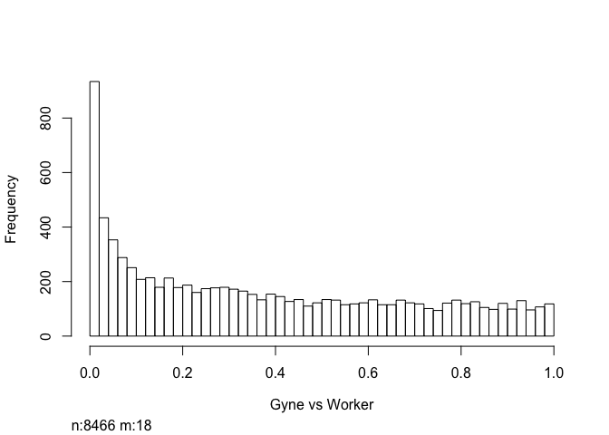

    ## [1] 11511

    ## Disp = 0.08861 , BCV = 0.2977

    ##    [,1]
    ## -1  146
    ## 0  8179
    ## 1   159

    ##    [,1]
    ## -1    6
    ## 0  8433
    ## 1    45

    ##    [,1]
    ## -1   30
    ## 0  8394
    ## 1    60

    ## class: DESeqDataSet 
    ## dim: 8484 14 
    ## metadata(1): version
    ## assays(3): counts mu cooks
    ## rownames(8484): PdomMRNA00001.1 PdomMRNA00002.1 ...
    ##   PdomMRNA11249.1 PdomMRNA11250.1
    ## rowData names(32): baseMean baseVar ... deviance maxCooks
    ## colnames(14): G1 G2 ... S3 S4
    ## colData names(3): colnames(wasps_table) Group sizeFactor

    ## [1] "Gyne vs Worker DEGS (p=0.05, uncorrected & corrected"

    ## [1] 1560
    ## [1] 362

    ## [1] "Gyne vs Stylopized DEGS (p=0.05, uncorrected & corrected"

    ## [1] 1010
    ## [1] 93

    ## [1] "Stylopized vs Worker DEGS (p=0.05, uncorrected & corrected"

    ## [1] 421
    ## [1] 35

    ## [1] 1

    ## [1] 1

    ## [1] 1

